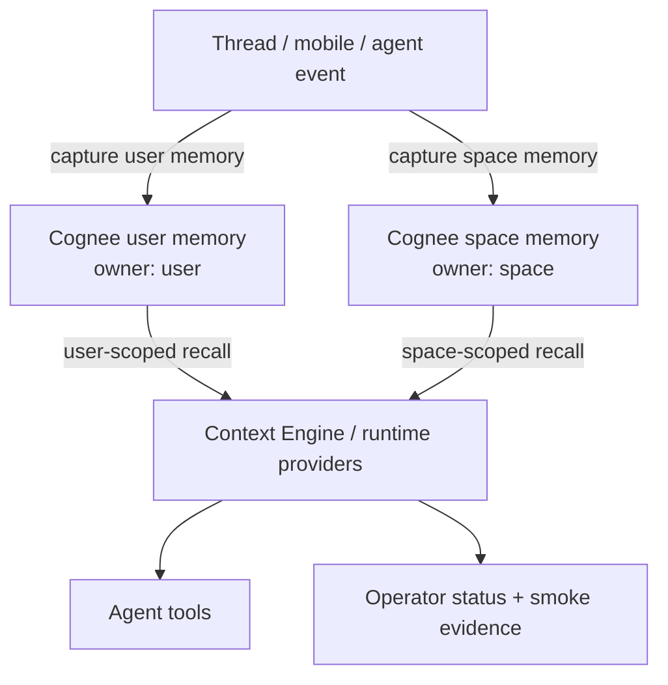

# feat: Cognee user and space memory cutover

## Overview

Narrow THNK-79 to the first useful memory proof: replace the Hindsight-backed
session memory path with Cognee-backed user memory, add explicit Cognee-backed
space memory, and prove agents can capture and retrieve both correctly.

Company-level distillation, ontology processing, and wiki rendering are split
into a follow-up effort. They remain important, but they should not be in the
first implementation slice. This pass should answer the simpler question:

Can ThinkWork use Cognee as the durable memory substrate for user-carried
memory and space-owned memory without Hindsight?

## Problem Frame

The earlier plan treated user/session memory, space memory, company
distillation, ontology, and wiki as one ladder. That is too much for the first
proof, and it muddles two different operations:

- **User memory capture:** durable memory keyed to a user. The user brings this
  memory across threads and spaces where policy allows it.
- **Space memory capture:** durable memory keyed to a space. It stays with the
  space and is available to authorized space members, independent of the user
  who helped create it.

Space memory should not be modeled primarily as "promotion from user memory."
It may be derived from a session, but the durable write should target the space
memory key/scope directly. User memory and space memory are sibling capture
targets with different ownership and authorization rules.

## Requirements Trace

Source of truth: `docs/brainstorms/2026-06-26-thnk-79-cognee-first-memory-ladder-requirements.md`,
with the 2026-06-26 scope amendment that defers company distillation,
ontology, and wiki.

- R1-R4: Cognee owns user/session and space memory for this pass.
- R5-R6: Space memory stores durable team-useful memories without exposing
  unrelated private user memory.
- R9-R10: Source trails and authorization still matter, but drilldown is only
  between session/source context, user memory, and space memory in this slice.
- R14, R17-R20: Product setup should stop requiring Hindsight for the new
  memory path, reuse the Company Brain/Cognee substrate posture, and avoid old
  Hindsight migration.

Deferred from the original requirements:

- R7-R8 and R11-R13 company-level discovery and distillation.
- R15-R16 ontology/wiki-as-projection work.
- Acceptance examples that require company distillation or wiki rendering.

## High-Level Technical Design

Cognee is the storage/capture substrate. ThinkWork owns the memory scope
contract:

| Scope        | Durable owner          | Capture target                                                        | Retrieval boundary                                               |
| ------------ | ---------------------- | --------------------------------------------------------------------- | ---------------------------------------------------------------- |
| User memory  | `tenant_id + user_id`  | Main Cognee capture/remember endpoint keyed to the user memory scope  | The user carries it across spaces, subject to tenant/user policy |
| Space memory | `tenant_id + space_id` | Separate Cognee capture/remember call keyed to the space memory scope | Authorized space members and agents working in the space         |

The implementation should avoid making space memory a downstream copy of user
memory. If a session produces both a private preference and a team-useful
decision, the system should write two appropriately scoped captures: one to
user memory and one to space memory.

## Key Technical Decisions

1. **Cognee capture is the first-class write path.** User memory and space
   memory both use Cognee capture/remember semantics with different stable
   scope keys.

2. **User and space memories are sibling scopes.** Space memory is not
   primarily a promotion from the user's memory bank. It is captured into a
   space-owned memory scope and stays with that space.

3. **Hindsight is deprecated for session memory in this pass.** Existing
   Hindsight code can remain as legacy while the Cognee path is proven, but the
   new session-memory proof should not require Hindsight retain, recall,
   observations, or bank fan-in.

4. **Company distillation and wiki are follow-up work.** Do not build company
   memory, ontology projection, or wiki materialization until user + space
   memory works end to end.

5. **Reads stay policy-bound.** Agents and UI should read through ThinkWork
   providers/Context Engine. They should not call raw Cognee endpoints directly.

## Existing Patterns To Follow

- `plugins/company-brain/src/api/cognee-client.ts`: existing Cognee client for
  `remember`, dataset graph fetch, dataset listing, and indexing waits.
- `plugins/company-brain/src/manifest.ts`: Company Brain is the product;
  Cognee is internal substrate machinery.
- `packages/api/src/lib/memory/config.ts`: current Hindsight/AgentCore memory
  engine selection that needs to stop driving the new session-memory proof.
- `packages/api/src/lib/requester-memory/hindsight-primary.ts` and
  `packages/api/src/lib/requester-memory/dreaming.ts`: existing requester
  memory writes and Hindsight sync points to replace or bypass.
- `packages/pi-extensions/src/memory.ts`: agent-facing recall/reflect tool
  semantics and proactive grounding behavior.
- `packages/api/src/lib/context-engine/providers/memory.ts`: Context Engine
  memory provider currently labeled and implemented as Hindsight memory.
- `packages/agentcore-pi/agent-container/src/runtime/providers/hindsight-memory-provider.ts`:
  host-bound provider pattern to preserve when replacing the backend.

## Implementation Units

### U1. Define user and space memory scope keys

Add a small, explicit scope contract for Cognee-backed user memory and space
memory.

**Primary files**

- `packages/api/src/lib/memory/config.ts`
- `packages/api/src/lib/memory/types.ts`
- `packages/api/src/lib/requester-memory/*`
- `plugins/company-brain/src/api/cognee-client.ts`
- `packages/database-pg/graphql/types/memory.graphql`

**Plan**

- Define stable Cognee scope key rules for:
  - tenant user memory: `tenant + user`;
  - tenant space memory: `tenant + space`.
- Include source metadata that can point back to the originating thread,
  message ids, run id, and capture reason without exposing private text across
  scopes.
- Keep naming/versioning explicit so later company distillation can consume
  these scopes without re-keying existing memory.

**Tests**

- `plugins/company-brain/test/api/cognee-client.test.ts` for scope key and
  metadata request shapes.
- `packages/api/src/lib/memory/config.test.ts` for selecting Cognee as the new
  session-memory backend.
- `packages/api/src/lib/requester-memory/*.test.ts` for source metadata
  preservation.

### U2. Implement Cognee user-memory capture and recall

Replace the new session-memory write/read path with Cognee-backed user memory.

**Primary files**

- `plugins/company-brain/src/api/cognee-client.ts`
- `packages/api/src/lib/requester-memory/hindsight-primary.ts`
- `packages/api/src/lib/requester-memory/hindsight-sync.ts`
- `packages/api/src/lib/requester-memory/dreaming.ts`
- `packages/api/src/lib/memory/recall-service.ts`
- `packages/api/src/lib/memory/adapters/hindsight-adapter.ts`
- `packages/api/src/graphql/resolvers/memory/*`

**Plan**

- Add a Cognee memory adapter or service boundary for user memory capture and
  recall.
- Route requester/session memory writes to Cognee when the Cognee memory mode
  is active.
- Keep Hindsight code as legacy/fallback only while proving the new path.
- Preserve current safety behavior: source context is reference data, not
  instructions; raw prior user text should not be injected blindly into model
  context.

**Tests**

- `packages/api/src/lib/requester-memory/hindsight-primary.test.ts` or a new
  Cognee-primary equivalent for user memory retain behavior.
- `packages/api/src/lib/requester-memory/dreaming.test.ts` for Cognee writes
  after a dream/capture pass.
- `packages/api/src/lib/memory/recall-service.test.ts` for Cognee-backed user
  recall.
- `packages/api/src/graphql/resolvers/memory/memorySearch.query.test.ts` for
  GraphQL user-memory search behavior.

### U3. Implement explicit Cognee space-memory capture and recall

Add a separate capture/read path for space-owned memory. This is not "promote
user memory"; it is a capture into the space memory scope.

**Primary files**

- `plugins/company-brain/src/api/cognee-client.ts`
- `packages/api/src/lib/context-engine/caller-scope.ts`
- `packages/api/src/lib/context-engine/providers/memory.ts`
- `packages/api/src/graphql/resolvers/memory/*`
- `packages/database-pg/graphql/types/memory.graphql`
- `apps/web/src/lib/settings-queries.ts`

**Plan**

- Add API/service support for capturing a memory with `ownerType = "space"` or
  equivalent scope semantics.
- Ensure capture requires a resolved tenant and space, and retrieval requires
  space membership or an authorized agent context.
- Support session-derived space captures: the source can be a thread/session,
  but the durable owner is the space.
- Keep user memory and space memory separate in recall results so agents know
  whether a fact follows the user or belongs to the current space.

**Tests**

- New resolver/service tests for space capture authorization and space recall.
- `packages/api/src/lib/context-engine/__tests__/caller-scope.test.ts` for
  deriving space scope from thread context.
- `packages/api/src/lib/context-engine/providers/memory.test.ts` for returning
  user and space memory hits with distinct provenance.
- `plugins/company-brain/test/api/cognee-client.test.ts` for space-scope
  capture/read request shapes.

### U4. Update runtime memory providers and tool semantics

Make agents use Cognee-backed user + space memory without giving the model raw
backend controls.

**Primary files**

- `packages/pi-extensions/src/memory.ts`
- `packages/pi-extensions/src/context-engine.ts`
- `packages/agentcore-pi/agent-container/src/runtime/providers/hindsight-memory-provider.ts`
- `packages/agentcore-pi/agent-container/src/tools/memory.ts`
- `packages/agentcore-pi/agent-container/src/tools/hindsight.ts`
- `packages/pi-runtime-core/src/*`

**Plan**

- Introduce or rename the host provider so the runtime no longer treats
  Hindsight as the session-memory provider in Cognee mode.
- Update recall/reflect descriptions to distinguish:
  - user memory: follows the user;
  - space memory: belongs to the current space.
- Keep tenant/user/space identity closed over by the host/provider. Do not let
  model params choose arbitrary owners.
- Preserve best-effort grounding behavior with tight timeouts and explicit
  degradation when memory is unavailable.

**Tests**

- `packages/agentcore-pi/agent-container/tests/memory.test.ts` for tool
  descriptions, grounding behavior, and user/space distinction.
- `packages/agentcore-pi/agent-container/tests/hindsight-memory-provider.test.ts`
  for legacy-only behavior or replacement provider coverage.
- Extension/provider tests for identity-free tool params.

### U5. Add operator status and minimal UI affordances

Expose enough status for operators to know Cognee user + space memory is
enabled and healthy, without building ontology/wiki screens.

**Primary files**

- `apps/web/src/components/settings/SettingsMemoryHome.tsx`
- `apps/web/src/components/settings/SettingsMemory.tsx`
- `apps/web/src/components/settings/plugins/PluginDetail.tsx`
- `apps/web/src/components/settings/brain/BrainOperationsPage.tsx`
- `packages/api/src/graphql/resolvers/memory/memorySystemConfig.query.ts`
- `docs/src/content/docs/applications/admin/memory.mdx`

**Plan**

- Show Cognee-backed memory mode and basic health/status.
- Mark Hindsight session memory as legacy when Cognee mode is active.
- Avoid presenting company distillation, ontology, or wiki as complete in this
  pass.
- Keep Cognee implementation details in operator evidence rather than
  customer-facing setup copy.

**Tests**

- `apps/web/src/components/settings/SettingsMemoryHome.test.tsx`
- `apps/web/src/components/settings/SettingsMemory.test.tsx`
- `apps/web/src/components/settings/plugins/PluginDetail.test.tsx`
- `packages/api/src/graphql/resolvers/memory/memorySystemConfig.query.test.ts`

### U6. Prove the cutover with deployed smoke coverage

Prove the user + space memory flow through ThinkWork APIs and runtime surfaces.

**Primary files**

- `plugins/company-brain/smoke/company-brain-context-engine-smoke.mjs`
- `plugins/company-brain/smoke/company-brain-operations-smoke.mjs`
- `plugins/company-brain/smoke/cognee-managed-app-smoke.mjs`
- `docs/runbooks/brain-v0-dogfood.md`

**Plan**

- Smoke: capture user memory in one space, recall it for the same user in a
  different space where allowed.
- Smoke: capture space memory, recall it for another authorized member in that
  space.
- Smoke: verify unauthorized users cannot read space memory.
- Smoke: verify Hindsight is not required for the new session-memory path.
- Capture evidence through deployed ThinkWork APIs/runtime paths, not direct
  Cognee browser calls.

**Tests**

- Smoke scripts above.
- Browser verification for the minimal settings/status surfaces in U5.
- Unit/resolver/runtime tests from U1-U4.

## Sequencing

1. U1: define scope keys and metadata.
2. U2: implement Cognee user-memory capture/recall.
3. U3: implement Cognee space-memory capture/recall.
4. U4: update runtime providers/tools.
5. U5: add minimal operator status/copy.
6. U6: prove the deployed path.

## Verification Strategy

The first proof is complete when these scenarios pass:

- User memory capture writes to a Cognee user scope and can be recalled by that
  user later.
- User memory follows the user across spaces where policy allows it.
- Space memory capture writes to a Cognee space scope and stays with the space.
- Another authorized space member can recall space memory.
- An unauthorized user cannot recall space memory.
- New session-memory acceptance does not require Hindsight.
- UI/status surfaces do not claim company distillation, ontology, or wiki are
  implemented.

## Follow-Up: Company Distillation, Ontology, And Wiki

Create a separate follow-up plan for the next phase:

- distill space memories into company-level Brain memory;
- decide how ontology constrains or interprets Cognee-backed memory;
- render wiki pages from company/space memory projections;
- define company-first search and drilldown semantics.

That follow-up should start from working user + space Cognee memory rather than
trying to design all memory layers at once.

## Deferred / Out Of Scope For This Pass

- Company-level distillation from space memory.
- Ontology processing over Cognee-backed memory.
- Wiki rendering or rich wiki editing.
- Migration of old Hindsight memory into Cognee.
- Formal Cognee/Hindsight/MemPalace benchmark shootout.
- Multi-backend customer settings where users choose Hindsight vs Cognee.
- External-system writeback from memory into CRM, ERP, Slack, or other systems.

## Open Questions Deferred To Implementation

- What exact Cognee capture fields should represent user scope vs space scope:
  `datasetName`, `datasetId`, `session_id`, `node_set`, or a combination?
- Should the public API expose explicit user/space capture mutations, or keep a
  single capture mutation with an owner/scope field?
- How much of Hindsight-backed `recall`/`reflect` remains available as legacy
  personal memory while Cognee mode is dogfooded?
- Which space identity should be used when a thread is not currently attached
  to a space?

## Sources & References

- `docs/brainstorms/2026-06-26-thnk-79-cognee-first-memory-ladder-requirements.md`
- `plugins/company-brain/src/api/cognee-client.ts`
- `packages/api/src/lib/memory/config.ts`
- `packages/api/src/lib/requester-memory/hindsight-primary.ts`
- `packages/api/src/lib/requester-memory/dreaming.ts`
- `packages/api/src/lib/context-engine/providers/memory.ts`
- `packages/pi-extensions/src/memory.ts`
- `packages/agentcore-pi/agent-container/src/runtime/providers/hindsight-memory-provider.ts`
- [Cognee Remember](https://docs.cognee.ai/core-concepts/main-operations/remember)
- [Cognee Architecture](https://docs.cognee.ai/core-concepts/architecture)
