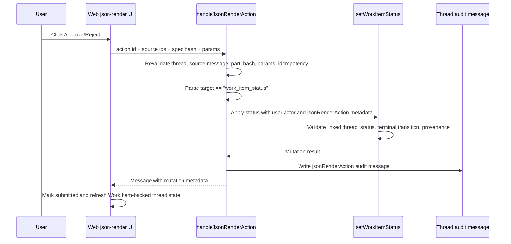

# feat: Route json-render actions to Work Item status updates

## Overview

THNK-81 adds the first bounded first-party mutation behind Thread
`data-json-render` durable actions: a generated UI approval/reject button can
update a linked Work Item status directly. The implementation must keep the
existing `ask_user_question` path intact for blocking conversational approvals,
and must not turn generated UI into arbitrary callbacks, URLs, browser effects,
or agent tool dispatch.

The plan uses the existing Work Item status tool service as the mutation path
because it already enforces linked-thread context, user/agent provenance,
terminal-transition rules, Work Item event history, linked-task compatibility,
and customer-onboarding progress refresh behavior.

---

## Problem Frame

The current generated UI action handler validates source `data-json-render`
parts and records a normal Thread message with `jsonRenderAction` metadata, but
it does not mutate durable product state. THNK-81 should add a narrow adapter
for `target: "work_item_status"` so inline approval surfaces can immediately
update Work Items. Separately, `ask_user_question` remains the blocking
question primitive where the agent pauses, receives the answer, resumes, and
then updates the Work Item through its existing tool path (see origin:
`docs/brainstorms/2026-06-26-thnk-81-json-render-work-item-actions-requirements.md`).

---

## Requirements Trace

- R1. Blocking approval/deny questions continue to use `ask_user_question`.
- R2. A HITL answer allows the resumed agent to update the referenced Work Item.
- R3. HITL history remains visible in the Thread.
- R4. HITL Work Item status changes preserve Work Item event history.
- R5. Generated UI actions do not replace the blocking question primitive.
- R6. Generated UI durable actions perform mutations only through recognized
  adapter targets; v1 is Work Item status update.
- R7. Work Item actions identify the Work Item and desired status through the
  existing Work Item status model.
- R8. Approve/reject labels do not globally hardcode status outcomes; the
  descriptor carries the actual status category or status id.
- R9. Existing generated UI source validation remains intact.
- R10. Unknown targets, invalid params, stale source parts, invalid specs,
  disabled actions, and tampered params fail closed with no mutation.
- R11. Successful generated UI actions still write a Thread audit message with
  `jsonRenderAction` metadata and useful mutation result metadata.
- R12. Generated UI actions do not dispatch arbitrary agent tools, callbacks,
  browser URLs, or free-form server execution.
- R13. Agent/runtime guidance makes durable action descriptor completeness
  explicit for actionable approval UI.
- R14. Display-only generated UI remains valid without durable actions.

**Origin actors:** A1 end user, A2 Thread agent, A3 Web Thread renderer, A4
ThinkWork platform, A5 planner/implementer.

**Origin flows:** F1 blocking HITL approval updates a Work Item, F2 generated UI
action updates a Work Item immediately, F3 display-only generated UI remains
non-mutating.

**Origin acceptance examples:** AE1 HITL approve path, AE2 generated UI approve
path, AE3 reject/tamper path, AE4 unknown callback rejection, AE5 descriptor
completeness.

---

## Scope Boundaries

- Do not collapse generated UI actions and `ask_user_question`.
- Do not add arbitrary callback URLs, browser-side effect authority, free-form
  tool execution, or generic server execution to generated UI.
- Do not create a general first-party mutation bus beyond the Work Item status
  adapter.
- Do not require every `data-json-render` part to be actionable.
- Do not redesign Work Item statuses or add new global status categories.
- Do not require mobile-native json-render action support in this issue; mobile
  can remain fallback/display-oriented.
- Do not rely on an agent wakeup for the recognized Work Item status adapter.
  The click itself performs the bounded mutation and records audit.

---

## Context & Research

### Relevant Code and Patterns

- `packages/api/src/graphql/resolvers/messages/handleJsonRenderAction.mutation.ts`
  already performs requester auth, thread visibility, assistant source message
  checks, source part lookup, `data-json-render` validation, spec hash checks,
  param equality, disabled-action rejection, idempotent message replay, and rate
  limiting.
- `packages/api/src/graphql/resolvers/messages/handleJsonRenderAction.test.ts`
  has the existing mutation contract tests and is the right place to add
  generated UI action adapter coverage.
- `packages/api/src/lib/work-items/work-item-status-tool.ts` is the stronger
  Work Item status mutation path. It validates linked thread context, records
  actor-specific provenance, rejects invalid terminal transitions, writes
  `work_item_events`, syncs linked-task compatibility, and refreshes the
  customer-onboarding goal folder.
- `packages/api/src/graphql/resolvers/work-items/updateWorkItemStatus.mutation.ts`
  is a thin GraphQL wrapper over `work-item-service.ts`; useful as prior art but
  too thin for this adapter because it does not enforce the thread-link and
  terminal-transition behavior already present in the status tool service.
- `packages/thread-json-render/src/spec.ts`,
  `packages/thread-json-render/src/actions.ts`, and
  `packages/thread-json-render/src/validation.ts` define generic durable action
  descriptors with primitive params. Keep this layer generic; enforce the
  Work Item adapter target in API code.
- `packages/pi-runtime-core/src/json-render-runtime.ts` exposes the
  `emit_json_render_ui` tool and currently describes durable actions only
  generally.
- `packages/pi-extensions/src/system-prompt-compose.ts` injects the generated UI
  policy block when `emit_json_render_ui` is available; that is the right place
  to tell agents that approval UI needs matching component action references
  and `durableActions`.
- `apps/web/src/components/workbench/json-render/ThreadJsonRenderRenderer.tsx`
  renders action-capable domain components and delegates clicks to
  `use-json-render-action.ts`.
- `apps/web/src/components/workbench/render-typed-part.tsx` is the shared
  renderer entry point used by Thread surfaces, so it is the best propagation
  point for an optional action-complete callback.
- `apps/web/src/components/workbench/SpacesThreadDetailRoute.tsx` already
  reexecutes Work Item queries after direct progress mutations; generated UI
  actions should reuse that refresh posture because urql's document cache does
  not auto-invalidate Work Item list queries.

### Institutional Learnings

- `docs/solutions/design-patterns/audit-existing-ui-and-data-model-before-parallel-build-2026-04-28.md`
  reinforces reusing the existing status/audit substrate instead of building a
  parallel approval surface. THNK-81 should bridge into Work Items rather than
  inventing a generated-UI-specific state store.
- `docs/solutions/runtime-errors/ask-user-question-tool-missing-during-deploy-roll-2026-06-11.md`
  and
  `docs/solutions/architecture-patterns/wakeup-processor-payload-parity-with-chat-agent-invoke-2026-06-12.md`
  show that HITL tool availability must be verified on resumed/wakeup paths.
  THNK-81 should prove the HITL path separately from generated UI actions.
- `docs/solutions/architecture-patterns/external-workflow-agent-step-bridges-need-resumable-ledgers-2026-06-21.md`
  warns that idempotency must cover all side effects, not just the visible row.
  The generated UI adapter must avoid the partial-failure case where a Work Item
  event is written but the Thread audit message fails and a retry mutates again.

### External References

- Not used. Local code already contains direct patterns for GraphQL resolver
  validation, Work Item status mutation, generated UI runtime policy, and web
  query refresh behavior.

---

## Key Technical Decisions

- Use `setWorkItemStatus` for the generated UI adapter rather than the thin
  GraphQL `updateWorkItemStatus` resolver. This keeps linked-thread validation,
  user provenance, terminal-transition checks, linked-task compatibility, and
  progress refresh in one existing domain path.
- Keep the shared json-render durable action descriptor generic. The shared
  validator should continue to require primitive params and safe component
  specs; the API adapter owns target-specific validation for
  `target: "work_item_status"`.
- Make Work Item mutation idempotency independent from Thread audit-message
  idempotency. The adapter should record the action idempotency key in Work
  Item event metadata and detect existing action events before reapplying the
  mutation.
- For recognized Work Item status actions, record an audit Thread message
  without requesting an arbitrary agent continuation. Agent follow-up can be a
  future explicit adapter capability, not an implicit side effect of a button
  click.
- Keep approve/reject status outcomes descriptor-driven. The adapter accepts
  `statusCategory` or `statusId`; button kind and label shape the UI but do not
  decide status by themselves.

---

## Open Questions

### Resolved During Planning

- Adapter target path: Use `setWorkItemStatus` because it has stronger domain
  invariants than `updateWorkItemStatus`.
- Adapter contract location: Enforce target-specific params in API code while
  leaving `@thinkwork/thread-json-render` generic.
- Idempotency strategy: Add Work Item event-level idempotency detection so a
  retry after partial failure can repair a missing Thread audit message without
  mutating the Work Item again.

### Deferred to Implementation

- Exact helper names and extraction boundaries in the messages resolver are
  deferred; keep the helper small and colocated unless implementation pressure
  justifies a separate file.
- Exact live deployed test Work Item/thread ids are execution-time evidence and
  should be recorded in THNK-81 or an autopilot status doc during verification.

---

## High-Level Technical Design

> *This illustrates the intended approach and is directional guidance for
> review, not implementation specification. The implementing agent should treat
> it as context, not code to reproduce.*

Partial-failure recovery: if a retry finds a matching Work Item event
idempotency key but no Thread audit message, it should skip the Work Item
mutation and write or return the audit message. If it finds the Thread audit
message, it returns that existing message and does not touch the Work Item.

---

## Implementation Units

- U1. **Add the Work Item status adapter and mutation idempotency guard**

**Goal:** Parse `target: "work_item_status"` durable action params, route them
through `setWorkItemStatus`, and protect the Work Item mutation from duplicate
application across retries.

**Requirements:** R6, R7, R8, R10, R11, R12; F2; AE2, AE3, AE4.

**Dependencies:** None.

**Files:**
- Modify: `packages/api/src/graphql/resolvers/messages/handleJsonRenderAction.mutation.ts`
- Modify: `packages/api/src/graphql/resolvers/messages/handleJsonRenderAction.test.ts`
- Reference: `packages/api/src/lib/work-items/work-item-status-tool.ts`
- Reference: `packages/api/src/lib/work-items/work-item-status-tool.test.ts`

**Approach:**
- Add a narrow parser for durable action params:
  - `target` must be exactly `work_item_status`.
  - `workItemId` is required.
  - `statusCategory` or `statusId` is required; `statusCategory` may arrive in
    GraphQL-style uppercase or tool-service lowercase and should be passed
    through the existing status normalizer path.
  - `note` is optional and should be trimmed by the existing service.
- Keep unknown `target` values and missing required fields as `BAD_USER_INPUT`
  failures before mutation.
- Call `setWorkItemStatus` with actor `{ type: "user", id: caller.userId }`,
  the source `threadId`, and metadata containing the generated UI action
  provenance: source message id, part id, action id, action kind, spec hash, and
  idempotency key.
- Preserve existing generated UI validation order. Source, hash, params,
  disabled-action, duplicate-message, and rate-limit checks should still happen
  before any mutation.
- Add a Work Item event idempotency lookup keyed by tenant, work item id, and
  stored generated UI idempotency metadata. If present, treat the mutation as
  already applied and continue to audit-message repair rather than calling
  `setWorkItemStatus` again.
- Map `TaskStatusToolError` and `GraphQLError` from the Work Item path into
  GraphQL errors that preserve user-facing failure semantics and do not leak
  internal metadata.

**Execution note:** Implement adapter behavior test-first in
`handleJsonRenderAction.test.ts`, especially idempotency and failure paths.

**Patterns to follow:**
- Existing source validation and duplicate-message checks in
  `handleJsonRenderAction.mutation.ts`.
- User/agent provenance, linked-thread enforcement, and event metadata in
  `work-item-status-tool.ts`.
- Idempotency-side-effect guidance from
  `docs/solutions/architecture-patterns/external-workflow-agent-step-bridges-need-resumable-ledgers-2026-06-21.md`.

**Test scenarios:**
- Happy path / Covers AE2: a valid `target: "work_item_status"` approve action
  with `statusCategory: "DONE"` calls the Work Item status path once, writes an
  event with generated UI idempotency metadata, and returns a Thread audit
  message whose metadata includes mutation result facts.
- Happy path / Covers AE3: a reject action with `statusCategory: "BLOCKED"`
  routes through the same adapter and produces a blocked Work Item result.
- Edge case: `statusId` wins when both `statusId` and `statusCategory` are
  present, matching the existing Work Item status tool semantics.
- Edge case: a duplicate Thread audit message found before mutation returns the
  existing message and does not call `setWorkItemStatus`.
- Edge case: a matching prior Work Item event exists but no Thread audit message
  exists; the handler writes/returns the missing audit message and does not
  mutate the Work Item again.
- Error path / Covers AE4: unknown target, missing `workItemId`, missing status,
  invalid status, unlinked thread/work item, or terminal-transition rejection
  returns a GraphQL failure and leaves `sendMessage` uncalled.
- Error path / Covers AE3: submitted params that differ from the persisted
  durable action descriptor fail before mutation.

**Verification:**
- Generated UI Work Item status updates are idempotent across repeated clicks
  and across retry-after-partial-failure scenarios.
- All pre-existing `handleJsonRenderAction` validation tests still pass.

---

- U2. **Integrate action audit metadata without implicit agent execution**

**Goal:** Preserve Thread audit history for generated UI actions while ensuring
recognized Work Item status actions do not wake an agent for arbitrary follow-up
execution.

**Requirements:** R9, R11, R12; F2; AE2, AE4.

**Dependencies:** U1.

**Files:**
- Modify: `packages/api/src/graphql/resolvers/messages/handleJsonRenderAction.mutation.ts`
- Modify: `packages/api/src/graphql/resolvers/messages/handleJsonRenderAction.test.ts`
- Reference: `packages/api/src/graphql/resolvers/messages/sendMessage.mutation.ts`
- Reference: `packages/database-pg/graphql/types/messages.graphql`

**Approach:**
- Keep the mutation return type as `Message` so the web hook and existing
  GraphQL contract remain stable.
- Continue storing `metadata.jsonRenderAction` with source ids, action kind,
  label, params, spec hash, idempotency key, schema version, and catalog
  version.
- Add bounded mutation result metadata under the existing `jsonRenderAction`
  envelope, such as `mutation.target`, `mutation.workItemId`,
  `mutation.statusCategory`, `mutation.statusId`, and an `alreadyApplied` flag
  for event-idempotency repair.
- For recognized Work Item status actions, do not set `agentRequested: true`.
  The audit message is a record of the user's click and the mutation result, not
  an open-ended request for the agent to continue.
- Keep display-only generated UI unaffected: a part with no durable actions
  renders as read-only/disabled and never reaches this mutation handler.

**Patterns to follow:**
- Existing metadata envelope in `handleJsonRenderAction.mutation.ts`.
- Existing `SendMessageMutation` selection in `apps/web/src/lib/graphql-queries.ts`.

**Test scenarios:**
- Happy path: successful Work Item action sends exactly one audit message whose
  `jsonRenderAction.mutation` metadata has no secret-bearing fields.
- Edge case: idempotent replay returns the existing audit message with the same
  idempotency key.
- Error path: Work Item adapter failures do not create an audit message that
  looks successful.
- Integration: recognized Work Item status action messages are not marked as
  arbitrary agent-requested turns.

**Verification:**
- Thread history records generated UI action clicks and mutation outcomes
  without scheduling an unconstrained agent continuation.

---

- U3. **Update generated UI contract fixtures and runtime guidance**

**Goal:** Teach the runtime and tests that actionable approval UI requires both
component action references and matching durable action descriptors with bounded
Work Item target params.

**Requirements:** R8, R13, R14; F3; AE5.

**Dependencies:** U1.

**Files:**
- Modify: `packages/thread-json-render/src/test-fixtures.ts`
- Modify: `packages/thread-json-render/src/validation.test.ts`
- Modify: `packages/thread-json-render/src/actions.test.ts`
- Modify: `apps/web/src/components/workbench/json-render/fixtures.ts`
- Modify: `apps/web/src/components/workbench/json-render/validation.test.ts`
- Modify: `packages/pi-runtime-core/src/json-render-runtime.ts`
- Modify: `packages/pi-runtime-core/test/json-render-runtime.test.ts`
- Modify: `packages/pi-extensions/src/system-prompt-compose.ts`
- Modify: `packages/pi-extensions/test/system-prompt.test.ts`

**Approach:**
- Update task review/action-form fixtures to use descriptor params that exercise
  the Work Item target contract: `target: "work_item_status"`, `workItemId`,
  `statusCategory` or `statusId`, and optional `note`.
- Keep the shared json-render validator target-agnostic. It should still reject
  non-primitive params and unsafe specs, but it should not know every future
  first-party adapter target.
- Strengthen the `emit_json_render_ui` tool description and runtime prompt
  guidance:
  - Approval UI using `task.review.primaryActionId` or
    `form.action.submitActionId` must include a matching `durableActions`
    descriptor.
  - Work Item approval actions should use the bounded Work Item status target
    params.
  - Display-only generated UI can omit durable actions.
- Add tests that the policy block includes descriptor completeness guidance
  only when `emit_json_render_ui` is available.

**Patterns to follow:**
- Existing `ask_user_question` and generated UI policy tests in
  `packages/pi-extensions/test/system-prompt.test.ts`.
- Existing runtime tool validation tests in
  `packages/pi-runtime-core/test/json-render-runtime.test.ts`.

**Test scenarios:**
- Happy path / Covers AE5: a task review fixture with `primaryActionId` and a
  matching Work Item status durable action validates and produces the expected
  action input.
- Edge case / Covers R14: a display-only primitive or analytics fixture with no
  durable actions still validates.
- Error path: durable action params with nested objects still fail shared
  validation before they can reach the API adapter.
- Policy: generated UI runtime guidance explicitly mentions matching action
  references and `durableActions` descriptors for approval UI.

**Verification:**
- Natural prompts asking for Work Item approval UI have prompt-level guidance
  and checked-in fixtures that make descriptor completeness the expected shape.

---

- U4. **Refresh Work Item-backed web state after generated UI actions**

**Goal:** Ensure clicking a generated UI Work Item action visibly updates the
Thread/Work Item surface without requiring manual refresh.

**Requirements:** R3, R4, R11; F2; AE2, AE3.

**Dependencies:** U1, U2.

**Files:**
- Modify: `apps/web/src/components/workbench/json-render/use-json-render-action.ts`
- Modify: `apps/web/src/components/workbench/json-render/ThreadJsonRenderRenderer.tsx`
- Modify: `apps/web/src/components/workbench/json-render/ThreadJsonRenderRenderer.test.tsx`
- Modify: `apps/web/src/components/workbench/render-typed-part.tsx`
- Modify: `apps/web/src/components/workbench/render-typed-part.test.tsx`
- Modify: `apps/web/src/components/workbench/SpacesThreadDetailRoute.tsx`
- Modify: `apps/web/src/components/workbench/SpacesThreadDetailRoute.test.tsx`
- Review: `apps/web/src/components/workbench/TaskThreadView.tsx`
- Review: `apps/web/src/components/spaces/ThreadConversation.tsx`

**Approach:**
- Let `useJsonRenderAction` surface the returned audit message or invoke an
  optional success callback after the mutation succeeds.
- Thread the callback through `ThreadJsonRenderRenderer` and
  `renderTypedParts` as an optional prop. Keep default behavior unchanged for
  surfaces that do not need to refresh Work Items.
- In `SpacesThreadDetailRoute.tsx`, detect successful
  `jsonRenderAction.mutation.target === "work_item_status"` results and
  reexecute Work Item-backed queries with `requestPolicy: "network-only"`.
  This follows existing local comments that urql's document cache does not
  invalidate cross-operation automatically.
- Keep action button status behavior unchanged: submitted actions remain
  disabled through the local status map.

**Patterns to follow:**
- Existing explicit `reexecuteWorkItemsQuery({ requestPolicy: "network-only" })`
  calls after direct Work Item mutations in `SpacesThreadDetailRoute.tsx`.
- Existing json-render action submission test in
  `ThreadJsonRenderRenderer.test.tsx`.

**Test scenarios:**
- Happy path: a successful generated UI Work Item action invokes the success
  callback with returned message metadata and marks the button submitted.
- Integration / Covers AE2: `SpacesThreadDetailRoute` receives a Work Item
  generated UI action result and reexecutes Work Item data so progress rows can
  reflect the new status.
- Edge case: a generated UI action without Work Item mutation metadata does not
  trigger Work Item refetches.
- Error path: failed action submissions render the existing per-button error and
  do not trigger Work Item refetch.

**Verification:**
- After a successful generated UI Work Item action, the Thread detail route can
  refresh Work Item-backed progress state without manual reload.

---

- U5. **Prove both approval paths end to end and close the planning loop**

**Goal:** Produce evidence that `ask_user_question` and generated UI actions are
both valid, distinct Work Item approval paths.

**Requirements:** R1, R2, R3, R4, R5, R6, R7, R8, R11, R13; F1, F2; AE1, AE2,
AE3.

**Dependencies:** U1, U2, U3, U4.

**Files:**
- Create: `docs/plans/autopilot/THNK-81-status.md`
- Review: `docs/plans/autopilot/THNK-78-status.md`
- Review: `packages/api/src/handlers/wakeup-processor.system-prompt.test.ts`
- Review: `packages/api/src/graphql/resolvers/messages/answerUserQuestion.mutation.test.ts`
- Review: `apps/web/src/components/workbench/UserQuestionCard.test.tsx`

**Approach:**
- Add or update a status/evidence document for THNK-81 that records the test
  Work Item, Thread, generated UI source message, action result, and HITL
  question flow evidence.
- For the HITL path, verify the agent uses `ask_user_question`, the user answers
  through the question card, the resumed agent updates the linked Work Item via
  `set_work_item_status`, and Thread/Work Item history both show the decision.
- For the generated UI path, verify a persisted `data-json-render` part with a
  `task.review` or `form.action` component and matching durable action
  descriptor updates the Work Item immediately on click.
- Re-check the ask-user-question dispatch-parity lesson: the HITL proof must
  cover the resumed turn, not just the initial question card.
- Comment final evidence back to THNK-81 and leave the issue in Verification or
  Review until human review confirms it is ready to close.

**Patterns to follow:**
- Evidence style in `docs/plans/autopilot/THNK-78-status.md`.
- Ask-user-question verification warnings in
  `docs/solutions/runtime-errors/ask-user-question-tool-missing-during-deploy-roll-2026-06-11.md`
  and
  `docs/solutions/architecture-patterns/wakeup-processor-payload-parity-with-chat-agent-invoke-2026-06-12.md`.

**Test scenarios:**
- Test expectation: none for the status document itself; automated coverage is
  owned by U1-U4. U5 requires live/manual evidence because the acceptance
  criteria involve deployed Thread, Work Item, and agent-resume behavior.

**Verification:**
- THNK-81 has recorded evidence for both approval paths, including Work Item
  status/event history and Thread history.
- The generated UI path can update approve and reject outcomes without agent
  wakeup or arbitrary execution.
- The HITL path still parks and resumes the agent through `ask_user_question`.

---

## System-Wide Impact

- **Interaction graph:** Web generated UI action buttons call GraphQL
  `handleJsonRenderAction`, which validates persisted Thread parts, optionally
  routes to Work Item status mutation, writes Thread audit messages, and returns
  the audit message to the web renderer.
- **Error propagation:** Generated UI source/param failures remain GraphQL
  `BAD_USER_INPUT` or existing conflict/rate-limit errors. Work Item domain
  errors are mapped to GraphQL failures without creating successful audit
  messages.
- **State lifecycle risks:** The high-risk lifecycle is partial success:
  Work Item mutated but audit message failed. U1 handles this with Work Item
  event idempotency and audit-message repair.
- **API surface parity:** The GraphQL mutation shape can remain stable; generated
  clients may need refresh only if selection sets or generated types change.
- **Integration coverage:** Unit tests cover resolver and web wiring, but live
  proof must verify deployed agent `ask_user_question` resume and generated UI
  click behavior.
- **Unchanged invariants:** `ask_user_question` remains the blocking HITL path,
  display-only generated UI remains valid, mobile fallback remains
  display-oriented, and json-render shared validation remains generic.

---

## Risks & Dependencies

| Risk | Mitigation |
|------|------------|
| Duplicate Work Item events on repeated clicks or retry-after-partial-failure | Store and check generated UI idempotency metadata on Work Item events before mutating; repair missing audit messages separately. |
| Generated UI action accidentally wakes an agent for arbitrary follow-up | For recognized Work Item status target, record an audit message without `agentRequested: true`; reject unknown targets. |
| Adapter bypasses Work Item authorization or thread linkage | Use `setWorkItemStatus` with user actor and source thread id instead of the thinner GraphQL resolver wrapper. |
| Agent keeps emitting display-only approval cards | Strengthen runtime/tool guidance and fixtures so actionable approval UI requires matching component action ids and durable descriptors. |
| Web UI shows submitted button but stale progress rows | Add action-success callback/refetch wiring for Work Item mutation metadata on the Thread detail route. |
| HITL path appears green on initial ask but fails on resume | Follow wakeup dispatch-parity guidance and verify the resumed `question_answer` path updates the Work Item. |

---

## Documentation / Operational Notes

- Save this plan as a Linear document on THNK-81 during handoff.
- Move THNK-81 to Plan Review after the plan document and comment are attached.
- During execution, keep THNK-81 updated at material gates per repo guidance:
  plan accepted, implementation started, PR opened, verification passed,
  blockers found, and final evidence captured.
- After implementation, record deployed proof in
  `docs/plans/autopilot/THNK-81-status.md` or an equivalent Linear comment.

---

## Sources & References

- **Origin document:** [docs/brainstorms/2026-06-26-thnk-81-json-render-work-item-actions-requirements.md](../brainstorms/2026-06-26-thnk-81-json-render-work-item-actions-requirements.md)
- Linear issue: THNK-81.
- Linear document: Brainstorm Summary: json-render Work Item status actions.
- Related status evidence: `docs/plans/autopilot/THNK-78-status.md`
- Related requirements:
  `docs/brainstorms/2026-06-26-thnk-77-json-render-shadcn-foundation-requirements.md`
- Related requirements:
  `docs/brainstorms/2026-06-09-ask-user-question-requirements.md`
- Related requirements:
  `docs/brainstorms/2026-06-25-thread-work-items-requirements.md`
- Related code:
  `packages/api/src/graphql/resolvers/messages/handleJsonRenderAction.mutation.ts`
- Related code:
  `packages/api/src/lib/work-items/work-item-status-tool.ts`
- Related code:
  `apps/web/src/components/workbench/json-render/ThreadJsonRenderRenderer.tsx`
- Related learning:
  `docs/solutions/design-patterns/audit-existing-ui-and-data-model-before-parallel-build-2026-04-28.md`
- Related learning:
  `docs/solutions/architecture-patterns/external-workflow-agent-step-bridges-need-resumable-ledgers-2026-06-21.md`
- Related learning:
  `docs/solutions/architecture-patterns/wakeup-processor-payload-parity-with-chat-agent-invoke-2026-06-12.md`
