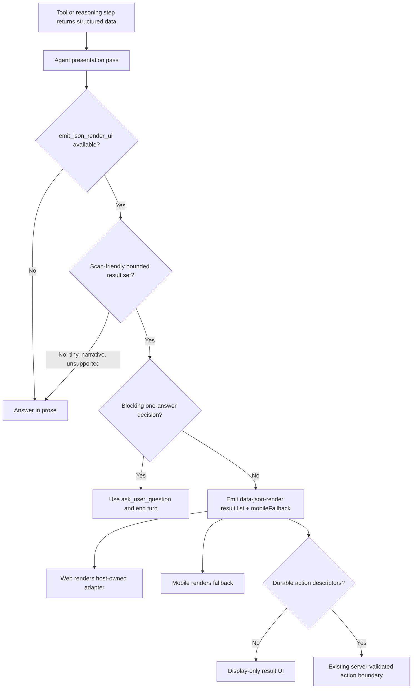

# feat: Structured result json-render presentation

## Overview

THNK-82 makes generated Thread UI a deliberate presentation habit for structured
results. Agents that have `emit_json_render_ui` available should inspect the
shape of a result before final response and prefer a bounded json-render view
when it is easier to scan than prose or markdown.

The implementation should not become a prose-to-UI transformer or a broad
report-builder. It should add a small, reusable result presentation lane:
runtime prompt policy teaches the presentation pass, the shared catalog exposes
a bounded `result.list` domain component for v1 result sets, web renders that
component with host-owned UI, and mobile continues to read the required
fallback from the same `data-json-render` part.

---

## Problem Frame

THNK-77 established `data-json-render` as the Thread generated-UI carrier.
THNK-78 established explicit runtime emission through `emit_json_render_ui`.
THNK-81 established the durable action boundary. THNK-82 is the next behavioral
layer: agents should stop flattening clearly structured result sets into
mediocre markdown when the allowed json-render catalog can express them better
(see origin:
`docs/brainstorms/2026-06-26-thnk-82-structured-result-json-render-requirements.md`).

The v1 product examples are Work Items / Linear-like issues, agent-authored
user-question collections, and approval/review queues. True blocking questions
must still use `ask_user_question` and end the turn; json-render is for
non-blocking question sets, answered-question summaries, and reviewable
collections.

---

## Requirements Trace

- R1. Agents with `emit_json_render_ui` available run a presentation pass before
  final response when the answer contains structured results.
- R2. Agents prefer generated UI for scan-friendly homogeneous lists,
  table-like rows, statuses, checklists, comparisons, timelines, Work Item
  sets, and review queues.
- R3. Work Items and Linear-like issue lists are a v1 must-cover result shape.
- R4. Agent-authored user questions are a v1 must-cover shape, without
  replacing blocking `ask_user_question`.
- R5. Approval and review queues are a v1 must-cover shape. Display-only queues
  are valid; actionable queues stay inside the durable action boundary.
- R6. Generated UI actions remain bounded to recognized host-validated action
  descriptors and never arbitrary callbacks, browser effects, URLs, scripts,
  imports, or tool execution.
- R7. Prose remains the fallback for narrative, tiny, unsupported, open-ended,
  or clearer-as-text answers.
- R8. Agents call `emit_json_render_ui` for generated UI and do not write UI
  JSON in markdown fences, prose, legacy `_type`, or other untrusted text.
- R9. Every generated result UI includes useful mobile fallback content.
- R10. The platform provides reusable guidance for structured result
  presentation and prose fallback.
- R11. Guidance includes Work Items, agent questions, approval/review queues,
  and supporting examples such as deployment evidence, evaluation runs,
  connector records, and search results.
- R12. Runtime/prompt tests cover positive generated-UI selection and prose
  fallback selection.
- R13. Planning verifies catalog fit for Work Item lists, question sets, and
  approval/review queues.
- R14. If current catalog support is awkward, add only bounded components or
  domain compositions for common result presentations.
- R15. Do not add arbitrary React, CSS, callbacks, imports, scripts, remote
  fetches, or tenant-authored runtime components.

**Origin actors:** A1 end user, A2 ThinkWork agent, A3 host runtime, A4 web
Thread renderer, A5 mobile or unsupported client, A6 planner/implementer.

**Origin flows:** F1 present a Work Item result set, F2 present agent questions
without replacing blocking HITL, F3 present an approval or review queue.

**Origin acceptance examples:** AE1 Work Items render as json-render instead of
markdown, AE2 blocking clarification uses the existing question path, AE3
answered questions may render as json-render, AE4 review queue actions use
bounded durable descriptors, AE5 tiny narrative results stay prose, AE6 guidance
and tests steer agents without the user naming json-render.

---

## Scope Boundaries

- Do not build a server-side post-processor that rewrites arbitrary assistant
  text into UI.
- Do not auto-convert every answer into generated UI.
- Do not replace `ask_user_question` or the `data-user-question` card for true
  blocking questions.
- Do not require every structured result to have durable actions.
- Do not introduce arbitrary generated React, CSS, callbacks, scripts, imports,
  browser fetches, or tenant-authored runtime components.
- Do not build a generic data-grid/report-builder product.
- Do not require native mobile json-render rendering; mobile fallback remains
  the v1 support boundary.

---

## Context & Research

### Relevant Code and Patterns

- `packages/pi-extensions/src/system-prompt-compose.ts` currently injects the
  json-render tool policy only when `emit_json_render_ui` is available.
- `packages/pi-extensions/test/system-prompt.test.ts` already asserts the
  generated-UI policy appears only when the tool is available.
- `packages/pi-runtime-core/src/json-render-runtime.ts` owns the narrow
  `emit_json_render_ui` tool and validates complete specs before returning a
  trusted `data-json-render` part.
- `packages/thread-json-render/src/catalog.ts` is the shared React-free catalog.
  Current domain entries are `task.review`, `workflow.status`,
  `keyValue.list`, `form.action`, and `analytics.display`.
- `apps/web/src/components/workbench/json-render/domain-catalog.ts` mirrors the
  domain definitions for web-side typing, and
  `apps/web/src/components/workbench/json-render/ThreadJsonRenderRenderer.tsx`
  maps domain entries to host-owned React adapters.
- `apps/web/src/components/workbench/UserQuestionCard.tsx` renders the
  `data-user-question` HITL card. Its answer state comes from the
  `pending_user_questions` row, not message-part mutation.
- `packages/pi-extensions/src/ask-user-question.ts` and
  `packages/pi-runtime-core/src/agent-loop.ts` enforce the turn-ending
  `ask_user_question` sentinel contract.
- `packages/api/src/graphql/resolvers/messages/handleJsonRenderAction.mutation.ts`
  reloads the persisted assistant source part, validates thread visibility,
  action id, spec hash, params, idempotency, and rate limit before dispatching a
  normal user message.
- `apps/mobile/lib/genui-registry.ts` already parses `data-json-render`
  fallback summaries generically from required `mobileFallback` fields.
- `packages/workspace-defaults/files/AGENTS.md` currently says structured tool
  data is automatically rendered. That static wording needs to defer to the
  dynamic runtime tool policy when present so agents do not receive conflicting
  instructions.

### Institutional Learnings

- `docs/solutions/architecture-patterns/analytics-display-portable-contract-cross-surface-2026-06-20.md`
  says agent-authored render payloads should use one portable by-value contract,
  strict validation, a React-free core package, and host-owned render adapters.
- `docs/solutions/architecture-patterns/wakeup-processor-payload-parity-with-chat-agent-invoke-2026-06-12.md`
  requires runtime capability behavior to work on both direct chat and
  wakeup/resume paths.
- `docs/solutions/best-practices/injected-built-in-tools-are-not-workspace-skills-2026-04-28.md`
  says platform-owned tools belong in runtime config, not materialized
  workspace skills.
- `docs/solutions/design-patterns/replay-recorded-agent-conversations-write-safe.md`
  reinforces that generated review UI must be display-safe by default; durable
  actions go through explicit validated descriptors.
- `docs/solutions/architecture-patterns/mobile-pi-compatible-host-contract-2026-05-30.md`
  confirms mobile is not an on-device runtime; fallback text is the v1 mobile
  compatibility boundary.
- `docs/solutions/workflow-issues/workspace-defaults-md-byte-parity-needs-ts-test-2026-04-25.md`
  requires any `packages/workspace-defaults/files/*.md` edit to be mirrored in
  `packages/workspace-defaults/src/index.ts` and covered by the parity test.

### External References

- External research is not needed for this plan. THNK-77/78 already established
  the json-render package direction; this work follows local contracts and
  safety boundaries.

---

## Key Technical Decisions

- **Use one bounded `result.list` domain component:** The catalog should expose
  a single compact result-list vocabulary with item variants for Work Items,
  questions, reviews, and generic records. This avoids model-fragile primitive
  stacks without creating three bespoke component families.
- **Catalog fit is a gate, not an assumption:** Existing entries were checked
  before choosing `result.list`. They are useful for single reviews,
  workflow-status summaries, key/value facts, forms, and analytics-specific
  displays, but they do not provide a compact repeated-row result set for all
  three THNK-82 v1 exemplars.
- **Keep result UI display-first:** A `result.list` can be display-only. When
  items are actionable, item props reference action ids and the actual durable
  action descriptors remain envelope-level in `durableActions`.
- **Preserve `ask_user_question` for blocking decisions:** A result-list
  question variant may present non-blocking or answered question state, but it
  must not submit answers or mimic `UserQuestionCard`.
- **Put behavior in dynamic runtime policy, not workspace skills:** The agent
  sees the presentation-pass guidance only when `emit_json_render_ui` is
  available. Workspace defaults may explain the relationship, but must not imply
  the tool always exists.
- **Rely on mobile fallback, not native rendering:** Mobile tests should prove
  the fallback is useful for the new root component. Native json-render mobile
  rendering is not part of THNK-82.
- **No server-side prose rewriting:** The agent intentionally calls the tool;
  the host validates the result. No API/Lambda process should transform final
  assistant text into generated UI.

### Catalog Fit Assessment

| Existing catalog path  | Work Items / issues                          | Question collections           | Approval / review queues              | Decision                   |
| ---------------------- | -------------------------------------------- | ------------------------------ | ------------------------------------- | -------------------------- |
| `task.review`          | Too single-item and review-specific          | Wrong semantics                | Useful for one review, not queue rows | Reuse language only        |
| `workflow.status`      | Can summarize count/state, not rows          | Wrong semantics                | Can summarize state, not queue rows   | Reuse for summaries only   |
| `keyValue.list`        | Loses row hierarchy/status/action affordance | Too flat for question state    | Too flat for rationale/actions        | Avoid for v1 exemplars     |
| `form.action`          | Wrong model: user form, not result list      | Risks replacing HITL questions | Useful only for explicit forms        | Do not use for result rows |
| `analytics.display`    | Domain-specific                              | Domain-specific                | Domain-specific                       | Out of scope               |
| Primitive compositions | Possible but model-fragile and inconsistent  | Risks mimicking question card  | Hard to keep actions/fallback aligned | Add bounded `result.list`  |

---

## Open Questions

### Resolved During Planning

- **Catalog shape:** Use a generic bounded `result.list` domain component with
  variants, rather than separate `workItem.list`, `question.set`, and
  `review.queue` components.
- **Reusable guidance location:** Put selection behavior in dynamic runtime
  prompt policy; update workspace defaults only to remove conflicting wording
  and point agents to turn-scoped runtime policy when a UI tool is present.
- **Question semantics:** `result.list` question rows are read-only/status
  presentation unless a future explicit integration routes through the existing
  question row/mutation path. Blocking questions stay on `ask_user_question`.

### Deferred to Implementation

- **Exact helper/component names:** The v1 contract shape below should hold, but
  final helper names and file organization can settle while updating fixtures
  and adapters.
- **Adapter extraction:** The implementer may either create a dedicated
  `ResultListView` component or keep the adapter local to
  `ThreadJsonRenderRenderer.tsx` if it remains small.
- **Prompt fixture mechanism:** If there is no LLM-eval harness available for
  prompt behavior, strengthen deterministic system-prompt tests and runtime
  fixture tests instead of blocking on a new evaluation substrate.

---

## High-Level Technical Design

> _This illustrates the intended approach and is directional guidance for review, not implementation specification. The implementing agent should treat it as context, not code to reproduce._

---

## Implementation Units

- U1. **Add the bounded result-list catalog contract**

**Goal:** Add a shared, React-free `result.list` domain component that can
represent Work Item lists, question-state collections, and approval/review
queues without arbitrary UI.

**Requirements:** R2, R3, R4, R5, R6, R9, R13, R14, R15; F1, F2, F3; AE1,
AE3, AE4.

**Dependencies:** THNK-77/78 json-render foundation and runtime emission.

**Files:**

- Modify: `packages/thread-json-render/src/catalog.ts`
- Modify: `packages/thread-json-render/src/test-fixtures.ts`
- Modify: `apps/web/src/components/workbench/json-render/domain-catalog.ts`
- Modify: `apps/web/src/components/workbench/json-render/fixtures.ts`
- Test: `packages/thread-json-render/src/validation.test.ts`
- Test: `apps/web/src/components/workbench/json-render/catalog.test.ts`
- Test: `apps/web/src/components/workbench/json-render/validation.test.ts`

**Approach:**

- Define `result.list` as a compact result-set component with a title, optional
  summary, optional grouping/empty state, and bounded `items`.
- Use this closed v1 contract sketch as the starting point:
  - Root fields: `title`, optional `summary`, optional `groups`, optional
    `emptyState`, required `items`, and required `mobileFallback`.
  - Limits: cap `items` at 25 for v1; keep `mobileFallback.lines` within the
    existing validator limit of 12 lines. Oversized lists should use top entries
    plus an omitted-count line.
  - Common item fields: stable `id`, closed `variant`, `title`, optional
    `subtitle`, optional `statusLabel`, optional `statusTone`, optional
    bounded `meta`, optional bounded `evidence`, and optional
    `primaryActionId` / `secondaryActionId`.
  - Closed v1 variants: `workItem`, `question`, `review`, and
    `genericSummary`. The generic variant is only for named R11 supporting
    fixtures such as deployment evidence, evaluation runs, connector records,
    and search summaries; it must not become an open schema escape hatch.
  - Variant-specific fields stay presentation-only: Work Item rows may carry
    priority, owner/assignee, and due/recency labels; question rows may carry
    read-only state and selected-answer labels; review rows may carry
    rationale/evidence snippets and action-id references.
- Include only presentation fields: title, subtitle/description, status label,
  status category/tone, priority, owner/assignee label, due/recency label,
  evidence/rationale snippets, and optional action id references.
- Do not include URLs, callbacks, route identifiers, remote fetch instructions,
  CSS/class names, raw style, renderer names, or unbounded source data.
- Keep durable actions envelope-level. The component may reference
  `primaryActionId`/`secondaryActionId` style ids, but the descriptors stay in
  `durableActions`.
- Make every `result.list` nested Zod object strict. Extend validation for
  nested callback/import/url/route-like keys instead of relying only on
  existing top-level forbidden-key checks.
- Add a `result.list` cross-reference validation pass: every non-null item
  action reference must match an envelope `durableActions[].id`; missing,
  disabled, or mismatched action ids fail before persistence rather than after
  the user clicks.
- Apply data-minimization rules to props, fallback text, diagnostics, and
  generated action summaries. Do not expose credentials, OAuth tokens, API
  keys, raw connector payloads, or unnecessary PII in result rows.
- Add fixtures for: eight Work Items, answered/non-blocking question
  collection, display-only review queue, actionable review queue, and oversized
  fallback summary.

**Execution note:** Start with failing shared validation and web catalog tests
for the v1 fixture shapes before touching renderer code.

**Patterns to follow:**

- `packages/thread-json-render/src/catalog.ts` for domain component Zod schemas.
- `packages/thread-json-render/src/test-fixtures.ts` for reusable fixture
  builders.
- `apps/web/src/components/workbench/json-render/domain-catalog.ts` for web
  mirror definitions.
- `docs/solutions/architecture-patterns/analytics-display-portable-contract-cross-surface-2026-06-20.md`
  for by-value, React-free payload discipline.

**Test scenarios:**

- Happy path: a Work Item fixture with eight rows validates against
  `result.list` and carries fallback title, summary, and concise lines.
- Happy path: a question-summary fixture validates as read-only/status
  presentation without any answer-submission props.
- Happy path: a display-only review queue validates with no `durableActions`.
- Happy path: an actionable review queue validates when item action id
  references match envelope durable action ids.
- Edge case: fallback for a result set larger than the fallback-line limit uses
  top entries plus an omitted-count line and still validates.
- Error path: route URLs, callback-like props, `className`, `style`, scripts,
  imports, non-primitive action params, and nested unsafe keys are rejected by
  the new strict schemas and validation pass.
- Error path: missing, disabled, stale, or cross-item action id references fail
  shared validation before the result part can persist.
- Error path: credentials, OAuth tokens, API keys, raw connector payloads, and
  unnecessary PII are excluded from fixtures and rejected or redacted where the
  validator/prompt policy can enforce it.
- Error path: a question item that attempts to submit answers through
  `result.list`-specific props is rejected or omitted from the schema.
- Integration: the same v1 fixtures run through shared validation and web
  registry/renderer paths. Name enumeration alone is not enough; parity tests
  must prove both layers accept the same prop shapes and optional action fields.

**Verification:**

- Shared validation accepts all v1 result fixtures and rejects unsafe payloads.
- Web catalog/validation tests prove the new domain entry exists in the web
  registry contract before renderer work begins.

---

- U2. **Render result-list generated UI on web**

**Goal:** Add a host-owned web adapter for `result.list` that renders compact
Thread-native Work Item lists, question summaries, and review queues, including
read-only and actionable states.

**Requirements:** R3, R4, R5, R6, R7, R9, R15; F1, F2, F3; AE1, AE3, AE4,
AE5.

**Dependencies:** U1.

**Files:**

- Modify: `apps/web/src/components/workbench/json-render/ThreadJsonRenderRenderer.tsx`
- Create or modify: `apps/web/src/components/workbench/json-render/ResultListView.tsx`
- Modify: `apps/web/src/components/workbench/json-render/fixtures.ts`
- Test: `apps/web/src/components/workbench/json-render/ThreadJsonRenderRenderer.test.tsx`
- Test: `apps/web/src/components/workbench/json-render/actions.test.ts`

**Approach:**

- Map `result.list` to a compact adapter in `createDomainComponents`.
- Reuse existing visual language from Work Items, User Question, and Approval
  components where it helps, but do not embed those stateful components
  wholesale. `result.list` is a generated result surface, not the canonical
  Work Items page or blocking question card.
- Render question rows as read-only/status rows. Do not call
  `answerUserQuestion`, do not mutate `pending_user_questions`, and do not show
  UI that implies a blocking turn is waiting; question rows may show
  non-blocking or already-answered summary state only when the data explicitly
  says so.
- Render actions only through existing `durableActions` resolution. While the
  part is live or lacks persisted `threadId`, `sourceMessageId`, `partId`, or
  `specHash`, actions remain disabled via the existing renderer state.
- Define row hierarchy before styling: header, optional group label, primary
  title, status placement, metadata order, evidence/rationale placement,
  selected-answer display, action placement, truncation/wrapping behavior, and
  omitted-count presentation.
- Include accessibility and responsive requirements in `ResultListView`: list
  semantics, predictable focus order from title to rows to actions, native
  buttons with accessible labels, disabled-state announcement, color-independent
  status text, minimum touch targets, and narrow-layout wrapping for meta fields
  and action buttons.
- Define visible action states for actionable rows: enabled, disabled because
  the part is live or lacks persisted context, submitting/loading with duplicate
  prevention, accepted/successful state, idempotent duplicate handling, and
  stale/hash/tamper/rate-limit/network error copy.
- Keep empty states compact and inside the generated UI boundary. Surrounding
  Thread content should not shift or disappear if the component fails.

**Patterns to follow:**

- `apps/web/src/components/workbench/json-render/ThreadJsonRenderRenderer.tsx`
  for domain adapter wiring and live/read-only action state.
- `apps/web/src/components/work-items/WorkItemStatusBadge.tsx` and
  `apps/web/src/components/work-items/WorkItemListRow.tsx` for compact Work
  Item status language.
- `apps/web/src/components/workbench/UserQuestionCard.tsx` for question
  terminology, not answer-submission behavior.
- `apps/web/src/components/approvals/ApprovalQueue.tsx` for compact review
  queue copy and status affordances.

**Test scenarios:**

- Covers AE1. Happy path: a Work Item result-list fixture renders item titles,
  status labels, assignee/owner labels, priority, and due/recency text.
- Covers AE3. Happy path: an answered question collection renders read-only
  question headers, selected answers, and current state without rendering a
  submit button.
- Happy path: a display-only review queue renders item rationale and no action
  buttons.
- Covers AE4. Happy path: an actionable review queue renders approve/reject
  buttons when persisted source context is present and dispatches through the
  existing json-render action mutation.
- Edge case: the same actionable queue rendered as live UI has disabled actions
  and does not dispatch a mutation.
- Edge case: actionable rows expose clear loading, accepted, duplicate, and
  error states without implying completion when the backing action is only a
  source-bound message to the agent.
- Accessibility: row status is conveyed in visible text, actions are keyboard
  reachable, disabled actions are announced or labeled, and narrow viewports do
  not hide primary row content.
- Error path: malformed `result.list` data falls back through
  `ThreadJsonRenderFallback` rather than throwing or rendering partial chrome.
- Integration: a missing web adapter for `result.list` fails renderer tests so
  shared-catalog additions cannot silently ship without a visible web renderer.

**Verification:**

- Web renderer tests show all three v1 exemplar families inline in Thread
  generated UI.
- Action tests confirm `result.list` uses the existing idempotent
  source-bound action mutation rather than direct client effects.

---

- U3. **Teach the runtime presentation pass**

**Goal:** Update dynamic runtime guidance so agents intentionally choose
generated UI for structured result sets and prose for tiny, narrative, or
unsupported results.

**Requirements:** R1, R2, R4, R7, R8, R10, R11, R12; F1, F2, F3; AE1, AE2,
AE5, AE6.

**Dependencies:** U1.

**Files:**

- Modify: `packages/pi-extensions/src/system-prompt-compose.ts`
- Modify: `packages/pi-runtime-core/src/json-render-runtime.ts`
- Test: `packages/pi-extensions/test/system-prompt.test.ts`
- Test: `packages/pi-runtime-core/test/json-render-runtime.test.ts`
- Test: `packages/api/src/handlers/wakeup-processor.system-prompt.test.ts`

**Approach:**

- Expand the generated Thread UI policy block with a presentation-pass rule:
  inspect the result shape before final response, prefer
  `emit_json_render_ui` for bounded structured result sets, and answer in prose
  when UI would be forced.
- Name the v1 preferred shapes explicitly: Work Items / issues, answered or
  non-blocking question sets, approval/review queues, deployment evidence,
  evaluation runs, connector records, and search/result summaries.
- Reinforce the negative cases: narrative answers, tiny results, unsupported
  shapes, custom behavior, poor fallback, and any case where the tool is not
  available.
- Reconcile question behavior with the existing `ask_user_question` policy:
  blocking one-answer decisions use `ask_user_question` and end the turn;
  generated UI can present non-blocking or already-answered collections.
- Update the `emit_json_render_ui` tool description to reference structured
  result sets and `result.list`, while preserving the complete-spec,
  no-markdown-fence, no-arbitrary-code, required-fallback contract.
- Add prompt guidance to summarize or redact sensitive fields before calling
  `emit_json_render_ui`, especially for deployment evidence, connector records,
  and search results that may contain secrets or unnecessary PII.
- Keep prompt behavior capability-scoped. If `emit_json_render_ui` is absent,
  the prompt should not instruct the agent to call it or output replacement UI
  JSON.

**Patterns to follow:**

- Existing json-render prompt block in
  `packages/pi-extensions/src/system-prompt-compose.ts`.
- Existing `ask_user_question` prompt block in the same file.
- `packages/pi-runtime-core/src/json-render-runtime.ts` for narrow tool
  description and validation feedback.
- `docs/solutions/architecture-patterns/wakeup-processor-payload-parity-with-chat-agent-invoke-2026-06-12.md`
  for direct/wakeup parity concerns.

**Test scenarios:**

- Covers AE1 / AE6. Happy path: when `emit_json_render_ui` is available, the
  composed prompt names the presentation pass, Work Items, question summaries,
  review queues, `result.list`, and required mobile fallback.
- Covers AE5. Happy path: the same prompt names prose fallback for tiny,
  narrative, unsupported, or poor-fallback answers.
- Covers AE2. Happy path: when both `ask_user_question` and
  `emit_json_render_ui` are available, the prompt says blocking decisions use
  `ask_user_question`, not generated UI.
- Edge case: when `emit_json_render_ui` is unavailable, the prompt omits
  generated UI selection guidance and still prohibits fabricated capability.
- Error path: runtime tool tests continue rejecting fenced markdown, legacy
  `_type` payloads, unsupported components, and invalid fallback input.
- Integration: wakeup-processor prompt/parity tests continue proving
  json-render capability fields reach resumed turns when the runtime config
  enables the tool.
- Behavior-level verification: add at least one recorded or deployed agent run
  where a structured Work Item result produces a valid `data-json-render`
  `result.list` part, while a tiny narrative result remains prose. If this
  cannot run locally, document the deployed-stage command/evidence required for
  release acceptance.

**Verification:**

- Runtime prompt output gives agents one coherent selection policy for
  structured result presentation.
- Existing ask-user-question turn-end policy remains visible and unweakened.

---

- U4. **Align workspace-default guidance without installing a skill**

**Goal:** Remove static workspace-default wording that conflicts with dynamic
json-render policy while preserving the rule that upstream json-render skills
are not runtime workspace skills.

**Requirements:** R7, R8, R10, R11; AE6.

**Dependencies:** U3.

**Files:**

- Modify: `packages/workspace-defaults/files/AGENTS.md`
- Modify: `packages/workspace-defaults/src/index.ts`
- Test: `packages/workspace-defaults/src/__tests__/parity.test.ts`

**Approach:**

- Reword the "Tool Response Handling" section so agents understand that some
  structured tool results may be rendered by the host, and that turn-scoped
  runtime policy controls explicit generated UI when such a tool is available.
- Do not mention `emit_json_render_ui` in workspace defaults if the existing
  test continues to assert the literal is absent. The point is to avoid a
  promise of always-available capability.
- Preserve the explicit boundary that upstream json-render developer skills
  are not runtime workspace skills.
- Mirror the markdown edit into the inline `AGENTS_MD` constant and bump
  `DEFAULTS_VERSION` if the seeded default content changes for existing
  workspaces.

**Patterns to follow:**

- `packages/workspace-defaults/src/__tests__/parity.test.ts` for byte-for-byte
  source/constant parity.
- `docs/solutions/workflow-issues/workspace-defaults-md-byte-parity-needs-ts-test-2026-04-25.md`
  for the required edit discipline.
- `docs/solutions/best-practices/injected-built-in-tools-are-not-workspace-skills-2026-04-28.md`
  for the runtime-tool vs workspace-skill boundary.

**Test scenarios:**

- Happy path: `loadDefaults()["AGENTS.md"]` contains wording that defers
  explicit generated UI behavior to turn-scoped runtime policy.
- Happy path: parity test passes for `AGENTS.md` after updating both the
  source markdown and inline constant.
- Edge case: defaults still do not materialize upstream json-render skills and
  still do not contain always-available tool names.
- Error path: stale inline `AGENTS_MD` content fails the existing parity test.

**Verification:**

- Workspace defaults no longer tell agents that all structured data is
  automatically rendered in a way that conflicts with the dynamic
  presentation-pass policy.
- Upstream json-render developer skills remain absent from default workspaces.

---

- U5. **Cover fallback, finalize, and action-safety regressions**

**Goal:** Add cross-layer regression coverage so result-list UI remains readable
on mobile, persists through existing finalize paths, and keeps durable actions
inside the established server boundary.

**Requirements:** R5, R6, R7, R8, R9, R12, R15; F2, F3; AE2, AE4, AE5.

**Dependencies:** U1, U2, U3.

**Files:**

- Modify: `apps/mobile/lib/genui-registry.test.ts`
- Modify: `packages/api/src/lib/chat-finalize/process-finalize.test.ts`
- Modify: `packages/api/src/graphql/resolvers/messages/handleJsonRenderAction.test.ts`
- Modify: `packages/api/src/lib/json-render-contract.test.ts`
- Test: `apps/mobile/lib/genui-registry.test.ts`
- Test: `packages/api/src/lib/chat-finalize/process-finalize.test.ts`
- Test: `packages/api/src/graphql/resolvers/messages/handleJsonRenderAction.test.ts`
- Test: `packages/api/src/lib/json-render-contract.test.ts`

**Approach:**

- Add mobile fallback tests using `result.list` fixtures. Mobile should read
  required fallback title, summary, and lines without needing native rendering
  for the new component.
- Add finalize/persisted-part tests, if existing fixtures do not already cover
  the new component, proving `data-json-render` result-list parts remain
  trusted only through validation and final persisted message parts.
- Add or extend action tests using an actionable review queue fixture. The
  action handler should still reload the persisted assistant source part,
  validate spec hash and params, reject tampering/stale submissions, return
  idempotent duplicates, and rate-limit unique submissions.
- Do not add new mutation targets in THNK-82 unless THNK-81 has already landed
  them. A successful action can remain a normal source-bound user message when
  no domain mutation adapter is in scope.
- Distinguish display-only, message-to-agent, and state-mutating actions in the
  descriptor or adapter behavior. Use completion-oriented labels such as
  approve/reject only when the backing flow updates or clearly confirms review
  state; source-bound-message-only actions should use copy that does not imply
  immediate queue completion.

**Patterns to follow:**

- `apps/mobile/lib/genui-registry.test.ts` for `data-json-render` mobile
  fallback coverage.
- `packages/api/src/lib/chat-finalize/process-finalize.test.ts` for persisted
  message part behavior.
- `packages/api/src/graphql/resolvers/messages/handleJsonRenderAction.test.ts`
  for stale, duplicate, param-tamper, and rate-limit behavior.
- `docs/solutions/design-patterns/replay-recorded-agent-conversations-write-safe.md`
  for display-safe review fixture posture.

**Test scenarios:**

- Happy path: mobile parses a Work Item result-list fallback and exposes the
  title, summary, and concise lines.
- Happy path: mobile parses question-summary and review-queue fallbacks from
  the same `data-json-render` contract.
- Edge case: missing or malformed mobile fallback produces the existing stable
  unsupported generated-view state.
- Integration: finalized assistant messages preserve a valid result-list part
  and reject/drop invalid parts through the existing json-render validator.
- Covers AE4. Error path: actionable review queue submissions reject stale spec
  hash, unknown action id, disabled action, and param tampering.
- Integration: repeated actionable review queue clicks return the idempotent
  existing action message rather than dispatching twice.
- Product safety: source-bound-message-only actions render copy/state that makes
  clear the agent will handle the requested action, not that a review queue item
  has already been completed.

**Verification:**

- Mobile fallback remains sufficient for v1.
- API/finalize/action behavior treats the new result component like any other
  validated `data-json-render` part and does not expand the durable action
  authority.

---

## System-Wide Impact

- **Interaction graph:** Model prompt policy influences whether the agent calls
  `emit_json_render_ui`; runtime validates the tool call; API finalize persists
  the typed part; web renders via the json-render registry; mobile renders
  fallback; durable actions route through the existing action mutation.
- **Error propagation:** Invalid specs should fail at the tool/API validation
  boundary with sanitized diagnostics. Agents then answer in prose or retry with
  a supported shape; clients render compact fallback for malformed persisted
  data.
- **State lifecycle risks:** Blocking questions must not be represented as
  actionable result-list rows. True pending-answer state remains owned by
  `pending_user_questions` and `data-user-question`.
- **API surface parity:** Direct chat and wakeup/resume turns should see the
  same generated UI policy whenever the same runtime capability is enabled.
- **Integration coverage:** Unit tests must cover shared validation, web
  rendering, runtime prompt guidance, mobile fallback, finalize persistence, and
  action safety. No single package test proves the whole behavior.
- **Unchanged invariants:** No legacy `_type`/fenced markdown UI trust, no
  arbitrary UI code, no tenant-authored runtime components, no native mobile
  rendering requirement, and no broad post-processing transformer.

---

## Risks & Dependencies

| Risk                                                                | Mitigation                                                                                                                                                                                  |
| ------------------------------------------------------------------- | ------------------------------------------------------------------------------------------------------------------------------------------------------------------------------------------- |
| Agents use json-render for blocking questions and bypass HITL state | Prompt policy explicitly says blocking one-answer decisions use `ask_user_question`; `result.list` question rows are read-only/status presentation; tests cover both tools being available. |
| Shared catalog accepts a component that web cannot render           | Add shared and web catalog/renderer fixtures together; web tests fail when the adapter is missing.                                                                                          |
| `result.list` becomes an unbounded generic data-grid                | Keep the schema compact, item-count/fallback limits bounded, and by-value fields presentation-oriented. Defer rich filtering, sorting, and data-grid behavior.                              |
| Workspace defaults imply unavailable UI tools                       | Reword defaults to defer to turn-scoped runtime policy and keep tool names absent from defaults if tests require that.                                                                      |
| Mobile loses readability for new generated UI                       | Reuse required `mobileFallback` and add mobile parser tests for every v1 fixture family.                                                                                                    |
| Review queue actions accidentally expand mutation authority         | Keep actions envelope-level and server-validated. THNK-82 does not add arbitrary action targets or callbacks.                                                                               |

---

## Documentation / Operational Notes

- Update docs only if implementation changes public behavior beyond runtime
  prompt policy. The minimum durable artifact is this plan plus the THNK-82
  requirements doc.
- If workspace defaults change, bump the defaults version intentionally and run
  the workspace-defaults parity test.
- Real end-to-end validation still requires a deployed AWS stack. Local tests
  can prove prompt composition, validation, rendering, fallback, and action
  boundaries, but not full live Thread behavior.

---

## Sources & References

- **Origin document:** `docs/brainstorms/2026-06-26-thnk-82-structured-result-json-render-requirements.md`
- Related plan: `docs/plans/2026-06-26-001-refactor-json-render-shadcn-cutover-plan.md`
- Related plan: `docs/plans/2026-06-26-002-feat-thread-json-render-ui-emission-plan.md`
- Related code: `packages/pi-extensions/src/system-prompt-compose.ts`
- Related code: `packages/pi-runtime-core/src/json-render-runtime.ts`
- Related code: `packages/thread-json-render/src/catalog.ts`
- Related code: `apps/web/src/components/workbench/json-render/ThreadJsonRenderRenderer.tsx`
- Related code: `apps/mobile/lib/genui-registry.ts`
- Related code: `packages/api/src/graphql/resolvers/messages/handleJsonRenderAction.mutation.ts`
- Related learning: `docs/solutions/architecture-patterns/analytics-display-portable-contract-cross-surface-2026-06-20.md`
- Related learning: `docs/solutions/architecture-patterns/wakeup-processor-payload-parity-with-chat-agent-invoke-2026-06-12.md`
- Related learning: `docs/solutions/best-practices/injected-built-in-tools-are-not-workspace-skills-2026-04-28.md`
