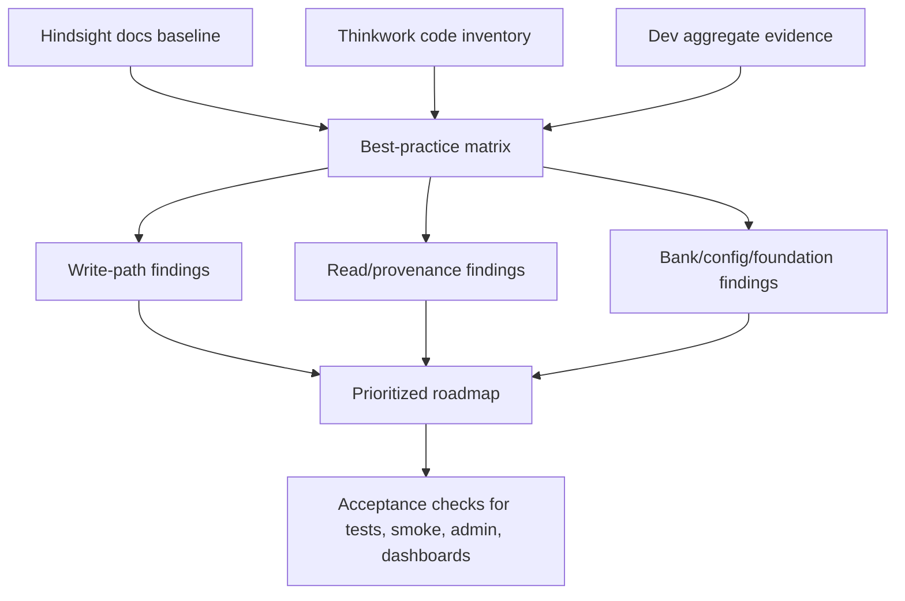
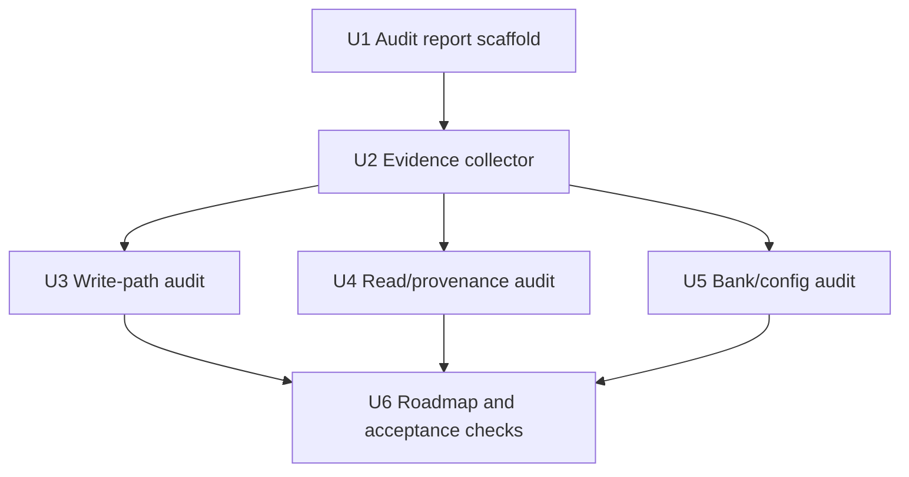

# feat: Audit Hindsight memory foundation

## Overview

Create a Hindsight-doc-grounded audit of Thinkwork's retained-memory foundation and turn the findings into a prioritized roadmap. The work produces a durable audit report plus a reusable, aggregate-only evidence collector so future Hindsight integration changes can be verified without rereading code paths or exposing raw memory content.

The plan is intentionally audit-first. It does not implement the eventual product changes; it defines how to inspect current write/read/config behavior, compare it against Hindsight best practices, and leave acceptance checks that later implementation plans can convert into tests, smoke scripts, admin checks, or dashboards.

---

## Problem Frame

Thinkwork already uses Hindsight as the richer hosted retained-memory engine, but the current implementation needs a foundation-level review rather than a narrow recall-quality pass. The review must prove whether Thinkwork uses Hindsight's documented primitives well: full-content retain, stable `document_id`, first-class temporal fields, tags and observation scopes, bank configuration, observations, reflect, mental models, source-fact evidence, and operational metrics.

The audit also has to sharpen Thinkwork's product architecture. Hindsight is the canonical retained-memory and observation substrate for hosted Thinkwork; Company Brain/Cognee remains the governed tenant-shared graph; Wiki remains a compiled, reviewable projection. Recommendations should reduce lowest-common-denominator adapter friction while keeping Context Engine useful as a policy/routing boundary where memory participates in multi-source context (see origin: docs/brainstorms/2026-06-27-hindsight-memory-foundation-audit-requirements.md).

---

## Requirements Trace

- R1. Ground every best-practice finding in the Hindsight docs baseline: retain, recall, reflect, observations, memory banks, mental models, configuration, performance, and anti-patterns.
- R2. Enumerate every live Hindsight write path: post-turn thread retain, legacy turn retain compatibility, daily memory, requester memory documents, requester thread digests, mobile quick capture, MCP retain, activation/user seeds, and journal/import reloads.
- R3. Enumerate every live Hindsight read/consumer path: Pi recall/reflect tools, proactive grounding recall, Context Engine memory provider, admin/mobile search/list/detail surfaces, memory graph, MCP recall, Wiki compile, ontology suggestions, and Cognee observation promotion.
- R4. Include dev evidence only as aggregate counts, structural response shapes, configuration state, health/status, and redacted samples.
- R5. Verify service-level Hindsight configuration in dev: health, model/provider settings, search backends, consolidation, dedup threshold, and observation mission.
- R6. Verify corpus shape in dev: banks, memory units by fact type/context, observation proof/source coverage, tag/timestamp/document parameter usage, mental models/directives, and async operation health.
- R7. Explicitly evaluate first-class `timestamp`, tags, `document_tags`, and `observation_scopes` usage.
- R8. Evaluate service-level versus per-bank retain missions, reflect missions, dispositions, and entity labels.
- R9. Evaluate unused Hindsight mental models and directives as foundation capabilities.
- R10. Evaluate whether source-fact evidence chains are reachable for operators and downstream systems.
- R11. Restate Hindsight's role as retained personal/episodic memory and observation formation, not the sole governed tenant business graph.
- R12. Distinguish Hindsight Memory from Company Brain/Cognee and Wiki consumers.
- R13. Evaluate and reduce adapter friction by making Hindsight-native memory concepts first-class for hosted Thinkwork while preserving useful policy/routing boundaries.
- R14. Produce a prioritized roadmap with near-term hardening, medium-term foundation upgrades, and deferred bets.
- R15. Produce acceptance checks that can become tests, smoke scripts, admin verification steps, or dashboards.

**Origin actors:** A1 End user, A2 Thinkwork agent runtime, A3 Operator/admin, A4 Memory platform engineer, A5 Downstream memory consumers.

**Origin flows:** F1 Best-practice audit, F2 Dev evidence pass, F3 Memory-quality roadmap.

**Origin acceptance examples:** AE1 covers first-class temporal review, AE2 covers aggregate-only corpus evidence, AE3 covers bank configuration plus mental models/directives, AE4 covers source-fact evidence reachability.

---

## Scope Boundaries

- The audit does not replace Hindsight as the retained-memory substrate.
- The audit does not collapse Hindsight, Wiki, and Company Brain/Cognee into one store.
- The audit does not expose raw sensitive memory content in docs, logs, final summaries, or fixtures.
- The audit does not implement the eventual Hindsight usage improvements.
- The audit does not require production content inspection; dev evidence is in scope, while prod-safe metrics are follow-up.
- The audit does not require removing every memory abstraction immediately; it should distinguish useful policy/routing boundaries from abstraction that hides Hindsight's memory model.

### Deferred to Follow-Up Work

- Product and code changes recommended by the audit: implement in separate plans after the roadmap is reviewed.
- Production-safe operator dashboarding: use this audit's acceptance checks as requirements for a future observability/admin plan.
- Backfills or corpus rewrites: defer until the audit separates active-path gaps from historical/import artifacts.

---

## Context & Research

### Relevant Code and Patterns

- `packages/api/src/lib/memory/adapters/hindsight-adapter.ts` owns the normalized Hindsight adapter, including retain, recall, reflect, inspect/export, bank configuration, and cursor/list behavior.
- `packages/api/src/handlers/memory-retain.ts` is the post-turn retain Lambda. It fetches tenant-filtered canonical transcripts, merges runtime tails, calls `retainConversation`, and best-effort enqueues Wiki compile.
- `packages/agentcore-pi/agent-container/src/runtime/tools/memory-retain-client.ts` constructs the runtime-to-Lambda retain event and uses `InvocationType=Event`.
- `packages/agentcore-pi/agent-container/src/runtime/providers/hindsight-memory-provider.ts` is the Pi runtime Hindsight provider for recall/reflect tools.
- `packages/pi-extensions/src/memory.ts` defines the raw recall/reflect tool pair and proactive session-start grounding recall.
- `packages/pi-extensions/src/context-engine.ts`, `packages/api/src/handlers/mcp-context-engine.ts`, and `packages/api/src/lib/context-engine/providers/memory.ts` define the Context Engine memory path and `query_memory_context`.
- `packages/api/src/graphql/resolvers/memory/captureMobileMemory.mutation.ts` writes mobile quick captures into the user's memory bank.
- `packages/api/src/handlers/mcp-user-memory.ts` writes MCP explicit memories and passes caller tags through metadata that the adapter can convert to Hindsight tags.
- `packages/api/src/lib/requester-memory/hindsight-primary.ts` and `packages/api/src/lib/requester-memory/hindsight-sync.ts` write requester memory summaries and markdown documents through Hindsight.
- `terraform/modules/app/hindsight-memory/main.tf` and `terraform/modules/thinkwork/variables.tf` define service-level Hindsight deployment/configuration knobs.
- `docs/src/content/docs/concepts/knowledge/memory.mdx` documents the adapter-owned retained-memory contract.
- `docs/src/content/docs/api/context-engine.mdx` documents Context Engine memory versus Brain/Wiki routing and the Hindsight recall/reflect strategy.

### Institutional Learnings

- `docs/solutions/best-practices/context-engine-adapters-operator-verification-2026-04-29.md`: provider-routed memory needs operator-level verification with source-local status, strategy, latency, and hit details.
- `docs/solutions/architecture-patterns/company-brain-active-substrate-reads-through-context-engine-2026-06-15.md`: governed Brain/Cognee reads must remain behind Context Engine with redacted provenance and provider status; Hindsight recommendations should not bypass that boundary.
- `docs/solutions/runtime-errors/lambda-web-adapter-in-flight-promise-lifecycle-2026-05-06.md`: awaited fire-and-forget Lambda dispatch works for post-turn memory retain; retain dispatch failures should remain observable but not user-facing.
- Archived compounding-memory plans establish the prior intent that Hindsight is the Hindsight-backed warehouse for compiled memory inputs while Wiki remains a derived projection.

### Hindsight Docs Grounding

- Retain: send full/raw content, avoid pre-summary, use stable `document_id`, set `context`, set first-class `timestamp` when available, and use tags for filtering/scope rather than metadata filtering.
- Memory banks: banks are isolated; one bank per user is common; shared-bank/multitenancy designs need strict tag filtering.
- Observations: observation scope controls consolidation scope; source proofs and source facts are core to trustworthy synthesized beliefs.
- Recall: use budget and token limits intentionally; filter by types/tags when needed; include `source_facts` and trace data for provenance-sensitive paths; use `query_timestamp` for temporal queries.
- Reflect: use reflect for answer-like synthesis, include facts when the consumer needs evidence, and use response schemas where structured answers are required.
- Mental models/directives: mental models are saved reflections that Hindsight checks before observations/facts; directives and missions shape behavior and should be intentional.
- Performance/operations: read paths should use appropriate budgets, async retain for large datasets, and `/metrics` or logs for service health and quality signals.

### Dev Evidence Already Gathered

- Dev Hindsight service is healthy and connected to the database; ECS desired/running count is 1/1.
- Safe service config observed in dev includes Bedrock retain/reflect models, local embeddings/reranker, pgvector, native text search, adaptive recall budget, auto-consolidation, dedup threshold `0.97`, and a service-level observations mission.
- Dev corpus aggregate: 14 banks, 4,490 documents, 17,332 memory units, 12,790 entities, and 32,959 entity cooccurrences.
- Fact-type aggregate: 8,089 observations, 7,289 world facts, and 1,954 experiences.
- Observation evidence aggregate: all 8,089 observations have proof counts and source memory IDs; 7,960 proof counts match source-memory counts and 129 differ.
- Current first-class retain parameter usage gap: `documents.retain_params` showed 0 documents with first-class `timestamp`, `tags`, `document_tags`, or `observation_scopes`.
- Sampled bank configs inherit observation behavior but do not set per-bank retain mission, reflect mission, dispositions, entity labels, mental models, or directives.
- Live observation-only recall can return `source_fact_ids` and `source_facts`, so the audit should focus on whether Thinkwork captures and surfaces that evidence chain.

---

## Key Technical Decisions

- **Produce an audit report plus reusable evidence collector.** A report alone is useful once; a redacted aggregate collector lets operators rerun the evidence pass after Hindsight config, adapter, or corpus changes.
- **Keep live evidence aggregate-only.** The audit should query counts, shapes, config, and status, but must never persist raw memory text. This directly preserves AE2 and makes the artifact shareable.
- **Classify findings by foundation axis.** Group findings into agent answer quality, substrate quality for Wiki/Cognee, and operator control so the roadmap does not overfit one UI or one runtime path.
- **Commit to Hindsight as the memory substrate.** Hindsight-native capabilities should be first-class for hosted Thinkwork memory foundation work; Context Engine remains useful as a governed multi-source routing surface rather than the canonical memory model.
- **Treat dev evidence as representative but not definitive.** Dev proves integration shape and obvious gaps; production quality claims require later aggregate metrics or operator dashboards.
- **Do not turn historical corpus artifacts into active-path bugs without proof.** Existing imports and older banks may predate current retain behavior; the audit should distinguish active writers from legacy data.

---

## Open Questions

### Resolved During Planning

- Should this plan implement memory behavior changes? No. The origin explicitly asks for a review and roadmap, and execution should first create the audit artifact plus reusable evidence checks.
- Should the audit use raw Hindsight DB rows? Yes, but only for aggregate/structural evidence and only through read-only queries that avoid raw memory text.
- Should Hindsight docs be treated as optional suggestions? No. The user explicitly asked to ground on Hindsight docs; deviations should be marked deliberate only when Thinkwork architecture justifies them.

### Deferred to Implementation

- Exact SQL/API shape of the evidence collector: defer until implementing, because current script conventions and deployed auth details may affect the safest read-only approach.
- Exact tag and observation-scope taxonomy: the audit should recommend candidate taxonomy, but final names may need product/operator review before implementation.
- Exact mental model set: the audit should rank initial model types, but creating them should be a follow-up product/behavior plan.
- Whether `/metrics` is reachable in dev: the audit should probe it safely; if unavailable, document the gap and recommend the required service/network/log alternative.

---

## Output Structure

```text
docs/
  audits/
    hindsight-memory-foundation-audit-2026-06-27.md
scripts/
packages/
  api/
    scripts/
      hindsight-memory-foundation-audit.ts
      hindsight-memory-foundation-audit.test.ts
```

The collector lives under `packages/api/scripts/` so its helper tests run with the existing API Vitest conventions and can reuse API package dependencies safely.

---

## High-Level Technical Design

> *This illustrates the intended approach and is directional guidance for review, not implementation specification. The implementing agent should treat it as context, not code to reproduce.*



---

## Implementation Units



- U1. **Create the canonical audit report**

**Goal:** Create a durable audit report that carries the origin requirements, Hindsight docs baseline, code-path inventory, dev evidence summary, findings taxonomy, and roadmap structure.

**Requirements:** R1, R2, R3, R11, R12, R13, R14; F1, F3.

**Dependencies:** None.

**Files:**
- Create: `docs/audits/hindsight-memory-foundation-audit-2026-06-27.md`
- Reference: `docs/brainstorms/2026-06-27-hindsight-memory-foundation-audit-requirements.md`
- Reference: `docs/src/content/docs/concepts/knowledge/memory.mdx`
- Reference: `docs/src/content/docs/api/context-engine.mdx`

**Approach:**
- Start the report with a matrix that maps Hindsight docs guidance to Thinkwork behavior: retained content shape, `document_id`, `context`, `timestamp`, tags, `document_tags`, `observation_scopes`, bank missions, reflect behavior, mental models, source facts, budgets, and operations.
- Include a clear "already healthy / improvement candidate / deliberate divergence / needs live evidence" classification for each row.
- Carry the architecture thesis forward: Hindsight is the retained-memory and observation substrate; Company Brain/Cognee and Wiki remain downstream/adjacent governed consumers.
- Keep evidence summaries structural and aggregate-only; do not include raw memory text, raw source facts, or screenshots with memory content.

**Patterns to follow:**
- Requirements trace style in `docs/brainstorms/2026-06-27-hindsight-memory-foundation-audit-requirements.md`.
- Adapter-contract language in `docs/src/content/docs/concepts/knowledge/memory.mdx`.
- Provider boundary language in `docs/src/content/docs/api/context-engine.mdx`.

**Test scenarios:**
- Test expectation: none -- this unit creates a documentation artifact and does not change executable behavior.

**Verification:**
- The report names every origin R-ID at least once in findings, roadmap, or acceptance checks.
- The report contains no raw memory content and no absolute local file paths.
- The report distinguishes Hindsight Memory, Wiki, and Company Brain/Cognee without merging their responsibilities.

---

- U2. **Add an aggregate-only Hindsight evidence collector**

**Goal:** Add a reusable script that gathers the dev evidence needed by the audit without exposing raw memory content.

**Requirements:** R4, R5, R6, R7, R8, R9, R10, R15; F2; AE2, AE3.

**Dependencies:** U1.

**Files:**
- Create: `packages/api/scripts/hindsight-memory-foundation-audit.ts`
- Create: `packages/api/scripts/hindsight-memory-foundation-audit.test.ts`
- Reference: `terraform/modules/app/hindsight-memory/main.tf`
- Reference: `terraform/modules/thinkwork/variables.tf`
- Reference: `packages/api/src/lib/memory/adapters/hindsight-adapter.ts`

**Approach:**
- Gather service health, safe service configuration, bank counts/config posture, aggregate corpus counts by fact type/context, observation proof/source coverage, retain parameter usage, mental model/directive counts, and async operation state.
- Emit JSON or Markdown-ready structured output that can be copied into the audit report.
- Explicitly omit text/content/source-fact bodies and redact identifiers where exact IDs are unnecessary.
- Prefer existing stage/config discovery patterns from Thinkwork CLI or AWS discovery helpers if they are easy to reuse during implementation; otherwise keep the script small and stage-scoped.

**Execution note:** Write characterization tests around the redaction/aggregation helpers before wiring live probes, because privacy regressions are the main risk.

**Patterns to follow:**
- Existing smoke-script shape under `plugins/company-brain/smoke/`.
- Hindsight adapter DB and API field names in `packages/api/src/lib/memory/adapters/hindsight-adapter.ts`.
- Safety posture from `docs/solutions/best-practices/context-engine-adapters-operator-verification-2026-04-29.md`.

**Test scenarios:**
- Happy path: given fixture rows for banks, documents, memory units, observations, mental models, directives, and operations, the collector summarizes counts by category without including `text`, `content`, or source-fact bodies.
- Edge case: given empty banks or empty result sets, the collector reports zero counts and nonfatal warnings rather than throwing.
- Error path: given an unreachable Hindsight health endpoint or denied DB query, the collector returns a degraded section with the failure reason and continues other probes.
- Privacy path: given fixture values that look like user memory text, secrets, emails, and raw identifiers, the collector output redacts or omits them.

**Verification:**
- Running the collector against fixtures produces deterministic aggregate output.
- Live dev execution produces only structural data suitable for the audit report.
- The script can be rerun after future Hindsight changes without manual SQL reconstruction.

---

- U3. **Audit Hindsight write paths and retain shape**

**Goal:** Review every write path against Hindsight retain best practices and identify active improvements for temporal fields, tags, document tags, observation scopes, document IDs, context, and async retain.

**Requirements:** R1, R2, R7, R14, R15; F1; AE1.

**Dependencies:** U1, U2.

**Files:**
- Modify: `docs/audits/hindsight-memory-foundation-audit-2026-06-27.md`
- Reference: `packages/api/src/lib/memory/adapters/hindsight-adapter.ts`
- Reference: `packages/api/src/handlers/memory-retain.ts`
- Reference: `packages/agentcore-pi/agent-container/src/runtime/tools/memory-retain-client.ts`
- Reference: `packages/api/src/graphql/resolvers/memory/captureMobileMemory.mutation.ts`
- Reference: `packages/api/src/handlers/mcp-user-memory.ts`
- Reference: `packages/api/src/lib/requester-memory/hindsight-primary.ts`
- Reference: `packages/api/src/lib/requester-memory/hindsight-sync.ts`
- Test: `packages/api/src/lib/memory/adapters/hindsight-adapter.test.ts`
- Test: `packages/api/src/handlers/memory-retain.test.ts`
- Test: `packages/agentcore-pi/agent-container/tests/memory-retain-client.test.ts`
- Test: `packages/api/src/handlers/mcp-user-memory.test.ts`

**Approach:**
- Build a write-path table that lists caller, content shape, `document_id`, `update_mode`, `context`, metadata, tags, first-class timestamp usage, async behavior, and observation-scope implications.
- Highlight healthy decisions already present, especially full-thread replaceable `retainConversation`, stable thread/daily/requester document IDs, and one-bank-per-user alignment.
- Identify gaps surfaced by dev evidence: `documents.retain_params` shows no first-class `timestamp`, tags, `document_tags`, or `observation_scopes` usage across retained documents, even though active paths embed timestamps or metadata in some content.
- Recommend whether each future change belongs in a Hindsight-native memory foundation module/API, server-side caller metadata, Context Engine detail surfaces, or operator config.

**Patterns to follow:**
- Existing adapter tests in `packages/api/src/lib/memory/adapters/hindsight-adapter.test.ts`.
- Tenant-safety and transcript merge behavior in `packages/api/src/handlers/memory-retain.ts`.
- MCP tag pass-through in `packages/api/src/handlers/mcp-user-memory.ts`.

**Test scenarios:**
- Covers AE1. Happy path: post-turn conversation retain with timestamped messages should be testable as a single replaceable document with `context=thinkwork_thread`, stable `document_id`, and any recommended first-class temporal field.
- Happy path: mobile quick capture with a caller tag should preserve the explicit memory source and route Hindsight-supported tags through the adapter rather than burying all scope in metadata.
- Edge case: daily/requester markdown upserts with stable document IDs should remain idempotent when rerun for the same day/document.
- Error path: unsupported or malformed tag/timestamp metadata should be dropped or normalized without failing the retain path.
- Integration: runtime retain client should keep invoking `memory-retain` with the canonical envelope while any new Hindsight fields are added server-side, not by trusting runtime clients with engine-specific payload shape.

**Verification:**
- The audit includes a complete write-path matrix.
- Every recommendation identifies the owning layer and whether it reduces adapter friction, preserves useful policy boundaries, or requires a Hindsight-native model.
- Acceptance checks identify which future tests should pin the recommended retain shape.

---

- U4. **Audit read, reflect, and provenance paths**

**Goal:** Review every Hindsight read/consumer path against recall/reflect/source-fact best practices and recommend how evidence chains should reach agents, operators, Wiki, Cognee, and Context Engine.

**Requirements:** R1, R3, R10, R11, R12, R13, R14, R15; F1, F3; AE4.

**Dependencies:** U1, U2.

**Files:**
- Modify: `docs/audits/hindsight-memory-foundation-audit-2026-06-27.md`
- Reference: `packages/api/src/lib/memory/adapters/hindsight-adapter.ts`
- Reference: `packages/agentcore-pi/agent-container/src/runtime/providers/hindsight-memory-provider.ts`
- Reference: `packages/pi-extensions/src/memory.ts`
- Reference: `packages/pi-extensions/src/context-engine.ts`
- Reference: `packages/api/src/lib/context-engine/providers/memory.ts`
- Reference: `packages/api/src/handlers/mcp-context-engine.ts`
- Reference: `packages/api/src/handlers/mcp-user-memory.ts`
- Reference: `packages/api/src/handlers/wiki-compile.ts`
- Test: `packages/api/src/lib/memory/adapters/hindsight-adapter.test.ts`
- Test: `packages/agentcore-pi/agent-container/tests/hindsight-memory-provider.test.ts`
- Test: `packages/pi-extensions/test/memory.test.ts`
- Test: `packages/api/src/lib/context-engine/providers/memory.test.ts`
- Test: `packages/api/src/handlers/mcp-context-engine.requester-context.test.ts`

**Approach:**
- Build a read-path table that lists caller/tool, use case, Hindsight endpoint (`recall` or `reflect`), budget, max tokens, type filters, include options, evidence fields, query timestamp support, and result normalization.
- Compare raw recall/reflect tools with Context Engine memory routing. Preserve Context Engine as a governed multi-source access surface, but do not require Hindsight memory to flatten into a generic provider shape.
- Evaluate whether reflect should pass optional context through to Hindsight, whether `include_facts`/`source_facts` should be enabled for audit/provenance paths, and where `query_timestamp` should be exposed for temporal queries.
- Recommend a progressive evidence chain: Hindsight-native capture first, admin/source detail next, Wiki/Cognee provenance links after that.

**Patterns to follow:**
- Provider-local status and strategy verification in `docs/solutions/best-practices/context-engine-adapters-operator-verification-2026-04-29.md`.
- Brain/Cognee boundary in `docs/solutions/architecture-patterns/company-brain-active-substrate-reads-through-context-engine-2026-06-15.md`.
- Existing Context Engine memory status/provenance fields in `packages/api/src/lib/context-engine/providers/memory.ts`.

**Test scenarios:**
- Covers AE4. Happy path: Hindsight recall configured to include source facts should normalize observation IDs and source-fact references without copying raw source text into surfaces that do not request detail.
- Happy path: Context Engine memory provider in `reflect` mode should report provider metadata including strategy and backend status.
- Edge case: empty recall/reflect response should produce provider-local no-hit/degraded status rather than falling back to Brain/Wiki silently.
- Error path: Hindsight timeout or 5xx should degrade only the memory provider while other Context Engine providers can still return hits.
- Integration: an operator-visible source detail path should be able to trace a memory-derived claim to Hindsight observation/source identifiers without bypassing Context Engine policy boundaries.

**Verification:**
- The audit names every read/consumer path from R3.
- The report states where evidence chains are already present, hidden, or absent.
- Roadmap items separate agent-answer synthesis from operator/source provenance.

---

- U5. **Audit bank configuration and foundation capabilities**

**Goal:** Evaluate service-level versus per-bank configuration, observation missions, dispositions, entity labels, directives, and mental models as foundation primitives.

**Requirements:** R1, R5, R6, R8, R9, R14, R15; F2, F3; AE3.

**Dependencies:** U1, U2.

**Files:**
- Modify: `docs/audits/hindsight-memory-foundation-audit-2026-06-27.md`
- Reference: `terraform/modules/app/hindsight-memory/main.tf`
- Reference: `terraform/modules/thinkwork/variables.tf`
- Reference: `packages/api/src/lib/memory/adapters/hindsight-adapter.ts`
- Reference: `docs/src/content/docs/concepts/knowledge/memory.mdx`
- Test: `packages/api/src/lib/memory/adapters/hindsight-adapter.test.ts`
- Test: `apps/cli/__tests__/terraform-enterprise-artifact-fixture.test.ts`

**Approach:**
- Compare live dev service config and sampled bank config against Hindsight docs for missions, auto-consolidation, dedup threshold, dispositions, entity labels, and reflect missions.
- Record current health: service-level observation mission and auto-consolidation are present; sampled banks inherit observation config but lack per-bank mission, reflect mission, entity labels, customized dispositions, mental models, and directives.
- Recommend which settings should stay service-wide and which should become per-bank/per-source configuration candidates.
- Treat mental models as a roadmap capability, not an immediate hidden behavior change. Identify initial candidates such as user profile, active projects, communication preferences, and operator-reviewed summaries.

**Patterns to follow:**
- Lazy, nonblocking bank configuration in `packages/api/src/lib/memory/adapters/hindsight-adapter.ts`.
- Terraform variable pattern for optional Hindsight knobs in `terraform/modules/thinkwork/variables.tf`.
- Adapter-owned public contract in `docs/src/content/docs/concepts/knowledge/memory.mdx`.

**Test scenarios:**
- Happy path: future adapter config tests should prove per-bank Hindsight config is applied lazily and safely when env/config specifies missions or observation settings.
- Edge case: absent per-bank config should continue inheriting service-level defaults without blocking writes.
- Error path: failed bank config update should log/degrade with cooldown and still allow retain unless the future setting is explicitly required.
- Integration: Terraform fixture tests should prove any new Hindsight config variables are emitted to the correct service or Lambda environment without leaking secrets.

**Verification:**
- The audit classifies each Hindsight foundation capability as configured, inherited, unused-by-design, or roadmap candidate.
- The roadmap states what should be tuned first and what needs product review.

---

- U6. **Synthesize roadmap, acceptance checks, and operational handoff**

**Goal:** Turn the audit findings into prioritized implementation slices and concrete checks that can drive future `ce-plan`/`ce-work` passes.

**Requirements:** R11, R12, R13, R14, R15; F3; AE1, AE2, AE3, AE4.

**Dependencies:** U3, U4, U5.

**Files:**
- Modify: `docs/audits/hindsight-memory-foundation-audit-2026-06-27.md`
- Modify: `docs/src/content/docs/concepts/knowledge/memory.mdx` only if the audit discovers existing docs are materially stale or misleading.
- Modify: `docs/src/content/docs/api/context-engine.mdx` only if the audit discovers the public docs no longer match current routing or strategy behavior.

**Approach:**
- Prioritize near-term hardening around first-class retain fields, source-fact evidence plumbing, and reusable evidence checks if the audit confirms the current gaps.
- Prioritize medium-term foundation upgrades around per-bank/source missions, reflect missions, mental models, and operator verification surfaces.
- Keep deferred bets separate: broad corpus backfills, production dashboards, cross-tenant/shared-bank designs, and mental-model automation should not block the first audit closeout.
- Convert findings into acceptance checks with owners: unit tests, integration tests, smoke script outputs, admin verification behaviors, or dashboard metrics.
- Include a "do not change" section that preserves the Context Engine policy boundary and Hindsight/Wiki/Company Brain role split while explicitly allowing Hindsight-native memory concepts to become first-class.

**Patterns to follow:**
- Roadmap grouping in the origin requirements.
- Operator-verification guidance in `docs/solutions/best-practices/context-engine-adapters-operator-verification-2026-04-29.md`.
- Context Engine policy boundary in `docs/src/content/docs/api/context-engine.mdx`.

**Test scenarios:**
- Test expectation: none -- this unit synthesizes documentation and acceptance criteria. Future implementation items created from the roadmap must include their own tests.

**Verification:**
- The report has near-term, medium-term, and deferred sections with rationale.
- Every roadmap item names the affected layer, expected benefit, risk, and acceptance check.
- Any docs updates are limited to correcting drift discovered during the audit.

---

## System-Wide Impact

- **Interaction graph:** Runtime retain, API adapter, Context Engine, raw Pi memory tools, MCP memory tools, mobile quick capture, requester memory, Wiki compile, and future Cognee promotion all participate in the memory foundation.
- **Error propagation:** Evidence collection and audit recommendations must avoid making memory failures user-facing. Runtime recall/retain should continue to degrade locally; Context Engine should report provider-local status.
- **State lifecycle risks:** Stable `document_id` and `update_mode=replace` are already critical for transcript/daily/requester upserts. Any future tag/timestamp/scope changes must avoid duplicate documents or noisy reconsolidation.
- **API surface parity:** Recommendations that affect memory behavior must consider GraphQL, MCP, Pi runtime, mobile, CLI/operator, and compiled Wiki consumers.
- **Integration coverage:** Unit tests alone will not prove live Hindsight config, observation consolidation, or source-fact availability. The aggregate evidence collector and admin/source verification checks are required.
- **Unchanged invariants:** Hindsight is the canonical hosted memory substrate; Context Engine remains a governed routing/policy surface; raw Brain/Cognee substrate APIs are not exposed as ordinary memory paths.

---

## Alternative Approaches Considered

- **Write only a narrative audit report:** Rejected because future Hindsight changes would require rebuilding live evidence manually.
- **Implement Hindsight improvements immediately:** Rejected because the user asked for a foundation review first, and the current gaps need prioritization across write paths, read paths, and operations.
- **Flatten Hindsight into a generic adapter shape:** Rejected because it hides the primitives this audit identifies as foundational: observations, source facts, retain params, scopes, missions, mental models, and directives.
- **Inspect production memory content:** Rejected for privacy and scope reasons; aggregate production metrics can be a future operational follow-up.

---

## Success Metrics

- The final audit report can answer which Hindsight best practices Thinkwork already satisfies, where it intentionally diverges, and where it should improve.
- The evidence collector can reproduce key dev posture without raw memory content.
- The roadmap clearly separates near-term hardening from medium-term foundation upgrades and deferred bets.
- Future implementers can turn roadmap items into tests/smokes/admin checks without rediscovering the code paths.

---

## Risk Analysis & Mitigation

| Risk | Likelihood | Impact | Mitigation |
|------|------------|--------|------------|
| Raw memory content leaks into docs or fixtures | Medium | High | Keep collector aggregate-only, test redaction helpers, and review the report before commit. |
| Dev corpus artifacts are mistaken for active-path behavior | Medium | Medium | Split findings into active writer behavior, historical/import corpus posture, and needs-live-evidence buckets. |
| Recommendations bypass useful policy boundaries | Medium | High | Require every recommendation to name whether it belongs in Hindsight-native memory APIs, Context Engine policy/detail surfaces, diagnostics, or operator tooling. |
| Hindsight docs grounding becomes generic | Low | Medium | Keep a docs-baseline matrix in U1 and cite specific Hindsight primitives for each finding. |
| Evidence collector becomes brittle against Hindsight schema changes | Medium | Medium | Prefer structural checks, tolerate missing fields with degraded sections, and document Hindsight version/config in output. |
| Roadmap over-prioritizes agent answers over substrate/operator needs | Medium | Medium | Group findings by agent answer quality, substrate quality, and operator control before prioritizing. |

---

## Documentation / Operational Notes

- The audit report belongs under `docs/audits/` because it is a point-in-time review artifact, not a solution pattern or implementation plan.
- The collector should be safe to run in dev and adaptable for prod-safe aggregate metrics later.
- If existing public docs overstate or understate Hindsight's current role, U6 may update only the inaccurate sections.
- Any future implementation plan should start from the audit roadmap and keep changes small enough to validate independently.

---

## Sources & References

- Origin document: `docs/brainstorms/2026-06-27-hindsight-memory-foundation-audit-requirements.md`
- Hindsight docs skill: best practices, Retain API, Recall API, Reflect API, Memory Banks, Observations, Mental Models, Configuration, Performance, and FAQ.
- `packages/api/src/lib/memory/adapters/hindsight-adapter.ts`
- `packages/api/src/handlers/memory-retain.ts`
- `packages/agentcore-pi/agent-container/src/runtime/providers/hindsight-memory-provider.ts`
- `packages/agentcore-pi/agent-container/src/runtime/tools/memory-retain-client.ts`
- `packages/pi-extensions/src/memory.ts`
- `packages/pi-extensions/src/context-engine.ts`
- `packages/api/src/lib/context-engine/providers/memory.ts`
- `packages/api/src/handlers/mcp-context-engine.ts`
- `packages/api/src/handlers/mcp-user-memory.ts`
- `packages/api/src/graphql/resolvers/memory/captureMobileMemory.mutation.ts`
- `docs/src/content/docs/concepts/knowledge/memory.mdx`
- `docs/src/content/docs/api/context-engine.mdx`
- `docs/solutions/best-practices/context-engine-adapters-operator-verification-2026-04-29.md`
- `docs/solutions/architecture-patterns/company-brain-active-substrate-reads-through-context-engine-2026-06-15.md`
- `docs/solutions/runtime-errors/lambda-web-adapter-in-flight-promise-lifecycle-2026-05-06.md`
