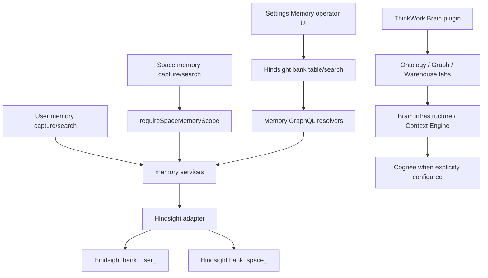
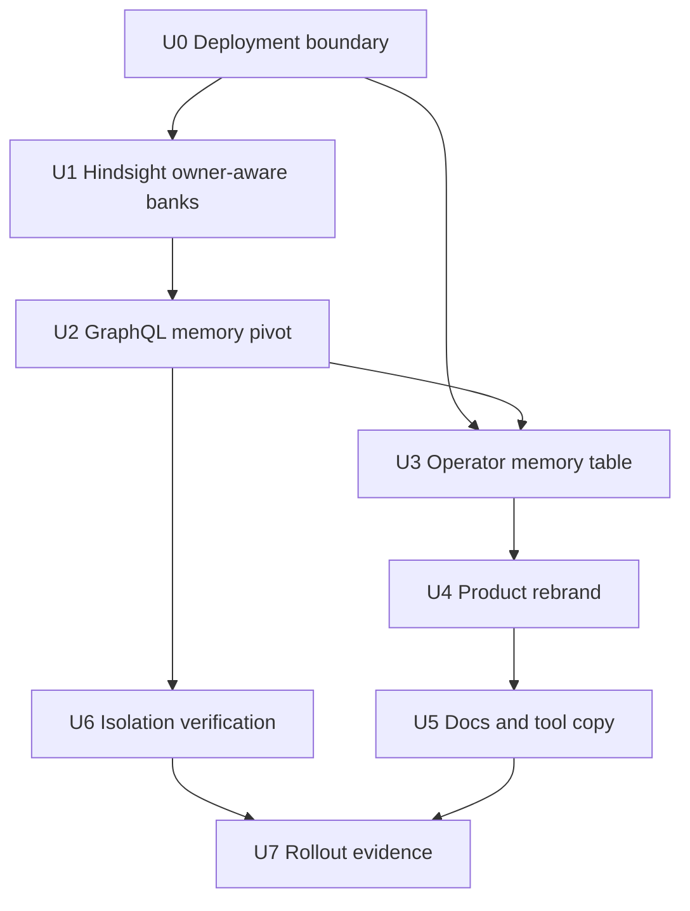

# feat: Pivot Memory to Hindsight in ThinkWork Brain

## Overview

THINK-83 pivots ThinkWork user and Space memory back to Hindsight while keeping
Cognee available only as the optional ThinkWork Brain ontology/knowledge-graph
upgrade. The implementation should make Hindsight the canonical core provider
for user and Space memory, stop presenting it as legacy, keep the current
operator Memory UI at `/settings/memory` for this pass, fix the blank operator
table so it lists Hindsight records across banks, and rename customer-facing
"Company" surfaces to ThinkWork product names.

The plan intentionally keeps existing internal plugin keys and slugs such as
`company-brain`, `company-data`, and `company-etl` stable for this pass. The
user-facing product language changes now; storage keys, Terraform variables,
and historical docs can move later only if they become a real product problem.

## Rollout Evidence

Implementation was delivered in independently reviewable units against `main`:

| Unit                           | PR                                                           | Merge commit                               | Evidence                                                                       |
| ------------------------------ | ------------------------------------------------------------ | ------------------------------------------ | ------------------------------------------------------------------------------ |
| U0 Deployment boundary         | [#3020](https://github.com/thinkwork-ai/thinkwork/pull/3020) | `d46d878b3887905fb83762e03f5dcaa6f589fc13` | Hindsight default/full-install boundary, Cognee plugin infrastructure boundary |
| U1 Hindsight owner-aware banks | [#3021](https://github.com/thinkwork-ai/thinkwork/pull/3021) | `4daa634c18199abbaf63212d0ec8e854e84de3ab` | User and Space bank routing tests                                              |
| U2 GraphQL memory pivot        | [#3022](https://github.com/thinkwork-ai/thinkwork/pull/3022) | `2808378a9c1adf70edef444b3478e34f2c122fde` | Hindsight-backed user/Space resolver semantics and codegen                     |
| U3 Settings Memory table       | [#3023](https://github.com/thinkwork-ai/thinkwork/pull/3023) | `ee6a5d81fdc1d9a12e9f13ed5e8b30aa3bc9277b` | Operator `memoryRecords(scope: OPERATOR)` table and read-only detail evidence  |
| U6 Isolation verification      | [#3024](https://github.com/thinkwork-ai/thinkwork/pull/3024) | `50f884e2f971332734202dedf83c0fc48ce21839` | Hindsight user/Space A/Space B isolation smoke and resolver tests              |
| U4 Product rebrand             | [#3026](https://github.com/thinkwork-ai/thinkwork/pull/3026) | `c69981685d17fd8be666f4d1e7d5289ffdb49901` | ThinkWork Brain/Data Warehouse/ETL display names with stable internal keys     |
| U5 Docs and tool copy          | [#3029](https://github.com/thinkwork-ai/thinkwork/pull/3029) | `0f8c924f811730a5ff206985c75ad2f7d43cc605` | Context Engine, Pi extension, docs, and workspace default copy alignment       |

The compatibility boundary after rollout is:

- Hindsight owns user and Space memory capture, recall, and operator inspection.
- Cognee may remain as ThinkWork Brain graph/ontology/warehouse
  infrastructure or legacy diagnostic evidence, but it is not the user or
  Space memory proof path.
- Internal `company-*` plugin keys, package names, and compatibility slugs stay
  stable in this pass.
- Memory remains under `/settings/memory` for this pass; current docs should
  point operators there.

---

## Problem Frame

The current code has exactly one active memory adapter, but recent Cognee-first
work made user and Space memory dependent on Cognee-specific assumptions.
THINK-79 validation found scope bleed under Cognee graph-completion recall and
no trustworthy per-user/per-Space Cognee inspector. The product decision in the
origin requirements is therefore to choose one memory provider for user and
Space memory now: Hindsight (see origin:
`docs/brainstorms/2026-06-27-thnk-83-hindsight-thinkwork-brain-boundary-requirements.md`).

At the same time, Memory is no longer just an abstract provider choice. It is a
core ThinkWork capability that operators must be able to inspect. For this
pass, keep the current Settings Memory route and make it correct:
`/settings/memory` is operator-only and must show the Hindsight records that
actually exist, including bank and date evidence. The optional ThinkWork Brain
plugin should own ontology, graph, warehouse, and projection upgrades on top of
core memory, not the base memory inspection table.

---

## Requirements Trace

- R1. Hindsight is the canonical provider for user and Space memory in this
  pass.
- R2. Product, API, UI, and docs stop describing active Hindsight as legacy.
- R3. User memory writes and reads isolated Hindsight user banks.
- R4. Space memory writes and reads isolated Hindsight Space banks.
- R5. User+Space combined recall remains an explicit product policy path, not
  accidental backend fan-in.
- R6. Cognee is not the canonical user or Space memory provider for THINK-83.
- R7. Cognee can remain internal ThinkWork Brain graph, ontology, warehouse, or
  wiki projection infrastructure where deliberately scoped.
- R8. Customers and normal users do not get a backend picker for Hindsight vs.
  Cognee memory.
- R9. Customer-facing Company Brain language becomes ThinkWork Brain.
- R10. Customer-facing Company ETL language becomes ThinkWork ETL.
- R11. Customer-facing Company Data language becomes ThinkWork Data Warehouse.
- R12. Memory inspection/search remains under `/settings/memory` for this pass;
  the operator table must show all Hindsight memory items with bank/date
  evidence instead of a false empty state.
- R13. ThinkWork Brain presents ontology, graph, warehouse, and projection
  capabilities as upgrades layered on top of Hindsight-backed core memory.
- R14. Graph, ontology, warehouse, and wiki projections are Brain capabilities
  or internals, not competing memory authorities.
- R15. Cognee-only user/Space assumptions are updated before the pivot is
  declared complete.
- R16. UI-verifiable examples prove user, Space A, and Space B memory isolation.
- R17. PR #3018 remains diagnostic evidence, not the merge path for user/Space
  memory unless the product decision is reopened.
- R18. Existing Brain plugin infrastructure is reused only where it helps the
  new provider boundary.

**Origin actors:** A1 individual user, A2 Space member, A3 ThinkWork agent, A4
tenant/operator admin, A5 planner/implementer

**Origin flows:** F1 user memory capture and recall, F2 Space memory capture
and recall, F3 ThinkWork Brain workspace, F4 Brain graph or warehouse
processing

**Origin acceptance examples:** AE1 user memory isolation, AE2 Space memory
isolation, AE3 Hindsight appears as active product memory, AE4 Cognee is not
offered as the memory provider, AE5 ThinkWork product naming

---

## Scope Boundaries

### Deferred for later

- A future Cognee v1 `remember`/`recall` evaluation for user or Space memory.
- Migration of old Cognee user/Space memory data into Hindsight.
- Migration of all existing internal identifiers from `company-brain` to
  `thinkwork-brain`.
- Full ThinkWork Data Warehouse implementation beyond naming and product
  boundary alignment.
- Full graph-of-record or wiki materialization redesign.
- Billing, packaging, and marketplace changes beyond preserving the Brain
  plugin home.

### Outside this product's identity

- A customer-facing backend picker for Hindsight versus Cognee memory.
- Treating Cognee graph completion as acceptable isolation for user and Space
  memory without a new explicit product decision and E2E evidence.
- A plugin-gated Memory product that makes core memory appear optional.
- A generic "company brain" story that only works for one tenant-wide company
  knowledge base and not for ThinkWork's broader agent OS direction.

### Deferred to Follow-Up Work

- Internal slug/package/key rename from `company-*` to `thinkwork-*`. This pass
  should keep keys stable and change display names/copy only.
- Historical `docs/solutions/` title rewrites. These are dated learning
  artifacts and should not be churned unless a current doc points users there
  as product guidance.
- Data migration from existing Cognee datasets or historical Hindsight banks.
  This plan makes future capture/recall correct and inspectable first.
- Moving Memory routing out of Settings. Keep `/settings/memory` as the
  operator surface for this pass and revisit IA after the Hindsight inspection
  table is trustworthy.

---

## Context & Research

### Relevant Code and Patterns

- `packages/api/src/lib/memory/index.ts` constructs one active adapter from
  config; the plan should preserve the one-provider runtime model.
- `packages/api/src/lib/memory/config.ts` defaults `MEMORY_ENGINE` to
  `hindsight` and documents that exactly one engine is active.
- `terraform/modules/thinkwork/main.tf` always creates AgentCore managed memory,
  conditionally creates Hindsight from `enable_hindsight` or
  `memory_engine == "hindsight"`, and conditionally creates Cognee from
  `enable_cognee`.
- `terraform/modules/thinkwork/variables.tf` currently defaults
  `enable_hindsight = false`, `memory_engine = ""`, and `enable_cognee = false`;
  that means a greenfield deploy currently resolves to AgentCore unless
  Hindsight is explicitly enabled.
- `terraform/modules/app/hindsight-memory/README.md` is stale for this product
  direction: it frames Hindsight as an optional add-on alongside always-on
  managed memory.
- `plugins/company-brain/src/manifest.ts` declares a plugin infrastructure
  component with `managedAppKey: "cognee"`; plugin install drives Cognee through
  the managed-application deployment runner.
- `packages/api/src/lib/memory/types.ts` already models `ownerType` as
  `user | agent | space`, so Space memory does not need a new public owner
  concept.
- `packages/api/src/lib/memory/adapters/hindsight-adapter.ts` currently maps
  all write/read owners through `user_${ownerId}` and has user-centric legacy
  bank fan-out.
- `packages/api/src/graphql/resolvers/memory/spaceMemorySearch.query.ts` and
  `packages/api/src/graphql/resolvers/memory/captureSpaceMemory.mutation.ts`
  currently reject all non-Cognee adapters.
- `packages/api/src/graphql/resolvers/memory/memorySystemConfig.query.ts`
  reports user and Space memory as enabled only for Cognee.
- `packages/database-pg/graphql/types/memory.graphql` has Cognee-centered field
  descriptions that will leak into generated schemas and client codegen.
- `apps/web/src/components/settings/SettingsMemory.tsx`,
  `apps/web/src/components/settings/SettingsMemoryHome.tsx`, and
  `apps/web/src/components/settings/settings-nav.tsx` are the current Settings
  Memory surface and navigation.
- `apps/web/src/components/settings/SettingsMemory.tsx` currently queries
  `memoryRecords` with `userId: null` and `namespace: "requester"`, so the
  table behaves like a requester/user list rather than an operator Hindsight
  bank inspector.
- `packages/api/src/graphql/resolvers/memory/memoryRecords.query.ts` currently
  resolves one user scope through `requireMemoryUserScope` and calls normalized
  inspect with `ownerType: "user"`.
- `apps/web/src/components/settings/plugins/PluginDetail.tsx` already treats
  `company-brain` specially and links to Brain operations and the memory graph.
- `apps/web/src/routes/_authed/settings.plugins.n8n*.tsx` and
  `apps/web/src/components/settings/plugins/n8n/N8nPluginHome.tsx` are the
  closest pattern for plugin-owned subroutes with tabs.
- `plugins/company-brain/src/manifest.ts`,
  `plugins/company-data/src/manifest.ts`, and
  `plugins/company-etl/src/manifest.ts` are the first-party display-name source
  for the plugin catalog.
- `plugins/catalog/src/registry/generated-first-party.ts` is generated and
  should be updated by the catalog generation workflow, not hand edited.

### Institutional Learnings

- `docs/solutions/architecture-patterns/company-brain-active-substrate-reads-through-context-engine-2026-06-15.md`:
  Brain substrate reads should stay behind Context Engine boundaries; do not
  expose raw Cognee, Neptune, or S3 implementation details as the product
  contract.
- `docs/solutions/architecture-patterns/company-brain-provisioning-contract-tenant-scoped-2026-06-15.md`:
  product-owned configuration should hide raw provider variables; provider
  evidence can stay in operator-only diagnostics.
- `docs/solutions/runbooks/company-brain-premium-plugin-operations-2026-06-13.md`:
  the plugin detail page already owns entitlement, install, component status,
  and adoption evidence; keep those operator/plugin concerns there while core
  memory remains available outside plugin installation.
- `docs/solutions/best-practices/context-engine-adapters-operator-verification-2026-04-29.md`:
  source-specific diagnostics are useful, but normal lookup should flow through
  product-owned Context Engine and memory services.
- `docs/solutions/best-practices/cognee-thread-ingest-explorer-2026-06-04.md`:
  graph explorer UI should distinguish an empty graph from a broken feature.
- `docs/solutions/logic-errors/admin-graph-dims-measure-ref-2026-04-20.md`:
  graph views need stable dimensions and careful reset behavior after config
  loads.

### External References

- Hindsight best practices: memory banks are isolated stores; common patterns
  include one bank per user, one per agent, or shared banks with metadata tags.
  [https://hindsight.vectorize.io/best-practices](https://hindsight.vectorize.io/best-practices)
- Hindsight recall: recall supports semantic, BM25, graph, and temporal
  retrieval strategies with fusion/reranking.
  [https://hindsight.vectorize.io/developer/api/recall](https://hindsight.vectorize.io/developer/api/recall)
- Hindsight observations and reflect APIs: consolidated beliefs preserve
  evidence, freshness, and citations.
  [https://hindsight.vectorize.io/developer/observations](https://hindsight.vectorize.io/developer/observations),
  [https://hindsight.vectorize.io/developer/reflect](https://hindsight.vectorize.io/developer/reflect)
- Cognee recall docs: v1 `recall()` is the intended higher-level retrieval
  entry point, with datasets and scopes.
  [https://docs.cognee.ai/python-api/recall](https://docs.cognee.ai/python-api/recall)
- Cognee search and sessions docs: lower-level search exposes graph-completion
  modes, permissions, and session-cache behavior that should not be treated as
  the canonical ThinkWork memory contract.
  [https://docs.cognee.ai/core-concepts/main-operations/legacy-operations/search](https://docs.cognee.ai/core-concepts/main-operations/legacy-operations/search),
  [https://docs.cognee.ai/core-concepts/sessions-and-caching](https://docs.cognee.ai/core-concepts/sessions-and-caching)

---

## Key Technical Decisions

- Keep exactly one active memory adapter: `MEMORY_ENGINE=hindsight` is the
  product path for user and Space memory; Cognee remains optional Brain
  ontology/graph infrastructure, not a peer memory option.
- Treat Hindsight as core memory infrastructure, not as a Brain plugin
  component. New full ThinkWork deployments should install Hindsight by
  default unless an explicitly low-cost/development profile opts into
  `memory_engine=agentcore`.
- Treat Cognee as plugin-managed optional infrastructure. It should be deployed
  when the ThinkWork Brain ontology/graph upgrade is installed or explicitly
  enabled by an operator, not as part of the base memory stack.
- Add owner-aware Hindsight bank resolution: user memory uses
  `user_${userId}`; Space memory uses `space_${spaceId}`; legacy user bank
  fan-out stays user-only. Preserve any existing agent-owner behavior unless
  implementation proves no runtime caller depends on it.
- Gate Space memory on adapter capability, not `adapter.kind === "cognee"`:
  Hindsight should satisfy capture and search for authorized Spaces; unsupported
  adapters should fail closed with a provider-neutral error.
- Keep GraphQL field names for compatibility in this pass. Update
  descriptions, resolver semantics, and UI copy so active Hindsight enables
  user and Space memory while Cognee fields are treated as diagnostic/internal.
- Make no Memory routing changes in this pass. Keep `/settings/memory*` as the
  operator UI and fix its data contract so it lists Hindsight records across
  relevant banks with bank/date metadata.
- Rebrand display names and customer-facing copy now; keep slugs, plugin keys,
  package names, Terraform variable names, and generated identifiers stable.
- Do not erase Cognee evidence where it is genuinely operator-only diagnostic
  evidence for the Brain substrate; remove it from normal user/Space memory
  positioning.

---

## Open Questions

### Resolved During Planning

- Should ThinkWork choose one memory provider for user and Space memory now?
  Yes. The plan follows the origin decision that Hindsight is canonical for
  this pass.
- Should internal plugin keys be renamed now? No. Change customer-facing names
  first and leave `company-*` identifiers stable to avoid unrelated migrations.
- Should Memory remain under Settings for this pass? Yes. The user explicitly
  chose to defer routing changes and keep `/settings/memory` while fixing the
  operator table.
- Should Memory be gated by the ThinkWork Brain plugin? No. Hindsight-backed
  user/Space memory is core. The Brain plugin is the ontology/graph upgrade.
- Should Cognee be removed entirely? No. It may remain internal Brain
  infrastructure where scoped and inspectable.

### Deferred to Implementation

- Exact helper names for owner-aware Hindsight bank resolution. The behavior is
  planned; naming should follow the adapter file's final shape.
- Whether any remaining `ownerType: "agent"` path needs explicit Hindsight
  support or only legacy compatibility. Implementation should inspect tests and
  avoid changing behavior outside user/Space memory without characterization.
- Exact route filenames for nested Brain tabs if TanStack route generation
  prefers a slightly different layout. The public paths should remain stable.
- Whether a new neutral GraphQL field is worth adding later. This pass can
  preserve existing field names and update semantics/copy.

---

## High-Level Technical Design

> _This illustrates the intended approach and is directional guidance for
> review, not implementation specification. The implementing agent should treat
> it as context, not code to reproduce._

---

## Implementation Units

- U0. **Clarify Core Memory vs. Brain Plugin Deployment Boundary**

**Goal:** Make deployment behavior match the product boundary: Hindsight is
core memory infrastructure; Cognee is the optional ThinkWork Brain
ontology/knowledge-graph managed app.

**Requirements:** R1, R6, R7, R8, R12, R13, R14, R15, AE3, AE4

**Dependencies:** None

**Files:**

- Modify: `terraform/modules/thinkwork/variables.tf`
- Modify: `terraform/modules/thinkwork/main.tf`
- Modify: `terraform/examples/greenfield/main.tf`
- Modify: `apps/cli/src/commands/enterprise/templates/deploy-repo/terraform/main.tf`
- Modify: `terraform/modules/app/hindsight-memory/README.md`
- Modify: `plugins/company-brain/terraform/cognee/README.md`
- Modify: `plugins/company-brain/src/manifest.ts`
- Modify: `plugins/company-brain/src/deployment/cognee-managed-app.ts`
- Modify: `apps/cli/__tests__/terraform-cognee-fixture.test.ts`
- Modify: `apps/cli/__tests__/terraform-runtime-config-fixture.test.ts`
- Modify: `packages/deployment-runner/test/deployment-runner-managed-apps.test.ts`
- Modify: `plugins/company-brain/test/manifest.test.ts`

**Approach:**

- Decide and encode the deployment default: full ThinkWork installs should
  provision Hindsight as the canonical memory engine by default, while
  explicitly low-cost/dev profiles may opt into AgentCore managed memory.
- Add or tighten guardrails so `memory_engine = "hindsight"` always implies a
  Hindsight service exists, and `memory_engine = "cognee"` is no longer the
  recommended or default user/Space memory path.
- Update stale Hindsight docs that frame Hindsight as merely optional. The
  accurate model is: AgentCore managed memory exists as a platform primitive,
  Hindsight is the product's canonical user/Space memory provider, and Cognee
  is optional Brain ontology/graph infrastructure.
- Keep Cognee deployment behind `enable_cognee` and the Brain plugin
  infrastructure component. Plugin install should provision/adopt Cognee
  through the managed-app deployment runner; base ThinkWork install should not.
- Update variable descriptions that currently say Cognee can make Company Brain
  own user/Space memory.

**Patterns to follow:**

- `terraform/modules/thinkwork/main.tf` already centralizes
  `resolved_memory_engine`.
- `plugins/company-brain/src/deployment/cognee-managed-app.ts` already maps the
  plugin infrastructure component to `enable_cognee`.

**Test scenarios:**

- Happy path: default full-deployment Terraform fixtures resolve canonical
  memory to Hindsight and include Hindsight endpoint wiring.
- Edge case: explicit low-cost/dev `memory_engine = "agentcore"` does not
  require Hindsight.
- Error path: `memory_engine = "cognee"` is either rejected for user/Space
  memory or clearly treated as an unsupported legacy/diagnostic mode unless
  product leadership reopens that decision.
- Happy path: Brain plugin install still builds a managed-app plan with
  `enable_cognee = true`.
- Regression: base deploy with no Brain plugin install does not create Cognee
  resources.

**Verification:**

- Terraform and deployment-runner tests prove the initial install boundary:
  Hindsight core, Cognee plugin-managed.
- Deployment docs answer "when is Hindsight deployed?" and "when is Cognee
  deployed?" without conflicting with runtime config.

---

- U1. **Make Hindsight Owner-Aware for User and Space Memory**

**Goal:** Hindsight reads, writes, inspect, export, reflect, and list paths use
the correct owner-specific bank for user and Space memory.

**Requirements:** R1, R3, R4, R5, R15, F1, F2, AE1, AE2

**Dependencies:** U0

**Files:**

- Modify: `packages/api/src/lib/memory/adapters/hindsight-adapter.ts`
- Modify: `packages/api/src/lib/memory/types.ts`
- Modify: `packages/api/src/lib/memory/adapters/hindsight-adapter.bank-id.test.ts`
- Modify: `packages/api/src/lib/memory/adapters/hindsight-adapter.test.ts`
- Modify: `packages/api/src/lib/memory/hindsight-bank-merge.test.ts`

**Approach:**

- Introduce owner-aware bank resolution inside the Hindsight adapter. User
  owners should resolve to `user_${ownerId}`; Space owners should resolve to
  `space_${ownerId}`.
- Add tenant and owner metadata for Space writes, using `spaceId`/`tenantId`
  rather than misleading `userId` metadata.
- Keep legacy bank fan-out and paired-agent aliases user-only. Space inspect,
  export, recall, and list paths must not read paired user/agent legacy banks.
- Preserve existing agent-owner behavior unless characterization tests show it
  is dead or intentionally unsupported. This plan does not broaden agent memory
  semantics.
- Ensure Hindsight capability metadata still advertises recall, retain, inspect,
  graph inspection, export, reflect, and forget where already supported.

**Execution note:** Add characterization coverage for current user and legacy
bank behavior before changing the helper, then add Space-specific failing tests.

**Patterns to follow:**

- `packages/api/src/lib/memory/adapters/cognee-adapter.ts` uses owner scope as
  an adapter boundary instead of leaking caller-specific logic into GraphQL.
- `packages/api/src/lib/memory/hindsight-bank-merge.ts` centralizes legacy
  user-bank candidate logic.

**Test scenarios:**

- Covers AE1. Happy path: retaining user content for `ownerType: "user"` writes
  to `user_<userId>` with user metadata, and recalling that user reads only the
  user bank by default.
- Covers AE2. Happy path: retaining Space content for `ownerType: "space"`
  writes to `space_<spaceId>` with tenant and Space metadata.
- Covers AE2. Happy path: Space recall reads only `space_<spaceId>` and never
  invokes legacy user/agent bank fan-out even when legacy flags are present.
- Edge case: user recall with `includeLegacyBanks` preserves the current legacy
  user-bank candidate order.
- Edge case: a tenant default Space passed through Hindsight request metadata
  does not accidentally add a Space bank to user recall.
- Error path: invalid or unsupported owner input fails with a clear message that
  names the owner type and required ID shape.
- Integration: inspect/export/list updated since return Space records from the
  Space bank with normalized `ownerType: "space"` and `ownerId: spaceId`.

**Verification:**

- Hindsight adapter tests prove user and Space bank isolation without needing a
  live Hindsight service.
- Existing requester-memory and wiki compile tests continue to pass, proving
  legacy user paths were not regressed.

---

- U2. **Pivot GraphQL Memory Semantics from Cognee-Only to Hindsight-Canonical**

**Goal:** API resolvers and generated schema semantics treat active Hindsight as
user and Space memory, while Cognee-specific fields become diagnostic/internal
compatibility signals.

**Requirements:** R1, R2, R4, R6, R8, R15, F1, F2, AE1, AE2, AE4

**Dependencies:** U1

**Files:**

- Modify: `packages/api/src/graphql/resolvers/memory/captureSpaceMemory.mutation.ts`
- Modify: `packages/api/src/graphql/resolvers/memory/spaceMemorySearch.query.ts`
- Modify: `packages/api/src/graphql/resolvers/memory/memorySystemConfig.query.ts`
- Modify: `packages/api/src/graphql/resolvers/memory/spaceMemory.resolver.test.ts`
- Modify: `packages/api/src/graphql/resolvers/memory/memorySystemConfig.query.test.ts`
- Modify: `packages/api/src/graphql/resolvers/memory/memorySearch.query.test.ts`
- Modify: `packages/database-pg/graphql/types/memory.graphql`
- Regenerate: `terraform/schema.graphql`
- Regenerate: generated GraphQL artifacts in `apps/cli`, `apps/web`,
  `apps/mobile`, and `packages/api` if codegen output changes.

**Approach:**

- Replace the `adapter.kind === "cognee"` guard in Space memory resolvers with
  a provider-neutral capability check. Hindsight should be allowed for
  authorized Space capture/search; unsupported engines should fail closed.
- Keep `requireSpaceMemoryScope` as the authorization gate for Space capture
  and recall.
- Update `memorySystemConfig` so `MEMORY_ENGINE=hindsight` reports user and
  Space memory enabled and does not set any "legacy Hindsight" signal.
- Keep existing GraphQL fields for compatibility, but update schema
  descriptions and resolver copy so `cogneeMemoryEnabled` is not interpreted as
  the canonical memory path.
- Ensure user memory queries continue through normalized recall/inspect
  services and active adapter behavior, not provider-specific branches.

**Patterns to follow:**

- `packages/api/src/lib/memory/recall-service.ts` and normalized inspect
  services centralize adapter access and result normalization.
- `packages/api/src/graphql/resolvers/memory/space-memory-scope.ts` owns Space
  membership and tenant checks.

**Test scenarios:**

- Covers AE2. Happy path: `captureSpaceMemory` with active Hindsight calls
  adapter `retain` with `ownerType: "space"` and returns a Space namespace.
- Covers AE2. Happy path: `spaceMemorySearch` with active Hindsight calls
  normalized recall with `ownerType: "space"` and no Cognee-only branch.
- Covers AE4. Error path: active engine without Space retain/recall capability
  rejects Space memory with a provider-neutral error.
- Covers AE3. Happy path: `memorySystemConfig` with
  `MEMORY_ENGINE=hindsight` reports `userMemoryEnabled: true`,
  `spaceMemoryEnabled: true`, `hindsightEnabled: true`, and
  `legacyHindsightAvailable: false`.
- Edge case: `MEMORY_ENGINE=cognee` can still report Cognee diagnostics without
  causing UI copy to offer a provider picker.
- Integration: schema/codegen consumers compile after description or field
  semantic updates.

**Verification:**

- API resolver tests show Hindsight-backed Space capture/search works.
- Generated GraphQL artifacts are current after schema changes.

---

- U3. **Fix the Settings Memory Operator Table**

**Goal:** Keep `/settings/memory` as the operator UI for now and make the
Memory table list all Hindsight memory items the operator expects, including
bank, owner/scope, date, and content evidence.

**Requirements:** R9, R12, R13, R14, R18, F3, AE3

**Dependencies:** U2

**Files:**

- Modify: `apps/web/src/components/settings/SettingsMemoryHome.tsx`
- Modify: `apps/web/src/components/settings/SettingsMemory.tsx`
- Modify: `apps/web/src/lib/graphql-queries.ts`
- Modify: `packages/database-pg/graphql/types/memory.graphql`
- Modify: `packages/api/src/graphql/resolvers/memory/memoryRecords.query.ts`
- Modify: `packages/api/src/lib/memory/inspect-service.ts`
- Modify: `packages/api/src/lib/memory/adapters/hindsight-adapter.ts`
- Modify: `apps/web/src/components/settings/SettingsMemoryHome.test.tsx`
- Modify: `apps/web/src/components/settings/SettingsMemory.test.tsx`
- Modify: `packages/api/src/graphql/resolvers/memory/memoryRecords.query.test.ts`
- Modify: `packages/api/src/lib/memory/adapters/hindsight-adapter.test.ts`
- Regenerate: generated GraphQL artifacts in `apps/cli`, `apps/web`,
  `apps/mobile`, and `packages/api` if the schema changes.

**Approach:**

- Do not change Memory routes or Settings navigation in this pass.
- Treat the Memory tab as an operator inspection surface, not a requester-only
  memory list. It should show all active Hindsight records visible to the
  operator for the tenant, across Hindsight banks.
- Extend the API contract deliberately. Either add an operator-only argument or
  a separate operator query for Hindsight records; do not overload requester
  memory semantics in a way that weakens user-scope authorization.
- Include bank evidence in each row. At minimum the UI should show created date,
  updated date when available, Hindsight bank ID, owner/scope when derivable,
  type/strategy, and memory text.
- The blank state should mean "the operator inspection query returned zero
  Hindsight records," not "the requester/user-scope query found nothing."
- Search should operate across the same operator-visible Hindsight record set,
  or explicitly label itself as scoped if full cross-bank search is deferred.
- Preserve delete/forget behavior carefully. If deleting across arbitrary banks
  is not safely supported in the same unit, hide or disable destructive actions
  for operator-wide rows and document the follow-up.

**Patterns to follow:**

- Existing `SettingsMemoryHome` tab composition; only the Memory tab's data
  contract and table columns should change.
- `memoryRecords.query.ts` already maps normalized records into the GraphQL
  `MemoryRecord` shape; extend that mapping to preserve bank/date evidence.
- `hindsight-adapter.ts` already queries `hindsight.memory_units`; add an
  operator-safe inspect path rather than special-casing raw SQL in the UI.

**Test scenarios:**

- Happy path: an operator visiting `/settings/memory` with Hindsight records in
  multiple banks sees table rows for each returned memory item.
- Happy path: rows include Hindsight bank ID, created date, and memory text.
- Happy path: a user/requester-scoped memory query still returns only the
  authorized user's records.
- Edge case: no Hindsight records produces the empty state; a populated
  different bank does not produce a false empty state for operator inspection.
- Error path: non-operator callers cannot use the operator-wide Hindsight
  inspection path.
- Regression: `/settings/memory`, `/settings/memory/knowledge-bases`,
  `/settings/memory/knowledge-graph`, and `/settings/memory/wiki` remain the
  active Memory settings routes.
- UI path: the table view shows bank/date columns and does not collapse into an
  empty-looking panel while the query is still loading.

**Verification:**

- Web and API tests prove operator-wide Hindsight inspection returns populated
  rows with bank/date metadata.
- Manual browser verification on `/settings/memory` shows the expected
  Hindsight rows instead of "No memories have been captured yet" when the
  Hindsight store contains records.

---

- U4. **Rebrand Customer-Facing Brain, Data, and ETL Product Surfaces**

**Goal:** Customer-facing plugin names, catalog copy, Settings/plugin copy, and
status badges use ThinkWork Brain, ThinkWork Data Warehouse, and ThinkWork ETL.

**Requirements:** R2, R9, R10, R11, R13, AE3, AE5

**Dependencies:** U3

**Files:**

- Modify: `plugins/company-brain/src/manifest.ts`
- Modify: `plugins/company-data/src/manifest.ts`
- Modify: `plugins/company-etl/src/manifest.ts`
- Regenerate: `plugins/catalog/src/registry/generated-first-party.ts`
- Modify: `plugins/company-brain/test/manifest.test.ts`
- Modify: `plugins/company-data/test/manifest.test.ts`
- Modify: `plugins/company-etl/test/manifest.test.ts`
- Modify: `plugins/catalog/src/__tests__/catalog.test.ts`
- Modify: `plugins/catalog/src/__tests__/plugin-registry.test.ts`
- Modify: `apps/web/src/components/settings/SettingsMemory.tsx`
- Modify: `apps/web/src/components/settings/ManagedApplicationRow.tsx`
- Modify: `apps/web/src/components/settings/brain/BrainOperationsPage.tsx`
- Modify: `apps/web/src/components/settings/SettingsTools.tsx`
- Modify: `apps/web/src/components/settings/SettingsMemory.test.tsx`
- Modify: `apps/web/src/components/settings/brain/BrainOperationsPage.test.tsx`
- Modify: `apps/web/src/components/settings/plugins/PluginsPage.test.tsx`

**Approach:**

- Change display names and customer-facing descriptions:
  `Company Brain` -> `ThinkWork Brain`, `Company Data` ->
  `ThinkWork Data Warehouse`, `Company ETL` -> `ThinkWork ETL`.
- Keep `pluginKey`, package names, route segments, Terraform variable names,
  and database slugs stable.
- Update Memory status copy so active Hindsight appears as core ThinkWork
  memory, not "Hindsight legacy." If Cognee is shown, label it as ThinkWork
  Brain ontology/graph infrastructure evidence only where operator-appropriate.
- Regenerate first-party plugin catalog output rather than editing generated
  registry files by hand.
- Preserve operator evidence that genuinely needs provider names, but move it
  out of primary product labels.

**Patterns to follow:**

- First-party manifest tests assert catalog contract behavior and should drive
  display-name changes.
- Existing plugin catalog generation owns generated registry changes.

**Test scenarios:**

- Covers AE5. Happy path: plugin catalog entries expose ThinkWork Brain,
  ThinkWork Data Warehouse, and ThinkWork ETL display names.
- Covers AE3. Happy path: Memory status with active Hindsight displays active
  core memory copy and never says "Hindsight legacy."
- Covers AE4. Edge case: when Cognee infrastructure is present, normal users do
  not see it presented as the user/Space memory provider.
- Integration: generated catalog tests pass after manifest changes.
- Regression: plugin keys and route slugs remain `company-brain`,
  `company-data`, and `company-etl`.

**Verification:**

- Tests prove display names changed without slug churn.
- A repo-wide search for user-facing `Company Brain`, `Company Data`, and
  `Company ETL` finds only intentional historical/internal occurrences.

---

- U5. **Update User-Facing API Tooling and Documentation Copy**

**Goal:** Docs, MCP/tool descriptions, Context Engine labels, and operator copy
align with ThinkWork Brain terminology and Hindsight-canonical memory.

**Requirements:** R2, R6, R7, R9, R10, R11, R13, R14, AE3, AE4, AE5

**Dependencies:** U4

**Files:**

- Modify: `packages/api/src/handlers/mcp-context-engine.ts`
- Modify: `packages/api/src/lib/context-engine/providers/wiki.ts`
- Modify: `packages/api/src/lib/context-engine/admin-config.ts`
- Modify: `packages/api/src/lib/__tests__/mcp-configs-plugin-auth.test.ts`
- Modify: `packages/api/src/lib/context-engine/providers/memory.test.ts`
- Modify: `docs/src/content/docs/api/context-engine.mdx`
- Modify: `docs/src/content/docs/applications/admin/memory.mdx`
- Modify: `docs/src/content/docs/deploy/managed-applications.mdx`
- Modify: `docs/src/content/docs/deploy/release-manifests.mdx`
- Modify: `docs/src/content/docs/concepts/knowledge.mdx`
- Modify: `docs/src/content/docs/guides/spaces.mdx`
- Modify: `docs/src/content/docs/guides/goals.mdx`

**Approach:**

- Update public/tool-facing labels from Company Brain to ThinkWork Brain where
  they describe product behavior or user-visible tool names.
- Keep provider names such as Cognee visible only where a doc is explicitly
  about operator diagnostics, deployment evidence, or internal implementation.
- Update memory docs to say Hindsight owns user and Space memory; Cognee is
  Brain infrastructure only when configured for graph/warehouse/ontology work.
- Avoid rewriting historical `docs/solutions/` artifacts. If a current doc
  links to a historical runbook with stale product wording, add current framing
  near the link rather than changing the dated artifact wholesale.

**Patterns to follow:**

- Current docs under `docs/src/content/docs/` are the product-facing docs site
  and should use the new naming.
- Context Engine docs should keep the pattern from institutional learnings:
  product-owned abstractions first, provider details as diagnostics.

**Test scenarios:**

- Happy path: MCP/context-engine tool descriptions use ThinkWork Brain
  terminology where user-facing.
- Covers AE4. Happy path: docs explain Hindsight as the user/Space memory
  provider and Cognee as optional/internal Brain infrastructure.
- Edge case: provider-specific diagnostics still name Cognee or Hindsight where
  omitting the provider would make operations ambiguous.
- Regression: API tests that assert tool descriptions or plugin MCP configs are
  updated to the new wording without changing IDs.

**Verification:**

- Docs build/checks pass once implementation runs them.
- Search confirms current product docs no longer frame Hindsight as legacy or
  Cognee as the canonical user/Space memory provider.

---

- U6. **Add Isolation Verification and Smoke Coverage**

**Goal:** The pivot is provable from automated tests and a user-facing
verification path: user memory, Space A memory, and Space B memory do not cross
scopes.

**Requirements:** R1, R3, R4, R5, R15, R16, F1, F2, AE1, AE2

**Dependencies:** U1, U2

**Files:**

- Modify: `packages/api/test/integration/user-memory-mcp/codex-user-memory-mcp.e2e.test.ts`
- Modify: `packages/api/test/integration/user-memory-mcp/agent-user-mcp.e2e.test.ts`
- Modify or create: `plugins/company-brain/smoke/hindsight-memory-isolation-smoke.mjs`
- Modify: `plugins/company-brain/smoke/cognee-memory-cutover-smoke.mjs`
- Modify: `apps/web/test/memory-layout.test.tsx`
- Modify: `apps/web/src/routes/_authed/_shell/-memory.test.tsx`

**Approach:**

- Add an Hindsight-oriented isolation smoke that captures unique tokens for
  user memory, Space A, and Space B, then verifies each query only returns the
  intended scope.
- Retire or clearly relabel Cognee cutover smoke as diagnostic evidence only.
  It should not be the success path for THINK-83 user/Space memory.
- Include UI-level verification for `/settings/memory` so an operator can
  inspect/search the same isolation evidence from the current Settings surface.
- Keep smoke inputs tenant-safe and obvious: deterministic labels, explicit
  cleanup notes, and no reliance on mixed user+Space recall unless a product
  policy explicitly enables it.

**Patterns to follow:**

- Existing user-memory MCP integration tests for requester memory behavior.
- Existing plugin smoke scripts under `plugins/company-brain/smoke/` for
  operator-run verification shape.

**Test scenarios:**

- Covers AE1. Integration: write a user-only token, search user memory, and
  assert only the user token appears.
- Covers AE2. Integration: write unique Space A and Space B tokens, search each
  Space, and assert the sibling Space token is absent.
- Covers AE1/AE2. Error path: a user without Space authorization cannot capture
  or search that Space's memory.
- Edge case: repeated smoke runs with the same client capture ID do not create
  misleading duplicate evidence or false positives.
- UI path: Settings Memory search can display the Hindsight-backed isolation
  result from `/settings/memory`.

**Verification:**

- Automated tests cover the isolation contract.
- The smoke script gives THINK-83 reviewers a concrete deployed-stack
  verification path for final review and closure.

---

- U7. **Document Rollout, Compatibility, and Linear Handoff Evidence**

**Goal:** Reviewers and implementers understand what changed, what intentionally
did not change, and how to roll out the pivot without confusing old Cognee or
Company Brain artifacts for the new product contract.

**Requirements:** R6, R7, R8, R15, R16, R17, R18

**Dependencies:** U5, U6

**Files:**

- Modify: `docs/brainstorms/2026-06-27-thnk-83-hindsight-thinkwork-brain-boundary-requirements.md`
  only if implementation uncovers a requirement correction.
- Create or modify: `docs/src/content/docs/applications/admin/memory.mdx`
- Create or modify: `docs/src/content/docs/concepts/knowledge.mdx`
- Update: Linear issue `THINK-83` with plan, implementation status, and
  verification evidence.

**Approach:**

- Record the compatibility boundary in docs and issue comments: internal
  `company-*` keys remain stable, Hindsight owns user/Space memory, and Cognee
  is no longer the user/Space memory proof path.
- In Linear, attach this plan and keep THINK-83 in planning/review until the
  implementation PR has automated tests and deployed-stack isolation evidence.
- If implementation discovers a product-level change, update the requirements
  document before changing the plan, rather than silently changing scope.

**Patterns to follow:**

- AGENTS.md requires Linear updates at material gates when a Linear issue is in
  scope.
- Current docs should be updated; historical solution docs should remain
  historical unless superseded by a current doc.

**Test scenarios:**

- Test expectation: none -- this unit is documentation, rollout notes, and
  issue handoff. Behavioral coverage lives in U1-U6.

**Verification:**

- Linear THINK-83 has the repo-local plan path, attached plan copy, summary, and
  final verification evidence.
- The final implementation PR description can point to automated tests and
  deployed-stack smoke evidence.

---

## Alternative Approaches Considered

- Keep Cognee as user/Space memory and switch from `search` to v1 `recall()`.
  Rejected for this pass because the origin decision is to choose Hindsight now;
  Cognee can be reevaluated later with new evidence.
- Remove Cognee entirely. Rejected because Cognee may still be useful as
  internal ThinkWork Brain graph, ontology, or warehouse infrastructure.
- Rename all internal `company-*` identifiers immediately. Rejected because it
  creates migration and routing churn without improving the immediate product
  boundary.
- Move Memory out of Settings in this pass. Rejected by the later Linear
  correction because the current scope is to keep `/settings/memory` stable and
  make the operator Hindsight table correct before revisiting information
  architecture.

---

## Success Metrics

- Hindsight-backed user and Space memory pass automated isolation tests.
- `/settings/memory` exposes operator Hindsight inspection/search and no longer
  shows a false empty state when Hindsight has records.
- Product-facing surfaces use ThinkWork Brain, ThinkWork Data Warehouse, and
  ThinkWork ETL names while internal slugs remain stable.
- A reviewer can read THINK-83 and understand Cognee's remaining role without
  seeing it offered as the canonical memory provider.
- Linear THINK-83 has plan, review state, and verification evidence before it is
  closed.

---

## System-Wide Impact

- **Interaction graph:** Terraform deployment defaults, GraphQL memory
  resolvers, memory services, Hindsight adapter, web Memory UI, Brain plugin
  routes, plugin manifests, docs, and smoke verification all move together.
  Context Engine and Cognee remain adjacent but not authoritative for user/Space
  memory.
- **Error propagation:** Space memory authorization failures still come from
  `requireSpaceMemoryScope`; provider capability failures should use a neutral
  "active memory engine does not support Space memory" style message.
- **State lifecycle risks:** New Space memories write to Hindsight Space banks;
  old Cognee data is not migrated. Duplicate smoke tokens and stale generated
  catalog/schema files are the most likely transition confusion points.
- **API surface parity:** Web, CLI/mobile GraphQL codegen, API resolver tests,
  MCP/tool descriptions, and docs must all agree on the provider boundary.
- **Integration coverage:** Unit tests can prove bank routing; deployed-stack
  smoke is still needed to prove UI-visible user/Space isolation end to end.
- **Unchanged invariants:** One active memory adapter remains; customer-facing
  provider selection is not introduced; internal plugin keys and route slugs
  remain stable.

---

## Risks & Dependencies

| Risk                                                                | Likelihood | Impact | Mitigation                                                                                                                                    |
| ------------------------------------------------------------------- | ---------- | ------ | --------------------------------------------------------------------------------------------------------------------------------------------- |
| Space Hindsight bank naming collides or leaks across tenants        | Low        | High   | Use UUID-based `space_${spaceId}` banks plus tenant metadata; keep authorization in `requireSpaceMemoryScope`; add Space A/B isolation tests. |
| Legacy user bank fan-out accidentally affects Space recall          | Medium     | High   | Make legacy fan-out user-only and test Space recall with legacy flags present.                                                                |
| Operator table remains requester-scoped and shows false empty state | High       | High   | Add an operator-only Hindsight inspect path and test multiple-bank rows with bank/date metadata.                                              |
| Operator-wide inspection leaks memory to non-operators              | Medium     | High   | Gate the new query/argument with existing operator checks; keep requester memory queries scoped.                                              |
| Hindsight default increases baseline deploy cost                    | Medium     | Medium | Document the product decision and provide an explicit low-cost/dev AgentCore-only opt-out profile if needed.                                  |
| Rebrand churn changes internal slugs or Terraform contracts         | Medium     | High   | Keep internal identifiers stable; update display names/copy and generated catalog only.                                                       |
| Cognee references are over-removed from operator diagnostics        | Medium     | Medium | Preserve provider names in diagnostics/deployment evidence while removing provider-choice product copy.                                       |
| Generated schema/catalog artifacts drift                            | Medium     | Medium | Include regeneration in implementation and verify codegen/catalog tests.                                                                      |

---

## Documentation / Operational Notes

- Update current docs under `docs/src/content/docs/` to match ThinkWork Brain
  and Hindsight-canonical memory.
- Preserve historical `docs/solutions/` language unless it is actively linked as
  current product guidance.
- The deployed verification story should prove the ThinkWork install/UI path,
  not just local adapter unit tests.
- Linear THINK-83 should retain the final implementation and verification
  evidence before closure.

---

## Phased Delivery

### Phase 1: Deployment Boundary and Memory Provider Pivot

- U0 deployment boundary
- U1 Hindsight owner-aware banks
- U2 GraphQL memory pivot
- U6 isolation verification

### Phase 2: Operator Memory Inspection and Brain Plugin Naming

- U3 Settings Memory operator table
- U4 product rebrand
- U5 docs and tool copy

### Phase 3: Review and Rollout Evidence

- U7 Linear/doc handoff and final verification framing

---

## Sources & References

- **Origin document:** `docs/brainstorms/2026-06-27-thnk-83-hindsight-thinkwork-brain-boundary-requirements.md`
- **Linear issue:** THINK-83
- **Related code:** `packages/api/src/lib/memory/adapters/hindsight-adapter.ts`
- **Related code:** `packages/api/src/graphql/resolvers/memory/spaceMemorySearch.query.ts`
- **Related code:** `packages/api/src/graphql/resolvers/memory/memorySystemConfig.query.ts`
- **Related code:** `apps/web/src/components/settings/SettingsMemoryHome.tsx`
- **Related code:** `apps/web/src/components/settings/plugins/PluginDetail.tsx`
- **Related code:** `plugins/company-brain/src/manifest.ts`
- **External docs:** Hindsight best practices,
  `https://hindsight.vectorize.io/best-practices`
- **External docs:** Hindsight recall,
  `https://hindsight.vectorize.io/developer/api/recall`
- **External docs:** Cognee recall,
  `https://docs.cognee.ai/python-api/recall`
- **External docs:** Cognee search,
  `https://docs.cognee.ai/core-concepts/main-operations/legacy-operations/search`
