# feat: Make Hindsight the canonical memory foundation

## Overview

This plan implements the near-term hardening recommended by the Hindsight
memory foundation audit: hosted ThinkWork should treat Hindsight as the
canonical retained-memory substrate, not as a lowest-common-denominator adapter
behind a generic memory model.

The first implementation slice should make Hindsight-native retain and evidence
concepts first-class in ThinkWork's memory layer and make the agent's Brain path
directly Hindsight-backed. The outcome is not "delete every abstraction." The
outcome is that Hindsight concepts that directly affect memory quality,
provenance, operator trust, and Space-scoped Brain recall are no longer hidden
inside generic `metadata` blobs, flattened provider results, or a mandatory
Context Engine indirection.

The architecture thesis is deliberately simple: maximize one memory product
deeply instead of using a fraction of several overlapping systems. Hosted
ThinkWork should get better quality, performance, maintainability, and
debuggability by leaning into Hindsight's full bank, document, observation,
recall, reflect, and evidence model rather than splitting durable memory across
Cognee, Wiki, AgentCore Memory, AWS Knowledge Bases, and adapter glue.

---

## Problem Frame

The audit found a solid foundation: Hindsight is healthy in dev, observations
exist at scale, per-user banks are the dominant shape, full-thread retain uses
stable `document_id`s, and observation recall can return source-fact evidence.
The main gap is intentionality.

Current write paths usually retain useful content, but they do not consistently
send Hindsight's first-class `timestamp`, `tags`, `document_tags`, or
`observation_scopes`. Current read paths can retrieve observations, but they
often normalize source-fact evidence into generic records or omit the top-level
evidence envelope. Current docs and comments still describe Hindsight-specific
fields as adapter-private metadata even though the product direction is now to
commit to Hindsight for hosted retained memory.

Hindsight's docs make these primitives load-bearing:

- stable `document_id` gives idempotent document upserts;
- full/raw conversation or document content preserves structure for extraction;
- `timestamp` enables temporal extraction and recall;
- tags and `document_tags` provide visibility and filtering semantics;
- `observation_scopes` control how durable observations consolidate;
- observation recall with `include.source_facts` provides auditable evidence;
- reflect can return `based_on`, usage, structured output, and trace data;
- bank missions, dispositions, directives, entity labels, and mental models are
  foundation-level tuning mechanisms.

This plan covers the first implementation slice: native retain parameters,
legal fact-type hygiene, evidence propagation, runtime/query option parity,
operator docs, and repeatable verification. Bank missions, mental models,
directives, and entity-label tuning are intentionally deferred until the core
data shape is flowing.

---

## Requirements Trace

- R1. Preserve Hindsight as the canonical Brain and retained-memory substrate
  for hosted ThinkWork user and Space memory, with Wiki as an optional compiled
  projection rather than a competing runtime substrate.
- R2. Stop forcing Hindsight-native fields into opaque generic metadata when
  they affect memory extraction, filtering, temporal recall, evidence, or
  operator trust.
- R3. Add first-class support for Hindsight `timestamp`, `tags`,
  `document_tags`, and `observation_scopes` on active retain paths.
- R4. Fix activation seed fact-type overrides so they use legal Hindsight fact
  types or intentionally degrade.
- R5. Preserve source-fact and `based_on` evidence from Hindsight recall/reflect
  without exposing raw source text by default.
- R6. Replace the default agent Brain path with direct Hindsight recall/reflect
  against the current user and Space banks; Context Engine should be reserved
  for external lazy-loaded context such as live SaaS data, approved MCP tools,
  connector reads, and other sources that should not become retained Brain by
  default.
- R7. Pass optional reflect context and temporal query anchors where ThinkWork
  already has that context.
- R8. Keep recall budgets bounded and avoid switching read paths to strict tag
  filtering until active retained data is consistently tagged.
- R9. Update product/operator docs that still describe Hindsight as legacy,
  optional, or merely interchangeable with lower-fidelity adapters.
- R10. Provide tests and smoke/audit evidence that prove the new fields are sent
  and evidence is preserved.
- R11. Preserve the current Hindsight user/Space memory pivot: Space memory
  capture, search, direct agent Brain recall/reflect, and retain-field tagging
  must use isolated Hindsight Space banks rather than Cognee-only or Context
  Engine-mediated branches.
- R12. Productize Space document memory ingest on Hindsight's document/file
  model so uploaded or imported Space documents can be chunked, retained,
  tracked, updated, deleted, and recalled with source evidence from the
  `space_<spaceId>` bank.
- R13. Simplify Brain to a single Hindsight-backed substrate by retiring AWS
  Knowledge Base/Cognee as first-class Brain providers in hosted ThinkWork.
  The Memory KB tab should become a Hindsight Brain Sources surface, with any
  existing AWS KB records migrated, hidden behind temporary compatibility, or
  removed according to rollout needs.
- R14. Keep a clear boundary between Brain and external context: Hindsight owns
  durable user/Space memory, while Context Engine can orchestrate ephemeral,
  lazy-loaded external data for the current turn without becoming a competing
  memory substrate.

**Origin actors:** A1 end user, A2 ThinkWork agent runtime, A3 operator/admin,
A4 memory platform engineer, A5 downstream consumers.

**Origin flows:** F1 best-practice audit, F2 dev evidence pass, F3
memory-quality roadmap.

**Origin acceptance examples:** AE1 retain path field audit, AE2 aggregate-safe
evidence, AE3 foundation capability roadmap, AE4 auditable evidence chain.

---

## Scope Boundaries

- This plan does not remove the AgentCore adapter or every generic interface in
  one pass. It changes the hosted Hindsight path to be Hindsight-native first
  and leaves alternate engines only as temporary compatibility paths outside the
  default hosted Brain.
- This plan intentionally collapses the hosted Brain foundation onto Hindsight.
  Wiki remains an optional compiled projection of Hindsight memory, not a
  competing runtime substrate. AWS KB/Cognee should not remain default Brain
  providers after this work.
- This plan does not expose raw Hindsight service internals as normal runtime
  APIs. It exposes Hindsight memory-domain concepts through ThinkWork-owned APIs
  and provider detail.
- This plan does not perform a broad corpus backfill. Existing untagged memories
  must remain recallable while newly retained memories become better structured.
- This plan does not delete, merge, or backfill retired `space_*` Hindsight
  banks. Existing cleanup tooling can remain separate from this best-practices
  slice unless implementation finds a rollout blocker.
- This plan does not automate mental models, directives, per-bank missions, or
  entity-label taxonomies. It prepares the foundation for those follow-ups.
- This plan does not preserve AWS KB as a parallel first-class Brain provider.
  If an exact-reference retrieval need remains after Hindsight document ingest,
  treat it as a later specialized add-on rather than the default Brain design.

### Deferred to Follow-Up Work

- Hindsight bank/source mission rollout, including retain mission, reflect
  mission, dispositions, directives, and entity labels.
- Operator-reviewed mental model lifecycle.
- Production-safe dashboards for proof/source mismatch, tag coverage, retain
  parameter coverage, and consolidation health.
- Backfill or wipe-and-reload workflows after active retain paths prove the new
  field taxonomy.
- Deep admin UI for source-fact expansion, selected raw source snippets, and
  operator-approved provenance views.

---

## Context & Research

### Relevant Code and Patterns

- `packages/api/src/lib/memory/types.ts` currently documents normalized memory
  types as the canonical shapes and says Hindsight-specific fields live under
  `ThinkWorkMemoryRecord.metadata`.
- `packages/api/src/lib/memory/adapter.ts` defines the generic adapter contract
  used by retain, recall, inspect, export, reflect, and compile paths.
- `packages/api/src/lib/memory/index.ts` constructs exactly one active memory
  adapter from deployment config; this plan should preserve that operational
  simplicity while making the Hindsight implementation richer.
- `packages/api/src/lib/memory/adapters/hindsight-adapter.ts` already has the
  important stable document retain paths: full conversation, daily memory, and
  markdown requester memory documents.
- `packages/api/src/lib/memory/adapters/hindsight-adapter.ts` already ranks
  observations ahead of raw facts at equal score and parses proof counts from
  `source_fact_ids`, but it does not preserve the full `source_facts` envelope.
- `packages/api/src/lib/memory/adapters/hindsight-adapter.ts` now resolves
  user banks as `user_<id>` and Space banks as `space_<id>`; Space memory should
  therefore be treated as a first-class Hindsight owner, not as a Cognee-only
  team-memory concern.
- `packages/api/src/lib/user-storage.ts` currently passes
  `fact_type_override: "preference"` or `"semantic"` for activation seeds, while
  the adapter only honors `world`, `experience`, `opinion`, and `observation`.
- `packages/api/src/lib/context-engine/providers/memory.ts` still gates
  team/auto Space memory on `services.adapter.kind === "cognee"`. The direct
  Hindsight Brain path should bypass this branch for normal agent recall/reflect
  and leave Context Engine as compatibility/diagnostic surface only.
- `packages/api/src/graphql/resolvers/memory/captureSpaceMemory.mutation.ts`,
  `spaceMemorySearch.query.ts`, `memorySystemConfig.query.ts`, and
  `spaceMemory.resolver.test.ts` are already part of the Hindsight Space-memory
  pivot and must be included in this implementation rather than left to the
  earlier THINK-83 plan alone.
- `packages/agentcore-pi/agent-container/src/runtime/providers/hindsight-memory-provider.ts`
  talks directly to Hindsight for Pi recall/reflect and already knows the
  deployed recall wire shape.
- `packages/pi-runtime-core/src/memory-provider.ts` and
  `packages/pi-extensions/src/memory.ts` define the agent-facing recall/reflect
  chain and currently expose only a small memory item shape.
- `docs/src/content/docs/concepts/knowledge/memory.mdx`,
  `docs/src/content/docs/api/context-engine.mdx`, and
  `docs/src/content/docs/applications/admin/memory.mdx` still contain
  adapter-agnostic, legacy, or Cognee-first framing that conflicts with the new
  Hindsight-first thesis.
- `docs/src/content/docs/architecture.mdx`,
  `docs/src/content/docs/deploy/greenfield.mdx`,
  `docs/src/content/docs/getting-started.mdx`,
  `docs/src/content/docs/concepts/knowledge/retrieval-and-context.mdx`,
  `docs/src/content/docs/applications/cli/index.mdx`,
  `docs/src/content/docs/applications/cli/commands.mdx`,
  `packages/workspace-defaults/src/index.ts`,
  `packages/workspace-defaults/files/MEMORY_GUIDE.md`, and
  `packages/workspace-defaults/files/AGENTS.md` should be scanned for stale
  optional-Hindsight, legacy-Hindsight, or Cognee-first operator language.
- `packages/api/scripts/hindsight-memory-foundation-audit.ts` is the new
  aggregate-only evidence collector and should stay redaction-safe.

### Current Memory Pivot Already Landed

- `docs/plans/2026-06-27-001-feat-thinkwork-brain-hindsight-memory-plan.md`
  already established the product pivot: Hindsight is canonical for user and
  Space memory. This plan sharpens that pivot by making Hindsight the single
  hosted Brain substrate and treating Cognee/AWS KB as retirement or migration
  targets, not ongoing default providers.
- `packages/api/src/graphql/resolvers/memory/captureSpaceMemory.mutation.ts`
  captures Space memory into a Hindsight `ownerType: "space"` bank with Space
  owner metadata.
- `packages/api/src/graphql/resolvers/memory/spaceMemorySearch.query.ts` recalls
  Space memory through the active memory adapter with a Space owner and
  Space-search request context.
- `packages/api/src/graphql/resolvers/memory/memorySystemConfig.query.ts`
  already describes Hindsight as canonical user and Space memory when active.
- `apps/cli/src/commands/cleanup-space-hindsight-banks.ts` exists for targeted
  Space-bank cleanup and should not be confused with the retain-field and
  evidence best-practices work in this plan.

### Institutional Learnings

- `docs/solutions/best-practices/context-engine-adapters-operator-verification-2026-04-29.md`:
  Context Engine provider status and operator verification are useful as
  diagnostics and external-context orchestration, but the default Brain should
  not require a multi-provider routing abstraction when the product has
  committed to Hindsight.
- `docs/solutions/architecture-patterns/company-brain-active-substrate-reads-through-context-engine-2026-06-15.md`:
  provider boundaries should carry provenance, policy, and redaction for
  external or legacy sources rather than leaking raw substrate APIs. Hindsight
  is different because its memory-domain concepts are now first-class, but its
  raw HTTP/database internals should still stay encapsulated.
- `docs/solutions/best-practices/cognee-thread-ingest-explorer-2026-06-04.md`:
  cross-layer memory/knowledge features need deployed smoke evidence, because
  green unit tests do not prove operator-visible substrate behavior.

### External References

- Hindsight best practices: memory banks are isolated, missions shape quality,
  retain should use rich content, context, document IDs, timestamps, tags,
  metadata, and observation scopes.
- Hindsight Retain API: `timestamp`, `context`, `document_id`, `update_mode`,
  `tags`, `document_tags`, and `observation_scopes` are first-class retain
  parameters.
- Hindsight Documents and Files APIs: documents provide source traceability,
  update/delete/reprocess affordances, chunk traceability, and async file
  retain for PDFs, DOCX, PPTX, XLSX, images/OCR, audio transcription, HTML,
  Markdown, text, CSV, JSON, YAML, and related source formats.
- Hindsight Recall API: recall supports `types`, bounded `budget`,
  `max_tokens`, `query_timestamp`, tag filtering modes, and
  `include.source_facts` for observation provenance.
- Hindsight Reflect API: reflect supports budget, tags, structured output, and
  `include.facts` / trace for audit and debugging.
- Hindsight Observations docs: observations are evidence-grounded, refined over
  time, and scoped by retain tags/observation scopes.
- Hindsight Memory Banks docs: retain missions, observation missions, reflect
  missions, dispositions, entity labels, directives, and mental models are
  bank-level foundation controls.

---

## Key Technical Decisions

- **Create a Hindsight-native foundation surface inside the memory layer.**
  Keep the public service entry point stable, but add Hindsight-specific request
  and result concepts where Hindsight is the active hosted engine. This avoids
  encoding durable memory quality fields as untyped `metadata` while avoiding a
  risky wholesale deletion of existing memory services.
- **Maximize one memory substrate before adding more.** The default posture is
  to use Hindsight more fully, not to compensate for shallow usage by adding
  Cognee, Wiki, AgentCore Memory, AWS KBs, or more adapter layers. This should
  reduce operational ambiguity: one place to tune extraction, one place to
  debug recall quality, one evidence model, and one primary performance path.
- **Make Hindsight the direct Brain path.** Agents should query Hindsight
  recall/reflect directly for the current user and current Space, using
  `user_<userId>` and `space_<spaceId>` banks selected from runtime identity.
  Context Engine can remain for diagnostics and external lazy-loaded context,
  but it should not be the required Brain runtime layer.
- **Use Context Engine for external lazy-loaded data.** Connector reads,
  approved MCP context tools, live SaaS data, and other ephemeral sources can
  still flow through Context Engine when the current turn needs them. Those
  results should be explicitly marked as external context and should not be
  retained into Hindsight unless a separate retain action/policy says they are
  worth remembering.
- **Treat Space memory as Hindsight-native.** Space memory capture, search, and
  agent Brain recall/reflect should use Hindsight Space banks when the current
  runtime identity has a Space. Do not leave Space memory behind Cognee-only or
  Context Engine-mediated branches while user memory moves to Hindsight-native
  primitives.
- **Add Space document memory as a Hindsight document flow.** Space quick
  capture is not enough for the foundation. Uploaded/imported Space documents
  should use Hindsight `document_id`, file/document retain, async operation
  tracking, document tags, observation scopes, and document/chunk evidence
  rather than pretending long documents are ordinary 4k-character captures.
- **Add tags conservatively before strict tag filtering.** Hindsight tags affect
  recall eligibility at the database layer. New write paths should attach
  tags/document tags, but read paths should not switch to strict tag filters
  until active-path coverage and backfill posture are proven.
- **Use source and owner tags, but do not duplicate bank isolation as a security
  boundary.** Per-user banks remain the primary isolation boundary. Tags should
  support filtering, observation scopes, source grouping, and future operator
  views; they should not be treated as the only tenant/user isolation mechanism.
- **Preserve evidence IDs first, raw source text later.** The near-term result
  envelope should carry observation IDs, source fact IDs, based-on IDs, proof
  counts, source fact metadata, and redacted source descriptors. Raw source text
  expansion should remain an explicit operator/detail action.
- **Keep full-thread replace retain as the default for conversations.**
  Hindsight docs recommend rich full content and stable document IDs. Existing
  `retainConversation` follows this and should be enhanced, not replaced by
  per-message random document retain.
- **Fix known correctness issues in the first slice.** Activation seeds using
  invalid fact-type overrides are not a strategic follow-up; they are a small
  concrete bug that should ship with the Hindsight-native field work.

---

## Open Questions

### Resolved During Planning

- Should ThinkWork continue optimizing around a generic memory adapter?
  Resolution: no for hosted retained memory. Hindsight is the canonical hosted
  Brain substrate. Alternate adapters remain temporary compatibility paths, and
  Context Engine is reserved for external lazy-loaded context rather than
  durable Brain memory.
- Should tags immediately become strict read filters?
  Resolution: no. Hindsight docs make tags a real visibility filter, and dev
  evidence shows active data is mostly untagged. Introduce tags on writes first,
  observe coverage, then tighten reads only in a separate rollout.
- Should source-fact evidence include raw source text by default?
  Resolution: no. Preserve evidence IDs and redacted source descriptors first;
  raw source facts can be retrieved behind explicit operator/detail affordances.

### Deferred to Implementation

- Exact module names for the Hindsight-native surface: implementation should
  choose names that fit the current memory package once the edits are in hand.
- Exact tag strings after tests expose existing naming constraints. The plan
  proposes a starting taxonomy, but implementers may adjust names to match
  existing product vocabulary.
- Whether reflect context should be appended to `query` or sent as a first-class
  `context` field on the deployed Hindsight version. The Hindsight docs say
  situational context can be included in the query, while examples also show a
  Node option; implementation should verify the actual service behavior.

---

## High-Level Technical Design

> *This illustrates the intended approach and is directional guidance for
> review, not implementation specification. The implementing agent should treat
> it as context, not code to reproduce.*

```mermaid
flowchart LR
  subgraph WritePaths["Active Write Paths"]
    Thread["thread retain"]
    Daily["daily memory"]
    Requester["requester docs"]
    Mobile["mobile capture"]
    MCP["MCP retain"]
    Activation["activation seeds"]
    Import["journal/import"]
  end

  subgraph Foundation["Hindsight-Native Memory Foundation"]
    Taxonomy["source tags / document tags / scopes"]
    Retain["retain params"]
    Evidence["evidence envelope"]
    Options["query options"]
  end

  Hindsight["Hindsight service"]

  subgraph Consumers["Consumers"]
    Runtime["Pi Brain recall/reflect"]
    SpaceBrain["Space Brain recall/reflect"]
    Admin["operator/admin memory"]
    Wiki["Wiki compile"]
    Brain["Brain source views"]
  end

  WritePaths --> Foundation --> Hindsight
  Hindsight --> Foundation --> Consumers
```

The direction is a Hindsight-native foundation module/API that:

- creates retain items from source-family inputs with first-class Hindsight
  fields;
- normalizes recall/reflect into ThinkWork records plus Hindsight evidence;
- gives the direct Brain runtime and admin/operator views an evidence envelope
  without flattening away observations, source facts, proof counts, usage, or
  trace metadata;
- keeps raw Hindsight service/database access encapsulated.

---

## Proposed Tag And Scope Taxonomy

Use this as the starting point for tests and fixtures. Implementation may adjust
exact spellings, but it should preserve the dimensions.

| Dimension | Examples | Purpose |
|---|---|---|
| Owner | `user:<userId>`, `space:<spaceId>` | Future filtering and operator display; bank isolation remains primary. |
| Source | `source:thread`, `source:daily`, `source:requester-memory`, `source:requester-thread-digest`, `source:mobile-capture`, `source:space-memory`, `source:mcp-user-memory`, `source:activation`, `source:journal-import` | Source-family grouping and document tag coverage. |
| Surface | `surface:pi`, `surface:web`, `surface:graphql`, `surface:mobile`, `surface:mcp`, `surface:requester`, `surface:import` | Operator/debug filtering by origin surface. |
| Scope | `scope:personal`, `scope:space`, `scope:thread`, `scope:requester`, `scope:imported-history`, `scope:explicit-memory` | Conservative visibility and observation grouping vocabulary. |

Initial `observation_scopes` should be explicit and low-cardinality:

- personal source documents: user-level plus source-family scope;
- thread retain: user-level plus thread/source scope, not all tag
  combinations;
- imports: imported-history scope, avoiding accidental blending with live
  user-preference observations until backfill policy is reviewed.
- Space memory documents: Space-level plus source-family scope, avoiding
  per-user scope blending while preserving captured-by-user metadata separately.

---

## Implementation Units

- U1. **Define Hindsight-native foundation types**

**Goal:** Add the first-class types and helper boundaries needed to express
Hindsight retain options, recall options, and evidence without forcing them
through generic metadata.

**Requirements:** R1, R2, R3, R5, R8, AE1, AE4.

**Dependencies:** None.

**Files:**
- Modify: `packages/api/src/lib/memory/types.ts`
- Modify: `packages/api/src/lib/memory/adapter.ts`
- Modify: `packages/api/src/lib/memory/adapters/hindsight-adapter.ts`
- Test: `packages/api/src/lib/memory/adapters/hindsight-adapter.test.ts`

**Approach:**
- Introduce Hindsight-native retain option and evidence/result shapes in the
  memory package rather than generic untyped metadata. These should cover
  `timestamp`, `tags`, `documentTags`, `observationScopes`, recall
  `queryTimestamp`, evidence include options, source-fact IDs, source-fact
  summaries/metadata, `based_on`, trace, and usage.
- Preserve the generic memory interfaces for callers that do not need Hindsight
  detail yet, but allow Hindsight-native runtime, admin, and external-context
  bridge callers to request and receive richer fields.
- Update comments that currently frame Hindsight fields as adapter-private
  metadata so future implementers do not recreate the adapter friction.

**Execution note:** Start with characterization tests around current adapter
request/response mapping, then add failing tests for the new Hindsight-native
fields.

**Patterns to follow:**
- Existing defensive response parsing in
  `packages/api/src/lib/memory/adapters/hindsight-adapter.ts`.
- Current Hindsight option namespace in `RecallRequest.hindsight`, extending it
  rather than adding unrelated option bags.

**Test scenarios:**
- Happy path: a Hindsight retain request with native retain options maps to a
  Hindsight item containing first-class fields, while owner/source metadata
  remains in `metadata`.
- Happy path: a recall response with `source_fact_ids` and top-level
  `source_facts` maps to records plus a Hindsight evidence envelope.
- Edge case: unknown future fields from Hindsight are preserved in a defensive
  raw/debug field without becoming user-visible source text.
- Error path: malformed source fact entries are skipped or redacted without
  failing the whole recall result.
- Integration: generic callers that do not supply Hindsight options continue to
  produce the same Hindsight request body as before except for intentional
  default fields added in later units.

**Verification:**
- Adapter tests prove Hindsight-native fields are represented explicitly and
  legacy generic recall/retain callers remain compatible.

---

- U2. **Apply first-class retain params across active write paths**

**Goal:** Ensure active Hindsight write paths send Hindsight-native temporal,
tag, document tag, and observation-scope fields where ThinkWork has the needed
source context.

**Requirements:** R3, R8, R11, AE1, AE2.

**Dependencies:** U1.

**Files:**
- Modify: `packages/api/src/lib/memory/adapters/hindsight-adapter.ts`
- Modify: `packages/api/src/handlers/memory-retain.ts`
- Modify: `packages/api/src/graphql/resolvers/memory/captureSpaceMemory.mutation.ts`
- Modify: `packages/api/src/graphql/resolvers/memory/captureMobileMemory.mutation.ts`
- Modify: `packages/api/src/handlers/mcp-user-memory.ts`
- Modify: `packages/api/src/lib/requester-memory/hindsight-primary.ts`
- Modify: `packages/api/src/lib/requester-memory/hindsight-sync.ts`
- Modify: `packages/api/src/lib/wiki/journal-import.ts`
- Test: `packages/api/src/lib/memory/adapters/hindsight-adapter.test.ts`
- Test: `packages/api/src/handlers/memory-retain.test.ts`
- Test: `packages/api/src/graphql/resolvers/memory/spaceMemory.resolver.test.ts`
- Test: `packages/api/src/handlers/mcp-user-memory.test.ts`
- Test: `packages/api/src/lib/requester-memory/hindsight-primary.test.ts`
- Test: `packages/api/src/lib/requester-memory/hindsight-sync.test.ts`
- Test: `packages/api/src/__tests__/wiki-journal-import.test.ts`

**Approach:**
- Centralize retain item construction so thread, daily, requester, Space,
  mobile, MCP, activation, and import paths derive tags/scopes consistently.
- Preserve stable document IDs and full-content retain for conversation,
  requester, daily, and import documents.
- Set first-class `timestamp` from the best source event time:
  conversation start/end policy for thread retain, daily date for workspace
  daily memory, capture time for Space/mobile/MCP, source row date for imports,
  and created/updated time for requester memory when available.
- Add `document_tags` for source families and durable grouping. Add item-level
  tags for owner, source, surface, and conservative scope.
- Add explicit `observation_scopes` only where low-cardinality scopes are clear;
  do not use `all_combinations` for broad multi-tag documents in this first
  slice.

**Execution note:** Keep this test-first because Hindsight tag/scoping semantics
can silently change recall/consolidation behavior.

**Patterns to follow:**
- Existing stable document construction in `retainConversation`,
  `retainDailyMemory`, and `upsertMarkdownMemoryDocument`.
- Current MCP tag pass-through in `retain` as proof that the service accepts
  caller tags.

**Test scenarios:**
- Happy path: thread retain sends full transcript, stable `document_id`, source
  context, first-class timestamp, document tags, item tags, and observation
  scopes.
- Happy path: daily memory retain sends a date-derived timestamp, daily source
  tag, and daily document tag without changing the stable document ID.
- Happy path: requester memory and requester thread digest retains use separate
  source tags/scopes so long-lived requester profile material does not collapse
  into ordinary thread memory.
- Happy path: mobile quick capture and MCP user memory attach equivalent
  explicit-memory tags and timestamps.
- Happy path: Space memory capture sends a Space owner tag, `source:space-memory`,
  web/GraphQL surface tags, a capture timestamp, conservative Space observation
  scopes, and retains into the `space_<spaceId>` bank rather than a user bank.
- Edge case: missing or invalid timestamps are omitted or set to Hindsight's
  documented timeless value only when the content is genuinely timeless.
- Edge case: caller-provided MCP tags are normalized and merged with platform
  tags without duplicates.
- Error path: malformed caller tags/scopes are rejected or ignored with a safe
  diagnostic, not forwarded to Hindsight.
- Integration: existing untagged historical memories remain recallable because
  read paths do not switch to strict tag filtering in this unit.

**Verification:**
- Tests prove every active write path produces the intended Hindsight retain
  params without trusting runtime clients to construct raw service payloads.

---

- U3. **Fix fact-type override hygiene for activation and explicit memories**

**Goal:** Remove the known mismatch where activation seeds request non-legal
Hindsight fact types and silently fall back to `world`.

**Requirements:** R4, AE1.

**Dependencies:** U1.

**Files:**
- Modify: `packages/api/src/lib/user-storage.ts`
- Modify: `packages/api/src/lib/memory/adapters/hindsight-adapter.ts`
- Create: `packages/api/src/lib/user-storage.test.ts`
- Test: `packages/api/src/lib/memory/adapters/hindsight-adapter.test.ts`

**Approach:**
- Replace activation seed overrides such as `preference` and `semantic` with
  legal Hindsight fact types or an explicit no-override path.
- Decide whether preference-like friction seeds should map to `opinion`,
  `experience`, or `world` based on Hindsight docs and existing recall
  strategy semantics; document the chosen mapping in tests.
- Keep adapter validation strict enough that future invalid overrides are
  observable in tests rather than silently becoming accidental `world` facts.

**Patterns to follow:**
- Existing `LEGAL_FACT_TYPE_OVERRIDES` handling in
  `packages/api/src/lib/memory/adapters/hindsight-adapter.ts`.
- Current activation seed metadata in `packages/api/src/lib/user-storage.ts`.

**Test scenarios:**
- Happy path: a friction activation seed uses the selected legal Hindsight fact
  type and preserves activation/layer metadata.
- Happy path: a non-friction activation seed uses the selected legal fact type
  or intentionally omits override.
- Edge case: an unknown activation layer does not emit an invalid override.
- Error path: adapter tests prove invalid fact-type overrides do not pass
  through to Hindsight and are handled intentionally.

**Verification:**
- Activation seeds no longer depend on a silent fallback to `world`.

---

- U4. **Preserve Hindsight evidence through direct Brain recall and reflect**

**Goal:** Make source-fact and reflect provenance available to operators and
the agent runtime as structured Hindsight evidence while keeping raw source text
hidden by default.

**Requirements:** R2, R5, R6, R8, R11, AE4.

**Dependencies:** U1.

**Files:**
- Modify: `packages/api/src/lib/memory/adapters/hindsight-adapter.ts`
- Modify: `packages/api/src/graphql/resolvers/memory/spaceMemorySearch.query.ts`
- Modify: `packages/api/src/lib/knowledge-graph/observations-source.ts`
- Modify: `packages/api/src/lib/ontology/suggestions.ts`
- Modify: `packages/pi-runtime-core/src/memory-provider.ts`
- Modify: `packages/pi-extensions/src/memory.ts`
- Modify: `packages/agentcore-pi/agent-container/src/runtime/providers/hindsight-memory-provider.ts`
- Test: `packages/api/src/lib/memory/adapters/hindsight-adapter.test.ts`
- Test: `packages/api/src/graphql/resolvers/memory/spaceMemory.resolver.test.ts`
- Test: `packages/pi-extensions/test/memory.test.ts`
- Test: `packages/agentcore-pi/agent-container/tests/hindsight-memory-provider.test.ts`

**Approach:**
- Add recall options for `include.source_facts` and carry Hindsight's top-level
  `source_facts` dictionary into a structured evidence envelope.
- Preserve observation `source_fact_ids`, proof count, source fact type,
  context, tags, document ID, and redacted metadata. Do not include raw source
  fact or chunk text in ordinary agent Brain responses.
- Update reflect mapping to preserve `based_on` memories, mental models,
  directives, structured output, usage, and trace metadata when requested.
- Add a direct Brain retrieval operation in the runtime/provider layer that
  queries Hindsight for `ownerType: "user"` and, when a current Space is
  available, `ownerType: "space"` using the current `spaceId`.
- Orchestrate user-bank and Space-bank recall/reflect client-side in ThinkWork.
  Hindsight operations target one bank at a time, so the runtime should merge
  and rank bounded results rather than requiring Context Engine as a routing
  dependency.
- Return source scope in the result envelope (`user` vs `space`) so the agent
  can distinguish personal memory from Space Brain memory without learning raw
  bank IDs.
- Any remaining legacy promotion paths must be gated on engine-generated
  observation provenance, not on user-posted `fact_type=observation` alone, and
  should be treated as migration/compatibility paths rather than the Brain
  foundation.

**Execution note:** Add evidence tests before changing runtime formatting so the
redaction boundary is explicit.

**Patterns to follow:**
- Direct Hindsight provider path in
  `packages/agentcore-pi/agent-container/src/runtime/providers/hindsight-memory-provider.ts`.
- Existing Space owner bank resolution in
  `packages/api/src/lib/memory/adapters/hindsight-adapter.ts`.

**Test scenarios:**
- Happy path: observation recall with source facts preserves source IDs and
  redacted source metadata in Hindsight evidence.
- Happy path: direct Brain recall with a current `spaceId` queries the
  `space_<spaceId>` bank and labels the result as Space Brain memory.
- Happy path: direct Brain recall can include both user and Space Hindsight
  records without using Context Engine or the Cognee-only branch.
- Happy path: reflect with `include.facts` preserves `based_on` IDs and usage
  in Hindsight evidence.
- Edge case: observation recall without `include.source_facts` still preserves
  `source_fact_ids` and proof count when Hindsight returns them.
- Error path: source fact or chunk data with raw text is not emitted in default
  agent Brain metadata.
- Integration: downstream Wiki and legacy compatibility consumers can continue
  reading normalized records while optionally using the richer evidence
  envelope.

**Verification:**
- Tests prove evidence IDs survive through adapter and runtime Brain paths, and
  default results do not dump raw source text.

---

- U5. **Add runtime query option parity for reflect context and temporal recall**

**Goal:** Let the Pi runtime and API memory calls pass useful Hindsight query
context without agents constructing raw Hindsight payloads.

**Requirements:** R7, R8.

**Dependencies:** U1, U4.

**Files:**
- Modify: `packages/pi-runtime-core/src/memory-provider.ts`
- Modify: `packages/pi-extensions/src/memory.ts`
- Modify: `packages/agentcore-pi/agent-container/src/runtime/providers/hindsight-memory-provider.ts`
- Test: `packages/pi-extensions/test/memory.test.ts`
- Test: `packages/agentcore-pi/agent-container/tests/hindsight-memory-provider.test.ts`

**Approach:**
- Extend the provider request shapes to support optional query timestamp,
  include-facts/evidence intent, and reflect context where the host already has
  turn context.
- In the Pi Hindsight provider, send `query_timestamp` on recall when supplied.
- For reflect context, choose the service-compatible representation during
  implementation: either the deployed `context` field if supported, or a
  documented query composition that includes surrounding turn context.
- Keep agent-facing tool descriptions simple; agents should request recall and
  reflect, not learn Hindsight's raw HTTP schema.

**Patterns to follow:**
- Existing abort-signal and retry handling in
  `packages/agentcore-pi/agent-container/src/runtime/providers/hindsight-memory-provider.ts`.
- Existing recall/reflect chain wording in `packages/pi-extensions/src/memory.ts`.

**Test scenarios:**
- Happy path: provider recall sends `query_timestamp` only when supplied.
- Happy path: provider reflect includes surrounding context in the selected
  Hindsight-compatible shape.
- Edge case: absent context/timestamp produces the current minimal payload.
- Error path: invalid or empty query still fails before contacting Hindsight.
- Integration: Pi extension still requires recall followed by reflect and still
  treats proactive grounding as best-effort.

**Verification:**
- Runtime provider tests prove added query options are passed without regressing
  existing retry, timeout, and abort behavior.

---

- U6. **Update docs and operator language for the single-Hindsight Brain**

**Goal:** Align docs with the new architecture: Hindsight is the canonical
hosted Brain and memory substrate; Context Engine is for external lazy-loaded
context, diagnostics, and compatibility; AgentCore/AWS KB/Cognee are no longer
the hosted Brain design center; Wiki remains an optional compiled projection.

**Requirements:** R1, R6, R9.

**Dependencies:** U1 through U5.

**Files:**
- Modify: `docs/src/content/docs/concepts/knowledge/memory.mdx`
- Modify: `docs/src/content/docs/concepts/knowledge/retrieval-and-context.mdx`
- Modify: `docs/src/content/docs/api/context-engine.mdx`
- Modify: `docs/src/content/docs/applications/admin/memory.mdx`
- Modify: `docs/src/content/docs/applications/admin/knowledge.mdx`
- Modify: `docs/src/content/docs/applications/cli/index.mdx`
- Modify: `docs/src/content/docs/applications/cli/commands.mdx`
- Modify: `docs/src/content/docs/architecture.mdx`
- Modify: `docs/src/content/docs/deploy/greenfield.mdx`
- Modify: `docs/src/content/docs/getting-started.mdx`
- Modify: `docs/src/content/docs/deploy/configuration.mdx`
- Modify: `packages/workspace-defaults/src/index.ts`
- Modify: `packages/workspace-defaults/files/MEMORY_GUIDE.md`
- Modify: `packages/workspace-defaults/files/AGENTS.md`

**Approach:**
- Replace "adapter-agnostic retained-memory layer" wording with
  Hindsight-first hosted memory wording that still explains compatibility and
  deployment alternatives honestly.
- Update Context Engine docs to say it is for external lazy-loaded context and
  diagnostics, not the default Brain memory path.
- Remove active-Hindsight-as-legacy language from Admin Memory docs.
- Remove stale docs/tool copy that treats Hindsight as optional, legacy, or
  user-only after the Space-memory pivot.
- Keep raw provider internals out of normal user docs; operator docs can mention
  evidence IDs, source facts, and provider status as inspection concepts.

**Patterns to follow:**
- Existing docs distinction between retained Memory, external context, and Wiki
  projection in `docs/src/content/docs/api/context-engine.mdx`.
- Product boundary language from the audit's Architecture Boundary section.

**Test scenarios:**
- Test expectation: none -- documentation-only changes. Use docs preview or
  content lint if the implementation branch already runs docs checks.

**Verification:**
- Docs no longer describe hosted Hindsight as legacy or merely
  interchangeable, and they preserve the Brain-vs-external-context boundary.

---

- U7. **Extend aggregate verification for retain fields and evidence coverage**

**Goal:** Keep the audit collector useful after implementation by checking the
new Hindsight-native field coverage and evidence posture without leaking raw
memory content.

**Requirements:** R10, R11, AE2, AE4.

**Dependencies:** U2, U4.

**Files:**
- Modify: `packages/api/scripts/hindsight-memory-foundation-audit.ts`
- Modify: `packages/api/scripts/hindsight-memory-foundation-audit.test.ts`
- Modify: `docs/audits/hindsight-memory-foundation-audit-2026-06-27.md`

**Approach:**
- Add aggregate checks for first-class `timestamp`, `tags`, `document_tags`,
  and `observation_scopes` coverage by source/context family.
- Add Space-memory regression checks that prove captured Space memories are
  retained with Space-bank ownership, source/scope tags, and searchable evidence
  without blending into user banks.
- Add direct Brain regression checks for Hindsight-backed user and Space memory
  recall so the old Cognee-only or Context Engine-mediated branch cannot
  silently reappear as the default runtime path.
- Add aggregate checks for evidence availability: observations with source fact
  IDs, source fact fetch availability, proof/source mismatch count, and
  redaction of raw content fields.
- Keep live probes optional and environment-gated so local test runs do not
  need deployed Hindsight access.
- Update the audit document only with new acceptance/checklist posture, not raw
  content samples.

**Patterns to follow:**
- Current redaction and aggregate-only fixture tests in
  `packages/api/scripts/hindsight-memory-foundation-audit.test.ts`.
- Deployed smoke discipline from
  `docs/solutions/best-practices/cognee-thread-ingest-explorer-2026-06-04.md`.

**Test scenarios:**
- Happy path: fixture documents with retain params produce nonzero aggregate
  coverage and source-family breakdowns.
- Happy path: fixture observations with source fact IDs produce evidence
  coverage counts.
- Happy path: Space memory fixture data contributes to Space-specific retain
  coverage and direct Brain user/Space recall checks.
- Edge case: missing Hindsight env causes live probes to skip rather than fail.
- Error path: collector output redacts or omits raw memory text, source fact
  text, and sensitive metadata values.

**Verification:**
- Collector tests stay green and a dev run emits aggregate/structural evidence
  suitable for future regression checks.

---

- U8. **Productize Space document memory ingest**

**Goal:** Expose a first-class ThinkWork path for retaining uploaded or imported
Space documents into Hindsight Space banks, using Hindsight's document/file
model rather than the short Space capture path.

**Requirements:** R3, R5, R8, R11, R12, AE1, AE2, AE4.

**Dependencies:** U1, U2, U4.

**Files:**
- Modify: `packages/api/src/lib/memory/adapter.ts`
- Modify: `packages/api/src/lib/memory/types.ts`
- Modify: `packages/api/src/lib/memory/adapters/hindsight-adapter.ts`
- Modify: `packages/api/src/graphql/resolvers/memory/spaceMemorySearch.query.ts`
- Create or modify: Space document ingest GraphQL resolver/input types under
  `packages/api/src/graphql/resolvers/memory/`
- Create or modify: document operation/status resolver or service wrapper for
  Hindsight async file retain operations
- Test: `packages/api/src/lib/memory/adapters/hindsight-adapter.test.ts`
- Test: `packages/api/src/graphql/resolvers/memory/spaceMemory.resolver.test.ts`

**Approach:**
- Add a memory-layer operation for Space document retain that can target
  `ownerType: "space"` and produce the `space_<spaceId>` bank without callers
  constructing raw Hindsight URLs.
- Support text/Markdown document upsert first through `document_id` and
  `update_mode: "replace"`; add the Hindsight file-retain endpoint for binary
  uploads where the platform already has a file object or upload handle.
- Use stable document IDs derived from Space/document identity, not random IDs,
  so repeated imports update the same Hindsight document and avoid duplicate
  memories.
- Attach `document_tags`, item tags, and observation scopes that distinguish
  Space document memory from Space quick captures and user memories.
- Track async operation IDs from Hindsight file retain and expose enough status
  for operators/users to see queued, processing, succeeded, or failed ingest.
- Preserve document/chunk/source references in recall evidence, but keep raw
  chunk expansion behind explicit detail/operator flows.

**Patterns to follow:**
- Existing `upsertMarkdownMemoryDocument` helper for stable document upserts.
- Hindsight Retain Files docs for async file retain and operation tracking.
- Existing Bedrock Knowledge Base document-status UX only as a legacy
  interaction reference; do not preserve its retrieval backend semantics.

**Test scenarios:**
- Happy path: a Space Markdown document upsert sends `ownerType: "space"`,
  stable `document_id`, Space/source/surface tags, document tags, and Space
  observation scopes to the `space_<spaceId>` bank.
- Happy path: a binary file retain path forwards file metadata, receives
  Hindsight operation IDs, and records/returns ingest status without blocking
  the request on extraction.
- Happy path: updating the same Space document uses the same document ID and
  replaces/reprocesses prior Hindsight memories rather than duplicating them.
- Happy path: Space memory search can surface document-backed memories with
  source document/chunk evidence metadata.
- Edge case: unsupported file type or oversized batch fails before contacting
  Hindsight with a user-actionable error.
- Error path: failed async Hindsight operation is visible as ingest failure
  without deleting the Space document record or hiding retry affordances.

**Verification:**
- Unit tests prove request construction, bank ownership, operation tracking, and
  redacted evidence mapping. A dev smoke should retain one Space Markdown
  document and one file-backed document, poll operation status, recall a
  document-derived memory, and confirm the result is Space-scoped.

---

- U9. **Retire AWS KB/Cognee as default Brain providers**

**Goal:** Simplify hosted Brain to Hindsight by turning the existing KB surface
into Hindsight Brain Sources and removing AWS Knowledge Base/Cognee from the
default runtime retrieval path.

**Requirements:** R1, R6, R12, R13, R14.

**Dependencies:** U4, U8.

**Files:**
- Modify: `apps/web/src/components/settings/SettingsMemoryHome.tsx`
- Modify: `apps/web/src/components/settings/SettingsKnowledgeBases.tsx`
- Modify: `apps/web/src/components/settings/KnowledgeBaseFormDialog.tsx`
- Modify: `apps/web/src/components/settings/SettingsKnowledgeBaseBinding.tsx`
- Modify: `packages/database-pg/graphql/types/knowledge-bases.graphql`
- Modify: `packages/database-pg/src/schema/knowledge-bases.ts`
- Modify: `packages/api/src/graphql/resolvers/knowledge/`
- Modify or retire: `packages/api/knowledge-base-manager.ts`
- Modify: docs and generated GraphQL consumers as required by schema changes
- Test: `apps/web/src/components/settings/SettingsKnowledgeBases.test.tsx`
- Test: `packages/api/src/graphql/resolvers/knowledge/*.test.ts`

**Approach:**
- Reframe the Memory `KBs` tab as Brain Sources: a source library for Hindsight
  Space document memory rather than an AWS Bedrock Knowledge Base management UI.
- Stop creating new AWS KB resources from the hosted default path. Existing AWS
  KB records should be migrated to Hindsight document ingest where source files
  are available, hidden behind temporary compatibility when migration is not
  possible, or marked legacy with no default runtime retrieval.
- Preserve Space binding semantics, but bind Brain Sources to Hindsight Space
  banks instead of binding Spaces to AWS KB IDs.
- Remove AWS KB retrieval from the agent's default Brain path. Agents should
  obtain durable Brain context by direct Hindsight recall/reflect using the
  current user and Space.
- Keep Context Engine available for external lazy-loaded data: live connector
  reads, approved MCP context tools, and other current-turn context that should
  not be retained by default.
- Defer destructive Terraform/resource cleanup until migration evidence is in
  hand; code should stop depending on AWS KB first, then infrastructure can be
  pruned in a follow-up.

**Patterns to follow:**
- Existing Memory tab consolidation in `SettingsMemoryHome.tsx`.
- Existing Space KB binding semantics as a UX pattern only.
- Existing Hindsight Space bank resolution in the memory adapter.

**Test scenarios:**
- Happy path: creating a Brain Source routes to Hindsight Space document ingest,
  not AWS KB provisioning.
- Happy path: binding a Brain Source to a Space results in documents being
  retained into or recalled from the `space_<spaceId>` Hindsight bank.
- Happy path: the agent runtime does not call AWS KB/Context Engine for default
  Brain recall when current user/Space Hindsight banks are available.
- Edge case: legacy AWS KB records render as legacy/compatibility sources and
  do not block Hindsight Brain Source creation.
- Error path: missing source files for a legacy AWS KB migration are surfaced as
  migration-needed status, not silently dropped.

**Verification:**
- Unit tests prove the KB tab no longer creates AWS KBs on the default path and
  runtime tests prove default Brain recall uses Hindsight user/Space banks.
  A staged migration smoke should import one legacy KB source into a Space
  Hindsight bank and verify direct Hindsight recall.

---

## System-Wide Impact

- **Interaction graph:** Active memory writes from Pi post-turn retain, Space
  capture, Space document ingest, mobile capture, MCP retain, requester memory,
  activation seeds, and journal imports will all route through
  Hindsight-native retain field construction. Reads from Pi, Space memory
  search, direct Brain recall/reflect, admin/operator memory, Wiki compile, and
  legacy compatibility consumers may see richer evidence metadata. Context
  Engine remains available for external lazy-loaded context, not default Brain
  retrieval.
- **Error propagation:** Hindsight retain field construction should fail closed
  for malformed caller-provided tags/scopes, but should not block ordinary
  memory retain because optional evidence fields are unavailable. Hindsight
  service failures should remain provider-local where existing callers already
  degrade.
- **State lifecycle risks:** Tags and observation scopes affect future
  consolidation. Introducing them only on new writes creates mixed historical
  state, so read paths must remain tolerant of untagged records until a backfill
  or reload is planned.
- **API surface parity:** API memory services, Pi runtime provider, MCP memory
  tools, mobile capture, requester memory, Wiki compile, Brain Source UI, and
  admin docs all need consistent understanding of the single-Hindsight Brain
  posture.
- **Integration coverage:** Unit tests prove request/response mapping, but a dev
  smoke is still needed to verify Hindsight accepts the exact field names and
  emits evidence in the expected deployed shape.
- **Unchanged invariants:** Per-user Hindsight banks remain the primary memory
  isolation model; full-thread stable document retain remains the default;
  Space Hindsight banks are the shared Brain scope; raw Hindsight internals
  remain encapsulated; external lazy-loaded context remains separate from
  retained Brain unless explicitly retained.

---

## Alternative Approaches Considered

- **Delete the generic memory adapter immediately.** Rejected for the first
  slice because too many GraphQL, admin, Wiki, runtime, and compatibility paths
  currently depend on the interface. The better move is to make hosted
  Hindsight native where it matters, then delete dead generic surfaces once
  callers have migrated.
- **Keep Hindsight entirely behind the generic adapter.** Rejected because it is
  the friction the audit surfaced: Hindsight's best primitives are hidden in
  metadata or flattened away, so ThinkWork cannot maximize the memory foundation.
- **Make Context Engine the canonical memory model.** Rejected because Context
  Engine is now scoped to external lazy-loaded context and diagnostics. It
  should not define retained-memory semantics or sit in the default Brain path.
- **Keep AWS KB/Cognee as peer Brain providers.** Rejected because the product
  goal is maximum simplification around one Brain substrate. Hindsight document
  memory should replace the hosted default KB/Brain substrate; any exact
  reference retrieval gap should be handled later as a specialized add-on.
- **Start with mental models and bank missions.** Deferred because missions and
  mental models compound best once source tags, observation scopes, timestamps,
  and evidence are flowing consistently.

---

## Phased Delivery

### Phase 1: Native Field And Evidence Foundation

- U1, U2, U3, U4. This phase makes Hindsight retain/evidence fields real and
  fixes the known activation seed mismatch.

### Phase 2: Runtime, Sources, And Context Propagation

- U5, U8, U9. This phase lets agent/runtime calls use temporal and reflect
  context without exposing raw Hindsight payload construction to the agent, adds
  a first-class Space document memory ingest path, and retires AWS KB/Cognee as
  hosted default Brain providers.

### Phase 3: Docs And Verification

- U6, U7. This phase aligns product/operator language and makes the aggregate
  audit collector track the new foundation guarantees.

---

## Risk Analysis & Mitigation

| Risk | Likelihood | Impact | Mitigation |
|---|---:|---:|---|
| Tags accidentally narrow recall coverage | Medium | High | Add tags on writes first; do not switch to strict tag filters in this plan; verify aggregate tag coverage before tightening reads. |
| Observation scopes create noisy or fragmented observations | Medium | Medium | Use low-cardinality explicit scopes; avoid `all_combinations`; defer broad backfill until active writes are validated. |
| Evidence plumbing leaks raw user memory text | Medium | High | Preserve IDs and redacted descriptors by default; add tests that default Brain responses omit raw source/chunk text. |
| Adapter compatibility paths break during native-type introduction | Medium | Medium | Add characterization tests before changing adapter mapping; keep generic caller behavior stable unless explicitly changed. |
| Deployed Hindsight version differs from docs/examples | Medium | Medium | Keep request construction defensive; verify against dev with the aggregate collector and targeted smoke after code lands. |
| Space memory remains GraphQL-only or routed through old provider branches | Medium | High | Add explicit direct Brain Hindsight Space memory tests and remove the `adapter.kind === "cognee"` assumption from default runtime behavior. |
| Space document ingest is confused with legacy Knowledge Base retrieval | Medium | Medium | Rename/reframe the KB tab as Brain Sources and make Hindsight document memory the default backing path. |
| File retain async operations fail silently | Medium | High | Store or expose Hindsight operation IDs and add status/retry paths before broad rollout. |
| External live context is accidentally retained as durable Brain | Medium | Medium | Route external lazy-loaded data through Context Engine with explicit source labels and require an intentional retain policy/action before writing to Hindsight. |
| Hindsight lock-in makes future self-hosted alternatives harder | Low | Medium | Be explicit that hosted ThinkWork commits to Hindsight while alternate adapters remain compatibility paths, not design center. |
| Docs drift from THINK-83 provider-pivot work | Medium | Medium | Cross-reference the existing provider pivot plan during implementation and keep this plan focused on foundation primitives. |

---

## Documentation / Operational Notes

- Update docs after code behavior exists so docs do not promise fields that are
  not yet sent.
- Any live verification should run only against dev or an explicitly approved
  stage and must emit aggregate/structural output, not raw memory content.
- A future rollout may need a Hindsight wipe/reload or backfill runbook update,
  but that should happen after active-path coverage is proven.
- Operator-facing UI can initially show evidence availability and IDs; raw
  source text expansion should be a deliberate follow-up with redaction and
  permission checks.

---

## Success Metrics

- Active retain tests prove thread, daily, requester, mobile, MCP, activation,
  Space, and import paths can send first-class Hindsight retain params.
- Space document ingest tests prove Markdown/text and file-backed documents can
  retain into `space_<spaceId>` with stable document IDs, document tags, async
  operation tracking, and redacted document/chunk evidence.
- Recall/reflect tests prove source-fact IDs, `based_on`, usage, and redacted
  evidence metadata survive through the adapter and direct Brain runtime path.
- Runtime tests prove default Brain recall/reflect uses Hindsight user and Space
  banks directly, without AWS KB, Cognee, or Context Engine as required
  intermediaries.
- Brain Source UI/tests prove the former KB tab creates Hindsight-backed Brain
  Sources rather than provisioning AWS Knowledge Bases on the default path.
- The aggregate collector can report nonzero retain-param coverage for new dev
  writes without printing raw content.
- Docs consistently describe hosted Hindsight as the canonical memory substrate
  and Context Engine as external lazy-loaded context infrastructure.

---

## Sources & References

- **Origin audit:** `docs/audits/hindsight-memory-foundation-audit-2026-06-27.md`
- **Origin requirements:** `docs/brainstorms/2026-06-27-hindsight-memory-foundation-audit-requirements.md`
- **Related provider pivot plan:** `docs/plans/2026-06-27-001-feat-thinkwork-brain-hindsight-memory-plan.md`
- Hindsight docs skill: Best Practices, Retain API, Recall API, Reflect API,
  Observations, and Memory Banks.
- Hindsight docs skill: Documents API and Retain Files API.
- `packages/api/src/lib/memory/types.ts`
- `packages/api/src/lib/memory/adapter.ts`
- `packages/api/src/lib/memory/index.ts`
- `packages/api/src/lib/memory/adapters/hindsight-adapter.ts`
- `packages/api/src/lib/context-engine/providers/memory.ts`
- `packages/api/src/graphql/resolvers/memory/captureSpaceMemory.mutation.ts`
- `packages/api/src/graphql/resolvers/memory/spaceMemorySearch.query.ts`
- `packages/api/src/graphql/resolvers/memory/memorySystemConfig.query.ts`
- `packages/api/src/graphql/resolvers/memory/spaceMemory.resolver.test.ts`
- `apps/cli/src/commands/cleanup-space-hindsight-banks.ts`
- `packages/agentcore-pi/agent-container/src/runtime/providers/hindsight-memory-provider.ts`
- `packages/pi-runtime-core/src/memory-provider.ts`
- `packages/pi-extensions/src/memory.ts`
- `packages/api/src/lib/user-storage.ts`
- `docs/solutions/best-practices/context-engine-adapters-operator-verification-2026-04-29.md`
- `docs/solutions/architecture-patterns/company-brain-active-substrate-reads-through-context-engine-2026-06-15.md`
- `docs/solutions/best-practices/cognee-thread-ingest-explorer-2026-06-04.md`
