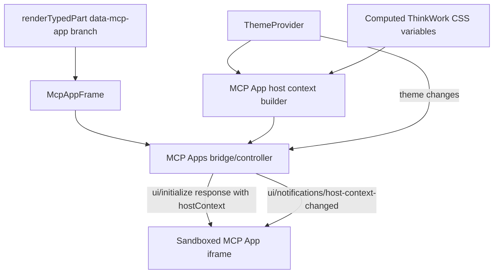
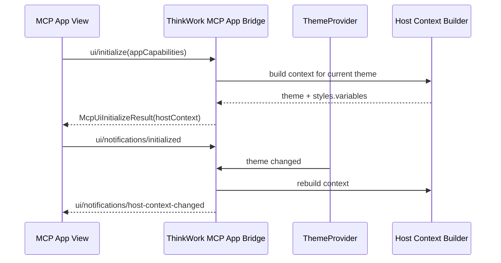

# feat: Add MCP Apps host theming context

## Summary

Implement the MCP Apps host context bridge for ThinkWork-rendered MCP Apps so
participating views receive the current host theme, standardized style
variables, and live theme-change notifications. The host work stays generic;
Dispatch-specific CSS consumption remains owned by TEI-16.

---

## Problem Frame

ThinkWork can render MCP App HTML returned by MCP tools, but the current
`data-mcp-app` frame is visually isolated from the host. The visible symptom is
an MCP App rendering in light mode inside a dark ThinkWork thread.

The requirements reject a Dispatch-only style input, a ThinkWork-only
`styleContext`, and arbitrary CSS injection. The correct contract is the MCP
Apps `hostContext`, especially `hostContext.theme`,
`hostContext.styles.variables`, and
`ui/notifications/host-context-changed` (see origin:
`docs/brainstorms/2026-06-28-mcp-app-host-theming-context-requirements.md`).

---

## Requirements

**Host context**

- R1. ThinkWork provides an MCP Apps host bridge for embedded MCP App views.
- R2. The bridge returns `hostContext.theme` during `ui/initialize`, mapping
  ThinkWork `light` to `"light"` and both `dark` and `dark-blue` to `"dark"`.
- R3. The bridge returns `hostContext.styles.variables` with standardized MCP
  Apps CSS custom properties that ThinkWork can map from its current theme.
- R4. The bridge sends `ui/notifications/host-context-changed` when the
  ThinkWork theme changes while a participating MCP App is visible.
- R5. Theme-change delivery does not require a new tool call, iframe reload,
  or thread refresh.

**Compatibility and safety**

- R6. `dark-blue` stays visually distinct through variables rather than a
  custom extension to the portable theme enum.
- R7. MCP Apps that ignore the host bridge continue rendering with the current
  iframe behavior.
- R8. ThinkWork does not add a `styleContext`, Dispatch-specific style input,
  arbitrary CSS payload, or Tailwind-class dependency as the theme contract.
- R9. No credentials, tenant identifiers, user identifiers, or authorization
  data are sent into the MCP App iframe as part of host context.

**Verification**

- R10. Automated coverage proves initial host context, theme-change
  notification, and non-participating app compatibility.
- R11. Production verification on `app.thinkwork.ai` proves a real MCP App
  after the companion Dispatch app work in TEI-16 is available.

---

## Key Technical Decisions

- **Use the MCP Apps lifecycle, not a custom style hook.** The View sends
  `ui/initialize`; ThinkWork responds with `McpUiInitializeResult` containing
  `hostContext`, then sends `ui/notifications/host-context-changed` only after
  the View has initialized.
- **Create an MCP Apps-specific frame controller.** The existing generated
  app iframe controller is useful prior art for opaque-origin safety, but its
  protocol is for ThinkWork-owned generated app shells. MCP App HTML is
  returned by MCP servers and should get an MCP Apps bridge with MCP Apps
  message names.
- **Keep the iframe sandbox opaque-origin.** The current `srcDoc` iframe does
  not use `allow-same-origin`, so parent trust must use
  `event.source === iframe.contentWindow` and a per-frame channel id rather
  than origin equality. Outbound `postMessage` uses `"*"` because opaque-origin
  iframes cannot be targeted by a concrete origin.
- **Map computed theme tokens to standardized variables.** ThinkWork should
  read computed CSS custom properties from the themed document root and map
  them into the MCP Apps variable names. Missing source tokens are omitted
  instead of invented.
- **Do not fail closed on bridge silence.** A View that never sends
  `ui/initialize` still renders as it does today. Lack of host-context
  participation is a styling limitation, not a rendering error.
- **Treat Dispatch as proof, not as host coupling.** THINK-102 should include
  fixture-level host tests. The real Dispatch smoke test becomes the production
  proof once TEI-16 consumes the variables.

---

## High-Level Technical Design





---

## Implementation Units

### U1. Build MCP App host context mapping

- **Goal:** Create the typed host-context builder that converts ThinkWork's
  current theme and computed CSS variables into the MCP Apps host context
  shape.
- **Requirements:** R2, R3, R6, R8, R9.
- **Dependencies:** None.
- **Files:**
  - Create: `apps/web/src/components/workbench/mcp-app-host-context.ts`
  - Test: `apps/web/src/components/workbench/mcp-app-host-context.test.ts`
- **Approach:** Define ThinkWork-owned types for the subset of
  `HostContext` used in this slice. The builder should accept the current
  `Theme` from `@thinkwork/ui`, map portable `theme`, and read computed CSS
  variables from the document root. Map only standardized MCP Apps variables
  from the spec, including background, text, border, ring, typography, radius,
  border width, and shadow keys where ThinkWork has source tokens.
- **Patterns to follow:**
  - `packages/ui/src/context/ThemeContext.tsx` for the current theme enum and
    `dark-blue` semantics.
  - `packages/ui/src/theme.css` for source token names and fallback behavior.
- **Test scenarios:**
  - Covers AE1. Given `dark-blue`, the builder returns `theme: "dark"` and
    variables based on the active dark-blue computed styles.
  - Covers AE2. Given `light`, the builder returns `theme: "light"` and
    variables based on the active light computed styles.
  - Given a source ThinkWork CSS variable is missing or blank, the builder
    omits the corresponding MCP Apps variable rather than emitting an invalid
    value.
  - Given the host context payload is inspected, it contains no tenant, user,
    token, or authorization-shaped fields.
- **Verification:** Unit tests cover the mapping table, missing-token handling,
  and the `dark-blue` portable theme rule.

### U2. Add the MCP Apps frame bridge

- **Goal:** Implement a parent-side bridge/controller for `data-mcp-app`
  iframes that handles MCP Apps lifecycle messages and theme notifications.
- **Requirements:** R1, R4, R5, R7, R9.
- **Dependencies:** U1.
- **Files:**
  - Create: `apps/web/src/components/workbench/mcp-app-frame-bridge.ts`
  - Test: `apps/web/src/components/workbench/mcp-app-frame-bridge.test.ts`
- **Approach:** Model the bridge as a small parent-side controller that owns a
  channel id, the iframe window reference, and lifecycle state. It should
  respond to `ui/initialize` requests with the current host context, remember
  when `ui/notifications/initialized` arrives, and send host-context-changed
  notifications only after initialization. It should drop messages whose
  source window or channel id does not match.
- **Technical design:** Directional message shape only; exact helper names can
  be chosen during implementation.

  ```text
  inbound request:  { jsonrpc, id, method: "ui/initialize", params }
  response result:  { protocolVersion, hostCapabilities, hostInfo, hostContext }
  outbound notify:  { method: "ui/notifications/host-context-changed", params }
  ```
- **Patterns to follow:**
  - `apps/web/src/applets/iframe-controller.ts` for opaque-origin
    `postMessage` safety, channel ids, source checks, and no-secrets posture.
  - `apps/web/src/iframe-shell/iframe-protocol.ts` for the existing
    no-`allow-same-origin` rationale and payload-safety guard.
- **Test scenarios:**
  - Given an iframe sends `ui/initialize` from the expected window and channel,
    the bridge replies with `hostContext`.
  - Given a message arrives from the wrong window, the bridge drops it without
    replying.
  - Given a message arrives with the wrong channel id, the bridge drops it
    without replying.
  - Given the theme changes before the View is initialized, the bridge does
    not send a notification early; the next initialize response contains the
    current theme.
  - Given the View has initialized, changing theme sends exactly one
    `ui/notifications/host-context-changed` message with the updated context.
  - Given the outbound payload is checked for secret-shaped keys, the bridge
    fails the test if credentials or user/tenant identifiers are added.
- **Verification:** Bridge tests prove lifecycle ordering, isolation checks,
  and live notification behavior without relying on a real MCP server.

### U3. Replace the inline MCP App iframe renderer with `McpAppFrame`

- **Goal:** Move the current `data-mcp-app` inline iframe branch into a
  component that can use `ThemeProvider` state and the bridge from U2.
- **Requirements:** R1, R2, R3, R7, R10.
- **Dependencies:** U1, U2.
- **Files:**
  - Modify: `apps/web/src/components/workbench/render-typed-part.tsx`
  - Create: `apps/web/src/components/workbench/McpAppFrame.tsx`
  - Test: `apps/web/src/components/workbench/render-typed-part.test.tsx`
  - Test: `apps/web/src/components/workbench/McpAppFrame.test.tsx`
- **Approach:** Keep `renderTypedPart` as the central switch, but return
  `McpAppFrame` for `data-mcp-app` parts. `McpAppFrame` should preserve the
  existing title, URI, `srcDoc`, sandbox, sizing, and `data-testid` surface
  while adding the bridge lifecycle. The iframe background should no longer
  hard-code a white canvas when the host can theme the View.
- **Patterns to follow:**
  - Current `data-mcp-app` rendering in
    `apps/web/src/components/workbench/render-typed-part.tsx`.
  - Existing MCP App renderer assertions in
    `apps/web/src/components/workbench/render-typed-part.test.tsx`.
- **Test scenarios:**
  - Covers AE4. Given an MCP App part with HTML but no bridge messages, the
    frame still renders title, URI, and `srcDoc`.
  - Given an MCP App part with empty HTML, the renderer still returns no UI.
  - Given a rendered frame, the iframe preserves the existing sandbox
    permissions and does not add `allow-same-origin`.
  - Given the component renders under `dark-blue`, the bridge receives a host
    context builder configured for dark portable theme.
- **Verification:** Renderer tests remain backward compatible, and the new
  component tests prove the frame is the single bridge integration point.

### U4. Cover live and persisted thread surfaces

- **Goal:** Ensure MCP App host-context behavior works for persisted messages
  and live streaming app chunks.
- **Requirements:** R4, R5, R7, R10.
- **Dependencies:** U3.
- **Files:**
  - Modify: `apps/web/src/components/workbench/TaskThreadView.test.tsx`
  - Modify: `apps/web/src/components/workbench/SpacesThreadDetailRoute.tsx`
  - Test: `apps/web/src/components/workbench/SpacesThreadDetailRoute.test.tsx`
  - Inspect: `packages/pi-runtime-core/src/mcp-app-runtime.ts`
  - Inspect: `packages/pi-runtime-core/test/agent-loop.test.ts`
  - Inspect: `packages/api/src/lib/chat-finalize/process-finalize.test.ts`
- **Approach:** The runtime and finalize layers should remain data carriers;
  host context is a rendering-time concern and should not be persisted into
  `McpAppPart`. Confirm live stream chunk handling and persisted message
  rendering both flow through the same `McpAppFrame` component. Add tests only
  where a surface bypasses `renderTypedPart` or needs explicit regression
  coverage.
- **Patterns to follow:**
  - MCP App extraction and event kinds in
    `packages/pi-runtime-core/src/mcp-app-runtime.ts`.
  - Persisted finalize coverage in
    `packages/api/src/lib/chat-finalize/process-finalize.test.ts`.
  - Thread rendering coverage in
    `apps/web/src/components/workbench/TaskThreadView.test.tsx`.
- **Test scenarios:**
  - Given a persisted assistant message with a `data-mcp-app` part, the thread
    renders an `McpAppFrame`.
  - Given a live `thinkwork_mcp_app.ui_message_chunk` event, the thread renders
    the same frame path as persisted messages.
  - Given a theme toggle while a live-rendered MCP App is visible, the frame
    bridge sends a host-context-changed notification.
  - Given the app part is finalized and later reloaded, no stale host-context
    payload is read from persisted message data.
- **Verification:** The host context remains render-time state and does not
  expand the persisted MCP App schema.

### U5. Add browser-level fixture verification

- **Goal:** Prove the host bridge behavior in a browser-like environment before
  relying on Dispatch as the production proof.
- **Requirements:** R5, R7, R10.
- **Dependencies:** U4.
- **Files:**
  - Create: `apps/web/src/components/workbench/mcp-app-fixtures.test.tsx`
  - Optional: `apps/web/src/test/visual/mcp-app-host-context.test.tsx`
- **Approach:** Use a minimal fixture MCP App HTML that sends
  `ui/initialize`, records the returned host context, sends
  `ui/notifications/initialized`, and updates visible text or data attributes
  when it receives `ui/notifications/host-context-changed`. This fixture should
  be test-only and not become a user-facing MCP server.
- **Test scenarios:**
  - Covers AE3. Given the fixture app is visible, toggling the host theme
    updates the fixture without reloading the iframe.
  - Covers AE4. Given a fixture app never sends `ui/initialize`, it remains
    visible and does not produce an error state.
  - Given multiple MCP App frames are visible, theme changes are sent to each
    initialized frame with its own channel id.
- **Verification:** Browser-level or DOM-level tests demonstrate behavior that
  unit tests cannot fully prove, especially live theme-change delivery across
  frame boundaries.

### U6. Production smoke with Dispatch after TEI-16

- **Goal:** Verify the full host/app contract with the real Dispatch MCP App in
  the deployed ThinkWork environment.
- **Requirements:** R11.
- **Dependencies:** U5 and TEI-16.
- **Files:**
  - Update: `docs/brainstorms/2026-06-28-mcp-app-host-theming-context-requirements.md`
    only if the production smoke reveals a requirements correction.
  - Update: `docs/plans/2026-06-28-001-feat-mcp-app-host-theming-plan.md`
    only if the implementation plan must change before execution.
- **Approach:** After THINK-102 and TEI-16 are deployed, authenticate the
  Dispatch MCP server on `app.thinkwork.ai`, call the Dispatch MCP App in a
  thread, and verify the embedded optimization UI matches the current host
  theme. Toggle ThinkWork between light, dark, and dark-blue while the app is
  visible and confirm the app updates through host-context-changed rather than
  a fresh assistant turn.
- **Test expectation:** No new automated test file in this unit. This is the
  production proof that depends on the companion Dispatch app work.
- **Verification:** Capture the thread URL, screenshots or recording, and the
  observed theme states in THINK-102 and TEI-16.

---

## Scope Boundaries

### In Scope

- Build the ThinkWork host bridge shell for MCP Apps.
- Supply `hostContext.theme` and `hostContext.styles.variables`.
- Send host-context-changed notifications after View initialization.
- Preserve current rendering for apps that do not participate in the bridge.
- Verify production behavior with a real MCP App once Dispatch consumes the
  host variables.

### Owned By TEI-16

- Updating the Dispatch MCP App CSS to use standardized variables.
- Defining Dispatch-owned fallback values for hosts that omit variables.
- Proving Dispatch app visuals in the deployed thread surface.

### Deferred to Follow-Up Work

- Full host support for every MCP Apps context field beyond theme/style.
- App-level brand or accent configuration in MCP server settings.
- Cross-host certification against ChatGPT, Claude, or other hosts.
- A public MCP App theming authoring guide for all future app authors.

---

## System-Wide Impact

This change affects the thread rendering surface rather than the MCP runtime
data model. `packages/pi-runtime-core` and API finalize code should continue to
transport `McpAppPart` data without embedding host theme state. Host context is
computed at render time so persisted conversations automatically reflect the
current ThinkWork theme.

The plan also affects future MCP App authors: ThinkWork becomes a standards
host that supplies portable variables, while apps remain responsible for using
CSS variable fallbacks when a host provides only partial context.

---

## Risks & Dependencies

- **Spec interpretation risk:** The MCP Apps extension is active work. The
  implementation should cite the 2026-01-26 spec version in code comments or
  tests where message names and variable keys are asserted.
- **Opaque iframe messaging risk:** The current sandbox requires `targetOrigin:
  "*"` and source/channel validation. Accidentally adding `allow-same-origin`
  or relying on `event.origin` would weaken the security model.
- **Partial token mapping risk:** ThinkWork may not have exact source tokens
  for every standardized variable. The bridge should omit unmapped variables
  and rely on app fallbacks rather than fabricating values.
- **App participation risk:** Non-participating apps will still render but may
  remain visually mismatched. That is acceptable for backward compatibility.
- **Production proof dependency:** The final visible proof depends on TEI-16
  landing the Dispatch-side CSS consumption.

---

## Acceptance Examples

- AE1. Given ThinkWork is in `dark-blue`, when an MCP App initializes, then
  the host context advertises `theme: "dark"` and includes dark-blue surface,
  text, and border values in standardized variables.
- AE2. Given ThinkWork is in `light`, when an MCP App initializes, then the
  host context advertises `theme: "light"` and includes light surface, text,
  and border values in standardized variables.
- AE3. Given a participating MCP App is visible, when the user changes the
  ThinkWork theme, then the app receives
  `ui/notifications/host-context-changed` and updates without another
  assistant turn.
- AE4. Given an older MCP App ignores the host bridge, when its tool result
  appears in a thread, then ThinkWork still renders it using the existing app
  frame behavior.
- AE5. Given THINK-102 and TEI-16 are deployed, when the Dispatch MCP App is
  called on `app.thinkwork.ai`, then the optimization UI matches the current
  host theme and updates when the theme changes.

---

## Sources & Research

- `docs/brainstorms/2026-06-28-mcp-app-host-theming-context-requirements.md`
  is the source of truth for product scope, non-goals, and acceptance examples.
- `CONCEPTS.md` defines MCP App Host Context as the portable runtime context
  ThinkWork supplies to embedded MCP App views.
- `apps/web/src/components/workbench/render-typed-part.tsx` is the current
  `data-mcp-app` rendering entry point.
- `packages/pi-runtime-core/src/mcp-app-runtime.ts` defines the current
  persisted `McpAppPart` shape and should stay host-theme agnostic.
- `packages/ui/src/context/ThemeContext.tsx` and `packages/ui/src/theme.css`
  define ThinkWork themes and CSS tokens.
- `apps/web/src/applets/iframe-controller.ts` and
  `apps/web/src/iframe-shell/iframe-protocol.ts` are the local prior art for
  opaque-origin iframe messaging.
- MCP Apps 2026-01-26 specification:
  `https://github.com/modelcontextprotocol/ext-apps/blob/main/specification/2026-01-26/apps.mdx`
  defines `hostContext`, standardized style variables, lifecycle messages, and
  `ui/notifications/host-context-changed`.
