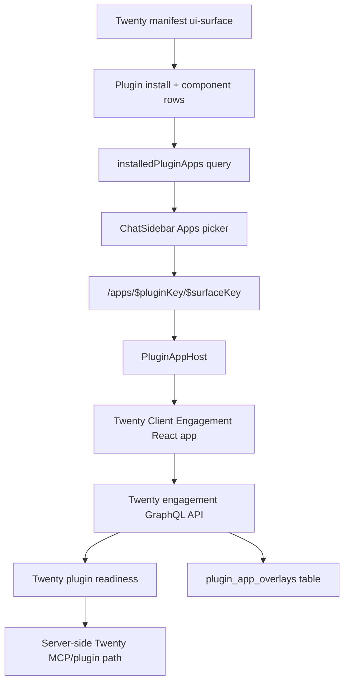
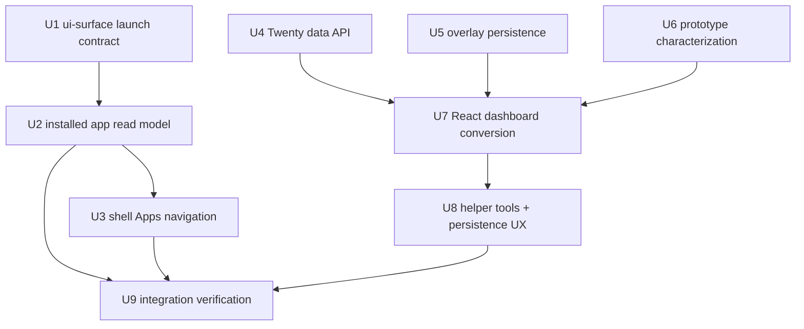
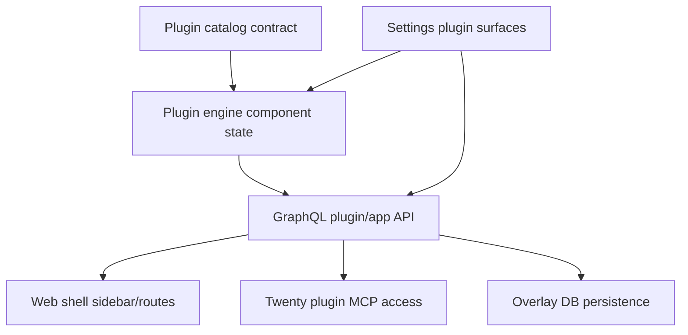

# feat: Add Twenty Client Engagement app

## Overview

Convert the deployed Twenty client engagement prototype into a first-party
ThinkWork plugin app. The work adds a main-shell Apps launch surface for
installed plugin app surfaces, declares the Client Engagement app from the
Twenty plugin manifest, routes the app through authenticated ThinkWork GraphQL
instead of browser-side MCP credentials, persists engagement overlay state in
ThinkWork storage, and rebuilds the prototype suite as ThinkWork-native React
components.

The source behavior is the deployed prototype at
`https://thinkwork-tools.vercel.app/client-dashboard.html` and the matching
`origin/feat/engagement-dashboard` HTML files listed in the origin requirements.
The implementation should be behavior-preserving: preserve the prototype's
information architecture, stage/layer concepts, linked tools, and dense
dashboard workflow while replacing the unsafe delivery mechanism.

---

## Problem Frame

ThinkWork currently has plugin install, activation, and declared `ui-surface`
contracts, but no main-shell app launcher that lets a plugin contribute a
day-to-day application. The Twenty prototype proves a high-value CRM projection:
customer and revenue teams can review accounts, opportunities, opportunity
layers, value alignment, discovery notes, KPIs, check-ins, and executive
summaries. It is not shippable because it is standalone HTML/CSS/JS, includes
browser-visible MCP credential material, calls the Twenty MCP endpoint directly
from the browser, and stores app-specific engagement data in `localStorage`
(see origin: `docs/brainstorms/2026-06-29-twenty-client-engagement-app-requirements.md`).

This plan turns that prototype into the first example of a ThinkWork Apps
surface: app launch belongs to the Twenty plugin, app usage belongs in the main
content area, Settings remains install/configuration, CRM-owned data comes from
live Twenty records via the authenticated plugin path, and app-local fields
become durable ThinkWork-owned overlay state.

---

## Requirements Trace

- R1. Add a generic plugin Apps launch surface driven by installed launchable
  plugin `ui-surface` components.
- R2. Declare the Twenty Client Engagement app from the Twenty CRM plugin
  manifest rather than hard-coding a one-off route.
- R3. Show the main-shell `Apps` nav item only when at least one installed
  plugin exposes a launchable app surface.
- R4. Render selected plugin apps inside the current shell main content area,
  not Settings, an external Vercel page, or the generated app artifact iframe.
- R5. Convert the full deployed prototype suite:
  `client-dashboard.html`, `discovery-value-alignment.html`,
  `discovery-presession-brief.html`, `discovery-tool-guide.html`,
  `discovery-tool.html`, and `opportunity-pipeline.html`.
- R6. Preserve the prototype's account sidebar, account profile,
  opportunities, opportunity detail, primary tabs, secondary opportunity tabs,
  stage guidance, tool actions, layer cards, KPI framework, 30/60/90 check-ins,
  executive view, and strategic pipeline.
- R7. Preserve CRM stage labels and opportunity layer concepts/statuses:
  Identified, Value Alignment, Discovery & Scope, SOW Delivered,
  Active Engagement, Closed Lost, Deferred; Core Problem, Optimization
  Opportunity, Strategic Control; Identified through Ready for SOW, Approved,
  and Deferred.
- R8. Read CRM-owned data from live Twenty CRM records through the authenticated
  Twenty plugin path: companies, opportunities, stages, amounts, close dates,
  and opportunity layers.
- R9. Persist ThinkWork-owned engagement overlay state durably for account
  enrichment, stakeholder maps, discovery artifacts, strategic goals, baseline
  capture, KPI framework, use-case scope, check-ins, action items, executive
  narrative, and the opportunity pipeline.
- R10. Do not include browser-side hard-coded MCP tokens, API keys, or
  tenant-wide CRM credentials; all CRM access must respect the current user's
  Twenty plugin activation.
- R11. Preserve prototype CRM mutations for opportunity stage and opportunity
  layer status updates, with clear user-facing errors when authorization or CRM
  readiness is missing.
- R12. Distinguish readiness states for missing install, unavailable managed
  app/MCP component, missing user activation, and app data load failure.
- R13. Use ThinkWork components and design-system conventions while preserving
  the prototype's operational dashboard density.

**Origin actors:** A1 revenue/customer manager, A2 account owner or engagement
lead, A3 ThinkWork user with Twenty access, A4 tenant admin/operator, A5
ThinkWork agent/planning implementer.

**Origin flows:** F1 launch the client engagement app from ThinkWork, F2 review
live CRM accounts and opportunities, F3 capture engagement overlay state, F4
use converted discovery and pipeline tools as one suite, F5 handle unavailable
CRM or app state.

**Origin acceptance examples:** AE1 Apps launch, AE2 prototype behavior parity,
AE3 authenticated CRM data without browser token, AE4 durable overlay restore,
AE5 readiness next action, AE6 ThinkWork-native visual fit.

---

## Scope Boundaries

- This is not an iframe/static hosting pass. The HTML files are source material
  for behavior and content mapping, not the production rendering mechanism.
- This is not a product redesign. Improve security, persistence, component fit,
  and integration quality, but preserve the v1 workflow unless implementation
  discovers an unavoidable blocker.
- This does not add a public third-party remote app runtime or arbitrary app
  marketplace. V1 supports trusted first-party plugin apps bundled with
  ThinkWork.
- This does not move every overlay field into Twenty as native/custom CRM
  objects. V1 keeps app-local engagement projection state in ThinkWork.
- This does not enforce premium billing. The manifest can carry future-friendly
  metadata, but entitlement/billing gates remain follow-up work.
- This does not duplicate ThinkWork shell chrome inside the app.

### Deferred to Follow-Up Work

- Premium packaging and billing enforcement for CRM projection packs:
  follow-up product/commerce issue after the first app surface exists.
- User-private draft overlays: v1 stores tenant-shared record overlays with
  audit metadata; private drafts can be added later if sales workflows require
  them.
- Arbitrary third-party plugin app hosting: v1 is a trusted bundled React app
  path only.
- Converting overlay fields into Twenty custom objects: evaluate after usage
  proves which fields should become CRM-native.

---

## Context & Research

### Relevant Code and Patterns

- `plugins/catalog/src/contracts.ts` already defines `UiSurfaceComponent` with
  `type`, `key`, `displayName`, and `intendedMount`; validation currently treats
  it as declared-only.
- `plugins/twenty/src/manifest.ts` owns Twenty plugin versions `0.1.0` and
  `0.2.0`, with `mcp-server` and `infrastructure` components. It is the right
  place to declare the Client Engagement app surface.
- `packages/database-pg/src/schema/plugins.ts` and
  `packages/api/src/lib/plugins/engine.ts` already persist and provision
  plugin components, including `ui-surface` as a no-op/provisioned component.
  The plan should keep provisioning no-op and add launch/read metadata rather
  than turning UI surfaces into infrastructure.
- `packages/database-pg/graphql/types/plugins.graphql`,
  `packages/api/src/graphql/resolvers/plugins/queries.ts`, and
  `packages/api/src/graphql/resolvers/plugins/shared.ts` are the existing
  member/admin plugin GraphQL surfaces. `pluginCatalog` and
  `myPluginActivations` are the nearest read patterns.
- `packages/api/src/graphql/resolvers/crm/startCustomerOnboardingFromCrmRecord.mutation.ts`
  contains a Twenty readiness pattern that checks installed plugin state,
  provisioned `crm` MCP component, `tenant_mcp_servers` row, and current-user
  plugin activation.
- `apps/web/src/routes/_authed/_shell.tsx` owns the shell main content outlet.
  `apps/web/src/components/shell/ChatSidebar.tsx` owns the main nav items and
  should host the conditional Apps picker.
- `apps/web/src/lib/settings-queries.ts` shows the current typed `graphql()`
  operation pattern backed by codegen, but app launch/runtime queries should
  live in a new app-scoped query module so Settings does not become the owner
  of day-to-day plugin app behavior.
- `apps/web/src/components/apps/GeneratedAppArtifactShell.tsx` and
  `apps/web/src/components/apps/AppArtifactSplitShell.tsx` are useful contrast
  points, but not the runtime for this feature: generated app artifacts are
  sandbox/iframe-oriented, while this app is a trusted first-party route.
- Prototype source inspection found direct calls to `find_many_companies`,
  `find_many_opportunities`, `find_many_opportunity_layers`,
  `updateOpportunity`, and `update_one_opportunity_layer`, plus overlay keys
  `tw_acct_v1_<companyId>`, `tw_opp_v1_<opportunityId>`, `tw_client_*`, and
  `tw_opp_pipeline_v3`.

### Institutional Learnings

- `docs/solutions/architecture-patterns/managed-app-mcp-oauth-lifecycle-2026-06-06.md`
  says managed apps and MCP connectors are coupled but separate state machines,
  and user-scoped MCP access must never fall back to tenant-wide credentials.
- `docs/solutions/architecture-patterns/plugin-source-boundaries-package-owned-deploy-verified-2026-06-17.md`
  says first-party plugin-specific source should live under the owning
  `plugins/<plugin-key>/` package where possible, while shared code should stay
  generic. V1 has one deliberate exception: trusted bundled web routes live in
  `apps/web` because the shell owns routing, auth context, codegen, and
  design-system composition. Keep Twenty-specific web source isolated under
  `apps/web/src/components/plugin-apps/twenty-client-engagement/` rather than
  scattering provider branches across shared shell components.
- `docs/solutions/logic-errors/oauth-authorize-wrong-user-id-binding-2026-04-21.md`
  warns against tenant-only user resolution. App data and overlay writes should
  use the resolved caller user and tenant, not arbitrary tenant rows.
- `docs/solutions/architecture-patterns/inert-first-seam-swap-multi-pr-pattern-2026-05-08.md`
  warns that GraphQL producer and generated-client consumer changes sometimes
  need to land together so each PR still builds.

### External References

- Deployed prototype behavior:
  `https://thinkwork-tools.vercel.app/client-dashboard.html`
- Source branch HTML used as behavior source:
  `origin/feat/engagement-dashboard`

---

## Key Technical Decisions

| Decision                                                                                           | Rationale                                                                                                                                                                                                                                            |
| -------------------------------------------------------------------------------------------------- | ---------------------------------------------------------------------------------------------------------------------------------------------------------------------------------------------------------------------------------------------------- |
| Extend `ui-surface` into a launchable app declaration instead of creating a separate app registry. | The plugin manifest already owns UI surface declarations and plugin install state already provisions component rows. Extending the existing contract keeps Apps tied to installed plugin state and avoids a parallel registry.                       |
| Keep UI-surface provisioning no-op.                                                                | Rendering a trusted bundled React route does not require infrastructure. The plugin engine should record/provision the component, while GraphQL computes whether it is launchable from install/component/activation/readiness state.                 |
| Use a trusted bundled React route, not generated app artifact iframe runtime.                      | The app needs authenticated ThinkWork GraphQL, Twenty plugin readiness, shell navigation, design-system components, and durable persistence. The generated app artifact shell is intentionally sandboxed and is the wrong security/runtime boundary. |
| Add a member-level installed app query.                                                            | The sidebar and app route need a low-cost read model of launchable apps. Reusing Settings catalog queries would overfetch admin/install detail and would blur Settings install/configuration with day-to-day app launch.                             |
| Put Twenty CRM access behind server-side GraphQL resolvers.                                        | The prototype's direct browser MCP credential is the main security flaw. The server can reuse current-user plugin activation/token plumbing and return user-facing readiness errors without exposing credentials.                                    |
| Store engagement overlays as tenant-shared, record-keyed ThinkWork app state.                      | The app is a collaborative account/opportunity projection. Tenant-shared overlays preserve continuity across users and devices, while `created_by`/`updated_by` maintains audit context. User-private drafts are a later layer.                      |
| Use characterization-first conversion for the prototype behavior.                                  | The product requirement is behavior-preserving. Capturing the HTML behavior/content map and writing parity tests before reshaping components reduces accidental redesign.                                                                            |

---

## Open Questions

### Resolved During Planning

- Should v1 use live CRM records or static prototype data? Resolved by the
  origin requirements: live Twenty CRM records for CRM-owned data, with seed
  content only for empty-state/demo/development verification.
- Should overlay state live in localStorage or ThinkWork? Resolved by the
  origin requirements: durable ThinkWork-owned state; `localStorage` is not
  acceptable.
- Should overlays be tenant-shared or user-private in v1? Resolved for planning
  as tenant-shared and record-keyed because the target workflows are account
  and customer-team workflows. User-private draft support is deferred.
- Should the plan implement raw HTML hosting first? Resolved by user direction:
  no; convert prototype HTML pages into a real app using ThinkWork components.

### Deferred to Implementation

- Exact MCP invocation helper for server-side Twenty reads/writes: implementation
  should reuse the current plugin activation/MCP runtime path if a helper
  exists, or extract one from the existing runtime path without exposing tokens.
- Exact GraphQL field shapes for CRM normalized records: implementation should
  keep them app-specific and minimal for v1, then generalize only when another
  plugin app needs the same contract.
- Final component split inside the Client Engagement app: the output structure
  below is the intended shape, but the implementer may split files further if
  parity tests or component readability require it.

---

## Output Structure

This illustrates the expected new/expanded structure. It is a scope declaration,
not a constraint; per-unit file lists are authoritative.

```text
apps/web/src/components/plugin-apps/
  PluginAppHost.tsx
  PluginAppLauncherMenu.tsx
  twenty-client-engagement/
    TwentyClientEngagementApp.tsx
    components/
    data/
    fixtures/
    prototype-behavior.test.ts
    TwentyClientEngagementApp.test.tsx

apps/web/src/routes/_authed/_shell/
  apps.index.tsx
  apps.$pluginKey.$surfaceKey.tsx

packages/api/src/graphql/resolvers/plugin-apps/
  index.ts
  installedPluginApps.query.ts
  pluginAppOverlays.ts
  twenty-client-engagement.ts
  twenty-readiness.ts

packages/database-pg/src/schema/
  plugin-app-overlays.ts
```

---

## High-Level Technical Design

> _This illustrates the intended approach and is directional guidance for
> review, not implementation specification. The implementing agent should treat
> it as context, not code to reproduce._



Implementation unit dependencies:



---

## Implementation Units

- U1. **Promote ui-surface to launchable app metadata**

**Goal:** Extend the plugin catalog contract so a `ui-surface` can declare a
trusted main-shell app launch while preserving existing settings-only
declarations.

**Requirements:** R1, R2, R4, R13; supports AE1 and AE6.

**Dependencies:** None.

**Files:**

- Modify: `plugins/catalog/src/contracts.ts`
- Modify: `plugins/catalog/src/__tests__/contracts.test.ts`
- Modify: `plugins/twenty/src/manifest.ts`
- Modify: `plugins/twenty/test/manifest.test.ts`
- Modify: `plugins/catalog/src/registry/generated-first-party.ts`
- Modify: `plugins/catalog/src/__tests__/plugin-registry.test.ts`
- Modify: `plugins/catalog/src/__tests__/build-catalog.test.ts`

**Approach:**

- Add an optional launch metadata object to `UiSurfaceComponent` rather than
  replacing `intendedMount`. Existing settings surfaces keep working with only
  `intendedMount`.
- The launch metadata should identify a trusted app route target in a generic
  way, for example app key, route segment, display name/icon metadata, and
  mount kind. It should not contain remote URLs, tokens, or implementation
  code.
- Add the Twenty Client Engagement surface to the latest Twenty manifest
  version. If versioning rules require a new manifest version, add it as the
  newest version while preserving older versions.
- Regenerate or update the first-party catalog output so the manifest change is
  visible to catalog reads.

**Patterns to follow:**

- Existing `UiSurfaceComponent` validation in `plugins/catalog/src/contracts.ts`.
- Existing ui-surface declarations in `plugins/company-data/src/manifest.ts`,
  `plugins/workos-auth/src/manifest.ts`, and `plugins/n8n/src/manifest.ts`.

**Test scenarios:**

- Happy path: a `ui-surface` with valid launch metadata validates and appears
  in the generated first-party catalog payload.
- Edge case: existing settings-only ui-surface components without launch
  metadata still validate.
- Error path: invalid launch metadata, such as an empty route segment or
  unsupported mount kind, fails manifest validation with a specific error.
- Integration: the Twenty manifest exposes one launchable Client Engagement app
  surface and still exposes its existing infrastructure and MCP components.

**Verification:**

- Catalog validation accepts the new Twenty manifest and rejects malformed
  launch metadata.
- Existing first-party plugin manifests remain valid.

---

- U2. **Add installed plugin app discovery**

**Goal:** Expose a member-level GraphQL read model for launchable installed app
surfaces, including readiness and next-action information.

**Requirements:** R1, R2, R3, R12; covers F1/F5 and AE1/AE5.

**Dependencies:** U1.

**Files:**

- Create: `packages/database-pg/graphql/types/plugin-apps.graphql`
- Modify: `packages/database-pg/graphql/types/plugins.graphql`
- Modify: `packages/api/src/graphql/resolvers/plugins/queries.ts`
- Modify: `packages/api/src/graphql/resolvers/index.ts`
- Create: `packages/api/src/graphql/resolvers/plugin-apps/installedPluginApps.query.ts`
- Create: `packages/api/src/graphql/resolvers/plugin-apps/index.ts`
- Create: `packages/api/src/graphql/resolvers/plugin-apps/twenty-readiness.ts`
- Modify: `packages/api/src/graphql/resolvers/plugins/plugins-resolvers.test.ts`
- Create: `packages/api/src/graphql/resolvers/plugin-apps/installedPluginApps.query.test.ts`
- Create: `apps/web/src/lib/plugin-app-queries.ts`
- Modify: `apps/web/src/gql/graphql.ts`
- Modify: `apps/web/src/gql/gql.ts`

**Approach:**

- Add a query such as `installedPluginApps` that returns only apps the current
  tenant can potentially launch. Keep it member-level, matching
  `myPluginActivations`.
- Put new app-launch and app-runtime schema in
  `packages/database-pg/graphql/types/plugin-apps.graphql`. Keep
  `plugins.graphql` changes limited to reusable catalog/component metadata if
  the launch metadata needs to appear in existing plugin catalog types.
- Add the query to a provider-neutral `plugin-apps` resolver family and wire
  that family into `packages/api/src/graphql/resolvers/index.ts`. Keep
  provider-specific readiness helpers under the same resolver family so the
  main plugin install resolvers do not absorb app-specific product logic.
- The query should derive app entries from installed plugin components whose
  manifest surface has launch metadata. It should not hard-code Twenty in the
  app list, though provider-specific readiness details can be delegated.
- Extract/share the Twenty readiness logic from
  `startCustomerOnboardingFromCrmRecord.mutation.ts` so both app launch and
  CRM workflow surfaces check install, component, MCP row, and activation
  consistently.
- Return readiness as structured state plus next action, not just a boolean:
  ready, plugin install required, component/managed app unavailable, activation
  required, and data-load failure once the app data API reports it.
- Regenerate GraphQL client artifacts after schema/query changes.

**Patterns to follow:**

- `requirePluginTenantMember` and `myPluginActivations` in
  `packages/api/src/graphql/resolvers/plugins/queries.ts`.
- Typed generated GraphQL operation pattern in
  `apps/web/src/lib/settings-queries.ts`, copied into an app-scoped module
  rather than reusing the Settings module.
- Twenty readiness logic in
  `packages/api/src/graphql/resolvers/crm/startCustomerOnboardingFromCrmRecord.mutation.ts`.

**Test scenarios:**

- Covers AE1. Happy path: an installed Twenty plugin with a provisioned
  launchable ui-surface returns a Client Engagement app entry.
- Edge case: an installed plugin with only settings `ui-surface` components
  returns no app entry.
- Edge case: no installed launchable app surfaces returns an empty list, not an
  error.
- Error path: missing current user context returns the same fail-closed
  behavior as other member-level plugin activation queries.
- Covers AE5. Integration: missing Twenty activation returns an app entry with
  activation-required readiness and a reconnect/install next action rather than
  hiding the app or throwing a generic error.

**Verification:**

- The app discovery query is provider-generic for list construction and
  provider-specific only for readiness enrichment.
- Generated web GraphQL documents include the new query.

---

- U3. **Add Apps navigation and app routes in the main shell**

**Goal:** Add a conditional Apps nav item with a popover picker and route
selection that renders plugin apps inside the current shell outlet.

**Requirements:** R1, R3, R4, R12, R13; covers F1/F5 and AE1/AE5/AE6.

**Dependencies:** U2.

**Files:**

- Modify: `apps/web/src/components/shell/ChatSidebar.tsx`
- Modify: `apps/web/src/components/shell/ChatSidebar.test.tsx`
- Create: `apps/web/src/components/plugin-apps/PluginAppLauncherMenu.tsx`
- Create: `apps/web/src/components/plugin-apps/PluginAppHost.tsx`
- Create: `apps/web/src/components/plugin-apps/PluginAppHost.test.tsx`
- Create: `apps/web/src/routes/_authed/_shell/apps.index.tsx`
- Create: `apps/web/src/routes/_authed/_shell/apps.$pluginKey.$surfaceKey.tsx`
- Create: `apps/web/src/routes/_authed/_shell/-apps-route.test.tsx`

**Approach:**

- Query `installedPluginApps` from the sidebar or a small launcher component.
  Hide Apps entirely when the resolved app list is empty.
- Use ThinkWork `Popover`, `SidebarMenuButton`, icon-button, and route active
  state patterns already present in `ChatSidebar.tsx`.
- Route app selection to a stable main-shell URL such as
  `/apps/twenty/client-engagement`, with route params matching the manifest
  launch metadata.
- `PluginAppHost` should validate that the selected app exists and is the
  trusted bundled route. For v1, dispatch the Twenty Client Engagement app by
  manifest app key/route segment; do not dynamically evaluate remote code.
- Render readiness-specific empty states in the main content area with next
  actions, not a blank surface.

**Patterns to follow:**

- Work Items and Automations nav active-state logic in
  `apps/web/src/components/shell/ChatSidebar.tsx`.
- Existing `Popover` primitives from `@thinkwork/ui`.
- Shell outlet sizing from `apps/web/src/routes/_authed/_shell.tsx`.

**Test scenarios:**

- Covers AE1. Happy path: with one ready app, Apps appears, the popover lists
  Twenty Client Engagement, and selecting it navigates to the app route.
- Edge case: with no launchable apps, Apps is not rendered in the sidebar.
- Edge case: when the current route is an app route, the Apps nav item is
  highlighted and thread selection state is cleared like other non-thread
  routes.
- Covers AE5. Error path: activation-required readiness renders a specific
  reconnect next action in the main area.
- Integration: unknown plugin/surface route renders a not-found/degraded state
  without crashing the shell.

**Verification:**

- The app renders inside `<Outlet />` under `_authed/_shell` and does not
  duplicate global sidebar or top bar chrome.

---

- U4. **Build the Twenty engagement CRM data API**

**Goal:** Provide server-side app-specific GraphQL operations that load and
mutate CRM-owned data through the authenticated Twenty plugin path.

**Requirements:** R8, R10, R11, R12; covers F2/F5 and AE2/AE3/AE5.

**Dependencies:** U2.

**Files:**

- Modify: `packages/database-pg/graphql/types/plugin-apps.graphql`
- Modify: `packages/database-pg/graphql/types/plugins.graphql`
- Create: `packages/api/src/graphql/resolvers/plugin-apps/twenty-client-engagement.ts`
- Modify: `packages/api/src/graphql/resolvers/plugin-apps/index.ts`
- Modify: `packages/api/src/graphql/resolvers/index.ts`
- Create: `packages/api/src/graphql/resolvers/plugin-apps/twenty-client-engagement.test.ts`
- Modify: `apps/web/src/lib/plugin-app-queries.ts`
- Modify: `apps/web/src/gql/graphql.ts`
- Modify: `apps/web/src/gql/gql.ts`

**Approach:**

- Add an app-specific query that returns normalized companies, opportunities,
  and opportunity layers needed by the prototype. Keep the contract narrow to
  the app instead of creating a broad CRM API prematurely.
- Keep the app-specific GraphQL type names clearly scoped, for example with a
  `TwentyEngagement*` prefix, so future plugin apps can coexist without
  collisions or prematurely generalized CRM abstractions.
- Add mutations for opportunity stage update and opportunity layer status
  update. These should call the same server-side plugin/MCP path as the query
  and return normalized records or an app-level refresh payload.
- Enforce current tenant/member and current-user Twenty activation. Never accept
  MCP endpoint URLs or bearer tokens from the browser.
- Map downstream tool/MCP failures into GraphQL errors that the app can render
  as readiness/data-load states.
- Preserve the prototype's stage/layer vocabulary in the normalized app model
  even if Twenty field values need adapter-level mapping.

**Patterns to follow:**

- `startTwentyCustomerOnboarding` readiness and caller resolution.
- Existing app-level OAuth activation model in plugin resolvers.
- Prototype tool calls from `origin/feat/engagement-dashboard:client-dashboard.html`.

**Test scenarios:**

- Covers AE3. Happy path: a user with active Twenty plugin activation receives
  companies, opportunities, and layers without any browser-provided MCP
  credential.
- Covers AE2. Happy path: opportunity stage and layer status values normalize to
  the prototype's expected stage/layer labels.
- Covers AE5. Error path: missing plugin install, missing component/MCP row,
  and missing activation each produce distinguishable error/readiness codes.
- Error path: a downstream Twenty tool failure returns a data-load failure
  message that preserves user-safe context without leaking token or secret data.
- Integration: stage update calls the server-side Twenty path and returns an
  updated stage that the web app can reflect without a full page reload.

**Verification:**

- Network-visible browser GraphQL variables contain only app inputs such as
  tenant/record ids and desired status/stage, never MCP credentials.

---

- U5. **Add durable plugin app overlay persistence**

**Goal:** Replace prototype `localStorage` overlay state with durable
ThinkWork-owned app state keyed to Twenty records.

**Requirements:** R9; covers F3 and AE4.

**Dependencies:** U2.

**Files:**

- Create: `packages/database-pg/src/schema/plugin-app-overlays.ts`
- Modify: `packages/database-pg/src/schema/index.ts`
- Create: `packages/database-pg/drizzle/<next>_plugin_app_overlays.sql`
- Modify: `packages/database-pg/graphql/types/plugin-apps.graphql`
- Modify: `packages/database-pg/graphql/types/plugins.graphql`
- Create: `packages/api/src/graphql/resolvers/plugin-apps/pluginAppOverlays.ts`
- Create: `packages/api/src/graphql/resolvers/plugin-apps/pluginAppOverlays.test.ts`
- Modify: `packages/api/src/graphql/resolvers/plugin-apps/index.ts`
- Modify: `packages/api/src/graphql/resolvers/index.ts`
- Modify: `apps/web/src/lib/plugin-app-queries.ts`
- Modify: `apps/web/src/gql/graphql.ts`
- Modify: `apps/web/src/gql/gql.ts`

**Approach:**

- Create a generic overlay table rather than a Twenty-only table so future
  trusted plugin apps can reuse the persistence shape.
- Key rows by tenant, plugin install, app surface key, provider record type,
  provider record id, and overlay section key. Store overlay payload as JSONB,
  with `created_by_user_id`, `updated_by_user_id`, and timestamps.
- Use a uniqueness constraint over the record/surface/section identity so
  upserts are idempotent and do not duplicate when a user types quickly or
  retries after a network error.
- Keep overlays tenant-shared in v1. The row's user metadata is audit context,
  not visibility scoping.
- The GraphQL API should expose get/upsert operations scoped through the
  installed plugin app and current tenant; callers cannot write overlays for
  arbitrary plugin installs or tenants.
- Resolver writes should require both tenant membership and a launchable
  installed app surface. This prevents overlay storage from becoming a generic
  unauthenticated JSON bucket with only a tenant id as protection.

**Patterns to follow:**

- JSONB payload style from `packages/database-pg/src/schema/recipes.ts`.
- Provider record keying and plugin linkage from
  `packages/database-pg/src/schema/crm-work-links.ts`.
- Current-user resolution guidance from
  `docs/solutions/logic-errors/oauth-authorize-wrong-user-id-binding-2026-04-21.md`.

**Test scenarios:**

- Covers AE4. Happy path: upserting KPI baseline and executive narrative for an
  opportunity then re-querying returns the same values for that opportunity.
- Edge case: overlays for two opportunities with the same section key do not
  collide.
- Edge case: a second user in the same tenant can read tenant-shared overlay
  state, and `updatedBy` changes on write.
- Error path: a user from another tenant cannot read or write the overlay row.
- Integration: repeated upserts with the same record/surface/section update the
  existing row and preserve a single identity.

**Verification:**

- No production app component writes `tw_acct_v1_*`, `tw_opp_v1_*`,
  `tw_client_*`, or `tw_opp_pipeline_v3` to `localStorage`.

---

- U6. **Characterize prototype behavior and data mappings**

**Goal:** Capture the behavior/content contract of the prototype before the
React conversion changes structure.

**Requirements:** R5, R6, R7, R13; covers F2/F4 and AE2/AE6.

**Dependencies:** None.

**Files:**

- Create: `apps/web/src/components/plugin-apps/twenty-client-engagement/fixtures/prototype-pages.ts`
- Create: `apps/web/src/components/plugin-apps/twenty-client-engagement/fixtures/prototype-seed-data.ts`
- Create: `apps/web/src/components/plugin-apps/twenty-client-engagement/prototype-behavior.test.ts`
- Create: `apps/web/src/components/plugin-apps/twenty-client-engagement/data/model.ts`
- Reference: `origin/feat/engagement-dashboard:client-dashboard.html`
- Reference: `origin/feat/engagement-dashboard:discovery-value-alignment.html`
- Reference: `origin/feat/engagement-dashboard:discovery-presession-brief.html`
- Reference: `origin/feat/engagement-dashboard:discovery-tool-guide.html`
- Reference: `origin/feat/engagement-dashboard:discovery-tool.html`
- Reference: `origin/feat/engagement-dashboard:opportunity-pipeline.html`

**Approach:**

- Convert prototype constants, labels, stage/layer vocabularies, tool-step
  metadata, and seed content into typed fixtures and mapping tests. Do not
  port unsafe credential or direct fetch code.
- Characterize the app-local overlay keys from the prototype and map each one
  to an explicit overlay section in the new persistence model.
- Capture the full suite navigation model: dashboard, value alignment,
  pre-session brief, discovery guide, discovery tool, and opportunity pipeline.
- Keep characterization tests focused on behavior and labels, not pixel-perfect
  styles.

**Execution note:** Add characterization coverage before implementing React
conversion components so accidental redesign shows up as a failing test.

**Patterns to follow:**

- Existing fixture-driven tests in nearby app component tests.
- Prototype source on `origin/feat/engagement-dashboard` as the product behavior
  source.

**Test scenarios:**

- Happy path: all six prototype pages are represented in the route/tool model.
- Happy path: stage labels and layer statuses match the origin requirements and
  prototype constants.
- Edge case: tool actions with no available destination, such as SOW placeholder
  behavior, are represented as disabled/coming-soon actions rather than broken
  links.
- Integration: every prototype `localStorage` overlay bucket maps to either a
  company overlay, opportunity overlay, or app-level pipeline overlay section.

**Verification:**

- A reviewer can inspect the fixtures/tests and see how each HTML page is
  accounted for before reading the React implementation.

---

- U7. **Convert the dashboard and opportunity workspace to ThinkWork React**

**Goal:** Rebuild the main dashboard, account profile, opportunity list/detail,
stage/tools, layer cards, and secondary opportunity tabs with ThinkWork
components and the app data/overlay APIs.

**Requirements:** R5, R6, R7, R8, R9, R10, R11, R13; covers F2/F3 and
AE2/AE3/AE4/AE6.

**Dependencies:** U4, U5, U6.

**Files:**

- Create: `apps/web/src/components/plugin-apps/twenty-client-engagement/TwentyClientEngagementApp.tsx`
- Create: `apps/web/src/components/plugin-apps/twenty-client-engagement/components/AccountSidebar.tsx`
- Create: `apps/web/src/components/plugin-apps/twenty-client-engagement/components/AccountProfile.tsx`
- Create: `apps/web/src/components/plugin-apps/twenty-client-engagement/components/OpportunityList.tsx`
- Create: `apps/web/src/components/plugin-apps/twenty-client-engagement/components/OpportunityDetail.tsx`
- Create: `apps/web/src/components/plugin-apps/twenty-client-engagement/components/OpportunityLayers.tsx`
- Create: `apps/web/src/components/plugin-apps/twenty-client-engagement/components/OpportunityTabs.tsx`
- Create: `apps/web/src/components/plugin-apps/twenty-client-engagement/data/useTwentyEngagementData.ts`
- Create: `apps/web/src/components/plugin-apps/twenty-client-engagement/TwentyClientEngagementApp.test.tsx`

**Approach:**

- Build a dense operational layout that fills the shell main content area:
  app-local account sidebar, main account/opportunity content, compact tabs,
  cards/tables, and form controls. Do not use a marketing hero or decorative
  card-heavy redesign.
- Use ThinkWork UI primitives for buttons, tabs, badges, popovers, inputs,
  selects, textarea fields, skeleton/loading, and empty/error states.
- Hydrate CRM data and overlay state separately, then merge them in a view
  model so CRM-owned fields and app-owned fields remain conceptually distinct.
- Save overlay edits through debounced or explicit upsert mutations depending
  on field risk. For text-heavy notes, prefer explicit save or clear dirty
  state; for selects/statuses, immediate mutation is acceptable.
- Stage and layer mutations must call U4 CRM mutations, not overlay persistence.
- Keep seed/demo content behind fixtures/dev empty states only; production data
  uses live CRM results when available.

**Patterns to follow:**

- Shell sizing and overflow constraints from `_authed/_shell.tsx`.
- Work Items dense operational styling and filter controls as a visual density
  reference.
- `@thinkwork/ui` primitives already imported throughout `apps/web`.

**Test scenarios:**

- Covers AE2. Happy path: selecting an account shows profile and opportunity
  data, then selecting an opportunity shows stage guidance, tools, layer cards,
  and secondary tabs.
- Covers AE4. Happy path: editing KPI baseline and executive narrative calls
  overlay upsert and restores the values after remount with the same record id.
- Covers AE3. Integration: initial data load uses the GraphQL app data query,
  not direct `fetch` to the Twenty MCP URL.
- Edge case: an account with no opportunities renders a useful empty state
  without breaking tabs.
- Error path: failed stage mutation rolls back optimistic UI or shows clear
  unsaved/error state.
- Visual fit: compact controls do not overflow at common shell widths and the
  app does not duplicate global sidebar/topbar.

**Verification:**

- The converted dashboard supports the same core workflow as the prototype
  while keeping CRM data and overlay data paths separate.

---

- U8. **Convert discovery tools and strategic pipeline workflows**

**Goal:** Convert the prototype's linked discovery/value/pipeline pages into
one coherent Client Engagement app experience.

**Requirements:** R5, R6, R7, R9, R13; covers F4 and AE2/AE4/AE6.

**Dependencies:** U5, U6, U7.

**Files:**

- Create: `apps/web/src/components/plugin-apps/twenty-client-engagement/components/ToolWorkspace.tsx`
- Create: `apps/web/src/components/plugin-apps/twenty-client-engagement/components/ValueAlignmentTool.tsx`
- Create: `apps/web/src/components/plugin-apps/twenty-client-engagement/components/PreSessionBrief.tsx`
- Create: `apps/web/src/components/plugin-apps/twenty-client-engagement/components/DiscoveryGuide.tsx`
- Create: `apps/web/src/components/plugin-apps/twenty-client-engagement/components/DiscoveryTool.tsx`
- Create: `apps/web/src/components/plugin-apps/twenty-client-engagement/components/OpportunityPipeline.tsx`
- Create: `apps/web/src/components/plugin-apps/twenty-client-engagement/ToolWorkspace.test.tsx`
- Create: `apps/web/src/components/plugin-apps/twenty-client-engagement/OpportunityPipeline.test.tsx`

**Approach:**

- Keep the tools inside the app route rather than opening separate HTML pages.
  Tool actions should switch app-internal view state or route search params
  while preserving selected account/opportunity context when relevant.
- Convert the `opportunity-pipeline.html` strategic/use-case pipeline into an
  app-level overlay section. Existing default content can seed demo/dev states,
  but user edits persist through the overlay API.
- Discovery and value-alignment tools should use the same ThinkWork form
  components and overlay persistence model as the dashboard.
- Disabled or not-yet-actionable tool steps should be explicit in the UI so the
  converted app does not create dead links.

**Patterns to follow:**

- Prototype page list and `TOOL_STEPS` mapping from U6 fixtures.
- Existing ThinkWork tab/menu controls from `@thinkwork/ui`.

**Test scenarios:**

- Happy path: stage/tool action from an opportunity opens the matching tool
  view with selected opportunity context.
- Happy path: opportunity pipeline edits persist through app-level overlay
  upsert and reload.
- Edge case: opening a tool without a selected opportunity shows a scoped empty
  state or account selector rather than crashing.
- Error path: overlay save failure leaves edited content visible with retry
  affordance and does not silently discard the user input.
- Covers AE2. Integration: all six prototype pages have a reachable converted
  app view or a deliberate disabled placeholder matching prototype behavior.

**Verification:**

- The full deployed prototype suite is represented as one app experience under
  Apps, not scattered static pages.

---

- U9. **Verify integration, generation, docs, and rollout posture**

**Goal:** Close the feature with generated artifacts, tests, docs, and browser
verification that prove the installed app path works end to end.

**Requirements:** R1-R13; covers AE1-AE6.

**Dependencies:** U1, U2, U3, U4, U5, U7, U8.

**Files:**

- Modify: `plugins/twenty/README.md`
- Modify: `apps/web/src/components/settings/plugins/PluginDetail.test.tsx`
- Modify: `apps/web/src/components/settings/plugins/PluginsPage.test.tsx`
- Modify: `packages/api/src/graphql/resolvers/plugins/plugins-resolvers.test.ts`
- Modify: `docs/brainstorms/2026-06-29-twenty-client-engagement-app-requirements.md` if implementation discovers a requirements correction
- Create: `docs/verification/twenty-client-engagement-app.md`

**Approach:**

- Regenerate GraphQL schemas/codegen for API and web consumers after schema
  changes.
- Verify plugin Settings still shows install/configuration state and does not
  become the app usage surface.
- Add documentation explaining that Twenty now contributes a Client Engagement
  app under Apps, including readiness expectations and reconnect behavior.
- Browser-verify the app in a local dev server with the shell open, including
  sidebar Apps picker, app route, readiness states, dashboard workflow, overlay
  save/reload, and no duplicate shell chrome.
- If deployed verification is in scope for the implementation PR, follow the
  repo's application-plugin verification rule: prove the ThinkWork install path,
  then verify the deployed app/MCP integration through ThinkWork.

**Patterns to follow:**

- Existing plugin settings tests for launch URL and ui-surface display.
- Repo verification guidance in `AGENTS.md`.

**Test scenarios:**

- Covers AE1. Integration: installing/using a Twenty plugin with the app surface
  makes Apps appear and selecting the app renders the main content route.
- Covers AE3. Security: browser source/network traffic does not expose a raw
  MCP bearer token or tenant-wide credential.
- Covers AE4. Persistence: overlay edits survive remount/reload and are scoped
  to the correct CRM record.
- Covers AE5. Readiness: missing activation and unavailable component states
  produce specific next actions.
- Covers AE6. Visual: screenshots at desktop and narrow shell widths show no
  text/control overlap and no duplicated shell chrome.

**Verification:**

- All generated GraphQL artifacts are current, feature tests pass, and visual
  smoke evidence is recorded in `docs/verification/twenty-client-engagement-app.md`.

---

## System-Wide Impact



- **Interaction graph:** plugin manifests feed catalog generation and install
  component rows; the app discovery query feeds the sidebar; app routes feed
  the trusted React host; app data resolvers feed Twenty MCP access and overlay
  storage.
- **Error propagation:** install/component/activation readiness should surface
  as structured app readiness, while CRM data-load/mutation failures should
  surface inside the app without crashing the shell.
- **State lifecycle risks:** plugin install teardown should either cascade or
  orphan-safe overlay state according to the chosen FK behavior. Overlay rows
  should not block plugin uninstall, but stale rows must not become visible to
  another tenant/install.
- **API surface parity:** GraphQL schema/codegen changes touch API and web
  consumers together. Avoid a producer-only PR that leaves generated clients
  stale.
- **Integration coverage:** unit tests alone are not enough; browser shell
  verification must prove Apps visibility, route rendering, readiness states,
  and no duplicate shell chrome.
- **Unchanged invariants:** Settings remains install/configuration; generated
  app artifacts remain sandboxed; plugin component provisioning remains no-op
  for `ui-surface`; raw CRM credentials remain server-side only.

---

## Risks & Dependencies

| Risk                                                                                    | Likelihood | Impact | Mitigation                                                                                                                                                                                    |
| --------------------------------------------------------------------------------------- | ---------- | ------ | --------------------------------------------------------------------------------------------------------------------------------------------------------------------------------------------- |
| The app accidentally bypasses plugin activation and uses a tenant-wide credential.      | Medium     | High   | Put all CRM reads/writes behind server-side resolvers that require current-user activation; add tests that browser variables contain no credential material.                                  |
| The React conversion drifts from prototype behavior.                                    | High       | Medium | Add characterization fixtures/tests first and trace every prototype page/tool/local state bucket to a converted view or overlay section.                                                      |
| GraphQL schema/codegen changes create build-order churn.                                | Medium     | Medium | Keep producer schema, resolver, web query, and generated files in the same implementation slice unless splitting still leaves every consumer buildable.                                       |
| Overlay JSONB becomes an unstructured dumping ground.                                   | Medium     | Medium | Key overlays by app surface, record, and section; keep typed web view models and app-specific validation around the JSON payloads.                                                            |
| Sidebar app discovery overfetches or slows every shell load.                            | Medium     | Medium | Add a narrow `installedPluginApps` query rather than reusing full Settings catalog/install queries.                                                                                           |
| The app duplicates CRM-native state into overlays.                                      | Medium     | High   | Explicitly separate CRM-owned fields from overlay-owned fields in the app data model and mutation paths.                                                                                      |
| The visual conversion becomes a marketing-style dashboard rather than a dense workflow. | Medium     | Medium | Follow existing ThinkWork shell/work-items density and verify screenshots at realistic widths.                                                                                                |
| Twenty-specific frontend code leaks into generic shell components.                      | Medium     | Medium | Keep provider-specific React under `apps/web/src/components/plugin-apps/twenty-client-engagement/`; shared shell code should only know about generic app launch metadata and `PluginAppHost`. |

---

## Phased Delivery

### Phase 1: Platform App Surface

- U1, U2, and U3 establish the generic plugin Apps surface and route host.
- This phase can land without the full Twenty app UI if the host shows a
  readiness/placeholder state only for trusted launch metadata.

### Phase 2: Data and Persistence Substrate

- U4 and U5 add the authenticated Twenty data path and durable overlay store.
- These units can be verified with resolver tests before the full UI conversion
  is complete.

### Phase 3: Behavior-Preserving Conversion

- U6, U7, and U8 convert the prototype suite into React using the data and
  overlay substrate.
- This phase should stay characterization-first.

### Phase 4: Verification and Rollout

- U9 updates generated artifacts/docs and proves shell, data, security,
  persistence, and visual behavior.

---

## Documentation / Operational Notes

- Update `plugins/twenty/README.md` with the new app surface, readiness model,
  and distinction between Settings configuration and Apps usage.
- Record verification evidence in
  `docs/verification/twenty-client-engagement-app.md`, especially browser
  screenshots and proof that no browser-visible MCP credential remains.
- Keep Linear THINK-109 in Plan Review until the plan is accepted; move to Ready
  to Work only after human review accepts scope and sequencing.
- If implementation ships in multiple PRs, keep each PR buildable with current
  generated GraphQL artifacts and use the phased delivery section as the split.

---

## Success Metrics

- A user with an installed/activated Twenty plugin sees Apps, selects Client
  Engagement, and completes the prototype's account/opportunity review workflow
  inside ThinkWork.
- Browser source and network traffic contain no raw Twenty MCP bearer token or
  tenant-wide credential.
- Overlay fields edited for a CRM opportunity survive reload and another
  browser session for the same tenant/record.
- All six prototype pages are accounted for in the converted app.
- Settings continues to function as install/configuration, not day-to-day app
  usage.

---

## Sources & References

- **Origin document:** `docs/brainstorms/2026-06-29-twenty-client-engagement-app-requirements.md`
- **Linear issue:** THINK-109
- **Prototype branch:** `origin/feat/engagement-dashboard`
- **Deployed prototype:** `https://thinkwork-tools.vercel.app/client-dashboard.html`
- **Plugin catalog contract:** `plugins/catalog/src/contracts.ts`
- **Twenty manifest:** `plugins/twenty/src/manifest.ts`
- **Plugin GraphQL schema:** `packages/database-pg/graphql/types/plugins.graphql`
- **Plugin resolver patterns:** `packages/api/src/graphql/resolvers/plugins/queries.ts`
- **Twenty readiness pattern:** `packages/api/src/graphql/resolvers/crm/startCustomerOnboardingFromCrmRecord.mutation.ts`
- **Shell/sidebar:** `apps/web/src/routes/_authed/_shell.tsx`,
  `apps/web/src/components/shell/ChatSidebar.tsx`
- **Institutional learning:** `docs/solutions/architecture-patterns/managed-app-mcp-oauth-lifecycle-2026-06-06.md`
- **Institutional learning:** `docs/solutions/architecture-patterns/plugin-source-boundaries-package-owned-deploy-verified-2026-06-17.md`
- **Institutional learning:** `docs/solutions/logic-errors/oauth-authorize-wrong-user-id-binding-2026-04-21.md`
