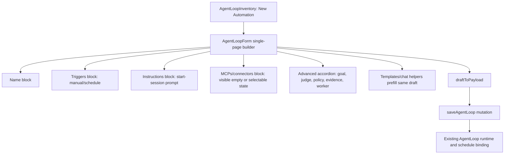

# feat: Add Devin-style Automation Builder

## Overview

Replace the current mode-based New Automation form with a Devin-style single
page builder. The new creation surface should show the user the real shape of an
Automation in one scan: name, triggers, instructions, MCPs/connectors, Advanced,
and Create automation. Chat setup becomes optional assistance rather than the
default mode.

This plan changes the web creation experience while preserving the existing
Automation/AgentLoop runtime substrate. The save path remains
`SaveAgentLoopInput`; manual and schedule triggers remain the v1 supported
trigger families; unsupported Devin trigger or instruction types are not faked.

---

## Problem Frame

The origin requirements describe the current New Automation flow as confusing
because it asks users to choose between Chat, Manual, and Advanced modes and
pushes runtime details into an Advanced side panel before the user has a clear
Automation in mind. The desired product shape is a close copy of Devin's
Automation builder: obvious trigger and instruction blocks, visible MCPs, and
advanced settings progressively disclosed in-page (see origin:
`docs/brainstorms/2026-06-30-think-111-devin-style-automation-builder-requirements.md`).

The implementation must support two first-class actors on the same default page:
routine operators who only need a name, trigger, and plain-language instruction;
and power users who need to see where connector/MCP wiring belongs.

---

## Requirements Trace

- R1. New Automation uses a single Devin-style builder page instead of Chat /
  Manual / Advanced mode tabs.
- R2. The visible page order is name, triggers, instructions, MCPs/connectors,
  Advanced, and Create automation.
- R3. Add trigger and Add instruction are obvious primary actions in their
  sections.
- R4. Routine creation works with only name, trigger, and plain-language
  instruction.
- R5. Power users can identify connector/MCP wiring from the default page.
- R6. Trigger creation uses a Devin-like menu or block interaction with supported
  trigger families first.
- R7. Instruction blocks make action type explicit for supported ThinkWork
  actions.
- R8. Advanced settings are an in-page accordion, not a side panel.
- R9. The existing Automation/AgentLoop runtime behavior is preserved.
- R10. MCPs/connectors are visible and non-blocking when empty.
- R11. Chat assistance is optional and not a required creation step.
- R12. Templates/presets prefill the single-page builder.
- R13. Existing advanced capabilities are retained where practical and moved into
  the page structure.

**Origin actors:** A1 non-technical operator, A2 power user, A3 implementer or planner.
**Origin flows:** F1 routine Automation creation, F2 connector-heavy Automation creation, F3 advanced control adjustment.
**Origin acceptance examples:** AE1 Devin-style builder instead of tabs/side panel, AE2 clear Add trigger menu, AE3 normal runtime-backed save, AE4 MCP empty state does not block, AE5 connector/MCP wiring is visible without opening Advanced.

---

## Scope Boundaries

- Do not introduce a visual workflow canvas.
- Do not rename database tables or migrate the AgentLoop runtime model.
- Do not make chat setup the default creation flow.
- Do not require MCPs/connectors before an Automation can be created.
- Do not remove advanced runtime controls solely because they no longer live in a
  side panel.
- Do not add unsupported Devin trigger or instruction types as fake UI choices.

### Deferred to Follow-Up Work

- Connector-backed trigger families beyond manual and schedule: defer until the
  runtime can persist and execute those trigger specs safely.
- Real MCP/connector binding if no current web query can supply selectable MCPs:
  this plan should render the section and preserve the empty state, then bind it
  when a real data source is available.

---

## Context & Research

### Relevant Code and Patterns

- `apps/web/src/components/agent-loops/AgentLoopForm.tsx` owns the current
  creation form. It defaults to Chat, renders mode buttons, starts builder
  threads, delegates to `AutomationEasyForm`, opens `AutomationAdvancedInspector`
  as a sheet, and saves through `draftToPayload`.
- `apps/web/src/components/agent-loops/AutomationEasyForm.tsx` already contains
  reusable prompt, active, Space, trigger, schedule picker, and suitability
  controls that can be reshaped into the single-page builder.
- `apps/web/src/components/agent-loops/AutomationAdvancedInspector.tsx` contains
  the fields to move into an in-page Advanced accordion: identity, goal,
  worker/judge, policy, and evidence.
- `apps/web/src/components/agent-loops/AutomationPresetSheet.tsx` and
  `agent-loop-presets.ts` already prefill an `AgentLoopDraft`; keep this
  behavior but return to the single builder instead of selecting a creation mode.
- `apps/web/src/components/agent-loops/agent-loop-utils.ts` owns
  `defaultAgentLoopDraft`, `draftToPayload`, and `validateDraft`. This is the
  main compatibility layer between the new page shape and the existing runtime.
- `packages/api/src/graphql/resolvers/agent-loops/saveAgentLoop.mutation.ts` and
  `packages/api/src/lib/agent-loops/automation-draft.ts` already normalize
  prompt-first drafts and default the tenant worker. Preserve this path.
- `packages/database-pg/graphql/types/agent-loops.graphql` already has
  `AgentLoopTriggerFamily` values beyond manual/schedule, but the current web
  draft type only supports manual and schedule. Treat extra enum values as
  future runtime scope unless planning during implementation proves current
  support.
- `packages/ui/src/components/ui/accordion.tsx` and
  `packages/ui/src/components/ui/collapsible.tsx` provide local primitives for
  in-page disclosure. No new UI dependency is needed.

### Institutional Learnings

- `docs/solutions/conventions/admin-trim-ui-preserve-backend-mutations-2026-05-13.md`:
  trim or replace confusing UI decisively, but preserve backend mutations used by
  other surfaces unless a separate audit proves they are dead.
- `docs/solutions/design-patterns/audit-existing-ui-and-data-model-before-parallel-build-2026-04-28.md`:
  audit existing UI and data models before building parallel surfaces. This
  supports reusing the existing AgentLoop save path instead of creating a new
  Automation persistence model.

### External References

- None. Local UI/runtime patterns are sufficient; this work is anchored in the
  existing ThinkWork web app and the Devin screenshots in Linear.

---

## Key Technical Decisions

- Use one builder state model instead of UI mode tabs: The UI should not ask
  users to choose Chat / Manual / Advanced. A single draft state can still record
  source metadata such as builder, template, optional chat helper, or advanced
  fields.
- Preserve `SaveAgentLoopInput`: The implementation should adapt the new builder
  to `draftToPayload` rather than adding a new GraphQL mutation for normal
  creation.
- Treat v1 trigger support as manual and schedule: The GraphQL enum advertises
  future families, but the current web/runtime path is proven for manual and
  schedule. Unsupported Devin families should not appear as enabled choices.
- Treat v1 instruction support as a start-session style prompt: The page can make
  the instruction action explicit, but the payload should still map to the
  current goal/objective fields until additional action semantics exist.
- Treat Space as a supporting runtime control, not a primary builder concept:
  Default it from the tenant Agent/default active Space as today. If the user
  must choose or wants to change it, expose a compact "Run in" control without
  interrupting the origin-defined section order.
- Render MCPs/connectors visibly, but keep empty state non-blocking: The origin
  requires the section to be visible; a real binding should wait for a verified
  current data source.
- Keep chat builder mutations available but optional: `startAutomationBuilder`
  and `confirmAutomationDraft` can remain for a helper entry point, but normal
  creation should not require a builder thread.

---

## Open Questions

### Resolved During Planning

- Which Devin trigger and instruction action types map to ThinkWork today?
  Manual and schedule triggers map to the current web draft and schedule-binding
  path. The instruction block should initially map to the existing agent session
  objective. Other trigger/action types are deferred rather than shown as fake
  choices.
- Should the MCP section bind to existing connector, plugin, MCP, or worker
  tool-hint data in the first implementation? The first implementation should
  render the section and empty state, and only bind selectable data if the
  implementing agent verifies an existing GraphQL/query source. Do not invent a
  new backend contract for this UI pass.
- Where should optional chat assistance live? Keep it as a non-blocking helper
  affordance, such as a small action near the instruction area or templates. It
  must prefill the same builder, not switch the page into a required chat mode.

### Deferred to Implementation

- Exact component names and split boundaries: The implementing agent may keep
  `AgentLoopForm` as the orchestrator or extract smaller block components if
  tests remain clear.
- Exact MCP data source: Bind only after verifying a current source; otherwise
  preserve the visible empty state.
- Exact copy and spacing: Match the Devin reference closely, but tune text and
  layout to ThinkWork design tokens and responsive constraints.

---

## High-Level Technical Design

> _This illustrates the intended approach and is directional guidance for review, not implementation specification. The implementing agent should treat it as context, not code to reproduce._

---

## Implementation Units

- U1. **Normalize the builder draft contract**

**Goal:** Make the draft model represent the single-page builder without relying
on Chat / Manual / Advanced UI modes.

**Requirements:** R1, R4, R9, R11, R12, R13; F1, F3; AE1, AE3

**Dependencies:** None

**Files:**

- Modify: `apps/web/src/components/agent-loops/agent-loop-types.ts`
- Modify: `apps/web/src/components/agent-loops/agent-loop-utils.ts`
- Test: `apps/web/src/components/agent-loops/agent-loop-utils.test.ts`
- Optional modify: `packages/api/src/lib/agent-loops/automation-draft.ts`
- Optional test: `packages/api/src/lib/agent-loops/automation-draft.test.ts`
- Optional test: `packages/api/src/graphql/resolvers/agent-loops/saveAgentLoop.mutation.test.ts`

**Approach:**

- Replace the UI concept of creation modes with draft metadata that can describe
  source and disclosure state without forcing a tabbed experience.
- Keep payload compatibility with `SaveAgentLoopInput`. If adding a new
  `creationMode` or `createdFrom` value such as `builder`, update
  `PROMPT_FIRST_CREATED_FROM` and server normalization so prompt-only saves still
  infer goal, worker, and judge defaults.
- Preserve prompt-only validation for the common path and stricter validation
  only when explicit advanced criteria are actually required.
- Add optional draft fields only when they map to existing payload concepts:
  instruction action can initially map to objective/source metadata; MCP/tool
  selections should map to `workerSpec.toolHints` only if the implementer
  verifies that is the correct existing contract.

**Execution note:** Update utility tests before reshaping the form so the
payload contract is pinned while the UI changes.

**Patterns to follow:**

- `defaultAgentLoopDraft`, `draftToPayload`, and `validateDraft` in
  `apps/web/src/components/agent-loops/agent-loop-utils.ts`.
- `normalizeAutomationDraft` in
  `packages/api/src/lib/agent-loops/automation-draft.ts`.

**Test scenarios:**

- Happy path: A builder draft with name, manual trigger, objective, default
  Space, and no explicit completion criteria validates and produces a payload
  accepted by prompt-first server normalization.
- Happy path: A scheduled builder draft preserves `scheduleExpression`,
  `scheduleType`, and `timezone` in `triggerSpec.config`.
- Edge case: A builder draft with no MCPs/connectors still validates and does
  not put placeholder tool values into `workerSpec.toolHints`.
- Edge case: A draft prefilled from a template preserves template values and
  emits builder-compatible source metadata.
- Error path: Empty objective/instruction still returns the existing required
  validation error.
- Integration: Covers AE3. Saving a builder-style prompt-only payload still
  produces normalized goal, worker, and judge defaults through `saveAgentLoop`.

**Verification:**

- The payload shape remains compatible with current GraphQL save tests.
- No normal create path requires a builder thread id.

---

- U2. **Replace mode tabs with the Devin-style page skeleton**

**Goal:** Make New Automation render as one page with the origin-defined section
order instead of a mode picker and side-sheet-first controls.

**Requirements:** R1, R2, R3, R4, R5, R10, R11; F1, F2; AE1, AE5

**Dependencies:** U1

**Files:**

- Modify: `apps/web/src/components/agent-loops/AgentLoopForm.tsx`
- Modify: `apps/web/src/components/agent-loops/AutomationEasyForm.tsx`
- Test: `apps/web/src/components/agent-loops/AgentLoopForm.test.tsx`

**Approach:**

- Remove the visible Chat / Manual / Advanced mode buttons from create mode.
- Render a single builder sequence:
  name input, triggers section, instructions section, MCPs/connectors section,
  Advanced accordion, create action.
- Keep edit mode compatible with existing saved Automations, but do not let edit
  mode reintroduce the old create-mode tabs.
- Convert the current prompt field into an instruction block with an explicit
  action label. The first supported action should be the current start-session
  objective behavior.
- Keep Space selection available in the builder if it remains required by
  validation, but place it so it does not disrupt the Devin-like primary order.
  If the default Space can be used safely, prefer a compact/defaulted control.
  If no default Space is available, surface the missing Space as a validation
  problem with a clear "Run in" chooser rather than hiding the requirement.
- Keep the create/cancel error handling and save orchestration in `AgentLoopForm`
  unless extraction improves readability.

**Patterns to follow:**

- Existing `SettingsPageTitle`, `SettingsSection`, `SettingsRow` usage where it
  still fits.
- Devin screenshots attached to THINK-111 and referenced in the origin document.
- Existing responsive constraints in `AutomationEasyForm`.

**Test scenarios:**

- Happy path: Covers AE1. Rendering create mode shows New Automation, name,
  Triggers, Instructions, MCPs, Advanced, and Create automation without Chat /
  Manual / Advanced mode buttons.
- Happy path: Covers AE5. The MCPs/connectors section is visible in the default
  builder without expanding Advanced.
- Edge case: When there are no MCP/connectors, the empty state is visible and
  Create automation can still be reached after required name/trigger/instruction
  inputs are valid.
- Error path: Clicking Create automation with no instruction shows a clear
  validation error and does not call `onSubmit`.
- Error path: If no default or selected Space is available, Create automation
  explains that the user must choose where the Automation runs.
- Integration: The old "defaults creation to chat" test is rewritten so default
  creation no longer calls `onStartBuilder`.

**Verification:**

- The rendered create page matches the origin section order and no longer asks
  the user to choose a creation mode.

---

- U3. **Implement trigger and instruction blocks**

**Goal:** Make Add trigger and Add instruction the obvious primary actions, with
supported options mapped to the existing runtime contract.

**Requirements:** R3, R4, R6, R7, R9; F1, F2; AE2, AE3

**Dependencies:** U1, U2

**Files:**

- Modify: `apps/web/src/components/agent-loops/AgentLoopForm.tsx`
- Modify: `apps/web/src/components/agent-loops/AutomationEasyForm.tsx`
- Modify: `apps/web/src/components/schedule-picker/SchedulePicker.tsx` only if
  the current picker cannot fit the block interaction cleanly
- Test: `apps/web/src/components/agent-loops/AgentLoopForm.test.tsx`

**Approach:**

- Trigger block:
  - Show an Add trigger action.
  - Offer only supported v1 choices: manual and schedule.
  - For schedule, reuse `SchedulePicker` for cadence configuration rather than
    duplicating schedule parsing.
  - Keep unsupported GraphQL enum families hidden or disabled with no fake save
    path.
- Instruction block:
  - Show an Add instruction action.
  - Represent the current behavior as a Start session instruction that maps to
    `goalSpec.objective`.
  - Keep the instruction text area large enough to feel like a command to the
    agent, not a low-level goal-spec field.
  - If multiple instructions are not yet supported by the runtime, keep v1 to a
    single instruction block and record multi-instruction UI as follow-up.

**Patterns to follow:**

- `SchedulePicker` for schedule editing.
- `draftToPayload` trigger and goal mapping.
- Existing schedule tests in `AgentLoopForm.test.tsx`.

**Test scenarios:**

- Happy path: Covers AE2. Clicking Add trigger opens choices where manual and
  schedule are user-facing options; selecting schedule reveals cadence controls.
- Happy path: Covers AE3. Creating with a schedule trigger and Start session
  instruction emits a schedule `triggerSpec` and objective text in `goalSpec`.
- Edge case: Switching from schedule back to manual does not leave stale schedule
  config in the manual trigger payload.
- Edge case: Replacing an instruction updates the payload name inference and
  objective consistently.
- Error path: Unsupported trigger families are not offered as selectable enabled
  choices.

**Verification:**

- Add trigger and Add instruction are the dominant section actions and save into
  current runtime fields.

---

- U4. **Move advanced, templates, MCPs, and chat assistance into the page**

**Goal:** Preserve power-user controls without making them separate creation
modes.

**Requirements:** R5, R8, R10, R11, R12, R13; F2, F3; AE1, AE4, AE5

**Dependencies:** U1, U2, U3

**Files:**

- Modify: `apps/web/src/components/agent-loops/AutomationAdvancedInspector.tsx`
- Modify: `apps/web/src/components/agent-loops/AutomationPresetSheet.tsx`
- Modify: `apps/web/src/components/agent-loops/AgentLoopForm.tsx`
- Test: `apps/web/src/components/agent-loops/AgentLoopForm.test.tsx`
- Optional modify: `apps/web/src/lib/graphql-queries.ts`
- Optional test: `apps/web/src/components/agent-loops/AgentLoopInventory.test.tsx`

**Approach:**

- Convert `AutomationAdvancedInspector` from a sheet into reusable in-page
  advanced content. Use `Accordion` or `Collapsible` from `@thinkwork/ui` rather
  than a new dependency.
- Keep the same advanced fields where practical: identity/description, explicit
  completion criteria, judge mode/criteria, worker selection, policy, and
  evidence.
- Ensure expanding Advanced does not change the save path by itself; it only
  exposes additional draft fields.
- Keep templates as a side sheet if acceptable, but selecting a template must
  prefill the same visible builder and not set a separate creation mode.
- Keep chat assistance as optional. If retained in this pass, it should prefill
  the builder draft or link to a setup thread without disabling normal create.
- Render MCPs/connectors as a visible section. Bind to real selectable data only
  if an existing query/source is verified; otherwise preserve the non-blocking
  empty state and avoid placeholder backend fields.

**Patterns to follow:**

- `packages/ui/src/components/ui/accordion.tsx` for in-page advanced disclosure.
- Existing `AutomationAdvancedInspector` field grouping.
- `AutomationPresetSheet` draft-prefill pattern.
- `startAutomationBuilder` and `confirmAutomationDraft` only for optional chat
  helper behavior.

**Test scenarios:**

- Happy path: Covers AE1. Advanced appears as an in-page accordion and no
  `Sheet` is mounted for advanced settings in create mode.
- Happy path: Editing completion criteria, judge criteria, worker, or policy in
  Advanced changes the final payload exactly as the old inspector did.
- Happy path: Template selection prefills name, instruction/objective, trigger,
  and advanced values in the single-page builder.
- Edge case: Covers AE4. No MCPs available shows the empty state and does not
  block creation.
- Error path: Optional chat helper failure shows a localized error but does not
  prevent manual builder creation if required fields are valid.

**Verification:**

- Power-user controls are reachable from the default page and the old side-panel
  mental model is gone for create mode.

---

- U5. **Update integration coverage, docs, and visual verification**

**Goal:** Prove the new builder satisfies the product requirements and does not
regress the existing runtime-backed save behavior.

**Requirements:** R1-R13; F1-F3; AE1-AE5

**Dependencies:** U1, U2, U3, U4

**Files:**

- Modify: `apps/web/src/components/agent-loops/AgentLoopForm.test.tsx`
- Modify: `apps/web/src/components/agent-loops/AgentLoopInventory.test.tsx`
- Modify: `apps/web/src/components/agent-loops/agent-loop-utils.test.ts`
- Modify: `docs/src/content/docs/applications/admin/automations.mdx` if current
  docs describe the old chat-first or mode-tab creation flow
- Optional modify: `docs/plans/2026-06-23-001-feat-prompt-first-automations-plan.md`
  only if adding a supersession note prevents future confusion

**Approach:**

- Update tests that currently assert chat-first creation so they assert the new
  Devin-style builder.
- Keep or add tests proving `AgentLoopInventory` still creates and navigates to
  the saved Automation after the form refactor.
- Add documentation or supersession notes only where current docs/plans would
  mislead future implementers toward chat-first creation.
- After implementation, run browser verification because the request is
  primarily visual/UX. Use the web dev server with the worktree env file as
  described in `AGENTS.md`, then inspect the New Automation page at desktop and
  mobile widths.

**Patterns to follow:**

- Existing Testing Library tests for `AgentLoopForm`.
- Web dev server guidance in `AGENTS.md`.

**Test scenarios:**

- Happy path: Covers F1 / AE3. A routine user fills name, manual or schedule
  trigger, Start session instruction, and saves; `onSubmit` receives a valid
  runtime payload.
- Happy path: A default Space is preserved in the payload even though Space is
  not one of the primary Devin-style sections.
- Happy path: Covers F2 / AE5. A power user can see MCP/connectors and Advanced
  controls from the default page.
- Happy path: Covers F3 / AE1. Advanced accordion expands in place and saves
  explicit advanced values.
- Edge case: Template-prefilled Automation can be saved without visiting chat.
- Error path: Missing required instruction prevents save with a visible error.
- Visual/browser: Desktop and mobile screenshots show no overlapping controls,
  no clipped button text, and the section order from R2.

**Verification:**

- Unit/component coverage proves the new builder shape and payload behavior.
- Browser verification proves the visible page matches the Devin-style direction
  without layout regressions.

---

## System-Wide Impact

- **Interaction graph:** `AgentLoopInventory` opens creation, `AgentLoopForm`
  owns draft state, `draftToPayload` adapts to `SaveAgentLoopInput`, and
  `saveAgentLoop` continues to persist versions and schedule bindings.
- **Error propagation:** Form validation errors should remain local and
  user-facing; save mutation errors should continue to surface through the
  existing `error` state.
- **State lifecycle risks:** Switching trigger types, applying templates, using
  optional chat assistance, and editing advanced fields all mutate the same draft
  object. Tests should pin that these transitions do not leave stale mode or
  schedule state.
- **API surface parity:** No required GraphQL schema change is planned. If a new
  builder source metadata value is added, update server prompt-first
  normalization and codegen only if GraphQL documents change.
- **Integration coverage:** Component tests prove payload construction, but
  browser verification is required for the UI layout because the primary request
  is visual and interaction-heavy.
- **Unchanged invariants:** AgentLoop persistence, versioning, schedule binding,
  run creation, hidden builder threads, and run inspection remain runtime
  behavior. This plan only changes the creation surface and optional helper
  posture.

---

## Risks & Dependencies

| Risk                                                                         | Mitigation                                                                                                                       |
| ---------------------------------------------------------------------------- | -------------------------------------------------------------------------------------------------------------------------------- |
| UI copies Devin too literally and exposes unsupported trigger/action choices | Only render enabled choices that map to verified ThinkWork runtime support; defer the rest.                                      |
| Form refactor breaks prompt-first server defaults                            | Start with `agent-loop-utils` and `saveAgentLoop` tests that pin prompt-only payload normalization.                              |
| Advanced fields lose capability when moving from sheet to accordion          | Reuse the existing field groups and add tests proving explicit criteria, worker, judge, policy, and evidence still save.         |
| MCP section becomes decorative with no real data                             | Keep visible empty state as v1, but do not persist fake MCP selections; add a deferred implementation question for real binding. |
| Optional chat path keeps forcing the old mental model                        | Make chat a helper that prefills the same builder and never disables normal create.                                              |

---

## Documentation / Operational Notes

- Update user-facing docs only where they describe the old chat-first or
  mode-tab creation flow.
- Add a supersession note to older planning material if future implementers are
  likely to follow `docs/plans/2026-06-23-001-feat-prompt-first-automations-plan.md`
  and reintroduce chat-first creation.
- No deployment, migration, or AWS infrastructure work is expected for this UI
  pass.

---

## Sources & References

- **Origin document:** [docs/brainstorms/2026-06-30-think-111-devin-style-automation-builder-requirements.md](../brainstorms/2026-06-30-think-111-devin-style-automation-builder-requirements.md)
- Linear issue: THINK-111
- Prior plan: `docs/plans/2026-06-23-001-feat-prompt-first-automations-plan.md`
- Current form: `apps/web/src/components/agent-loops/AgentLoopForm.tsx`
- Draft utilities: `apps/web/src/components/agent-loops/agent-loop-utils.ts`
- Runtime save resolver:
  `packages/api/src/graphql/resolvers/agent-loops/saveAgentLoop.mutation.ts`
- UI primitives: `packages/ui/src/components/ui/accordion.tsx`,
  `packages/ui/src/components/ui/collapsible.tsx`
