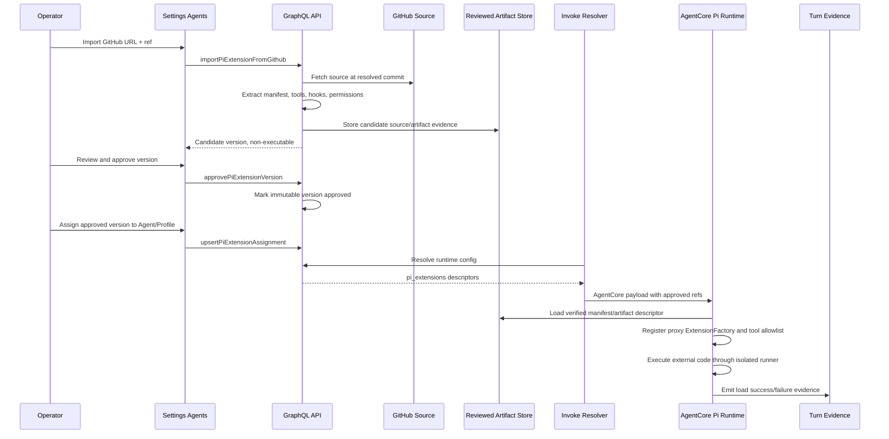
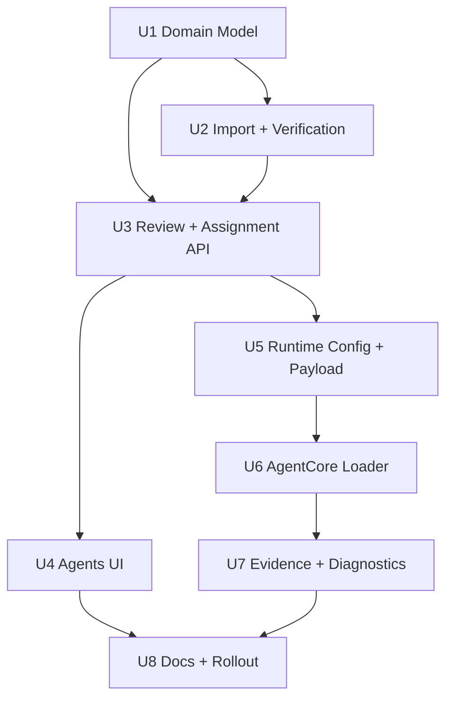
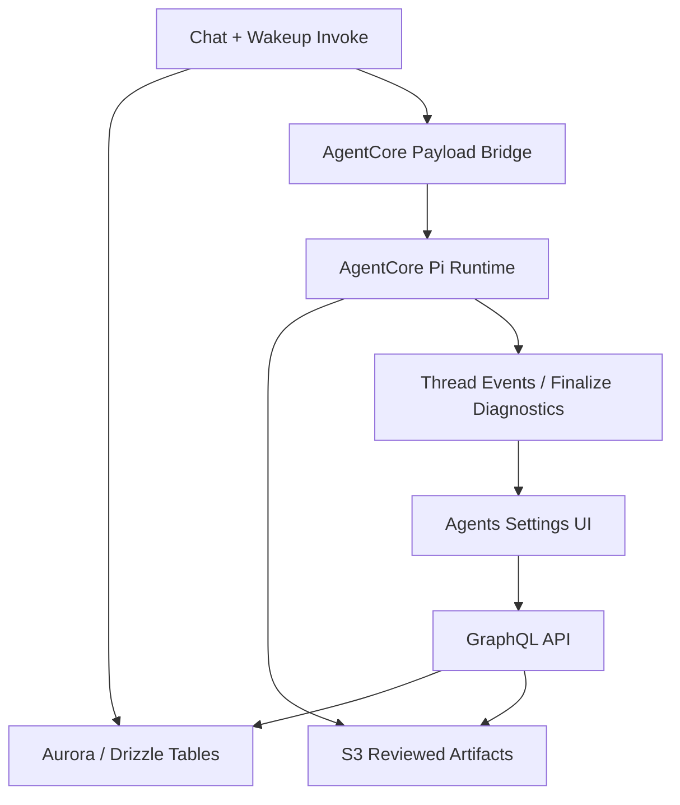

# feat: Add Dynamic Pi Extensions

## Overview

Add a first-class Pi Extensions control plane to Settings -> Agents. Operators
can import a GitHub-hosted extension candidate, review source identity,
manifest, declared tools, lifecycle capabilities, permissions, and verification
evidence, approve a specific immutable version, and enable it for the default
Agent or selected Agent Profiles.

The runtime path must preserve the existing Pi `extensionFactories` direction
without importing tenant-provided TypeScript into the privileged AgentCore
process. Approved extension versions compile into reviewed artifact descriptors;
the AgentCore host registers manifest-derived proxy factories, and external
extension code executes only through an isolated runner or an explicitly
first-party-signed allowlist on the next eligible invocation.

---

## Problem Frame

ThinkWork already has a serverless Pi extension mechanism, but today's
extensions are first-party code baked into `packages/pi-extensions` and the
AgentCore Pi image. That keeps the runtime safe and predictable, but it makes
extension iteration require code merges, image builds, and deploys. `THINK-114`
asks for operator-managed extensions on the Agents page so a tenant can import,
review, approve, and assign extensions without confusing them with workspace
skills, MCP servers, or built-in tools (see origin:
`docs/brainstorms/2026-06-30-think-114-dynamic-pi-extensions-requirements.md`).

Because Pi extensions are executable TypeScript with tool registration and
lifecycle hooks, this is a security-sensitive control plane. The plan therefore
separates import, verification, approval, assignment, invocation payload
resolution, runtime loading, and evidence instead of treating a GitHub URL as a
runtime path.

---

## Requirements Trace

- R1. Settings -> Agents includes an Extensions table near Default Agent and
  Agent Profiles.
- R2. V1 supports GitHub URL/ref import.
- R3. GitHub import records source identity precise enough for review; mutable
  branch/tag refs are resolved to an immutable commit SHA before approval.
- R4. Imported extensions are non-executable by default.
- R5. Operators can distinguish imported, needs review, approved, rejected,
  failed verification, enabled, and disabled states.
- R6. Rows show source, version/ref, review status, declared permissions, and
  assignment summary.
- R7. Extensions require explicit approval before assignment.
- R8. Rejected or failed extensions remain visible but are not assignable or
  executable.
- R9. Review shows declared tool names, lifecycle hooks or capabilities, runtime
  target, and requested permission classes.
- R10. Review shows provenance and verification evidence for the reviewed
  source/artifact.
- R11. Approval is version-specific; source, permission, or artifact changes
  create a new review requirement.
- R12. Approved versions are assignable to the default Agent and Agent Profiles.
- R13. Agents page capability summaries include extension counts without
  collapsing extensions into Tools, MCP, or Skills.
- R14. Changes take effect on next eligible invocation, not by hot reload.
- R15. Runtime receives only approved artifact descriptors through the Pi
  extension factory loading path.
- R16. Extension-declared model-visible tool names are folded into the effective
  allowlist when loaded.
- R17. Runtime evidence identifies which extension version/ref was active and
  whether it loaded successfully.
- R18. Import, review, verification, and runtime load failures surface concise
  operator-visible reasons.
- R19. Imported extensions receive no secrets or privileged providers unless a
  declared permission is reviewed and granted by policy.
- R20. Preserve the distinction between workspace skills, built-in tools, MCP
  servers, and Pi extensions.

**Origin actors:** A1 Operator, A2 Extension reviewer, A3 Agent/Profile user,
A4 ThinkWork runtime, A5 Planner/implementer.

**Origin flows:** F1 GitHub import for review, F2 Review and approve, F3 Enable
for default Agent or profile, F4 Diagnose extension load or verification
failure.

**Origin acceptance examples:** AE1 import creates non-executable row; AE2
rejected extension is visible but unassignable; AE3 approved profile extension
loads via extension factories; AE4 unapproved new version does not replace the
enabled version; AE5 verification failure is visible and not treated as skills,
MCP, or built-ins.

---

## Scope Boundaries

- V1 supports GitHub URL/ref import first; file upload, package-name import,
  marketplace browsing, publisher accounts, auto-update feeds, ratings, and
  cross-tenant sharing are deferred.
- V1 does not execute agent-authored extension drafts.
- V1 does not hot-reload extension code inside an active turn.
- V1 does not install Pi extensions as `skills/<slug>/SKILL.md`, skill catalog
  entries, built-in tools, or MCP servers.
- V1 does not grant arbitrary network, credential, workspace-write, AWS, or
  provider access because import succeeded.
- V1 does not require mobile runtime execution for every extension; runtime
  target metadata should keep room for cloud-only and future portable extension
  classes.
- V1 does not replace the existing first-party extension package. The dynamic
  path is additive to `packages/pi-extensions`.

### Deferred to Follow-Up Work

- File upload and package-manager imports: separate follow-up after GitHub
  provenance and artifact review are proven.
- Agent-authored promotion: separate workflow after reviewed operator imports
  exist.
- Cross-tenant extension marketplace: separate product surface and trust model.
- Rich static permission analysis: V1 should block obvious mismatches and fail
  closed, but deeper code analysis can iterate after the basic review loop.

---

## Context & Research

### Relevant Code and Patterns

- `apps/web/src/components/settings/SettingsAgents.tsx` already owns the
  config view shown in the screenshot: Default Agent first, Agent Profiles
  below, with capability badges for Tools, MCP, and Skills.
- `apps/web/src/lib/settings-queries.ts` holds the GraphQL operations for
  Agents settings and Agent Profile editing; adding extension queries here keeps
  the UI aligned with the existing page.
- `packages/database-pg/graphql/types/agents.graphql` defines Agent and Agent
  Profile GraphQL contracts. Extension types can live here if they are tightly
  coupled to Agents, or in a new adjacent GraphQL type file if codegen picks up
  all `graphql/types/*.graphql`.
- `packages/database-pg/src/schema/agent-profiles.ts` stores profile capability
  policy as JSON and space assignments as a relation. Dynamic extension
  assignments should be explicit rows rather than hidden inside existing skill
  or tool policy JSON.
- `packages/database-pg/src/schema/skills.ts` and
  `packages/database-pg/drizzle/0184_skill_catalog_trust_cache.sql` show the
  current skill trust cache/signature fields. Reuse the trust concepts, not the
  skill catalog table.
- `packages/api/src/graphql/resolvers/agent-profiles/*` is the resolver pattern
  for operator-owned Agent/Profile configuration.
- `packages/api/src/lib/resolve-agent-runtime-config.ts` resolves Agent Profile
  runtime configs, built-ins, skills, MCP servers, and active Space filtering.
  Extension assignment resolution belongs in this runtime config seam.
- `packages/api/src/handlers/chat-agent-invoke.ts`,
  `packages/api/src/handlers/wakeup-processor.ts`, and
  `packages/api/agentcore-invoke.ts` construct and forward the AgentCore payload.
  Any new payload branch must be copied through all forwarding seams.
- `packages/agentcore-pi/agent-container/src/server.ts` builds
  `extensionFactories` and `extensionToolNames` per invocation through
  `buildInvocationResources`.
- `packages/pi-extensions/src/define-extension.ts` defines the local
  `ThinkworkExtension` contract, `ProviderBundle`, `toolNames`, and
  `toExtensionFactory`.
- `packages/pi-runtime-core/src/agent-loop.ts` passes `extensionFactories` into
  `DefaultResourceLoader` and logs extension load failures from the SDK.
- `packages/agentcore-pi/agent-container/src/runtime/pinned-skills.ts` is a
  useful pattern for per-invocation S3-backed runtime refs with strict path
  validation and fail-closed parsing.
- `packages/api/src/lib/thread-turn-events.ts` and
  `packages/api/src/lib/chat-finalize/types.ts` are the durable event/evidence
  paths for runtime diagnostics.

### Institutional Learnings

- `docs/solutions/spikes/2026-05-29-pi-extension-loading-agentcore-spike.md`
  found that `DefaultResourceLoader.extensionFactories` is the right cloud
  mechanism for loading Pi extensions without filesystem discovery, and that
  extension tool names must be folded into the allowlist.
- `docs/solutions/agent-profiles-pi-adapter-spike-2026-06-07.md` establishes
  Agent Profiles as ThinkWork-owned bounded child sessions, not generic
  prompt-overridable agents. Profile extension grants should follow the same
  policy-owned model.
- `docs/solutions/agent-profile-closed-loops-2026-06-08.md` treats profile
  runtime evidence as first-class Activity/Trace data. Extension load evidence
  should follow that pattern rather than living only in CloudWatch logs.
- `docs/src/content/docs/applications/admin/builtin-tools.mdx` documents that
  built-ins, MCP servers, and workspace skills are separate capability classes.
  This plan preserves that boundary.
- `docs/src/content/docs/concepts/agents/skills.mdx` documents skill packs as
  fresh per invocation and distinct from runtime-owned tools. Dynamic Pi
  extensions should use next-invocation semantics but not the skill pack
  storage model.

### External References

- Pi Extensions documentation: `https://pi.dev/docs/latest/extensions`. The
  relevant planning constraints are that extensions can register tools and use
  lifecycle/tool-call hooks, and that extensions are executable code that should
  come only from trusted sources.

---

## Key Technical Decisions

| Decision                                                                             | Rationale                                                                                                                                                                                                                                                                                                                                                                          |
| ------------------------------------------------------------------------------------ | ---------------------------------------------------------------------------------------------------------------------------------------------------------------------------------------------------------------------------------------------------------------------------------------------------------------------------------------------------------------------------------- |
| Model dynamic extensions as a separate Pi extension registry, not skill catalog rows | R20 requires a distinct capability class. Skills are agent-readable packs; Pi extensions are executable runtime modules with lifecycle hooks.                                                                                                                                                                                                                                      |
| Store immutable extension versions                                                   | R11 requires approval to be tied to a specific reviewed source/artifact. A mutable branch or tag can be accepted as input, but approval must resolve to a commit SHA and artifact hash.                                                                                                                                                                                            |
| Use GraphQL for the Agents page operator contract                                    | `SettingsAgents.tsx` already uses GraphQL for default Agent/Profile configuration. Keeping extensions in that flow avoids a parallel REST client unless a later implementation finds a strong reason for one.                                                                                                                                                                      |
| Persist assignments as explicit rows                                                 | Default Agent and Agent Profiles need separate assignment semantics, auditability, and visibility. Hiding extension ids inside `toolPolicy` or `skillPolicy` would blur capability boundaries.                                                                                                                                                                                     |
| Default Agent extensions do not implicitly flow into Agent Profiles                  | Agent Profiles are constrained child sessions with their own capability bundles. A profile receives only extensions explicitly assigned to that profile; assigning the same approved version to both default Agent and a profile is allowed and de-duped per session.                                                                                                              |
| Imported source is not a runtime artifact                                            | GitHub import creates a candidate version. Runtime loading consumes only approved artifact descriptors that include source SHA, artifact SHA, manifest hash, status, and reviewed permission grants.                                                                                                                                                                               |
| External extension code does not run in the privileged AgentCore process             | Pi docs warn that extensions are executable code with full host permissions. For imported GitHub artifacts, the main runtime should register manifest-derived proxy tools/hooks through `extensionFactories`; actual extension execution must happen in an isolated runner with sanitized environment and explicit IPC, unless the artifact is first-party-signed and allowlisted. |
| V1 provider access starts minimal and explicit                                       | Extensions get no provider bundle by default. Grant only permission classes that can be enforced by a narrow provider wrapper; review-declared classes without an enforceable wrapper remain non-grantable in v1.                                                                                                                                                                  |
| Runtime uses a new `pi_extensions` payload branch                                    | This mirrors `pinned_skills`: API resolves policy and trust, AgentCore receives compact validated refs, and the runtime refuses malformed or unapproved refs.                                                                                                                                                                                                                      |
| Runtime failures are visible but fail closed per extension                           | A failed extension must not silently disappear. It should emit load evidence and exclude that extension's tools from the allowlist for the turn while allowing unrelated extensions and the base Agent to continue where safe.                                                                                                                                                     |

---

## Open Questions

### Resolved During Planning

- **Which GitHub source identities should v1 accept?** Accept repository URL
  plus ref input, but resolve and store the immutable commit SHA before approval.
  Approval attaches to commit SHA plus artifact hash, not the mutable label.
- **How should default Agent and profile assignments interact?** They are
  independent. Default Agent assignment affects the parent/default Agent session;
  profile assignment affects the named profile child session. No implicit
  inheritance into profiles.
- **Should extensions reuse skill catalog trust rows?** Reuse trust pipeline
  vocabulary and evidence patterns, but create extension-specific tables because
  artifacts, lifecycle hooks, and provider grants are extension-specific.
- **Where should turn evidence live?** Emit runtime load events through
  `threadTurnEvents` and include sanitized extension evidence in finalize
  diagnostics so Activity/support can see which approved version was active.

### Deferred to Implementation

- **Exact artifact format:** The plan requires a reviewed artifact descriptor
  with source SHA, artifact SHA, manifest hash, and signature/approval evidence.
  The recommended V1 shape is a bundled ESM artifact plus manifest sidecar, but
  the main AgentCore process must treat that artifact as input to an isolated
  runner/proxy boundary, not as a direct same-process import.
- **Exact verification pipeline depth:** V1 must validate manifest shape,
  declared tool names, runtime target, requested permissions, artifact hash, and
  build/extraction failures. Deeper static analysis can be added behind the same
  verification evidence model.
- **GitHub auth for private repositories:** Public GitHub import can prove the
  V1 loop. Private repo access should use existing GitHub integration primitives
  if available, or remain a follow-up if the implementation cannot do it safely
  in this slice.
- **Artifact signing mechanism:** Use the repo's existing trust/signature
  conventions as the starting point. The exact signing key and verification
  primitive should be chosen with deployed AWS constraints in mind during
  implementation.

---

## High-Level Technical Design

> _This illustrates the intended approach and is directional guidance for
> review, not implementation specification. The implementing agent should treat
> it as context, not code to reproduce._

---

## Phased Delivery

### Phase 1: Reviewable Control Plane

Land the database/GraphQL model, GitHub import candidate flow, verification
evidence, review/approval, assignments, and Agents page table. At the end of
this phase, no runtime execution is required; the safety property is that
operators can review and assign only approved immutable versions.

### Phase 2: Runtime Loading Contract

Resolve approved assignments into `pi_extensions`, forward the payload through
AgentCore, load verified artifacts into `extensionFactories`, fold tool names
into the allowlist, and persist load evidence.

### Phase 3: Docs and Deployed Verification

Document the operator workflow and verify a deployed ThinkWork path from import
through approved assignment to a subsequent Pi invocation. Keep THINK-114 in
review until deployed evidence proves the runtime path.

---

## Implementation Units

- U1. **Extension Registry Schema and GraphQL Contract**

**Goal:** Add the persistent model and generated API contract for extension
identity, immutable versions, review state, verification evidence, and
assignments.

**Requirements:** R3, R4, R5, R6, R7, R8, R9, R10, R11, R12, R13, R18, R20;
F1, F2, F3, F4; AE1, AE2, AE4, AE5.

**Dependencies:** None.

**Files:**

- Create: `packages/database-pg/src/schema/pi-extensions.ts`
- Modify: `packages/database-pg/src/schema/index.ts`
- Create or modify: `packages/database-pg/graphql/types/pi-extensions.graphql`
- Modify: `packages/api/src/graphql/resolvers/index.ts`
- Create: `packages/api/src/graphql/resolvers/pi-extensions/index.ts`
- Create: `packages/api/src/graphql/resolvers/pi-extensions/shared.ts`
- Create: `packages/api/src/graphql/resolvers/pi-extensions/piExtensions.query.ts`
- Create: `packages/api/src/graphql/resolvers/pi-extensions/piExtensions.resolver.test.ts`
- Create: `packages/database-pg/__tests__/migration-pi-extensions.test.ts`

**Approach:**

- Model at least three concepts: extension identity, immutable reviewed version,
  and assignment target. Recommended shape:
  - extension identity: tenant, slug/name, display metadata, current aggregate
    status;
  - extension version: source provider, repo URL, input ref, resolved commit SHA,
    manifest, declared tools, lifecycle capabilities, permission classes,
    runtime target, verification report, artifact descriptor, approval/rejection
    state, reviewer fields;
  - assignment: tenant, extension version, target type (`default_agent` or
    `agent_profile`), target id when profile-scoped, enabled flag.
- Keep status vocabulary explicit enough for the UI: imported, needs_review,
  approved, rejected, verification_failed, enabled, disabled. If storage uses
  normalized version/assignment statuses, expose the aggregate UI status through
  GraphQL.
- Use extension-specific tables even if trust fields mirror `skill_catalog`.
  This prevents executable artifacts from being mistaken for Agent Skills.
- Add GraphQL types/inputs for list, import candidate creation, approval,
  rejection, assignment, and disabling. The exact mutation split can follow the
  resolver style, but each lifecycle transition must have a clear authorization
  and validation boundary.

**Execution note:** Start with schema/resolver contract tests before wiring the
UI. The most important behavior is the state machine, not rendering.

**Patterns to follow:**

- `packages/database-pg/src/schema/agent-profiles.ts` for tenant-scoped
  capability configuration and assignment rows.
- `packages/database-pg/src/schema/skills.ts` for trust/signature field
  vocabulary.
- `packages/database-pg/graphql/types/agents.graphql` and
  `packages/api/src/graphql/resolvers/agent-profiles/*` for Settings GraphQL
  contracts.

**Test scenarios:**

- Happy path: creating an imported GitHub version stores source URL, input ref,
  resolved commit SHA placeholder, manifest, declared tools, permissions, and a
  non-executable review status.
- Happy path: approving a version changes only that immutable version to
  approved and makes it eligible for assignment.
- Happy path: assigning an approved version to default Agent and one profile
  returns assignment summaries grouped by target.
- Covers AE2. Error path: rejecting a version keeps it visible and prevents
  assignment.
- Covers AE4. Edge case: importing a second version for the same extension slug
  does not replace the currently approved assignment until the new version is
  explicitly approved and assigned.
- Error path: assigning an unapproved, rejected, or verification-failed version
  is rejected at the API boundary.
- Error path: deleting or disabling an assignment never deletes the reviewed
  version or evidence.

**Verification:**

- GraphQL codegen consumers can query extension rows and submit review and
  assignment mutations.
- Database migration tests prove the tables, constraints, and markers are
  present.

---

- U2. **GitHub Import and Verification Pipeline**

**Goal:** Implement GitHub import as a non-executable candidate creation flow
that captures immutable source identity, manifest metadata, verification
evidence, and artifact descriptors.

**Requirements:** R2, R3, R4, R5, R6, R8, R9, R10, R11, R18, R19, R20; F1, F2,
F4; AE1, AE5.

**Dependencies:** U1.

**Files:**

- Create: `packages/api/src/lib/pi-extensions/github-import.ts`
- Create: `packages/api/src/lib/pi-extensions/manifest.ts`
- Create: `packages/api/src/lib/pi-extensions/verification.ts`
- Create: `packages/api/src/lib/pi-extensions/artifacts.ts`
- Create: `packages/api/src/lib/pi-extensions/github-import.test.ts`
- Create: `packages/api/src/lib/pi-extensions/verification.test.ts`
- Modify: `packages/api/src/graphql/resolvers/pi-extensions/index.ts`
- Modify: `packages/api/src/graphql/resolvers/pi-extensions/piExtensions.resolver.test.ts`

**Approach:**

- Accept repository URL plus ref input from the mutation, resolve it to an
  immutable commit SHA, and persist both the operator-supplied ref and resolved
  identity.
- Fetch only the expected extension package contents. Reject path traversal,
  oversized archives, missing manifest/entrypoint, malformed metadata, and
  runtime targets not supported by V1.
- Extract a manifest containing extension name, version/ref, declared tool
  names, lifecycle capabilities, runtime target, requested permission classes,
  and entrypoint/artifact metadata.
- Build or package a reviewed artifact descriptor, but leave runtime execution
  disabled until approval. The descriptor should point at a bundled ESM artifact
  and manifest sidecar where practical, but approval binds to source hash,
  artifact hash, manifest hash, and runner compatibility rather than to a raw
  GitHub path.
- Treat verification as fail-closed: a failed source fetch, missing manifest,
  build failure, unsupported permission, or artifact hash mismatch produces a
  visible failure state and no assignable version.
- If private GitHub auth is not immediately available from existing
  integrations, ship public GitHub import first and leave private auth behind
  the deferred implementation question rather than weakening the provenance
  model.

**Execution note:** Implement verification with isolated pure helpers first,
then connect the resolver mutation.

**Patterns to follow:**

- `packages/api/src/lib/skill-drafts/publish-catalog.ts` for review-before-
  publish trust flow and rollback thinking.
- `packages/api/src/lib/catalog-index.ts` for S3/source indexing abstractions
  that are unit-testable with fakes.
- `packages/api/src/lib/skill-trust/runtime-gate.ts` for current-content trust
  gating.

**Test scenarios:**

- Covers AE1. Happy path: importing a public GitHub repo/ref records a
  candidate row with resolved commit SHA, extracted declared tool names, and
  `needs_review` status.
- Happy path: the same repo/ref import is idempotent by resolved commit SHA and
  does not create duplicate active candidates.
- Error path: malformed GitHub URL, missing ref, missing manifest, invalid
  runtime target, unsupported permission, oversized archive, or build failure
  records a failed verification reason and never creates an assignable version.
- Error path: manifest-declared tool names that are empty, duplicated, or
  outside the allowed tool-name pattern are rejected before approval.
- Integration: resolver import mutation persists verification evidence and the
  list query returns the concise row status the UI needs.

**Verification:**

- Imported versions are observable in the API with source/provenance metadata,
  but no mutation or runtime resolver can treat them as executable before
  approval.

---

- U3. **Review, Approval, and Assignment API**

**Goal:** Add the explicit reviewer actions and assignment mutations that turn
approved immutable versions into default-Agent or Agent-Profile capabilities.

**Requirements:** R5, R6, R7, R8, R9, R10, R11, R12, R13, R18, R19, R20; F2,
F3, F4; AE2, AE3, AE4, AE5.

**Dependencies:** U1, U2.

**Files:**

- Modify: `packages/api/src/graphql/resolvers/pi-extensions/index.ts`
- Create: `packages/api/src/graphql/resolvers/pi-extensions/approvePiExtensionVersion.mutation.ts`
- Create: `packages/api/src/graphql/resolvers/pi-extensions/rejectPiExtensionVersion.mutation.ts`
- Create: `packages/api/src/graphql/resolvers/pi-extensions/updatePiExtensionAssignment.mutation.ts`
- Modify: `packages/api/src/graphql/resolvers/pi-extensions/piExtensions.resolver.test.ts`
- Modify: `packages/database-pg/graphql/types/pi-extensions.graphql`
- Modify: `apps/web/src/lib/settings-queries.ts`

**Approach:**

- Require owner/admin membership for import, approve, reject, enable, disable,
  and assignment changes. Read/list may follow existing Settings visibility
  conventions.
- Approval requires the current verification report to match the artifact/source
  hashes on the version. Stale verification reports cannot be approved.
- Rejection stores reviewer, timestamp, and reason. Rejected versions stay in
  list/detail views for diagnosis.
- Assignment mutation accepts an approved version id and target:
  `default_agent` or `agent_profile`. Profile assignment validates the profile
  belongs to the same tenant and is centrally managed, matching existing Agent
  Profile update boundaries.
- Store permission grants separately from requested permissions where possible.
  Requested-but-not-granted permissions should be visible in review, but the
  runtime receives only granted enforceable classes.
- Preserve next-invocation semantics by treating assignment changes as config
  updates only. Do not attempt to signal an active runtime session.

**Patterns to follow:**

- `packages/api/src/graphql/resolvers/agent-profiles/updateAgentProfile.mutation.ts`
  for admin-owned capability edits.
- `packages/api/src/graphql/resolvers/agent-profiles/shared.ts` for loading and
  tenant-scoping profile rows.
- `packages/api/src/lib/tenant-membership.ts` patterns used by operator REST
  handlers when GraphQL auth utilities are not enough.

**Test scenarios:**

- Happy path: approving a verified version makes it assignable and records
  reviewer fields.
- Covers AE2. Error path: rejected versions cannot be assigned and retain a
  visible rejection reason.
- Covers AE3. Happy path: assigning an approved version to a Coding profile
  appears in that profile's extension assignment summary.
- Covers AE4. Edge case: approving a newer version does not change an existing
  assignment until the assignment is updated to that version id.
- Error path: assignment to a profile from another tenant is rejected.
- Error path: approval fails when verification evidence is stale relative to
  source/artifact hash.

**Verification:**

- API exposes the full review lifecycle and prevents every non-approved state
  from reaching assignment.

---

- U4. **Agents Page Extensions Table and Review UI**

**Goal:** Add an Extensions table to Settings -> Agents with GitHub import,
review detail, approval/rejection, assignment controls, status visibility, and
profile/default assignment summaries.

**Requirements:** R1, R2, R4, R5, R6, R7, R8, R9, R10, R12, R13, R18, R20; F1,
F2, F3, F4; AE1, AE2, AE3, AE4, AE5.

**Dependencies:** U1, U2, U3.

**Files:**

- Modify: `apps/web/src/components/settings/SettingsAgents.tsx`
- Modify: `apps/web/src/components/settings/SettingsAgents.test.tsx`
- Modify: `apps/web/src/lib/settings-queries.ts`
- Create: `apps/web/src/components/settings/SettingsAgentExtensions.test.tsx`
  if component extraction is warranted by size
- Create: `apps/web/src/components/settings/SettingsAgentExtensions.tsx`
  if keeping `SettingsAgents.tsx` readable requires extraction

**Approach:**

- Place the Extensions section between Default Agent and Agent Profiles. That
  makes extension capabilities visible before the profile list without hiding
  profile configuration.
- Render a dense operator table, not a landing-page card grid. Suggested
  columns: Extension, Source/ref, Status, Tools, Permissions, Assigned to, Last
  verified. Row click opens review/detail.
- Add a compact action button for GitHub import. The dialog captures repo URL
  and ref only for V1, matching origin scope.
- Review detail shows source URL, input ref, resolved commit SHA, artifact hash,
  declared tools, lifecycle capabilities, runtime target, requested/granted
  permissions, verification evidence, approval/rejection state, and concise
  failure reasons.
- Assignment controls should only enable for approved versions. Show disabled
  controls with concise reasons for imported/rejected/failed versions.
- Extend profile list badges with an Extensions count distinct from Tools, MCP,
  and Skills. Do not rename existing badges or overload Skills.
- Preserve the header workspace/config toggle behavior and full-bleed workspace
  view.

**Execution note:** Keep layout tests focused on the page contract, then add
behavior tests around import/review/assignment components with mocked GraphQL
data.

**Patterns to follow:**

- Existing `SettingsSection`, `SettingsRow`, badge, dialog, toast, and list
  patterns in `apps/web/src/components/settings/SettingsAgents.tsx`.
- `apps/web/src/components/settings/SettingsAgents.test.tsx` for source-level
  route and capability contract assertions.
- `apps/web/src/components/settings/SettingsTools.tsx` if a table/detail-dialog
  pattern is needed for operator capability settings.

**Test scenarios:**

- Covers AE1. Happy path: with no extensions, the Agents config view still
  renders Default Agent, Extensions, and Agent Profiles in that order; importing
  a GitHub URL/ref calls the import mutation and renders a non-executable row.
- Happy path: approved extension rows show assignment summary for default Agent
  and selected profiles.
- Covers AE2. Error path: rejected and failed rows remain visible, show concise
  reason text, and assignment controls are disabled.
- Covers AE3. Happy path: a profile row with assigned extensions displays an
  Extensions badge separate from Tools, MCP, and Skills.
- Covers AE5. Error path: a failed verification row uses Pi extension language
  and does not appear in Skills, MCP, or Built-in Tools UI affordances.
- Edge case: workspace view (`?view=workspace`) remains full-bleed and does not
  render the Extensions table.

**Verification:**

- Operators can complete the full import/review/assign UI loop against mocked
  data, and existing Agent Profile UI behavior remains intact.

---

- U5. **Runtime Config Resolution and AgentCore Payload**

**Goal:** Resolve approved extension assignments into an invocation-time
`pi_extensions` payload branch for chat and wakeup paths, with default/profile
semantics and forwarding parity.

**Requirements:** R12, R13, R14, R15, R16, R17, R19, R20; F3; AE3, AE4.

**Dependencies:** U1, U3.

**Files:**

- Modify: `packages/api/src/lib/resolve-agent-runtime-config.ts`
- Modify: `packages/api/src/lib/__tests__/resolve-agent-runtime-config.test.ts`
- Modify: `packages/api/src/handlers/chat-agent-invoke.ts`
- Modify: `packages/api/src/handlers/chat-agent-invoke.runtime-routing.test.ts`
- Modify: `packages/api/src/handlers/wakeup-processor.ts`
- Modify: `packages/api/src/handlers/wakeup-processor.dispatch-parity.test.ts`
- Modify: `packages/api/src/__tests__/workspace-wakeup-payload.test.ts`
- Modify: `packages/api/agentcore-invoke.ts`
- Modify: `packages/api/src/handlers/agents-runtime-config.test.ts`

**Approach:**

- Add runtime config fields for approved dynamic Pi extensions. Keep descriptors
  compact: extension id, version id, slug/name, resolved commit SHA, artifact
  key/hash/signature fields, declared tool names, runtime target, target scope,
  and granted permission classes.
- Resolve default Agent extensions separately from profile-scoped extensions.
  Profile configs should carry their own `piExtensions` array so the child
  session adapter can pass only profile-approved extensions into child sessions.
- Filter out anything not approved, disabled, mismatched by tenant, stale
  relative to artifact hash, or unsupported for the runtime target.
- Add `pi_extensions` to chat, wakeup, runtime-config, and AgentCore payload
  forwarding seams. Mirror the explicit forwarding pattern used for
  `pinned_skills`; dropped payload branches are a known risk in this repo.
- Ensure model-visible tool allowlist inputs include extension-declared tool
  names only after runtime validation. API should provide names, but the runtime
  remains authoritative before session creation.

**Patterns to follow:**

- `packages/api/src/lib/skills/message-pinned-skills.ts` and
  `packages/agentcore-pi/agent-container/src/runtime/pinned-skills.ts` for
  compact refs and runtime validation.
- `packages/api/src/lib/resolve-agent-runtime-config.ts` for profile-specific
  capability resolution.
- `packages/api/agentcore-invoke.ts` for explicit payload key forwarding.

**Test scenarios:**

- Happy path: an approved default-Agent extension produces one default
  `pi_extensions` descriptor in runtime config and AgentCore payload.
- Covers AE3. Happy path: an approved Coding-profile extension appears only in
  that profile runtime config, not as a parent/default extension.
- Covers AE4. Edge case: a newer unapproved version for the same extension slug
  is ignored while the existing approved assigned version remains in the
  payload.
- Error path: rejected, disabled, stale, wrong-tenant, or unsupported-runtime
  versions are filtered out and logged/diagnosed without crashing config
  resolution.
- Integration: chat and wakeup payload builders produce equivalent
  `pi_extensions` payloads for the same tenant/Agent/Space inputs.
- Regression: `agentcore-invoke.ts` forwards `pi_extensions`; omitting the copy
  fails a test.

**Verification:**

- Runtime payloads contain only approved descriptors with target-appropriate
  scope, and all dispatch paths preserve the new branch.

---

- U6. **AgentCore Pi Dynamic Extension Proxy Loader**

**Goal:** Load approved extension artifact descriptors in the AgentCore Pi
runtime, register manifest-derived proxy `ExtensionFactory[]`, execute external
extension code through an isolated runner or first-party-signed allowlist,
restrict provider access, fold tool names into the allowlist, and fail closed
per extension.

**Requirements:** R14, R15, R16, R17, R18, R19, R20; F3, F4; AE3, AE5.

**Dependencies:** U2, U5.

**Files:**

- Modify: `packages/agentcore-pi/agent-container/src/server.ts`
- Create: `packages/agentcore-pi/agent-container/src/runtime/dynamic-extensions.ts`
- Create: `packages/agentcore-pi/agent-container/src/runtime/dynamic-extension-runner.ts`
- Create: `packages/agentcore-pi/agent-container/src/runtime/dynamic-extensions.test.ts`
- Create: `packages/agentcore-pi/agent-container/src/runtime/dynamic-extension-runner.test.ts`
- Modify: `packages/pi-runtime-core/src/types.ts`
- Modify: `packages/pi-runtime-core/src/agent-loop.ts`
- Modify: `packages/pi-runtime-core/test/agent-loop.test.ts`
- Create or modify: `packages/api/test/integration/model-stacking/tool-model-routing.e2e.test.ts`

**Approach:**

- Parse `payload.pi_extensions` with strict validation. Reject malformed ids,
  unexpected S3/artifact keys, missing hashes, unsupported runtime targets,
  unapproved status markers, duplicated tool names where unsafe, and
  descriptors whose artifact hash/signature does not match.
- Fetch reviewed manifest/artifact descriptors only after validation. Do not
  import source files from the workspace, and do not direct-import external
  artifacts into the privileged AgentCore process.
- Convert the manifest into a proxy `ThinkworkExtension` or lower-level Pi
  `ExtensionFactory` that registers declared tools/hooks with Pi while routing
  execution to `dynamic-extension-runner.ts`. Keep this bridge inside
  `dynamic-extensions.ts` so first-party extension wiring remains readable.
- The runner boundary must launch with a sanitized environment, no inherited
  provider objects, bounded input/output payloads, timeouts, and an explicit IPC
  contract. If the implementation cannot provide a meaningful isolation
  boundary for an imported artifact, that artifact must remain non-executable
  even if it was reviewed.
- Build a provider bundle from granted permission classes only. If no narrow
  provider wrapper exists for a requested class, omit it and mark the extension
  load failed rather than handing out the broad provider.
- Append successfully loaded factories to `bundle.extensionFactories` and
  declared tool names to `bundle.extensionToolNames` before `runAgentLoop`.
- For Agent Profiles, pass only that profile's dynamic extension factories into
  the child session. Parent/default dynamic factories should not bleed into
  child sessions unless the extension is also assigned to that profile.
- Use existing extension load failure logging in `packages/pi-runtime-core/src/agent-loop.ts`
  and add dynamic extension identity to safe evidence.

**Execution note:** Characterize current first-party extension factory behavior
before adding dynamic artifacts, especially allowlist folding and load failure
handling.

**Patterns to follow:**

- `packages/agentcore-pi/agent-container/src/server.ts` `addExtension` helper
  for first-party extension registration.
- `packages/pi-extensions/src/define-extension.ts` for `ThinkworkExtension`,
  `ProviderBundle`, `toolNames`, and `toExtensionFactory`.
- `packages/pi-runtime-core/src/agent-loop.ts` for resource-loader
  `extensionFactories` and SDK load failure handling.
- `packages/agentcore-pi/agent-container/src/runtime/pinned-skills.ts` for
  defensive payload parsing and S3 key validation.

**Test scenarios:**

- Covers AE3. Happy path: a validated approved descriptor registers one proxy
  extension factory and folds its declared tool name into `extensionToolNames`.
- Happy path: a hook-only extension with no tool names loads without adding a
  model-visible tool.
- Error path: malformed descriptor, hash mismatch, unsupported runtime target,
  missing artifact, runner isolation failure, or missing granted provider emits
  load failure evidence and does not add the extension's tools.
- Error path: an external artifact that attempts to rely on process env,
  ungranted filesystem access, or ungranted network/provider access is blocked
  by the runner boundary and recorded as a failed extension execution/load.
- Covers AE5. Error path: an extension requesting an undeclared or ungrantable
  provider receives no privileged provider and fails closed with an operator-safe
  reason.
- Integration: a profile child session receives only the extension assigned to
  that profile, while the parent session receives only default-Agent
  assignments.
- Regression: first-party baked extensions still load through the existing
  `addExtension` path and keep their tool names in the allowlist.

**Verification:**

- A runtime invocation can load an approved dynamic extension through
  `extensionFactories`, and failure cases are visible without granting excess
  capability or confusing dynamic extensions with skills.

---

- U7. **Extension Evidence, Activity Diagnostics, and Operator Status**

**Goal:** Persist sanitized extension verification/load evidence so operators
and support can diagnose import, review, assignment, and runtime failures
without reading logs or leaking secrets.

**Requirements:** R5, R6, R10, R17, R18, R19; F4; AE4, AE5.

**Dependencies:** U2, U5, U6.

**Files:**

- Modify: `packages/api/src/lib/thread-turn-events.ts`
- Modify: `packages/api/src/lib/thread-turn-events.test.ts`
- Modify: `packages/api/src/lib/chat-finalize/types.ts`
- Modify: `packages/api/src/lib/chat-finalize/process-finalize.ts`
- Modify: `packages/api/src/lib/chat-finalize/process-finalize.test.ts`
- Modify: `packages/agentcore-pi/agent-container/src/server.ts`
- Modify: `packages/pi-runtime-core/src/agent-loop.ts`
- Modify: `apps/web/src/components/settings/SettingsAgents.tsx`
- Modify: `apps/web/src/components/settings/SettingsAgents.test.tsx`

**Approach:**

- Define a sanitized evidence shape for dynamic extensions: extension slug,
  version id, source commit SHA, artifact hash prefix/full hash as appropriate,
  target scope, declared tool names, granted permission classes, load status,
  and concise failure reason. Exclude secrets, env values, provider tokens, raw
  source, and stack traces.
- Emit per-turn load success/failure as `threadTurnEvents` where a
  `thread_turn_id` is available. Include aggregate extension diagnostics in the
  finalize payload/diagnostics for durable turn review.
- Feed the most recent verification/runtime failure back into the Extensions
  table/detail row so F4 is diagnosable from Settings -> Agents.
- Preserve payload size limits. Store concise evidence in turn events and keep
  larger verification reports in the extension version row/artifact evidence.

**Patterns to follow:**

- `packages/api/src/lib/thread-turn-events.ts` payload-size guard and append
  store.
- `packages/api/src/lib/chat-finalize/types.ts` existing Agent Profile evidence
  shapes.
- `packages/agentcore-pi/agent-container/src/server.ts` runtime diagnostics and
  `logAgentCorePhase` patterns.

**Test scenarios:**

- Happy path: a successful dynamic extension load appends a turn event and
  finalize diagnostics naming extension slug, version, source commit, and loaded
  tool names.
- Error path: a load failure persists a concise failure reason but no stack
  trace, source code, secret, or provider credential.
- Edge case: many extension events remain under the thread-turn event payload
  limit or are summarized safely.
- Covers AE5. Integration: a verification failure reason shown in the extension
  detail comes from stored verification evidence and does not require runtime
  logs.

**Verification:**

- A support/operator view can answer which extension version was active for a
  turn and whether it loaded successfully.

---

- U8. **Documentation, Rollout, and Deployed Verification**

**Goal:** Document the new capability class and verify the deployed operator
path from GitHub import through next-invocation runtime loading.

**Requirements:** R1 through R20; all origin flows and acceptance examples.

**Dependencies:** U4, U6, U7.

**Files:**

- Modify: `docs/src/content/docs/applications/admin/agents.mdx`
- Create: `docs/src/content/docs/concepts/agents/pi-extensions.mdx`
- Modify: `docs/src/content/docs/applications/admin/builtin-tools.mdx`
- Modify: `docs/src/content/docs/concepts/agents/skills.mdx`
- Create: `docs/solutions/architecture-patterns/dynamic-pi-extensions-review-gate-2026-06-30.md`

**Approach:**

- Add an Admin Agents section describing the Extensions table, GitHub import,
  review, approval, assignment, and status meanings.
- Add a concept page explaining Pi extensions as executable runtime modules,
  distinct from skills, MCP, and built-ins.
- Update built-ins and skills docs only where cross-links clarify boundaries.
  Do not turn those pages into extension docs.
- Capture the architecture pattern after implementation: reviewed immutable
  artifact, explicit assignment, next-invocation loading, provider grants, and
  evidence.
- For THINK-114 verification, prove the deployed app path: import a GitHub
  extension, review/approve it, assign it to a profile, start a later eligible
  invocation, and observe extension load evidence. Do not substitute local-only
  execution for deployed ThinkWork verification.

**Patterns to follow:**

- `docs/src/content/docs/applications/admin/builtin-tools.mdx` for operator
  control-plane docs and capability boundary language.
- `docs/src/content/docs/concepts/agents/skills.mdx` for concept docs that
  explain when to reach for a capability class.
- `docs/solutions/spikes/2026-05-29-pi-extension-loading-agentcore-spike.md`
  for extensionFactories context.

**Test scenarios:**

- Test expectation: none for docs-only page content. Verification is editorial
  review plus deployed acceptance evidence after implementation.

**Verification:**

- Docs explain how an operator uses the feature and how an implementer/support
  engineer distinguishes dynamic Pi extensions from skills, MCP, and built-ins.
- THINK-114 has deployed evidence for AE1-AE5 before moving out of review.

---

## System-Wide Impact

- **Interaction graph:** Settings UI mutates GraphQL state; API stores source,
  verification, approval, and assignment state; invoke paths resolve approved
  assignments; AgentCore Pi loads only approved artifact descriptors; evidence
  flows back through thread events/finalize diagnostics.
- **Error propagation:** Import/verification errors are row states; assignment
  errors are GraphQL validation failures; runtime load errors are per-extension
  evidence and should not masquerade as successful loads.
- **State lifecycle risks:** Source refs can be mutable, artifacts can become
  stale, assignments can point at outdated versions, and payload forwarding can
  drop new branches. Hash binding, version-specific approval, assignment tests,
  and explicit forwarding tests mitigate this.
- **API surface parity:** Chat dispatch, wakeup dispatch, service runtime-config
  endpoint, AgentCore bridge, parent Agent sessions, and Agent Profile child
  sessions must all agree on the `pi_extensions` contract.
- **Integration coverage:** Unit tests cannot prove dynamic module loading in
  deployed AgentCore. THINK-114 remains in review until deployed verification
  proves import -> approve -> assign -> next invocation -> load evidence.
- **Unchanged invariants:** Workspace skills stay under skill catalog/workspace
  paths; built-in tools stay runtime-owned; MCP remains remote endpoint config;
  first-party `packages/pi-extensions` remains image-bundled.

---

## Risks & Dependencies

| Risk                                                            | Likelihood | Impact | Mitigation                                                                                                                                                                                                               |
| --------------------------------------------------------------- | ---------- | ------ | ------------------------------------------------------------------------------------------------------------------------------------------------------------------------------------------------------------------------ |
| Unreviewed executable code reaches runtime                      | Medium     | High   | Non-executable import state, version-specific approval, runtime gate on approved artifact descriptors only.                                                                                                              |
| Mutable GitHub refs undermine review                            | High       | High   | Resolve branch/tag input to commit SHA and bind approval to commit SHA plus artifact hash.                                                                                                                               |
| Provider bundle grants too much power                           | Medium     | High   | Default to no providers; grant only enforceable narrow wrappers; fail closed when no wrapper exists.                                                                                                                     |
| Dynamic artifact loader becomes a remote-code-execution footgun | Medium     | High   | Do not direct-import external artifacts into the AgentCore process; register manifest-derived proxies, isolate execution, validate hashes/signature/runtime target, reject workspace source imports, emit load evidence. |
| Payload branch dropped in one invoke path                       | Medium     | Medium | Add explicit tests for chat, wakeup, service runtime-config, and `agentcore-invoke.ts` forwarding.                                                                                                                       |
| UI blurs extensions with skills/built-ins/MCP                   | Medium     | Medium | Separate table, separate badges, separate docs, distinct GraphQL/schema names.                                                                                                                                           |
| Runtime failures are invisible to operators                     | Medium     | Medium | Persist verification reports, thread-turn load events, and finalize diagnostics.                                                                                                                                         |
| Verification/build exceeds request budget                       | Medium     | Medium | Keep candidate state durable and operator-visible; if long-running verification is needed, model it as explicit pending/failed state with no executable assignment.                                                      |
| Private GitHub import requires auth scope not ready in V1       | Medium     | Low    | Ship public GitHub import first if needed; keep private auth deferred rather than weakening provenance.                                                                                                                  |

---

## Documentation / Operational Notes

- Update Linear THINK-114 with the plan path and summary after this plan lands.
- Keep rollout behind whatever feature flag or tenant guard the implementation
  uses for high-risk operator features; the plan does not prescribe the exact
  flag mechanism.
- Do not move THINK-114 to Ready to Work until a reviewer accepts the plan.
- Do not move THINK-114 out of Verification/Review after implementation until
  deployed ThinkWork evidence proves the user-facing install/import path.
- Include extension load events in support runbooks once U7 lands.

---

## Success Metrics

- Operators can import a GitHub extension candidate from Settings -> Agents and
  see it as non-executable pending review.
- Reviewers can approve or reject an immutable version with visible provenance,
  manifest, permissions, and verification evidence.
- Approved versions can be assigned to default Agent and Agent Profiles, with
  distinct Extensions summaries.
- On the next eligible invocation, only approved assigned artifacts are loaded
  through Pi extension factories, and declared tool names reach the allowlist.
- Runtime evidence shows loaded/failed extension versions without leaking
  secrets or source code.

---

## Alternative Approaches Considered

- **Load GitHub source directly at runtime:** Rejected. It violates R4, R10,
  R11, R15, and R19 because mutable source refs and unreviewed TypeScript would
  become executable runtime input.
- **Store dynamic extensions in the skill catalog:** Rejected. It violates R20
  and would conflate agent-readable skills with executable lifecycle modules.
- **Bake imported extensions into new AgentCore images:** Rejected for V1 goal.
  It preserves safety but fails the product loop by requiring deploys for every
  extension update.
- **Use only a global tenant extension assignment:** Rejected. Agent Profiles
  are bounded child sessions with separate capability bundles, so profile-level
  assignment needs first-class semantics.

---

## Sources & References

- Origin document: `docs/brainstorms/2026-06-30-think-114-dynamic-pi-extensions-requirements.md`
- Ideation background: `docs/ideation/2026-06-30-think-114-dynamic-pi-extensions-ideation.md`
- Extension loading spike: `docs/solutions/spikes/2026-05-29-pi-extension-loading-agentcore-spike.md`
- Agent Profile adapter decision:
  `docs/solutions/agent-profiles-pi-adapter-spike-2026-06-07.md`
- Profile evidence pattern:
  `docs/solutions/agent-profile-closed-loops-2026-06-08.md`
- Agents settings UI: `apps/web/src/components/settings/SettingsAgents.tsx`
- Agents settings GraphQL operations: `apps/web/src/lib/settings-queries.ts`
- Pi extension authoring contract: `packages/pi-extensions/src/define-extension.ts`
- AgentCore Pi extension wiring:
  `packages/agentcore-pi/agent-container/src/server.ts`
- Pi runtime resource-loader handoff: `packages/pi-runtime-core/src/agent-loop.ts`
- Skill trust gate reference: `packages/api/src/lib/skill-trust/runtime-gate.ts`
- External docs: `https://pi.dev/docs/latest/extensions`
