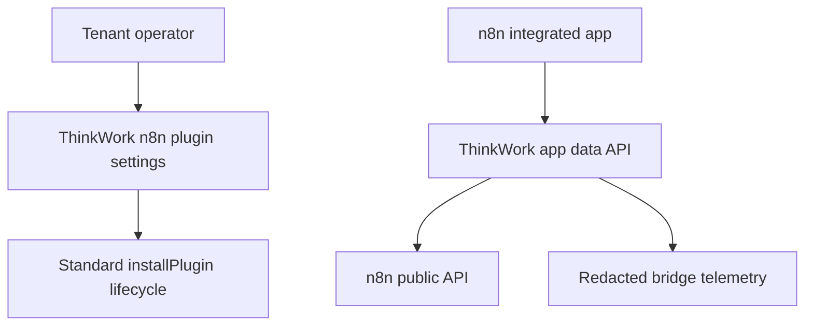
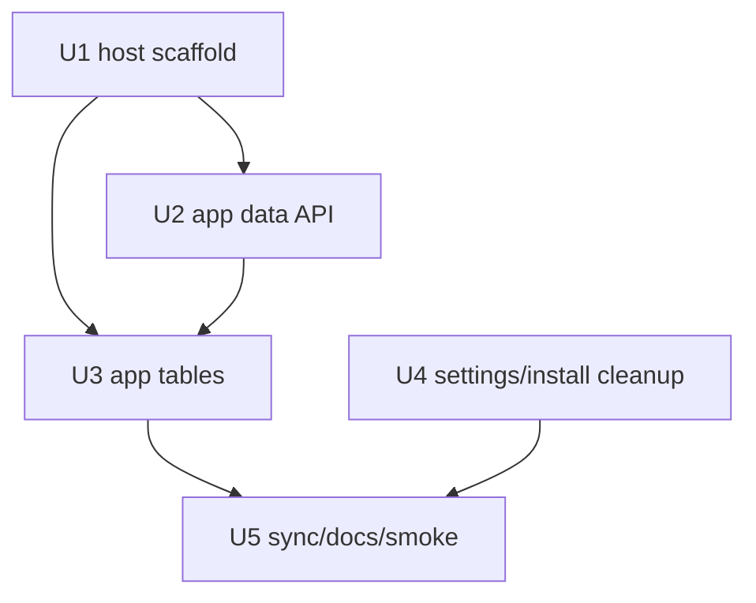

# feat: Add n8n integrated app

## Overview

Add a ThinkWork-owned n8n integrated app surface for workflow and execution
inspection, while simplifying the ThinkWork n8n plugin detail page into a
settings-only install/configuration surface. The first release is read-oriented:
workflow authors and shared n8n operators get DataTables for workflows and
executions in the n8n-side app, and ThinkWork remains the owner of plugin
installation, managed-app evidence, package settings, and bridge credentials
(see origin: `docs/brainstorms/2026-06-30-think-113-n8n-integrated-app-requirements.md`).

---

## Problem Frame

The current n8n plugin detail page puts workflow discovery in a Workflows tab
inside ThinkWork. That helped while n8n was only a managed plugin, but it becomes
the wrong home once n8n has an installed app surface. Operators also hit a dead
end when opening the specialized n8n page before installation: the page says n8n
is not installed, but does not provide the standard plugin install action.

The plan must move workflow and execution inspection into the native n8n app
direction requested in THINK-113, without weakening existing boundaries:
ThinkWork keeps install/config/deployment ownership, n8n keeps production
workflow activation, and V1 does not add authoring or publish controls.

---

## Requirements Trace

- R1. Show a clear uninstalled state on the n8n plugin detail page.
- R2. Provide a primary install action from the n8n plugin detail page.
- R3. Reuse the standard plugin install lifecycle for that action.
- R4. Make the n8n plugin detail page a single settings surface, not
  Workflows/Settings tabs.
- R5. Preserve runtime, component, package, and agent-step bridge settings.
- R6. Stop making the ThinkWork workflows route the primary workflow inspection
  surface; preserve compatibility without reintroducing tabs.
- R7. Provide a native installed n8n app surface modeled on the Twenty native
  app package pattern.
- R8. Provide a workflows DataTable with identity, name, active state, trigger
  context, readiness context, and native workflow navigation.
- R9. Provide an executions DataTable with execution identity, workflow
  association, status, timing, failure context, and native execution navigation.
- R10. Optimize workflow and execution tables for scanning, filtering, and
  drill-in, not authoring.
- R11. Expose ThinkWork bridge or agent-step linkage when an execution has it.
- R12. Do not add publish, unpublish, activation, or deactivation controls.
- R13. Do not create a second credential model for workflow operations.
- R14. Do not replace managed-app evidence, package settings, or bridge settings.

**Origin actors:** A1 tenant operator, A2 n8n workflow author, A3 shared n8n
operator, A4 ThinkWork agent, A5 ThinkWork platform.

**Origin flows:** F1 install n8n from plugin detail, F2 configure n8n in
ThinkWork, F3 inspect workflows in native n8n, F4 inspect executions in native
n8n.

**Origin acceptance examples:** AE1 install from detail page, AE2 settings-only
plugin detail, AE3 workflow table in native app, AE4 execution table with
ThinkWork links, AE5 no duplicate publish/config controls.

---

## Scope Boundaries

- V1 does not replace the managed n8n application plugin.
- V1 does not replace the n8n-to-ThinkWork agent-step bridge.
- V1 does not build workflow authoring, activation, publish, unpublish, retry,
  stop, or delete controls into the integrated app.
- V1 does not move package, runtime, deployment evidence, or bridge credential
  settings into native n8n.
- V1 does not introduce per-user n8n activation, private registry support,
  enterprise SSO, or a second n8n credential model.

### Deferred to Follow-Up Work

- Full workflow authoring or operator action controls: future n8n workflow
  control-plane work, after the read-only app proves the host and data paths.
- Per-user n8n permissions or SSO: future n8n plugin iteration, not part of this
  shared-operator V1.

---

## Context & Research

### Relevant Code and Patterns

- `plugins/twenty/twenty-app/README.md` documents the requested package pattern:
  a native app package, front component, app variables, guarded sync script, and
  operator runbook.
- `plugins/twenty/twenty-app/src/application-config.ts`,
  `plugins/twenty/twenty-app/src/front-components/thinkwork-settings.front-component.tsx`,
  and `plugins/twenty/scripts/sync-thinkwork-app.mjs` are the closest local
  package/deploy template. The n8n implementation should copy the package
  boundary and guarded-ops discipline, not assume `twenty-sdk` applies to n8n.
- `plugins/n8n/src/manifest.ts` already owns managed app, MCP, package settings,
  and bundled skill components. The integrated app should be recorded as
  plugin-owned source in the same package boundary.
- `plugins/n8n/README.md` states the V1 n8n plugin boundaries: shared native
  operator account, tenant service credential for MCP, separate inbound bridge
  credential, and no agent-driven production activation.
- `apps/web/src/components/settings/plugins/n8n/N8nPluginHome.tsx`,
  `apps/web/src/components/settings/plugins/n8n/N8nPluginSettings.tsx`, and
  `apps/web/src/routes/_authed/settings.plugins.n8n*.tsx` own the specialized
  n8n plugin detail surface that must become settings-only.
- `apps/web/src/components/settings/plugins/PluginDetail.tsx` shows the standard
  install lifecycle and mutation behavior that the n8n specialized page should
  reuse.
- `apps/web/src/lib/settings-queries.ts` already exposes
  `SettingsInstallPluginMutation`, `SettingsN8nPluginSettingsQuery`, and
  `SettingsDiscoverN8nWorkflowsQuery`.
- `packages/api/src/lib/workflows/n8n-discovery.ts` already discovers workflows
  through n8n's public API using the tenant `n8n-api` credential and merges
  ThinkWork workflow bindings.
- `packages/api/src/graphql/resolvers/n8n-agent-step-runs/telemetry.ts` exposes
  redacted bridge telemetry that can power ThinkWork linkage in the executions
  table.

### Institutional Learnings

- `docs/solutions/architecture-patterns/email-provider-plugin-surfaces-2026-06-18.md`:
  when a user asks for a plugin surface, verify the exact operator path they
  expect, not only the backend capability.
- `docs/solutions/architecture-patterns/plugin-source-boundaries-package-owned-deploy-verified-2026-06-17.md`:
  first-party plugin-specific source belongs under `plugins/<plugin-key>/`, with
  package-owned smokes/runbooks proving the deployed install path.
- `docs/solutions/architecture-patterns/external-workflow-agent-step-bridges-need-resumable-ledgers-2026-06-21.md`:
  bridge telemetry must stay redacted and durable; operator surfaces should not
  expose callback URLs, secret refs, idempotency keys, or raw payloads.
- `docs/solutions/design-patterns/screen-owned-list-display-adapters-2026-06-14.md`:
  list/table scanning behavior should be owned by the screen adapter, while
  shared table primitives stay generic.

### External References

- n8n public API docs: `https://docs.n8n.io/connect/n8n-api.md`. n8n documents
  REST access for programmatic GUI-equivalent operations.
- n8n API authentication docs:
  `https://docs.n8n.io/connect/n8n-api/authentication.md`. n8n uses the
  `X-N8N-API-KEY` header; enterprise instances can scope keys, including
  `workflow:read`, `workflow:list`, `execution:read`, and `execution:list`.

---

## Key Technical Decisions

- Treat `plugins/n8n` as the integrated app ownership boundary. This follows the
  plugin source-boundary pattern and keeps n8n-specific package, sync, smoke, and
  docs beside the existing plugin manifest.
- Add an explicit app-host compatibility spike as U1. Local Twenty patterns are
  strong, but Twenty's `twenty-sdk` does not transfer to n8n. The first unit must
  confirm the exact n8n host mechanism before deeper app UI is built.
- Reuse ThinkWork's server-side n8n credential path for app data. Existing
  `n8n-api` credential handling already satisfies R13 better than browser
  session-storage API keys or a new app-specific credential.
- Expose read-only app data through a purpose-built ThinkWork API/GraphQL shape
  rather than letting the native app call n8n directly with user-entered keys.
  This keeps secret handling centralized and lets the app merge n8n data with
  ThinkWork bindings and bridge telemetry.
- Make U1 choose the native app-to-ThinkWork authentication boundary before U2
  exposes app data. Acceptable shapes are an existing ThinkWork-authenticated
  session, an existing plugin install/app credential, or a narrowly scoped
  read-only app token created by the install flow. An unauthenticated endpoint
  or user-pasted n8n API key is not acceptable.
- Keep old ThinkWork workflows URLs compatibility-only. `/settings/plugins/n8n`
  and `/settings/plugins/n8n/settings` should render settings; the old workflows
  route should redirect to settings or show a compatibility notice without a tab
  model.
- Do not surface action controls in the integrated app. Native n8n navigation is
  allowed; activation, retry, stop, delete, and publish controls are outside V1.

---

## Open Questions

### Resolved During Planning

- Native app SDK surface: Treat the Twenty app as a package/deploy template, not
  as a shared SDK. U1 must verify the n8n app host/injection mechanism and record
  the chosen package contract before U3 builds the DataTable UI.
- Credential path: Use the existing tenant n8n public API credential configured
  through ThinkWork, plus redacted ThinkWork telemetry, instead of a second
  native-app credential.
- Old workflows route: Keep compatibility, but route users back to settings and
  native n8n instead of maintaining a ThinkWork workflow table.

### Deferred to Implementation

- Exact n8n host APIs and file names for the integrated app package: depends on
  U1 compatibility verification.
- Exact native app-to-ThinkWork authentication mechanism: depends on U1 host
  capabilities and must be selected before U2 exposes app data.
- Exact execution payload normalization: depends on the n8n execution endpoint
  response shape available in the target deployed version.
- Exact browser visual checks: depends on the implemented host route and local
  development path.

---

## Output Structure

```text
plugins/n8n/
  n8n-app/
    README.md
    package.json
    tsconfig.json
    src/
      application-config.ts
      front-components/
        thinkwork-workflows.front-component.tsx
      lib/
        n8n-app-data.ts
  scripts/
    sync-thinkwork-app.mjs
  test/
    integrated-app-contract.test.ts
```

The tree is the expected shape if U1 confirms a package-hosted n8n app is
viable. If U1 finds that n8n requires a different host shape, preserve the
package boundary and update the file layout accordingly before continuing.

---

## High-Level Technical Design

> *This illustrates the intended approach and is directional guidance for
> review, not implementation specification. The implementing agent should treat
> it as context, not code to reproduce.*



The ThinkWork settings surface owns installation and configuration. The n8n
integrated app owns read-only workflow/execution inspection. The ThinkWork data
API mediates n8n API credentials and joins in bridge linkage.

---

## Implementation Units

- U1. **Confirm and scaffold the n8n app host**

**Goal:** Establish the exact native n8n integrated-app packaging and install
mechanism, then scaffold the package under `plugins/n8n` using the Twenty app
package as the local template.

**Requirements:** R7, R10, R12, R13, R14; F3, F4.

**Dependencies:** None.

**Files:**
- Create: `plugins/n8n/n8n-app/README.md`
- Create: `plugins/n8n/n8n-app/package.json`
- Create: `plugins/n8n/n8n-app/tsconfig.json`
- Create: `plugins/n8n/n8n-app/src/application-config.ts`
- Create: `plugins/n8n/test/integrated-app-contract.test.ts`
- Modify: `plugins/n8n/src/index.ts`
- Modify: `plugins/n8n/README.md`

**Approach:**
- Use `plugins/twenty/twenty-app` as the package-boundary and documentation
  model: package-local README, host config, app component source, package script,
  and explicit install/deploy notes.
- Verify the current n8n-supported host mechanism before committing to final
  file names or runtime dependencies. If n8n does not support a first-class
  app/front-component model comparable to Twenty, keep the package boundary but
  document the chosen supported mechanism, such as a plugin-owned hosted page or
  wrapper integration reachable from n8n.
- Add contract tests that assert the n8n package is plugin-owned, read-only by
  default, and does not declare publish/activation controls.
- Record required host/version assumptions in the package README.

**Execution note:** Start with a contract test for the package descriptor and
non-goal controls before filling in the package body.

**Patterns to follow:**
- `plugins/twenty/twenty-app/package.json`
- `plugins/twenty/twenty-app/README.md`
- `plugins/twenty/src/index.ts`
- `plugins/n8n/test/manifest.test.ts`

**Test scenarios:**
- Happy path: package descriptor includes the n8n integrated app source under
  `plugins/n8n`, and plugin source-boundary checks can identify it as owned
  source.
- Edge case: package contract test fails if the app advertises activation,
  publish, retry, stop, delete, or package-setting controls.
- Integration: app package README and descriptor point to the same host/install
  mechanism so operators do not receive conflicting instructions.

**Verification:**
- The scaffold is self-contained under `plugins/n8n`, typecheckable enough for
  the selected host tooling, and explicitly documents any host limitation found
  during U1.

---

- U2. **Add app data API for workflows and executions**

**Goal:** Provide a ThinkWork-mediated read API that returns workflow rows,
execution rows, and ThinkWork bridge linkage for the n8n integrated app without
adding a new credential model.

**Requirements:** R8, R9, R10, R11, R13; F3, F4; AE3, AE4.

**Dependencies:** U1 for host contract direction.

**Files:**
- Modify: `packages/database-pg/graphql/types/plugins.graphql`
- Modify: `packages/database-pg/graphql/types/n8n-agent-step-runs.graphql`
- Modify: `packages/api/src/lib/workflows/n8n-discovery.ts`
- Create: `packages/api/src/lib/workflows/n8n-executions.ts`
- Modify: `packages/api/src/graphql/resolvers/plugins/n8n-settings.ts`
- Create: `packages/api/src/graphql/resolvers/plugins/n8n-app-data.ts`
- Test: `packages/api/src/lib/workflows/n8n-discovery.test.ts`
- Test: `packages/api/src/lib/workflows/n8n-executions.test.ts`
- Test: `packages/api/src/graphql/resolvers/plugins/n8n-app-data.test.ts`

**Approach:**
- Reuse `discoverN8nWorkflows` and the existing `n8n-api` tenant credential
  (`X-N8N-API-KEY`) for workflow rows.
- Add execution discovery with the same credential path and readiness/error
  model as workflow discovery. Normalize the response into redacted table rows:
  execution id, workflow id/name, status, started/finished timing, failure
  message summary, and native n8n execution URL data.
- Gate the app data resolver/endpoint behind the authentication mechanism chosen
  in U1. The endpoint must be tenant-scoped, read-only, and install-aware; it
  must not be reachable anonymously from the public internet.
- Join in `loadN8nAgentStepRunTelemetry` by workflow/execution identifiers so
  the app can display ThinkWork thread/bridge links when they exist.
- Keep raw execution payloads, credential values, tenant ids, idempotency keys,
  callback URLs, and secret refs out of the app response.
- Use limit/cursor or bounded limits; the app should not fetch unbounded
  execution history.

**Execution note:** Add redaction and failure-mode tests before adding the app
component that consumes this data.

**Patterns to follow:**
- `packages/api/src/lib/workflows/n8n-discovery.ts`
- `packages/api/src/graphql/resolvers/n8n-agent-step-runs/telemetry.ts`
- `packages/api/src/graphql/resolvers/plugins/n8n-settings.test.ts`
- `packages/database-pg/graphql/types/plugins.graphql`

**Test scenarios:**
- Covers AE3. Happy path: with a configured n8n API credential, workflow rows
  include id, name, active state, trigger context, readiness, and native
  navigation data.
- Covers AE4. Happy path: execution rows include id, workflow association,
  status, timing, failure summary, and native navigation data.
- Happy path: an execution with matching bridge telemetry includes safe
  ThinkWork linkage to thread/turn/message evidence.
- Edge case: missing n8n API credential returns a blocked readiness state with
  no secret leakage and no app crash.
- Edge case: n8n API failure returns a bounded error/readiness reason while
  preserving available fallback workflow snapshot data.
- Error path: malformed execution payloads are skipped or marked blocked rather
  than throwing raw payloads into GraphQL errors.
- Security: unauthenticated app data requests are rejected before any n8n API
  call or telemetry query runs.
- Security: serialized app data does not contain API keys, secret refs,
  idempotency keys, callback URLs, raw result payloads, or tenant ids.
- Integration: resolver enforces tenant/operator access consistently with
  existing n8n plugin settings.

**Verification:**
- The integrated app can read workflow/execution table data from ThinkWork using
  existing n8n plugin credentials, and all sensitive bridge/runtime material
  remains redacted.

---

- U3. **Build the read-only n8n integrated app tables**

**Goal:** Implement the n8n-side app UI with workflow and execution DataTables,
filters, empty/error states, and native n8n/ThinkWork drill-in links.

**Requirements:** R7, R8, R9, R10, R11, R12, R14; F3, F4; AE3, AE4, AE5.

**Dependencies:** U1, U2.

**Files:**
- Create: `plugins/n8n/n8n-app/src/front-components/thinkwork-workflows.front-component.tsx`
- Create: `plugins/n8n/n8n-app/src/lib/n8n-app-data.ts`
- Modify: `plugins/n8n/n8n-app/src/application-config.ts`
- Test: `plugins/n8n/test/integrated-app-contract.test.ts`

**Approach:**
- Build a compact operational UI with two table modes or segmented views:
  Workflows and Executions.
- Workflows table columns should include workflow name/id, active state, trigger
  context, readiness, last execution/update where available, and native workflow
  navigation.
- Executions table columns should include execution id, workflow, status,
  started/finished timing, failure summary, bridge/thread linkage, and native
  execution navigation.
- Keep controls to search/filter/refresh/navigation. Do not include activation,
  publish, retry, stop, delete, credential, package, or managed-app settings
  controls.
- Make empty states specific: not installed/not configured, no workflows, no
  executions, or no bridge-linked executions.
- Respect the host UI constraints discovered in U1. If the host does not support
  React/TanStack directly, create the smallest adapter layer needed while
  keeping row projection and filtering in testable helpers.

**Patterns to follow:**
- `plugins/twenty/twenty-app/src/front-components/thinkwork-settings.front-component.tsx`
- `apps/web/src/components/settings/plugins/n8n/N8nPluginWorkflows.tsx` for row
  fields to retire from ThinkWork, not for final host location.
- `docs/solutions/design-patterns/screen-owned-list-display-adapters-2026-06-14.md`

**Test scenarios:**
- Covers AE3. Happy path: workflow table renders multiple workflows, search
  filters by name/id/trigger/readiness, and the native workflow link targets the
  expected n8n workflow URL.
- Covers AE4. Happy path: execution table renders failed and successful
  executions, and bridge-linked rows show ThinkWork continuation links.
- Covers AE5. Negative path: rendered app contains no activation, publish,
  retry, stop, delete, package, or managed-app configuration controls.
- Edge case: empty workflow list shows a no-workflows state, not a loading or
  broken table.
- Edge case: missing credential/readiness blocked state shows the operator what
  must be configured in ThinkWork settings.
- Error path: data API failure shows a bounded retryable error without leaking
  raw response bodies.
- Integration: app refresh re-queries the ThinkWork app data API and preserves
  the selected table/filter state.

**Verification:**
- The native app is usable as a read-only operational surface for workflows and
  executions and routes users to existing owner surfaces for actions outside V1.

---

- U4. **Simplify ThinkWork n8n plugin detail to settings and install**

**Goal:** Remove the Workflows tab from the specialized ThinkWork n8n plugin
page and add the standard plugin install affordance to the uninstalled state.

**Requirements:** R1, R2, R3, R4, R5, R6, R14; F1, F2; AE1, AE2, AE5.

**Dependencies:** None; can land before the native app if copy points users to
settings/native n8n without claiming the app is installed.

**Files:**
- Modify: `apps/web/src/components/settings/plugins/n8n/N8nPluginHome.tsx`
- Modify: `apps/web/src/components/settings/plugins/n8n/N8nPluginHome.test.tsx`
- Modify: `apps/web/src/routes/_authed/settings.plugins.n8n.tsx`
- Modify: `apps/web/src/routes/_authed/settings.plugins.n8n.settings.tsx`
- Modify: `apps/web/src/routes/_authed/settings.plugins.n8n.workflows.tsx`
- Modify: `apps/web/src/components/settings/plugins/PluginsPage.test.tsx`
- Test: `apps/web/src/components/settings/plugins/n8n/N8nPluginHome.test.tsx`
- Test: `apps/web/src/components/settings/plugins/PluginDetail.test.tsx`

**Approach:**
- Remove the n8n page's `tab` prop and header tabs. Render settings by default.
- Keep component status, package settings, runtime settings, bridge endpoint,
  recent bridge evidence, and launch n8n action.
- Add the standard install mutation flow used by `PluginDetail.tsx`, including
  idempotency key generation, loading state, toast/error handling, and explicit
  refresh of catalog/install queries.
- The uninstalled state should show `Not installed`, a primary `Install` button
  for operators, and non-operator copy consistent with plugin permissions.
- Update `/settings/plugins/n8n` and `/settings/plugins/n8n/settings` to render
  the settings surface. Make `/settings/plugins/n8n/workflows` redirect to the
  settings route or render a compatibility message with no workflow table.
- Update plugin catalog row behavior so opening n8n lands on the settings-only
  surface, not `/workflows`.

**Execution note:** Replace the current string tests that assert tabs/workflow
table presence with behavior tests that assert their absence.

**Patterns to follow:**
- `apps/web/src/components/settings/plugins/PluginDetail.tsx`
- `apps/web/src/components/settings/plugins/PluginDetail.test.tsx`
- `apps/web/src/components/settings/plugins/n8n/N8nPluginSettings.tsx`

**Test scenarios:**
- Covers AE1. Happy path: when n8n is not installed and the viewer is an
  operator, the page shows `Not installed` and clicking `Install` calls
  `SettingsInstallPluginMutation` with plugin key `n8n`.
- Covers AE1. Error path: install mutation failure shows a bounded error/toast
  and keeps the install action available.
- Covers AE2. Happy path: when n8n is installed, the page renders settings,
  components, package settings, bridge configuration, and recent bridge evidence.
- Covers AE2. Negative path: the page header contains no Workflows/Settings tabs
  and does not render `N8nPluginWorkflows` or a workflow discovery DataTable.
- Edge case: non-operator member does not see the install action.
- Integration: `/settings/plugins/n8n/workflows` no longer renders workflow
  discovery and routes back to the settings-compatible surface.
- Integration: Settings -> Plugins opens n8n on the settings-only route.

**Verification:**
- The ThinkWork plugin page is a settings/install surface only, and the old
  workflow route is compatibility-only.

---

- U5. **Add guarded sync, docs, and verification evidence**

**Goal:** Provide the operator path and automated checks needed to install,
sync, and verify the n8n integrated app without mutating production by default.

**Requirements:** R3, R7, R8, R9, R11, R12, R14; AE1-AE5.

**Dependencies:** U1, U2, U3, U4.

**Files:**
- Create: `plugins/n8n/scripts/sync-thinkwork-app.mjs`
- Create: `docs/runbooks/n8n-thinkwork-native-app-install.md`
- Modify: `plugins/n8n/README.md`
- Modify: `docs/src/content/docs/applications/n8n.mdx`
- Modify: `plugins/n8n/smoke/README.md`
- Create: `plugins/n8n/smoke/n8n-integrated-app-smoke.mjs`
- Test: `plugins/n8n/test/integrated-app-contract.test.ts`

**Approach:**
- Mirror the Twenty guarded operations shape: dry-run validates package/host
  credentials and prints planned actions; apply requires explicit `--apply` and
  target credentials.
- Add an opt-in smoke that proves the user-facing path: installed n8n plugin,
  configured n8n API credential, integrated app reachable, workflow table data,
  execution table data, and bridge-linked execution evidence when a disposable
  bridge run is supplied.
- Keep live verification explicit and disposable. Ordinary CI should exercise
  package contracts and dry-run checks only.
- Update docs to distinguish ThinkWork plugin settings from the n8n integrated
  app and to explain where operators configure API credentials, package specs,
  and bridge settings.

**Patterns to follow:**
- `plugins/twenty/scripts/sync-thinkwork-app.mjs`
- `docs/runbooks/twenty-thinkwork-native-app-install.md`
- `plugins/n8n/smoke/n8n-managed-app-smoke.mjs`
- `plugins/n8n/smoke/n8n-agent-step-bridge-smoke.mjs`

**Test scenarios:**
- Happy path: dry-run sync validates required inputs and exits without
  publishing/installing the app.
- Error path: apply mode refuses to run without explicit target URL/credential
  inputs.
- Integration: smoke dry-run reports missing prerequisites without mutating n8n
  or ThinkWork.
- Integration: live smoke, when explicitly enabled, verifies workflows,
  executions, and bridge links through the ThinkWork install path.
- Security: smoke output redacts API keys, bearer tokens, bridge credentials,
  callback URLs, and raw execution payloads.

**Verification:**
- Operators have a documented, dry-run-first path to sync and verify the app,
  and the docs make the install/settings/native-app split clear.

---

## Implementation Dependency Graph



U4 can land independently because it removes the wrong ThinkWork surface and
adds the missing install path. U3 and U5 depend on the host/data decisions.

---

## System-Wide Impact

- **Interaction graph:** Settings -> Plugins, plugin install lifecycle,
  managed-application settings, n8n public API discovery, bridge telemetry, and
  native n8n app packaging all interact through this plan.
- **Error propagation:** n8n API credential/readiness failures should surface as
  bounded readiness states in the app and settings UI, not raw GraphQL or fetch
  errors.
- **State lifecycle risks:** Plugin install state and app data readiness are
  distinct. Installing the plugin does not imply n8n deployed, API credential
  configured, or the integrated app synced.
- **API surface parity:** Web settings GraphQL and the native app data API should
  share workflow discovery semantics where possible, but the native app should
  not inherit the old browser-session API key fallback.
- **Integration coverage:** Local unit tests prove row projection and redaction;
  package smoke proves the deployed ThinkWork-managed n8n path.
- **Unchanged invariants:** n8n MCP service credentials, bridge inbound
  credentials, managed-app evidence, package settings, and production activation
  ownership do not move into the integrated app.

---

## Risks & Dependencies

| Risk | Mitigation |
|------|------------|
| n8n lacks a stable Twenty-style native app SDK | U1 makes host verification explicit and requires documenting the supported host mechanism before app UI work proceeds. |
| Integrated app accidentally becomes a second settings/control plane | R12/R14 are enforced in U1/U3 tests and docs route users back to owner surfaces. |
| App data leaks secrets or raw execution payloads | U2 uses server-side credential mediation and explicit redaction tests based on existing bridge telemetry guidance. |
| Settings cleanup lands before app is usable | U4 preserves native n8n launch and settings; old workflow route can redirect to settings/native n8n without claiming app availability. |
| Live verification mutates production workflows | U5 follows dry-run-first and opt-in smoke patterns with disposable workflow/run inputs. |

---

## Documentation / Operational Notes

- Update `plugins/n8n/README.md` to name the integrated app as a read-only
  operational surface, not a settings replacement.
- Add `docs/runbooks/n8n-thinkwork-native-app-install.md` for the guarded sync
  and verification path.
- Update `docs/src/content/docs/applications/n8n.mdx` so operators understand
  where to install/configure n8n in ThinkWork and where to inspect
  workflows/executions in n8n.
- Linear THINK-113 should stay in Plan Review until a human accepts the plan,
  because U1 may affect final package shape.

---

## Sources & References

- **Origin document:** `docs/brainstorms/2026-06-30-think-113-n8n-integrated-app-requirements.md`
- Linear issue: `THINK-113`
- Prior n8n plugin requirements:
  `docs/brainstorms/2026-06-19-n8n-application-plugin-requirements.md`
- Prior n8n bridge requirements:
  `docs/brainstorms/2026-06-20-n8n-thinkwork-agent-step-bridge-requirements.md`
- Twenty native app package: `plugins/twenty/twenty-app/README.md`
- n8n plugin package: `plugins/n8n/README.md`
- n8n public API docs: `https://docs.n8n.io/connect/n8n-api.md`
- n8n API authentication docs:
  `https://docs.n8n.io/connect/n8n-api/authentication.md`
