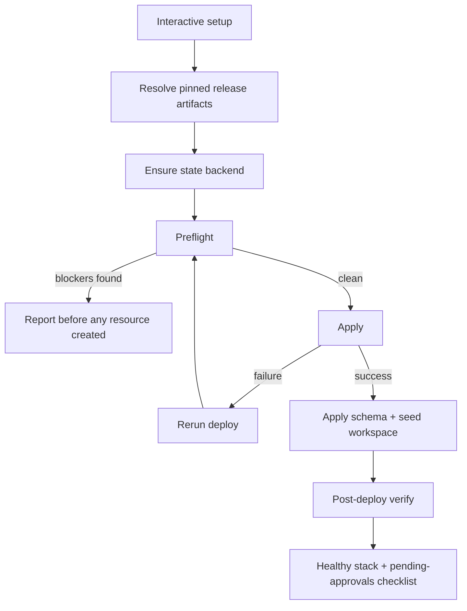
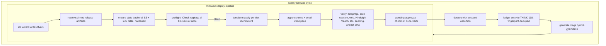

# CLI Zero-to-Deployed Reliability - Plan

## Goal Capsule

- **Objective:** A customer admin with nothing but AWS credentials installs the CLI, answers interactive prompts, runs `thinkwork deploy`, and lands on a fully working environment (DB, Web, Hindsight ECS, domain; SES optional) — with any mid-deploy failure recoverable by rerunning the same command.
- **Product authority:** This document plus Linear THINK-118 (failure ledger lives on the ticket).
- **Execution profile:** Harness-first. U1 ships before the hardening units; every failure the harness finds becomes a THINK-118 ledger entry fixed at its originating layer. Units land as independent PRs to `main` in dependency order.
- **Stop conditions:** Surface to the user before: destroying any stage not created by the harness (account-ID + stage-name assertion must pass), changing the repo greenfield backend that dev CI depends on, or any fix that requires controller/runner architecture changes beyond variable threading.
- **Definition of done:** see `## Definition of Done`.

---

## Product Contract

### Summary

Make the CLI's zero-to-deployed path reliable, evidence-first: stand up a repeated real-deploy harness (prod-shaped stages in the ThinkWork AWS account) whose failure ledger drives the hardening, then ship the deploy pipeline stages in evidence order — converging rerun, preflight, guided full-environment config, post-deploy verification.

### Problem Frame

Deploys "usually end partially deployed." The May 2026 roadmap completed the CLI's API-side command surface (25 command groups, npm 0.12.x), but the operator surface that THINK-118 targets — deploy, environments, first-run setup — does not keep the promise the README already makes (install via brew/npm, Quick Start deploy). Recent greenfield deployments (McPherson, TEI) each tripped on multiple issues: new-account Lambda quota caps, controller payload bugs, pg sslmode, missing email wiring.

Today `thinkwork deploy` (local Terraform path, the default) goes straight to `terraform apply` with no preflight, and a failed apply exits with the raw error — no detection of a previously-failed apply, no guided recovery. The preflight checks that do exist (Bedrock model access probe, Lambda concurrency quota) live only in the separately-run `thinkwork doctor`. Nothing in the repo deploys a stack from scratch and verifies its health; the e2e smoke script targets an already-deployed stage. For a self-serve customer admin, a stranded half-stack with no recovery path is where they give up.

### Key Decisions

- **Harness-first, features second.** The failure catalog is unknown ("partially deployed usually"), so a repeated real-deploy harness is built first and its failure ledger — recorded on THINK-118 — decides what hardening ships and in what order.
- **Harden the existing local-Terraform path; CLI-first orchestration is the consolidation target.** The Step Functions controller is a retirement candidate, not the future: its fire-and-forget opacity (start-execution → print ARN, no step visibility) is the opposite of what this plan builds, and accumulated evidence (McPherson/TEI payload bugs, runner self-update chicken-and-egg, frozen-role IAM gaps) points at retiring it once the hardened CLI path covers its use cases. Rewriting the deploy path to fix its reliability is how partial deploys happen — so this plan hardens what exists and lets the controller decision fall out of the ledger.
- **Fix at whatever layer the failure lives.** CLI, Terraform modules, or Deployment Controller — the customer doesn't care which layer broke, so the effort owns the fix wherever the harness finds it.
- **A first deploy must produce a fully working environment: DB, Web, Hindsight ECS, and domain. SES is optional** — its production access requires a manual AWS approval that can take a day and can be denied, so email is a tracked follow-up rather than a deploy blocker.
- **Extend the existing `init` wizard rather than build a new one.** `thinkwork init` already generates `terraform.tfvars` from interactive prompts with auto-generated secrets and a small required variable surface; the gap is full-environment coverage (domain, SES) plus generator wiring, not the mechanism.
- **Harness cycles ephemeral prod-shaped stages; a persistent `prod` is the graduation act.** Early failed cycles never wedge a stage anyone intends to keep; after three consecutive green cycles, the real `prod` stage is deployed and left standing.

### Key Flows

- F1. First-run zero-to-deployed
  - **Trigger:** Customer admin installs the CLI in an AWS account with admin credentials.
  - **Steps:** Install → interactive setup collects the full-environment config (region, database, Hindsight, domain; SES offered but skippable) and provisions the per-account Terraform state backend → preflight validates the account before any resource is created → deploy applies → post-deploy verification proves the stack works → pending external items (SES production access, DNS propagation) surface as a visible checklist.
  - **Outcome:** A healthy, logged-in environment, or a preflight report naming exactly what to fix before anything was created.
- F2. Mid-deploy failure recovery
  - **Trigger:** A deploy fails partway, leaving resources partially applied.
  - **Steps:** The failure message states what failed and says to rerun → the admin reruns the same `deploy` command → the run recognizes prior partial state (including a stale state lock) as a normal condition and converges from it.
  - **Outcome:** A healthy environment without manual Terraform surgery or console cleanup. Starting over via `destroy` is also reliable.
- F3. Harness cycle
  - **Trigger:** Scheduled or on-demand hardening run.
  - **Steps:** Scripted deploy of a uniquely-named prod-shaped stage into the ThinkWork AWS account using the `.aws` credentials profile → health verification → teardown (account-ID asserted before destroy) → any failure recorded on the THINK-118 ledger with its layer (CLI / Terraform / controller) → fix → repeat.
  - **Outcome:** Failures become ledger entries and fixes; the harness stays on as a regression gate.

### Requirements

**Acceptance harness**

- R1. A scripted, repeatable harness deploys a prod-shaped environment from scratch into the ThinkWork AWS account (`.aws` credentials profile), verifies health end-to-end, and tears down.
- R2. Every harness failure is recorded on THINK-118 with the failing layer and its fix status — the ledger is the work queue.
- R3. The harness remains a recurring regression gate after the burn-down, not a one-off.

**Convergence**

- R4. Rerunning `thinkwork deploy` after any mid-deploy failure converges to a healthy stack; partial state is treated as a normal starting condition, never a stranded error.
- R5. `thinkwork destroy` reliably returns the account to a clean slate so starting over is always safe.

**Preflight**

- R6. `deploy` runs preflight checks before creating any resource — credentials, Bedrock model access, service quotas, and domain/DNS readiness — and reports all blockers at once with the fix for each. (The existing `doctor` probes are the seed; today deploy never invokes them.)

**Guided configuration**

- R7. The interactive setup collects everything a full environment needs — DB, Web, Hindsight ECS, domain — with SES as a skippable option; no hand-editing of `terraform.tfvars` on the happy path.

**Verification and visibility**

- R8. A deploy ends by proving the stack works (API answers, an authenticated session completes a GraphQL call, web loads, database reachable with schema applied, Hindsight healthy, workspace seeded), not by `terraform apply` exiting 0.
- R9. `status`/`doctor` track pending external approvals (SES production access, DNS propagation) until green; a deploy that is healthy except for these counts as success with a visible checklist.

**Root-cause posture**

- R10. Failures surfaced by the harness are fixed at their originating layer (CLI, Terraform modules, or Deployment Controller), not papered over with CLI retries.

**State substrate**

- R11. Deploys manage a durable per-account Terraform state substrate: the CLI provisions or verifies a versioned state bucket and lock table in the target account before the first apply, and never silently writes state into another account's backend or fragile local files.

### Acceptance Examples

- AE1. **Covers R4.** **Given** a deploy that failed midway through applying the app tier, **when** the admin reruns `thinkwork deploy` with no other action, **then** the run completes and post-deploy verification passes.
- AE2. **Covers R6.** **Given** a fresh AWS account whose Lambda concurrency quota is 10, **when** the admin runs `deploy`, **then** preflight reports the quota blocker (and any others) before any resource is created.
- AE3. **Covers R9.** **Given** a deploy where SES production access is still pending AWS approval, **when** the deploy otherwise verifies healthy, **then** the deploy reports success with SES listed as a pending external approval that `status` continues to track.
- AE4. **Covers R4, R11.** **Given** a deploy interrupted with Ctrl+C during apply (leaving a held state lock), **when** the admin reruns `deploy`, **then** the run detects the stale lock, shows holder and age, and offers guided recovery instead of a raw lock error.

### Success Criteria

- Three consecutive clean harness cycles (deploy → verify → destroy) with zero manual intervention in the ThinkWork account, plus one clean cycle in a fresh sandbox account (AWS Organizations member — the only environment that reproduces new-account quota and access failures), followed by a verified persistent `prod` deploy, closes THINK-118.
- The bar throughout: fresh AWS account + admin credentials → converging deploy → healthy stack, proven by the automated harness rather than a hand-tested happy path.

### Scope Boundaries

**Deferred for later**

- Controller retirement — after THINK-118 closes, migrate the remaining controller-driven deploy use cases onto the hardened CLI path and retire the Step Functions controller (a separate plan owns the migration). Controller-first consolidation is explicitly rejected as the direction.
- Connector setup (Slack, GitHub, WorkOS) in the first-run wizard — post-deploy configuration.
- Shell completion, telemetry, passive update notifications.

**Deferred to Follow-Up Work**

- Lambda zip mtime non-determinism (no-op deploys report ~89 handlers "Modifying") — a convergence adjacency tracked in `docs/plans/2026-05-11-001-fix-deploy-workflow-speedup-plan.md`, not blocking THINK-118.
- Reconciling the hand-rolled drizzle migration track into deploy convergence (today `db:migrate-manual` reports drift; deploy does not gate on it).
- A canonical post-deploy health matrix learning in `docs/solutions/` once U6 stabilizes (several prior learnings each rediscovered one cell of it).

**Outside this effort**

- The 25 API-side command groups (thread/agent/memory/etc.) — completed in the May roadmap; not part of THINK-118.
- Automating SES production access approval — external AWS process; the CLI tracks it, doesn't own it.

### Dependencies / Assumptions

- The local-Terraform path (Terraform modules bundled into the CLI package) is the canonical self-serve deploy substrate; the controller path stays opt-in via `--controller`. Verified in `apps/cli/src/commands/deploy.ts`.
- `thinkwork init` already generates `terraform.tfvars` interactively with auto-generated secrets; required variable surface is small (~5 uncommented assignments in `terraform/examples/greenfield/terraform.tfvars.example`), with the 200+ module variables defaulted. Work extends this, not replaces it.
- SES and custom domain are already optional, flag-driven module inputs (`ses_parent_domain`, `customer_domain`, `cognito_email_source_arn` default empty in `terraform/modules/thinkwork/variables.tf`).
- Repeated prod-shaped deploys into the ThinkWork account are acceptable in cost and blast radius (harness tears down after each cycle).

---

## Planning Contract

**Product Contract preservation:** changed — added R11 (state substrate) and AE4 after planning research found nothing provisions a per-account Terraform state backend; F1/F3 and Key Decisions updated for the confirmed ephemeral-cycles-then-graduation harness model; Outstanding Questions resolved in place (harness stage identity, convergence mechanism, harness cadence — now KTD-2, KTD-3, KTD-5). Post-review (user-confirmed): R8 extended with authenticated-session and schema checks; Success Criteria gained the fresh sandbox-account close gate (moved out of deferred scope); U9/U10 added for release-artifact resolution and schema application.

### Key Technical Decisions

- **KTD-1. State backend is CLI-managed per account, injected via backend config — never hardcoded.** A new state-backend helper provisions or verifies an S3 bucket (versioned, SSE-encrypted, public-access-blocked, with a noncurrent-version expiry rule — state holds plaintext secrets) + DynamoDB lock table in the _target_ account and passes them to `terraform init` via `-backend-config` (init-scaffolded layouts gain a partial `backend "s3" {}` block). The repo greenfield layout's hardcoded `thinkwork-terraform-state` backend (`terraform/examples/greenfield/main.tf`) stays untouched for dev CI; harness and customer deploys use the injected backend. Rationale: today a fresh customer account fails at `terraform init` or writes state into ThinkWork's bucket; init-scaffolded layouts use local state whose loss makes deploys non-convergent.
- **KTD-2. Convergence = durable state + full idempotent reapply, not resume-at-tier.** Rerun always re-applies all tiers in order (`expandComponent` order preserved); `-c <tier>` remains an expert flag. Stale DynamoDB locks are detected on rerun with holder/age shown and guided `force-unlock` offered. `init` reruns preserve auto-generated secrets and immutable answers (region, stage, account) — only additive changes allowed. Rationale: the tiers are one root module applied repeatedly; terraform already converges when state is intact, so the work is protecting state integrity and the rerun UX, not building a resume engine.
- **KTD-3. Harness stages are ephemeral and self-identifying: `hprod-<yymmdd>-<n>`.** The harness generates unique prod-shaped stage names, asserts the target AWS account ID before every destroy, and refuses to destroy stages it didn't create. Graduation (after 3 consecutive greens) deploys the persistent `prod` stage via the identical pipeline. Rationale: same-name stages share state keys and locks; a harness destroy against a real stage is the catastrophic failure mode.
- **KTD-4. Preflight is the `doctor` Check registry, executed by `deploy`.** Extract `doctor`'s `Check {name, run()}` interface and pure `evaluateX()` functions into a shared library; `deploy` runs the full registry before apply and reports all blockers at once (`--skip-preflight` escape hatch). New checks join the registry as ledger entries prove them preflightable (R10 feedback loop). Rationale: Bedrock/quota probes already exist and are unit-tested; the gap is that deploy never runs them.
- **KTD-5. The harness is a bash sibling of `scripts/e2e-cli-smoke.sh`, promoted to CI on the `verify.yml` pattern.** Local script first (`scripts/deploy-harness.sh`: deploy → verify → destroy → ledger entry), then a `workflow_dispatch` + optional cron workflow with a concurrency group. Ledger entries carry a failure fingerprint (layer + failing step + error class) and dedupe by fingerprint so nightly repeats update `last seen` instead of spamming THINK-118.
- **KTD-6. Verification means live paths plus deployed-artifact evidence.** The verify step extends `status`'s existing probe fan-out (Hindsight `/health` curl, resource existence) with a GraphQL POST probe, an authenticated-session probe (seeded admin completes a token-authenticated call), a web-URL HTTP check, a workspace-seeding check, and artifact assertions (release-manifest SHA, a canary Lambda env var via `get-function-configuration`). Rationale: institutional learnings show HTTP 200, `AdminCreateUser` success, and green terraform are non-evidence — verification must exercise the real path and assert what is actually running.
- **KTD-7. Packaged installs consume pinned ThinkWork releases through the existing release-artifact path.** The wizard/deploy resolves a release and threads `lambda_artifact_bucket`/`lambda_artifact_prefix`, `agentcore_pi_source_image_uri`, and a web-asset publication step through the generated layout, with placeholder-mode deploys failing loudly. Rationale: without this the init-scaffolded layout deploys infrastructure with no application code — Lambda stays in placeholder mode, the Pi container has no image, web assets never publish (they are CI-built today).

### High-Level Technical Design

The deploy pipeline gains three stages around the existing apply loop, and the harness wraps the whole pipeline in a cycle:

Component boundaries: the state-backend helper and Check registry live in `apps/cli/src/lib/` and are consumed by `init`, `deploy`, `doctor`, and `destroy`; the harness consumes only the public CLI surface (`node dist/cli.js …`), never internal modules — it must prove what a customer experiences.

### Assumptions

- The ThinkWork account can host multiple concurrent `hprod-*` stages within current quotas; the harness still serializes runs via a CI concurrency group.
- `terraform output`-driven probes (the `bootstrap` command's pattern) are sufficient to locate every endpoint verify needs; no new Terraform outputs are expected beyond possibly the web URL.
- Workspace seeding (`thinkwork bootstrap`) is idempotent enough to fold into the deploy tail; if not, U6 makes verify fail with an explicit "run thinkwork bootstrap" instruction instead.

---

## Implementation Units

### U1. Deploy harness script and THINK-118 ledger contract

- **Goal:** A runnable `scripts/deploy-harness.sh` that cycles deploy → verify → destroy on a uniquely-named stage and emits fingerprinted ledger entries, using only what exists today (verify v1 = `status` probes + `scripts/post-deploy.sh`).
- **Requirements:** R1, R2, R3; F3.
- **Dependencies:** none — ships first by design.
- **Files:** `scripts/deploy-harness.sh` (new), `scripts/lib/harness-ledger.mjs` (new, fingerprint + markdown entry rendering), `apps/cli/__tests__/harness-ledger.test.ts` (new).
- **Approach:** Mirror `scripts/e2e-cli-smoke.sh` structure (`set -u`, no `-e`, step counter, PASS/FAIL summary). Install the CLI from a packed artifact (`npm pack` + install into a temp prefix) rather than repo `dist/cli.js`, so greens attest the install channel the README promises. Per cycle, scaffold a scratch directory via `thinkwork init --defaults --dir <scratch> -s hprod-<yymmdd>-<n>` and deploy from there — local state is an accepted U1 limitation superseded when U2 lands (U8 swaps the backend alongside the verify leg). Assert `aws sts get-caller-identity` account ID against an expected-account argument before deploy and again before destroy. On any failing step, render a ledger entry (fingerprint = layer + step + error class; fields: first/last seen, stage, log excerpt) with secret-shaped values scrubbed (tfvars-declared sensitive values, Secrets Manager/RDS credentials) before it is written to the ledger file or posted. Entries post to THINK-118 manually or by script until U8 automates it — R2 is fully satisfied by U1+U8 together. Destroy always attempts even after failure (cleanup-first), and reports leftover resources it could not remove.
- **Test scenarios:**
  - Happy path: ledger helper renders a well-formed entry from a synthetic failure (named layer, fingerprint stable across identical failures).
  - Edge: two distinct failures produce distinct fingerprints; the same failure twice produces one fingerprint with updated `last seen`.
  - Edge: a log excerpt containing a tfvars secret value renders with the value scrubbed.
  - Error path: account-ID mismatch aborts before any deploy/destroy action (exit non-zero, explicit message).
- **Verification:** One full local harness cycle against the ThinkWork account completes (green or with a correctly-rendered ledger entry); `pnpm --filter thinkwork-cli test` passes.

### U2. Per-account state backend and lock recovery

- **Goal:** Deploys get durable, versioned, account-local Terraform state; stale locks become a guided-recovery condition instead of a raw error.
- **Requirements:** R4, R11; AE4.
- **Dependencies:** none (parallel with U1).
- **Files:** `apps/cli/src/lib/state-backend.ts` (new), `apps/cli/src/terraform.ts` (ensureInit gains backend-config injection; lock-error detection), `apps/cli/src/commands/init.ts` (scaffold writes partial backend block; backend ensure during init), `apps/cli/__tests__/state-backend.test.ts` (new), `apps/cli/__tests__/terraform-backend-fixture.test.ts` (new).
- **Approach:** `ensureStateBackend(account, region, stage)` creates-or-verifies `thinkwork-tfstate-<accountId>` (versioning, default SSE encryption, S3 public-access-block, lifecycle rule expiring noncurrent versions) + `thinkwork-tflocks-<accountId>`, returning `-backend-config` args keyed `thinkwork/<stage>/terraform.tfstate`. `ensureInit` accepts and applies them, comparing the backend recorded in `.terraform/terraform.tfstate` against the injected config and rerunning `terraform init -reconfigure` on mismatch (failing loudly if existing state would be orphaned) — today it short-circuits whenever `.terraform/` exists, which would leave the injection silently inert. `resolveTierDir` fails loudly instead of falling back silently, printing resolved dir + backend key before apply. On `Error acquiring the state lock`, parse holder/age; if the holding process is plausibly dead, offer `force-unlock` interactively (or instruct in non-TTY). Repo greenfield layout detection leaves the existing hardcoded backend untouched.
- **Patterns to follow:** pure `evaluateX()` + injected-deps testing shape from `apps/cli/src/commands/doctor.ts`; fixture-content assertions from `apps/cli/__tests__/terraform-cognee-fixture.test.ts`.
- **Test scenarios:**
  - Happy path: backend args generated with account-scoped names and stage-scoped key; init-scaffolded `main.tf` fixture contains the partial backend block.
  - Edge: existing bucket/table found → verified, not recreated; repo greenfield dir → no injection.
  - Edge: previously-initialized dir with different backend config → `terraform init -reconfigure` fires; matching config → no re-init.
  - Error paths: lock error output parsed into holder/age; `resolveTierDir` mismatch exits non-zero naming the expected layout.
- **Verification:** Fresh-account simulation (distinct stage in ThinkWork account) round-trips state into the account-scoped bucket; a deliberately interrupted apply followed by rerun reaches the guided-lock path.

### U3. Preflight gate in deploy

- **Goal:** `deploy` refuses to create resources when a detectable blocker exists, reporting all blockers at once; non-TTY behavior is explicit.
- **Requirements:** R6; AE2.
- **Dependencies:** U2 (state-backend check joins the registry).
- **Files:** `apps/cli/src/lib/checks.ts` (new — Check registry extracted from doctor), `apps/cli/src/commands/doctor.ts` (consumes the shared registry), `apps/cli/src/commands/deploy.ts` (preflight stage + `--skip-preflight`; non-TTY without `--yes` exits non-zero instead of silent no-op), `apps/cli/__tests__/preflight.test.ts` (new), `apps/cli/__tests__/deploy.test.ts` (extend).
- **Approach:** Move the five existing checks unchanged; add: credential expiry margin (STS token TTL vs. a conservative apply estimate), state-backend reachability (from U2), domain NS delegation (resolve NS records for the configured domain; block with delegation instructions), and SES production-access + identity status when SES is configured — warn-tier only, reported but never blocking, consistent with AE3's success-with-checklist contract. Run all checks, print a single table of failures with per-check fix text, exit before any terraform invocation. Ledger feedback loop: each preflightable apply failure from the harness becomes a new registry check (R10).
- **Patterns to follow:** `evaluateBedrockProbe`/`evaluateLambdaConcurrency` pure-function style with unit tests in `apps/cli/__tests__/doctor.test.ts`.
- **Test scenarios:**
  - Happy path: all checks pass → apply proceeds; `--skip-preflight` bypasses with a warning.
  - Covers AE2. Quota blocker → report names the quota and the fix, exit before terraform, no resources created.
  - Edge: multiple simultaneous failures all appear in one report; SES check skipped when SES not configured.
  - Error path: non-TTY without `--yes` exits non-zero with the "provide --yes / flags" message (regression for today's silent exit-0).
- **Verification:** `thinkwork doctor` output unchanged for existing checks; harness run against a stage with an induced blocker (e.g., bogus domain) stops at preflight.

### U4. Converging rerun and init-rerun safety

- **Goal:** Rerunning `deploy` after any failure converges; rerunning `init` never rotates live secrets or mutates immutable answers.
- **Requirements:** R4; AE1.
- **Dependencies:** U2.
- **Files:** `apps/cli/src/commands/deploy.ts` (failure message names failed tier + "rerun to converge"; rerun re-applies all tiers), `apps/cli/src/commands/init.ts` (detect existing tfvars/state → preserve secrets, lock region/stage/account, allow additive answers), `apps/cli/__tests__/init-rerun.test.ts` (new), `apps/cli/__tests__/deploy.test.ts` (extend).
- **Approach:** Keep the tier loop; replace mid-loop `process.exit` with a failure summary that names the tier, the error class, and the rerun instruction. `init` rerun loads existing tfvars as defaults, refuses changes to region/stage/account (explicit error naming `destroy` as the path to change them), and never regenerates `db_password`/`api_auth_secret` when present.
- **Test scenarios:**
  - Covers AE1. Simulated tier-2 failure → summary names tier + rerun; injected-deps rerun applies tiers 1..n again.
  - Edge: init rerun with existing tfvars preserves both secrets byte-for-byte; changing region on rerun is rejected.
  - Error path: corrupt/unparseable existing tfvars → explicit error, no overwrite.
- **Verification:** Harness cycle with an induced mid-apply kill converges on the automatic rerun leg.

### U5. Wizard full-environment coverage

- **Goal:** `init` collects and threads everything a full environment needs — domain (with ACM/CloudFront wiring), optional SES, operator emails — so the happy path never edits `terraform.tfvars` by hand.
- **Requirements:** R7.
- **Dependencies:** U2 (both units edit `init.ts`; land U2 first or coordinate the merges).
- **Files:** `apps/cli/src/commands/init.ts` (prompts + `buildTfvars` + generated `main.tf` var threading and `us_east_1` provider alias), `apps/cli/__tests__/init-tfvars.test.ts` (extend), `apps/cli/__tests__/terraform-domain-fixture.test.ts` (new).
- **Approach:** Add prompt groups: domain (app/www domain; explain DNS delegation; optional docs domain) and SES (skippable; `ses_parent_domain`, sender identity — skipping records the pending-approval item for R9). Thread `customer_domain`/cert vars, SES vars, `memory_engine`, and `platform_operator_emails` through `buildTfvars` and the generated `main.tf` module block; add the `us_east_1` provider alias the CloudFront ACM path requires (mirroring `terraform/examples/greenfield/main.tf`). Learning applied: TEI's invite-email failure came from domain/SES vars dropped at _two_ wiring points — assert both tfvars and module-block threading in fixtures.
- **Test scenarios:**
  - Happy path: full-environment answers produce tfvars + main.tf containing every threaded var (fixture assertions).
  - Edge: SES skipped → no SES vars emitted, pending-approval marker recorded; `--defaults` still produces a deployable minimal config.
  - Error path: malformed domain input re-prompts (TTY) or exits with a named error (non-TTY).
- **Verification:** A wizard-generated stage deploys with a real domain in the harness and passes DNS-dependent preflight.

### U9. Release artifact resolution for packaged installs

- **Goal:** A packaged-install deploy runs real application code: Lambda handlers, the Pi container image, and published web assets come from a pinned ThinkWork release instead of placeholder mode.
- **Requirements:** R7, R8 (KTD-7).
- **Dependencies:** U5 (init generator threading).
- **Files:** `apps/cli/src/lib/release.ts` (new — release manifest resolution), `apps/cli/src/commands/init.ts` (thread `lambda_artifact_bucket`/`lambda_artifact_prefix`, `agentcore_pi_source_image_uri` through tfvars + generated main.tf), `apps/cli/src/commands/deploy.ts` (web-asset publication step; fail loudly on placeholder mode), `apps/cli/__tests__/release.test.ts` (new), `apps/cli/__tests__/terraform-artifacts-fixture.test.ts` (new).
- **Approach:** Reuse the release-artifact path the enterprise/controller deploys already consume (`terraform/modules/app/lambda-api/remote-artifacts.tf` resolves artifact mode from `lambda_artifact_bucket`; `agentcore_pi_source_image_uri` exists for GitHub-free customer deployments). `init`/`deploy` resolve a pinned release (latest by default, `--release` override), thread the artifact variables, and publish web assets to the stage bucket as the CI pipeline does. Deploys that would resolve `lambda_artifact_mode = "placeholder"` fail with a named error instead of shipping an empty stack.
- **Patterns to follow:** controller deploy input construction in `apps/cli/src/commands/deploy.ts` (manifest URL + sha256 fields); fixture-content assertions for generated main.tf.
- **Test scenarios:**
  - Happy path: resolved release produces tfvars/main.tf containing the three artifact vars (fixture assertion); manifest parse returns pinned URIs.
  - Edge: `--release` override selects a non-latest release; missing manifest field → named error.
  - Error path: placeholder-mode resolution aborts the deploy naming the missing artifact variables.
- **Verification:** A harness cycle from the packed CLI reaches a GraphQL probe answered by real handler code (not placeholder).

### U10. Database schema application in the deploy tail

- **Goal:** A fresh stage's database has the full schema applied before verify runs — from a packaged install, with no monorepo checkout.
- **Requirements:** R4, R8.
- **Dependencies:** U2 (runs inside the converging deploy tail).
- **Files:** `apps/cli/src/lib/db-migrations.ts` (idempotent migration runner), `apps/cli/src/commands/deploy.ts` (schema step after apply, before verify), `apps/cli/package.json` + `apps/cli/scripts/` (bundle `packages/database-pg/drizzle/` migrations into the published package), `apps/cli/__tests__/migrations.test.ts`.
- **Approach (revised after harness cycle 7 — the original journaled-only/Data API design could not work):** the journal is frozen at 0019 while ~200 hand-rolled files carry the real schema history (journaled 0019 depends on hand-rolled `0018_skill_runs`), and those files use psql-grade SQL (multi-statements, `DO $$` bodies, inline BEGIN/COMMIT) the Aurora Data API rejects. The runner now connects **directly to the cluster endpoint with node-postgres** (clusters are publicly accessible by platform design — `db:push` relies on the same posture) and replays **every non-rollback migration file** in numeric order: psql `\`-meta lines stripped, `:'stage'` interpolated, compliance role passwords resolved from (or minted into) the stage's Secrets Manager containers (folding `bootstrap-compliance-roles.sh` into deploy), and operator-only files that need hand-passed variables skipped with a warning. Hash tracking in `drizzle.__drizzle_migrations` is unchanged.
- **Test scenarios:**
  - Happy path: fresh database → all journaled migrations apply in order; rerun → no-op.
  - Edge: partially-migrated database resumes from the journal position.
  - Error path: migration failure names the failing file and leaves a rerunnable state.
- **Verification:** Harness cycle 1 passes the DB-schema and workspace-seeding probes on a fresh stage.

### U6. Post-deploy verification and pending-approvals checklist

- **Goal:** Deploys end by proving the stack works and naming what external approvals remain; `status` keeps tracking them.
- **Requirements:** R8, R9; AE3.
- **Dependencies:** U3 (shares the Check registry shape); U9, U10 (a green verify in the harness requires real artifacts and an applied schema).
- **Files:** `apps/cli/src/commands/verify.ts` (new command; also invoked from the deploy tail), `apps/cli/src/commands/status.ts` (pending-approvals section), `apps/cli/src/commands/deploy.ts` (tail invokes verify; failure here fails the deploy), `apps/cli/__tests__/verify.test.ts` (new).
- **Approach:** Extend `status`'s probe fan-out into pass/fail checks: GraphQL POST (introspection-free canary query) against the HTTP API, an authenticated-session probe (seeded Cognito admin completes a token-authenticated GraphQL call — the `thinkwork me` path; login failure fails the deploy), web CloudFront URL HTTP 200, Hindsight ALB `/health`, DB reachability via `terraform output`-driven lookup (the `bootstrap` command's pattern), workspace seeding present (else instruct `thinkwork bootstrap`), and artifact evidence — release-manifest/deployment-status read plus one `aws lambda get-function-configuration` env assertion. Pending approvals (SES production access, DNS propagation) render as a checklist, count as success-with-checklist (AE3), and persist in `status`. Learnings applied: `/healthz` 200 ≠ deployment complete; assert deployed env and active artifact, not build-time constants. Port or bundle the post-deploy probe **and** `scripts/bootstrap-workspace.sh` (it resolves repo-relative paths and shells to `psql`) so npm/brew installs behave identically to repo checkouts — otherwise the verify remediation dead-ends packaged customers at the last step of F1.
- **Test scenarios:**
  - Happy path: all probes green → verify exits 0 with a summary table.
  - Covers AE3. SES pending → exit 0, checklist names SES with its state; `status` shows the same item.
  - Edge: seeding absent → verify fails with the exact bootstrap instruction; packaged-install path finds the bundled probe and bootstrap script.
  - Error paths: GraphQL unreachable vs. auth-session failure vs. web unreachable vs. Hindsight unhealthy each fail with a distinct, named probe.
- **Verification:** Harness verify leg uses `thinkwork verify` (replacing the U1 stopgap) and correctly fails a stack with a deliberately broken component.

### U7. Destroy clean-slate hardening

- **Goal:** `destroy` reliably returns the account to a state from which a fresh deploy succeeds.
- **Requirements:** R5.
- **Dependencies:** U2 (backend awareness).
- **Files:** `apps/cli/src/commands/destroy.ts`, `apps/cli/src/lib/state-backend.ts` (orphan scan helpers), `apps/cli/__tests__/destroy.test.ts` (extend/new).
- **Approach:** Pre-empty versioned S3 buckets before terraform destroy; delete Secrets Manager secrets with force-delete (and make redeploy tolerate secrets in a deletion window); bounded retry on dependency-order errors; finish with an orphan scan (by stage tag/name prefix) reporting anything left. Guard: keyed to the persisted graduated-stage identity recorded at U8 graduation — not a stage-name pattern (`hprod-*` would false-match a `prod` substring check while a renamed real stage could slip through). `--yes` on a graduated stage requires explicit `--stage` (no config-default fallback) plus the account-ID assertion; ephemeral `hprod-*` stages are exempt because the harness destroys them only via its own account-asserted path.
- **Test scenarios:**
  - Happy path: injected-deps destroy sequences bucket-empty → terraform destroy → orphan scan.
  - Edge: secret already in deletion window → redeploy path tolerates AlreadyExists-with-scheduled-deletion.
  - Error paths: partial destroy reports the exact leftover resources; `--yes` + graduated stage without explicit `--stage` refuses; `hprod-*` stages bypass the graduated-stage gate.
- **Verification:** Harness teardown leg leaves zero orphans (scan is empty) and an immediate redeploy of the same stage name succeeds.

### U8. Recurring harness workflow, burn-down, and graduation

- **Goal:** The harness runs on demand and on a schedule in CI; the burn-down loop closes THINK-118 with three consecutive greens and a standing `prod`.
- **Requirements:** R2, R3, R10; Success Criteria.
- **Dependencies:** U1–U7, U9, U10.
- **Files:** `.github/workflows/deploy-harness.yml` (new), `scripts/deploy-harness.sh` (verify leg swap to `thinkwork verify`; backend swap to U2's injected per-account backend), `apps/cli/README.md` + `docs/src/content/docs/applications/cli/commands.mdx` (doc sync for new/changed commands — repo convention: docs sync in every implementation PR).
- **Approach:** `workflow_dispatch` + cron on the `verify.yml` pattern (concurrency group; stage gating in wrapper scripts, not job-level `if: env.X` — known GHA failure mode). Burn-down: run, fix the top ledger item at its layer, rerun; count consecutive greens; at three, run one clean cycle in the fresh sandbox account (Success Criteria close gate), then deploy persistent `prod` through the identical pipeline, verify, and record its identity for U7's destroy guard. Ledger items that reveal controller-layer causes get fixed there only as evidence demands (Key Decisions).
- **Test scenarios:** Test expectation: none for the workflow file itself beyond the repo's workflow needs-graph check (dangling `needs:` refs fail every deploy — known failure mode); harness behavior is covered by U1 tests and real cycles.
- **Verification:** Workflow runs green from `workflow_dispatch`; three consecutive scheduled/dispatched greens recorded on THINK-118; persistent `prod` stands and passes `thinkwork verify`.

---

## Verification Contract

| Gate                       | Command                                                                              | Applies to                  |
| -------------------------- | ------------------------------------------------------------------------------------ | --------------------------- |
| CLI unit + fixture suite   | `pnpm --filter thinkwork-cli test` (full suite, not just new files)                  | U1–U7, U9, U10, every PR    |
| Typecheck / build          | `pnpm --filter thinkwork-cli typecheck` and `pnpm --filter thinkwork-cli build`      | every PR                    |
| Repo pre-commit gates      | `pnpm lint && pnpm typecheck && pnpm test && pnpm format:check`                      | every PR                    |
| Harness cycle (real AWS)   | `bash scripts/deploy-harness.sh <expected-account-id>` against the ThinkWork account | U1, U4, U6, U7, U8, U9, U10 |
| Deployed-stage regression  | `bash scripts/e2e-cli-smoke.sh <stage> <tenant-slug>` after harness deploy leg       | U6, U8                      |
| Workflow needs-graph check | validate `needs:` references after any workflow edit                                 | U8                          |

Real-AWS gates are the acceptance evidence; unit/fixture gates are the merge bar. Post-merge, watch the Deploy run on `main` (pre-merge CI does not run terraform apply).

## Definition of Done

- All units U1–U10 landed on `main` via reviewed PRs; README + `commands.mdx` + `--help` agree for every touched command.
- Three consecutive clean harness cycles with zero manual intervention, recorded on THINK-118, plus one clean cycle in a fresh sandbox account.
- Persistent `prod` stage deployed through the same pipeline, passing `thinkwork verify`, left standing.
- Every THINK-118 ledger entry is fixed at its layer or explicitly filed as follow-up work.
- No abandoned experimental code from the burn-down remains in the tree; harness scratch stages (`hprod-*`) are all destroyed.
