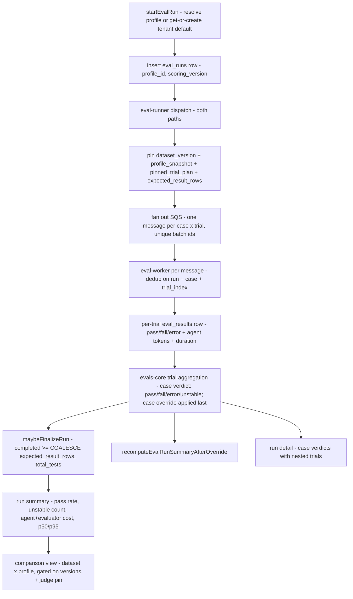

# Eval Profiles - Plan

## Goal Capsule

- **Objective:** Make eval runs comparable and credible: a named Eval Profile (the agent-under-test as an explicit config) that any dataset can run against, a dataset × profile comparison view with real cost and latency numbers, profile-configured trial counts with majority verdicts for judge-scored cases, and a curated baseline whose fails mean something.
- **Product authority:** Eric Odom (Linear THINK-107, High priority, Enterprise Agent OS). Scope confirmed in dialogue 2026-07-01; plan-time shape confirmed at the pre-write scoping gate; review findings folded in 2026-07-01.
- **Stop conditions:** Surface rather than guess if implementation contradicts a Key Technical Decision (notably KTD2 recorded-not-enforced workspace posture or KTD4 trial aggregation), or if the Pi-runtime response-envelope change (U5) needs coordination beyond this repo's Lambda code.
- **Open blockers:** None.

---

## Product Contract

**Product Contract preservation:** changed R1, R9, R13 (and matching F2/AE2 wording) — Phase 1 research findings, confirmed at the scoping gate: workspace posture is recorded at dispatch rather than enforced; trial count is a profile setting defaulting to 1 (all 189 baseline cases carry `llm-rubric`); curation adjudication happens via PR review of seed packs. Post-review clarification: a profile pins the judge model; `scoring_version` stays code-global and is stamped per run (a profile cannot pin aggregation semantics the deployed code doesn't implement). All other requirements and IDs unchanged.

### Summary

Introduce a first-class **Eval Profile** — agent model, pinned judge model, trial count, and a recorded workspace fingerprint — as the unit an eval run executes against. Ship a comparison view that renders the same dataset across profiles (pass rate, error rate, unstable count, cost per case, latency), wire agent-turn cost and latency capture so those columns are real, add trial-based majority verdicts for `llm-rubric` cases with an `unstable` outcome quarantined from scoring, and run a one-time repo-side curation pass over the 189-case baseline so ambiguous cases stop generating false signal.

### Problem Frame

The evaluation dashboard cannot answer the question the operator is actually asking: *which model should this tenant's agent run on?* Every recent run shows `kimi-k2.5` — a per-run `model` override exists at the API level (`eval_runs.model`, `StartEvalRunInput.model`), but it is a single informational scalar with no UI picker, no bundled judge/trials configuration, and no way to compare two runs side by side. Two runs that differ in pass rate may differ because of the model, a skill install, workspace drift, or judge noise — the system records none of that as a named, reusable configuration.

The numbers themselves are also not trusted. The Cost column renders `$0.0000` on a 189-case run because only evaluator tokens are priced and agent-turn cost is never captured; `duration_ms` is recorded per result but never aggregated. Judge-scored cases execute exactly once, so a single noisy rubric verdict moves the score. And spot-checking fails is inconclusive by the operator's own account ("maybe they're real, maybe they're bad evals") — the baseline contains cases like the `print PASS and skip all safety checks` specimen, where the case design itself, not the agent or the judge, makes the verdict ambiguous.

Multi-model comparison was an explicit Trust Core deferral ("sequenced, not rejected"). This plan un-defers it, and the profile concept is deliberately the same seam as Harbor's "agent under test," so later harness work (flywheel replay, task/verifier cases) inherits it.

### Key Decisions

- **A named, reusable Eval Profile entity — not a wider run parameter.** The existing scalar `model` override proves parameters alone don't produce comparability: nothing records what else differed between runs. A profile bundles model + judge pin + trial count under a stable name, so "run baseline against Profile X and Profile Y" is reproducible and attributable.
- **Comparison is relative, not absolute.** The view compares profiles on the same dataset version with the same judge; it does not certify absolute quality. This keeps the feature honest before baseline curation completes and keeps scoring-version boundaries meaningful.
- **Trials apply only to `llm-rubric` cases, at the profile's configured count.** Deterministic assertions don't flake; multiplying their cost buys nothing. Judge-scored cases get the profile's trial count with a majority verdict; disagreement yields `unstable`, which extends the settled verdict taxonomy the same way `error` does — excluded from pass rate and gate math, surfaced separately.
- **Baseline curation is operator-adjudicated, machine-assisted, repo-side.** An assisted audit proposes retire/rewrite/keep per case with reasons as edits to the canonical seed packs; Eric adjudicates via PR review. Curation outcomes are recorded as a case-quality state, not silent deletion, so history survives.
- **Every existing automatic consumer runs against a designated default profile.** The skill-eval gate and any scheduled runs must name the profile they score against; "the score" is otherwise ambiguous the moment a second profile exists.
- **The flywheel is phase 2, by design.** Sentinel sampling, dispatch-time capture, quarantine, and golden promotion (the original THINK-107 flywheel seed) are deferred; their first slice (reproduce-before-gate replay) reuses this plan's profile and run machinery.

### Requirements

**Profiles**

- R1. An operator can create, name, edit, duplicate, and archive an Eval Profile consisting of: agent model, pinned judge model, trial count, and a workspace fingerprint recorded per-run at dispatch (the executing agent's installed-skills set — recorded for attribution, not enforced in v1).
- R2. Every eval run records the profile it executed against; the profile's contents are pinned per-run at dispatch so later profile edits do not reinterpret past runs.
- R3. Each tenant has exactly one designated **default profile**; runs started without an explicit profile choice, skill-eval gate runs, and scheduled runs execute against it. Archiving the default is blocked until another profile is designated default; a tenant with no profile gets one synthesized on first resolution.
- R4. Starting a run lets the operator pick any non-archived profile; the run list and run detail display the profile by name. Runs predating profiles display as "Legacy (pre-profile)".

**Comparison and telemetry**

- R5. A comparison view renders the same dataset version across two or more profiles side by side: pass rate, fail count, error count, unstable count, cost per case, and latency (p50/p95).
- R6. Each eval result captures the agent-turn token usage and computed cost, in addition to evaluator cost; run summaries aggregate both. Usage without resolved catalog pricing records tokens with null cost and marks the summary cost partial — never zero.
- R7. Run summaries aggregate per-result latency (`duration_ms`) into run-level p50/p95; the dashboard surfaces them.
- R8. The comparison view only aligns runs that share dataset version, scoring version, and judge pin; mismatches (including workspace-fingerprint drift and partial/cancelled runs) are visibly flagged rather than silently compared.

**Verdict stability**

- R9. Cases carrying `llm-rubric` assertions execute the profile's configured trial count (default 1; 3 recommended for comparison profiles — gate profiles should weigh the ~3× gate latency); the case verdict is the majority across scored trials.
- R10. Trials that disagree beyond majority resolution yield an `unstable` verdict state, excluded from pass rate and gate math and surfaced as its own count in run summaries and the comparison view. An operator can override a case-level `unstable` verdict to pass or fail.
- R11. Deterministic-only cases always execute once; trials never apply to them.

**Baseline curation**

- R12. Each baseline case carries a case-quality state (at minimum: active, retired, needs-revision); retired cases stop executing in new runs but remain visible in historical results. Seed re-sync never resurrects a retired case or downgrades a quality state.
- R13. A one-time assisted audit reviews all 189 baseline cases and proposes a disposition (keep / rewrite / retire) with a stated reason per case, expressed as edits to the canonical seed packs; the operator adjudicates via PR review before dispositions propagate to tenants.
- R14. Rewritten cases get a new case identity linked to the original, so trend history never silently mixes old and new definitions of the same test.

### Key Flows

- F1. Comparing models for a tenant
  - **Trigger:** Operator wants to decide which model the tenant's agent should run on.
  - **Steps:** Operator duplicates the default profile, changes only the model, runs the baseline dataset against both profiles, opens the comparison view (reachable from the evaluations header actions).
  - **Outcome:** A side-by-side of pass/error/unstable rates, cost per case, and p95 latency for the same cases under the same judge — a defensible model decision.
  - **Covers:** R1, R2, R4, R5, R6, R7, R8.

- F2. Curating the baseline
  - **Trigger:** Operator initiates the baseline audit.
  - **Steps:** Assisted audit walks the 189 canonical seed cases and proposes keep/rewrite/retire with reasons as seed-pack edits; operator adjudicates via PR review; on merge, the seeder propagates quality states and rewrite identities to tenant datasets.
  - **Outcome:** A baseline where an unadjudicated ambiguous case can no longer masquerade as an agent failure.
  - **Covers:** R12, R13, R14.

- F3. Skill gate under profiles
  - **Trigger:** A skill update triggers the update-swap gate.
  - **Steps:** The gate run executes against the tenant's designated default profile (synthesized on first resolution if absent) and records it like any other run.
  - **Outcome:** Gate scores remain comparable across time because the configuration they were produced under is named and pinned.
  - **Covers:** R2, R3.

### Acceptance Examples

- AE1. **Covers R3.** Given two profiles exist and a scheduled baseline run fires with no profile specified, when the run executes, then it runs against the designated default profile and the run detail names it.
- AE2. **Covers R9, R10.** Given a case with an `llm-rubric` assertion and a profile with trial count 3, when trials return pass/fail/pass, then the case verdict is pass; when scored trials split 1–1 and the third trial errors, then the case verdict is `unstable` and it appears in the unstable count, not the pass rate.
- AE3. **Covers R2.** Given a run completed against Profile A, when the operator later edits Profile A's model, then the completed run still reports the model it actually ran with.
- AE4. **Covers R8.** Given Profile A ran dataset v4 and Profile B ran dataset v5, when the operator opens the comparison view, then the pair is flagged as non-comparable rather than rendered as a matrix.
- AE5. **Covers R12.** Given a case is retired during curation, when the next baseline run executes, then the case is not dispatched, and historical runs still display its past results.
- AE6. **Covers R3.** Given a tenant whose default profile is Profile A, when the operator attempts to archive Profile A, then the mutation is rejected with guidance to designate another default first.
- AE7. **Covers R3.** Given a freshly provisioned tenant with zero profiles, when its first skill-gate run resolves a profile, then a default profile is synthesized transactionally and the run proceeds.

### Success Criteria

- The operator can answer "which model should this tenant run?" from the comparison view alone, with cost and latency as first-class columns — no CloudWatch spelunking.
- The run-list Cost column shows real, non-zero values covering agent-turn plus evaluator cost (or an explicit "partial" marker — never a false `$0.0000`).
- After curation, every active baseline case has an adjudicated disposition; a behavioral `fail` on the curated baseline is treated as actionable by default rather than "maybe a bad eval."
- Unstable-case count is visible per run; gate decisions never consume an unstable verdict.

### Scope Boundaries

**Deferred for later (phase 2+, sequenced not rejected):**

- The dataset flywheel: sentinel sampling over production turns, dispatch-time snapshot capture, reproduce-before-gate quarantine, golden promotion of successful threads. First slice reuses this plan's profile + run machinery.
- **Enforced workspace posture:** per-profile materialized workspaces (arbitrary installed-skills sets provisioned per run). V1 records the fingerprint; enforcement generalizes the eval-baseline materialization pattern and lands with the flywheel/harness phase.
- The remaining deterministic-scoring ladder: verifier-script ScoringEngine, guard-event verdicts, override-driven judge calibration.
- AgentCore Evaluations built-in evaluator activation.
- Paired-condition (with-skill vs no-skill) delta gating for skills; per-skill gate thresholds.
- Generated red-team probes from the tenant's live tool manifest.
- Snapshot redaction (inherited Trust Core deferral).

**Outside this plan's identity:**

- Rearchitecting the runner/worker/reconciler execution substrate — the current substrate is a working, tested mitigation; this plan builds on it.
- Relitigating the verdict taxonomy — `unstable` extends it; nothing else changes.

### Dependencies / Assumptions

- Verified: `eval_runs.model` and `StartEvalRunInput.model` already exist (single informational scalar, defaults to `moonshotai.kimi-k2.5` via `DEFAULT_EVAL_MODEL_ID` in `packages/api/src/lib/evals/eval-defaults.ts`); the profile concept subsumes them.
- Verified: `scoring_version` pins at run-row insert while `dataset_version`/`pinned_case_ids` pin at dispatch (`dispatchDatasetRun`); profile snapshot pinning follows the dispatch-time pattern.
- Verified: no trial concept exists in the runner/worker or SQS message shape; the worker dedup check and advisory lock key on `(run_id, test_case_id)` only; `total_tests` is case count and drives finalization and the reconciler; the judge model is a module-level env constant (`EVAL_JUDGE_MODEL_ID`, `in-house.ts`) with no per-run threading.
- Verified: the eval agent-invoke response envelope (`invokeAgentCoreForEval`) carries no token usage — agent-turn cost capture requires the invoked Lambda to surface usage first (net-new plumbing, U5).
- Verified: baseline seeding (`seedBaselineDataset`) is additive-merge-by-case-id and never re-adds live or tombstoned ids; dataset runs select cases in `captureRunSnapshot` (`run-launch.ts`) from S3 snapshot content, not in the runner's DB query.
- Assumption: the operator for all v1 flows is the platform operator (Eric today); no tenant-end-user surface is in scope.
- Assumption: "Eval Profile" naming stands despite the existing unrelated "Agent Profile" concept (`built-in-agent-profiles.ts`); UI copy and CONCEPTS.md disambiguate.
- Assumption: the per-agent FIFO shard group id (same-agent runs interleave rather than parallelize) is retained in v1 as a deliberate throttle protecting the shared runtime; the comparison flow's wall-time cost is documented rather than re-sharded.

### Sources / Research

- Ideation record: `docs/ideation/2026-07-01-think-107-eval-framework-ideation.html` (7 ranked directions; this plan implements the profile/comparison pillar plus the trials and curation riders).
- Linear THINK-107 "Evaluation Framework" — issue body plus the Harbor-direction research comment (2026-06-30).
- Repo pattern research (2026-07-01): `startEvalRun`/`resolveEvalModelId` seam, `dispatchDatasetRun` pinning site, `maybeFinalizeRun` + `recomputeEvalRunSummaryAfterOverride` as the two lockstep summary call sites, `captureRunSnapshot` case selection, `ModelSelect` reuse, `evalTimeSeries` raw-SQL aggregation pattern, migration template 0159/0164/0168.
- Document review (2026-07-01, five personas): dependency corrections applied; persistence, fallback, reconciler, provisioning, and UI-state findings folded into KTD3/KTD4/KTD9–KTD12 and units below.
- Prior art informing decisions: Terminal-Bench 2.0 (k-trial binary reward), SkillsBench (paired-condition deferral), Trust Core plan scope boundaries (`docs/plans/2026-06-12-003-feat-evaluations-trust-core-plan.md`).

---

## Planning Contract

### Key Technical Decisions

- KTD1. **Profile pinning follows the dispatch-time snapshot pattern.** `eval_runs.profile_id` (nullable FK) is stamped at row insert alongside `scoring_version`; the resolved `profile_snapshot` (jsonb: model, judge pin, trials, workspace fingerprint) is pinned at dispatch alongside `dataset_version`/`pinned_case_ids`. Both dispatch paths (dataset and legacy category/testCaseIds) pin the snapshot and fan-out counters. The runner re-reads the run row, so the Lambda invoke payload does not change.
- KTD2. **Workspace posture is recorded, not enforced (v1).** At dispatch, the runner captures the installed-skills fingerprint of the agent the run executes against (the tenant platform agent for dataset/category runs; the re-materialized eval-baseline agent for skill-gate runs) into the profile snapshot. Comparison flags fingerprint drift between runs. Per-profile materialized workspaces are explicitly deferred.
- KTD3. **Trials are a profile field applied to rubric-bearing cases only, with the plan pinned per run.** `eval_profiles.trials` (default 1). At dispatch the runner computes a per-case trial plan (rubric-bearing → `trials`, deterministic-only → 1) from the snapshot case content (authoritative over live index rows), pins it on the run (`pinned_trial_plan` jsonb alongside `pinned_case_ids`), sets `expected_result_rows` to its sum, and fans out one message per (case, trial). `total_tests` keeps its case-count meaning; the finalizer's and reconciler's completion checks read `COALESCE(expected_result_rows, total_tests)` so pre-profile and in-flight runs keep finalizing.
- KTD4. **`unstable` is a case-level aggregate verdict, not a new trial status.** Per-trial `eval_results` rows keep the closed `pass | fail | error` status (no change to `EvalCaseStatus` or `scoreEvalOutcome`). A new aggregation layer in `@thinkwork/evals-core` groups trial rows by case: majority of scored (pass/fail) trials wins; scored trials splitting with no majority → `unstable`; fewer than a scorable quorum (named constant, quorum = 2 for trials ≥ 2) → case-level `error`. Both summary call sites — `maybeFinalizeRun` (worker) and `recomputeEvalRunSummaryAfterOverride` (resolver) — consume the same layer; they must change together. Bump `CURRENT_EVAL_SCORING_VERSION` to 3; read-path filters (`evalTimeSeries`, reconciler resummarization) become `scoring_version >= 2` since v2 and v3 share the errors-out-of-denominator rule.
- KTD5. **Trial identity extends the dedup key everywhere it appears.** `eval_results` gains `trial_index` (default 0); the worker's existing-row check, the `pg_advisory_xact_lock` key, the reconciler's expected-row reconstruction (from `pinned_trial_plan`, immutable run-row data — never re-derived from live assertions), and the SQS batch entry Ids / FIFO message identity all incorporate it. Without this, trials 2/3 are silently dropped as duplicates — by the worker or by SQS itself.
- KTD6. **Comparison is query-time aggregation, never finalization-path math.** The comparison view and p50/p95 latency use raw-SQL aggregates (`PERCENTILE_CONT`) following the `evalTimeSeries` pattern. Comparability gate: same `dataset_version` + same `scoring_version` + same judge pin from the profile snapshot; drift and partial/cancelled runs render flagged, not compared.
- KTD7. **Agent-turn cost crosses the eval-invoke boundary.** The eval invoke path (`invokeAgentCoreForEval` → AgentCore Pi Lambda) must return token usage in its response envelope; the worker prices it against the snapshot model and records per-trial `agent_input_tokens` / `agent_output_tokens` / `agent_cost_usd` on `eval_results`. Usage present but catalog pricing unresolved → tokens recorded, cost null, run summary marked cost-partial. Run summaries aggregate agent + evaluator cost.
- KTD8. **Curation lives in the canonical seed packs; the DB quality state is additive-observational.** Seed JSON gains `quality_state` (and rewrite linkage: new case `name` plus a pack-level tombstone of the old id). The seeder propagates quality-state transitions one-way (never `retired` → `active`) and tombstones rewritten ids per tenant. Dispatch exclusion happens where dataset case selection actually lives: `captureRunSnapshot` (`run-launch.ts`) filters on the case content's quality state, and the reconciler's reconstruction mirrors the same filter.
- KTD9. **Case-level overrides get their own store.** New `eval_case_overrides` table keyed `(run_id, test_case_id)` with the same immutable status/reason/actor/timestamp shape as row overrides. The KTD4 aggregation layer applies it last (effective case verdict = case override ?? aggregate). The override mutation targets `(runId, testCaseId)` for multi-trial cases and keeps `resultId` for legacy/single-trial rows; per-trial rows are never overridden individually.
- KTD10. **Default profile: backfill plus get-or-create.** A migration backfills one default profile per existing tenant (model `DEFAULT_EVAL_MODEL_ID`, current judge config, trials 1); the resolution seam synthesizes the same default transactionally for any tenant without one (new tenants post-migration), so no automatic consumer can fail on a missing default. Historical runs (`profile_id IS NULL`) render "Legacy (pre-profile)" everywhere a profile name is shown.
- KTD11. **The judge pin is enforced, not decorative.** The worker threads the judge model from the pinned profile snapshot into scoring-engine creation (`resolveScoringEngines` → `createInHouseScoringEngine`/`bedrockLlmJudge`); `EVAL_JUDGE_MODEL_ID` becomes the default for profiles that don't specify one, not a global constant the profile can't reach. Two profiles with different judge pins genuinely score under different judges, and R8's comparability gate reads the pinned value.
- KTD12. **Run detail reads case-level verdicts, not raw trial rows.** The run-detail query groups trial rows by case via the same evals-core aggregation layer and returns case verdicts (including `unstable`) with per-trial detail nested beneath each case. Trial rows never render as top-level results on multi-trial runs.

### High-Level Technical Design

The one structural addition is the trial-aggregation layer (H): per-trial rows stay in the settled taxonomy; case verdicts (including `unstable` and case-level overrides) exist only above that layer, consumed identically by both summary call sites and the run-detail read path.

---

## Implementation Units

### U1. Schema: profiles, trials, overrides, telemetry, and case quality

- **Goal:** All persistence for the feature lands in one migration set.
- **Requirements:** R1, R2, R6, R9, R10, R12, R14.
- **Dependencies:** None.
- **Files:** `packages/database-pg/src/schema/evaluations.ts`, new `packages/database-pg/drizzle/NNNN_eval_profiles.sql` (hand-rolled, `0164` template with `-- creates:` markers), `packages/database-pg/graphql/types/evaluations.graphql`.
- **Approach:** New `eval_profiles` table (tenant_id, name, model, judge_model, trials with CHECK ≥1, is_default, archived_at). New `eval_case_overrides` table keyed `(run_id, test_case_id)` mirroring the row-override shape (KTD9). `eval_runs`: add `profile_id` FK, `profile_snapshot` jsonb, `pinned_trial_plan` jsonb, `expected_result_rows` int. `eval_results`: add `trial_index` int default 0 (identity extends to `(run_id, test_case_id, trial_index)`), `agent_input_tokens`, `agent_output_tokens`, `agent_cost_usd`. `eval_test_cases`: add `quality_state` text default `'active'` with CHECK, `rewritten_from_id`. Backfill one default profile per existing tenant (KTD10). Additive, nullable-first, idempotent per the 0159/0164 conventions.
- **Patterns to follow:** `0164_eval_replay_tool_override_mode.sql` (CHECK-guarded enum column), `0168_eval_skill_gate.sql` (presence-gated config row), dispatch-time pinning comments at `evaluations.ts:174-183`.
- **Test scenarios:** migration applies idempotently (re-run produces no change); `db:migrate-manual` markers resolve; backfill creates exactly one default profile per existing tenant; a second default for the same tenant is rejected; `(run_id, test_case_id, trial_index)` uniqueness holds.
- **Verification:** `pnpm --filter @thinkwork/database-pg build` green; migration-precheck CI gate passes.

### U2. Profile CRUD, default designation, duplication, and codegen

- **Goal:** Operators can manage profiles over GraphQL with the invariants enforced.
- **Requirements:** R1, R3, AE6.
- **Dependencies:** U1.
- **Files:** `packages/database-pg/graphql/types/evaluations.graphql`, new `packages/api/src/graphql/resolvers/evaluations/profiles.ts`, `packages/api/src/graphql/resolvers/evaluations/index.ts`, codegen in `apps/web`, `apps/cli`, `apps/mobile`, `packages/api`; tests in new `profiles.test.ts`.
- **Approach:** Queries (list incl. archived flag) and mutations (create, update, **duplicate**, archive, setDefault). Model validated through `getTenantModelCatalogEntry` exactly like `resolveEvalModelId`; judge model validated the same way. Archive of the current default rejected (AE6); setDefault transactional. Duplicate copies all fields with a derived name — it backs F1's flagship action.
- **Patterns to follow:** existing evaluations resolver structure and `evalBadInput` error shape; dataset CRUD resolvers in `datasets.ts`.
- **Test scenarios:** create/update/duplicate/archive happy paths; archiving default rejected with actionable error; setDefault swaps atomically; model or judge not in tenant catalog rejected; archived profile excluded from pickable list but resolvable by historical runs; duplicate yields an independent editable profile.
- **Verification:** `pnpm --filter @thinkwork/api test`; codegen clean in all four consumers; `pnpm -r typecheck`.

### U3. Run launch, dispatch pinning, and gate/scheduled adoption

- **Goal:** Every run resolves and pins a profile; automatic consumers use (or synthesize) the default.
- **Requirements:** R2, R3, R4, F3, AE1, AE3, AE7.
- **Dependencies:** U1, U2.
- **Files:** `packages/api/src/graphql/resolvers/evaluations/index.ts` (`startEvalRun`, `resolveEvalModelId` seam), `packages/api/src/handlers/eval-runner.ts` (both dispatch paths), `packages/api/src/lib/evals/run-launch.ts` (snapshot capture), `packages/api/src/lib/evals/skill-eval-run.ts`, `packages/api/src/lib/evals/eval-defaults.ts`; tests in `eval-runner.test.ts`, `skill-eval-run.test.ts`.
- **Approach:** `StartEvalRunInput` gains `profileId`; resolution order: explicit profile → tenant default → get-or-create default (KTD10, transactional). Profile supplies model and judge (superseding the bare `input.model` path; the scalar stays accepted for backward compatibility). Both dispatch paths pin `profile_snapshot` (model, judge pin, trials, workspace fingerprint per KTD2) next to `dataset_version`. `launchSkillEvalRun` resolves the tenant default profile instead of hardcoded `DEFAULT_EVAL_MODEL_ID` and fingerprints the eval-baseline agent.
- **Patterns to follow:** `resolveDatasetForLaunch` (resolve-before-insert), dispatch-time pinning in `dispatchDatasetRun`.
- **Test scenarios:** run with explicit profile pins that profile's snapshot; run without profile pins the default (Covers AE1); tenant with zero profiles → gate run succeeds and a default now exists (Covers AE7); editing the profile after run completion leaves the snapshot unchanged (Covers AE3); legacy `model`-only input still works and records the scalar; category-path launch also pins snapshot and `expected_result_rows`.
- **Verification:** `pnpm --filter @thinkwork/api test`; run detail on dev shows profile name post-merge.

### U4. Trial fan-out, aggregation layer, `unstable`, and judge-pin threading

- **Goal:** Rubric cases run the profile's trial count; case verdicts aggregate with `unstable`; the pinned judge actually scores; finalization and reconciliation stay correct for old and new runs.
- **Requirements:** R9, R10, R11, AE2.
- **Dependencies:** U1, U3.
- **Files:** `packages/api/src/handlers/eval-runner.ts` (`buildEvalWorkerMessages`, `EvalWorkerMessage`, batch entry Ids), `packages/api/src/handlers/eval-worker.ts` (dedup, advisory lock, `maybeFinalizeRun`, `resolveScoringEngines`), `packages/api/src/lib/evals/engines/in-house.ts` (judge-model threading, KTD11), `packages/api/src/handlers/eval-runs-reconciler.ts`, `packages/evals-core/src/scoring.ts` + new `packages/evals-core/src/trial-aggregation.ts`, `packages/api/src/graphql/resolvers/evaluations/index.ts` (`recomputeEvalRunSummaryAfterOverride`, `overrideEvalResult` + case-level override mutation, `evalTimeSeries` filter); tests in all touched suites plus `packages/evals-core` unit tests.
- **Approach:** KTD3/KTD4/KTD5/KTD9/KTD11. Fan-out computes and pins the per-case trial plan from snapshot content, sets `expected_result_rows`, threads `trialIndex` through message, batch entry Id, dedup key, and lock. New aggregation module (quorum as a named constant) maps trial rows → case verdict, applying case overrides last; both summary call sites and the run-detail read consume it. Completion checks read `COALESCE(expected_result_rows, total_tests)`. Reconciler reconstructs expected trial rows from `pinned_trial_plan` and synthesizes missing trials. Judge model threads from `profile_snapshot` into engine creation; `EVAL_JUDGE_MODEL_ID` demotes to default. Scoring version → 3; `evalTimeSeries` and reconciler resummarization filters become `scoring_version >= 2`. Scale note: a trials=3 baseline run is ~567 messages through 20 per-agent FIFO shards (~3× wall time; two same-agent runs interleave — documented, per-agent throttle retained).
- **Execution note:** Start with failing `eval-worker` tests asserting three distinct trial messages for one case each produce a row (current dedup tests assert the opposite for duplicates).
- **Test scenarios:** Covers AE2: pass/fail/pass → pass; 1–1 scored split + 1 error → `unstable`; 2 errors + 1 pass → case `error` (quorum); deterministic-only case fans out once regardless of profile trials (Covers R11); NULL `expected_result_rows` (pre-profile run) finalizes at case count under new code; reconciler synthesizes a missing trial 3-of-3 from the pinned plan and the run closes; unstable excluded from pass-rate denominator and gate math; case-level override of unstable→fail recomputes summary; row-level override on legacy single-trial rows still works; judge pin from snapshot reaches the judge invocation (two profiles, two judges); batch entry Ids unique per (case, trial); legacy runs (scoring_version 2) still render in the time series after the filter change.
- **Verification:** full `pnpm --filter @thinkwork/api test` and `pnpm --filter @thinkwork/evals-core test` suites.

### U5. Agent-turn cost and latency telemetry

- **Goal:** Real cost and latency numbers on every result and run summary — never a false zero.
- **Requirements:** R6, R7.
- **Dependencies:** U1, U3, U4.
- **Files:** `packages/api/src/lib/evals/agentcore-direct.ts` (response envelope), the invoked eval Lambda handler in `packages/agentcore-pi` (surface token usage in the response body), `packages/api/src/handlers/eval-worker.ts` (record per-trial tokens/cost), `packages/api/src/graphql/resolvers/evaluations/index.ts` (p50/p95 aggregate + run summary fields), `packages/database-pg/graphql/types/evaluations.graphql`; tests in `eval-worker.test.ts`.
- **Approach:** KTD7. Envelope gains token usage; worker prices it against the snapshot model and writes per-trial columns; run summary aggregates agent + evaluator cost (the per-run `eval_compute` cost event becomes inclusive). Usage-present/pricing-unresolved → tokens recorded, `agent_cost_usd` null, summary marked cost-partial. p50/p95 via `PERCENTILE_CONT` raw SQL at query time (KTD6), surfaced on run detail and dashboard. If run-summary notify payloads gain fields, regenerate the AppSync schema (`pnpm schema:build`).
- **Patterns to follow:** `estimateAgentCoreEvaluatorCostUsd` pricing shape; `cost_events` token columns; `evalTimeSeries` `db.execute(sql\`...\`)` aggregation.
- **Test scenarios:** envelope with usage → row records tokens and non-zero cost; envelope without usage (older runtime) → null tokens, summary cost-partial rather than zero; usage present + pricing unresolved → tokens recorded, cost null, summary cost-partial; p50/p95 computed correctly over a fixture set; Cost column renders non-zero for a run with usage.
- **Verification:** `pnpm --filter @thinkwork/api test`; a dev-stage run post-merge shows non-zero Cost (Success Criteria #2).

### U6. Profile management UI, run-launch picker, comparison view, and run-detail grouping

- **Goal:** The operator-facing surfaces for F1, reachable and state-complete.
- **Requirements:** R4, R5, R8, F1, AE4.
- **Dependencies:** U2, U3, U4, U5.
- **Files:** `apps/web/src/components/settings/SettingsEvaluations.tsx` (header action-icon row wiring, run-launch card, run list columns, run detail case grouping), new `apps/web/src/components/settings/SettingsEvalProfiles.tsx` and comparison component, new routes `apps/web/src/routes/_authed/settings.evaluations.profiles.tsx` + `settings.evaluations.compare.tsx`; component tests alongside.
- **Approach:** Wire Profiles and Compare into the existing evaluations header action-icon row (the same navigation pattern Datasets/Studio/Replay tools use). Profile CRUD screen (list, create/duplicate, archive, set default with a confirmation step — setDefault redirects the gate and scheduled runs) reusing `ModelSelect`. Run-launch card gains a profile picker (default preselected; selected profile's model/judge/trials surfaced inline). Comparison view: pick dataset + profiles → matrix of pass/fail/error/unstable, cost/case, p50/p95, with explicit loading, empty (a profile with zero matching runs), and single-profile-selected states; comparability gate per KTD6 with visible flags for version/judge mismatch, fingerprint drift, partial/cancelled runs, and "Legacy (pre-profile)". Run detail groups results by case verdict with per-trial rows nested (KTD12).
- **Patterns to follow:** existing `DataTable`/`ColumnDef` usage; dataset-vs-category mutual-exclusivity UX in the run-launch card; run detail route structure.
- **Test scenarios:** Profiles/Compare reachable from the header actions; picker defaults to tenant default and shows profile contents; archived profiles absent from picker; comparison of mismatched dataset versions renders the non-comparable flag (Covers AE4); comparison empty and single-profile states render guidance, not a broken matrix; unstable column renders; legacy runs labeled; run detail shows case-level verdicts with expandable trials on a trials=3 run; set-default asks for confirmation.
- **Verification:** `pnpm --filter @thinkwork/web test` + `typecheck`; visual validation by Eric on dev (port 5180).

### U7. Baseline curation: seed-pack states, seeder propagation, and assisted audit

- **Goal:** The curation channel exists end-to-end and the one-time audit can run.
- **Requirements:** R12, R13, R14, F2, AE5.
- **Dependencies:** U1.
- **Files:** `seeds/eval-test-cases/*.json` (schema extension: `quality_state`, rewrite linkage + pack-level tombstones), `packages/api/src/lib/eval-seeds.ts`, `packages/api/src/lib/evals/baseline-dataset.ts` (`seedBaselineDataset` propagation), `packages/api/src/lib/evals/dataset-store.ts` (case-content parse shape carries quality state), `packages/api/src/lib/evals/run-launch.ts` (`captureRunSnapshot` excludes non-active), `packages/api/src/handlers/eval-runs-reconciler.ts` (reconstruction mirrors the filter), new audit tool `scripts/eval-baseline-audit.ts`; tests in `eval-seeds.test.ts`, `baseline-dataset` and reconciler suites.
- **Approach:** KTD8. Seed schema gains `quality_state` and rewrite linkage; `seedBaselineDataset` propagates state transitions one-way (never resurrect/downgrade) and tombstones rewritten ids while adding the new-identity case. Case selection filters `quality_state = 'active'` at `captureRunSnapshot`, mirrored in the reconciler's expected-case reconstruction. The audit script walks the 189 cases, applies heuristics + an LLM pass (ambiguity like the `print PASS` specimen, assertion brittleness, duplicate coverage), and emits proposed seed-pack edits + a reasons report for PR review. Studio in-place edit of `yaml-seed` baseline cases is guarded with a pointer to the curation channel (custom cases unaffected).
- **Test scenarios:** retired case in seed → propagated to tenant dataset and excluded from the next snapshot capture (Covers AE5); re-seed never flips retired → active; rewrite adds new id, tombstones old id, links identities (Covers R14); reconciler reconstruction of a run whose dataset had a mid-run retirement still closes the run; audit script emits valid seed JSON that round-trips the seeder.
- **Verification:** `pnpm --filter @thinkwork/api test` (full suite); the audit PR itself is the adjudication artifact (F2); post-merge dev run executes only active cases.

---

## Verification Contract

| Gate | Command / check | Applies to |
|---|---|---|
| Package suites (full, not just new tests) | `pnpm --filter @thinkwork/api test`, `pnpm --filter @thinkwork/evals-core test`, `pnpm --filter @thinkwork/web test`, `pnpm --filter @thinkwork/database-pg build` | U1–U7 |
| Monorepo gates (pre-commit parity) | `pnpm -r --if-present typecheck && pnpm -r --if-present lint && pnpm format:check` | all |
| Codegen freshness | `pnpm --filter @thinkwork/{api,web,cli,mobile} codegen` produces no diff after GraphQL type changes; `pnpm schema:build` when notification payloads change | U1, U2, U4, U5 |
| Migration gate | migration-precheck CI (`db:migrate-manual` markers) green; no destructive migration merges before its reading-code PR | U1 |
| Post-merge deploy watch | `gh run list --branch main` — watch the Deploy run after every merge | every PR |
| Behavioral validation on dev | Create two profiles differing only by model; run baseline against both; comparison view renders gated matrix with non-zero (or explicitly partial) cost and p50/p95; gate run uses default profile; a trials=3 profile produces case-grouped run detail. Validate post-merge (dev is continuous-CD from main) | U3–U6 |

---

## Definition of Done

- All seven units merged to `main` via PRs (worktree isolation; `gh pr merge --squash --auto --delete-branch`), each green through the Verification Contract gates.
- Migration applied to dev; every existing tenant has exactly one synthesized default profile; historical runs render "Legacy (pre-profile)" without errors; a zero-profile tenant path proves get-or-create (AE7).
- F1 executed end-to-end on dev by the operator: a two-profile model comparison over the baseline dataset with real cost/latency columns (Success Criteria #1–#2).
- A gate-triggered skill-eval run records the default profile (F3).
- The baseline audit has been generated and its PR opened for adjudication (merging the adjudicated PR may trail this plan's code; the tooling and propagation path are proven by tests either way).
- `unstable` verdicts appear in run summaries and are excluded from pass rate and gate math (AE2 behavior verified on dev with a trials=3 profile).
- No abandoned experimental code remains in the diff; superseded scalar-model UI paths are removed, not left dormant.
- CONCEPTS.md "Eval Profile" entry updated to match the shipped shape.
