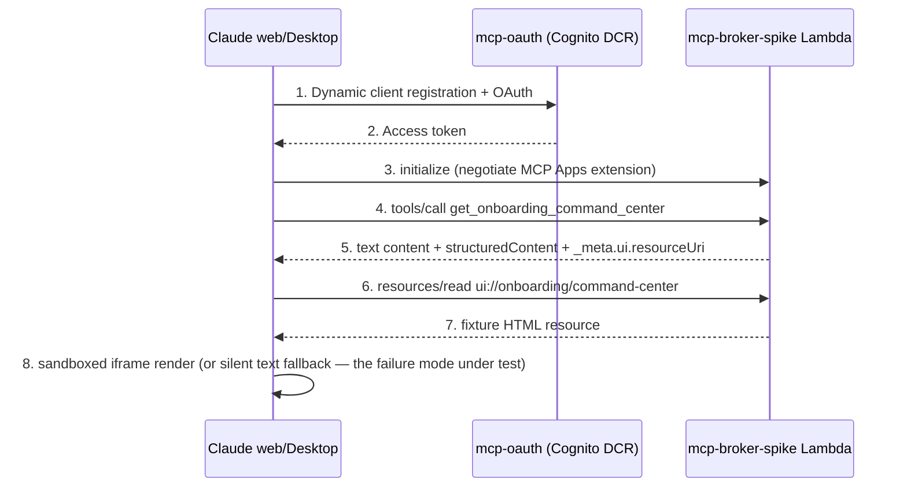

# THINK-117 Broker Discovery Tranche - Plan

## Goal Capsule

- **Objective:** Close the remaining THINK-117 discovery gates and prove the rendered path end-to-end, producing the evidence the implementation-ticket planning pass needs. Deliverables: TEI discovery brief, Claude MCP App rendered-path spike on dev, owned-UI identity decision memo, source-map/consent skeleton, and a re-gated origin doc.
- **Authority hierarchy:** origin requirements doc (`docs/brainstorms/2026-07-01-think-117-customer-onboarding-resource-broker-requirements.md`) > this plan > repo conventions.
- **Stop conditions:** Do not cut implementation tickets for the origin's wedge-conditional clusters — that is the next planning pass. Do not connect the spike to live P21, n8n, or any external writeback. If Claude host-side rendering cannot be made to work after reasonable debugging (the origin research documents known flakiness), stop and record findings rather than building workarounds.
- **Execution profile:** Mixed — one code unit (the spike), three document deliverables, one origin-doc edit. Spike lands via PR to `main` (dev is continuous-CD from main).

---

## Product Contract

### Summary

Execute the discovery tranche the origin doc's Outstanding Questions gate prescribes: instrument the TEI conversation, prove the net-new broker render path with a fixture-only Claude MCP App spike, put the owned-UI identity decision in front of the operator, and skeleton the source-map/consent model — then fold the evidence back into the origin doc and re-check the gates.

### Problem Frame

The External Agent Resource Broker requirements doc is fully specified but discovery-gated: implementation tickets are forbidden until the remaining must-resolve questions close. Two of those (TEI evidence, identity decision) need structured instruments to resolve efficiently; one (the rendered output path) is a technical assumption the codebase cannot currently prove. The origin's host-render gate is resolved — Claude web/Desktop and peers render MCP Apps today — but ThinkWork has never served one: existing MCP App code is host-side only, and Claude custom-connector serving has documented flakiness (ext-apps #615/#671) to QA before any customer demo. The spike proves ThinkWork's own serving path, not host capability.

### Requirements

**Discovery instruments**

- R1. A TEI discovery brief exists that maps every question to the origin gate it resolves: current workaround and frequency/cost, the onboarding coordinator role/owner, source-system inventory (feeding the source map), why the broker beats direct connectors, whether the origin's ThinkWork-only action set advances TEI's real recurring blockers, and who at TEI administers Claude paid-plan custom connectors.
- R2. An identity decision memo frames the owned-UI question for decision: is the internal Pi agent the broker's first client (one policy enforcement path), do command centers land as new surfaces in the existing web app, and what does the repositioning mean for existing tenants. The memo also proposes the host-vs-owned-UI interaction split — which interactions happen in the external host, which require ThinkWork-owned UI, and what result returns to the external agent — so the origin's persona-channel-map gate has evidence at re-gate. Carries a recommendation; the decision is recorded back into the origin doc's Key Decisions.
- R3. A source-map + consent-model skeleton exists as a design doc with a directional type sketch — canonical/optional sources, required fields, freshness thresholds, blind-spot labels, per-client consent records — structured so TEI's actual source inventory fills it. No code, no migrations.

**Rendered-path spike**

- R4. A broker spike MCP endpoint on the dev stack serves one tool returning a fixture Onboarding Command Center: mandatory text content (the fallback contract), structured content, and an MCP App `ui://` resource, registered and rendering as a Claude web + Desktop custom connector.
- R5. The spike is inert and isolated: fixture data only, read-only, no live source fetches, no writes, no coupling into the chat runtime or existing MCP surfaces beyond auth reuse.
- R6. Spike findings — render success/failure per surface, flakiness reproductions, fallback behavior — are recorded durably (a `docs/solutions/` entry) whether or not rendering succeeds.

**Closure**

- R7. After the TEI conversation and spike, the origin doc's remaining gates are each marked resolved or explicitly blocked, and a readiness verdict states whether the implementation-ticket planning pass can start.

### Scope Boundaries

- **Deferred to the next planning pass:** all implementation of the onboarding blocker compiler (origin Layers A/B/C), the real broker tool surface, source-map persistence/schema, per-task-mode token scoping, and anything in the origin's dispatch or writeback clusters.
- **Outside this tranche:** ChatGPT/M365/Cursor host certification (Claude is the named demonstration target; others are fast-follows), live P21/n8n connectivity, and the per-host admin-enablement runbook (captured as a TEI brief question only).

### Outstanding Questions

- Deferred (non-blocking): whether the spike endpoint is deleted or evolved into the real broker endpoint — decided at re-gate (U5) with the findings in hand.

---

## Planning Contract

### Key Technical Decisions

- KTD-1. **Spike deploys through `main` to dev as an isolated, inert endpoint.** Dev is continuous-CD from main and branch deploys revert within minutes; Claude custom connectors require public HTTPS + OAuth, so a local tunnel is not viable in this AWS-only stack. Follows the ship-inert convention: new module lands with tests, no live wiring into existing surfaces.
- KTD-2. **Separate Lambda handler, not a route on an existing one.** Mirrors the `mcp-context-engine` handler shape but stays its own function: zero blast radius on existing MCP consumers, and avoids the documented 4KB env ceiling risk on shared handlers. Requires the paired Terraform + build-script entries (a handler missing either blocks every deploy).
- KTD-3. **Auth reuses the existing MCP OAuth path with three scoped, additive edits** to `packages/api/src/handlers/mcp-oauth.ts` (dynamic client registration proxied to Cognito with audience validation): (1) add the spike's resource path to the hardcoded `MCP_RESOURCE_PATHS` allowlist — `authorize()` rejects unlisted resources with `invalid_target` and protected-resource metadata silently falls back to `/mcp/user-memory`, so tokens can never bind to the new endpoint without this; (2) extend `isAllowedRedirectUri()` with an explicit allowlist of Claude's documented custom-connector callback origin(s) — it currently accepts only localhost `http://`, so Claude's hosted callback fails registration outright; do not open it to arbitrary `https://` (open-redirect risk on a handler shared with live MCP resources); (3) add a narrow spike scope (e.g., `broker_spike:read`) to `SUPPORTED_SCOPES` rather than inheriting the broad default scope string, matching the origin's least-privilege posture. Per-task-mode scoping from the origin's R44 remains real-broker work. OPTIONS preflight must bypass auth (documented Lambda gotcha).
- KTD-4. **Render contract targets the ratified MCP Apps spec (2026-01-26).** Tool result carries mandatory text content plus `_meta.ui.resourceUri` pointing at a `ui://` resource the host fetches; the resource is a self-contained fixture HTML command center. The origin's host research (load-bearing) fixes Claude web + Desktop as the validation target and predicts the failure mode: capability negotiates but the iframe silently text-falls-back (ext-apps #615/#671) — the spike's manual checklist tests for exactly that.
- KTD-5. **Document deliverables live in `docs/brainstorms/`; decisions flow back into the origin doc.** The origin doc stays the single source of truth for gate state; sibling docs are instruments and memos, not competing authorities.

### Assumptions

Unconfirmed bets this plan proceeds on (scoping confirmation was auto-proceeded):

- The spike ships via main rather than any sandbox/tunnel alternative (KTD-1 rationale).
- The spike serves fixture data only; proving compilation is explicitly not its job.
- The source-map/consent skeleton stays code-free until TEI discovery supplies the source inventory.
- The identity memo's recommendation is internal-Pi-as-first-client with command centers inside the existing web app; the operator may decide otherwise, and U5 honors whatever is recorded.

### Phased Delivery

Broker delivery expands along two orthogonal axes (recorded in the origin doc's Key Decisions, 2026-07-01). Data axis: **Phase 1 — ThinkWork-native sources** (Work Items, Company Brain/memory via recall, n8n and Twenty plugin status), evolving `/mcp/context-engine` into the broker surface; the onboarding command center ships at Phase 1 with P21 disclosed as a missing canonical source per the origin's coverage requirements, which is an honest, useful v1. **Phase 2 — external sources**: the pre-warmed P21 mirror and LastMile/FleetIO, completing onboarding coverage and enabling dispatch read-only. The capability axis is unchanged (onboarding read → dispatch read → governed writeback). This tranche is Phase 0 on both axes; the spike's fixture rehearses the Phase-1 payload shape.

### High-Level Technical Design

Spike request path — the seam being proven is host-side resource resolution (steps 6–8), which no existing ThinkWork code exercises:

---

## Implementation Units

### U1. TEI discovery brief

- **Goal:** A ready-to-run conversation guide for the TEI discovery call, each question traced to the origin gate it resolves.
- **Requirements:** R1.
- **Dependencies:** none.
- **Files:** `docs/brainstorms/2026-07-01-think-117-tei-discovery-brief.md`.
- **Approach:** Structure by evidence target, not interview flow: (1) workaround pain — current process, frequency, cost, who swivels between systems; (2) actors — the onboarding coordinator role and P21/n8n owners; (3) source inventory — systems, record types, freshness, canonical-vs-optional (pre-populates U4's skeleton); (4) action boundary — enumerate TEI's top recurring blockers and test whether the origin's ThinkWork-only actions advance a majority; (5) broker-vs-direct-connector counterfactual; (6) Claude workspace administration and paid-plan/custom-connector enablement. Include an evidence-capture template so answers land in a shape U5 can fold back into the origin doc.
- **Patterns to follow:** origin doc's Outstanding Questions phrasing; discovery-brief tone of prior brainstorm docs.
- **Test scenarios:** Test expectation: none — document deliverable; completeness is verified against the origin's gate list in Verification.
- **Verification:** Every unresolved `[Product]`/`[Security]` gate in the origin doc that names TEI evidence has at least one mapped question; the brief is self-contained for a call Eric runs without this session's context.

### U2. Rendered-path spike: broker MCP endpoint + Claude custom connector

- **Goal:** Prove ThinkWork can serve an MCP App resource that Claude web/Desktop renders, and flush the known custom-connector flakiness before any customer demo.
- **Requirements:** R4, R5, R6.
- **Dependencies:** none.
- **Files:** `packages/api/src/handlers/mcp-broker-spike.ts` (new), `packages/api/src/handlers/mcp-broker-spike.test.ts` (new), `packages/api/src/handlers/mcp-broker-spike-fixture.ts` (new — synthetic blocker set + command-center HTML), `packages/api/src/handlers/mcp-oauth.ts` (allowlist/redirect/scope edits per KTD-3, with a test asserting the new resource's protected-resource metadata and audience check), `terraform/modules/app/lambda-api/handlers.tf` (handler list + route map entries, mirroring the mcp-context-engine rows), `scripts/build-lambdas.sh` entry, `docs/solutions/` findings entry (path chosen at write time).
- **Approach:** Mirror `mcp-context-engine.ts`'s server shape (streamable HTTP, tool registration, auth wrapper) in a new handler. The pattern is hand-rolled JSON-RPC — `packages/api` intentionally has no `@modelcontextprotocol/sdk` (per `src/lib/mcp-client-call.ts`) — so `resources/read` (plus `resources/list` if Claude probes it) and the MCP Apps extension capability are new cases in the method switch; `mcp-context-engine`'s initialize hardcodes `capabilities: { tools: {} }`. One tool, `get_onboarding_command_center`, returns: concise text answer (blocker summary — the mandatory fallback per spec), `structuredContent` (ranked fixture blocker set with confidence/coverage fields mirroring the origin's evidence-board shape), and UI-resource metadata → `ui://onboarding/command-center`, emitting all three key variants the LastMile-proven server used (`openai/outputTemplate`, `ui/resourceUri`, nested `ui.resourceUri`) so a render failure can't be a metadata-shape miss — the findings checklist records which variant the host resolved. `resources/read` serves a self-contained HTML command center rendering the fixture: ranked blockers, confidence, source-freshness chips, coverage summary — enough visual substance to evaluate the surface, no actions. All fixture company, contact, and blocker text must be synthetic — no real TEI or other customer identifiers, including in screenshots captured for the findings entry. Declare the MCP Apps extension capability at initialize. Auth via the mcp-oauth flow per KTD-3; OPTIONS preflight bypasses auth.
- **Execution note:** Spike posture — optimize for learning speed and honest findings, not production polish; but the handler still lands with tests and green checks since it merges to main.
- **Patterns to follow:** `packages/api/src/handlers/mcp-context-engine.ts` (server + auth shape); `packages/api/src/handlers/mcp-oauth.ts` (client registration); the LastMile MCP App output-template solution doc (resource must resolve via `resources/read`, not inline).
- **Test scenarios:**
  - Happy path: `tools/call` returns non-empty text content, valid structuredContent, and a `_meta.ui.resourceUri`; `resources/read` on that URI returns the HTML resource with a stable content type.
  - Fallback contract: text content is meaningful standalone (names the top fixture blocker) — asserts the spec's non-rendering-host guarantee.
  - Error path: unauthenticated `tools/call` and `resources/read` return a structured auth error, not a 500.
  - Edge: `resources/read` on an unknown `ui://` URI returns a proper not-found error.
  - Integration (manual checklist, recorded in the findings entry): register as a Claude custom connector; verify render in Claude web and Claude Desktop; capture whether the iframe renders or silently falls back to text on each surface; note Claude Code shows text-only as expected.
- **Verification:** Unit tests green in `pnpm --filter @thinkwork/api test`; deployed to dev via main merge with the post-merge Deploy run green; manual checklist executed against dev with results (including failures) written to the `docs/solutions/` entry.

### U3. Owned-UI identity decision memo

- **Goal:** Put the owned-UI vs existing-product question in front of the operator with a concrete recommendation, and get the decision recorded.
- **Requirements:** R2.
- **Dependencies:** none.
- **Files:** `docs/brainstorms/2026-07-01-think-117-owned-ui-identity-memo.md`; origin doc Key Decisions (edited once decided).
- **Approach:** Frame the three sub-questions the origin gate names: internal Pi agent as the broker's first client (one enforcement path for internal and external callers); command centers as new surfaces inside the existing web app vs a new operator console; what the broker repositioning means for existing tenant deployments. Add a fourth section proposing the host-vs-owned-UI interaction split (the origin's separate persona-channel-map gate): which interactions happen host-side, which require ThinkWork-owned UI, what returns to the external agent — informed by the spike's render findings. Carry the standing recommendation (Pi-as-first-client; command centers in the existing app) with its rationale and the main counter-arguments. End with a decision block for the operator to fill.
- **Test scenarios:** Test expectation: none — document deliverable.
- **Verification:** Memo covers all three sub-questions; once the operator decides, the decision is written into the origin doc's Key Decisions and the gate marked resolved.

### U4. Source-map + consent-model skeleton

- **Goal:** A fillable design skeleton for the origin's operator-owned source map and external-client consent model, ready to receive TEI's source inventory.
- **Requirements:** R3.
- **Dependencies:** none for drafting the skeleton structure, but reuse the field names from U1's evidence-capture template so brief answers slot in directly; population of the worked entries awaits U1's TEI evidence (consumed at U5).
- **Files:** `docs/brainstorms/2026-07-01-think-117-source-map-consent-skeleton.md`.
- **Approach:** Two sections. Source map: per-use-case entries with canonical/optional source, required fields, freshness threshold, permitted sampling, blind-spot label, owner, and delivery phase (1 = ThinkWork-native, 2 = external, per the Phased Delivery section) — as a directional TypeScript-ish type sketch plus a worked example row using the onboarding source set. Consent model: registered-client record shape (client, human user, tenant, Space, task mode, expiry, revocation), structured-denial contract, and where it composes with the existing mcp-oauth registration. Mark explicitly: directional design, no schema or migration until the next planning pass.
- **Patterns to follow:** origin requirements for source maps and client consent; the compilation-substrate design note's evidence-board `origin` discriminator shape.
- **Test scenarios:** Test expectation: none — document deliverable.
- **Verification:** Skeleton has a slot for every field the origin's source-map requirement names; a reader could fill it from U1's captured evidence without re-deriving the structure.

### U5. Re-gate the origin doc

- **Goal:** Fold TEI evidence and spike findings back into the origin doc; mark each remaining gate resolved or blocked; issue the readiness verdict for the implementation-ticket planning pass.
- **Requirements:** R7.
- **Dependencies:** U1, U2, U3, U4 (U1's evidence requires the TEI call to have happened).
- **Files:** `docs/brainstorms/2026-07-01-think-117-customer-onboarding-resource-broker-requirements.md` (gate edits); Linear THINK-117 (summary comment, per the mirror-artifacts convention).
- **Approach:** For each remaining must-resolve gate, write the resolution with evidence references (brief answers, spike findings entry, memo decision). Decide the spike's fate (delete vs evolve) and record it. Close with an explicit verdict: ready for `/ce-plan` implementation pass, or blocked on named items.
- **Test scenarios:** Test expectation: none — document edit.
- **Verification:** No gate in the origin doc's must-resolve list is left unannotated; the verdict names the next action unambiguously.

---

## Verification Contract

| Gate                  | Command / check                                                                                            | Applies to |
| --------------------- | ---------------------------------------------------------------------------------------------------------- | ---------- |
| Unit tests            | `pnpm --filter @thinkwork/api test` (full package suite, not just new tests)                               | U2         |
| Types + lint + format | `pnpm typecheck && pnpm lint && pnpm format:check` (tsc is a separate gate from vitest)                    | U2         |
| Deploy health         | Post-merge Deploy run on `main` green (`gh run list --branch main`)                                        | U2         |
| Render validation     | Manual Claude web + Desktop custom-connector checklist executed against dev; results in the findings entry | U2         |
| Gate coverage         | Every origin must-resolve gate mapped to a brief question or resolution                                    | U1, U5     |
| Skeleton fillability  | Every origin source-map/consent field has a slot, using U1's template field names                          | U4         |
| Decision recorded     | Identity decision written into origin Key Decisions                                                        | U3, U5     |

## Definition of Done

- TEI discovery brief exists and covers every open origin gate needing customer evidence (U1).
- Spike endpoint deployed to dev, tests green, and the Claude web + Desktop render checklist executed with findings recorded durably — success or documented failure both count as done (U2).
- Identity memo delivered and the operator's decision recorded in the origin doc (U3).
- Source-map/consent skeleton exists and is fillable from the brief's evidence template (U4).
- Origin doc re-gated with per-gate resolutions and an explicit readiness verdict; Linear THINK-117 updated (U5).
- Cleanup: the spike's fate (delete vs evolve) is decided and recorded at U5; no other experimental code remains on main.
