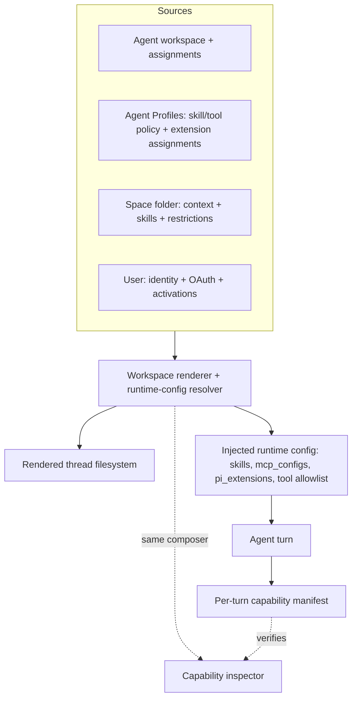
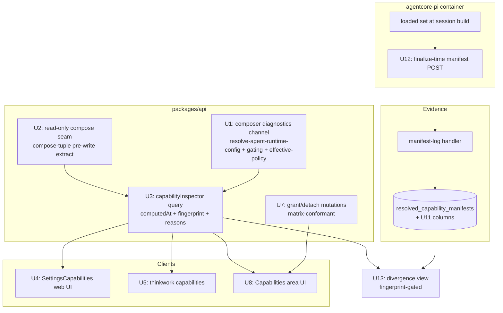

# Agent Capability Mapping Model - Plan

## Goal Capsule

- **Objective:** Make capability assignment legible and trustworthy: one canonical matrix of what can be assigned at each layer (agent / profile / space / user) and where it lands in the rendered filesystem or injected runtime config, an inspector that shows the effective merged set with provenance and why-not-active reasons, an API-first assignment surface, and per-turn manifests that verify config against runtime truth.
- **Product authority:** Eric's 2026-07-01 brainstorm decisions (Key Decisions in the Product Contract). Planning research 2026-07-01: repo-pattern analysis, institutional learnings, agent-native assessment, spec-flow analysis; claims verified against source.
- **Product Contract preservation:** unchanged except one factual correction in Dependencies / Assumptions (`setAgentSkills` is already retired server-side; `agent_skills` has ~12 read sites including an auth-critical one) and Outstanding Questions resolved into Planning Contract KTDs.
- **Execution profile:** one PR per unit to `main` (squash, auto-merge, watch the post-merge Deploy run), worktree isolation, dev validated post-merge (dev is continuously deployed from main). Eric's visual pass gates U4 and U8 before their PRs merge.
- **Stop conditions:** surface a genuine blocker instead of guessing when a change would alter runtime capability behavior (the composer diagnostics work must be behavior-preserving), when the auth reader migration (U9) shows any permission-decision delta, when U9's per-assignment state destination (the KTD-8 sub-decision) is still undecided — that is a decide-with-Eric blocker, not an implementer judgment call — or when THINK-114's in-flight units conflict with Phase B assignment surfaces.
- **Tail ownership:** the `agent_skills` table DROP is deferred follow-up work (after U9/U10 deploy), tracked in Scope Boundaries — it is not part of this plan's Definition of Done.

---

## Product Contract

### Summary

Define the capability mapping model — capability class × assignment layer × injection destination — as the product's single contract for "what does the agent get," then ship it in three stages: a capability inspector (read side), a unified grant/shape assignment surface (write side), and per-turn capability manifests (runtime verification).

### Problem Frame

Eric added a new skill and could not figure out how to get it picked up by the agent. Same with a new MCP server. The forward path is undiscoverable even for the platform's author — a skill has at least five distinct activation paths, an MCP server needs a registry row plus enablement plus auth before it ships, and no path confirms arrival. If it is frustrating for him, customer operators have no chance.

The read side is equally opaque. The renderer already computes an effective tool/MCP policy per thread and throws it away — no GraphQL, UI, or CLI surface exposes the effective merged capability set. Each capability class maps to a different subset of the layers with different gating (trust reports, eval gates, OAuth activations, approval+SHA, capability flags), and several failure modes are silent: extension tools missing from the allowlist never reach the model, dynamic-extension resolution faults degrade to zero extensions with only a log line, plugin skills vanish per-user behind the activation gate.

### Key Decisions

- **The matrix is the contract.** One canonical mapping — capability class × layer — where every cell states assignable-or-not and, when assignable, the exact injection destination (workspace folder, runtime-config field, payload field, prompt block). A class/layer combination not in the matrix is not offered anywhere in the product.
- **Grant vs shape.** Agent and Agent Profiles _grant_ reach (skills, MCP servers, extensions, built-in tools). Spaces and users _shape_ behavior: a Space carries context, skills, and restrictive overrides (blocked tools, model/budget/guardrails) but never grants MCP servers or extensions; a user carries identity, memory, and self-serve connections (OAuth, plugin activations) but is never directly assigned capabilities.
- **Operators assign tenant-wide; users self-serve per-user.** The assignment actor splits by class: customer operators (non-developers) own skills, MCP servers, and extensions from the operator console; end users manage only their own OAuth connections and plugin activations.
- **Staged delivery: inspector → unification → manifests.** Operator relief ships first (the inspector), the single Capabilities area second, runtime evidence third. No big-bang IA rework.
- **The inspector reads the runtime's own composer.** Effective-set computation is never reimplemented for display; the inspector calls the same resolution path the runtime uses (workspace renderer + runtime-config resolver), so it cannot drift from what a turn would actually get.
- **The inspector is requester-aware.** The effective set varies by requesting user (plugin activation gate, per-user OAuth), so every inspection names a user perspective; a view with no user shows the fail-closed baseline.
- **Keep current precedence semantics.** Blocked tools = union across layers; allowed tools = intersection; blocked wins over allowed; a space skill overrides an agent skill with the same slug. This plan documents and surfaces these rules; it does not change them.

### Capability Mapping Matrix (target)

| Class                   | Agent (default)                            | Agent Profile                                                       | Space                                                     | User                                                              | Injection destination                                                      |
| ----------------------- | ------------------------------------------ | ------------------------------------------------------------------- | --------------------------------------------------------- | ----------------------------------------------------------------- | -------------------------------------------------------------------------- |
| Skills                  | Grant (catalog install / workspace folder) | Grant (`skill_policy` subset)                                       | Carry (space `skills/` folder; same-slug overrides agent) | Never assigned; plugin activation gates visibility per user       | Rendered workspace `skills/<slug>/` + routing; gated by trust + eval gates |
| Built-in tools          | On by default; restrictable                | Grant subset (`tool_policy.builtInTools`)                           | Restrict only (blocked tools)                             | —                                                                 | Tool allowlist in agent session                                            |
| MCP servers             | Grant (registry + enablement)              | Grant subset (`tool_policy.mcpServers` + per-server tool allowlist) | Restrict only                                             | Self-serve auth only (per-user OAuth tokens)                      | `mcp_configs` invoke payload → runtime MCP tools                           |
| Pi extensions (bundled) | Platform-wired by capability flags         | —                                                                   | —                                                         | —                                                                 | Extension factories + tool-allowlist fold                                  |
| Pi extensions (dynamic) | Grant (assignment, target `default_agent`) | Grant (target `agent_profile`)                                      | Never                                                     | Never                                                             | `pi_extensions` invoke payload → proxy loader                              |
| Plugins (apps)          | Install tenant-wide                        | —                                                                   | —                                                         | Activate per-user (OAuth); activation gates plugin skills/servers | Plugin-projected MCP rows + namespaced skill folders                       |
| Context / memory        | Agent workspace root                       | Profile instructions                                                | Space folder (SPACE.md, files)                            | `users/<slug>/` (USER.md, memory)                                 | Rendered per-thread workspace mounts (root / `Spaces/<slug>/` / `User/`)   |

Every cell marked Grant/Carry/Restrict must be reachable from the Capabilities area (Phase B) and visible in the inspector (Phase A) with its gating state.

### Actors

- A1. Tenant operator — non-developer admin at the customer org; assigns tenant-wide capabilities and uses the inspector to confirm and diagnose.
- A2. End user — chats with the agent; self-serves personal connections (OAuth, plugin activations); their identity changes the effective set.
- A3. Agent runtime — consumes the rendered filesystem and injected config; in Phase C, emits the per-turn capability manifest.

### Requirements

**Mapping model**

- R1. A canonical capability mapping matrix (class × layer) exists as a maintained artifact; every cell states assignable-or-not and the injection destination.
- R2. Product surfaces conform to the matrix: no assignment UX, API, or runtime path offers a class/layer combination the matrix marks unassignable.
- R3. Changes to capability wiring require a matrix update in the same change; the matrix is the review anchor for capability work.

**Capability inspector (Phase A)**

- R4. An operator can view the effective merged capability set for any agent × space × profile × user selection, defaulting to the base agent tenant-wide.
- R5. Every item shows provenance: which layer contributed it and through which path (catalog install, space folder, profile policy, extension assignment, plugin projection, default).
- R6. Every absent-or-inactive capability an operator would expect shows a reason from an enumerated taxonomy: not installed, trust gate, eval gate, OAuth missing, plugin activation missing, blocked by policy, allowlist miss, extension skipped (permission class / validation / disabled runner), resolution fault.
- R7. The inspector is requester-aware: selecting a user applies the plugin activation gate and per-user OAuth resolution for that user; no selected user shows the fail-closed baseline.
- R8. Effective-set computation is served by the same renderer/resolver code path the runtime uses; the inspector adds presentation only.
- R9. Failure modes that today degrade silently (dynamic-extension resolution faults, extension skips, plugin-gate fail-closed exclusions) surface as inspector rows with their reason.

**Assignment unification (Phase B)**

- R10. One Capabilities area in the operator console covers inventory (what exists in the tenant), grant (attach to agent or profile), and confirmation (inspector state for the touched item).
- R11. Grant actions exist only at agent and profile scope; space surfaces offer context, skills, and restrictions; user surfaces offer only self-serve connections.
- R12. Every assignment flow ends with live confirmation: the item's effective state (active, or reason-not-active) is shown before the flow closes.
- R13. The `agent_skills` compatibility mirror and the `setAgentSkills` admin write path are retired; remaining readers migrate to the filesystem/catalog sources of truth. Destructive removal follows the code-removal-first deploy ordering.

**Runtime capability manifests (Phase C)**

- R14. Each agent turn emits a capability manifest: what actually loaded (skills, tools, MCP servers, extensions), what was gated out, and why.
- R15. Divergence between the inspector's predicted set and a turn's manifest is detectable and surfaced (at minimum, on the inspector for the latest turn of a selected context).
- R16. Manifest content is compatible with the SOC2 action-time effective-capability snapshot direction (actor, context, capability set, gating states at action time).

### Acceptance Examples

- AE1. **Covers R4–R6, R12.** Given an operator adds a new skill to the tenant catalog, when they open the inspector for the base agent, then the skill appears with its state — e.g. "inactive: no trust report" or "inactive: not installed to agent workspace" — and after attaching via the Capabilities area the same view shows it active, without the operator reading code or S3.
- AE2. **Covers R6–R7.** Given a plugin MCP server requires per-user OAuth, when the inspector is viewed for user X with an active activation and user Y without, then X's view lists the server's tools as active and Y's view lists them as "inactive: plugin activation missing" — and the no-user baseline excludes them (fail closed).
- AE3. **Covers R6, R9.** Given a dynamic Pi extension is assigned but it declares an ungranted permission class (or is unapproved/disabled at the assignment layer), when the inspector is viewed for the assigned target, then the extension appears with the specific composer-visible skip reason instead of disappearing. Runner-disabled is a container-side gate the composer cannot see: it surfaces through the Phase C observed variant — the turn's manifest records the extension as resolved-but-not-loaded with the runner-disabled reason (verified in U12/U13, not U3).
- AE4. **Covers R14–R15.** Given a skill passes config resolution but fails to load at runtime (e.g. workspace sync divergence), when the turn completes, then the manifest records the miss and the inspector flags the divergence for that context.

### Success Criteria

- An operator (not a developer) can add a skill or MCP server and confirm it is active — or see the exact blocking reason — end to end from the console.
- "Why doesn't the agent have X?" is answerable from the inspector alone for every capability class, including per-user differences.
- Capability-wiring PRs are reviewable against the matrix: reviewers can point to the cell a change implements or violates.

### Scope Boundaries

- General user-level capability assignment is out: users never receive direct skill/tool/extension grants; the user layer stays identity + memory + self-serve connections. If per-user grants are ever wanted, they enter as a deliberate new matrix cell on this substrate — not now.
- Making dynamic-extension execution work (the isolated signed runner) is THINK-123's scope, not this plan's; this plan only makes its gating states visible.
- MCP tool-allowlist _enforcement_ changes are out — the prior allowlist was shipped and reverted; do not reintroduce without a concrete use case.
- Skill signature policy (whether `approved_unverified` remains runtime-trusted) is a standing product decision tracked in THINK-124, not changed here; the inspector reports whatever the policy is.
- Desktop surfaces are out: the desktop Pi sidecar was removed; the runtime is cloud-only.
- Changing precedence/merge semantics is out (see Key Decisions — current rules are kept and documented).
- An agent self-inspection tool ("what can I do / why can't I") is deferred; it is designed to consume Phase C manifests (never re-resolve), behind the redaction boundary in KTD-7.
- Agent-initiated grants are deferred; if ever built, the agent _proposes_ into the operator approval queue (HITL precedent) and never self-applies.
- Capability _write_ CLI commands are deferred; only the read command ships in this plan.

### Deferred to Follow-Up Work

- `agent_skills` table DROP migration — authored and applied only after U9/U10 code-removal PRs deploy (migration-ordering rule); includes the `AgentSkill` GraphQL type removal residue check.
- Manifest retention policy alignment with the compliance audit-event spine (Phase 3 compliance work owns retention); v1 ships a 30-day retention sweep in U11 — no sweep exists today (the "30-day TTL" in the current spine is comments-only).
- THINK-124's code-seam repairs (structural allowlist enforcement, MCP OAuth fallback symmetry decision, install rollback hardening) stay in THINK-124.

### Dependencies / Assumptions

- THINK-114 (Dynamic Pi Extensions) U3–U8 is in flight and owns extension review/assignment mechanics; its U3 ships assignment as GraphQL mutations, which Phase B consumes rather than redefines.
- THINK-124 (capability audit) overlaps on the silent-degrade fix slate; this plan absorbs the observability items (degrades become inspector rows) — THINK-124 retains the code-seam repairs and policy decisions.
- Verified against source 2026-07-01: the renderer computes an effective policy no surface exposes; profiles carry `tool_policy`/`skill_policy`; space overrides are restriction-only; extension assignments target only `default_agent`/`agent_profile`; the plugin gate fails closed; **`setAgentSkills` is already retired server-side** (no resolver, no SDL — residue is a dead `packages/admin-ops` client method, stale comments in `packages/api/src/lib/skills/permissions-subset.ts`, and codegen artifacts); `agent_skills` is written by six paths — the `derive-agent-skills.ts` sync, `disableSkill`, `handlers/oauth-callback.ts:437-451`, `handlers/skills.ts:1203-1206`, `handlers/agents.ts:311`, `lib/agent-snapshot.ts:302` — and read by ~12 sites including `authz.ts` (permission checks) and `resolve-agent-runtime-config.ts` (skill config/env); per-agent OAuth config and `permissions.operations` live **only** in this table (see KTD-8).
- The per-turn manifest spine already exists inert: `resolved_capability_manifests` + `capability_catalog` tables (`packages/database-pg/src/schema/capability-catalog.ts`), `POST /api/runtime/manifests` (`packages/api/src/handlers/manifest-log.ts`), and `Query.runtimeManifestsByAgent`. Phase C activates and extends it.
- Assumes the per-thread rendered workspace remains the runtime's source of truth for skills (payload lists remain advisory); if that changes, R8's composer contract must be revisited.

---

## Planning Contract

### Key Technical Decisions

- KTD-1. **Inspector composes read-only from the runtime's own functions — with OAuth resolution in probe-only mode.** The resolver calls `resolveAgentRuntimeConfig` + `composeWorkspacePolicy` + `resolvePluginGate` directly plus a persist-skipping seam extracted from `renderWorkspaceTuple`'s pre-write composition block — never the workspace-renderer Lambda hop, never a reimplementation. Two write paths must be explicitly suppressed: `renderWorkspaceTuple` as-is writes four S3 objects per call (`compose-tuple.ts:952-975`), and MCP resolution **refreshes expired OAuth tokens** — live token-endpoint POSTs plus Secrets Manager and `user_mcp_tokens` writes (`mcp-configs.ts:506-542`); with WorkOS refresh-token rotation, an inspector-triggered refresh can burn a live connection. The inspector therefore runs token resolution in probe-only mode: report token status (active / expired / missing) from stored metadata, never initiate a refresh. U3 tests assert zero token writes on an expired-token fixture. Rationale: R8, and inspection must never mutate the state it observes.
- KTD-2. **Why-not-active is an additive diagnostics channel on the composer, behavior-preserving.** Today the composer discards reasons: profiles filtered `enabled=true` in SQL (`resolve-agent-runtime-config.ts:951`) and dropped via `continue` for model-unavailable/space-mismatch/shadowing (`:1031-1067`); extension skips are warn-only with ~15 conditions (`:1172-1232`) and two no-reason `null` returns (`:1184-1185`); assignment-resolution faults collapse to empty (`:818-827`). U1 adds structured dropped-with-reason outputs alongside existing returns; runtime callers ignore them; reasons mirror the real gates exactly (no softer UI-only rule — per the eval-eligibility learning).
- KTD-3. **Freshness and divergence semantics: `computedAt` + config fingerprint.** Every inspector response is stamped with `computedAt` and a resolved-config fingerprint (hash over the inputs that shape the effective set); manifests record the same fingerprint. Divergence (R15) is only asserted when fingerprints match; otherwise the state is "config changed since turn." "Manifest missing," "resolution fault," "invalid selection," and "sync pending" are first-class states distinct from "divergent" and "valid-empty."
- KTD-4. **Query contract separates `callerIdentity` from `perspectiveUserId`, and the no-user baseline mirrors a real no-invoker turn.** Authz gates on the caller (operator/service); the perspective user drives gating resolution. No perspective user = exactly what a scheduled/wakeup turn gets: plugin per-user-OAuth servers excluded (fail closed), direct OAuth servers resolved via the human-pair fallback (`mcp-configs.ts:352`). Inspector and manifest agree by construction.
- KTD-5. **Phase B writes are API-first.** Every grant/detach/restrict action is a documented GraphQL mutation; the Capabilities UI and any CLI are clients. Matrix conformance (R2) is enforced at the mutation layer, not in UI handlers. Rationale: retiring `setAgentSkills` while shipping UI-only writes would recreate the opacity this plan exists to kill, and it blocks CLI/agent-proposal paths.
- KTD-6. **Phase C activates the inert manifest spine with additive extension.** Keep `resolved_capability_manifests` + `manifest-log.ts` + `runtimeManifestsByAgent`; add columns for thread/turn identity, `space_id`, active profile identity, `config_fingerprint`, and a resolved-vs-loaded split; validate `manifest_json` shape on write. Emission is best-effort at turn **end**, gated on `thinkwork_api_url` + `thinkwork_api_secret` (present on all dispatch payload builders) — **not** on finalize-callback config, which is chat-only: wakeup/automation turns never configure `finalize_callback_url`, and they are exactly the no-invoker turn class the fail-closed baseline exists to verify (R14 says _each_ turn). The container already drains activity at turn end (`server.ts:~3055`); the manifest POST hooks the same drain point. A failed POST never blocks the turn and renders as "manifest missing." Append-only, write-once, every fingerprint field populated on every producing branch (per the projection-snapshot learning).
- KTD-7. **Manifests are single-actor scoped with an operator/user redaction boundary.** A manifest never aggregates cross-user OAuth/activation state. Provenance detail in the inspector is operator-grade; any future user-facing or agent-facing projection uses a redacted shape decided when the manifest schema lands (U11), not retrofitted.
- KTD-8. **`agent_skills` retirement is read-side-first, producer+consumer schema changes in one PR — and per-assignment state needs a decided destination before readers migrate.** The table is not just a presence mirror: per-agent skill config (OAuth `secretRef`/`connectionId`/`tokenEnvVar`, injected into runtime skill env) and `permissions.operations` (the fine-grained authz allowlist defending against shared-service-secret impersonation) live **only** there, and the writer set is wider than the sync — `derive-agent-skills.ts`, `disableSkill`, `handlers/oauth-callback.ts:437-451`, `handlers/skills.ts:1203-1206`, `handlers/agents.ts:311`, `lib/agent-snapshot.ts:302`. U9 carries an explicit blocking sub-decision: the destination store for that per-assignment state (workspace file under `skills/<slug>/` vs `skill_catalog` extension vs a retained narrow table exempt from the DROP), decided with Eric before the authz/runtime-config readers migrate; writers re-point to the chosen store first. Snapshot `agent_skills` before U9 begins (the derive-sync delete path can destroy config jsonb mid-migration). Then migrate readers in dependency-safe order — auth (`authz.ts:171`) and runtime config (`resolve-agent-runtime-config.ts:1469-1473`) first with characterization tests — then remove the `Agent.skills` GraphQL field together with every generated-client consumer in a single PR (codegen breaks otherwise, per the runtime-refactor learning), then delete the `derive-agent-skills.ts` sync and dead `admin-ops` client. Table DROP is deferred follow-up.
- KTD-9. **One `EffectiveCapabilitySet` GraphQL shape, two variants.** The inspector's predicted set and the manifest's observed set share a schema type with a variant discriminator (`predicted` / `observed`) so R15 diffing is structural, and the CLI and web render the same contract.
- KTD-10. **`capability_catalog` is registry metadata, not a second truth.** The inspector composes live from the composer; the `capability_catalog` table supplies display metadata only. No parallel capability model.

### High-Level Technical Design

Sequencing: U1 → U2 → U3 unlock the inspector; U4/U5/U6 complete Phase A in parallel; U7 → U8 is Phase B's write side; U9 does **not** wait on U3 (the auth migration must not serialize behind three feature units) — it starts as soon as its KTD-8 destination sub-decision is made, and U10 follows U9 and U3 (client surfaces repoint to the inspector query); U11 → U12 → U13 is Phase C and only U13 depends on Phase A.

### Assumptions

- The composer diagnostics channel is **opt-in via a resolver flag**; runtime callers never set it, so the invoke path takes zero new I/O. Producing complete reason rows requires reads the runtime path doesn't make (disabled profiles are filtered out in SQL; the plugin gate isn't always resolved), so those queries run only under the flag (inspector calls). Characterization asserts the flag-off path is byte-identical to today.
- `pnpm schema:build` + per-consumer codegen (`web`, `cli`, `mobile`, `api`) is the full schema-evolution loop; AppSync subscription schema is unaffected (no new subscriptions).
- THINK-114 U3 mutations remain the extension-assignment API; if its shape changes mid-flight, U7 adapts rather than forks.

---

## Implementation Units

| U-ID | Title                                  | Key files                                                                                                     | Depends on                   |
| ---- | -------------------------------------- | ------------------------------------------------------------------------------------------------------------- | ---------------------------- |
| U1   | Composer diagnostics channel           | `packages/api/src/lib/resolve-agent-runtime-config.ts`, `lib/plugins/gating.ts`                               | —                            |
| U2   | Read-only compose seam                 | `packages/api/src/lib/workspace-renderer/compose-tuple.ts`                                                    | —                            |
| U3   | capabilityInspector GraphQL query      | `packages/database-pg/graphql/types/capabilities.graphql`, `packages/api/src/graphql/resolvers/capabilities/` | U1, U2                       |
| U4   | Web inspector UI                       | `apps/web/src/routes/_authed/settings.capabilities.tsx`, `components/settings/SettingsCapabilities.tsx`       | U3                           |
| U5   | CLI read command                       | `apps/cli/src/commands/capabilities.ts`                                                                       | U3                           |
| U6   | Matrix doc + CI conformance check      | `docs/src/content/docs/concepts/capability-matrix.mdx`, `.github/workflows/`                                  | —                            |
| U7   | Grant/detach mutations (API-first)     | `packages/api/src/graphql/resolvers/capabilities/`, `capabilities.graphql`                                    | U3                           |
| U8   | Capabilities area UI                   | `apps/web` settings routes/components                                                                         | U7                           |
| U9   | `agent_skills` reader migration        | `packages/api/src/graphql/resolvers/core/authz.ts`, `lib/resolve-agent-runtime-config.ts`, handlers           | KTD-8 sub-decision (blocker) |
| U10  | `Agent.skills` field + sync retirement | `packages/database-pg/graphql/types/agents.graphql`, `lib/derive-agent-skills.ts`, consumers                  | U9, U3                       |
| U11  | Manifest schema extension              | `packages/database-pg/src/schema/capability-catalog.ts`, `drizzle/`, `runtime-manifests.graphql`              | —                            |
| U12  | Runtime manifest emission              | `packages/agentcore-pi/agent-container/src/server.ts`, `packages/pi-runtime-core/src/finalize-client.ts`      | U11                          |
| U13  | Divergence surface                     | inspector resolver + `SettingsCapabilities.tsx`                                                               | U3, U12                      |

### U1. Composer diagnostics channel

- **Goal:** The runtime-config resolver returns structured dropped-with-reason rows for every gate it applies, without changing what the runtime receives.
- **Requirements:** R6, R9 (feeds R5).
- **Dependencies:** none.
- **Files:** `packages/api/src/lib/resolve-agent-runtime-config.ts`, `packages/api/src/lib/plugins/gating.ts`, `packages/api/src/lib/workspace-renderer/effective-policy-composer.ts` (diagnostics already exist — extend shape only if needed), new `packages/api/src/lib/capability-diagnostics.ts` (reason taxonomy types), tests `packages/api/src/lib/resolve-agent-runtime-config.test.ts` (extend), `packages/api/src/lib/capability-diagnostics.test.ts`.
- **Approach:** Add an optional `diagnostics` accumulator to the resolver's outputs: profile drops (disabled, model-unavailable `:1031`, not-assigned-to-space `:1061-1067`, shadowed `:1042-1048`), extension skips (all ~15 `skip()` conditions `:1172-1232` plus explicit `disabled` and `not_approved` reasons for the bare `null` returns at `:1184-1185`), assignment-resolution fault (replace the silent `.catch` at `:818-827` with a fault marker while still returning empty to runtime callers), skill gate outcomes (trust gate, eval gate, blocked-tools filter), plugin-gate exclusions (expose `gating.ts` exclusion reasons). Reason strings come from one enumerated taxonomy module. Diagnostics are opt-in via a resolver flag (e.g. `collectDiagnostics: true`): runtime callers never set it and take zero new queries; reason rows that need extra reads (disabled profiles filtered in SQL, unresolved plugin gate) fetch only under the flag.
- **Execution note:** characterization-first — snapshot current resolver outputs for representative fixtures before adding the channel; the post-change runtime-facing outputs must be byte-identical.
- **Patterns to follow:** `effective-policy-composer.ts:136-147` (existing `diagnostics: string[]`), `checkSkillEvalEligibility` + `ineligibleReason` (`eval-baseline-agent.ts` — reason-string pattern).
- **Test scenarios:**
  - Happy path: fixture with active skills/MCP/extensions yields empty drop list and unchanged runtime config.
  - Flag off (runtime path): resolver issues no additional queries (query spy) and outputs are byte-identical to the pre-change snapshot.
  - Profile dropped for each reason (disabled; model unavailable; wrong space; shadowed by space-local) yields exactly one reason row naming the profile.
  - Extension with `grantedPermissionClasses` → `unavailable_provider` row; disabled extension → `disabled` row; unapproved → `not_approved` row.
  - Forced assignment-query error → runtime config still empty-extensions (unchanged), diagnostics carry `resolution_fault`.
  - Plugin gate with no requester → fail-closed exclusion rows for each namespaced folder.
  - Blocked-tool filter removal → row naming the blocking layer.
- **Verification:** full `pnpm --filter @thinkwork/api test` green; characterization fixtures show no runtime-facing delta.

### U2. Read-only compose seam

- **Goal:** The renderer's pre-write composition (sources → mounts → plugin gate → effective policy) is callable without S3 writes or the Lambda hop.
- **Requirements:** R8.
- **Dependencies:** none.
- **Files:** `packages/api/src/lib/workspace-renderer/compose-tuple.ts`, `packages/api/src/lib/workspace-renderer/types.ts`, tests alongside existing renderer tests.
- **Approach:** Extract the composition block that runs before the four `putText` calls (`compose-tuple.ts:952-975`) into a shared function returning `{effectivePolicy, hydrateManifest, gateResult, sources}`, or add a `persist: false` option that short-circuits writes — either way `renderWorkspaceTuple` delegates to the same code so inspector and runtime stay byte-identical. No behavior change for existing callers.
- **Patterns to follow:** the invoke path's typed `effectivePolicy`/`hydrateManifest` response (`chat-agent-invoke.ts:425-436`).
- **Test scenarios:**
  - Read-only call produces identical `effectivePolicy` + manifest to a persisting call on the same fixture.
  - Read-only call performs zero `putText` invocations (spy).
  - Persisting path unchanged (existing renderer tests stay green).
- **Verification:** renderer test suite green; S3-write spy proves purity.

### U3. capabilityInspector GraphQL query

- **Goal:** One operator-gated query returns the `EffectiveCapabilitySet` (predicted variant) for agent × space × profile × user with provenance, reasons, `computedAt`, and `configFingerprint`.
- **Requirements:** R4, R5, R6, R7, R8 (shape shared with R15 via KTD-9).
- **Dependencies:** U1, U2.
- **Files:** new `packages/database-pg/graphql/types/capabilities.graphql` (types + `extend type Query`), new `packages/api/src/graphql/resolvers/capabilities/{index.ts,capabilityInspector.query.ts,capabilityInspector.query.test.ts}`, `packages/api/src/graphql/resolvers/index.ts` (register), codegen outputs in `apps/web`, `apps/cli`, `apps/mobile`.
- **Approach:** Args `{tenantId, agentId?, spaceId?, profileId?, perspectiveUserId?}`; authz via `resolveCallerTenantId` + `requireAdminOrServiceCaller(ctx, tenantId, "capabilities:read")` (the `agentProfileEditorCatalog` pattern). Compose from U1 diagnostics + U2 seam + `buildMcpConfigs` resolution states in probe-only token mode (per KTD-1: token status from stored metadata, never a refresh). "Not installed" rows need a source diagnostics can't provide (diagnostics only see capabilities that entered resolution): enumerate the tenant inventory (`skill_catalog`, `tenant_mcp_servers`, extension sources, plugin installs) and diff against the resolved set so never-installed items appear with `not_installed`. Per KTD-4, `perspectiveUserId` absent = real no-invoker semantics. Invalid selections (nonexistent space, profile not assigned to selected space) return an explicit `invalidSelection` state, not the silent base-agent fallback. Expensive per-item checks compute lazily per the eval-eligibility learning — the query serves one selection, never a fan-out matrix. Stamp `computedAt` and `configFingerprint` (stable hash over resolved inputs). Run `pnpm schema:build` + all consumer codegens.
- **Patterns to follow:** `routines/tenantToolInventory.query.ts` (fail-closed tenant check, parallel selects), `agent-profiles/agentProfileEditorCatalog.query.ts` (operator authz, option lists), `agents.graphql:333-351` (extend-type convention).
- **Test scenarios:**
  - Covers AE2: user with active plugin activation vs user without vs no user — three different MCP-server states, no-user matches scheduled-turn semantics (direct OAuth via human-pair present, plugin servers absent).
  - Non-operator caller → authz rejection; cross-tenant arg → fail-closed empty.
  - Shadowed central profile → present with `shadowed_by_space_local` reason; disabled profile → `disabled`.
  - Expired-token fixture: inspector reports `expired` from stored metadata and performs zero token writes (Secrets Manager / `user_mcp_tokens` spies) — KTD-1 probe-only mode.
  - Covers AE1: catalog skill never installed to the agent → `not_installed` row from the inventory diff.
  - Covers AE3 (composer-visible half): assigned dynamic extension with an ungranted permission class → row with skip reason (runner-disabled is verified in U12/U13 via the observed variant).
  - Invalid space slug → `invalidSelection`, not base-agent output.
  - Fingerprint stability: same fixture twice → same `configFingerprint`; config edit → different.
- **Verification:** `pnpm --filter @thinkwork/api test`, `pnpm schema:build` clean, all consumer codegens committed, `graphql-contract` test green.

### U4. Web inspector UI

- **Goal:** Operators inspect any selection from a new Capabilities page: grouped capability rows (per matrix class) with provenance, gate states, and reasons.
- **Requirements:** R4–R7, R9; AE1 read side.
- **Dependencies:** U3.
- **Files:** `apps/web/src/components/settings/settings-nav.tsx` (add `Capabilities`, `operatorOnly: true`), new `apps/web/src/routes/_authed/settings.capabilities.tsx`, new `apps/web/src/components/settings/SettingsCapabilities.tsx` + `SettingsCapabilities.test.tsx`, generated documents in `apps/web/src/gql/`.
- **Approach:** Selector row (agent default · space · profile · perspective user) sourced from `agentProfileEditorCatalog`-style option lists; results grouped by capability class with per-row state chip (active / inactive+reason / fault / invalid selection) and provenance line; `computedAt` shown with a refresh action (point-in-time semantics, no cache). Selector changes show an explicit in-flight state (spinner + disabled selectors, matching the context-diagnostics pattern) so a stale result is never readable as current. Model layout on `settings.context-diagnostics.tsx`; in-page tabs rather than nested routes.
- **Test scenarios:**
  - Renders all capability classes from a fixture response; reason chips show backend-provided strings verbatim.
  - No-user baseline labeled as such; switching perspective user refetches.
  - Selector change shows the loading state and disables further selection until the refetch resolves.
  - Fault state renders distinctly from empty.
  - Nav item hidden for non-operators.
- **Verification:** full web suite (`pnpm --filter @thinkwork/web test`) + typecheck; **Eric visual pass on dev post-merge before close** (UI rule).

### U5. CLI read command

- **Goal:** `thinkwork capabilities` prints the effective set (or a named item's state) for a selection — the terminal answer to "did my skill land?"
- **Requirements:** R4–R6 (CLI surface).
- **Dependencies:** U3.
- **Files:** new `apps/cli/src/commands/capabilities.ts`, register in the CLI command index, `apps/cli/__tests__/capabilities.test.ts`, CLI codegen output.
- **Approach:** Thin client over the same query via `api-client.ts`/`gql` (the `commands/skill.ts` / `commands/trace.ts` pattern); flags `--space --profile --user --json`; table output grouped by class, one-line reason per inactive item. Top-level failures (invalid selection, resolution fault, auth) route through `printError` with a non-zero exit code — distinct from per-item inactive reasons in the table. Read-only; no write flags.
- **Test scenarios:** happy-path render from fixture; `--json` emits the raw shape; inactive item prints its reason; auth failure surfaces the operator-permission message; invalid `--space` exits non-zero via `printError`, distinct from a valid selection containing inactive items.
- **Verification:** `pnpm --filter thinkwork-cli test` + typecheck.

### U6. Matrix doc + CI conformance check

- **Goal:** The matrix is a published, maintained contract with a CI gate tying capability-wiring changes to matrix updates.
- **Requirements:** R1, R2, R3.
- **Dependencies:** none.
- **Files:** new `docs/src/content/docs/concepts/capability-matrix.mdx` (from the Product Contract matrix, plus injection-destination detail per cell), new `.github/workflows/capability-matrix.yml` (or a job in `lint.yml`), a small checker script under `scripts/`.
- **Approach:** Path-filtered check modeled on `plugin-catalog.yml`: PRs touching capability-wiring paths (`resolve-agent-runtime-config.ts`, `workspace-renderer/**`, `mcp-configs.ts`, `plugins/gating.ts`, `pi-extensions` schema, `capabilities.graphql`) must also touch the matrix doc or carry an explicit `matrix-no-change` marker in the PR body; checker enforces the cell vocabulary (grant/carry/restrict/never).
- **Test scenarios:** `Test expectation: none — CI workflow + static doc; verified by exercising the workflow on a fixture PR (one violating, one conforming).`
- **Verification:** workflow green on a conforming PR and red on a violating fixture branch.

### U7. Grant/detach mutations (API-first)

- **Goal:** Every Phase B assignment action is a documented, matrix-conformant GraphQL mutation.
- **Requirements:** R10 (API layer), R11, R2; KTD-5.
- **Dependencies:** U3.
- **Files:** `packages/database-pg/graphql/types/capabilities.graphql` (mutations), `packages/api/src/graphql/resolvers/capabilities/` (mutation resolvers + tests), codegen consumers.
- **Approach:** Mutations wrap the existing per-class machinery rather than reimplementing: skill attach/detach → `installCatalogSkill`/workspace removal; MCP server enable/assign → `tenant_mcp_servers`/`agent_mcp_servers` writes; extension assignment → delegate to THINK-114's mutations (adapt, don't fork). Each mutation validates its class/layer cell against the matrix vocabulary and rejects unassignable combinations (R2 enforcement point). Each returns the touched item's fresh inspector state (R12's substrate). Every mutation emits an audit event inside its transaction — actor, tenant, target agent/profile, capability class + id, before/after state — following the `emitAuditEvent` pattern in `plugins/store.ts`: grants change agent reach tenant-wide and must leave a who-granted-what-when trail (the plan's own SOC2 framing). Space and user scopes get no grant mutations (R11).
- **Test scenarios:**
  - Attach skill to agent → workspace install invoked, response carries the item's inspector state.
  - Grant MCP server at profile scope → `tool_policy.mcpServers` updated; per-server allowlist passthrough.
  - Attempt extension grant at space scope → matrix-violation error (R2).
  - Detach restores prior state; idempotent re-attach is a no-op with accurate state.
  - Each mutation writes an audit event in the same transaction; a failed mutation leaves no event.
  - Non-operator caller rejected.
- **Verification:** api suite + `graphql-contract` green; contract test that UI and a bare GraphQL client hit identical mutations.

### U8. Capabilities area UI

- **Goal:** One operator door: inventory → grant → live confirmation, consuming U7 mutations and the U3 inspector.
- **Requirements:** R10, R12; AE1 write side.
- **Dependencies:** U7 (and U4 for the confirmation view).
- **Files:** extend `settings.capabilities.tsx` / `SettingsCapabilities.tsx` with inventory + grant tabs (or sibling components), tests alongside.
- **Approach:** Inventory tab lists tenant pool per class (catalog skills, registered MCP servers, imported extensions, plugins) with attach actions **and row-level detach** behind the existing AlertDialog destructive-confirm pattern (U7 ships a detach mutation, so the UI must expose it); every flow ends on the item's inspector state. Handle the S3 materialization race explicitly: after attach, poll briefly and render `sync pending` until the workspace read confirms — never a false "not installed" (spec-flow finding #7). Existing scattered pages (skills, mcp-servers, agents extensions) stay in place visually, but their **write actions repoint at the U7 mutations and gain the same inspector-confirmation step** — otherwise a second, non-conformant, un-audited write path coexists and R2/R12 silently fail on the surfaces operators actually use. Page consolidation/redirects remain a follow-up decision with Eric, not silent removal.
- **Test scenarios:**
  - Covers AE1: attach → confirmation shows active (or the true gate reason).
  - Attach with held eval-gate update → confirmation shows the gate state, not success.
  - Immediate post-attach S3 lag → `sync pending`, resolving to active.
  - Detach flow: destructive confirm → item's post-detach inspector state shown (inactive / not installed).
  - Legacy skills/MCP pages' write actions invoke the U7 mutations and end on the confirmation state (R2/R12 hold across legacy surfaces).
  - Grant actions absent on space/user scopes.
- **Verification:** web suite + typecheck; **Eric visual pass on dev before close**.

### U9. `agent_skills` reader migration

- **Goal:** No code path depends on `agent_skills` for decisions; filesystem/catalog is the only skill truth.
- **Requirements:** R13 (read side).
- **Dependencies:** no other unit (the U3 dependency is dropped — the auth migration must not serialize behind three feature units; UI consumers repoint in U10, which depends on U3). **Blocking sub-decision (KTD-8):** the destination store for per-assignment state — OAuth `secretRef`/`connectionId`/`tokenEnvVar` and `permissions.operations` live only in `agent_skills`; decide with Eric among a workspace file under `skills/<slug>/`, a `skill_catalog` extension, or a retained narrow table exempt from the deferred DROP — before migrating the authz/runtime-config readers.
- **Files:** `packages/api/src/graphql/resolvers/core/authz.ts` (`:171`), `packages/api/src/lib/resolve-agent-runtime-config.ts` (`:1469-1473`), `packages/api/src/graphql/resolvers/tenant-agent/shared.ts`, `routines/tenantToolInventory.query.ts`, `customize/{customizeBindings.query.ts,disableSkill.mutation.ts}`, `skill-catalog/tenantSkillCatalog.query.ts`, handlers `agents.ts`, `oauth-callback.ts`, `bootstrap-workspaces.ts`, `skills.ts`, `lib/agent-snapshot.ts`, `packages/lambda` `job-trigger.ts`; tests per touched module (notably `admin-authz.test.ts`).
- **Approach:** First, land the KTD-8 sub-decision and re-point the six writers (`derive-agent-skills.ts`, `disableSkill`, `oauth-callback.ts:437-451`, `skills.ts:1203-1206`, `agents.ts:311`, `agent-snapshot.ts:302`) at the chosen destination store; snapshot `agent_skills` before touching the sync. The filesystem-native disable representation for `disableSkill` (align with the blocked/enabled model rather than a DB row), **plus a backfill of existing disabled rows, is a prerequisite sub-step of the first reader cluster** — not a deferrable follow-up, or migrated readers of `enabled` are stranded. Then migrate each reader to workspace-tree/catalog sources (`discoverWorkspaceSkillsFromPaths`, `skill_catalog`) one PR-reviewable cluster at a time, auth first. The `derive-agent-skills.ts` sync keeps running until U10 so unmigrated readers never see stale data mid-unit.
- **Execution note:** characterization-first on `authz.ts` — capture permission decisions for fixture tenants before and after; any delta is a stop condition.
- **Test scenarios:**
  - Authz decisions identical pre/post for: agent with catalog skills, workspace-only skills, disabled skill, no skills.
  - Per-assignment state survives: an OAuth-configured skill resolves identical `secretRef`/env from the new store; a characterization fixture where an agent's `permissions.operations` subset is strictly narrower than its installed skills keeps the narrower authz result pre/post.
  - Disabled-skill backfill: previously disabled rows render disabled from the filesystem representation.
  - Runtime config resolves identical skill env/config from the new source for existing fixtures.
  - `tenantToolInventory` and `tenantSkillCatalog` return equivalent rows from the new source.
  - Covers AE1 regression: inspector state unaffected by the migration.
- **Verification:** full api suite + integration tests green; grep gate proves no remaining `from(agentSkills)` outside `derive-agent-skills.ts`.

### U10. `Agent.skills` field + sync retirement

- **Goal:** The GraphQL surface and the compatibility sync are gone; only the deferred table DROP remains.
- **Requirements:** R13.
- **Dependencies:** U9.
- **Files:** `packages/database-pg/graphql/types/agents.graphql` (remove `Agent.skills` + `AgentSkill`), `packages/api/src/graphql/resolvers/tenant-agent/shared.ts`, `packages/api/src/lib/derive-agent-skills.ts` (delete) + its caller in `packages/api/workspace-files.ts:2664`, dead client `packages/admin-ops/src/agents.ts:141` + stale comments `packages/api/src/lib/skills/permissions-subset.ts`, consumer removals: `apps/cli/src/commands/agent/skills.ts`, `apps/mobile/app/agents/[id]/skills.tsx`, `apps/mobile/app/skills/configure.tsx`, `apps/web/src/components/settings/skill-row-label.ts`; regenerate codegen in web/cli/mobile.
- **Approach:** Producer schema deletion + every generated-client consumer removal in **one PR** (the codegen-boundary lesson — split PRs fail typecheck). Client surfaces point at the U3 inspector query instead. Fresh source grep gates the merge (import-form-aware).
- **Test scenarios:** codegen clean across all consumers; api `graphql-contract` green; mobile/web/cli typecheck green; grep proves zero `agentSkills`/`setAgentSkills` references outside the schema table definition.
- **Verification:** full recursive typecheck + suites; post-merge deploy watched; DROP migration explicitly **not** in this PR (Deferred to Follow-Up Work).

### U11. Manifest schema extension

- **Goal:** The manifest row can answer "what did this turn, in this context, actually load" and be diffed against a prediction.
- **Requirements:** R14 (shape), R15 (correlation keys), R16.
- **Dependencies:** none (parallel to Phase A).
- **Files:** `packages/database-pg/src/schema/capability-catalog.ts`, new drizzle migration (additive columns: `thread_id`, `thread_turn_id`, `space_id`, `agent_profile_id`, `config_fingerprint`; plus `manifest_json` shape versioning), `packages/api/src/handlers/manifest-log.ts` (validate shape, accept new fields), `packages/database-pg/graphql/types/runtime-manifests.graphql` + `runtime/runtimeManifestsByAgent.query.ts` (context-keyed retrieval), tests.
- **Approach:** Additive migration via `db:generate` (journaled). `manifest_json` gets a validated schema with `resolved` vs `loaded` sections and per-delegated-profile nesting (spec-flow #12); every producing branch must populate fingerprint fields (non-null discipline per the snapshot learning). Single-actor scoping enforced at the handler (reject cross-user aggregates). Keep append-only; **add a 30-day retention sweep** — none exists today (the "TTL" in the current spine is comments-only); note the compliance-spine retention follow-up.
- **Test scenarios:** handler rejects shapeless payloads (400) and cross-actor payloads; context-keyed query returns only matching space/profile rows; migration precheck green; fingerprint column non-null on all inserted fixtures; retention sweep deletes rows older than 30 days and nothing newer.
- **Verification:** api + database-pg suites; migration precheck workflow green.

### U12. Runtime manifest emission

- **Goal:** Every turn ends with a best-effort manifest POST recording resolved vs actually-loaded capabilities and gate misses.
- **Requirements:** R14; AE4 substrate.
- **Dependencies:** U11.
- **Files:** `packages/agentcore-pi/agent-container/src/server.ts` (assemble loaded set where `buildInvocationResources` finishes; finalize-time emission near the activity drain `~:3055`), possibly a small client in `packages/pi-runtime-core/src/` beside `finalize-client.ts`, container tests.
- **Approach:** Capture the resolved set at session build (tools allowlist, extension tool names, MCP tools, skills discovered) and the loaded/failed deltas at turn end; POST to `/api/runtime/manifests` with turn/space/profile identity + the payload's `config_fingerprint` (forwarded through the dispatch payload — both payload builders, per the wakeup-parity rule). Emission gates on `thinkwork_api_url` + `thinkwork_api_secret` per KTD-6 — never on finalize-callback config, which wakeup/automation turns don't carry. Best-effort: failure logs and never blocks the turn. Delegated profile turns nest their own sets. Runner-disabled extension skips (invisible to the composer) are recorded here as resolved-but-not-loaded with reason — the observed half of AE3.
- **Test scenarios:**
  - Covers AE4: skill present in resolved but absent from loaded → manifest records the miss.
  - Covers AE3 (observed half): assigned extension with a disabled runner → manifest records resolved-but-not-loaded with the runner-disabled reason.
  - Wakeup/automation-mode turn (no finalize-callback config) still emits a manifest (gating parity with chat turns).
  - POST failure → turn completes normally; no partial row.
  - Delegated-profile turn → nested per-profile set present.
  - Manifest for user X's turn contains no user-Y-derived capabilities (scoping).
  - Both dispatch payload builders forward the fingerprint (parity test on the resume/wakeup path).
- **Verification:** agentcore-pi + pi-runtime-core suites; deployed verification on dev — run a real turn, confirm a row lands with correct context keys.

### U13. Divergence surface

- **Goal:** The inspector shows the latest matching turn's observed set next to the prediction, asserting divergence only when honest.
- **Requirements:** R15; AE4 surface.
- **Dependencies:** U3, U12.
- **Files:** `packages/api/src/graphql/resolvers/capabilities/capabilityInspector.query.ts` (attach latest matching manifest, observed variant), `apps/web/src/components/settings/SettingsCapabilities.tsx` (divergence panel), tests.
- **Approach:** Fetch the newest manifest matching the full selection context (agent+space+profile+perspective semantics); states: `no manifest yet` / `manifest missing (unreported turn)` / `config changed since turn` (fingerprint mismatch) / `in sync` / `divergent` (fingerprint match, set mismatch — list the exact deltas). Per KTD-9 both sides are the same GraphQL shape, so the diff is structural. Divergence renders as a badge on the existing per-capability row (summary state — in sync / config changed / divergent — in the panel header), not as a separate side-by-side diff view.
- **Test scenarios:**
  - Fingerprint match + identical sets → in sync; fingerprint match + missing skill in observed → divergent naming the skill.
  - Fingerprint mismatch → `config changed since turn`, never `divergent`.
  - Divergent skill renders its delta badge on the capability row itself.
  - No manifest rows for context → `no manifest yet`; manifests exist for other spaces only → not matched (spec-flow #1).
- **Verification:** api + web suites; dev demonstration of AE4 end to end.

---

## Verification Contract

| Gate                  | Command / method                                                                                                             | Applies to        |
| --------------------- | ---------------------------------------------------------------------------------------------------------------------------- | ----------------- |
| API tests             | `pnpm --filter @thinkwork/api test` (full suite, not just new files)                                                         | U1–U3, U7, U9–U13 |
| Renderer purity       | S3-write spy test proving read-only seam performs zero writes                                                                | U2                |
| Schema loop           | `pnpm schema:build` + codegen in web/cli/mobile/api, committed                                                               | U3, U7, U10, U11  |
| Web tests + typecheck | `pnpm --filter @thinkwork/web test` && typecheck (tsc is a separate gate from vitest)                                        | U4, U8, U13       |
| CLI tests             | `pnpm --filter thinkwork-cli test`                                                                                           | U5                |
| Runtime tests         | agentcore-pi + pi-runtime-core suites                                                                                        | U12               |
| Migration gate        | migration-precheck workflow (journaled migration via `db:generate`)                                                          | U11               |
| Matrix CI             | new capability-matrix workflow red on violating fixture, green on conforming                                                 | U6                |
| Characterization      | authz + resolver outputs byte-identical pre/post                                                                             | U1, U9            |
| Deployed verification | post-merge dev: AE1 (attach→active), AE2 (two-user difference), AE3 (extension skip reason), AE4 (divergence) exercised live | phase closes      |
| Human checkpoints     | Eric visual pass on U4 and U8 (dev); Eric sign-off before U10's one-PR schema removal merges                                 | U4, U8, U10       |

## Definition of Done

- AE1–AE4 demonstrated on dev with evidence (screenshots or CLI output linked in the PRs/Linear).
- `thinkwork capabilities` returns the effective set for the base agent on dev.
- Matrix doc published; capability-matrix CI check green on main and proven red on a violating fixture branch.
- Zero readers of `agent_skills` outside the schema definition; `derive-agent-skills.ts` deleted; table DROP filed as follow-up, not executed.
- Manifest rows landing on dev with non-null fingerprints and correct context keys; divergence panel states verified against a forced AE4 case.
- All merged PRs' post-merge Deploy runs green; no abandoned experimental code left in the tree.
- THINK-124 updated: observability seams closed by this plan checked off; remaining code-seam repairs still tracked there.

---

## Open Questions

**Blocker — decide with Eric before U9's reader migration**

- Destination store for `agent_skills` per-assignment state (OAuth `secretRef`/`connectionId`/`tokenEnvVar` + `permissions.operations`): a workspace file under `skills/<slug>/` vs a `skill_catalog` extension vs a retained narrow table exempt from the deferred DROP. Three review personas independently flagged this at confidence 100 — this data has no home once the table retires, and migrating readers before deciding either stalls U9 or silently drops OAuth skill wiring and widens apikey callers' operation reach. U9's writer re-pointing and reader migration wait on this decision (see KTD-8 and the Goal Capsule stop conditions); everything else in the plan proceeds.

**Deferred to implementation**

- Exact reason-string wording per taxonomy entry (U1 owns the enum; UI renders verbatim).
- `configFingerprint` input set (which resolved inputs hash) — settle in U3 with a documented list; manifest forwards it opaquely.
- Whether `disableSkill`'s filesystem-native replacement is a blocked-list entry or a workspace marker (U9 prerequisite sub-step — the representation choice is the implementer's; shipping it with backfill is not deferrable).
- Whether the scattered legacy settings pages (skills / mcp-servers / extensions) redirect into the Capabilities area or coexist — decide with Eric after U8 ships.

---

## Sources & Research

- Grounding dossier (verified quotes, file:line): `/tmp/compound-engineering/ce-brainstorm/capability-layering-20260701/grounding.md`; capability-class audit in Linear THINK-124.
- Composition path: `packages/api/src/lib/resolve-agent-runtime-config.ts` (profile policies `:1069-1076`, profile drops `:1031-1067`, extension skips `:1172-1232`, fault collapse `:818-827`, `agent_skills` read `:1469-1473`), `lib/workspace-renderer/compose-tuple.ts` (writes `:952-975`, gate `~:745`), `effective-policy-composer.ts:120-169`, `lib/plugins/gating.ts:177-196`, `lib/mcp-configs.ts:352` (human-pair fallback).
- Phase C spine: `packages/database-pg/src/schema/capability-catalog.ts`, `packages/api/src/handlers/manifest-log.ts`, `graphql/types/runtime-manifests.graphql`, `packages/pi-runtime-core/src/{finalize-client,activity-client}.ts`.
- Patterns: `routines/tenantToolInventory.query.ts`, `agent-profiles/agentProfileEditorCatalog.query.ts`, `settings-nav.tsx`, `settings.context-diagnostics.tsx`, `apps/cli/src/commands/{skill,trace}.ts`, `.github/workflows/plugin-catalog.yml`.
- Institutional learnings applied: `docs/solutions/workflow-issues/platform-agent-space-runtime-refactor-autopilot-sequencing-2026-05-23.md` (single resolver; one-PR codegen boundary; grep-gated drops), `docs/solutions/architecture-patterns/per-turn-snapshot-needs-content-addressed-immutable-storage.md` (write-once, non-null fingerprints), `docs/solutions/architecture-patterns/skill-eval-rated-does-not-mean-evaluable-2026-06-15.md` (independent gate axes, lazy checks, mirror-the-real-gate), `docs/solutions/best-practices/injected-built-in-tools-are-not-workspace-skills-2026-04-28.md` (class separation; `builtin-tool-slugs.ts` filter), `docs/solutions/conventions/admin-trim-ui-preserve-backend-mutations-2026-05-13.md` (UI vs backend removal as separate decisions).
