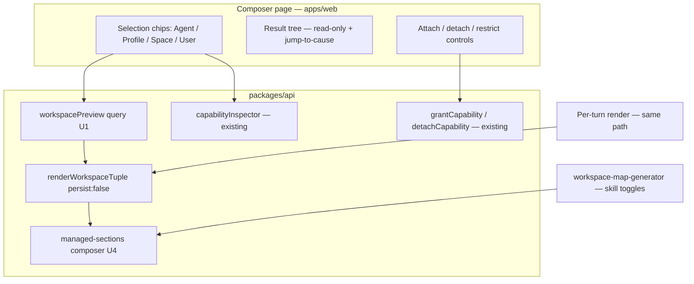

# Composer — Capability Configuration Home - Plan

## Goal Capsule

- **Objective:** Replace the scattered capability-configuration surfaces with one selection-first home — the Composer — where an operator picks Agent + Profile + Space + User, sees the resulting rendered workspace live, and changes it in place; and make the generated governance files (AGENTS.md, CONTEXT.md, space files) template-rendered so their routing content always matches the real capability set.
- **Authority:** This document. The shipped capability-mapping substrate (inspector query, unified grant/detach mutations, `persist:false` render seam, per-turn manifests) is the assumed foundation, not a design question. Product decisions in the Key Decisions section are settled — do not re-litigate them during execution.
- **Execution profile:** One PR per implementation unit, squash + auto-merge to `main`, worktrees under `.claude/worktrees/`. Dev deploys only via CI. v1 (U1–U3) ships and gets Eric's visual pass before v-final (U8) starts.
- **Stop conditions:** Stop and surface if (a) the preview render cannot be made byte-identical to the runtime render without forking the composer, (b) the snippet migration would destroy operator-authored prose it cannot distinguish from snippets, or (c) U8's registry demotion turns out to require moving Pi-extension version identity into the inspector rows (schema change beyond this plan's scope).
- **Tail ownership:** After U8 merges: remove worktrees + branches, verify deploys, close out Linear THINK-131, and file the `disableSkill` schema-removal follow-up if not done in U8.

---

## Product Contract

### Summary

One page — the Composer — becomes the only place capabilities are assigned. Its left pane is a live, read-only preview of the rendered workspace for the selected Agent + Profile + Space + User; its right pane holds the attach/detach/restrict controls; every node in the preview links to the surface that caused it. Beneath the page, per-layer templates with computed slots replace snippet-accumulated generation of AGENTS.md / CONTEXT.md / space routing files, with the workspace-blueprint 3-layer shape as the shipped defaults.

### Problem Frame

The capability-mapping plan unified the API and evidence layers, but configuration still spans five operator pages (Agents, Skill Library, MCP Servers, Spaces, Users) plus the new Capabilities page — "4 or 5 pages to configure the final workspace that actually gets injected into the agent." Operators cannot see the workspace a selection produces, and the generated routing files drift because skill installs append CONTEXT.md snippets that nothing reconciles (a stale snippet against a half-removed skill was caught live on dev during validation).

### Key Decisions

- **Composer Canvas over Agent-hub or lens-everywhere.** A new selection-first home beats absorbing configuration into the Agents page (still agent-anchored, hides the Space/User dimensions) and beats adding a result drawer to every existing page (treats visibility but leaves the scatter). Chosen from three sketched options.
- **The result tree renders as a normal editor; file contents stay read-only/derived, but the tree carries capability actions (v1.1).** The Composer's main area is the same editor shell as Settings → Workspace — a full-height file tree beside a real CodeMirror pane — backed by a read-only `WorkspaceFilesClient` adapter over the preview queries (`putFile` rejects), so file CONTENTS remain derived and uneditable; editing still happens on the owning source layer behind jump-to-cause and the U7 generated-file split view. What changed in v1.1: the capability LIST (class tabs + rows + attach/detach) moves out of the main layout into a right Side Sheet opened from the toolbar and from tree jump-to-cause; skill-folder tree nodes are decorated with their inspector state (active vs gated + the verbatim gate reason) and the class tab counts read active/total; and the tree offers direct manipulation via a context menu — "Detach skill…" on a `skills/<slug>/` folder and "Add skill…" on the `skills/` folder — routed through the SAME unified grant/detach + confirm + sync-pending machinery the list rows use, not a new write path. Every tree node still deep-links to its owning surface: a skill folder to its capability row, a space mount to the space source editor, generated AGENTS.md to the template that produced it.
- **Templates per layer, prose editable, facts computed.** Agent, agent-profile, and space each own a template for their routing file, living in that layer's source tree with system defaults. Slots (skills table, tools/MCP list, folder map, routing rows) are computed at render time from the effective capability set, so routing text cannot drift; operators own the surrounding prose.
- **The workspace-blueprint shape is the default template set.** The 3-layer context-delivery architecture — map (always loaded), router (task → workspace + "you'll also need"), self-contained workspace folders with load tables and skills/tools tables — becomes what tenants get out of the box.
- **Phased consolidation.** v1 ships the result tree + jump-to-cause on the existing Capabilities page (renamed Composer) and kills Customize→Skills; page demotion and nav collapse follow. Chosen over a big-bang rebuild; Eric: "the composer canvas is a start."

### Actors

- A1. Tenant operator — configures capabilities in the Composer; edits templates; visits registries only to stock inventory.
- A2. End user — unchanged self-serve connections (OAuth, plugin activations); appears in the Composer only as a perspective.
- A3. Agent runtime — consumes the rendered workspace; the Composer preview must equal what a real turn renders (same composer code path).

### Requirements

**The Composer surface**

- R1. One page holds a persistent selection — Agent, Agent Profile, Space, perspective User — and renders the resulting workspace file tree for that selection live, computed through the same render path the runtime uses.
- R2. File CONTENTS in the tree are read-only/derived (the preview adapter's `putFile` rejects). The tree itself carries capability actions (v1.1): skill-folder nodes show their inspector state (active vs gated + verbatim reason), a context menu attaches/detaches skills through the unified mutations, and every node still carries a jump-to-cause link to the surface that owns it (the capability row in the side sheet, the space source editor, the user tree, or the producing template). The capability list — class tabs (counts shown active/total), rows, and attach/detach — lives in a right side sheet rather than the main layout.
- R3. All capability assignment (skills, MCP servers, extensions, built-in restrictions; agent and profile scope) happens in the Composer's controls, which are clients of the existing unified mutations; after v-final, no other page offers an assignment action.
- R4. Selecting a Profile chip scopes the controls to that profile's subset; Space and User selections are read lenses (no grant actions), consistent with the capability matrix.
- R5. Changes reflect in the preview immediately after the mutation's fresh-state confirmation, including gate states (trust/eval/OAuth/activation) shown truthfully.

**Templated governance files**

- R6. Agent, agent-profile, and space layers each own a routing-file template stored in that layer's source tree, with shipped defaults following the workspace-blueprint 3-layer shape; a tenant with no custom template gets the defaults.
- R7. Templates combine operator-editable prose with computed slots — at minimum: folder map, skills table (name / when to use / wiring), tools and MCP servers available, space routing rows — filled at render time from the effective capability set.
- R8. Skill install/detach no longer appends or strips CONTEXT.md snippets; wiring text enters routing files only through computed slots, eliminating drift by construction.
- R9. From the Composer preview, opening a generated file shows rendered output beside its template for the current selection; edits to the template re-render the preview.

**Consolidation (phased)**

- R10. v1: the Capabilities page becomes the Composer (tree + jump-to-cause added); Customize→Skills is removed.
- R11. v-final: Skill Library and MCP Servers demote to registries (inventory, trust pipeline, credentials — no assignment); the Agents page keeps identity and profile definitions only; Space and User pages keep their file editors and self-serve connections, reachable via jump-to-cause.

### Key Flows

- F1. Wire an agent: open Composer → select context chips → attach skill/server in the right pane → watch it appear in the tree with its true state → done, result seen.
- F2. Diagnose: select the failing context → inactive row shows the gate reason → jump-to-cause lands on the owning surface to fix it.
- F3. Shape the routing files: click generated AGENTS.md/CONTEXT.md in the tree → template opens beside the render → edit prose or slot placement → preview re-renders for the selected context.

### Acceptance Examples

- AE1. Attaching `renewal-prep` with the Customer-Success space and user Dana selected shows the skill folder appearing in the tree and the routing table in the rendered CONTEXT.md gaining a computed row — no snippet append anywhere.
- AE2. Detaching a skill leaves zero stale references in any rendered routing file for any selection (the drift class caught on dev 2026-07-02 becomes impossible).
- AE3. A tenant that never customized templates renders routing files in the blueprint shape: map, router table with "you'll also need" column, per-workspace skills/tools tables.
- AE4. Every capability class the matrix marks assignable is reachable in the Composer; assignment controls are absent under Space/User selections.

### Success Criteria

- The Monday flow (agent + space + user + skill + server) completes on one page, with the result visible before leaving it.
- Zero assignment surfaces outside the Composer at v-final; registries carry no attach buttons.
- Rendered routing files always agree with the effective capability set (spot-checkable via the inspector fingerprint).

### Scope Boundaries

- Out: an editable rendered tree (drag-to-attach, inline edits of derived files).
- Out: folding the consolidated source editor (Settings → Workspace) into the Composer; it remains the source-editing surface, linked via jump-to-cause.
- Out: operator-assigned per-user capabilities — users stay self-serve per the capability matrix.
- Out: mobile/desktop parity; operator configuration stays web-only.
- Deferred: profile-scope grant picker in the Composer (OQ2) — v2; grants at profile scope remain API-reachable via `grantCapability` until then.

### Dependencies / Assumptions

- Shipped substrate assumed: `capabilityInspector`, `grantCapability`/`detachCapability`, `renderWorkspaceTuple persist:false`, per-turn manifests + divergence (all merged and dev-verified 2026-07-02).
- Assumption: today's operator is Eric; customer-tenant operators follow — the Composer must not require reading code to use, but power-user density is acceptable.
- Assumption: template rendering happens in the existing workspace-render path (same composer, new slot filling), not a parallel renderer.

### Outstanding Questions

- OQ2. Profile-scope grant picker in the Composer — deferred (non-blocking, v2). Not scheduled in this plan's units.

---

## Planning Contract

### Key Technical Decisions

- KTD-1. **The layer's source file IS the template — managed sections, no new syntax.** Each layer's AGENTS.md/CONTEXT.md carries operator prose plus managed sections: known headings (Folder Structure, Skills & Tools, Routing) whose bodies are recomputed at render time from the effective capability set. This generalizes machinery that already exists and works: `packages/api/src/lib/workspace-map-generator.ts` (`replaceDerivedAgentsMdSections`, `DERIVED_SECTION_ORDER`, `replaceMarkdownSection`/`findMarkdownSectionRange`) already swaps exactly two headings in AGENTS.md while preserving surrounding prose. Resolves the former OQ1: the "slot vocabulary" is the managed-heading set; no template DSL, no separate template files.
- KTD-2. **One section composer shared by both generation paths.** AGENTS.md is currently produced two ways: the per-thread render path (`packages/api/src/lib/workspace-renderer/compose-tuple.ts` → `renderGeneratedAgentsMd` → `composeAgentsMdWithRouting` in `packages/api/src/lib/workspace-renderer/agents-md-composer.ts`) and the agent-level map path (`workspace-map-generator.ts`, triggered on skill toggles). Both converge on one managed-sections module so the Composer preview, the map regeneration, and the runtime turn are byte-identical for the same state (A3, R1).
- KTD-3. **Preview API = tree query + per-file content query; generated content comes from the in-memory compose result.** `renderWorkspaceTuple` already returns `hydrateManifest.files` (`{path, owner, sourceKey, etag, generated, size}`) with no content. A new `workspacePreview` query runs `persist:false` and returns that tree; a companion per-file query returns one file's content — source files read via their `sourceKey`, generated files returned from the compose result in memory, never from mutable `renderedPrefix` keys (per the content-addressed-storage learning in `docs/solutions/`). Two queries bound payload size for large workspaces.
- KTD-4. **Legacy snippet migration is precise, not grandfathered.** Every install-time snippet was stored verbatim in the skill's `.catalog-ref.json` (`snippet` field). A one-shot idempotent migration strips exactly those snippets from CONTEXT.md across agent workspaces; operator hand-edits outside snippet boundaries are untouched. Install (`packages/api/src/lib/catalog-install.ts` `appendSnippetIfMissing`) and uninstall (`catalog-uninstall.ts` `stripExactSnippet`) stop touching CONTEXT.md entirely (R8). Resolves the former OQ3.
- KTD-5. **Jump-to-cause is resolved client-side.** The manifest entry's `{owner, path, generated}` already determines the owning surface: `skills/<slug>/` → the Composer's own attach row, `Spaces/<slug>/` → space source editor, `User/`/`Users/` → user detail, generated files → the producing layer's template file. No new server metadata.
- KTD-6. **Route path stays `/settings/capabilities`; the label, heading, and nav entry become "Composer".** Avoids deep-link and route-tree churn for a cosmetic rename; the route file can be renamed later if it ever matters.
- KTD-7. **v1 ships before templating.** U1–U3 (preview + tree + rename + Customize kill) do not depend on U4–U6 (templating); pre-templating, generated-file jump-to-cause links point at the layer's source file in the existing editors, upgraded to the side-by-side template view in U7.
- KTD-8. **Recomputation point split by section class.** Perspective-independent sections (folder map, skills inventory) may be baked into the source file by the map path; perspective-dependent content (gate states, per-user routing rows) is computed only at render time into the per-tuple generated file, and the map path writes perspective-neutral bodies. Without this split, U4's unification assertion is unsatisfiable — the map path has no user perspective, so baking gate states into the agent-level source file would be wrong for every other user. U4's render-equals-map test is scoped to perspective-independent sections.
- KTD-9. **The CONTEXT.md Routing section ships inert in U4 and activates in U5's PR.** U4 lands the engine with the Routing section not wired into the render path (AGENTS.md sections may activate immediately); activation, snippet-append retirement, and the strip migration land in one U5 deploy per stage, so no render ever carries both legacy snippet lines and computed rows. Legacy snippets live in prose regions that U4's byte-preservation guarantee would otherwise keep alongside the new computed rows for the whole U4→U5 window.

### High-Level Design

### Assumptions and Constraints

- No database schema changes are expected; all state in play is S3 workspace files and existing tables. If a migration surfaces, it follows the hand-rolled `-- creates:` marker process and gets applied to dev via psql before merge.
- `packages/workspace-defaults` default-content changes must keep the `.md`-file-vs-inlined-constant byte-parity tests green (`packages/workspace-defaults/src/__tests__/parity.test.ts` pattern).
- Legacy agents may lack a root CONTEXT.md (caught during LastMile install); every path that reads or migrates CONTEXT.md must tolerate absence.
- PRs touching `packages/database-pg/graphql/types/capabilities.graphql` or capability wiring paths trigger the matrix CI gate — carry a `matrix-no-change:` marker naming cells (this plan adds read surfaces and moves UI; no assignability cell changes).

### Sequencing

- Chain 1 (v1): U1 → U2 → U3, then Eric's visual pass on dev. Ships independently of templating.
- Chain 2 (templating): U4 → U5 → U6; U4 can start in parallel with U2/U3. The CONTEXT.md Routing section crosses the U4/U5 boundary inert (KTD-9): engine in U4, activation + snippet retirement + per-stage migration in U5's single deploy.
- U7 needs U4 and U2. U8 is last and gated on Eric's explicit go-ahead after v1 + templating are live.

---

## Implementation Units

### U1. workspacePreview query — rendered tree + file contents

- **Goal:** A GraphQL read surface that, for a selection tuple, returns the rendered workspace file tree and (per file, on demand) its content — byte-identical to what a real turn renders, with zero writes.
- **Requirements:** R1, R5; KTD-2, KTD-3.
- **Files:** `packages/database-pg/graphql/types/capabilities.graphql` (add `workspacePreview` + `workspacePreviewFile` queries and types); `packages/api/src/graphql/resolvers/capabilities/workspacePreview.query.ts` (+ `.test.ts`), registered in `packages/api/src/graphql/resolvers/capabilities/index.ts`; `packages/api/src/lib/workspace-renderer/compose-tuple.ts` and `packages/api/src/lib/workspace-renderer/types.ts` (extend the render result to expose generated-file contents — today `generatedFiles` is local to `composeTuple` and dropped before return, and under `persist:false` nothing exists at the manifest's rendered keys); `pnpm schema:build` + codegen in `apps/cli`, `apps/web`, `apps/mobile`, `packages/api`.
- **Approach:** Follow `capabilityInspector.query.ts` for auth (operator-only), selection-tuple validation, and deps wiring. Call `renderWorkspaceTuple` with `persist:false`; map `hydrateManifest.files` to the tree payload (`path`, `owner`, `generated`, `size`, plus a cause discriminator derivable client-side). Extend `RenderedWorkspaceTuple` (opt-in flag) to carry generated-file contents on both the cache-hit and cache-miss return paths. `workspacePreviewFile` takes the same selection tuple plus a _relative path_ — the resolver re-runs auth and re-derives the S3 key server-side from the resolved tuple (mirroring `target.key(path)` in `packages/api/workspace-files.ts`); it never accepts or trusts a client-supplied `sourceKey`, and it re-runs the `persist:false` render for generated files rather than reading `renderedPrefix` keys. The render tuple carries no profile dimension — the preview is profile-invariant; the Profile chip scopes the controls pane only (R4).
- **Test scenarios:** persist-false purity (S3 put spy sees zero writes — mirror the U2 renderer-purity test from the capability-mapping plan); generated AGENTS.md/CONTEXT.md content matches what a persisting render would write for the same tuple (byte-parity assertion); source file content served via a server-derived key from tuple + relative path, and a path resolving outside the tuple's own tenant prefixes is rejected; non-operator caller rejected; unknown agent/space/user in the tuple errors cleanly; tree entries carry correct `owner`/`generated` flags for skill folders, space mounts, user mount, and generated files.
- **Verification:** full `pnpm --filter @thinkwork/api test` + typecheck; schema loop committed in the same PR; `matrix-no-change:` marker (adds read queries only — no assignability cells change).

### U2. Composer result tree + jump-to-cause (web)

- **Goal:** The Capabilities page gains a live, read-only rendered-workspace pane driven by the selection tokens, with every node linking to its owning surface, refreshed after each mutation confirmation.
- **Requirements:** R1, R2, R4, R5; KTD-5. Depends on U1.
- **Files:** `apps/web/src/components/settings/SettingsCapabilities.tsx` (layout: tree pane + existing controls pane); new `apps/web/src/components/settings/ComposerWorkspaceTree.tsx` (+ test) and a read-only file-content viewer; `apps/web/src/lib/settings-queries.ts` (+ codegen).
- **Approach:** Reuse the tree/file-view patterns from `packages/workspace-editor` (`WorkspaceFileEditor` with `readOnly`) or `apps/web/src/components/workbench/ProjectedWorkspacePanel.tsx` — whichever fits a query-backed (not client-backed) tree with less adaptation; file content loads lazily via `workspacePreviewFile`. Jump-to-cause maps `{owner, path, generated}` → route or in-page focus: skill folders focus their attach/detach row; `Spaces/<slug>/` links to the space source editor (`/settings/spaces/$spaceId?workspace`); `User/` links to user detail; generated files link to the producing layer's source file (upgraded to the U7 side-by-side view later). An in-page focus first resets the State/Search filter tokens and switches to the target's capability-class tab, so the focused row is visible regardless of current toolbar state (the page defaults to Active-only rows on one tab — F2's diagnose flow targets exactly the rows those defaults hide). During the sync-pending window the affected tree node shows an explicit pending affordance (ghost node or syncing badge) rather than appearing frozen; the full refetch fires when the existing sync-pending confirmation completes. R4's existing behavior (Profile chip scopes the controls; Space/User selections are read lenses with no grant actions) carries over from the shipped page — verify, don't rebuild.
- **Test scenarios:** tree renders from mocked query data with skill/space/user/generated nodes; selection change refetches; grant confirmation triggers preview refetch and the new skill folder appears; pending affordance shows on the affected node during the sync window; jump-to-cause per owner class navigates/focuses correctly, including resetting filters/tab for a row hidden by the default Active filter; Profile chip scopes the controls pane and Space/User selections render no grant actions (R4); file viewer is read-only (no put path); loading and error states render.
- **Verification:** full `pnpm --filter @thinkwork/web test` + `tsc` (separate gate) + lint; visual check on a worktree dev server (registered port).

### U3. Rename to Composer + remove Customize→Skills (v1 cut)

- **Goal:** The page presents as the Composer; the redundant Customize→Skills surface is gone; v1 is complete and ready for Eric's pass.
- **Requirements:** R10; KTD-6. Depends on U2 (ships the rename with the tree present).
- **Files:** `apps/web/src/components/settings/settings-nav.tsx` (label); `apps/web/src/routes/_authed/settings.capabilities.tsx` + `SettingsCapabilities.tsx` (headings/copy); delete `apps/web/src/routes/_authed/_shell/customize.skills.tsx` and its tab in `customize.tsx`; remove `useSkillItems` (`apps/web/src/components/customize/use-customize-data.ts`) and `useSkillMutation` (`apps/web/src/components/customize/use-customize-mutations.ts`) usages (keep `customize.workflows.tsx` and shared Customize components intact); route-tree regeneration.
- **Approach:** Keep route path `/settings/capabilities` (KTD-6). `/customize/skills` gets a redirect to the customize index so stale links don't 404. Leave the `disableSkill` GraphQL mutation in the schema — its removal is a named follow-up once no client references remain (checked in U8).
- **Test scenarios:** nav shows Composer and no Customize→Skills tab; `/customize/skills` redirects; no dangling imports of the removed hooks; existing customize-workflows tests stay green.
- **Verification:** full web suite + tsc + lint; **Eric visual pass on dev after this unit merges and deploys — v1 checkpoint.**

### U4. Managed-sections composer — one engine for both generation paths

- **Goal:** A shared managed-sections module computes governance-file sections (folder map, skills table, tools/MCP list, routing rows) from the effective capability set, preserving operator prose; both the render path and the map path use it.
- **Requirements:** R6 (mechanism), R7; KTD-1, KTD-2.
- **Files:** new `packages/api/src/lib/workspace-renderer/managed-sections.ts` (+ test) — extract and generalize `replaceMarkdownSection`/`findMarkdownSectionRange`/`DERIVED_SECTION_ORDER` from `packages/api/src/lib/workspace-map-generator.ts`; `packages/api/src/lib/workspace-renderer/agents-md-composer.ts` and `compose-tuple.ts` (generated AGENTS.md and CONTEXT.md flow through managed sections); `workspace-map-generator.ts` repointed to the shared module.
- **Approach:** Managed headings are the slot vocabulary (KTD-1): at minimum Folder Structure, Skills & Tools, and a Routing section for CONTEXT.md whose rows come from the effective capability set (including gate states, so an inactive skill shows honestly or is omitted — match current inspector semantics). Per KTD-8, perspective-dependent rows are computed only on the render path; the map path writes perspective-neutral bodies. The computed Routing rows must apply the plugin activation gate per requester with the same fail-closed semantics as today's `filterContextRoutingEntries` (`packages/api/src/lib/plugins/gating.ts`, applied in `compose-tuple.ts`'s `gatedContextFile` path) — that filter works by matching install-time snippet lines, so once U5 strips those lines it has nothing to match, and the computed rows become the only gate enforcement. Per KTD-9, the Routing section lands inert in this unit (engine + tests, not wired into the render path); AGENTS.md sections may activate immediately. A file with no managed headings gets them appended in `DERIVED_SECTION_ORDER` position; a file with prose around them keeps every byte of that prose. Characterization first: existing `workspace-map-generator` and `agents-md-composer` tests must stay green while their internals move.
- **Test scenarios:** prose before/between/after managed headings survives recomposition byte-for-byte; absent headings appended in canonical order; render path and map path emit identical section bodies for identical state on perspective-independent sections (the unification assertion, scoped per KTD-8); a gated requester's rendered CONTEXT.md carries no routing row for a plugin skill the activation gate excludes (fail-closed, replacing `compose-tuple.plugin-gating.test.ts` coverage); CONTEXT.md routing rows reflect attach/detach immediately; a file that is only prose (no headings) and a file that is only managed sections both round-trip; legacy agent without root CONTEXT.md tolerated.
- **Verification:** full api suite + typecheck; characterization tests prove no behavior change for existing tenants while the CONTEXT.md routing section is inert (KTD-9 — activation belongs to U5); matrix marker if capability wiring paths trigger CI (name cells: rendering only, no assignability change).

### U5. Retire the snippet lifecycle + migrate legacy snippets

- **Goal:** Skill install/uninstall never touch CONTEXT.md again; existing appended snippets are stripped precisely so managed sections are the single source of wiring text.
- **Requirements:** R8; AE1, AE2; KTD-4, KTD-9. Depends on U4 (the engine lands there inert; this unit activates the CONTEXT.md Routing section in the same deploy that stops snippet appends, so wiring text neither vanishes nor doubles).
- **Files:** `packages/api/src/lib/catalog-install.ts` (drop `appendSnippetIfMissing` call path), `packages/api/src/lib/catalog-uninstall.ts` (drop `stripExactSnippet` call path); `packages/api/src/lib/workspace-renderer/compose-tuple.ts` (retire the `gatedContextFile`/`filterContextRoutingEntries` snippet-line filter — superseded by U4's gate-aware computed rows — and activate the CONTEXT.md Routing section per KTD-9) plus `compose-tuple.plugin-gating.test.ts`; a one-shot idempotent migration script (admin-ops or `scripts/`) that walks agent workspaces, reads each installed skill's `.catalog-ref.json` `snippet` field, and strips exact matches from CONTEXT.md; tests beside each.
- **Approach:** Migration is exact-match-only (KTD-4): if the stored snippet text isn't found verbatim (operator edited it), leave the file untouched and report it — never fuzzy-strip. It needs a second pass for orphans: uninstall deletes `skills/<slug>/` including `.catalog-ref.json`, so snippets from already-uninstalled skills (the exact drift class caught on dev 2026-07-02) have no stored record — scan CONTEXT.md for routing lines referencing `skills/<slug>/` paths whose folder no longer exists, strip exact reconstructions (from the catalog's WIRING.md and the plugin snippet template), and report anything unmatched. The script has a dry-run mode producing the same report with zero writes; review the dry-run before any mutating run. The migration runs on **every stage the U5 code deploys to** (dev and live customer stages) — on an unmigrated stage, every subsequent detach would leave its snippet behind forever, manufacturing the drift class this plan eliminates. Keep `.catalog-ref.json` writing intact (it carries more than the snippet).
- **Test scenarios:** install writes skill folder + `.catalog-ref.json` but leaves CONTEXT.md untouched; uninstall removes the folder and leaves CONTEXT.md untouched; migration strips a stored snippet exactly and preserves surrounding prose; orphan pass strips a snippet whose skill folder is gone and reports an unmatched orphan line without touching it; edited-snippet case reports and skips; dry-run writes nothing; missing CONTEXT.md tolerated; migration is idempotent (second run no-ops).
- **Verification:** full api suite; dry-run then mutating migration run per deployed stage (dev, then each live customer stage), reports recorded on THINK-131; AE2 spot-check on dev — detach a skill, confirm zero stale references in the rendered CONTEXT.md via the Composer preview.

### U6. Blueprint default templates in workspace-defaults

- **Goal:** Tenants with no customized governance files render in the workspace-blueprint 3-layer shape out of the box.
- **Requirements:** R6 (defaults), AE3. Depends on U4.
- **Files:** `packages/workspace-defaults/src` default AGENTS.md/CONTEXT.md/space-file content updated to the blueprint shape (map layer, router table with "you'll also need" column, per-workspace skills/tools tables) with managed headings in place; parity tests per the existing `packages/workspace-defaults/src/__tests__/parity.test.ts` pattern.
- **Approach:** Translate the blueprint's three layers into the platform's file positions: agent-root AGENTS.md = map, agent-root CONTEXT.md = router, space CONTEXT.md = workspace layer. Defaults carry the managed headings so U4 fills them on first render. Defaults materialize at bootstrap (workspace-bootstrap copies templates at write time; AGENTS.md/CONTEXT.md are live-class files a defaults bump never rewrites), so new content reaches **newly bootstrapped agents only** — AE3's "tenant that never customized" therefore needs an explicit reseed step: idempotently rewrite an existing agent's governance file only when its current content is byte-identical to a previously shipped default version (hash-compare against historical defaults, mirroring the seeding machinery); anything hand-edited is left alone.
- **Test scenarios:** byte-parity between `.md` files and inlined constants; fresh-tenant render produces the blueprint shape end-to-end (compose a default workspace, assert router table + skills/tools sections present); reseed rewrites a byte-identical-to-old-default file and skips a customized one; customized-tenant render unchanged.
- **Verification:** workspace-defaults + api suites; AE3 verified on dev with a freshly bootstrapped agent AND a reseeded never-customized agent.

### U7. Side-by-side template editor in the Composer

- **Goal:** Opening a generated file in the Composer shows its rendered output beside the producing layer's source file; saving the source re-renders the preview.
- **Requirements:** R9; F3. Depends on U2 and U4.
- **Files:** `apps/web/src/components/settings/ComposerWorkspaceTree.tsx` / file viewer (split view for generated files); `packages/workspace-editor/src` (managed-section locked-region affordance in `WorkspaceFileEditor`); reuse `WorkspaceFileEditor` with the prefixed client from `apps/web/src/lib` for the editable source pane; settings-queries + codegen if new fields needed.
- **Approach:** The generated pane is the read-only `workspacePreviewFile` content; the source pane is the layer's real source file via the existing `WorkspaceFilesClient` `putFile` path (no new write API). On save, refetch the preview. The managed-section affordance is committed, not optional, and lives in the shared `@thinkwork/workspace-editor` `WorkspaceFileEditor` — managed-heading bodies render visually locked/marked as computed, with a warn-on-save when an edit falls inside one. It must live in the shared editor because the Composer split view is not the only writer: Settings→Workspace and the scoped space/user editors edit the same source files, and the map path already writes recomposed sections back into source AGENTS.md — an unmarked editor lets an operator save an edit that is silently destroyed on the next recomposition.
- **Test scenarios:** generated AGENTS.md opens split with the correct layer source (agent vs space file resolved from the node's owner); save triggers preview refetch and the render reflects prose edits; managed-heading bodies render locked/marked in the source pane and an edit inside one warns on save (asserted at the `WorkspaceFileEditor` level so all embedding surfaces inherit it); render pane rejects edits; non-generated files open single-pane; operator-only gating.
- **Verification:** full web suite + tsc + lint; visual check on dev.

### U8. v-final — registry demotion and nav collapse

- **Goal:** No assignment action exists outside the Composer; Skill Library and MCP Servers are pure registries; Agents keeps identity and profile definitions only.
- **Requirements:** R3, R11, AE4. Depends on v1 live + Eric's explicit go-ahead (Goal Capsule stop condition c applies if extension identity blocks).
- **Files:** `apps/web/src/components/settings/SettingsAgentExtensions.tsx` (fold Pi-extension assignment into the Composer's controls — needs a version picker on the pi_extension class rows in `SettingsCapabilities.tsx`); `apps/web/src/components/settings/SettingsSkills.tsx`, `SettingsMcpServers.tsx`, `SettingsMcpServerDetail.tsx` (remove any assignment affordances; keep trust pipeline, eval gate, credentials/OAuth config); `settings-nav.tsx`; remove the `disableSkill` mutation from `packages/database-pg/graphql/types/customize.graphql` + resolver + codegen if no references remain.
- **Approach:** Audit-first: enumerate every remaining assignment affordance (grep for the grant/detach mutations and legacy assignment mutations across `apps/web`) and retire each. Pi-extension version identity comes from the extension registry data the Agents→Extensions surface already loads — move that data need into the Composer controls rather than the schema.
- **Test scenarios:** no component outside `SettingsCapabilities.tsx` references the grant/detach mutations; extension grant with a version picker works from the Composer; registries render without attach buttons; nav reflects the collapse; AE4 sweep — every assignable matrix cell reachable in the Composer, absent under Space/User selections.
- **Verification:** full web + api suites; matrix marker (touches `capabilities.graphql` consumers; name cells: UI consolidation only); Eric visual pass before merge.

---

## Verification Contract

| Gate                      | Command / check                                                                                                                                                                                                | Applies to         |
| ------------------------- | -------------------------------------------------------------------------------------------------------------------------------------------------------------------------------------------------------------- | ------------------ |
| API tests                 | `pnpm --filter @thinkwork/api test` (full suite, not just new files)                                                                                                                                           | U1, U4, U5, U6, U8 |
| Web tests + types         | `pnpm --filter @thinkwork/web test` and `tsc` as a separate gate (vitest green ≠ tsc green)                                                                                                                    | U2, U3, U7, U8     |
| Workspace-defaults parity | package test suite incl. byte-parity tests                                                                                                                                                                     | U6                 |
| Schema loop               | `pnpm schema:build` + codegen in all four consumers, committed in the same PR                                                                                                                                  | U1, U8             |
| Matrix CI gate            | `matrix-no-change:` marker naming cells on any PR touching `capabilities.graphql` or wiring paths                                                                                                              | U1, U4, U8         |
| Render purity             | S3 put-spy test proving `workspacePreview` writes nothing                                                                                                                                                      | U1                 |
| Preview/runtime parity    | byte-parity test: preview content == persisting render for same tuple                                                                                                                                          | U1, U4             |
| Characterization          | existing map-generator + agents-md-composer tests green across the U4 extraction                                                                                                                               | U4                 |
| Dev evidence              | AE1 (attach → tree + computed row, no snippet), AE2 (detach → zero stale refs), AE3 (fresh tenant = blueprint shape) verified live on dev; U5 migration dry-run + mutating reports recorded per deployed stage | U5, U6             |
| Human checkpoint          | Eric visual pass after U3 (v1) and before U8 merge (v-final)                                                                                                                                                   | U3, U8             |

Pre-commit hooks run `pnpm lint && pnpm typecheck && pnpm test && pnpm format:check`; fix real failures, never bypass.

---

## Definition of Done

- All eight units merged to `main` via one squash PR each, with post-merge `deploy.yml` runs green.
- v1 checkpoint passed: Eric validated the Composer (tree + jump-to-cause + rename + Customize→Skills removal) live on dev.
- AE1–AE4 demonstrated on dev; the U5 migration (dry-run then mutating) ran on every stage that received the U5 code — dev and each live customer stage — with per-stage reports recorded on THINK-131.
- Rendered routing files agree with the effective capability set for spot-checked selections (inspector fingerprint match).
- No assignment surface outside the Composer (U8 sweep clean); `disableSkill` schema removal done or filed as a named follow-up.
- Cleanup: worktrees and branches removed; no dead code from abandoned approaches left in the diff; THINK-131 closed out with a completion note.
