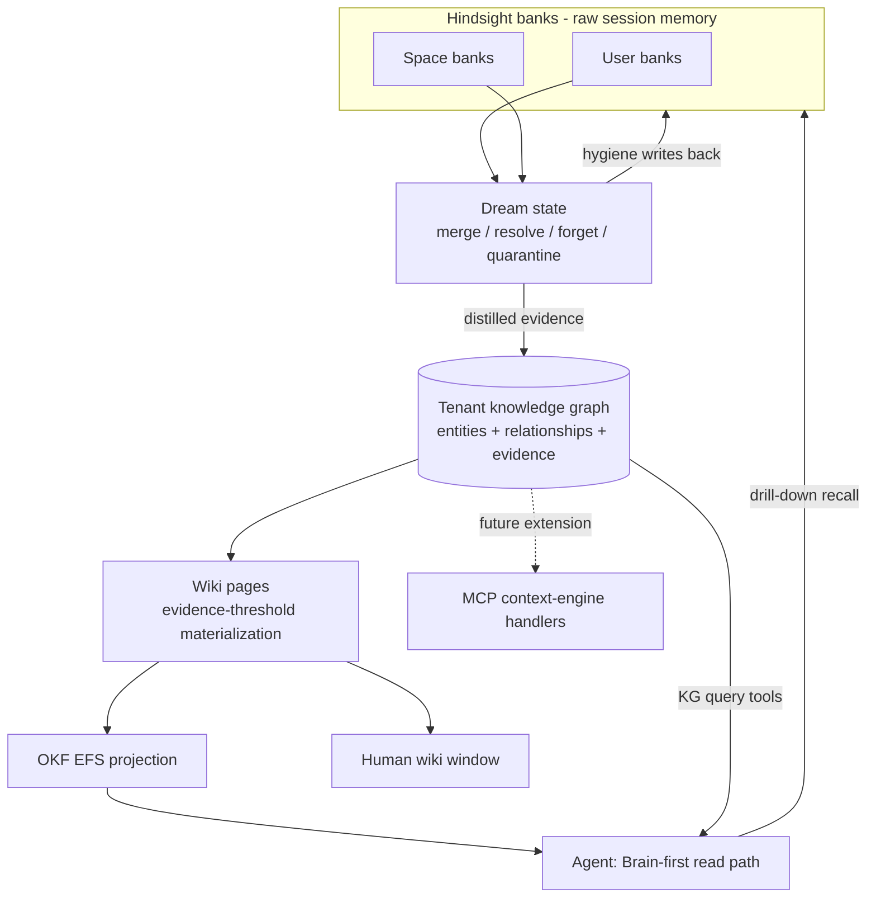
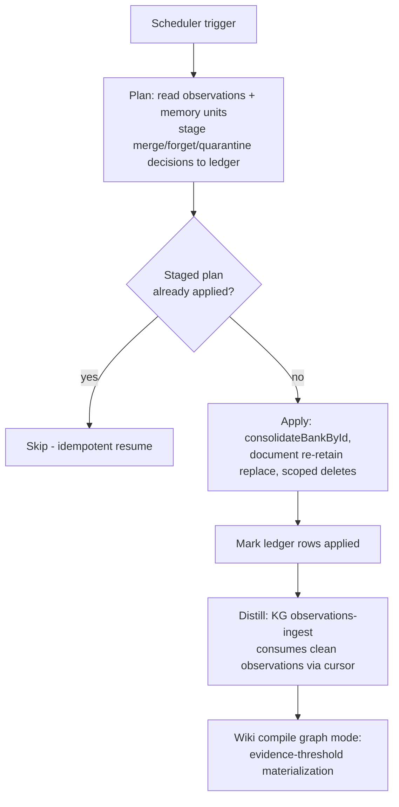

# ThinkWork Brain Memory Architecture - Plan

## Goal Capsule

- **Objective:** A self-maintaining tenant Brain: Hindsight banks stay the raw session-memory layer, a lightweight knowledge graph in plain Postgres becomes the structural spine, wiki pages materialize from entities that earn them through evidence, and a background "dream state" keeps the whole system clean.
- **Product authority:** Eric Odom via THINK-133 brainstorm dialogue (2026-07-03). Related: THINK-121 (security/authorization), THINK-65 (OKF projection visualization).
- **Open blockers:** None.
- **Product Contract preservation:** unchanged from the 2026-07-03 brainstorm; planning updated only Dependencies/Assumptions and Outstanding Questions with verified findings.

---

## Product Contract

### Summary

Rebuild the memory-to-wiki path around a lightweight knowledge graph in plain Postgres. The dream state consolidates noisy Hindsight banks and distills evidence into the KG; wiki pages are deterministically materialized from entities that cross evidence thresholds; the agent reads Brain-first with drill-down into raw bank recall. Humans get the wiki as a read-only window.

### Problem Frame

Two prior architectures were built and pulled back: the ontology-gated wiki (entity promotion through tenant ontologies proved confusing and brittle) and the the retired graph substrate-first ladder (overlapped Hindsight; THINK-83 pivoted user/Space memory back to Hindsight as canonical). What remains has two visible failures. First, memory is barely leveraged — the agent rarely uses what it has retained. Second, the banks are noisy: the operator memory view shows eight coexisting contradictory summaries of the same fact, junk meta-memories ("no contradictions have been observed"), eval-test residue polluting real banks, and 18 dead-lettered retains. Nothing in the platform's own pipeline consolidates, deduplicates, or forgets. The multi-tier promotion ladder (user → space → team → company) added fragile ingestion hops without fixing either failure.

### Key Decisions

- **Agent-first, human window second.** The Brain exists so the platform agent does better work; the wiki UI is a read-only window into what the agent knows. Quality bar is agent answer quality, not knowledge-base page polish.
- **Plain-Postgres knowledge graph, no graph extension.** Apache AGE is not installable on Aurora; pgGraph is a pgrx-compiled early-alpha extension with no Aurora story. The existing `knowledge-graph` schema tables plus recursive-CTE traversal handle tenant-Brain scale (thousands to low-hundreds-of-thousands of entities). The relational shape keeps Drizzle, migrations, tenant scoping, and the drift gate working; a dedicated graph engine remains a future projection target if analytics ever demand it (same pattern as the OKF EFS projection).
- **Evidence-threshold promotion, not ontology gates.** An entity earns a wiki page by crossing observable thresholds (distinct-thread mentions, relationship count, referenced-by-page). Ontology types demote to optional labels the compiler may use; nothing gates on them. This removes the exact spot where the prior design broke.
- **Two levels, not four.** Hindsight user/space banks (raw) plus one tenant-level Brain (KG + wiki). "Team" is a scope filter on Brain content, not a separate store. Every promotion hop removed is an ingestion pipeline that can no longer silently break.
- **The dream state mutates the banks.** Consolidation is not a read-side view: duplicates merge, contradictions resolve, stale and junk memories decay or are forgotten, test residue is quarantined — in Hindsight itself. Accepting deletion risk is the price of clean recall.
- **Deterministic graph→wiki materialization becomes the default.** The existing `WIKI_SOURCE=graph` mode graduates from non-default to the compile path; LLM work narrows to writing page prose from graph evidence, never deciding structure.

### Requirements

**Structural spine**

- R1. The tenant Brain is a knowledge graph in plain Postgres using the existing `knowledge-graph` schema tables, traversed with recursive CTEs; no graph extension is introduced.
- R2. Ontology entity/relationship types are optional labels on KG records; no compile, promotion, or ingest step requires them.
- R3. The Brain is tenant-scoped with scope attributes (space, team) on entities and evidence, so team- or space-filtered views are queries, not separate stores.

R1–R3 are satisfied by the pre-existing `knowledge-graph` schema and ingest layer (see Dependencies); no unit builds them. U4 and U6 exercise them, and their test suites are the verification that the existing schema actually meets the spine requirements.

**Self-maintenance (dream state)**

- R4. A recurring background consolidation pass runs over each Hindsight bank: merges duplicate memories, resolves contradictions, decays or forgets stale and junk memories, and quarantines eval-test residue.
- R5. The same pass distills consolidated facts into the tenant KG as evidence records; this is the only ingestion path into the Brain.
- R6. Forgetting is real: consolidated-away memories are deleted or archived in Hindsight, not merely hidden from views.

**Promotion and wiki materialization**

- R7. An entity earns a wiki page by crossing mechanical evidence thresholds (e.g., distinct-thread mentions over time, relationship count, referenced by another page); exact threshold values are configuration tuned on dev.
- R8. Wiki pages and their links are deterministically materialized from the KG; LLM compilation writes page prose from graph evidence but never decides which pages exist or how they link.
- R9. Entities below the promotion threshold remain fully queryable in the KG; promotion controls the wiki window, not agent visibility.

**Agent read path**

- R10. The agent's default memory consultation is Brain-first progressive discovery: compiled wiki (via the existing OKF navigator tools) and KG queries first, with drill-down into raw Hindsight bank recall when detail is needed.
- R11. The KG query surface is defined once and consumed both as agent tools and, later, through the existing MCP context-engine handlers — its shape must not require redesign for MCP exposure.

**Human window**

- R12. The wiki UI remains the read-only human window over the Brain; no standalone knowledge-product UX (search product, digests, verification loops) is added.

**Future-source accommodation**

- R13. External sources (Google Workspace, Slack, GitHub/work trackers) must be attachable later as additional evidence producers feeding the same dream→KG path, without a parallel ingestion pipeline.

**Pipeline reliability**

- R14. Retain-pipeline reliability is in scope: THINK-103 (docs/plans/2026-06-28-001-fix-memory-retain-recall-reliability-plan.md) already landed, yet dead-lettered retains persist — this effort owns diagnosing and fixing the residual failures so retains are surfaced, retriable, and trend to zero under normal operation.

### Acceptance Examples

- AE1. **Covers R4, R6.** Given a bank holding eight near-duplicate "favorite toy" summaries with contradictory values, when the dream state runs, then one consolidated memory remains (carrying the current value and its history) and the duplicates are gone from recall results.
- AE2. **Covers R7, R8.** Given an entity mentioned across enough distinct threads to cross the promotion threshold, when materialization next runs, then a wiki page for it exists with links derived from its KG relationships — with no ontology type assigned.
- AE3. **Covers R10.** Given a question whose answer lives in consolidated Brain content, when the agent handles it, then it answers from wiki/KG reads without a raw-bank scan; when the user asks for underlying detail, the agent drills into bank recall.
- AE4. **Covers R4.** Given eval-test residue (synthetic checksums, test fixtures) retained into a real bank, when the dream state runs, then that residue is quarantined and never distills into the KG.

### Success Criteria

- Memory is visibly leveraged: agent answers draw on retained knowledge without the user re-explaining context (measurable through the existing evals stack).
- After a week of normal dev use, the operator memory view shows consolidated facts rather than duplicate/contradictory rows, and bank size trends flat rather than monotonically up.
- After a week of normal dev use, wiki pages exist for the entities a human would expect, and none are stub/garbage pages.

### Scope Boundaries

**Deferred for later**

- External-source ingest connectors (Drive, Slack, GitHub) — architecture accommodates them (R13); v1 ingests ThinkWork-native memory only.
- MCP exposure of the new KG query tools — `mcp-context-engine.ts` already exposes `query_brain_context` with a `brain` provider family; extending it with the KG surface follows once that surface stabilizes (R11 keeps the shape ready; U6 verifies the parity constraint).
- Any dedicated graph engine (the retired graph substrate re-elevation or otherwise) — remains a projection target if graph analytics ever justify it.
- Dream-state approval/rollback UX — the run ledger and its operator query (U4) are the v1 control; interactive review UX only if the ledger proves insufficient.

**Outside this product's identity**

- Human knowledge-product UX: search bar product, scheduled digests, verification/ownership loops, Slack bot (the Slite "ThinkWork Brain" surface). The agent is the interface; the wiki is a window.
- Additional storage tiers (team brain, per-space brains) — scope filters, not stores.

### Dependencies / Assumptions

- **Hindsight capabilities (verified against deployed 0.5.0 and docs through 0.5.6):** no per-memory update/delete exists (the upstream `delete_memory` MCP tool was removed for security in 0.5.5). Editing is document-level re-retain in replace mode; deletion is document-, type-, or bank-scoped; `hindsight.memory_units` is reachable via direct SQL as a last resort (existing pattern: `packages/api/scripts/wipe-external-memory-stores.ts`). Hindsight natively consolidates: its observation layer dedupes overlapping facts, reconciles contradictions with history, and computes freshness/decay trends; the adapter already exposes `consolidateBankById`.
- Deployed Hindsight is 0.5.0; docs describe through 0.5.6 (consolidation-retry fixes in 0.5.1–0.5.4). U2 bumps the image before the dream state depends on consolidation behavior.
- The `WIKI_SOURCE=graph` materializer (`packages/api/src/lib/wiki/graph-materializer.ts`) is functional and covered by existing tests (`wiki-resolvers.test.ts`, `wiki-enqueue.test.ts`, `wiki-bootstrap-import-handler.test.ts`).
- The KG ingest layer already exists: `knowledge-graph-thread-ingest` and `knowledge-graph-observations-ingest` Lambdas run on 30-minute schedules with per-tenant/bank observation cursors and `hindsight_observation` as a first-class evidence kind.
- The live MCP handlers (`mcp-user-memory.ts`, `mcp-context-engine.ts`) are the substrate for future external exposure; no new MCP server is created.

### Outstanding Questions

**Deferred to implementation**

- Root cause of the retain dead-letters still occurring after THINK-103 landed (R14) — U1 starts with the `errorClass`/`errorMessage` columns on the dead-lettered rows; check the awaited-vs-fire-and-forget dispatch finding (docs/solutions/runtime-errors/lambda-web-adapter-in-flight-promise-lifecycle-2026-05-06.md) early.
- Exact promotion threshold values — config constants tuned against dev data in U5; per-tenant tunability is out of v1.
- Whether the existing `brain` provider family behind `query_brain_context` is extended or re-backed by the KG surface — decided in U6 once the KG tool shapes exist.

---

## Planning Contract

### Key Technical Decisions

- KTD-1. **Orchestrate Hindsight's native consolidation; do not reimplement merging.** The dream state drives `consolidateBankById`, consumes the observation layer (deduped, contradiction-reconciled, decay-scored), edits via document-level re-retain in replace mode, and forgets via document-/type-scoped deletes. Direct SQL against `hindsight.memory_units` is a last resort reserved for quarantine backfill, following the existing `wipe-external-memory-stores.ts` pattern.
- KTD-2. **Autonomous, audited, idempotent dream runs.** No human approval gate. Every run writes an audit ledger (new `brain` dream-run tables): per-bank staged plan (what will merge/forget/quarantine) → atomic apply → applied markers, so a crashed or retried run resumes without double-deleting. Idempotency keys parse the next bucket from the prior run's dedupe key, never from wall-clock (docs/solutions/logic-errors/compile-continuation-dedupe-bucket-2026-04-20.md). Lambda wiring uses `maximum_retry_attempts = 0` + a scheduler drain, mirroring `memory-retain`.
- KTD-3. **Dream-state memory writes ride the existing retain machinery.** Re-retains issued by consolidation go through the memory-retain path and its THINK-103 attempt ledger, not a parallel write path — one reliability story, not two (R14 stays solved once).
- KTD-4. **Per-stage graph-mode cutover.** `WIKI_SOURCE=graph` flips on dev first (terraform stage var; the code change is already test-covered), customer stages only after a dev comparison of planner vs graph output — per docs/solutions/architecture-patterns/generated-knowledge-projections-need-read-only-agent-traversal-gates-2026-06-24.md and the don't-cutover-before-proven rule.
- KTD-5. **Eval residue is stamped at the source.** Eval-run creation tags its threads/retains with an eval marker; the retain path propagates it and dream-state/KG ingest exclude it. No pattern-matching bank names at consolidation time.
- KTD-6. **KG read tools extend the shipped extension and follow the OKF navigator contract.** New tools land in `packages/pi-extensions/src/knowledge-graph.ts` beside `knowledge_graph_search`, with bounded results/bytes/depth, the `cite_or_summarize_only` redaction envelope, and trace events. Every new tool name must be added to the `createAgentSession` allowlist in `packages/agentcore-pi/agent-container/src/server.ts` and to `packages/api/src/lib/builtin-tool-policy-aliases.ts` — omitted tools register but never reach the model.
- KTD-7. **Promotion thresholds are code-level config constants in v1**, evaluated inside the graph materializer; no tenant tuning surface.

### High-Level Technical Design

Dream-state run lifecycle (per tenant, per bank):

The plan→apply split is the crash-safety boundary: staging is re-runnable, apply is guarded by ledger state, and everything downstream (KG ingest, wiki compile) already runs on its own schedule and cursors.

---

## Implementation Units

### U1. Retain dead-letter root cause and fix

- **Goal:** The 18 dead-lettered retains are explained and the failure class is fixed; dead-letters trend to zero.
- **Requirements:** R14.
- **Dependencies:** none.
- **Files:** `packages/api/src/lib/memory/retain-attempts.ts`, `packages/api/src/lib/memory/adapters/hindsight-adapter.ts`, `packages/api/src/handlers/memory-retain.ts`, plus matching `*.test.ts`.
- **Approach:** Diagnose from the ledger first — `memoryRetainAttempts(status: "dead_lettered")` exposes `errorClass`/`errorMessage`. Likely suspects: terminal-4xx misclassification in the adapter, or unawaited dispatch truncated by Lambda freeze (see the LWA learning). Fix the classification or dispatch bug; re-drain the residuals.
- **Execution note:** Diagnostic-first — read the dead-lettered rows on dev before changing code; the off-by-one in diagnostics may be the bug.
- **Test scenarios:**
  - Classification maps timeout / backend-5xx / terminal-4xx / unknown errors to the correct attempt statuses.
  - A terminal-4xx dead-letters immediately with the cause preserved on the row.
  - A retriable failure re-queues and the drainer picks it up on the next drain cycle.
  - Retain dispatch from the runtime path is awaited and surfaces status in the response payload.
- **Verification:** dead-lettered count on dev reaches zero (or all remaining rows are explained terminal cases); full `pnpm --filter @thinkwork/api test` green.

### U2. Hindsight image bump 0.5.0 → 0.5.6

- **Goal:** Deployed Hindsight carries the consolidation-retry fixes the dream state depends on.
- **Requirements:** supports R4–R6.
- **Dependencies:** none (land before U4 exercises consolidation heavily).
- **Files:** `terraform/modules/app/hindsight-memory/main.tf`, `terraform/modules/app/hindsight-memory/variables.tf`.
- **Approach:** Raise the `image_tag` default; deploy to dev via the normal merge pipeline; verify recall/retain/consolidate behavior unchanged via the runbook smoke.
- **Test expectation:** none — infrastructure version bump; verification is the dev smoke (retain → recall round-trip per docs/runbooks/memory-retain-recall.md) plus a manual `consolidateBankById` call.
- **Verification:** dev smoke passes on 0.5.6; no new retain failures in the attempt ledger for 24h.

### U3. Eval-traffic stamping and quarantine plumbing

- **Goal:** Eval/test traffic is identifiable at creation and never pollutes real banks or the KG.
- **Requirements:** R4 (quarantine), AE4.
- **Dependencies:** none.
- **Files:** `packages/api/src/graphql/resolvers/evaluations/` (run-creation paths), `packages/api/src/handlers/memory-retain.ts`, `packages/api/src/handlers/knowledge-graph-observations-ingest.ts`, `packages/database-pg/src/schema/` (marker column or metadata field + migration), plus tests.
- **Approach:** Stamp at the source (KTD-5): eval-run creation marks its threads; the retain path propagates the marker onto retained documents (Hindsight document metadata/tags); dream state and KG ingest exclude marked material; a one-time backfill quarantines existing residue (document-scoped deletes for retains traceable to eval runs).
- **Test scenarios:**
  - An eval-created thread's retain carries the marker onto the retained document.
  - Marked documents are excluded from KG observations ingest.
  - Unmarked production traffic flows through retain and ingest unaffected.
  - Backfill removes known residue fixtures and leaves real memories intact.
- **Verification:** after backfill on dev, the operator memory view shows no orbit-checksum/test-fixture rows; new eval runs leave no residue.

### U4. Dream-state Lambda with audit ledger

- **Goal:** The recurring consolidation pass (R4–R6) runs autonomously, idempotently, and auditable per bank.
- **Requirements:** R4, R5, R6, AE1.
- **Dependencies:** U1, U2, U3.
- **Files:** `packages/api/src/handlers/brain-dream-state.ts`, `packages/api/src/lib/brain/dream/` (planner, applier, ledger), `packages/database-pg/src/schema/brain-dream-runs.ts` + migration, `packages/api/src/graphql/resolvers/memory/` (operator ledger query), `terraform/modules/app/lambda-api/handlers.tf`, `scripts/build-lambdas.sh`, plus tests.
- **Approach:** Mirror `requester-memory-dreaming.ts` (env-gated handler + lib) and its scheduler wiring. Per KTD-1/KTD-2: stage a per-bank plan into the ledger, apply via Hindsight-native operations (consolidate, document re-retain replace via the retain path per KTD-3, scoped deletes), mark applied, let the existing observations-ingest distill downstream. Expose the run ledger through a tenant-admin GraphQL query shaped like `memoryRetainAttempts`.
- **Execution note:** Test-first on the ledger state machine — staged→applied transitions and idempotent resume are the crash-safety core; get those under test before wiring Hindsight calls.
- **Test scenarios:** duplicate-heavy bank produces one consolidated memory with history (AE1 shape); a run killed after staging resumes without double-applying; a run killed mid-apply re-runs only unapplied ledger rows; junk/meta memories are forgotten via scoped deletes; quarantine-marked documents are skipped entirely; ledger query is tenant-admin-gated and returns per-run counts.
- **Verification:** dream run on a seeded dev bank produces the AE1 outcome; ledger rows account for every mutation; drift gate passes for the new migration (`pnpm db:migrate-manual`, hand-applied to dev via psql if hand-rolled).

### U5. Evidence-threshold promotion in the graph materializer

- **Goal:** Wiki pages exist exactly for entities that earned them; sub-threshold entities stay KG-only.
- **Requirements:** R7, R8, R9, AE2.
- **Dependencies:** none hard — sequenced after U4 so dev-data threshold tuning runs against cleaned evidence; the unit's tests run independently and work may start any time.
- **Files:** `packages/api/src/lib/wiki/graph-materializer.ts` + `graph-materializer.test.ts`.
- **Approach:** Add a promotion gate ahead of page emission: config-constant thresholds (KTD-7) over evidence counts (distinct-thread mentions, relationship count, referenced-by-promoted-page). Links derive from KG relationships between promoted entities; demotion archives (never deletes) pages whose entity falls below threshold. This graph-mode gate is intentionally separate from the planner path's `promotion-scorer.ts` — planner and graph modes keep independent promotion mechanisms until planner retires; the apparent duplication is deliberate.
- **Test scenarios:** entity crossing the mention threshold gets a page with relationship-derived links and no ontology type (AE2); sub-threshold entity emits no page but remains queryable; a referenced-by-page entity promotes despite low mentions; falling below threshold archives rather than deletes; threshold constants are read from one config point.
- **Verification:** materializer tests green; dev compile produces expected page set for a seeded graph.

### U6. KG read-path tool extensions

- **Goal:** The agent can traverse the Brain — entity detail and neighborhood — not just search it.
- **Requirements:** R10, R11, AE3.
- **Dependencies:** none hard — the tools read the KG directly; sequenced after U5 only so results can carry each entity's promotion status (has-wiki-page linkage).
- **Files:** `packages/pi-runtime-core/src/knowledge-graph-provider.ts`, `packages/pi-extensions/src/knowledge-graph.ts`, `packages/agentcore-pi/agent-container/src/runtime/providers/knowledge-graph-provider.ts`, `packages/agentcore-pi/agent-container/src/server.ts` (allowlist), `packages/api/src/lib/builtin-tool-policy-aliases.ts`, plus tests in each package.
- **Approach:** Extend the shipped `knowledge_graph_search` extension with `knowledge_graph_get_entity` and `knowledge_graph_neighbors` (recursive-CTE-backed, depth-bounded) per KTD-6. Verify R11 by checking each new tool's result shape is expressible through `query_brain_context`'s existing provider options — a check, not an MCP implementation.
- **Test scenarios:** neighbors respects depth/result bounds; get_entity returns labels/summaries/observation-IDs, never verbatim evidence; tools rejected for callers without the capability; tool names present in allowlist and alias map (regression test for the silent-gating gotcha); provider seam works for both hosts.
- **Verification:** tools reach the model on dev (visible in a live thread's capability manifest); an AE3-shaped question answered from KG reads in a dev thread.

### U7. Brain-first progressive discovery guidance

- **Goal:** The agent actually consults the Brain first — the "memory not leveraged" failure is addressed on the read side.
- **Requirements:** R10, AE3.
- **Dependencies:** U6.
- **Files:** `packages/workspace-defaults/` (MEMORY_GUIDE), `packages/agentcore-pi/agent-container/src/` (memory consultation prompt/ordering around recall/reflect), plus the root release tests if workspace-shape docs change (run `npx tsx --test`).
- **Approach:** Update MEMORY_GUIDE and the runtime's memory-consultation framing to the Progressive Discovery contract: wiki/KG first, bank recall for drill-down. Keep recall/reflect pairing intact (docstrings edit together).
- **Test scenarios:** rendered workspace carries the updated guide; recall/reflect contract unchanged (existing provider tests stay green).
- **Verification:** live dev thread shows Brain-first tool ordering on a question with Brain-resident answer.

### U8. Graph-mode default cutover (dev, then everywhere)

- **Goal:** `WIKI_SOURCE=graph` is the default compile path, proven before it spreads.
- **Requirements:** R8.
- **Dependencies:** U5.
- **Files:** dev stage tfvars / `terraform/modules/app/lambda-api/variables.tf` (`wiki_source` default), comparison notes in the PR.
- **Approach:** Per KTD-4: set dev's `wiki_source = "graph"` first; compare planner vs graph output on dev tenants (page set, link density metric in docs/metrics/wiki-link-density.md); flip the variable default for all stages only after the comparison holds; planner remains selectable for rollback.
- **Test expectation:** none new — existing graph-mode tests cover behavior; this unit is configuration + evidence.
- **Verification:** dev runs graph mode for a week of normal use meeting the Success Criteria page-quality bar; then default flipped and McPherson unaffected post-deploy.

### U9. Brain eval dataset and leverage gate

- **Goal:** "Memory is visibly leveraged" is measured, not vibes.
- **Requirements:** Success Criteria; AE1–AE4 as eval shapes.
- **Dependencies:** U6, U7.
- **Files:** `packages/api/src/lib/evals/` (dataset seeding), flagged-thread flow (`packages/api/src/graphql/resolvers/evaluations/flag-thread.ts`) usage, `examples/eval-pack/` if a seeded pack fits, plus tests.
- **Approach:** Build a Brain eval dataset from flagged threads where the agent should have used Brain content: cases assert Brain-first tool use and answer grounding, plus a drill-down case asserting the agent still reaches raw recall when consolidated facts are insufficient. Add a dream-state data-loss pack: adversarial seeded banks (contradictions, near-duplicates, residue) run through U4 with assertions on what must survive.
- **Test scenarios:** dataset seeds and runs against the default eval profile; a Brain-leverage case fails when the agent ignores KG tools (negative control); data-loss pack fails if a must-survive memory is forgotten.
- **Verification:** dataset pass rate is reportable per run; becomes the gate for the "leveraged" success criterion.

---

## Verification Contract

| Gate                             | Command / evidence                                                                                               | Applies to         |
| -------------------------------- | ---------------------------------------------------------------------------------------------------------------- | ------------------ |
| Package suites                   | `pnpm --filter @thinkwork/api test`, `pnpm --filter @thinkwork/database-pg test`, pi packages' suites            | U1, U3–U7, U9      |
| Typecheck (separate from vitest) | `pnpm -r --if-present typecheck`                                                                                 | all units          |
| Migration drift gate             | `pnpm db:migrate-manual` against dev; hand-rolled SQL applied via psql before merge                              | U3, U4             |
| Dev smoke                        | retain→recall runbook; seeded dream run producing AE1; live-thread KG tool use (AE3)                             | U1, U2, U4, U6, U7 |
| Eval gate                        | Brain eval dataset pass rate; data-loss pack green                                                               | U9                 |
| Cutover evidence                 | planner-vs-graph comparison on dev (page set + link density) before default flip                                 | U8                 |
| Scope guard (R12)                | PR-review check: no standalone knowledge-product UX surfaces added (search product, digests, verification loops) | all units          |

Full package suites before each PR, not just new tests. Watch the post-merge Deploy run on main for every merge.

## Definition of Done

- All nine units merged to main and deployed to dev via the pipeline.
- Dev dead-letter count is zero or fully explained (R14).
- A seeded dev bank passes the AE1 dream-state outcome, with every mutation in the run ledger.
- Eval residue absent from dev banks; new eval runs leave none (AE4).
- Agent answers an AE3-shaped question Brain-first on a live dev thread.
- Graph mode is dev's compile default with comparison evidence recorded; all-stage default flip completed or explicitly parked with reason.
- Brain eval dataset runs and reports; success-criteria week-of-use checks scheduled.

---

## Sources / Research

- `packages/database-pg/src/schema/knowledge-graph.ts` — entities/relationships/evidence/ingest-runs/observation-cursors; `hindsight_observation` evidence kind; nullable ontology FKs.
- `packages/api/src/handlers/knowledge-graph-{thread,observations}-ingest.ts` — existing 30-minute KG ingest with cursors.
- `packages/api/src/lib/wiki/graph-materializer.ts` — deterministic graph→wiki; `WIKI_SOURCE` read in `wiki/enqueue.ts` and `compileWikiNow.mutation.ts`; terraform `var.wiki_source`.
- `packages/api/src/lib/memory/adapters/hindsight-adapter.ts` — recall/retain/`consolidateBankById`; `packages/api/src/handlers/memory-retain.ts` + `lib/memory/retain-attempts.ts` — THINK-103 attempt ledger, drainer, dead-letter statuses.
- `packages/api/src/handlers/requester-memory-dreaming.ts` — scheduled, env-gated dreaming Lambda template; scheduler + DLQ patterns in `terraform/modules/app/lambda-api/handlers.tf`.
- `packages/pi-extensions/src/knowledge-graph.ts`, `packages/pi-runtime-core/src/knowledge-graph-provider.ts`, `packages/agentcore-pi/agent-container/src/server.ts` — shipped `knowledge_graph_search` extension and the allowlist gotcha.
- `packages/api/src/handlers/mcp-context-engine.ts` — live `query_brain_context` + `brain` provider family (R11 landing pad).
- Hindsight docs (deployed 0.5.0, docs through 0.5.6): observation-layer consolidation, contradiction reconciliation, decay trends; no per-memory delete/update; document-replace upsert; type/document/bank-scoped deletes.
- docs/solutions: `logic-errors/compile-continuation-dedupe-bucket-2026-04-20.md` (idempotency buckets), `runtime-errors/lambda-web-adapter-in-flight-promise-lifecycle-2026-05-06.md` (awaited dispatch), `architecture-patterns/generated-knowledge-projections-need-read-only-agent-traversal-gates-2026-06-24.md` (validated cutover, read-only tool gates), `best-practices/business-ontology-change-set-loop-2026-05-17.md` (evidence-ledgered mutation loops), `architecture-patterns/brain-migrations-keep-active-read-path-2026-06-15.md` (shadow-validated backend cutover).
- `docs/plans/2026-06-27-001-feat-thinkwork-brain-hindsight-memory-plan.md` (THINK-83 pivot), `docs/plans/2026-06-28-001-fix-memory-retain-recall-reliability-plan.md` (THINK-103), `docs/brainstorms/2026-06-26-thnk-79-retired_graph_substrate-first-memory-ladder-requirements.md` (the "too many layers" diagnosis).
