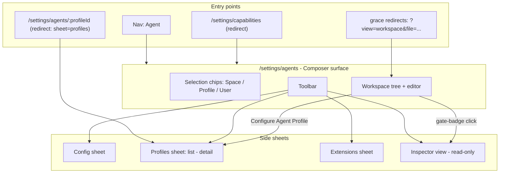
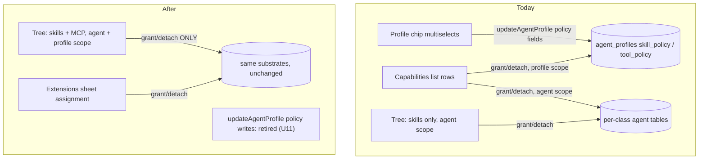
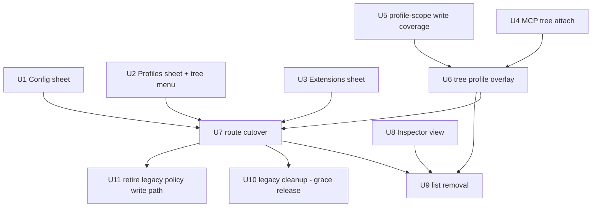

# Agent Settings Surface Merge - Plan

## Goal Capsule

- **Objective:** Settings → Agent becomes the single agent-configuration surface: the Composer page relabeled "Agent" at `/settings/agents`, absorbing the Agents page's concerns as three side sheets (Config, Profiles, Extensions), with tree-first capability management (profile-scoped writes riding the already-shipped unified mutations), a read-only Inspector diagnostics view, and the Capabilities side-sheet list removed.
- **Product authority:** Linear THINK-132 plus this Product Contract (dialogue with Eric, 2026-07-03). Governing principle: "the Composer IS the agent configuration."
- **Execution profile:** multi-PR; every landed slice must leave both live surfaces coherent (no orphaned workflows mid-rollout). Sequencing invariants are in Dependencies.
- **Stop conditions:** surface a blocker instead of guessing if a routed surface still writes `toolPolicy.mcpServers`/`skillPolicy.skillSlugs` through `updateAgentProfile` when U11 is ready to flip.
- **Tail ownership:** after the final unit merges and deploys, verify the two grace redirects still resolve, then close out Linear THINK-132.

**Product Contract preservation note** — changed from the requirements-only version: R5 reworded (render path verified — `agents/` files already reach the tree; work is a dedicated context-menu case, not new data plumbing), R8 reworded (profile shaping = unified mutations + tree overlay, chosen by Eric during planning; the unified mutations' profile-scope substrate is the existing policy JSON, so the brainstorm's no-storage-change boundary holds), R13–R15 added (profile CRUD, Inspector view, URL sheet state).

---

## Product Contract

### Summary

One operator nav entry, "Agent", at `/settings/agents`, renders the Composer surface. The old Agents page's concerns land as three side sheets — Config, Profiles, Extensions — capability management becomes tree-first for skills and MCP at both agent and profile scope, a read-only Inspector view carries diagnostics for all capability classes, and every legacy route redirects into the merged page.

### Problem Frame

Two settings pages claim the word "agent": the Agents page (identity, model, profile definitions, extension registry) and the Composer (everything else). The split is historical, not conceptual — THINK-131's plan already recorded "page demotion and nav collapse follow." Separately, the Composer's Capabilities side-sheet list now duplicates what the manipulable file tree tells: the tree carries attach/detach actions and gate badges, leaving the list as a second rendering of the same facts. Profile capability shaping is the one concern with a split write path: the chip multiselects write `toolPolicy`/`skillPolicy` JSON through `updateAgentProfile`, while the unified grant/detach mutations already write that same JSON when given AgentProfile scope.

### Key Decisions

- **Label "Agent" (singular), route stays `/settings/agents`.** Singular matches the one-platform-agent doctrine. The route keeps the KTD-6 pattern from the Composer rename: labels rename, routes don't churn. `/settings/capabilities` redirects here.
- **Three purpose-built sheets over one drill-in sheet host.** Config, Profiles, and Extensions are genuinely different concerns; each sheet stays simple, and tree/context-menu actions deep-link straight into them.
- **Capabilities side-sheet list removed; the Inspector survives read-only.** The tree is the capability view for file-shaped classes; a slim read-only Inspector view keeps all classes, gate reasons, and runtime-divergence diagnostics visible. All writes live in the tree and sheets.
- **Profile capability shaping consolidates onto the unified write path.** Selecting a profile overlays profile state on the tree; attach/detach with a profile selected fires `grantCapability`/`detachCapability` at AgentProfile scope — already implemented, already writing the profile policy JSON. The `updateAgentProfile` policy write path retires once no surface uses it.
- **Profiles stay hybrid.** `agents/<slug>.md` files in the tree carry prompt content; structured fields stay in the sheet backed by the existing `AgentProfile` data.
- **Extension trust and assignment consolidate into one Extensions sheet**, relocating everything the Agents-page extension registry does today.

Where each existing concern lands:

| Today | After the merge |
|---|---|
| Agents page: Default Agent config section | Config sheet |
| Agents page: profile editor and profile detail route | Profiles sheet (Basic + Advanced) |
| Agents page: profile capability chip multiselects | Tree with profile selected (unified mutations) |
| Agents page: scoped editor over `agents/` files | Composer tree (`agents/` files) |
| Agents page: extension trust/import registry | Extensions sheet |
| Agents page: workspace view (`?view=workspace`) | Composer tree and editor |
| Composer: Capabilities side-sheet list | Removed (tree writes + Inspector diagnostics) |
| Composer nav entry, `/settings/capabilities` | Redirect to "Agent" at `/settings/agents` |

### Requirements

**Surface and navigation**

- R1. A single operator nav entry "Agent" points at `/settings/agents` and renders the Composer surface (selection chips, tree + editor, toolbar). The separate Composer nav entry and the legacy Agents page views are removed.
- R2. `/settings/capabilities` redirects to `/settings/agents`.
- R3. Legacy deep links resolve into the merged page: `/settings/agents?view=workspace&file=...` (the target of the two live legacy redirects) opens the tree at that file, and `/settings/agents/<profileId>` opens the Profiles sheet at that profile's detail.
- R15. Sheet identity and target are URL state (deep-linkable, refresh-safe); the browser back button closes an open sheet rather than leaving the page — including when the sheet was opened by deep link.

**Config sheet**

- R4. A Config sheet carries the Default Agent settings — runtime, default Space, default model, goal token budget — with the same per-field live-save semantics as today's tenant-agent section.

**Profiles**

- R5. `agents/<slug>.md` profile files in the Composer tree get a dedicated profile treatment: a "Configure Agent Profile" context-menu item, replacing the generic agent-source treatment those files receive today. (The render path already delivers them to the tree; this is menu/affordance work, not data plumbing.)
- R6. The Profiles sheet is a list → detail editor. Detail has a Basic section — Profile (name, model, enabled, clarify-before-work, Space assignments) and Instructions (description, routing guidance, instructions) — and an Advanced accordion — Loop/Review (closed loop, mode, max iterations, review gate, external reviewer, max review loops, failure behavior), Execution (max runtime, max tokens, thinking), and the built-in-tool policy multiselect.
- R7. Right-clicking a profile file in the tree offers "Configure Agent Profile", opening the Profiles sheet at that profile's detail.
- R8. The profile editor carries no skill or MCP capability fields; those chip multiselects are removed, and profile skill/MCP shaping happens on the tree with the profile selected: profile state renders as an overlay, and attach/detach fires the unified mutations at AgentProfile scope. Space assignment (availability routing) and built-in-tool policy (not a capability-matrix class) remain structured sheet fields per R6 — the sheet is their single write surface.
- R13. Profile create and delete live in the Profiles sheet: create opens the new profile's detail in the sheet; delete keeps today's built-in-profile guard.

**Capabilities via the tree**

- R9. The tree context menu gains attach/detach parity for MCP servers; today only "Add skill…" and "Detach skill…" exist. The MCP picker's zero-servers empty state links to the MCP Servers settings page.
- R10. The Capabilities side-sheet list is removed. Depends on R9, R8's tree overlay, and R14's Inspector view existing first.

**Extensions**

- R11. An Extensions sheet consolidates the extension registry: import from GitHub, approve/reject versions, and assignment with version picker — everything the Agents-page extension registry does today.

**Inspector**

- R14. A read-only Inspector view (toolbar entry on the merged page) renders the effective capability set across all classes — including built-in tools, plugins, and context — with per-item gate reasons and runtime-divergence badges. Tree gate-badge clicks and jump-to-cause diagnostics land here. It carries no write affordances.

**Guardrails**

- R12. Assignment writes ride the unified `grantCapability`/`detachCapability` mutations on every surface — now including profile-scoped skill/MCP shaping. The tests asserting that routing move with the relocated components and extend to the profile-scope path.

### Acceptance Examples

- AE1. **Covers R2.** Given a bookmark to `/settings/capabilities`, when opened, the user lands on the Agent page at `/settings/agents`.
- AE2. **Covers R3, R15.** Given a link to `/settings/agents/<profileId>`, when opened, the merged page loads with the Profiles sheet showing that profile's detail; pressing back closes the sheet and stays on the page.
- AE3. **Covers R5, R7.** Given `agents/analyst.md` in the tree, when right-clicked and "Configure Agent Profile" is chosen, the Profiles sheet opens at the Analyst detail.
- AE4. **Covers R9, R10.** With the Capabilities list gone, when an operator uses the tree's MCP attach action and picks a server from inventory, the `mcp/<slug>/` folder appears in the tree with its gate badges. With zero registered servers, the picker shows an empty state linking to MCP Servers.
- AE5. **Covers R8, R12.** With the Analyst profile selected, when an operator detaches a skill via the tree, the write goes through `detachCapability` at AgentProfile scope and the tree overlay shows that skill excluded for Analyst — the agent-level attachment is untouched.
- AE6. **Covers R13.** When an operator creates a profile from the Profiles sheet, the sheet lands on the new profile's detail and `agents/<slug>.md` appears in the tree (sync-pending affordance acceptable).
- AE7. **Covers R14.** When an operator clicks a gate badge on a tree folder, the Inspector view opens at that capability's row showing the gate reason.

### Scope Boundaries

- No storage changes: no new tables, no data migration. The profile policy JSON (`agent_profiles.skill_policy`/`tool_policy`) remains the substrate — it is what the unified mutations already write at AgentProfile scope. The change is write-path exclusivity, not storage.
- Mobile is untouched.
- No new capability write surfaces anywhere else (single-write-surface doctrine holds).

#### Deferred to Follow-Up Work

- Drop `toolPolicy`/`skillPolicy` from `UpdateAgentProfileInput` — input fields only, after U11 has run in prod through at least one release. The underlying columns stay: they are the unified mutations' own substrate.
- Delete the two grace redirects (`settings.main-agent.tsx`, `settings.local-workspace.tsx`) and the `view`/`file` legacy params — one release after cutover (U10 covers the route files; the param contract holds until then).
- Backend removal survey for queries orphaned by the list removal — re-grep at execution; `SettingsCapabilityInspectorQuery` is NOT orphaned (the Inspector view reuses it).

### Dependencies / Assumptions

- **Sequencing invariants:** R9 and the R8 tree overlay before R10; the Extensions sheet (R11) before or with the legacy Agents-page removal (R1); `view`/`file` search-param validation preserved on `/settings/agents` in every intermediate slice until the grace redirects are deleted; the legacy `updateAgentProfile` policy write path stays honored until no routed surface writes it (U11 after U7).
- **Verified:** the rendered-workspace payload already includes `agents/<slug>.md` (blocklist-style source listing in `packages/api/src/lib/workspace-renderer/compose-tuple.ts` does not exclude `agents/`), and the tree already classifies those files as agent-source nodes. The capability matrix already permits skill and mcp_server at agent_profile scope (`packages/api/src/lib/capability-matrix.ts`); the unified mutations already write the profile policy JSON at that scope (`packages/api/src/graphql/resolvers/capabilities/capabilityAssignment.mutations.ts`); the inspector query already accepts `agentProfileId`, so the U6 overlay data path exists; runtime consumption reads the policy JSON Lambda-side (`packages/api/src/lib/resolve-agent-runtime-config.ts`).

### Sources / Research

- docs/plans/2026-07-02-001-feat-composer-capability-configuration-plan.md — THINK-131; "page demotion and nav collapse follow"; the KTD-6 route-stability decision; the tree's deliberate profile-invariance.
- docs/solutions/conventions/admin-trim-ui-preserve-backend-mutations-2026-05-13.md — split UI removal from backend removal, UI first.
- docs/solutions/workflow-issues/survey-before-applying-parent-plan-destructive-work-2026-04-24.md — re-grep every removal target at execution time.
- docs/solutions/design-patterns/audit-existing-ui-and-data-model-before-parallel-build-2026-04-28.md — sheets are relocations, not rebuilds.
- Code anchors: apps/web/src/components/settings/SettingsAgents.tsx (AgentConfigSection ~line 507, AgentProfileEditor ~line 806, extensions mount ~line 302, profile CRUD ~lines 195–237/388–399), SettingsCapabilities.tsx (sheet ~lines 974–1103, add-skill dialog + `GRANT_CLASS` map incl. `McpServer`, `focusCapabilityRow`, profile-scoped `grantScope` switching), SettingsAgentExtensions.tsx (`PiExtensionReviewSheet` ~lines 469–689 — sheet template), ComposerWorkspaceEditor.tsx (`causeOf` ~lines 181–204, `renderNode` menu ~lines 524–685, sync-pending pattern), settings-nav.tsx:118–133, routes settings.agents.index.tsx / settings.agents.$profileId.tsx / settings.capabilities.tsx / settings.main-agent.tsx / settings.local-workspace.tsx, packages/api/src/graphql/resolvers/capabilities/{workspacePreview.query.ts,capabilityAssignment.mutations.ts,capabilityInspector.query.ts}, packages/api/src/lib/{capability-matrix.ts,resolve-agent-runtime-config.ts}, packages/database-pg/graphql/types/agents.graphql (AgentProfile ~lines 216–235).

---

## Planning Contract

### Key Technical Decisions

- KTD-1. **Sheet state in URL search params.** `/settings/agents` validates `?sheet=config|profiles|extensions|inspector`, `?profile=<id>`, `?focus=<capability-row>` (Inspector row focus, mirroring the `profile=` pattern), plus the legacy `view`/`file` params. Back closes the sheet (history entry per sheet-open). **Deep-link history normalization:** when sheet params are present on initial document load (arrival via the `$profileId` redirect, a shared link, or the legacy redirects), the page replaces the history entry with the sheet-less URL and then pushes the sheet-param URL, so back closes the sheet and stays on the page. `settings.agents.$profileId.tsx` becomes a `beforeLoad` redirect to `?sheet=profiles&profile=<id>` — the existing retired-route redirect pattern. All other transient dialog state stays local `useState`.
- KTD-2. **Profile skill/MCP truth stays the policy JSON; the unified mutations are its only writers for those keys.** `grantCapability`/`detachCapability` at AgentProfile scope are already implemented and already write `agent_profiles.skill_policy.skillSlugs` / `tool_policy.mcpServers` — that JSON is the unified substrate at profile scope, not a legacy store. No data migration, no read-projection, no parity apparatus. The change is write-path exclusivity per key: the chip multiselects' `skillSlugs`/`mcpServers` writes retire (U11) once U7 unroutes the chips; `builtInTools` legitimately remains an `updateAgentProfile` write owned solely by the Profiles sheet, whose saves carry the profile's current values for every policy key the sheet doesn't own (so a sheet save can never clobber tree-written grants). The deferred drop covers only the `skillSlugs`/`mcpServers` semantics of the input fields — the columns stay.
- KTD-3. **The tree's files stay profile-invariant; profile state is an overlay.** `workspacePreview` keeps its THINK-131 profile-invariance. Selecting a profile chip overlays badges and profile-scoped actions sourced from the already-profile-aware `SettingsCapabilityInspectorQuery`. No profile-scoped render path is introduced.
- KTD-4. **Relocation over rebuild.** AgentConfigSection, the AgentProfileEditor field groups, and SettingsAgentExtensions move largely intact into sheets; `PiExtensionReviewSheet` (selection-object-driven, fixed-width) is the sheet template. New GraphQL operations append to settings-queries.ts under the existing naming convention; `pnpm --filter @thinkwork/web codegen` after each query change.
- KTD-5. **Inspector survives as read-only diagnostics.** A slim view over the existing inspector query renders all classes, gate reasons, and divergence badges. `focusCapabilityRow`-style jump-to-cause retargets here. The single-write-surface sweep tests are rewritten to assert grant/detach usage only on tree + sheets (and extended to the profile-scope path), never deleted.
- KTD-6. **Coherent-slice rollout.** Sheets and tree-write parity land while the Composer still lives at `/settings/capabilities` (both pages fully functional throughout); the route cutover is a single slice after them; demolition (list removal) follows the Inspector view and the cutover — the list safety net is removed only once the sheets and tree run in their final URL-integrated form (KTD-1); legacy file deletion waits one grace release. The legacy `updateAgentProfile` policy write path stays honored while any routed surface writes it. UI removal and backend removal never share a slice; every removal target is re-grepped at execution time.
- KTD-7. **"Open source" on agent-owned files becomes a local tree-select after cutover.** The current behavior navigates to `/settings/agents?view=workspace&file=...`, which stops existing as a distinct destination. The tree test hard-coding that navigation is rewritten deliberately as part of the cutover unit.

### High-Level Technical Design

Merged surface anatomy and entry points:

Capability write paths — consolidation, not migration:

Unit dependency order:

---

## Implementation Units

| U-ID | Title | Key files | Depends on |
|---|---|---|---|
| U1 | Config sheet | SettingsCapabilities.tsx, new AgentConfigSheet, SettingsAgents.tsx | — |
| U2 | Profiles sheet + profile tree menu | new AgentProfilesSheet, ComposerWorkspaceEditor.tsx | — |
| U3 | Extensions sheet | SettingsAgentExtensions.tsx, SettingsCapabilities.tsx | — |
| U4 | MCP tree attach/detach (agent scope) | ComposerWorkspaceEditor.tsx, SettingsCapabilities.tsx | — |
| U5 | Profile-scope unified-write coverage + chip write-surface audit | packages/api | — |
| U6 | Tree profile overlay + profile-scope writes | ComposerWorkspaceEditor.tsx, SettingsCapabilities.tsx | U4, U5 |
| U7 | Route cutover + nav | routes, settings-nav.tsx | U1, U2, U3, U6 |
| U8 | Inspector read-only view | new CapabilityInspectorView | — |
| U9 | Capabilities list removal | SettingsCapabilities.tsx | U6, U7, U8 |
| U10 | Legacy cleanup (grace release) | legacy routes, SettingsAgents.tsx | U7 + one release |
| U11 | Retire legacy profile policy write path | packages/api | U7 |

### U1. Config sheet

- **Goal:** Default Agent settings open as a side sheet on the Composer surface.
- **Requirements:** R4.
- **Dependencies:** none.
- **Files:** apps/web/src/components/settings/AgentConfigSheet.tsx (new — relocated `AgentConfigSection` body), apps/web/src/components/settings/SettingsCapabilities.tsx (toolbar entry + mount), apps/web/src/components/settings/SettingsAgents.tsx (re-mount the extracted body), apps/web/src/components/settings/AgentConfigSheet.test.tsx (new).
- **Approach:** Lift `AgentConfigSection` out of SettingsAgents.tsx into a sheet using the `PiExtensionReviewSheet` shape (fixed width, `DetailBlock`-style sections). Reuse `SettingsTenantAgentQuery`/`SettingsUpdateTenantAgentMutation` and the goal-budget query/mutation unchanged; per-field live-save carries over; an invalid in-progress budget value is discarded on close. The old page keeps its section until U7 (both mounts share the component).
- **Test scenarios:** renders all four fields from query data; each field saves through its existing mutation on change; invalid goal budget blocks save and is discarded on close; sheet opens from toolbar and closes on esc/back-overlay.
- **Verification:** on the dev stage, edits made in the sheet round-trip (reload shows new values); old Agents page shows the same values.

### U2. Profiles sheet + profile tree menu

- **Goal:** Profile list → detail editing (with create/delete) lives in a sheet; profile files in the tree open it.
- **Requirements:** R5, R6, R7, R8, R13; AE3, AE6.
- **Dependencies:** none (URL params land with U7; until then the sheet opens via local state on the capabilities route).
- **Files:** apps/web/src/components/settings/AgentProfilesSheet.tsx (new — ported `AgentProfileEditor` field groups, list, create/delete), apps/web/src/components/settings/ComposerWorkspaceEditor.tsx (discriminated `causeOf` case for `agents/<slug>.md` + "Configure Agent Profile" menu item), apps/web/src/components/settings/SettingsCapabilities.tsx (mount + wiring), apps/web/src/components/settings/AgentProfilesSheet.test.tsx (new), apps/web/src/components/settings/ComposerWorkspaceEditor.test.tsx.
- **Approach:** Detail = Basic (Profile: name, model, enabled, clarify; Instructions: description, routing guidance, instructions) + Advanced accordion (Loop/Review + Execution) — port the existing field groups and `draftToInput` mapping minus the capability chips (which stay on the old page until U7 so profile shaping is never orphaned). Create ports the default-payload mutation and lands on the new profile's sheet detail instead of navigating; delete keeps the `builtInKey` guard. New `agents/<slug>.md` files reuse the existing sync-pending tree affordance.
- **Test scenarios:** Covers AE3 — right-click `agents/analyst.md` → Configure Agent Profile opens sheet at Analyst; Covers AE6 — create lands on detail; built-in profile hides delete; Advanced accordion round-trips `executionControls` fields; Basic fields save via `updateAgentProfile`; list → detail → back-to-list navigation inside the sheet; no capability fields render in the sheet.
- **Verification:** dev-stage profile edit/create/delete round-trips; tree shows the new profile file.

### U3. Extensions sheet

- **Goal:** The extension registry (trust + assignment) opens as a sheet on the Composer surface.
- **Requirements:** R11.
- **Dependencies:** none.
- **Files:** apps/web/src/components/settings/SettingsAgentExtensions.tsx (host-agnostic mount), apps/web/src/components/settings/SettingsCapabilities.tsx (toolbar entry + sheet wrapper), apps/web/src/components/settings/SettingsAgentExtensions.test.tsx.
- **Approach:** Relocate, don't rebuild: mount the existing component (it already contains `PiExtensionReviewSheet`) inside a sheet opened from the Composer toolbar; keep its import/approve/reject/assign flows intact. Move the unified-mutation string assertions in its test file to point at the new mount; they must not be deleted.
- **Test scenarios:** sheet renders extension list with trust states; import/approve/reject flows reachable; assignment with version picker fires the unified grant mutation; the existing "routes assignment writes through the unified capability mutations" assertion passes against the relocated component.
- **Verification:** dev-stage import → approve → assign round-trip from the Composer surface.

### U4. MCP tree attach/detach (agent scope)

- **Goal:** The tree offers Add/Detach for MCP servers, matching the skill flow.
- **Requirements:** R9; AE4.
- **Dependencies:** none.
- **Files:** apps/web/src/components/settings/ComposerWorkspaceEditor.tsx (menu items on the `mcp/` root and server folders), apps/web/src/components/settings/SettingsCapabilities.tsx (add-MCP dialog mirroring the add-skill dialog; pool from inspector `mcp_server` rows), apps/web/src/components/settings/ComposerWorkspaceEditor.test.tsx.
- **Approach:** Mirror the add-skill flow exactly: root-folder gating boolean, dialog listing inactive `mcp_server` inspector items, `runMutation("attach", …)` with the already-declared `CapabilityGrantClass.McpServer`. Detach behind the same destructive confirm. Zero-servers empty state links to the MCP Servers settings page.
- **Test scenarios:** Covers AE4 — attach from picker → `mcp/<slug>/` appears (sync-pending ok) with gate badges; detach removes it; empty inventory renders the empty state with the MCP Servers link; skill flow unaffected.
- **Verification:** dev-stage attach/detach of a real MCP server from the tree; folder and badges appear without touching the Capabilities list.

### U5. Profile-scope unified-write coverage + chip write-surface audit

- **Goal:** Prove the unified mutations at AgentProfile scope cover everything the chip editor writes, and pin the post-chip home for anything they don't.
- **Requirements:** R8, R12 (backend half).
- **Dependencies:** none. Blocks U6.
- **Files:** packages/api/src/graphql/resolvers/capabilities/capabilityAssignment.mutations.ts (verify; extend only if the audit finds a gap), packages/api test suite (new round-trip and chip-parity tests).
- **Approach:** The substrate already exists — grant/detach at AgentProfile scope writes `skill_policy.skillSlugs`/`tool_policy.mcpServers`, and the matrix cells are assignable. No migration, no resolution change, no `updateAgentProfile` change in this unit (the legacy write path stays honored until U11). Work: (a) round-trip tests for skill and mcp_server at AgentProfile scope, including detach-of-absent-slug noop; (b) chip-parity tests asserting the unified mutation produces the same policy JSON the chip editor produces for the same action; (c) the write-surface audit resolving the Open Question — enumerate everything `draftToInput` writes (skillSlugs, mcpServers, builtInTools, spaceAssignments) and pin the post-chip home for built-in-tool policy and space assignments.
- **Execution note:** the audit's outcome amends this plan's Open Question in place before U7 starts; if it requires a product decision (a new Profiles-sheet field vs deferral), surface it to Eric rather than choosing silently.
- **Test scenarios:** grant + detach at AgentProfile scope for skill and mcp_server round-trip; detach of an absent slug is a noop; chip-parity: unified mutation output JSON equals chip-editor output for identical actions; empty-allowlist vs absent-policy semantics documented by a test that pins current runtime behavior.
- **Verification:** `pnpm --filter @thinkwork/api test` green; Open Question resolved and recorded.

### U6. Tree profile overlay + profile-scope writes

- **Goal:** Selecting a profile overlays profile state on the tree; attach/detach fires unified mutations at profile scope.
- **Requirements:** R8, R12 (UI half); AE5.
- **Dependencies:** U4, U5.
- **Files:** apps/web/src/components/settings/ComposerWorkspaceEditor.tsx (overlay badges + profile-aware menu labels), apps/web/src/components/settings/SettingsCapabilities.tsx (re-enable attach under profile selection; overlay data from the inspector query), apps/web/src/components/settings/ComposerWorkspaceEditor.test.tsx.
- **Approach:** The tree's file set stays profile-invariant (KTD-3); the overlay decorates existing skill/MCP nodes with the selected profile's inspector state (attached-for-profile, blocked, gated). Remove the `!agentProfileId` gates on add-skill/attach — the mutation host already switches `grantScope` to profile scope when a profile chip is selected. Menu labels disambiguate ("Detach for profile <name>" vs agent-level detach). Confirm the empty-vs-absent allowlist semantics pinned by U5's test before shipping the overlay (an operator detaching a profile's last allowed skill must see the outcome the runtime actually produces).
- **Test scenarios:** Covers AE5 — profile-scoped detach leaves the agent-level grant intact and updates only the overlay; attach under profile selection sends AgentProfile scope in the mutation payload; overlay badges match inspector rows for the selected profile; detaching the last allowlisted skill renders the state the runtime semantics dictate (per U5's pinned behavior); no profile selected → agent-scope behavior unchanged.
- **Verification:** dev-stage: shape a profile's skills from the tree; confirm via the Inspector view and a fresh reload that agent-level state is untouched.

### U7. Route cutover + nav

- **Goal:** `/settings/agents` IS the Composer surface; one nav entry; every legacy link resolves.
- **Requirements:** R1, R2, R3, R15; AE1, AE2.
- **Dependencies:** U1, U2, U3, U6.
- **Files:** apps/web/src/routes/_authed/settings.agents.index.tsx (render Composer; `validateSearch` for `sheet`/`profile`/`focus` + legacy `view`/`file`), apps/web/src/routes/_authed/settings.capabilities.tsx (redirect, replacing the page), apps/web/src/routes/_authed/settings.agents.$profileId.tsx (redirect to `?sheet=profiles&profile=<id>`), apps/web/src/components/settings/settings-nav.tsx (label "Agent"; Composer entry removed), apps/web/src/components/settings/SettingsCapabilities.tsx (sheet-state ↔ URL bridge incl. deep-link history normalization), apps/web/src/components/settings/ComposerWorkspaceEditor.tsx + ComposerWorkspaceEditor.test.tsx (agent-file "Open source" becomes local tree-select — deliberate rewrite of the hard-coded navigation test), apps/web/src/components/settings/SettingsAgents.test.tsx (retire/replace assertions about the removed views).
- **Approach:** KTD-1 URL bridge: sheet open-state reads/writes search params, with the deep-link history normalization step (replace with sheet-less URL, push sheet params) so back closes the sheet on deep-link arrival; `view=workspace&file=` is reinterpreted as "select this file in the tree" (no `file` param defaults to AGENTS.md, matching today's behavior) so the two live grace redirects keep working untouched. The Agents page component stops being routed (file deletion waits for U10); the chip multiselects stop being reachable here, which is what unblocks U11. Route-tree regen is automatic via the Vite plugin.
- **Test scenarios:** Covers AE1 — capabilities URL redirects; Covers AE2 — profileId URL opens Profiles sheet at detail, back closes sheet and stays on the page (deep-link normalization case); `?view=workspace&file=skills/x/SKILL.md` selects that file in the tree; `?view=workspace` with no file selects AGENTS.md; `?sheet=config|extensions` opens the right sheet; `?sheet=inspector&focus=<row>` opens the Inspector at that row, refresh-safe; unknown params are stripped safely; nav shows exactly one "Agent" entry.
- **Verification:** dev-stage click-through of all four entry-point classes (nav, capabilities redirect, profile deep link, legacy view/file link); Eric's visual pass on the merged page before merge.

### U8. Inspector read-only view

- **Goal:** Diagnostics for all capability classes survive the list removal, read-only.
- **Requirements:** R14; AE7.
- **Dependencies:** none (must precede U9).
- **Files:** apps/web/src/components/settings/CapabilityInspectorView.tsx (new — slim rendering over `SettingsCapabilityInspectorQuery`), apps/web/src/components/settings/SettingsCapabilities.tsx (toolbar entry; gate-badge click + jump-to-cause retarget), apps/web/src/components/settings/CapabilityInspectorView.test.tsx (new).
- **Approach:** Reuse the list's row rendering (class tabs, gate-reason text, divergence badges) minus every write affordance (no attach/detach buttons). `focusCapabilityRow` retargets here so tree gate-badge clicks and diagnose flows land on the right row; the focused row is addressable via `?sheet=inspector&focus=<row>` once U7's URL bridge lands. Selection chips (space/profile/user) drive it exactly as they drive the list today.
- **Test scenarios:** Covers AE7 — gate-badge click opens the view focused on that row; all seven classes render; divergence badge shows for a `missing_in_observed` item; focused-row rendering from a `focus` value; no mutation is imported by the view (sweep assertion).
- **Verification:** dev-stage: gate reason and divergence rendering match the pre-removal list for the same selection.

### U9. Capabilities list removal

- **Goal:** The Capabilities side-sheet list is gone; the tree, sheets, and Inspector carry everything it did.
- **Requirements:** R10.
- **Dependencies:** U6, U7, U8 (the cutover gate ensures the list safety net is removed only after the sheets and tree run in their final URL-integrated form — KTD-6).
- **Files:** apps/web/src/components/settings/SettingsCapabilities.tsx (remove the list sheet; keep the add-skill/add-MCP dialogs and footer divergence summary), apps/web/src/components/settings/SettingsAgents.test.tsx / SettingsAgentExtensions.test.tsx / new sweep assertions (grant/detach mutations appear only in tree-host + sheet + backend code).
- **Approach:** Removal is UI-only (backend queries stay; the Inspector reuses the inspector query). Re-grep every symbol slated for deletion across web, mobile, CLI, and API before deleting (survey-before-destructive-work convention). Rewrite the single-write-surface sweep test to enumerate the allowed call sites.
- **Execution note:** treat this unit's deletion list as provisional until the re-grep at execution time confirms each target is dead.
- **Test scenarios:** sweep test enumerates allowed grant/detach call sites and fails on any new one; add-skill and add-MCP dialogs still function without the list; footer divergence summary still renders.
- **Verification:** dev-stage: no regression in attach/detach/diagnose flows with the list gone.

### U10. Legacy cleanup (grace release)

- **Goal:** Dead routes and the retired Agents page component are deleted after one release of redirect grace.
- **Requirements:** R1 (tail), Scope Boundaries deferred items stay deferred.
- **Dependencies:** U7 deployed at least one release earlier.
- **Files:** apps/web/src/routes/_authed/settings.main-agent.tsx, settings.local-workspace.tsx (delete), settings.agents.index.tsx (drop `view`/`file` legacy params), apps/web/src/components/settings/SettingsAgents.tsx (delete along with SettingsAgentProfileDetail and the now-unmounted sections), apps/web/src/lib/settings-queries.ts (prune queries orphaned by the deletion — re-grep first).
- **Approach:** UI-only deletion slice per the trim convention; the deferred backend items (input-field pruning) stay in Scope Boundaries, not here.
- **Test scenarios:** Test expectation: none beyond compile/sweep — this unit removes code; the existing suites passing post-deletion is the signal.
- **Verification:** `pnpm --filter @thinkwork/web test` and `typecheck` green after deletion; grep confirms no imports of the deleted modules; deployed dev still resolves all entry points.

### U11. Retire legacy profile policy write path

- **Goal:** `updateAgentProfile` stops honoring `skillPolicy.skillSlugs` and `toolPolicy.mcpServers` writes; the unified mutations become those keys' only writers. `builtInTools` stays sheet-written by design (merge, never replace, so it cannot clobber the tree-owned keys).
- **Requirements:** R12 (write-path exclusivity tail).
- **Dependencies:** U7 (the chip multiselects must be unrouted first — while they are live, the legacy path must keep working; KTD-6).
- **Files:** packages/api/src/graphql/resolvers (updateAgentProfile resolver: policy fields become accepted-but-ignored), packages/api test suite.
- **Approach:** Re-grep for remaining `updateAgentProfile` callers that pass policy fields before flipping (survey convention); web chips are unrouted by U7, so the expected caller set is empty. Input fields remain in the schema (deferred drop covers them) but no longer mutate the columns.
- **Test scenarios:** updateAgentProfile with policy fields leaves `skill_policy`/`tool_policy` untouched; non-policy profile fields still save; unified profile-scope grant/detach unaffected.
- **Verification:** `pnpm --filter @thinkwork/api test` green; re-grep shows no routed surface passing policy fields.

---

## Verification Contract

| Gate | Command | Applies to |
|---|---|---|
| Web unit/RTL tests | `pnpm --filter @thinkwork/web test` | all web units |
| Web types | `pnpm --filter @thinkwork/web typecheck` | all web units (vitest green ≠ tsc green) |
| Web codegen fresh | `pnpm --filter @thinkwork/web codegen` (commit output) | any unit touching settings-queries.ts |
| API tests | `pnpm --filter @thinkwork/api test` | U5, U11 |
| Format | `pnpm format:check` | all |
| Live validation | Eric's visual pass on the dev web app for each UI slice before its PR merges; post-merge `gh run list --branch main` watch | U1–U4, U6–U9 |

Write-coverage proof: U5's chip-parity and round-trip tests must be green before U6 merges; U11 lands only after U7 has deployed with the chips unrouted.

## Definition of Done

- All requirements R1–R15 observable on the dev stage; AE1–AE7 pass as manual click-throughs.
- Every entry-point class resolves: nav, `/settings/capabilities`, `/settings/agents/<profileId>`, and the two grace redirects' `?view=workspace&file=` links (including the no-file default).
- The single-write-surface sweep test enumerates tree + sheets (+ backend) as the only grant/detach call sites and is green.
- Space assignments and built-in-tool policy are editable in the shipped Profiles sheet (their post-chip home, decided 2026-07-03) before U7 unroutes the chips.
- Profile-scope writes ride the unified mutations everywhere; the legacy `updateAgentProfile` policy write path retired (U11) only after no routed surface used it.
- Each unit landed as its own PR (or a coherent grouping), squash-merged with branches deleted and worktrees cleaned; post-merge Deploy runs watched to green.
- No dead-end or experimental code left in the final state; U10's deletions leave zero imports of removed modules.
- Linear THINK-132 closed with a pointer to this plan.
