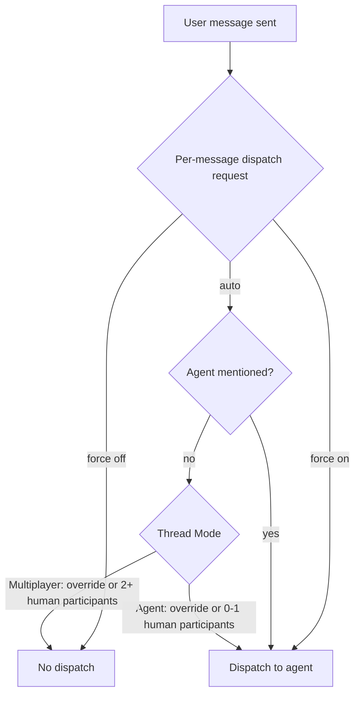
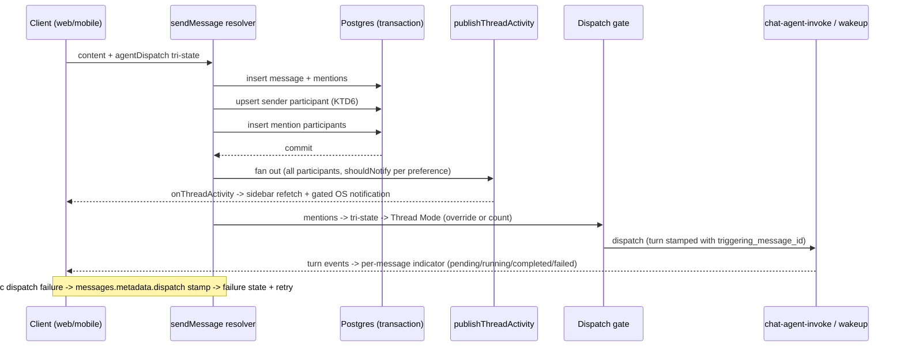
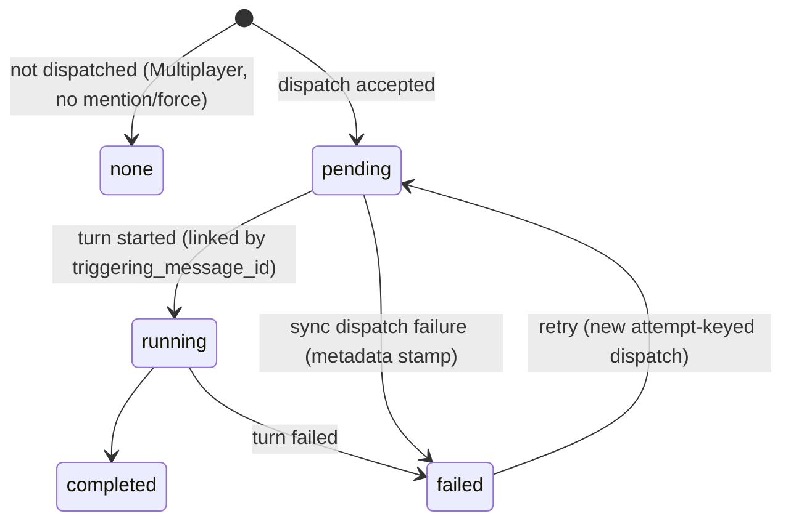

# Multiplayer Thread Reliability - Plan

## Goal Capsule

- **Objective:** Make multiplayer Spaces threads solid: mentioned users reliably discover and get notified about threads, Thread Mode (Agent vs Multiplayer) derives from server truth with a per-thread override, and agent dispatch is always visible — never a silent drop.
- **Authority:** Linear THINK-136 → this plan's Product Contract → Planning Contract → per-unit guidance. Repo conventions (CLAUDE.md) override plan details where they conflict.
- **Execution profile:** Code changes across `packages/database-pg`, `packages/api`, `apps/web`; one journaled schema migration plus a data backfill; GraphQL contract changes require codegen in web/cli/mobile. Dev stage is continuous-CD from main — verification of live behavior happens on dev after merge.
- **Stop conditions:** Surface (don't guess) if the backfill's participant derivation looks lossy for a class of threads, if legacy-client dispatch behavior would regress in a way not covered by KTD2, or if the turns-table link (KTD3) conflicts with the parallel `spaces.*` rearchitecture workstream.
- **Open blockers:** None. Remaining open questions are deferred to implementation.

**Product Contract preservation:** changed — R10 amended (mention punches through mute; the activity event always delivers, preference gates only the notification), R13–R14 added (posting joins you as a participant + backfill; non-space threads get participant substrate), AE4 amended and AE6 added. All changes follow from the confirmed plan-time scoping decisions; original R1–R12 intent is preserved.

---

## Product Contract

### Summary

Harden multiplayer threads on three pillars: (1) wire the existing-but-uncalled per-user activity fan-out into message send so mentions produce desktop notifications and live sidebar visibility, (2) derive Thread Mode (Agent vs Multiplayer) server-side from thread participants with an explicit per-thread override in the thread info panel, and (3) surface agent-dispatch state per message, including failures. Per-sender workspace/memory injection stays as designed, made identical across all dispatch paths.

### Problem Frame

Spaces threads support multiple humans plus an agent, with agent dispatch gated on mentions once a second human is present. Three flakiness symptoms show up in practice: messages that silently never reach the agent, mentioned users who never get notified, and mentioned users who never discover the thread they were pulled into.

Investigation confirmed concrete causes. The per-user fan-out helper `publishThreadActivity` (`packages/api/src/lib/threads/publish-thread-activity.ts`) was built, tested, and documented with a "callers MUST invoke" warning — but has zero production callers, so the desktop notification pipeline and any live per-user sidebar update subscribe to a stream nothing publishes. The single-vs-multiplayer classification lives only in the web client (`apps/web/src/lib/agent-mode.ts`) with a documented blind spot (a mentioned-but-not-yet-replied user is not detected), and the server trusts the client-sent flag without ever counting participants. Agent-mention dispatch failures are swallowed with a `console.warn`. Reply-joiners never get participant rows, so the participants table is not yet the truth the mode derivation needs.

### Key Decisions

- **Thread Mode is server-derived from participants, with an explicit override.** Zero or one human participant → Agent mode (auto-dispatch); two or more → Multiplayer (agent must be mentioned or explicitly requested). A user can set the mode from the thread info panel; the override is per-thread (applies to all participants), sticky, and wins over the derived default.
- **Multiplayer triggers on participation, not first reply.** A user @mentioned into a thread counts immediately; a user who posts in a thread becomes a participant at that moment (R13). The override covers the FYI-mention case.
- **A mention is a thread-level invite.** Mentioning a user adds them as a thread participant and grants visibility to that one thread (shipped predicate behavior); this round adds the missing discovery signal.
- **Fix the existing fan-out pipe rather than build new notification infrastructure.** Desktop native and web in-app ship now; mobile push and email ride the same per-user event later (push-token infra already exists in `packages/api/src/lib/push-notifications.ts`).
- **Dispatch state is visible: feedback plus failures.** Every user message shows whether the agent was engaged, and dispatch failures surface in the thread instead of a silent log line.
- **The mode flip is one-way by default.** Gaining a second participant permanently derives Multiplayer; no participant-removal flow this round — the explicit override restores Agent mode when wanted.

### Actors

- A1. Message sender — a human posting in a thread; their workspace and memory bank contextualize any agent turn their message triggers.
- A2. Mentioned user — a human @mentioned into a thread; becomes a participant and must discover and be notified of it.
- A3. Thread participant — any other human already in the thread; receives activity per their notification preference.
- A4. Platform agent — the tenant agent that responds when dispatched.

### Requirements

**Mode and dispatch gating**

- R1. Thread Mode is derived from server-known participant truth: zero or one human participant → Agent mode (messages auto-dispatch); two or more → Multiplayer (dispatch requires an agent mention or an explicit per-message request). Every client and the server present and act on the same mode.
- R2. A user @mentioned in a thread becomes a participant at that moment and counts toward Multiplayer derivation, before they ever reply.
- R3. A participant can explicitly set the Thread Mode (Agent or Multiplayer) from the thread info panel; the setting is per-thread, applies to all participants, persists, and overrides the derived default until changed.
- R4. Whether a message dispatches to the agent is decided from server-known state (participants, override, per-message request); a client cannot cause wrong dispatch behavior by misclassifying the thread.
- R5. Agent mentions dispatch in any mode unless the sender's per-message toggle explicitly forces dispatch off for that message (the explicit tri-state FORCE_OFF); the toggle can likewise force dispatch on. Legacy clients' boolean toggle never gated mention dispatch and keeps that mention-wins behavior until they adopt the tri-state.
- R13. A human who posts a message in a thread becomes a thread participant in the same transaction. A one-time backfill derives participant rows for existing threads from their distinct human message senders, so mode derivation does not misclassify already-multiplayer threads at ship time.
- R14. Mention-created participation works in threads without a Space; a mention in a non-space thread creates the participant row and fires the same discovery signal.

**Dispatch visibility**

- R6. Every user message visibly indicates whether it engaged the agent, reflecting the real turn lifecycle (pending, running, completed, failed) — not a timestamp guess.
- R7. A dispatch failure — synchronous (invoke rejected) or asynchronous (the agent turn fails after acceptance) — surfaces in the thread as a visible failure state on the affected message, and the sender can retry; failures are never only logged.

**Notifications and discovery**

- R8. When a user is mentioned, a per-user activity event reaches them: a native desktop notification when the desktop app is running, and live appearance of the thread (with unread state) in their web sidebar without a reload.
- R9. New messages in a thread deliver the per-user activity event to all other human participants, so unread and sidebar state stay live for everyone in the thread — regardless of notification preference.
- R10. The notification decision honors each participant's preference: subscribed → notify on all thread activity; mentions → notify only when that user is mentioned; muted → no notifications, except a direct @mention of that user, which punches through. The activity event itself always delivers (R9); the preference gates only the notification.
- R11. The fan-out for a message includes any user first mentioned by that same message — a freshly-tagged user never misses the event that would tell them the thread exists.

**Per-sender context injection**

- R12. Every dispatch path (auto-send, agent mention, agent-icon click, wakeup fallback) resolves the triggering sender identically, so the agent turn always uses that sender's workspace and memory bank.

### Key Flows

- F1. Solo user loops in a colleague
  - **Trigger:** A1 @mentions A2 in a previously single-player thread.
  - **Steps:** A2 becomes a participant; thread derives Multiplayer; A1's subsequent messages no longer auto-dispatch; the info panel shows the mode and lets A1 override back to Agent mode.
  - **Covers:** R1, R2, R3.
- F2. Mentioned user discovers the thread
  - **Trigger:** The message mentioning A2 commits.
  - **Steps:** A2 receives a desktop notification (if the desktop app is running) and the thread appears live with unread state in A2's sidebar; opening it works even in a private Space A2 isn't a member of.
  - **Covers:** R8, R10, R11.
- F3. Agent engaged in a multiplayer thread
  - **Trigger:** A1 mentions the agent (or uses the per-message toggle) in a Multiplayer thread.
  - **Steps:** The message dispatches with A1's workspace and memory; the message shows a dispatched indicator that follows the turn to completed or failed; on failure A1 retries.
  - **Covers:** R5, R6, R7, R12.
- F4. Reply-joiner
  - **Trigger:** A3 (a space member never mentioned) replies in A1's thread.
  - **Steps:** A3 becomes a participant; the thread derives Multiplayer; A3 receives subsequent activity events and unread state like any participant.
  - **Covers:** R1, R9, R13.

### Acceptance Examples

- AE1. **Covers R1, R2.** Given a thread where Alice is the only human, when Alice @mentions Bob (who never replies), then the thread is Multiplayer and Alice's next un-mentioned message does not dispatch to the agent.
- AE2. **Covers R3.** Given that thread, when Alice sets Mode: Agent in the thread info panel, then her subsequent messages auto-dispatch again even though Bob remains a participant — and each dispatched turn uses its sender's own workspace and memory, including Bob's if he posts.
- AE3. **Covers R8, R11.** Given Bob has never seen the thread, when the message mentioning him commits, then Bob's desktop shows a notification and the thread appears unread in his web sidebar without a reload.
- AE4. **Covers R9, R10.** Given Carol is a participant with preference muted, when new messages arrive, then Carol's sidebar unread state still updates live but she receives no notifications; with preference mentions, she is notified only by messages that mention her.
- AE5. **Covers R6, R7.** Given the agent-dispatch call fails server-side, when Alice sends an agent mention, then the message shows a visible failure state (not a silent drop) and Alice can retry — and the retry actually re-dispatches rather than no-oping on the original idempotency key.
- AE6. **Covers R10.** Given Carol's preference is muted, when a message directly @mentions Carol, then Carol is notified (the mention punches through the mute).
- AE7. **Covers R13.** Given a pre-existing thread where Bob joined by replying (never mentioned), when this feature ships and the backfill runs, then the thread derives Multiplayer and Bob receives activity events for new messages.

### Scope Boundaries

Deferred for later:

- Mobile push and email delivery for mentions — follow-on senders on the same per-user event.
- Mobile mode UI and per-message indicator — mobile keeps working, governed by the new server gate (see KTD2 legacy-client mapping).
- Participant removal / leaving a thread (the mode override covers the return-to-Agent-mode need).
- Mention UX or parsing changes.
- Any change to the `spaces.*` schema (owned by a separate workstream) or to space membership semantics.
- Shared/space-level memory semantics — per-sender injection is the committed model.

Deferred to Follow-Up Work:

- Per-user authorization on the `onThreadActivity(userId)` subscription — verified exposure: the field is authorized `@aws_api_key @aws_cognito_user_pools @aws_iam` (see `terraform/schema.graphql`) and `userId` is not tenant-scoped, so cross-tenant Cognito users and shared-API-key holders can subscribe to any user's stream. U1 first puts thread titles and message snippets on it. The hardening follow-up — remove `@aws_api_key` from the field and enforce caller==userId (or tenant-scoped filtering) — must be filed and linked before U1 merges.
- Notification snippet redaction (OS notification bodies expose message content on lock screens).
- Shared payload-builder extraction across the two dispatch builders (the acknowledged "real fix" for the recurring parity bug) — do it in this round only if U8 finds a confirmed gap that makes it cheap.

### Dependencies / Assumptions

- The desktop notification pipeline (web hook → desktop bridge → native notification) is complete and only lacks a publisher — verified in code.
- The AppSync/Terraform wiring for `notifyThreadActivity`/`onThreadActivity` already exists (`terraform/modules/app/appsync-subscriptions/main.tf` lists it in `notification_mutations`) — no new subscription infrastructure is needed; only payload fields change.
- The thread visibility predicate already grants mentioned participants access to threads in private Spaces they don't belong to; this round adds discovery, not access.
- The mode override is per-thread and shared by all participants (not a per-user preference), last-write-wins on concurrent changes.
- Success criteria below are extrapolated from the dialogue, not separately confirmed.

### Success Criteria

- Every mention produces a notification and a live sidebar appearance for the mentioned user, on desktop and web.
- Every user message makes its dispatch outcome visible; dispatch failures are user-visible and retryable — zero silent drops.
- Thread Mode shown in any client always matches what the server will do with the next message.

---

## Planning Contract

### Key Technical Decisions

- **KTD1 — Thread Mode = derived GraphQL field + one nullable override column; no new subscription.** Add `mode_override` (nullable `text`, CHECK in `('agent','multiplayer')`) to `threads` via the journaled drizzle flow (`db:generate` → `drizzle/0201_*.sql`; drizzle emits CHECKs — see `thread-participants.ts:85-100` precedent). Expose a derived `Thread.mode` field (resolver counts human participants, applies override) plus `Thread.modeOverride`. Clients read mode from the Thread queries they already run and refresh via the existing `notifyThreadUpdate` → `ChatSidebar` refetch loop. Rationale: reuses the tenant-scoped event per the docs/solutions prevention rule ("prefer reusing existing events over new subscription fields"); no `schema:build` needed for this pillar.
- **KTD2 — Per-message dispatch request becomes an explicit tri-state.** Add `agentDispatch: FORCE_ON | FORCE_OFF | AUTO` to `SendMessageInput`; the server gate (`sendMessage.agent-handling.ts`) decides in precedence order FORCE_OFF → agent mentions → FORCE_ON → AUTO (Thread Mode: override, else human participant count). Legacy boolean mapping preserves today's behavior in both directions for not-yet-updated clients: explicit `true` → FORCE_ON, `false` → FORCE_OFF, absent → AUTO — mobile sends explicit booleans, so an explicit ON keeps dispatching and mobile bypasses the Multiplayer gate until its client adopts the tri-state. `SendMessageInput` also already carries `dispatchMode: MessageDispatchMode` (`MANAGED_DEFAULT`), passed into the gate input at three call sites but never consumed by the gate predicates — `agentDispatch` is a separate field rather than an extension of `MessageDispatchMode` to leave those reserved semantics untouched; U4 defines the interaction (`agentDispatch` governs; `dispatchMode` passes through unchanged or is consciously retired). The mention-carrying transition message counts its own just-inserted mention participants, so a solo user's message that @mentions a second human already derives Multiplayer and does not auto-dispatch (consistent with R2). Rationale: the same wire field currently means both "my client's mode guess" and "explicit toggle"; the tri-state disambiguates without breaking old clients. Updated web composers send the tri-state and stop sending the legacy boolean.
- **KTD3 — Dispatch indicator = durable turn→triggering-message link.** Add a nullable `triggering_message_id` column to the thread-turns table (journaled migration), stamped by both dispatch paths (direct invoke via `chat-agent-invoke`, wakeup via the wakeup processor — parity rule applies, see KTD5). The web UI pairs turns to messages by this id, falling back to today's timestamp pairing for legacy turns. Failure states: synchronous dispatch failure (invoke rejected AND wakeup enqueue failed) is stamped on `messages.metadata.dispatch` by `sendMessage` and pushed via the existing message-update event; asynchronous failure is the turn's existing `failed` status, now correctly attributed via the link. Rationale: fixes the known "Working…" mis-attribution (the durable fix the codebase itself calls for in `TaskThreadView.tsx`'s causal-pairing residual note) and makes R6/R7 truthful about the async lifecycle.
- **KTD4 — Retry mints a new idempotency key.** Both wakeup builders key on `messageId` (`agent-default:${tenantId}:${messageId}:${agentId}`), and `enqueueDefaultAgentWakeup` no-ops on key match — a naive retry would silently do nothing. Retry appends an attempt counter to the key after marking the prior dispatch failed.
- **KTD5 — Fan-out splits event delivery from the notification decision.** `publishThreadActivity` always fans the event to all user participants except the author (sidebar liveness, R9); the payload gains `mentioned: Boolean` and `shouldNotify: Boolean` fields computed server-side from `notification_preference` + the message's mentioned-user set (muted → false unless mentioned; mentions → mentioned only; subscribed → true). Clients always use the event for sidebar refetch; the OS-notification path is gated on `shouldNotify` (plus the desktop bridge). `ThreadActivityEvent` field additions touch `packages/database-pg/graphql/types/subscriptions.graphql` → run `pnpm schema:build` to regenerate `terraform/schema.graphql`. This is the first-ever reader of `notification_preference`; `selectThreadParticipantUserIds` extends to return it.
- **KTD6 — Participants become server truth: sender upsert + backfill.** `sendMessage` upserts the human sender as a participant inside the message transaction (`onConflictDoNothing`, source `sender`); `createThread` already seeds the creator. A one-time backfill inserts participant rows for existing space threads from distinct human message senders. Non-space threads (R14) get participant rows too — `thread_participants.space_id` becomes nullable (drop NOT NULL via U2's generated migration; non-space rows carry null), since `buildMentionParticipantRows` currently returns `[]` without a space.
- **KTD7 — Sender parity is verified before it is "fixed".** `resolveChatInvokeIdentity` resolves identity from the message row (`loadMessageSender`), so the direct-invoke payload's missing sender field may be harmless. U8 proves it empirically with parity tests (including the resume turn — first-turn E2E always passes per the recurring-bug writeup) before adding fields to both builders.

### High-Level Technical Design

Message-send pipeline after this plan (both call sites: `sendMessage` and `createThread`'s first-message path):

Dispatch-indicator states (per user message):

### Assumptions

- `Thread.participants` data needed for derivation is loadable in the send path without a new query pattern — the resolver inserts participants pre-dispatch, but the dispatch gate runs post-commit, so the count is plumbed out of the transaction or re-queried after commit.
- The backfill can run as a migration against dev/prod within the normal deploy window (bounded by messages-table scan per space thread).
- Adding `triggering_message_id` to the turns table does not collide with the parallel `spaces.*` rearchitecture workstream (turns are not `spaces.*`-owned) — stop and surface if implementation finds otherwise.

---

## Implementation Units

### U1. Wire the per-user activity fan-out with preference-aware payload

- **Goal:** Mentions and thread activity actually reach participants: `publishThreadActivity` called from both message write paths, payload carries `mentioned`/`shouldNotify`.
- **Requirements:** R8, R9, R10, R11, R14 (fan-out half); AE3, AE4, AE6.
- **Dependencies:** None.
- **Files:** `packages/api/src/lib/threads/publish-thread-activity.ts`, `packages/api/src/lib/threads/thread-participants-query.ts`, `packages/api/src/graphql/notify.ts`, `packages/api/src/graphql/resolvers/messages/sendMessage.mutation.ts`, `packages/api/src/graphql/resolvers/threads/createThread.mutation.ts`, `packages/database-pg/graphql/types/subscriptions.graphql`, `terraform/schema.graphql` (generated), tests: `packages/api/src/lib/threads/publish-thread-activity.test.ts`, `packages/api/src/graphql/resolvers/messages/sendMessage.mentions.test.ts`.
- **Approach:** Extend `selectThreadParticipantUserIds` to return `{userId, notificationPreference}`; `publishThreadActivity` gains the mentioned-user-id set as a parameter and computes `shouldNotify` per KTD5. Call it post-commit in `sendMessage` (participants insert at lines 254–289 already precedes it — KTD5 ordering holds) and in `createThread`'s first-message mention path, where the known notify-before-participant-insert race must be fixed by ordering the call after the participant insert commits. Add the two payload fields to `ThreadActivityEvent` and run `pnpm schema:build`.
- **Patterns:** `notifyNewMessage`/`notifyThreadUpdate` call-site placement in `sendMessage.mutation.ts:473-544`; best-effort never-throw contract already in `publish-thread-activity.ts`.
- **Test scenarios:**
  - Happy: message in a 3-participant thread fans to the 2 non-authors with `shouldNotify: true` (subscribed).
  - Covers AE4: muted participant receives the event with `shouldNotify: false`; mentions-preference participant gets `shouldNotify: true` only when mentioned.
  - Covers AE6: muted participant who is directly mentioned gets `shouldNotify: true`.
  - Covers AE3 (server half): user first mentioned by this message is included in the fan-out of that same message (KTD5-comment regression case).
  - Edge: author excluded; agent participants excluded; fan-out failure does not fail the mutation.
  - Integration: `createThread` first-message mention fires fan-out after participant rows exist.
- **Verification:** Extended tests green; on dev, mentioning a user produces an `onThreadActivity` event observable from a subscribed client.

### U2. Participants become server truth: sender upsert, non-space support, backfill

- **Goal:** The participants table reflects everyone actually in a thread, so derivation (U3) is truthful.
- **Requirements:** R13, R14; AE7.
- **Dependencies:** None (schema-level; U3 consumes it).
- **Files:** `packages/database-pg/src/schema/thread-participants.ts`, new `packages/database-pg/drizzle/02NN_*.sql` (generated + backfill), `packages/api/src/graphql/resolvers/messages/sendMessage.mutation.ts`, `packages/api/src/lib/mentions/thread-participant-mentions.ts`, tests: `packages/api/src/graphql/resolvers/messages/sendMessage.mentions.test.ts`.
- **Approach:** Upsert the human sender as a participant (source `sender`, `onConflictDoNothing`) inside the `sendMessage` transaction alongside `markSenderParticipantRead`. Make `space_id` nullable (drop NOT NULL via the generated migration; non-space rows carry null) so `buildMentionParticipantRows` stops returning `[]` for non-space threads. Backfill: insert participant rows for existing threads from distinct human message senders.
- **Execution note:** The backfill is a data migration with no `-- creates:` object for the drift reporter to verify — ship it as an idempotent hand-rolled SQL file plus an explicit deploy.yml apply step (precedent: the `Backfill agents.runtime flue to pi` step applying `drizzle/0126_migrate_flue_to_pi.sql` with `ON_ERROR_STOP` and `--single-transaction`), so every stage — dev, prod, customer — receives it before or atomically with the deploy that activates U3's mode derivation. `psql -f` to dev pre-merge remains the verification pass. Keep destructive changes out entirely.
- **Test scenarios:**
  - Happy: sender without a participant row gets one in the same transaction; existing participant is a no-op.
  - Edge: agent/system senders (`senderType !== "user"`) never get rows; non-space thread mention creates a participant row with null space.
  - Covers AE7: backfill on a fixture thread with two distinct human senders yields two participant rows (assert via backfill SQL against a test database or predicate-render guard if no DB in CI).
- **Verification:** `pnpm --filter @thinkwork/api test` green; migration applies cleanly to dev; drift reporter passes.

### U3. Thread Mode: override column, derived field, mutation

- **Goal:** Server-authoritative Thread Mode readable by every client, settable from the info panel.
- **Requirements:** R1, R2, R3; AE1 (derivation), AE2 (override).
- **Dependencies:** U2.
- **Files:** `packages/database-pg/src/schema/threads.ts`, generated `drizzle/02NN_*.sql`, `packages/database-pg/graphql/types/threads.graphql`, `packages/api/src/graphql/utils.ts` (`threadToCamel`), `packages/api/src/graphql/resolvers/threads/updateThread.mutation.ts`, new `packages/api/src/lib/threads/thread-mode.ts` + `thread-mode.test.ts`, codegen outputs in `apps/web`, `apps/cli`, `apps/mobile`.
- **Approach:** Add nullable `mode_override` with CHECK per KTD1. New pure derivation helper (`deriveThreadMode(humanParticipantCount, override)`) with a test table mirroring `apps/web/src/lib/agent-mode.test.ts` cases plus the zero-participant branch. Expose `Thread.mode` (derived) and `Thread.modeOverride`; add `modeOverride` to `UpdateThreadInput` handled in `updateThread`, which already fires `notifyThreadUpdate` — mode changes ride that event to all clients. `updateThread`'s general field-update path has no auth checks today: when `modeOverride` is present, verify the caller explicitly — tenant match on the thread row plus a `thread_participants` (`participant_type` 'user') row for the caller — throwing NOT_FOUND on tenant mismatch and FORBIDDEN for non-participants, reusing the tenant-check + participant-lookup pattern in `applyCallerReadState` in the same file. GraphQL enum `ThreadMode { AGENT MULTIPLAYER }` SCREAMING_CASE, lowercased in the resolver per house style. Batch all GraphQL contract changes in this plan (U1 + U3 + U4 + U6 field additions) before running codegen once per consumer.
- **Patterns:** `updateThread.mutation.ts` auth + notify shape; `markThreadsRead.mutation.ts` for the thin-mutation alternative if `UpdateThreadInput` grows awkward.
- **Test scenarios:**
  - Happy: 1 human → agent; 2 humans → multiplayer; override wins in both directions.
  - Edge: 0 humans (agent/system-created thread) → agent; participant rows with `participant_type: 'agent'` never counted.
  - Error: non-participant caller setting `modeOverride` → FORBIDDEN; cross-tenant → NOT_FOUND.
  - Integration: setting override fires `notifyThreadUpdate`.
- **Verification:** New helper tests + updateThread tests green; `Thread.mode` queryable on dev.

### U4. Server-authoritative dispatch gate with tri-state input

- **Goal:** The server decides dispatch from mode + explicit request; a misclassifying client cannot cause wrong dispatch.
- **Requirements:** R1, R4, R5; AE1, AE2.
- **Dependencies:** U2, U3.
- **Files:** `packages/api/src/graphql/resolvers/messages/sendMessage.agent-handling.ts` (+ its test), `packages/api/src/graphql/resolvers/messages/sendMessage.mutation.ts`, `packages/database-pg/graphql/types/messages.graphql` (`SendMessageInput.agentDispatch` enum), codegen outputs.
- **Approach:** Per KTD2: precedence is `agentDispatch` FORCE_OFF (suppresses even a mention — explicit-off-wins, matching existing `agentRequested !== false` behavior) → agent mentions → FORCE_ON → AUTO falls to Thread Mode (override, else human participant count including the just-inserted sender and mention participants; the gate runs post-commit, so plumb the count out of the transaction or re-query after commit). Legacy `agentRequested` boolean maps explicit `true → FORCE_ON`, `false → FORCE_OFF`, absent → AUTO. Define the interaction with the existing `dispatchMode` input (`agentDispatch` governs; `dispatchMode` passes through unchanged or is consciously retired). Keep `hasComputerThread`/`customerOnboardingHandled` short-circuits intact.
- **Test scenarios:**
  - Happy: AUTO + Agent mode dispatches; AUTO + Multiplayer does not; FORCE_ON dispatches in Multiplayer; FORCE_OFF suppresses in Agent mode.
  - Covers AE1: after a mention adds a second human, AUTO no longer dispatches.
  - Covers AE2: override=agent restores AUTO dispatch with 2+ participants.
  - Legacy: `agentRequested: false` suppresses (unchanged); explicit `agentRequested: true` dispatches even in a server-derived Multiplayer thread (FORCE_ON mapping); absent boolean + Agent mode dispatches; `dispatchMode: MANAGED_DEFAULT` combined with each tri-state value.
  - Edge: mention + explicit tri-state FORCE_OFF does not dispatch (explicit-off-wins); legacy boolean `false` + mention still dispatches — implementation found mention dispatch was never gated on the boolean, so mapping legacy false into mention suppression would regress the core legacy engagement path (Goal Capsule stop condition). Both semantics pinned by test.
  - Transition message: the message that @mentions a second human counts its own mention participants and does not auto-dispatch (Covers R2) — pin with a gate test.
- **Verification:** Gate unit tests green; full `pnpm --filter @thinkwork/api test`.

### U5. Web: server mode in composers and the info panel Mode control

- **Goal:** Web UI displays and edits Thread Mode; composers default from server truth instead of client inference.
- **Requirements:** R1 (client half), R3, R4; AE2.
- **Dependencies:** U3, U4.
- **Files:** `apps/web/src/components/workbench/TaskThreadView.tsx` (`ThreadInfoPanel` lines ~736-840, composer `deriveAgentDefault` call ~2884-2898), `apps/web/src/components/workbench/SpacesComposer.tsx`, `apps/web/src/components/workbench/SpacesWorkbench.tsx`, `apps/web/src/routes/.../SpacesThreadDetailRoute.tsx` (`threadInfoPanelState` ~1466), `apps/web/src/lib/agent-mode.ts` (+ test), regenerated `apps/web/src/gql/graphql.ts`.
- **Approach:** Feed `Thread.mode` into the two `deriveAgentDefault` call sites (keep the manual-toggle override-ref UX); new-thread composer keeps draft-mention derivation (no thread exists yet). Sends carry the tri-state: manual toggle → FORCE_ON/FORCE_OFF, untouched → AUTO. Info panel gains a Mode row (`InfoPanelInlineRow` pattern) with an Agent/Multiplayer control calling `updateThread`; mode refreshes live via the existing `notifyThreadUpdate` refetch. The Mode row renders the value for all viewers, but the control is disabled (read-only) for non-participants, matching `updateThread`'s participant check. The control disables while the mutation is in flight; the displayed value updates from the refetch (no optimistic flip); a mutation error surfaces via the app's existing error surface and re-enables the control. Prettier only `src/gql/graphql.ts` after codegen.
- **Test scenarios:**
  - `agent-mode.test.ts` updated: server mode present → wins over local heuristics; absent (legacy data) → fallback heuristic unchanged.
  - Component: info panel renders mode + control; toggling calls the mutation (mock urql); non-participant viewer sees the mode read-only; mutation error re-enables the control.
  - Covers AE2 (client half): override=agent → composer defaults to agent-on for all participants.
- **Verification:** `pnpm --filter @thinkwork/web test` + typecheck green; manual check on dev: flip mode in the panel, second browser session sees it without reload.

### U6. Dispatch indicator: turn link, failure states, retry

- **Goal:** Every user message truthfully shows none / pending / running / completed / failed, with a working retry.
- **Requirements:** R6, R7; AE5.
- **Dependencies:** U4 (gate settles what "dispatched" means); parity rule with U8.
- **Files:** turns schema in `packages/database-pg/src/schema/` (+ generated migration), `packages/api/src/lib/mentions/default-agent-routing.ts`, `packages/api/src/lib/mentions/dispatch-agent-mentions.ts`, `packages/api/src/handlers/chat-agent-invoke.ts`, `packages/api/src/handlers/wakeup-processor.ts`, `packages/api/src/graphql/resolvers/messages/sendMessage.mutation.ts` (failure stamp + retry mutation or input), `apps/web/src/components/workbench/TaskThreadView.tsx` (`mapTurnsToUserMessages` ~2020, failed-turn UI ~1899-1962), relevant `.graphql` types, tests: `packages/api/src/handlers/wakeup-processor.system-prompt.test.ts` (parity assertions), web `TaskThreadView.test.tsx`.
- **Approach:** Per KTD3/KTD4. `triggering_message_id` stamped in BOTH payload builders and persisted onto the turn row by both handlers (the three-time-recurring parity bug lives on exactly this seam — extend the parity test file in the same commit). UI pairing prefers the id, falls back to timestamp for legacy turns. Sync-failure path: when both invoke and wakeup enqueue fail, stamp `messages.metadata.dispatch = {status:'failed', reason, attempt}` and push the message update; replace the two `console.warn`s (`sendMessage.mutation.ts:439-441, 468-470`). Retry re-drives dispatch with `...:attempt-N` idempotency key after marking the prior attempt failed; the retry entry point authorizes the caller as the original message's sender (tenant-scoped message lookup, reject otherwise, per R7), and the retried dispatch resolves sender identity from the original message row (same path as `resolveChatInvokeIdentity`) so R12 holds. UI states: the `none` state renders no indicator chrome — presence of an indicator is the dispatch signal, satisfying R6 by absence; the failed state shows a short failure label with the stamped reason; the retry control renders only for the sender, disables while the retry is in flight (transitioning to pending on acceptance), and non-senders see the failed state without the retry control. Note `dispatchAgentMentions` failure can be partial (multiple mentioned agents) — stamp per-dispatch, not per-message-all-or-nothing.
- **Execution note:** Test the resume/wakeup turn, not just the first direct turn — first-turn-only E2E has masked this parity gap three times.
- **Test scenarios:**
  - Happy: dispatched message's turn carries its id on both direct and wakeup paths (parity assertions).
  - Covers AE5: forced invoke+wakeup failure stamps metadata and surfaces a failed state; retry mints a new key and creates a fresh dispatch (assert the old key would have no-oped).
  - Edge: legacy turns without the link still pair by timestamp; agent messages never get indicators; non-sender participant calling retry is rejected; retry control disabled while a retry is in flight (no double-dispatch).
  - Integration: turn failure inside the handler marks the linked message failed via the turn status event.
- **Verification:** Parity test file extended and green; on dev, a failed dispatch is visible on the message and retry produces a new turn.

### U7. Web sidebar liveness + web/desktop notification consumer

- **Goal:** The fan-out lands: mentioned users see threads appear live on web; desktop raises native notifications gated on `shouldNotify`.
- **Requirements:** R8, R9, R10 (client half); AE3, AE4.
- **Dependencies:** U1.
- **Files:** `apps/web/src/hooks/useThreadNotifications.ts` (+ test), `apps/web/src/components/shell/ChatSidebar.tsx` (refetch coalescer ~579-640), `apps/web/src/lib/graphql-client.ts` (no change expected — reference), regenerated gql types.
- **Approach:** Un-gate the `onThreadActivity` subscription from the desktop bridge: subscribe whenever a userId exists; on event, trigger the existing coalesced `refreshThreadLists` network-only refetch (document cacheExchange never self-invalidates — the shipped `ChatSidebar` pattern is the fix); raise the native notification only when `bridge && shouldNotify` (keep own-message and focused-thread suppression). Keep the window-focus refetch backstop — the AppSync client has no event replay, so socket-down events are lost by design (at-most-once notification, durable unread via participant row).
- **Test scenarios:**
  - `shouldRaiseNotification` respects `shouldNotify: false` (muted) and true-on-mention (AE6 client half); own-message suppressed.
  - Covers AE3: activity event for a thread not in the sidebar triggers list refetch (assert coalescer invoked).
  - Edge: no bridge (web) → no native notification, refetch still fires; burst of events → one refetch.
- **Verification:** Web tests green; manual on dev: mention a second account, watch the thread appear in its sidebar without reload; desktop build raises the notification.

### U8. Sender-injection parity: verify, then close if real

- **Goal:** Prove every dispatch path resolves the triggering sender identically (R12); close the direct-invoke gap only if it exists.
- **Requirements:** R12; AE2 (per-sender clause).
- **Dependencies:** None (can run early); shares the parity test file with U6.
- **Files:** `packages/api/src/lib/mentions/default-agent-routing.ts`, `packages/api/src/handlers/chat-agent-invoke.ts` (`resolveChatInvokeIdentity` ~560-609), `packages/api/src/handlers/wakeup-processor.system-prompt.test.ts` or a new parity test.
- **Approach:** Per KTD7: `resolveChatInvokeIdentity` re-resolves from the message row, so the missing payload field is likely harmless — write tests asserting the resolved `userId` equals the message sender on (a) direct invoke, (b) wakeup fallback, (c) a resume turn. If a path resolves to thread-creator instead of sender (fallback misfire), add `requestedByActorType/Id` to the direct-invoke payload AND thread it through both builders; otherwise document the verified equivalence in the parity test.
- **Test scenarios:**
  - Message from non-creator Bob → identity resolves to Bob on both paths (the multiplayer case that matters).
  - Resume/wakeup turn resolves sender identically to the first turn.
  - Fallback ordering: no messageId → thread creator → human pair (characterization of existing behavior).
- **Verification:** Parity tests green; no behavior change unless a gap is proven.

---

## Verification Contract

| Gate | Command | Applies to |
|---|---|---|
| API tests | `pnpm --filter @thinkwork/api test` (single file: `npx vitest run <file>` from `packages/api`) | U1, U2, U3, U4, U6, U8 |
| Web tests + types | `pnpm --filter @thinkwork/web test` and `pnpm -r --if-present typecheck` | U5, U7 |
| Full-suite pre-PR | `pnpm lint && pnpm typecheck && pnpm test && pnpm format:check` (pre-commit hook parity) | all |
| Schema/codegen | `pnpm --filter @thinkwork/database-pg db:generate`; `pnpm schema:build` (U1's subscription fields only); `pnpm --filter @thinkwork/<web\|cli\|mobile> codegen` after batched GraphQL changes | U1, U3, U4, U6 |
| Migration gate | Journaled migrations via `db:generate`; backfill rides an idempotent deploy.yml apply step (0126 precedent) and is applied to dev via `psql -f` pre-merge; `pnpm db:migrate-manual` drift reporter green | U2, U3, U6 |
| Deploy watch | `gh run list --branch main` after each merge; dev is continuous-CD | all |
| Live smoke on dev | Two-account walkthrough of AE1–AE7 (mention → notification + sidebar; mode flip; forced dispatch failure → retry) | DoD |

Vitest green is not tsc green — run typecheck as its own gate. Do not add env vars to `graphql-http` (4KB ceiling).

## Definition of Done

- All AE1–AE7 demonstrable on the dev stage with two user accounts (desktop app for AE3's native notification).
- `publishThreadActivity` has production callers on both message write paths; the parity test file asserts `triggering_message_id` and sender resolution on both dispatch builders.
- Backfill ships via the deploy.yml apply step so every stage receives it before mode derivation activates there; verified on dev pre-merge. No thread that was actively multiplayer before ship derives Agent mode after.
- Legacy-client behavior pinned by tests: boolean `agentRequested: false` still suppresses dispatch.
- Codegen regenerated in web, cli, and mobile for the batched GraphQL changes; `terraform/schema.graphql` regenerated for the `ThreadActivityEvent` fields.
- No dead-end or experimental code from abandoned approaches remains in the diff.
- Post-merge Deploy run watched to green.

---

## Risks & Dependencies

- **AppSync has no event replay** — events during socket downtime are lost. Mitigated by design: at-most-once notification, durable unread from participant rows, window-focus refetch backstop stays mandatory.
- **`notification_preference` gets its first reader** — all existing rows default `subscribed`, so behavior changes are invisible until someone mutes; AE4/AE6 tests are the guard.
- **Legacy mobile clients** keep sending the boolean; KTD2's mapping preserves their current behavior in both directions — toggle-off suppresses, and explicit toggle-on maps to FORCE_ON and bypasses the Multiplayer mention gate until mobile adopts the tri-state — acceptable, pinned by test.
- **`onThreadActivity(userId)` is subscribable cross-tenant and via the shared API key** (`@aws_api_key` directive; `userId` not tenant-scoped), and U1 first puts thread titles/snippets on it — the hardening follow-up must be filed and linked before U1 merges (see Scope Boundaries); flag to security review.
- **Backfill correctness** — deriving participants from message senders may resurrect stale threads into Multiplayer; acceptable (mode override exists), but the backfill should exclude agent/system senders and respect tenant boundaries.
- **Turns-table change proximity to the `spaces.*` workstream** — turns are not `spaces.*`-owned, but confirm before the U6 migration lands (stop condition in Goal Capsule).

---

## Sources / Research

- Linear THINK-136 (Multiplayer Support).
- Dispatch gate and mention handling: `packages/api/src/graphql/resolvers/messages/sendMessage.agent-handling.ts`, `packages/api/src/graphql/resolvers/messages/sendMessage.mutation.ts`, `packages/api/src/graphql/resolvers/threads/createThread.mutation.ts`, `apps/web/src/lib/agent-mode.ts`.
- Fan-out and notification pipeline: `packages/api/src/lib/threads/publish-thread-activity.ts`, `packages/api/src/graphql/notify.ts`, `apps/web/src/hooks/useThreadNotifications.ts`, `apps/desktop/src/main/notifications.ts`, `terraform/modules/app/appsync-subscriptions/main.tf` (wiring already present).
- Dispatch payload builders and identity: `packages/api/src/lib/mentions/default-agent-routing.ts`, `packages/api/src/handlers/chat-agent-invoke.ts`, `packages/agentcore-pi/agent-container/src/runtime/providers/hindsight-memory-provider.ts`.
- Participants model: `packages/database-pg/src/schema/thread-participants.ts`.
- Institutional learnings: `docs/solutions/architecture-patterns/wakeup-processor-payload-parity-with-chat-agent-invoke-2026-06-12.md` (three-time-recurring parity bug; test the resume turn), `docs/solutions/integration-issues/spaces-urql-doc-cache-no-live-invalidation.md` (document cache never invalidates; focus-refetch backstop; createThread notify-ordering race), `docs/solutions/logic-errors/thread-visibility-private-space-mention.md` (participant grant sufficient on its own; predicate-render regression guard), `docs/solutions/workflow-issues/manually-applied-drizzle-migrations-drift-from-dev-2026-04-21.md` (migration discipline).
- Prior plans: `docs/plans/2026-05-20-001-fix-agent-mentions-and-unread-routing-plan.md` (scoped notification delivery out), `docs/plans/2026-06-03-001-feat-live-agent-activity-streaming-plan.md` (notify-mutation bridge architecture).
