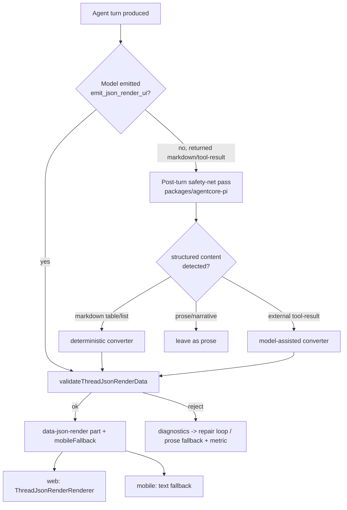
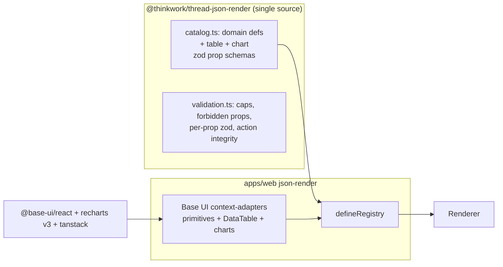

# Reliable High-Fidelity GenUI Emission - Plan

## Goal Capsule

- **Objective:** Make Thread generative-UI emission *reliable* (structured content renders as GenUI instead of markdown) and *high-fidelity* (branded, not raw shadcn defaults), on the existing json-render rendering layer.
- **Product authority:** Eric. Direction agreed in THINK-116 discussion 2026-07-03. All product decisions (D1–D5) resolved; three plan-time sequencing/scope forks confirmed (see Planning Contract).
- **Open blockers:** None.
- **Product Contract preservation:** unchanged — planning enriched the WHAT with the HOW; no product-scope edits.

---

## Context

Thread GenUI shipped in THINK-77 (`@thinkwork/thread-json-render` on `@json-render/*` 0.19 + shadcn) and works, but has two field-observed defects: **under-triggering** (agent returns markdown lists/tables when it should emit GenUI) and **low fidelity** (emitted GenUI "doesn't quite look right"). Root causes are mixed: emission is an *opt-in tool* the model can skip, some content (a table) *has no catalog component to target*, and the primitive set reads as raw shadcn.

This is **not** a json-render-vs-OpenUI decision. json-render stays the DSL/renderer. A DSL swap remains a later, evidence-gated lever; this work keeps that swap cheap by making the catalog portable React components.

---

## Product Contract

*(Carried from the requirements-only brainstorm; unchanged.)*

### Primary actor & outcome

- **Actor:** the shared platform agent (one per tenant) producing Thread responses; end users who read/interact with those responses.
- **Outcome:** structured content (lists, tabular data, metrics, series) reliably renders as branded GenUI — and when it can't, degrades to prose intentionally, not by accident.

### Requirements

- **R1** — Structured content in Thread responses reliably renders as GenUI, not markdown (layered: model-instruction primary + deterministic safety-net backstop).
- **R2** — A tabular answer renders as an interactive DataTable; a series/metric answer renders as the appropriate chart (area/bar/line/pie).
- **R3** — External MCP tool results (LastMile Opportunities example) render as GenUI (DataTable) rather than raw JSON/markdown.
- **R4** — New GenUI is brand-styled (matches supplied shadcn chart-card fidelity), on a Base UI foundation.
- **R5** — Strict host validation gates ALL emission, including safety-net output; every component ships a valid `mobileFallback`; mobile stays text-only.
- **R6** — Validator-rejection → silent-prose-fallback rate is measurably reduced.

### Key decisions (resolved in brainstorm)

- **D1 — Reliability locus:** Layered — model-instruction primary + deterministic safety-net backstop.
- **D2 — Rendering layer:** Keep json-render as DSL/renderer.
- **D3 — Catalog ambition:** Ambitious v1 — full primitives + interactive DataTable + 4 charts.
- **D4 — Primitive foundation:** Own the full catalog on shadcn **Base UI** variants, registered into json-render's registry; drop `@json-render/shadcn`'s Radix primitives.
- **D5 — analytics-display:** Retire the stub; fold into `table` + charts.

### Scope

**In scope:** layered trigger (prompt-policy rewrite + deterministic safety-net conversion incl. tool-result→GenUI); Base UI catalog (primitives + DataTable + area/bar/line/pie charts) registered into json-render; retiring analytics-display; brand styling; `mobileFallback` for every new component.

**Out of scope:** migrating to OpenUI/AG-UI; migrating `apps/web`'s existing Radix-shadcn *app surfaces* to Base UI (Base UI here is scoped to the rendered GenUI catalog); native mobile GenUI rendering (stays text-fallback).

---

## Planning Contract

### Confirmed plan-time forks (2026-07-03)

- **F1 — Sequencing:** Ship the **DataTable + charts first** on Base UI (after a tracer adapter), *then* migrate the remaining primitives off `@json-render/shadcn`. Reaches D4's end-state; front-loads the visible win. (Not big-bang.)
- **F2 — Safety-net v1 scope:** **Both** the deterministic markdown/structured-output → GenUI backstop **and** the model-assisted external tool-result → GenUI path (LastMile).
- **F3 — Legacy cleanup:** Retire the decoupled `analytics.display` stub now; fully tear down the legacy `show_analytics_display` + `data-genui` pipeline as the **final** unit, after the new charts are proven live (don't-cutover-before-proven).

### Key Technical Decisions

- **KTD1 — Component-agnostic registry + adapters.** json-render's registry maps a catalog `type` (zod prop schema) to a React component that receives a **context object**, not raw props. Each Base UI component is wrapped in a thin adapter that unpacks context (resolved props, `children`, event handles) onto the underlying component. Registering hand-authored components and dropping `@json-render/shadcn` is json-render's intended path. Prove the adapter shape empirically against the installed `@json-render/react@0.19` `.d.ts` before scaling (sources disagree on the context type name; version isn't doc-stamped).
- **KTD2 — Recharts v3 + react-is override.** shadcn's current charts require **Recharts v3** (repo is on `^2.15.4`). Upgrade, and add a `pnpm.overrides` pin for `react-is` to the React 19 version to resolve Recharts' peer. This is the most likely install-time blocker; land and verify it in the foundation unit.
- **KTD3 — Package name.** Depend on **`@base-ui/react`** (renamed from the deprecated `@base-ui-components/react`).
- **KTD4 — Single catalog source.** Reconcile the duplication: `apps/web/src/components/workbench/json-render/{catalog,domain-catalog}.ts` re-declares the catalog instead of importing `@thinkwork/thread-json-render`. Make the web app import catalog definitions from the package so new components are declared once (package) and only their *renderers* are registered in the web app.
- **KTD5 — Safety net = post-turn pass in the Pi runtime.** A shared detector/converter utility (deterministic markdown-table/list → GenUI spec; model-assisted tool-result → GenUI) runs as a post-generation step in `packages/agentcore-pi`, emitting a `data-json-render` part **through the same `validateThreadJsonRenderData` gate**. The validator is the single trust boundary for model-authored *and* safety-net-authored specs.
- **KTD6 — Trigger policy inversion.** Rewrite the `### Generated Thread UI` block in `packages/pi-extensions/src/system-prompt-compose.ts` so GenUI is the **default** presentation for structured content (with `table`/`chart` now in the catalog list) and prose is the explicit fallback — rather than the current "prefer generated UI … if" framing.
- **KTD7 — Streaming partial-props tolerance.** json-render streams via JSON-Patch frames, re-invoking components with incrementally-complete props. Table/chart adapters must render safe loading/empty states on partial frames (guard axis-domain/`dataKey` access, tolerate half-streamed `rows`/`columns`). Verify how a zod-typed catalog node behaves when a required prop hasn't streamed yet.
- **KTD8 — Extend durable-action integrity to table row actions.** Today only `result.list` cross-checks `primaryActionId`/`secondaryActionId` against `durableActions` (`validateResultListActionReferences`). A `table` with row actions needs the same integrity check; extend the validator rather than leaving table actions unchecked.

---

## High-Level Technical Design

### Emission paths (layered trigger)

### Catalog & registry (Base UI foundation)

---

## Implementation Units

Grouped into four phases. Phase A de-risks the foundation; Phase B ships the visible win (F1); Phase C makes triggering reliable; Phase D completes the D4 migration and legacy teardown.

### Phase A — Foundation & early verification

### U1. Base UI + Recharts v3 dependency setup and tracer adapter

- **Goal:** Prove the json-render 0.19 context-adapter pattern with Base UI + resolve the Recharts/React-19 peer chain before scaling the catalog. De-risks KTD1/KTD2/KTD3.
- **Requirements:** R4; unblocks R2.
- **Dependencies:** none.
- **Files:** `apps/web/package.json` (add `@base-ui/react`, bump `recharts` to v3, add `pnpm.overrides` `react-is`), root `package.json`/`pnpm-workspace.yaml` if overrides live at root; `apps/web/src/components/workbench/json-render/adapters/base-ui-adapter.ts` (new); `apps/web/src/components/workbench/json-render/adapters/base-ui-adapter.test.ts` (new).
- **Approach:** Read the installed `@json-render/react@0.19` `.d.ts` to pin the exact `defineRegistry` context-object signature (name drift: `ComponentContext` vs `ComponentRenderProps`). Build ONE tracer adapter wrapping a single Base UI primitive (e.g. Button) and register it into a throwaway registry to confirm props/children/events flow. Land the `react-is` override and confirm `pnpm install` + web build succeed.
- **Execution note:** Smoke-first — the win here is a green `pnpm --filter @thinkwork/web build` and a rendered tracer component, not unit breadth.
- **Patterns to follow:** existing registry construction in `apps/web/src/components/workbench/json-render/ThreadJsonRenderRenderer.tsx` (`defineRegistry(threadJsonRenderCatalog, {components})`).
- **Test scenarios:**
  - Adapter maps a catalog context object to underlying component props; children render; an event handle fires.
  - Adapter renders a safe fallback when a required prop is absent (partial-frame tolerance, KTD7).
  - `Test expectation:` plus an install/build smoke check that `recharts@3` + `react-is` override resolve on React 19 under pnpm.

### U2. Reconcile catalog duplication to a single source

- **Goal:** Make `apps/web` import catalog *definitions* from `@thinkwork/thread-json-render` so new components are declared once. (KTD4)
- **Requirements:** enables R2 without double-declaration.
- **Dependencies:** U1.
- **Files:** `apps/web/src/components/workbench/json-render/catalog.ts`, `apps/web/src/components/workbench/json-render/domain-catalog.ts` (remove the duplicate defs; re-export from package), `packages/thread-json-render/src/catalog.ts` (confirm it is the canonical export).
- **Approach:** Point the web `threadJsonRenderCatalog` at the package's `threadJsonRenderCatalog`; keep only the web-side *renderer* map (`createDomainComponents`) local. Delete the web `domain-catalog.ts` duplicate defs. Verify no consumer imports the removed symbols.
- **Test scenarios:**
  - Web renderer builds its registry from the package catalog; all 6 existing domain components still render (regression).
  - Grep-verify no remaining import of the deleted web-local catalog symbols.
  - Covers R2. Adding a component to the package catalog surfaces its name in the system-prompt list without a second edit.

### Phase B — The missing components (immediate value)

### U3. `table` component (interactive DataTable)

- **Goal:** Add a first-class `table` catalog entry backed by a Base UI + tanstack DataTable, so tabular answers have somewhere to go. (R2, R3)
- **Requirements:** R2, R3, R4, R5.
- **Dependencies:** U1, U2.
- **Files:** `packages/thread-json-render/src/catalog.ts` (add `table` def), `packages/thread-json-render/src/validation.ts` (extend action-integrity to table row actions, KTD8), `packages/thread-json-render/src/validation.test.ts`, `apps/web/src/components/workbench/json-render/components/DataTableView.tsx` (new), register in `apps/web/src/components/workbench/json-render/ThreadJsonRenderRenderer.tsx` `createDomainComponents`.
- **Approach:** zod prop schema: `columns` (id/header/accessor/align/sortable), `rows` (array of primitive-valued records), optional `sort`, optional per-row `primaryActionId`/`secondaryActionId`. Client sort/filter/paginate as **local UI state**; row actions as **durable actions** cross-checked in the validator (KTD8). Adapter tolerates partial `rows`/`columns` (KTD7). Provide a `mobileFallback` (title + row-count summary + first-N lines).
- **Patterns to follow:** `ResultListView` (`apps/web/src/components/workbench/genui/components/`) for domain-component structure; `validateResultListActionReferences` for the action-integrity extension; shadcn Base UI DataTable (`ui.shadcn.com/docs/components/base/data-table`).
- **Test scenarios:**
  - Happy: a `{columns, rows}` spec renders sortable columns; clicking a header sorts locally (no durable action fired).
  - Row action with a valid `durableActions` id renders and dispatches; invalid/missing id → `JSON_RENDER_ACTION_REFERENCE_INVALID/_MISSING` (validator).
  - Edge: empty `rows` renders an empty state; a partial/streaming frame (columns present, rows undefined) does not throw.
  - Validation: exceeding element/prop caps rejects; forbidden props (`href`/`onClick`) rejected.
  - `mobileFallback` present and within 12-line cap.
  - Covers R2 / R3.

### U4. `chart` component (area / bar / line / pie)

- **Goal:** Add a `chart` catalog entry backed by Recharts v3, matching the supplied shadcn chart-card fidelity. (R2, R4)
- **Requirements:** R2, R4, R5.
- **Dependencies:** U1, U2.
- **Files:** `packages/thread-json-render/src/catalog.ts` (add `chart` def), `packages/thread-json-render/src/validation.test.ts`, `apps/web/src/components/workbench/json-render/components/ChartView.tsx` (new), `apps/web/src/components/workbench/json-render/components/chart-container.tsx` (new, the shadcn ChartContainer/ChartTooltip theming shell), register in `ThreadJsonRenderRenderer.tsx`.
- **Approach:** zod prop schema: `kind` (`area|bar|line|pie`), `data` (array of primitive records), `series` (dataKey/label/colorToken), `xKey`, optional `title`/`description`/`footer`. Colors from brand palette tokens (not free-form `color` props — those are forbidden by the validator; map a `colorToken` enum to CSS vars in the container). Card framing with title/description/trend footer per the reference images. Adapter guards axis-domain/`dataKey` access on partial frames (KTD7). `mobileFallback` = title + summary + key series lines.
- **Patterns to follow:** shadcn Base UI chart docs (`ui.shadcn.com/docs/components/base/chart`); existing ad-hoc recharts usage in `apps/web/src/components/settings/SettingsAnalytics.tsx` for reference only (do not reuse its non-catalog shape).
- **Test scenarios:**
  - Happy: each `kind` renders its Recharts chart with a legend and the card title/description/footer.
  - Edge: empty/partial `data` renders an empty state, no throw mid-stream.
  - Validation: `colorToken` outside the allowed enum rejected; free-form `color`/`fill` props rejected by existing forbidden-prop check.
  - `mobileFallback` present, within caps.
  - Covers R2.

### U5. Retire the `analytics.display` stub; route charts to the new component

- **Goal:** Remove the decoupled placeholder stub now that a real `chart` component exists. (D5, F3 stage 1)
- **Requirements:** R4.
- **Dependencies:** U4.
- **Files:** `packages/thread-json-render/src/catalog.ts` (remove `analytics.display` def), `apps/web/src/components/workbench/json-render/ThreadJsonRenderRenderer.tsx` (remove the static stub, lines ~96–110), associated tests/fixtures referencing `analytics.display`.
- **Approach:** Delete only the decoupled stub and its catalog entry. Do NOT touch the legacy `show_analytics_display`/`data-genui` pipeline here — that is U11 (F3 stage 2). Verify no spec fixture still emits `analytics.display`.
- **Test scenarios:**
  - Grep-verify `analytics.display` no longer in the catalog or web renderer.
  - A spec that previously used `analytics.display` now uses `chart`; renders correctly.
  - `Test expectation: none for the deletion itself beyond regression` — covered by the above.

### Phase C — Trigger reliability

### U6. Trigger-policy rewrite (default-on for structured content)

- **Goal:** Invert the system-prompt policy so GenUI is the default presentation for structured content, with `table`/`chart` now advertised. (D1 primary path, KTD6, R1)
- **Requirements:** R1, R6.
- **Dependencies:** U3, U4 (catalog must contain table/chart before advertising them).
- **Files:** `packages/pi-extensions/src/system-prompt-compose.ts` (the `### Generated Thread UI` block, ~lines 125–145), `packages/pi-extensions/src/system-prompt-compose.test.ts` (or nearest existing test).
- **Approach:** Reframe from "prefer generated UI … if" to "GenUI is the default for structured/scan-friendly content (tables → `table`, series/metrics → `chart`, homogeneous sets → `result.list`); use prose only for narrative/tiny/open-ended answers." Keep the catalog name lists (now includes `table`/`chart` automatically via the package). Preserve durable-action pairing rules and the display-safe constraints.
- **Execution note:** No behavior code — prompt text. Verify the composed prompt string contains the new default-on directive and the new component names.
- **Test scenarios:**
  - Composed prompt (with `emit_json_render_ui` in tools) contains the default-on directive and lists `table` + `chart`.
  - When the tool is absent, the block is omitted (existing gate preserved).

### U7. Deterministic safety-net backstop (markdown/structured → GenUI)

- **Goal:** Catch structured content the model returned as markdown and convert it to a validated GenUI part. The reliability floor for R1. (KTD5)
- **Requirements:** R1, R5, R6.
- **Dependencies:** U3, U4.
- **Files:** `packages/thread-json-render/src/safety-net/detect-convert.ts` (new shared util — markdown-table/list detection + deterministic → spec), `packages/thread-json-render/src/safety-net/detect-convert.test.ts` (new), wiring in `packages/agentcore-pi/agent-container/src/server.ts` (post-turn pass), possibly `packages/api/src/lib/chat-finalize/process-finalize.ts` if a finalize-side hook is needed.
- **Approach:** After the model turn, scan assistant message text for GFM tables and list-of-record structures. Deterministically map a detected table → `table` spec (headers→columns, rows→rows) and emit via the same path as `emit_json_render_ui`, **through `validateThreadJsonRenderData`**. On validator reject, keep the original prose (never drop content) and record the rejection (feeds U9). Conservative detection — only convert clearly-tabular content to avoid false positives on narrative prose.
- **Patterns to follow:** `buildEmitJsonRenderUiTool` / `normalizeRuntimeThreadJsonRenderInput` in `packages/pi-runtime-core/src/json-render-runtime.ts` for the emit+validate+part path.
- **Test scenarios:**
  - Happy: a GFM table in the assistant message converts to a `table` `data-json-render` part; original markdown replaced/augmented per the chosen render contract.
  - Negative: prose containing a stray pipe character is NOT converted (false-positive guard).
  - Reject path: a converted spec that fails validation leaves prose intact and increments the rejection metric.
  - Integration: converted part carries a valid `mobileFallback` and passes the strict validator (same gate as model-authored).
  - Covers R1.

### U8. Tool-result → GenUI conversion (external MCP)

- **Goal:** Render external MCP tool results (LastMile Opportunities) as GenUI rather than raw/markdown — model-assisted path. (F2, R3)
- **Requirements:** R3, R5.
- **Dependencies:** U7.
- **Files:** `packages/thread-json-render/src/safety-net/tool-result-convert.ts` (new), tests alongside, wiring in `packages/agentcore-pi/agent-container/src/server.ts` (tool-result post-processing hook).
- **Approach:** When a tool result is a homogeneous array of records, prompt the agent (or a lightweight structured step) to decide GenUI-appropriateness and re-emit as a `table`/`result.list` spec through the validator. Reuse U7's convert+validate primitives; the difference is the model-assisted "is GenUI appropriate + which component" decision vs U7's deterministic markdown parse. Do not auto-convert opaque/nested tool payloads — fall back to the existing rendering.
- **Test scenarios:**
  - Happy: an array-of-records tool result (LastMile-shaped fixture) becomes a `table` part through the validator.
  - Negative: a scalar/opaque tool result is left untouched.
  - Reject path: an over-cap conversion falls back to existing rendering + metric.
  - Covers R3.

### U9. Authoring-reliability observability

- **Goal:** Make validator-rejection and silent-prose-fallback rates visible, and ensure the reject→repair loop is effective. (R6)
- **Requirements:** R6.
- **Dependencies:** U7.
- **Files:** the emit/validate path (`packages/pi-runtime-core/src/json-render-runtime.ts`), safety-net utils (U7/U8), a metric/log emission consistent with existing Pi runtime logging (`/thinkwork/<stage>/agentcore-pi`).
- **Approach:** Emit a structured log/metric on: model emit rejected (with diagnostic codes), safety-net conversion attempted/succeeded/rejected, and prose-fallback taken. Confirm the existing model-facing reject diagnostics (`diagnosticSummary`) are surfaced back to the model so it can repair within the turn.
- **Execution note:** Pin the metric in the response/log payload, not inferred from log filtering (per prior smoke-verification learning).
- **Test scenarios:**
  - A rejected spec logs its diagnostic codes and the fallback taken.
  - A safety-net conversion logs attempt→outcome.
  - `Test expectation:` assert the log/metric shape; no user-visible behavior change.

### Phase D — Base UI primitive migration + legacy teardown

### U10. Migrate remaining primitives to Base UI; drop `@json-render/shadcn`

- **Goal:** Complete D4 — replace the `@json-render/shadcn` primitive re-export with the owned Base UI catalog and remove the dependency.
- **Requirements:** R4, D4.
- **Dependencies:** U1, U3, U4 (adapter pattern + fidelity proven on table/chart first).
- **Files:** `apps/web/src/components/workbench/json-render/catalog.ts` (replace the `export { shadcnComponents as threadJsonRenderPrimitiveComponents }` seam at ~line 66 with the Base UI adapter set), new adapter modules under `apps/web/src/components/workbench/json-render/adapters/`, `apps/web/package.json` (remove `@json-render/shadcn`), `packages/thread-json-render/src/catalog.ts` (replace `shadcnComponentDefinitions` source if the package re-exports them).
- **Approach:** For each primitive the catalog advertises, provide a Base UI context-adapter (per U1's proven pattern). Keep the same catalog `type` names and zod prop schemas so specs and the validator are unchanged — only the rendered implementation swaps. Remove `@json-render/shadcn` once every advertised primitive has a Base UI adapter.
- **Patterns to follow:** U1 tracer adapter; U3/U4 component adapters.
- **Test scenarios:**
  - Each advertised primitive renders via its Base UI adapter with the same catalog contract (regression across existing domain components that compose primitives).
  - Grep-verify `@json-render/shadcn` no longer imported anywhere; dependency removed from `package.json`.
  - Visual fidelity check (Eric's checkout): primitives read as brand Base UI, not raw shadcn defaults.
  - Covers R4 / D4.

### U11. Tear down the legacy analytics pipeline

- **Goal:** Remove the legacy `show_analytics_display` extension and the `data-genui` branch now that charts render via the new component. (F3 stage 2 — sequenced last, after new charts proven live.)
- **Requirements:** D5 completion.
- **Dependencies:** U4, U5, and observed-live proof of the new `chart` component.
- **Files:** `packages/pi-extensions/src/analytics-display.ts` (remove `createAnalyticsDisplayExtension`), `packages/agentcore-pi/agent-container/src/server.ts` (remove `addExtension(createAnalyticsDisplayExtension())` ~line 1353), `apps/web/src/components/workbench/render-typed-part.tsx` (remove the `data-genui` branch ~line 219), `apps/mobile/lib/genui-registry.ts` (legacy `data-genui` handling), and retire `packages/analytics-display` + `@thinkwork/genui` if no other consumer remains (grep-gated).
- **Approach:** Grep every importer of `@thinkwork/analytics-display` and `@thinkwork/genui` first; remove the extension + `data-genui` render branches; only delete the packages if grep confirms no remaining consumers. Follow migration ordering — code-removal lands and deploys before any package deletion.
- **Execution note:** Grep-gated deletion; do not remove packages with live importers. Verify against a live thread that charts still render post-teardown before deleting packages.
- **Test scenarios:**
  - `show_analytics_display` tool no longer registered; a chart request routes through `emit_json_render_ui` + new `chart`.
  - `data-genui` parts (if any persisted) still degrade gracefully (or are intentionally unsupported per THINK-77 hard-cutover).
  - Grep-verify no live importer of the removed packages before deletion.

---

## Risks & Mitigations

- **R-A (install blocker) — Recharts v3 / react-is / React 19 peer chain.** Mitigation: land the `pnpm.overrides` `react-is` pin in U1 and gate on a green install + web build before proceeding. (KTD2)
- **R-B (API drift) — exact json-render 0.19 registry/context signature is not doc-stamped.** Mitigation: U1 reads the installed `.d.ts` and builds a tracer adapter before scaling.
- **R-C (false positives) — deterministic safety net converting prose that merely looks tabular.** Mitigation: conservative detection; never drop original content on reject; observability (U9) surfaces conversion outcomes.
- **R-D (dual-primitive interim) — mixed Base UI + `@json-render/shadcn` between Phase B and U10.** Mitigation: accepted, time-boxed by F1 sequencing; U10 removes it. No runtime collision (independent primitive libs).
- **R-E (streaming) — table/chart throwing on partial frames.** Mitigation: KTD7 partial-props tolerance is an explicit test scenario in U1/U3/U4.

---

## Verification Contract

- `pnpm --filter @thinkwork/thread-json-render test` — validator + catalog (table/chart defs, action integrity, caps, safety-net converters).
- `pnpm --filter @thinkwork/web build` + `typecheck` — Base UI/Recharts v3 resolve; registry builds.
- `pnpm --filter @thinkwork/pi-extensions test` — trigger-policy prompt composition.
- Live thread check (Eric's checkout / dev): a tabular answer renders as DataTable; a series answer renders as a branded chart; a markdown-table answer is caught by the safety net; a LastMile-shaped tool result renders as a table.
- `tsc` as a separate gate (vitest-green ≠ tsc-green).
- Full package suites for any touched package, not just new tests.

## Definition of Done

- Structured content reliably renders as branded GenUI in live threads (R1–R4), observed end-to-end, not just in tests.
- Strict validator gates all emission including safety-net output; every new component ships a valid `mobileFallback` (R5).
- Rejection/fallback rates are observable (R6).
- `@json-render/shadcn` removed; catalog owned on `@base-ui/react` (D4).
- `analytics.display` stub gone; legacy pipeline torn down after new charts proven live (D5/F3).
- Catalog declared in a single source (KTD4).

## Sources & Research

- Brainstorm: this doc's Product Contract (THINK-116).
- json-render registry/streaming: json-render.dev/docs/registry, /docs/streaming; DeepWiki "Creating Custom Components".
- shadcn Base UI DataTable + chart: ui.shadcn.com/docs/components/base/{data-table,chart}; React-19 peer guide ui.shadcn.com/docs/react-19.
- Base UI package rename → `@base-ui/react`; Recharts v3 + react-is override (recharts#4558).
- Integration seams (verified in-repo): `packages/thread-json-render/src/{validation,catalog}.ts`, `packages/pi-runtime-core/src/json-render-runtime.ts`, `packages/pi-extensions/src/system-prompt-compose.ts`, `apps/web/src/components/workbench/json-render/*`, `apps/mobile/lib/genui-registry.ts`, `packages/agentcore-pi/agent-container/src/server.ts`.
