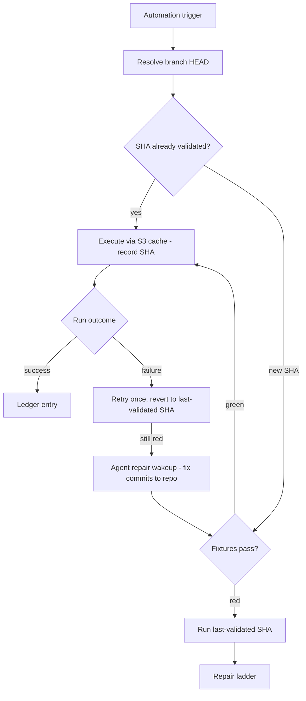
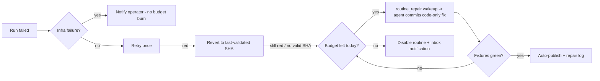

# Deterministic Routines v1 - Plan

## Goal Capsule

- **Objective:** Ship a deterministic Routine feature Automations can leverage: an Automation runs a routine as a token-free action, routine code lives in one tenant-configured GitHub repository pulled at execution, and failures self-heal through a budgeted repair ladder.
- **Product authority:** Eric Odom via [THINK-135](https://linear.app/thinkworkai/issue/THINK-135/revisit-routines) and the 2026-07-03 brainstorm dialogue; ideation basis in docs/ideation/2026-07-03-think-135-deterministic-routines-ideation.html.
- **Execution profile:** Implement in dependency order U1→U9 (three phases); each unit lands as a PR to `main` following repo pre-commit gates. Dev is continuous-CD from main — deployed behavior is verifiable after each merge.
- **Stop conditions:** Surface a genuine blocker (contradicts the Product Contract, or requires product scope not in this plan) instead of guessing. Schema changes to `routines.engine` (CHECK constraint) must follow the hand-rolled migration protocol before merge.
- **Tail ownership:** The two-week LastMile success window (Success Criteria) is post-ship monitoring owned by the operator, not part of this plan's Definition of Done.
- **Product Contract preservation:** changed: R3 — execution substrate resolved from "Python Lambda" to the Code Interpreter sandbox (user-confirmed at planning); added R18–R20 and AE9–AE10 plus the repair-envelope qualifier on the auto-publish Key Decision (2026-07-03 doc-review P0/P1 resolutions, user-directed); all other R/A/F/AE content unchanged.

---

## Product Contract

### Summary

Automations gain a "Run routine" action that executes agent-authored Python functions with zero LLM tokens. Routine code has one home — a tenant-configured git repository (URL + token pasted in settings) — pulled at latest on each execution with the commit SHA recorded per run, new SHAs gated by recorded fixtures before first use, and failures walking a repair ladder that is mechanical first and agentic second. v1 is proven by the LastMile data check running on schedule token-free and demonstrably self-healing.

### Problem Frame

Agent threads keep re-deriving the same deterministic logic. The concrete case: checking LastMile dispatch data on a regular basis currently runs through MCP tool calls in agent threads, re-creating custom logic every run and paying agent turns for work that has no judgment in it. The routines substrate that could absorb this work exists (Step Functions engine, recipe catalog, run ledger) but has no birth path an agent actually uses, no repair loop when a routine breaks, and no way for an Automation to call a routine as one step among agent instructions. Deterministic routines were the original core ThinkWork idea; after several direction changes, the missing piece is a single committed loop rather than another substrate rebuild.

### Key Decisions

- **Git is the single source of truth; the executor pulls latest and records the SHA.** Routine code lives only in the tenant repo. Routine metadata stores identity, module path, fixture refs, and SHA pointers — never a copy of the code. Auditability comes from recording the commit SHA on every execution row, not from DB-pinned snapshots. Chosen over a mirror-mode design (DB as truth, git as backup) which Eric rejected as two homes.
- **New SHAs are fixture-gated before first use.** Whether the change came from an agent repair or a human pushing to the repo, the executor runs the routine's recorded fixtures against an unseen SHA before it becomes the validated SHA. Red means the last-validated SHA keeps running and the repair ladder is triggered. "Pull latest" never means "execute unreviewed code blind."
- **Python only in v1, fixed entrypoint, sandboxed execution.** Routines are Python modules exposing `def run(input: dict) -> dict`, executed in the Bedrock AgentCore Code Interpreter sandbox invoked by the executor Lambda (the established `routine-task-python` pattern). No transpile step between pull and execute. TypeScript routines and per-routine dependency installs are later milestones.
- **Repairs auto-publish on green fixtures — within a constrained diff envelope.** No operator sign-off gate for in-envelope fixes — a broken nightly routine should not stay broken waiting for a click. The envelope is the security boundary: a repair diff that adds imports or network-call primitives, or exceeds a size threshold, does not auto-publish; it lands as a pending commit requiring operator approval. Humans review all repairs in a visible repair log. Chosen over blanket sign-off and over visibility-tiered gating.
- **v1 is GitHub-only.** The routine repo is a GitHub repository accessed via the REST API with a pasted fine-grained token — the simplest commit path for both the executor and the agent's authoring/repair flow. Other git hosts are a later milestone.
- **The signature-clustering flywheel is deferred to the fast-follow milestone.** v1's bar is the pipe plus self-heal, not fleet discovery. The deferred Phase E U16 work (docs/plans/2026-05-01-008-feat-routines-phase-e-cleanup-plan.md) becomes the nomination engine in the next milestone.
- **This feature defines the structured "Run routine" action itself.** Verified: AgentLoop automations save via `SaveAgentLoopInput` with a freeform `goalSpec`; no instruction-block or action-type schema exists yet (the Devin-builder plan's R7 is aspirational). Deterministic Routines adds a minimal structured routine-actions field alongside `goalSpec` now, decoupling v1 from THINK-111's timeline; the Devin builder later renders or absorbs it as an instruction block. Accepted risk: slight rework when blocks land.

### Actors

- A1. Operator — configures the routine repo in settings, reviews run ledger and repair log, attaches routine actions to Automations.
- A2. Platform agent — authors routine code and fixtures into the repo on request; proposes repairs when the ladder escalates.
- A3. Automation runtime (AgentLoop) — invokes routine actions on schedule/trigger; dispatches via wakeups by design (verified: `dispatchAgentLoop` enqueues wakeups — the routine action itself must not require an agent turn).
- A4. Human engineer — may edit routine code directly in the git repo; edits flow in through the same fixture gate as agent repairs.

### Requirements

**Storage and execution**

- R1. Routine code lives in a single tenant-configured git repository; the platform stores no second copy of routine code as a source of truth — metadata and SHA pointers only.
- R2. Operators configure the repo in settings with URL, API token, and branch; the token is stored in Secrets Manager and the connection is validated at save time.
- R3. A routine is a Python module exposing `def run(input: dict) -> dict`, executed in a sandboxed Python runtime (AgentCore Code Interpreter) invoked by the executor Lambda.
- R4. At execution start the executor resolves branch HEAD, executes that code, and records the commit SHA on the execution row — every run answers "what exactly ran?"
- R5. A SHA not yet validated for a routine must pass that routine's recorded fixtures before first production use; on failure the last-validated SHA runs instead and the repair ladder is triggered.
- R6. An S3 read-through cache keyed by SHA backs execution; when git is unreachable the executor falls back to the last-validated cached SHA and the run is annotated accordingly.
- R19. A routine declares named credential refs in its metadata; the executor resolves them from the tenant-credentials substrate at invoke time and injects only those into that routine's sandbox session — never via `routineActionsSpec`, repo files, or a shared credential pool.

**Automations integration**

- R7. An Automation can include a "Run routine" action that executes deterministically with zero agent turns, and can mix routine actions with agent instructions in one Automation.
- R8. Routine runs triggered by Automations land in the run ledger with per-run SHA, status, duration, and error detail, alongside the Automation run they belong to.

**Fixtures and birth**

- R9. Every routine carries at least one recorded fixture (input plus expected output) before an Automation can use it — no fixture, no publish.
- R10. v1 birth path: an operator asks the agent to author a routine; the agent commits code plus fixture(s) to the repo. No authoring UI in v1.

**Repair and observability**

- R11. On failure the mechanical tier acts first at zero token cost: retry once, then revert execution to the last-validated SHA.
- R12. When the mechanical tier cannot restore green, an agent wakeup carrying the error detail and failing SHA proposes a fix committed to the repo; the fix goes live automatically when fixtures pass and is recorded in a visible repair log.
- R13. Agent repairs are budgeted: at most 3 repair attempts per routine per day; exceeding the budget disables the routine and notifies the operator.
- R18. A repair auto-publishes only within a constrained envelope: the diff modifies existing routine code without adding imports or network-call primitives and stays under a size threshold. Outside the envelope, the fix lands as a pending commit requiring operator approval (inbox item). Error detail fed to the repair agent is fenced as untrusted data, never as instructions.

**Agent tooling (added at planning; extends R10/R12)**

- R14. The agent has lifecycle tools, not just birth: list routines (with validated SHA and enabled state), read a routine's code and fixtures, commit code+fixtures atomically, dry-run fixtures against working content before committing, and read recent runs including error detail.
- R15. Agent commits are attributable: a fixed author identity and message convention linking the routine and (for repairs) the originating run, so the repo history and repair log answer "who changed this."
- R16. A repair commit may modify routine code only — never fixtures. Fixture changes go through the operator-requested birth path.
- R17. Infrastructure failures (revoked token, unreachable repo, missing file/branch) notify the operator and do not consume the repair budget.
- R20. Birth-path commits enforce the initiating actor's operator/admin role server-side at the commit seam; repair-mode commits are accepted only from the repair dispatch. "An operator asks the agent" is an enforced control, not a convention.



### Acceptance Examples

- AE1. **Covers R1, R3, R4, R7.** Given the LastMile check routine exists in the tenant repo and an Automation schedules it, when the trigger fires, then the routine calls the LastMile API and completes with zero agent turns, and the ledger row records the commit SHA that ran.
- AE2. **Covers R5.** Given a human pushes an edit to the routine, when the next scheduled run pulls the new SHA, then fixtures run first; green promotes the SHA, red runs the last-validated SHA and opens a repair.
- AE3. **Covers R11, R12.** Given an induced failure in the live routine, when the run fails, then the mechanical tier retries and reverts; if still red, the agent commits a fix that goes live on green fixtures, with a repair log entry — no human intervention.
- AE4. **Covers R13.** Given a routine that keeps failing after repair attempts, when the third repair in a day fails, then the routine is disabled and the operator is notified.
- AE5. **Covers R6.** Given GitHub is unreachable at trigger time, when the run starts, then the cached last-validated SHA executes and the run is annotated as cache-served.
- AE6. **Covers R10, R14.** Given an operator asks the platform agent to author the LastMile routine, when the agent runs fixtures dry against its draft and commits, then the routine appears with its fixture, and an Automation can attach it.
- AE7. **Covers R16.** Given a repair wakeup, when the agent attempts a commit that modifies a fixture file, then the commit tool rejects it.
- AE8. **Covers R17.** Given the repo token is revoked, when a run or repair attempts repo access, then the operator is notified and the repair budget is not consumed.
- AE9. **Covers R18.** Given a repair wakeup, when the agent's fix adds a new import or network call, then the commit does not auto-publish — it lands as a pending commit with an operator-approval inbox item, and the routine keeps running the last-validated SHA.
- AE10. **Covers R19.** Given the LastMile routine declares one credential ref, when it executes, then only that credential is present in the sandbox session and no other tenant credential is resolvable from routine code.

### Success Criteria

- The LastMile data check runs on its schedule as a routine action with zero agent turns for two consecutive weeks in dev.
- An induced failure demonstrably walks the repair ladder end to end (mechanical revert, then agent fix passing fixtures) without human intervention.
- Every run in that window answers "what exactly ran?" with a commit SHA from the ledger.

### Scope Boundaries

**Deferred for later**

- Signature-clustering flywheel (Phase E U16 as nomination engine) — fast-follow milestone.
- Trace-compiled birth (compile routines from successful thread traces).
- Webhook/URL exposure plane for external callers (n8n, Step Functions, partners).
- TypeScript routines; per-routine dependency installs; non-GitHub git hosts.
- Compliance export view over the run ledger.
- Cross-tenant routine sharing.
- Agent-initiated disable/enable proposals; PR-based (review-gated) repair mode.

**Outside this feature's identity**

- A visual routine editor or authoring UI — the repo and the agent are the authoring surface.
- Reintroducing DB-stored routine code as a source of truth.
- Agent-managed repo settings or tokens; agent bypass of the fixture gate; agent reset of the budget circuit-breaker.

### Dependencies / Assumptions

- **Verified absent (fresh-context verifier, 2026-07-03):** no tenant-settings surface for a pasted git URL + token exists; the routine execution path has no git-fetch capability (`routine-task-python` receives code verbatim in the ASL payload); no fixture/replay gate exists at publish or execution. All three are new work this feature adds.
- **Verified present:** EventBridge fires `routine-execution-callback` on Step Functions terminal states; `routine_executions`/`routine_step_events` capture error detail; `scheduled_jobs` supports `routine_schedule`/`routine_one_time`; LastMile is an MCP plugin surface with no direct REST client in routines today.
- **Coordination:** this feature defines the structured routine-actions field itself (see Key Decisions); notify the owners of docs/plans/2026-06-30-001-feat-devin-style-automation-builder-plan.md so their instruction-block work (R7) renders or absorbs it rather than inventing a parallel shape.
- **Assumption:** git history is not force-pushed; recorded SHAs stay resolvable. The S3 cache doubles as the archival fallback if this assumption breaks.
- **Assumption:** the "two consecutive weeks" success window is measured in dev; prod graduation is a separate call.
- **Assumption:** the Code Interpreter sandbox environment provides the HTTP client capability the LastMile routine needs; the curated-dependency question reduces to "what the sandbox session offers" (verified pattern: `packages/lambda/routine-task-python.ts` streams sandboxed execution today).

### Sources / Research

- Ideation and evidence dossiers: docs/ideation/2026-07-03-think-135-deterministic-routines-ideation.html (grounding dossiers under /tmp/compound-engineering/ce-ideate/59dde974/ for this session).
- Routines substrate: packages/api/src/handlers/routine-asl-validator.ts, packages/api/src/handlers/routine-execution-callback.ts, packages/lambda/routine-task-python.ts, packages/database-pg/src/schema/routine-executions.ts, terraform/modules/app/routines-stepfunctions/main.tf.
- Automations: packages/database-pg/graphql/types/agent-loops.graphql, packages/agent-loops-core/src/dispatcher.ts, packages/agent-loops-core/src/run-ledger.ts, docs/plans/2026-06-30-001-feat-devin-style-automation-builder-plan.md.
- Tenant credentials pattern: packages/database-pg/graphql/types/tenant-credentials.graphql, packages/api/src/lib/tenant-credentials/secret-store.ts, packages/api/src/graphql/resolvers/tenant-credentials/.
- GitHub API precedent: packages/lambda/github-workspace.ts (Octokit, git-data commit flow; note it uses GitHub App auth — this feature deliberately uses a pasted fine-grained token instead).
- Fixture-storage precedent: packages/database-pg/src/schema/evaluations.ts (S3-canonical + DB derived index).
- Notification precedent: packages/database-pg/src/schema/inbox-items.ts, packages/api/src/graphql/resolvers/inbox/createInboxItem.mutation.ts.
- Deferred flywheel: docs/plans/2026-05-01-008-feat-routines-phase-e-cleanup-plan.md.
- External prior art: PreAct (arXiv 2606.17929, deopt-guarded compiled runs); Voyager skill library; UiPath healing caution (repair must be cheap).

---

## Planning Contract

### Key Technical Decisions

- KTD-1. **Fold into the existing Routine model.** New `engine` value `git_python` on `routines` (the CHECK constraint at packages/database-pg/src/schema/routines.ts:88-91 extends via hand-rolled SQL); `routine_executions` gains `commit_sha`, `validated_sha`, and `cache_served` columns (nullable, `git_python`-only). Rationale: reuses the run-ledger UI, visibility model (`agent_private`/`tenant_shared`), trigger plumbing, and GraphQL types; avoids a hard naming collision with the shipping Step Functions routines. A parallel table pair was rejected.
- KTD-2. **Executor = Node Lambda + Code Interpreter sandbox (user-confirmed).** A new `routine-exec-git` handler pulls code from GitHub at branch HEAD and executes it via `StartCodeInterpreterSessionCommand`/`InvokeCodeInterpreterCommand`, mirroring `packages/lambda/routine-task-python.ts` (S3 stdout/stderr offload included). Rationale: sandboxed execution for agent-generated code, IAM and build wiring already proven; the stack has no native Python Lambda runtime and should not gain one for untrusted code. Rejected: native Python 3.12 Lambda (first Python runtime in the stack; runs agent code under the Lambda's own role).
- KTD-3. **One dispatch mechanism, with time budgets.** All Automations — routine-only and mixed — dispatch through the dispatcher seam (after `evaluateStartGate` in packages/agent-loops-core/src/dispatcher.ts): routine actions execute first via executor invoke; a routine-only run then completes without `enqueueWakeup`; a mixed run injects per-action results into the wakeup payload built by `buildAgentLoopWakeupPayload` (packages/agent-loops-core/src/run-ledger.ts) and into the resume-turn payload path (test the resume turn — payload parity is a known failure mode). The raw `routine_schedule` job kind remains only for direct, non-Automation routine schedules. Time budgets: the executor Lambda is provisioned at 360s (mirroring `routine-task-python`); `job-trigger`'s timeout is raised to cover a routine-action chain with a per-action cap; the manual GraphQL trigger path enqueues an async job rather than invoking the executor inline from `graphql-http`. The executor's per-routine serialization includes a stale-`running` sweep so a timed-out invocation cannot wedge the routine.
- KTD-4. **Repair wakeup is its own dispatch, and error detail is untrusted input.** New `routine_repair` wakeup source with its own payload builder — not a bolt-on to the AgentLoop shape (a routine has no loop/version/iteration). The payload carries pointers (routineId, failing SHA, last-validated SHA, error summary, budget remaining); the agent pulls bulk context (full errorJson, fixture bodies, code at both SHAs) via R14 tools. errorJson can contain attacker-influenced content from external APIs — the repair prompt and tool responses fence it as quoted data, never as instructions (R18). Auto-publish is bounded by the R18 diff envelope, enforced server-side at the commit seam: in-envelope + green fixtures → live; out-of-envelope → pending commit + operator-approval inbox item. Ad-hoc repair ("routine X is broken") works identically because context comes from tools, not the prompt.
- KTD-5. **Five agent tools; commit is a composite with role enforcement.** `routine_repo_list`, `routine_repo_read`, `routine_repo_commit`, `routine_run_fixtures`, `routine_runs` in the admin-ops MCP. Commit is one composite tool (files[] + registration metadata, parent-SHA conflict detection, fixture-required enforcement for new routines, code-only enforcement in repair mode) because R9/R16/R18/R20 invariants must hold server-side at the commit seam: birth-path commits verify the initiating actor's operator/admin role (R20); repair-mode commits are accepted only from the repair dispatch and are checked against the R18 diff envelope. `routine_run_fixtures` and the executor's fixture gate share one code path so agent-green cannot drift from gate-green. The existing inert `create_routine` (recipe-intent path, never enabled for users) is re-pointed to this birth flow.
- KTD-6. **Fixtures live in the repo; metadata stores refs; comparison mode is per-fixture.** Convention: `routines/<slug>/main.py` + `routines/<slug>/fixtures/*.json` in the tenant repo. Each fixture declares input, expected output, and a comparison mode: `exact` (deep-compare, for pure transforms) or `shape` (schema/subset match on structure and named invariant fields, for routines that read live external data — the LastMile check uses `shape`, so gating doesn't fail nondeterministically on changing dispatch data). Gate-mode runs pass a reserved input key (`_gate: true`) so effectful routines can no-op side effects; v1 gating may perform live read-only calls. Routine metadata stores module path and fixture paths only. Recorded fixture inputs pass the existing output-redaction (`routine-output-redactor` pattern) before being written to the tenant repo.
- KTD-7. **Validated-SHA bookkeeping lives in a cache-index table; repairs get their own event table.** Mirroring the eval-datasets pattern (S3 canonical, DB derived index): S3 cache keys `tenants/<tenant-slug>/routines/<routine-slug>/<sha>/`, with a DB row per cached SHA (fetched_at, fixture validation status). The cache index is authoritative for "validated SHA per routine"; `routines.validated_sha` is a denormalized fast-path pointer, written only by the gate. Per-routine serialization uses a running-status check in the same transaction (mirrors the terminal-status idempotency in `routine-execution-callback.ts`). Repair history lives in a dedicated `routine_repair_events` table (routine_id, execution_id, thread/wakeup ref, from_sha, to_sha, gate_result, envelope_verdict, budget_snapshot, created_at) rather than annotations on `routine_executions`.
- KTD-8. **Repo credential rides the tenant-credentials substrate.** New `TenantCredentialKind` `github_repo` with fields `{repoUrl, token, branch}` — the enum and `REQUIRED_FIELDS` map change in lockstep (packages/database-pg/graphql/types/tenant-credentials.graphql + packages/api/src/lib/tenant-credentials/secret-store.ts). Secrets Manager naming follows `tenantCredentialSecretName()`. Save validates the connection (`octokit.repos.get`). Deliberate divergence from the GitHub App auth used by `github-workspace.ts`: a pasted fine-grained token is the product decision (R2); the two credential models coexist for different repos.
- KTD-9. **Disable + notify uses inbox items.** Budget exhaustion inserts an `inbox_items` row (durable record) which rides the already-wired `notifyInboxItemUpdate` AppSync push. No new notification plumbing. Re-enable is a human-only mutation.
- KTD-10. **Config via SSM, not new graphql-http env vars.** The `graphql-http` Lambda env is near its 4KB ceiling; new configuration (cache bucket, interpreter id for the executor) lands on the executor's own env or SSM, never as new `graphql-http` env vars.
- KTD-11. **Per-routine credential injection.** Routines declare named credential refs (tenant-credential ids) in metadata; the executor resolves only those from Secrets Manager at invoke time and injects them into the sandbox session (extending the `ROUTINE_PYTHON_ENV_ALLOWLIST` pattern in the routine-task Lambda). Secrets never ride `routineActionsSpec` (plaintext DB), never live in the repo (R1), and no routine sees another routine's credentials — which bounds the blast radius of any bad commit to the credentials that routine declared.

### High-Level Technical Design

```mermaid
sequenceDiagram
  participant JT as job-trigger / dispatcher
  participant EX as routine-exec-git Lambda
  participant GH as GitHub (tenant repo)
  participant S3 as S3 SHA cache
  participant CI as Code Interpreter
  participant DB as routines ledger
  JT->>EX: invoke(routineId, input)
  EX->>DB: create execution row (running, serialized per routine)
  EX->>GH: resolve branch HEAD
  alt new SHA
    EX->>GH: fetch module + fixtures
    EX->>S3: cache by SHA
    EX->>CI: run fixtures
    alt fixtures red
      EX->>DB: mark SHA invalid; use last-validated
      EX->>JT: enqueue routine_repair wakeup (tier 2)
    end
  else validated SHA
    EX->>S3: read cached code
  end
  EX->>CI: run(input) at chosen SHA
  EX->>DB: terminal status + commit_sha (+ cache_served)
```

Repair ladder control flow (tier 0 is inside the executor; tier 1 is a separate dispatch):



### Assumptions and Constraints

- The dispatcher seam (KTD-3) must snapshot env/config at entry (completion-callback snapshot pattern) and keep routine-action results in the iteration record so a resumed turn sees them.
- New handler name must be added to `BUNDLED_AGENTCORE_ESBUILD_FLAGS` in scripts/build-lambdas.sh (it uses `@aws-sdk/client-bedrock-agentcore`); IAM grants go in terraform/modules/app/lambda-api/iam-grouped.tf.
- GitHub calls need explicit rate-limit handling — none exists in `github-workspace.ts` to copy; the executor pulls at HEAD per run.
- Any GraphQL change requires codegen regeneration in apps/cli, apps/web, apps/mobile, packages/api, plus `pnpm schema:build` for the AppSync schema.
- The `routines.engine` CHECK change is a hand-rolled migration: `-- creates:`-marked SQL, applied to dev via psql before merge (CI drift gate).
- `ROUTINES_AGENT_TOOLS_ENABLED` and new tool names must land in the deployed runtime's Terraform env and the Pi extension allowlist — an env-gated feature absent from Terraform is dead, and omitted allowlist tools silently never reach the model.

---

## Implementation Units

Phase A: substrate (U1–U4) → Phase B: integration (U5–U6) → Phase C: repair and operations (U7–U9).

### U1. Schema: git_python engine + execution SHA columns

- **Goal:** The existing routines model can represent git-backed routines and their runs.
- **Requirements:** R1, R4, R8, R19 (KTD-1, KTD-7, KTD-11).
- **Dependencies:** none.
- **Files:** packages/database-pg/src/schema/routines.ts, packages/database-pg/src/schema/routine-executions.ts, new packages/database-pg/src/schema/routine-code-cache.ts (SHA index), packages/database-pg/graphql/types/routines.graphql, drizzle/NNNN (generated) plus a hand-rolled `.sql` for the engine CHECK with `-- creates:` markers, packages/database-pg/src/schema/*.test.ts as applicable.
- **Approach:** Add `git_python` to the engine CHECK; add `module_path`, `fixture_paths` (jsonb), `credential_refs` (jsonb, R19), `validated_sha` (denormalized pointer; cache index authoritative per KTD-7), `disabled_reason` to `routines` (nullable, git_python-only); add `commit_sha`, `validated_sha`, `cache_served` to `routine_executions`; new `routine_code_cache` table (routine_id, sha, fetched_at, fixture_status, s3_key); new `routine_repair_events` table per KTD-7 (routine_id, execution_id, thread/wakeup ref, from_sha, to_sha, gate_result, envelope_verdict, budget_snapshot, created_at). Regenerate codegen everywhere + `pnpm schema:build`.
- **Execution note:** Apply the hand-rolled CHECK migration to dev via psql before merge or the `db:migrate-manual` gate fails the deploy.
- **Test scenarios:** insert/read a `git_python` routine row round-trips new columns; existing `step_functions` rows unaffected (columns null); `routine_code_cache` uniqueness on (routine_id, sha); GraphQL enum exposes the new engine value.
- **Verification:** `pnpm --filter @thinkwork/database-pg test` green; drift reporter clean against dev.

### U2. Tenant routine-repo credential + settings UI

- **Goal:** An operator can configure (and rotate) the GitHub repo URL + token + branch, validated at save.
- **Requirements:** R2 (KTD-8).
- **Dependencies:** none (parallel with U1).
- **Files:** packages/database-pg/graphql/types/tenant-credentials.graphql, packages/api/src/lib/tenant-credentials/secret-store.ts, packages/api/src/graphql/resolvers/tenant-credentials/ (extend create/update/rotate for the new kind + connection validation), apps/web/src/routes/_authed/settings.routine-repo.tsx (new), apps/web/src/components/settings/SettingsRoutineRepo.tsx (new, mirrors SettingsMcpServerDetail), packages/api/src/graphql/resolvers/tenant-credentials/*.test.ts.
- **Approach:** New kind `github_repo` with `REQUIRED_FIELDS {repoUrl, token, branch}` in lockstep; save path validates via `octokit.repos.get` + branch existence and rejects with an actionable error; secret stored under `tenantCredentialSecretName()`; row stores `secret_ref` only. UI behind `OperatorGuard`.
- **Test scenarios:** save with valid repo/token succeeds and writes Secrets Manager + row; invalid token or missing branch rejects with the validation error and writes nothing (orphan-secret cleanup path covered); rotate replaces the secret without changing the row id; token never appears in GraphQL responses or logs.
- **Verification:** settings page in dev saves the HCI test repo; `pnpm --filter @thinkwork/api test` green; codegen regenerated.

### U3. routine-exec-git executor Lambda

- **Goal:** A Lambda that pulls a routine at branch HEAD, executes it in the Code Interpreter sandbox, and writes ledger-compatible execution rows with SHA capture.
- **Requirements:** R3, R4, R6, R19 (KTD-2, KTD-7, KTD-10, KTD-11).
- **Dependencies:** U1, U2.
- **Files:** packages/lambda/routine-exec-git.ts (new), scripts/build-lambdas.sh (entry + BUNDLED_AGENTCORE_ESBUILD_FLAGS), terraform/modules/app/lambda-api/handlers.tf, terraform/modules/app/lambda-api/iam-grouped.tf, packages/lambda/__tests__/routine-exec-git.test.ts.
- **Approach:** Resolve repo credential from Secrets Manager (env snapshot at entry); `octokit.git.getRef` for HEAD with rate-limit backoff; on cache miss fetch module+fixtures and write to S3 (`tenants/<slug>/routines/<slug>/<sha>/`) + `routine_code_cache` row; resolve the routine's declared `credential_refs` and inject only those into the sandbox session (KTD-11); execute via Code Interpreter mirroring routine-task-python (stdout/stderr S3 offload, output size caps, Lambda timeout 360s per KTD-3); write `routine_executions` with idempotent conditional status updates (terminal lock, mirror routine-execution-callback semantics — this engine writes directly, no SFN callback); per-routine serialization via running-status check with a stale-`running` sweep (a timed-out invocation cannot wedge the routine); git-unreachable → last-validated cached SHA + `cache_served: true`.
- **Test scenarios:** happy path executes validated SHA from cache and records commit_sha; HEAD moved → routes to fixture gate (U4) before use; GitHub 403/404/rate-limit → cache fallback + annotated run + infra-failure classification (no repair budget); concurrent invocations of one routine serialize (second sees running row); stale running row past timeout is swept and the routine dispatchable again; Covers AE10. only declared credential_refs present in the sandbox session; sandbox error → failed row with errorJson; output over cap → truncated + S3 offload pointer.
- **Verification:** deployed to dev; manual invoke against a seed repo executes and ledger row shows SHA; `pnpm --filter @thinkwork/lambda test` green.

### U4. Fixture gate + fixture runner

- **Goal:** New SHAs cannot serve production runs until their fixtures pass; the same gate is callable as a dry-run.
- **Requirements:** R5, R9 (KTD-5 shared-path, KTD-6).
- **Dependencies:** U3.
- **Files:** packages/lambda/routine-exec-git.ts (gate mode), packages/api/src/lib/routines/fixture-gate.ts (new, shared invocation contract), packages/lambda/__tests__/routine-fixture-gate.test.ts.
- **Approach:** Fixture files `routines/<slug>/fixtures/*.json` ({input, expected, mode: exact | shape} per KTD-6); gate runs `run(input)` in the sandbox per fixture with `_gate: true` in the input and compares per the fixture's mode — `exact` deep-compares, `shape` matches structure and named invariant fields (the LastMile fixtures use `shape`); result recorded on `routine_code_cache.fixture_status`; red → routine keeps prior `validated_sha` and repair triggers; green → `validated_sha` advances. The gate is one executor code path invoked in `mode: gate | dry_run | execute` so U6's `routine_run_fixtures` cannot drift. Fixture inputs pass redaction before ever being committed (enforced in U6's commit tool; asserted here on read).
- **Test scenarios:** new SHA green → validated_sha advances and run proceeds; new SHA red → last-validated executes, repair opens, unvalidated SHA marked; routine with zero fixtures → publish/attach blocked (R9); `shape`-mode fixture passes when live data values change but structure holds, fails when a named invariant field disappears; `exact`-mode mismatch reports a diff in errorJson; `_gate: true` present in gate-mode input and absent in production runs; fixture file malformed → gate fails safe (treated as red, actionable error).
- **Verification:** dev drill — push a deliberately broken edit to the seed repo; next run executes old SHA and opens repair.

### U5. Automation routine actions (structured field + dispatch seams)

- **Goal:** An Automation can carry routine actions; routine-only triggers run with zero agent turns; mixed Automations execute routine actions before the agent turn.
- **Requirements:** R7, R8 (KTD-3).
- **Dependencies:** U3, U4.
- **Files:** packages/database-pg/graphql/types/agent-loops.graphql (routineActionsSpec AWSJSON on AgentLoopVersion + SaveAgentLoopInput), packages/api/src/graphql/resolvers/agent-loops/saveAgentLoop.mutation.ts (shape validation: routine ids exist, engine git_python, enabled, has validated SHA or fixtures), packages/agent-loops-core/src/dispatcher.ts, packages/agent-loops-core/src/run-ledger.ts (routine-action result recording), packages/lambda/job-trigger.ts (routine-only direct invoke), both wakeup payload builders, apps/web/src/components/agent-loops/AgentLoopForm.tsx (minimal "Run routine" picker), packages/agent-loops-core/src/__tests__/.
- **Approach:** `routineActionsSpec` validated at save (reject dangling routine ids). One mechanism per KTD-3: dispatcher seam after `evaluateStartGate` executes routine actions via executor invoke (RequestResponse, surface errors, per-action cap; job-trigger timeout raised to cover the chain); routine-only spec with no goal work → complete the run without `enqueueWakeup`; mixed → inject per-action results into `buildAgentLoopWakeupPayload` (packages/agent-loops-core/src/run-ledger.ts) and the resume-turn payload path, and test the resume turn. Manual GraphQL trigger enqueues async rather than invoking inline from graphql-http. Ledger records per-action outcomes on the iteration. Picker UX per design review: lists only enabled routines with a validated SHA; empty state reads "no routines yet — ask the agent to author one"; ineligible routines render disabled with a one-line reason instead of failing at save.
- **Test scenarios:** Covers AE1. routine-only scheduled Automation completes with zero wakeups and ledger shows SHA; mixed Automation runs routine first and the agent turn's payload contains the result (initial and resume payload paths both asserted); routine action failure in routine-only mode → run failed + repair path, no wakeup; manual trigger enqueues async and returns without blocking; save rejects a routineActionsSpec referencing a missing/disabled routine; picker shows empty state at zero routines and disables ineligible entries with a reason; existing Automations without the field save and dispatch unchanged (R9-of-origin: runtime preserved).
- **Verification:** dev Automation on a 5-minute schedule runs the seed routine token-free; `pnpm --filter @thinkwork/agent-loops-core test` green.

### U6. Agent tool suite + activation wiring

- **Goal:** The platform agent can author, inspect, and repair routines end to end through tools, with invariants enforced at the commit seam.
- **Requirements:** R10, R14, R15, R16, R18, R20 (KTD-5, KTD-6).
- **Dependencies:** U2, U4.
- **Files:** packages/lambda/admin-ops-mcp.ts (five tools; re-point create_routine), packages/api/src/lib/routines/repo-commit.ts (new: octokit git-data commit flow with parent-SHA conflict detection, adapted from github-workspace.ts), Pi extension allowlist + runtime Terraform env (ROUTINES_AGENT_TOOLS_ENABLED), packages/workspace-defaults or workspace routing content describing the routine capability and repair procedure, packages/lambda/__tests__/admin-ops-mcp.test.ts.
- **Approach:** `routine_repo_list`/`routine_repo_read`/`routine_runs` are read primitives over metadata, repo, and ledger; `routine_run_fixtures` calls the U4 gate in dry-run mode; `routine_repo_commit` is composite — files[] + metadata, commits against a stated parent SHA (409-style conflict on mismatch, never force), enforces fixture-present for new routines, code-only + R18 diff-envelope check in repair mode (no new imports/network primitives, size cap; out-of-envelope → pending commit + approval inbox item), verifies the initiating actor's operator/admin role for birth-path commits (R20 — repair-mode commits accepted only from the repair dispatch), applies redaction to fixture inputs, uses the fixed agent author identity + message convention (routine slug, repair run ref). Workspace routing content teaches the agent when/how to use the suite (filesystem is the agent).
- **Test scenarios:** Covers AE6. author flow: dry-run fixtures → commit → routine registered with fixture refs; Covers AE7. repair-mode commit touching a fixture path rejected; Covers AE9. repair-mode commit adding an import or network primitive → pending commit + approval inbox item, no auto-publish; birth-path commit from a non-operator actor rejected (R20); new-routine commit without fixture rejected; stale parent SHA → conflict error, no write; commit author/message match convention; tools absent from allowlist test guard (activation smoke: tools enumerable in deployed runtime, not bare Lambda invoke).
- **Verification:** dev thread — ask the agent to author the LastMile routine; it lands in the repo with fixtures and appears in `routine_repo_list`.

### U7. Mechanical repair tier

- **Goal:** Failures self-correct at zero token cost where possible, and infra failures classify correctly.
- **Requirements:** R11, R17 (KTD-7).
- **Dependencies:** U3, U4.
- **Files:** packages/lambda/routine-exec-git.ts (tier-0 logic), packages/database-pg/src/schema/routines.ts (repair bookkeeping columns if not in U1), packages/lambda/__tests__/routine-repair-tier0.test.ts.
- **Approach:** On failed run: classify (infra vs code) — infra → operator notification path, no budget; code → retry once; still red and the failing SHA is newer than validated_sha → execution reverts to validated_sha (already the gate's behavior; tier 0 confirms and annotates); still red on the validated SHA itself → escalate to tier 1 with budget check.
- **Test scenarios:** transient sandbox error → retry succeeds, one ledger row chain annotated; deterministic failure on new SHA → revert annotation + escalation; failure on validated SHA → escalation with budget decrement; Covers AE8. revoked-token failure → operator notified, budget untouched, no wakeup.
- **Verification:** unit tests green; dev drill via induced transient failure.

### U8. Repair wakeup + auto-publish + budget circuit-breaker

- **Goal:** The issue's verbatim ask — failures trigger an agent fix that goes live on green fixtures, bounded by budget.
- **Requirements:** R12, R13, R15, R16, R18 (KTD-4, KTD-9).
- **Dependencies:** U6, U7.
- **Files:** packages/lambda/routine-repair-dispatch.ts or extension of job-trigger dispatch (new `routine_repair` source + payload builder), packages/api/src/lib/routines/repair-budget.ts (3/day counter + disable), inbox notification insert (packages/api/src/graphql/resolvers/inbox/ pattern), `routine_repair_events` writes (table from U1), tests alongside.
- **Approach:** Tier-1 escalation enqueues a `routine_repair` wakeup with the pointer payload (KTD-4, errorJson fenced as untrusted data); the agent repairs via U6 tools; the commit is envelope-checked at the seam (R18) — in-envelope commits synchronously invoke the U4 gate on the new SHA: green auto-advances validated_sha and writes a `routine_repair_events` row (from/to SHA, thread ref, gate result, envelope verdict); red counts an attempt; out-of-envelope commits land pending with an operator-approval inbox item and count no attempt until decided. Budget: 3 attempts/routine/day (UTC day); exhaustion sets disabled + `disabled_reason` and inserts the inbox item (rides `notifyInboxItemUpdate`). Re-enable is a human-only mutation clearing the breaker.
- **Test scenarios:** Covers AE3. induced deterministic failure → wakeup fires with pointer payload → (simulated) agent commit → envelope check passes → synchronous gate green → validated_sha advances + `routine_repair_events` row links thread and commit; Covers AE9. out-of-envelope commit → pending + approval inbox item, routine keeps last-validated SHA; Covers AE4. third failed attempt in a UTC day disables + inbox item created; repair wakeup on a disabled routine never fires; budget resets at UTC day boundary; repair events visible via GraphQL.
- **Verification:** end-to-end induced-failure drill in dev passes without human intervention.

### U9. Operator surfaces + end-to-end validation

- **Goal:** Operators can see what ran (SHA, cache-served, repairs) and manage disabled routines; the LastMile acceptance case is demonstrated.
- **Requirements:** R8, R13 (re-enable), Success Criteria; AE1–AE10 sweep.
- **Dependencies:** U5, U8.
- **Files:** apps/web/src routine run-detail components (SHA, cache_served, repair-log entries; follow existing RoutineExecutionDetail), re-enable mutation + resolver + settings surface, packages/api integration tests (test/integration/), dev validation script/checklist.
- **Approach:** Extend existing run-detail UI for git_python rows (commit SHA links to the repo commit URL); disabled-routine banner visible to all viewers with the disable reason, re-enable action rendered only for operators (non-operators see an informational state); then run the full acceptance sweep in dev: author via agent (AE6), scheduled token-free runs (AE1), human-push gate (AE2), induced-failure self-heal (AE3), budget disable (AE4), git-outage cache fallback (AE5), fixture-tamper rejection (AE7), token-revocation classification (AE8), out-of-envelope repair pending approval (AE9), credential scoping (AE10).
- **Test scenarios:** run detail renders SHA + repair log for git_python and is unchanged for step_functions rows; re-enable clears disabled state and requires operator role; integration test covering the trigger→executor→ledger path.
- **Verification:** acceptance sweep recorded; LastMile Automation left running to start the two-week success window (tail ownership: operator).

---

## Verification Contract

| Gate | Command / check | Applies to |
|---|---|---|
| Monorepo gates | `pnpm -r --if-present typecheck && pnpm -r --if-present lint && pnpm -r --if-present test && pnpm format:check` | every unit |
| Package suites | `pnpm --filter @thinkwork/database-pg test`, `@thinkwork/api`, `@thinkwork/lambda` (vitest), `@thinkwork/agent-loops-core` | U1–U8 |
| Migration drift | `pnpm db:migrate-manual` clean vs dev; hand-rolled CHECK applied via psql before merge | U1 |
| Codegen sync | `pnpm --filter <consumer> codegen` for cli/web/mobile/api + `pnpm schema:build` after any GraphQL change | U1, U2, U5 |
| Deployed-config check | `ROUTINES_AGENT_TOOLS_ENABLED` present in the runtime's Terraform env; new tools present in the Pi allowlist; verify on the deployed dev runtime (not a bare Lambda invoke) | U6 |
| E2E drills in dev | token-free scheduled run; human-push fixture gate; induced-failure self-heal; budget disable; git-outage fallback; token revocation | U9 sweep |

## Definition of Done

- U1–U9 merged to main and live on dev (watch each post-merge Deploy run).
- The acceptance sweep AE1–AE10 demonstrated on dev and recorded in the PR/issue trail.
- The LastMile Automation is running on its schedule with the routine action (two-week success window then begins; window completion is post-plan monitoring, not a DoD gate).
- Product Contract preservation note verified (R3 substrate change is the only product-text change).
- No abandoned experimental code from dead-end approaches remains in the diff.
- THINK-135 updated with the plan link and shipped-state summary.
