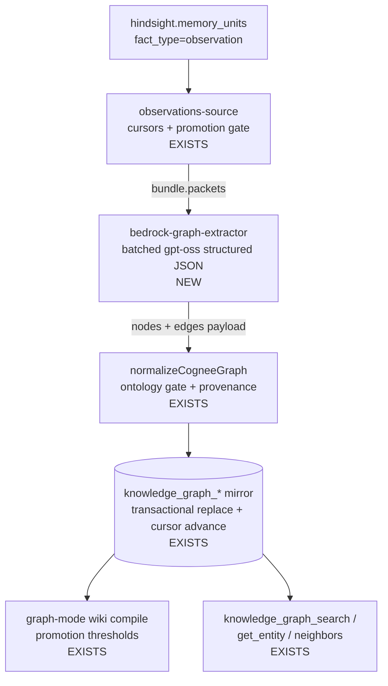

# Bedrock-native knowledge-graph extraction - Plan

## Goal Capsule

- **Objective:** Brain distillation actually runs: Hindsight observations flow into the knowledge-graph mirror through a Bedrock-native extraction step, replacing the retired Cognee dependency. The dev Brain seeds fresh through the new pipeline.
- **Product authority:** Eric Odom, 2026-07-03 session (THINK-133 E2E verification surfaced the blocker; scope confirmed in dialogue).
- **Open blockers:** None.

---

## Product Contract

### Summary

The knowledge-graph observations-ingest pipeline is complete and proven except for its extraction engine, which is hard-wired to the retired Cognee service (`COGNEE_ENDPOINT is not configured`; schedule disabled; zero observation-sourced entities despite thousands of Hindsight observations). Replace the Cognee call triple with one batched Bedrock structured-output extraction call over promoted observations, keep the entire downstream contract unchanged (normalizer → ontology gate → transactional mirror replace → promotion → graph-mode wiki → KG tools), retire the parallel Cognee-backed thread-ingest path, and seed the dev Brain fresh.

### Problem Frame

THINK-133 shipped the Brain architecture end-to-end, and every stage was verified live on dev **except** distillation: `knowledge-graph-observations-ingest` imports `CogneeClient`, Cognee is retired platform-wide (`enable_cognee=false` forced on every deploy), so the Hindsight→KG link has never run. The dream state now produces clean, consolidated, contradiction-reconciled observations — the ideal extraction input — but nothing turns them into graph entities and relationships. Hindsight's own entity layer is not a substitute: its entities are noisy untyped tokens ("user", "food", "bar") and its edges are unlabeled co-occurrence counts, while the Brain needs typed entities and semantically labeled relationships.

### Key Decisions

- **Extraction is one direct LLM call, not a service.** The extraction step (observation text → typed entities + labeled relationships) runs as a batched Bedrock structured-output call inside the existing ingest Lambda. No new infrastructure, no graph engine — consistent with THINK-133's plain-Postgres decision.
- **OSS high-quota models.** Extraction is categorization-shaped work; it runs on the `openai.gpt-oss` family already used platform-wide (Hindsight retain/reflect, requester-memory dreaming), pinned as a config constant. No premium model, no new quota.
- **The downstream READ contract is frozen; the mirror WRITE mode changes.** The extractor is a drop-in for the Cognee call triple; its output feeds the existing normalizer input shape, and the ontology gate, provenance grounding, and cursor-advance-in-same-transaction semantics stay as they are. The mirror write cannot stay a full-snapshot replace: Cognee's dataset accumulated across runs (each fetch returned the whole graph), while the extractor sees only each run's cursor-gated new packets — replace semantics would wipe the mirror to the newest batch every sweep and the shrink guard would then wedge cursor advance. The observations source moves to a transactional merge-upsert (KTD-8); full-corpus re-extraction per run was rejected as unboundedly expensive on a 30-minute schedule.
- **Thread-ingest retires.** The operator-triggered Cognee-backed thread-ingest path is removed rather than converted: observations are the only ingestion path into the Brain (THINK-133 R5), and thread content reaches the Brain through retain → consolidation → observations anyway.
- **No backlog migration.** The existing observation rows need no special drain or transformation (per Eric). The Brain seeds fresh through the new pipeline; a cursor reset makes the first sweep walk all current observations, so no knowledge is lost — it just arrives through the clean path.
- **Nothing Cognee-named survives in the ingest path.** The graph-payload types the normalizer consumes move from `plugin-company-brain` to a neutral home in the knowledge-graph lib. Full plugin deletion remains on the existing cleanup track (grep-gated drop, separate PR).

### Requirements

- R1. `knowledge-graph-observations-ingest` runs without Cognee: promoted observation packets are extracted into typed entities and labeled relationships by a Bedrock structured-output call and land in the `knowledge_graph_*` mirror through the existing normalizer.
- R2. Extraction model is a code-level config constant from the `gpt-oss` family, overridable by env, batched over packets with strict per-item validation; malformed model output for a batch is never partially trusted, and a batch still failing after the retry envelope fails the RUN — cursors must not advance past unextracted observations (silent permanent knowledge loss); the next sweep retries the same candidates.
- R3. Entity types resolve against the approved ontology exactly as today — the normalizer's grounding gate remains the second safety net behind the extraction prompt.
- R4. Evidence provenance still works: extracted entities/relationships link back to the observation packets that produced them (observation-ID references, no snippet leakage beyond the normalizer's existing behavior).
- R5. The thread-ingest path (Lambda, mutations, web Explorer trigger) is removed; the ingest-runs history table and its read surfaces remain.
- R6. The ingest path has zero imports from `@thinkwork/plugin-company-brain`; `COGNEE_ENDPOINT`/`COGNEE_BACKEND_MODE` env and the Cognee VPC attachment leave the handler's terraform.
- R7. The observations-ingest schedule is variable-gated (ships disabled), enabled on dev only after a manual validated run; the dev Brain seeds fresh via cursor reset through the new extractor.
- R8. After dev enablement, the previously fixture-proven chain runs on real data: observation-sourced grounded entities exist, graph-mode wiki compile materializes promoted pages, and the KG tools return real content in a live thread.

### Acceptance Examples

- AE1. Given promoted observations mentioning "Acme Corp is our key manufacturing customer; Jane Doe leads the renewal", when ingest runs, then the mirror holds typed entities (Acme Corp, Jane Doe) and a labeled relationship between them, each with observation evidence refs — and sub-ontology or junk candidates are absent.
- AE2. Given the model returns malformed JSON for one batch after the retry envelope, when ingest runs, then the run fails with drop metrics recorded, no mirror write or cursor advance occurs, and the next sweep retries the same candidates.
- AE3. Given the dev cursor reset and one full sweep, when a user asks the agent about a customer discussed in past conversations, then `knowledge_graph_search` returns real entities (AE3 of the THINK-133 plan finally passes on live data).

### Scope Boundaries

**Deferred for later**
- Full deletion of `plugins/company-brain` / `CogneeClient` — existing cleanup track once no imports remain.
- Hindsight entity-layer signals (mention counts, co-occurrence) as extraction *hints* — considered and parked; observations text is sufficient input for v1.
- Per-tenant extraction tuning or model selection UI.
- External-source evidence producers (Drive/Slack/GitHub) — unchanged THINK-133 R13 accommodation.

**Outside this product's identity**
- Re-enabling Cognee in any form; any dedicated graph engine.

### Dependencies / Assumptions

- The normalizer's input contract (`{nodes, edges}` graph payload with node `type`/`is_a` resolution and label-based evidence matching) is stable and test-covered (`normalizer.test.ts` fixtures define the exact shape).
- The house Bedrock structured-JSON pattern (`invokeClaudeJson<T>` with retry + parse hardening) runs on `gpt-oss` model ids today in the wiki planner — that is the gpt-oss structured-JSON precedent. `observation-promotion-gate.ts`'s `classifyWithBedrock` is the exemplar for batching/strict-validation mechanics only; it pins `moonshotai.kimi-k2.5` (chosen over Haiku for quota), which is the natural fallback model id if the U4 sample review fails on gpt-oss.
- The shared Lambda role already carries Bedrock invoke permissions (the promotion-gate classifier runs in this same handler today).
- The observations-ingest handler is already in the `BUNDLED_AGENTCORE_ESBUILD_FLAGS` bundling list.

---

## Planning Contract

### Key Technical Decisions

- KTD-1. **Drop-in seam:** the extractor replaces exactly the `ingestDocument → waitForDatasetIndexing → fetchDatasetGraph` triple in the handler and returns the graph-payload shape `normalizeCogneeGraph` consumes. The fullRebuild purge of the external store becomes a no-op (there is no external store).
- KTD-2. **Packets, not the rendered document:** extraction consumes `bundle.packets` (per-observation, with ids); batch size is a config constant. Provenance rides the normalizer's existing evidence matching — it label-matches entity/edge labels against `bundle.evidence` pseudo-messages (whose `evidenceSourceRef` is the observation id) — so the extraction prompt MUST require entity labels to be verbatim substrings of the source observation text, or entities land `provenanceStatus: missing` (a model canonicalizing "Acme Corp" to "Acme Corporation" breaks linkage). Node-id namespacing per packet remains for id uniqueness across batches only, not as a provenance channel.
- KTD-3. **Emit ontology types directly:** nodes carry `type` = approved ontology slug (prompt lists the tenant's approved entity/relationship types); no Cognee `EntityType`/`is_a`/`belongs_to_set` scaffold nodes. The `scopeNodeSetSubstrings` argument drops from the observations call.
- KTD-4. **Mirror `classifyWithBedrock`:** pinned model id (`KG_EXTRACTION_MODEL_ID`, default `openai.gpt-oss-120b-1:0`), batched, strict per-item validation, via `invokeClaudeJson<T>` with its retry envelope — with two extraction-specific hardenings: `maxTokens` raised and batch size bounded against a worst-case payload estimate (graph payloads are far larger than classifier verdicts, and gpt-oss reasoning tokens share the output budget), and `stopReason: max_tokens` treated as a distinct outcome from malformed JSON (truncation retries identically every time; it must surface, not fold into the generic drop path). Converse tool-use/schema-constrained output was considered and declined for consistency with the house prompt-JSON pattern — revisit if U4 drop rates are high.
- KTD-5. **Type relocation:** graph-payload types (`GraphExtractionPayload` née `CogneeGraphPayload`, node/edge types) move to `packages/api/src/lib/knowledge-graph/graph-payload.ts`; the normalizer and both call sites import from there. `plugin-company-brain` keeps re-exporting its old names untouched for the cleanup track to delete.
- KTD-8. **Merge-upsert mirror writes for the observations source:** entities keyed on (normalized label, ontology type slug), relationships on (endpoint pair, type), evidence appended; applied transactionally with cursor advance as today (`extraWork`). The shrink guard retires for this source — it guarded a replace that no longer happens. `fullRebuild` keeps a full-wipe path (delete by source_ref, reset cursors) as the re-seed lever.
- KTD-6. **Schedule ships variable-gated** (`knowledge_graph_observations_ingest_enabled`, default false) following the `wiki_source`/GHA-variable pattern from THINK-133 U8; dev flips only after the manual validated run.

### High-Level Technical Design

The only new box is the extractor. Cognee's three-call remote round-trip becomes one local batched model call; everything else in the diagram shipped and was verified with fixtures on 2026-07-03.

---

## Implementation Units

### U1. Bedrock graph extractor + neutral payload types

- **Goal:** A tested extraction module that turns observation packets into the normalizer's graph payload.
- **Requirements:** R1, R2, R3 (prompt side), R4, R6 (type home); AE1, AE2.
- **Dependencies:** none.
- **Files:** `packages/api/src/lib/knowledge-graph/graph-payload.ts` (new — relocated node/edge/payload types), `packages/api/src/lib/knowledge-graph/bedrock-graph-extractor.ts` (new), `packages/api/src/lib/knowledge-graph/bedrock-graph-extractor.test.ts` (new), `packages/api/src/lib/knowledge-graph/normalizer.ts` (import swap only), `plugins/company-brain/src/api/cognee-client.ts` (re-export relocated types).
- **Approach:** Mirror `observation-promotion-gate.ts`'s `classifyWithBedrock` shape: batch `bundle.packets` (config-constant batch size), one `invokeClaudeJson` call per batch with a system prompt carrying the tenant's approved ontology entity/relationship types and junk-rejection guidance (no conversational-role tokens, no generic nouns), strict per-item validation of ids/labels/types, node ids namespaced per packet for provenance, dedupe nodes by normalized label across batches. Malformed batch output → drop batch, count in metrics, continue.
- **Execution note:** Start from the `normalizer.test.ts` fixtures — the extractor's output must satisfy that contract; write a round-trip test (extractor output → real normalizer) early.
- **Test scenarios:**
  - Covers AE1. A packet with two entities and a stated relationship yields typed nodes + a labeled edge that the real normalizer grounds to `grounded` given a matching ontology.
  - Covers AE2. A batch whose mocked model reply is malformed JSON or fails validation contributes zero nodes/edges; other batches still land; drop count surfaces in the result.
  - Entity emitted with a type absent from the ontology passes through the extractor but is dropped by the normalizer gate (second-net proof).
  - Cross-batch duplicate entity labels dedupe to one node with merged provenance.
  - Model id and batch size read from the single config point; env override respected (wrap env reads in functions per vitest env-capture timing).
  - Truncated model output (`stopReason: max_tokens`) surfaces as a distinct outcome from malformed JSON in the extractor result.
  - Golden set: a fixed fixture of 10-15 observation packets with expected entities/relationships ships with the module (used offline in tests with a mocked model for shape, and against the live model once in U4 as the quality gate).
- **Verification:** module tests green including the real-normalizer round-trip; `pnpm --filter @thinkwork/api test` green.

### U2. Swap the observations-ingest handler to the extractor

- **Goal:** The ingest Lambda runs Cognee-free end-to-end.
- **Requirements:** R1, R6, R7 (terraform half); AE2.
- **Dependencies:** U1.
- **Files:** `packages/api/src/handlers/knowledge-graph-observations-ingest.ts`, `packages/api/src/handlers/knowledge-graph-observations-ingest.test.ts`, `packages/api/src/lib/knowledge-graph/repository.ts` (+ test — merge-upsert write path per KTD-8), `terraform/modules/app/lambda-api/handlers.tf` (env swap: drop `COGNEE_ENDPOINT`/`COGNEE_BACKEND_MODE`, add `KG_EXTRACTION_MODEL_ID`; schedule state ← new variable; drop Cognee VPC attach for this handler), `terraform/modules/app/lambda-api/variables.tf`, `terraform/modules/thinkwork/{main,variables}.tf`, `terraform/examples/greenfield/main.tf`, `.github/workflows/deploy.yml` (GHA-variable pass-through per the `wiki_source` pattern).
- **Approach:** Replace the client triple with the extractor (KTD-1); switch the observations write path to the KTD-8 merge-upsert (shrink guard retired for this source; `fullRebuild` = delete-by-source_ref + cursor reset); a batch dropped after retries fails the run without mirror write or cursor advance (R2/AE2); drop `scopeNodeSetSubstrings`; keep fallback and cursor `extraWork` semantics. Handler `deps` seam swaps `cogneeClient` for an injectable extractor (test seam).
- **Test scenarios:**
  - Happy path: promoted packets → extractor payload → normalize → merge-upsert called with cursor extraWork (existing assertions re-pointed at the extractor mock).
  - Second incremental run merges new entities without deleting prior-run entities (the Cognee-accumulator regression case).
  - Extractor throwing or any batch dropping after retries marks the run failed with no mirror write and no cursor advance; the same candidates are due next run.
  - fullRebuild path performs no external purge call; it deletes by source_ref and resets cursors (the re-seed lever).
  - Sweep path unchanged (per-tenant fan-out, truncation self-invoke).
- **Verification:** handler suite green; `terraform fmt -check`; single-handler bundle builds and imports cleanly (`node --input-type=module` check — the SDK-bundling gotcha from U4 of THINK-133).

### U3. Retire the thread-ingest path

- **Goal:** The second Cognee dependency is gone, not converted.
- **Requirements:** R5, R6.
- **Dependencies:** none hard; land after U2 so the deploy never has zero working ingest paths.
- **Files:** delete `packages/api/src/handlers/knowledge-graph-thread-ingest.ts` + test; `packages/api/src/graphql/resolvers/knowledge-graph/startThreadIngest.mutation.ts` + registration in `resolvers/knowledge-graph/index.ts`; `packages/api/src/lib/knowledge-graph/invoke-worker.ts` (trim ONLY the thread-worker exports — the observations invoker, `resolveObservationsWorkerFunctionName`, and the shared invoke core stay: they are consumed by the observations handler, the startObservationsIngest mutation, and ontology reprocess); `packages/database-pg/graphql/types/knowledge-graph.graphql` (mutation removal); `apps/web/src/components/settings/knowledge-graph/KnowledgeGraphExplorer.tsx` (+ test — trigger AND thread-candidate picker removal), the `knowledgeGraphThreadCandidates` query (resolver + registration + GraphQL type fields + `apps/web/src/lib/settings-queries.ts` queries — they exist solely to feed the removed trigger); codegen regen (web/cli/mobile); `terraform/modules/app/lambda-api/handlers.tf` (handler entry, timeout/memory ternaries, VPC attach); `scripts/build-lambdas.sh`.
- **Approach:** Removal, not deprecation: mutations and UI trigger go; `knowledge_graph_ingest_runs` rows and their read queries stay (history remains visible). Follow the grep-must-match-import-form discipline before deleting shared helpers.
- **Test scenarios:**
  - Explorer renders without the thread-ingest trigger; remaining Explorer tests green.
  - GraphQL schema no longer exposes the thread-ingest mutations (codegen diff is the proof).
  - Test expectation: none beyond the above — deletion unit; the gate is suites + typecheck across api/web after codegen.
- **Verification:** full api + web suites green; workspace typecheck green; deploy applies cleanly (Lambda + schedule-free handler removal).

### U4. Dev enablement and fresh Brain seed

- **Goal:** The Brain distills real data on dev; THINK-133's parked AE3 verification passes on live content.
- **Requirements:** R7, R8; AE3.
- **Dependencies:** U2 (U3 landing first is preferred but not required).
- **Files:** none beyond ops evidence — GHA variable flip, cursor reset, run-ledger/mirror queries recorded in the PR or Linear.
- **Approach:** Manual `{tenantId, trigger:"manual"}` invoke on dev first; run the U1 golden set against the live model with a numeric bar — zero junk entities, >=80% expected-entity recall — as the schedule-enable gate, alongside inspecting run metrics + a grounded-entity sample (tune the U1 prompt constants if either fails — this is the expected tuning loop); reset observation cursors for the tenant so the next sweep walks all current observations (the "fresh seed"); enable the schedule via the GHA variable; confirm graph-mode wiki compile promotes real pages and a live thread answers a Brain question through the KG tools.
- **Execution note:** Diagnostic-first, same as THINK-133 U1 — read the first run's dropped/gated counts before enabling the schedule; the promotion gate and ontology gate metrics say whether the prompt needs tuning.
- **Test scenarios:** Test expectation: none — configuration + evidence unit; the eval-side quality gate is the THINK-133 U9 brain-leverage dataset once eval-mode tool gating is addressed (separate follow-up).
- **Verification:** dev mirror holds observation-sourced grounded entities with labeled relationships; wiki pages exist for expected entities and no junk pages (THINK-133 Success Criteria bar); `knowledge_graph_search` returns real content in a live dev thread (AE3); schedule ENABLED and next sweep succeeds unattended.

---

## Verification Contract

| Gate | Command / evidence | Applies to |
|---|---|---|
| Package suites (api) | `pnpm --filter @thinkwork/api test` | U1–U3 |
| Package suites (web) | web suite after U3 codegen | U3 |
| Typecheck | `pnpm -r --if-present typecheck` | all units |
| Normalizer round-trip | extractor output through the real `normalizeCogneeGraph` in tests | U1 |
| Bundle import check | built handler zip imports under `node --input-type=module` | U2 |
| Terraform | `terraform fmt -check`; deploy applies (env swap, schedule var, handler removal) | U2, U3 |
| Dev smoke | manual ingest run → grounded entities sample review → cursor reset → scheduled sweep green | U4 |
| Quality bar | no junk entities/pages in dev sample (Hindsight's "user"/"food" failure mode is the anti-benchmark) | U4 |

Full package suites before each PR; watch the post-merge Deploy run on main for every merge.

## Definition of Done

- Observations-ingest runs Cognee-free on dev via the Bedrock extractor; zero `@thinkwork/plugin-company-brain` imports remain in the ingest path.
- Thread-ingest Lambda, mutations, and UI trigger are removed; ingest-run history remains readable.
- Dev Brain seeded fresh: observation-sourced grounded entities + labeled relationships in the mirror, real wiki pages via graph mode, live-thread KG tool answer (THINK-133 AE3 closed on real data).
- Schedule enabled on dev via variable gate; one unattended sweep succeeds.
- Extraction model + batch size are config constants (`gpt-oss` family), tunable without schema change.

---

## Sources / Research

- Seam map (2026-07-03 session): handler call triple at `knowledge-graph-observations-ingest.ts:339-355`; injectable `deps.cogneeClient` seam; `normalizeCogneeGraph` input contract and `replaceKnowledgeGraphSnapshot` transaction incl. cursor `extraWork`.
- House pattern: `packages/api/src/lib/wiki/bedrock.ts` `invokeClaudeJson<T>`; working exemplar `packages/api/src/lib/knowledge-graph/observation-promotion-gate.ts` (`classifyWithBedrock`).
- Rejected alternative (verified on dev data): mirroring Hindsight's native entity layer — 13k entities dominated by junk tokens ("user", "assistant", "food"), unlabeled co-occurrence edges only; would rebuild the junk-wiki failure THINK-133 exists to prevent. Parked as a future salience *hint*, not a source of record.
- THINK-133 plan (`docs/plans/2026-07-03-001-feat-thinkwork-brain-memory-architecture-plan.md`) — this unblocks its R5/R13 goals; its fixture-based E2E (2026-07-03) proved everything downstream of the extractor.
- `seeds` of context: schedule state currently disabled out-of-band on dev despite `ENABLED` in terraform — the variable gate in U2 makes intent explicit.
