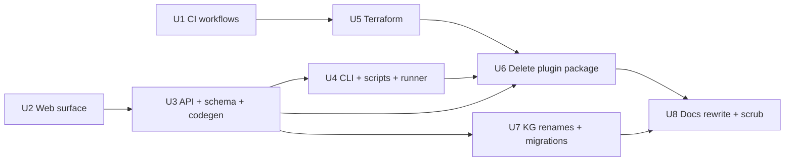

# Complete Cognee eradication - Plan

## Goal Capsule

Remove every Cognee reference from the ThinkWork repo: retire the `plugins/company-brain` premium product wholesale, strip Cognee from all live code, terraform, and CI, rename the Cognee-derived identifiers that survive in the Bedrock KG pipeline (including persisted DB values), and rewrite the docs corpus — sequenced so every intermediate merge deploys green. Done means `grep -ri cognee` over the repo returns zero hits and the Brain pipeline still runs live on dev.

---

## Product Contract

### Summary

The Bedrock KG extractor (plan 2026-07-03-005) replaced Cognee as the only Brain distillation path, and CI already deploys with `enable_cognee=false` / `memory_engine=hindsight` hardcoded. Cognee is dead weight: ~4,600 references across code, terraform, CI, and docs, plus a superseded premium product (`plugins/company-brain`) built entirely on it. This plan deletes the product, scrubs every surface, and aligns the docs to the shipped Postgres-graph Brain that CONCEPTS.md already describes.

### Problem Frame

Cognee was retired operationally but never structurally: the memory-engine enum still accepts `"cognee"`, ~50 terraform variables plumb dead config through three module tiers, CI builds and pushes a Cognee Docker image on every release, the web app ships a Brain Operations page querying a resolver for a substrate that no longer exists, and live user docs still tell operators to provision Cognee. Residual vocabulary also leaks into new output: KG ingest runs stamp `ontologyMechanism: "cognee_owl_ontology"` and OKF pages carry a `company-brain` tag. Directive from Eric: "There should be NO Cognee references ANYWHERE in the repo now."

### Requirements

- R1. Delete the entire `plugins/company-brain` package — code, Dockerfile, terraform module, smokes, catalog entry — and every external edge to it.
- R2. Remove Cognee from all live TypeScript surfaces: memory-engine union, cognee-adapter, brain resolvers + `brain.graphql`, DeploymentStatus/MemorySystemConfig cognee fields, managed-app `"cognee"` key, plugin handlers, deployment-runner registry, CLI provisioning/config, web components and routes.
- R3. Remove Cognee from terraform (all `cognee_*`/`enable_cognee` variables, count-gated resources, outputs, `memory_engine` enum value) and from CI workflows (image builds, `-var` flags, DB-cred prep, `vars.COGNEE_*`), sequenced so no deploy breaks.
- R4. Rename Cognee-derived identifiers in the surviving KG pipeline: code symbols, GraphQL fields, DB column names, the persisted `cognee_owl_ontology` mechanism value, and the `company-brain` OKF tag — with data migrations for persisted values.
- R5. Rewrite the docs corpus: 14 live Starlight pages get real rewrites aligned to CONCEPTS.md's Postgres-graph Brain framing; historical plans/brainstorms/solutions get scrubbed or deleted.
- R6. The Brain pipeline (observations → extraction → KG → wiki → OKF) keeps running live on dev throughout and after the eradication.

### Acceptance Examples

- AE1. `rg -i cognee` (and `company-brain`, `company_brain`, `CompanyBrain`) across the repo — excluding `pnpm-lock.yaml` regeneration artifacts and `.git` — returns zero hits after the final unit.
- AE2. After each merged PR in the sequence, the post-merge Deploy run on `main` is green and `thinkwork doctor -s dev` passes.
- AE3. A scheduled `knowledge-graph-observations-ingest` run completes `succeeded` on dev after the rename unit, with run metrics free of `cognee*` keys and `ontology_mechanism` carrying the new value.
- AE4. A freshly compiled OKF bundle contains no `company-brain` tag and no `cognee`-named frontmatter.
- AE5. Terraform `plan` against dev after the terraform unit shows no resource destruction (the cognee graph was already count=0) and no undeclared-variable errors.

### Scope Boundaries

**In scope:** everything above, including GHA repository-variable cleanup (`vars.COGNEE_*`) and Drizzle migrations for column renames and persisted-value updates.

**Deferred to Follow-Up Work:**
- Dropping the `brain.*` schema (10 tables). Code references are removed in U3; the destructive DROP waits for Eric's explicit sign-off because the standing rule forbids dropping tables outside `public.*` without it. Tracked as an open decision, not silently done. (Note: U7's guarded UPDATE touches `brain.artifact_manifests`; record that fix in the drop-decision notes so the eventual DROP doesn't orphan it.)
- Patching live customer deploy repos (mcpherson) before they pin a module version ≥ the U5 release — their generated `terraform/main.tf` passes ~25 `cognee_*` arguments the new module rejects. Owner: whoever cuts the first post-removal release; mechanism: regenerate from the updated U4 enterprise template or hand-patch.
- Dropping the retired `agent_skills` table (pre-existing deferred item, unrelated — noted to avoid bundling temptation).
- Claude-memory files outside the repo (`~/.claude/projects/.../memory/`) mention Cognee historically; repo-external, out of scope.

**Open decision (blocks AE1's literal zero):** `packages/database-pg/src/schema/brain.ts` declares `cognee_version`/`cognee_endpoint` columns and a `legacy_cognee` enum value that mirror live columns in the deferred-drop `brain.*` schema. Either (a) obtain the `brain.*` drop sign-off before U8 so the dead Drizzle model deletes with the schema, or (b) record an explicit AE1 carve-out for those `brain.ts` lines, retired when the drop lands. Trimming the model while the tables live risks `db:push` generating non-public drops. Eric decides at U8 time.

**Outside this product's identity:** re-introducing any external graph engine. The plain-Postgres KG is the Brain substrate (see `project_pi_is_core` / CONCEPTS.md).

### Dependencies / Assumptions

- CI hardcodes `enable_cognee=false` (`deploy.yml:911`, `verify.yml:238`) and `memory_engine=hindsight`, so workflow-flag removal is behavior-preserving. Verified on origin/main.
- The cognee terraform resource graph is count=0 in dev state (never applied with `enable_cognee=true` on dev). **Verify per-stage state before U5 applies** — if any stage ever enabled it, resources would be destroyed.
- Registry consumers pin `thinkwork-ai/thinkwork/aws` by released version; removing module variables is safe for them because their pinned versions predate the removal. New versions must not receive old `-var` flags (guaranteed by landing U1 before U5).
- `docs/plans/2026-07-03-005` (extractor) is fully merged; the observations ingest handler no longer imports `CogneeClient` (verified — only `cogneePruneAll` plumbing and the `normalizeCogneeGraph` name remain).
- Assumption (autopilot, unconfirmed): pure-Cognee historical docs (13 files with "cognee" in the filename, plus the company-brain runbook/solutions that document only the deleted product) are **deleted**, not rewritten — rewriting a doc whose entire subject is the removed system produces contentless husks. Mixed historical docs are scrubbed in place. Interrupt if you want full preservation-with-rewrite instead.

---

## Planning Contract

### Key Technical Decisions

- **KTD1 — CI before terraform (hard ordering).** Terraform errors fatally on undeclared `-var` flags. Removing workflow `-var "cognee_*=…"` flags while the variables still exist is harmless; the reverse breaks every deploy. U1 (CI) must be merged **and observed green** before U5 (terraform) merges.
- **KTD2 — Web operations before schema, schema before codegen.** GraphQL codegen fails if web/CLI operations reference removed fields. Order inside the API/web units: drop client operations (U2) → edit `.graphql` sources + resolvers (U3) → regenerate codegen in all four consumers (`packages/api`, `apps/web`, `apps/cli`, `apps/mobile`).
- **KTD3 — Delete the plugin package last among code units.** Five import edges (`managedApplications`, `deploymentStatus`, `cognee-adapter`, `deployment-runner/registry`, context-engine provider) plus the terraform module source path (`thinkwork/main.tf:1555`) and the boundary-verifier map must be severed first. Deleting early breaks builds; deleting after U3/U4/U5 is a pure directory removal.
- **KTD4 — Rename, don't drop, the surviving KG columns.** `cognee_node_id`, `cognee_edge_id`, `cognee_dataset_name/id` on `public.knowledge_graph_*` are live data in the Bedrock pipeline and get `ALTER TABLE … RENAME COLUMN` migrations in the same PR as the code rename. The only persisted `cognee_owl_ontology` value lives in `brain.artifact_manifests.ontology_mechanism` (verified on dev; `public.knowledge_graph_ingest_runs` has no mechanism column — new-run metrics pick up the new value from the renamed code with no data migration). Migration-apply ordering: run the dev `psql` apply in the same sitting as the merge, **before** the deploy workflow reaches its `db:migrate-manual` drift-gate step; if the gate fires first, apply and re-run the deploy job — the re-run counts as U7's green outcome for AE2. Applying before merge is not an option (deployed old code would hit renamed columns). Non-dev stages: see U7's per-stage rollout requirement.
- **KTD5 — GHA repository variables are deleted after U1 merges, not before.** GHA vars snapshot at trigger time; deleting `vars.COGNEE_*` while workflows still read them would inject empty strings into `-var` flags on in-flight runs. After U1 removes the reads, the variables are dead and deleted via `gh variable delete`.
- **KTD6 — Docs align to CONCEPTS.md, which is already post-Cognee.** CONCEPTS.md describes the Tenant Brain as "a lightweight knowledge graph in plain Postgres" with zero Cognee vocabulary. The 14 live `docs/src` pages are rewritten to that framing (several sections — Cognee substrate operations, the Cognee managed-app row — are deleted outright rather than reworded).
- **KTD7 — New non-Cognee names.** `normalizeCogneeGraph` → `normalizeExtractedGraph`; `CogneeGraph*` aliases dissolve into the existing `GraphExtraction*` types; metrics `cogneeNodeCount/cogneeEdgeCount` → `extractedNodeCount/extractedEdgeCount`; enum `COGNEE_PAYLOAD`/`cognee_payload` → `GRAPH_PAYLOAD`/`graph_payload` (enum member rename needs a CHECK-constraint migration); columns `cognee_node_id/edge_id` → `graph_node_id/graph_edge_id`; `cognee_dataset_name/id` → `source_dataset_name/id`; mechanism value `cognee_owl_ontology` → `approved_ontology`; fallback reason `cognee_returned_no_approved_entities` → `extractor_returned_no_approved_entities`; OKF tag `company-brain` → `brain`.

### High-Level Technical Design

Removal order is the design. Arrows are "must land before":

U1 and U2 are independent and can start in parallel worktrees. U8 is last so the final repo-wide grep gate (AE1) runs against the finished tree.

---

## Implementation Units

### U1. Strip Cognee from CI workflows + GHA variables

**Goal:** deploy/verify/release run identically with zero Cognee steps, flags, or variable reads.
**Requirements:** R3. **Dependencies:** none.
**Files:** `.github/workflows/deploy.yml`, `.github/workflows/verify.yml`, `.github/workflows/release.yml`.
**Approach:** Remove from `deploy.yml`: path filters (`plugins/company-brain/runtime|terraform/cognee/**`, lines 132–137), `cognee: false` controller flag (553), the Cognee image build step (623–635, already `if: ${{ false }}` on main), `vars.COGNEE_*` inputs + normalization + "Deprecated graph memory" warning (887–962), the "Prepare deprecated graph database credentials" step (1202–1305), and all `-var "cognee_*"`/`-var "enable_cognee"` flags (1544–1554; keep `-var "memory_engine=hindsight"`). Mirror in `verify.yml` (202–249, 278–283, 336–345). Remove from `release.yml`: the Cognee amd64 image build + manifest `--image name=cognee` wiring (69, 169–181, 205, 223). **The same PR must also** remove the cognee entry from `defaultManagedApps` in `scripts/release/build-release-manifest.ts` (~722–735) and update `packages/release-manifest/test/manifest.test.ts` — the builder's default list hardcodes `requiredImages: ["cognee"]` and throws `requiredImages references unknown runtime image` once the `--image name=cognee` flag disappears, so a release cut between U1 and U4 would fail if this edit stayed in U4. After merge + green deploy: `gh variable delete` for the 11 `COGNEE_*` repository variables.
**Test scenarios:** Test expectation: none — workflow YAML; verification is the live pipeline. Covers AE2: post-merge Deploy run green; a `terraform plan` inside that run shows no changes.
**Verification:** `gh run list --branch main` deploy green; release workflow dry parse (`actionlint`) clean.

### U2. Remove the web Cognee/Company-Brain surface

**Goal:** no web component queries or renders Cognee-backed data; client GraphQL operations no longer reference soon-to-be-removed fields.
**Requirements:** R2. **Dependencies:** none (must merge before U3's codegen).
**Files:** delete `apps/web/src/components/settings/brain/BrainOperationsPage.tsx` (+ test), `apps/web/src/routes/_authed/settings.applications.cognee.tsx`; edit `apps/web/src/lib/settings-queries.ts` (drop `cognee*` DeploymentStatus fields, `SettingsCompanyBrainStatusQuery`, both migration mutations, `cogneeDatasetName/Id` KG fields), `apps/web/src/lib/graphql-queries.ts` (`cogneeMemoryEnabled`), `KnowledgeGraphConfigPanel.tsx`, `managed-applications/{ManagedApplicationsPage,ManagedApplicationRow,ManagedApplicationPlanDialog,types}.tsx` (drop `"cognee"` from `ManagedAppKey`, company-brain rows/links), `ManagedApplicationRouteGuard.tsx`, `settings-nav.tsx`, `SettingsSidebar.tsx`, `SettingsGeneral.tsx` (`optionalApps.cognee`), `plugins/{PluginDetail,PluginsPage}.tsx` (`isCompanyBrain` special-casing); update affected tests (`-settings-legacy-plugin-redirects.test.ts`, `ManagedApplicationsPage.test.tsx`, `settings-nav.test.ts`, `SettingsMemory*.test.tsx`, `SettingsGeneral.test.tsx`, `PluginDetail.test.tsx`); regenerate `routeTree.gen.ts`.
**Test scenarios:** managed-applications page renders with only surviving app keys (twenty, n8n); legacy `/settings/applications/cognee` route removed (404/redirect-to-plugins expectation updated); settings nav renders without a Brain/Cognee entry; plugin catalog page renders without company-brain special-casing.
**Verification:** `pnpm --filter @thinkwork/web test` + `typecheck` green; web dev server renders Settings → Plugins and Settings → Memory without console errors.

### U3. Remove Cognee from the API: schema, resolvers, memory engine, plugin handlers

**Goal:** the API compiles with no Cognee code paths; GraphQL schema has no Company Brain types and no `cognee*` fields; codegen regenerated everywhere.
**Requirements:** R1 (edges), R2. **Dependencies:** U2.
**Files:** delete `packages/database-pg/graphql/types/brain.graphql`, `packages/api/src/graphql/resolvers/brain/` (whole dir), `packages/api/src/lib/memory/adapters/cognee-adapter.ts` (+ test); edit `core.graphql` (six `cognee*` DeploymentStatus fields), `memory.graphql` (`cogneeMemoryEnabled`), `packages/api/src/lib/memory/{types,config,index}.ts` (drop `"cognee"` union member, `resolveCogneeEndpoint`, adapter branch), `requester-memory/{hindsight-primary,hindsight-sync}.ts`, `graphql/resolvers/memory/memorySystemConfig.query.ts`, `graphql/resolvers/core/managedApplications.ts` (drop `"cognee"` key, `CogneeStatus`, `readCogneeStatus`, `cogneeManagedApplication`, plugin import), `core/deploymentStatus.query.ts`, `core/{knowledgeGraphHealthCheck,managedApplicationHealthCheck,setKnowledgeGraphDeployment,setManagedApplicationDeployment}.*`, `resolvers/deployments/shared.ts`, `lib/plugins/handlers/{infra,mcp}.ts`, `lib/plugins/premium-entitlements.ts` (company-brain backdoor gate), `lib/context-engine/providers/index.ts` (company-brain provider), `lib/deployments/{reconcile-job-evidence,release-preflight,release-update-payload}.ts`, `handlers/deployment-sessions.ts`, `handlers/knowledge-graph-observations-ingest.ts` (`cogneePruneAll` plumbing), `agentcore-pi/agent-container/src/{handler-context,server}.ts`; edit `plugins/catalog/src/registry/generated-first-party.ts` + `plugin-registry.test.ts` (drop company-brain registration); regenerate codegen: `pnpm --filter @thinkwork/{api,web,cli,mobile} codegen` and `pnpm schema:build`.
**Approach:** strip consumers of `readCogneeStatus`/`CogneeAdapter`/`resolveCogneeEndpoint` in the same commit as their definitions. `packages/api/package.json` and `plugins/catalog/package.json` drop the `@thinkwork/plugin-company-brain` workspace dep (the package itself survives until U6 for deployment-runner).
**Test scenarios:** memory engine config parses `hindsight`/`agentcore` and rejects `cognee` (explicit rejection test); `deploymentStatus` resolver returns the type without cognee fields; managed-applications resolver lists only surviving apps; `memorySystemConfig` has no `cogneeMemoryEnabled`; existing `knowledge-graph-observations-ingest.test.ts` suite still green after `cogneePruneAll` removal; general-reads-authz and schema tests updated.
**Verification:** `pnpm --filter @thinkwork/api test` + full `pnpm -r typecheck` green (worktree tsbuildinfo bootstrap first); post-merge deploy green; `thinkwork me` + a live GraphQL `deploymentStatus` query succeed on dev.

### U4. CLI, deployment-runner, release manifest, smokes, boundary verifier

**Goal:** no tooling generates, validates, or smoke-tests Cognee anything.
**Requirements:** R1 (edges), R2, R3. **Dependencies:** U3.
**Files:** `apps/cli/src/commands/init.ts` (drop the ~90-line `enable_cognee`/`cognee_*` terraform generation, module wiring, outputs), `apps/cli/src/commands/enterprise/templates/deploy-repo/terraform/main.tf` (drop the ~25 `cognee_*` variable declarations + module-call wiring at ~319–328), `apps/cli/src/commands/enterprise/templates/deploy-repo/docs/runbook.md` (drop the company-brain smoke instructions), `commands/config.ts` (memory-engine validation), `commands/wiki.ts` (Cognee comment), `commands/{deploy,release/helpers}.ts` (`cognee: false` optional-apps), delete `apps/cli/__tests__/terraform-cognee-fixture.test.ts`, edit sibling fixture tests; `packages/deployment-runner/src/apps/registry.ts` + `shared.ts` (drop `cogneeAdapter` import/registration + key validation) + its package.json dep + `deployment-runner-managed-apps.test.ts`; `scripts/smoke/managed-app-controller-readiness-smoke.mjs`; `scripts/verify-plugin-source-boundary.mjs` + `scripts/plugin-source-boundary-allowlist.mjs` + their tests (remove `company-brain`/`cognee` boundary map + allowlist entries); `scripts/smoke/README.md` (Company Brain smoke sections). (Release-manifest builder edit moved to U1 — see U1 Approach.)
**Test scenarios:** CLI `init` golden output contains no `cognee` (fixture snapshot updated); enterprise deploy-repo template scaffold output contains no `cognee` hits (new assertion); boundary verifier passes with the entries removed while `plugins/company-brain/` still exists (U6 not yet landed) — verify it does not require the map to cover every `plugins/*` dir; deployment-runner registry test lists surviving adapters only.
**Verification:** `pnpm --filter thinkwork-cli test`, deployment-runner + release-manifest suites, `node scripts/verify-plugin-source-boundary.mjs` green; root release tests via `npx tsx --test` (per standing note they're outside the `-r` suite).

### U5. Remove Cognee from terraform

**Goal:** the module tree has no cognee variables, resources, outputs, or enum values; applies cleanly with zero destroys.
**Requirements:** R3. **Dependencies:** U1 merged and observed green (KTD1).
**Files:** `terraform/examples/greenfield/main.tf` (~50 vars at 102–348, module wiring 981–1022, outputs 1328–1360), `terraform/modules/thinkwork/{variables,main,outputs}.tf` (validations, `enable_cognee` + `cognee_*` vars, `cognee_configuration_guardrails`, `module "cognee"` call at 1553–1614, SG/VPCE resources 628–860, 29 outputs, lambda-api/agentcore-pi wiring), `terraform/modules/app/lambda-api/{handlers,main,variables,iam-grouped}.tf` (`cognee_env`, `COGNEE_INGEST_MODE` statics, VPC gate at 752 reduces to OKF-EFS-only, `lambda_cognee_worker_vpc_access` attachment renamed via `moved` block or left keyed on OKF), `terraform/modules/app/agentcore-pi/{main,variables}.tf`, `terraform/modules/app/agentcore-runtime/main.tf` (memory_engine validations → `["hindsight","agentcore"]`), module READMEs.
**Approach:** keep existing `moved {}` blocks that reference historical cognee addresses only if terraform requires them for old-state compatibility — dev state should no longer hold those addresses; verify with `terraform state list | grep -i cognee` first, then delete the moved blocks too. Dropping the `cognee_env` map is a no-op for the deployed environment (it is already empty with `enable_cognee=false`); still correct cleanup, but budget no 4KB-ceiling relief on it. The `memory_engine` var keeps `hindsight`/`agentcore` and drops `""`+`cognee`+legacy `managed` mapping only if `resolved_memory_engine` logic allows — do not widen scope; minimal edit is removing `"cognee"` from the three validation lists and the dead branches. **Customer-repo upgrade path:** already-generated customer deploy repos (mcpherson) pass ~25 `cognee_*` arguments into the module call; the first module version they pin at or past this unit's release rejects those as unsupported arguments. Before publishing that first post-removal module version, patch (or regenerate from the updated U4 template) each live customer repo's `terraform/main.tf` — tracked in Deferred Follow-Up Work with an owner.
**Test scenarios:** Test expectation: none — terraform; verification is plan output. Covers AE5.
**Verification:** `terraform validate` in greenfield + each module; CI verify-run plan shows **no destroys and no undeclared-variable errors**; post-merge deploy green.

### U6. Delete `plugins/company-brain`

**Goal:** the package is gone.
**Requirements:** R1. **Dependencies:** U3, U4, U5 (all import/source-path edges severed).
**Files:** delete `plugins/company-brain/` entirely; `pnpm install` to regenerate the lockfile; sweep for stragglers: the stale relocation comment in `packages/api/src/lib/knowledge-graph/graph-payload.ts:7–8`, `apps/cli/src/lib/db-migrations.ts:277` comment, `.agents/skills/thinkwork-plugin-builder/references/*` mentions.
**Test scenarios:** `pnpm install && pnpm -r typecheck && pnpm -r test` green with the directory absent; `rg "plugin-company-brain|plugins/company-brain"` returns zero hits outside docs (docs handled in U8).
**Verification:** post-merge deploy green (path filters already gone via U1).

### U7. Rename Cognee-derived identifiers in the surviving KG pipeline (+ migrations)

**Goal:** the Bedrock KG pipeline carries no Cognee vocabulary in code, GraphQL, DB, run metrics, or OKF output.
**Requirements:** R4. **Dependencies:** U3 (schema/codegen churn settled).
**Files:** `packages/api/src/lib/knowledge-graph/{normalizer,runs,artifacts,source-fallback,ontology-export,graph-payload,observations-source}.ts`, `graphql/resolvers/knowledge-graph/{mappers,shared,graph.query,ingestRuns.query}.ts`, `ontology/suggestions.ts`, `handlers/knowledge-graph-observations-ingest.ts`, `lib/okf/materializer.ts` (`company-brain` tag → `brain`), `packages/database-pg/src/schema/{knowledge-graph,brain}.ts`, `packages/database-pg/graphql/types/knowledge-graph.graphql` (enum `COGNEE_PAYLOAD` → `GRAPH_PAYLOAD`, fields `cogneeDatasetName/Id` → `sourceDatasetName/Id`, `cogneeNodeId/EdgeId` → `graphNodeId/EdgeId`), new Drizzle migration(s) in `packages/database-pg/drizzle/`, codegen in all four consumers, `apps/web/src/lib/settings-queries.ts` KG fields.
**Approach:** apply KTD7's rename table. One migration file covers: column renames on `public.knowledge_graph_entities/relationships/ingest_runs` (+ their unique indexes), the `source_kind` enum/CHECK value `cognee_payload` → `graph_payload` with an UPDATE of existing rows, and the sole persisted-mechanism fix: a `to_regclass`-guarded `UPDATE brain.artifact_manifests SET ontology_mechanism='approved_ontology' WHERE ontology_mechanism='cognee_owl_ontology'` (`public.knowledge_graph_ingest_runs` has no mechanism column; new-run metrics carry the new value from renamed code with no data migration — historical runs keep old `cognee*` metric keys in jsonb, acceptable, note for UI consumers). **Per-stage rollout:** before merging, enumerate every stage whose DB carries `knowledge_graph_*` tables (dev, plus prod/mcpherson if the Brain schema has shipped there) and pair each stage's code deploy with its migration apply — psql for dev, the customer deploy-runner migration ledger for customer stages; if only dev has the tables, record that and proceed dev-only. Apply ordering per KTD4. Old wiki pages tagged `company-brain`: rerun the wiki materializer (pages are derived artifacts); verify regeneration covers all previously materialized pages, else one `UPDATE wiki.pages SET tags=…`.
**Test scenarios:** normalizer suite green under new names with identical behavior (rename-only — no logic change; assert via existing tests updated mechanically); repository.merge tests reference renamed columns; ingest run metrics contain `extractedNodeCount` and no `cognee*` keys; `ingestRuns` GraphQL query returns `ontologyMechanism: "approved_ontology"`; OKF bundle build emits `tags: ["brain", "entity"]`; migration idempotency: re-running the UPDATE is a no-op.
**Verification:** full `pnpm --filter @thinkwork/api test`; after deploy + psql apply, watch one scheduled ingest run complete `succeeded` on dev (AE3) and spot-check a wiki page + OKF page (AE4).

### U8. Docs corpus: rewrite live pages, scrub or delete historical ones

**Goal:** zero Cognee references in docs; live docs describe the shipped Postgres-graph Brain.
**Requirements:** R5. **Dependencies:** U6, U7 (final vocabulary settled).
**Files:** rewrite 14 `docs/src/content/docs/**` pages (heaviest: `guides/business-ontology-operations.mdx` — delete the "Operate the Cognee substrate" section; `deploy/managed-applications.mdx`, `deploy/release-manifests.mdx`, `deploy/configuration.mdx` (`memory_engine` doc), `concepts/knowledge/business-ontology.mdx`, `applications/admin/{managed-applications,memory,settings,index}.mdx`, `api/context-engine.mdx`, `applications/desktop/index.mdx`, `concepts/knowledge/{memory,okf-wiki-navigator}.mdx`, `deploy/github-free-customer-deployments.mdx`); delete pure-Cognee historical docs (13 cognee-named files in `docs/plans|brainstorms|solutions|verification` + `docs/solutions/runbooks/company-brain-premium-plugin-operations-2026-06-13.md` + the two company-brain-only architecture-pattern learnings + `docs/runbooks/brain-v0-dogfood.md` if fully obsolete); mechanical scrub of remaining ~70 mixed historical files (replace "Cognee" with "the retired graph substrate" or drop the clause; preserve document meaning); `terraform/modules/{thinkwork,app/agentcore-pi}/README.md`, `plugins/twenty/terraform/twenty/README.md`, `.agents/skills/thinkwork-plugin-builder/**`; final repo-wide grep gate.
**Approach:** live pages are hand-rewritten to CONCEPTS.md framing (KTD6); historical scrubs are mechanical and reviewed as a batch diff. Docs-site build must pass.
**Test scenarios:** Test expectation: none — docs; gates are the grep sweep and the Starlight build.
**Verification:** `rg -i "cognee|company.brain"` → zero hits repo-wide (AE1); `pnpm --filter docs build` (or the docs workspace's build script) green.

---

## Verification Contract

- Per-PR: `pnpm lint && pnpm -r typecheck && pnpm -r test && pnpm format:check` (pre-commit hooks); affected-package suites run in full, not just changed tests.
- Post-merge, every PR: watch the `main` Deploy run to green before starting the next dependent unit (AE2, KTD1).
- U5: terraform plan gate — zero destroys, zero undeclared-var errors (AE5); `terraform state list | grep -i cognee` empty on dev before deleting `moved` blocks.
- U7: stages carrying `knowledge_graph_*` tables enumerated before merge; migration applied per-stage paired with that stage's deploy (psql on dev, deploy-runner ledger on customer stages); drift gate (`db:migrate-manual`) green; one live scheduled ingest run observed `succeeded` (AE3); OKF spot-check (AE4).
- Final: repo-wide case-insensitive grep for `cognee` and `company-brain`/`company_brain`/`CompanyBrain` returns zero hits (AE1).

## Definition of Done

- [ ] `plugins/company-brain` deleted; workspace installs and full recursive suite green.
- [ ] No Cognee in CI: workflows carry no cognee steps/flags; `vars.COGNEE_*` deleted from the repo settings.
- [ ] No Cognee in terraform: variables/resources/outputs/enum values gone; dev plan clean with zero destroys.
- [ ] No Cognee in live TS code, GraphQL schema, or codegen output.
- [ ] KG pipeline renamed end-to-end (code, GraphQL, DB columns, persisted mechanism value, OKF tag) and observed running live on dev.
- [ ] Docs: 14 live pages rewritten, historical corpus scrubbed/deleted, docs build green.
- [ ] AE1 grep gate: zero `cognee` / `company-brain` hits repo-wide.
- [ ] Open decision recorded and surfaced to Eric: drop `brain.*` schema (10 tables) — awaiting explicit sign-off; until then tables remain, code references already removed.

## Sources / Research

- Inventory sweeps of origin/main (2026-07-03): TS-code inventory (two-surface classification: removable Company-Brain feature vs surviving KG pipeline renames), terraform+CI variable graph (undeclared `-var` fatality, count=0 verification, registry version-pinning), blast radius + docs corpus (import edges, 14 live pages, learnings).
- Dev DB probes: `cognee_*` columns live on `public.knowledge_graph_*`; `brain.*` schema = 10 tables, 1 substrate row; `brain.artifact_manifests.ontology_mechanism` persists `cognee_owl_ontology`.
- Predecessor: `docs/plans/2026-07-03-005-feat-bedrock-kg-extraction-plan.md` (extractor shipped; Cognee operationally dead).
- Standing rules honored: PRs target main; worktrees; destructive migrations after code-removal deploys; never drop tables outside `public.*` without sign-off; GHA vars snapshot at trigger; watch post-merge deploys.
