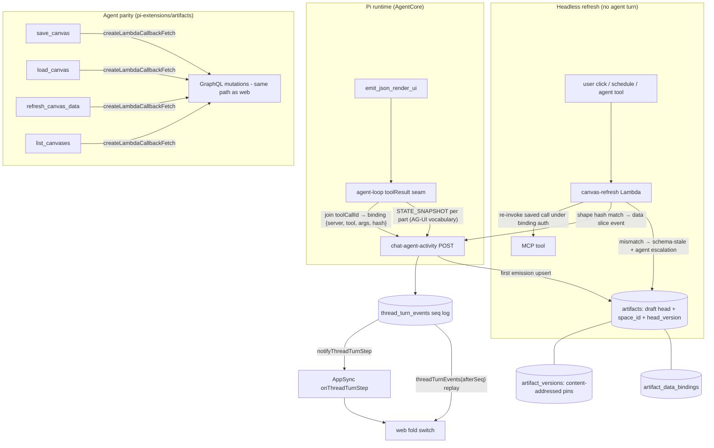

# Living Artifacts Core - Plan

## Goal Capsule

- **Objective:** Turn GenUI artifacts from frozen snapshots into living, saveable, space-shared canvases: the Pi runtime speaks the AG-UI event grammar over the existing durable event pipeline, every emitted canvas is an artifact from birth with a version chain, each widget carries a data-source binding (a saved tool call) that refreshes headlessly, and the agent has parity tools (save/load/refresh/list) so "open my cost dashboard and update it" works in chat.
- **Product authority:** Eric Odom (Linear THINK-145). Product Contract decisions are settled; implementation detail is the executor's judgment within the KTDs.
- **Stop conditions:** Surface (do not guess through) anything that changes product scope: new access-model semantics beyond R15, wire-format changes beyond snapshot-only, or agent tools beyond the R16–R19 set. Never touch `spaces.*` tables (owned by a separate workstream) or the `symphony.*` schema.
- **Product Contract preservation:** changed from the requirements-only revision — added R16–R19, F3, AE5 (agent parity, user-approved 2026-07-04); R6 amended to add the agent tool call as a refresh trigger.

---

## Product Contract

### Summary

Adopt AG-UI's event vocabulary (`STATE_SNAPSHOT` now, `STATE_DELTA` reserved) as new event types on the existing `thread_turn_events` → AppSync pipeline; make every GenUI canvas an artifact row from first emission with a pinned-version chain and a `space` home; attach a per-widget data-source binding — the recorded tool invocation that produced the data — so refresh re-executes it without an agent turn; and give the single shared agent parity tools to save, load, refresh, and list canvases. This is the foundation contract; the full canvas surface (layout grid, action chips, widget targeting) is follow-on work that must not be precluded.

### Problem Frame

THINK-116 proved reliable GenUI emission, but everything rendered is a point-in-time export. Artifacts are immutable snapshots reached through a promote-copy step; data is baked into specs at emission and goes stale forever; the only refresh seam (`refreshGenUI`) throws unconditionally; artifacts have no version history (updates orphan old S3 keys), no space linkage, and snapshot reads require source-thread visibility — so a saved dashboard cannot even be opened by a colleague. Chat and artifact are one-way and disconnected: nothing the user does to a saved artifact flows back to the agent, and nothing the agent does after promotion reaches the artifact. The core problem is communication between the artifact (canvas) and the chat.

### Key Decisions

- **AG-UI the protocol, not the runtime — vocabulary on our pipeline.** Pi emits AG-UI-shaped events as new event types on `thread_turn_events` → AppSync `onThreadTurnStep`, keeping durability, `afterSeq` replay, multi-client fan-out, and Cognito auth. The CopilotKit React runtime is explicitly not adopted (its generative-UI registry bypasses the strict validator). Named compromise: no day-one compatibility with native AG-UI SSE clients; a native SSE endpoint can be added later as a projection of the same events. AG-UI releases are date-tagged, not semver — pin a vocabulary snapshot and own the mapping layer.
- **Snapshot-only wire format in v1; `STATE_DELTA` reserved.** Matches AWS's shipped AgentCore sample and today's whole-part merge semantics. Per-element JSON-Patch deltas arrive with the future canvas-document work.
- **A data source is a saved tool call.** The binding records the invocation that produced the data (server ref, tool, frozen args, result-shape hash) plus the auth context. No query language, no semantic layer. Provenance falls out for free.
- **Refresh runs under the identity that produced the original data.** Tenant-scoped MCP config → unattended refresh allowed under that config. Per-user OAuth → no unattended refresh; the widget degrades to STALE with a "refresh needs you" affordance. No impersonation, no new credential store.
- **Data-refresh and schema-refresh are separate operations.** Data-refresh is a headless re-invoke that replaces only the widget's data (no agent turn, no tokens). A result-shape hash mismatch is a schema-refresh, which escalates to an agent turn to re-emit the spec.
- **Living semantics apply to GenUI canvases only in v1.** Schema fields (version pointer, `space` linkage) land on the shared artifacts table, but born-as-artifact, check-out/check-in, and the version chain are enabled only for the json-render canvas kind.
- **Access is space-scoped: living + pinned ship in v1, published tokens deferred.** Space members can open the living head and pinned versions, replacing thread-visibility gating for canvases. Tokened outside-the-app reads are deferred; tokens bolt onto pinned versions later.
- **Agent parity ships in v1.** The agent gets save/load/refresh/list tools as thin wrappers over the same mutations the web calls, plus a canvas manifest in the rendered workspace for zero-tool-call name resolution. Agent pin/delete stays out (see Scope Boundaries).

### Requirements

**Protocol and events**

- R1. The Pi runtime emits canvas state as AG-UI-vocabulary events (`STATE_SNAPSHOT` in v1) carried as new event types on the existing `thread_turn_events` → AppSync pipeline, with `afterSeq` replay behaving exactly as it does for existing event types.
- R2. The event envelope reserves `STATE_DELTA` (RFC 6902) so per-element patches can be added later without a wire-format break; v1 emits no deltas.
- R3. Every canvas state update passes the strict host validator before any client renders it; a failed update leaves the last-good render in place.

**Data-source bindings and refresh**

- R4. Every widget produced from a tool result carries a binding: the MCP server reference, tool name, frozen arguments, result-shape hash, auth-context descriptor, and last-fetched timestamp.
- R5. A user can open any bound widget's data source and see what produced the data (tool, arguments, when, under what auth) — provenance is user-visible, with argument values passing a redaction gate before display.
- R6. Data-refresh re-executes the saved call headlessly and replaces only the widget's data; it consumes no agent turn. It is triggerable by user action, by schedule (reusing the scheduled-job → `job-trigger` path with a new trigger type; refresh jobs enqueue work, never agent wakeups), and by agent tool call.
- R7. A result-shape hash mismatch on refresh marks the widget schema-stale and escalates to an agent turn to re-emit the spec; it never renders mismatched data through the old spec.
- R8. Every bound widget renders a freshness state — GOOD, STALE, BAD (last refresh failed), or REFRESHING (re-invoke in flight; the trigger control disables while active) — and a widget never blanks on refresh failure: last-good data stays visible with the degraded badge. A binding whose referenced MCP server no longer exists is a terminal BAD state distinct from transient failure.
- R9. Bindings whose auth context is per-user OAuth are excluded from unattended refresh; the widget shows STALE with an affordance telling the owning user their action is needed. Space members who are not the credential owner see the same control disabled, naming the owning user. Because per-user bearers live only in the runtime's in-memory handle store (never serialized), even the owner's refresh of such a binding runs agent-mediated in a thread — the stated no-agent-turn guarantee applies to tenant-scoped bindings only.

**Artifact identity and lifecycle**

- R10. Every emitted canvas is an artifact row from first emission (status `draft`); saving is a status flip plus naming, not a copy. The promote-copy write path is retired for canvases.
- R11. A canvas artifact has a version chain: the living head is an overwrite-in-place working copy; pinning creates a content-addressed, write-once version; version history is user-visible and any pinned version can be viewed.
- R12. A canvas artifact belongs to a space. Its originating thread is provenance, not its home; a canvas survives its thread (including thread deletion).
- R13. A saved canvas can be checked out: reopening it in a thread in the same space materializes it as a live part under its original stable part id, the agent can edit it via chat, and re-saving appends a new version to the same artifact — never a duplicate artifact. Cross-space check-out is rejected in v1.
- R14. Artifact list surfaces default to saved canvases; draft-status canvases are hidden behind an explicit filter.

**Access**

- R15. Space members can open a canvas's living head and pinned versions without any visibility into the originating thread. For SAVED canvases (non-null `space_id`), space membership replaces thread-visibility gating for reads, and writes (save, rename, pin, check-in) require a member-or-above space role (viewer-role members are read-only). DRAFT canvases (null `space_id`) remain gated by originating-thread visibility with a creator-only fallback — never publicly readable by artifact id. Saving requires membership in the space being assigned.

**Agent parity**

- R16. The agent can save the current thread's canvas — name, space assignment, status flip — via a tool when asked in chat, using the same write path as the user save. No confirmation gate: save is cheap and reversible.
- R17. The agent can resolve a saved canvas by name within the thread's space and materialize it into the current thread under its stable part id (the agent-side twin of R13). Ambiguous names cause the agent to ask, never guess; a zero-match name causes the agent to say no matching canvas exists and offer near-matches from the manifest, never silently fail.
- R18. The agent can trigger the headless data-refresh for a canvas it has loaded (same path and identity rules as R6/R9).
- R19. The agent can enumerate saved canvases in the current space: a discovery tool plus a passive canvas manifest in the rendered workspace. Draft canvases are excluded from discovery.

### Key Flows

- F1. Refresh loop
  - **Trigger:** A bound widget's data is stale (schedule fires, user clicks refresh, agent tool call, or canvas is opened).
  - **Steps:** Binding auth context checked (R9) → saved call re-executed headlessly (R6) → result-shape hash compared (R7) → on match, data slice published as a validated state event (R1, R3) → widget re-renders with GOOD badge and version bump; on failure, last-good stays with STALE/BAD badge (R8).
  - **Covers:** R4, R6, R7, R8, R9, R18.
- F2. Lifecycle loop
  - **Trigger:** Agent emits a canvas in a thread.
  - **Steps:** Canvas exists as draft artifact from first emission (R10) → user saves: names it, assigns space, status flips (R10, R12) → colleague opens it from the space with no thread access (R15) → user reopens it in a new same-space thread; agent edits via chat under the same part id (R13) → re-save appends a version; history shows the chain (R11).
  - **Covers:** R10, R11, R12, R13, R15.
- F3. Conversational loop
  - **Trigger:** User says "open my cost dashboard and update it" in a fresh thread.
  - **Steps:** Agent consults the workspace canvas manifest or `list_canvases` (R19) → resolves the name (asks on ambiguity, R17) → checks the canvas out into the thread under its stable part id (R17) → triggers headless refresh (R18) → narrates the result while the canvas renders with fresh data.
  - **Covers:** R16, R17, R18, R19.

### Acceptance Examples

- AE1. **Covers R9, R8.** Given a widget bound to a per-user-OAuth connector, when its refresh schedule fires with no user present, then no re-invoke occurs and the widget shows last-good data with STALE and a "refresh needs you" affordance; when the owning user then asks the agent to refresh it in a thread, the refresh runs agent-mediated (where the user's OAuth handle lives) and the data updates.
- AE2. **Covers R7.** Given a bound widget whose upstream tool now returns a different shape, when refresh runs, then the widget keeps rendering last-good data marked schema-stale and an agent turn is requested to re-emit the spec; the mismatched payload is never rendered through the old spec.
- AE3. **Covers R13, R11.** Given a saved canvas at version 3, when the user reopens it in a new thread and the agent edits it and the user re-saves, then the same artifact shows version 4 and no new artifact row exists.
- AE4. **Covers R14.** Given an agent emitted five canvases in a working thread and the user saved one, when a space member opens the artifact list, then only the saved canvas appears by default.
- AE5. **Covers R17, R19.** Given two saved canvases in the space, when the user says "open my cost dashboard," the agent loads the right one; given an ambiguous name ("open my dashboard"), the agent asks which one rather than picking.

### Success Criteria

- The acceptance demo on dev, in one session, three legs: (1) refresh loop — agent builds a chart from a connector, data goes stale, STALE badge shows, refresh (button, schedule, and agent call) re-executes headlessly, numbers change, version bumps; (2) lifecycle loop — save to a space, a colleague opens it without thread access, reopen in a new thread, edit via chat, re-save, version history shows the chain; (3) conversational loop — in a fresh thread, "open my [name] and refresh it" resolves, loads, and refreshes the canvas. Pixels gate the claim.
- A headless data-refresh consumes no model tokens.

### Scope Boundaries

**Deferred for later (design must not preclude):**

- Published/tokened canvas reads outside the app (tokens bolt onto pinned versions).
- `STATE_DELTA` emission and per-element ops; the designation channel; the canvas-first `/canvas/$id` surface with chat drawer.
- Living semantics for non-canvas artifact types.
- Native AG-UI SSE endpoint on the Pi runtime (projection of the same events).
- Auto-capturing every tool result as bindable; parameter cells / dependency-graph recalc.
- Agent pinning, agent version diffing, agent-assigned refresh schedules (Later); cross-space re-parenting as an explicit versioned action.

**Outside this contract:**

- Any change to the json-render DSL, validator posture, or component catalog.
- Mobile canvas rendering (text fallback stands; no freshness badges on mobile in v1 — explicit exemption).
- Agent deleting artifacts or versions; agent renaming/moving canvases across spaces; agent creating published tokens (Never in this contract).

### Dependencies / Assumptions

- The v1 space entry point for canvases is minimal (a list or link surface inside the space) — enough for the acceptance demo's "colleague opens it" leg.
- Spaces table work is owned by a separate workstream; canvas space-linkage reads `spaces.*` (membership checks) but never modifies it.
- Repo claims verified against the codebase this session (fresh-context verifier + planning research): dead `refreshGenUI` (zero live web callers; one dead mobile button), no version/space columns with nullable `thread_id`, revision param in `artifactContentKey`, merge-by-id part semantics, dead thread-visibility gate (kind-string mismatch), idle scheduler infra, free-text `event_type` column, 64KB event payload guard.

### Outstanding Questions

**Deferred to implementation:**

- Exact manifest freshness semantics: mid-thread saves refresh the manifest for subsequent turns; `list_canvases` is intra-thread truth. If rendering order makes same-turn manifest updates awkward, the tool is the fallback — implementer's judgment.
- Refresh-schedule per-tenant caps and minimum interval values (constants; pick conservative defaults, e.g. 15-minute floor).
- Draft-canvas retention (TTL or cap) — ship the draft filter (R14) in v1; retention enforcement may land as a follow-up constant + cleanup job if unbounded growth is observed.

### Sources / Research

- Ideation artifact: `docs/ideation/2026-07-04-think-145-artifacts-as-canvas-ideation.html` (7 ranked ideas; this plan is ideas 1–3 + agent parity).
- Evidence dossiers: `/tmp/compound-engineering/ce-ideate/19870a4c/` (session-scoped; key findings folded into KTDs below).
- AWS reference: [Build generative UI for AI agents on Amazon Bedrock AgentCore with the AG-UI protocol](https://aws.amazon.com/blogs/machine-learning/build-generative-ui-for-ai-agents-on-amazon-bedrock-agentcore-with-the-ag-ui-protocol/) — SSE from `/invocations`, `STATE_SNAPSHOT`-only sample; no Pi wrapper exists (we own the emitter).
- Prior contracts: `docs/brainstorms/2026-06-16-generative-ui-json-render-requirements.md` (inline part contract), `docs/brainstorms/2026-05-13-computer-inline-genui-fragment-lifecycle-requirements.md` (agent-mediated fragment-ID addressing), `docs/solutions/architecture-patterns/per-turn-snapshot-needs-content-addressed-immutable-storage.md` (two-key rule).
- Tracker: Linear THINK-145.

---

## Planning Contract

### Key Technical Decisions

- KTD1. **AG-UI vocabulary rides existing payload kinds; per-part snapshots honor the 64KB guard.** `thread_turn_events.event_type` is free text (no migration) and the web already folds GenUI streaming via the `thread_json_render.ui_message_chunk` `payload.kind` fold in `apps/web/src/components/workbench/SpacesThreadDetailRoute.tsx` (~L2873). Add a pinned vocabulary module in `packages/thread-json-render` (event names, envelope with reserved `STATE_DELTA`, mapping to/from parts) and emit `STATE_SNAPSHOT` events per part — never a whole multi-part canvas in one event — so `assertThreadTurnEventPayloadSize` (64KB) is honored by construction. Large data stays under the existing validator caps per part; the S3-offload discipline continues to apply to artifact payloads, not events.
- KTD2. **Bindings live in their own table, not artifact metadata.** New `artifact_data_bindings` table keyed by (artifact id, part id, widget/element id): MCP server ref (soft reference + captured server name), tool name, frozen args (encrypted at rest is unnecessary — but display passes the KTD9 redaction gate), result-shape hash, auth-context descriptor (`tenant_mcp` | `per_user_oauth`), quality state, last-fetched/last-good timestamps. Rationale: the refresh Lambda and the agent tools must read bindings without loading canvas payloads from S3 (constraint from agent-native research), and quality-state updates must not rewrite artifact content.
- KTD3. **Version chain = `artifact_versions` table + head columns on `artifacts`.** `artifacts` gains `space_id` (FK, no cascade — restrict), `head_version int`, and the KTD6 monotonic write counter; new `artifact_versions` table (artifact id, version number, content-addressed S3 key, content hash, created_by, created_at). `artifactContentKey({revision})` in `packages/api/src/lib/artifacts/payload-storage.ts` already supports revision-keyed storage — pins write a content-addressed revision key (write-once), the head keeps the overwrite-in-place key (two-key rule). Pinning snapshots the currently-persisted head atomically via conditional UPDATE; check-out targets the head only (viewing pinned versions is read-only in v1). **Versions come from two events:** an explicit pin, and check-in — re-saving a previously-saved canvas atomically pins the prior head as version N before overwriting the head (first-time save remains a pure status flip). This is the mechanism behind AE3 and the U8 collision guarantee.
- KTD4. **Binding identity is model-declared and validated at the agent-loop toolResult seam.** The runtime does not centrally track which invocation produced a spec's data, and the emit call's own `toolCallId` identifies the emit, not the source. So `emit_json_render_ui` gains an optional per-bound-element `sourceToolCallId` param the model supplies; the agent loop validates it against the turn's `toolInvocations` records (captured at `tool_execution_start`, `packages/pi-runtime-core/src/agent-loop.ts` ~L800–954) and attaches `{server, tool, args, shapeHash}` from the validated record. An invalid or absent reference leaves the widget unbound (no refresh affordance) — not an error. **Re-emission rule:** an edit emission without a source reference preserves the part's existing binding rather than unbinding it; the binding invalidates only on result-shape mismatch. The prompt's per-component schema examples must show `sourceToolCallId` usage (strict-validated payloads need examples — THINK-116 lesson).
- KTD5. **Access model: fix the dead gate, then replace it with space membership.** Prerequisite fix in the same unit: `artifact.query.ts` gates on `metadata.kind === "genui_snapshot"` while `promoteGenUIArtifact` writes `json_render_snapshot` — the gate never fires today, and `updateArtifact` has no write-side check. Canvas reads use `canAccessSpace(ctx, tenantId, spaceId)` / `userAccessibleSpacePredicate` (`packages/api/src/graphql/resolvers/spaces/shared.ts`); canvas writes use a NEW member-or-above check (a `space_members` row with role owner/admin/member — viewer excluded), since `canAccessSpace` ignores role and `canManageTenantSpaces` is admin-only. Draft (null-space) canvases keep thread/creator gating per R15. **Prerequisite for U3:** the `threadTurnEvents` query resolver currently has NO auth, tenant, or membership check — add a tenant + thread-membership gate (mirroring the same access helpers) before canvas events ride it.
- KTD6. **Concurrency: refresh never clobbers spec changes; guards are conditional UPDATEs.** Save/pin/check-in use single conditional UPDATEs (mirror `checkoutThread.mutation.ts`'s `WHERE checkout_run_id IS NULL` pattern), not read-check-then-write. The head row carries a monotonic write counter. A headless refresh touches only `$.data` of its bound part; on stale-counter recovery it re-reads the head, re-validates its result-shape hash against the CURRENT spec's binding, aborts to STALE (no write) on mismatch — a data slice fetched under an old shape is never applied to a re-emitted spec (R7) — and otherwise re-applies via a conditional UPDATE on the counter with bounded retry, then drops.
- KTD7. **Refresh execution = one new Lambda + one new trigger type; head-write is the primary effect.** New `canvas-refresh` Lambda (wire via `scripts/build-lambdas.sh` + `terraform/modules/app/lambda-api/handlers.tf` `for_each` map — mirror the `routine-task-python` entries; bundle the MCP client seam from `packages/api/src/lib/mcp-client-call.ts` + `mcp-configs.ts`) executes the saved call under the binding's auth context. Its **primary write is the artifact head + binding row** (per KTD6 guards); it publishes a snapshot event through `chat-agent-activity` only when the canvas is currently checked out into a live thread — `thread_turn_events.run_id` is a NOT NULL FK to `thread_turns`, so a scheduled refresh of a thread-less canvas has no turn to append to and must not try. The Lambda's Secrets Manager access is scoped per-invocation to the tenant being refreshed (resource-ARN templating or session tags on tenantId), not a standing all-tenant wildcard. Scheduled refresh adds an `else if` branch (`"canvas_refresh"`) in `packages/lambda/job-trigger.ts` (RequestResponse) and rows via the existing scheduled-jobs helpers. Artifact deletion/unsave cascade-disables its schedules (mirror the `skill_run` pause-on-orphan precedent, `job-trigger.ts:1311–1324`), surfaced to the user.
- KTD8. **Agent tools are thin wrappers over the same GraphQL mutations, with the acting user's identity carried explicitly.** New Pi extension module `packages/pi-extensions/src/artifacts.ts` declaring `save_canvas`, `load_canvas`, `refresh_canvas_data`, `list_canvases`; wired with `addExtension()` in `packages/agentcore-pi/agent-container/src/server.ts` AND added to the activation allowlist — omitted extension tools silently never reach the model, so verification includes a live-thread tool-visibility probe. **Identity:** `createLambdaCallbackFetch` authenticates with a shared service secret carrying no user identity, so the callback payload for canvas writes includes the acting user's id (known to the runtime from the thread context), and `saveCanvas`/`checkoutCanvas`/`refreshCanvasData` assert R15 space-membership against that user — never against the service principal alone. Name resolution is exact-then-fuzzy within the thread's space; ambiguity → `ask_user_question` HITL; zero-match → narrated not-found with near-matches (R17).
- KTD9. **Binding args pass a redaction gate before display.** Provenance UI (R5) renders args through a redactor in `packages/thread-json-render` (shared shape logic): primitive values under a length cap render verbatim; values matching secret-shaped keys (`token`, `key`, `secret`, `password`, `authorization`), matching PII value shapes (email addresses, SSN-like digit groups, long numeric account identifiers), or exceeding the cap render as redacted placeholders — key-name matching alone is insufficient because R15 widens the provenance audience to every space member. Refresh execution always uses the stored (unredacted) args server-side.
- KTD10. **Dead code retirement travels with the feature.** Delete `refreshGenUI.mutation.ts`, its companion `packages/api/src/graphql/resolvers/messages/genui-refresh-legacy.ts`, its registration in `packages/api/src/graphql/resolvers/messages/index.ts`, its schema entry in `packages/database-pg/graphql/types/recipes.graphql` (zero live web callers), the mobile operation document `RefreshGenUIMutation` in `apps/mobile/lib/graphql-queries.ts` (~L1543, with mobile codegen re-run), and the dead mobile button (`apps/mobile/components/threads/ActivityTimeline.tsx`, ~L964). `promoteGenUIArtifact` is retired for canvases after the save-flip path is live (web is the only caller; mobile has none — verified).

### High-Level Technical Design

Directional guidance, not implementation specification: box names indicate seams, not final module names.

### Sequencing

U3 (events) has no dependency and runs in parallel with U1 from day one. After U1 lands: lifecycle track (U4→U8) and refresh track (U4→U5→U6→U7 — bindings key on artifact ids, which exist only after U4's born-as-artifact upsert). Agent parity (U9) needs U4+U6+U8 mutations. UI (U10) and the demo (U11) close. U2 (access) can land any time after U1 and before U10.

---

## Implementation Units

| U-ID | Title | Key files | Depends on |
|---|---|---|---|
| U1 | Schema + GraphQL foundation | database-pg schema/graphql, codegen ×4 | — |
| U2 | Access model fix + space scoping | api artifacts resolvers | U1 |
| U3 | AG-UI vocabulary + snapshot emission | thread-json-render, pi-runtime-core, web fold | — |
| U4 | Born-as-artifact + save/pin lifecycle | api mutations, pi-runtime-core | U1 |
| U5 | Binding capture at toolResult seam | pi-runtime-core agent-loop | U1, U3, U4 |
| U6 | canvas-refresh Lambda + quality flags | packages/lambda, terraform, api | U1, U5 |
| U7 | Scheduled refresh trigger | packages/lambda/job-trigger.ts | U6 |
| U8 | Check-out / check-in | api mutations, pi-runtime-core | U4 |
| U9 | Agent parity extension | pi-extensions, agentcore-pi server | U4, U6, U8 |
| U10 | Web surfaces | apps/web artifacts + panel | U2, U4, U6 |
| U11 | Live E2E acceptance demo | dev stage | all |

### U1. Schema and GraphQL foundation

- **Goal:** Land the storage substrate: `artifacts.space_id` + `artifacts.head_version`, the `artifact_versions` table, and the `artifact_data_bindings` table, with GraphQL types and codegen regenerated.
- **Requirements:** R4, R10, R11, R12 (substrate).
- **Dependencies:** none.
- **Files:** `packages/database-pg/src/schema/artifacts.ts` (new columns), new `packages/database-pg/src/schema/artifact-versions.ts` and `artifact-data-bindings.ts` (or co-located per schema conventions), `packages/database-pg/graphql/types/artifacts.graphql`, new drizzle migration via `db:generate`; codegen in `apps/cli`, `apps/web`, `apps/mobile`, `packages/api`.
- **Approach:** KTD2 + KTD3. `space_id` FK restrict (never cascade into `spaces.*`). Additive-only migration — no destructive change to existing rows; existing artifacts get `head_version` default and null `space_id`. If any hand-rolled SQL is needed (partial index on draft status), carry `-- creates:` markers for the drift gate.
- **Test scenarios:** migration applies cleanly to a copy of dev schema; GraphQL type round-trips new fields; existing artifact queries unaffected (null space_id tolerated); binding row uniqueness on (artifact, part, element).
- **Verification:** `pnpm --filter @thinkwork/database-pg db:generate` produces one reviewed migration; `pnpm -r typecheck` green after codegen ×4; `pnpm db:push -- --stage dev` after merge.

### U2. Access model: fix the dead gate, add space scoping

- **Goal:** Canvas reads and writes are space-membership-gated (R15); the kind-string bug and the missing write-side check are fixed.
- **Requirements:** R15.
- **Dependencies:** U1.
- **Files:** `packages/api/src/graphql/resolvers/artifacts/artifact.query.ts`, `artifacts.query.ts`, `updateArtifact.mutation.ts`, shared helper (new) `packages/api/src/lib/artifacts/canvas-access.ts`; tests colocated.
- **Approach:** KTD5. One helper (`assertCanvasAccess(ctx, artifactRow, "read"|"write")`): saved canvases → space-membership read, member-or-above (viewer-excluded) write; draft (null-space) canvases → thread/creator gating; non-canvas artifacts keep current behavior. Fix `genui_snapshot` → `json_render_snapshot` mismatch as part of this unit (same code path). Also add the tenant + thread-membership gate to `threadTurnEvents.query.ts` (currently unguarded) — prerequisite before U3's canvas events ride that query in production.
- **Test scenarios:** space member reads head + pinned versions without thread access (Covers AE-adjacent R15); non-member gets FORBIDDEN on read AND write; viewer-role member reads but cannot write; non-participant cannot read another user's draft canvas by artifact id; legacy non-canvas artifacts unaffected; the old kind-string never matches (regression test naming the bug); `threadTurnEvents` rejects callers without thread access.
- **Verification:** `pnpm --filter @thinkwork/api test` full suite green.

### U3. AG-UI vocabulary module + snapshot emission + web fold

- **Goal:** Pi emits `STATE_SNAPSHOT` events per part through the existing pipeline; web folds them; `STATE_DELTA` is reserved in the envelope.
- **Requirements:** R1, R2, R3.
- **Dependencies:** none (parallel with U1).
- **Files:** new `packages/thread-json-render/src/agui/vocabulary.ts` (+ tests), `packages/pi-runtime-core/src/json-render-runtime.ts` (emission mapping), `apps/web/src/components/workbench/SpacesThreadDetailRoute.tsx` (fold switch case).
- **Approach:** KTD1. Pin the event-name vocabulary as constants with the AG-UI snapshot date recorded; envelope type includes the reserved delta variant (compile-time only in v1). Emission wraps the existing part payload — renderer behavior is unchanged when the snapshot round-trips (validator still gates, last-good preserved on reject).
- **Execution note:** plain-node `import()` smoke of the built dist before PR — tsc-built ESM packages have bitten on extensionless imports before.
- **Test scenarios:** snapshot event round-trips part → envelope → part identically; oversized part payload rejected by the 64KB guard test (never silently truncated); web fold renders a snapshot event exactly as the legacy chunk kind; unknown future event types are ignored without breaking the fold (forward compatibility); mobile event filter drops the new type silently (no crash).
- **Verification:** `pnpm --filter @thinkwork/thread-json-render test` + `pnpm --filter @thinkwork/pi-runtime-core test` + targeted web vitest green; dist import smoke passes.

### U4. Born-as-artifact + save/pin lifecycle

- **Goal:** First emission upserts a draft artifact row; save is a status flip + naming + space assignment; pin creates a content-addressed version; promote-copy retires for canvases.
- **Requirements:** R10, R11, R12, R14 (server side).
- **Dependencies:** U1.
- **Files:** `packages/pi-runtime-core/src/agent-loop.ts` or the activity handler (`packages/api/src/handlers/chat-agent-activity.ts`) for the first-emission upsert (implementer picks the seam — server-side upsert in the activity handler avoids runtime→API chatter), new `saveCanvas.mutation.ts` + `pinArtifact.mutation.ts` under `packages/api/src/graphql/resolvers/artifacts/`, `promoteGenUIArtifact.mutation.ts` (retire for canvases), `artifacts.query.ts` (default saved-only filter), GraphQL types + codegen ×4.
- **Approach:** KTD3 + KTD6. Upsert keyed by (thread id, stable part id) → artifact id; conditional-UPDATE save flip (no read-then-write); pin snapshots the persisted head to a content-addressed key. Thread deletion leaves the artifact (thread_id is provenance) — add an ON DELETE SET NULL or application-level nulling per existing thread-deletion conventions.
- **Test scenarios:** first emission creates exactly one draft row, re-emission with same stable id updates not duplicates; double-click save races produce one saved artifact (conditional UPDATE proof); pin at version N produces immutable version row + head_version N+1 semantics per KTD3; Covers AE3 (edit + re-save appends to same artifact); Covers AE4 (list defaults to saved-only); thread deletion preserves the artifact.
- **Verification:** `pnpm --filter @thinkwork/api test` green; manual dev check that a chat emission appears as a draft artifact row.

### U5. Binding capture at the toolResult seam

- **Goal:** Widgets emitted from tool results carry a persisted binding (server, tool, frozen args, shape hash, auth context).
- **Requirements:** R4, R5 (data), R9 (auth-context classification).
- **Dependencies:** U1, U3, U4 (bindings key on artifact ids created by U4's upsert).
- **Files:** `packages/pi-runtime-core/src/agent-loop.ts` (toolCallId join), binding persistence through the activity handler or a dedicated mutation, `packages/api/src/handlers/chat-agent-activity.ts`, redactor in `packages/thread-json-render/src/agui/redact.ts`.
- **Approach:** KTD4 + KTD9. Join `tool_execution_start` invocation records to the emit that consumes them; compute a stable result-shape hash (sorted key structure, not values); classify auth context from the MCP config source (tenant vs per-user). Unbound widgets are legal — no affordance, no error.
- **Test scenarios:** emit following a tool call in the same turn captures the correct server/tool/args; emit with no identifiable source stays unbound; shape hash stable across value changes, different across structural changes; redactor masks secret-shaped keys and over-cap values, passes plain primitives; per-user-OAuth config classified correctly.
- **Verification:** `pnpm --filter @thinkwork/pi-runtime-core test` green; a dev thread emission shows a binding row with correct provenance.

### U6. canvas-refresh Lambda + quality flags

- **Goal:** Headless data-refresh: re-invoke the saved call under the binding's identity, publish the data slice as a validated snapshot event, update quality state; schema mismatch escalates.
- **Requirements:** R6 (user + agent triggers), R7, R8, R9.
- **Dependencies:** U1, U5.
- **Files:** new `packages/lambda/canvas-refresh.ts` (or per lambda conventions), `scripts/build-lambdas.sh` entry, `terraform/modules/app/lambda-api/handlers.tf` map entry (+ IAM for MCP secret access), new `refreshCanvasData.mutation.ts` (RequestResponse invoke — never fire-and-forget), deletion of `refreshGenUI.mutation.ts` + `genui-refresh-legacy.ts` + messages resolver index registration + `recipes.graphql` entry + mobile `RefreshGenUIMutation` document (`apps/mobile/lib/graphql-queries.ts` ~L1543, codegen re-run) + mobile dead button (`apps/mobile/components/threads/ActivityTimeline.tsx`).
- **Approach:** KTD7 + KTD10 + KTD6. Refresh touches only `$.data` of its bound part and re-validates before publishing; BAD-terminal when the MCP server ref no longer resolves; per-user-OAuth bindings return a typed "needs user" result without invoking. Publishes through the existing `chat-agent-activity` append path so replay and AppSync fan-out behave identically to agent-authored events.
- **Test scenarios:** Covers AE1 (per-user-OAuth: no unattended invoke, STALE + affordance, agent-mediated owner refresh works); Covers AE2 (shape mismatch: last-good stays, schema-stale flagged, escalation enqueued, mismatched data never rendered); success path updates head + binding + GOOD + lastFetchedAt; refresh of a canvas with no live thread writes the head and publishes no turn event (no TURN_NOT_FOUND); refresh raced by a schema re-emit never applies the stale slice (KTD6 revalidation); tool failure → BAD + last-good retained; deleted server → terminal BAD; tenant-scoped secret access only (no cross-tenant grant); refresh consumes no model invocation (assert no Bedrock call).
- **Verification:** `pnpm --filter @thinkwork/api test` + lambda unit tests green; `bash scripts/build-lambdas.sh canvas-refresh` builds; deploy pipeline green (Dockerfile/build-script/workflow references complete — the U11-teardown lesson).

### U7. Scheduled refresh trigger

- **Goal:** Bindings can refresh on a schedule; schedules die with their artifact.
- **Requirements:** R6 (schedule leg).
- **Dependencies:** U6.
- **Files:** `packages/lambda/job-trigger.ts` (new `canvas_refresh` branch), scheduled-jobs creation via existing helpers (`packages/api/src/lib/agent-loops/schedule-binding.ts` pattern), artifact delete/unsave hooks.
- **Approach:** KTD7. New trigger type invokes the canvas-refresh Lambda RequestResponse; orphan handling mirrors `skill_run` pause-on-orphan (`job-trigger.ts:1311–1324`) — deleted/draft-reverted artifact pauses the schedule and surfaces it. Conservative defaults: 15-minute interval floor, per-tenant schedule cap (constants).
- **Test scenarios:** schedule fires → refresh runs → data updates; artifact deleted → next fire pauses schedule and records why; draft-reverted artifact same; `rate()` creation-time semantics documented in the schedule creation path (not wall-clock).
- **Verification:** lambda tests green; one live dev schedule observed firing and refreshing.

### U8. Check-out / check-in

- **Goal:** A saved canvas materializes into a same-space thread under its original stable part id; re-save appends a version to the same artifact.
- **Requirements:** R13.
- **Dependencies:** U4.
- **Files:** new `checkoutCanvas.mutation.ts` under artifacts resolvers, materialization helper in `packages/pi-runtime-core` or the activity path (reuses merge-by-id), thread-side wiring so the runtime treats the materialized part as live context.
- **Approach:** KTD3 + KTD6. Same-space enforcement at mutation time (space of target thread == artifact.space_id, else typed rejection); check-out targets the head; materialization emits a standard snapshot event so all clients converge; check-in auto-pins the prior head as a version before overwriting it (KTD3) — this is what records both sides of a collision. Stable-id collision from an unrelated thread emitting the same id: ids are scoped per-thread at merge time, and artifact linkage comes from the check-out record — an unrelated same-id emission in another thread never writes to the artifact.
- **Test scenarios:** Covers AE3 end-to-end (checkout → agent edit → re-save → auto-pin + version N+1, same artifact); cross-space checkout rejected with typed error; two threads checking out the same canvas — writes serialize on the KTD6 counter and each check-in auto-pins, so the first thread's state survives as a version (no silent loss); unrelated thread emitting the same stable id does not touch the artifact.
- **Verification:** `pnpm --filter @thinkwork/api test` + pi-runtime-core tests green.

### U9. Agent parity extension

- **Goal:** The agent can save, load, refresh, and list canvases in chat; the workspace carries a canvas manifest.
- **Requirements:** R16, R17, R18, R19.
- **Dependencies:** U4, U6, U8.
- **Files:** new `packages/pi-extensions/src/artifacts.ts`, `packages/agentcore-pi/agent-container/src/server.ts` (`addExtension()` + activation allowlist), workspace-renderer manifest block (`packages/api/src/lib/workspace-renderer/`), extension tests.
- **Approach:** KTD8. Tools wrap the U4/U6/U8 mutations via `createLambdaCallbackFetch` — no second write path. `load_canvas` resolves exact-then-fuzzy within the thread's space, `ask_user_question` on ambiguity. Manifest lists saved (non-draft) canvases with name + id; `list_canvases` is intra-thread truth after mid-thread saves.
- **Execution note:** the allowlist dark-tool failure mode is the known risk — verification must include a live-thread probe that the model can see and call each tool, not just that code deploys.
- **Test scenarios:** Covers AE5 (two canvases: right one loads; ambiguous name: agent asks); save_canvas flips status + assigns space via chat; refresh_canvas_data honors R9 exclusion; list excludes drafts; tool omitted from allowlist → test fails (guard test enumerating registered vs allowlisted).
- **Verification:** extension unit tests green; live dev thread: each tool visible to the model and callable (transcript evidence).

### U10. Web surfaces

- **Goal:** The UI expresses the new model: freshness badges + refresh button + provenance popover on bound widgets, version history on the artifact page, saved-only default filter, minimal space canvas list, save/pin affordances replacing promote.
- **Requirements:** R5, R8 (display), R11 (history UI), R14, R15 (entry point), R6 (user trigger).
- **Dependencies:** U2, U4, U6.
- **Files:** `apps/web/src/routes/_authed/_shell/artifacts.$id.tsx` (version history, refresh), `apps/web/src/components/workbench/json-render/` (badge + provenance on bound widgets), `GeneratedArtifactCard.tsx` / panel components (save affordance), artifacts list route (draft filter), space surface minimal canvas list; codegen after any GraphQL change.
- **Approach:** Match Work Items list conventions (token filters, collapsed search) per repo UI patterns. Badges render from binding quality state; provenance popover renders redacted args (KTD9). Keep the panel flow intact — the canvas-first surface is deferred.
- **Test scenarios:** badge states render for GOOD/STALE/BAD/REFRESHING fixtures (trigger control disabled while REFRESHING — no double-fire); provenance shows redacted args (secret keys + PII value shapes masked); version list renders chain and opens pinned versions read-only; draft filter defaults off in list; refresh control for per-user-OAuth bindings shows "needs you" copy for the owner and a disabled control naming the owner for other members.
- **Verification:** `pnpm --filter @thinkwork/web test` + typecheck green; screenshot pass on a local dev server against fixtures — layout claims need pixels, not jsdom.

### U11. Live E2E acceptance demo

- **Goal:** Prove the three loops on deployed dev with pixels.
- **Requirements:** Success Criteria (all three legs); AE1–AE5 live.
- **Dependencies:** all prior units deployed to dev.
- **Files:** none (evidence run); optional smoke script under `scripts/`.
- **Approach:** Dispatch via `thinkwork message send`; verify persisted state in dev Aurora (messages.role is lowercase); screenshot renders (agent-browser); record artifact ids + thread ids in the PR/Linear. Legs: refresh (button + schedule + agent call), lifecycle (save → colleague → checkout → edit → re-save → history), conversational ("open my [name] and refresh it" in a fresh thread).
- **Test scenarios:** the three Success Criteria legs, each with visual evidence; token assertion — headless refresh produced no model invocation (CloudWatch).
- **Verification:** Eric-verified pixels on dev; Linear THINK-145 updated with evidence.

---

## Verification Contract

| Gate | Command / check | Applies to |
|---|---|---|
| Typecheck | `pnpm -r --if-present typecheck` (after codegen ×4 on any GraphQL change) | all units |
| Package tests | full `pnpm --filter <pkg> test` for every touched package — not just new tests | all units |
| Migration gate | `pnpm --filter @thinkwork/database-pg db:generate` single reviewed migration; `db:migrate-manual` markers for any hand-rolled SQL | U1 |
| ESM smoke | plain-node `import()` of built dist for touched tsc-built packages | U3, U5 |
| Lambda build | `bash scripts/build-lambdas.sh <handler>`; deploy workflow references complete (Dockerfile/build-script/path filters) | U6, U7 |
| Tool visibility | live-thread probe: model sees + calls each new extension tool | U9 |
| Pixels | screenshot verification on rendered UI (local fixtures for U10; deployed dev for U11) | U10, U11 |
| Deploy watch | watch the post-merge Deploy run on main after every merge | all merges |

## Definition of Done

- All three Success Criteria legs demonstrated on deployed dev with visual evidence, Eric-verified.
- AE1–AE5 each proven by an automated test or the live demo.
- `refreshGenUI` resolver, schema entry, and the dead mobile button are deleted; `promoteGenUIArtifact` no longer used for canvases.
- No unit shipped with failing or skipped package suites; every touched package's full suite green; typecheck green monorepo-wide.
- Deploy pipeline green end-to-end after the final merge (container build included).
- No abandoned experimental code in the final diffs; worktrees and branches cleaned up after merge.
- Linear THINK-145 updated with the plan outcome and demo evidence.
