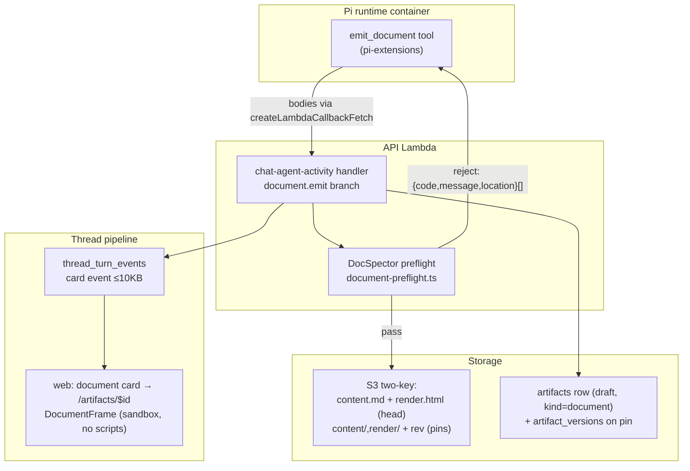

# HTML Document Artifacts - Plan

## Goal Capsule

- **Objective:** ThinkWork agents compose beautiful, self-contained single-file HTML documents (Ideation, Plan, Report, Brief) as first-class artifacts — emitted through a new `emit_document` tool, gated by a self-containment preflight, stored dual-body (markdown record + HTML render) on the THINK-145 living-artifacts substrate, and read in a full-height scriptless sandboxed reader.
- **Product authority:** the Product Contract below (confirmed 2026-07-04). Linear: THINK-147. Upstream ideation: docs/ideation/2026-07-04-html-document-artifacts-ideation.html.
- **Authority hierarchy:** Product Contract > Planning Contract > per-unit Approach. Repo conventions (CLAUDE.md) override unit detail where they conflict.
- **Stop conditions:** any change that would touch the GenUI/json-render validator or catalog; any schema change beyond the columns/tables named in U1; any need to grant scripts to the document render path. Surface these instead of proceeding.
- **Product Contract preservation:** unchanged from the requirements-only revision except: Goal Capsule blocker resolution (seam ownership decided); R16 clarified — the print story is print CSS in documents plus a Download affordance (browser print-to-PDF from the opened file), because `window.print` cannot cross the zero-grant sandbox boundary (doc-review 2026-07-04). Finalize ships agent-side only (`emit_document(status: "final")`); the web finalize surface was cut as unrequired by any R-ID (scope review 2026-07-04).

---

## Product Contract

### Summary

Add a document artifact kind whose canonical record is markdown and whose human-facing body is a hand-authored, self-contained single-file HTML render in the compound-engineering house style — header anatomy (eyebrow, title, metadata, stats strip, summary cards), inline-SVG diagrams, styled tables, and simple charts. A workspace skill teaches the craft per genre; the platform owns emission, validation, storage, and rendering.

### Problem Frame

ThinkWork agents produce plans, reports, and decision documents today as chat text or plain markdown artifacts — flat, unbranded, and hard to circulate. Meanwhile the team's own tooling (the compound-engineering plugin) produces single-file HTML documents that are dramatically better artifacts: scannable header metrics, verdict cards, hand-drawn SVG diagrams, dark-mode support — and they remain plain text a machine can navigate. That capability lives only in the dev toolchain; tenants never see it. Separately, the artifacts substrate is mid-transition: THINK-145 specifies born-as-artifact emission and head/pin versioning but nothing has landed, and every existing artifact surface is markdown-first with no rich render path. Two verified physical constraints shape any solution: exemplar documents measure 31–45KB while the thread event pipeline caps parts at 64KB, and the deployed sandbox CSP blocks all external fetches — the exemplar docs themselves load Google Fonts and would silently degrade if rendered in-product today.

### Key Decisions

- **Dual-body: markdown is the record, HTML is the render.** Every document stores two sibling bodies under the two-key content scheme: a structured markdown digest (agent-, mobile-, and Brain-facing) and the single-file HTML render (human-facing). Both are emitted in the same tool call to prevent drift. The markdown body is a faithful digest, not a compilable source — a deterministic compositor that derives the HTML is the named v2 evolution, not v1.
- **Freehand authoring, CE-style.** The agent hand-writes the HTML following skill guidance and genre exemplars — no template engine, no bundler, no charting library. This is exactly how the compound-engineering plugin works (a rendering reference + exemplars; zero runtime dependencies), and it is what produces the bespoke quality that motivates the feature. Accepted cost: ~two bodies of output tokens per document (HTML runs 2–4× markdown) until the v2 compositor.
- **No external foundation.** Anthropic's `web-artifacts-builder` skill is not pulled in for v1: it scaffolds React apps and inlines them with a Parcel build — script-heavy, toolchain-dependent, app-shaped. It remains the natural candidate for a later interactive-app tier. The SKILL.md packaging convention is shared, so Anthropic-published skills stay structurally importable.
- **Documents build the THINK-145 substrate (tracer bullet).** `emit_document` lands the born-as-artifact first-emission upsert and head/pin two-key storage on the shared artifacts table; documents are the simplest kind (no data bindings, no refresh, no per-user OAuth), so they prove the seam before canvas work depends on it. Coordinate — do not fork — the THINK-145 schema.
- **Scriptless document tier.** Documents render in the existing sandboxed-iframe trust model (srcDoc, opaque origin, `connect-src 'none'`) with `allow-scripts` stripped. Exemplars are verified script-free; CSS-only interactivity (`
`, anchors) is sufficient. Interactive documents are a later, deliberate graduation to the app tier.
- **Four genres with a draft/final lifecycle.** Ideation, Plan, Report, Brief — each with a curated exemplar plate distilled from the four in-repo `docs/ideation/*.html` documents. Finalizing a draft pins a content-addressed, write-once version.
- **Documents are HTML ≠ GenUI.** The json-render strict-validator system (THINK-116) remains the only in-thread interactive UI path; documents are a separate rendering class and never route through or around that validator.

### Requirements

**Artifact and storage**

- R1. A document is an artifact on the shared artifacts table, born as a draft at first emission (no promote step), space-homed per the THINK-145 access model.
- R2. Each document revision stores two sibling bodies: a markdown digest (canonical record) and a single-file HTML render.
- R3. Finalizing a document pins a content-addressed, write-once version; the head remains the editable working copy. Pins are content-addressed from day one.
- R4. Document content bytes never transit `thread_turn_events`; the thread carries only a compact document card (title, genre, abstract, link) within the existing per-part size guard.

**Emission**

- R5. A Pi extension tool (`emit_document`) accepts genre, title, markdown digest, and HTML render; persists both bodies; upserts the artifact row; and emits the document card event — in one call.
- R6. The tool is available whenever the document skill is installed; the agent invokes it by judgment (deliverable is document-shaped) or on explicit user request.
- R7. Emission failures return model-actionable diagnostics so the agent can correct and retry within the same turn.

**Preflight validation (DocSpector)**

- R8. Emission rejects any document that is not self-contained: no external `src`/`href`/`url()`/`@import` references (data: URIs permitted), no `javascript:` URLs.
- R9. Emission rejects any `<script>` element at the document tier.
- R10. Emission enforces a size ceiling and a minimum document skeleton (title, section anchors); rejects include the specific violation and its location.
- R11. Documents must render correctly in both light and dark themes; missing dark-mode support is a preflight reject.

**Authoring skill**

- R12. A workspace skill (catalog-distributable, SkillSpector-gated) teaches document authoring: genre selection, section contracts, and the self-containment rules R8–R11.
- R13. The skill ships one exemplar plate per genre (Ideation, Plan, Report, Brief) distilled from the proven in-repo exemplars; plates are corrected to be fully self-contained (system font stacks, no external fonts).
- R14. The house style mandates the header anatomy: eyebrow label, title, metadata line, stats strip (when the document has 3+ quantifiable signals), and summary/verdict card grids where content warrants.
- R15. Documents carry rich in-document visuals where content has shape: hand-authored inline-SVG diagrams (flow, architecture, comparison), styled tables, and simple charts (bar/line as inline SVG) — taught by the skill, permitted by preflight.

**Reader**

- R16. A full-height document reader route renders the HTML body in the sandboxed-iframe trust model with `allow-scripts` stripped, in both themes; documents carry a print stylesheet and the reader offers a Download affordance (browser print-to-PDF from the downloaded/opened self-contained file is the v1 export story).
- R17. The thread document card links to the reader; documents are also reachable from the existing artifact list surfaces.
- R18. Mobile renders the markdown digest (text fallback); no HTML rendering on mobile in v1.

### Key Flows

- F1. Compose and emit
  - **Trigger:** User asks for a document, or the agent judges the deliverable document-shaped.
  - **Steps:** Skill guides genre choice and structure → agent authors markdown digest + HTML render → `emit_document` runs preflight → on pass: bodies persisted, draft artifact row upserted, card event appears in thread → card links to reader.
  - **Covers:** R1, R2, R4, R5, R6, R12–R15.
- F2. Preflight reject and self-correct
  - **Trigger:** Emitted HTML violates self-containment (e.g., an external font link).
  - **Steps:** Preflight rejects with the violation and location → agent fixes the HTML in-turn → re-emits → passes.
  - **Covers:** R7–R11.
- F3. Revise and finalize
  - **Trigger:** User iterates on a draft, then declares it done.
  - **Steps:** Re-emission overwrites the head → finalize pins a content-addressed version → subsequent edits start a new draft head; the pinned version is immutable.
  - **Covers:** R3.

### Acceptance Examples

- AE1. **Covers R8, F2.** Given an HTML body containing `<link href="https://fonts.googleapis.com/...">`, when the agent emits it, then emission is rejected with a diagnostic naming the external reference, and a corrected system-font version passes.
- AE2. **Covers R4.** Given a 45KB document, when it is emitted, then the thread event contains only the card (well under the per-part cap) and the full bodies are retrievable from storage.
- AE3. **Covers R3.** Given a finalized document, when the agent emits a revision, then the pinned version's bytes are unchanged and the head reflects the revision.
- AE4. **Covers R11, R16.** Given any passing document, when opened in the reader with the OS in dark mode, then the document renders in its dark palette with legible contrast.
- AE5. **Covers R9, R16.** Given a document containing a `<script>` tag, when emitted, then preflight rejects it; and the reader iframe never grants script execution regardless.

### Success Criteria

- A document produced by the skill is visually comparable to the in-repo exemplars (header anatomy, diagrams, tables) — judged by pixel review in both themes, not self-assessment.
- An agent (or Brain pipeline) consuming the markdown digest gets the document's full substance without parsing HTML.
- The feature ships with zero changes to the GenUI validator, catalog, or json-render DSL.

### Scope Boundaries

**Deferred for later**

- Deterministic compositor (markdown+frontmatter → house-style HTML) — the v2 cost optimization; the dual-body contract insulates consumers from the switch.
- Sharing: permalinks, revocable tokens, external embeds, supersession banners — requires amending a THINK-145 deferral; its own decision.
- The compounding loop: `artifact_ls/rg/read` navigator tools, colophon metadata feeding Brain/KG, Linear auto-mirror.
- Routine/automation-triggered document emission (headless path).
- Tenant theme-token injection and per-tenant plate forking.
- Interactive documents / `web-artifacts-builder` adoption — belongs to the app tier, not the document tier.
- `artifact_data_bindings` table — canvas-only concern; the canvas workstream lands it (confirmed 2026-07-04).

**Outside this feature's identity**

- Any change to GenUI/json-render validation posture.
- Mobile HTML rendering.
- Wiki/Brain page materialization (documents are artifacts, not wiki pages).

### Dependencies / Assumptions

- THINK-145 plan (docs/plans/2026-07-04-001-feat-living-artifacts-core-plan.md) is the substrate spec; this feature owns landing its born-as-artifact and head/pin seams for the document kind (decided 2026-07-04). If canvas work has independently built them by implementation time, this feature consumes them instead — verify at U1 start.
- The sandboxed-iframe trust model and Terraform-pinned CSP (verified: `connect-src 'none'`, `font-src 'self' data:`) remain the rendering security boundary; the reader adds no new origin in v1.
- Verified this session (fresh-context verifier, 12 repo spot-checks): storage keys are markdown-typed; the 64KB/part event guard exists; exemplars measure 31–45KB and are script-free; exemplar Google Fonts usage violates the deployed CSP.

### Sources / Research

- Ideation artifact (ranked ideas, rejection table, verified bases): docs/ideation/2026-07-04-html-document-artifacts-ideation.html
- Linear: THINK-147 (feature request), THINK-145 (living-artifacts substrate), THINK-116 (GenUI, shipped).
- Compound-engineering plugin rendering mechanism: prose rendering reference + section contracts + exemplars, zero runtime dependencies (read from plugin cache 3.17.1 this session).
- Anthropic `web-artifacts-builder` SKILL.md — heavyweight React/Parcel single-file variant; deferred to app tier.
- Evidence dossiers: /tmp/compound-engineering/ce-ideate/a7c3e912/ (authoring-skill, emission-and-storage, rendering-and-security, sharing-and-lifecycle, agent-consumption).
- Seam extraction (this plan's Phase 1 research): THINK-145 unit map and KTD3 schema names; `packages/api/src/lib/artifacts/payload-storage.ts:47-56` two-key functions; `packages/pi-extensions/src/define-extension.ts` + `packages/agentcore-pi/agent-container/src/server.ts:1448` allowlist folding; `packages/api/src/handlers/chat-agent-activity.ts:189` event append; `apps/web/src/routes/_authed/_shell/artifacts.$id.tsx` detail route; `packages/api/src/lib/catalog-install.ts:78` catalog prefixes.

---

## Planning Contract

### Key Technical Decisions

- KTD1. **Emission rides the activity-handler seam.** `emit_document` sends the full bodies as a dedicated activity payload (`document.emit`) over the existing `createLambdaCallbackFetch` → `chat-agent-activity` Lambda path; the handler validates, writes S3, upserts the artifact row, and appends only the small card event. This is THINK-145's own recommended U4 variant ("server-side upsert in the activity handler avoids runtime→API chatter"), it keeps document bytes off `thread_turn_events` (R4), and the handler's synchronous response carries preflight rejects back as the tool result (R7) — verified: the callback fetch is a RequestResponse Lambda invoke that returns the handler's response. Lambda invoke payloads allow ~6MB, far above the document ceiling. The payload carries the acting user's id from thread context (THINK-145 KTD8: writes are authorized against the acting user, never the service principal alone); the handler never logs `digestMarkdown`/`renderHtml` — sizes, hashes, and diagnostic codes only.
- KTD2. **Schema lands the THINK-145 U1 subset documents need.** `artifacts.space_id` (FK restrict, never cascade), `artifacts.head_version int`, and the `artifact_versions` table (artifact id, version number, content-addressed S3 key, content hash, created_by, created_at) — the THINK-145 KTD3 names minus the monotonic write counter and `artifact_data_bindings`, both canvas-owned and added by canvas work in its own migration. The U1-start coordination check verifies exactly this diff. Additive-only migration.
- KTD3. **Genre is the artifact `type`; document-class is `metadata.kind`.** `ArtifactType` gains `IDEATION` and `BRIEF` (PLAN/REPORT exist; the column is text, so this is a GraphQL enum + codegen change, no DB migration). `metadata.kind = "document"` marks the dual-body document class. Every gate that branches on `metadata.kind` gets a test proving it fires — the shipped `genui_snapshot` vs `json_render_snapshot` dead-gate is the counterexample this rule exists for.
- KTD4. **Storage keys extend the two-key scheme with `.html` siblings.** Digest keeps the existing shapes (`content.md` head, `content/${revision}.md` pin); render adds `render.html` head and `render/${revision}.html` pin in `artifactContentKey`'s module. `assertArtifactPayloadS3Key` currently hard-requires `.md` for artifact content keys — its allowlist must gain the two `.html` shapes or every render write fails.
- KTD5. **DocSpector is a pure function in `packages/api`.** `packages/api/src/lib/artifacts/document-preflight.ts` — string/AST-level checks, no DOM, no network; unit-testable in isolation; called only by the emission handler. External-reference detection is **default-deny**: reject ANY attribute or CSS value resolving to a URL that is not `data:` or a same-document `#fragment` — explicitly including relative URLs (which resolve against the app origin from srcDoc), `srcset`/`imagesrcset`, `<object data>`/`<embed src>`, SVG `href`/`xlink:href`, `poster`, `ping`, `<base href>`, and `<meta http-equiv="refresh">` — not an enumerated allowlist of common sinks. Reject shape: `{ code, message, location }[]`, written for a model reader (names the offending URL/tag and the fix). Ceilings: HTML render ≤ 256KB, markdown digest ≤ 96KB, card payload ≤ 10KB. Dark-mode check = a non-empty `prefers-color-scheme: dark` block containing at least one color declaration (or an explicit dual-theme token block) — this enforces dark-mode *presence* only; rendering correctness is owned by the skill's plates plus pixel review (R11's correctness half). Skeleton check = `<title>` + at least one `id`-anchored heading. Because a srcDoc iframe inherits the parent app's CSP (the Terraform `computer_sandbox_csp` applies to the sandbox host, not to srcDoc frames), DocSpector plus the DocumentFrame-injected CSP meta (KTD6) are the render path's egress controls.
- KTD6. **The reader is a new scriptless frame, not McpAppFrame.** McpAppFrame grants `allow-scripts` and carries channelId/postMessage bridge machinery documents don't need. A sibling `DocumentFrame` renders srcDoc with `sandbox=""` (no grants) — strictly tighter, no bridge. Before mounting, DocumentFrame prepends into the srcDoc string: (a) a restrictive CSP meta tag (`default-src 'none'; img-src data:; style-src 'unsafe-inline'`) so the frame's runtime boundary matches the plan's stated one, and (b) an app-theme-driven token (`` + a `data-theme` attribute) — theme delivery cannot rely on `prefers-color-scheme` inheritance, which is browser-dependent for opaque-origin frames and diverges from the app toggle. The skill's plates key dark styles off the injected token with `prefers-color-scheme` as fallback. It mounts in the existing `artifacts/$id` route as a full-height document mode when `metadata.kind === "document"`. Export = a Download affordance (the self-contained file is the export; its print CSS makes browser print-to-PDF work from the opened file) — `window.print` cannot cross the zero-grant boundary and printing the parent clips the frame.
- KTD7. **Skill ships in `packages/workspace-defaults`.** Folder `files/skills/document-composer/` (SKILL.md + `references/` genre plates), following the existing `artifact-builder` layout (`references/`, not `assets/` — matching repo convention). Reseed reaches all tenants via the existing defaults-version loop.
- KTD8. **Lifecycle: draft thread-gated, finalize pins + flips — agent-side only in v1.** First emission upserts keyed by (thread id, stable document id from the tool call) → draft, gated by originating-thread visibility with creator fallback (THINK-145 R15 draft rule). When `documentId` is absent on re-emission (model forgot it across turns/compaction), the handler falls back to the thread's existing draft document of the same genre and title instead of forking a duplicate. `emit_document(status: "final")` pins the head as version N (content-addressed, write-once) and flips status to FINAL via conditional-UPDATE (no read-then-write), per THINK-145 U4. Space assignment at finalize is optional tool input, authorized as member-or-above against the acting user from the payload (never the service principal); absent, the document stays thread-scoped. No web finalize mutation ships in v1 — F3's trigger is in-thread and no R-ID names a web surface; the shared pin routine stays reusable for a later web path.

### High-Level Technical Design

Document bytes flow left-to-right once; the only payload that enters the thread event pipeline is the card. Preflight rejects return on the same synchronous call the tool made, so the agent self-corrects in-turn.

### Assumptions

- The `chat-agent-activity` callback path returns handler responses to the tool caller (it is a RequestResponse Lambda invoke behind a fetch shim). If a response channel gap surfaces, U3/U4 add a thin response envelope rather than a new route.
- Dev-stage verification happens post-merge (dev is continuous-CD from main); local/unit layers must be green before merge because branch deploys are not available.

### Sequencing

(U1 ∥ U2) → U3 → U4 → (U5 ∥ U6) → U7 → U8. U2 is a pure function with no schema dependency, so it runs alongside U1.

---

## Implementation Units

### U1. Schema + storage foundation

- **Goal:** Land the artifacts substrate columns/tables and the `.html` storage key shapes.
- **Requirements:** R1, R2, R3 (storage halves); KTD2, KTD3, KTD4.
- **Dependencies:** none.
- **Files:** `packages/database-pg/src/schema/artifacts.ts` (add `space_id`, `head_version`), new `packages/database-pg/src/schema/artifact-versions.ts`, `packages/database-pg/graphql/types/artifacts.graphql` (enum values `IDEATION`, `BRIEF`; `ArtifactVersion` type; a `renderHtml` document-body field on `Artifact`), `packages/api/src/lib/artifacts/payload-storage.ts` (+ its test), generated migration under `packages/database-pg/drizzle/`.
- **Approach:** Mirror THINK-145 KTD3 names exactly. `space_id` FK restrict; additive-only migration via `db:generate`. Add `artifactRenderKey({tenantId, artifactId, revision?})` beside `artifactContentKey`; extend `assertArtifactPayloadS3Key` allowlist with the two `.html` shapes. Regenerate codegen in `apps/cli`, `apps/web`, `apps/mobile`, `packages/api`; run `pnpm schema:build`.
- **Patterns to follow:** existing FK/index style in `artifacts.ts`; key-shape regexes in `payload-storage.ts:82-117`.
- **Test scenarios:**
  - `artifactRenderKey` without revision → `.../render.html`; with revision → `.../render/<revision>.html`.
  - `assertArtifactPayloadS3Key` accepts both new shapes for the owning tenant; still rejects `..`, `//`, cross-tenant keys, and a bare `.js` key.
  - Migration snapshot: `artifact_versions` has the six KTD2 columns; `artifacts.space_id` is FK-restrict.
- **Verification:** `pnpm --filter @thinkwork/database-pg db:generate` yields one reviewed migration; `pnpm -r typecheck` green after codegen ×4.

### U2. DocSpector preflight validator

- **Goal:** Pure validation module rejecting non-self-contained or malformed documents with model-actionable diagnostics.
- **Requirements:** R8, R9, R10, R11; KTD5.
- **Dependencies:** none (parallel with U1).
- **Files:** new `packages/api/src/lib/artifacts/document-preflight.ts`, new `packages/api/src/lib/artifacts/document-preflight.test.ts`.
- **Approach:** String-scan + lightweight parse (no headless browser), **default-deny** per KTD5: reject ANY attribute or CSS value resolving to a URL that is not `data:` or `#fragment` — covering `src`/`href`/`srcset`/`imagesrcset`/`data`/`poster`/`ping`/`xlink:href`, `<base>`, `<meta http-equiv="refresh">`, `url()`/`@import` in CSS, relative URLs, and `javascript:`; any `<script>`; size ceilings (render ≤ 256KB, digest ≤ 96KB); skeleton (title + anchored heading); non-empty dark-mode block. Each reject: `{ code, message, location }` naming the exact offending value and the fix. `data:` URIs, `mailto:`, and same-document `#anchors` pass.
- **Execution note:** Test-first — the reject catalog is the spec; write the failing cases (including AE1's Google Fonts link and AE5's script tag) before the implementation.
- **Test scenarios:**
  - Covers AE1. Google Fonts `<link>` → reject `EXTERNAL_REF` naming the URL; same doc with system-font stack → pass.
  - Covers AE5. `<script>` anywhere (including `<script type="application/json">`) → reject `SCRIPT_FORBIDDEN`.
  - `style="background:url(https://...)"` and `@import url(...)` → reject; `url(data:image/svg+xml;...)` → pass.
  - `javascript:` href → reject; `#section` and `mailto:` hrefs → pass/decide-and-document.
  - 257KB render → reject `SIZE_CEILING` with actual vs limit; 45KB exemplar → pass.
  - Missing `<title>` or no anchored headings → reject `SKELETON`; missing `prefers-color-scheme: dark` → reject `DARK_MODE`.
  - All four corrected in-repo exemplar plates pass (fixture copies with fonts corrected).
- **Verification:** `pnpm --filter @thinkwork/api test` green; the reject messages read as actionable instructions when eyeballed.

### U3. Emission handler: `document.emit` branch

- **Goal:** The activity handler persists dual bodies, upserts the born-as-artifact row, pins on final, and appends only the card event.
- **Requirements:** R1, R2, R3, R4, R7; F1, F2, F3; KTD1, KTD8.
- **Dependencies:** U1, U2.
- **Files:** `packages/api/src/handlers/chat-agent-activity.ts` (new payload-kind branch), new `packages/api/src/lib/artifacts/document-emission.ts` (+ test), `packages/api/src/lib/thread-turn-events.ts` (no changes expected — card stays under the guard).
- **Approach:** New activity payload kind `document.emit` carrying `{ documentId?, genre, title, abstract, digestMarkdown, renderHtml, status, actingUserId }` (payload-shape discrimination lets the branch bypass the handler's events-array validation, per the existing `/questions` precedent). Handler: DocSpector → on reject, return the diagnostics array in the handler response (the tool surfaces it; nothing persisted). On pass: write digest + render to S3 (head keys), upsert artifact keyed by (thread id, documentId) — insert draft with `metadata.kind: "document"`, type = genre, `created_by` = actingUserId; when documentId is absent, fall back to the thread's existing draft of the same genre and title before minting a new artifact. On re-emit, overwrite heads and bump `updated_at`. `status: "final"` runs the shared pin routine (content-hash the bodies, write revision keys, insert `artifact_versions` row, conditional-UPDATE status/`head_version`); a spaceId on finalize is authorized member-or-above against actingUserId. Append card event (eventType `ui_message_chunk`, payload kind `document.card`, ≤10KB: id, title, genre, abstract, status) — the abstract is truncated as needed to keep the card under the ceiling — and `notifyThreadTurnStep` best-effort. Never log body content: sizes, hashes, and diagnostic codes only.
- **Patterns to follow:** `chat-agent-activity.ts:189-204` append/notify discipline ("notify failure must never fail the request"); THINK-145 U4 conditional-UPDATE rule; `writeArtifactPayloadToS3` with explicit `contentType` (`text/html; charset=utf-8` for renders).
- **Test scenarios:**
  - Covers AE2. 45KB bodies → artifact row created, two S3 writes, card event < 10KB, no event carries the bodies.
  - Covers AE1/F2. Reject path: response carries diagnostics; no S3 write, no row, no event.
  - Re-emit same documentId → same artifact id, heads overwritten, no duplicate row.
  - Covers AE3/F3. Finalize → `artifact_versions` row with content hash; revision S3 keys written once; second finalize of identical content is idempotent; head re-emit after finalize leaves the pinned bytes unchanged.
  - Card event for a document with a 2KB abstract stays under the 10KB card ceiling (abstract truncated to fit).
  - Cross-tenant/thread mismatch on documentId → rejected, nothing written.
  - Emission without documentId against a thread holding a same-genre/title draft → resolves to the existing artifact, no duplicate row.
  - Finalize naming a space the acting user is not a member of → rejected, no pin, no status flip.
- **Verification:** `pnpm --filter @thinkwork/api test` green; handler branch covered end-to-end at the unit level with mocked S3/DB.

### U4. `emit_document` Pi extension tool

- **Goal:** The agent-facing tool: validates arg shape, calls the activity seam, and surfaces pass/reject results.
- **Requirements:** R5, R6, R7; KTD1.
- **Dependencies:** U3 (payload contract; can build against the U3 types in parallel once they land).
- **Files:** new `packages/pi-extensions/src/document-composer.ts` (+ test), `packages/agentcore-pi/agent-container/src/server.ts` (registration + allowlist fold).
- **Approach:** `defineExtension({ name: "thinkwork-document-composer", toolNames: ["emit_document"] })` following `okf-wiki-navigator.ts`. Parameters: genre (enum), title, abstract, digestMarkdown, renderHtml, status (draft|final, default draft), documentId (stable per document within the thread; the tool result always returns the artifact's id and the skill mandates passing it on revisions — the handler's same-genre/title fallback covers the forgotten-id case). The tool POSTs the `document.emit` activity via the host's callback fetch and returns either `{ ok, artifactId, status }` or the DocSpector diagnostics verbatim as the tool result. Registration is unconditional, gated only on the existing wiring fields (`thinkwork_api_url`, `thinkwork_api_secret`, `thread_turn_id` present; not `eval_mode`) — satisfying R6 a fortiori with no new dispatch-payload flag, so the two-builder wakeup-parity rule is not in play. Register in `server.ts` via `addExtension(...)` — the allowlist fold is load-bearing: an omitted tool name registers but never reaches the model.
- **Execution note:** Verify tool visibility with a live turn on dev after merge, not a bare Lambda invoke — bare invokes skip mcp_configs and workspace bootstrap.
- **Patterns to follow:** `packages/pi-extensions/src/okf-wiki-navigator.ts:529-548` factory shape; `server.ts:1448-1460` gating + allowlist comment; tool descriptions must forbid secrets in document bodies (mirror `json-render-runtime.ts:49`).
- **Test scenarios:**
  - Tool registers with `toolNames` containing `emit_document`; `collectExtensionToolNames` includes it.
  - Happy path: mocked callback fetch returns ok → tool result carries artifactId.
  - Reject path: mocked diagnostics → tool result is the diagnostics array, not a thrown error.
  - Oversize renderHtml arg (> ceiling) → tool rejects locally before the network call (fast fail, same diagnostic shape).
- **Verification:** `pnpm --filter @thinkwork/pi-extensions test` green; post-merge dev smoke shows the tool in the session allowlist.

### U5. Lifecycle + access model + gated body delivery

- **Goal:** Document reads/writes are correctly gated, the render body is served only through the gated resolver, and the card's event pipeline is no longer readable without membership.
- **Requirements:** R1 (space-homing), R3, R16 (body delivery); KTD3 (gate-must-fire rule), KTD8.
- **Dependencies:** U1.
- **Files:** `packages/api/src/graphql/resolvers/artifacts/artifact.query.ts`, `packages/api/src/graphql/resolvers/artifacts/payload.ts` (render-body field resolver + test), `packages/api/src/graphql/resolvers/artifacts/updateArtifact.mutation.ts`, `packages/api/src/graphql/resolvers/triggers/threadTurnEvents.query.ts` (+ test), shared pin routine in `packages/api/src/lib/artifacts/document-emission.ts` (from U3).
- **Approach:** Read gate for `metadata.kind === "document"`: draft → originating-thread visibility with creator fallback; FINAL with `space_id` → space membership (`userAccessibleSpacePredicate`). The `renderHtml` field resolves via the existing `payload.ts` S3-read pattern (`readArtifactPayloadFromS3` on the `artifactRenderKey` head) behind the same gate — presigned render URLs are prohibited in v1 (stop-condition class: serving agent-authored HTML from a raw origin leaves the sandbox). Add the missing write-side check to `updateArtifact` for document-kind rows (deny body edits — documents change only via emission). Pull the THINK-145-named prerequisite into this unit: add tenant + thread-membership checks to the `threadTurnEvents` query resolver (today it filters on run_id only), since document cards carry real business content. Every new `metadata.kind` branch ships with a test that the gate fires (the dead-gate lesson). No web finalize mutation (KTD8).
- **Test scenarios:**
  - Draft document: visible to thread participants and creator; invisible to a non-participant in the same tenant.
  - Finalized space-homed document: visible to space members, invisible to non-members.
  - `renderHtml` field: returns the HTML body for an authorized document read; null for non-document artifacts; denied alongside the artifact for unauthorized readers.
  - `updateArtifact` on a document row → denied; on a legacy note row → unchanged behavior.
  - Gate-fires test: a row written by U3 (real `metadata.kind` value from the emission code path, not a hand-typed literal) is matched by the read gate.
  - `threadTurnEvents`: cross-tenant or non-member caller with a valid runId → denied; thread participant → events returned.
- **Verification:** `pnpm --filter @thinkwork/api test` green including the gate-fires tests.

### U6. Web: document card + reader

- **Goal:** The thread shows a document card; the artifact route renders the document full-height in a scriptless sandbox, both themes, downloadable; documents are reachable from list surfaces; mobile degrades safely.
- **Requirements:** R4 (card render), R16, R17, R18; F1; KTD6.
- **Dependencies:** U1 (codegen), U3 (card payload).
- **Files:** `apps/web/src/components/workbench/SpacesThreadDetailRoute.tsx` (fold `document.card` payload kind), new `apps/web/src/components/workbench/DocumentCard.tsx`, new `apps/web/src/components/workbench/DocumentFrame.tsx` (+ colocated test), `apps/web/src/routes/_authed/_shell/artifacts.$id.tsx` (document mode), `apps/web/src/routes/_authed/_shell/artifacts.index.tsx` (list labels/routing), `apps/web/src/lib/graphql-queries.ts` (render-body field on the detail query). Mobile: the thread renderer's unknown-part handling in `apps/mobile` (verify or add a one-line safe fallback).
- **Approach:** Card: fold the new payload kind beside the existing three `ui_message_chunk` kinds (`SpacesThreadDetailRoute.tsx:2868-2879`); card component shows title/genre chip/abstract/status, links to `/artifacts/$id`. Reader: when `metadata.kind === "document"`, `artifacts.$id` renders `DocumentFrame` — iframe `sandbox=""` (zero grants), srcDoc = fetched `renderHtml` with the KTD6 CSP meta + theme token prepended, full-height layout. Interaction states are explicit: loading skeleton while the body fetches, error state with retry on fetch failure, access-denied/not-found state (drafts are thread-gated — denial is a designed state). Export: a Download affordance saves the self-contained `.html` (print CSS inside makes browser print-to-PDF work from the opened file). List surfaces: label the two new types and route document-kind rows into the reader's document mode. Mobile: confirm the thread renderer ignores unknown `ui_message_chunk` kinds gracefully (or add the minimal title+abstract text fallback); the digest remains the text body per R18.
- **Execution note:** Pixels gate the claim — screenshot the reader in light and dark (including app-theme-opposite-OS) with a real exemplar before calling this unit done.
- **Patterns to follow:** `McpAppFrame.tsx` for srcDoc handling (minus bridge and minus `allow-scripts`); existing `artifacts.$id.tsx` query/layout; web list-surface conventions.
- **Test scenarios:**
  - Fold: a `document.card` payload produces a DocumentCard part; the other three kinds are unaffected.
  - DocumentFrame renders srcDoc with `sandbox=""` — assert the attribute literally (AE5 render half) — and prepends the CSP meta + theme token.
  - Theme: with app theme dark and OS light, the frame receives the dark token.
  - Route: document-kind artifact → full-height frame with loading → content transition; fetch failure → error state; unauthorized draft → denied state; legacy note → existing markdown view unchanged.
  - List: a document row shows its genre label and routes to document mode.
  - Download: the affordance produces the render body as an `.html` file download.
- **Verification:** `pnpm --filter @thinkwork/web test` + typecheck green; light/dark screenshots of a real exemplar attached to the PR.

### U7. `document-composer` workspace skill

- **Goal:** The authoring skill: genre guidance, house-style rules, self-containment contract, and four corrected exemplar plates.
- **Requirements:** R12, R13, R14, R15; KTD7.
- **Dependencies:** U4 (tool name/params referenced by the skill).
- **Files:** new `packages/workspace-defaults/files/skills/document-composer/SKILL.md`, new `.../references/plate-ideation.html`, `.../references/plate-plan.html`, `.../references/plate-report.html`, `.../references/plate-brief.html`, `.../references/authoring-rules.md`, `packages/workspace-defaults/src/index.ts` (enumerate files, bump `DEFAULTS_VERSION`).
- **Approach:** SKILL.md (< 500 lines): when to reach for a document, genre selection, the emission contract (`emit_document` params, draft→final), and a hard self-containment section mirroring DocSpector's reject catalog so the agent avoids rejects rather than discovering them. `authoring-rules.md`: header anatomy (eyebrow · title · meta · stats strip · card grids), inline-SVG diagram craft (layout legibility, labels, halo), tables/charts guidance, dual-theme CSS variable pattern, system-font stacks. Plates: distill the four in-repo `docs/ideation`/`docs/plans` HTML exemplars — one per genre, Google Fonts replaced with system stacks, each verified to pass U2's validator (fixture-tested).
- **Test scenarios:**
  - Each plate passes `document-preflight` (shared fixture test in packages/api or a script-level check in workspace-defaults).
  - `loadDefaults()` includes the six new files; `DEFAULTS_VERSION` bumped.
  - Skill eval (manual gate, recorded in PR): with-skill vs without-skill document for the same prompt, screenshots both themes — with-skill output must show the header anatomy and pass preflight first try.
- **Verification:** `pnpm --filter @thinkwork/workspace-defaults test` (or build) green; reseed on dev materializes `skills/document-composer/` into a workspace.

### U8. Live E2E acceptance on dev

- **Goal:** Prove the full loop on the deployed stack and pixel-verify the acceptance examples.
- **Requirements:** AE1–AE5; Success Criteria.
- **Dependencies:** U1–U7 merged and deployed (dev is continuous-CD from main).
- **Files:** none (verification unit); optional smoke notes under docs/solutions/ if issues surface.
- **Approach:** In a real dev thread: ask the agent for an ideation document → observe card in thread → open reader, screenshot light + dark including app-theme-opposite-OS (AE4) → deliberately request a doc with an external font to watch the in-turn self-correct (AE1/F2) → ask the agent to finalize (`emit_document(status:"final")`) → verify `artifact_versions` row + immutable pinned bytes while re-emitting a head revision (AE3) → attempt a `<script>` document (AE5) → download the file and print-to-PDF from the opened copy (R16) → confirm mobile shows the digest text and the thread card degrades safely (R18). Verify the tool appears in the session allowlist (live turn, not bare Lambda invoke).
- **Execution note:** Watch the post-merge Deploy run before starting; dev deploys from main continuously.
- **Test scenarios:** the AE walk above, each recorded with a screenshot or query output in the PR/issue.
- **Verification:** all five AEs demonstrated on dev; THINK-147 updated with evidence links.

---

## Verification Contract

| Gate | Command / method | Applies to |
|---|---|---|
| Types | `pnpm -r typecheck` (after codegen ×4: cli, web, mobile, api) | U1, U3–U6 |
| Unit tests | `pnpm --filter @thinkwork/api test`, `--filter @thinkwork/pi-extensions test`, `--filter @thinkwork/web test`, `--filter @thinkwork/database-pg test` — full package suites, not only new tests | U1–U7 |
| Migration | `pnpm --filter @thinkwork/database-pg db:generate` produces one reviewed additive migration; `pnpm db:push -- --stage dev` post-merge | U1 |
| AppSync schema | `pnpm schema:build` clean | U1 |
| Lint/format | `pnpm lint && pnpm format:check` (pre-commit runs these) | all |
| Pixels | Light + dark screenshots of the reader with a real exemplar; with/without-skill comparison for U7 | U6, U7, U8 |
| Live E2E | The U8 AE walk on dev (post-merge), including tool-allowlist visibility via a real turn | U8 |

---

## Definition of Done

- All R1–R18 traced to a merged unit; AE1–AE5 demonstrated live on dev with recorded evidence.
- Zero diffs under `packages/thread-json-render/` and the GenUI catalog/validator (Stop condition honored).
- `artifact_versions` pins verified content-addressed and write-once on dev (AE3 evidence).
- Every `metadata.kind === "document"` gate has a test proving it fires against a row the real emission path wrote.
- Skill materializes via defaults reseed on dev; the four plates pass DocSpector.
- No abandoned-attempt or dead-end code in the final diff; worktree removed and branch deleted after merge.
- THINK-147 updated with the plan outcome and AE evidence.
