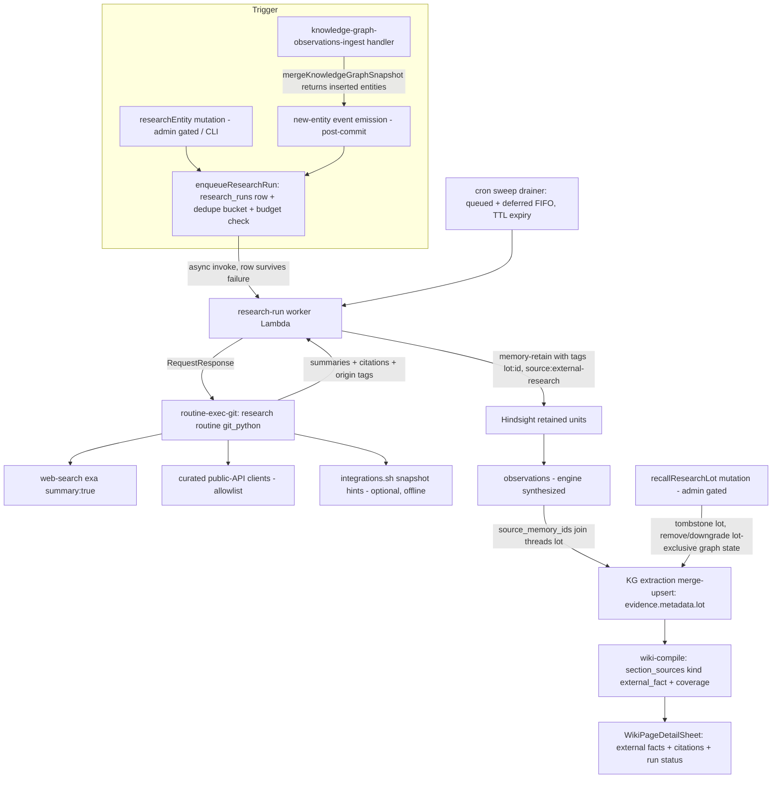

# External Sourcing v1 - Plan

> **Superseded on 2026-07-11.** Do not implement this plan. Its
> zero-credential public-research-first product contract and custom run path
> have been replaced by
> `docs/brainstorms/2026-07-11-external-memory-compounding-requirements.md`,
> which defines governed CRM, Firecrawl, email, and Knowledge Base ingestion
> through personal Automations and operator-managed Workflows.

## Goal Capsule

- **Objective:** Ship the first governed external-data capability from the THINK-117 re-litigation: an event-triggered research loop that enriches the Compounding Memory Wiki from zero-credential public sources with full lot recall, plus a two-arm adoption spike (integrations.sh accuracy, Executor hands-on) whose written verdicts gate all Executor and credential-facts work.
- **Authority hierarchy:** This plan's Product Contract (from ce-brainstorm dialogue 2026-07-04) governs behavior; the THINK-117 requirements corpus (`docs/brainstorms/2026-07-01-think-117-customer-onboarding-resource-broker-requirements.md`) governs inherited constraints (R28/R34 no-marketplace, facade anti-pattern); repo conventions govern implementation style.
- **Stop conditions:** Surface a blocker instead of guessing if (a) the origin/main KG merge path differs materially from what U1 assumes, (b) Reflection promotion semantics would need changing (out of scope — this plan only adds an upstream producer), or (c) a unit requires credentialed source access (out of scope for v1).
- **Execution profile:** Inert-first multi-PR arc; each unit lands green and inert until U12's seam-swap. Work from a fresh worktree off origin/main (local main checkout is ~100 commits behind the substrate this plan builds on).
- **Product Contract preservation:** changed: R2 (manual trigger narrowed to operator-only in v1 — every spend-triggering precedent is admin-gated; end-user self-serve deferred); added: R17–R20 (run lifecycle requirements surfaced by flow analysis). All other R/A/F/AE IDs unchanged.
- **Tracking:** Linear THINK-148 (related: THINK-117).

---

## Product Contract

### Summary

When the Brain's KG extraction mints a new Entity, an event enqueues a deterministic research routine that gathers summarized facts from zero-credential public sources, feeds them through the existing Reflection → Wiki-Compile pipeline with citations, origin tags, and a recallable lot ID, and produces a visibly enriched Entity page. In parallel, a two-arm spike evaluates integrations.sh data accuracy and Executor hands-on, producing written verdicts that gate all Executor and credential-facts work.

### Problem Frame

The Pi runtime has zero external-content ingestion paths today: the Wiki grows only from what people happen to discuss in threads, so entity pages are thin exactly where an onboarding or account-research workflow needs them rich. THINK-117 committed ThinkWork to being the governed broker for external data, but its decided sequencing put external agent harnesses first — meaning the platform would broker external data for outsiders before its own knowledge layer ever benefited. Meanwhile, two MIT-licensed projects from Useful Software Co (integrations.sh, a 5,758-spec integration registry; Executor, a single-execute-tool MCP gateway with host-side credential injection) plausibly cover the commodity layers of the broker's data plane — but their data quality and abstraction fit are unverified, and one documented failure (raw web-scrape enrichment producing garbage candidates) shows what naive external sourcing does to the Brain.

### Key Decisions

- **The Wiki is the broker's first customer.** The research loop dogfoods the governed external-read path on a consumer ThinkWork fully controls, before any external harness consumes the broker. This inverts THINK-117's decided sequencing deliberately; the external-harness surface is unaffected and follows later.
- **Parallel tracks, no cross-dependency.** Track A (research loop) must function with integrations.sh absent and has no Executor dependency. Track B (spike) gates Executor adoption and every credential-facts feature. Neither waits on the other.
- **Event-driven trigger, no cron.** A new-Entity event from KG extraction is the primary trigger; a manual per-entity action covers demos and backfill. Spend scales with real tenant activity. Knowledge-gap and business-moment triggers are deferred fast-follows.
- **Zero-credential tranche first.** Summary-returning web search plus a curated allowlist of public no-auth API surfaces. Token custody stays off the critical path; credentialed sources arrive only after the spike verdict and a later plan.
- **Full recall ships in v1.** Every research run stamps a lot ID threaded to graph provenance, and an operator can tombstone a lot end-to-end. No external fact is ever un-recallable.
- **Reflection remains the only Brain ingestion path.** Research findings enter as retained content flowing through retain → Reflection → Wiki-Compile → KG extraction. No direct wiki or graph writes, no parallel ingestion pipe.
- **Summaries only, never raw pages.** Sources must return or be reduced to summaries before entering the pipeline, with timeouts budgeted for synthesis (the documented web-enrichment failure is a hard constraint).

### Actors

- A1. **Platform (research routine)** — deterministic, git-backed routine (THINK-135 machinery) that plans queries, fetches, summarizes, and submits findings.
- A2. **Operator** — curates the source allowlist, sets research budgets, triggers manual runs, reviews enriched pages, issues recalls.
- A3. **End user** — mentions entities in threads (indirectly triggering research), reads enriched Entity pages.
- A4. **Brain pipeline** — Memory-Retain, Reflection, Wiki-Compile, KG extraction; unchanged contracts, new upstream producer.

### Requirements

**Track A — Trigger and execution**

- R1. When KG extraction creates an Entity the tenant's Brain has not seen before, the platform enqueues a research run for it through a durable, observable queue path (no fire-and-forget invocations).
- R2. An operator can trigger a research run on demand for a specific entity from its Wiki page, with a CLI equivalent. Admin-gated in v1; end-user self-serve triggering is deferred.
- R3. Research runs execute as a deterministic routine whose query plan, sources consulted, and per-step outcomes are recorded per run.
- R4. Each tenant has a research budget: a daily run cap and per-run spend ceiling, with new-entity events deduplicated and coalesced so bulk entity creation cannot produce runaway spend. Budget exhaustion defers runs rather than dropping them silently.

**Track A — Sources and governance**

- R5. Tranche-1 sources are zero-credential only: a summary-returning web-search provider plus an operator-visible curated allowlist of public no-auth API surfaces. The allowlist is per-tenant and operator-editable.
- R6. External content enters the pipeline only as summaries with source attribution; raw page bodies are never retained. Fetch and synthesis timeouts are budgeted per source.
- R7. All externally-sourced content is marked untrusted (`instructionBoundary: "untrusted_source_data"` semantics) at every layer that formats it for model or user consumption.
- R8. integrations.sh is consulted only as offline discovery metadata (candidate domains and surface hints for the curated allowlist); a research run completes normally when it is unreachable or its data is absent.

**Track A — Ingestion and provenance**

- R9. Research findings enter the Brain exclusively via retain → Reflection → Wiki-Compile → KG extraction. No component writes directly to wiki pages or graph state.
- R10. Every externally-derived fact carries a citation (source domain, URL, fetched-at timestamp) and an origin discriminator distinguishing source-reported facts from model synthesis.
- R11. Enriched Entity pages visually distinguish externally-sourced facts from thread-derived facts, and each research run's coverage (what was searched, what was found, what was not found) is recorded and surfaced.
- R12. Every research run stamps its observation batch with a lot ID that is threaded through KG extraction into derived entity and relationship provenance.

**Track A — Recall**

- R13. An operator can recall a lot: tombstoning it removes or downgrades all derived graph state via the merge path, triggers wiki recompilation of affected pages, and records the recall in the affected pages' coverage disclosure.

**Track A — Run lifecycle**

- R17. At most one research run is active per (tenant, entity); a manual trigger while a run is in flight joins the in-flight run instead of starting a second.
- R18. Every run reaches an explicit terminal state — `promoted` (lot evidence reached the graph), `retained` (findings retained, promotion not yet observed), `no_results` (research yielded no retainable findings), `failed`, or `recalled` — and the entity's page surface distinguishes pending, running, deferred, and terminal states. A run stuck at `retained` past the promotion window surfaces as "retained, nothing promoted" in coverage; zero promotions never collapse into "not researched."
- R19. Deferred runs replay FIFO when budget resets, carry a 7-day TTL, and expire with a logged reason after it — the deferred backlog is bounded and drains within the next budget windows.
- R20. Search-provider or per-source failures degrade per source (mark source failed, continue); a run with all sources failed terminates `failed`, distinct from `no_results`.

**Track B — Adoption spike**

- R14. Spike Arm A diffs integrations.sh per-surface credential facts, endpoint shapes, and scope guidance against ground truth from at least three shipped integrations (LastMile, Twenty, n8n), probes coverage of P21/FleetIO-class enterprise systems, and grades the registry per capability (surface inventory, credential facts, scope guidance) rather than pass/fail.
- R15. Spike Arm B runs Executor locally with 2–3 known sources wired through it and evaluates: per-call metadata sufficiency for audit and provenance capture, whether eligibility gating and task postures can wrap the single-execute surface, composability with the Secrets Manager plugin-token custody path, and what its sandbox actually isolates.
- R16. Each arm produces a written verdict document under `docs/solutions/` (house spike-verdict method); Arm B's deliverable is an explicit pattern-adopt / embed / reject decision. No Executor integration or credential-facts feature work proceeds before its gating verdict exists.

### Key Flows

- F1. Event-triggered enrichment
  - **Trigger:** KG extraction mints a new Entity.
  - **Steps:** Event coalesced/deduplicated → budget check → research routine runs (query plan → zero-credential fetches → summaries with citations) → findings retained as thread content with lot ID → Reflection promotes → Wiki-Compile regenerates the Entity page.
  - **Outcome:** Entity page shows cited, origin-tagged external facts distinct from thread-derived facts, plus a coverage line.
  - **Covers:** R1, R3–R12, R17–R20.
- F2. Manual research (demo/backfill)
  - **Trigger:** Operator clicks "Research this entity" on a Wiki page (or CLI).
  - **Steps:** Same pipeline as F1, bypassing event coalescing but not budgets; joins any in-flight run for the entity.
  - **Covers:** R2, R4, R17.
- F3. Recall
  - **Trigger:** Operator identifies a compromised or wrong source and recalls the lot.
  - **Steps:** Tombstone lot → graph state whose evidence is exclusively that lot is removed/downgraded → affected pages recompile → coverage discloses the recall.
  - **Covers:** R12, R13.

### Acceptance Examples

- AE1. **Covers R1, R9–R11.** Given a company never discussed before, when a user mentions it in a thread and the extraction/research/reflection cycle completes, then its Entity page exists with at least one externally-cited, origin-tagged fact and a coverage line — and no raw page content appears anywhere in retained data.
- AE2. **Covers R4, R19.** Given a bulk import that mints 500 entities at once, when events fire, then runs are coalesced and capped at the tenant's daily budget, excess runs are deferred with a TTL, and no fire-and-forget invocations occur.
- AE3. **Covers R13.** Given an enriched page whose facts came from lot L, when the operator recalls L, then those facts disappear from the page after recompile, thread-derived facts and other lots' facts are untouched, and the page's coverage discloses the recall.
- AE4. **Covers R8.** Given integrations.sh is unreachable, when a research run executes, then it completes via the search provider and allowlisted APIs with no degradation other than fewer candidate sources.
- AE5. **Covers R16.** Given Arm A grades credential facts as unreliable, then no wiring-compiler or scope-linting work is scheduled, and Track A continues unaffected.
- AE6. **Covers R18.** Given a run whose findings are all rejected by Reflection, then the run holds at `retained` (never advancing to `promoted`), the Entity page's coverage line reads "retained, nothing promoted," and the run is not re-enqueued.

### Success Criteria

- The demo scene works on the dev tenant: mention a new company in a thread, open its Wiki Entity page after the cycle, and show cited, origin-tagged external facts visually distinct from thread facts — then recall the lot live.
- Every external fact is traceable end-to-end: citation → lot → research run → query plan.
- Both spike verdict documents exist with graded findings and an explicit Arm B decision.

### Scope Boundaries

**Deferred for later**

- Knowledge-gap and business-moment triggers; scheduled sweeps; staleness-TTL refresh; end-user self-serve manual triggering.
- Credentialed sources and any token-custody expansion.
- Executor integration work of any mode (gated on the Arm B verdict; separate plan).
- Day-1 tenant wiki bootstrap from external research; agent-initiated mid-thread research; demand-pull acquisitions loop.

**Outside this product's identity**

- A user-facing connector catalog or marketplace UI over the registry.
- A live registration path from integrations.sh into `tenant_mcp_servers`.
- Mounting integrations.sh's hosted MCP server as a runtime dependency.
- Raw per-integration MCP transports on agents (facade anti-pattern).

### Dependencies / Assumptions

- All substrate references below were verified against **origin/main** (the local main checkout is ~100 commits behind); implementation starts from a fresh worktree off origin/main.
- `mergeKnowledgeGraphSnapshot` (merge-upsert with per-packet provenance) is live on origin/main; it returns void today — U1 adds the inserted-entity return.
- THINK-135 git-python routines (`routine-exec-git`) are live on dev and can host the research routine.
- Exa web search with `contents: { summary: true }` is already wired per-tenant (`tenant_builtin_tools`, slug `web-search`, disabled by default); its summaries are assumed adequate without a second synthesis pass — revisit if quality repeats the documented raw-scrape failure.
- Reflection/dreaming promotion semantics are unchanged; this plan adds an upstream producer only.
- integrations.sh data quality is unverified (live catalog-layer probe 2026-07-04 found no credential facts at the catalog level); nothing in Track A depends on it.

---

## Planning Contract

### Key Technical Decisions

- **KTD-1. Trigger rides the wiki-compile job-queue pattern, not Automations or EventBridge.** A `research_runs` DB row with a dedupe key + async Lambda invoke + cron sweep drainer replicates `packages/api/src/lib/wiki/enqueue.ts` (`maybeEnqueuePostTurnCompile`) wholesale. Automations trigger families are `schedule`/`webhook` only (internal `app_event` was removed — `docs/plans/2026-07-04-002-feat-automations-trigger-target-plan.md`), so an internal entity-created event does not fit there. Suppressed duplicates (`ON CONFLICT DO NOTHING` returning not-inserted) must emit a metric + log — silent chain-stop is a documented past failure (`docs/solutions/logic-errors/compile-continuation-dedupe-bucket-2026-04-20.md`).
- **KTD-2. Lot = one research run; re-runs coexist.** Each run mints a new lot; recall targets exactly one run's derived state. Lot IDs land in `knowledge_graph_evidence.metadata`; entities/relationships whose evidence is exclusively lot-tagged are removed on recall, others downgraded (evidence row removed, entity kept). Accepted cost: recall granularity is the whole run, not one source within it.
- **KTD-3. Lot threading uses the `source_memory_ids` join.** Observations are engine-synthesized by Hindsight and do not inherit retained-unit metadata. The KG packet builder (`packages/api/src/lib/knowledge-graph/observations-source.ts`) must join `source_memory_ids` back to retained units' tags (`lot:<id>`) and carry the lot into `evidenceMetadata`. Without this join, R12 silently fails.
- **KTD-4. Citations render through a structured source channel, not inline prose.** The wiki deliberately forbids inline record IDs in page bodies (`section-writer.ts`, `planner.ts`). External citations become a new `section_sources` source kind (`external_fact`) carrying structured citation fields (domain, URL, fetched-at, origin discriminator, lot), rendered by net-new UI on `apps/web/src/components/memory/WikiPageDetailSheet.tsx` (which renders zero provenance today).
- **KTD-5. Budgets consume existing substrates:** daily run cap via the atomic quota-counter pattern (`packages/api/src/lib/sandbox-quota.ts` — UPSERT with `WHERE count < :cap`, fail-closed); per-run spend ceiling via the THNK-74 cost-events/trace-ledger projections; defer-not-drop via status columns on `research_runs` (mirroring `user-budget-enforcement.ts`), never a new parallel counter table. Config lives in `tenant_builtin_tools`/`tenant_settings` + SSM — never new graphql-http env vars (4KB ceiling).
- **KTD-6. Research routine pinned to the git_python engine, invoked RequestResponse.** The run worker invokes `routine-exec-git` directly (`InvocationType: RequestResponse`, per the job-trigger routine-actions pattern) — not the step_functions engine behind `triggerRoutineRun`. Per-step outcomes land in `routine_executions.output_json` (satisfies R3). No fire-and-forget anywhere on the path; agent-loop-style invokes use `MaximumRetryAttempts=0` + DLQ + CAS status transitions.
- **KTD-7. Inert-first sequencing; the live gate is a deployed dev end-to-end run.** Substrate units land verifiable-in-isolation with the trigger flag off; U12 flips the flag on dev and the acceptance evidence is a real new-Entity event producing a cited fact on the Entity page — not a bare Lambda invoke (which skips mcp_configs + workspace bootstrap).
- **KTD-8. Fetch layer = existing Exa summary search + net-new curated public-API clients.** `runExaSearch` already requests `contents: { summary: true }` with a 25s timeout. The allowlisted public-API fetcher follows the Google Places client template (`packages/api/src/lib/wiki/google-places-client.ts`: retry ladder, circuit breaker, null-degrade). Normalization order: summary → highlights → cleaned fallback; timeouts sized for summary latency.
- **KTD-9. Recall reuses the merge-path shape.** Recall mirrors `purgeKnowledgeGraphSource` (repository.ts) but scoped by evidence lot metadata instead of source_ref, followed by a wiki compile enqueue for affected pages.

### High-Level Technical Design

Run state machine: `queued → running → retained | no_results | failed`; `retained → promoted` when the sweep observes lot-tagged evidence in `knowledge_graph_evidence` (the only component that can know Reflection's outcome, since promotion is asynchronous); `queued → deferred → queued (budget reset, FIFO) | expired (TTL)`; `retained | promoted → recalled` via recall. Partial unique index enforces one active run per (tenant, entity).

### Assumptions

- Reflection promotes at least some well-formed, cited research summaries for entities with real public footprint; if promotion rates are near zero in dev, threshold tuning is a follow-up, not a v1 blocker (R18 makes the outcome visible either way).
- The research routine can run as a platform-provisioned routine in the tenant routine repo (THINK-135 dev repo token caveat: currently Eric's gh token, PAT swap pending — acceptable for dev proof).

### System-Wide Impact

- **Memory pipeline:** adds an upstream producer only. Retain kinds gain `research_finding`; Reflection, dreaming, consolidation, and promotion contracts are untouched. The `observations-source` packet builder gains a read-only join against `hindsight.memory_units` tags (reads of `hindsight.*` are established practice; the only-public-schema rule governs drops).
- **Wiki schema and compile:** `section_sources.source_kind` gains a value and citation fields — additive; existing kinds and the compile planner/writer conventions (no inline record IDs) unchanged. Recompile volume rises slightly (recall-triggered enqueues ride the existing compile-job queue and its caps).
- **Cost/budget substrate:** budget enforcement consumes THNK-74 cost-events projections and the quota-counter pattern; no parallel counter table, so operator-visible cost summaries and research budgets reconcile by construction.
- **Dispatch surfaces:** research runs dispatch via `routine-exec-git` (git_python), not the chat/wakeup agent-invoke builders — the wakeup/chat payload-parity trap does not apply to this path; it becomes relevant only if a future variant dispatches agent turns directly.
- **Deploy surface:** two new Lambda handlers (worker, sweep) with terraform wiring; new env/config goes to SSM and `tenant_builtin_tools`, never graphql-http env (4KB ceiling risk to all deploys).

### Risks

- **Reflection promotes little or nothing from research findings** → the demo shows `retained, nothing promoted`. Mitigation: R18 makes the outcome visible rather than silent; promotion-threshold tuning is a named follow-up; dev proof runs against entities with real public footprint first.
- **Exa summary quality or latency regresses** (documented prior failure mode) → Mitigation: normalization ladder (summary → highlights → cleaned fallback), per-source timeouts sized for summaries, U4 leak-guard test; provider is pluggable (`exa | serpapi`).
- **Origin/main drift during implementation** (substrate landed within the last ~100 commits and is still moving) → Mitigation: fresh worktree off origin/main per PR, continuous rebase at breakpoints, U1 re-verifies the merge-path contract before building on it.
- **Routine repo credential** (dev uses Eric's gh token; PAT swap pending) → acceptable for dev proof; blocks customer-stage rollout, which is out of scope here.
- **Event storms beyond coalescing** (pathological ingest minting thousands of entities) → Mitigation: daily cap defers excess (AE2 test), deferred TTL bounds the backlog, sweep drains FIFO within budget windows.

---

## Implementation Units

Unit index:

| U-ID | Title                                         | Key files                                                                                                                | Depends on                |
| ---- | --------------------------------------------- | ------------------------------------------------------------------------------------------------------------------------ | ------------------------- |
| U1   | New-entity event emission                     | `packages/api/src/lib/knowledge-graph/repository.ts`, `packages/api/src/handlers/knowledge-graph-observations-ingest.ts` | —                         |
| U2   | research_runs ledger + enqueue + sweep        | `packages/database-pg/src/schema/`, `packages/api/src/lib/research/`                                                     | U1                        |
| U3   | Budgets, coalescing, deferral                 | `packages/api/src/lib/research/`, `packages/api/src/lib/sandbox-quota.ts` patterns                                       | U2                        |
| U4   | Zero-credential fetch layer                   | `packages/api/src/lib/research/sources/`                                                                                 | —                         |
| U5   | Research routine + run worker                 | `packages/lambda/`, routine repo                                                                                         | U2, U4                    |
| U6   | Retention with lot tags                       | `packages/api/src/lib/memory/hindsight-retain-params.ts`                                                                 | U5                        |
| U7   | Lot threading into KG evidence                | `packages/api/src/lib/knowledge-graph/observations-source.ts`                                                            | U6                        |
| U8   | Wiki citation channel + coverage              | `packages/api/src/lib/wiki/`, `packages/database-pg/src/schema/wiki.ts`                                                  | U7                        |
| U9   | GraphQL + UI + CLI operator surface           | `packages/api/src/graphql/`, `apps/web/`, `apps/cli/`                                                                    | U2 (status), U8 (display) |
| U10  | Lot recall                                    | `packages/api/src/lib/knowledge-graph/repository.ts`, wiki enqueue                                                       | U7, U8                    |
| U11  | Spike Arm A: integrations.sh accuracy verdict | `docs/solutions/`                                                                                                        | —                         |
| U12  | Live seam-swap + deployed E2E gate            | terraform, dev stage                                                                                                     | U1–U10                    |
| U13  | Spike Arm B: Executor hands-on verdict        | `docs/solutions/`                                                                                                        | —                         |

### U1. New-entity event emission from the KG merge path

- **Goal:** Make "entity did not exist before" observable and emit an event after the merge transaction commits.
- **Requirements:** R1.
- **Dependencies:** none.
- **Files:** `packages/api/src/lib/knowledge-graph/repository.ts` (`mergeKnowledgeGraphSnapshot` — return inserted-entity descriptors from the insert branch), `packages/api/src/handlers/knowledge-graph-observations-ingest.ts` (emit post-commit), tests alongside existing repository/handler tests.
- **Approach:** Change `mergeKnowledgeGraphSnapshot` to return `{ insertedEntities: [{id, normalizedLabel, ontologyTypeSlug}] }` alongside existing metrics. The ingest handler calls the (U2) enqueue helper after the merge transaction commits — never inside it, and never before the any-batch-dropped failure gate. Ships inert: until U2 lands, the handler logs candidate events only.
- **Test scenarios:** merge inserting 2 new + updating 3 existing returns exactly the 2 inserted descriptors; merge with zero inserts returns empty; enqueue is not called when the run fails pre-merge; event emission happens after commit (verify ordering via transaction spy/log).
- **Verification:** package tests green; log line visible for inserted entities on a dev ingest run.

### U2. research_runs ledger, enqueue path, and sweep drainer

- **Goal:** Durable, observable, deduplicated queue for research runs.
- **Requirements:** R1, R3 (run record), R17, R19 (states).
- **Dependencies:** U1.
- **Files:** `packages/database-pg/src/schema/research.ts` (new), migration via `db:generate`, `packages/api/src/lib/research/enqueue.ts` (new), `packages/api/src/handlers/crons/research-run-sweep.ts` (new), terraform handler + schedule wiring (`terraform/modules/app/`), `scripts/build-lambdas.sh` entry, tests `packages/api/src/lib/research/*.test.ts`.
- **Approach:** `research_runs` table: id (lot ID), tenant_id, entity_id, trigger (`event|manual`), status (`queued|deferred|running|retained|promoted|no_results|failed|expired|recalled`), dedupe_key `${tenant}:${entityKey}:${bucket}` (5-min bucket, derived deterministically per the compile-continuation lesson), coverage jsonb, timestamps. Partial unique index: one active (`queued|running`) row per (tenant, entity) — manual trigger joins in-flight (R17). Enqueue mirrors `maybeEnqueuePostTurnCompile`: insert `ON CONFLICT DO NOTHING` → **suppressed duplicates emit metric + log** → async invoke; row survives invoke failure for sweep pickup. Sweep cron drains queued rows missed by invoke and deferred rows FIFO on budget reset; expires deferred rows past 7-day TTL with a logged reason; and advances `retained → promoted` when lot-tagged rows appear in `knowledge_graph_evidence` (promotion is asynchronous — the sweep is the only component positioned to observe it). Lambda invoke config: `MaximumRetryAttempts=0` + DLQ. Ships inert (flag off; nothing calls enqueue in prod paths until U12).
- **Execution note:** land schema + handler + terraform in one unit — a handler without its `handlers.tf` + build entry is dead (env-gated-feature lesson).
- **Test scenarios:** duplicate event within bucket → one row + suppressed-duplicate metric; concurrent enqueue for same entity → single active row (unique-index race test); manual trigger during running run → joins (returns existing run id); deferred row past TTL → `expired` + log; sweep drains FIFO order; invoke failure leaves row `queued` for sweep.
- **Verification:** migration applies to dev via precheck gate; `pnpm --filter @thinkwork/database-pg test` and api package tests green.

### U3. Budgets, coalescing policy, and deferral

- **Goal:** Per-tenant daily run cap + per-run spend ceiling with defer-not-drop semantics.
- **Requirements:** R4, R19.
- **Dependencies:** U2.
- **Files:** `packages/api/src/lib/research/budget.ts` (new, mirroring `packages/api/src/lib/sandbox-quota.ts` counter pattern), config read from `tenant_settings.features` + `tenant_builtin_tools`, tests.
- **Approach:** Atomic daily counter with `WHERE count < :cap` guard decides queued-vs-deferred at enqueue time; spend ceiling enforced in the worker via cost-events ledger lookups (THNK-74 substrate), aborting a run that exceeds its ceiling with status `failed` + reason. Defaults: conservative cap (e.g., 25 runs/tenant/day) as code constants overridable per tenant; no new env vars on graphql-http.
- **Test scenarios:** 500 simultaneous events → cap runs queued, rest deferred (AE2); budget reset re-queues deferred FIFO; exhausted budget + manual trigger → deferred with operator-visible reason; counter race (two concurrent enqueues at cap-1) admits exactly one.
- **Verification:** package tests green; quota behavior observable in logs on dev.

### U4. Zero-credential fetch layer (search + curated public APIs)

- **Goal:** The bounded source layer research routines call: summary web search + allowlisted public API clients.
- **Requirements:** R5, R6, R7, R8, R20.
- **Dependencies:** none (parallel with U2/U3).
- **Files:** `packages/api/src/lib/research/sources/` (new: `search.ts` wrapping the existing web-search lib, `public-api-client.ts` on the Places-client template, `allowlist.ts`), allowlist storage in `tenant_builtin_tools` row (slug `external-research`), tests.
- **Approach:** Search uses the existing `runExaSearch` path with `summary: true` and timeouts sized for summary latency; normalization order summary → highlights → cleaned fallback; raw bodies never returned upward. Public-API clients: retry ladder + circuit breaker + null-degrade per client; per-source failure marks the source failed and continues (R20). Every result is wrapped with source attribution + `instructionBoundary: "untrusted_source_data"`. integrations.sh appears only as an optional, offline-refreshed hints file feeding allowlist suggestions — absent by default.
- **Test scenarios:** provider timeout → source marked failed, run continues; all sources failed → run-level `failed` distinct from `no_results`; raw-body leak guard (no result object carries un-summarized page text); allowlist empty → search-only run completes (AE4); untrusted boundary present on every formatted result.
- **Verification:** package tests green; a scripted dev invocation returns summarized, attributed results for a real company.

### U5. Research routine and run worker

- **Goal:** The deterministic research routine (git_python) plus the worker Lambda that drives a run end-to-end.
- **Requirements:** R3, R6, R10 (fact shape), R18, R20.
- **Dependencies:** U2, U4.
- **Files:** `packages/lambda/research-run-worker.ts` (new; build entry + `handlers.tf`), routine definition committed to the tenant routine repo (dev), `packages/api/src/lib/research/run.ts` (CAS status transitions), tests.
- **Approach:** Worker claims the run row (CAS `queued→running`), invokes `routine-exec-git` RequestResponse with `{entityId, entityLabel, tenantId, lotId}` as routine input; the routine builds a query plan, calls the U4 source layer, and returns findings as structured facts: `{claim, citation:{domain,url,fetchedAt}, origin: source_fact|llm_synthesis}` plus per-step coverage. Worker records coverage on the run row, hands findings to U6 retention, and sets `retained` (findings retained) or `no_results` (zero findings). The `retained → promoted` transition belongs to the U2 sweep, which observes lot-tagged evidence arriving in the graph; Reflection-level rejection stays visible as a run held at `retained` with coverage reading "retained, nothing promoted" (AE6 surface lands at U8). Per-step outcomes persist in `routine_executions.output_json`.
- **Execution note:** start with a plain-node smoke script against dev (THINK-116 live-E2E lesson) — bare lambda invoke is not an E2E test.
- **Test scenarios:** happy path: run row transitions queued→running→retained with coverage recorded; zero findings → `no_results`; routine throws → `failed` + DLQ visible; CAS prevents double-claim; origin discriminator present on every fact; sweep advances retained→promoted when lot evidence exists (with U2); Covers AE6 groundwork (run held at `retained`, coverage records "nothing promoted").
- **Verification:** dev-deployed worker completes a real run for a test entity; `routine_executions` row shows per-step outcomes.

### U6. Retention with lot tags

- **Goal:** Research findings enter Hindsight as retained units tagged for lot threading.
- **Requirements:** R9, R10, R12 (first half).
- **Dependencies:** U5.
- **Files:** `packages/api/src/lib/memory/hindsight-retain-params.ts` (new builder `buildResearchFindingRetainOptions`), `packages/api/src/handlers/memory-retain.ts` (accept the new kind), tests.
- **Approach:** New retain kind `research_finding` with tags `["source:external-research", "lot:<lotId>", "entity:<entityId>"]` and metadata carrying structured citations. Content is the summarized, cited fact text — never raw pages. Rides the existing retain path unchanged otherwise (Reflection remains the only gate).
- **Test scenarios:** retained unit carries lot + source tags; metadata citation round-trips; existing retain kinds unaffected (regression); no direct wiki/graph writes anywhere in the unit.
- **Verification:** dev retain of a research finding visible in Hindsight bank with tags.

### U7. Lot threading into KG evidence

- **Goal:** Lot IDs survive the observation synthesis hop into graph provenance.
- **Requirements:** R12.
- **Dependencies:** U6.
- **Files:** `packages/api/src/lib/knowledge-graph/observations-source.ts` (join `source_memory_ids` → retained-unit tags during packet building), `packages/api/src/lib/knowledge-graph/repository.ts` (evidence metadata passthrough), tests.
- **Approach:** During packet building, batch-resolve each observation's `source_memory_ids` to retained units; when any carries a `lot:` tag, stamp `evidenceMetadata.lot` (and `origin`) so it lands in `knowledge_graph_evidence.metadata`. Observations mixing lot and non-lot sources carry the lot list; recall logic (U10) treats mixed-evidence state as downgrade-not-delete. Reads `hindsight.*` are read-only (established practice; only-public-schema rule governs drops).
- **Test scenarios:** observation from lot-tagged units → evidence metadata carries lot; mixed-source observation → lot list + thread provenance both present; non-research observations unchanged (regression); join batched (no N+1 per observation).
- **Verification:** dev ingest run shows `knowledge_graph_evidence.metadata.lot` populated for research-derived evidence.

### U8. Wiki citation channel and coverage surface

- **Goal:** External facts render as structured citations distinct from thread-derived content, with run coverage surfaced.
- **Requirements:** R10, R11, R18 (page-visible states).
- **Dependencies:** U7.
- **Files:** `packages/database-pg/src/schema/wiki.ts` (`section_sources.source_kind` gains `external_fact`; structured citation columns or metadata jsonb), `packages/api/src/lib/wiki/compiler.ts` + `repository.ts` (`recordSectionSources` carries citations), `packages/database-pg/graphql/types/wiki.graphql` (expose sources + research status/coverage), codegen in api/web/cli/mobile, tests.
- **Approach:** Compiler attaches `external_fact` sources (with citation fields + lot + origin) to sections whose content derives from lot-tagged evidence; page bodies stay prose-clean per house convention — citations are a structured side channel. GraphQL exposes per-page external sources, latest run status, and coverage. AE6 lands here: coverage renders "retained, nothing promoted" for runs held at `retained` past the promotion window; `no_results` runs render their own distinct coverage line.
- **Test scenarios:** section built from lot-tagged evidence gets `external_fact` source rows with citations; thread-only sections get none; `no_results` run yields coverage without sources; recalled lot's sources removed after recompile (with U10); GraphQL returns citation fields.
- **Verification:** dev wiki compile produces external_fact source rows; GraphQL query returns them.

### U9. Operator surface: GraphQL mutations, web UI, CLI

- **Goal:** "Research this entity" and "Recall lot" actions plus visible run state and citations.
- **Requirements:** R2, R11, R13 (surface), R17 (join behavior visible), R18.
- **Dependencies:** U2 (trigger/status), U8 (display); recall button activates with U10.
- **Files:** `packages/api/src/graphql/resolvers/research/` (new: `researchEntity.mutation.ts`, `recallResearchLot.mutation.ts`, queries), `packages/database-pg/graphql/types/` (new type file + `pnpm schema:build`), admin gating per `resolvers/wiki/auth.ts` pattern, `apps/web/src/components/memory/WikiPageDetailSheet.tsx` (external-facts section, status chip, action buttons per `BrainOperationsPage.tsx` pattern), `apps/cli/src/commands/research.ts` (new: `thinkwork research <entity>`, `thinkwork research recall <lot>`, following `wiki.ts`), codegen in all four consumers, tests.
- **Approach:** Mutations are admin-gated (`requireTenantAdmin`), RequestResponse semantics with surfaced errors; `researchEntity` returns the existing run when one is in flight (R17). UI renders external facts visually distinct (badge/section) with citation links, run status chip (pending/running/deferred/no_results/failed/recalled), and the coverage line. List-surface conventions per house rules (tokens, collapsed search) where applicable.
- **Test scenarios:** non-admin caller rejected; researchEntity during in-flight run returns same run id; recall button disabled until lot exists; UI states render for each status (component tests); CLI verbs hit mutations and poll status.
- **Verification:** visual pass on dev in Eric's checkout (house rule: no UI claim without pixels); CLI round-trip on dev.

### U10. Lot recall

- **Goal:** Tombstone a lot end-to-end: graph removal/downgrade, recompile, disclosure.
- **Requirements:** R13.
- **Dependencies:** U7, U8.
- **Files:** `packages/api/src/lib/knowledge-graph/repository.ts` (`recallKnowledgeGraphLot` — modeled on `purgeKnowledgeGraphSource` but scoped by evidence lot metadata), `packages/api/src/lib/research/recall.ts` (orchestration: CAS run status → `recalled`, wiki compile enqueue for affected pages, coverage disclosure), tests.
- **Approach:** Delete evidence rows for the lot; entities/relationships left with zero evidence are removed; mixed-evidence state is kept with the lot's evidence rows deleted (downgrade). Enqueue wiki recompile for affected pages; coverage on those pages discloses the recall. Idempotent: recalling a recalled lot is a no-op with a log.
- **Test scenarios:** AE3 end-to-end at unit level: lot-exclusive entity removed, mixed entity kept minus lot evidence, other lots untouched; recompile enqueued exactly once per affected page; recall idempotency; disclosure text present in coverage.
- **Verification:** dev recall of a real research lot removes facts from the page after recompile.

### U11. Spike Arm A — integrations.sh accuracy verdict

- **Goal:** Graded verdict on integrations.sh data quality against shipped-integration ground truth.
- **Requirements:** R14, R16.
- **Dependencies:** none.
- **Files:** `docs/solutions/tooling-decisions/integrations-sh-accuracy-spike-verdict-2026-07.md` (new).
- **Approach:** Pull per-surface records for LastMile (diff vs `plugins/lastmile/src/discovery.fixture.ts` RFC 9728 capture), Twenty, n8n; probe P21/FleetIO-class coverage; grade per capability (surface inventory / credential facts / scope guidance). Known input: `/api.json` catalog layer carries no credential facts (probed 2026-07-04). Verdict format per flue/copilotkit precedent: explicit verdict line, what-was-tested, pre-declared pass criteria.
- **Test scenarios:** Test expectation: none — investigation deliverable; the verdict doc's pre-declared criteria are the check.
- **Verification:** verdict doc exists with per-capability grades; THINK-148 comment links it.

### U12. Live seam-swap and deployed E2E gate

- **Goal:** Turn the loop on for the dev tenant and prove the demo scene end-to-end.
- **Requirements:** all Track A; Success Criteria 1–2.
- **Dependencies:** U1–U10.
- **Files:** terraform flag/config enabling event→enqueue on dev, dev tenant `tenant_builtin_tools` rows (web-search enabled, research allowlist), smoke script under `scripts/` (plain-node ESM per THINK-116 lesson).
- **Approach:** Flip the enqueue flag on dev; verify deployed function config actually carries it (env-gated-feature lesson). Run the demo: mention a new company in a dev thread → entity minted → run executes → cited facts on the Entity page → recall the lot live. Record evidence (page states before/after, run row, evidence metadata) in the PR.
- **Test scenarios:** Covers AE1, AE2 (bounded bulk test with a small batch), AE3, AE4 (unreachable hints file), AE6 (thin entity yielding no_results).
- **Verification:** the demo scene performed on dev with Eric watching; deploy run on main watched green.

### U13. Spike Arm B — Executor hands-on verdict

- **Goal:** pattern-adopt / embed / reject decision on Executor, from a local run.
- **Requirements:** R15, R16.
- **Dependencies:** none.
- **Files:** `docs/solutions/tooling-decisions/executor-gateway-spike-verdict-2026-07.md` (new); spike scratch outside the repo.
- **Approach:** Stand up the MIT gateway locally; wire 2–3 known sources (e.g., a public API, an MCP server); evaluate per-call metadata for audit/provenance capture, whether eligibility gating + task postures (R35–R37 upstream) can wrap the single-execute surface, composability with the Secrets Manager `plugin-tokens` custody path, and sandbox isolation behavior. Pre-declare pass criteria before running; timebox separately from Arm A.
- **Test scenarios:** Test expectation: none — investigation deliverable with pre-declared criteria.
- **Verification:** verdict doc exists with an explicit pattern/embed/reject line; THINK-148 comment links it.

---

## Verification Contract

| Gate                                      | Command / evidence                                                                                                                            | Applies to  |
| ----------------------------------------- | --------------------------------------------------------------------------------------------------------------------------------------------- | ----------- |
| Types + lint + tests + format             | `pnpm -r --if-present typecheck && pnpm -r --if-present lint && pnpm -r --if-present test && pnpm format:check`                               | every PR    |
| Package suites (full, not just new tests) | `pnpm --filter @thinkwork/api test`, `pnpm --filter @thinkwork/database-pg test`                                                              | U1–U10      |
| Migration gate                            | `pnpm --filter @thinkwork/database-pg db:generate`; migration precheck CI vs dev; hand-rolled SQL (if any) applied via psql before drift gate | U2, U8      |
| Codegen                                   | `pnpm schema:build` + `pnpm --filter @thinkwork/{api,web,cli,mobile} codegen` after GraphQL changes                                           | U8, U9      |
| Lambda wiring                             | new handlers present in both `scripts/build-lambdas.sh` and `handlers.tf`; deployed `get-function-configuration` shows expected env           | U2, U5, U12 |
| Deployed E2E                              | dev-stage demo scene: real thread mention → cited Entity-page fact → live recall (plain-node smoke + pixels; never a bare lambda invoke)      | U12         |
| Spike criteria                            | pre-declared pass criteria in each verdict doc, graded                                                                                        | U11, U13    |

## Definition of Done

- All Track A units merged to main via focused PRs (worktree off origin/main; squash-merge; post-merge Deploy runs watched green); no unit left half-wired (schema without handler, handler without terraform, flag without deployed env).
- Demo scene proven on dev end-to-end and recall performed live; evidence captured on THINK-148.
- Every external fact on the dev tenant traceable citation → lot → run → query plan.
- Both spike verdict docs written with graded findings and Arm B's explicit pattern/embed/reject decision; gated work (Executor integration, credential-facts features) remains unscheduled until verdicts exist.
- Dead-end and experimental code from abandoned approaches removed; retain kinds, GraphQL schema, and UI carry no unused stubs.
- Follow-ups filed (not built): knowledge-gap trigger, end-user self-serve trigger, staleness refresh, promotion-threshold tuning if dev shows near-zero promotion.

---

## Sources / Research

- Origin dialogue + ideation: `docs/ideation/2026-07-04-think-117-integrations-sh-relitigation-ideation.html` (ideas 1–3, verifier-checked).
- THINK-117 constraints: `docs/brainstorms/2026-07-01-think-117-customer-onboarding-resource-broker-requirements.md` (R28/R29/R31/R34–R37).
- Substrate (verified on origin/main): `packages/api/src/lib/knowledge-graph/{repository.ts,observations-source.ts,bedrock-graph-extractor.ts}`; `packages/api/src/lib/wiki/{enqueue.ts,repository.ts,compiler.ts,google-places-client.ts}`; `packages/api/src/lib/builtin-tools/web-search.ts`; `packages/lambda/{routine-exec-git.ts,job-trigger.ts}`; `packages/api/src/lib/{sandbox-quota.ts,memory/retain-attempts.ts,memory/hindsight-retain-params.ts}`.
- Institutional learnings: `docs/solutions/logic-errors/compile-continuation-dedupe-bucket-2026-04-20.md`; `docs/solutions/integration-issues/web-enrichment-must-use-summarized-external-results-2026-05-01.md`; `docs/solutions/workflow-issues/env-gated-feature-dead-without-terraform-wiring.md`; `docs/solutions/architecture-patterns/{external-workflow-agent-step-bridges-need-resumable-ledgers-2026-06-21.md,inert-first-seam-swap-multi-pr-pattern-2026-05-08.md,wakeup-processor-payload-parity-with-chat-agent-invoke-2026-06-12.md}`; `docs/solutions/observability/trusted-trace-cost-accounting-substrate.md`.
- External (2026-07-04 session): executor.sh product docs; integrations.sh `/api.json` live probe (no credential facts at catalog layer); Onyx/Glean precedent.
