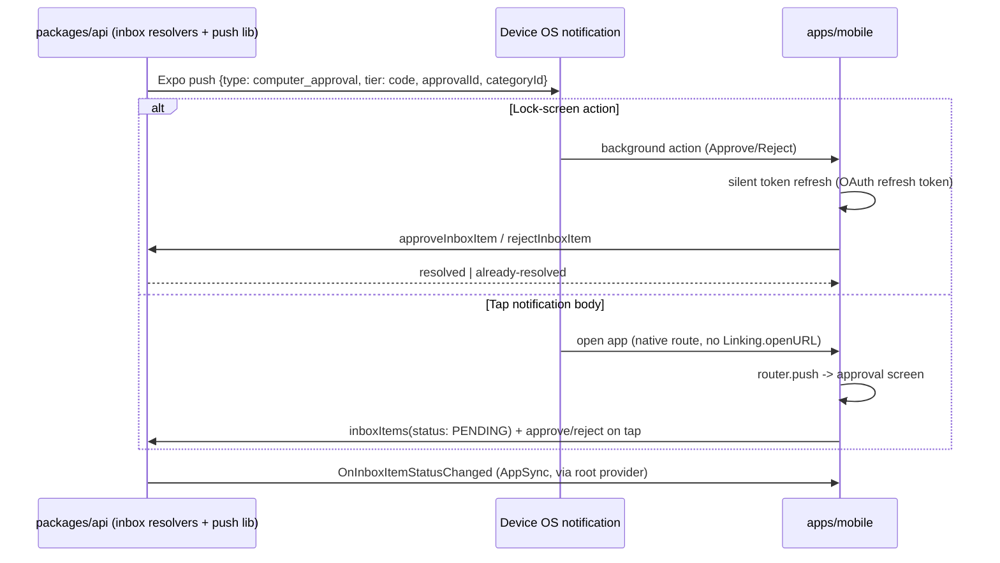
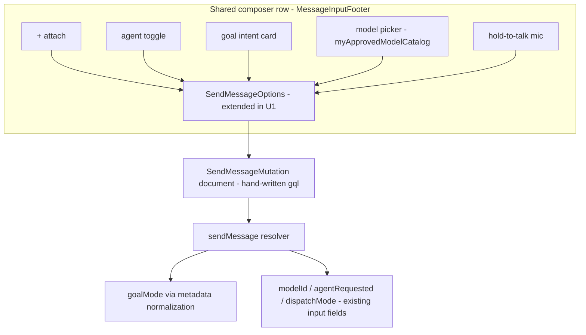

# Mobile Parity Updates - Plan

## Goal Capsule

- **Objective:** Bring the ThinkWork mobile app (apps/mobile) to parity with what shipped on web across five fronts: full-parity composer, a Threads | Work Items | Wiki home segmented control, a hybrid Work Items surface, a read-first Wiki surface, and a working end-to-end supervision loop.
- **Product authority:** This document's Product Contract; seeded from the ranked ideation set in docs/ideation/2026-07-04-mobile-parity-updates-ideation.html and confirmed in dialogue (composer option A, segmented-control home, Work Items option C, supervision in full).
- **Product Contract preservation:** Unchanged from the requirements-only version except one Dependencies correction — research found the approve/reject mutations (`approveInboxItem`/`rejectInboxItem`) already exist server-side, so no new approval mutation is needed. No R/F/AE IDs changed.
- **Execution profile:** Work in a worktree under `.claude/worktrees/`, never the main checkout. Land units as PRs to main in dependency order; the merge pipeline deploys. Ship-inert where a surface can land dark. GraphQL Lambda changes go through PRs, never `aws lambda update-function-code`.
- **Stop conditions:** Surface a blocker instead of guessing when a change would alter the Product Contract (R-IDs), touch auth/session handling beyond the documented background-refresh path, or require schema changes not named in this plan.
- **Open blockers:** None. Deferred implementation notes are marked inline.

---

## Product Contract

### Summary

Ship a mobile release where the composer matches the web composer control-for-control on an extended SDK send-path contract, the home screen regains a segmented control as Threads | Work Items | Wiki (no unread badge), Work Items lands as an act-on-existing list with swipe status actions plus assignment/blocked pushes, Wiki becomes a read-first surface fed by a recent-changes feed, and the currently broken approval path is repaired with native routing, lock-screen actions, live subscriptions, and graded notification tiers.

### Problem Frame

Web has shipped several product cycles — Work Items, the compiled Wiki/Brain, Composer v1.1, Multiplayer mentions — that never reached mobile. The mobile home is Threads-only (the old Threads/Memories segmented control was removed in commit 9f58d187, Brain Phase E), the in-thread composer is text-plus-send while the home-screen composer and web carry full control rows, and the mobile SDK cannot even transmit model choice or goal mode. Worst, the supervision path is live-broken: `computer_approval` pushes are being delivered to real devices, but tapping one routes to a web URL or into an inbox screen whose approve handler throws a TODO error. Composer drift happened silently — 7 of 9 web composer controls have no mobile equivalent and nothing detected it.

### Key Decisions

- **Send-path contract before composer UI.** The react-native-sdk send options are extended to carry the full signal set the server already accepts (model, agent-requested, goal mode, dispatch mode) as one change; every composer control is then UI over an existing bus rather than its own plumbing project.
- **Everything-inline composer.** The composer row matches web/desktop (attach left; agent toggle, goal icon, model picker, mic, send right) rather than the leaner mobile convention. Fallback if real-device touch targets fail review: move the model picker to the thread header (documented industry pattern); this is the only sanctioned deviation.
- **Segmented control, not tab-bar restructure.** Work Items and Wiki join the home screen as segments alongside Threads, restoring the segmented-control pattern the app had before Brain Phase E. Bottom tabs (Threads, Settings) are untouched; no unread-count badge on segments.
- **Work Items is act-on-existing.** V1 supports viewing, filtering, status changes, and comments — no create-work-item flow on mobile (confirmed: zero `createWorkItem` call sites exist today).
- **Wiki fronts; Memory becomes the archive.** The Wiki segment surfaces compiled pages (feed + search); raw memory records are reachable only as per-page sources via the existing citation edge. The raw memory list leaves user-facing navigation; its deep link stays registered. Naming is "Wiki" everywhere.
- **Notification tiers are a server-side contract.** Pushes are graded Code (time-boxed approvals — always break through), Page (blocked work, agent-needs-input — batched), Chart (completions, activity — silent badge/digest). No user-facing notification-settings UI in v1.

### Requirements

**Composer**

- R1. The mobile SDK send path carries `modelId`, `agentRequested`, `goalMode`, and `dispatchMode`, aligned with the server's existing `SendMessageInput` fields.
- R2. The in-thread composer and the home-screen composer share one control row: attach, agent toggle, goal mode, space selector, model picker, mic, send. (Today the in-thread composer has only text + send.)
- R3. The model picker renders inline in the composer row and the selected model is transmitted per message.
- R4. The goal-mode control opens a compact three-field intent card — done-looks-like / don't / check-in-when — that maps to the server's composer goal-mode intent shape.
- R5. Mention autocomplete is functional: typing `@` surfaces real candidates (the query currently hardcoded to an empty list is wired to the server).
- R6. Attach supports photo library, camera, and files from within the app, reusing the existing attachment upload flow.
- R7. Voice input is hold-to-talk dictation producing an editable transcript before send, standardized across both composers (the existing expo-speech-recognition dictation is the base; native builds only, with the existing graceful fallback).
- R8. A shared composer-capabilities contract enumerates the control set so a web composer addition without a mobile counterpart is a visible, checkable gap rather than silent drift.

**Home segments**

- R9. The home screen has a segmented control with exactly three segments: Threads, Work Items, Wiki.
- R10. Segments carry no unread-count badge.
- R11. Existing deep links and hidden routes keep working; the bottom tab bar (Threads, Settings) is unchanged.

**Work Items**

- R12. The Work Items segment shows a list defaulting to "assigned to me, not in a final status," ordered by due date then priority, with visual age indication.
- R13. The list offers a status-category filter behind the header filter icon (same affordance as the Threads list — no inline chip row by default; selection shown by fill only, no check glyph); text search and further filter/grouping dimensions are out of v1 (user cut during live review).
- R14. Swiping a row right advances its status; swiping left marks it blocked with a one-tap reason; long-press offers reassignment. All mutations use the existing work-item status/update operations.
- R15. Tapping a row opens a detail view with description, status, linked threads, and comments (read and write).
- R16. Users receive a push when a work item is assigned to them and when one of their items becomes blocked, delivered over the existing push pipeline.

**Wiki**

- R17. The Wiki segment's default view is a recent-changes feed of compiled pages (entities, topics, decisions), each opening the existing page renderer with backlinks and connected pages.
- R18. Wiki search is one tap from the feed and routes through the shared wiki search adapter (no resolver-local search logic).
- R19. Each wiki page exposes its source memory records in a per-page sources drawer; the standalone raw-memory list is removed from user-facing navigation while its deep link stays registered.
- R20. All user-facing labels for this surface read "Wiki" (not "Memory", "Memories", or "Brain").

**Supervision and notifications**

- R21. Approving or rejecting a computer approval from mobile works end-to-end: the inbox screen shows real pending approvals and its approve/reject action executes a server mutation (replacing the current throw-on-tap stub).
- R22. Tapping an approval push opens the native approval screen in-app; no push type routes the user out to a web URL.
- R23. Email-send approvals can be approved or rejected directly from the notification (lock-screen/notification action buttons) without opening the app.
- R24. A root-mounted live-status provider consumes the existing AppSync subscriptions (agent status, thread turns, inbox items, threads, heartbeat activity) so supervision surfaces update in real time without pull-to-refresh.
- R25. Every push type is classified into a tier — Code / Page / Chart — governing whether it interrupts, batches, or stays silent; approvals always break through, turn completions never interrupt.

**Cross-cutting**

- R26. All new sub-screens use the shared DetailLayout chrome (no custom headers).

### Key Flows

- F1. Approve from the lock screen
  - **Trigger:** Agent requests an email-send approval while the user is away from desktop.
  - **Steps:** Code-tier push arrives with approve/reject actions; user taps Approve on the notification; mutation executes; agent proceeds. Tapping the notification body instead opens the native approval screen.
  - **Covers:** R21, R22, R23, R25.
- F2. Unblock work from the phone
  - **Trigger:** A work item assigned to the user enters blocked status.
  - **Steps:** Page-tier push arrives; user opens the Work Items segment; blocked item is visible at the top with age indication; user resolves it (comment or reassign), then swipes right when work resumes; status updates propagate live.
  - **Covers:** R12, R14, R15, R16, R24, R25.
- F3. Launch a goal-mode run with a chosen model
  - **Trigger:** User composes a message in a thread.
  - **Steps:** User picks a model from the inline picker, taps the goal icon, fills the three-field intent card, sends; the message carries model, goal intent, and mentions to the server.
  - **Covers:** R1, R2, R3, R4, R5.
- F4. From feed to source
  - **Trigger:** User opens the Wiki segment.
  - **Steps:** Recent-changes feed shows updated pages; user opens a decision page, reads it, opens the sources drawer, and drills into the raw memory record that backs one section.
  - **Covers:** R17, R19, R20.

### Acceptance Examples

- AE1. **Covers R21, R22.** Given a pending computer approval and its push notification, when the user taps the notification body, then the native approval screen opens in-app showing that approval, and tapping Approve completes without error and the approval leaves the pending list.
- AE2. **Covers R14.** Given a work item in ACTIVE assigned to the user, when the user swipes it right, then its status advances via the status mutation and the row reflects the new status without a manual refresh.
- AE3. **Covers R1, R3, R4.** Given the user selected a non-default model and filled the goal intent card, when the message is sent, then the server receives the message with that model id and the goal-mode intent populated.
- AE4. **Covers R25.** Given a turn completes on a thread the user owns, when the completion event fires, then no interruptive notification is presented (silent badge/digest only), while a computer approval arriving at the same time does interrupt.
- AE5. **Covers R5.** Given the user types `@` in either composer, when candidates exist in the tenant, then a non-empty candidate list renders and selecting one inserts a working mention.
- AE6. **Covers R9, R10, R11.** Given the app is freshly built, when the home screen renders, then the segmented control reads Threads | Work Items | Wiki with no count badges, and a previously valid deep link to the raw memory list still resolves.
- AE7. **Covers R21, R23.** Given an approval already resolved on web, when the user taps Approve on the stale notification or inbox row, then the client shows an "already resolved" state and no error is thrown.
- AE8. **Covers R14.** Given a work item whose status changed remotely after the list was fetched, when the user swipes it, then the client detects the stale row, refreshes it, and does not apply a wrong transition.

### Success Criteria

- The assigned → unblock → done loop closes entirely from the phone with no step requiring web.
- The approval round-trip (push → decision → agent proceeds) works on a physical device via TestFlight, not only in the simulator.
- A web composer control added after this ships is flagged by the composer-capabilities contract rather than discovered by manual comparison.

### Scope Boundaries

**Deferred for later**

- iOS Live Activities / Dynamic Island for in-flight turns (requires an ActivityKit native module and EAS config; sequence after this release).
- Inline wiki chips in threads (needs a per-turn "pages consulted" API signal).
- Offline wiki page cache (cross-user scoping must be designed first).
- OS share-sheet ingestion into threads (share extension is a separate EAS/native workstream; in-app attach ships now).
- Work-item creation from mobile; web's full filter/grouping/saved-view surface.
- Blocked-push escalation (repeat-notify until answered) — v1 sends a single Page-tier push.
- Read-only-participant composer state (U3) — no viewer-role/read-only signal exists anywhere in the schema to gate on; needs a server contract first. Composer ships enabled for all thread participants in v1.
- User-facing notification-preference settings.

**Outside this product's identity**

- On-device agent execution of any kind (mobile is client-only; the Pi runtime was removed from mobile deliberately).

### Deferred to Follow-Up Work

- Server-side optimistic-concurrency (expected-status CAS) on `updateWorkItemStatus` — v1 uses a client-side staleness guard (AE8); add server CAS only if implementation shows the client guard is insufficient.
- Retiring the now-unreachable raw-memory edit screens once the Wiki surface has soaked.

### Dependencies / Assumptions

- Approve/reject mutations exist server-side (`approveInboxItem`/`rejectInboxItem`, `packages/api/src/graphql/resolvers/inbox/`); mobile wires to them — no new approval mutation.
- The Expo push pipeline (device tokens, delivery, tap routing) works today for three push types; this plan extends rather than replaces it.
- Voice requires a native build (expo-speech-recognition); Expo Go keeps the existing "native build required" fallback.
- The user's installed TestFlight build predates the current codebase; verification of this work needs a fresh TestFlight build.
- Mobile auth invariants hold throughout: synchronous getCurrentUser/hydration, OAuth refresh-token restore, never ephemeral sessions. The one sanctioned extension is U12's background token refresh for notification actions.

---

## Planning Contract

### Key Technical Decisions

- KTD-1. **Reuse existing GraphQL operations; the only new server surface is small and named.** Mobile wires to `approveInboxItem`/`rejectInboxItem` (inbox), `workItems`/`workItem`/`workItemComments`/`updateWorkItemStatus`/`updateWorkItem`/`createWorkItemComment` (work items), `threadMentionTargets`/`tenantMentionTargets` (mentions), `myApprovedModelCatalog` (model picker), `recentWikiPages`/`mobileWikiSearch` (wiki). New server surface: one memory-records-by-ids query (U8), work-item push emitters, and a `tier` field on push payloads (U9). Nothing else changes schema.
- KTD-2. **Goal mode transmits via message `metadata`, not a new input field.** `SendMessageInput` has no `goalMode` field; the resolver normalizes goal-mode intent from metadata (`packages/api/src/graphql/resolvers/messages/sendMessage.mutation.ts` `normalizeMessageGoalModeMetadata`). The verified wire shape (`packages/api/src/lib/goal-mode.ts`, mirrored in `apps/web/src/components/workbench/goal-mode.ts`) is `metadata.goalMode = { enabled: true, action: "start" | "resume" | "pause" | "cancel" | "clear", objective?: string, goalRunId?: string }` — the intent card's three fields compose into the `objective` text; they are not separate wire fields. `modelId`, `agentRequested`, `dispatchMode` already exist on the input. (U1 implemented against this verified shape.)
- KTD-3. **Unify composers by promoting `MessageInputFooter`, not by growing `ChatInput`.** The home-screen composer (`apps/mobile/components/input/MessageInputFooter.tsx`) already has attach, agent toggle, space selector, mic, send. The thread screen adopts it (parameterized for in-thread use) and `ChatInput.tsx` is retired; new controls (model picker, goal card) are added once to the shared component.
- KTD-4. **The RN SDK has no codegen and no test harness — plan around that.** Its GraphQL documents are hand-written `gql` strings (`packages/react-native-sdk/src/graphql/queries.ts`); extend them by hand. SDK behavior tests live in `apps/mobile` (vitest), not in the SDK package.
- KTD-5. **Re-introduce the segmented control using the pre-removal pattern, driven by a segment registry.** Commit `9f58d1874^` shows the prior hand-rolled pill control in `apps/mobile/app/(tabs)/index.tsx` (local `activeTab` state, `Pressable` pills, content branch below). Rebuild it with a small declarative segment config (key, label, content component) shared by the three segments so registration, state preservation, and deep-link switching follow one mechanism. Per-segment state (scroll position, search/draft text) is preserved across switches; a deep link targeting a non-active segment switches the segment.
- KTD-6. **Swipe "advance" has a fixed category mapping with a client-side staleness guard.** TODO → ACTIVE, ACTIVE → DONE, BLOCKED → its pre-blocked category (from the item's event history), DONE/SKIPPED → no swipe. The target status is the Space's first status in the target category. Before mutating, the client compares the row's known status against the latest fetched value; on mismatch it refreshes the row and cancels the swipe (AE8). `WorkItemsInput` has no `assignedToMe` — pass `ownerUserId: <callerId>`.
- KTD-7. **Notification tier is enforced in the push payload; the client handler covers only the foreground case.** Server senders in `packages/api/src/lib/push-notifications.ts` add `data.tier: "code" | "page" | "chart"` AND build the Expo message per tier: chart-tier sends omit `sound` (today every sender hardcodes `sound: "default"`) so background/lock-screen delivery is silent; code/page keep default sound. `setNotificationHandler` only governs foreground presentation, so client-side mapping alone cannot satisfy AE4. Classification: `computer_approval` → code; work-item assigned/blocked and `external_task_event` → page; `turn_completed` → chart. Chart-tier digesting beyond silent delivery is out of v1.
- KTD-8. **Lock-screen actions run through a background handler with silent token refresh, gated by device authentication.** Actionable categories via `Notifications.setNotificationCategoryAsync` (currently unused anywhere in apps/mobile); the Approve/Reject actions are registered with the platform's authentication-required option so the OS demands unlock/biometrics before the handler runs. Two load-bearing assumptions must be spiked on a physical device (killed app, locked device) before U12 is built: (a) the notification-action JS handler executes headlessly, and (b) the refresh token is readable — which requires setting `keychainAccessible: AFTER_FIRST_UNLOCK` on the Cognito token keys (with a migration re-write of existing entries); the iOS secure-store default (WHEN_UNLOCKED) makes tokens unreadable exactly when the feature matters. The action handler ensures a valid access token via the existing OAuth refresh-token path before calling the mutation; if refresh fails or headless dispatch proves unreliable, the action opens the app to the approval screen (and R23 is re-scoped to "works from the notification, launching the app when the OS requires it"). Duplicate taps are safe: the mutation result for a non-PENDING item is handled as "already resolved" (AE7), and the handler disables after first dispatch.
- KTD-9. **Work-item push emitters hook the service layer, fire-and-forget like existing senders.** Assignment pushes hook the owner-change path in `packages/api/src/lib/work-items/work-item-service.ts` (updateWorkItem with `ownerUserId`); blocked pushes hook the status-transition path (`updateWorkItemStatus`, transition into BLOCKED category). Both follow the existing `void send...` best-effort pattern so push failure never breaks the mutation.

### High-Level Technical Design

Supervision loop after this plan (today the two right-side legs are broken):

Composer send path — every control is a setter over one contract:

Swipe status mapping (KTD-6):

| Current category | Swipe right (advance) | Swipe left |
|---|---|---|
| TODO | ACTIVE | BLOCKED (with one-tap reason) |
| ACTIVE | DONE | BLOCKED (with one-tap reason) |
| BLOCKED | pre-blocked category (from event history; fallback ACTIVE) | — |
| DONE / SKIPPED | — (no swipe) | — |

### Assumptions

- `recentWikiPages` and `mobileWikiSearch` return data suitable for the feed without server changes (both confirmed in schema; `matchingMemoryIds` on the mobile search path is a wire-compat stub and is not relied on).
- The Expo push `categoryIdentifier` round-trips through the existing Expo HTTP API send path (standard Expo capability; verify early in U12).
- Blocked pre-category is recoverable from `WorkItem.events` (BLOCKED/UNBLOCKED are first-class `WorkItemEventType` values); if event history is insufficient, fall back to ACTIVE.

---

## Implementation Units

Unit index:

| U-ID | Title | Key files | Depends on |
|---|---|---|---|
| U1 | SDK send-path contract + capabilities | packages/react-native-sdk/src/hooks/use-messages.ts, src/graphql/queries.ts | — |
| U2 | Mention targets on mobile | apps/mobile/app/threads/[id]/conversation.tsx | — |
| U3 | Unified composer row in threads | apps/mobile/components/input/MessageInputFooter.tsx, components/chat/ChatInput.tsx | U1, U2 |
| U4 | Model picker + goal intent card | apps/mobile/components/input/ | U1, U3 |
| U5 | Hold-to-talk voice standardization | apps/mobile/components/input/VoiceDictationBar.tsx | U3 |
| U6 | Home segmented control | apps/mobile/app/(tabs)/index.tsx | — |
| U7 | Work Items segment (list, swipe, detail) | apps/mobile/components/work-items/ (new) | U6 |
| U8 | Server: memory records by ids | packages/database-pg/graphql/types/memory.graphql, packages/api | — |
| U9 | Server: work-item pushes + tier field | packages/api/src/lib/push-notifications.ts, work-item-service.ts | — |
| U10 | Wiki segment (feed, search, sources drawer) | apps/mobile/components/wiki/, app/wiki/ | U6, U8 |
| U11 | Approval screen + native push routing | apps/mobile/app/fleet/[id]/inbox.tsx, lib/push-navigation.ts | — |
| U12 | Actionable notifications + tier behavior | apps/mobile/lib/hooks/use-push-notifications.ts | U9, U11 |
| U13 | Root live-status provider | apps/mobile/app/_layout.tsx, hooks/useAppSyncSubscription.ts | — |

### U1. SDK send-path contract + composer capabilities

- **Goal:** The RN SDK can transmit everything the web composer transmits.
- **Requirements:** R1, R8.
- **Dependencies:** None.
- **Files:** `packages/react-native-sdk/src/hooks/use-messages.ts`, `packages/react-native-sdk/src/graphql/queries.ts`, new `packages/react-native-sdk/src/composer-capabilities.ts`, tests in `apps/mobile/lib/__tests__/send-message-options.test.ts` (or the app's existing test layout).
- **Approach:** Extend `SendMessageOptions` with `modelId`, `agentRequested`, `dispatchMode`, and `goalMode` (a typed intent object). Extend the hand-written `SendMessageMutation` document with the matching `SendMessageInput` variables; map `goalMode` into the message `metadata` shape the resolver's goal-mode normalization expects (mirror web's `SpacesComposer` payload, KTD-2). Add a `ComposerCapabilities` const enumerating the control set (attach, agentToggle, goalMode, spaceSelector, modelPicker, voice, mentions), placed where both apps can consume it, with two contract tests: a mobile test asserting the shared composer renders every listed control, and a web-side test in apps/web asserting `SpacesComposer`'s control set matches the list — a web control added without a contract entry fails web CI; a contract entry without mobile UI fails the mobile test.
- **Execution note:** Verify the metadata wire shape against web empirically — read what `SpacesComposer` actually sends before coding the mapping (verify-wire-format rule).
- **Patterns to follow:** Web's send payload construction in `apps/web/src/components/workbench/SpacesComposer.tsx:73-102`; resolver handling in `packages/api/src/graphql/resolvers/messages/sendMessage.mutation.ts`.
- **Test scenarios:**
  - Sending with all new options set produces mutation variables carrying `modelId`, `agentRequested`, `dispatchMode`, and metadata containing the normalized goal-mode intent.
  - Sending with no options produces the same variables as today (backward compatible; no accidental nulls that change server behavior).
  - Covers AE3 (SDK half): goal intent + modelId survive into the mutation input.
  - Retry of a failed send re-carries the full extended payload (no field dropped on retry).
  - Capabilities contract test: every control listed in `ComposerCapabilities` is rendered by the shared composer (U3+) — fails when a control is added to the contract without UI, or vice versa.
- **Verification:** `pnpm --filter @thinkwork/mobile test` green; a manual send from the simulator reaches dev with the new fields visible in the message record.

### U2. Mention targets on mobile

- **Goal:** `@` autocomplete surfaces real candidates in the thread composer.
- **Requirements:** R5.
- **Dependencies:** None (lands independently; U3 re-uses it).
- **Files:** `apps/mobile/app/threads/[id]/conversation.tsx`, `apps/mobile/lib/graphql-queries.ts` (add query document), existing `MentionAutocomplete` component, test file alongside.
- **Approach:** Replace the hardcoded `const mentionCandidates: any[] = []` with a `threadMentionTargets(threadId)` query (fallback `tenantMentionTargets` pre-thread-creation), mapped to the autocomplete's candidate shape. Run `pnpm --filter @thinkwork/mobile codegen` after adding the document.
- **Patterns to follow:** Web's `MentionMenu.tsx` consumption of `ThreadMentionTarget` (targetType, displayName, aliases, avatarUrl).
- **Test scenarios:**
  - Covers AE5: typing `@` with a non-empty target list renders candidates; selection inserts a mention token that survives send.
  - Empty target list renders no dropdown (not an empty box).
  - Query errors degrade to no dropdown without blocking typing or send.
- **Verification:** On dev, `@`-mention in a thread lists the tenant agent and members; a sent mention renders as a mention on web.

### U3. Unified composer row in threads

- **Goal:** One shared composer component serves both the home screen and threads.
- **Requirements:** R2, R6, R26.
- **Dependencies:** U1, U2.
- **Files:** `apps/mobile/components/input/MessageInputFooter.tsx` (parameterize), `apps/mobile/app/threads/[id]/conversation.tsx` (adopt), `apps/mobile/components/chat/ChatInput.tsx` (retire), mention wiring from U2.
- **Approach:** Extract/parameterize `MessageInputFooter` for in-thread use (thread context instead of new-thread; space selector hidden or read-only inside an existing thread — the thread's space is fixed). Attach keeps the existing photo/camera/file flow. Read-only participants get a disabled composer state (controls hidden, input disabled with an explanatory placeholder).
- **Execution note:** Ship-inert is not practical here (the thread screen swaps composers); keep the change to one PR with before/after screenshots on a real device — 44px touch-target review happens here, and the header-model-picker fallback (Key Decision) is invoked only if this review fails.
- **Patterns to follow:** `MessageInputFooter.tsx` control row; DetailLayout conventions for any new sub-screens.
- **Test scenarios:**
  - Thread composer renders the full control row; home composer is unchanged.
  - Send from a thread carries senderType/senderId identically to the previous `ChatInput` behavior (characterization test before the swap).
  - Attachment upload failure blocks send and offers inline retry/remove; send never fires with a broken attachment reference.
  - Read-only thread renders the disabled state.
- **Verification:** Simulator + device: send text, mention, and attachment messages from a thread; visual parity check against the web composer row.

### U4. Model picker + goal intent card

- **Goal:** Model choice and goal mode are available in the shared composer.
- **Requirements:** R3, R4.
- **Dependencies:** U1, U3.
- **Files:** new `apps/mobile/components/input/ComposerModelPicker.tsx`, new `apps/mobile/components/input/GoalIntentCard.tsx`, `MessageInputFooter.tsx`, query document for `myApprovedModelCatalog`.
- **Approach:** Model picker reads `myApprovedModelCatalog` (id, modelId, displayName, provider) and renders inline as a compact label + chevron (matching the screenshot); selection persists per thread for the session, default = server default (no selection sent). Goal icon opens a three-field intent card (done-looks-like / don't / check-in-when) whose fields compose into the `objective` string of the U1 `goalMode` object (`{ enabled: true, action: "start", objective }` per KTD-2); a filled card shows an active-state icon. Opening the goal card or model picker dismisses the mention dropdown (mutually exclusive focus states); a failed send preserves the filled card for edit-and-resend.
- **Patterns to follow:** `apps/web/src/components/workbench/ComposerModelPicker.tsx` (props shape); web's `ComposerGoalModeIntent` wire type.
- **Test scenarios:**
  - Covers AE3 (UI half): picker selection + filled card → send options carry both.
  - Empty catalog hides the picker (not an empty dropdown).
  - Canceling the intent card leaves goal mode off; re-opening shows prior values until send or explicit clear.
  - Failed send retains card contents.
- **Verification:** On dev, a message sent with a non-default model shows that model in the thread turn; goal-mode send produces a goal-mode run.

### U5. Hold-to-talk voice standardization

- **Goal:** Voice is hold-to-talk with an editable transcript in both composers.
- **Requirements:** R7.
- **Dependencies:** U3.
- **Files:** `apps/mobile/components/input/VoiceDictationBar.tsx`, `MessageInputFooter.tsx`.
- **Approach:** Keep expo-speech-recognition as the engine and the existing native-build fallback alert. Change the interaction to hold-to-talk (press-and-hold mic starts, release stops), transcript lands in the input editable before send. Interruption (call, backgrounding) preserves the partial transcript — never silently discarded.
- **Test scenarios:**
  - Release-to-stop places the final transcript in the input; send is a separate explicit tap.
  - Interruption mid-dictation keeps the partial transcript in the input.
  - Non-native build shows the existing fallback alert and no recording state.
  - Test expectation for the audio capture itself: none — exercised by device verification (simulator lacks reliable speech input).
- **Verification:** Physical-device dictation produces an editable transcript in both composers.

### U6. Home segmented control

- **Goal:** Home screen shows Threads | Work Items | Wiki segments.
- **Requirements:** R9, R10, R11.
- **Dependencies:** None (segments can land with placeholder content; U7/U10 fill them).
- **Files:** `apps/mobile/app/(tabs)/index.tsx`, new `apps/mobile/components/home/SegmentedControl.tsx` + segment registry.
- **Approach:** Rebuild the pre-9f58d1874 pill control (see `git show 9f58d1874^:apps/mobile/app/(tabs)/index.tsx` for the prior shape) as a reusable component driven by a segment registry `{key, label, Content}`. No badges (R10). Per-segment state (scroll offset, search text, composer draft) preserved on switch. Deep links to wiki/work-item routes still push detail screens; a link that targets a segment surface switches the active segment. Ship-inert: land with Work Items/Wiki segments rendering skeleton/empty states before U7/U10 merge.
- **Test scenarios:**
  - Covers AE6: three segments, no badges, memory deep link still resolves.
  - Switching segments and back preserves Threads scroll position and any draft text.
  - Segment registry: adding a test segment entry renders it without touching the control component.
- **Verification:** Simulator screenshot review; existing thread flows unaffected (send/receive on Threads segment).

### U7. Work Items segment: list, swipe, detail

- **Goal:** Act-on-existing Work Items on mobile with fast status mutation.
- **Requirements:** R12, R13, R14, R15, R26.
- **Dependencies:** U6.
- **Files:** new `apps/mobile/components/work-items/WorkItemList.tsx`, `WorkItemRow.tsx`, `WorkItemDetail.tsx` (screen under `apps/mobile/app/work-items/[id].tsx` using DetailLayout), query/mutation documents (`workItems`, `workItem`, `updateWorkItemStatus`, `updateWorkItem`, `createWorkItemComment`), tests alongside.
- **Approach:** List queries `workItems(input: {tenantId, ownerUserId: callerId, includeArchived: false})`, client-filters out DONE/SKIPPED categories by default, orders by dueAt then priority. Age indication on dueAt uses three buckets: overdue (past due), due-soon (within 48h), on-track — rendered as a dated pill using the existing status-tint colors (red/amber/neutral). Status-category filter chips + text search (server `search` input field). Swipe gestures per the KTD-6 mapping table; the target status requires the Space's status list — fetch `workItemStatuses(spaceId)` per distinct space in the list and cache per session. Swipe-left opens a one-tap reason sheet with preset reasons — Waiting on external input / Blocked by another item / Need clarification / Other (short text field) — populating the status mutation's note field; cancel = no mutation. Long-press opens a reassign sheet listing the work item's Space members (`updateWorkItem` ownerUserId). Stale-row guard per KTD-6/AE8 (refetch immediately before mutating). Detail screen: description, status **with an explicit tappable status-change control** (the accessible non-gesture path — swipe is an accelerator, never the only path), linked threads (navigable), comments read/write. Explicit empty state ("No work items assigned to you") distinct from the error state.
- **Patterns to follow:** `ThreadFilterBar` for the filter-chip pattern; DetailLayout for the detail screen; web's `work-items.$workItemId.tsx` for field coverage.
- **Test scenarios:**
  - Covers AE2: swipe right on ACTIVE advances to the Space's first DONE-category status.
  - Covers AE8: stale row (status changed remotely) refreshes and cancels the transition.
  - TODO swipe-right → ACTIVE; BLOCKED swipe-right → pre-blocked category, fallback ACTIVE when event history lacks it.
  - Swipe-left then cancel on the reason sheet sends no mutation and restores the row.
  - Filter chips + search compose (search within a status category).
  - Empty list renders the empty state, not a blank screen; query error renders the error state.
  - Comment write appears in the detail thread and on web.
- **Verification:** On dev: full assigned → blocked → unblocked → done loop from the simulator; cross-check state on web.

### U8. Server: memory records by ids

- **Goal:** The Wiki sources drawer can resolve `sourceMemoryIds` to actual records.
- **Requirements:** R19 (enabler).
- **Dependencies:** None.
- **Files:** `packages/database-pg/graphql/types/memory.graphql`, new resolver in `packages/api/src/graphql/resolvers/memory/`, `packages/api` tests; codegen in `apps/mobile`, `apps/web`, `apps/cli`.
- **Approach:** Add `memoryRecordsByIds(tenantId: ID!, ids: [ID!]!): [MemoryRecord!]!` (caller-scoped: only records the caller can read; missing/purged ids are omitted, not errors). Thin resolver over the existing memory read path — no new access logic beyond the existing scoping helpers. Run `pnpm schema:build` only if AppSync surface is affected (it is not — query-only); regenerate codegen in all consumers.
- **Execution note:** Test-first on the resolver: scoping (cannot read another user's records) and purged-id omission are the two behaviors that matter.
- **Patterns to follow:** Existing `memoryRecords` resolver scoping in `packages/api`; `resolveCallerTenantId(ctx)` for Google-federated callers.
- **Test scenarios:**
  - Returns records for owned ids; omits ids outside the caller's read scope; omits nonexistent ids; empty input returns empty list.
  - Tenant mismatch returns nothing (not an error leak).
- **Verification:** `pnpm --filter @thinkwork/api test` green; query works against dev via the GraphQL endpoint.

### U9. Server: work-item push emitters + tier field

- **Goal:** Assignment/blocked pushes exist and every push carries a tier.
- **Requirements:** R16, R25 (server half).
- **Dependencies:** None.
- **Files:** `packages/api/src/lib/push-notifications.ts`, `packages/api/src/lib/work-items/work-item-service.ts`, `packages/api/src/graphql/resolvers/inbox/createInboxItem.mutation.ts` (category identifier on approval pushes), tests.
- **Approach:** Add `sendWorkItemPush({userId, tenantId, workItemId, kind: "assigned" | "blocked", title, body})` following the existing sender shape (`data: {type: "work_item_event", workItemId, kind, tier: "page"}`). Add `tier` to all existing senders per KTD-7 — including the per-tier message shape (chart-tier omits `sound`; code/page keep `sound: "default"`) — and the actionable category on the approval push (the Expo push HTTP API's send-side field is `categoryId`; `categoryIdentifier` is the client-side notification-content property). Hook points: owner-change in `updateWorkItem` (assigned; skip self-assignment), category transition into BLOCKED in `updateWorkItemStatus`. Fire-and-forget (`void`) like existing call sites; no push when the actor is the owner themselves.
- **Patterns to follow:** `sendExternalTaskPush` / `sendComputerApprovalPush` structure and their call-site pattern (best-effort, never blocks the mutation).
- **Test scenarios:**
  - Owner change to a user with a push token sends one assigned push; self-assignment sends none; no token sends none and does not throw.
  - Transition into BLOCKED sends a blocked push to the owner; transition between non-blocked categories sends none.
  - Every sender's payload now includes the correct `tier`; approval payload includes the category id; chart-tier (`turn_completed`) message body carries no `sound` field while code/page messages do.
  - Push-send failure does not fail the mutation (existing behavior preserved).
- **Verification:** `pnpm --filter @thinkwork/api test`; on dev, assigning a work item to the paired user produces a device push.

### U10. Wiki segment: feed, search, sources drawer

- **Goal:** Read-first Wiki surface; raw Memory demoted to per-page sources.
- **Requirements:** R17, R18, R19, R20, R26.
- **Dependencies:** U6, U8.
- **Files:** `apps/mobile/components/wiki/WikiList.tsx` (feed), new `apps/mobile/components/wiki/WikiSearch.tsx`, `apps/mobile/app/wiki/[type]/[slug].tsx` (add sources drawer), `apps/mobile/app/wiki/index.tsx` (new index route), `apps/mobile/app/settings/agent-config.tsx` (relabel), navigation removal of the memory list entry.
- **Approach (revised during live review):** Restore the pre-removal Memories surface UI (recover from `git show 9f58d1874^` — list view + force-graph view + bottom search bar with view-toggle icons), re-backed onto the current wiki API: list = `recentWikiPages`/`mobileWikiSearch` rows opening the page renderer; graph = wired to whatever current knowledge-graph/connected-pages query exists (no new server API beyond U8 — if none suffices, graph ships disabled and the gap is reported); the segment swaps the footer composer for the search input, per the old pattern. Page renderer gains a sources drawer: `sourceMemoryIds` → U8's `memoryRecordsByIds`, rendering each source record read-only; purged sources render a "source no longer available" placeholder. Stale/renamed slug renders a not-found state with a back-to-feed action. Naming sweep: every user-facing "Memory/Memories" label on this surface becomes "Wiki" (settings NavRow relabels and routes to the Wiki surface); the `/memory` deep link stays registered (R11) but leaves user-facing nav. Empty feed (no compiled pages) gets an explicit empty state.
- **Patterns to follow:** Existing `wiki/[type]/[slug].tsx` hooks (`useWikiBacklinks`, `useWikiConnectedPages`); `searchWikiForUser` adapter learning (docs/solutions/logic-errors/mobile-wiki-search-tsv-tokenization-2026-04-27.md); DetailLayout.
- **Test scenarios:**
  - Feed renders recent pages newest-first; tap opens the existing renderer.
  - Search returns FTS hits including prefix matches (regression guard per the tokenization learning).
  - Sources drawer lists resolvable records; purged id shows the placeholder; zero sources hides the drawer affordance.
  - Stale slug → not-found state, no crash.
  - Label audit: no user-facing "Memory/Memories" string remains on this surface.
- **Verification:** On dev with a compiled wiki: feed → page → sources → record drill-down; search for a punctuation-heavy term.

### U11. Approval screen + native push routing

- **Goal:** The approval path works: real data, working approve/reject, native routing.
- **Requirements:** R21, R22, R26.
- **Dependencies:** None (U12 layers actions on top).
- **Files:** `apps/mobile/app/fleet/[id]/inbox.tsx` (rebuild), `apps/mobile/lib/push-navigation.ts`, `apps/mobile/lib/hooks/use-push-notifications.ts` (routing branch), `apps/mobile/lib/hooks/use-inbox.ts`, query/mutation documents (`inboxItems`, `approveInboxItem`, `rejectInboxItem`).
- **Approach:** Rebuild the inbox screen on `inboxItems(tenantId, status: PENDING)` filtered by `visibleMobileInboxItems` (existing email-send gate stays for v1). Approve/reject call the existing mutations; a non-PENDING result renders "already resolved" (AE7) instead of an error — note the server may surface this as a thrown transition error (`assertInboxItemTransition`), so the client maps that error class to the resolved state; expired items render their status distinctly. Change `push-navigation.ts` so `computer_approval` returns a native route (approval screen with `approvalId`) — delete the `Linking.openURL` branch; no push type opens a web URL (R22).
- **Execution note:** Start with a failing integration-style test for the routing: `computer_approval` payload → native route, never a URL.
- **Patterns to follow:** Web's `approvals.$approvalId.tsx` mutation usage; `assertInboxItemTransition` semantics server-side (read, don't change); DetailLayout.
- **Test scenarios:**
  - Covers AE1: pending approval renders; approve succeeds and removes it from the list.
  - Covers AE7: approving an already-resolved item shows the resolved state, no throw.
  - `pushNavigationTarget` for `computer_approval` yields the native route; `thread` routing unchanged.
  - Reject with notes round-trips.
  - Non-email computer approvals remain hidden by the visibility gate (characterization).
- **Verification:** On dev: trigger an email-send approval, tap the push, approve natively, agent proceeds; verify on web the item shows decided-by mobile user.

### U12. Actionable notifications + client tier behavior

- **Goal:** Lock-screen approve/reject works and tiers govern interruption.
- **Requirements:** R23, R25 (client half).
- **Dependencies:** U9, U11.
- **Files:** `apps/mobile/lib/hooks/use-push-notifications.ts`, new `apps/mobile/lib/notification-actions.ts`, auth token helper reuse from `apps/mobile/lib` auth module.
- **Approach:** First run the KTD-8 device spike (killed app + locked device: handler executes headlessly, refresh token readable) — its outcome gates the rest of the unit. Set `keychainAccessible: AFTER_FIRST_UNLOCK` on the Cognito token keys in the secure-store wrapper (with a migration re-write of existing entries). Register the `computer_approval_actions` category (Approve / Reject buttons, both flagged authentication-required so the OS demands unlock/biometrics) via `Notifications.setNotificationCategoryAsync` before token registration. The response listener distinguishes action taps from body taps: action taps run the KTD-8 background handler (silent token refresh → `approveInboxItem`/`rejectInboxItem`; refresh failure or mutation error → open the app to the approval screen); body taps route per U11. Handler disables after first dispatch per notification; already-resolved results complete silently with a local confirmation notification. Tier behavior in `setNotificationHandler`: chart-tier presents without sound/alert (badge only); code/page present normally. Do not use ephemeral sessions; reuse the existing OAuth refresh-token path only.
- **Test scenarios:**
  - Covers AE4: chart-tier payload presents silently; code-tier presents with alert.
  - Action tap with valid session calls the mutation once; double-tap does not double-mutate.
  - Action tap with failed refresh opens the app to the approval screen (no queued action).
  - Body tap still routes to the approval screen (U11 behavior preserved).
  - Test expectation for OS-level lock-screen rendering: none — device verification only.
- **Verification:** Physical device (TestFlight/dev build): approve an email-send from the lock screen without opening the app; verify the decision on web.

### U13. Root live-status provider

- **Goal:** Supervision surfaces update in real time without pull-to-refresh.
- **Requirements:** R24.
- **Dependencies:** None (U7/U11 consume it when present; they function with query refetch until then).
- **Files:** new `apps/mobile/components/providers/LiveStatusProvider.tsx`, `apps/mobile/app/_layout.tsx` (mount), `apps/mobile/hooks/useAppSyncSubscription.ts` (reuse).
- **Approach:** One root provider opens the five defined subscriptions (`OnAgentStatusChanged`, `OnThreadTurnUpdated`, `OnInboxItemStatusChanged`, `OnThreadUpdated`, `OnHeartbeatActivity`) scoped to the tenant, fanning events out via context; consumers (thread list, approval inbox) invalidate or patch their caches. Work-item rows are NOT in the fan-out — no existing subscription carries work-item mutations, so work-item list freshness relies on query refetch (segment focus / after own mutations); a live work-item channel would be new AppSync schema and is out of scope per KTD-1. Lifecycle: subscribe on authenticated foreground; tear down on background; resubscribe on foreground with a refreshed Cognito token; an event referencing an entity absent from cache triggers a targeted refetch rather than being dropped. Battery posture: no polling fallback; subscriptions only while foregrounded.
- **Execution note:** Ship inert first — mount the provider with logging-only consumers, observe event flow on dev, then wire cache invalidation.
- **Patterns to follow:** `useAppSyncSubscription.ts` generic hook; AppSync subscription auth per the schema's subscription-only surface.
- **Test scenarios:**
  - Provider subscribes once per subscription document (no per-screen duplicate sockets).
  - Foreground-from-background resubscribes with a fresh token (mock the auth boundary).
  - Event for an uncached thread triggers a refetch call, not a crash or silent drop.
  - Inbox status-change event updates the approval list without user action.
- **Verification:** On dev: with the app open on the approval screen, resolve the approval from web — the mobile list updates within seconds without pull-to-refresh.

---

## Verification Contract

| Gate | Command / method | Applies to |
|---|---|---|
| Mobile unit tests | `pnpm --filter @thinkwork/mobile test` | U1-U7, U10-U13 |
| Mobile typecheck | `pnpm --filter @thinkwork/mobile typecheck` (worktree: delete tsbuildinfo + build database-pg first) | all mobile units |
| API tests (full suite) | `pnpm --filter @thinkwork/api test` | U8, U9 |
| Codegen freshness | `pnpm --filter @thinkwork/mobile codegen` (plus web/cli after U8's schema change) — clean diff or committed regen | U2, U4, U8, U11 |
| Lint/format | pre-commit hooks (`pnpm lint && pnpm typecheck && pnpm test && pnpm format:check`) — fix, don't bypass | all |
| Simulator smoke | drive the changed flow in the iOS simulator per each unit's Verification line | UI units |
| Device verification | fresh TestFlight/dev build on a physical device: F1 lock-screen approval, U5 dictation, AE4 tier behavior | U5, U11, U12 |
| Post-merge deploy watch | `gh run list --branch main` after every merge; server changes (U8, U9) deploy via the pipeline before dependent mobile units are verified on dev | U8, U9 |

Behavioral acceptance: AE1-AE8 each demonstrated on dev (simulator or device as noted) before the plan is called done.

---

## Definition of Done

- All 13 units merged to main via PRs in dependency order; post-merge Deploy runs green.
- AE1-AE8 demonstrated against dev; F1 (lock-screen approval round-trip) and F2 (assigned → unblock → done loop) each closed end-to-end on a physical device from a fresh TestFlight/dev build.
- The home screen shows Threads | Work Items | Wiki with no badges; no user-facing "Memory/Memories" label remains on the wiki surface; the `/memory` deep link still resolves.
- No push type routes to a web URL; every push payload carries a `tier`.
- The composer-capabilities contract test is in CI and fails on contract/UI drift.
- No abandoned or experimental code from dead-end approaches remains in the diff; retired `ChatInput.tsx` is removed, not orphaned.
- Worktree removed and branches deleted after merges.
