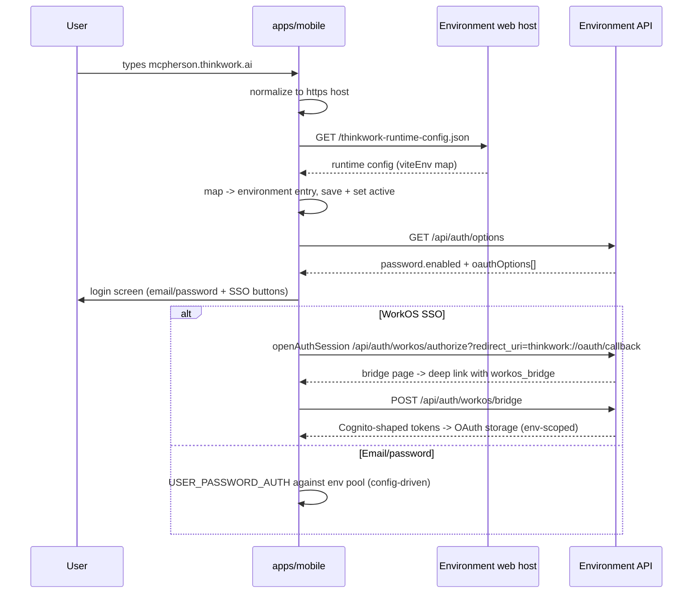
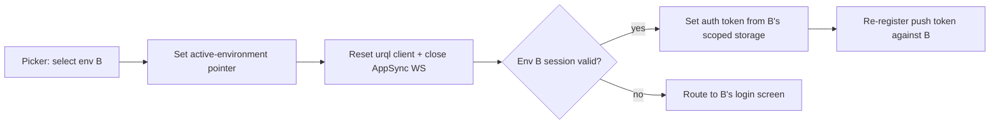

# Mobile Environment Setup and Login - Plan

## Goal Capsule

- **Objective:** Replace the mobile login screen's deployment-profile import box with URL-first environment setup: type (or QR-scan) an environment's web URL, the app pulls that environment's published client config, and the login screen renders that environment's real auth options. Environments accumulate in a saved list with kept sessions and a switcher.
- **Product authority:** This document's Product Contract; decisions confirmed in dialogue 2026-07-04 (everyone types the web URL; saved environment list with kept sessions; login surface mirrors web).
- **Product Contract preservation:** Unchanged from the requirements-only version. The two Outstanding Questions are resolved in the Planning Contract (naming from the runtime config's `displayName`; migration wraps the existing single profile as the first environment entry).
- **Execution profile:** Build on the `feat/think-158-mobile-parity` branch (or its successor after that PR lands) — `apps/mobile` diverges heavily from main there, including the current sign-in screen state. Work in that worktree; never the main checkout. One PR per unit or a small stack; pre-commit gates apply.
- **Stop conditions:** Surface a blocker instead of guessing when a change would alter the Product Contract (R-IDs), require server/WorkOS handler changes (the plan asserts none are needed — if that proves wrong, stop and report), or touch the mobile auth invariants beyond the documented environment-scoping.
- **Open blockers:** None.

---

## Product Contract

### Summary

Type an environment's web URL on first run — the app fetches the `thinkwork-runtime-config.json` that every deploy already publishes on the web host, stores it as a named environment, and shows that environment's login options (email/password via Cognito; WorkOS-brokered SSO buttons from the same public auth-options endpoint web uses). Environments are a saved list with kept sessions and a switcher; the JSON-paste import card leaves the login screen.

### Problem Frame

The TestFlight login screen leads with a "Deployment profile JSON or link" import box and a "Build-time fallback" trust chip — developer plumbing where a sign-in should be. Nobody hands a customer a base64 JSON blob to type into a phone. Meanwhile the pieces of a clean flow already exist and don't talk to each other: every deploy publishes an unauthenticated runtime-config document on its web host (which the web app fetches at boot), the mobile profile store already overrides baked-in env, and a deep-link import already works — but mobile never fetches the published config, the profile schema drops the API key (so an imported profile half-works: the baked-in key is used regardless of environment), and there is no way to hold more than one environment or switch between them.

### Key Decisions

- **The web URL is the identifier.** Everyone — Eric, TEI, McPherson users — enters the URL they already know; the app normalizes it to the web host and fetches that host's published runtime config. No central directory: each environment is self-describing, preserving the everything-in-your-account architecture. (Rejected: a control-plane lookup service — it re-centralizes login for self-hosted stacks.)
- **Reuse the published runtime config, don't invent a discovery endpoint.** The CLI already publishes `thinkwork-runtime-config.json` (Cognito pool/client/domain, GraphQL HTTP/WS URLs, API key) unauthenticated on the web host after every deploy; mobile consumes the same document web already boots from.
- **Environments are a saved list with kept sessions.** Like the CLI's stages: each environment remembers its config and session; switching is a picker, not a sign-out. Per-environment session/token storage is isolated so switching never leaks credentials across environments.
- **The login surface is server-declared, mirroring web.** Mobile calls the same public auth-options endpoint web's sign-in page uses: email/password (Cognito) when enabled, plus the environment's WorkOS-brokered SSO buttons. No hardcoded provider buttons; a standing Google button only if that environment declares one.
- **The import card leaves the login screen; the deep link stays.** `thinkwork://deployment-profile?...` keeps working as plumbing, and the web app gains a "Set up mobile" QR that carries the environment via that link — the zero-typing path.
- **Build-time fallback survives as a fallback only.** Until every environment of interest has been redeployed with a CLI that publishes the config document, the baked-in dev config remains the out-of-box default; it no longer earns a card on the login screen.

### Requirements

**Environment setup**

- R1. On first run (or "Add environment"), the user enters a URL; the app accepts the environment's web URL in any reasonable form (with or without scheme/path) and normalizes it to the web host.
- R2. The app fetches the environment's published runtime config from that host and converts it into a stored environment entry; fetch failure produces a clear, actionable error (wrong URL vs unreachable vs no config published) and never a crash or a silent fallback.
- R3. The deployment profile schema and the runtime-config mapping carry the GraphQL API key, so a configured environment works end-to-end without relying on the build's baked-in key.
- R4. Scanning the web app's "Set up mobile" QR (or opening its link) configures the same environment entry with zero typing, via the existing deep-link import.
- R5. With no environment configured, the app offers the URL entry; the baked-in build-time config remains the silent default only until the first environment is added, and is never presented as a card on the login screen.

**Environment switching**

- R6. Configured environments appear as a named list (name and host visible); the active one is indicated.
- R7. Switching environments is a picker action that swaps config and session together; each environment's session and tokens are stored isolated per environment, and switching back restores the still-valid session without re-login.
- R8. An environment can be removed; removal clears its stored session and tokens.
- R9. The switcher is reachable from settings and from the login screen; on the login screen the affordance is the footer environment indicator (`<name> · <stage> · <region>`, matching web's sign-in footer) — tapping it opens the picker.

**Login surface**

- R10. The login screen mimics web's sign-in exactly: a single "Continue with SSO" button (shield icon) when the environment's auth options declare a WorkOS connection, an "or" divider, then the email/password form when enabled, "Sign in", and a "Reset password" link. No WorkOS configured → email/password only, no SSO button. Options come from the same public auth-options endpoint web uses.
- R11. SSO buttons complete the same brokered flow as web against that environment's endpoints; email/password authenticates against that environment's Cognito pool.
- R12. The deployment-profile JSON import card is removed from the login screen; the "Build-time fallback" trust chip disappears with it.

**Web companion**

- R13. The web app's user settings offer "Set up mobile": a QR code (and copyable link) that carries the current environment's config via the existing deep link.

### Key Flows

- F1. First run on a fresh install
  - **Trigger:** User opens the app with no environment configured.
  - **Steps:** Welcome screen asks for the environment URL (or offers QR scan); user types `mcpherson.thinkwork.ai`; app normalizes, fetches the runtime config, saves "McPherson" as the active environment; login screen renders McPherson's declared auth options; user signs in.
  - **Covers:** R1, R2, R6, R10, R11.
- F2. Zero-typing setup from web
  - **Trigger:** User signed into web opens "Set up mobile" and scans the QR with their phone.
  - **Steps:** Deep link opens the app, imports the environment, lands on that environment's login screen.
  - **Covers:** R4, R13.
- F3. Switching environments
  - **Trigger:** Eric needs to move from dev to TEI.
  - **Steps:** Settings → environment picker → tap TEI; config and session swap; TEI's session is still valid so no re-login; switching back to dev likewise restores dev's session.
  - **Covers:** R6, R7.

### Acceptance Examples

- AE1. **Covers R1, R2.** Given a user types `https://mcpherson.thinkwork.ai/some/page`, when they submit, then the app normalizes to the host, fetches its runtime config, and creates a "McPherson" environment without the user seeing any JSON.
- AE2. **Covers R2.** Given a typo'd host that doesn't resolve, when the fetch fails, then the user sees "couldn't reach <host>" with a retry — not a crash, not a silent fall-through to dev.
- AE3. **Covers R3.** Given an environment configured by URL, when the app issues GraphQL calls, then it uses that environment's API key — the baked-in build key is never used for a configured environment.
- AE4. **Covers R7.** Given valid sessions on dev and TEI, when the user switches dev → TEI → dev, then no re-login is required at any step and no request after a switch carries the other environment's tokens.
- AE5. **Covers R10.** Given an environment that declares only email/password, when its login screen renders, then no SSO button appears; given one that declares a WorkOS SSO connection, then a single "Continue with SSO" button appears above the email/password form and completes the brokered flow.
- AE6. **Covers R5, R12.** Given a fresh install of a build with baked-in dev config, when the login screen renders, then no profile-import card and no "Build-time fallback" chip appear.
- AE7. **Covers R8.** Given an environment with a stored session, when it is removed from the picker, then its session and tokens are cleared and it no longer appears; if it was the active environment, the app switches to another saved environment, or to the first-run setup screen when none remain.

### Success Criteria

- A new TEI or McPherson user gets from app install to signed in with only their web URL (or a QR from web) — no JSON, no settings spelunking.
- Eric can hop dev ↔ TEI ↔ McPherson from the picker without re-authenticating each time.
- The login screen contains nothing an end user wouldn't recognize.

### Scope Boundaries

**Deferred for later**

- Push-token behavior across multiple environments (device token registration currently assumes one backend; multi-environment push routing is its own piece of work). The plan preserves the single-token assumption: the push token registers against the active environment, re-registering on switch.
- Web app login changes — web is the reference implementation, not a target.
- Automatic environment discovery with zero input (bundled directory, DNS probing).
- Retiring the baked-in build-time fallback entirely (gated on all environments of interest publishing runtime config).

**Outside this product's identity**

- A central environment directory service — environments stay self-describing.

### Dependencies / Assumptions

- Verified: the CLI publishes `thinkwork-runtime-config.json` unauthenticated on the web host post-deploy (apps/cli/src/commands/deploy.ts `buildRuntimeConfig`/`publishRuntimeConfig`), and the web app boots from it (apps/web/src/lib/runtime-config.ts). Environments deployed with older CLI versions won't have it until redeployed — the fetch error for that case says so (R2's "no config published" branch).
- Verified: the deployment profile schema (packages/deployment-profile) lacks `graphqlApiKey`; mobile reads the key from build-time env even with a profile active (apps/mobile/lib/platform-config.ts). R3/U1 closes this.
- Verified: web's sign-in renders email/password plus dynamic WorkOS-brokered options from a public auth-options endpoint (packages/api/src/handlers/public-auth-options.ts); every dynamic option routes through `/api/auth/workos/authorize`. Mobile mirrors this.
- Verified: the WorkOS authorize handler already allowlists custom-scheme redirects `thinkwork://oauth/callback` (and `thinkwork-dev:`/`thinkwork-canary:` variants) via `DESKTOP_REDIRECT_SCHEMES`, serves an HTML bridge page for them, and exchanges a one-time bridge code for Cognito-shaped tokens at `POST /api/auth/workos/bridge` — no server changes required for mobile SSO.
- Verified: mobile email/password sign-in (`USER_PASSWORD_AUTH`) reads pool/client from platform config — per-environment automatically once config swaps.
- Assumption: the runtime-config document's contents are acceptable to expose to mobile as-is (already public on the web host); nothing new is added to it.
- Mobile auth invariants hold: OAuth refresh-token restore, sync `getCurrentUser()`/hydration, never ephemeral sessions. Environment scoping wraps these paths; it does not change their semantics.

---

## Planning Contract

### Key Technical Decisions

- KTD-1. **Runtime-config ingestion maps directly into the environment store; it does not impersonate a DeploymentProfile.** `thinkwork-runtime-config.json` is a different schema from `DeploymentProfile` (different field names — `apiEndpoint` vs `apiUrl`, `appsyncUrl` vs `appsyncHttpUrl`, `appUrl` vs `spacesUrl` — and no `schemaVersion`/`signature`, so it would fail profile validation outright). Mobile gains a mapper from the published document (prefer the `viteEnv` map, which the CLI comments mark as the authoritative client surface, with the outer fields as fallback) into the environment entry's config. The `DeploymentProfile` schema and its validation remain the contract for the QR/deep-link path only.
- KTD-2. **Kept sessions come from environment-scoped storage, replacing wholesale-clear-on-switch.** Cognito token keys are already namespaced by `clientId` (distinct pools → distinct keys), but the OAuth-token keys, the storage manifest, and the in-memory cache are global, and today's `clearAuthStorageForDeploymentChange()` wipes everything on profile change. The auth storage layer gains an environment-id scope on those global pieces; switching stops calling the wholesale clear; removing an environment clears only that environment's keys. `getCurrentUser()` stays synchronous and hydration ordering is unchanged — the scope is a key-prefix concern, not a lifecycle change.
- KTD-3. **Environment switch re-initializes the client stack explicitly.** The urql client already rebuilds when its config-derived key changes, but the module-level eager `graphqlClient` export is captured at import time and silently ignores config changes — consumers of the eager export migrate to `getGraphqlClient()` (or the switch path calls `resetGraphqlClientForPlatformConfigChange()`, which also closes the shared AppSync WebSocket). The switch sequence: swap active environment → reset GraphQL client + WS → set auth token from the new environment's session (or route to login) → re-register the push token against the new environment (single-token assumption, see Scope Boundaries).
- KTD-4. **Mobile WorkOS SSO reuses the existing desktop bridge, with a new deep-link route.** The in-app browser (`WebBrowser.openAuthSessionAsync`, the same primitive the existing Google flow uses) opens `<apiUrl>/api/auth/workos/authorize?redirect_uri=thinkwork://oauth/callback&...`; the server's HTML bridge page redirects into the app with a one-time `workos_bridge` code; mobile exchanges it at `POST /api/auth/workos/bridge` and stores the returned Cognito-shaped tokens through the existing OAuth storage path. Note the redirect shape is `oauth/callback` (hostname "oauth", path "/callback" — the allowlisted form), distinct from the existing `auth/callback` route used by the Cognito-hosted-UI flow.
- KTD-5. **Auth options are fetched per environment from `<apiUrl>/api/auth/options`.** Same endpoint web uses; the response gates the email/password form (`password.enabled`) and enumerates SSO buttons (`oauthOptions[].route.authorizePath`). Endpoint failure degrades to email/password only, with a retry affordance — never a blank login screen.
- KTD-6. **Environment naming and migration.** Display name defaults to the runtime config's `displayName` (falling back to `stage` or the host), and entries are renameable in the picker. On first launch after upgrade, an existing stored single deployment profile is wrapped as the first environment entry (active), preserving its session; devices with no stored profile keep the build-time fallback as the implicit default per R5.

### High-Level Technical Design

Environment switch (KTD-2/KTD-3):

### Assumptions

- The auth-options endpoint resolves the tenant from the request context the same way it does for web; if it turns out to require an explicit hostname hint from a native caller, passing the environment's web host is a parameter-level fix, not a design change (execution-time discovery).
- `openAuthSessionAsync` with the `thinkwork://oauth/callback` return URL behaves like the existing Google flow's session (no ephemeral session; same browser primitive).

---

## Implementation Units

### U1. Carry the GraphQL API key through profiles and config

- **Goal:** A configured environment supplies its own API key end-to-end (the R3 bug fix); independent of everything else, ship-inert.
- **Requirements:** R3, AE3.
- **Dependencies:** None.
- **Files:** `packages/deployment-profile/src/index.ts` (schema + validation), `apps/web/src/lib/deployment-profile.ts` (snapshot builder maps `VITE_GRAPHQL_API_KEY`), `apps/mobile/lib/platform-config.ts` (read the key from the active profile with build-time env as fallback), `apps/mobile/lib/deployment-profile.ts` (accept the new optional field), tests alongside each.
- **Approach:** Add optional `graphqlApiKey` to the profile schema (optional keeps old stored/QR profiles valid); web's client-side snapshot includes it; mobile's platform config prefers the profile's key over `EXPO_PUBLIC_GRAPHQL_API_KEY`. No UI change.
- **Test scenarios:**
  - Covers AE3: platform config with a profile carrying a key returns that key; without one, falls back to build-time env (backward compat).
  - Profile validation accepts documents with and without the new field; web snapshot includes the key when the runtime env has it.
- **Verification:** `pnpm --filter @thinkwork/mobile test`, `pnpm --filter @thinkwork/web test -- deployment-profile`, package builds green.

### U2. Environment store + runtime-config fetcher

- **Goal:** URL in, stored named environment out — the data layer for everything else.
- **Requirements:** R1, R2, R5 (store side), KTD-1, KTD-6.
- **Dependencies:** U1 (key field exists).
- **Files:** new `apps/mobile/lib/environments/{store.ts,runtime-config-fetch.ts,url-normalize.ts}` + tests; `apps/mobile/lib/platform-config.ts` (active environment becomes the config source, profile/build-time as fallbacks); migration in the store's init.
- **Approach:** Multi-entry store (id, displayName, host, config, createdAt) with an active-environment pointer, persisted alongside the existing profile storage. URL normalizer: accept bare host / full URL / pasted page URL → https host (AE1). Fetcher: GET `https://<host>/thinkwork-runtime-config.json` with a small timeout; map `viteEnv` (fallback: outer fields) → entry config incl. the API key; error taxonomy — invalid URL / unreachable / 404-or-not-JSON ("this environment hasn't published mobile config — redeploy with a current CLI") / malformed. The store dedupes by normalized host: adding an existing host updates that entry and offers to switch, never creates a duplicate (two entries sharing a Cognito clientId would break R8's scoped removal). Migration per KTD-6 wraps an existing stored profile as the first entry.
- **Execution note:** Test-first on the normalizer, mapper, and error taxonomy — they are pure functions and carry AE1/AE2.
- **Patterns to follow:** `apps/mobile/lib/deployment-profile.ts` storage conventions; `apps/web/src/lib/runtime-config.ts` for the document's consumption shape.
- **Test scenarios:**
  - Covers AE1: `https://mcpherson.thinkwork.ai/some/page` → host normalized, entry created named from `displayName`.
  - Covers AE2: unreachable host → "couldn't reach" error object; 404 → "no config published" error; malformed JSON → malformed error; none crash or fall through to dev.
  - Mapper: viteEnv fields land in the right config slots (incl. WS URL and API key); outer-field fallback works; missing required fields → malformed error.
  - Migration: stored legacy profile becomes entry 1 (active); empty state stays empty (build-time fallback per R5).
- **Verification:** mobile tests green; in the simulator, adding the dev environment by URL against the live dev host produces a working config.

### U3. Environment-scoped sessions + switcher

- **Goal:** Multiple environments hold sessions concurrently; switching swaps config and session without re-login.
- **Requirements:** R6, R7, R8, R9, F3, AE4; KTD-2, KTD-3.
- **Dependencies:** U2.
- **Files:** `apps/mobile/lib/cognito-storage.ts` (environment-scoped prefix for manifest/memory cache; token keys already clientId-scoped), `apps/mobile/lib/auth.ts` (OAuth token keys env-scoped; retire wholesale `clearAuthStorageForDeploymentChange` from the switch path; scoped removal), `apps/mobile/lib/graphql/client.ts` (switch path calls `resetGraphqlClientForPlatformConfigChange()` — note the existing `GraphQLProvider` already subscribes to platform-config changes and resets; verify that seam covers the switch rather than rebuilding it), new `apps/mobile/components/environments/EnvironmentPicker.tsx` (settings row + the login-screen footer indicator per R9), push re-registration hook on switch, tests.
- **Approach:** Per KTD-2/KTD-3. Removal (R8) deletes the entry and clears exactly its scoped keys; removing the active environment switches to another saved environment, or to the first-run setup screen when none remain (AE7). The picker shows name + host, active indicator, add/rename/remove; DetailLayout for the settings screen.
- **Execution note:** Characterize the current sign-in/hydration/single-env flow with tests before touching storage keys — the auth invariants (sync getCurrentUser, OAuth refresh restore) must be provably unchanged for the single-environment case.
- **Test scenarios:**
  - Covers AE4: two environments with valid stored sessions — switch A→B→A requires no re-login; after each switch the GraphQL layer's auth token and endpoint belong to the active environment only.
  - Switch to an environment with no/expired session routes to its login screen; the other environment's session survives untouched.
  - Covers AE7: removal clears only the removed environment's tokens (the other's session still restores); removing the active environment lands on another saved environment or the setup screen.
  - Two entries resolving to the same Cognito clientId cannot arise (store dedupe, U2) — regression test the dedupe at the store boundary here too.
  - Single-environment regression: fresh install, sign in, kill/relaunch → hydration and sync getCurrentUser behave exactly as today.
  - Client-reset regression: after a switch, no consumer still holds a client pointed at the previous environment (test via the client-key mechanism / provider reset seam).
- **Verification:** mobile tests green; simulator: add two environments (dev + a second stage), sign into both, hop between them per F3.

### U4. Server-declared login screen + first-run URL entry

- **Goal:** The login surface renders what the environment declares; the import card and fallback chip are gone; first run asks for a URL.
- **Requirements:** R1 (UI), R5, R10, R12, F1, AE5, AE6; KTD-5.
- **Dependencies:** U2 (config source), U3 (picker affordance on the login screen).
- **Files:** `apps/mobile/app/sign-in.tsx` (rebuild the card area), new `apps/mobile/components/auth/AuthOptions.tsx` + `apps/mobile/lib/auth-options.ts` (fetch/parse per environment) + tests, new first-run screen `apps/mobile/app/environment-setup.tsx` (URL entry + QR-scan entry point).
- **Approach:** Mimic web's sign-in exactly (reference screenshot 2026-07-04): logo, "Log in to ThinkWork", a single "Continue with SSO" button (shield icon) when the environment's auth options declare a WorkOS connection, "or" divider, email/password form when enabled, "Sign in", "Reset password" link, and the footer environment indicator `<name> · <stage> · <region>` that opens the picker (R9). Fetch `<apiUrl>/api/auth/options` per environment (mirror `apps/web/src/lib/auth-options.ts` parsing). While the fetch is in flight, show a skeleton in the options area (no flash of the wrong form); endpoint failure → email/password + retry note (KTD-5). Remove the profile-import card and trust chip (AE6). First-run (no environment): the setup screen with URL entry per U2 and a "scan QR instead" affordance, rendering distinct copy for each U2 error category.
- **Test scenarios:**
  - Covers AE5: options with password-only → no SSO button; options with a WorkOS entry → single "Continue with SSO" renders above the form.
  - Covers AE6: no import card / fallback chip in the rendered login screen (label audit).
  - Options fetch in flight renders the loading skeleton; failure renders email/password + retry, not a blank screen.
  - Setup screen renders distinct copy for invalid-URL, unreachable, and no-config-published errors (AE2 covers unreachable; the other two get their own assertions).
  - Footer indicator shows the active environment's name/stage/region and opens the picker.
  - First-run with no environment shows the setup screen; after U2 add, lands on that environment's login.
- **Verification:** simulator: fresh state → URL entry → dev login screen showing dev's declared options; sign in with email/password.

### U5. WorkOS SSO flow on mobile

- **Goal:** An SSO button completes the brokered flow and lands a session.
- **Requirements:** R11, F1 (SSO arm), AE5 (flow completion); KTD-4.
- **Dependencies:** U4.
- **Files:** new `apps/mobile/app/oauth/callback.tsx` (deep-link route for `thinkwork://oauth/callback`), new `apps/mobile/lib/workos-auth.ts` (authorize URL build, bridge-code exchange) + tests, `apps/mobile/lib/auth-context.tsx` (SSO handler alongside the existing Google flow).
- **Approach:** Per KTD-4, modeled on `handleSignInWithGoogle`: `openAuthSessionAsync(<apiUrl> + authorizePath + redirect_uri=thinkwork://oauth/callback ...)`; parse `workos_bridge` from the return URL; `POST <apiUrl>/api/auth/workos/bridge` with the code; store the returned Cognito-shaped tokens via the existing OAuth storage (env-scoped after U3). Never `preferEphemeralSession`. Bridge-code failure (expired 5-min TTL, reuse) → clear error + back to login.
- **Test scenarios:**
  - Authorize URL carries the exact allowlisted redirect shape (`oauth` host, `/callback` path) and the environment's apiUrl.
  - Bridge exchange success stores tokens through the OAuth path (env-scoped); failure/expired code surfaces an error and does not corrupt stored state.
  - Return-URL parsing tolerates extra params/fragments (mirror the Google flow's parsing hardening).
- **Verification:** device or simulator against an environment with a WorkOS connection configured: full button→browser→deep-link→signed-in round trip. If no WorkOS-enabled environment is reachable, verify to the bridge-exchange boundary with a mocked bridge and flag the live gap.

### U6. Web "Set up mobile" QR

- **Goal:** Zero-typing setup path from the web app.
- **Requirements:** R4, R13, F2.
- **Dependencies:** U1 (key in the snapshot); mobile side already works via the existing deep link.
- **Files:** `apps/web/src/components/settings/SetUpMobileCard.tsx` (new), wire into `apps/web/src/routes/_authed/settings.general.tsx` (via its `SettingsGeneral` component), QR dependency added to `apps/web/package.json`, tests.
- **Approach:** Card renders a QR (and copyable link) encoding `thinkwork://deployment-profile?profile=<base64url snapshot>` from the existing `getSpacesDeploymentProfileSnapshot()` (now including the API key per U1). Member-visible (not operator-gated). Pick a small, maintained QR renderer (implementation-time choice).
- **Test scenarios:**
  - Covers F2: the encoded link decodes to a profile that mobile's `extractProfileJson` accepts (round-trip test against the mobile parser's expectations).
  - Snapshot includes `graphqlApiKey` when the runtime env carries one.
- **Verification:** web dev server: settings shows the card; scanning the QR with the simulator/device build opens the app and configures the environment (F2 end-to-end).

---

## Verification Contract

| Gate | Command / method | Applies to |
|---|---|---|
| Mobile unit tests | `pnpm --filter @thinkwork/mobile test` | U1-U5 |
| Web tests | `pnpm --filter @thinkwork/web test` (targeted suites) | U1, U6 |
| Mobile typecheck | `npx tsc --noEmit` in `apps/mobile` (pre-existing error baseline: no new errors, none in touched files) | all mobile units |
| Package builds | `pnpm --filter @thinkwork/deployment-profile build` (+ react-native-sdk if touched) | U1 |
| Lint/format | pre-commit hooks; fix, don't bypass | all |
| Simulator smoke | F1 (URL → login → sign-in) and F3 (dev ↔ second env hop) driven live against dev | U2-U4 |
| Device verification | F2 (QR scan) and U5's SSO round trip on a physical device / TestFlight build | U5, U6 |

Behavioral acceptance: AE1-AE7 each demonstrated before done.

---

## Definition of Done

- All six units merged via PRs in dependency order; post-merge Deploy runs green.
- AE1-AE7 demonstrated; F1 and F3 closed in the simulator against live environments; F2 and the SSO round trip closed on a device (or the SSO live gap explicitly flagged if no WorkOS-enabled environment exists to test against).
- The login screen shows no import card, no trust chip, and only server-declared auth options; the environment picker lists, adds, renames, and removes environments.
- Single-environment behavior (fresh install, sign-in, relaunch hydration) is regression-tested and unchanged.
- No abandoned experimental code; the retired wholesale-clear switch path is removed, not orphaned.
- Worktree/branches cleaned up after merges.
