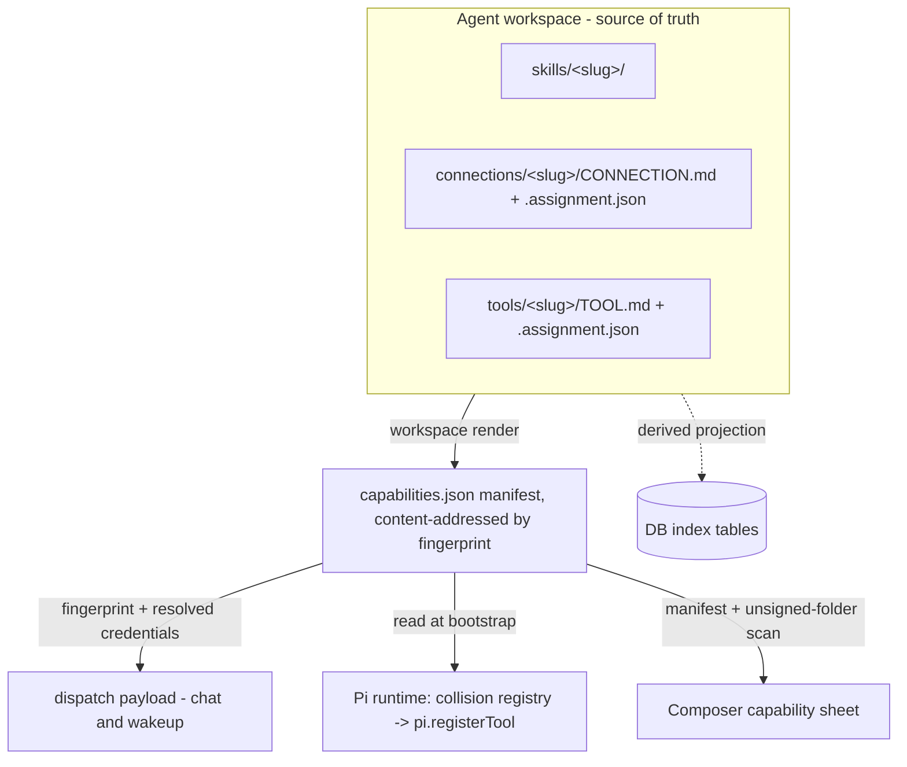
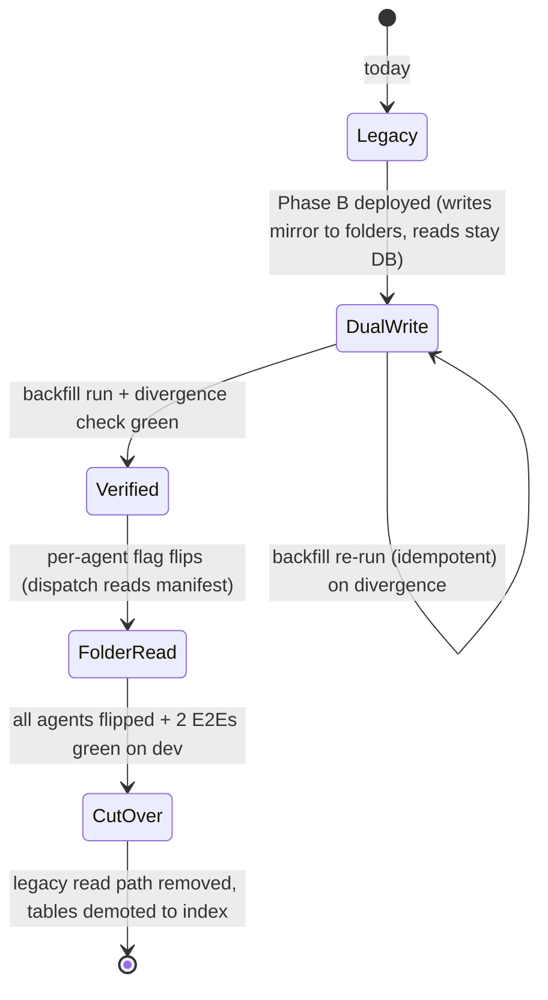
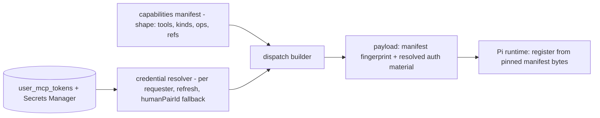

# Folder-Defined Tools & Connections - Plan

## Goal Capsule

- **Objective:** Make the agent workspace the source of truth for every capability the Pi agent holds — connections and tools defined as folders like skills, compiled into one rendered capability manifest the runtime registers from — fully replacing the DB-driven MCP path in v1.
- **Product authority:** Linear THINK-173 (parent THINK-171), the ideation record at `docs/ideation/2026-07-05-think-171-agent-tools-connections-ideation.html`, and the 2026-07-05 brainstorm + planning dialogues.
- **Open blockers:** None.
- **Product Contract preservation:** changed — R12 wording tightened (proposals are outside the manifest by definition); R14 amended (Space Tool Library is read-only in v1, not rewired); R16 resolved (retire `spaceMcpServers` for capability purposes); R18–R20 added (enforcement requirements discovered in planning: content-hash pinning, backfill collision dry-run, per-agent atomic migration). AE6–AE8 added. All confirmed by the user 2026-07-05.

---

## Product Contract

### Summary

Add `connections/` and `tools/` folder classes to the agent workspace beside `skills/`, with declarative definition files and platform-signed `.assignment.json` sidecars. Workspace render compiles all capability state into a content-addressed `capabilities.json` manifest; the dispatch payload carries its fingerprint plus per-requester credential material; the Pi runtime registers tools from the rendered workspace behind one collision registry. The DB tables that hold MCP/tool assignment state today demote to derived indexes in this same release.

### Problem Frame

Capability state is split across three persistence models today: skills are filesystem-native, MCP servers are DB rows rebuilt into a payload field every turn, and Pi extensions are approval-gated DB rows loaded separately. Three allowlist models converge only at the runtime's final merge, and capability fields travel as loose payload entries duplicated across the chat and wakeup dispatch builders — the origin of the recurring parity-drift bug class (#2395). There is no way to define a tool in the agent's configuration at all: the Tool Library, MCP server registry, and extension assignments are all operator-side database state, invisible to the workspace tree that otherwise *is* the agent. The repo has already run this migration once — `agent_skills` was retired for folder presence plus sidecar — and recorded that the parallel DB model was the drift source.

### Key Decisions

- **Full replacement in v1, not additive.** Folders become the source of truth for connections and tools in this release, with a dual-write window and per-agent backfill. Cutover is gated on the two success-criteria E2Es passing live on dev before the legacy read path is removed.
- **Declarative definition files, never tenant TypeScript.** The Pi runtime is a shared multi-tenant container; workspace artifacts are schema-shaped files. Implementations live in the platform runtime, in dynamically loaded approved extensions, or behind connections — no container rebuild for any tool change.
- **Four tool kinds in v1: `binding`, `platform`, `extension`, `script`.** Binding wraps admitted connection operations declaratively. Platform references a runtime-implemented built-in by name. Extension binds an approved dynamic Pi extension tool. Script is sandbox-executed tenant content and is the only kind requiring a trust-gate pass before registration.
- **Existing Tool Library reclassifies rather than persists.** firecrawl/exa become API-type connections plus binding tools; the four true built-ins (Send Email, ThinkWork Brain, Browser Automation, Code Sandbox) become `platform`-kind folder declarations.
- **Agents draft; only platform-signed state registers.** Folder presence alone never activates anything. Agent-authored definition files surface in Composer as inert proposals.
- **Legacy write surfaces are rewired, not redesigned** — except the Space Tool Library, which goes read-only in v1 (see R14/R16). Surface replacement is THINK-174.
- **Approval policy is declared but bluntly enforced in v1.** The sidecar carries an `approval` field for forward-compatibility; until THINK-174 lands parked-turn enforcement, a gated tool is simply withheld from the manifest.

### Actors

- A1. **Operator** — authors and approves tools/connections in Composer (or the rewired legacy surfaces); the only actor whose actions produce platform-signed assignment state.
- A2. **End user** — carries per-user OAuth authorizations that satisfy user-principal connections; connects via existing web/mobile self-serve flows.
- A3. **Platform agent (Pi)** — consumes registered tools; may draft definition files in its own workspace, which remain inert proposals.
- A4. **Pi runtime** — syncs the rendered workspace at bootstrap, enforces the collision registry, registers tools, and honors only platform-signed state.

### Requirements

**Workspace model**

- R1. A connection is defined by `connections/<slug>/CONNECTION.md` plus a `.assignment.json` sidecar; a tool by `tools/<slug>/TOOL.md` plus sidecar. Definition files are declarative (no executable content except `script`-kind payloads).
- R2. Sidecars hold enabled state, `permissions.operations`, approval policy, and credential/OAuth wiring references — never secret values.
- R3. Registration requires platform-signed sidecar state written through the Composer/API path; folder presence alone (including agent-written files) activates nothing.
- R4. Agent-authored definition files appear in Composer as pending proposals with an approve path.

**Tool kinds**

- R5. `binding` tools wrap one or more operations of an admitted connection: stable tool name, preset arguments, operation scoping, and separate model-visible vs thread-visible output shaping.
- R6. `platform` tools reference a runtime-implemented built-in by name and carry its per-agent enable/config; the implementation stays in the container.
- R7. `extension` tools bind an approved dynamic Pi extension tool into the agent's surface without changing the extension loading path.
- R8. `script` tools execute in the sandbox and register only after passing a SkillSpector-class trust gate; an unvetted script kind is withheld from the manifest.

**Manifest and dispatch**

- R9. Workspace render compiles all capability state (skills, connections, tools, platform built-ins, extensions) into a content-addressed `capabilities.json` manifest in the agent prefix. The manifest recompiles inside the existing workspace-render cache-diff pass only when capability-prefix paths (`skills/`, `connections/`, `tools/`, and their sidecars) changed — agent memory/scratch writes never trigger a recompile (KTD-7 is the authoritative mechanism description). Malformed manifest fails the turn loudly; an entry naming an unknown `platform` tool is skipped with a visible reason. A missing manifest falls back to the legacy path **only while the agent's migration flag is off**; a flag-on agent with a missing manifest is a loud turn failure (never a silent legacy fallback), and after cutover a missing manifest always fails.
- R10. One collision registry spans all tool-name sources with precedence `builtin > platform > extension > binding > script`; a name collision fails the entry visibly at render time rather than silently shadowing.
- R11. Chat and wakeup dispatch paths consume the identical manifest; the existing dispatch-parity test extends to cover the manifest field before cutover, including the no-requester (`humanPairId`) wakeup case.
- R12. Composer's capability side sheet reads the same manifest the runtime consumes, plus a scan of unsigned folders for the proposals list (proposals are outside the manifest by definition).

**Migration and write surfaces**

- R13. Existing `tenantMcpServers`/`agentMcpServers` assignments backfill into `connections/` folders; the tables demote to derived read-side indexes.
- R14. SettingsMcpServers (web) and mobile MCP-connect mutations are rewired to write folder/sidecar state; their UIs are unchanged in v1. The Space Tool Library becomes read-only in v1 with an explanatory banner — space-level capability grants have no folder semantics until THINK-174's space-source work.
- R15. The Tool Library reclassification lands as part of the backfill: firecrawl/exa as API connections with credential refs, built-ins as `platform` tool declarations.
- R16. `spaceMcpServers` is retired for capability purposes: its four writers (`setSpaceTools` resolver, `managed-mcp-applications.ts` ×2, `plugins/handlers/mcp.ts`, `plugins/cutover/deps.ts`) stop writing it, and the `Space.mcpServers` GraphQL field is served from the derived index during the deprecation window.
- R17. Existing per-user OAuth state (`userMcpTokens` and its Secrets Manager entries) keeps working unchanged; sidecars reference the same secrets. Credential resolution and refresh-on-expiry stay at dispatch in v1: the manifest defines the tool surface's shape; dispatch resolves per-requester credential material.

**Enforcement (added in planning, user-confirmed)**

- R18. A signed sidecar pins a content hash of its definition file (`signed_content_sha`); render withholds the entry on mismatch with reason `definition_drift`, surfaced in Composer like existing gate reasons. Editing an admitted connection's endpoint or auth config therefore revokes its admitted state until re-approved (successor to invariant SI-5).
- R19. Backfill produces a pre-cutover dry-run collision report per tenant; binding tools are auto-namespaced `<connection-slug>_<operation>`, which makes builtin collisions rare but not impossible (a connection `web` with operation `search` yields `web_search`) — namespaced names still pass through the collision registry, built-ins always win precedence, and residual collisions surface in the dry-run report.
- R20. Migration state is a per-agent atomic flip: an idempotent, re-runnable backfill plus a folder-vs-DB divergence check gate each agent's cutover; dual-read is all-or-nothing per agent, never per-file.

### Key Flows

- F1. Author a binding in Composer
  - **Trigger:** Operator creates a firecrawl binding tool in Composer.
  - **Steps:** Composer writes `tools/<slug>/TOOL.md` + signed sidecar → workspace render recompiles `capabilities.json` → next agent turn dispatches with the new fingerprint → runtime registers the tool → agent uses it.
  - **Covers R1, R3, R5, R9.**
- F2. Edit-to-next-turn loop
  - **Trigger:** Operator renames the tool's verb in `TOOL.md` (or deletes the folder).
  - **Steps:** Render recompiles to a new content-addressed manifest → next turn pins the new fingerprint (in-flight turns keep their pinned bytes) → the agent holds the renamed verb (or the tool is gone). No deploy.
  - **Covers R9, R6, R18.**
- F3. Agent proposes a tool
  - **Trigger:** The agent writes `tools/draft-x/TOOL.md` into its workspace.
  - **Steps:** Render marks it unsigned → excluded from manifest → Composer shows it as a pending proposal → operator approves → platform writes signed sidecar pinning the reviewed content hash → registers next turn.
  - **Covers R3, R4, R18.**
- F4. Script tool admission
  - **Trigger:** Operator (or agent draft) adds a `script`-kind tool.
  - **Steps:** Trust gate lints the script → pass writes the trust report reference into the sidecar → registration proceeds; fail leaves it withheld with the gate reason visible in Composer.
  - **Covers R8, R12.**

### Acceptance Examples

- AE1. **Covers R3.** Given the agent writes `tools/exfil/TOOL.md` into its own workspace, when the workspace renders, then the manifest excludes it and Composer lists it as an unsigned proposal.
- AE2. **Covers R10.** Given a new binding tool named `web_search` colliding with the built-in, when render runs, then compilation fails that entry with a visible collision error and the manifest retains the built-in.
- AE3. **Covers R9, R2.** Given a tool whose sidecar approval policy gates it and no enforcement primitive exists yet, when the manifest compiles, then the tool is absent from the manifest and the gate reason renders in Composer.
- AE4. **Covers R13, R17, R20.** Given an existing agent with three assigned MCP servers and a user with a live OAuth token, when the backfill runs and the divergence check passes, then three `connections/` folders exist with sidecar refs to the same secrets, the agent's migration flag flips, and the next turn's tool surface is unchanged.
- AE5. **Covers R14.** Given an operator creates an MCP server in SettingsMcpServers after cutover, when the mutation completes, then a `connections/` folder exists and no source-of-truth row is written.
- AE6. **Covers R9 (deletion), R20.** Given an automation whose target uses a tool whose folder was deleted, when the automation fires, then the run records a skipped/degraded entry with a reason (mirroring the `skillRuns` skipped-with-reason pattern) rather than failing silently mid-task.
- AE7. **Covers R11, R17.** Given a scheduled wakeup turn with no requester against a user-principal folder connection, when dispatch resolves credentials, then the `humanPairId` fallback applies exactly as the chat path would, proven by the parity test.
- AE8. **Covers R18.** Given a signed sidecar whose definition file was hand-edited in S3 after approval, when render runs, then the entry is withheld with reason `definition_drift` visible in Composer.

### Success Criteria

- Edit `TOOL.md`, and the next agent turn holds the renamed verb; delete the folder, and the tool disappears — no deploy in between.
- Author a firecrawl binding in Composer and watch the agent use it end-to-end on dev.
- After cutover, dispatch reads zero capability state from `agent_mcp_servers` (derived indexes serve list UIs only; `user_mcp_tokens` remains the credential-expiry store by design).

### Scope Boundaries

**Deferred to THINK-174:** the integrations.sh catalog mirror and tenant formulary, wiring manifests, admission/study-queue UX, Composer surface replacement and request queue, approval enforcement (parked-turn + entitlement ladder), egress-gateway credential brokering (moving token injection out of the dispatch payload), the principal-typed vault consolidation, and space-source capability folders (which unblock a writable Space Tool Library).

**Deferred to Follow-Up Work:** dropping the demoted DB tables (DROP follows the code-removal deploy per the standing migration-ordering rule); deleting `mcp.json` reader code after one clean release with it absorbed; retiring the `MCP.md` lane entry in `workspace-lanes.ts` (dead today).

### Dependencies / Assumptions

- Interface assumption from THINK-174: an admitted connection presents as (catalog entry reference + per-agent grant with `permissions.operations`). V1 admits connections manually; the formulary later populates the same shape.
- Sidecar writes extend the existing `grantCapability`/`detachCapability` resolver path (consistent with skills today); definition-file writes ride the workspace-files Lambda. The resolver path gains signing; it does not move into workspace-files in v1.
- Load-bearing repo claims were verified against the codebase by fresh-context passes on 2026-07-05 (ideation verifier + planning research agents); file anchors cited per unit.

### Outstanding Questions

**Deferred to implementation:** exact manifest JSON schema field names; the asymmetric signing primitive choice (ed25519 reuse from `skill-trust/signing.ts` vs KMS asymmetric — U1 decides after reading key-custody constraints; symmetric HMAC is ruled out per KTD-3 because the verifying container must never hold a forge-capable key); manifest GC retention count and age floor; the Space Tool Library banner copy.

---

## Planning Contract

### Key Technical Decisions

- **KTD-1. Content-addressed manifest.** The manifest writes to `capabilities/<fingerprint>.json` in the agent prefix (plus a `capabilities.json` latest-pointer for inspection); the dispatch payload names the exact fingerprint, so an in-flight turn keeps its pinned bytes and the mid-turn-edit race cannot exist. A small GC keeps the last N manifests, with a safety constraint: GC must never delete a manifest that an in-flight or recently dispatched turn could still pin — retention is count **plus** an age floor at least as long as the maximum turn duration, so a dispatched fingerprint always resolves. Rationale: the only race-free option; fingerprint-mismatch fail-closed would add re-dispatch loops, and advisory fingerprints recreate #2395.
- **KTD-2. Credentials resolve at dispatch (v1).** The manifest is per-agent and requester-independent; per-user OAuth resolution, `humanPairId` fallback, and refresh-with-5-min-buffer stay in the dispatch layer (today's `buildMcpConfigs` auth half survives as a credential resolver over folder-derived connections). Keeps Secrets Manager write access out of the container. The THINK-174 gateway later moves injection out of the payload; this plan does not.
- **KTD-3. Two-layer sidecar enforcement, asymmetric signing.** Platform signature over the sidecar JSON plus `signed_content_sha` pinning the definition file (pattern: `packages/api/src/lib/skill-trust/persist-catalog-trust.ts`). Render verifies both; the runtime re-verifies the manifest's own signature envelope. The signature scheme must be asymmetric (ed25519 or KMS asymmetric): the verifier runs inside the shared multi-tenant Pi container, and with symmetric HMAC the verify key **is** the forge key — private-key custody stays platform-side and the container holds only the public key. Signing is restricted to three authorized platform call sites: the grant/approve resolver path (operator-authorized), the U11 backfill (operator-invoked CLI/admin entry), and the plugin-cutover reconciler (autonomous, but its authority derives from the original operator plugin approval); the envelope records `signed_by` provenance. Hand-edited sidecars or drifted definitions are withheld with `definition_drift`/`invalid_signature` reasons in the existing gate-reason taxonomy.
- **KTD-4. Fingerprint contract extension.** `CapabilityFingerprintInputs` (`packages/api/src/lib/capability-fingerprint.ts:50-81`) gains `connections` and `tools` fields and `CAPABILITY_FINGERPRINT_VERSION` bumps to 3. Skipping this silently breaks the capability-inspector divergence gate.
- **KTD-5. Collision registry is new infrastructure.** `reservedToolNames` is currently rebuilt ad hoc at 3+ call sites in `server.ts`; the registry becomes one module applied at render (visible entry failure, R10) with the runtime's existing reserved-set check retained as a second line of defense. Precedence: `builtin > platform > extension > binding > script`.
- **KTD-6. Per-turn filters split.** The TOOLS.md MCP policy filter folds into render (it is workspace state and belongs in the manifest); `filterMcpConfigsForExplicitPluginMention` is message-dependent and stays at dispatch as the one documented per-turn exception.
- **KTD-7. Render is synchronous and prefix-scoped.** Recompile fires inside the existing `renderWorkspaceTuple()` cache-diff loop only when capability-prefix paths changed. This satisfies F2's next-turn guarantee without S3 read amplification from agent scratch writes.
- **KTD-8. `mcp.json` `directTools` is absorbed** into binding-tool declarations during backfill and the file's reader is removed after one clean release (Deferred follow-up). No UI writer exists today.
- **KTD-9. Ship-inert sequencing.** Phase A lands the compile step, schemas, and fingerprint change with nothing consuming them; Phase B wires dispatch and runtime behind the per-agent migration flag; Phase C flips surfaces and runs the backfill. Matches the repo's ship-inert convention and the cutover-gated-on-E2E rule.

### High-Level Technical Design

Migration state machine (per agent):

Credential split at dispatch (KTD-2) — directional, decided; boxes name responsibilities, not modules:

---

## Implementation Units

### Phase A — Foundation (inert)

### U1. Capability schemas, sidecar contract, and signing module

- **Goal:** Define the `CONNECTION.md`/`TOOL.md` declarative schemas (four kinds), the sidecar shape (enabled, `permissions.operations`, approval, credential refs, `signed_content_sha`, signature envelope), and the platform signing/verification module.
- **Requirements:** R1, R2, R5–R8 (shapes), R18.
- **Dependencies:** none.
- **Files:** `packages/api/src/lib/capabilities/definition-schemas.ts` (new), `packages/api/src/lib/capabilities/sidecar-signing.ts` (new), tests colocated `*.test.ts`; pattern source `packages/api/src/lib/skill-trust/signing.ts`, `persist-catalog-trust.ts`, `packages/api/src/lib/skills/assignment-state.ts`.
- **Approach:** Zod (or repo-standard) schema validation for definition files. Signing is asymmetric per KTD-3 (ed25519 reuse from `skill-trust/signing.ts` if key custody fits, else KMS asymmetric — symmetric HMAC is ruled out because the multi-tenant container verifies); the signer is exported only to the three authorized call sites (grant/approve resolvers, U11 backfill, plugin-cutover reconciler) and the envelope records `signed_by` provenance. Verification returns typed reasons (`invalid_signature`, `definition_drift`) matching the existing gate-reason taxonomy.
- **Patterns to follow:** `.assignment.json` state shape in `assignment-state.ts:35` (SkillAssignmentState); `signed_content_sha` from catalog trust.
- **Test scenarios:** valid four-kind definitions parse; unknown kind rejected; sidecar verify passes on intact pair; fails `definition_drift` when definition bytes change; fails `invalid_signature` on tampered sidecar; secrets-in-sidecar rejected at schema level (R2).
- **Verification:** `pnpm --filter @thinkwork/api test` green; schema module exports consumed by nothing yet (inert).

### U3. Unified collision registry

*(Presented before U2 because U2 depends on it; unit IDs are stable and intentionally not renumbered.)*

- **Goal:** One module owning tool-name reservation and precedence (`builtin > platform > extension > binding > script`) consumed by render (U2) and exported for the runtime's second-line check (U6).
- **Requirements:** R10; KTD-5.
- **Dependencies:** none (parallel with U1).
- **Files:** `packages/api/src/lib/capabilities/collision-registry.ts` (new) + colocated test; runtime counterpart wiring lands in U6 against `packages/agentcore-pi/agent-container/src/runtime/dynamic-extensions.ts:47,253`.
- **Approach:** Pure function over (name, kind, source) triples returning per-entry verdicts; the seven `BUILTIN_TOOL_NAMES` and platform-tool names seed the reserved set. This is new infrastructure — today's reserved sets are rebuilt ad hoc per call site in `server.ts:2760,2786`.
- **Test scenarios:** precedence order enforced across all kind pairs; duplicate within same kind → second fails; case handling matches runtime comparison; auto-namespaced binding names (`<connection>_<op>`) still pass the registry check — a namespaced name that lands on a builtin (e.g., connection `web` + op `search` → `web_search`) fails that entry with the builtin retained (R19 support).
- **Verification:** unit tests green; consumed by U2.

### U2. Render compile step: capabilities.json in the workspace renderer

- **Goal:** Compile skills + connections + tools + platform built-ins + extensions into a content-addressed `capabilities/<fingerprint>.json` (plus latest-pointer) as a third generated file in the render pipeline, with prefix-scoped triggering, sidecar verification (via U1), collision checking (via U3), the TOOLS.md policy fold, and a platform signature envelope over the compiled manifest itself (via U1's signer — this is the envelope U6 verifies at the runtime).
- **Requirements:** R9, R10 (render side), R12 (manifest half), R18; KTD-1, KTD-6, KTD-7.
- **Dependencies:** U1, U3.
- **Files:** `packages/api/src/lib/workspace-renderer/compose-tuple.ts` (generatedFiles array ~line 861-928; marker regexes beside `SKILL_MARKER_RE` at 212-214), `packages/api/src/lib/workspace-renderer.ts`, `packages/api/src/lib/capabilities/manifest-compile.ts` (new), tests `compose-tuple.test.ts` + new colocated tests.
- **Approach:** New `CONNECTION_MARKER_RE`/`TOOL_MARKER_RE` scans over `agentSource.objects`; entries failing signature/hash/collision/trust checks are emitted into the manifest's `withheld` section with reason codes (Composer renders these; the runtime ignores them). Manifest participates in the existing hydrate-manifest cache diff, so unchanged capability state costs nothing.
- **Execution note:** Land inert — nothing consumes the manifest yet. Extend the existing `compose-tuple.test.ts` fixtures rather than new harness.
- **Test scenarios:** manifest compiles with all five capability classes; unsigned folder → excluded from active, present in `withheld` w/ reason (AE1); collision → entry failed visibly, builtin retained (AE2); gated approval → withheld (AE3); drifted definition → `definition_drift` (AE8); scratch-path write does not retrigger compile; content-addressed key changes iff manifest bytes change; compiled manifest's envelope verifies with U1's verifier and tampered manifest bytes fail verification.
- **Verification:** `pnpm --filter @thinkwork/api test`; rendered prefix on a dev agent shows the manifest; no dispatch/runtime behavior change.

### U4. Capability fingerprint extension

- **Goal:** Add `connections` and `tools` to `CapabilityFingerprintInputs` and `fingerprintInputsFromRuntimeConfig()`; bump `CAPABILITY_FINGERPRINT_VERSION` to 3.
- **Requirements:** R9 (fingerprint), R11 support; KTD-4.
- **Dependencies:** U1 (shapes).
- **Files:** `packages/api/src/lib/capability-fingerprint.ts` (:50-81, :84, :123) + colocated test.
- **Approach:** Refs only per the file's documented IN/OUT constraint (no secrets/values). The manifest's content-address and the config fingerprint share input derivation so inspector-vs-runtime divergence stays assertable.
- **Test scenarios:** fingerprint changes when a connection/tool is added/removed/edited; unchanged for scratch writes; version constant bumped and asserted; refs-only invariant holds (a token value change does not change the fingerprint).
- **Verification:** `pnpm --filter @thinkwork/api test`; capability-inspector snapshot tests updated.

### Phase B — Wiring (behind per-agent flag)

### U5. Dispatch contract: manifest field + credential resolver split

- **Goal:** Dispatch payload gains the pinned manifest key/fingerprint via `buildAgentDispatchControlFields`; `buildMcpConfigs`' auth half becomes a credential resolver over folder-derived connections (per-agent flag selects folder vs DB read); TOOLS.md policy check removed from dispatch (now render-side), explicit-plugin-mention filter retained and documented as the per-turn exception.
- **Requirements:** R11, R17, R20 (dual-read all-or-nothing); KTD-2, KTD-6.
- **Dependencies:** U2, U4.
- **Files:** `packages/api/src/lib/agent-dispatch-payload.ts` (:32-49 `REQUIRED_DISPATCH_FIELDS`), `packages/api/src/handlers/chat-agent-invoke.ts` (:1314-1334 policy chokepoint, :1568 fingerprint call), `packages/api/src/handlers/wakeup-processor.ts`, `packages/api/src/lib/mcp-configs.ts` (auth resolution :684-786), `packages/api/src/handlers/wakeup-processor.dispatch-parity.test.ts`, `packages/database-pg/src/schema/` (migration-flag column) + generated Drizzle migration.
- **Approach:** One new required dispatch field; both builders get it through the shared helper (never independently). The per-agent migration flag is a boolean column on the `agents` table (default false), added via `pnpm --filter @thinkwork/database-pg db:generate` — read in the same agent-row fetch dispatch already performs, no new query. It gates which source the credential resolver enumerates connections from — a single boolean read, never per-file fallback.
- **Execution note:** Extend the parity test FIRST — a dispatch-critical field missed on a wakeup builder is exactly the #2395 class.
- **Test scenarios:** parity test asserts the manifest field on all three dispatch sites; flag off → DB path byte-identical to today; flag on → folder path; wakeup with no requester resolves via `humanPairId` against a folder connection (AE7); expired token refresh still dual-updates Secrets Manager + `user_mcp_tokens`; mention-filter still applies post-manifest.
- **Verification:** `pnpm --filter @thinkwork/api test` incl. parity suite; a dev agent with flag on dispatches with manifest field populated.

### U6. Pi runtime: manifest reader and registration loop

- **Goal:** Runtime reads the pinned `capabilities/<fingerprint>.json` from the synced workspace, verifies its signature envelope, and registers active entries via `pi.registerTool` inside `buildInvocationResources()`, honoring kind semantics (binding → connection executor; platform → builtin lookup; extension → existing loader; script → sandbox wrapper) and R9's failure modes.
- **Requirements:** R3 (runtime side), R5–R8 (execution), R9 failure modes, R10 second line.
- **Dependencies:** U2, U3, U5.
- **Files:** `packages/agentcore-pi/agent-container/src/runtime/capabilities-json.ts` (new; mirror `mcp-json.ts:3-40` error pattern), `packages/agentcore-pi/agent-container/src/server.ts` (`buildInvocationResources()` from :1295; readers near :2488; reserved-set sites :2760/:2786), tests in `packages/agentcore-pi/agent-container/tests/` (NOT colocated — this package deviates from monorepo convention).
- **Approach:** Malformed manifest → structured 500 (mcp.json precedent); unknown platform name (container version skew) → skip entry, reason surfaced; missing manifest → legacy path **only while the agent's migration flag is off**; flag on + missing manifest → structured error (loud turn failure), and always an error after cutover. Binding execution reuses the MCP/HTTP client paths with dispatch-resolved credentials from the payload.
- **Test scenarios:** all four kinds register and execute; withheld entries never register; tampered manifest envelope → 500; unknown platform tool skipped with reason while turn proceeds; collision guard second line fires if render was bypassed; deleted-folder turn: tool absent, no crash; flag-on agent with missing manifest → loud structured error, never silent legacy fallback.
- **Verification:** `pnpm --filter @thinkwork/agentcore-pi test`; live-dev smoke: flag-on agent turn lists manifest-derived tools in the per-turn capability manifest.

### U7. Sidecar write path: signing in grant/detach + agent-draft proposals

- **Goal:** Extend `grantCapability`/`detachCapability` resolvers to the `connection` and `tool` capability classes, producing signed sidecars (pinning reviewed content hash at approve time) and an approve-proposal mutation for agent drafts.
- **Requirements:** R3, R4, R18; A1/A3 flows F1, F3.
- **Dependencies:** U1.
- **Files:** `packages/api/src/graphql/resolvers/capabilities/capabilityAssignment.mutations.ts` (:834, :842), `packages/api/src/graphql/resolvers/capabilities/index.ts`, GraphQL types in `packages/database-pg/graphql/types/` (+ codegen in api/web/mobile/cli), colocated tests.
- **Approach:** Approve reads the definition bytes at approval moment, hashes, signs sidecar — closing the review-then-swap race (a rewrite between review and sign yields `definition_drift`, not a blessed unreviewed tool).
- **Execution note:** U7 owns the dual-write window (state-machine `DualWrite`): its shared folder-write helper is also hooked into the legacy MCP write mutations during Phase B so DB writes mirror into folders (DB remains the read source until U11 flips each agent) — this keeps backfill divergence small. U10 later removes the DB-write half of those mutations.
- **Test scenarios:** grant produces verifiable sidecar; approve pins the exact reviewed bytes; concurrent rewrite between review and sign → next render withholds with `definition_drift`; detach removes sidecar and manifest entry; non-operator caller rejected.
- **Verification:** `pnpm --filter @thinkwork/api test`; codegen clean in all four consumers.

### U8. Script trust gate

- **Goal:** SkillSpector-class lint pass for `script`-kind tool payloads; a passing, current trust report reference in the sidecar is a registration precondition.
- **Requirements:** R8; F4.
- **Dependencies:** U1, U7.
- **Files:** `packages/api/src/lib/skill-trust/` (extend runner for tool-script targets), `packages/skill-trust-runner/` if the executable pass lives there, sidecar schema field in U1's module, colocated tests.
- **Approach:** Reuse the SkillSpector invocation and report-freshness check (`isCurrentPassedSkillTrustReport` pattern); re-run required after content change (report pins content hash, composing with R18).
- **Test scenarios:** unvetted script withheld; passed script registers; content edit invalidates report → withheld until re-pass; report for different content hash rejected.
- **Verification:** `pnpm --filter @thinkwork/api test`; dev E2E: script tool blocked until gate passes.

### Phase C — Surfaces and migration

### U9. Composer UI: connections/tools classes, proposals, gate reasons

- **Goal:** Composer tree and capability side sheet gain the two new classes, render withheld-reason badges (including `definition_drift`, `invalid_signature`, collision, trust-gate), and list unsigned folders as approvable proposals.
- **Requirements:** R4, R12; AE1/AE3/AE8 visibility.
- **Dependencies:** U2, U7.
- **Files:** `apps/web/src/components/settings/ComposerWorkspaceEditor.tsx` (gating render :524-685), `apps/web/src/components/settings/SettingsCapabilities.tsx` (classes :106-114, mutations :492-525), colocated `.test.tsx`.
- **Approach:** Reason strings render verbatim from the backend taxonomy (existing R6 convention); proposals section uses the unsigned-folder scan API from U2's manifest sidecar data.
- **Test scenarios:** new classes appear with grant/detach; proposal approve flow calls U7 mutation; each withheld reason renders; manifest-vs-sheet consistency snapshot.
- **Verification:** `pnpm --filter @thinkwork/web test`; visual pass on dev (pixels gate UI claims).

### U10. Legacy surface rewires

- **Goal:** SettingsMcpServers (web) and mobile MCP flows write folder/sidecar state through the U7 path with unchanged UI; Space Tool Library becomes read-only with banner; all four `spaceMcpServers` writers stop writing.
- **Requirements:** R14, R16; AE5.
- **Dependencies:** U7.
- **Files:** `apps/web/src/lib/mcp-api.ts` (:77, :94, :106 → wrapper rewrites), `SettingsMcpServers.tsx`/`SettingsMcpServerDetail.tsx`, `packages/api/src/graphql/resolvers/spaces/setSpaceTools.mutation.ts` (:88-97), `packages/api/src/lib/managed-mcp-applications.ts` (:489, :543), `packages/api/src/lib/plugins/handlers/mcp.ts` (:508), `packages/api/src/lib/plugins/cutover/deps.ts` (:170), mobile: `apps/mobile/components/credentials/McpServersSection.tsx` + its detail screen (locate via `grep -r "mcp" apps/mobile/app` at implementation), Space Tool Library component (locate via `useMutation(SetSpaceTools` grep — component name unconfirmed).
- **Approach:** The plugin-cutover reconciler writer is the one nobody will remember — it must write agent-level connection folders (it acts on managed applications, which are agent-scoped). `Space.mcpServers` GraphQL field reads the derived index during deprecation.
- **Test scenarios:** create-server via legacy web UI yields folder + no truth row (AE5); mobile connect flow unchanged for the user; plugin cutover writes folders; Space Tool Library renders read-only with banner; setSpaceTools mutation rejects writes (or is removed from schema) with clear error.
- **Verification:** `pnpm --filter @thinkwork/web test`, `pnpm --filter @thinkwork/api test`; mobile smoke on TestFlight build for the connect flow.

### U11. Backfill, reclassification, cutover, and index demotion

- **Goal:** Idempotent backfill (DB rows → `connections/` folders + signed sidecars; inline `auth_config` secrets migrated to Secrets Manager, never copied into sidecars), pre-cutover dry-run collision report, Tool Library reclassification (firecrawl/exa connections + four platform tool declarations), per-agent divergence check + flag flip, derived-index rebuild mutation, and legacy read removal after the two dev E2Es pass.
- **Requirements:** R13, R15, R17, R19, R20; AE4.
- **Dependencies:** U5, U6, U7, U10.
- **Files:** `packages/api/src/lib/capabilities/backfill.ts` (new — no in-repo backfill template exists; nearest precedent is the derived-index pattern), `packages/api/src/graphql/resolvers/skill-catalog/rebuildSkillCatalogIndex.mutation.ts` (pattern for a `rebuildConnectionIndex` sibling), `packages/api/src/lib/catalog-index.ts` (CatalogReader/IndexStore split), admin/CLI entry in `apps/cli`, tests colocated.
- **Approach:** Per-tenant dry-run emits the collision report (R19) before any write; backfill is re-runnable (compare-and-write); divergence check diffs folder-derived vs DB-derived tool surface per agent and gates the flag flip (R20). After a tenant's agents are all flipped and verified, inline secret values in the legacy `auth_config` columns are scrubbed (replaced with a Secrets Manager ref marker) so plaintext credentials do not linger in the demoted index tables — the derived index never serves secret values. Backfill sidecar signing goes through U1's authorized-signer path with `signed_by: backfill` provenance. Cutover order per the standing rule: code-removal deploy first, table DROP deferred.
- **Execution note:** Run the full dry-run + backfill + divergence cycle against dev before any flag flips; the two success-criteria E2Es are the cutover gate, not a post-hoc check.
- **Test scenarios:** dry-run reports collisions without writing; backfill idempotent on re-run; partial S3 failure leaves flag unflipped and re-run completes (AE4 path); inline secret migrated to Secrets Manager ref; post-flip scrub removes inline secret values from legacy rows and derived-index output contains refs only; divergence (folder ≠ DB surface) blocks flip with diff output; firecrawl binding round-trips post-reclassification.
- **Verification:** dev tenant fully migrated; success criterion "zero capability reads from `agent_mcp_servers` at dispatch" measured; both E2Es green on dev.

### U12. Deletion semantics and automation degradation

- **Goal:** Automations referencing a deleted tool degrade at fire time with an audit record; Composer delete shows a "referenced by N automations" warning from the derived index.
- **Requirements:** AE6; R9 deletion semantics.
- **Dependencies:** U6, U9.
- **Files:** `packages/lambda/job-trigger.ts` (skip pattern :93-135, :1372-1401), Composer delete flow in `ComposerWorkspaceEditor.tsx`, derived-index query for references, tests per package convention.
- **Approach:** Mirror the `skillRuns` `skipped_disabled`-with-reason rows for automation targets whose manifest lacks the referenced tool; warning is non-blocking (deletion stays legal at any time).
- **Test scenarios:** automation fires post-deletion → skipped row with reason, job stays enabled; warning shows correct reference count; zero references → no warning.
- **Verification:** `pnpm --filter @thinkwork/lambda test`; dev: delete a bound tool, observe the skip row on next automation fire.

---

## System-Wide Impact

- **Dispatch surfaces (3):** `chat-agent-invoke.ts` and both wakeup builders change together through `buildAgentDispatchControlFields` — never independently; the parity test is the enforcement (U5).
- **Write surfaces (5):** Composer (primary), SettingsMcpServers web, mobile MCP flows, Space Tool Library (goes read-only), and the **autonomous plugin-cutover reconciler** (`plugins/cutover/deps.ts`) — the non-UI writer that is easiest to miss (U10).
- **Read surfaces:** `Space.mcpServers` GraphQL field and MCP list UIs move to derived indexes; the Capability Inspector's divergence gate depends on the fingerprint extension (U4) — skipping it silently breaks inspector-vs-runtime assertions.
- **Automations:** fire-time degradation semantics change for deleted tools (U12); scheduled/wakeup turns keep `humanPairId` credential fallback (AE7).
- **Templates/bootstrap:** workspace templates that later ship `tools/`/`connections/` folders must be seed-signed (THINK-160 pattern) or they land as perpetual proposals on every new agent — noted for THINK-174's seeding work; v1 templates ship none.
- **Failure propagation:** malformed manifest fails the turn loudly (mcp.json precedent); unknown platform tool skips one entry; missing manifest falls back only inside the migration window. No silent capability loss paths.

---

## Risks & Mitigations

- **Backfill silently shrinks a working tool surface** (collisions that are silently shadowed today become visible failures) → R19 dry-run collision report per tenant before any write; binding auto-namespacing makes builtin collisions structurally impossible.
- **Split-brain during migration** (agent reads a mix of folder and DB state) → R20 per-agent atomic flip with divergence check; dual-read is never per-file.
- **Sidecar forgery via the agent's own write tool** → KTD-3 signature + content-hash pinning verified at render and runtime; hand-edits yield `definition_drift`/`invalid_signature`, never registration.
- **Review-then-swap race** (definition rewritten between operator review and sidecar signing) → U7 signs the exact reviewed bytes; drift is withheld.
- **#2395 parity regression via the new dispatch field** → parity test extended before the field ships (U5 execution note); no-requester wakeup case covered (AE7).
- **Render cost amplification on the hot path** → KTD-7 prefix-scoped synchronous trigger; agent scratch writes never recompile; hydrate-manifest cache diff makes unchanged state free.
- **Inline secrets copied into sidecars during backfill** → U11 migrates inline `auth_config` values to Secrets Manager and stores refs only (R2).
- **Cutover regret** → ship-inert phasing (KTD-9), per-agent flags reversible until the legacy read path is removed, and the two live-dev E2Es gate that removal ("don't cut over before the replacement is proven").

---

## Verification Contract

| Gate | Command / check | Applies to |
|---|---|---|
| Unit + integration tests | `pnpm --filter @thinkwork/api test`, `pnpm --filter @thinkwork/agentcore-pi test`, `pnpm --filter @thinkwork/web test`, `pnpm --filter @thinkwork/lambda test` | all units |
| Dispatch parity | `wakeup-processor.dispatch-parity.test.ts` extended and green | U5, U6 |
| Typecheck + lint + format | `pnpm -r --if-present typecheck && pnpm lint && pnpm format:check` | all units |
| Codegen freshness | `pnpm --filter <consumer> codegen` clean in api/web/mobile/cli | U7, U9, U10 |
| Live-dev E2E 1 | Edit `TOOL.md` → next turn holds renamed verb; delete folder → tool gone; no deploy | cutover gate (U11) |
| Live-dev E2E 2 | Author firecrawl binding in Composer → agent uses it end-to-end | cutover gate (U11) |
| Cutover metric | Zero capability-state reads from `agent_mcp_servers` at dispatch post-flip | U11 |
| Migration precheck | Any hand-rolled SQL declares `-- creates:` markers; `pnpm db:migrate-manual` green vs dev | U11 index work |

## Definition of Done

- R1–R20 satisfied with their AEs demonstrated (AE1–AE8), including the three planning-added enforcement requirements.
- Both live-dev E2Es pass and the cutover metric holds; every dev agent's migration flag is flipped after divergence checks.
- Legacy read path removed from both dispatch builders; `spaceMcpServers` writers silenced; Space Tool Library read-only with banner; table DROPs explicitly deferred to follow-up per migration-ordering rule.
- Parity test covers the manifest field and the no-requester wakeup case.
- CONCEPTS.md entries (Connection, Tool Kind) remain accurate against the shipped shape; THINK-173 updated with the outcome.

---

## Sources & Research

- Linear: THINK-171 (parent), THINK-173 (this scope), THINK-174 (catalog/governance sibling, blocked by this)
- `docs/ideation/2026-07-05-think-171-agent-tools-connections-ideation.html` — ranked ideas and rejection record
- Evidence dossiers (session scratch, `/tmp/compound-engineering/ce-ideate/d14e8e76/evidence-*.md`) and 2026-07-05 planning research (render pipeline, dispatch, runtime, migration precedents — file anchors cited per unit)
- `docs/solutions/architecture-patterns/workspace-skills-load-from-copied-agent-workspace-2026-04-28.md`, `docs/solutions/best-practices/injected-built-in-tools-are-not-workspace-skills-2026-04-28.md`, `docs/solutions/architecture-patterns/managed-app-mcp-oauth-lifecycle-2026-06-06.md`, `docs/solutions/architecture-patterns/skill-creator-draft-publish-trust-pipeline.md`
- External: eve.dev/docs/tools, eve.dev/docs/connections (folder model, kind taxonomy, principal split, token custody)
