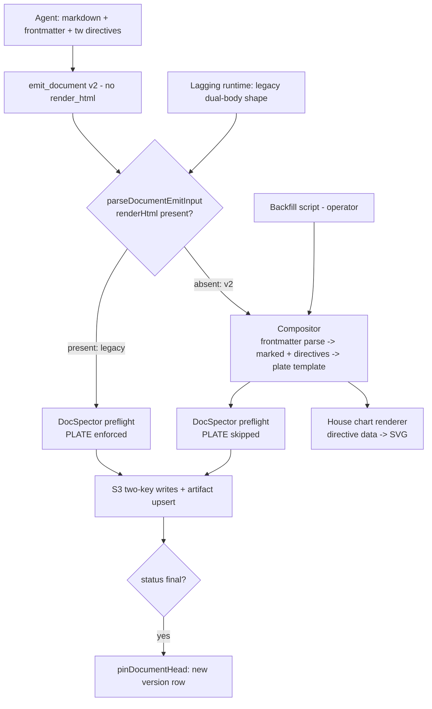

# Document Compositor v2 - Plan

## Goal Capsule

- **Objective:** Replace agent-hand-written document HTML with a deterministic server-side compiler: the agent authors markdown + frontmatter + directive blocks; the platform compiles the house-style HTML render at emission. Freestyle HTML becomes impossible by construction.
- **Product authority:** THINK-154 (parent tracker THINK-175, Artifacts Wave 2); scope confirmed by Eric 2026-07-05. Supersedes the THINK-177 PLATE gate for compositor-authored documents.
- **Execution profile:** Server-first deploy order — API units (U1–U4, U6) land and deploy before the agent-container release (U5). Each unit is one PR to main; dev is continuous-CD.
- **Stop conditions:** Surface a genuine blocker instead of guessing if (a) compiled output cannot pass DocSpector for a real document, (b) the dual-shape gate would break a live legacy emission path, or (c) backfill would mutate a pinned version.
- **Product Contract preservation:** unchanged from the requirements-only revision (R1–R13, F1–F3, AE1–AE4 intact).

---

## Product Contract

### Summary

`emit_document` v2 accepts markdown + frontmatter + directive blocks only; a platform compiler in the emission path renders the house-style HTML, including charts drawn by a house SVG renderer from model-authored data. An operator-triggered backfill recompiles the existing document corpus as the launch proof.

### Problem Frame

v1 documents are dual-body: the agent hand-writes both the markdown record and the HTML render. This has two costs. The token tax: HTML runs 2–4× markdown token rates, ~10–15K output tokens per document versus ~3–4K for markdown alone. The quality failure: live on TEI (2026-07-05), both Kimi K2.5 and Claude Sonnet 4.6 free-handed improvised off-plate HTML despite the document-composer skill — installed, signed, byte-identical to canonical — instructing plates. Models do not reliably follow rendering instructions.

THINK-177 stopgapped this with a DocSpector PLATE gate (#3381): plates carry a `tw-plate` meta marker and emissions without the matching marker are rejected in-turn. That is enforcement-by-rejection — it proves the model *started* from the plate, not that it stayed on it, and it burns turns on reject/retry loops. The structural fix is to remove HTML from the model's hands entirely.

### Key Decisions

- **Compositor-only, hard cutover.** The new `emit_document` shape has no agent-supplied HTML body. There is no raw-HTML escape hatch anywhere — a document needing a layout the component catalog lacks waits for a new compiler component, never model-written HTML. Enforcement-over-nudge, by construction.
- **Compilation runs server-side in the emission path.** The existing `document.emit` branch compiles markdown → house HTML in-process (`marked` is already a server-side dependency). The compiler versions with the platform — immune to the customer runtime/skill skew that requires content re-seeds and image mirrors — and the same function powers backfill. Rejected: skill-script compilation (compiler shipped as tenant skill content, re-seeded per fix) and a dedicated Lambda (new infra for a fast pure function).
- **Charts are data the model writes, pixels the platform renders.** Chart directives carry declarative data; a house SVG chart renderer — palette-locked to the house tokens, dark-mode aware — draws them at compile time. No model-authored SVG. Catalog at launch: bar, line, donut, stat-strip, sparkline, meter, funnel (funnel motivated by CRM reports). Rejected: Vega-Lite (heavy dependency, harder to palette-lock) and inline-SVG passthrough (per-document consistency hole).
- **One canonical body.** The authored markdown — frontmatter and directive blocks included — is the digest record. Agents and mobile read directive blocks as legible fenced data; no split source/digest storage shape, no new sync invariant. The THINK-147 contract ("markdown is the record, HTML is the render") holds unchanged.
- **PLATE gate retires for the compositor path, stays for legacy; the rest of DocSpector stays runtime everywhere.** Compositor output is plate-conformant by construction, so only the PLATE check is skipped on the v2 path. The remaining DocSpector checks (self-contained, scriptless, dark-mode, size) run as unit tests on the compiler **and** remain a runtime preflight before the S3 write (doc-review decision) — unit tests prove the compiler on anticipated inputs; the runtime pass backstops the unanticipated ones. Legacy-shape emissions keep the full gate including PLATE during the transition.

### Requirements

**Authoring contract**

- R1. `emit_document` v2 accepts genre, title, abstract, status, optional document id, and a single markdown body (frontmatter + prose + directive blocks). It does not accept an agent-supplied HTML render body.
- R2. Directive blocks are fenced blocks in a versioned, closed vocabulary (charts, stats strips, verdict grids, and peers); the vocabulary is defined per genre by the platform. Unknown directives are a compile-time rejection with a model-actionable diagnostic, not silently dropped.
- R3. The document-composer skill teaches markdown + directive authoring only; plate HTML files leave the skill's authored path (they become compiler-owned templates).

**Compilation**

- R4. The emission path compiles the markdown body into the complete self-contained single-file house-HTML render for the document's genre. Identical input compiles to identical output.
- R5. Chart directives compile to static SVG via the house chart renderer: house palette tokens, dark-mode aware, no script. Launch catalog: bar, line, donut, stat-strip, sparkline, meter, funnel.
- R6. Compiler output always passes the DocSpector checks (self-contained, scriptless, dark-mode, size ceilings), enforced both as unit tests on the compiler and as the retained runtime preflight before the S3 write (PLATE excepted per R10). A runtime preflight failure on compiled output signals a compiler defect: it is logged as a platform error, not returned as a model-actionable retry.
- R7. The authored markdown body is stored as the canonical digest record unchanged; the compiled HTML is stored as the render. Existing storage shapes and reader contracts are unchanged.

**Transition and compatibility**

- R8. The emission path accepts both tool shapes — v2 (markdown-only) and legacy (dual-body with `render_html`) — for at least one full release cycle; customer Pi runtimes lag releases and will keep sending the legacy shape after the server updates.
- R9. Legacy-shape emissions keep the full current validation path, including the THINK-177 PLATE gate, until customer runtimes are confirmed on the cutover release.
- R10. Compositor-path emissions skip the PLATE gate; it is structurally redundant there.

**Backfill (launch demo)**

- R11. An operator-triggered backfill recompiles existing document artifacts' digests through the compositor, writing the result as a new head version; prior renders remain in version history. Drafts carry no version history and are excluded by default; an opt-in flag includes them and snapshots the prior render to a backup key before overwriting (doc-review fix: draft renders were otherwise irrecoverable).
- R12. Backfill renders from the digest record only. Visual content that existed solely in a legacy hand-written render is not carried forward; the prior version (finals) or the backup snapshot (opted-in drafts) preserves it.

**Rollout**

- R13. Skill-content changes (SKILL.md, authoring guidance) ship through the existing default-skill catalog trust path and republish automatically on deploy; customer stacks additionally require a release deploy and Pi image mirror.

### Key Flows

- F1. Compositor emission
  - **Trigger:** Agent calls `emit_document` v2 with a markdown body.
  - **Steps:** Emission path validates frontmatter + directives → compiles render → stores digest (authored body) + render → upserts the artifact and version.
  - **Outcome:** Plate-conformant document; no PLATE gate involved. **Covers R1, R2, R4–R7, R10.**
- F2. Legacy emission during transition
  - **Trigger:** A lagging customer runtime calls `emit_document` with the dual-body legacy shape.
  - **Steps:** Emission path routes to the current v1 validation, PLATE gate included; accept or reject exactly as today.
  - **Outcome:** No customer breakage from deploy skew. **Covers R8, R9.**
- F3. Corpus backfill
  - **Trigger:** Operator invokes backfill.
  - **Steps:** For each document artifact, compile its stored digest → write as new head version; prior render pinned in history.
  - **Outcome:** The corpus renders consistently in the house style. **Covers R11, R12.**

### Acceptance Examples

- AE1. **Covers R2.** Given a markdown body containing an unknown directive kind, when the agent emits, then the emission is rejected in-turn with a diagnostic naming the unknown directive and the supported vocabulary.
- AE2. **Covers R5.** Given a `funnel` chart directive with stage data, when compiled, then the render contains a static SVG funnel in house palette that passes the scriptless and dark-mode checks.
- AE3. **Covers R8, R9.** Given a customer runtime one release behind, when it emits the legacy dual-body shape with off-plate HTML, then the PLATE gate rejects it exactly as on the current release.
- AE4. **Covers R11, R12.** Given a legacy document whose hand-written render contains a table absent from its digest, when backfilled, then the new head renders only the digest's content and the prior render remains as the previous version.

### Success Criteria

- The TEI repro ("generate a report of the opportunities assigned to Brett") produces a plate-perfect house report on the first turn, with no PLATE-gate rejection loop.
- Document authoring cost drops to roughly the markdown-only budget (~3–4K output tokens vs ~10–15K for dual-body).
- No path exists by which a model-authored byte reaches document render HTML.
- After backfill, every document artifact on dev renders in the house style.

### Scope Boundaries

- Tenant theming, data-driven genres, and tenant-catalog plates — THINK-153, built on this compositor's genre/component contract.
- Document sharing permalinks (THINK-150) and the compounding loop (THINK-152) — sibling Wave 2 children.
- Auto-backfill on compositor version bumps — later opt-in once the compiler is trusted; v1 backfill is operator-triggered only.
- Raw-HTML escape blocks and model-authored inline SVG — excluded by decision, not deferred.
- New genres beyond ideation/plan/report/brief.
- Native mobile rendering of directive blocks — mobile shows fenced blocks as code initially.

#### Deferred to Follow-Up Work

- UI/GraphQL trigger for backfill (v1 is an operator-run script; mirror the wiki `CompileWikiNow` mutation + job-poll pattern if a button is later wanted).
- Retiring the legacy dual-body acceptance path and the runtime PLATE gate once customer runtimes are confirmed on the cutover release.
- Raising the 96KB digest ceiling if real authored bodies approach it.

### Dependencies / Assumptions

- THINK-177 PLATE gate is live (#3381) and remains the legacy-shape guard through the transition.
- The THINK-160 catalog trust seeder republishes default-skill content changes on deploy; customer stacks need a release deploy plus Pi image mirror (registry access is still private to customer runners).
- `marked` (^18) is already a server-side dependency of `packages/api` and in use for markdown rendering.
- The dual-body storage contract insulates readers from this switch; no schema or reader changes are expected (THINK-147 KTD).

### Sources / Research

- `packages/api/src/lib/artifacts/document-emission.ts` — emission flow: parse (line ~519) → preflight → S3 head writes → DB upsert → pin on final (`pinDocumentHead`, line ~400). The compile step slots between parse and preflight.
- `packages/api/src/handlers/chat-agent-activity.ts` (lines ~153–204) — the invoker; routes on `payload.document !== undefined`.
- `packages/pi-extensions/src/document-composer.ts` — v1 tool: TypeBox params (line ~101), host-injected fetch (Lambda callback, no HTTP egress), extension allowlist folding.
- `packages/api/src/lib/channel-rendering/email-renderer.ts` — the Marked pattern to mirror: `buildMarked()` custom renderer per token + `sanitizeHtml` allowlist defense-in-depth.
- `packages/workspace-defaults/files/skills/document-composer/references/plate-*.html` — house CSS system (`:root` palette triplicated for dark/light/theme-attr) and the hand-authored SVG chart anatomy (plate-report.html lines ~114–146) that U3 codifies; `authoring-rules.md` alongside.
- `packages/api/scripts/backfill-materialize-workspaces.ts` — the operator-script pattern (`--dry-run`, `--concurrency`, `--tenant`) U6 mirrors.
- `packages/database-pg/src/schema/artifact-versions.ts` — version rows are pinned only on `final`; write-once content-addressed `s3_key`; unique `(artifact_id, version)`.
- `docs/ideation/2026-07-04-html-document-artifacts-ideation.html` idea 2/S2 and `docs/plans/2026-07-04-002-feat-html-document-artifacts-plan.md` (deferred v2) — lineage.

---

## Planning Contract

### Key Technical Decisions

- KTD1. **Compile slots between parse and preflight.** In `handleDocumentEmission`, the v2 path runs after `parseDocumentEmitInput` and before `deps.preflight`: the compiler produces `renderHtml`, which then flows through the existing preflight → S3 → upsert → pin steps unchanged. No storage or downstream changes.
- KTD2. **Dual-shape gate branches on `renderHtml` presence.** `parseDocumentEmitInput` makes `renderHtml` optional: present → legacy v1 path with full current validation including the PLATE gate; absent → v2 compile path with the PLATE gate skipped. Mirrors the existing genre-less skip (`if (input.genre)`) in `document-preflight.ts`.
- KTD3. **Server-first deploy order; tool schema owns the cutover.** The v2 TypeBox schema drops `render_html` entirely so models cannot author HTML; that change ships in the agent-container release. The server accepts both shapes independently of the runtime version, so API units deploy first and lagging customer runtimes keep working (R8/R9).
- KTD4. **Compiler mirrors the email-renderer pattern, mapped to plate classes.** A `Marked` instance with custom per-token renderers emitting the plate's class vocabulary (`.stats`, `.card`, `.chips`, `.fields`, …) instead of inline styles; directive blocks handled via a Marked extension keyed on the fence info string (`tw:<component>`); `sanitize-html` allowlist as the "no model-authored HTML" enforcement wall (third instance of the house pattern alongside `email-renderer.ts` and `artifact-delivery.ts`'s PDF path). **SVG policy — inject after sanitize (doc-review decision):** the sanitizer allowlist permits zero SVG tags, so any model-attempted raw inline `<svg>` (or `<script>`, external ``, event attributes) in the markdown is stripped; directive components compile to opaque placeholder tokens, and after the sanitize pass the compiler substitutes the house chart renderer's SVG into those tokens. The only SVG that can appear in a render is renderer-produced by construction — no allowlist gate for model SVG to slip through. Plate head/CSS (including the `tw-plate` meta marker) is extracted from the four plate files into compiler-owned per-genre templates in `packages/api`.
- KTD5. **House chart renderer codifies the plate SVG anatomy.** Pure functions from directive data → SVG strings implementing the existing hand-authored spec (plate-report.html chart comments + `authoring-rules.md`): recessive hairline gridlines, direct labels at extremes, house palette custom properties, no script, fixed deterministic layout.
- KTD6. **Backfill reuses the guarded pin path — and must also refresh the live head render.** `pinDocumentHead` is already exported; it writes the write-once pin keys and the version row, but in the normal emission flow the overwrite-in-place head render key is written *before* the pin (`document-emission.ts` ~line 604). Readers serve documents from the head key, so a pin-only backfill would record the new version while every final document keeps *displaying* the stale legacy HTML. For `final` documents the backfill therefore does both: overwrite the head render key with the compiled output, then pin the new version (digest+render `content_hash` changes, so the pin is genuine). `draft` documents are skipped by default — they have no version history, so an overwrite is irrecoverable; `--include-drafts` opts them in and first snapshots the existing render to a backup S3 key (`render/backfill-backup-<runid>.html`) before overwriting the head. Pinned versions are never mutated.
- KTD7. **Frontmatter carries the document envelope inside the markdown body.** Genre/title/abstract remain explicit tool params (they drive routing, listing, and cards); markdown frontmatter is reserved for document-level presentation hints the compiler defines (e.g., eyebrow text, stat-strip ordering). Unknown frontmatter keys are **warned-and-dropped** (surfaced as a non-blocking diagnostic in the tool response), not hard-rejected — a rejection loop here would recreate the PLATE reject/retry churn the compositor exists to kill, and a stray hint key never threatens render integrity. Unknown *directives* remain a hard compile rejection per R2 (they represent content the document would silently lose), but every directive rejection diagnostic must include the supported vocabulary **and a corrected minimal example**, so a model can self-repair in one turn. U7 measures the live rejection rate as rollout evidence.

### High-Level Technical Design



Directive grammar (directional guidance, not implementation specification):

````text
```tw:chart
type: funnel
title: Pipeline by stage
series:
  - { label: Leads, value: 120 }
  - { label: Qualified, value: 64 }
```
````

Fence info string selects the component (`tw:chart`, `tw:stats`, `tw:verdict-grid`); the body is YAML parsed with the same strict posture as skill frontmatter. The vocabulary manifest is a typed registry in the compiler; per-genre availability is part of the registry entry.

---

## Implementation Units

### U1. Compositor core: markdown → house HTML

- **Goal:** A pure, deterministic compile function: `(genre, title, abstract, markdownBody) → renderHtml` using per-genre house templates.
- **Requirements:** R3, R4, R6, R7 (KTD4, KTD7).
- **Dependencies:** none.
- **Files:** `packages/api/src/lib/artifacts/document-compositor.ts` (new), `packages/api/src/lib/artifacts/document-templates.ts` (new — per-genre head/CSS extracted from the four plates, `tw-plate` marker retained), `packages/api/src/lib/artifacts/document-compositor.test.ts` (new).
- **Approach:** Extract the plate head/CSS into template constants; build a `Marked` instance with custom per-token renderers emitting plate classes (mirror `email-renderer.ts` `buildMarked()`); parse optional frontmatter with the warn-and-drop posture (KTD7); assemble head + body sections + composition-signal footer; run `sanitize-html` with a plate-shaped, **zero-SVG** allowlist; then substitute directive placeholder tokens with renderer output (KTD4 inject-after-sanitize). Directive fences pass through to U2's handler (compile fails cleanly on `tw:` fences until U2 lands — acceptable, units merge in order).
- **Patterns to follow:** `email-renderer.ts` (renderer + sanitize), `document-plates.test.ts` (plates-as-fixtures), `skill-md-parser.ts` (strict YAML posture).
- **Test scenarios:**
  - Happy path: a representative report markdown compiles to HTML containing the `tw-plate` report marker, house palette `:root` block, and the section anatomy.
  - Determinism: compiling the same input twice yields byte-identical output.
  - DocSpector property: for each genre, compiled output of a representative document passes `runDocumentPreflight` with zero diagnostics (Covers R6).
  - Unknown frontmatter key → key is dropped, compile succeeds, and a non-blocking warning diagnostic names the key and the allowed set (KTD7 warn-and-drop posture).
  - Sanitizer: markdown containing a raw `<script>` or external `` compiles to output with the node stripped, and still passes preflight.
  - SVG wall: markdown containing raw inline `<svg>…</svg>` compiles with the SVG stripped, while a `tw:chart` directive in the same document produces house-renderer SVG in the output (placeholder substitution happens after the sanitize pass).
  - Placeholder integrity: a markdown body that literally contains the placeholder token text does not get directive SVG substituted into it (tokens are unguessable/escaped, not plain strings).
  - GFM table maps to the plate table classes, not bare `<table>`.
- **Verification:** unit tests green; a compiled sample for each genre saved as a test snapshot passes DocSpector.

### U2. Directive engine and component vocabulary

- **Goal:** `tw:` fenced directives parse, validate against a typed registry, and render house components; unknown directives reject with model-actionable diagnostics.
- **Requirements:** R2, R6 (KTD4, KTD7).
- **Dependencies:** U1.
- **Files:** `packages/api/src/lib/artifacts/document-directives.ts` (new — registry + parsers + renderers for `tw:stats`, `tw:verdict-grid`, `tw:chart` shell), `packages/api/src/lib/artifacts/document-directives.test.ts` (new), `packages/api/src/lib/artifacts/document-compositor.ts` (wire extension).
- **Approach:** A Marked extension keyed on fence info strings with the `tw:` prefix; YAML body parsed strictly; each registry entry declares its schema, per-genre availability, and a render function returning plate-class HTML (charts delegate to U3). Rejection diagnostics follow the DocSpector diagnostic shape so the runtime surfaces them in-turn.
- **Test scenarios:**
  - Covers AE1. Unknown directive kind → rejection naming the directive, the supported vocabulary, and a corrected minimal example (KTD7 self-repair posture).
  - Malformed YAML body → rejection with the parse error, the directive's expected schema, and a corrected minimal example.
  - `tw:stats` with N items renders the plate stat-strip markup.
  - A directive not available for the document's genre → rejection naming the genre restriction.
  - Non-SVG directive output (`tw:stats`, `tw:verdict-grid`) passes the U1 sanitizer unchanged (plate-class HTML is allowlist-compatible); SVG-bearing output rides the placeholder-substitution path per KTD4 and never passes through the sanitizer.
- **Verification:** unit tests green; compositor + directives compile the representative documents end-to-end.

### U3. House chart renderer

- **Goal:** Deterministic data→SVG functions for the seven launch chart types, matching the plate SVG anatomy.
- **Requirements:** R5, R6 (KTD5).
- **Dependencies:** U2 (registry seam; can develop in parallel against the directive schema).
- **Files:** `packages/api/src/lib/artifacts/document-charts.ts` (new), `packages/api/src/lib/artifacts/document-charts.test.ts` (new).
- **Approach:** Pure functions per type — bar, line, donut, stat-strip, sparkline, meter, funnel — emitting static SVG with house palette custom properties (inherits the plate's dark/light tokens), hairline gridlines, direct labels at extremes per `authoring-rules.md`. Fixed viewBox layout arithmetic; no randomness, no dates. **All model-authored strings (labels, titles, units) are XML-escaped through a single shared escape helper before insertion into SVG text nodes or attributes** — chart data is the one channel where model-controlled text enters markup the markdown sanitizer never sees, so escaping is mandatory at the renderer boundary, not left to callers.
- **Test scenarios:**
  - Covers AE2. A funnel directive with stage data renders an SVG funnel that is scriptless, self-contained, and dark-mode token-driven.
  - Each of the seven types renders for a representative dataset; output is deterministic.
  - Empty/single-datum series render degenerate-but-valid SVG (no NaN coordinates).
  - Value extremes (zero, large numbers) keep labels inside the viewBox.
  - Adversarial labels: a label containing `</svg><script>alert(1)</script>`, `"` inside an attribute context, `&`, and `]]>` renders as escaped literal text — the output contains no unescaped markup, parses as valid XML, and passes DocSpector SCRIPT_FORBIDDEN.
  - Chart SVG embedded in a compiled document passes DocSpector (no EXTERNAL_REF, no SCRIPT).
- **Verification:** unit tests green; visual spot-check of the seven types via a test-emitted sample document on dev (U7).

### U4. Emission dual-shape integration

- **Goal:** `handleDocumentEmission` accepts both shapes: legacy dual-body unchanged (PLATE gate active); markdown-only compiles via U1–U3 with the PLATE gate skipped.
- **Requirements:** R4, R8, R9, R10 (KTD1, KTD2).
- **Dependencies:** U1, U2, U3.
- **Files:** `packages/api/src/lib/artifacts/document-emission.ts`, `packages/api/src/lib/artifacts/document-emission.test.ts`.
- **Approach:** Make `renderHtml` optional in `parseDocumentEmitInput`; when absent, invoke the compositor between parse and preflight and pass `plateGate: skip` (or omit genre from the preflight input per the existing skip semantics — pick the explicit flag for legibility); all other preflight checks run on the compiled output before the S3 write (R6). Compile rejections (unknown directive, malformed YAML) return the same in-turn diagnostic envelope as preflight rejections; a *preflight* failure on compiled output is a compiler defect — log it as a platform error with the compile input captured, don't hand the model a retry it can't act on. Everything downstream (S3 writes, upsert, pin, card event) is untouched.
- **Execution note:** Start with a failing emission test for the markdown-only shape before touching the parse function — this file guards live traffic.
- **Test scenarios (extend the existing DI-style suite):**
  - Markdown-only emission compiles, persists both bodies, upserts, and emits the card (happy path).
  - Covers AE3 / F2. Legacy dual-body emission with off-plate HTML still rejects via PLATE exactly as today.
  - Legacy dual-body emission with plate-conformant HTML still succeeds unchanged.
  - Compile rejection (unknown directive) persists nothing — no S3 writes, no row.
  - Compiled output that fails preflight (forced via an injected broken compiler) persists nothing and surfaces a platform-error diagnostic, not a model-actionable retry.
  - Markdown-only + `status: final` pins a version whose render is the compiled output.
  - Neither `renderHtml` nor a markdown body present → parse rejection.
- **Verification:** `document-emission.test.ts` green including all pre-existing cases (legacy path proves unchanged); full `@thinkwork/api` suite green.

### U5. Pi tool v2 + skill content cutover

- **Goal:** The agent-facing tool loses `render_html`; the document-composer skill teaches markdown + directive authoring.
- **Requirements:** R1, R3, R13 (KTD3).
- **Dependencies:** U4 deployed (server accepts markdown-only before any runtime can send it).
- **Files:** `packages/pi-extensions/src/document-composer.ts`, `packages/pi-extensions/test/document-composer.test.ts`, `packages/workspace-defaults/files/skills/document-composer/SKILL.md`, `packages/workspace-defaults/files/skills/document-composer/references/authoring-rules.md` (rewrite for directives), `packages/workspace-defaults/src/index.ts` (mirror content + DEFAULTS_VERSION bump).
- **Approach:** Drop `render_html` from the TypeBox schema; keep `digest_markdown` as the single authored body param; keep the local 96KB digest ceiling check; drop the 256KB render check (server-side now). SKILL.md rewrite: genre table, directive vocabulary with examples per component, no plate-imitation instructions. Plate HTML files remain in references for one cycle as visual reference but SKILL.md stops instructing hand-written HTML. The THINK-160 seeder republishes the skill to tenant catalogs on deploy.
- **Execution note:** This is the agent-container release seam — land it as its own PR and confirm the canary release picks it up; customer stacks lag until their controller deploys the release.
- **Pre-cutover audit (blocking for this unit):** Enumerate every digest consumer before the tool cutover — R7's "reader contracts unchanged" is currently asserted, not verified. Known/likely readers to check: mobile digest rendering, web previews/cards, search or listing surfaces that index digest text, and Brain/wiki ingestion. For each, confirm it tolerates a digest that now leads with YAML frontmatter and contains `tw:` fenced directive blocks (rendering them as fenced code is acceptable; parse errors or garbled summaries are not). Record the audit result in the U5 PR description; any consumer that breaks becomes a fix inside this unit, not a follow-up.
- **Test scenarios:**
  - Tool posts `document.digestMarkdown` and no `renderHtml` field; body shape matches the v2 server contract.
  - Local oversize digest fast-fails without network (existing pattern).
  - Extension allowlist folding unchanged (`toolNames` present when wired).
  - Workspace-defaults parity test (`parity.test.ts`) passes after the content mirror.
- **Verification:** `pi-extensions` and `workspace-defaults` suites green; after the runtime release deploys on dev, a live emission produces a compiled document (U7).

### U6. Corpus backfill script

- **Goal:** Operator-run script recompiles existing document artifacts through the compositor; finals refresh the head render and pin a new version; drafts are excluded unless opted in with a pre-overwrite snapshot.
- **Requirements:** R11, R12 (KTD6).
- **Dependencies:** U1–U3 (compiler), U4 (extracted pin helper).
- **Files:** `packages/api/scripts/backfill-document-renders.ts` (new), `packages/api/src/lib/artifacts/document-emission.ts` (reuse the already-exported `pinDocumentHead`; extract the head-render write if needed for sharing), `packages/api/src/lib/artifacts/document-backfill.test.ts` (new — core loop with injected store).
- **Approach:** Mirror `backfill-materialize-workspaces.ts`: `--dry-run`, `--tenant <slug>`, `--concurrency N`, plus `--limit N` (canary batch: process at most N documents, report, and stop — the operator eyeballs the canary batch on dev before an unbounded run; a subtly wrong compile must not pin bad versions corpus-wide in one pass) and `--include-drafts` (off by default). Select artifacts with `metadata.kind = "document"`; read the digest head from S3; compile; for `final` rows overwrite the head render key with the compiled output **and then** call the guarded pin (new version, write-once pin keys) — pin alone leaves the served head stale (KTD6); for opted-in `draft` rows snapshot the existing render to the backup key, then overwrite the render head only. Skip and report documents whose digest fails to compile (unknown legacy content) rather than aborting the run.
- **Test scenarios:**
  - Covers AE4 / F3. A final document whose legacy render contains content absent from its digest → new pinned version renders digest-only; the prior version row and pin keys are untouched.
  - Final document → the head render key is overwritten with the compiled output in addition to the pin (the served document actually changes, not just the version history).
  - Draft document without `--include-drafts` → skipped and counted; nothing written.
  - Draft document with `--include-drafts` → prior render snapshotted to the backup key, then head overwritten; no version row created.
  - `--limit 5` against a larger corpus → exactly 5 processed, remainder reported as unprocessed.
  - Dry-run reports intended changes and writes nothing.
  - Compile-failing document is skipped, counted, and reported; the run continues.
  - Concurrency guard: a pin conflict (head_write_seq race) retries or reports without corrupting.
- **Verification:** unit tests green; dry-run then real run on dev (U7) with before/after version counts reported.

### U7. Live acceptance on dev + rollout evidence

- **Goal:** Prove the wave end-to-end on dev and post evidence to THINK-154.
- **Requirements:** Success Criteria; F1–F3.
- **Dependencies:** U1–U6 (U5's runtime release deployed on dev).
- **Files:** none (verification unit); evidence to THINK-154.
- **Approach:** (1) Fresh thread: request a report with chart-shaped data → first-turn plate-perfect compiled document; capture the turn trace showing no PLATE rejection loop and the token count. (2) Legacy-shape probe: confirm a dual-body emission (fixture or stale-runtime replay) still routes through the legacy path. (3) Run the U6 backfill on dev staged: `--dry-run` → `--limit 5` canary batch with visual inspection of each canary document → full run; confirm corpus renders consistently and version history preserved. (4) Compare output-token cost against a v1 dual-body emission of the same content. (5) Measure the compile-rejection rate across the acceptance threads (unknown directives / malformed YAML per KTD7) — if the compositor's rejection loop approaches the PLATE loop it replaced, that's a diagnostic-quality bug to fix before calling the wave done.
- **Test scenarios:** Test expectation: none — live acceptance unit; the scenarios are the four steps above with captured evidence.
- **Verification:** evidence comment on THINK-154 (screenshots, turn traces, token numbers, backfill counts); Success Criteria each explicitly checked.

---

## Verification Contract

| Gate | Command | Applies to |
|---|---|---|
| API unit + integration tests | `pnpm --filter @thinkwork/api test` | U1–U4, U6 |
| API typecheck | `pnpm --filter @thinkwork/api typecheck` | U1–U4, U6 |
| Pi extensions tests | `pnpm --filter @thinkwork/pi-extensions test` (or `npx vitest run` from `packages/pi-extensions`) | U5 |
| Workspace defaults parity | `pnpm --filter @thinkwork/workspace-defaults test` | U5 |
| Format gate | `pnpm format:check` | all |
| DocSpector property | compiled sample per genre passes `runDocumentPreflight` (asserted in `document-compositor.test.ts`) | U1–U3 |
| Live acceptance | U7 steps on dev with captured evidence | U7 |

Run the full package suite (not only new tests) before each PR; vitest green is not tsc green — run typecheck as its own gate.

## Definition of Done

- All seven units merged to main and deployed to dev (server units before the runtime release).
- The TEI repro produces a first-turn plate-perfect compiled report on dev; turn trace shows no PLATE rejection loop.
- A legacy dual-body emission still validates through the unchanged v1 path (AE3 evidence).
- Backfill executed on dev: corpus renders consistently; version history intact; skipped documents reported.
- Token-cost comparison captured (~3–4K vs ~10–15K expectation).
- Evidence posted to THINK-154; PLATE-gate retirement for legacy shape and digest-ceiling revisit recorded as follow-ups.
- No abandoned or dead-end code from the build remains in the diff.
