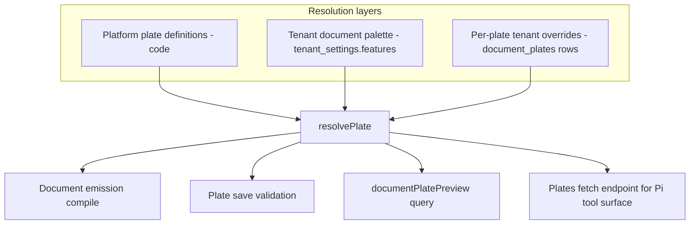
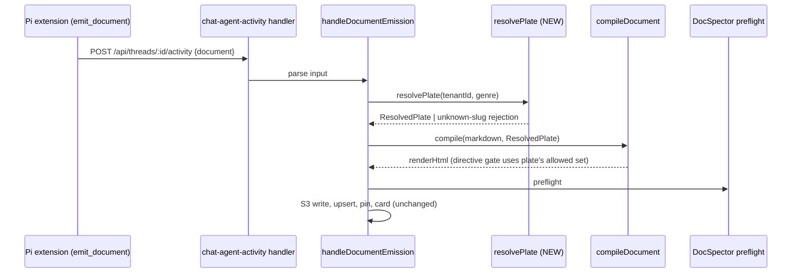

# Plate Registry & Tenant Genres - Plan

## Goal Capsule

- **Objective:** Turn document genres from hardcoded platform code into tenant-owned configuration: a plate registry with a code-defined business library, two-layer tenant branding, agent auto-discovery of registered plates, and a Plates tab in the web Artifacts page.
- **Product authority:** THINK-153 issue + Eric's 2026-07-05 Plates-tab scope comment + ce-brainstorm dialogue (2026-07-05/06, synthesis confirmed).
- **Open blockers:** none. THINK-154 (Document Compositor v2) is shipped and cut over on dev, tei-e2e, and mcpherson; the compositor is the only emission path.
- **Product Contract preservation:** unchanged from the requirements-only version.

---

## Product Contract

### Summary

A plate is a registered genre — name, eyebrow/title config, palette tokens, directive availability — stored as tenant-scoped, versioned rows and validated at save by compiling a canned document through the compositor plus full DocSpector preflight. The platform seeds a business plate library alongside the four core genres, tenants brand documents through a two-layer palette (tenant document palette under per-plate overrides), agents discover plates on a per-tenant `emit_document` tool surface, and a Plates tab in Artifacts gives everyone list + preview and operators create/edit.

### Problem Frame

Adding a document genre today is a code change: the genre array in `packages/api/src/lib/artifacts/document-emission.ts` (the canonical source — templates, directives, and backfill import from it), the mirrored `DOCUMENT_GENRES` in `packages/pi-extensions/src/document-composer.ts`, the `GENRE_TEMPLATES` config, and the SKILL.md genre table. Four genres was fine to launch; it's a real seam the moment a tenant wants a QBR, a proposal, or a sales-rep review. Branding has the same shape: every tenant's documents render in the platform's default palette, and there is no way to put a tenant's colors on their documents — a capability adjacent products (Gamma) charge for. THINK-154 removed the risk that used to make this hard: the compositor guarantees every compiled document is well-formed, self-contained, and DocSpector-clean regardless of configuration, so opening plate definition to operators exposes zero unvalidated bytes.

### Key Decisions

- **A plate is a genre — one object, not two axes.** Creating "QBR" registers one plate: slug, display name, use-for description, eyebrow, title suffix, palette overrides, directive availability. The four platform genres become four built-in plates. No separate genre-vs-skin model.
- **Plates are data rows validated at save, not skill-catalog entities.** The skill-catalog trust pipeline (SkillSpector, signatures) exists for agent-consumed content; a plate is structured data with no bytes to inject. Save-time validation = token-name/value guard (the `theme-tokens.ts` regex precedent) + compile a canned document through the compositor + full DocSpector preflight. Cross-tenant distribution is deferred, not blocked — rows are easy to share later.
- **Two-layer branding: tenant document palette under per-plate overrides.** The tenant sets brand tokens once; every plate inherits them unless the plate overrides specific tokens. Resolution: platform plate definition → tenant document palette → per-plate tenant overrides → compiled CSS.
- **Seeded plates stay platform-owned; tenants store only deltas.** Platform improvements to a seeded plate flow to every tenant that hasn't overridden the affected tokens; overridden tokens keep the tenant's values. No copy-on-seed forking.
- **Agents discover plates on the tool surface, not in the skill.** The per-tenant `emit_document` schema lists registered plates with one-line use-for descriptions; the server validates genre against the registry. The document-composer SKILL.md drops its static genre table and defers to the tool — plate edits can never go stale in workspaces (the THINK-177 distribution failure class is avoided, not managed).
- **Operators manage, everyone views.** The Plates tab is visible to all users (list + preview); create, edit, palette, and hide actions are operator-gated. Org-wide visual identity has org-wide blast radius.
- **No GraphQL schema change to artifact typing.** `Artifact.type` is already an open, plugin-extensible String (the issue's enum premise was stale). Genre keeps riding the artifact `type` (lowercase slug), as `document-emission.ts` does today.

### Actors

- A1. **Operator** — creates, edits, hides, and restores plates; sets the tenant document palette.
- A2. **Member (non-operator user)** — browses the Plates tab, previews plates in light/dark; requests documents from the agent.
- A3. **Agent (Pi runtime)** — sees registered plates on the `emit_document` tool surface, picks a genre by its use-for description, authors markdown; never touches plate visuals.
- A4. **Platform** — seeds and evolves the built-in and library plate definitions; compiles every document through the compositor.

### Requirements

**Plate registry & genres**

- R1. A tenant-scoped plate registry stores each plate as a versioned row: slug, display name, use-for description, eyebrow, title suffix, palette token overrides, per-plate directive availability, and hidden flag.
- R2. The genre set becomes registry-driven end to end: emission validates genre against the tenant's registry, and the hardcoded genre arrays (server and Pi extension) are retired as validation sources.
- R3. The artifact `type` remains the plate slug (lowercase), preserving existing storage, indexing, and list-filter behavior.
- R4. Built-in and seeded plates can be token-overridden and hidden by operators, never deleted; a reset-to-default affordance restores platform values.
- R5. Tenant-created plates can be created, edited, hidden, and deleted (delete only when no artifacts reference the slug; otherwise hide).

**Validation (enforcement-over-nudge holds)**

- R6. Every plate save — create or edit, seeded or tenant-created — validates by compiling a canned representative document through the compositor with the resolved token set and running full DocSpector preflight; failures reject the save with actionable diagnostics and persist nothing.
- R7. Palette tokens are constrained to the plate CSS custom-property vocabulary (`--bg`, `--ink`, `--muted`, `--line`, `--card`, `--accent`/`--accent-soft`/`--accent-text`, the `--info`/`--warn`/`--bad` triads, `--mono`), with token names and values guarded by the `theme-tokens.ts` regex pattern; no freehand CSS and no raw HTML anywhere in plate config.

**Branding**

- R8. A tenant document palette (one set of brand token values, light and dark) applies beneath every plate; per-plate overrides win over it; platform defaults fill the rest.
- R9. Palette and plate changes apply to documents compiled after the change; previously rendered documents are untouched (the existing backfill script can recompile a corpus on demand).

**Agent surface**

- R10. The `emit_document` tool schema is built per tenant, enumerating visible registered plates with their use-for descriptions; new plates are usable by the agent without any skill or workspace re-materialization.
- R11. Server-side emission rejects unregistered or hidden genres with a self-repair error listing the valid slugs.
- R12. The document-composer SKILL.md retains genre-agnostic authoring rules only; the genre list lives solely on the tool surface.
- R13. Per-plate directive availability rides the existing directive-registry gating (the `genres` field and `DIRECTIVE_GENRE_RESTRICTED` rejection already enforced by the engine); a plate's config selects which directives its documents may use.

**Seeded library**

- R14. The platform seeds, for every tenant, the four core plates (report, plan, brief, ideation) plus a business library: QBR, Proposal, Weekly Status, Sales Rep Review, Opportunity Review — each with a designed eyebrow, palette, use-for description, and directive mix.
- R15. Seeding is idempotent and runs for new and existing tenants; platform updates to seeded definitions flow through the layer resolution without touching tenant deltas.

**Plates tab**

- R16. The Artifacts page gains a Plates tab following the Work Items list conventions (token filters, collapsed search, tabs with primary counts); all users see the list.
- R17. Preview renders a canned representative document compiled through the real compositor with the selected plate's resolved tokens, displayed in the zero-grant document iframe with a dark/light toggle.
- R18. Edit is a structured form scoped to plate config (palette tokens, eyebrow, title suffix, use-for description, directive availability, hidden) — never freehand HTML or CSS; operator-gated alongside create and the tenant palette editor.

### Key Flows

- F1. Operator creates a plate
  - **Trigger:** Operator opens the Plates tab and chooses create (blank or clone an existing plate).
  - **Steps:** Fill structured config → live preview compiles the canned document with the draft tokens → save runs compile + DocSpector validation → plate registered.
  - **Outcome:** Next agent session lists the new plate on `emit_document`; members see it in the Plates tab immediately.
  - **Covers:** R1, R6, R10, R16, R18.
- F2. Tenant brands its documents
  - **Trigger:** Operator sets the tenant document palette (brand colors, light + dark).
  - **Steps:** Palette saved after the same compile-and-preflight validation → every plate without conflicting overrides now resolves brand tokens.
  - **Outcome:** All subsequently emitted documents compile on-brand; existing renders unchanged until recompiled.
  - **Covers:** R6, R8, R9.
- F3. Agent produces a tenant-genre document
  - **Trigger:** A member asks the agent for a quarterly business review.
  - **Steps:** Agent sees `qbr` with its use-for description on the tool surface → emits markdown with `genre: qbr` → server validates against the registry, compiles with resolved QBR tokens, runs preflight, stores with `type: "qbr"`.
  - **Outcome:** An on-brand QBR document; no code or skill change was involved at any step.
  - **Covers:** R2, R3, R10, R11, R13.

### Acceptance Examples

- AE1. **Covers R10, R11.** Given a tenant that registered `qbr` yesterday, when the agent starts a new session, `emit_document` lists `qbr` with its description and accepts it; `genre: "roadmap"` (unregistered) is rejected with a self-repair error naming the valid slugs.
- AE2. **Covers R4, R15.** Given the platform ships a new `--accent` for the seeded QBR plate, a tenant that overrode `--accent` keeps its value; a tenant that never touched QBR compiles with the new accent on the next emission.
- AE3. **Covers R6, R7.** Given an operator sets `--accent` to `url(javascript:alert(1))`, the save is rejected by the token-value guard with a diagnostic and no row is written; a valid but contrast-hostile palette still saves if compile + preflight pass (taste is the operator's, safety is the platform's).
- AE4. **Covers R13.** Given a plate whose directive availability excludes `tw:chart`, when the agent emits a chart block in that genre, compilation rejects with the existing genre-restriction diagnostic and the agent self-repairs.
- AE5. **Covers R16, R17, R18.** Given a member (non-operator) opens the Plates tab, they see all visible plates and can preview each in dark and light; create/edit/palette controls are absent for them and present for an operator.

### Success Criteria

- An operator on a real tenant (TEI or dev) creates a plate through the UI and the agent produces a document in it — no engineer, no release, no skill re-materialization.
- Tenant palette set once → every subsequently emitted document, in any genre, renders in tenant colors in both themes.
- A fresh tenant's Plates tab shows the 4 core + 5 business plates with presentable previews on day one.

### Scope Boundaries

- **Deferred for later:** cross-tenant plate sharing / marketplace; custom-CSS escape hatch ("DocSpector-validated CSS overrides" remains the only acceptable future shape); purpose-built CRM directives (pipeline-stage, quota-attainment visuals) designed against real Twenty CRM data; plugins shipping plates (Application Plugins seam); operator-triggered corpus recompile from the UI (script exists); a "derive palette from appletTheme" helper in the tenant palette editor (v1 enters brand colors directly).
- **Outside this effort:** any raw-HTML plate editing (reintroduces the failure mode THINK-154 eliminated); per-user or per-space plates (plates are tenant-scoped); changes to the compositor pipeline, directive engine internals, or DocSpector rules beyond wiring the existing gates to plate config; mobile Plates surface (mobile keeps consuming digests unchanged).

### Dependencies / Assumptions

- THINK-154 shipped state is the foundation: compositor-only emission, `GENRE_TEMPLATES`/plate CSS in `packages/api/src/lib/artifacts/document-templates.ts`, directive registry with per-genre gating machinery already present.
- The existing directive set (stats, verdict-grid, 7 chart types) is sufficient for the v1 business library.
- The `theme-tokens.ts` guard pattern is reusable server-side for plate token validation.
- Customer stacks (tei-e2e, mcpherson) receive the library and registry with their next release cutover; no per-stack seeding step is required (see KTD1).

### Outstanding Questions

- **Deferred to implementation:** exact exemplar base prose and per-directive snippet copy (assembled per plate per KTD7; final copy chosen while building U1); exact GraphQL field naming (follow codegen review); whether the plate list query needs pagination at launch (expected N ≤ ~30 per tenant — start unpaginated, matching `agentLoops`); the migration number (0218 at plan time — take the next sequential number at implementation time, other in-flight plans also queue schema changes).

### Sources

- Linear THINK-153 (issue + Eric's 2026-07-05 Plates-tab scope comment); parent THINK-175.
- Verified against origin/main 2026-07-06: canonical genre array `packages/api/src/lib/artifacts/document-emission.ts:69` ("genre IS the artifact `type`"); mirrored enum `packages/pi-extensions/src/document-composer.ts:29`; `GENRE_TEMPLATES` + plate CSS custom properties `packages/api/src/lib/artifacts/document-templates.ts`; directive gating (`genres` field, `DIRECTIVE_GENRE_RESTRICTED`) `packages/api/src/lib/artifacts/document-directives.ts`; open-String artifact type `packages/database-pg/graphql/types/artifacts.graphql:14-19`; token guard `apps/web/src/applets/theme-tokens.ts`; tenant theme storage `tenant_settings.features.artifactStyle.appletTheme` via `packages/api/src/graphql/resolvers/applets/applet.shared.ts:804-818`; tab-less Artifacts route `apps/web/src/routes/_authed/_shell/artifacts.index.tsx`; zero-grant preview iframe `apps/web/src/components/workbench/DocumentFrame.tsx`; skills-only catalog `packages/database-pg/src/schema/skills.ts:82`.
- Planning research 2026-07-06: emission entry `packages/api/src/handlers/chat-agent-activity.ts:153-200` with injectable `DocumentEmissionDeps` seam (`document-emission.ts:210`); per-session extension registration `packages/pi-extensions/src/define-extension.ts:44-75` and allowlist folding `packages/agentcore-pi/agent-container/src/server.ts:1349-1358`; tenant-scoped CRUD exemplar `packages/api/src/graphql/resolvers/agent-loops/` + `packages/database-pg/src/schema/agent-loops.ts:99-136`; authz helpers `packages/api/src/graphql/resolvers/core/authz.ts` (`requireTenantAdmin:86`, `requireTenantMember:116`); inline render convention `packages/api/src/graphql/resolvers/artifacts/types.ts:36-39` ("presigned render URLs are prohibited"); tenant features write `packages/api/src/graphql/resolvers/core/updateTenantSettings.mutation.ts:29`; Work Items list conventions `apps/web/src/components/work-items/WorkItemsListView.tsx` + `work-item-table-filter.tsx:62`; operator gating `apps/web/src/context/TenantContext.tsx:45` (`isOperator`) + `apps/web/src/components/settings/OperatorGuard.tsx`; edit-dialog precedent `apps/web/src/components/artifacts/SetAppStyleDialog.tsx`. Latest drizzle migration 0217.
- docs/plans/2026-07-05-003-feat-document-compositor-v2-plan.md (predecessor wave); docs/solutions/integration-issues/default-skill-content-updates-never-reach-agents-seeder-allowlist-install-skip-deploy-supersession.md (why code-defined beats seeded distribution); docs/solutions/workflow-issues/manually-applied-drizzle-migrations-drift-from-dev-2026-04-21.md and dropping-orm-declared-columns-needs-def-removal-deploy-first.md (migration discipline).

---

## Planning Contract

### Key Technical Decisions

- KTD1. **Platform plates are code-defined; the database stores only tenant deltas and tenant-created plates.** A `platform-plate-definitions` module in `packages/api` declares the 4 core + 5 business plates (slug, display name, use-for, eyebrow, title suffix, default palette, directive mix). "Seeding" is therefore a no-op mechanism: every tenant sees the library because the code ships it, updates flow with every release by construction, and there is no seeder job, S3 marker, or per-tenant iteration to fail (the skill-seeding distribution gotchas documented in docs/solutions do not apply). R14/R15 are satisfied semantically with strictly less machinery. Rows carry an explicit `origin` discriminator (`platform_override` | `tenant`) rather than inferring meaning from membership in the code-defined set — so a future platform plate whose slug collides with an existing tenant-created plate cannot silently reinterpret the tenant's row. Collision rule: the tenant-created row wins and the platform definition is shadowed for that tenant until the tenant renames; future library additions must check for collisions.
- KTD2. **One resolution function produces a `ResolvedPlate`.** `resolvePlate(tenantId, slug)` merges platform definition → tenant document palette → per-plate tenant overrides and returns the full config the compositor consumes: template fields (eyebrow, title suffix), the CSS custom-property values for light and dark, and the allowed-directive set. The same function serves emission, save-time validation, and preview — one code path, no drift.
- KTD3. **Registry validation enters emission as an injected dependency.** `DocumentEmissionDeps` gains `resolvePlate`; `handleDocumentEmission` calls it between parse and compile. Unknown slug → self-repair rejection listing valid slugs (R11). Hidden slug → rejected for NEW documents, but a revision turn carrying an existing `document_id` of that genre still compiles (hiding a plate must not strand in-flight revisions; mirrors U1's rule that hidden plates stay resolvable for existing artifacts). `compileDocument` stops importing `DOCUMENT_GENRES`/`GENRE_TEMPLATES` and takes the `ResolvedPlate` as input; the hardcoded arrays are deleted, not deprecated.
- KTD4. **Plates ride the dispatch payload; the tool surface is composed from data the extension already holds.** The server includes the tenant's visible plates (`[{slug, displayName, useFor}]`, N ≤ ~30) in the agent dispatch payload — in BOTH payload builders (`chat-agent-invoke` and `wakeup-processor`), per the established payload-parity rule — and the document-composer extension composes the `genre` parameter description from that list at registration. The list is fresh on every turn (payloads are built server-side with DB access at dispatch time), there is no new endpoint, no terraform route, no runtime fetch latency, and no fetch-failure mode. If the field is absent (an older server or lagging customer stack), the extension registers with the four core genres and logs a structured `document_plates_missing_from_payload` event; server-side registry validation remains the only enforcement point either way. Rejected alternative: a runtime fetch from a new `GET /api/document-plates` endpoint — it would add an API Gateway route, callback-fetch plumbing, per-turn fetch latency, and a silent degraded mode, for a list the payload channel already carries peers of (`send_email_config`, `web_search_config`). This is still the platform's first runtime-composed tool description; the schema shape stays static (genre remains `Type.String`).
- KTD5. **Preview is a pure compile query — no artifact persisted.** A `documentPlatePreview` query accepts a plate slug plus optional draft config (for unsaved editor state), runs the canned exemplar through `compileDocument` with the resolved tokens, and returns the HTML inline, matching the existing `renderHtml` field-resolver convention (presigned URLs remain prohibited). The web client renders it in `DocumentFrame` exactly like a real document.
- KTD6. **Tenant document palette lives in `tenant_settings.features.documentPalette`** (light + dark token maps), the established `features.artifactStyle` pattern, written by a dedicated operator-gated mutation that validates before persisting. The plate registry is the only new table.
- KTD7. **Save-time validation = three gates, all server-side:** token-name/value regex guard (server port of the `theme-tokens.ts` rules), compile the canned exemplar with the would-be resolved tokens, full DocSpector preflight on the output. Any failure rejects with diagnostics and persists nothing (R6, AE3). **The exemplar is assembled per plate:** a fixed prose+frontmatter base plus one block for each directive in the plate's allowed set, drawn from a per-directive snippet library — so validation and preview always compile exactly what the plate permits, and a plate that excludes `tw:chart` validates (and previews) without a chart block rather than self-rejecting on `DIRECTIVE_GENRE_RESTRICTED`.
- KTD8. **Directive availability reuses the existing engine gating.** The directive registry's per-spec `genres` field and `DIRECTIVE_GENRE_RESTRICTED` rejection already enforce restrictions; emission builds the per-compile registry view from the plate's allowed-directive set instead of the static `"all"` default. No new enforcement code — only wiring config into the existing gate.
- KTD9. **Additive-only schema change.** One new migration (next sequential number; 0218 at plan time) creates `document_plates`; nothing is dropped or altered. No two-deploy sequencing is needed this wave.

### High-Level Technical Design

Token and config resolution — one authority fanning into every consumer:



Emission pipeline with the registry gate (new step marked):



Tool-surface composition from the dispatch payload (KTD4):

```mermaid
sequenceDiagram
  participant D as Dispatch (chat-agent-invoke / wakeup-processor)
  participant Reg as listPlates (server, DB)
  participant Pi as Pi runtime (buildInvocationResources)
  participant Ext as document-composer register()
  D->>Reg: visible plates for tenant
  Reg-->>D: [{slug, displayName, useFor}, ...]
  D->>Pi: payload { ..., document_plates: [...] }
  Pi->>Ext: config (closure) incl. plates list
  Ext->>Ext: compose genre description, registerTool(emit_document)
  Note over Ext: field absent (old server) → core-4 + structured log; server validation stays authoritative
```

---

## Implementation Units

### U1. Plate registry: schema, platform definitions, resolution

- **Goal:** The `document_plates` table, the code-defined platform plate library, and the single `resolvePlate` resolution path with token guards.
- **Requirements:** R1, R4 (data shape), R7, R8, R9, R14, R15; KTD1, KTD2, KTD9.
- **Dependencies:** none.
- **Files:** `packages/database-pg/src/schema/document-plates.ts` (new), `packages/database-pg/drizzle/NNNN_document_plates.sql` (generated; next sequential number), `packages/api/src/lib/artifacts/plate-definitions.ts` (new — 4 core + 5 business definitions), `packages/api/src/lib/artifacts/plate-registry.ts` (new — resolution, token guard, canned exemplar), `packages/api/src/lib/artifacts/plate-registry.test.ts` (new).
- **Approach:** Table follows the `agent-loops` shape: `tenant_id` FK, `slug`, unique `(tenant_id, slug)`, an `origin` discriminator column (`platform_override` | `tenant`, per KTD1), jsonb config (display name, use-for, eyebrow, title suffix, palette overrides light/dark, allowed directives), `hidden` boolean, timestamps. Platform definitions port today's `GENRE_TEMPLATES` values for the core four verbatim and add the five business plates (eyebrow copy, accent palettes, directive mixes designed in this unit). `resolvePlate` merges the three layers per KTD2; a sibling `listPlates(tenantId)` powers the list surfaces and the dispatch-payload field. Token guard ports the `SAFE_TOKEN_NAME` / unsafe-value rules from `apps/web/src/applets/theme-tokens.ts`, restricted to the R7 vocabulary. The exemplar builder lives here: a fixed prose+frontmatter base plus a per-directive snippet library, assembled per plate from its allowed-directive set (KTD7).
- **Execution note:** The five business plate designs are customer-facing day-one content — include rendered previews of all nine plates in the U1 PR for Eric's visual pass rather than treating the palettes as internal constants.
- **Patterns to follow:** `packages/database-pg/src/schema/agent-loops.ts:99-136` (tenant+slug uniqueness); `packages/api/src/lib/artifacts/document-templates.ts` (existing template values to port); `apps/web/src/applets/theme-tokens.ts` (guard rules).
- **Test scenarios:**
  - Resolution: platform slug with no rows → platform values; tenant palette set → palette values flow into every plate lacking overrides; plate override present → override beats palette beats platform (Covers AE2).
  - Tenant-created slug resolves entirely from its row; unknown slug returns a typed not-found.
  - Hidden platform plate excluded from `listPlates` but still resolvable for existing artifacts' re-renders.
  - Token guard: rejects bad names (`--x;injection`), unsafe values (`url(javascript:...)`, `expression(`, `@import`, value > 180 chars), tokens outside the R7 vocabulary; accepts valid hex/rgb/oklch values (Covers AE3 guard half).
  - Exemplar builder: a plate excluding `tw:chart` produces an exemplar with no chart block and compiles cleanly; a plate allowing all directives produces one block per directive.
  - Slug collision: a tenant-created row whose slug later appears in the platform set keeps `origin: tenant` semantics — full definition honored, delete allowed, platform definition shadowed.
  - Platform definitions snapshot: core four resolve to values identical to today's `GENRE_TEMPLATES` + plate CSS defaults.
- **Verification:** `pnpm --filter @thinkwork/database-pg db:generate` produces 0218 cleanly; `pnpm --filter @thinkwork/api test` green; migration precheck gate passes on the PR.

### U2. Compositor generalization: compile from ResolvedPlate

- **Goal:** The compositor consumes a `ResolvedPlate` instead of the hardcoded genre enum; emission validates genre via the registry; directive availability wires into the existing gate.
- **Requirements:** R2, R3, R11, R13; KTD3, KTD8.
- **Dependencies:** U1.
- **Files:** `packages/api/src/lib/artifacts/document-templates.ts`, `packages/api/src/lib/artifacts/document-compositor.ts`, `packages/api/src/lib/artifacts/document-directives.ts`, `packages/api/src/lib/artifacts/document-emission.ts`, `packages/api/src/lib/artifacts/document-backfill.ts` (import updates), matching `*.test.ts` files.
- **Approach:** `renderDocumentShell` takes eyebrow/title-suffix/token values from the `ResolvedPlate`; the shared plate CSS becomes a template into which resolved token values are injected per compile (platform defaults produce byte-identical CSS to today). `DocumentEmissionDeps` gains `resolvePlate`; `handleDocumentEmission` resolves between parse and compile, rejecting unknown/hidden slugs with the R11 self-repair error. The per-compile directive registry view is filtered by the plate's allowed set, feeding the existing `DIRECTIVE_GENRE_RESTRICTED` machinery. Delete `DOCUMENT_GENRES` and `GENRE_TEMPLATES` exports once all importers (backfill included) consume registry types.
- **Execution note:** Start with a golden-parity test — the four core plates with no tenant customization must compile byte-identical output to the pre-change compositor — before touching the template internals. The existing plate-CSS byte-parity suite (asserting `DOCUMENT_PLATE_CSS` matches the skill's `plate-*.html` style blocks) is retired in this unit in favor of that golden-parity test; the plate HTML files themselves are deleted in U5.
- **Test scenarios:**
  - Golden parity: existing compositor fixture docs compile identically under resolved core plates.
  - Emission with unregistered genre → `COMPILE`-stage rejection naming valid slugs (Covers AE1 rejection half); hidden genre → rejected for a new document, accepted for a revision carrying an existing `document_id` of that genre (KTD3).
  - Tenant-created plate compiles with its eyebrow/suffix/palette in the output HTML; dark-theme block carries the dark token values.
  - Plate excluding `tw:chart` → chart block rejects with `DIRECTIVE_GENRE_RESTRICTED` (Covers AE4).
  - Backfill path compiles via the registry (spot test with an injected store).
  - Full save-validation round: invalid resolved config fails DocSpector → typed failure (Covers R6 compile half).
- **Verification:** `pnpm --filter @thinkwork/api test` and `typecheck` green; grep confirms no remaining `DOCUMENT_GENRES` import in `packages/api`.

### U3. GraphQL surface: plates CRUD, palette, preview

- **Goal:** The full API surface: plate list/save/delete, tenant palette mutation, and the compile-for-preview query, all permission-gated and save-validated.
- **Requirements:** R1, R4, R5, R6, R7, R8, R17 (server half); KTD5, KTD6, KTD7.
- **Dependencies:** U1, U2.
- **Files:** `packages/database-pg/graphql/types/document-plates.graphql` (new), `packages/api/src/graphql/resolvers/document-plates/` (new dir: `documentPlates.query.ts`, `documentPlatePreview.query.ts`, `saveDocumentPlate.mutation.ts`, `deleteDocumentPlate.mutation.ts`, `updateTenantDocumentPalette.mutation.ts`, `index.ts`), resolver barrel registration, codegen outputs in `apps/web`, `apps/cli`, `apps/mobile`, `packages/api`, integration tests under `packages/api/test/integration/`.
- **Approach:** Follow the `agent-loops` resolver shape. Reads gate on `requireTenantMember`; writes on `requireTenantAdmin`. `saveDocumentPlate` runs the KTD7 three-gate validation transactionally (nothing persists on failure) and enforces R4/R5 semantics: platform slugs accept overrides/hidden only and refuse delete; tenant slugs delete only when `artifacts.type` has no rows for the slug, else instruct hide. A `resetDocumentPlate` behavior rides `saveDocumentPlate` with empty overrides. `documentPlatePreview(slug, draftConfig?)` compiles the per-plate exemplar with resolved-or-draft tokens and returns `{ html, diagnostics }` inline — draft configs validate with the same guards so the editor's live preview reports errors before save. Preview access control: hidden plates preview for operators only (list-vs-detail parity — a member who guesses a hidden slug gets not-found); `draftConfig` is bounded (R7 vocabulary, max-entry and max-length caps) before any compile, and the query carries the same per-tenant/per-user rate limiting used for other expensive operations — it is a member-reachable compile+preflight and must not be an unthrottled cost vector. Palette mutation writes `features.documentPalette` via a read-modify-write on the existing row (preserving sibling feature keys).
- **Test scenarios:**
  - Save happy path: valid tenant plate persists, returns resolved view; list reflects it immediately.
  - Save rejection: bad token value → rejected, no row (Covers AE3); config whose compile fails DocSpector → rejected with diagnostics.
  - Permission: member calling save/delete/palette → authorization error; member list/preview → allowed (Covers AE5 server half).
  - Platform plate: delete refused; override save persists delta only; reset restores platform values (Covers R4).
  - Tenant plate delete blocked while an artifact row with that `type` exists; allowed after.
  - Preview: known slug returns compiled HTML containing the plate's eyebrow; draftConfig overrides tokens in the returned HTML without persisting anything; invalid draftConfig returns diagnostics, not HTML.
  - Preview access: member querying a hidden slug → not-found; operator querying the same slug → HTML; oversized draftConfig (too many entries / value too long) → bounded-input rejection before compile.
  - Palette mutation preserves unrelated `features` keys (e.g., `artifactStyle`).
- **Verification:** `pnpm --filter @thinkwork/api test` (unit + integration) green; `pnpm schema:build` regenerates the AppSync schema without diff surprises; codegen runs clean in all four consumers.

### U4. Plates in the dispatch payload + Pi dynamic tool surface

- **Goal:** The agent discovers the tenant's plates from the dispatch payload every turn; the hardcoded Pi genre enum is retired.
- **Requirements:** R2 (Pi half), R10; KTD4.
- **Dependencies:** U1 (the `listPlates` read); U3 not required at runtime.
- **Files:** `packages/api/src/handlers/chat-agent-invoke.ts` and `packages/api/src/handlers/wakeup-processor.ts` (BOTH payload builders — the payload-parity rule; add the field to the parity test alongside `wakeup-processor.system-prompt.test.ts`'s existing guards), `packages/agentcore-pi/agent-container/src/server.ts` (plumb the payload field into `createDocumentComposerExtension`'s config), `packages/pi-extensions/src/document-composer.ts`, `packages/pi-extensions/src/document-composer.test.ts`.
- **Approach:** Both dispatch payload builders include `document_plates: [{slug, displayName, useFor}]` from `listPlates(tenantId)`. The extension config gains the plates list; `register()` composes the `genre` param description ("One of: `qbr` — quarterly business review for a client; …") and the tool-level description from it. When the field is absent (older server, lagging customer stack), register with the four core slugs and log a structured `document_plates_missing_from_payload` event. Delete `DOCUMENT_GENRES` from the extension; client-side validation becomes a soft check against the payload list (server rejection remains the authority, R11). Wrap the entire `register()` body defensively — an uncaught throw in an extension factory silently drops the whole `emit_document` tool for the turn, which is worse than the core-4 fallback.
- **Execution note:** Verify the deployed-runtime behavior with a real dev session before declaring done — including the RESUME turn (wakeup path), which is where payload-parity gaps historically hide. The THINK-177 class of "works in unit tests, stale in the runtime" failures bites exactly here.
- **Test scenarios:**
  - Payload present: tool description contains the payload slugs and use-for lines (Covers AE1 discovery half).
  - Payload absent: tool registers with core-4 fallback and emits the structured log event; emission of a valid-but-unlisted slug still succeeds server-side.
  - Unknown-slug emission returns the server self-repair error text through the extension's failure path.
  - Payload builders: both `chat-agent-invoke` and `wakeup-processor` payloads carry identical `document_plates` for the same tenant; hidden plates excluded.
  - Malformed plates field (wrong shape) → treated as absent, not a throw.
- **Verification:** `pnpm --filter @thinkwork/pi-extensions test` and `pnpm --filter @thinkwork/api test` green; live dev session (fresh turn AND a wakeup-resumed turn) shows the business-library slugs in the tool description; zero `document_plates_missing_from_payload` events on dev after deploy.

### U5. SKILL.md cutover to tool-surface discovery

- **Goal:** The document-composer skill stops carrying a genre table; authoring rules stay genre-agnostic.
- **Requirements:** R12.
- **Dependencies:** U4 (tool surface must already list plates).
- **Files:** `packages/workspace-defaults/files/skills/document-composer/SKILL.md`, `packages/workspace-defaults/files/skills/document-composer/references/authoring-rules.md` (touch only if it names genres), `packages/workspace-defaults/files/skills/document-composer/references/plate-*.html` (delete all four), `packages/workspace-defaults/src/index.ts` (mirrored string constants + `DEFAULTS_VERSION` bump), parity test expectation.
- **Approach:** Replace the genre table with one line: the available genres and their purposes are listed on the `emit_document` tool itself. Delete the four `references/plate-*.html` exemplar files — the compiler-owned templates became the single source of truth in THINK-154, and after U2 retires the byte-parity suite these files reflect neither tenant plates nor tenant branding (exactly the staleness class R12 closes). Bump `DEFAULTS_VERSION`; the deploy seeder re-materializes workspace copies automatically (#3408 behavior). No catalog trust re-run is needed beyond the standard publish path the seeder performs.
- **Test scenarios:** workspace-defaults parity test passes with the bumped version; grep confirms no genre-slug enumeration and no plate-*.html references remain in the skill files.
- **Verification:** `pnpm --filter @thinkwork/workspace-defaults test` green; post-deploy, a dev workspace's installed SKILL.md shows the new content.

### U6. Plates tab: list + preview (web)

- **Goal:** Everyone can browse and preview plates from a new tab on the Artifacts page.
- **Requirements:** R16, R17 (UI half).
- **Dependencies:** U3.
- **Files:** `apps/web/src/routes/_authed/_shell/artifacts.index.tsx` (tab row), new `apps/web/src/routes/_authed/_shell/artifacts.plates.tsx` (or tab-state within the index route — follow the router convention the Work Items page uses), `apps/web/src/components/artifacts/plates/PlatesListBody.tsx`, `PlatesTable.tsx`, `PlatePreviewPanel.tsx` (new), codegen'd query hooks.
- **Approach:** Introduce the page's first tab row (Artifacts | Plates) with primary counts, per the Work Items conventions (`WorkItemsListView.tsx`, `work-item-table-filter.tsx`). The table lists slug, display name, use-for, origin (platform/tenant), customized indicator, hidden state, updated-at; token filters on origin and state; collapsed search. Selecting a row opens the preview: `documentPlatePreview` HTML in `DocumentFrame` with a dark/light toggle implemented as a client-side `data-theme` re-stamp — the compiled plate CSS carries both theme token blocks (`:root[data-theme="dark"]` / `"light"`), so no re-request is needed and the toggle is instant. Read-only for everyone; operator affordances land in U7.
- **Test scenarios:**
  - List renders platform + tenant plates with correct origin badges; hidden plates show their state to operators, are filterable.
  - Preview shows compiled HTML for the selected plate; toggling theme swaps palette (both token sets visibly differ for a plate with distinct dark values).
  - Non-operator sees no create/edit affordances (Covers AE5 with U7).
- **Verification:** `pnpm --filter @thinkwork/web typecheck` + `lint` green; visual pass on the dev stack (Eric's checkout) before PR per repo convention.

### U7. Plate editor + tenant palette (web, operator-gated)

- **Goal:** Operators create, edit, hide, reset, and delete plates and set the tenant document palette, with live validated preview.
- **Requirements:** R4, R5, R18, R8 (UI half), R6 (surfacing diagnostics).
- **Dependencies:** U6.
- **Files:** `apps/web/src/components/artifacts/plates/PlateEditDialog.tsx`, `TenantPaletteDialog.tsx` (new), mutation hooks, `PlatesTable.tsx` (row actions).
- **Approach:** Structured dialog per the `SetAppStyleDialog` precedent: fields for display name, use-for, eyebrow, title suffix; palette token inputs (color pickers + raw value, light/dark columns) restricted to the R7 vocabulary; directive availability checkboxes; hidden toggle. Live preview panel drives `documentPlatePreview` with `draftConfig` (debounced) with committed states: an in-flight "compiling" indicator while a request is pending; responses sequence-guarded so an out-of-order earlier response never overwrites a later one; on diagnostics, the last-good preview stays visible with a diagnostics banner overlaid (the panel never blanks mid-edit); the Save button disables while save is pending. Create supports blank or clone-from-existing (clone = a row action on each plate that opens the create dialog pre-filled). Platform plates present override/reset/hide (no delete); tenant plates add delete with the artifact-reference guard message. All entry points gated on `useTenant().isOperator`. Tenant palette dialog is the same form minus plate-specific fields, writing via the palette mutation.
- **Test scenarios:**
  - Operator saves a valid new plate → appears in list and preview; invalid token value → inline diagnostic, save blocked (Covers AE3 UI half).
  - Reset on an overridden platform plate restores platform values in the preview.
  - Delete blocked message when artifacts reference the slug; hide works in both cases.
  - Palette save updates previews of non-overridden plates on next fetch (Covers AE2 UI observation).
  - Non-operator: dialogs unreachable (Covers AE5).
- **Verification:** `pnpm --filter @thinkwork/web typecheck` + `lint` green; visual validation pass on Eric's checkout.

### U8. Live acceptance on dev

- **Goal:** Prove the end-to-end story on the deployed dev stack and record evidence.
- **Requirements:** Success Criteria (all three); F1, F2, F3.
- **Dependencies:** U1-U7 merged and deployed.
- **Files:** none (operational verification); evidence comment on THINK-153.
- **Approach:** On dev: (1) confirm the Plates tab shows 4 core + 5 business plates with presentable previews in both themes; (2) set a tenant palette and confirm a freshly emitted core-genre document renders in those colors; (3) create a tenant plate via the UI (clone QBR, customize), start a fresh agent session, ask for a document in it, and verify the compiled artifact is on-brand with the plate's eyebrow and `type` = slug; (4) verify a non-operator account sees list/preview only. Post evidence (thread/artifact IDs, screenshots) to THINK-153.
- **Test scenarios:** Test expectation: none — live operational acceptance; the scripted coverage lives in U1-U7.
- **Verification:** All four checks pass on dev; evidence comment posted; memory/solutions updated if gotchas surfaced.

---

## Verification Contract

| Gate | Command / check | Applies to |
|---|---|---|
| API suite | `pnpm --filter @thinkwork/api test` && `typecheck` | U1-U4 |
| DB migration | `pnpm --filter @thinkwork/database-pg db:generate` clean; migration-precheck CI gate | U1 |
| Pi extension suite | `pnpm --filter @thinkwork/pi-extensions test` | U4 |
| Workspace defaults | `pnpm --filter @thinkwork/workspace-defaults test` | U5 |
| Web | `pnpm --filter @thinkwork/web typecheck && lint`; visual pass on Eric's checkout before PR | U6, U7 |
| Codegen | `pnpm schema:build` + codegen in web/cli/mobile/api after GraphQL changes | U3 |
| Repo-wide | pre-commit `pnpm lint && pnpm typecheck && pnpm test && pnpm format:check` per PR | all |
| Post-merge | watch `gh run list --branch main` Deploy to green after every merge | all |
| Live | U8 checks on dev | U8 |

Run whole package suites, not just new tests, before each PR. One PR per unit (U6+U7 may combine if the visual pass is done together), each targeting `main`, squash-merged with branch deletion; work in a fresh worktree under `.claude/worktrees/`, rebasing on main between units. Server units (U1-U3) merge and deploy before the UI units; U4's payload field is additive and self-contained (extension falls back to core-4 when the field is absent), so it carries no cross-PR deploy-ordering constraint.

---

## Definition of Done

- All eight units merged to `main` with green CI and the post-merge Deploy runs watched to success.
- The three Success Criteria verified live on dev (U8) with evidence on THINK-153.
- No `DOCUMENT_GENRES` hardcode remains in `packages/api` or `packages/pi-extensions`; the SKILL.md carries no genre table.
- The `document_plates` migration applied on dev via the standard pipeline (no hand-applied SQL).
- THINK-153 moved to Done with the closing summary.
