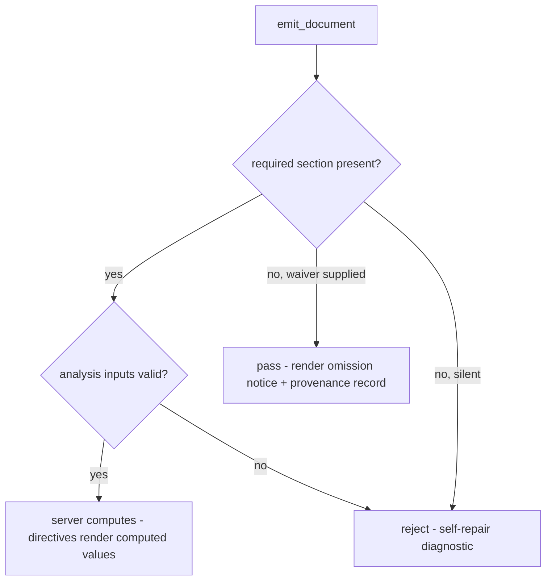
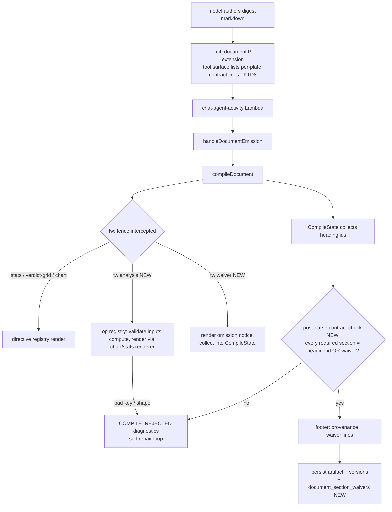

# Plate Contract Spine - Plan

## Goal Capsule

- **Objective:** Plates carry a content contract — a tiered section manifest and declared, server-computed analyses with explicit suitability waivers — so a plate shapes what the agent authors, not just how it looks.
- **Product authority:** THINK-183 (parent THINK-182), Eric's dogfood observations on the THINK-153 Plates tab, and the confirmed brainstorm dialogue of 2026-07-06. Ideation basis: `docs/ideation/2026-07-06-plates-content-contracts-ideation.html` (idea 1).
- **Open blockers:** none. All four design forks were resolved in dialogue (enforcement tier, calc data source, calc vocabulary shape, waiver weight). THINK-183 blocks THINK-184/186/188/189 — this contract is the unblocking artifact.
- **Execution profile:** implement in a worktree branched from `origin/main` — the plate-contract files (`plate-definitions.ts`, `document-directives.ts`, `document-compositor.ts`, migration 0218) exist only on `origin/main`; local main-checkout trees may lag. PR to `main`; the merge pipeline deploys the Lambda.
- **Stop conditions:** stop and surface if enforcement cannot be expressed as compile-time diagnostics (KTD1's constraint), if the op registry needs tenant-defined ops to satisfy a requirement (out of scope), or if any change requires editing workspace-skill content to make enforcement correct (doctrine violation — see KTD8).

---

## Product Contract

### Summary

Extend the plate registry with a section manifest (`required` / `required-if-material` / `suggested`, each with guidance and suggested directives) and declared analyses drawn from a closed platform op registry. The server computes analysis results deterministically from raw data the model supplies and the model narrates them by reference; a required section the model cannot back is explicitly waived — rendered inline at the section's position, recorded in provenance, and counted per plate. Silent omission of a required section is rejected.

### Problem Frame

A business plate's entire content contract today is one `useFor` sentence plus palette tokens (verified: `packages/api/src/lib/artifacts/plate-definitions.ts`, `packages/database-pg/src/schema/document-plates.ts`). Dogfooding THINK-153 surfaced the consequence three ways: every plate reads the same because the only operator levers are metadata and styles; plates carry none of a skill's "what goes in this, what to calculate" character; and a Sales Rep Review run shipped without a funnel chart because nothing told the agent one belonged there. The failure has a sibling worse than omission: every number in a document today is hand-transcribed by the model from thread context, so a template that merely *demands* metrics pressures the model to fabricate them — the documented failure mode of template-driven generation systems.

### Key Decisions

- **Tiered enforcement — reject only silent omission.** A missing required section whose backing data was supplied is a hard preflight rejection riding the existing self-repair loop. A required section the model cannot back must be explicitly waived with a reason; a waivered document passes. Strict where fabrication risk is zero, honest where data is thin. Rejected alternatives: hard-reject always (invites fabricated filler and rejection loops), advisory always (the funnel-miss recurs), per-plate setting (defers the doctrine call and adds a config axis).
- **Raw-first calc ladder.** v1 analyses compute from raw inputs the model supplies in the emission (e.g. stage counts, opportunity rows); the server does the arithmetic and the rendered numbers come from the server, not the model's prose. Each analysis declares its data `source`, `model-supplied` in v1, so a `binding`-backed source can slot in when document data bindings exist (bindings are canvas-only today — verified, no code path connects `artifact_data_bindings` to `emit_document`). This catches arithmetic and aggregation errors immediately without pulling binding-authoring UX into scope; transcription fidelity of raw inputs remains the model's responsibility in v1.
- **Closed op registry for calculations.** Analyses reference a platform-defined, versioned set of typed ops (initial set on the order of: `funnel_conversion`, `ratio_pct`, `variance_vs_prior`, `group_count`, `top_n`, `trend`) — mirroring the directive registry's doctrine exactly: closed vocabulary, typed params, compile-time rejection of unknowns, self-repair diagnostics. New op kinds ship via platform release, the accepted precedent for new directive kinds. Rejected alternative: an expression language (a mini-language to parse, sandbox, and teach, with a softer enforcement story).
- **Waivers are loud, counted, and non-blocking.** A waiver renders in the document body at the section's position and in the provenance footer, and waiver counts are queryable per plate (feeding THINK-189's conformance scoring). A waivered document can still reach `final` — recurring automations must not stall on thin data. Trust the model, make omission visible, let evidence catch abuse.
- **Contract content is registry/compiler-owned.** Manifests and analyses live in plate definitions and `document_plates` config rows — never workspace-skill files (three documented silent-staleness traps) and never raw HTML. Enforcement attaches to existing seams: the compositor's id-anchored heading slugger and DocSpector preflight for section presence; the directive registry's `reject()` mechanic for analysis validation.

### Requirements

**Section manifest**

- R1. A plate can declare an ordered section manifest; each section has a stable id, title, tier (`required` | `required-if-material` | `suggested`), guidance text, and zero or more suggested directives (optionally with a suggested chart type).
- R2. Manifest sections map to id-anchored headings in the compiled document, so section presence is checkable against the compositor's existing heading anchors.
- R3. A plate with no manifest behaves exactly as today — the manifest is additive and optional per plate.

**Declared analyses**

- R4. A plate can declare named analyses; each references one op from a closed platform op registry, with typed parameter mapping and a declared data source (`model-supplied` in v1; the schema accommodates a future `binding` source).
- R5. The server computes each analysis deterministically from the raw inputs supplied at emission; rendered directive values for a declared analysis come from the computed result, referenced by analysis key — not from model-authored numbers.
- R6. An emission referencing an unknown op, malformed parameters, or raw inputs that fail the op's shape requirements is rejected with a model-actionable diagnostic, using the directive registry's existing rejection mechanics.

**Waivers and enforcement**

- R7. An emission that silently omits a `required` section fails preflight with a diagnostic naming the section, its guidance, and its suggested directives; the existing self-repair loop applies.
- R8. The model can explicitly waive a `required` or `required-if-material` section by supplying a waiver reason at emission; a waivered emission passes preflight.
- R9. A waived section renders as a visible omission notice at the section's position in the document body and is recorded in the document's provenance footer with its reason.
- R10. Waivers are persisted queryably per document and per plate (count and reasons), and a waivered document can reach `final` status.
- R11. `suggested`-tier sections never block or warn at emission; `required-if-material` behaves as `required` except that its absence plus a waiver is the expected common case.

**Platform plate content**

- R12. The five platform business plates (Customer QBR, Proposal, Weekly Status, Sales Rep Review, Opportunity Review) ship with real section manifests and declared analyses in their code-defined definitions — Sales Rep Review's manifest includes a pipeline-health section whose suggested directive is a funnel chart backed by a funnel-conversion analysis.
- R13. Plate save-time validation extends to the content contract: a manifest or analysis declaration that cannot compile (unknown op, bad directive reference, duplicate section ids) is rejected at save, consistent with the existing three-gate pipeline.

**Delivery guardrail**

- R14. The agent-facing surface tells the model, per plate, what sections and analyses the contract expects at authoring time — sufficient for the model to author against the manifest without reading workspace files. The full delivery architecture (compact dispatch hint + `describe_plate`) is THINK-185; this requirement is the floor 183 must meet on its own.

### Key Flows

- F1. Contract-satisfying emission
  - **Trigger:** Agent calls `emit_document` for a plate with a manifest.
  - **Steps:** Model authors sections per manifest, supplying raw inputs for each declared analysis; server computes analyses, renders directives from computed results, validates section presence against heading anchors; preflight passes.
  - **Outcome:** Document compiles with true-by-construction numbers; no waivers.
- F2. Thin-data emission
  - **Trigger:** Agent has no stage-level data for a required-if-material pipeline section.
  - **Steps:** Model requests a waiver for that section with a reason; preflight passes; compositor renders the omission notice at the section's position and records the waiver in provenance.
  - **Outcome:** Document reaches `final`; waiver is queryable per plate.
- F3. Silent omission
  - **Trigger:** Model authors a Sales Rep Review with no pipeline section and no waiver.
  - **Steps:** Preflight rejects with a diagnostic naming the missing section, its guidance, and suggested directives; model self-repairs in-turn (adds the section or requests a waiver) and re-emits.
  - **Outcome:** The funnel-miss failure class cannot ship silently.



### Acceptance Examples

- AE1. **Covers R7, R12.** Given the Sales Rep Review plate with its shipped manifest, when the model emits a review containing no pipeline-health section and no waiver, then preflight rejects with a diagnostic naming `pipeline-health`, its guidance, and the suggested funnel directive.
- AE2. **Covers R5, R6.** Given a declared `funnel_conversion` analysis, when the model supplies stage counts `[120, 80, 30, 12]`, then the rendered funnel shows conversion rates computed server-side; when it supplies a single stage count, the emission is rejected with a shape diagnostic.
- AE3. **Covers R8, R9, R10.** Given a Weekly Status run with no metrics data in scope, when the model waives the metrics section with reason "no metrics source connected", then the document compiles with an inline omission notice at the metrics position, the waiver appears in the footer, the document can be marked `final`, and the waiver is countable for that plate.
- AE4. **Covers R3.** Given a tenant-created plate with no manifest, when a document is emitted against it, then behavior is byte-identical to today's pipeline.
- AE5. **Covers R13.** Given an operator (or code definition) declaring an analysis with op `median_absolute_deviation` (not in the registry), then the plate save is rejected at validation with a diagnostic listing the available ops.

### Success Criteria

- A dogfood re-run of the original failure — "run the sales rep review plate" — produces either a funnel chart or a visible waiver explaining its absence; a silent miss is impossible by construction.
- Every numeric value rendered by a declared analysis is reproducible from the raw inputs recorded with the emission — no model-narrated number survives in a computed directive.
- The five platform plates are distinguishable by contract, not just palette: their manifests and analyses differ in ways visible in the plate preview and in authored output.

### Scope Boundaries

Deferred to sibling issues (all children of THINK-182):

- Operator editing surface for manifests/analyses — THINK-188. In 183, platform plate contracts are code-defined; tenant plate rows can carry contract config, but the authoring UI is out.
- Full delivery architecture (`sectionHint` + `describe_plate`) — THINK-185. R14's floor only.
- Outline handshake (`propose_outline`) — THINK-186. In 183 the contract binds at emission preflight only.
- Strictness dial / compiled slot mode — THINK-184.
- Conformance scoring dashboards — THINK-189; 183 only persists the waiver/section data it will read.

Deferred beyond this wave:

- Binding-backed analysis sources (wiring `artifact_data_bindings` into documents) — the ladder's later rung; the schema seam ships in 183, the wiring does not.
- Tenant-defined calculation ops or an expression language — new ops ship via platform release.

### Dependencies / Assumptions

- Assumes the THINK-153 plate registry (`resolvePlate` merge, `document_plates` rows, three-gate save) and THINK-154 compositor (markdown-only authoring, directive registry, DocSpector self-repair) as shipped — all verified on `origin/main` 2026-07-06.
- Assumes model-supplied raw inputs are trustworthy enough for v1: the calc layer guarantees arithmetic, not provenance. Provenance-grade numbers arrive with binding-backed sources.
- Assumes waiver visibility (inline omission notices) is acceptable in customer-facing documents — the design intent is loud omission; thin-data recurring documents will visibly say what's missing.

### Outstanding Questions

Deferred to implementation (non-blocking):

- Exact visual styling of the inline omission notice and the footer waiver line (must pass DocSpector dark-mode checks; settle during U4).
- Exact diagnostic wording per tier — `required-if-material` shares the same diagnostic code as `required` but its message names the waiver path as the expected alternative (KTD6); final copy tuned during implementation.
- The `trend` op's exact input shape (point count floor, direction semantics) — settle when writing the op registry (U1).

### Sources / Research

- `docs/ideation/2026-07-06-plates-content-contracts-ideation.html` — ranked ideation with verified bases; idea 1 is this plan's origin.
- Grounding dossier + planning research (session artifacts): current plate/compositor/preflight/directive shapes verified against `origin/main`; key findings — `artifact_data_bindings` is canvas-only; post-compile preflight failures are treated as compiler defects (`packages/api/src/lib/artifacts/document-emission.ts`, COMPILER_DEFECT branch), so contract enforcement must be compile-time; plate config is jsonb, so contract keys need no migration; the meta journal is unused and migrations are hand-rolled (`packages/database-pg/drizzle/0218_document_plates.sql` is the marker-convention exemplar).
- External patterns that shaped decisions: SEC Regulation S-K section tiers (required / required-if-material / when-applicable); Arria ATL / Narrative Science data-to-text (templates declare analyses, engine computes or warns/skips); "enforce the skeleton, guide the prose" ecosystem consensus on long-form LLM generation.
- Institutional learnings: skill-distribution staleness traps (`docs/solutions/integration-issues/default-skill-content-updates-never-reach-agents-seeder-allowlist-install-skip-deploy-supersession.md`) — the direct precedent for KTD8's code-owned contract content; dispatch payload parity (`docs/solutions/architecture-patterns/wakeup-processor-payload-parity-with-chat-agent-invoke-2026-06-12.md`) — three prior regressions from single-builder payload changes; portable cross-surface contract pattern (`docs/solutions/architecture-patterns/analytics-display-portable-contract-cross-surface-2026-06-20.md`); migration ordering (`docs/solutions/workflow-issues/manually-applied-drizzle-migrations-drift-from-dev-2026-04-21.md`); inert-to-live seam swap (`docs/solutions/architecture-patterns/inert-to-live-seam-swap-pattern-2026-04-25.md`); policy-facade pattern (`docs/solutions/architecture-patterns/first-party-provider-tools-stay-behind-policy-facades-2026-06-14.md`).

---

## Planning Contract

Product Contract unchanged — all R/F/AE text preserved from the confirmed brainstorm. One implementation-level clarification (not a scope change): "fails preflight" in R7/R8 is realized as compile-time diagnostics on the `COMPILE_REJECTED` self-repair path, because genuine post-compile preflight failures are treated as compiler defects and told not to retry (KTD1). The model-visible behavior — synchronous reject with actionable diagnostics, self-repair in-turn — is exactly as the Product Contract describes.

### Key Technical Decisions

- KTD1. **Enforcement runs inside compile, not post-compile preflight.** `handleDocumentEmission` treats DocSpector failures on compiled output as a compiler defect (HTTP 500, "do not retry"); only compile diagnostics return as `COMPILE_REJECTED` for self-repair. Section-manifest and analysis checks therefore run inside `compileDocument` — `CompileState` collects emitted heading ids and waiver blocks during the Marked pass, and a post-parse contract check appends diagnostics to the same array directive rejections use. New diagnostic codes follow the directive registry's self-repair posture: every rejection names the section/analysis, its guidance, its suggested directives, and a corrected minimal example.
- KTD2. **Analysis raw inputs ride in the document body as a `tw:analysis` directive block** (confirmed at scoping) — not a new `emit_document` parameter. The model authors a fenced `tw:analysis` block whose YAML names the plate-declared analysis key plus the raw inputs the op requires; the block's renderer looks up the plate's declared analysis, computes via the op registry, and renders the result through the analysis's declared presentation (delegating to the existing chart renderer for funnel/bar/etc., or the stats renderer). Compute-inside-the-directive means no `DirectiveEngine` signature change and no cross-block value references — each computed value renders where its block sits. Rejected alternative: a top-level `analysis_inputs` tool parameter (requires schema + POST + parse changes on three surfaces and separates inputs from the prose that narrates them).
- KTD3. **Waivers are a `tw:waiver` directive block at the section's position.** YAML carries the manifest section id and a reason. Placement gives R9's "renders at the section's position" for free; the compositor collects waivers into `CompileState` for the contract check (a waived section counts as satisfied), the omission notice renders in place, and the footer provenance line and persistence read from the collected set. A `tw:waiver` naming a section id not in the plate's manifest, or missing a reason, rejects with the standard directive diagnostic shape.
- KTD4. **The op registry is a pure module in `packages/api/src/lib/artifacts/`, sibling to the directive registry.** Closed, versioned vocabulary (`document-analyses/v1`): each op declares typed input shape, params, compute function, and result shape. Initial set: `funnel_conversion`, `ratio_pct`, `variance_vs_prior`, `group_count`, `top_n`, `trend`. Vocabulary reaches the model only as data (dispatch payload summaries, rejection diagnostics) — never as imported code in `packages/pi-extensions`, which has no dependency on `@thinkwork/api` (duplication-as-data is the established pattern there; mirrors the analytics-display portable-contract learning: one React-free source of truth, validate before render, no second parallel catalog).
- KTD5. **Waivers persist in a dedicated table** (confirmed at scoping) — `document_section_waivers`, keyed by tenant + artifact with plate slug, section id, tier, and reason columns; rewritten (delete + reinsert) per emission head, matching document-head semantics. A dedicated table satisfies R10's per-plate count/reasons queries with real indexes and feeds THINK-189 without jsonb scans; the artifacts row's `metadata` is not rewritten on revision upserts today, which rules out metadata-resident waivers without changing upsert semantics. Hand-rolled additive migration `0219_document_section_waivers.sql` with `-- creates:` markers, applied to dev via psql before merge.
- KTD6. **Manifest section ids are slug-shaped and matched against compiled heading ids exactly.** Save-time validation (and the platform-definition tests) enforce ids that are lowercase, ASCII, ≤64 chars — the compositor's slugger output shape — so presence checking is set membership on `CompileState`'s collected heading ids. The diagnostic for a missing required section tells the model to author a heading whose slug equals the section id (naming the expected title from the manifest). `required-if-material` shares the `required` diagnostic code; its message differs only in naming the waiver as the expected alternative. `suggested` sections are never checked at emission (R11) — they exist for the authoring surface and THINK-189 measurement.
- KTD7. **Contract config is additive jsonb on both plate layers — no migration for plates.** `PlateDefinition` (code) and `DocumentPlateConfig` (tenant jsonb) gain optional `sections` and `analyses` keys; `resolveFromLayers` merges each key wholesale (config replaces platform per key, same semantics as `allowedDirectives`); `ResolvedPlate` and `CompositorPlate` carry them through. Tenant rows *can* hold contract config (validated by the save gates) but no operator UI ships here (THINK-188). `buildPlateExemplar` becomes manifest-aware — it emits every required section heading and an example block per declared analysis — otherwise every contract-bearing plate would self-reject at save gate 2.
- KTD8. **R14's floor rides the existing per-dispatch tool surface plus point-of-use diagnostics.** `visiblePlateSummaries` widens to carry a terse per-plate contract line: required/required-if-material section ids with their expected titles, and declared analysis keys with their ops plus each op's one-line input-shape hint from the op registry (e.g. `funnel_conversion: ordered stage {label, count}, >=2 stages`) — enough for a fresh thread to author a contract-satisfying emission first-pass without burning a self-repair round. The Pi extension renders those lines into the per-turn `emit_document` tool surface it already rebuilds from `document_plates`, and `normalizeDocumentPlates` explicitly normalizes the new keys (it drops unknown keys today). Full guidance text is *not* shipped in the tool description (token cost scales with plate count at enterprise scale) — it arrives in the rejection diagnostic exactly when needed. Both dispatch payload builders (`chat-agent-invoke`, `wakeup-processor`) already share `documentPlatesForDispatch`, so the projection widens in one place; the wakeup parity tests extend to pin it. Contract content never touches workspace-skill files; the document-composer SKILL.md gains at most a generic one-line mention that plates may declare sections/analyses (non-load-bearing, so skill-distribution staleness cannot break enforcement).
- KTD9. **Inert-first sequencing.** All machinery (op registry, schema keys, directives, enforcement, persistence, dispatch surface) lands with zero platform plates carrying a manifest — AE4's no-manifest path is the natural inert state and the whole pipeline is byte-identical for contract-less plates. The five platform plate contracts (R12) attach as the final unit, making enforcement rollout per-plate and reversible by reverting one file.
- KTD10. **Revisions of pre-contract documents are enforced like new emissions** (confirmed at scoping) — no grandfathering. A revision against a newly-contracted plate must satisfy the manifest or waive; the waiver path guarantees recurring automations never stall. This matches the existing posture where revision-time plate resolution is already more lenient only for `hidden` plates.
- KTD11. **`waiver` and `analysis` are structural contract directives, exempt from per-plate `allowedDirectives` gating.** `gateEngineOnPlate` always passes them through — their own validation (manifest membership, declared-analysis lookup) is the real gate — and they are excluded from the operator-facing `DIRECTIVE_KINDS` vocabulary used by the save gate's directive bounds, so plates cannot (and need not) list them. Without this, a plate with a restricted directive list (Proposal ships `["stats", "verdict-grid"]`) could never waive — the self-repair loop would oscillate between "section missing, waive it" and "directive not available for this genre" — and U7's Proposal exemplar would self-reject at save gate 2 when it emits its `tw:analysis` example. A plate's `allowedDirectives` still governs which *presentation* kinds an analysis may declare (U2 validation).

### High-Level Technical Design

Emission pipeline with the new seams (new components marked):



Waiver persistence shape (directional, not implementation specification):

```text
document_section_waivers
  tenant_id FK, artifact_id FK (cascade), plate_slug, section_id,
  tier, reason, created_at
  unique (artifact_id, section_id); index (tenant_id, plate_slug)
  -- rewritten per emission head (delete + reinsert), like head-version semantics
```

Contract config shape on both plate layers (directional):

```text
sections: [{ id, title, tier: required|required-if-material|suggested,
             guidance, suggestedDirectives?: [{ kind, chartType? }] }]
analyses: [{ key, op, params?, presentation: { directive, chartType? },
             source: "model-supplied" }]
```

### Sequencing

U1 → U2 → (U3, U4 in either order) → U5 → U6 → U7. U1–U6 are inert (no platform plate carries a contract); U7 is the live swap. Rebase the worktree on `origin/main` at unit boundaries; apply the U5 migration to dev via psql before merge so the drift gate sees it.

---

## Implementation Units

### U1. Analysis op registry

- **Goal:** A pure, closed, versioned op registry: typed input shapes, params, deterministic compute, result shapes, and model-actionable validation errors.
- **Requirements:** R4, R5, R6 (compute half), AE2 (compute half).
- **Dependencies:** none.
- **Files:** `packages/api/src/lib/artifacts/document-analyses.ts` (new), `packages/api/src/lib/artifacts/document-analyses.test.ts` (new).
- **Approach:** Mirror the directive registry's shape: a `DEFAULT_ANALYSIS_REGISTRY` of op specs, an exported `ANALYSIS_OPS` list (the save-gate vocabulary), and a validate-then-compute entry that returns either a typed result or diagnostics in the directive-diagnostic shape (message + expected schema + corrected minimal example). Ops: `funnel_conversion` (ordered stage `{label, count}` list, ≥2 stages → per-stage conversion rates + overall), `ratio_pct`, `variance_vs_prior` (current + prior → delta and %), `group_count`, `top_n`, `trend` (ordered points → direction + change; settle the exact input floor here). Pure module — no DB, no network, deterministic; version the vocabulary (`document-analyses/v1`).
- **Patterns to follow:** `packages/api/src/lib/artifacts/document-directives.ts` (spec registry, `reject()` diagnostics, KTD7 corrected-example posture); `docs/solutions/architecture-patterns/analytics-display-portable-contract-cross-surface-2026-06-20.md` (versioned vocabulary, validate before render, bounded by-value inputs).
- **Test scenarios:**
  - Covers AE2. `funnel_conversion` with stages `[120, 80, 30, 12]` returns server-computed per-stage rates (66.7%, 37.5%, 40%) and overall 10%.
  - Covers AE2. `funnel_conversion` with one stage returns a shape diagnostic naming the ≥2-stage requirement and a corrected minimal example.
  - Each op: happy path with typical inputs asserting exact computed values; empty input list; non-numeric values in a numeric field; oversized input list (bound each op's input count and assert rejection over the bound).
  - `variance_vs_prior` with prior = 0 (division guard — defined result or diagnostic, not NaN/Infinity).
  - Unknown op key at the registry entry point returns a diagnostic listing available ops.
  - Determinism: same inputs → identical results (no clock/random dependence).
- **Verification:** unit suite green; module imports nothing beyond stdlib/types.

### U2. Plate contract schema and save-gate validation

- **Goal:** Both plate layers carry optional `sections`/`analyses`; resolution merges them; the three-gate save rejects malformed contracts; exemplars satisfy their own manifests.
- **Requirements:** R1, R3, R4 (declaration half), R13, AE5.
- **Dependencies:** U1.
- **Files:** `packages/api/src/lib/artifacts/plate-definitions.ts`, `packages/api/src/lib/artifacts/plate-registry.ts`, `packages/database-pg/src/schema/document-plates.ts`, `packages/api/src/graphql/resolvers/document-plates/shared.ts`; tests: `packages/api/src/lib/artifacts/plate-registry.test.ts`, `packages/api/src/graphql/resolvers/document-plates/document-plates.resolver.test.ts`.
- **Approach:** Add optional `sections` and `analyses` to `PlateDefinition` and `DocumentPlateConfig` (jsonb — no migration); thread through `resolveFromLayers` (wholesale per-key override, same semantics as `allowedDirectives`) into `ResolvedPlate` and `CompositorPlate`. Save-gate bounds in `shared.ts` beside `boundedDirectives()`: section ids slug-shaped (lowercase ASCII, ≤64), unique, tier in the closed enum, guidance/title within text bounds, suggested directive kinds validated against `DIRECTIVE_KINDS` and chart types against the chart-type list; analysis keys unique and slug-shaped, ops validated against `ANALYSIS_OPS`, presentation directive kinds validated. Make `buildPlateExemplar` manifest-aware: emit a heading per required/required-if-material section (title from the manifest, so the slugger yields the section id) and one example `tw:analysis` block per declared analysis, so gate 2 compiles clean for contract-bearing plates.
- **Patterns to follow:** `boundedDirectives()` and the three-gate structure in `resolvers/document-plates/shared.ts`; the platform-definitions snapshot suite in `plate-registry.test.ts`.
- **Test scenarios:**
  - Covers AE5. Saving a plate declaring op `median_absolute_deviation` rejects with a diagnostic listing available ops.
  - Save rejects: duplicate section ids; a section id with uppercase/spaces/65 chars; unknown tier; suggested directive kind not in `DIRECTIVE_KINDS`; unknown chart type; analysis presentation referencing an unknown directive kind.
  - Save accepts a well-formed contract and the persisted config round-trips through `resolveFromLayers` into `ResolvedPlate`.
  - Tenant config with `sections` overrides a platform definition's `sections` wholesale; absent config key inherits the platform's.
  - A plate with no contract keys resolves identically to before this change (snapshot).
  - Exemplar for a contract-bearing plate compiles through all three gates (required headings present, analysis example block computes).
- **Verification:** plate-registry + resolver suites green; exemplar gate passes for a fixture plate carrying the Sales Rep Review-shaped contract.

### U3. tw:analysis directive — compute and render

- **Goal:** The model supplies raw inputs in a `tw:analysis` block; the server computes via the op registry and renders the result through the declared presentation; bad references or shapes reject with self-repair diagnostics.
- **Requirements:** R5, R6, AE2.
- **Dependencies:** U1, U2.
- **Files:** `packages/api/src/lib/artifacts/document-directives.ts`, `packages/api/src/lib/artifacts/document-compositor.ts`, tests in `document-directives.test.ts` and `document-compositor.test.ts`.
- **Approach:** Register an `analysis` directive spec. Its render receives the block's YAML (`analysis` key + raw inputs) and needs the resolved plate's declared analyses — thread the plate's contract into the directive engine the same way per-plate directive gating already reaches the compositor (`CompositorPlate`), keeping compute inside the directive (KTD2, no engine signature change beyond what plate gating already established). Render path: compute via U1, then delegate presentation to the existing chart renderer (funnel/bar/line…) or stats renderer with the computed series — reusing the SVG placeholder-token path and the chart-data fallback table convention. Reject with directive-shaped diagnostics: unknown analysis key (list the plate's declared keys), inputs failing the op's shape, `tw:analysis` on a plate declaring no analyses.
- **Execution note:** Start from failing compositor-level tests that compile a full digest containing a `tw:analysis` block against a fixture plate — the seam (plate contract reaching the directive render) is the risky part, not the arithmetic.
- **Patterns to follow:** `tw:chart` spec in `document-directives.ts` (YAML strict parse, `containsSvg` routing, fallback table); per-plate directive gating in `document-compositor.ts`.
- **Test scenarios:**
  - Covers AE2. Full-digest compile with a `funnel_conversion` block and stage counts renders a funnel whose rate labels are the server-computed values, plus the fallback data table; compiled output passes `runDocumentPreflight`.
  - Unknown analysis key rejects, listing the plate's declared keys.
  - Raw inputs failing shape (one stage) reject with the op's diagnostic and corrected example.
  - `tw:analysis` on a plate with no declared analyses rejects with a diagnostic saying this plate declares none.
  - Model-authored numbers cannot leak: the rendered values come from compute output even when the block's YAML includes extraneous rate fields (extraneous fields rejected by strict parse, or ignored — pin whichever is chosen).
  - A plate without a manifest but with declared analyses can still use `tw:analysis` (contract halves are independent).
  - `tw:analysis` compiles on a plate whose `allowedDirectives` excludes charts (Proposal-shaped fixture) — structural directives bypass plate gating (KTD11) while the analysis's declared presentation kind is still validated against `allowedDirectives` at save.
- **Verification:** directive + compositor suites green; a compiled fixture document shows computed rates in the SVG.

### U4. tw:waiver directive and section enforcement

- **Goal:** Silent omission of a required section rejects with a self-repair diagnostic; an explicit waiver passes, renders an inline omission notice at its position, and lands in the provenance footer; contract-less plates are byte-identical.
- **Requirements:** R2, R7, R8, R9 (render half), R11, AE1 (enforcement half), AE4.
- **Dependencies:** U2.
- **Files:** `packages/api/src/lib/artifacts/document-directives.ts`, `packages/api/src/lib/artifacts/document-compositor.ts`, `packages/api/src/lib/artifacts/document-emission.ts` (surface collected waivers to the emission layer), tests in `document-compositor.test.ts`, `document-directives.test.ts`, `document-emission.test.ts`.
- **Approach:** Register a `waiver` directive spec: YAML carries `section` + `reason`; render produces the styled omission notice (house tokens, dark-mode safe) and records `{sectionId, tier, reason}` into `CompileState`. Extend `CompileState` to also collect emitted heading ids from the slugger path. After `marked.parse`, run the contract check (KTD1/KTD6): for each `required`/`required-if-material` manifest section, satisfied = heading id present or waiver collected; otherwise append a diagnostic naming the section, its expected title, guidance, suggested directives, and both repair paths (author the section or waive with a reason). `suggested` never checks. Waiver validation: section id must be in the plate's manifest and not also present as a heading (waiving a section you authored is a diagnostic); reason required and bounded. Footer: append waiver lines to the existing `footerHtml` composition. Expose the collected waiver set on the compile result for U5. No manifest → the check is a no-op and no new code paths execute (AE4).
- **Patterns to follow:** slugger/heading override and `footerHtml` composition in `document-compositor.ts`; diagnostic shape from `document-directives.ts`.
- **Test scenarios:**
  - Covers AE1 / F3. Fixture plate with required `pipeline-health`: digest lacking that heading and any waiver rejects; the diagnostic names `pipeline-health`, its guidance, and the suggested funnel directive.
  - Covers F2. Same digest plus a `tw:waiver` for `pipeline-health` with a reason compiles: omission notice at the block's position, waiver line in the footer, waiver present on the compile result.
  - Covers AE4. A plate with no manifest compiles a representative digest byte-identically to the pre-change compositor (golden/snapshot comparison).
  - Heading authored with the manifest section's title satisfies the check (slugger yields the id); a heading whose slug ≠ section id does not.
  - `required-if-material` behaves as `required` for silent omission; its diagnostic names the waiver as the expected alternative; `suggested` absent → no diagnostic, no warning.
  - Waiver naming an unknown section id rejects; waiver missing a reason rejects; waiver for a section that is also present as a heading rejects.
  - Multiple missing required sections produce one diagnostic each (model can repair all in one pass).
  - Duplicate-title headings elsewhere in the doc (slugger `-1` suffixes) don't false-positive the check.
  - `tw:waiver` compiles on a plate whose `allowedDirectives` excludes it (Proposal-shaped fixture) — structural directives bypass plate gating (KTD11).
  - Compiled output with an omission notice passes `runDocumentPreflight` (including dark-mode).
- **Verification:** compositor/directive/emission suites green; AE4 snapshot proves the inert path.

### U5. Waiver persistence

- **Goal:** Waivers persist queryably per document and per plate; a waivered document reaches `final`.
- **Requirements:** R9 (record half), R10, AE3.
- **Dependencies:** U4.
- **Files:** `packages/database-pg/drizzle/0219_document_section_waivers.sql` (new), `packages/database-pg/src/schema/document-section-waivers.ts` (new), `packages/database-pg/src/schema/index.ts`, `packages/api/src/lib/artifacts/document-emission.ts`, `packages/api/src/lib/artifacts/document-emission.test.ts`.
- **Approach:** New table per the HTD sketch (tenant + artifact FKs with cascade delete, plate slug, section id, tier, reason; unique per artifact + section; index on tenant + plate slug). Hand-rolled additive migration with `-- creates: public.document_section_waivers` marker and the psql-apply header, following `0218_document_plates.sql`; apply to dev via psql before merge. Emission write path: on successful compile, delete + reinsert the artifact's waiver rows from the compile result (head semantics — a re-emission without waivers clears prior rows). Plate slug comes from the emission's resolved plate. Add a small read helper for per-plate count/reasons (the THINK-189 seam) in the artifacts lib. No status-machine change needed: `final` is already reachable via the existing `status` parameter — add a test pinning that a waivered emission with `status: final` persists as final.
- **Patterns to follow:** `artifact-data-bindings.ts` schema shape; `DocumentEmissionDeps` dependency-injection testing in `document-emission.test.ts`; migration conventions from `docs/solutions/workflow-issues/manually-applied-drizzle-migrations-drift-from-dev-2026-04-21.md`.
- **Test scenarios:**
  - Covers AE3. Emission with one waiver records a row with plate slug, section id, reason; document with `status: final` persists as final; the read helper returns count 1 with the reason for that plate.
  - Re-emission of the same document with zero waivers clears prior rows; re-emission with a different waiver replaces rows (no accumulation).
  - Rejected emission (compile diagnostics) writes no waiver rows.
  - Contract-less plate emission touches the waiver table not at all (no delete issued — or pin the chosen no-op shape).
  - Read helper aggregates across documents of the same plate and scopes by tenant.
- **Verification:** emission suite green; migration applies clean to dev (`psql -f`, then `pnpm db:migrate-manual` reports the object present).

### U6. Dispatch and Pi tool-surface floor

- **Goal:** The model sees, per plate at authoring time, which sections and analyses the contract expects (R14's floor), on both dispatch paths.
- **Requirements:** R14.
- **Dependencies:** U2.
- **Files:** `packages/api/src/lib/artifacts/plate-registry.ts` (`visiblePlateSummaries` / `documentPlatesForDispatch`), `packages/api/src/lib/agent-dispatch-payload.ts` (type), `packages/pi-extensions/src/document-composer.ts` (`normalizeDocumentPlates`, tool-surface composition), tests: `packages/pi-extensions/test/document-composer.test.ts`, `packages/api/src/handlers/wakeup-processor.system-prompt.test.ts` (parity), plus the plate-registry tests.
- **Approach:** Widen the plate summary projection with a terse contract line per plate: required and required-if-material section ids with tier and expected title, and analysis keys with their ops plus the op's one-line input-shape hint from the op registry — no guidance text (KTD8; token cost bounds the surface, full guidance arrives in diagnostics at point of use; the input-shape hints are short strings already defined in U1's op specs). Both payload builders share `documentPlatesForDispatch`, so the projection changes once; extend the wakeup parity assertions to pin the new fields so the two-builder trap can't silently drop them. In the extension, `normalizeDocumentPlates` explicitly carries the new keys (it drops unknowns today) and the tool surface renders the contract lines beside each plate's `useFor`. Degradation unchanged: absent field → core-4 fallback, server-side validation stays authoritative.
- **Patterns to follow:** `documentPlatesForDispatch` / `visiblePlateSummaries` projection; `docs/solutions/architecture-patterns/wakeup-processor-payload-parity-with-chat-agent-invoke-2026-06-12.md`.
- **Test scenarios:**
  - A contract-bearing plate's summary includes its required section ids and analysis keys; a contract-less plate's summary is unchanged.
  - `normalizeDocumentPlates` preserves the contract fields; malformed/missing contract fields degrade to the plain summary (never throw).
  - Tool surface for a plate list containing Sales Rep Review's shaped contract mentions `pipeline-health` (with its expected title) and `funnel_conversion` with its input-shape hint.
  - Wakeup parity test asserts the widened `document_plates` shape matches the chat-invoke builder's.
  - Payload with no `document_plates` still falls back to the core-4 plates.
- **Verification:** pi-extensions suite + api handler parity tests green.

### U7. Platform plate contracts (live swap)

- **Goal:** The five business plates ship real, distinguishing manifests and analyses; the sales-rep-review funnel-miss becomes impossible by construction.
- **Requirements:** R12, AE1; Success Criteria all three.
- **Dependencies:** U1–U6.
- **Files:** `packages/api/src/lib/artifacts/plate-definitions.ts`, `packages/api/src/lib/artifacts/plate-registry.test.ts` (platform-definitions snapshot).
- **Approach:** Author contracts in code for Customer QBR, Proposal, Weekly Status, Sales Rep Review, Opportunity Review. Sales Rep Review: required-if-material `pipeline-health` section with suggested funnel directive backed by a `funnel_conversion` analysis (thin-data reps must waive, not fabricate — the tier choice is deliberate), plus sections like quota attainment (`ratio_pct`) and coaching notes. Weekly Status: metrics section (the AE3 waiver case). Proposal keeps its no-charts identity — sections + verdict-grid suggestions only, no chart-presenting analyses (its `allowedDirectives` excludes charts; the save gate must hold: analysis presentations respect the plate's allowed directive kinds — covered by U2 validation). Each plate's manifest must read differently (Success Criterion 3). Every contract passes the three-gate save via its exemplar by construction (U2).
- **Execution note:** This unit is content authorship over proven machinery — verify by compiling each plate's exemplar and by the live dogfood in the Verification Contract, not by new mechanism tests.
- **Test scenarios:**
  - Platform-definitions snapshot updates: each of the five plates carries a manifest and at least one analysis; the five manifests are pairwise distinct.
  - Sales Rep Review contract: `pipeline-health` present, tier `required-if-material`, suggested directive funnel, analysis op `funnel_conversion`.
  - Proposal's analyses declare no chart presentation (consistent with its directive restriction).
  - All five exemplars compile through the three gates.
  - Covers AE1 end-to-end at the lib level: emitting a Sales Rep Review digest without `pipeline-health` and without a waiver rejects with the expected diagnostic.
- **Verification:** full `pnpm --filter @thinkwork/api test` green; live dogfood per Verification Contract.

---

## Verification Contract

| Gate | Command / check | Applies to |
|---|---|---|
| Focused suites during development | `cd packages/api && npx vitest run src/lib/artifacts/` (plus the touched resolver/handler test files) | U1–U7 |
| Full package suites before PR | `pnpm --filter @thinkwork/api test`, `pnpm --filter @thinkwork/database-pg test` (if present), pi-extensions package suite (`pnpm --filter <pi-extensions package name> test` — confirm exact name from its package.json) | all units |
| Types + lint + format | `pnpm -r --if-present typecheck`, `pnpm lint`, `pnpm format:check` (tsc separately — vitest green is not tsc green) | all units |
| Migration | `psql "$DATABASE_URL" -f packages/database-pg/drizzle/0219_document_section_waivers.sql` against dev before merge; `pnpm db:migrate-manual` reports the table present | U5 |
| Inert proof | AE4 snapshot test: contract-less plate compile is byte-identical pre/post | U4 gate for merging U1–U6 |
| Live dogfood (post-deploy) | On dev: run the Sales Rep Review plate in chat — output has a funnel chart or a visible waiver; repeat via an automation/wakeup-dispatched turn (the resume path) to prove the widened dispatch payload rides both builders; force the silent-omission case (thin prompt) and confirm the self-repair loop resolves it in-turn; verify the waiver row via the read helper or psql | U6, U7, Definition of Done |

Watch the post-merge Deploy run on `main` (`gh run list --branch main`) before starting live verification.

## Definition of Done

- All seven units implemented and their test scenarios passing; full package suites, typecheck, lint, and format gates green.
- Migration 0219 applied to dev and reported present by the drift reporter.
- Inert proof held until U7: merging U1–U6 changes no compiled output for existing plates.
- Live dogfood on dev passes all four checks in the Verification Contract's last row — including the wakeup/automation path.
- Waiver data queryable per plate (the THINK-189 seam exists and returns real counts).
- No abandoned or experimental code in the diff; worktree removed and branch deleted after merge.
- THINK-183 updated in Linear with the shipped evidence; THINK-184/186/188/189 unblocked.
