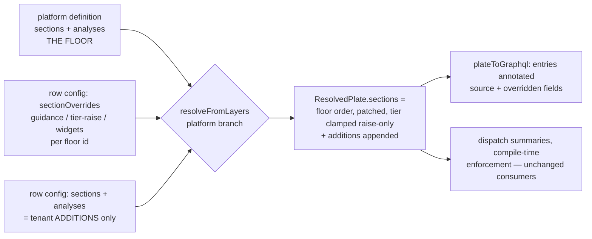

# Plate Content Contract Editor - Plan

## Goal Capsule

- **Objective:** Operators author and customize plate content contracts — section manifests and declared analyses — in the Edit Plate dialog, with platform plates governed by a floor model (tenants add and adapt, never remove the platform's required floor) and a live preview that shows the whole contract in action before save.
- **Product authority:** THINK-188 (parent THINK-182), the confirmed brainstorm dialogue of 2026-07-06 (governance, quality bar, analyses UX, layout, and floor-edit granularity all resolved), and ideation idea 6 in `docs/ideation/2026-07-06-plates-content-contracts-ideation.html`.
- **Open blockers:** none. THINK-183 (Contract Spine) shipped 2026-07-06 and provides every seam this builds on: contract config on both plate layers, save-gate validators, manifest-aware exemplar compile, and the preview path already accepting contract fields.
- **Execution profile:** implement in a worktree branched from `origin/main`. PR to `main`; the merge pipeline deploys the API Lambda. **`apps/web` ships to app.thinkwork.ai only on the next `desktop-v*` canary tag** — plan the dogfood against the dev web server, not deployed prod.
- **Stop conditions:** stop and surface if the floor cannot be enforced structurally at the save gates (KTD2's inexpressibility bet fails), if the preview exemplar cannot pass the shipped contract check without weakening it, if any change requires loosening THINK-183's gates (golden parity, wholesale-vs-layered merge for tenant-origin rows), or if the floor-evolution invariants (immutable floor section ids; floor growth as a deliberate release act — see Dependencies) cannot be honored.

---

## Product Contract

### Summary

Add a Content tab to the Edit Plate dialog where operators author section manifests as ordered structured rows and attach analyses from a curated, human-labeled picker. Platform plate contracts open to tenant customization for the first time under a floor model — add, rewrite guidance, raise tiers; never remove or weaken the platform floor — enforced server-side and merged so platform contract updates keep flowing to customized tenants. The live preview renders every declared section and computed analysis with representative data, plus a waived-section example, so the operator sees the contract in action before saving.

### Problem Frame

THINK-183 made plates carry content contracts, but the five platform contracts are code-defined and tenant plates can only receive contract config via the API — no operator can author or adapt a contract in the product. The governance question this forces (what may a tenant change on a platform plate's contract?) is cheapest to settle now, while zero tenants have customized: the shipped merge semantics replace a platform contract wholesale the moment a tenant writes one, which would silently cut customized tenants off from platform contract improvements and let them delete the pipeline-health floor that 183 exists to enforce.

### Key Decisions

- **Floor model governance.** Platform required sections and declared analyses are a floor: tenants can add sections/analyses, rewrite a floor section's guidance in their own vocabulary, raise its tier, and add suggested widgets — never remove a platform section or analysis, lower a tier, or retitle a section (the title is the enforcement key). Platform contract updates keep flowing to customized tenants; tenant deltas ride on top. Rejected: full wholesale override (customization silently forks the tenant off platform improvements and can delete the floor); locked platform contracts (the most likely first customization — "make the guidance speak our language" — would force cloning the whole plate).
- **See-it preview bar, not a distinct fourth gate.** The existing gate pipeline already compiles a manifest-aware exemplar exercising every declared section and analysis, so "cannot save a broken contract" is already enforced. This work's quality bar is that the operator *sees* the contract in action: preview renders every section with representative content, every analysis computed from plausible per-op sample data, and one waived-section example. Rejected: a separately named structural gate (would mostly re-assert what the exemplar compile and 183's contract check already guarantee).
- **Curated analysis picker.** Operators pick from human-labeled analysis templates derived from the closed op registry, each showing its input hint and a rendered mini-example; keys auto-derive from a friendly name; presentation (chart type vs stat tiles) is a simple choice scoped to the plate's allowed directives. Registry vocabulary (op keys, presentation directives) stays under the hood. Rejected: raw structured form (reads like a developer tool for a non-developer operator); sections-only v1 (undercuts "plates carry substance" for tenant plates).
- **Tabbed form column layout.** The dialog gains a Style | Content tab switcher in the form column only; the live preview column is always visible and always reflects the combined draft of both tabs. Chosen over an outline+detail rebuild and over edit-on-preview (visual probe, option A).
- **Structured fields only.** Contract authoring is rows, pickers, and bounded text fields — never freehand contract text, YAML, or markdown. Doctrine: enforcement-over-nudge; the contract must be machine-checkable by construction.

### Requirements

**Content tab**

- R1. The Edit Plate dialog gains a Style | Content tab switcher in the form column; the live preview column stays visible on both tabs and reflects the combined draft.
- R2. The Content tab edits the section manifest as ordered structured rows: title, tier (`required` | `required-if-material` | `suggested`), guidance, and optional suggested widgets — with add, remove (where governance allows), and reorder. No freehand contract text anywhere.
- R3. Section identity is derived: the operator types a title and the section id derives from it; the operator never authors an id. Duplicate titles within a plate are rejected at entry.
- R4. Analyses are added from a curated picker of human-labeled templates covering every registry op, each showing what inputs the analysis needs (in operator terms) and a rendered mini-example; the analysis key auto-derives from a friendly name; presentation offers only what the plate's allowed directives permit.

**Floor governance (platform plates)**

- R5. On a platform plate, tenants can: add sections and analyses, edit any floor section's guidance, raise a floor section's tier, and add suggested widgets. Tenants cannot: remove or retitle a platform section, lower a platform section's tier below the PLATFORM-defined tier (a tenant may lower or clear their own raise back down to, never below, the platform floor), or remove a platform analysis. The editor communicates floor status visibly (locked affordances with an explanation), and attempts are inert in the UI.
- R6. Floor rules are enforced server-side at save: a config violating the floor is rejected with an explanation regardless of client. Governance is a server rule, not a UI affordance.
- R7. Contract merge for platform plates is layered so platform contract updates propagate to customized tenants: platform floor + tenant delta, replacing the shipped wholesale-override semantics for platform plates. Tenant-created plates keep full ownership of their contracts (no floor).
- R8. The plate save surface accepts contract fields, and the existing "platform plates: palette + hidden only" restriction is relaxed exactly to the floor rules — no further.

**Preview and save quality**

- R9. The live preview renders the full draft contract in action: every declared section with representative content, every declared analysis computed from plausible sample data appropriate to its op (a funnel with rates, stat tiles with realistic magnitudes), and one waived-section example showing the omission notice and provenance footer line.
- R10. Per-op sample data is platform-curated and convincing (realistic labels and magnitudes) — never operator-authored, never lorem-ipsum-grade.
- R11. The existing save gates hold end-to-end for contract edits: bounded validation, presentation-vs-directives consistency, exemplar compile, and preflight — an operator cannot save a contract whose own exemplar fails to compile.

- R13. For each floor section field a tenant has overridden, the editor marks the field as customized ("platform updates paused for this field") and offers a per-field revert-to-platform affordance that clears the override so platform improvements resume flowing. Overriding a floor field must never be a silent, irreversible fork.

**Tenant plates**

- R12. Tenant-created plates get the same Content tab with full contract ownership: all sections and analyses addable, editable, and removable.

### Key Flows

- F1. Customize a platform plate
  - **Trigger:** Operator opens Sales Rep Review → Content tab.
  - **Steps:** Sees the three platform sections marked as floor; rewrites pipeline-health guidance in company vocabulary; raises quota-attainment to `required`; adds a "Territory Notes" section (`suggested`); preview updates live; saves.
  - **Outcome:** Next Sales Rep Review emission enforces the customized contract; a later platform improvement to a floor section's guidance still reaches this tenant unless they overrode that field.
- F2. Author a tenant plate's contract
  - **Trigger:** Operator creates a tenant plate and opens the Content tab.
  - **Steps:** Adds sections with titles/tiers/guidance; opens the analysis picker, chooses "Funnel with conversion rates," names it, picks funnel presentation; preview shows the computed example; saves through all gates.
  - **Outcome:** The tenant plate carries a real content contract with zero API involvement.
- F3. Floor violation attempt
  - **Trigger:** Operator tries to delete pipeline-health from Sales Rep Review.
  - **Steps:** The row's remove affordance is disabled with an inline explanation of the floor; a crafted API request attempting the same is rejected at save with the floor rule named.
  - **Outcome:** The floor holds at both layers.

### Acceptance Examples

- AE1. **Covers R5, R6.** Given Sales Rep Review, when a tenant operator attempts to remove `pipeline-health` (UI or direct API), then the UI offers no live affordance and the server rejects the save naming the floor rule; adding "Territory Notes" alongside it succeeds.
- AE2. **Covers R2, R11 + 183's enforcement.** Given a tenant added a `required` "Territory Notes" section, when the next document is emitted against that plate without that section or a waiver, then the emission is rejected by the compile-time contract check.
- AE3. **Covers R7.** Given a tenant customized Sales Rep Review (added a section, edited one floor section's guidance), when a platform release improves a different floor section's guidance, then the customized tenant sees the improved platform guidance merged with their delta.
- AE4. **Covers R4 + gate 1b.** Given the Proposal plate (charts excluded), when the operator opens the analysis picker, then chart-presented templates are unavailable or offered as stat tiles only; a chart-presented analysis cannot be saved onto Proposal.
- AE5. **Covers R9, R10.** Given a draft contract with a funnel analysis and three sections, when the operator views the preview, then it shows all three sections rendered, a funnel computed from realistic sample stage data, and one waived-section example with the omission notice and footer line.
- AE6. **Covers R3.** Given an operator titles a section "Pipeline Health" when one already exists, then the row is rejected at entry with the duplicate named.

### Success Criteria

- A tenant operator can make Sales Rep Review "speak their language" (guidance, added sections, an added analysis) entirely in the UI, and the next emission enforces the customized contract.
- No path exists — UI or API — by which a tenant removes or structurally weakens (presence, title, tier, declared analyses) a platform plate's required floor. Guidance substance on floor sections is tenant-editable by design and is not part of this guarantee.
- A platform contract improvement shipped after tenant customization is visible in the customized tenant's resolved contract.
- An operator who has never read the docs can attach a computed analysis to a tenant plate using only the picker's labels, hints, and examples.

### Scope Boundaries

Deferred to sibling issues (children of THINK-182):

- Dispatch surface and `describe_plate` delivery — THINK-185.
- Outline handshake (`propose_outline`) — THINK-186.
- Conformance scoring dashboards over waiver data — THINK-189.

Deferred beyond this work:

- New analysis ops — the picker draws only from the six shipped registry ops; new ops ship via platform release.
- Operator-authored sample/placeholder data for previews — sample data is platform-curated (R10).
- Freehand or import-based contract authoring (paste a doc, derive a manifest) — the corpus-to-modules flywheel is a separate ideation survivor, not this issue.
- Floor governance for style fields — the existing palette/hidden rules for platform plates are unchanged.

### Deferred to Follow-Up Work

- Drag-and-drop reordering of section rows (v1 ships up/down move controls; the repo's only drag precedent is the sidebar dnd-kit setup — adopt it here only if operators ask).
- Reordering or reinterleaving platform floor sections on a platform plate (v1: floor order is platform-owned; tenant additions append and reorder among themselves).

### Dependencies / Assumptions

- Assumes THINK-183 as shipped 2026-07-06: contract config on both plate layers, save-gate validators (including the title→id derivation rule), manifest-aware exemplar compile, preview path accepting contract fields, `document_section_waivers` — all verified live.
- Assumes zero tenants have written contract config yet, making the merge-semantics change (R7) safe without migration; if any pre-188 tenant contract rows exist at ship time, they must be reconciled to the floor model rather than silently reinterpreted.
- Assumes the six shipped ops are a sufficient picker catalog for v1; the "raise the tier" knob is understood to change diagnostic emphasis, not enforceability (both enforced tiers reject silent omission and accept waivers).
- **Floor-evolution invariants** the layered merge depends on: platform floor section ids are immutable once shipped — a retitle changes the id and is a migration event requiring explicit override reconciliation, never a routine release; and adding a new enforced-tier floor section is a deliberate platform release act, acknowledged to immediately tighten emission enforcement for every customized tenant (the layered merge removes the insulation wholesale-override incidentally provided). Violating either invariant is a stop condition.

### Outstanding Questions

Deferred to implementation (non-blocking):

- Exact per-op sample datasets (labels and magnitudes) — settle while writing the preview exemplar (U3); the requirement is only R10's convincingness bar.
- Tab, floor-badge, and inline floor-explanation copy — settle during U5.

### Sources / Research

- `docs/ideation/2026-07-06-plates-content-contracts-ideation.html` — idea 6 (Content Contract tab + fourth save gate); this plan resolves the fourth gate into the see-it preview bar per the shipped gate-2 reality.
- Grounding dossier (session artifact): `/tmp/compound-engineering/ce-brainstorm/think188/grounding.md` — verified against origin/main post-THINK-183: dialog form state and missing GraphQL contract fields, save-gate validators, exemplar emission, wholesale merge block, platform-slug restriction, and the array-of-objects editor precedent (`EvalTestCaseForm`).
- Planning research dossier (session artifact): `/tmp/compound-engineering/ce-plan/think188/research.md` — Tabs primitive and in-dialog precedents, DocumentPlate GraphQL type and codegen topology (only `apps/web` queries plates), PlateEditDialog preview debounce/sequence guard, dialog envelope, reorder precedent, and the `plate-support.ts` duplication-as-data pattern.
- THINK-183 shipped artifacts — `docs/plans/2026-07-06-001-feat-plate-contract-spine-plan.md` and PR #3436; the Contract Spine invariants this editor must respect (title-is-the-enforcement-key, structural directives, closed op registry).
- Institutional learnings: portable cross-surface contract pattern (`docs/solutions/architecture-patterns/analytics-display-portable-contract-cross-surface-2026-06-20.md`) — the basis for the client-side picker catalog; codegen-branch workflow (merge, don't rebase; regenerate once) and web codegen conventions (prettier only the generated `graphql.ts`) from prior sessions.
- Brainstorm dialogue 2026-07-06 (Eric): floor model; see-it preview bar; curated picker; tabbed layout (visual probe option A); guidance + tier-raise floor edits. Plan-time confirmations: delta-shaped persistence; up/down reorder; richer preview exemplar for all plates; Content tab on core-4 plates as empty state.

---

## Planning Contract

Product Contract changed from the confirmed brainstorm in three review-driven places (ce-doc-review 2026-07-06, applied with Eric's go-ahead at goal handoff): R5 gained the tier-baseline clarification (the floor is the platform tier, not a ratchet); R13 was added (override divergence marker + per-field revert — a floor override must never be a silent one-way door); the second Success Criterion was narrowed to the structural guarantee the floor actually enforces. Clarifications (not scope changes): the core-4 tab question is resolved by KTD8, delta persistence by KTD1, sample-data location by KTD4.

### Key Technical Decisions

- KTD1. **Floor persistence is delta-shaped — violations are mostly inexpressible.** On `platform_override` rows, the contract keys are reinterpreted (deliberately, while zero such rows exist): `sections` holds only tenant-ADDED sections, `analyses` holds only tenant-added analyses, and a new `sectionOverrides` map keys platform section ids to patches `{ guidance?, tier?, suggestedDirectives? }`. There is no way to express removing a floor section (absence of an override is not removal) and no title field in a patch (retitling is unrepresentable) — the shape enforces most of the floor by construction; only tier-lowering needs active validation. Tenant-origin rows keep 183's semantics unchanged: `sections`/`analyses` are the full contract. Rejected: storing the full merged contract per tenant (breaks AE3 — platform guidance improvements would never propagate) and provenance-tagged full copies (complex merge bookkeeping for no added expressiveness).
- KTD2. **Floor enforcement lands at three layers, cheapest first.** (1) The delta shape (KTD1) makes removal/retitle unrepresentable. (2) Save gates validate what remains expressible: `sectionOverrides` keys must name real platform floor sections for that slug, tier patches must not lower (order: `suggested` < `required-if-material` < `required`), added sections must not collide with floor ids (KTD6's title→id derivation makes collisions detectable at entry). (3) Resolution defensively clamps — `tier = max(platform, override)` — so a stale row predating a validation tightening can never weaken the floor (the filterPalette defense-in-depth posture).
- KTD3. **GraphQL carries contract fields as AWSJSON, matching the row precedent.** `DocumentPlate` gains `sections` and `analyses` (the RESOLVED contract, each entry annotated with `source: "platform" | "tenant"` and, for floor sections, which fields the tenant overrode) plus the raw delta in the existing `overrides` blob. `SaveDocumentPlateInput` and `DocumentPlateDraftConfigInput` gain `sections`, `analyses`, `sectionOverrides` (AWSJSON). AWSJSON mirrors how `tokensLight`/`overrides` already travel and avoids a deep GraphQL input-type churn; the client validates shape defensively in `plate-support.ts`. Only `apps/web` queries plates (verified: cli/mobile carry generated types but have zero call sites), so codegen re-runs are cheap; run all consumers' codegen anyway per repo convention.
- KTD4. **Preview and save compile different exemplars.** `buildPlateExemplar` (the gate-2 input) stays byte-identical — golden parity and save behavior untouched. A new preview builder composes the richer document: every manifest section with sample prose, every analysis as a `tw:analysis` block using new per-op `sampleInputs` (a curated, realistic dataset added to each `AnalysisOpSpec` beside `example`), and the waived-section demo. **Waiver-demo rule:** the demo waives the LAST enforced section — preferring `required-if-material`, falling back to `required` (the compositor accepts waivers on any non-`suggested` tier) — and omits that section's heading (the shipped `SECTION_WAIVER_CONFLICT` check rejects waiving a present section); only a contract with zero enforced sections gets no waiver demo. `documentPlatePreview` compiles the preview exemplar; `validateCandidatePlate`'s gates keep the lean one. Side effect (confirmed): the styling preview all plates show today gets richer content.
- KTD5. **The picker catalog is duplicated-as-data in the web client.** `plate-support.ts` gains an analysis-template catalog (op key, human label, operator-terms description, input hint, presentation defaults) mirroring `document-analyses.ts` — the established client-vocabulary pattern (`PLATE_DIRECTIVE_KINDS`, `PLATE_PALETTE_TOKENS`) and the portable-contract learning (one source of truth per side, validate before render, no runtime coupling). Drift protection: the api test already pins `ANALYSIS_OPS` to a literal list; a web test pins the catalog to the same literal list — a registry change breaks one side's test loudly.
- KTD6. **Section ids derive client-side with the compositor's slug transform, validated server-side.** The Content tab derives the id from the title as the operator types (duplicate and floor-collision detection at entry, AE6) using a client copy of the heading-slug transform; the server's KTD6-183 rule (`headingSlug(title) === id`) remains the authority at save. The client transform is duplicated-as-data like KTD5 and pinned by tests on both sides.
- KTD7. **Tabs via `@thinkwork/ui` Tabs, wrapping only the form pane.** The dialog keeps its `sm:max-w-5xl` two-column grid; `Tabs` (line variant, per the `AgentLoopDetail` precedent) wraps the left form pane's content with Style and Content panels. The preview column and footer are outside the tabs and unchanged. Reorder controls are up/down move buttons (confirmed) — tenant additions only on platform plates (floor order is platform-owned); full reorder on tenant plates.
- KTD8. **The Content tab renders for every plate, including the core four.** Core plates have no floor and no contract today — the tab shows an empty additions-only state. One code path, no per-plate tab gating, and it resolves the brainstorm's open question.
- KTD9. **Inert-first sequencing.** Server units (merge, gates, preview exemplar, GraphQL surface) land additive and dormant — nothing changes for existing operators until the web tab ships. The API-side governance relaxation (platform saves accepting contract fields) is live on merge but purely additive. `apps/web` reaches production only on the next `desktop-v*` canary.

### High-Level Technical Design

Contract resolution for a platform plate under the floor model (tenant-origin rows unchanged):



Config shape on `platform_override` rows (directional, not implementation specification):

```text
config: {
  sections:         [ PlateSectionSpec ]           // tenant ADDITIONS only
  analyses:         [ PlateAnalysisSpec ]          // tenant additions only
  sectionOverrides: { <floor-section-id>: {        // patches on the floor
                        guidance?, tier?,          // tier: raise-only
                        suggestedDirectives? } }
}
// tenant-origin rows: sections/analyses remain the FULL contract (183 semantics)
```

Preview vs save compile paths:

```text
save:    candidate plate → buildPlateExemplar (lean, unchanged)   → gates 1/1b/2/3
preview: candidate plate → buildContractPreviewExemplar (rich:    → compileDocument → html
                            sampleInputs per op, sample prose,
                            waiver demo on last required-if-material)
```

### Sequencing

`U1 → U2 → (U3, U4 in either order) → U5 → U6 → U7`. U1–U4 are server-side and inert for existing users (KTD9); U5–U6 are the web surface; U7 is verification. Rebase the worktree on `origin/main` at unit boundaries. No migrations — all persistence is existing jsonb.

---

## Implementation Units

### U1. Delta-shaped config schema and layered floor merge

- **Goal:** `platform_override` rows carry additions + `sectionOverrides`; resolution merges floor + patches (tier clamped raise-only) + additions; tenant rows and contract-less plates are untouched.
- **Requirements:** R7, AE3.
- **Dependencies:** none.
- **Files:** `packages/database-pg/src/schema/document-plates.ts` (config types), `packages/api/src/lib/artifacts/plate-registry.ts` (normalizers + platform-branch merge), `packages/api/src/lib/artifacts/plate-registry.test.ts`.
- **Approach:** Add `DocumentPlateSectionOverrideConfig` and the `sectionOverrides` key to `DocumentPlateConfig` (jsonb — no migration). In `resolveFromLayers`' platform branch, replace the wholesale per-key override for `sections`/`analyses` with: floor sections in platform order, each patched by its normalized override (guidance/suggestedDirectives replace; `tier = max(platform, override)` with the tier order from KTD2), then normalized tenant additions appended (dropping any addition whose id collides with a floor id — defense in depth); analyses = platform floor + additions. Tenant-origin branch unchanged. Defensive normalization mirrors `normalizeSections` (drop malformed entries and unknown floor ids silently at resolution; save gates reject them loudly in U2).
- **Patterns to follow:** the existing `normalizeSections`/`filterPalette` defense-in-depth posture and the platform-branch merge block in `plate-registry.ts`.
- **Test scenarios:**
  - Covers AE3. Platform floor with a tenant override on section A's guidance and an added section: resolved contract shows A with tenant guidance, B with PLATFORM guidance (simulated platform improvement propagates), addition appended last.
  - Tier raise applies (`required-if-material` + override `required` → `required`); tier lower clamps to the platform tier (override `suggested` on a `required` floor section resolves `required`).
  - Override keyed to an unknown floor id is dropped at resolution; an addition colliding with a floor id is dropped.
  - Tenant-origin row with full `sections`/`analyses` resolves exactly as before this change (183 semantics snapshot).
  - Platform plate with no row, and core-4 plates, resolve identically to before (inert proof).
  - Analyses: platform analyses always present; tenant additions appended; no override path for analyses exists.
- **Verification:** plate-registry suite green; THINK-183's dispatch-summary parity tests (`visiblePlateSummaries` contract-floor projections and the wakeup parity pins) still pass unchanged — the widened summaries read the resolved contract and need no edits.

### U2. Floor save gates and platform-path relaxation

- **Goal:** The save surface accepts contract fields on platform plates exactly to the floor rules; everything the delta shape can still express wrongly is rejected loudly with the floor rule named.
- **Requirements:** R5 (server half), R6, R8, AE1 (API half).
- **Dependencies:** U1.
- **Files:** `packages/api/src/graphql/resolvers/document-plates/shared.ts` (bounds), `packages/api/src/graphql/resolvers/document-plates/saveDocumentPlate.mutation.ts` (platform path), `packages/api/src/graphql/resolvers/document-plates/document-plates.resolver.test.ts`.
- **Approach:** Add `boundedSectionOverrides(value, platformPlate)` beside `boundedSections`: keys must name floor section ids for that slug; patches allow only `guidance`/`tier`/`suggestedDirectives` with the existing text/kind bounds; tier must not lower. Extend the platform path in `saveDocumentPlate`: contract fields (`sections` as additions validated by the existing `boundedSections`, plus id-collision-with-floor rejection; `analyses` additions via `boundedAnalyses`; `sectionOverrides` via the new bound) are now accepted while `displayName`/`useFor`/`eyebrow`/`titleSuffix`/`allowedDirectives` stay rejected — the restriction message names what remains locked. The reset affordance (`isReset`) must count contract keys as deltas. Gates 1b/2/3 run against the resolved candidate as today (U1's merge feeds them).
- **Patterns to follow:** `boundedSections`/`boundedAnalyses` error style (name the offending entry, list the valid vocabulary); the `isPlatformPath` restriction block.
- **Test scenarios:**
  - Covers AE1. Platform save with `sectionOverrides` lowering `pipeline-health`'s tier below the platform tier rejects naming the floor rule; the same save with a raised tier and rewritten guidance succeeds; clearing a previously-raised tier back to the platform floor succeeds (not a ratchet).
  - Wipe guard (server half): a palette-only platform save on a row already holding contract deltas — when the client (correctly) resends the contract state — preserves the deltas; and the tier-clamp boundary is exhaustively pinned (every lower/equal/higher tier pairing).
  - Addition titled "Pipeline Health" (id collides with floor) rejects at save; "Territory Notes" addition succeeds and round-trips through resolution.
  - Override keyed to a section id not in the plate's floor rejects, listing the floor ids.
  - Platform save still rejects `displayName`/`allowedDirectives` edits with the narrowed message.
  - Tenant-plate save with a full contract is unaffected (R12 regression pin).
  - Reset semantics: a platform row holding only contract deltas resets cleanly when saved empty.
  - Gate 2/3 still run: a platform save adding an analysis whose exemplar cannot compile is rejected by the existing pipeline.
- **Verification:** resolver suite green; `pnpm --filter @thinkwork/api test` green.

### U3. Preview exemplar and curated per-op sample data

- **Goal:** `documentPlatePreview` compiles a rich "contract in action" document — every section, every analysis computed from realistic sample data, one waived-section demo — while the save gates keep compiling the lean exemplar byte-identically.
- **Requirements:** R9, R10, AE5.
- **Dependencies:** U1.
- **Files:** `packages/api/src/lib/artifacts/document-analyses.ts` (per-op `sampleInputs`), `packages/api/src/lib/artifacts/plate-registry.ts` (preview builder beside `buildPlateExemplar`), `packages/api/src/graphql/resolvers/document-plates/documentPlatePreview.query.ts` + `shared.ts` (preview compile path), tests in `plate-registry.test.ts` and `document-plates.resolver.test.ts`.
- **Approach:** Add `sampleInputs` to each `AnalysisOpSpec` — a curated realistic dataset (e.g. a 4-stage pipeline funnel with plausible counts; quota numbers; a 6-point monthly trend) richer than the minimal `example`. New `buildContractPreviewExemplar(plate)`: sections in resolved order with sample prose derived from guidance; one `tw:analysis` block per declared analysis using `sampleInputs`; the waiver demo per KTD4's rule (waive the LAST `required-if-material` section, omit its heading; skip the demo when no such section exists). `documentPlatePreview` compiles this builder's output for display; `validateCandidatePlate` is untouched. Contract-less plates get the same builder, which degrades to today's shape (directive snippets + fixed prose) — assert it still compiles and passes preflight.
- **Execution note:** start from a failing resolver-level test that previews the Sales Rep Review contract and asserts computed rates, the omission notice, and preflight-clean output — the waiver-demo/SECTION_WAIVER_CONFLICT interaction is the risky seam, not the sample data.
- **Patterns to follow:** `buildPlateExemplar`'s deterministic composition; op `example` string conventions in `document-analyses.ts`.
- **Test scenarios:**
  - Covers AE5. Preview of a Sales-Rep-Review-shaped contract renders all section headings, a funnel whose rate labels are computed from `sampleInputs`, an omission notice + footer waiver line for the waived demo section, and passes `runDocumentPreflight`.
  - Every op's `sampleInputs` computes clean through `computeAnalysis` (loop all six — no diagnostics, no NaN).
  - Contract with only `required` + `suggested` sections still gets a waiver demo (falls back to the last `required` section); a contract with zero enforced sections gets none — neither case triggers `SECTION_WAIVER_CONFLICT`.
  - Contract-less plate preview compiles and passes preflight (shape may be richer than today; pin that it contains the existing directive snippets).
  - `buildPlateExemplar` output is byte-identical to before this unit (golden pin) — the gates' input did not move.
- **Verification:** api artifact + resolver suites green; 183's golden-parity tests untouched and green.

### U4. GraphQL surface and codegen

- **Goal:** The web client can read a plate's resolved, provenance-annotated contract and write the delta; the preview draft carries contract fields end-to-end.
- **Requirements:** R8 (surface half), R5 (provenance the UI locks on).
- **Dependencies:** U1 (annotation needs the merge), U2 (save wiring).
- **Files:** `packages/database-pg/graphql/types/document-plates.graphql`, `packages/api/src/graphql/resolvers/document-plates/shared.ts` (`plateToGraphql` + `parseDraftConfig` threading `sectionOverrides`), `packages/api/src/graphql/resolvers/document-plates/saveDocumentPlate.mutation.ts` (input fields), `apps/web/src/lib/graphql-queries.ts` (queries widened in U5), codegen outputs in `apps/web`, `apps/cli`, `apps/mobile`.
- **Approach:** `DocumentPlate` gains `sections: AWSJSON` and `analyses: AWSJSON` — the RESOLVED contract, each section entry annotated `{ ...spec, source: "platform"|"tenant", overridden?: { guidance?, tier?, suggestedDirectives? } }` computed in `plateToGraphql` by diffing the resolved plate against the platform definition; analyses annotated with `source`. `SaveDocumentPlateInput` and `DocumentPlateDraftConfigInput` gain `sections`, `analyses`, `sectionOverrides` (AWSJSON), parsed through the existing bounds. Run `pnpm --filter @thinkwork/<app> codegen` for web, cli, mobile (only web has call sites — verified — but all three regenerate schema types); `pnpm schema:build` per convention. Codegen-branch workflow: merge main rather than rebase if the branch lives long; prettier only the generated `graphql.ts`.
- **Patterns to follow:** `tokensLight`/`overrides` AWSJSON precedent in the same type; `plateToGraphql`'s existing projection.
- **Test scenarios:**
  - Resolver returns annotated contract: floor section with a tenant guidance override carries `source: "platform"` + `overridden.guidance: true`; an addition carries `source: "tenant"`; a pristine platform plate carries no `overridden` markers.
  - Save round-trip: GraphQL save with additions + overrides persists the delta and the next read reflects the merge.
  - `documentPlatePreview` with contract fields in `draftConfig` compiles the draft contract (not the stored one).
  - Contract-less plate returns `sections`/`analyses` as null/absent — existing clients unaffected.
- **Verification:** api suite green; all three codegen runs produce clean diffs; web typecheck green against the regenerated types.

### U5. Content tab — sections editor

- **Goal:** The dialog's form pane becomes Style | Content tabs; the Content tab edits sections as ordered rows with floor locks, derived ids, duplicate detection, and live preview wiring.
- **Requirements:** R1, R2, R3, R5 (UI half), R12 (sections half), AE6, F1, F3 (UI half).
- **Dependencies:** U4.
- **Files:** `apps/web/src/components/artifacts/plates/PlateEditDialog.tsx`, `apps/web/src/components/artifacts/plates/PlateContentTab.tsx` (new), `apps/web/src/components/artifacts/plates/plate-support.ts` (form state, client slug transform, shape guards), `apps/web/src/lib/graphql-queries.ts` (query/mutation fields), tests beside the components (mirror the existing plates test layout).
- **Approach:** Wrap the left form pane's content in `Tabs` (line variant, `AgentLoopDetail` precedent) — Style panel is the existing fields untouched; Content panel renders section rows (`EvalTestCaseForm` add/remove/update pattern) with title, tier select, guidance textarea, suggested-widget picker, and up/down move buttons. Floor rows (from `source: "platform"`) render a floor badge, disabled remove/title, tier select constrained to raise-only, editable guidance; additions are fully editable and reorderable among themselves. Each locked floor control's explanation is programmatically associated via `aria-describedby` (or equivalent) on the disabled control — not sighted-only adjacent text. Overridden floor fields (R13) show a "customized — platform updates paused for this field" marker with a per-field revert control that clears the override (the `overridden` annotation from U4 carries the data). Ids derive from titles with a client copy of the heading-slug transform; duplicate/floor-collision detection fires at entry (AE6). Form state extends to carry the contract; `draftConfig` assembly splits by mode — platform: `sectionOverrides` (diff of floor edits) + `sections`/`analyses` additions; tenant: full arrays — feeding the existing debounced preview. **Save-payload rule (wipe guard):** the save mutation input always carries the plate's complete current contract state (overrides + additions, seeded from the annotated read) whenever the plate has any — regardless of which tab is active — because the server's platform save branch rebuilds config from input and `isReset` deletes empty rows; a Style-only edit on a contract-customized plate must not wipe the deltas. Empty state (core-4, new tenant plates) shows "Add section" (KTD8).
- **Patterns to follow:** `EvalTestCaseForm` array editing; the dialog's existing form-state/`setField` conventions; `usePlateLivePreview` draftConfig memo.
- **Test scenarios:**
  - Covers AE6. Typing a title duplicating an existing section (floor or addition) flags the row and blocks save locally.
  - Covers F3 (UI half). Floor row: remove disabled with explanation, title read-only, tier select offers only current-and-higher, guidance editable.
  - Additions: add/edit/remove/reorder round-trips into `draftConfig`; move buttons reorder additions only.
  - Platform mode sends `sectionOverrides` + additions in `draftConfig`; tenant mode sends full arrays; Style-tab-only edits on a plate with NO contract deltas produce draftConfig identical to today (regression pin scoped to contract-less plates).
  - Wipe guard: a palette-only save on a plate holding contract deltas still carries the full contract state in the mutation input.
  - Floor-lock a11y: each disabled floor control exposes its explanation via `aria-describedby`; overridden fields show the divergence marker and revert control, and revert clears the override in the draft.
  - Empty state renders for a plate with no contract; adding the first section flips to the row list.
  - Tab switch preserves both tabs' dirty state; preview reflects the combined draft.
- **Verification:** web plates component tests green; `pnpm --filter @thinkwork/web typecheck` and test suite green.

### U6. Analysis picker

- **Goal:** Operators attach analyses from human-labeled templates; presentation choices respect the plate's directive restrictions; floor analyses render locked.
- **Requirements:** R4, R5 (analyses half), R12 (analyses half), AE4, F2.
- **Dependencies:** U5.
- **Files:** `apps/web/src/components/artifacts/plates/PlateAnalysisPicker.tsx` (new), `apps/web/src/components/artifacts/plates/PlateContentTab.tsx`, `apps/web/src/components/artifacts/plates/plate-support.ts` (template catalog + parity-pinned op list).
- **Approach:** `PLATE_ANALYSIS_TEMPLATES` in `plate-support.ts` (KTD5): one entry per registry op — human label ("Funnel with conversion rates"), operator-terms description of required inputs, default presentation, allowed chart types. The picker renders template cards; selecting one appends an **inline expanded row** in the analyses list (no nested dialog or popover inside the already-modal dialog — the EvalTestCaseForm row pattern) where the operator supplies the friendly name (key auto-derives via the slug transform, collision-checked against declared keys) and a presentation toggle scoped to the plate's `allowedDirectives` (chart options hidden on chart-restricted plates — AE4's UI half; the server's gate 1b remains the authority). Floor analyses render locked rows (no remove); added analyses are removable. Preview reflects added analyses via the draft (each computed from the server's `sampleInputs` in U3's preview exemplar).
- **Patterns to follow:** KTD5's duplication-as-data precedents in the same file; card-style pickers elsewhere in settings.
- **Test scenarios:**
  - Covers AE4. On a Proposal-shaped plate (charts excluded), chart presentations are absent from the picker; stats presentation is offered; the resulting draft declares `stats`.
  - Catalog parity: the template op list equals the literal six-op list (the drift pin against `ANALYSIS_OPS`).
  - Key derivation: friendly name → slug key; collision with an existing key (floor or added) flags at entry.
  - Floor analysis rows are locked; added ones removable; add/remove round-trips into `draftConfig`.
- **Verification:** web suite green; a manual preview in the dev dialog shows a computed funnel for an added funnel analysis.

### U7. End-to-end verification and live dogfood

- **Goal:** The full loop proven on dev: customize a platform plate, author a tenant contract, floor holds at both layers, emission enforces a tenant-added section.
- **Requirements:** F1, F2, F3, AE1, AE2; Success Criteria all four.
- **Dependencies:** U1–U6.
- **Files:** no new production files — full-suite runs plus dev verification; add any missing lib-level pin discovered during dogfood.
- **Approach:** Full gates (Verification Contract below), then live dogfood against dev: the API side deploys on merge to main; drive the UI from the dev web server (worktree) since `apps/web` ships to prod only on the next `desktop-v*` canary. Eric visually validates the dialog (established convention: visual UI changes get his eyes before the canary tag). **Before merge:** one psql check that no `platform_override` row on dev/prod already carries `sections`/`analyses` keys (the zero-customized-tenants assumption KTD1's key reinterpretation rests on) — if any exist, stop and reconcile rather than silently reinterpreting.
- **Test scenarios:**
  - Covers F1/AE1 live: customize Sales Rep Review on dev (guidance rewrite + tier raise + "Territory Notes" addition); attempt a floor removal via crafted GraphQL — rejected naming the floor rule.
  - Covers AE2 live: emit a Sales Rep Review document (chat) omitting the tenant-added required section — compile check rejects; with the section, it passes.
  - Covers F2 live: create a tenant plate, author two sections + a funnel analysis via the picker, save through all gates, preview shows the computed funnel and waiver demo.
  - Covers AE3 at the lib level (U1's propagation test is the pin; no live platform release is simulated).
- **Verification:** all gates green; dogfood checklist above complete; THINK-188 updated in Linear with shipped evidence.

---

## Verification Contract

| Gate | Command / check | Applies to |
|---|---|---|
| Focused suites during development | `cd packages/api && npx vitest run src/lib/artifacts/ src/graphql/resolvers/document-plates/`; `cd apps/web && npx vitest run src/components/artifacts/plates/` | U1–U6 |
| Full package suites before PR | `pnpm --filter @thinkwork/api test`, `pnpm --filter @thinkwork/web test`, `pnpm --filter @thinkwork/database-pg test` | all units |
| Types + lint + format | `pnpm -r --if-present typecheck`, `pnpm lint`, prettier 3.8.2 check on touched files (generated `graphql.ts` formatted per web codegen convention) | all units |
| Codegen freshness | `pnpm --filter @thinkwork/web codegen` (plus cli/mobile) produces no uncommitted diff; `pnpm schema:build` clean | U4 |
| Inert proofs | 183 golden-parity tests untouched and green; `buildPlateExemplar` byte-identical pin (U3); contract-less resolution snapshot (U1) | merge gate for U1–U4 |
| Live dogfood (post-deploy) | On dev per U7: floor customize + crafted-API floor rejection + tenant-plate authoring + AE2 emission enforcement; Eric's visual pass on the dialog before any `desktop-v*` canary | U5–U7 |

Watch the post-merge Deploy run on `main` (`gh run list --branch main`) before starting live verification. No migrations ship with this plan.

## Definition of Done

- All seven units implemented with their test scenarios passing; full package suites, typecheck, lint, format, and codegen-freshness gates green.
- Inert proofs hold: gate exemplar byte-identical, golden parity untouched, tenant-origin and contract-less resolution unchanged.
- Live dogfood on dev passes U7's checklist, including the crafted-API floor rejection and the AE2 emission enforcement of a tenant-added section.
- Eric has visually validated the Content tab on the dev web server (prod web waits for the next `desktop-v*` canary — note it in the ship summary).
- No abandoned or experimental code in the diff; worktree removed and branch deleted after merge.
- THINK-188 updated in Linear with shipped evidence; THINK-182 progress noted.
