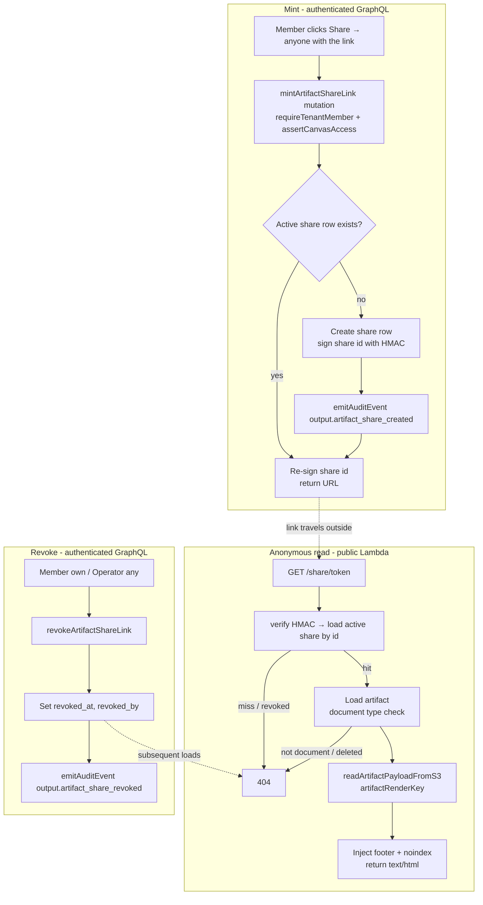

# External Share Links for Artifacts - Plan

## Goal Capsule

- **Objective:** Let workspace members share a plate-compiled document artifact outside the app via an unguessable, revocable public link — with an audience choice at share time between "workspace members only" (the existing app URL) and "anyone with the link" (a tokenized public page).
- **Product authority:** Linear THINK-208 (parent THINK-182). All product decisions were resolved with Eric on 2026-07-06; plan-level call-outs (API-host links, settings placement for the operator list, infra-level throttling) confirmed the same day.
- **Open blockers:** None.
- **Stop conditions:** Surface (don't guess) if the compliance event-type prefix CHECK cannot accommodate the new events, or if serving the render through a new public handler conflicts with the presigned-URL prohibition in a way the KTDs below don't already resolve.

---

## Product Contract

### Summary

Document artifacts gain a Share action offering two audiences: "workspace members" copies the canonical signed-in app URL, and "anyone with the link" mints a revocable tokenized URL whose unauthenticated page serves the live compiled document with a slim "Shared via ThinkWork" footer. Operators see and can revoke every public link in the tenant; revoked links 404.

### Problem Frame

Plate contracts (THINK-183/THINK-188) now produce self-contained, scriptless-safe, print-ready HTML documents — but they are trapped behind the workspace login. The artifact detail page offers Download, favorite, and Delete; the only way a document reaches a customer, board member, or teammate-without-a-seat is a downloaded file that immediately goes stale. The "portable HTML plate documents" promise is undelivered until a document can travel as a link.

### Key Decisions

- **Live links, not frozen copies.** A share link always serves the artifact's current compiled render; recompiles are visible immediately to link-holders. Freezing stays the Snapshot feature's job — someone wanting to share an exact version snapshots first. One freezing mechanism in the product, not two.
- **The authenticated link is just the app URL.** "Workspace members only" mints nothing: it copies `/artifacts/<id>`, which already enforces sign-in and tenant membership. Revocation is meaningless for members (they can navigate there anyway), so all new machinery — tokens, public route, revoke, share list — belongs to the public audience only.
- **Documents only.** Only plate-compiled document artifacts are externally shareable in v1. They alone carry the scriptless-reader-safe guarantee (DocSpector gate) that makes serving to anonymous browsers safe by construction. Canvas artifacts are script-bearing and wait for a sandboxing story.
- **Revoke-only lifecycle, no TTL.** Public links live until revoked. The operator share list plus one-click revoke covers the "kill it" need; time-based expiry can be added later without breaking existing links.
- **Member mint, operator backstop.** Any member can share a document they can access and revoke their own links; operators additionally see the tenant-wide share list and can revoke anyone's. Matches the existing operators-oversee/members-work split.
- **Minimal footer, no tenant identity.** The public page is the document full-bleed plus a slim attribution bar ("Shared via ThinkWork" + document title). The plate's design carries the page; the tenant's name is not exposed to anonymous readers unless the document content itself states it.

### Actors

- A1. **Member** — shares documents they can access; revokes their own links.
- A2. **Operator** — everything a member can do, plus tenant-wide visibility into active public links and revoke authority over all of them.
- A3. **Anonymous recipient** — opens a public link with no ThinkWork identity; sees the document read-only.

### Requirements

**Share action and audiences**

- R1. Document artifacts show a Share action on the artifact detail page; canvas artifacts do not offer public sharing.
- R2. The Share flow presents an audience choice at share time: "workspace members only" or "anyone with the link".
- R3. Choosing "workspace members only" copies the artifact's canonical app URL; it creates no share record and requires no new backend behavior.
- R4. Choosing "anyone with the link" mints an unguessable tokenized URL and copies it; the same artifact may be shared this way by the same or different members, and re-sharing surfaces the existing active link rather than silently minting duplicates.

**Public page**

- R5. The public URL serves the artifact's live compiled render — recompiles after sharing are reflected on the next load, with no frozen copy.
- R6. The public page is read-only and wears minimal chrome: the document full-bleed plus a slim footer bar with the document title and "Shared via ThinkWork"; no tenant name, no workspace navigation, no sign-in prompt.
- R7. The public route carries no PII in the URL beyond the token itself.

**Revocation and oversight**

- R8. A member can list and revoke the public links they created; an operator can list and revoke every active public link in the tenant.
- R9. A revoked or unknown token returns 404, indistinguishable from a link that never existed.
- R10. Deleting an artifact kills its public links (subsequent loads 404).

**Anti-discovery and audit**

- R11. The public route is un-indexable and enumeration-resistant: noindex/robots directives, no recoverable token material stored at rest, and basic throttling on token lookup.
- R12. Minting and revoking a public link each emit an audit event through the compliance module, attributed to the acting user.

### Key Flows

- F1. Share publicly
  - **Trigger:** Member clicks Share on a document artifact and picks "anyone with the link".
  - **Steps:** Link is minted (or the existing active link is resurfaced), copied to clipboard, and confirmed; an audit event records the mint.
  - **Covers:** R1, R2, R4, R12.
- F2. Anonymous read
  - **Trigger:** Recipient opens the public URL in any browser.
  - **Steps:** Token resolves; the current compiled document renders full-bleed with the attribution footer; printing works as the plate intends.
  - **Covers:** R5, R6, R7.
- F3. Revoke
  - **Trigger:** The sharing member (own links) or an operator (any link) revokes from the share list.
  - **Steps:** Link is revoked with an audit event; subsequent loads of that URL 404.
  - **Covers:** R8, R9, R12.

### Acceptance Examples

- AE1. **Covers R5.** Given a shared document that later recompiles with new numbers, when the recipient reloads the link, then they see the new numbers — no stale copy.
- AE2. **Covers R9.** Given a revoked link, when anyone opens it, then the response is a 404 identical to a never-minted token.
- AE3. **Covers R1.** Given a canvas artifact's detail page, when the user looks for sharing, then no "anyone with the link" option exists.
- AE4. **Covers R8.** Given member M's link and operator O, when O opens the tenant share list, then M's link is visible and O can revoke it; M sees and can revoke only their own.
- AE5. **Covers R10.** Given a shared document that is then deleted, when the recipient reloads the link, then it 404s.

### Scope Boundaries

- Canvas/interactive artifact sharing — deferred until a script-safety story exists.
- Time-based link expiry (TTL) — deferred; additive later without breaking links.
- Frozen-at-share-time copies — outside this feature's identity; Snapshots own freezing.
- Cross-tenant identified guest access ("share to a signed-in outsider") — a separate guest-access feature, not this one.
- Tenant branding on the public page (logo, custom domain) — deferred until branding config exists.
- Per-tenant policy toggle restricting who may share publicly — deferred until demand is observed.

### Dependencies / Assumptions

- Plate-compiled renders remain scriptless-reader-safe by construction (DocSpector gate) — this is the safety premise for serving them unauthenticated.
- The compiled render is self-contained (styles inline, dual-theme, print-ready), so the public page needs no app CSS/JS.
- Unauthenticated token-verified routes are an established pattern in this stack (Slack ingress, tokenized webhooks), and a hashed-token storage pattern already exists to reuse — the public route is precedented, not novel.
- The compliance audit module accepts new event types only under an allowed prefix; the new events fit under the existing `output.` prefix (KTD-7).

### Sources

- Grounding dossier (session scratch): artifact detail actions today are Download + favorite + Delete (`apps/web/src/components/artifacts/ArtifactDetailActions.tsx`); `renderHtml` is served from S3 through an access-gated resolver with presigned URLs prohibited (`packages/api/src/graphql/resolvers/artifacts/types.ts`); API Gateway routes have no gateway authorizer — all auth is in-handler, with existing unauthenticated token-verified routes as precedent (`terraform/modules/app/lambda-api/handlers.tf`); reusable hashed-token pattern (`packages/api/src/lib/email-tokens.ts`); hash-chained audit events with an event-type prefix CHECK (`packages/api/src/lib/compliance/emit.ts`, `packages/database-pg/src/schema/compliance.ts`).
- Linear: THINK-208 (this feature), THINK-182 (parent), THINK-178 (Snapshot semantics), THINK-147 (DocSpector scriptless gate).

---

## Planning Contract

**Product Contract preservation:** changed: R11 — "stored hashed at rest" became "no recoverable token material stored at rest", a clarification forced by the token-design review finding (the signed-token scheme stores no token material at all); intent unchanged. All other R/A/F/AE text is verbatim from the brainstorm. The brainstorm's "Outstanding Questions — Deferred to Planning" items are resolved as KTD-1 through KTD-9.

### Key Technical Decisions

- **KTD-1 — HMAC-signed share-id token, no recoverable token material at rest.** The token is `base64url(shareId) + "." + HMAC-SHA256(shareId, serverSecret)`, following the email-tokens pattern (`packages/api/src/lib/email-tokens.ts`). Lookup parses the share id, verifies the signature with a timing-safe compare, then requires an active (non-revoked) row. This is what makes R4's get-or-create implementable: the URL is re-derivable at any time by re-signing an existing share id — the raw token never needs to be stored or recovered. R11's "hashed at rest" is more precisely "no recoverable token material stored at rest": the DB holds the share id and the signing secret lives in Secrets Manager, so a DB read alone cannot forge a token. The signature is unguessable without the secret, covering enumeration resistance.
- **KTD-2 — Own table `artifact_shares`, one active share per artifact.** Columns: `id` (the share id the token signs over), `tenant_id` (FK cascade), `artifact_id` (FK cascade — cascade delete satisfies R10), `created_by`, `created_at`, `revoked_at`, `revoked_by`. A partial unique index on `(artifact_id) WHERE revoked_at IS NULL` enforces R4's dedupe: mint is get-or-create against the active row, and the returned URL is re-signed from the existing row's id. Pattern: `packages/database-pg/src/schema/routine-approval-tokens.ts` (partial-index-on-active precedent). No `token_hash` column — the token is a signature over the id, verified not looked-up. Hand-rolled migration (`db:generate` is retired) with `-- creates: public.artifact_shares` markers, psql-applied to dev before merge per the drift-gate learning.
- **KTD-3 — Dedicated narrow public handler, not graphql-http.** A new `artifact-share` Lambda serves `GET /share/{token}`. Per the institutional learning (`docs/solutions/best-practices/service-endpoint-vs-widening-resolvecaller-auth-2026-04-21.md`), never widen shared auth helpers for a new access path. The handler does exactly: parse token → verify HMAC signature (timing-safe) → load active share row by id → load artifact, confirm document type → read render via `artifactRenderKey` + `readArtifactPayloadFromS3` (`packages/api/src/lib/artifacts/payload-storage.ts`) → inject footer → return HTML. Any miss at any step returns the same 404 (R9). This stays consistent with the presigned-URL prohibition: the render is still served through an access-gated code path (the share row is the access grant), never via a raw S3 URL.
- **KTD-4 — Footer injected by string composition before `</body>`, all interpolated values escaped.** The render is self-contained HTML; the handler appends a scriptless, inline-styled `<footer>` fragment (document title + "Shared via ThinkWork") before the closing body tag, plus a `<meta name="robots" content="noindex">` into `<head>`, and response headers `X-Robots-Tag: noindex, nofollow` and `Referrer-Policy: no-referrer` (the token is a bearer credential in the URL — without the header, browsers leak it in `Referer` to any third-party origin the document links to). The document title is member-controlled and this injection step sits outside DocSpector's validation boundary, so every artifact-derived string is HTML-entity-escaped before interpolation. No parsing framework — the renders are DocSpector-validated single-file documents, so last-index-of `</body>` insertion is reliable; if the marker is absent, append at end.
- **KTD-5 — Share URLs are built on `THINKWORK_API_URL`.** The mint mutation returns `${apiBaseUrl}/share/${token}` using `getConfig("THINKWORK_API_URL")` (precedent: `packages/api/src/graphql/resolvers/email-channel/mutations.ts`). The env var is already injected into every handler by `terraform/modules/app/lambda-api/handlers.tf`. A prettier dedicated domain is deferred (two-pass ACM setup).
- **KTD-6 — Throttling at the API Gateway stage, not in-handler.** No throttle config exists in the stack today; add route-level throttle settings for the `GET /share/{token}` route on the `aws_apigatewayv2_stage` (modest defaults, e.g. 10 rps / 20 burst). Infra-level covers R11's enumeration resistance without inventing an in-handler rate limiter; the HMAC signature makes forgery impractical regardless.
- **KTD-7 — Audit events under the existing `output.` prefix.** New event types `output.artifact_share_created` and `output.artifact_share_revoked` added to `COMPLIANCE_EVENT_TYPES` (`packages/database-pg/src/schema/compliance.ts`). The DB CHECK is prefix-based (`output.` is allowed), so no migration is needed for the event types. Emission via `emitAuditEvent(tx, …)` inside the mutation transaction, per the emit contract.
- **KTD-8 — Authorization split.** `mintArtifactShareLink`, revoke, and the per-artifact share query require tenant membership via `requireTenantMember(ctx, tenantId)` with `tenantId` derived from the artifact row (never from args — the Google-federated caller learning), **and** the document's actual read gate: `assertCanvasAccess(ctx, artifactRow, "read")` from `packages/api/src/lib/artifacts/canvas-access.ts`, the same check `artifact.query.ts` applies — tenant membership alone would let a member publish a private-space or draft document they cannot read today. Operator list/revoke-any paths gate on `requireTenantAdmin` / `isTenantOperator` (`packages/api/src/graphql/resolvers/skill-creator/shared.ts`). Document-only enforcement (`isDocumentMetadata`) happens at mint and again in the public handler.
- **KTD-9 — CORS/OPTIONS not required for the share route.** The public page is a top-level browser navigation (no fetch from another origin), so no preflight fires; the route registers `GET` only. If an embed use case appears later, revisit — noting the OPTIONS-must-bypass-auth learning.

### High-Level Technical Design

Prose is authoritative; the diagram summarizes the three paths. Every miss branch in the read path collapses to the same 404 so revoked, deleted, non-document, and never-existed are indistinguishable (R9, R10).

### Assumptions

- The dev stage's API Gateway URL is reachable by anonymous browsers (it is — existing public routes prove it).
- Render size is acceptable to return through Lambda/API Gateway (DocSpector caps renders at 256 KB — well under Lambda's 6 MB synchronous response limit, the binding cap for a Lambda-proxied route).

---

## Implementation Units

### U1. `artifact_shares` table — schema and migration

- **Goal:** Persist public share grants with revocation state and cascade delete.
- **Requirements:** R4, R9, R10, R11 (no recoverable token material at rest).
- **Dependencies:** None.
- **Files:** `packages/database-pg/src/schema/artifact-shares.ts` (new), `packages/database-pg/src/schema/index.ts` (register), `packages/database-pg/drizzle/0221_artifact_shares.sql` (new, hand-rolled — confirm next free number at implementation time).
- **Approach:** Mirror `document-section-waivers.ts` for table shape and `routine-approval-tokens.ts` for the partial-index pattern. Columns per KTD-2 (no token column — the token is an HMAC signature over the share id, KTD-1). Indexes: partial unique on `(artifact_id) WHERE revoked_at IS NULL`; composite `(tenant_id, created_at)` for the operator list. Migration header carries `-- creates: public.artifact_shares` markers; apply to dev via `psql "$DATABASE_URL" -f` before merge (drift-gate learning).
- **Execution note:** Additive migration — apply to dev before the PR merges, never after (`docs/solutions/workflow-issues/manually-applied-drizzle-migrations-drift-from-dev-2026-04-21.md`). If typecheck degrades to implicit-`any` in a fresh worktree, delete tsbuildinfo and rebuild `@thinkwork/database-pg` first.
- **Test scenarios:** Test expectation: none — pure schema/migration; behavior is proven through U2/U3 tests against the table.
- **Verification:** `pnpm db:migrate-manual` reports the table present on dev; `pnpm --filter @thinkwork/database-pg build` and repo typecheck pass.

### U2. Share-token library and audit event types

- **Goal:** Token mint/hash primitives and the two new compliance event types.
- **Requirements:** R11, R12.
- **Dependencies:** None (parallel with U1).
- **Files:** `packages/api/src/lib/artifacts/share-tokens.ts` (new), `packages/api/src/lib/artifacts/share-tokens.test.ts` (new), `packages/database-pg/src/schema/compliance.ts` (add `output.artifact_share_created`, `output.artifact_share_revoked` to `COMPLIANCE_EVENT_TYPES`).
- **Approach:** Per KTD-1, mirror `packages/api/src/lib/email-tokens.ts`: `signShareToken(shareId): string` produces `base64url(shareId) + "." + HMAC-SHA256(shareId, secret)`; `verifyShareToken(token): shareId | null` parses, verifies with a timing-safe compare, and returns the share id (null on any malformation or signature mismatch — never throws distinguishable errors). Secret resolution follows the email-tokens secret pattern. Event types ride the existing `output.` prefix — no migration (KTD-7).
- **Test scenarios:**
  - Round trip: `verifyShareToken(signShareToken(id))` returns the id.
  - Tampered payload, tampered signature, wrong secret, and malformed input (no dot, bad base64url, empty) all return null.
  - Signing is deterministic for the same id + secret (URL re-derivable, R4).
  - Event-type strings satisfy the compliance prefix regex used by the DB CHECK.
- **Verification:** Unit tests green in `packages/api`.

### U3. GraphQL mutations and share queries

- **Goal:** `mintArtifactShareLink`, `revokeArtifactShareLink`, and share listing for members (own) and operators (tenant-wide).
- **Requirements:** R2, R4, R8, R12.
- **Dependencies:** U1, U2.
- **Files:** `packages/database-pg/graphql/types/artifacts.graphql` (extend Mutation + `ArtifactShare` type + queries), `packages/api/src/graphql/resolvers/artifacts/mintArtifactShareLink.mutation.ts` (new), `packages/api/src/graphql/resolvers/artifacts/revokeArtifactShareLink.mutation.ts` (new), `packages/api/src/graphql/resolvers/artifacts/artifactShares.query.ts` (new), `packages/api/src/graphql/resolvers/artifacts/index.ts` (register), tests alongside as `*.test.ts`; regenerate codegen in `apps/cli`, `apps/web`, `apps/mobile`, `packages/api`.
- **Approach:** Mint: load artifact → `requireTenantMember(ctx, artifact.tenant_id)` **and** `assertCanvasAccess(ctx, artifact, "read")` (row-derived tenant + the document's actual read gate, KTD-8) → reject non-document metadata → get-or-create active share (partial unique index backs the race) → sign the share id (KTD-1) and build URL from `THINKWORK_API_URL` (KTD-5) → `emitAuditEvent` in the same transaction on create. Revoke: creator may revoke own (`created_by` match), operator may revoke any (`isTenantOperator`); set `revoked_at`/`revoked_by`; emit audit event. Queries: `artifactShares(artifactId)` returns the artifact's active share to any member who passes the same access checks as mint, exposing share id, creator identity, and created_at (never a signed token — the dialog re-obtains the URL via mint's get-or-create); `tenantArtifactShares` gated by `requireTenantAdmin` for the operator list.
- **Test scenarios:**
  - Covers F1. Member mints on own-tenant document → row created, URL returned, audit event emitted with `output.artifact_share_created`.
  - Covers R4. Second mint on the same artifact returns the same active share and a working URL for it (no duplicate row) — including when the second minter is a *different* member with access.
  - Mint on a canvas artifact → rejected (document-only).
  - Mint by a caller outside the tenant → authz error, no row.
  - Mint by a tenant member who fails `assertCanvasAccess` on the artifact (private space / draft visibility) → denied, no row.
  - Covers AE4. Creator revokes own share → `revoked_at` set + audit event; non-creator member revoking it → denied; operator revoking it → succeeds.
  - Re-mint after revoke creates a fresh row, and the old token's share id no longer resolves.
  - `artifactShares(artifactId)` returns the active share with creator attribution to a non-creator member with access; denied to a member without access.
  - `tenantArtifactShares` denied for non-operator; returns all active shares for operator.
  - No query response contains a signed token.
- **Verification:** `pnpm --filter @thinkwork/api test` green; codegen regenerated in all four consumers with no typecheck drift.

### U4. Public `artifact-share` handler and terraform route

- **Goal:** Anonymous `GET /share/{token}` serves the live render with footer and noindex; every miss is a uniform 404.
- **Requirements:** R5, R6, R7, R9, R10, R11.
- **Dependencies:** U1, U2.
- **Files:** `packages/api/src/handlers/artifact-share.ts` (new), `packages/api/src/handlers/artifact-share.test.ts` (new), `terraform/modules/app/lambda-api/handlers.tf` (handler set + `"GET /share/{token}"` route + route throttle settings), `scripts/build-lambdas.sh` (`build_handler` entry).
- **Approach:** Per KTD-3/KTD-4: parse + verify token signature (U2's `verifyShareToken`) → load active share row by id → load artifact, confirm document → `readArtifactPayloadFromS3(artifactRenderKey(...))` → inject `<meta name="robots">` and the footer fragment with all artifact-derived strings HTML-entity-escaped → return `text/html; charset=utf-8` with `X-Robots-Tag: noindex, nofollow`, `Referrer-Policy: no-referrer`, and `Cache-Control: no-store`. Raw-HTML response modeled on `packages/api/src/handlers/workos-auth.ts`. All three wiring edits land together (handler set, route map, build script — the env-gated-feature learning); throttle per KTD-6. GET-only, no OPTIONS (KTD-9).
- **Execution note:** Bare handler unit tests don't prove the route — finish with a live dev check: mint via GraphQL, `curl` the URL anonymously, confirm HTML + headers, revoke, confirm 404.
- **Test scenarios:**
  - Covers F2/AE1. Valid token → 200, body contains the S3 render plus footer text "Shared via ThinkWork", headers include `X-Robots-Tag`, `Referrer-Policy: no-referrer`, and `no-store`.
  - Covers AE2. Unknown share id, revoked share, bad signature, and malformed token → identical 404 bodies/status.
  - Covers AE5. Share row whose artifact was deleted (row cascade-gone) → 404.
  - Share row pointing at a non-document artifact (defense in depth) → 404.
  - Document titled `">` → footer renders the title as inert escaped text; no unescaped artifact-derived string in the response.
  - Render missing `</body>` → footer appended at end, still 200.
  - S3 read failure → 404 without leaking key/tenant detail (assert no tenant id in body).
- **Verification:** Unit tests green; after deploy, the live curl sequence in the execution note passes on dev.

### U5. Web — Share dialog on the artifact detail page

- **Goal:** Share action with the audience choice; copy-link for both audiences; member's own active link surfaced with revoke.
- **Requirements:** R1, R2, R3, R4, R8 (member half).
- **Dependencies:** U3.
- **Files:** `apps/web/src/components/artifacts/ArtifactShareDialog.tsx` (new), `apps/web/src/components/artifacts/ArtifactShareDialog.test.tsx` (new), `apps/web/src/components/artifacts/ArtifactDetailActions.tsx` (add Share item / header button), `apps/web/src/lib/graphql-queries.ts` (mutation + query documents), `apps/web/src/routes/_authed/_shell/artifacts.$id.tsx` (wire for document artifacts only).
- **Approach:** Share renders only for document artifacts (R1). Dialog offers the two audiences: "Workspace members" copies `${window.location.origin}/artifacts/<id>` immediately (R3, no backend); "Anyone with the link" calls `mintArtifactShareLink`, copies the returned URL (`navigator.clipboard.writeText`, precedent `AutomationWebhookPanel.tsx`), and then shows the active-link row. The active-link row shows creator attribution; the Revoke button renders only when the caller is the share's creator or an operator — a non-creator member sees the creator's name and no revoke affordance (their revoke would be denied server-side anyway). Revoke is guarded by a confirmation (reuse the `AlertDialog` pattern already in `ArtifactDetailActions.tsx`) warning that existing recipients lose access immediately and a re-share mints a different URL. Mint failure shows an inline error in the dialog (e.g., "Couldn't create the link — try again") with the audience choice still active for retry — never a silent no-op. Re-open shows the existing active link (query `artifactShares`). urql doc cache does not auto-invalidate — re-execute the share query after mint/revoke (network-only refetch), per the urql learning. Follow the one-tick-deferred dialog-open pattern from `ArtifactDetailActions.tsx`.
- **Test scenarios:**
  - Covers AE3. Canvas artifact → no Share affordance rendered.
  - Document artifact → Share visible; choosing "Workspace members" writes the app URL to clipboard without calling the mint mutation.
  - Choosing "Anyone with the link" calls mint and writes the returned URL to clipboard.
  - Existing active share → dialog shows it without minting again; creator sees Revoke; a different (non-creator) member sees the creator's name and no Revoke button.
  - Revoke requires confirming the warning dialog before the mutation fires; the dialog reflects revoked state after refetch.
  - Mint mutation failure → inline error rendered, no clipboard write, retry possible.
- **Verification:** `pnpm --filter @thinkwork/web test` green; manual check in the dev web app.

### U6. Web — operator share list in settings

- **Goal:** Tenant-wide active-share list with revoke-any, operator-gated.
- **Requirements:** R8 (operator half).
- **Dependencies:** U3.
- **Files:** `apps/web/src/routes/_authed/settings.shares.tsx` (new — slot alongside existing operator settings routes; exact filename per that folder's convention), companion component + test under `apps/web/src/components/settings/`, `apps/web/src/lib/graphql-queries.ts` (tenant list query + revoke reuse).
- **Approach:** Gate with `useTenant()` (`isOperator && roleResolved`, pattern `artifacts.$id.tsx:129`). Table: document title (link to artifact), shared-by, created date, Revoke action (inline, visible, outline — per the row-action convention). Revoke goes through the same confirmation warning as U5 (recipients lose access immediately). When no active shares exist, show an explanatory empty state (e.g., "No public share links yet — members create them from a document's Share action") instead of a bare table. List shows active shares; refetch after revoke.
- **Test scenarios:**
  - Non-operator → page inaccessible/empty state.
  - Zero active shares → explanatory empty state rendered, no bare table.
  - Operator sees shares created by other members (covers AE4 operator half).
  - Revoke requires confirmation, then removes the row after refetch.
- **Verification:** `pnpm --filter @thinkwork/web test` green; manual dev check with an operator account.

---

## Verification Contract

| Gate | Command / check | Applies to |
|---|---|---|
| API unit + integration tests | `pnpm --filter @thinkwork/api test` | U2, U3, U4 |
| Database build + typecheck | `pnpm --filter @thinkwork/database-pg build` then `pnpm -r --if-present typecheck` | U1, U3 |
| Web tests | `pnpm --filter @thinkwork/web test` | U5, U6 |
| Codegen freshness | `pnpm --filter @thinkwork/<cli|web|mobile|api> codegen` after the .graphql change; no uncommitted diff afterwards | U3 |
| Migration drift | `pnpm db:migrate-manual` reports `public.artifact_shares` present on dev | U1 |
| Live E2E on dev | Mint via GraphQL as a member; open the URL in an unauthenticated browser/curl (200 + footer + noindex headers); revoke; reload → 404; AE1 spot-check after a recompile | U3, U4, U5 |
| Lint/format pre-commit | `pnpm lint && pnpm format:check` | all |

Behavioral note: web UI changes ship to app.thinkwork.ai only on a `desktop-v*` canary tag; the Lambda/API side deploys on merge to `main`. The live E2E gate runs against dev, which is continuous-CD from main.

## Definition of Done

- All six units landed with their test scenarios green; full package suites (`pnpm --filter @thinkwork/api test`, `pnpm --filter @thinkwork/web test`) pass, not just touched files.
- Migration applied to dev and reported present by the drift reporter before merge.
- Live E2E sequence (mint → anonymous read → revoke → 404) verified on dev, including AE1 (recompile visible through the link) and AE2 (revoked = never-existed 404).
- Audit events for one mint and one revoke visible in `compliance.audit_events` with the new `output.artifact_share_*` types.
- No abandoned experimental code in the diff; worktree and branch cleaned up after merge.
