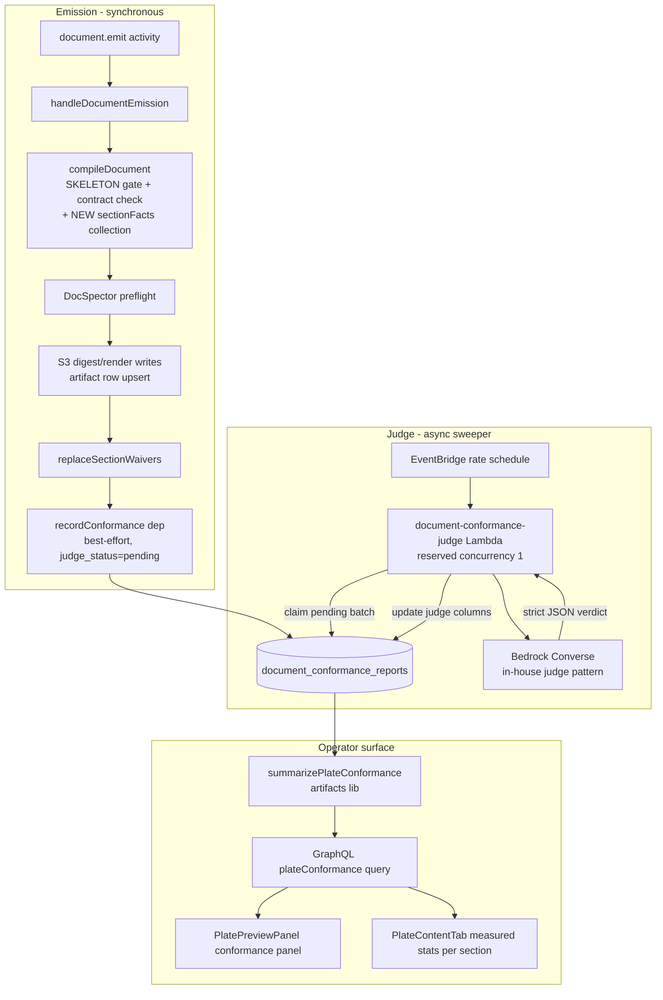

# Plate Conformance Evaluator - Plan

Linear: THINK-189 (parent THINK-182). Depends on THINK-183 (Contract Spine, shipped) and THINK-188 (contract editor, shipped).

---

## Goal Capsule

- **Objective:** Every document emission records a conformance report against its plate's section manifest — sections present/missing/waived, suggested directives used or skipped, declared analyses computed vs. numbers merely asserted, thin sections — aggregated per plate so operators see facts like "sales-rep-review omits the funnel in 40% of runs" and the `suggested` tier gains a **measured** display state.
- **Authority:** This plan > repo conventions (CLAUDE.md) > implementer judgment on details the plan leaves open. Measurement never gates emission — if a trade-off arises between conformance fidelity and emission reliability, emission wins.
- **Execution profile:** Worktree off `origin/main`, PRs to `main`, migration psql-applied to dev before merge, full package suites before each PR.
- **Stop conditions:** Surface (don't guess) if: the compositor seam can't expose section facts without changing compile semantics; the judge can't produce parseable verdicts at acceptable cost; or scope pressure pushes toward contract-evolution proposals (explicitly deferred).

---

## Product Contract

### Summary

Add a two-layer conformance pipeline to document emission: a deterministic structural layer computed inside the existing compile path (free, always trustworthy) and an asynchronous LLM-judge layer for the fuzzy signals (thin sections, asserted-not-computed numbers), stored one report per emission and aggregated per plate for the operator Plates surface.

### Problem Frame

THINK-183 made plate contracts enforceable at the `required` tier: a required section missing without a waiver rejects the compile. But the `suggested` tier — most of every manifest — is invisible. DocSpector is binary and structural; nothing records whether an emission used the funnel directive, computed the declared analyses, or wrote three sentences under a heading and moved on. Tier decisions (promote a suggested section to required, demote a never-used one) are therefore permanent guesses, and the original dogfood miss ("sales-rep-review didn't include the funnel chart") can't even be stated as a rate. The SKELETON gate already forces id-anchored headings on every document, so per-plate structural corpora are machine-comparable — the data is being computed at compile time and thrown away.

### Requirements

**Capture**

- R1. Every successful document emission whose resolved plate carries a section manifest produces a conformance report recording, per manifest section: present / missing / waived (with tier), body size, suggested directives used vs. skipped, and declared analyses computed (rendered via `tw:analysis`) vs. absent.
- R2. Reports append one-per-emission (a corpus over runs), keyed to tenant, artifact, and plate slug — unlike waivers, which keep only head state.
- R3. Conformance recording is best-effort and never blocks, fails, or delays an emission; a recording failure logs and the emission proceeds unchanged.
- R4. Plates without a section manifest (the four core plates) execute zero conformance code paths — same inertness contract as THINK-183's AE4.

**Judgment**

- R5. An asynchronous judge pass scores each pending report for the signals structure can't capture: sections that are present but thin, and prose asserting computed-looking numbers in sections whose plate declares an analysis that was not rendered. Judge findings are booleans with short reasoning, never percentages.
- R6. Judge results are stored on the same report row, visibly separate from the deterministic facts (own columns, own status lifecycle: pending → complete | error | skipped), so a judge outage degrades the dashboard to structural-only rather than corrupting it.

**Aggregation & surface**

- R7. Operators can see, per plate and per manifest section, aggregate rates over the report corpus: present %, waived %, missing %, suggested-directive usage %, analysis-computed %, and judged-thin % — with run counts so small samples read as small.
- R8. The plate contract editor shows the measured state per section: a suggested section with usage data displays its rates inline, giving operators the evidence base for tier decisions. No automatic tier changes.

### Acceptance Examples

- AE1. **Given** the `sales-rep-review` plate and an emission whose digest includes the `pipeline-health` heading but no `funnel` directive, **when** the emission lands, **then** the report marks `pipeline-health` present, its suggested `funnel` directive skipped, and the `funnel_conversion` analysis not computed.
- AE2. **Given** ten reports for a plate where four omit a suggested directive, **when** the operator opens that plate's conformance view, **then** the section row shows 60% directive usage over 10 runs.
- AE3. **Given** a report whose section prose states "conversion improved 40%" while the plate declares a `funnel_conversion` analysis that was not rendered, **when** the judge pass completes, **then** the report carries an asserted-not-computed finding naming that section.
- AE4. **Given** Bedrock is unavailable, **when** emissions land, **then** structural reports still record and aggregate; judge status stays pending/error and the UI labels judge-derived columns as unavailable rather than zero.
- AE5. **Given** an emission on a core plate with no manifest, **when** it lands, **then** no conformance report row exists for it.

### Scope Boundaries

- **Deferred to follow-up work:** usage-driven contract evolution (runs proposing manifest edits for operator accept) — the issue explicitly defers it; automatic tier promotion/demotion; backfill of pre-existing documents (possible later by recompiling stored digests, not in v1); per-document conformance display on the artifact detail page; retention/compaction policy for the report corpus (note ops implications, act later).
- **Out of scope:** canvas artifacts (documents only); activating the dormant AgentCore-evaluator engine; any change to compile enforcement semantics — the `required` tier gate stays exactly as THINK-183 shipped it.

---

## Planning Contract

### Key Technical Decisions

- KTD1. **Two layers, never blended.** The deterministic layer is computed inside `compileDocument` (where heading ids, directives, and analyses are already walked) and recorded synchronously at the emission seam. The judge layer runs asynchronously and writes to separate columns. There is **no composite "conformance score"** — the product is per-section rates and labeled judge findings. This is the direct answer to the calibration risk: structural facts are trustworthy on day one; judge booleans are advisory and visibly labeled; nothing asks anyone to trust an uncalibrated percentage.
- KTD2. **Surface section facts from the compositor, don't re-parse.** `CompositorResult`'s ok branch grows a `sectionFacts` payload (per-heading: id, body char count, directives rendered under it with kinds, analyses computed). The compositor already collects `state.headingIds` via the slugger and routes every directive — this exposes what compile already knows instead of recompiling stored digests later. Contract-less plates skip fact collection entirely (R4).
- KTD3. **Judge = the evals stack's in-house Bedrock judge pattern.** The issue's "Bedrock AgentCore Evaluations stack" doctrine is honored by reusing that stack's real engine: mirror `invokeBedrockLlmJudge` / `parseEvalJudgeVerdict` in `packages/api/src/lib/evals/engines/in-house.ts` — Converse API, temperature 0, untrusted content in delimited tags, strict JSON verdict parsing that rejects extra keys, `resolveEvalJudgeModelId` model resolution (Haiku default). The AgentCore-evaluator engine remains the inert activation seam it already is. No Mastra/promptfoo.
- KTD4. **Judge runs as a sweeper, not an invoke chain.** A scheduled Lambda (EventBridge rate, reserved concurrency 1 — the `compliance-outbox-drainer` pattern) claims reports with `judge_status = 'pending'` and processes a bounded batch per tick. Rationale over Event-invoking from the emission seam: durable retries for free (row stays pending on crash), zero new invoke coupling in the emission path, idempotent by construction (claim via conditional UPDATE), and it respects the async-retry lessons (no fire-and-forget invoke fan-out). Dashboard latency of a few minutes is acceptable for an aggregate view.
- KTD5. **One judge call per report, not per section.** Input = digest markdown + the manifest slice (section ids, tiers, guidance, declared analyses); output = one strict-JSON verdict listing thin sections and asserted-not-computed findings. Bounded tokens, one Bedrock call per emission.
- KTD6. **New table, not `eval_results`.** The evals tables model dev-authored test cases scored against datasets; this is per-emission telemetry keyed by artifact + plate. A sibling table with head-free append semantics keeps both subsystems clean. Aggregation lives next to `summarizePlateWaivers` in the artifacts lib, which THINK-183 explicitly built as "the THINK-189 conformance seam."
- KTD7. **No new env vars on `graphql-http`.** The judge model env var lives on the new sweeper Lambda only (the 4KB env ceiling on `graphql-http` is a known deploy blocker). The deterministic layer needs no configuration.

### High-Level Technical Design

Report row shape (directional): identity (`tenant_id`, `artifact_id` FK cascade, `plate_slug`, `document_status`, `created_at`), **digest pin** (`digest_revision` — the content-addressed digest key/contentHash from the emission's pin, so the judge scores the exact digest this report describes rather than the mutable S3 head), a **manifest snapshot** (`manifest_snapshot` jsonb — the judge-relevant slice of the resolved plate at record time: section ids, tiers, guidance, declared analyses — so later plate edits don't skew judgment of older reports), deterministic facts as one jsonb `sections` array (per manifest section: status, tier, body chars, suggested directives used/skipped, analyses computed/absent), and judge columns (`judge_status`, `judge_attempts int NOT NULL DEFAULT 0`, `judge_model`, `judge_findings` jsonb, `judge_completed_at`, `judge_error`).

### Sequencing

U1 → U2 → U3 land the deterministic layer end-to-end (recordable immediately). U4 + U5 add the judge. U6 → U7 add aggregation and UI. The deterministic layer is independently shippable and valuable; the judge and UI stack on top without reworking it.

---

## Implementation Units

### U1. Compositor surfaces section facts

- **Goal:** `compileDocument`'s ok result carries the per-section facts conformance needs, collected during the existing token walk.
- **Requirements:** R1, R4 (enables), KTD2.
- **Dependencies:** none.
- **Files:** `packages/api/src/lib/artifacts/document-compositor.ts`, `packages/api/src/lib/artifacts/document-compositor.test.ts`.
- **Approach:** Track the current section id while walking rendered tokens (headings advance it via the existing slugger). Accumulate per-section body char counts and the directives/analyses rendered under each section. **Attribution rule:** a heading whose id is not in the manifest does not open its own fact bucket — its body content attributes to the nearest preceding manifest section at a shallower or equal depth (i.e., nested subheadings under a manifest h2 count toward that section; a stray top-level heading's content attributes to no section). Implement in the same single lexer/token pass — no re-parse. On ok, when the plate has a manifest, join against `plate.sections`/`plate.analyses` to produce `sectionFacts`; when the plate has no manifest, return the result exactly as today (no new allocation, no behavior change). Compile failure paths are untouched.
- **Patterns to follow:** the existing `state.headingIds` + `state.waivers` collection in `compileDocument`; the manifest join in the post-parse contract check (same file).
- **Test scenarios:**
  - Covers AE1. Manifest plate, digest with `pipeline-health` heading and no funnel directive → facts mark section present, suggested directive skipped, declared analysis not computed.
  - Manifest plate where `tw:analysis` renders a declared analysis → facts mark it computed.
  - Waived section → facts mark it waived with tier, body chars 0.
  - Extra heading not in the manifest → not in facts (facts are manifest-shaped), but present headings still counted for their own sections.
  - Covers AE5. Contract-less plate → result has no `sectionFacts`; existing compositor snapshot tests unchanged.
  - Duplicate heading slugs (slugger `-1` suffix) attribute body content to the correct manifest section only for the exact-id match.
  - Nested subheading (h3 under a manifest h2) → its body chars attribute to the enclosing manifest section, not dropped and not a phantom section.
- **Verification:** `npx vitest run src/lib/artifacts/document-compositor.test.ts` green; full `pnpm --filter @thinkwork/api test` green.

### U2. `document_conformance_reports` table

- **Goal:** Durable append-per-emission storage for reports.
- **Requirements:** R2, R6, KTD6.
- **Dependencies:** none.
- **Files:** `packages/database-pg/src/schema/document-conformance-reports.ts` (new), `packages/database-pg/src/schema/index.ts`, `packages/database-pg/drizzle/0223_document_conformance_reports.sql` (new — verify next unused number at implementation; 0221/0222 shipped in THINK-208 and may not be in the local checkout).
- **Approach:** Hand-rolled migration mirroring `0219_document_section_waivers.sql`: `-- creates: public.document_conformance_reports` marker, `CREATE TABLE IF NOT EXISTS`, tenant/artifact FKs with CASCADE, CHECK constraint on `judge_status` (`pending|complete|error|skipped` — exactly these four; U4 never writes any other value), `judge_attempts int NOT NULL DEFAULT 0`, `digest_revision text NOT NULL` (content-addressed digest pin), `manifest_snapshot jsonb NOT NULL` (judge-relevant manifest slice at record time; include the plate's manifest revision identifier when available so aggregates can note manifest-version mixing), indexes on `(tenant_id, plate_slug, created_at)` and a partial index on `judge_status = 'pending'` for the sweeper. Apply to dev via psql before the PR merges (drift gate).
- **Patterns to follow:** `document-section-waivers.ts` schema file; `eval_results` for scored-jsonb conventions.
- **Test scenarios:** Test expectation: none — schema + migration only; behavior covered by U3/U4 tests against the drizzle schema.
- **Verification:** `pnpm db:migrate-manual` reports the table present on dev after psql apply; `pnpm --filter @thinkwork/database-pg build` green.

### U3. Deterministic recorder at the emission seam

- **Goal:** Every manifest-plate emission writes a report row with structural facts and `judge_status = 'pending'`, best-effort.
- **Requirements:** R1, R2, R3, R4.
- **Dependencies:** U1, U2.
- **Files:** `packages/api/src/lib/artifacts/document-conformance.ts` (new — recorder + row shape), `packages/api/src/lib/artifacts/document-emission.ts`, `packages/api/src/lib/artifacts/document-emission.test.ts`, `packages/api/src/lib/artifacts/document-conformance.test.ts` (new).
- **Approach:** New injected dep `recordConformance` on `DocumentEmissionDeps` (mirror `replaceSectionWaivers`'s injection and drizzle impl). Call it after the waiver rewrite, only when `plate.sections?.length > 0`, wrapped so failures log and never propagate (mirror the best-effort memory-ingest `.catch()` posture, but awaited — an INSERT is fast and fire-and-forget promises die at Lambda freeze). Stamp `digest_revision` from the emission's content-addressed digest pin (the same revision key the digest write produced — never the head key) and `manifest_snapshot` from the resolved plate's judge-relevant slice at record time. Judge status starts `pending` when the plate manifest declares anything judgeable, else `skipped` — "judgeable" = the manifest has at least one section with guidance or at least one declared analysis (the judge's two finding types both need one of those to anchor on).
- **Patterns to follow:** `replaceSectionWaivers` dep + drizzle implementation in `document-emission.ts`.
- **Test scenarios:**
  - Manifest plate emission → `recordConformance` called with facts joined from the compositor result; row insert shape correct.
  - Covers AE5. Core plate emission → `recordConformance` not called.
  - Covers R3. `recordConformance` throws → emission still returns success; error logged.
  - Draft vs. finalized emission both record (report carries `document_status`).
  - Two emissions of the same document → two rows (append, not head-rewrite).
- **Verification:** full `pnpm --filter @thinkwork/api test` green; typecheck green.

### U4. Judge sweeper handler

- **Goal:** Pending reports get judged for thin sections and asserted-not-computed findings via one Bedrock call each.
- **Requirements:** R5, R6, KTD3, KTD4, KTD5.
- **Dependencies:** U2, U3.
- **Files:** `packages/api/src/handlers/document-conformance-judge.ts` (new), `packages/api/src/handlers/document-conformance-judge.test.ts` (new), `packages/api/src/lib/artifacts/conformance-judge.ts` (new — prompt build, verdict parse, judge invocation).
- **Approach:** Handler selects a bounded batch (e.g., 10) of pending rows and uses **direct process-and-complete** — no in-flight claim state (an in-flight value would violate U2's four-value CHECK constraint; reserved concurrency 1 makes the single-writer form safe). At batch start, increment `judge_attempts` on the selected rows in the same UPDATE that selects them, so a crash mid-batch still counts the attempt. For each row: load the digest markdown from S3 via the row's **`digest_revision` content-addressed key** (never the mutable head key — the artifact may have recompiled since), enforce a digest size cap before prompting (mirror the ~2MB thread-snapshot truncation convention; over-cap → truncate with a marker, judge what fits), build the judge prompt from the digest and the row's **`manifest_snapshot`** (not the live plate, which may have been edited) inside delimited tags, invoke Converse with the in-house judge conventions (temperature 0, bounded maxTokens, `resolveEvalJudgeModelId` with a Lambda-local env override), parse a strict JSON verdict (`{thinSections: [{sectionId, reasoning}], assertedNotComputed: [{sectionId, claim}]}` — reject unexpected shapes), write judge columns. Throttles leave the row pending for the next tick; non-retryable errors set `judge_status = 'error'` with a truncated message. Attempt cap: rows whose `judge_attempts` exceeds the cap (e.g., 5) are marked `error` instead of re-processed, so poison rows can't loop forever.
- **Patterns to follow:** `packages/api/src/lib/evals/engines/in-house.ts` (`invokeBedrockLlmJudge`, `parseEvalJudgeVerdict`, prompt-injection tag discipline); `packages/lambda`'s compliance-outbox-drainer for the sweeper loop shape; `packages/api/src/lib/evals/retryable.ts` for retry classification.
- **Test scenarios:**
  - Covers AE3. Verdict with an asserted-not-computed finding → row updated complete with findings.
  - Clean verdict (no findings) → complete with empty findings.
  - Malformed/extra-key model output → row marked error, message truncated, no throw.
  - Covers AE4. Bedrock throttle → row stays pending; non-retryable Bedrock error → error status.
  - Attempt cap reached → error, never re-claimed.
  - Empty pending set → no Bedrock calls.
  - Two reports for the same artifact (recompiled between) → each judged against its own `digest_revision` digest, not the shared head.
  - Over-cap digest → truncated with marker before prompting; verdict still parses and writes.
- **Verification:** `npx vitest run src/handlers/document-conformance-judge.test.ts` green; full api suite green.

### U5. Infrastructure wiring for the sweeper

- **Goal:** The judge Lambda builds, deploys, and runs on schedule with the IAM it needs.
- **Requirements:** R5 (operationalizes), KTD4, KTD7.
- **Dependencies:** U4.
- **Files:** `scripts/build-lambdas.sh` (handler entry + add to the `BUNDLED_AGENTCORE_ESBUILD_FLAGS` list — it imports db/schema chains), `terraform/modules/app/lambda-api/` (new scheduled-Lambda resources: function, `aws_scheduler_schedule` rate schedule — the drainer's actual mechanism, not an EventBridge rule — reserved concurrency 1, bedrock-runtime InvokeModel IAM, DB secret access, judge-model env var on this function only).
- **Approach:** Mirror the existing scheduled/drainer Lambda terraform shape (compliance outbox drainer). Rate: every 2 minutes. `MaximumRetryAttempts = 0` on any async config — the sweeper's own next tick is the retry. **IAM:** grant Bedrock access by reusing the existing `api_ai_statements` scoping in `iam-grouped.tf` (same model-ARN scoping discipline), not a fresh broad `bedrock:InvokeModel *` statement.
- **Patterns to follow:** compliance-outbox-drainer terraform + build entries; THINK-208's `artifact-share` bundling fix for the esbuild flags gotcha.
- **Test scenarios:** Test expectation: none — infra; proven by the live smoke in the Verification Contract.
- **Verification:** `terraform validate` green; post-deploy, CloudWatch shows the sweeper ticking and a seeded pending row transitions to complete on dev.

### U6. Aggregation lib + GraphQL surface

- **Goal:** Per-plate, per-section aggregate rates queryable by operators.
- **Requirements:** R7, R8 (data), KTD6.
- **Dependencies:** U2 (schema); U3 usefully (data).
- **Files:** `packages/api/src/lib/artifacts/document-conformance.ts` (extend: `summarizePlateConformance`), `packages/api/src/lib/artifacts/document-conformance.test.ts`, `packages/database-pg/graphql/types/document-plates.graphql`, `packages/api/src/graphql/resolvers/document-plates/plateConformance.query.ts` (new), `packages/api/src/graphql/resolvers/document-plates/index.ts` + `packages/api/src/graphql/resolvers/index.ts` (register), plus codegen outputs in `packages/api` and `apps/web`.
- **Approach:** SQL aggregation over the jsonb `sections` array grouped by plate slug + section id, returning per-section: run count, present/missing/waived rates, suggested-directive usage rate, analysis-computed rate, judged-thin rate with judged-run count (judge coverage may lag structural coverage — expose both denominators, R7/AE4). GraphQL query `plateConformance(tenantId, plateSlug)` gated like `documentPlates` reads (`requirePlateReader` conventions); never expose digest content. Run `pnpm schema:build` + consumer codegen after the type edits.
- **Patterns to follow:** `summarizePlateWaivers` in `document-waivers.ts` (injectable read store); `documentPlates.query.ts` resolver + `shared.ts` gating.
- **Test scenarios:**
  - Covers AE2. Ten reports, four skipping a suggested directive → 60% usage, run count 10.
  - Covers AE4. Mixed judge statuses → thin rate computed over judged rows only, both denominators returned.
  - Plate filter + tenant isolation (other tenant's reports excluded).
  - No reports → empty summary, not an error.
  - Resolver authz: non-member rejected.
- **Verification:** api suite + typecheck green; `pnpm schema:build` produces a clean AppSync schema diff; codegen clean in both consumers.

### U7. Operator UI — conformance panel + measured section stats

- **Goal:** Operators see per-plate conformance aggregates, and the contract editor shows each section's measured usage.
- **Requirements:** R7, R8.
- **Dependencies:** U6.
- **Files:** `apps/web/src/components/artifacts/plates/PlateConformancePanel.tsx` (new + test), `apps/web/src/components/artifacts/plates/PlatePreviewPanel.tsx`, `apps/web/src/components/artifacts/plates/PlateContentTab.tsx`, `apps/web/src/lib/graphql-queries.ts`.
- **Approach:** Conformance panel reached via a **tab strip** in the plate detail surface (`PlatePreviewPanel` grows tabs; the existing preview/content view is the default tab, Conformance is a sibling tab — no modal, no route change): per-section rows showing the aggregate rates with run counts, judge-derived columns labeled and showing an unavailable state when judged-run count is 0 (AE4). **Partial judge coverage** displays the rate with an explicit denominator caveat ("thin in 2 of 7 judged runs" when 10 runs exist) — never a bare percentage over a silently smaller denominator. In `PlateContentTab`, suggested-tier section rows render their measured stats inline (compact: "used in 6/10 runs") — display only, no tier mutation affordances. Plates with zero reports show a "not yet measured" state, distinct from 0%. Match the existing Work-Items-style list conventions and the tab/panel idioms already in the plates components.
- **Patterns to follow:** `PlateContentTab` section-row rendering (THINK-188); `SettingsArtifactShares` table shape (THINK-208) for the aggregate table.
- **Test scenarios:**
  - Panel renders section rows with rates and run counts from mocked query data.
  - Covers AE4. Zero judged runs → judge columns show unavailable label, not 0%.
  - Empty corpus → empty state ("no emissions measured yet"), no crash.
  - Suggested section in the content tab shows measured stats; required section shows present-rate context without usage framing.
  - Query in flight → loading state; query error → error message rendered (mirror `PlatePreviewPanel`'s existing fetching/errorMessage seam), no blank panel.
- **Verification:** `pnpm --filter @thinkwork/web test` green; typecheck green; visual pass on the dev server.

---

## Verification Contract

| Gate | Command / check | Applies to |
|---|---|---|
| API tests | `pnpm --filter @thinkwork/api test` (full suite) | U1, U3, U4, U6 |
| Web tests | `pnpm --filter @thinkwork/web test` | U7 |
| Typecheck | `pnpm -r --if-present typecheck` | all |
| Schema/codegen | `pnpm schema:build`; `pnpm --filter <consumer> codegen` for api + web after GraphQL edits | U6 |
| Migration | psql-apply `0223_*.sql` to dev; `pnpm db:migrate-manual` shows no drift | U2 |
| Terraform | `terraform validate`; deploy via merge pipeline | U5 |
| Live smoke (dev) | Emit a `sales-rep-review` document via a real agent turn omitting the funnel; verify: report row with correct structural facts (AE1) → sweeper completes judge pass within ~5 min → `plateConformance` returns rates → panel + measured stats render in the web UI | end-to-end |

The live smoke is the plan's proof — a bare unit-test pass does not close the issue (pixels gate UI claims; bare Lambda invokes are not E2E).

---

## Definition of Done

- All seven units implemented, tested, and merged to `main` via PRs; post-merge Deploy runs watched green.
- Migration applied to dev; drift gate clean.
- Live smoke on dev passes end-to-end, including the AE1 dogfood-miss scenario producing the exact fact it was designed to capture.
- Emission latency and reliability unchanged: no new failure mode in the emission path (R3 verified by the throwing-recorder test and by the emission suite staying green).
- Judge outage degrades gracefully (AE4 verified live by pausing the sweeper or observing pending states).
- No abandoned experimental code in the final diffs; worktree and branches cleaned up after merge.
- Linear THINK-189 closed with evidence (report row sample, panel screenshot, aggregate query output).

---

## Sources & Research

- `docs/plans/2026-07-06-001-feat-plate-contract-spine-plan.md` — THINK-183 data model; its scope boundary explicitly leaves scoring/diffing to this issue, and `document-waivers.ts` is labeled the THINK-189 seam.
- `packages/api/src/lib/artifacts/document-compositor.ts` — `headingSlug`, `makeSlugger`, the post-parse contract check, and the internal `state.headingIds` this plan surfaces.
- `packages/api/src/lib/evals/engines/in-house.ts` — the judge pattern (KTD3); `engines/agentcore.ts` confirms the AgentCore-evaluator engine is an inert activation seam, so "the evals stack" in practice means this judge.
- `docs/solutions/diagnostics/eval-runner-stall-findings-2026-05-16.md` — per-item batch work stalling in one Lambda; motivates the bounded-batch sweeper.
- `docs/solutions/workflow-issues/manually-applied-drizzle-migrations-drift-from-dev-2026-04-21.md` — migration convention U2 follows.
- `packages/database-pg/drizzle/0219_document_section_waivers.sql` + `document-section-waivers.ts` — the table/migration shape U2 mirrors.
