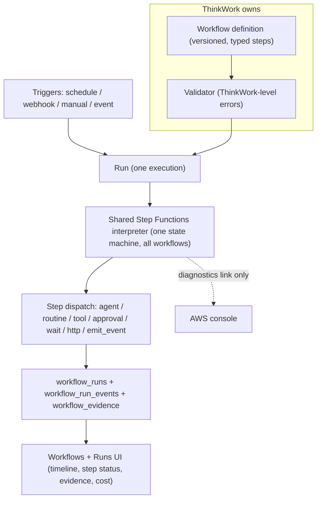

# Canonical Workflow Run Model - Plan

## Goal Capsule

- **Objective:** Collapse ThinkWork's overlapping workflow/loop concepts (Routines, Workflows, Automations, AgentLoops, n8n bridge) into one canonical model — Workflow as the single product noun, one shared Step Functions interpreter as the executor, the existing `workflow_runs` ledger as the only run record, and one Workflows + Runs UI.
- **Product authority:** Linear THINK-213 plus the decisions recorded in Key Decisions below (resolved with Eric on 2026-07-07). Where this doc deviates from the ticket (interpreter instead of compile-to-ASL), this doc wins.
- **Open blockers:** None. Outstanding Questions lists two items to settle before or during planning.

---

## Product Contract

### Summary

Make **Workflow** the only user-facing noun for multi-step work: an Automation becomes a workflow with a trigger, a Loop becomes a workflow with a continuation policy. Every workflow runs as an execution of one shared Step Functions interpreter that reads a ThinkWork-owned definition and writes each step into the existing `workflow_runs` ledger. One Workflows section (workflow list + unified Runs view) replaces the five surfaces operators use today, and the n8n bridge is deleted in favor of generic webhook triggers and HTTP steps.

**Customer explanation (vocabulary test):** A ThinkWork workflow is a series of steps — agent tasks, deterministic routines, approvals, waits, and API calls — that your team defines once and runs on a schedule, from a webhook, or by hand. Every run shows up in one place with its steps, status, inputs, outputs, evidence, and cost, so you always know what ran, why it started, and what it did. A workflow can also loop: it keeps working toward a goal, checks its own evidence, and stops when it's done, hits its budget, or needs a human.

### Problem Frame

Six concepts currently claim the "multi-step work" space: Routines (per-routine Step Functions state machines), Workflows (a control plane from THINK-59), Automations (the THINK-137 Trigger→Target rebuild on the `agent_loops` runtime), AgentLoops (that runtime's ledger), Pi goal mode, and the n8n bridge. Each made sense locally; together they mean three parallel run ledgers, five separate route trees for run/definition UI, and no single answer to "what is running right now." The operator's practical recourse for debugging is the AWS console, and the product story cannot be explained to a customer in one paragraph. THINK-46 and THINK-59 each crowned a different primary noun (Automation vs Workflow), so even internal vocabulary disagrees.

The convergence is further along than the ticket assumed: the canonical ledger (`workflow_runs`, `workflow_run_events`, `workflow_evidence`) and an adapter layer already exist, and routine executions already project into it. The unification gap is Automations/AgentLoops, the executor shape, the n8n boundary, and the UI.

### Key Decisions

- **Workflow is the single product noun; "automation" becomes a verb and a badge.** An Automation is a workflow with a trigger; UI copy may say "Automate this workflow" or show an "Automated" filter, but no surface presents Automation as an object. Chosen over keeping Automation user-facing because the noun should not be named after one property (its trigger), it composes with the existing ledger vocabulary, and it reads cleanly at the n8n boundary ("your n8n workflows stay in n8n").
- **Loop is a workflow with a continuation policy, not a first-class object.** The policy carries exit signal, budget, autonomy level, and oversight checkpoints; looping workflows show a "Looping" badge and iteration history in the run view. Resolves the ticket's open question in line with its stated bias.
- **One shared interpreter state machine executes all workflows; no per-workflow ASL compilation.** A single static Step Functions machine reads the next step from the workflow version's definition, dispatches it, records the result in the ledger, and advances. Creating or editing a workflow is a database write — no state machines, aliases, or IAM minted per workflow. The ticket's "compiler" shrinks to a validator (typed step checking with ThinkWork-level errors) plus a step-dispatch table. This structurally guarantees the ticket's rules that Step Functions never owns the product model and ASL is never the authoring surface. Trade-off accepted: the shared machine's execution history is generic, so the ThinkWork run UI is load-bearing, not polish.
- **Routines are demoted to a step target, unchanged internally.** Their compiled per-routine state machines remain the deterministic hot path; a workflow invokes one as a `routine` step. Routines lose their own navigation, not their engine.
- **The Workflow Canvas renders the ThinkWork definition, not ASL.** The existing canvas work survives with its input retargeted to the definition schema.
- **n8n is re-scoped to an external app: plugin App UI for viewing, generic surface for integration.** n8n starts ThinkWork work through the same webhook triggers as any HTTP caller and gets resumed through an outbound HTTP step calling its wait-webhook. All n8n-specific bridge machinery is deleted. Confirmed safe: no production flows depend on the bridge.
- **The Runs view shows workflow runs only.** Ad-hoc thread turns and internal system jobs stay out of the ledger; other activity can join later by becoming workflow steps.
- **No pluggable workflow-backend abstraction in v1.** Step Functions is the executor as an implementation detail; ThinkWork owns the definition, validation, run status, evidence, and UI. No `WorkflowEngine` interface, no backend selection.

### Actors

- A1. **Operator** — defines workflows, watches the Runs view, debugs failures without the AWS console. Primary beneficiary.
- A2. **End user** — starts manual runs, answers approval checkpoints, reads run outcomes.
- A3. **Agent (Pi)** — executes `agent` steps as goal-mode work; its evidence lands on the step.
- A4. **External caller (n8n or any HTTP client)** — starts workflows via webhook triggers, receives results via HTTP steps.

### Requirements

**Vocabulary and model**

- R1. Workflow, Run, Step, Trigger, and Evidence are the only user-facing nouns; Automation and AgentLoop disappear from navigation, page copy, and new user-facing API surface.
- R2. A workflow definition is a versioned, ThinkWork-owned document of typed steps; the v1 step taxonomy covers at least `agent`, `routine`, `tool`, `approval`, `wait`, `http`, and `emit_event`.
- R3. A continuation policy (exit signal, budget, autonomy level, oversight checkpoints) is an optional part of a workflow definition; a workflow with one is presented as "looping" but is not a separate object.
- R4. Validation reports errors in ThinkWork terms (step, field, reason) — never raw ASL or Step Functions vocabulary.

**Execution**

- R5. All workflow runs execute through one shared interpreter state machine per stage; creating, editing, or versioning a workflow provisions no per-workflow AWS resources.
- R6. Routine steps invoke the routine's existing engine (compiled state machine or git_python Lambda) unchanged; routine internals are out of scope.
- R7. Approvals and external waits use task-token-style suspension so a run can wait for a human or an external system without burning compute.
- R8. Loop continuation is evaluated inside the run: after each iteration the policy decides `complete`, `continue`, or `human_needed`, and the decision is recorded as a step with its evidence.

**Run ledger and projection**

- R9. Every run of every workflow — scheduled, webhook, manual, or looping — creates a `workflow_runs` record with versioned inputs, step states, outputs, and evidence; ThinkWork's ledger is the canonical run status, never the Step Functions execution state.
- R10. Automations' runtime history (today's `agent_loop_runs` / `agent_loop_iterations`) converges into the workflow run ledger; after migration there is exactly one run ledger.
- R11. Step Functions execution details (execution ARN, raw history) attach to the run as diagnostics evidence, linked but never required for normal operation.

**Triggers**

- R12. Triggers (schedule, webhook, manual, event) bind to a workflow and record trigger family and source on each run; a trigger is a property of the workflow, not an object with its own surface.
- R13. Webhook triggers accept an arbitrary caller payload and expose it to the run's input mapping, sufficient for an external engine to pass a callback URL for later resumption.

**n8n boundary**

- R14. The n8n-specific bridge (bridge tables, HMAC step contract, expirer, n8n routine import) is removed; no n8n workflow graphs are ingested or mirrored.
- R15. n8n integration works through the generic surface only: webhook trigger in, `http` step out; the boundary event is recorded as a normal run.
- R16. The n8n plugin App UI remains the way to view n8n workflows inside ThinkWork.

**UI**

- R17. One Workflows section replaces the routines, workflows, automations/agent-loops, and n8n-workflow-bridge surfaces: a workflow list (with Automated/Looping badges and trigger info) and a unified Runs view across all workflows.
- R18. The run detail view meets the operator floor without the AWS console: run timeline, per-step status, inputs/outputs with redaction, log/error summaries, retry/wait/approval state, iteration history for looping runs, cost and duration where available, and an AWS execution link labeled as diagnostics.
- R19. Routines are reachable as a step library from the workflow editor; the standalone routines navigation is removed.

**Migration**

- R20. Existing Automations migrate to workflows with triggers (agent-goal step plus optional continuation policy); existing behavior — schedules firing, webhooks landing, runs recording — survives the migration.
- R21. Migration follows the prove-then-cut rule: the workflow path runs live before the agent-loop path is removed, and destructive drops land only after code-removal deploys.

### Key Flows

- F1. Scheduled loop (thin slice)
  - **Trigger:** Schedule fires for a workflow with an agent-goal step and a continuation policy.
  - **Actors:** A1, A3
  - **Steps:** Trigger creates a Run; interpreter dispatches the agent goal; agent works and emits evidence; policy step evaluates evidence and decides complete / continue / human_needed; on continue, next iteration dispatches; on human_needed, run suspends awaiting approval.
  - **Outcome:** Operator watches every iteration, decision, and piece of evidence in the run view with no AWS console.
  - **Covers R2, R3, R5, R8, R9, R12, R18.**
- F2. External engine round-trip
  - **Trigger:** n8n POSTs to a workflow's webhook trigger, including its own resume-webhook URL in the payload.
  - **Actors:** A4, A3
  - **Steps:** Run starts and records trigger source; steps execute; final `http` step POSTs the result to n8n's URL; n8n's native wait node resumes.
  - **Outcome:** Full n8n interoperability with zero n8n-specific ThinkWork code; the run is a normal ledger entry.
  - **Covers R13, R14, R15.**
- F3. Manual run with approval
  - **Trigger:** End user starts a workflow by hand.
  - **Actors:** A2, A1
  - **Steps:** Run starts with `manual` trigger family; an `approval` step suspends the run via task token; the assigned human approves or rejects in the run view; run resumes or terminates.
  - **Outcome:** Wait state, approver, and decision are visible on the run timeline.
  - **Covers R7, R9, R18.**

### Acceptance Examples

- AE1. **Covers R8.** Given a looping workflow with budget 5 iterations, when iteration 3's evidence satisfies the exit signal, then the run completes with terminal reason recorded and iterations 4-5 never dispatch.
- AE2. **Covers R9, R11.** Given a run whose Step Functions execution fails mid-step, when the operator opens the run view, then the failed step shows its error summary in ThinkWork terms and the AWS link is present but not needed to identify the failing step.
- AE3. **Covers R20.** Given an existing scheduled Automation, when migration converts it to a workflow with a schedule trigger, then the next scheduled firing produces a `workflow_runs` record and no `agent_loop_runs` record.
- AE4. **Covers R13, R15.** Given the n8n bridge is deleted, when an n8n workflow POSTs to a ThinkWork webhook trigger, then a run starts and the caller receives the run identifier — no HMAC bridge contract involved.

### Migration Map

| Today | Becomes | Notes |
|---|---|---|
| Automation (`agent_loops` + versions) | Workflow with trigger (+ continuation policy) | Data-migrated; `agent_loop_*` tables retire after prove-then-cut |
| AgentLoop run/iteration ledger | `workflow_runs` + step/iteration events | The one remaining unprojected ledger |
| Routine | `routine` step target + step library entry | Engine and per-routine state machines unchanged |
| Routine executions | Already projected into `workflow_runs` | Routine adapter exists and runs today |
| Workflow control plane (`workflows`, `workflow_versions`, `workflow_triggers`) | Canonical home, extended with definition schema | Grows the typed step model |
| Pi goal mode | The `agent` step's execution mode | Not a separate product concept |
| n8n bridge (tables, HMAC contract, import) | Deleted | Replaced by webhook trigger + `http` step |
| Five UI route trees | One Workflows section (list + Runs) | CRM workflow surface folds in during planning |

### Scope Boundaries

- No pluggable workflow-backend abstraction, no Step Functions replacement, no backend-selection UI, no exposing ASL as an authoring model (ticket non-goals, reaffirmed).
- No mirroring or importing n8n workflow graphs; the existing n8n routine import is removed, not generalized.
- The Runs view excludes non-workflow background activity (ad-hoc thread turns, wiki compiles, system jobs).
- Visual workflow *authoring* beyond retargeting the existing canvas to the definition schema is deferred — monitoring and run trust come first (per THINK-59's R22).
- Database-table renames are not a v1 goal; product-level naming unifies first, table drops follow the established deferred-DROP pattern.

### Dependencies / Assumptions

- The `workflow_runs` / `workflow_run_events` / `workflow_evidence` tables and the adapter layer in `packages/api/src/lib/workflows/` exist and are the convergence target (verified).
- Routine executions already project into the canonical ledger via the routine adapter (verified — `packages/api/src/graphql/resolvers/routines/triggerRoutineRun.mutation.ts`); the projection work remaining is agent_loops only.
- Webhook trigger family already exists at the workflow control plane (verified — `packages/database-pg/src/schema/workflows.ts`).
- An `http_request` recipe exists today only at the routine step level; the workflow-level `http` step in R2 is new surface.
- No production n8n flows depend on the bridge (stated by Eric, 2026-07-07).
- Assumption: the shared-interpreter pattern can express fan-out and long waits within Step Functions service limits using dynamic Map and task tokens; planning validates this before committing the step taxonomy.

### Workstreams

Six child issues under THINK-213 carry the slices: THINK-214 (definition schema + validator), THINK-215 (shared interpreter + step dispatch), THINK-216 (agent-loop convergence + Automations migration), THINK-217 (n8n bridge removal), THINK-218 (unified Workflows/Runs UI), THINK-219 (thin-slice scheduled loop — ship early to prove the model).

### Outstanding Questions

**Deferred to planning**

- GraphQL surface: THINK-137 kept `agentLoop*` operation names; workflow-primary requires scheduling that rename or explicitly accepting internal vocabulary lag during migration.
- Definition schema details: exact step-field shapes, input/output mapping language, redaction rules, and how the continuation policy is evaluated (dedicated decision step vs interpreter-native).
- Whether the CRM workflow surface converges in the same release or a follow-up.

### Sources / Research

- Linear THINK-213 (authoritative brief; this doc resolves its open question and supersedes its compile-to-ASL sketch).
- Grounding dossier with file:line evidence: schema at `packages/database-pg/src/schema/{routines,routine-executions,agent-loops,workflows,workflow-runs,scheduled-jobs,n8n-agent-step-runs}.ts`; adapter layer at `packages/api/src/lib/workflows/`; per-routine provisioning at `packages/api/src/graphql/resolvers/routines/createRoutine.mutation.ts`; SFN substrate at `terraform/modules/app/routines-stepfunctions/main.tf`.
- Prior decisions honored: `docs/brainstorms/2026-06-20-first-class-workflow-control-plane-requirements.md` (Workflow first-class, canonical run ledger, monitoring before authoring), `docs/brainstorms/2026-05-02-system-workflows-step-functions-requirements.md` (SFN history is not the sole record; payload pointers not payloads), `docs/brainstorms/2026-07-04-think-137-automations-simplification-requirements.md` and `docs/plans/2026-07-04-002-feat-automations-trigger-target-plan.md` (Trigger→Target shape this model absorbs).
- Design prior art, not runtime: Loopy (https://loopy.computer/docs/concepts) for markdown-authored workflows with typed events and agent-friendly validate/trigger loops; Aparna Dhinakaran's loop taxonomy (execution/task/product/system/oversight) for the continuation-policy framing — a loop without its signal does not converge.
