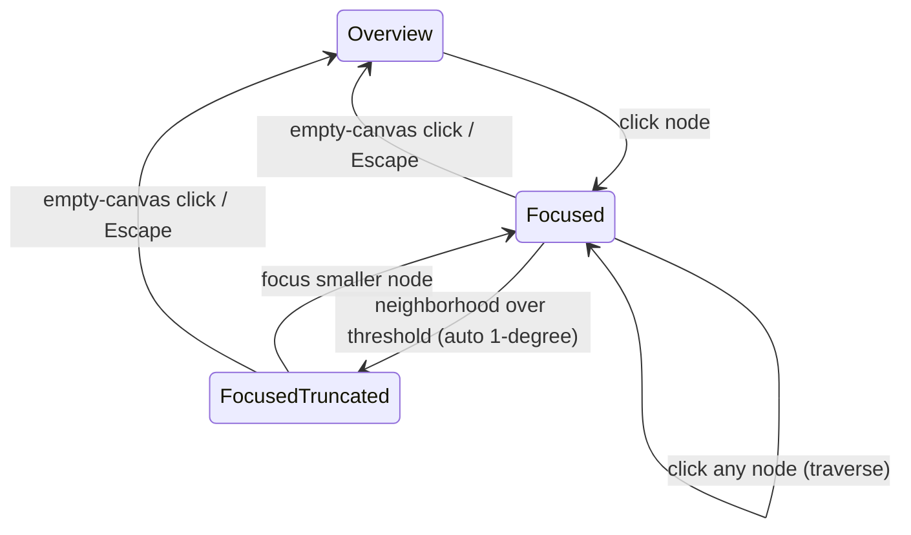
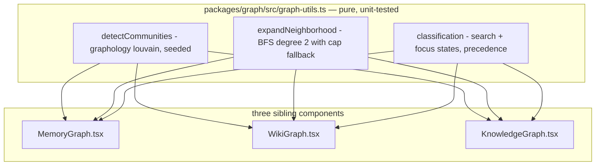
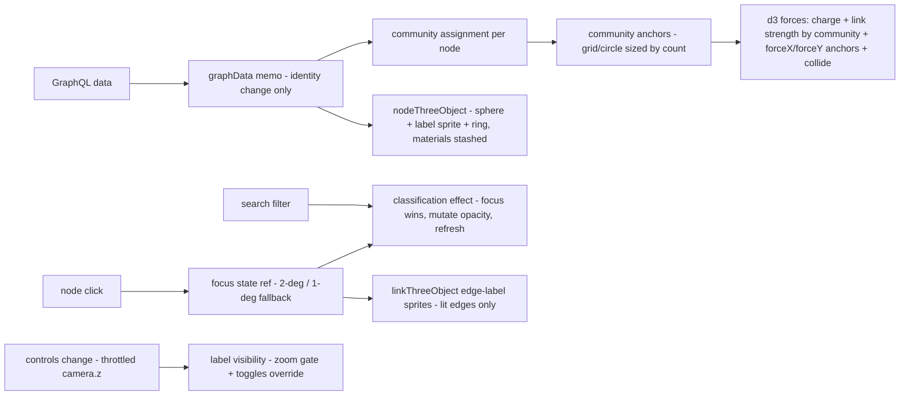

# Force Graph Exploration - Plan

## Goal Capsule

- **Objective:** Make the force graphs work as real exploration tools: dense, consistently-spaced clusters in the overview, and a click-to-focus mode that lights up a node's neighborhood with node and relationship labels.
- **Product authority:** THINK-212 (Linear); Product Contract confirmed in brainstorm dialogue with Eric 2026-07-07; plan-time scope (three-graph coverage, graphology dependency, focus/search precedence, click-keeps-sheet) confirmed same day.
- **Product Contract preservation:** changed — R12 widened from two graphs to three (the issue's literal "Memory → Graph" view is `MemoryGraph`, a sibling the brainstorm doc didn't name); AE5–AE8 added for search×focus, dimmed-node click, toggle precedence, and isolated-node focus; Outstanding Questions resolved into the Planning Contract. All changes user-confirmed at the plan scoping gate.
- **Stop conditions:** Surface as a blocker (do not guess): any change that would rebuild `graphData` or restart the simulation on filter/focus changes (violates the documented no-restart invariant); any need to modify `apps/mobile` graph code; measured interaction regression at current tenant scale that tuning can't recover.
- **Execution profile:** Standard feature work in a worktree off `origin/main`; per-unit commits; full `@thinkwork/graph` package suite plus typecheck before PR; visual verification requires Eric's local checkout (dev server against dev stage).
- **Tail ownership:** PR to `main`; `apps/web` ships on the next `desktop-v*` canary, not on merge.

---

## Product Contract

### Summary

Rework the force graphs into an exploration surface: the overview lays out as dense clusters with controlled spacing via community-aware layout, and clicking a node focuses its 2-degree neighborhood in place — everything else dims while node labels and relationship labels appear on the lit neighborhood. Overview labels zoom-gate automatically, and label visibility is user-toggleable.

### Problem Frame

The graphs currently render with a 3D engine in 2D mode after a 2D projection attempt failed. The layout is pure force physics with flat parameters, so inter-cluster spacing is emergent and inconsistent — sometimes cavernous, sometimes cramped — and there is no clustering logic at all. Node labels are 16-character sprites; relationship labels exist in the data but surface only as hover tooltips.

The graphs are used as working exploration tools, not just a wow surface: users search for a starting node, then traverse relationships outward. Real tenants reach 10k+ nodes, at which point the whole-graph view is unreadable and the current search filter (dim non-matches in place) is the only navigation aid. The reference experience is the neo4j browser: dense clusters, readable labels on the part of the graph you care about.

### Key Decisions

- **Focus is dim-in-place, not scene replacement.** Clicking a node dims everything outside its neighborhood while global layout positions stay fixed. Chosen over extract-and-relayout and zoom-and-tighten alternatives (judged via interactive sketches) because it preserves global context and extends the existing dimming behavior users already have.
- **Overview density comes from community-aware layout, not physics tuning.** Communities are detected from edge structure and laid out with explicit cluster forces, making density and inter-cluster spacing controlled rather than emergent. Pure force retuning was rejected as unlikely to fix spacing inconsistency at 10k+ nodes; it also lays the groundwork for a future aggregated overview.
- **Overview labels are zoom-gated automatically.** Labels fade in when the visible node count is low enough, with manual toggles as an absolute override in either direction.
- **Relationship labels default on in focus mode.** The lit neighborhood shows edge labels persistently (neo4j feel), with a toggle to hide them.
- **Oversized neighborhoods degrade silently to 1 degree.** No prompt; a lightweight indicator marks the view as truncated.
- **Focus supersedes search dimming while active.** Search and focus remain independent states: exiting focus restores the search-filtered view; clearing search while focused leaves focus active.
- **Node click keeps opening the detail sheet.** Focus is additive to the existing click behavior, not a replacement.

### Requirements

**Overview layout and density**

- R1. The overview lays out as visually dense clusters with consistent inter-cluster spacing, driven by community structure detected from the graph's edges.
- R2. Layout quality holds across tenant sizes, from ~50-node fresh tenants to 10k+ node mature brains.
- R3. Overview interaction (pan, zoom, search filter) is at least as responsive as today at current tenant scale, with no simulation restarts introduced on filter or focus changes.

**Focus mode**

- R4. Clicking a node makes it active: its 2-degree neighborhood stays at full opacity and everything else dims, without moving any layout positions.
- R5. When the 2-degree neighborhood exceeds a size threshold, focus automatically falls back to 1 degree and shows a lightweight indicator that the view is truncated.
- R6. Clicking any node — lit or dimmed — moves focus to it (traversal); clicking empty canvas or pressing Escape returns to the overview.
- R7. Focus composes with the existing search: searching narrows the graph, selecting a result focuses it, and exiting focus restores the prior search-filtered view.

**Labels**

- R8. In the overview, node labels appear automatically once zoom leaves few enough nodes on screen, and hide at far zoom.
- R9. In focus mode, node labels render on every lit node.
- R10. In focus mode, relationship labels render on the lit neighborhood's edges, defaulting to visible.
- R11. Users can toggle node labels and relationship labels independently; the toggle is an absolute override of the automatic zoom-gating in either direction. Toggle state is per-session (not persisted).

**Coverage**

- R12. All of the above applies equally to the three sibling graph views: Memory → Graph (`MemoryGraph`), Memory → Wiki → Graph (`WikiGraph`), and the Knowledge Graph ontology view (`KnowledgeGraph`).

### Key Flows

- F1. Search-then-traverse exploration
  - **Trigger:** User opens a graph looking for what the brain knows about a specific entity.
  - **Steps:** User searches; matches highlight and the rest dims; user clicks a match; its 2-degree neighborhood lights with labels (detail sheet opens as today); user clicks a neighbor to re-focus and walk outward; user clicks empty canvas (or Escape) to return to the search-filtered overview.
  - **Covers:** R4, R6, R7, R9, R10.

### Acceptance Examples

- AE1. **Covers R5.** Given a hub node whose 2-degree neighborhood exceeds the threshold, when the user clicks it, then only the 1-degree neighborhood lights up and a truncation indicator is visible.
- AE2. **Covers R8.** Given a 10k-node overview at far zoom, no node labels render; when the user zooms into a single cluster, labels appear for the nodes on screen.
- AE3. **Covers R10, R11.** Given a focused neighborhood with relationship labels showing, when the user toggles relationship labels off, then edge text disappears while node labels remain.
- AE4. **Covers R6.** Given a focused node, when the user clicks empty canvas, then dimming clears and the prior overview state is fully restored.
- AE5. **Covers R7.** Given an active search filter, when the user focuses a matched node, then focus dimming supersedes search dimming; when the user exits focus, the search-filtered dimming returns exactly as before.
- AE6. **Covers R6.** Given a focused node, when the user clicks a dimmed (non-lit) node, then focus moves to that node and its neighborhood lights up.
- AE7. **Covers R8, R11.** Given far zoom where zoom-gating hides labels, when the user toggles node labels on, then labels render regardless of zoom level.
- AE8. **Covers R4, R5.** Given a node with zero edges, when the user focuses it, then only that node stays lit, with no truncation indicator and no error.

### Success Criteria

- Cluster density and spacing look consistent across tenants with very different graph shapes — no more "too much space here, not enough there."
- A focused neighborhood is readable end-to-end: a user can identify every lit node and relationship type without hovering.
- No regression in overview responsiveness relative to the current implementation, verified at a synthetic 10k-node scale.

### Scope Boundaries

- **Deferred for later:** the aggregated level-of-detail overview (cluster blobs at far zoom that expand into nodes on zoom-in). The community detection built here is its prerequisite. Also deferred: lazy label-sprite instantiation (creating sprites only near the camera) — pull it in only if U6 measurement shows the existing sprite-per-node approach regressing at 10k.
- Mobile graph components (`apps/mobile/components/wiki/graph/`) are untouched; they share no code with `packages/graph`.
- Hover tooltips (`nodeLabel`/`linkLabel`) are unchanged — they keep carrying richer detail (trust state, evidence counts) than the clipped canvas labels.
- The three web components stay separate; shared logic consolidates into `packages/graph/src/graph-utils.ts`, but a full component merge is out of scope.

---

## Planning Contract

### Key Technical Decisions

- KTD-1. **Stay on `ForceGraph3D` with `numDimensions={2}`; do not migrate to `react-force-graph-2d`.** The 2D package is a different rendering backend (canvas draw callbacks vs THREE objects); labels are already sprite-based, d3 force config carries over regardless, and zoom gating is achievable via camera-distance listening. A migration would rewrite the material-stash pattern, both test mocks, and camera init for no functional gain. Risk to watch: the library's open 3D zoom-depth ceiling (vasturiano/react-force-graph#227) — U6 validates cluster anchor spacing doesn't push nodes past the zoomable range.
- KTD-2. **Community detection via `graphology` + `graphology-communities-louvain` (seeded RNG).** First graph-theory dependency in the repo, chosen over hand-rolled label propagation for community quality and speed (their own benchmark: ~53ms at 1k nodes / 10k edges — comfortably sub-second at target scale). Use `louvain.assign(graph, { rng: seeded, resolution })` so layouts are deterministic across reloads; `resolution` is the density-granularity tuning knob. Detection runs once per `graphData` identity — the same cadence the simulation already keys on — never on filter, focus, or render.
- KTD-3. **Cluster layout = per-community centroid anchors driven by `forceX`/`forceY`, plus community-aware link strength.** Anchors are arranged on a grid/circle sized by community node count; each node is pulled toward its community anchor (mobile's `xyStrength` precedent, compatible with the `d3-force-3d` engine react-force-graph actually runs). Intra-community links get stronger `strength` than inter-community links to reinforce density. This is the standard clustered-force-layout pattern; the abandoned `d3-force-cluster` and grid-boxy `forceInABox` packages are not adopted.
- KTD-4. **Focus mode extends the existing classification/opacity machinery — no data rebuild, no sim restart.** Focus becomes a second classification source alongside search, flowing through refs into the stable `nodeThreeObject`/opacity-mutation effect (`node.__sphereMat`/`__spriteMat`/`__ringMat` + `refresh()`), per `docs/solutions/best-practices/graph-filter-states-no-restart-2026-04-20.md`. Precedence: focus classification wins while a focus is active; the search classification is retained and restored on exit. Edge opacity follows endpoint lit-state, never node opacity alone.
- KTD-5. **Zoom gating via a throttled `controls().addEventListener("change", …)` reading `camera.position.z`.** 3D mode has no `onZoom` event. The threshold is expressed relative to the already-computed `initialZ` scale (`100·√nodeCount` clamped). Gating flips `sprite.visible` (cheaper than opacity writes) on a throttle, not per frame. Force-parameter changes from label modes may legitimately reheat the sim (`d3ReheatSimulation`) — that is the one allowed restart class, per the mobile label-toggle precedent; tune settle time with `alphaDecay`, never `velocityDecay` (`docs/solutions/best-practices/d3-force-animation-length-vs-layout-quality-2026-04-21.md`).
- KTD-6. **Shared logic lands in `packages/graph/src/graph-utils.ts` (pure, dependency-injected, unit-tested); the three components consume it.** `WikiGraph`'s private duplicates of `endpointId`/`classifyNode`/derivation move onto the shared utils as the first step. New utils: `detectCommunities`, `expandNeighborhood(seedIds, links, degree, cap)`, and a generalized classification type carrying focus state.
- KTD-7. **Label toggles render as overlay controls inside the graph container** (matching the existing bottom-left legend overlay pattern), so all three host surfaces get them without per-host toolbar work. Toggle state is React state per mount — session-only, no persistence.

### Assumptions

- Existing per-node label sprites (built in `nodeThreeObject` for every node) remain; zoom gating toggles visibility rather than lazily creating sprites. If U6 measurement shows sprite count itself regressing interaction at 10k nodes, the lazy-instantiation follow-up in Scope Boundaries activates.
- `MemoryGraph` structurally matches `WikiGraph` (documented near-clone); if implementation finds material divergence, treat it as a per-unit approach adjustment, not a scope change.
- User-dragged node pins (`fx`/`fy`) survive refetches with unchanged topology; a topology-changing refetch may re-run community layout.

### High-Level Technical Design

Module shape — pure logic feeds three thin component integrations:

Layout and interaction pipeline per component (directional guidance, not implementation specification):

---

## Implementation Units

### U1. Shared graph utils: communities, neighborhoods, unified classification

- **Goal:** All pure logic exists, tested, before any component changes: community detection, k-degree neighborhood expansion with cap fallback, and a classification model that carries both search and focus state with focus precedence.
- **Requirements:** R1, R4, R5, R7 (foundations); KTD-2, KTD-4, KTD-6.
- **Dependencies:** none.
- **Files:** `packages/graph/package.json` (add `graphology`, `graphology-communities-louvain`), `packages/graph/src/graph-utils.ts`, `packages/graph/src/graph-utils.test.ts`, `packages/graph/src/WikiGraph.tsx` (swap private duplicates of `endpointId`/`classifyNode`/derivation to shared utils — behavior-neutral).
- **Approach:** `detectCommunities(nodes, links, { resolution, seed })` wraps graphology louvain and returns a node-id → community-id map; deterministic via seeded RNG. `expandNeighborhood(seedIds, links, degree, cap)` BFS with the 2°→1° fallback decision returned explicitly (`{ ids, degreeUsed, truncated }`). Extend the classification type so `deriveGraphClassification` composes search and focus (focus wins while present; search retained underneath).
- **Patterns to follow:** existing pure-function style of `packages/graph/src/graph-utils.ts`; mobile 1-hop prior art `apps/mobile/components/wiki/graph/layout/neighborhood.ts` (reference only — do not modify mobile).
- **Test scenarios:**
  - Happy: 2-degree expansion returns seed + neighbors + neighbors-of-neighbors; community map assigns every node exactly one community; same seed → identical partitions across runs.
  - Edge: isolated node expands to itself (`truncated: false`); Covers AE8. Empty graph → empty results without throwing; cap exactly at boundary (size == cap does not truncate, cap+1 does); multi-agent prefixed ids (`user:page`) traverse correctly and never cross agent subgraphs.
  - Covers AE1. Neighborhood over cap returns `degreeUsed: 1, truncated: true`.
  - Classification: focus + search both active → focus classification returned; focus cleared → search classification intact.
- **Verification:** `pnpm --filter @thinkwork/graph test` green; WikiGraph rendering unchanged (existing `WikiGraph.test.tsx` still passes).

### U2. Community-aware layout in the three components

- **Goal:** Overviews render as dense clusters with consistent spacing, at the same recompute cadence the simulation already uses.
- **Requirements:** R1, R2, R3, R12; KTD-2, KTD-3.
- **Dependencies:** U1.
- **Files:** `packages/graph/src/MemoryGraph.tsx`, `packages/graph/src/WikiGraph.tsx`, `packages/graph/src/KnowledgeGraph.tsx`, `packages/graph/src/graph-utils.ts` (anchor layout helper), `packages/graph/src/graph-utils.test.ts`, component tests.
- **Approach:** Compute community assignment inside the `graphData` memo cadence (never off filters). Add an anchor-layout helper (communities placed on a grid/circle, area proportional to member count). In the existing forces effect, register `forceX`/`forceY` toward each node's anchor, differentiate link `strength` by shared-community, and keep `charge`/`collide` so intra-cluster nodes stay readable. Preserve `fx`/`fy` pins across refetches with unchanged topology. Tune settle behavior with `alphaDecay`/quiesce, leaving `velocityDecay` alone.
- **Execution note:** Verify layout visually early with a real dev-stage tenant graph before fine-tuning constants; the numbers will move in U6.
- **Patterns to follow:** forces effect at `packages/graph/src/WikiGraph.tsx` (`d3Force` registration); mobile `SimConfig`/`xyStrength` (`apps/mobile/components/wiki/graph/hooks/useForceSimulation.ts`) for anchor-pull strength shape; `docs/solutions/best-practices/d3-force-animation-length-vs-layout-quality-2026-04-21.md`.
- **Test scenarios:**
  - Happy: with the mocked ForceGraph3D stub, `d3Force` is called with the new cluster forces; community assignment is computed once per data identity (call-capture count stays 1 across filter changes).
  - Edge: single-community graph (no bridges) lays out without NaN anchors; 50-node graph still uses the small-graph force branch.
  - Error: nodes with no community assignment (defensive) fall back to center attraction rather than throwing.
  - Integration: filter change after layout does not re-invoke community detection or force re-registration (no-restart invariant).
- **Verification:** package suite + typecheck green; visual check on dev tenant shows distinct dense clusters with consistent gaps on all three views.

### U3. Graph Focus Mode

- **Goal:** Click-to-focus dims everything outside the neighborhood in place, with traversal, truncation fallback, Escape/background exit, and search-state restore.
- **Requirements:** R4, R5, R6, R7, R12; KTD-4.
- **Dependencies:** U1.
- **Files:** `packages/graph/src/MemoryGraph.tsx`, `packages/graph/src/WikiGraph.tsx`, `packages/graph/src/KnowledgeGraph.tsx`, component tests.
- **Approach:** Focus state lives in a ref + state pair feeding the existing classification effect (stable callbacks, empty deps, ref reads — the no-restart pattern). `onNodeClick` sets focus (any node, lit or dimmed) and still invokes the existing detail-sheet callback. Add `onBackgroundClick` and a keydown listener for Escape to clear focus. Truncation indicator renders as a small overlay chip in the graph container (legend-overlay pattern). Edge dim state derives from endpoint lit-state.
- **Patterns to follow:** classification/opacity effect and material-stash pattern per `docs/solutions/best-practices/graph-filter-states-no-restart-2026-04-20.md`; state-backed callback refs for anything touching conditionally-rendered containers (`docs/solutions/logic-errors/admin-graph-dims-measure-ref-2026-04-20.md`).
- **Test scenarios:**
  - Covers AE1/F1. Clicking a hub over the cap lights the 1-degree set and renders the truncation chip.
  - Covers AE4. Background click clears focus; opacity mutation restores prior values.
  - Covers AE5. With search active, focusing applies focus classification; exiting restores search classification (assert via captured material opacities on the stub).
  - Covers AE6. Clicking a dimmed node refocuses on it.
  - Covers AE8. Focusing an isolated node lights only it, no chip.
  - Edge: Escape with no focus active is a no-op; focus survives clearing the search input.
  - Integration: focus change triggers zero `graphData` rebuilds and zero force re-registrations; detail sheet callback still fires on click.
- **Verification:** package suite + typecheck green; manual flow F1 walked on dev for all three views.

### U4. Labels: zoom gating, focus labels, persistent edge labels

- **Goal:** Overview node labels appear only when zoomed in; focus mode shows node labels on the lit set and relationship labels on lit edges.
- **Requirements:** R8, R9, R10, R12; KTD-5.
- **Dependencies:** U3.
- **Files:** the three components, `packages/graph/src/graph-utils.ts` (zoom-threshold helper if extractable), component tests.
- **Approach:** Register a throttled `change` listener on `fg.controls()` reading `camera.position.z`; derive a labels-visible boolean from a threshold relative to the component's `initialZ` scale; flip `__spriteMat`-backed sprite `visible` in the existing mutation effect. In focus mode, lit nodes' labels are always visible regardless of zoom. Edge labels: build `linkThreeObject` text sprites only for lit edges when focus is active (hundreds of sprites max — safe zone), reusing the canvas-texture sprite pattern from node labels; hover tooltips stay unchanged.
- **Execution note:** Throttle the zoom listener (e.g., trailing-edge debounce) — do not evaluate visibility per frame across 10k sprites.
- **Patterns to follow:** node sprite construction in `nodeThreeObject` (both components); camera init block for the `initialZ` scale.
- **Test scenarios:**
  - Covers AE2. Simulated camera.z above threshold → label sprites hidden; below → visible (assert via stub-captured objects).
  - Covers R9/R10. Entering focus makes lit node labels visible at any zoom and creates edge-label objects only for lit edges; exiting focus removes them.
  - Edge: zero-edge focused node creates no edge labels; label content falls back to "related to"/"references" defaults when edge label is null.
  - Integration: zoom listener changes visibility without touching `graphData` or forces.
- **Verification:** package suite + typecheck green; manual zoom-in/zoom-out and focus label check on dev.

### U5. Label toggle controls

- **Goal:** Independent node-label and relationship-label toggles as overlay controls on the graph, acting as absolute overrides.
- **Requirements:** R11, R12; KTD-7.
- **Dependencies:** U4.
- **Files:** the three components (or a small shared overlay component in `packages/graph/src/`), component tests.
- **Approach:** Tri-state per label kind (`auto | on | off`, default `auto`): `auto` follows zoom gating and focus defaults; `on`/`off` override absolutely. Render as icon toggles in a top-right overlay inside the graph container, styled like the existing legend overlay; accessible labels ("Show node labels", "Show relationship labels"). Session-only state.
- **Patterns to follow:** `ToggleGroup` usage in `apps/web/src/components/settings/SettingsWiki.tsx` (view switch) and the mobile `IconLetterCase` toggle (`apps/mobile/components/home/WikiSegment.tsx`); inline-row-action convention: visible, outline variant.
- **Test scenarios:**
  - Covers AE3. Relationship toggle off in focus → edge labels removed, node labels remain.
  - Covers AE7. Node-label toggle on at far zoom → labels visible despite the gate.
  - Edge: toggle off overrides focus-mode default-on for edge labels; returning to `auto` restores gated behavior.
- **Verification:** package suite + typecheck green; toggles visible and functional on all three views on dev.

### U6. Scale validation and tuning

- **Goal:** Thresholds and force constants are tuned against a 10k-node graph, and R3's no-regression claim is measured, not assumed.
- **Requirements:** R2, R3; Success Criteria; KTD-1 risk (zoom-depth ceiling).
- **Dependencies:** U2, U3, U4, U5.
- **Files:** `packages/graph/src/graph-utils.test.ts` or a dev fixture module (synthetic clustered-graph generator), tuning-constant edits in the three components.
- **Approach:** Generate a deterministic synthetic graph (~10k nodes, community-structured, hub-heavy) and drive it through a dev harness or story. Measure: initial layout time, pan/zoom responsiveness, focus-toggle latency, community detection time. Tune: neighborhood cap (start ~150), zoom-gate threshold, anchor spacing (verify no nodes exceed the 3D zoom-depth ceiling), `resolution`, `alphaDecay`. If sprite count is the measured bottleneck, activate the deferred lazy-sprite follow-up rather than shipping a regression.
- **Execution note:** Measurement-first — capture the current-main baseline on the same synthetic graph before comparing.
- **Test scenarios:**
  - Happy: community detection under 1s at 10k nodes / 50k edges; `expandNeighborhood` under 50ms at that scale.
  - Test expectation for FPS/interaction: manual measurement documented in the PR — automated FPS assertions are not practical in jsdom.
- **Verification:** documented before/after measurements in the PR description; final constants committed; no regression vs baseline.

---

## Verification Contract

| Gate | Command / check | Applies to |
|---|---|---|
| Unit + component tests | `pnpm --filter @thinkwork/graph test` (full package suite, not single files) | U1–U6 |
| Typecheck | `pnpm --filter @thinkwork/graph typecheck` and `pnpm --filter @thinkwork/web typecheck` | all units |
| Lint/format | `pnpm lint && pnpm format:check` (pre-commit hooks run these) | all units |
| No-restart invariant | Component tests assert zero `graphData` rebuilds / force re-registrations on filter, focus, zoom, and toggle changes | U2–U5 |
| Scale measurement | Synthetic 10k-node before/after measurements documented in PR | U6 |
| Visual pass | Eric validates all three graph views on the local dev server against the dev stage (visual UI claims require pixels, not test output) | pre-PR |

## Definition of Done

- All R1–R12 satisfied and AE1–AE8 demonstrably pass (component tests where feasible, manual walkthrough for visual AEs).
- All six units landed; full `@thinkwork/graph` suite, typecheck, lint, and format gates green.
- U6 measurements documented; no interaction regression vs current main at synthetic 10k scale.
- Eric's visual validation pass completed on dev before the PR is merged.
- No dead-end or experimental code from abandoned tuning approaches remains in the diff; worktree and branch cleaned up after merge.

---

## Sources / Research

Verified against the codebase 2026-07-07:

- Components: `packages/graph/src/MemoryGraph.tsx`, `packages/graph/src/WikiGraph.tsx` (documented near-clone of MemoryGraph), `packages/graph/src/KnowledgeGraph.tsx`; all `ForceGraph3D` (`react-force-graph-3d@1.29.1`, engine `d3-force-3d@3.0.6`, `three@0.183.2`) with `numDimensions={2}`. No community-detection or `react-force-graph-2d` dependency exists anywhere in the workspace.
- Opacity machinery: materials stashed as `node.__sphereMat/__spriteMat/__ringMat` in `nodeThreeObject`, mutated by a classification effect + `refresh()`; `graphData` memo keys on server data only — documented as load-bearing in the WikiGraph header comment.
- No zoom-change handler exists anywhere; camera init is one-shot with `initialZ = clamp(100·√nodeCount, 800, 6000)`, rotation disabled.
- Hosts: `apps/web/src/components/settings/SettingsWiki.tsx` (live-keystroke search → graph), `apps/web/src/components/settings/knowledge-graph/KnowledgeGraphExplorer.tsx` (committed search), `apps/web/src/components/settings/SettingsMemory.tsx` (MemoryGraph host). Toggle chrome: `@thinkwork/ui` `ToggleGroup`/`Switch`; graph overlay precedent is the bottom-left legend.
- Tests: `packages/graph` runs vitest/jsdom with a `react-force-graph-3d` forwardRef stub capturing props (`KnowledgeGraph.test.tsx`) — the harness new behavior asserts against.
- Institutional learnings: `docs/solutions/best-practices/graph-filter-states-no-restart-2026-04-20.md` (no-restart invariant, 3-state classification, ring-inside-footprint), `docs/solutions/best-practices/d3-force-animation-length-vs-layout-quality-2026-04-21.md` (alphaDecay vs velocityDecay separation), `docs/solutions/best-practices/react-native-force-sim-camera-persistence-2026-04-20.md` (position/camera persistence layers), `docs/solutions/logic-errors/admin-graph-dims-measure-ref-2026-04-20.md` (callback refs in conditional branches).
- External (load-bearing): react-force-graph 2D-vs-3D API differences (no `onZoom` in 3D; `numDimensions` is 3D-only), perf ceiling ~5–15k elements with `warmupTicks`/geometry mitigations (issues #223, #202), open 3D zoom-depth ceiling (#227); `graphology@0.26.0` + `graphology-communities-louvain@2.0.2` (maintained standard library, seedable RNG, ~53ms at 1k nodes); `d3-force-cluster` abandoned (2017), `forceInABox` grid-box layout rejected for organic clusters; three.js community guidance that a few hundred live text sprites is the comfortable ceiling — basis for the lit-set-only edge labels and the deferred lazy-sprite follow-up.
- Prior art: mobile label-mode sim configs and `restart(alpha, preTick)` (`apps/mobile/components/wiki/graph/hooks/useForceSimulation.ts`, `WikiGraphView.tsx`), mobile 1-hop neighborhood util, `docs/plans/2026-04-20-011-feat-mobile-wiki-graph-label-toggle-plan.md`.
