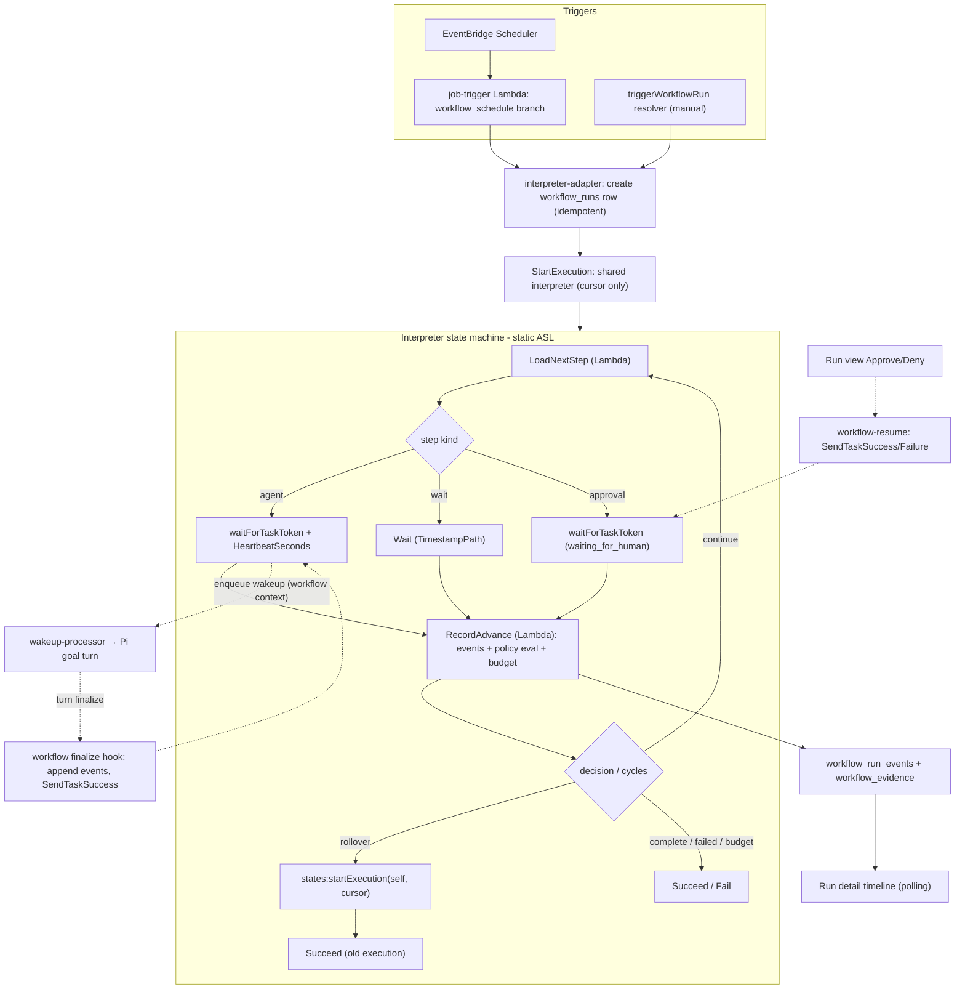

# Workflow Interpreter Thin Slice - Plan

## Goal Capsule

- **Objective:** Prove the canonical run model end-to-end (THINK-219): a schedule-triggered workflow whose definition holds an agent-goal step and continuation policy runs on one shared Step Functions interpreter, every step and decision lands in the `workflow_runs` ledger, and an operator watches the whole run in the web app without the AWS console.
- **Authority:** This plan; then the origin program doc (`docs/plans/2026-07-07-002-feat-canonical-run-model-plan.md`) for product intent; then repo conventions. Parent R-IDs cited below refer to the origin doc.
- **Stop conditions:** Surface (don't guess) if: the empty `terraform/modules/app/system-workflows-stepfunctions/` module turns out to be owned by other in-flight work; the `workflow_versions.definition_snapshot` column is claimed by an incompatible producer; or continuation-policy relocation (U6) requires changing `agent_loops` behavior for existing Automations.
- **Tail ownership:** Additive migration must be psql-applied to dev before merge; new Lambda IAM grants must land in the deploy targeted-apply recovery list in the same change; watch the post-merge Deploy run.

---

## Product Contract

### Summary

One shared Step Functions Standard state machine per stage interprets ThinkWork workflow definitions. This slice ships the minimal definition (agent step + continuation policy + wait), the interpreter with task-token suspension for agent turns and approvals, schedule and manual triggers, ledger projection of every step, and a run-detail timeline UI.

### Requirements

**Definition and validation**

- R1. A workflow definition is versioned JSON on `workflow_versions.definition_snapshot` with typed steps; this slice implements step kinds `agent` and `wait`, plus a workflow-level continuation policy (exit signal, iteration budget, oversight checkpoints). *(parent R2, R3)*
- R2. A validator rejects malformed definitions with ThinkWork-level errors (step index, field, reason) — never ASL or Step Functions vocabulary. *(parent R4)*

**Execution**

- R3. All runs of interpreter-bound workflows execute through one shared state machine per stage; creating or editing a workflow provisions no per-workflow AWS resources. *(parent R5)*
- R4. The `agent` step dispatches a Pi goal turn via the wakeup path, suspends on a task token, and resumes when the turn reaches a terminal state; the turn carries workflow run id, step id, iteration, and policy context. *(parent R7)*
- R5. After each agent iteration the continuation policy is evaluated and the decision (`complete` / `continue` / `human_needed`) is recorded as a step event with its evidence; the interpreter — not the goal runtime — enforces the iteration budget. *(parent R8)*
- R6. `human_needed` suspends the run in a `waiting_for_human` status on a task token; an operator approves or rejects from the run view, resuming or terminating the run. *(parent R7)*
- R7. The interpreter survives its own platform limits by construction: continue-as-new rollover at a fixed loop-cycle threshold (step boundaries only, never mid-wait), per-(run, step, attempt) idempotent dispatch, and explicit timeout/heartbeat on every token wait.

**Ledger and triggers**

- R8. Every run creates a `workflow_runs` row via a new interpreter engine binding; steps, iterations, and policy decisions are `workflow_run_events` rows; ThinkWork status is canonical and the SFN execution attaches as diagnostics evidence only. *(parent R9, R11)*
- R9. Event and evidence payloads are redaction-safe by construction: explicit safe scalar summaries only — never raw step payloads, task tokens, or secret refs.
- R10. A schedule trigger fires the run through the existing EventBridge Scheduler → `job-trigger` path with a new `workflow_schedule` trigger type; manual "Run now" shares the same run-creation path and ledger shape. *(parent R12)*

**UI**

- R11. The run-detail view shows the operator floor without the AWS console: timeline folded from events, per-step status, iteration history, policy decisions with evidence, error summaries in ThinkWork terms, waiting/approval state with Approve/Deny, duration, and an AWS execution link labeled diagnostics. *(parent R18)*
- R12. The view refreshes by polling while the run is active; workflows with a continuation policy show a Looping badge in the workflow list.

### Acceptance Examples

- AE1. **Covers R5.** Given a definition with iteration budget 5, when iteration 3's evidence satisfies the exit signal, the run succeeds with the terminal decision recorded and iterations 4–5 never dispatch; given no exit, iteration 5 completes and the run terminates with a budget-reached reason.
- AE2. **Covers R8, R11.** Given a step dispatch that fails permanently, the run view shows that step failed with a ThinkWork-terms error summary; the AWS link is present but unnecessary to identify the failing step.
- AE3. **Covers R6.** Given a policy decision of `human_needed`, the run shows `waiting_for_human`; operator Approve resumes the loop, Reject terminates the run with the decision recorded as an `operator_decision` event.
- AE4. **Covers R10.** Given the same EventBridge fire delivered twice, exactly one run exists (idempotency key on trigger + fire id).

### Scope Boundaries

- Not in this slice: `routine`, `http`, `tool`, and `emit_event` step kinds (THINK-214/215); agent-initiated runs — `WORKFLOWS_AGENT_TOOLS_ENABLED` stays off; the `onWorkflowRunUpdated` AppSync subscription; Automations/agent-loops migration (THINK-216); n8n changes (THINK-217); the full unified Workflows nav (THINK-218 — this slice extends the existing `settings.workflows` run views).
- Deferred to follow-up work: dedicated step/iteration tables if event-folding proves insufficient; Express-child batching for hot step sequences; notification/inbox integration for `waiting_for_human`.

---

## Planning Contract

### Key Technical Decisions

- KTD1. **Static interpreter ASL, DB as source of truth.** The state machine is a fixed loop — LoadNextStep (Lambda) → Choice on directive → dispatch (waitForTaskToken for `agent`/approval, Wait with `TimestampPath` for `wait`) → RecordAdvance → Choice (loop / rollover / terminal). SFN state carries only a cursor `{workflowRunId, tenantId, stepPointer, iteration, loopCycleCount}`; all step results live in Postgres, so the 256KB payload cap is a non-issue by construction.
- KTD2. **New engine binding, mirrored adapter.** A `step_functions_interpreter` binding type on `workflow_engine_bindings` whose `connection_ref` holds the shared machine ARN. The interpreter adapter mirrors `routine-adapter.ts`: run creation via `createWorkflowRunLedger`, step events via `appendWorkflowRunEvent` (`provenance: "native_event"`), terminal projection guarded by `WORKFLOW_TERMINAL_STATUSES`, capability set `{start, monitor, cancel}`. Unlike routines (execution-first), the run row is created *before* StartExecution, so the run-creation idempotency basis is trigger-scoped — `workflow_schedule:${triggerId}:${fireId}` for schedules, a caller-generated key for manual starts — never the execution ARN, which lands later on `backend_execution_id`/`correlation_id` only.
- KTD2b. **Shared logic lives below the api/lambda boundary.** `packages/lambda` deliberately does not depend on `@thinkwork/api` (documented in `job-trigger.ts`). Interpreter logic follows the established agent-loops seam: pure loop/policy logic in `packages/agent-loops-core` (ledger-interface-driven, like `dispatcher.ts`), DB-touching adapter/token helpers in `packages/database-pg` (like `ledger-db.ts`), with `packages/api` and `packages/lambda` both consuming from there. `decideAgentLoopCompletion`'s reusable core is extracted (not imported from api).
- KTD3. **Steps and iterations are events, not tables.** Structured `event_type` values (`workflow_step_started`, `workflow_step_finished`, `workflow_step_failed`, `workflow_policy_decision`, `workflow_run_rollover`, plus `operator_decision`-provenance approval events) with `payload_summary` carrying `{stepId, stepKind, iteration, status, summary}`. The UI folds events into a step timeline. A dedicated step table is a THINK-214/215 decision if folding proves insufficient.
- KTD4. **Task tokens live in a DB table, never in payloads.** New `workflow_task_tokens` table keyed (tenant, run, step id, iteration, purpose) with a consumed flag. The wakeup `contextSnapshot` carries only the workflow-run identity; the finalize hook loads the token by key. Resume mirrors `routine-resume.ts`: `SendTaskSuccess`/`SendTaskFailure` with `TaskTimedOut`/`TaskDoesNotExist` mapped to already-consumed, plus DB-side consumed CAS.
- KTD5. **Continuation relocates into the interpreter.** `decideAgentLoopCompletion` logic is reused inside the step-dispatch Lambda's policy evaluation, but the *decision to continue* is the interpreter's Choice state, recorded as a `workflow_policy_decision` event. The existing `projectAgentLoopFinalize` path is untouched for Automations; a new finalize hook keyed on the workflow-run context resumes the task token instead of enqueueing the next wakeup. The interpreter owns the iteration budget; the goal runtime keeps only its per-turn token budget.
- KTD6. **Rollover seam from day one.** The RecordAdvance Lambda increments `loopCycleCount`; past a threshold (~250 cycles, well under the ~1,400-iteration event-history ceiling) and only when no token is pending, the machine self-restarts via a `states:startExecution` Task carrying the cursor, guarded by a rollover counter against infinite restart. Recorded as a `workflow_run_rollover` event; `backend_execution_id` updates to the new execution ARN with the old ARN attached as evidence. The execution callback only projects a terminal status when the event's execution ARN equals the run's *current* `backend_execution_id` — a SUCCEEDED/ABORTED event for a superseded (rolled-over) ARN is recorded as diagnostics evidence and never terminalizes the run.
- KTD7. **Idempotency everywhere the platform retries.** Trigger fires: `workflow_schedule:${triggerId}:${fireId}` run key (AE4). Step dispatch: `(runId, stepId, iteration, attempt)` conditional write — a retried Lambda returns the stored result. Wakeup enqueue: `workflow-run:${runId}:step:${stepId}:iteration:${n}`. All via the repo's `(tenant_id, idempotency_key)` unique + `onConflictDoNothing`-reload pattern.
- KTD8. **Manual start never executes inline.** `triggerWorkflowRun` resolves the interpreter binding, creates the run row, and calls the non-blocking `StartExecution` — no step Lambdas run inside graphql-http.
- KTD9. **Tenant isolation is application-layer for the shared role.** Matching the routines substrate reality (ABAC comment in `terraform/modules/app/routines-stepfunctions/main.tf`), every dispatch re-asserts `tenant_id` from the run row in code. Accepted v1 risk, documented here.
- KTD10. **Deploy ordering is substrate-first.** Migrations (psql to dev pre-merge) → terraform + IAM (grants added to the targeted-apply recovery list in the same change) → Lambdas that throw until wired (never silently no-op) → wiring → UI. Each PR independently revertible.

### High-Level Technical Design

Prose is authoritative where they differ. The agent-step sequence: LoadNextStep stores a task token row, enqueues the wakeup with workflow-run identity in `contextSnapshot`, and the state machine parks; the finalize hook fires on terminal turn state only (running/awaiting-user states hold, per the n8n-bridge learning), appends the step-finished event, and resumes the token; RecordAdvance then evaluates the policy and records the decision.

### Assumptions

- `workflow_versions.definition_snapshot` (jsonb, exists today) is free for the interpreter definition; `source_kind` gains an interpreter value.
- The interpreter gets a fresh terraform module (`workflow-interpreter-stepfunctions/`). The empty `system-workflows-stepfunctions/` directory is the tombstone of the System Workflows subsystem deliberately destroyed 2026-05-06 (#871) — it is not reused, to avoid re-attaching a retired name.
- The gate facts recorded 2026-07: PR-level Migration Precheck not required; `deploy.yml` `migration-drift-check` temporarily disabled — re-verify at implementation time.

### System-Wide Impact

- **Wakeup pipeline:** `contextSnapshot` gains a `workflowRun` shape consumed by the finalize hook; the same fields must reach `agentCorePayload` in `wakeup-processor.ts` (two-builder parity). Existing agent-loop wakeups are untouched — the hook keys on the snapshot shape, so `projectAgentLoopFinalize` and `workflow-step-finalize` coexist without ordering coupling beyond both running in `process-finalize.ts`.
- **Finalize path:** a hook failure must not corrupt the thread turn (best-effort projection, per the agent-loop foundation learning) — but it must leave a visible step-failed event when the DB is reachable, and the token's `HeartbeatSeconds` timeout is the backstop that fails the step rather than stranding the run.
- **Schema consumers:** the new `workflow_schedule` trigger_type value (convention-enforced text, no CHECK) and the widened `workflow_runs.status` CHECK touch every reader that switches on those values — `job-trigger` branches and the web status badges — enumerate them at implementation.
- **GraphQL consumers:** new mutation + fields require codegen in `apps/cli`, `apps/web`, `apps/mobile`, `packages/api`; producer and consumers ship together (generated-client caveat from the seam-swap learning).

### Risks & Dependencies

- **`graphql-http` env 4KB ceiling:** the manual-start resolver needs the interpreter machine ARN; adding another env var to `graphql-http` risks blocking deploys at the 4KB Lambda env cap. Mitigation: resolve the ARN from SSM (`/thinkwork/<stage>/...`) per the established runtime-config pattern, with the `ssm:GetParameter` grant included in the grouped IAM policy — and in the targeted-apply recovery list.
- **Stuck runs / zombie executions:** every token wait carries `TimeoutSeconds`/`HeartbeatSeconds` (R7); a timeout fails the step with a ThinkWork-terms error rather than waiting a year. The execution-callback marks runs whose execution died out-of-band.
- **Interpreter cost:** ~4–5 state transitions per user step (~$0.0001/step) — negligible at slice volumes; the Express-child hybrid is the known lever if step volume grows (deferred).
- **Continuation-relocation regression risk:** U6 must not change `agent_loops` behavior for shipped Automations — the finalize hook is additive and `projectAgentLoopFinalize` stays untouched (stop condition if this proves impossible).
- **Dependency:** dev deploy pipeline (merge → deploy) is the only path to the substrate; local validation cannot exercise the state machine, so U9 is gated on the U4 apply landing.

### Sources / Research

- Ledger primitives: `packages/api/src/lib/workflows/run-ledger.ts` (`createWorkflowRunLedger`, `appendWorkflowRunEvent`, `attachWorkflowEvidence`; provenance enum), adapter template: `packages/api/src/lib/workflows/routine-adapter.ts`.
- Trigger path: `packages/lambda/job-schedule-manager.ts` (payload builder :239-249), `packages/lambda/job-trigger.ts` (branch dispatch, reuse-vs-repair `isRepairableHalfBuiltStart`, module SFN client).
- Agent dispatch and completion: `packages/agent-loops-core/src/dispatcher.ts`, `packages/database-pg/src/ledger-db.ts` (`enqueueWakeup`), `packages/api/src/lib/agent-loops/finalize-projection.ts` (`projectAgentLoopFinalize`, `decideAgentLoopCompletion`), `packages/agentcore-pi/agent-container/src/runtime/pi-goal-adapter.ts` (goal payload/evidence shapes; no `human_needed` status today).
- Task-token resume: `packages/lambda/routine-resume.ts`; SFN substrate: `terraform/modules/app/routines-stepfunctions/main.tf` (shared role, S3 offload, EventBridge state-change rule, application-layer ABAC note).
- Wakeup payload parity hazard: `docs/solutions/architecture-patterns/wakeup-processor-payload-parity-with-chat-agent-invoke-2026-06-12.md` (two payload builders; the interpreter path is wakeup-only — test the wakeup-dispatched turn).
- Resumable-ledger and redaction patterns: `docs/solutions/architecture-patterns/external-workflow-agent-step-bridges-need-resumable-ledgers-2026-06-21.md`.
- Deploy ordering: `docs/solutions/architecture-patterns/inert-first-seam-swap-multi-pr-pattern-2026-05-08.md`; migration tracks and targeted-apply recovery-list gap: `docs/solutions/workflow-issues/manually-applied-drizzle-migrations-drift-from-dev-2026-04-21.md`, `docs/solutions/integration-issues/merged-terraform-iam-grant-silently-unapplied-targeted-apply-gap.md`.
- External (load-bearing): AWS continue-as-new (`docs.aws.amazon.com/step-functions/latest/dg/bp-history-limit.html`, `tutorial-continue-new.html`) — ~17 history events per 3-Lambda cycle, ~1,400-iteration ceiling; waitForTaskToken heartbeat/timeout discipline (`connect-to-resource.html`); at-least-once dispatch → idempotency keys (`repost.aws/knowledge-center/lambda-function-idempotent`); Standard-vs-Express cost hybrid (`aws.amazon.com/blogs/compute/building-cost-effective-aws-step-functions-workflows/`).

---

## Implementation Units

### U1. Workflow definition schema and validator

- **Goal:** The versioned definition format the interpreter executes, with ThinkWork-level validation.
- **Requirements:** R1, R2.
- **Dependencies:** none.
- **Files:** `packages/api/src/lib/workflows/definition.ts` (new), `packages/api/src/lib/workflows/definition.test.ts` (new).
- **Approach:** Zod (or repo-standard validation) schema: `{version: 1, steps: [{id, kind: "agent"|"wait", ...kind fields}], continuationPolicy?: {exitSignal, maxIterations, oversight?}}`. `agent` step fields: objective, optional token budget. `wait` step: ISO timestamp or duration. Validator returns structured errors `{stepId, field, reason}`. Store/read helpers for `workflow_versions.definition_snapshot` + a new `source_kind` value.
- **Patterns to follow:** error shaping mirrors the validator posture in `createRoutine.mutation.ts` (validate before any side effect); lib style of `packages/api/src/lib/workflows/`.
- **Test scenarios:** valid minimal definition passes; unknown step kind rejected naming the step id; missing agent objective rejected; `maxIterations` 0 or negative rejected; policy-less definition valid (plain workflow); duplicate step ids rejected.
- **Verification:** `npx vitest run src/lib/workflows/definition.test.ts` green from `packages/api`.

### U2. Additive migration 0221

- **Goal:** Schema room for the slice, additive-only.
- **Requirements:** R6, R8, R10; KTD4.
- **Dependencies:** none.
- **Files:** `packages/database-pg/drizzle/0221_workflow_interpreter_thin_slice.sql` (new), `packages/database-pg/src/schema/workflow-runs.ts`, `packages/database-pg/src/schema/workflow-task-tokens.ts` (new), `packages/database-pg/src/schema/scheduled-jobs.ts`.
- **Approach:** Hand-rolled, `-- creates:` markers, header per 0210 convention: widen `workflow_runs_status_check` with `waiting_for_human`; widen `workflow_engine_bindings_type_check` (from migration 0177) to include `step_functions_interpreter`; add nullable `workflow_id` FK to the triggers table; create `workflow_task_tokens` (tenant_id, workflow_run_id, step_id, iteration, purpose, token, status, consumed_at, unique on the key tuple). `scheduled_jobs.trigger_type` is unconstrained text (values by convention) — no CHECK to widen; just enumerate the new value's readers. Drizzle defs updated to match.
- **Execution note:** psql-apply to dev before merging the PR that reads these objects; run `pnpm db:migrate-manual` to confirm the drift reporter sees the declared objects.
- **Test scenarios:** Test expectation: none — schema-only; correctness proven by the drift reporter and downstream unit tests against updated Drizzle defs.
- **Verification:** `pnpm db:migrate-manual` reports all declared objects present on dev.

### U3. Interpreter adapter library

- **Goal:** Run creation, step-event recording, token store, and terminal projection for interpreter-bound workflows.
- **Requirements:** R8, R9; KTD2, KTD3, KTD4, KTD7.
- **Dependencies:** U1, U2.
- **Files:** `packages/database-pg/src/workflow-interpreter-db.ts` (new — DB adapter, per KTD2b), `packages/database-pg/src/workflow-interpreter-db.test.ts` (new), `packages/agent-loops-core/src/interpreter.ts` (new — pure loop/policy logic incl. extracted completion-decision core) + test.
- **Approach:** Mirror `routine-adapter.ts` semantics from the database-pg home: `ensureInterpreterBinding` (binding_type `step_functions_interpreter`, connection_ref = shared machine ARN from SSM), `createInterpreterWorkflowRun` (ledger insert, trigger-scoped idempotency per KTD2, initial evidence row `step_functions_execution` marked diagnostics), `recordWorkflowStepEvent` (event types per KTD3, payload_summary limited to explicit safe scalars), `storeTaskToken`/`consumeTaskToken` (CAS on consumed), `updateInterpreterRunFromExecution` (terminal guard via `WORKFLOW_TERMINAL_STATUSES` + current-ARN match per KTD6).
- **Patterns to follow:** `routine-adapter.ts` throughout; `fakeDb()` test style from `run-ledger.test.ts`; redaction discipline from the n8n bridge learning — a test must prove arbitrary nested payloads do not leak into `payload_summary`.
- **Test scenarios:** duplicate run creation with same idempotency key returns existing run (`created: false`); step event bumps `last_event_at`; terminal run never un-terminalized by a late event; token consume is single-winner under two concurrent consumers (CAS); payload with nested secrets serializes to safe scalar summary only; `waiting_for_human` status accepted.
- **Verification:** `npx vitest run src/workflow-interpreter-db.test.ts` green from `packages/database-pg`; then full `pnpm --filter @thinkwork/database-pg test` and `pnpm --filter @thinkwork/agent-loops-core test`.

### U4. Terraform: shared interpreter substrate

- **Goal:** The one static state machine per stage plus its role, logs, callback rule, and Lambda plumbing.
- **Requirements:** R3, R7; KTD1, KTD6, KTD9, KTD10.
- **Dependencies:** U2 (deploy ordering), U5 inert stubs (all three Lambda sources — including `workflow-resume.ts` — must exist as throwing stubs in the same PR this terraform lands in).
- **Files:** `terraform/modules/app/workflow-interpreter-stepfunctions/main.tf` (+ `variables.tf`, `outputs.tf`) (new — fresh module name; do NOT reclaim `system-workflows-stepfunctions/`, the tombstone of the subsystem deliberately destroyed in #871), `terraform/modules/app/lambda-api/handlers.tf`, `terraform/modules/thinkwork/main.tf`, `.github/workflows/deploy.yml` (recovery list), `scripts/build-lambdas.sh`.
- **Approach:** `aws_sfn_state_machine` (Standard) with the KTD1 loop ASL: LoadNextStep task, Choice on `stepKind`, `.waitForTaskToken` tasks with `HeartbeatSeconds`/`TimeoutSeconds` set (never defaulted), Wait with `TimestampPath`, RecordAdvance task, rollover branch via `arn:aws:states:::states:startExecution` self-target. Execution role modeled on `routines-stepfunctions` (lambda:InvokeFunction for the two interpreter Lambdas, states:StartExecution self, SendTask*). Vended log group. EventBridge state-change rule scoped to the interpreter machine ARN → execution-callback Lambda. Register `workflow-step-dispatch`, `workflow-execution-callback`, `workflow-resume` in `handlers.tf` for_each + env (machine ARN) + `build_handler` lines. Add every new IAM grant and the handler Lambdas to the deploy targeted-apply recovery list.
- **Execution note:** land this with all three Lambdas in inert form — `workflow-step-dispatch`, `workflow-execution-callback`, and `workflow-resume` ship as throwing stubs in this PR so `handlers.tf` has sources to register; handlers throw until U5/U6/U7 wire them (a silent no-op strands runs in `queued`).
- **Test scenarios:** Test expectation: none — infrastructure; proven by `terraform validate`/plan in CI and the U9 smoke.
- **Verification:** `thinkwork plan -s dev` shows the machine, role, rule, and three Lambdas; post-apply the machine exists and an inert manual StartExecution fails loudly (throwing Lambda → execution FAILED, visible in the callback path).

### U5. Interpreter Lambdas: step dispatch and execution callback

- **Goal:** The loop body — load next step, dispatch it idempotently, record events, evaluate policy, advance or roll over — plus terminal projection.
- **Requirements:** R3, R5, R7, R8; KTD1, KTD5, KTD6, KTD7.
- **Dependencies:** U1, U3, U4.
- **Files:** `packages/lambda/workflow-step-dispatch.ts` (new), `packages/lambda/workflow-execution-callback.ts` (new), `packages/lambda/__tests__/workflow-step-dispatch.test.ts` (new), `packages/lambda/__tests__/workflow-execution-callback.test.ts` (new).
- **Approach:** `workflow-step-dispatch` serves both LoadNextStep and RecordAdvance ASL tasks (single handler branching on `phase` keeps the loop at ~2 Lambdas/cycle for history budget). LoadNextStep: read run + definition, re-assert tenant, resolve cursor → step; for `agent`: store token, enqueue wakeup (U6 payload), return park directive; for `wait`: return timestamp. RecordAdvance: idempotent step-finished event, policy evaluation reusing `decideAgentLoopCompletion` logic, budget check (interpreter-owned per KTD5), decision event, next cursor or terminal or rollover directive (`loopCycleCount` threshold, only with no pending token). `workflow-execution-callback`: EventBridge status-change → `updateInterpreterRunFromExecution`; a FAILED execution with a non-terminal run marks the run failed with a ThinkWork-terms error summary (AE2).
- **Patterns to follow:** branch-per-test-file convention of `packages/lambda/__tests__/job-trigger.*.test.ts`; pure logic factored ledger-interface-driven like `agent-loops-core/src/dispatcher.ts` so it unit-tests without AWS.
- **Test scenarios:** Covers AE1 — exit-signal satisfied at iteration 3 → complete decision, no iteration 4 dispatch directive; budget reached at max iterations → terminal with budget reason. Covers AE2 — dispatch failure surfaces step-failed event with error summary. Retried RecordAdvance with same (run, step, iteration, attempt) writes one event set and returns the stored directive. Rollover directive emitted past threshold only when no pending token; rollover counter guard refuses a second immediate rollover. Tenant mismatch between cursor and run row aborts loudly. Wait step returns valid ISO timestamp.
- **Verification:** `npx vitest run __tests__/workflow-step-dispatch.test.ts __tests__/workflow-execution-callback.test.ts` green from `packages/lambda`; full `pnpm --filter @thinkwork/lambda test`.

### U6. Agent step wiring: wakeup payload, finalize hook, token resume

- **Goal:** A Pi goal turn runs as a workflow step and the interpreter learns it finished.
- **Requirements:** R4, R5, R6; KTD4, KTD5.
- **Dependencies:** U3, U5.
- **Files:** `packages/api/src/handlers/wakeup-processor.ts`, `packages/api/src/lib/chat-finalize/process-finalize.ts`, `packages/api/src/lib/workflows/workflow-step-finalize.ts` (new), `packages/api/src/lib/workflows/workflow-step-finalize.test.ts` (new), `packages/lambda/workflow-resume.ts` (new), `packages/lambda/__tests__/workflow-resume.test.ts` (new), `packages/api/src/handlers/wakeup-processor.system-prompt.test.ts`.
- **Approach:** Wakeup `contextSnapshot` gains `{workflowRun: {runId, stepId, iteration, workflowName, policySummary}}`; the same fields must land in `wakeup-processor.ts`'s `agentCorePayload` (payload-parity learning — the interpreter path is wakeup-only, so a gap here is invisible on chat E2E). `workflow-step-finalize.ts` is the finalize hook, sibling to `projectAgentLoopFinalize`, keyed on the workflowRun snapshot context: fires only on genuinely terminal turn state (hold on running/awaiting-user, per the resumable-ledger learning), appends the step-finished event with goal evidence summary, consumes the token, calls SendTaskSuccess (SendTaskFailure on turn failure) with already-consumed tolerance. `workflow-resume.ts` mirrors `routine-resume.ts` for approval Approve/Deny.
- **Execution note:** test the wakeup-dispatched turn, not the chat path — extend the existing wakeup-processor parity assertions with the new payload fields.
- **Test scenarios:** finalize on terminal turn appends event + resumes token exactly once; finalize on non-terminal state holds (no token consume); double finalize (retry) is a no-op after consume; turn failure → SendTaskFailure and step-failed event; approval Approve resumes with `operator_decision` event, Deny fails the token and terminates (Covers AE3); payload-parity test asserts workflowRun fields present in `agentCorePayload`.
- **Verification:** `pnpm --filter @thinkwork/api test` green including the extended parity suite.

### U7. Triggers: schedule branch and manual start

- **Goal:** Runs start from a schedule and from "Run now", through one dispatcher shape.
- **Requirements:** R10; KTD7, KTD8.
- **Dependencies:** U3, U4.
- **Files:** `packages/lambda/job-trigger.ts`, `packages/lambda/job-schedule-manager.ts`, `packages/lambda/__tests__/job-trigger.workflow-schedule.test.ts` (new), `packages/api/src/graphql/resolvers/workflows/triggerWorkflowRun.mutation.ts`, `packages/api/src/graphql/resolvers/workflows/triggerWorkflowRun.mutation.test.ts`, `packages/api/src/graphql/resolvers/workflows/resolveWorkflowApproval.mutation.ts` (new + test), `packages/database-pg/graphql/types/workflows.graphql`.
- **Approach:** `job-schedule-manager` payload gains `workflowId`; `job-trigger` gains a `workflow_schedule` branch: idempotency key `workflow_schedule:${triggerId}:${fireId}`, reuse-vs-repair via the half-built-start pattern, create run via interpreter adapter, StartExecution. `triggerWorkflowRun` learns to resolve a ready `step_functions_interpreter` binding ahead of the routine binding; absent/blocked bindings keep the existing `blocked_not_ready` run+event path. `resolveWorkflowApproval(runId, approve, note)` loads the run and calls `assertCanReadWorkflowTenant(ctx, run.tenant_id)` (the `triggerWorkflowRun.mutation.ts` pattern) before invoking `workflow-resume` (RequestResponse, errors surfaced); the `note` lands in the `operator_decision` event via the same safe-scalar summary discipline as R9. Regenerate codegen in all four consumers after the GraphQL change.
- **Test scenarios:** Covers AE4 — duplicate fire id yields one run. Half-built run (row exists, no execution) is repaired not duplicated. Manual trigger with interpreter binding creates run and returns it; with no ready binding writes `blocked_not_ready`. Approval mutation on a non-waiting run errors cleanly. A cross-tenant approval attempt is denied before any resume call. Schedule branch on a workflow without a current version fails loudly with an event.
- **Verification:** `pnpm --filter @thinkwork/lambda test` and `pnpm --filter @thinkwork/api test` green; codegen diffs committed for cli/web/mobile/api.

### U8. Run detail UI: timeline, approval, polling

- **Goal:** The operator floor (R11) on the existing workflows surface.
- **Requirements:** R11, R12.
- **Dependencies:** U7 (GraphQL surface).
- **Files:** `apps/web/src/components/workflows/WorkflowRunDetail.tsx`, `apps/web/src/components/workflows/WorkflowRunTimeline.tsx` (new), `apps/web/src/components/workflows/WorkflowRunDetail.test.tsx` (or repo-standard test location), `apps/web/src/routes/_authed/settings.workflows.$workflowId_.runs.$runId.tsx`, workflow list component for the Looping badge.
- **Approach:** Fold `events` client-side into steps/iterations (group by `payload_summary.stepId` + `iteration`): timeline rows with status, duration, policy decisions rendered with evidence summaries, failures with error text, `waiting_for_human` block with Approve/Deny wired to `resolveWorkflowApproval`. Poll (urql `requestPolicy: 'network-only'` re-execute on interval ~5s) while status is non-terminal; stop on terminal. AWS execution link rendered from `backend_execution_ref` labeled "Diagnostics". Looping badge when the current version's definition has a continuation policy.
- **Patterns to follow:** existing `WorkflowRunDetail.tsx` urql usage; list-surface conventions (token filters, badges) from the workflows/automations lists; explicit refetch over cache-invalidation reliance (urql doc-cache learning).
- **Test scenarios:** event list with two iterations folds into two iteration groups with per-step statuses; `waiting_for_human` renders Approve/Deny and fires the mutation; terminal run stops polling; failed step shows error summary text; empty events renders queued state without crash; the Looping badge renders in the workflow list when the current version's definition has a continuation policy and is absent when it does not; a failed `resolveWorkflowApproval` call disables Approve/Deny and shows an inline "run already left waiting" message; an in-progress step shows elapsed time from its started-at event, distinct from final duration once finished.
- **Verification:** `pnpm --filter @thinkwork/web test` and typecheck green; visual pass on dev happens in U9.

### U9. End-to-end proof on dev

- **Goal:** The Definition of Done demo: a real scheduled loop visible end-to-end with no AWS console.
- **Requirements:** all; Covers F1 of the origin doc.
- **Dependencies:** U1–U8 deployed to dev.
- **Files:** `packages/api/test/integration/workflow-interpreter/` (new, live-DB integration test per repo convention) plus a dogfood checklist in the PR description.
- **Approach:** Seed a workflow (definition: agent step with a small objective, policy maxIterations 3) via `triggerWorkflowRun`; assert ledger rows appear (run, step events per iteration, policy decisions, terminal). Then create a one-time schedule via job-schedule-manager and assert the `workflow_schedule` fire produces an identical ledger shape (single-dispatcher requirement). Browser pass on dev: watch the run detail live, exercise Approve on a `human_needed` decision.
- **Execution note:** this is smoke/runtime-first verification — the deployed flow is the proof, per the bare-lambda-invoke-≠-E2E and pixels-gate-UI-claims learnings; a bare Lambda invoke does not count.
- **Test scenarios:** integration test asserts run reaches terminal with expected event sequence; scheduled and manual runs produce the same event shape; idempotent double-fire produces one run.
- **Verification:** integration test green against dev; dogfood checklist screenshots in the PR; post-merge Deploy run watched to green.

---

## Verification Contract

| Gate | Command | Applies to |
|---|---|---|
| Unit + resolver tests | `pnpm --filter @thinkwork/api test` | U1, U3, U6, U7 |
| Lambda tests | `pnpm --filter @thinkwork/lambda test` | U5, U7 |
| Web tests + types | `pnpm --filter @thinkwork/web test && pnpm -r --if-present typecheck` | U8, all |
| Lint/format | `pnpm lint && pnpm format:check` | all |
| Migration drift | `pnpm db:migrate-manual` after psql pre-apply to dev | U2 |
| Terraform | `thinkwork plan -s dev` clean; apply via merge pipeline | U4 |
| Live proof | U9 integration test + dev browser pass | slice-wide |

Run the full package suite (not just changed files) before each PR. Typecheck is a separate gate from vitest.

## Definition of Done

- All U1–U9 verifications green; AE1–AE4 each enforced by a named test.
- A schedule-triggered looping run on dev shows trigger, every iteration's agent step, each policy decision with evidence, and terminal state in the run view — with the AWS console needed for nothing.
- The wakeup payload-parity test covers every new field; the interpreter path was tested via a wakeup-dispatched turn.
- Migration 0221 applied to dev pre-merge; drift reporter clean; new IAM grants present in the targeted-apply recovery list; post-merge Deploy watched to green.
- No dead-end or experimental code from abandoned approaches remains in the diff; inert-phase throwing stubs are replaced, not left behind.
