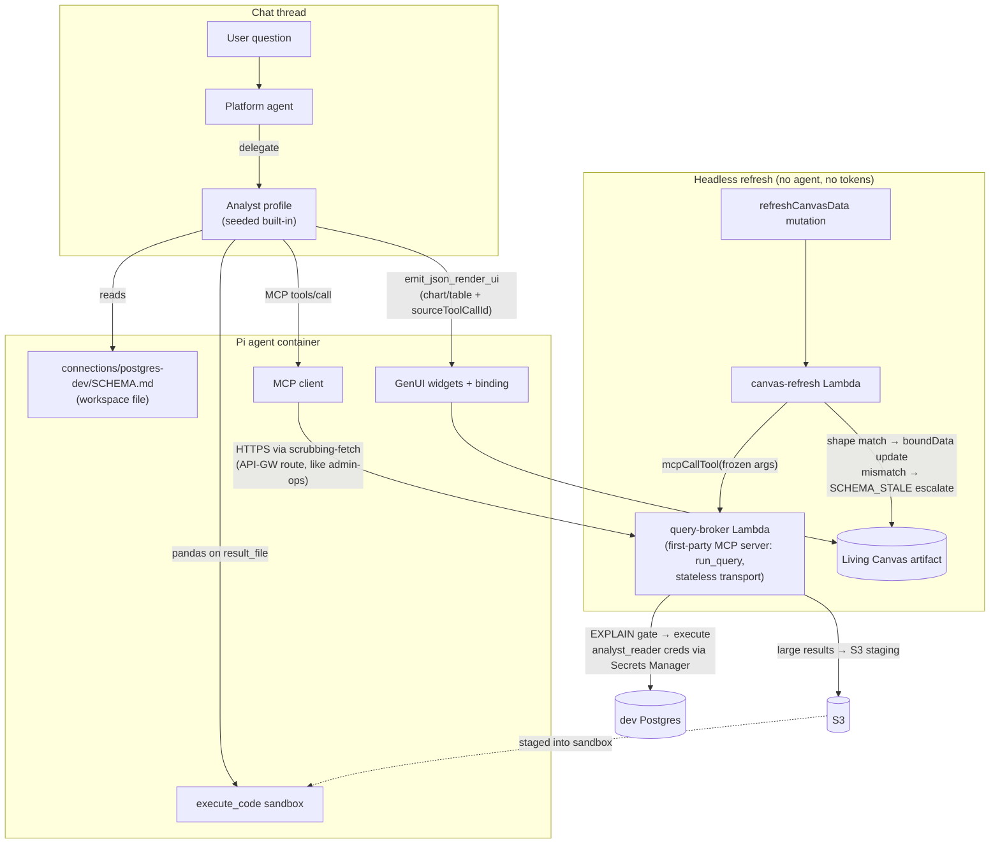
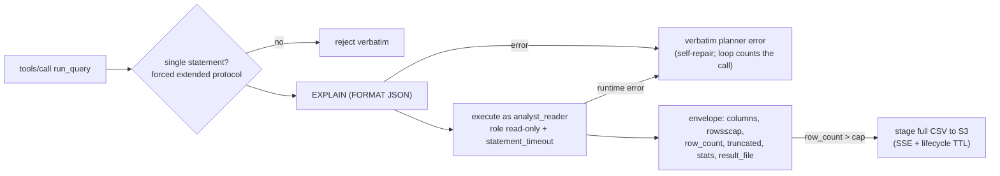

# ThinkWork Analyst - Plan

## Goal Capsule

- **Objective:** Ship the ThinkWork Analyst v1 dogfood slice (THINK-228): a user asks a data question in a chat thread, the platform agent delegates to the analyst profile, the analyst queries the dev Postgres through a hardened read-only tool, and answers with GenUI live components plus a saved live-bound report that refreshes headlessly on demand.
- **Product authority:** This document, seeded by [THINK-228](https://linear.app/thinkworkai/issue/THINK-228/thinkwork-analyst) and the ideation record at `docs/ideation/2026-07-08-think-228-thinkwork-analyst-ideation.html` (findings mirrored to the issue as a comment). The Connector-reuse framing is decided, not open.
- **Product Contract preservation:** Product Contract unchanged — all R/A/F/AE IDs preserved from the requirements-only version; planning added the Planning Contract, Implementation Units, and verification sections below.
- **Open blockers:** None. The two load-bearing plan-time forks (query-cap enforcement, seeded-connector approval) are resolved as KTD3 and KTD4.
- **Execution profile:** Deep, 8 implementation units in dependency order. Greenfield infrastructure (first-party MCP server, new DB role, new Lambda) sequenced before agent-facing wiring.

---

## Product Contract

### Summary

ThinkWork Analyst v1: the dev Postgres registers as a pre-provisioned first-party Postgres Connector (read-only DB role, broker-Lambda endpoint, Drizzle-derived semantic model), the seeded built-in analyst profile gains a hardened query tool, and analyst answers render as GenUI live components in-thread plus a live-bound report artifact with user-triggered headless refresh. No registration UI in v1 — the loop is proven before the wizard is built.

### Problem Frame

ThinkWork agents cannot answer quantitative questions about data in a database today. There is no data-source concept, no SQL execution path, and no schema context an agent could generate accurate SQL from — schema grounding was explicitly deferred in prior work, and the Drizzle schema is not surfaced to agents. Meanwhile the flagged hard part of the feature — registering data sources, storing credentials, deciding who can query what — is exactly the problem the existing Connector machinery (`tenant_mcp_servers` approval gate, hash-drift re-approval, Secrets-Manager-reference-only storage, Space scoping) already solves for MCP endpoints. Published failure modes make the security bar concrete: the widely-used Postgres MCP server's app-level read-only mode was bypassed with a `COMMIT` inside a transaction block, and production incidents at other companies trace to over-scoped shared credentials.

### Key Decisions

- **A SQL data source is a Connector — no new taxonomy.** It registers as a first-party Postgres connector: a `tenant_mcp_servers` row with `auth_type: service_credential` (tenant-wide, never per-user), storing only ARN references. Approval gating, SI-5 hash-drift re-approval, workspace assignment, tool-inventory visibility, and Composer surfacing all inherit. What makes a database different from other connectors is a richer provisioning step, not a new subsystem.
- **Read-only is enforced by the database role, never by an app-level validator.** The registered credential is a provisioned `analyst_reader` role (SELECT-only grants, read-only default transaction mode, statement timeout set at role level). Any app-level SELECT check is advisory UX for better error messages. Basis: the published `COMMIT` bypass of app-level read-only, and the repo's own `compliance_reader` dedicated-pool precedent.
- **SQL executes only in the connector's broker endpoint, never in the agent container.** The Pi container has no HTTP egress by architecture; the connector's endpoint is a ThinkWork-hosted query-broker Lambda (streamable HTTP, like every other MCP tool server) that alone holds credentials, enforces bounds, and emits the audit trace.
- **The query tool's return shape is file-landed from day one.** Full result sets land in sandbox workspace files; the model receives a stub (schema, row count, summary stats, capped preview). This shape is effectively unchangeable once skills and prompts are written against it, so it is locked in v1.
- **Reports are aggregate-first.** GenUI widgets bind to aggregated query results, not raw row dumps; raw rows stay in sandbox files and out of model context and thread transcripts.
- **Prove the loop before building the wizard.** v1 pre-provisions the dev Postgres connector via Terraform/CLI. The operator registration wizard — the issue's stated hard part — is a deliberate fast-follow informed by a working loop.

### Actors

- A1. **Thread user** — any user in a chat thread who asks a data question. No new permissions surface in v1.
- A2. **Platform agent** — the tenant's shared agent; delegates quantitative subtasks to the analyst profile via existing closed-loop routing and owns the final answer.
- A3. **Analyst profile** — the seeded built-in profile; generates SQL against the semantic model, executes via the query tool, analyzes file-landed results, emits GenUI responses and the report artifact.
- A4. **Operator (Eric / platform team)** — provisions the dev Postgres connector via Terraform/CLI; no in-product registration actions in v1.

### Requirements

**Data source provisioning**

- R1. The dev Postgres registers as a first-party Postgres connector: a `tenant_mcp_servers`-shaped registry row holding only ARN references (no connection strings anywhere), with `auth_type: service_credential`, subject to the existing approval and hash-drift re-approval invariants.
- R2. Provisioning creates a dedicated `analyst_reader` database role with SELECT-only grants, read-only default transaction mode, and a statement timeout — all set at the role level — plus its own dedicated secret. The analyst never uses an application writer credential, including on dev.
- R3. Provisioning is scriptable end-to-end (Terraform/CLI) with no web UI dependency.
- R4. A semantic model file is generated from the Drizzle schema (tables, columns, types, relationships/join paths) and made available to the analyst as workspace context. It regenerates when the schema changes so it cannot silently go stale.

**Query execution**

- R5. The analyst reaches the data source only through the connector's broker endpoint; the endpoint alone resolves the credential, executes the query, and enforces per-query bounds (row cap, byte cap, timeout).
- R6. Query execution is EXPLAIN-gated: queries are validated against the live source before execution, and failures (unknown tables/columns, invalid SQL) return verbatim as the tool result so the model self-corrects in-turn.
- R7. Full result sets land as files in the analyst's sandbox; the model-visible tool result is a stub containing the result schema, row count, per-column summary stats, and a capped preview. Raw result rows do not enter model context or thread transcripts.
- R8. Every executed query emits a structured trace (query text, data source, scope identity, rows/bytes returned, duration, truncation flag) into the existing activity/audit event stream.
- R9. Per-delegation hard caps bound analyst work: a maximum number of queries per delegated run and the R5 per-query bounds. Exceeding a cap fails the delegation with a structured, user-visible reason. (Dollar-denominated `costBudgetUsd` enforcement is out of scope; see Scope Boundaries.)

**Delegation**

- R10. The capability ships on the existing seeded analyst profile — the query tool is added to its tool policy and its instructions are updated. No new profile, agent type, or invocation surface is introduced.
- R11. A user asking a data question in a normal chat thread reaches the analyst through the platform agent's existing delegation routing; the platform agent reviews the closed-loop handoff and owns the final answer.

**Response and report artifacts**

- R12. Analyst answers in-thread render data as GenUI live components (charts, graphs, tables), not ASCII/markdown tables or static images.
- R13. The analyst can save its analysis as a report artifact whose data widgets carry bindings to their originating queries (frozen query + parameters + result-shape reference), reusing the existing artifact data-binding machinery.
- R14. A user-triggered refresh on a saved report re-executes the bound queries headlessly — no agent turn, no tokens — and updates the widget data in place. A result-shape mismatch escalates through the existing schema-refresh path rather than rendering wrong data.

### Key Flows

- F1. Ask-and-answer
  - **Trigger:** A1 asks a data question in a chat thread (e.g., "how many threads were created this week per tenant?").
  - **Actors:** A1, A2, A3
  - **Steps:** A2 delegates to A3 → A3 consults the semantic model, generates SQL → query tool EXPLAIN-gates then executes via the broker → results land as a sandbox file; A3 analyzes via code execution → A3 returns a closed-loop handoff; A2 reviews and answers in-thread with GenUI chart + table.
  - **Covers:** R4, R5, R6, R7, R10, R11, R12
- F2. Save and refresh a live report
  - **Trigger:** A1 asks to keep the analysis as a report, or A3 emits one as part of its answer.
  - **Actors:** A1, A3
  - **Steps:** A3 saves a report artifact with query bindings on each data widget → later, A1 triggers refresh → bound queries re-execute headlessly under the same bounds → widget numbers update; a shape mismatch escalates to schema-refresh instead of updating.
  - **Covers:** R13, R14, R5, R8
- F3. Runaway containment
  - **Trigger:** A3 loops on failing or expensive queries during a delegation.
  - **Actors:** A3, A2
  - **Steps:** Each failure returns verbatim for self-repair → the per-run query cap trips → the delegation fails with a structured reason → A2 surfaces the failure honestly instead of fabricating an answer.
  - **Covers:** R6, R9, R11

### Acceptance Examples

- AE1. **Covers R6.** Given the analyst generates SQL referencing a nonexistent column, when the query tool gates it, then no rows are read, the verbatim error returns to the analyst, and a corrected query succeeds within the same delegation.
- AE2. **Covers R7, R12.** Given a question whose answer set is 10,000 rows, when the analyst answers, then the thread shows a GenUI chart/table of aggregates, the transcript contains no raw row dump, and token cost is on the order of a 10-row answer.
- AE3. **Covers R13, R14.** Given a saved report showing this week's per-tenant thread counts, when new threads are created and the user hits refresh, then the numbers update with zero agent tokens, verifiable against `psql` by hand.
- AE4. **Covers R2.** Given any statement other than a read (INSERT/UPDATE/DELETE/DDL, including wrapped in a transaction with `COMMIT`), when the analyst attempts it, then the database role rejects it — independent of any app-layer check.
- AE5. **Covers R9.** Given a delegation that exceeds its query cap, when the cap trips, then the delegation ends with a structured user-visible failure rather than continuing to hammer the database.

### Success Criteria

- The acceptance demo: a natural-language platform-activity question (threads/work items per tenant per week) asked in a thread yields correct SQL, a GenUI chart and table in-thread, and a saved live report whose manual refresh updates numbers with zero agent tokens — each number verifiable against `psql` by hand.
- The security posture is demonstrable, not asserted: AE4 passes against the live dev source.
- The whole loop is exercised by at least one non-operator user (someone other than the person who provisioned it).

### Scope Boundaries

**Deferred for later**

- Operator registration wizard (web install flow, role auto-provisioning UX, semantic-model editing before approval) — fast-follow once the loop is proven.
- External/customer-owned Postgres sources, including the role-provisioning runbook for databases ThinkWork lacks admin rights on.
- Per-user data-source credentials (breaks headless refresh today; tenant-wide only until there is a reason otherwise).
- Scheduled refresh and threshold/sentinel reports — v1 refresh is user-triggered only.
- Operator-curated semantic models — v1's is auto-derived from Drizzle; curation arrives with external sources.
- Dollar-denominated `costBudgetUsd` enforcement and per-profile cost aggregation — v1 ships hard caps; real budget enforcement is its own follow-up issue.
- Row-level or tenant-scoped access control within a data source — v1 access control is source-level only. Accepted explicitly for the dev dogfood: any thread user can query all dev tenants' rows *within a thread they already have access to*. This acceptance does **not** extend to persistent, externally-shareable artifacts — analyst reports are barred from external share links until source-level scoping ships (KTD9).
- Typed query-spec compiler (model never writes raw SQL) — recorded as a v2 direction in the ideation doc.

### Dependencies / Assumptions

- The seeded built-in analyst profile and its closed-loop delegation (handoff verdicts, routing guidance for quantitative subtasks) work as documented — verified in-repo during ideation.
- The artifact data-binding machinery (frozen args, result-shape hash, headless refresh, schema-refresh escalation) is available to bind SQL-backed widgets; verified in-repo, with the caveat that headless refresh resolves tenant-owned auth only.
- GenUI live components exist for the chart/graph/table shapes the analyst needs; v1 uses the existing component vocabulary rather than adding new visualization types.
- Adding a tool to the analyst profile must include it in the extension activation allowlist — omitted tools silently never reach the model (known trap).
- Dev-stage Aurora permits creating the `analyst_reader` role via Terraform/CLI.

### Outstanding Questions

**Resolved during planning** (were "Deferred to Planning" in the requirements version; answered by Phase 1 research — see Planning Contract KTDs):

- Semantic model file format and location → `connections/<slug>/SCHEMA.md` sibling, agent reads on demand (KTD5).
- Broker endpoint shape → a first-party MCP server, not a fork (KTD1).
- How headless refresh carries widget data given file-landing → the model-facing file-landing and the widget-binding envelope are two distinct return facets of the same tool call (KTD2).
- Report artifact kind → Living Canvas (KTD6).

**Deferred to Implementation**

- Exact cap values — tunable configuration, tuned in dogfood: the per-delegation query-count cap lives in the loop (U6); the inline row cap (initial 200), byte cap, and role `statement_timeout` live in U3/U2. Set concrete initial values at implementation; only the row cap is pre-specified here.
- Whether the `boundData` render-half consumer already exists (THINK-145) or U7 must add it — resolved by a repo check at the start of U7 (see U7 approach).
- The precise per-table GRANT list for `analyst_reader` vs a schema-wide grant with sensitive tables excluded — decided against the live `public.*` table set at implementation (U2).

### Sources / Research

- `docs/ideation/2026-07-08-think-228-thinkwork-analyst-ideation.html` — ranked ideas, rejection record, and verified evidence basis for every decision above.
- Ideation evidence dossiers (registry, SQL execution, semantic context, delegation, artifacts) under `/tmp/compound-engineering/ce-ideate/a3f81c2e/` — verbatim repo quotes with `file:line` pointers; verified by a fresh-context checker 2026-07-08. Session-scoped; the ideation doc is the durable record.
- [THINK-228](https://linear.app/thinkworkai/issue/THINK-228/thinkwork-analyst) — issue and mirrored findings comment.
- External: Datadog Security Labs Postgres MCP read-only bypass (role-level enforcement rationale); semantic-layer accuracy benchmark +17–23pp (arXiv 2604.25149); Snowflake Cortex Analyst / Databricks Genie curated-scope precedents; awslabs Aurora Postgres MCP server (candidate broker baseline).
- Planning research (this session): binding-capture/refresh internals (`packages/api/src/lib/artifacts/canvas-refresh-core.ts`, `binding-capture.ts`), profile tool wiring (`packages/agentcore-pi/agent-container/src/agent-profile-adapter.ts`), GenUI catalog (`packages/thread-json-render/src/catalog.ts`), compliance_reader triad (`packages/database-pg/drizzle/0070_compliance_aurora_roles.sql`, `scripts/bootstrap-compliance-roles.sh`, `packages/api/src/lib/compliance/reader-db.ts`).

---

## Planning Contract

### Key Technical Decisions

- KTD1. **The query broker is a first-party MCP server, modeled on the existing `admin-ops-mcp` precedent.** ThinkWork already ships one first-party MCP server — `packages/lambda/admin-ops-mcp.ts`, a stateless streamable-HTTP-style handler (hand-rolled JSON-RPC: `initialize`/`tools/list`/`tools/call`/`ping`, no SDK) mounted at `POST /mcp/admin` (`terraform/modules/app/lambda-api/handlers.tf`) and registered per-tenant as a `tenant_mcp_servers` row by `packages/api/src/handlers/mcp-admin-provision.ts`. The broker copies this shape — same transport style, same API-Gateway mounting (`POST /mcp/analyst`-style route), same first-party connector-row seeding — exposing one tool, `run_query`. Prefer extracting/reusing admin-ops-mcp's hand-rolled stateless transport over introducing `@modelcontextprotocol/sdk`'s server transport as a second pattern in the same package (decide in U3). Rationale for the connector-row shape: binding capture (`packages/api/src/lib/artifacts/binding-capture.ts`) and headless refresh (`canvas-refresh-core.ts` → `mcpCallTool`) classify and re-invoke only MCP tool calls resolved through `tenant_mcp_servers` rows — a bespoke platform tool would need a parallel refresh path. Registering the broker as a genuine connector row gets bindings, refresh, approval gating, and tool-inventory visibility for free.
- KTD1a. **The broker exposes an HTTP endpoint reached the same way every connector is; the container has MCP egress.** The earlier "no HTTP egress → rides the callback bridge" premise was wrong: the callback bridge (`callback-lambda-fetch.ts`) routes only three hardcoded paths (`/api/threads/:id/(activity|finalize)`, `/api/runtime/manifests`) and cannot carry MCP `tools/call`. The container's real MCP egress is ordinary HTTPS — `createConnectMcpServer` uses `createScrubbingFetch` over `globalThis.fetch` (`server.ts`), which is exactly how `admin-ops` and every other streamable-HTTP connector is reached. So both reach paths hit one HTTP endpoint: (a) the analyst container calls the broker's API-Gateway route over HTTPS via the standard scrubbing-fetch egress, like admin-ops; (b) the headless `canvas-refresh` Lambda calls the same route via the existing `mcp-client-call.ts` JSON-RPC client. The single `tenant_mcp_servers.url` is one real fetchable HTTPS URL serving both. Transport is stateless (single request/response per POST, no `Mcp-Session-Id`, no SSE) — matching the Lambda execution model; `mcp-client-call.ts` already tolerates an absent session header. Endpoint reachability is IAM/network-constrained, not public (see U3 and the static-secret assumption). *(Mind the execute-api VPCE history — never add execute-api to the VPCE list.)*
- KTD9. **Analyst-sourced Living Canvas reports are excluded from external share links in v1.** The accepted "any thread user can query all dev tenants' rows" risk (Scope Boundaries) is bounded to a live query in a thread the user already has access to. A saved report is a *persistent, refreshable* artifact, and this repo ships HMAC external share links (THINK-208) — sharing an analyst report externally would turn a bounded in-thread exposure into indefinite cross-tenant PII access by anyone with the URL. Until source-level tenant scoping ships (deferred), share-link creation fails closed for any canvas carrying a `run_query`-sourced binding (U7). This is a distinct, harder exposure than the accepted in-thread risk and gets its own sign-off, not implicit coverage.
- KTD2. **`run_query` returns one envelope serving three consumers; the bound shape hash is a value-invariant descriptor, not the raw envelope.** Result shape: `{ columns, rows (capped), row_count, truncated, stats, result_file }` — all keys always present. Consumers: (a) the model reads it as the stub (schema + capped preview + per-column stats — R7); (b) GenUI widgets bind to `columns`/`rows` (aggregate-first, R12/R13); (c) when `row_count` exceeds the inline cap the broker stages the full result to S3 and the agent container lands it as a sandbox file (`result_file`) readable by `execute_code`'s Python (see U3 for the container-side landing + IAM). **Do not bind on a hash of the raw envelope.** `canvasResultShape`/`resultShapeHash` (`packages/thread-json-render/src/agui/shape-hash.ts`) is type-sensitive — it encodes `null` as a distinct token and flips when a field's type changes, so nullable-but-present keys (`result_file` null→string when data crosses the cap, a `stats.min` null→number, a nullable column's preview gaining/losing a null variant) would trip `SCHEMA_STALE` on ordinary data churn and permanently break refresh (the AE3 demo). Instead the binding hashes a purpose-built descriptor — the `columns` array of `{name, pg_type}` only — via a per-tool shape extractor, so it changes only on genuine schema change. Headless refresh consumes facet (b) with frozen args (no sandbox in the refresh path, so the file facet is unused). A refresh whose descriptor differs (a real column set change) escalates `SCHEMA_STALE`; because the descriptor is value-invariant, a `truncated` flip alone does *not* auto-escalate — U7 adds an explicit truncated-flip check so a report silently showing a partial aggregate is caught. A U3 test asserts two envelopes for the same query at different data volumes (with/without nulls, with/without staging) produce an identical bound descriptor hash.
- KTD3. **Query-cap enforcement lives in the delegation loop, in-process — no counter store, no run-id injection.** The only v1 client of the broker is the trusted host that mediates the analyst child session, so cross-invocation counter state (DynamoDB/Postgres) and a model-hidden `delegation_run_id` injected into `tools/call` params are unnecessary machinery — and the injection seam does not exist today (the container MCP dispatch is a generic adapter with no per-call param-injection hook; building it would be new shared-connector mechanics, and `analyst_reader` is read-only so a "broker-owned Postgres counter" is self-contradictory). Instead the host-side delegation loop (`agent-profile-adapter.ts`) counts `run_query` invocations per child session in memory and force-terminates the delegation with a structured `Verdict: fail` at the cap — the R6 verbatim-error self-repair loop cannot mask or bypass it because the loop, not the model, owns the count. The broker keeps only per-query bounds (rows/bytes/timeout). Broker-side counting keyed on verified caller identity is deferred to the external-Postgres fast-follow, where untrusted callers first appear. The headless refresh path (no delegation) is naturally uncapped at the loop layer; its abuse ceiling is the per-query bounds plus canvas-access control (see U7).
- KTD4. **The seeded connector row is born approved; rotation goes through a scripted re-approve.** Mirrors the plugin-provisioning precedent (`packages/api/src/lib/plugins/handlers/mcp.ts` sets `status: "approved"` + `approved_at` for first-party rows). The seed script computes `url_hash` at insert. Because SI-5 reverts any url/auth_config mutation to `pending` and v1 has no approval UI, secret/URL rotation must go through the same script's re-approve mode (recompute hash, restamp approval) — a raw UPDATE would silently brick the connector.
- KTD5. **Semantic model = `connections/<slug>/SCHEMA.md`, generated from the Drizzle schema, read on demand.** Any file under `connections/<slug>/**` materializes into the agent workspace and feeds the capability input signature with zero renderer changes (verified in `compose-tuple.ts`). No CONTEXT.md/AGENTS.md slot is connection-aware today, so v1 surfaces the file by reference from CONNECTION.md prose rather than prompt injection. The generator walks `packages/database-pg/src/schema/*.ts` exports (deploy-time-static, PR-reviewable) — net-new script; no existing schema→doc exporter.
- KTD6. **The report artifact is a Living Canvas emitted via `emit_json_render_ui`.** The existing `chart` and `table` domain components (`packages/thread-json-render/src/catalog.ts`) cover R12 with no new component types; passing `sourceToolCallId` records the refreshable binding (R13). The 50-row component cap is a self-correction signal: emission validation failure returns to the analyst, which re-aggregates coarser and retries — the same verbatim-reject loop as EXPLAIN failures.
- KTD7. **`analyst_reader` reuses the `compliance_reader` triad in shape, but hardens the role against an adversarial query author — and the PUBLIC revokes carry grant-backs.** `compliance_reader` was threat-modeled for a trusted backend; the analyst's query author is an LLM, so `GRANT SELECT` + read-only transaction mode is not sufficient. The role migration (U2) additionally: declares `NOSUPERUSER NOCREATEDB NOCREATEROLE NOINHERIT NOBYPASSRLS NOREPLICATION` and holds no role memberships (blocks `SET ROLE`/`SET SESSION AUTHORIZATION` escalation); revokes PUBLIC `CREATE`/`TEMP` on schema `public` (blocks `CREATE TABLE`/`CREATE TEMP TABLE`, privilege questions the read-only GUC does not cover on all paths); revokes PUBLIC `EXECUTE` on `public` functions after auditing SECURITY DEFINER functions (a definer function can flip read-only inside its own body); confirms non-membership in `pg_read_server_files`/`pg_execute_server_program`/`pg_read_all_data` et al. **The `REVOKE … FROM PUBLIC` statements mutate database-wide ACLs, not just the analyst's** — every non-owner role (notably `compliance_reader`, and extension functions in `public` such as the recreated `pg_trgm` after the THINK-220 schema drop) loses those grants. So U2 pairs each revoke with explicit `GRANT`-backs to the enumerated existing roles that need them, after auditing `pg_proc`/`pg_namespace` ACLs, and tests that `compliance_reader`'s existing query surface still works post-migration. **Session-state reset:** the dedicated lazy `pg.Client` is reused across warm Lambda invocations, so the broker issues `DISCARD ALL` before each `run_query` — a role-level GUC set via `ALTER ROLE ... SET` is user-overridable within a session, so without a reset a `SET statement_timeout`/`SET search_path` from one delegation could persist into the next. Provisioning mirrors the triad: hand-rolled idempotent migration with `-- creates-role:` markers (template `drizzle/0070_compliance_aurora_roles.sql`), `scripts/bootstrap-analyst-roles.sh` writing `thinkwork/${stage}/analyst/reader-credentials`, dedicated client (never `SET LOCAL ROLE` on a shared pool; template `packages/api/src/lib/compliance/reader-db.ts`). Aurora is publicly accessible with no VPC-scoped Lambdas, so the role's GRANT scope + TLS + Secrets Manager IAM are the entire enforcement surface — the hardening is load-bearing, not belt-and-suspenders.
- KTD8. **EXPLAIN-gating is accuracy tooling; the write barrier is the role and the extended-query protocol — which the broker must force.** EXPLAIN catches hallucinated tables/columns/joins pre-execution but cannot catch runtime failures or stacked statements. Single-statement enforcement is **not** app-layer string-splitting on `;` (bypassable via string literals, dollar-quoting, or comments). It relies on `pg`'s extended query protocol, which rejects multi-statement text at the wire level — **but node-postgres only takes the extended path when a query requires preparation.** Model-authored SQL is typically parameterless, and `client.query({ text, values: [] })` falls back to the *simple* protocol, which executes stacked statements happily — silently voiding the guarantee exactly when it matters. So the broker forces the extended protocol explicitly: give the query a `name` (a named prepared statement; `DISCARD ALL` per KTD7 deallocates it each invocation) or otherwise guarantee preparation, using the identical statement-text object for both the EXPLAIN and the execution call. The role's `default_transaction_read_only` remains the actual write barrier (AE4). The U3 multi-statement test runs against a real Postgres (not a mock) and asserts the server-side `cannot insert multiple commands into a prepared statement` error specifically. Runtime failures after a passed EXPLAIN return verbatim and count against the in-loop query cap.

### Assumptions

- The dev-stage Aurora master credential (`thinkwork-${stage}-db-credentials`) can create roles, as it does for `compliance_reader`.
- `service_credential` auth on the connector row maps to the existing `authContext: "tenant_mcp"` binding value; no new enum member (confirmed shape in `canvas-refresh-core.ts` — needs a one-line assertion in U7's tests).
- The migration drift gate is currently soft (deploy job `if: false`); the `analyst_reader` migration still carries `-- creates-role:` markers per convention but the plan does not rely on the gate to block bad deploys.
- **Accepted dev-only risk — broker caller authentication is a single tenant-wide static secret** with no per-caller/per-delegation identity check; anything that presents the secret *and reaches the endpoint* gets unrestricted read SQL against all dev tenants. The static secret is therefore defense-in-depth **behind** network/IAM reachability, not the sole gate: U3 exposes no public route, the `canvas-refresh` path uses IAM-authenticated invocation (or a private API with a resource policy), and the container path inherits the connector egress controls. Larger blast radius than a typical connector because the "tool" is arbitrary SQL, so it is accepted only for the dev dogfood; the R8 audit trace records caller/tenant/delegation identity as the compensating control. **Before this broker pattern is reused for external/customer Postgres (a listed fast-follow), caller identity must move beyond a static bearer secret** (per-invocation signed context tying the call to a tenant/delegation) — the same identity that then keys broker-side cap enforcement (KTD3). This broker's transport/registration shape is the intended template for future first-party MCP servers; its static-secret caller auth is explicitly **not** the template.

---

## High-Level Technical Design

Component topology — the broker joins the existing connector machinery; nothing else is architecturally new:

`run_query` request lifecycle (states the broker owns). The per-delegation query cap is enforced upstream, in the delegation loop (KTD3), not here — the broker owns only per-query gating and bounds:

Directional guidance for the shape of the flow — exact error wording, cap values, and staging mechanics are implementation detail.

---

## Implementation Units

### U1. Semantic-model generator: Drizzle schema → SCHEMA.md

- **Goal:** A deploy-time script that walks the Drizzle schema exports and emits the semantic-model markdown for the dev data source (tables, columns, types, FK/join paths, enum legends), satisfying R4.
- **Requirements:** R4
- **Dependencies:** none
- **Files:** `scripts/generate-analyst-schema.ts` (new); `packages/database-pg/src/schema/index.ts` (read-only input); test `scripts/__tests__/generate-analyst-schema.test.ts` (new; or the repo's nearest script-test convention)
- **Approach:** Walk `packages/database-pg/src/schema/*.ts` table exports via drizzle-orm's table metadata (no live DB introspection — deploy-time-static and PR-reviewable). Emit one markdown doc: per-table section with column name/type/nullability, FK relationships as join hints, enum value legends, and a header warning that the file is generated. Exclude non-`public` schemas and an explicit **sensitive-table denylist** (R4 accuracy plus a security control — see U2): deny by named criteria — any table/column carrying credentials, tokens, HMAC/share-link signing material, session state, or `auth_config`-adjacent secrets — so `GRANT SELECT` never exposes secrets into model context or persisted `boundData`. **Staleness trigger (satisfies R4's "cannot silently go stale"):** wire regeneration into the deploy pipeline (regenerate + re-materialize after `db:push`, alongside the `schema:build` convention) OR add a pre-commit/codegen check that fails when `packages/database-pg/src/schema/*` changed without a SCHEMA.md regen. If v1 ships with only a manual re-run, downgrade R4's wording to say so — do not claim an automatic guarantee the plan does not wire. Output is written into the connector's workspace folder by U5's provisioning, not by this script directly.
- **Patterns to follow:** Generated-artifact conventions from `scripts/schema-build.sh` (regenerate + commit); memory-guide static files in `packages/workspace-defaults/files/` for doc tone.
- **Test scenarios:**
  - Happy path: a representative schema slice (table with FK + enum) produces sections containing the column names, the FK join hint, and the enum legend.
  - Edge: a denylisted (secret-bearing) table is absent from output; a non-public-schema table is absent.
  - Edge: regeneration is deterministic — same schema input, byte-identical output (stable ordering).
  - Covers R4 trigger: the CI/pipeline check fires (fails or regenerates) when a schema file changes without a matching SCHEMA.md update.
- **Verification:** Running the script against the current schema produces a SCHEMA.md that names real tables (`threads`, `work_items`, ...) with correct column types, spot-checked against `psql \d`; a schema change without regen is caught by the wired trigger.

### U2. `analyst_reader` role: migration + bootstrap script

- **Goal:** The least-privilege database role and its dedicated secret exist on dev, provisioned by script, satisfying R2/AE4's enforcement layer.
- **Requirements:** R2, R3; AE4
- **Dependencies:** none
- **Files:** `packages/database-pg/drizzle/NNNN_analyst_reader_role.sql` (new, hand-rolled, `-- creates-role: analyst_reader` marker); `scripts/bootstrap-analyst-roles.sh` (new); `terraform/modules/data/aurora-postgres/main.tf` (new `aws_secretsmanager_secret` resource); `terraform/modules/thinkwork/main.tf` + `terraform/modules/app/lambda-api/handlers.tf` (ARN wiring to the broker's env)
- **Approach:** Mirror the `compliance_reader` triad, plus the KTD7 adversarial-author hardening: idempotent `DO $$` role creation with `pg_roles` existence check; role attributes `NOSUPERUSER NOCREATEDB NOCREATEROLE NOINHERIT NOBYPASSRLS NOREPLICATION` with no role memberships; `GRANT SELECT` on `public.*` minus the U1 denylist; revoke PUBLIC `CREATE`/`TEMP` on schema `public`; audit `pg_proc.prosecdef` for SECURITY DEFINER functions in `public` and revoke PUBLIC `EXECUTE`; `ALTER ROLE analyst_reader SET default_transaction_read_only = on` and `SET statement_timeout` at role level. **The `REVOKE … FROM PUBLIC` statements are database-wide** (PUBLIC is inherited by every non-owner role), so before revoking, enumerate the roles/extension-functions that currently depend on those PUBLIC grants (notably `compliance_reader` and `public`-schema extension functions like `pg_trgm`) via `pg_proc`/`pg_namespace` ACL queries, and pair each revoke with explicit `GRANT`-backs to those roles. Bootstrap script is stage-allowlisted (`CONFIRM_NONDEV=1` for non-dev), generates/rotates the password, writes `thinkwork/${stage}/analyst/reader-credentials`, applies the migration via `psql -f` with a mode-0600 preamble. Secret ARN reaches the broker as `ANALYST_READER_SECRET_ARN`.
- **Execution note:** Apply to dev via `psql -f` per the hand-rolled-migration convention; the migration is not in `meta/_journal.json`.
- **Patterns to follow:** `packages/database-pg/drizzle/0070_compliance_aurora_roles.sql`; `scripts/bootstrap-compliance-roles.sh`; secret-resource shape in `terraform/modules/data/aurora-postgres/main.tf` (compliance_reader block).
- **Test scenarios:**
  - Covers AE4. As `analyst_reader`: `INSERT`/`UPDATE`/`DELETE`/`CREATE TABLE` each rejected; a transaction-wrapped write ending in `COMMIT` rejected (read-only transaction), verified live against dev.
  - Covers AE4 (escalation surface). `SET ROLE <any role>` and `SET SESSION AUTHORIZATION` fail; `CREATE TEMP TABLE` fails; the SECURITY DEFINER function list reachable with EXECUTE is empty (enumerate via `pg_proc.prosecdef`); role-membership query for `analyst_reader` returns none.
  - Happy path: `SELECT` on a granted table succeeds; `SELECT` on a denylisted (secret-bearing) table is rejected.
  - Covers grant-back regression: after the migration's `REVOKE … FROM PUBLIC`, `compliance_reader`'s existing query surface (including any `pg_trgm`-backed operator/function it uses) still works.
  - Edge: re-running the migration is a no-op (idempotency); re-running bootstrap rotates the password without breaking the secret ARN.
- **Verification:** `psql` as `analyst_reader` demonstrates the grant matrix above on dev; `compliance_reader` regression check passes; secret resolves via `aws secretsmanager get-secret-value`.

### U3. Query-broker Lambda: first-party MCP server with `run_query`

- **Goal:** The broker — a Lambda speaking streamable-HTTP MCP (modeled on `admin-ops-mcp`), exposing `run_query` with the KTD2 envelope, KTD8 gating, per-query bounds, S3 staging, and the R8 trace. The per-delegation cap is NOT here (KTD3 — it lives in the delegation loop, U6).
- **Requirements:** R5, R6, R7 (envelope + staging half), R8
- **Dependencies:** U2
- **Files:** `packages/lambda/analyst-query-broker.ts` (new handler; sibling helpers `analyst-query-gate.ts`, `analyst-envelope.ts`, `analyst-reader-db.ts` at package root — the package is flat, no `src/`, mirroring `admin-ops-mcp.ts`); `scripts/build-lambdas.sh` (new `build_handler` entry pointing at the root path); `terraform/modules/app/lambda-api/handlers.tf` (for_each entry, `POST /mcp/analyst` route, timeout/memory ternary, `ANALYST_READER_SECRET_ARN` + `BROKER_CREDENTIAL_SECRET_ARN` + staging-bucket/cap envs, S3 `s3:PutObject` grant on the staging prefix, reserved-concurrency cap); `terraform/modules/data/*` (the broker `service_credential` secret resource — see below); tests `packages/lambda/__tests__/analyst-query-broker.test.ts` (new)
- **Approach:** Copy `admin-ops-mcp.ts`'s stateless hand-rolled JSON-RPC transport (`initialize`/`tools/list`/`tools/call`, single request/response per POST) rather than adding the SDK server as a second pattern; mount at `POST /mcp/analyst` on the same API Gateway. **Endpoint reachability (security):** no public route — the container reaches it over HTTPS via scrubbing-fetch like admin-ops; the `canvas-refresh` path uses IAM-authenticated invocation (or a private API + resource policy). Validate the `service_credential` header against the broker credential secret. **This broker `service_credential` secret is new and provisioned by this unit** (a dedicated `aws_secretsmanager_secret` in `terraform/modules/data/*`, ARN wired into both the broker env and U4's provisioning script) — distinct from `ANALYST_READER_SECRET_ARN` (the DB role). `run_query`'s model-visible schema is `(sql)` only. Per-call pipeline: `DISCARD ALL` on the reused `analyst_reader` connection → **force the extended query protocol** (named prepared statement, KTD8) with the identical statement-text object for EXPLAIN and execution → EXPLAIN (FORMAT JSON) with verbatim planner errors → execute → build the KTD2 envelope (all keys present; rows capped, initial 200 inline; per-column stats); `row_count > cap` stages the full CSV to S3 under the tenant scratch prefix with **SSE enforced and an hours-to-days lifecycle TTL**, sets `result_file`, and includes the object key in the R8 trace. **R8 trace write path:** `analyst_reader` is read-only and cannot write the activity/audit event, so the broker emits the structured trace by invoking the existing API-side activity-event writer (RequestResponse, surface errors) rather than writing Postgres directly — no second DB credential in the broker. Lambda timeout ≥ DB `statement_timeout` + buffer so timeouts are DB-enforced first. (The container-side landing of `result_file` into the sandbox is owned by U6.)
- **Execution note:** Start with a failing integration test for the `tools/call` request/response contract (the envelope is the irreversible surface).
- **Patterns to follow:** `packages/lambda/admin-ops-mcp.ts` (stateless first-party MCP transport + `/mcp/*` route + provisioning); `packages/api/src/lib/compliance/reader-db.ts` (dedicated lazy client); `packages/api/src/lib/mcp-client-call.ts` (the JSON-RPC client that will call this server — its wire expectations, incl. tolerating an absent session header, define the contract).
- **Test scenarios:**
  - Covers AE1. `run_query` with an unknown column: EXPLAIN fails, verbatim planner error in the tool result, no rows read.
  - Covers AE4 (protocol layer, real Postgres not a mock). A semicolon inside a string literal is NOT falsely rejected; a parameterless two-statement text (incl. dollar-quoted/comment-hidden second statement) is rejected with the server-side `cannot insert multiple commands into a prepared statement` error; the same named statement is used for EXPLAIN and execution.
  - Covers KTD2. Two envelopes for the same query at different data volumes (with/without nulls, with/without S3 staging) produce an identical bound descriptor hash (the `columns` `{name, pg_type}` descriptor, not the raw envelope).
  - Happy path: aggregate query returns envelope with correct `columns`/`rows`/`row_count`/`stats`; all keys present when stats are null.
  - Edge: `truncated: false`, `result_file` null at exactly the inline cap; one row over stages CSV (SSE header set) and sets `result_file`.
  - Session isolation: invocation N sets a session GUC (`search_path`/`statement_timeout`); invocation N+1 on a forced-reused connection runs with role defaults (`DISCARD ALL` effective).
  - Error path: DB unreachable → structured error, no crash; role `statement_timeout` fires on a slow query before the Lambda times out; the R8 activity-event write failure surfaces (not swallowed).
  - Integration: a real `mcpCallTool` (from `packages/api`) round-trips `tools/list` and `tools/call` against the stateless handler.
- **Verification:** Deployed to dev; `mcpCallTool` against the live endpoint returns the envelope for a real aggregate query; CloudWatch and the activity stream both show the structured trace; a staged object exists under the prefix with SSE + a lifecycle rule.

### U4. Connector provisioning: registry row seed + re-approve script

- **Goal:** The dev Postgres connector exists as an approved `tenant_mcp_servers` row pointing at the broker, provisioned and re-approvable by script (KTD4), satisfying R1/R3.
- **Requirements:** R1, R3
- **Dependencies:** U3 (broker URL exists)
- **Files:** `scripts/provision-analyst-connector.ts` (new; seed + `--re-approve` mode); test `scripts/__tests__/provision-analyst-connector.test.ts` (new)
- **Approach:** Insert the `tenant_mcp_servers` row with `management_source: 'manual'`, `auth_type: 'service_credential'`, `auth_config: { secretRef }` (broker auth secret ARN — never a value), `status: 'approved'`, `approved_at`, and `url_hash` computed at insert (mirroring the plugin-provisioning precedent). `--re-approve` recomputes the hash and restamps approval after a URL/secret rotation — the scripted answer to SI-5 with no UI. Idempotent by slug (`postgres-dev`).
- **Patterns to follow:** `packages/api/src/lib/plugins/handlers/mcp.ts` (first-party approved-row shape); `packages/api/src/lib/mcp-configs.ts` (url_hash computation — reuse the same helper, don't reimplement).
- **Test scenarios:**
  - Happy path: seed creates an approved row whose `url_hash` matches the helper's computation; re-running is a no-op.
  - Covers R1/SI-5 interplay: simulating a URL change then `--re-approve` restores `approved` with a fresh hash; without re-approve the row is `pending` and `buildMcpConfigs` excludes it.
  - Edge: missing broker URL/secret env → script fails with a clear message, no partial row.
- **Verification:** After seeding on dev, `buildMcpConfigs` output (or the tool inventory query) includes the `postgres-dev` connector as approved.

### U5. Workspace connection folder: CONNECTION.md + SCHEMA.md materialization

- **Goal:** The connector's workspace folder exists with the generated semantic model beside it, reaching the analyst as ordinary workspace files (KTD5), completing R4.
- **Requirements:** R4
- **Dependencies:** U1, U4
- **Files:** `scripts/provision-analyst-connector.ts` (extend: write capability folder); consumes `packages/api/src/lib/capabilities/folder-write.ts` (`putCapabilityFolder`) and `definition-schemas.ts` (existing, likely unmodified)
- **Approach:** Provisioning writes `connections/postgres-dev/CONNECTION.md` (via `connectionDefinitionFromRegistryRow` + signed `.assignment.json` through `putCapabilityFolder`) and drops the U1-generated `SCHEMA.md` as a sibling. CONNECTION.md prose references SCHEMA.md by relative path so the analyst knows to read it before writing SQL. Files under `connections/<slug>/**` already feed the capability input signature — no renderer changes.
- **Patterns to follow:** `packages/api/src/lib/capabilities/folder-write.ts` grant-as-approve signing; `compose-tuple.ts` connection marker regexes (read-only understanding).
- **Test scenarios:**
  - Happy path: after provisioning, the rendered workspace contains both files; `.assignment.json` is signed and enabled.
  - Edge: regenerating SCHEMA.md (schema migration) updates the workspace copy on next render and busts the capability signature.
  - Test expectation: integration-level only — folder-write mechanics are covered upstream; assert composition, not signing internals.
- **Verification:** In the dev agent workspace, `read connections/postgres-dev/SCHEMA.md` returns the generated doc.

### U6. Analyst profile wiring: tool policy, instructions, in-loop query cap, sandbox result-landing

- **Goal:** The seeded analyst profile can call `run_query`, reads SCHEMA.md first, re-aggregates on GenUI overflow; the delegation loop enforces the per-run query cap (KTD3); and large results land in the analyst's sandbox — completing R9/R10/R11 and the behavioral halves of R6/R12.
- **Requirements:** R9, R10, R11, R6, R12; AE5
- **Dependencies:** U4, U5
- **Files:** `packages/api/src/graphql/resolvers/agent-profiles/built-in-agent-profiles.ts` (analyst seed: `tool_policy.mcpServers` gains `postgres-dev`, instructions updated); `packages/agentcore-pi/agent-container/src/agent-profile-adapter.ts` (in-loop `run_query` invocation counter + force-terminate at cap; container-side `result_file` S3→sandbox landing) and `server.ts` (verify the MCP-server path through `childToolSurface`/`buildInvocationResources`); the container execution-role IAM (`s3:GetObject` on the staging prefix); tests in `packages/api/src/graphql/resolvers/agent-profiles/__tests__/` and `packages/agentcore-pi/agent-container/src/__tests__/`
- **Approach:** Add the connector slug to the seeded profile's `tool_policy.mcpServers`. **In-loop cap (KTD3, net-new but small):** the delegation loop counts `run_query` calls per child session in memory and force-terminates the delegation with a structured `Verdict: fail` (surfacing the cap reason) at the limit — the model cannot bypass it because the loop owns the count; no run-id threading, no counter store. **Sandbox result-landing (owns the KTD2 file facet):** a container-side post-processor intercepts a `run_query` result carrying `result_file`, copies the S3 object into the sandbox session filesystem (mirroring the message-attachment staging pattern), and rewrites the model-visible path so `execute_code`'s Python can read it; add the container role `s3:GetObject` grant on the staging prefix. Instructions additions: consult `connections/<slug>/SCHEMA.md` before generating SQL; aggregate to fit GenUI caps and treat `emit_json_render_ui` validation failure as re-aggregate-and-retry (KTD6). Mind the allowlist trap: the MCP-server path must survive `childToolSurface`'s `allowedMcpTool` filter — verify `request.mcpOperations` carries the connector's tools for delegated child sessions in the same PR.
- **Execution note:** Write the allowlist-trap test first — a delegated analyst child session must actually see `run_query` in its tool list; this is the known silent-failure vector.
- **Patterns to follow:** Existing built-in profile seeds in the same file; `resolve-agent-runtime-config.ts` mcpServerSlugs resolution (~L1279-1340); the message-attachment staging path in `agent-container/src/runtime/message-attachments.ts` for the S3→sandbox copy.
- **Test scenarios:**
  - Covers F1. Resolve-runtime-config for the analyst profile includes the `postgres-dev` MCP server when the row is approved+enabled; excludes it when pending.
  - Covers AE5. Calls 1..N in one delegation succeed; the (N+1)th `run_query` is refused by the loop and the delegation ends with `Verdict: fail` and the cap reason surfaced — verified via a fixture-based delegation test; the model cannot reset the count.
  - Covers R7/AE2 (file facet). A `run_query` returning `result_file` lands a readable sandbox file; `execute_code` reads it; the model-visible stub path points at the sandbox copy, not the S3 URL.
  - Edge: profile with the connector but a disabled `.assignment.json` → tool absent (fail-closed).
- **Verification:** On dev, a delegated analyst turn lists `run_query` among its tools (capability manifest evidence), completes an end-to-end query, and a >200-row result is analyzable via `execute_code`; a deliberately looping delegation terminates at the cap.

### U7. Binding capture + headless refresh for `run_query` widgets

- **Goal:** Analyst-emitted chart/table widgets carry bindings to their `run_query` calls, and `refreshCanvasData` re-executes them headlessly with correct shape semantics — completing R13/R14.
- **Requirements:** R13, R14; AE3; KTD9 (share-link gate)
- **Dependencies:** U3, U6
- **Files:** `packages/api/src/lib/artifacts/binding-capture.ts` and `canvas-refresh-core.ts` (verify/extend: `service_credential` → `authContext: "tenant_mcp"`; the value-invariant descriptor hash from KTD2; truncated-flip escalation); the renderer path in `packages/thread-json-render` / `apps/web` that consumes `boundData` into the bound element's data slice (see below); the share-link creation path (THINK-208 HMAC share links — gate `run_query`-sourced canvases); tests `packages/api/src/lib/artifacts/__tests__/` (extend existing binding/refresh suites)
- **Approach:** `bindingDescriptorFromPayload`/`upsertBindingFromActivityEvent` classify `run_query` calls; assert the `service_credential` → `authContext: "tenant_mcp"` mapping explicitly. **Bind on the KTD2 value-invariant descriptor** (`columns` `{name, pg_type}`), not a hash of the raw envelope — the raw `resultShapeHash` is type-sensitive and would trip `SCHEMA_STALE` on nullable-key churn (this is the AE3-breaking trap KTD2 names). A genuine column-set change escalates `SCHEMA_STALE`; a `truncated` flip (value-invariant to the descriptor) is caught by an explicit truncated-flip check that escalates rather than silently showing a partial aggregate. **Render-half dependency (load-bearing, verify before claiming AE3):** `applyHeadData` writes `headDoc.boundData[elementId]` but a repo search shows the *writer* only — confirm a renderer actually merges `boundData[elementId].payload` into the bound element's data props at render time (the THINK-145 living-canvas render half). If that consumer does not exist or is in-flight, this unit owns adding it (plus the envelope→chart/table props projection the analyst emits against); do **not** mark AE3 covered on the mutation's `refreshed` outcome alone — gate it on a pixel/DOM check that the numbers changed. A refresh exceeding broker caps degrades to existing `FAILED`/quality-`bad` last-good behavior. Gate external share-link creation to fail closed for any `run_query`-bound canvas (KTD9).
- **Patterns to follow:** Existing refresh tests around `applyHeadData`, `HEAD_WRITE_MAX_ATTEMPTS`; the THINK-145 / THINK-212 living-canvas render path for `boundData` consumption.
- **Test scenarios:**
  - Covers AE3 (end-to-end, pixel-gated). A canvas with a `run_query` binding: refresh with changed underlying data updates the *rendered* widget numbers (not just `boundData`), zero agent invocation in the path.
  - Covers KTD2. Refresh with value churn only (nulls appearing/disappearing, `result_file` null→string) does NOT escalate — the descriptor hash is stable; a real column-set change DOES escalate `SCHEMA_STALE`.
  - Covers R14 (truncation drift). A refresh whose `truncated` flipped `false`→`true` escalates rather than silently showing a partial aggregate.
  - Covers KTD9. Creating an external share link for a `run_query`-bound canvas fails closed (or requires the deferred operator flag).
  - Edge: broker unreachable during refresh → binding marked failed, last-good data retained (freshness flag degraded, not blanked).
  - Integration: `sourceToolCallId` from an `emit_json_render_ui` emission over a `run_query` call produces a persisted `artifact_data_bindings` row with `authContext: "tenant_mcp"`.
- **Verification:** On dev, refresh a saved analyst report after inserting new rows via `psql`; the **rendered** widget numbers update with no agent turn (CloudWatch confirms only canvas-refresh + broker ran).

### U8. End-to-end acceptance pass and hardening sweep

- **Goal:** The Success Criteria demo passes end-to-end on dev, exercised by a non-operator user, with the security posture demonstrated rather than asserted.
- **Requirements:** All; AE1–AE5; Success Criteria
- **Dependencies:** U1–U7
- **Files:** `docs/solutions/` capture of any incident learnings (as discovered); no planned source changes — fixes land in the owning unit's files
- **Approach:** Run the acceptance script: thread question ("threads created this week per tenant") → GenUI chart + table in-thread → save report → `psql`-verify numbers → mutate data → manual refresh → re-verify with zero tokens. Run the AE4 write-rejection matrix live. Have a second user run the loop. File follow-up issues for anything cut (registration wizard, dollar budgets, sentinel mode) if not already tracked.
- **Test expectation:** none — this unit is live verification of the other units' tests; defects route back to the owning unit.
- **Verification:** Each Success Criteria bullet checked off with evidence (thread link, psql output, CloudWatch refresh trace).

---

## Verification Contract

| Gate | Command / check | Applies to |
|---|---|---|
| Typecheck + lint + tests + format | `pnpm -r --if-present typecheck && pnpm lint && pnpm test && pnpm format:check` (pre-commit gate) | every unit |
| Package suites | `pnpm --filter @thinkwork/api test`, `pnpm --filter @thinkwork/agentcore-pi test`, lambda package suite | U3–U7 |
| Lambda build | `bash scripts/build-lambdas.sh analyst-query-broker` succeeds | U3 |
| Terraform | `terraform fmt -check` + plan on the touched modules (incl. broker secret, S3 grant, reserved concurrency) | U2, U3 |
| Live dev checks | AE4 grant + escalation matrix (`SET ROLE`, `CREATE TEMP TABLE`, definer-fn EXECUTE) via `psql`; `compliance_reader` grant-back regression; envelope via `mcpCallTool`; multi-statement rejection against real Postgres; refresh trace in CloudWatch + activity stream | U2, U3, U7, U8 |
| Render-half check | A `run_query`-bound widget's **rendered** numbers change on refresh (not just `boundData`) — pixel/DOM assertion, not the mutation outcome | U7, U8 |
| Connector drift check | Live `tenant_mcp_servers` row's `url_hash`/`status` matches the deployed broker URL (catches an infra-driven URL change silently flipping the row to `pending`) | U4, U8 |
| Migration convention | `-- creates-role:` marker present; applied to dev via `psql -f` | U2 |

## Definition of Done

- All eight units merged to `main` through normal PRs (worktree, squash-merge, post-merge Deploy watched green).
- The acceptance demo (Success Criteria) performed on dev with evidence, including by one non-operator user.
- AE4's write-rejection matrix demonstrated live against dev as `analyst_reader`.
- A refresh of a saved analyst report updates numbers with zero agent tokens (AE3), confirmed via CloudWatch.
- No raw result rows appear in any thread transcript produced during acceptance (R7 spot-check).
- Deferred scope (registration wizard, external sources, dollar budgets, scheduled refresh/sentinels, row-level scoping) is tracked as Linear follow-up issues under THINK-228.
