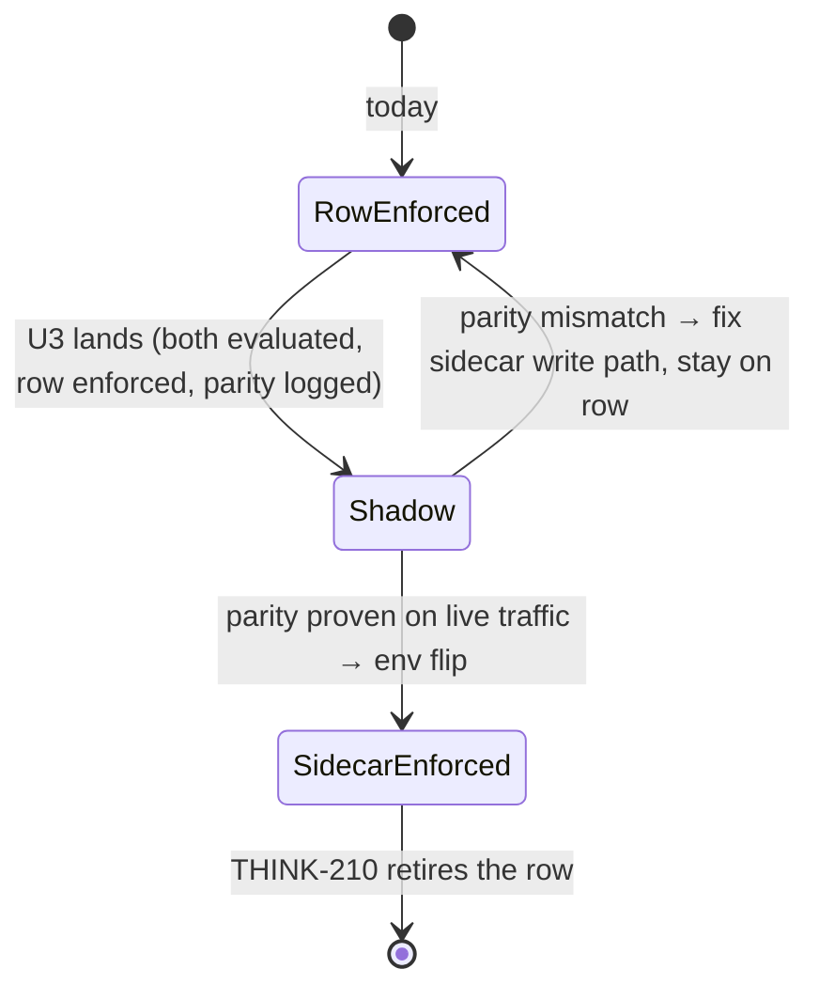

# Analyst Connection Hardening - Plan

Linear: THINK-229 (parent THINK-228). Item 0 of the issue (tool rename `run_query` → `query`) already landed in PR #3532 and is out of scope here.

---

## Goal Capsule

Harden the shipped ThinkWork Analyst Postgres broker (THINK-228) into a real Connection: replace both static secrets (the `analyst_reader` password and the tenant-wide broker bearer) with a trust-anchored credential chain, move policy into the signed Connection sidecar, make query budgets enforced product policy, add a scheduled reconciler that keeps the connection honest (reachability, IAM auth, grant introspection, schema drift) and withholds it loudly on failure, and land the smaller productization items (SQL redaction default, operator schema annotations, hosting-split decision record).

Authority: this plan > THINK-229 issue text (the issue's CloudTrail claim is corrected here) > THINK-228 plan (`docs/plans/2026-07-08-001-feat-thinkwork-analyst-plan.md`, background only). Repo conventions (CLAUDE.md) override all of it.

Stop conditions: stop and surface rather than guess if (a) the capability signing key cannot serve caller-context signing without weakening the sidecar trust chain, (b) shadow policy parity (U3) cannot be reached after real investigation, or (c) `GRANT rds_iam` on dev breaks a consumer other than the analyst broker. Everything else is implementer judgment.

---

## Product Contract

### Summary

The broker authenticates to Aurora with per-connect 15-minute RDS IAM tokens instead of a stored password, callers authenticate to the broker with per-invocation Ed25519-signed caller context instead of a shared bearer, the signed workspace sidecar becomes the single policy source (operations, budgets, approval, reserved role tier), budget exhaustion and probe failures degrade loudly for both operators and the model, and the audit trail stops retaining verbatim SQL by default.

### Problem Frame

THINK-228 shipped the right spine with three deliberate dev-only shortcuts its own plan flags as "not the template": a static password secret for `analyst_reader`, a static tenant-wide broker bearer ("anyone holding it can query as any caller of that tenant"), and policy anchored on the legacy `tenant_mcp_servers` row while the signed sidecar exists but only carries three fields. None of these postures can touch an external/customer Postgres. The dogfood also proved the failure mode this plan defends against: when the model loses data access silently, it fabricates results.

### Requirements

Credential chain:

- R1. The broker connects to Aurora as `analyst_reader` using per-connect RDS IAM auth tokens minted in the broker Lambda via `@aws-sdk/rds-signer`; the long-lived reader password secret is retired from the connect path once the IAM path is proven live.
- R2. A new `rds_iam` kind joins `tenant_credentials.kind` — metadata only (cluster endpoint, port, database, DB user, cluster resource ID), no `secret_ref`.
- R3. The broker's DB connection uses TLS with the bundled RDS CA and full verification, replacing the `sslmode=no-verify` shortcut.
- R4. Credential use is gated on trust: the broker refuses to serve a connection whose sidecar signature or `signed_content_sha` fails verification, and the refusal is loud (operator-visible reason, model-visible error), never a silent drop.
- R5. Per-invocation signed caller context (tenant + actor kind + optional thread/refresh identity, short expiry) replaces the static bearer for both callers (agent dispatch and headless refresh). Cutover is phased: the broker accepts both, the bearer is retired only after the signed path is proven live.
- R6. Credential-use audit comes from broker structured connect/query logs plus Postgres `log_connections` — not CloudTrail, which AWS documents as not logging IAM DB authentication.

Reconciler:

- R7. A scheduled reconciler probes the connection: reachability, IAM auth validity, a grant-introspection read-only verdict (`has_table_privilege` / `information_schema.role_table_grants`, never a live write probe), and a schema-drift hash against the committed semantic model.
- R8. A failing probe withholds the connection with a visible reason in the capability inspector AND a model-visible error naming the reason, so the model reports inability instead of estimating.
- R9. The sidecar schema reserves `role_tier` (reader today) so a future approval-gated write tier is additive, not a migration.

Policy source and budgets:

- R10. The signed Connection sidecar is the policy source: `enabled`, `permissions.operations`, budgets, and `role_tier`. The `tenant_mcp_servers` row degrades to transport/refresh plumbing; no new policy fields land on the row side.
- R11. The policy-source cutover is shadow-validated: sidecar-derived policy is evaluated alongside row-derived policy with parity logged, and enforcement flips to the sidecar only after parity is proven on live traffic.
- R12. The sidecar carries a budget block: max queries per delegated run and per tenant-day. Row/byte caps and the role `statement_timeout` stay broker-enforced as today; EXPLAIN cost remains advisory-only.
- R13. Budget *policy* is model-visible (static tool description prose + sidecar), the *remaining* count is surfaced per-call in the result envelope, and the live counter is host/broker-owned — never written to a workspace file.
- R14. Over-budget calls emit a `policy.blocked` compliance event and return a terminal error shape distinct from retryable SQL rejections, so the model stops instead of burning budget on unfixable retries.
- R15. The headless refresh path keeps its zero-model-token property: caller context is constructible without a thread, and budget enforcement on that path is broker-side.

Audit redaction and semantic model:

- R16. `data.query_executed` retains SQL as a hash + shape summary by default; verbatim retention becomes an operator opt-in carried in the signed sidecar policy. Tests assert known secret-shaped strings never appear in emitted payloads.
- R17. Operators annotate the semantic model through a separate committed overlay (table/column business notes, PII flags) that the generator merges into `SCHEMA.md`; the generated file stays hand-edit-free and the staleness gate keeps working.

Hosting split:

- R18. The external/customer Postgres hosting split is a design record only — the dual-plane clerk architecture (public MCP face → single VPC-attached executor Lambda) is documented with rationale, including the RDS Data API rejection; no clerk is built until the first non-Thinkwork database connects.

### Scope Boundaries

- The tool rename (issue item 0) shipped in PR #3532 — done, not re-planned.
- No VPC clerk Lambda, no RDS Proxy, no read replicas — design record only (R18).
- No write-tier role — only the `role_tier` enum reservation (R9).
- THINK-210 taxonomy retirement (dropping the `tenant_mcp_servers` row entirely) stays its own issue; this plan only stops adding policy to the row.

#### Deferred to Follow-Up Work

- Binding distillation from query fingerprints and full result-handle/taint dereference machinery — the issue keeps these open deliberately; the audit trail and envelope `result_file` already reserve what they need.
- Per-identity budget pools (delegated vs parent drawing from separate budgets) — v1 shares the tenant cap; split only if usage shows contention.
- Capturing the new institutional learnings (`docs/solutions/`) for RDS IAM minting, Lambda→Aurora CA trust, and reconciler overlap semantics after this ships.

---

## Planning Contract

### Key Technical Decisions

- KTD1 — **`rds_iam` lands on `tenant_credentials.kind`** (CHECK-constraint migration + TS union + `REQUIRED_FIELDS`), not on `tenant_mcp_servers.auth_type`. The issue's phrase "tenantCredentials enum" spans two axes in the repo; the credential-chain framing and the `bootstrap-credential-lease.ts` short-lived-kind precedent both point at the vault table. The broker itself reads its IAM connect config from env (Terraform-supplied cluster endpoint + resource ID + DB user); the credential row is the operator-facing record the sidecar's `credentialRefs` points at.
- KTD2 — **Dual-path connect transition.** AWS semantics: once `GRANT rds_iam` is applied, password login for that role stops working. The broker therefore ships IAM-first-with-password-fallback *before* the grant is applied: pre-grant, IAM connect fails and password carries; post-grant, password fails and IAM carries. `REVOKE rds_iam` is the rollback. No coordinated flip, no outage window. Token minting is per-(re)connect, not per-invocation — an established connection outlives the 15-minute token (AWS-documented), and the cached `pg.Client` pattern stays. One fresh-token retry on connect failure absorbs documented under-load PAM transients.
- KTD3 — **Caller context reuses the capability Ed25519 signer/verifier** (`packages/api/src/lib/capabilities/sidecar-signing.ts`): same key custody (Secrets Manager PEM, public key distributable to the broker env), new payload kind — a compact signed envelope `{kind: "analyst-caller-context", tenantId, actor: delegation|agent|system_refresh, threadId?, refreshId?, policyClaims, exp (≤5 min), bodyHash}` minted API-side at the two existing bearer-resolution sites. Domain separation must be cryptographic, not cosmetic: the existing signer covers only the canonicalized payload (the envelope `version`/`signed_by` are NOT in the signed bytes), so the `kind` tag lives **inside** the canonicalized payload and the broker verifier rejects any payload whose `kind` is not the caller-context tag — a signed sidecar can then never verify as a caller context under the shared key. If that seam proves awkward in the shared signer, take the second-Ed25519-keypair fallback (same Secrets Manager pattern) instead of shipping the shared key without an in-payload tag. This follows the `service-endpoint-vs-widening-resolveCaller` learning: identity is bound per call at one verified entrypoint, never a widened shared credential. `threadId` is optional by design so headless refresh can mint a `system_refresh` context (R15).
- KTD4 — **No CloudTrail audit claim.** AWS documents that neither CloudTrail nor CloudWatch logs IAM DB authentication (`generate-db-auth-token` is client-side SigV4). Replacement: broker structured logs carrying the verified caller identity per query (better attribution than a connect event anyway) + `log_connections` exported to CloudWatch on the cluster. This corrects the issue text.
- KTD5 — **Shadow-then-flip for the policy source** (brain-migrations pattern): dispatch computes policy from both the sidecar and the registry row, logs mismatches loudly, and enforcement reads the sidecar only behind an env-gated flip after live parity. Never enforce off the unproven source; the row keeps serving until then.
- KTD6 — **Tenant-day budget enforcement rides the existing trace write.** The broker already POSTs every query trace to the compliance events endpoint synchronously and fails the query if the trace can't land. That endpoint performs the day-count as an atomic post-increment-and-return (the count *includes* the current write), and the broker blocks the *next* query once the cap is reached. Residual overshoot is bounded at reserved-concurrency − 1 (3 today): concurrent same-tenant invocations can each pass the pre-check before any of their counts land — state this bound honestly; it is acceptable for a soft product budget, not a security boundary. No new counter table, no writer credential in the broker, no parallel cost vocabulary — enforcement state derives from the ledger that already exists. The per-delegation cap stays where it is (host-side in-loop counter, `analyst-query-cap.ts`), invisible and untouchable by the model; **dispatch populates the profile's `execution.maxQueriesPerRun` from the sidecar budget block in the same read that mints `policyClaims`**, so both enforcement points draw from the single signed policy source (R10) rather than a parallel profile-config value that can drift.
- KTD7 — **Policy claims ride the signed caller context.** The broker never reads workspace files; sidecar-derived per-call policy the broker must honor (budget caps, `retain_sql` toggle) travels as `policyClaims` inside the signed context, so the broker enforces exactly what the signed sidecar authorized without a second read path.
- KTD8 — **Probe verdict lives in `tenant_mcp_servers.runtime_metadata`** — operational state, not policy, so it doesn't violate R10's no-new-policy-on-the-row rule. Dispatch converts a failing verdict into a new closed-vocabulary drop reason (`CAPABILITY_DROP_REASONS`), which the existing `CapabilityInspectorView` renders without UI work; the delegation runner routes the same human-readable detail into the child's model-visible context (R8). "Composer" in the issue maps to the capability inspector surface — verified as the only place drop diagnostics render today.
- KTD9 — **Annotation overlay is a committed typed module** (`packages/database-pg/src/analyst/annotations.ts`), merged at generation time. `SCHEMA.md` stays generated-only so the staleness/drift test keeps its guarantee; annotations never override the sensitive-column audit (a PII flag adds a warning line, it cannot mark a column reviewed-safe).
- KTD10 — **RDS Data API rejected** for the broker and for the owned-Aurora leg of the hosting split: 1 MiB/call response cap (envelope allows 5 MB), writer-instance-only execution (read workload belongs on readers), and it authenticates via a Secrets Manager secret ARN — reintroducing the static secret this plan removes.

### High-Level Technical Design

Query flow after U1–U4 (both callers, one enforcement spine):

```mermaid
sequenceDiagram
    participant D as Dispatch / Canvas-refresh (API, trusted)
    participant B as Broker Lambda
    participant CE as Compliance events endpoint
    participant A as Aurora (analyst_reader)

    D->>D: verify sidecar signature + signed_content_sha
    D->>D: mint signed caller context {tenant, actor, policyClaims, exp}
    D->>B: POST /mcp/analyst (signed context; legacy bearer during phase-in)
    B->>B: verify context (Ed25519 public key), extract identity + policyClaims
    B->>B: gate SQL (EXPLAIN parse, single statement)
    B->>A: connect via RDS IAM token (mint per reconnect, TLS verify-full)
    A-->>B: rows
    B->>CE: data.query_executed (identity, sql hash) — synchronous
    CE-->>B: {accepted, tenantDayCount}
    B->>B: tenantDayCount > cap? next call → policy.blocked + terminal error
    B-->>D: envelope {columns, rows, stats, budget: {remaining, limit}}
```

Policy-source cutover states (KTD5):



### Assumptions

- The capability signing key may serve a second payload kind (caller context) without a key-separation concern — same custody, same trust root, distinct envelope `version`/kind field prevents cross-protocol confusion. If review disagrees, a second Ed25519 keypair under the same Secrets Manager pattern is a contained change to U2.
- The dev Aurora cluster tolerates `GRANT rds_iam TO analyst_reader` — no other consumer logs in as that role with a password (the bootstrap smoke test does; U1 updates it to the token path). Known in-repo collision, handled in U1: `drizzle/0227_analyst_reader_role.sql` asserts the role holds ZERO memberships and RAISEs otherwise; `GRANT rds_iam` deliberately introduces exactly one membership, so U1 relaxes that assertion to an `rds_iam`-only allowlist (in 0227's assert and in the new grant migration) rather than tripping it on every re-apply/drift check.
- Headless refresh is subject to the tenant-day budget (not exempt): its ceiling today is only row/byte caps, so folding it into the shared cap closes an uncapped path. If scheduled refreshes ever starve interactive use, the deferred per-identity pools pick that up.

---

## Implementation Units

### U1. RDS IAM credential chain for the reader connection

**Goal:** The broker connects as `analyst_reader` with minted 15-minute IAM tokens over verified TLS; the password path survives only as the pre-grant fallback. (R1, R2, R3, R6; KTD1, KTD2, KTD4)

**Dependencies:** none.

**Files:** `packages/lambda/analyst-reader-db.ts`, `packages/lambda/analyst-query-broker.ts` (connect logging), `packages/lambda/__tests__/analyst-reader-db.test.ts` (new), `packages/database-pg/src/schema/tenant-credentials.ts` + new hand-rolled migration `packages/database-pg/drizzle/` (CHECK constraint v-bump adding `rds_iam`; `GRANT rds_iam TO analyst_reader` as its own migration with drift markers), `packages/api/src/lib/tenant-credentials/secret-store.ts` (kind union + `REQUIRED_FIELDS`), `scripts/bootstrap-analyst-roles.sh` (token-path smoke), `scripts/provision-analyst-connector.mts` (seed the `rds_iam` credential row), `terraform/modules/app/lambda-api/handlers.tf` + `variables.tf` (broker env: cluster endpoint, DB user, cluster resource ID), `terraform/modules/app/lambda-api/iam-grouped.tf` (`rds-db:connect` on `arn:aws:rds-db:…:dbuser:<cluster-resource-id>/analyst_reader` — note: cluster *resource ID*, not ARN; `aws:SourceIp`/`aws:SourceVpc` conditions unsupported on this action), `terraform/modules/data/aurora-postgres/outputs.tf` (`cluster_resource_id`), `terraform/modules/thinkwork/main.tf` (threading).

**Approach:** `analyst-reader-db.ts` gains a connect strategy: mint token via `Signer` (hostname = cluster endpoint DNS, exact-case username), connect with `ssl: {ca: bundled global-bundle.pem, rejectUnauthorized: true}`; on auth failure and password secret present, fall back to the password path (pre-grant window); one fresh-token retry on transient PAM failure. Token minted per (re)connect only — the cached client stays. Structured log line per connect and per query carries the verified caller identity (lands fully in U2; until then, the tenant). Bundle the RDS CA PEM into the handler build. Migration ordering: code (dual-path) deploys first, then `GRANT rds_iam` applies to dev via psql before its PR merges (drift-gate convention), then the password secret is scheduled for retirement.

**Patterns to follow:** `packages/api/src/lib/bootstrap-credential-lease.ts` (short-lived credential kind shape), `drizzle/0160_compliance_event_types_plugins.sql` (CHECK constraint v-bump), `drizzle/0227_analyst_reader_role.sql` (role migration + apply-before-merge choreography).

**Test scenarios:**
- Token path: connect config present → `Signer.getAuthToken` called with cluster endpoint + `analyst_reader`; token used as password; TLS options carry the bundled CA with `rejectUnauthorized: true`.
- Fallback: IAM connect rejected + password secret present → password connect succeeds; both attempts logged.
- Retry: first IAM connect fails transiently → exactly one fresh-token retry, then error surfaces verbatim.
- Reuse: warm client survives past 15 minutes without re-mint; re-mint happens on reconnect after `ECONNRESET`.
- Kind: `rds_iam` credential row validates with metadata fields and no `secret_ref`; other kinds still require theirs.
- Migration: drift reporter recognizes the new markers; `to_regclass`-style guards keep the grant idempotent.

**Verification:** package suites (`pnpm --filter @thinkwork/lambda test`, `@thinkwork/database-pg test`) green; live dev: broker answers a query with the password secret value rotated to garbage (proves IAM path), `log_connections` line visible in CloudWatch.

### U2. Signed per-invocation caller context

**Goal:** Both broker callers present an Ed25519-signed caller context; the broker verifies it, keys audit and enforcement on it, and still accepts the legacy bearer until retirement. (R5, R6, R15; KTD3, KTD7)

**Dependencies:** none (parallel with U1).

**Files:** `packages/api/src/lib/analyst/caller-context.ts` (new: mint/verify + payload type), `packages/api/src/lib/analyst/caller-context.test.ts` (new), `packages/api/src/lib/mcp-configs.ts` (service_credential direct branch mints context into a header), `packages/api/src/handlers/canvas-refresh.ts` + `packages/api/src/lib/artifacts/canvas-refresh-core.ts` (system_refresh context, threadless), `packages/lambda/analyst-query-broker.ts` (verify; identity + `policyClaims` extraction; trace payload gains actor fields), `packages/lambda/__tests__/analyst-query-broker.test.ts`, `packages/api/src/lib/capabilities/sidecar-signing.ts` (export a payload-kind-aware sign/verify seam if the existing envelope can't carry a second kind cleanly), terraform (broker env: capability public key only — no new resources).

**Approach:** Mint API-side only (trusted handlers), at the two existing bearer-resolution sites; context travels as a dedicated header alongside the legacy `Authorization` bearer. Broker order: signed context if present → verify (signature over canonicalized payload, in-payload `kind` tag per KTD3, expiry, request binding) → else legacy bearer → else 401. Replay protection is stateless by constraint (no new infrastructure): the signed payload includes `bodyHash` (sha256 of the JSON-RPC request body), and the broker rejects a context whose hash doesn't match the request it arrives with. A captured context can therefore only replay the *identical read-only query* within its ≤5-minute window — bounded, audited (same identity), and harmless against a SELECT-only role. No nonce store; store the signed blob nowhere; logs carry only bounded identity evidence (tenant, actor kind, thread/refresh id). Each request served via the legacy bearer emits a structured marker so bearer retirement is gated on observed-zero bearer traffic, not assumption. Expiry ≤5 minutes; the mint happens per dispatch/refresh so clock skew is a non-issue. The `data.query_executed` payload gains `actor_kind`/`thread_id`/`refresh_id`.

**Patterns to follow:** `sidecar-signing.ts` canonicalization + envelope validation; `docs/solutions/best-practices/service-endpoint-vs-widening-resolvecaller-auth-2026-04-21.md` (narrow bound identity, never a widened shared credential).

**Test scenarios:**
- Valid delegation context → 200; identity lands in the trace payload.
- Tampered payload, wrong key, expired context, context bound to a different request body → 401 each, constant-time-safe failure text; replay of the identical request within expiry is accepted by design (bounded by expiry + read-only role) and carries the same audit identity.
- Threadless `system_refresh` context (no threadId) → valid; refresh path E2E still zero-token.
- Legacy bearer only → still accepted (phase-in); neither bearer nor context → 401.
- `policyClaims` round-trip: claims minted from the sidecar reach the broker verbatim under the signature.

**Verification:** lambda + api suites green; live dev: a real chat query and a real `refreshCanvasData` both produce traces carrying actor identity; a curl with a forged context gets 401.

### U3. Sidecar as policy source (shadow, then flip)

**Goal:** The signed sidecar carries budgets, approval, and `role_tier`; dispatch evaluates sidecar-derived policy against row-derived policy in shadow, and enforcement flips only after parity. (R9, R10, R11; KTD5)

**Dependencies:** none (parallel); U4 consumes its budget block.

**Files:** `packages/api/src/lib/capabilities/folder-write.ts` (sidecar write shape: `policy: {budgets: {maxQueriesPerRun, maxQueriesPerTenantDay}, retain_sql, role_tier: "reader", approval}`), `packages/api/src/lib/capabilities/connection-assignments.ts` (read shape + shadow evaluator), `packages/api/src/lib/capabilities/connection-assignments.test.ts`, `packages/api/src/lib/mcp-configs.ts` (parity comparison + loud mismatch log; env-gated enforcement flip), `packages/api/src/lib/analyst/connection-folder.ts` + `packages/api/src/lib/analyst/provision-connector.ts` (provision writes the policy block), `packages/api/src/lib/capabilities/sidecar-signing.ts` (extend `CapabilitySignedBy` union + `parseCapabilitySignatureEnvelope` allowlist if U5's reconciler re-signs), `scripts/provision-analyst-connector.mts`.

**Approach:** Extend the sidecar payload (it is signed — new fields are tamper-evident for free). Shadow mode: dispatch computes `{enabled, operations, budgets}` from both sources every build, logs structured parity records, enforces from the row. Flip: `ANALYST_POLICY_SOURCE=sidecar` env on the API switches enforcement, gated on TWO observations: clean parity on live dev traffic AND every provisioned analyst connection carrying a policy block (post re-provision) — a missing block is itself a parity FAIL, so a stale sidecar cannot present clean and then enforce defaults after the flip. No new policy fields on the row at any point. Re-run the provision refresh after the sidecar schema lands (the THINK-228 lesson: sidecars must be rewritten right after shape changes).

**Patterns to follow:** `docs/solutions/architecture-patterns/brain-migrations-keep-active-read-path-2026-06-15.md` (shadow-validate then flip), `docs/solutions/ui-bugs/managed-folder-removal-must-sever-record-first-2026-07-06.md` (single source of truth, record-then-derived ordering), `docs/solutions/architecture-patterns/first-party-provider-tools-stay-behind-policy-facades-2026-06-14.md` (enforcement stays behind the facade).

**Test scenarios:**
- Sidecar with policy block signs and verifies; a hand-edited budget value fails signature verification → connection withheld with visible reason (fail-closed AND loud — the skill-trust-gate lesson).
- Shadow parity: matching sources → no mismatch log; divergent budget → mismatch record naming both values.
- Flip: env unset → row enforces even when sidecar differs; env set → sidecar enforces.
- Legacy sidecar without a policy block → defaults applied, no crash, and the parity record reports FAIL (missing policy block is a parity failure, never a silent row-authoritative fallback — otherwise an un-refreshed sidecar reads clean in shadow and flips to wrong defaults).
- `role_tier` present and ignored by enforcement (reserved).

**Verification:** api suite green; live dev: provision refresh rewrites both agents' sidecars with the policy block, dispatch logs show parity clean for a real turn, flip env exercised on dev only after ≥1 day of clean parity.

### U4. Budget enforcement, envelope surfacing, policy.blocked

**Goal:** Budgets from the signed sidecar are enforced (per-run in the host loop, per-tenant-day in the broker), the model sees policy statically and remaining budget per call, and blocked calls emit `policy.blocked` with a terminal error shape. (R12, R13, R14, R15; KTD6, KTD7)

**Dependencies:** U2 (policyClaims transport), U3 (budget block).

**Files:** `packages/lambda/analyst-query-broker.ts` (tool description policy prose; day-count check; `policy.blocked` emission; terminal error shape), `packages/lambda/analyst-envelope.ts` (`budget: {remaining, limit}` field), `packages/lambda/__tests__/analyst-query-broker.test.ts`, `packages/api/src/handlers/compliance.ts` (POST /api/compliance/events — response gains `tenantDayCount` for `data.query_executed`), `packages/api/src/lib/compliance/event-schemas.ts` (`policy.blocked` redaction schema — enum value already exists, unemitted), `packages/agentcore-pi/agent-container/src/analyst-query-cap.ts` (cap value from policyClaims-aligned profile config; terminal-vs-retryable error handling), `packages/agentcore-pi/agent-container/tests/analyst-query-cap.test.ts`.

**Approach:** Two enforcement points, deliberately different owners: the per-run cap stays the host-side in-loop counter (model can't touch it), the tenant-day cap is broker-side using the day-count returned by the synchronous trace write (KTD6 — no new table, no writer credential, ledger stays canonical). Envelope `budget.remaining` decrements for every attempt including rejected ones (matching existing cap semantics). Error taxonomy: SQL rejections keep the verbatim retryable shape (self-repair loop unchanged); budget/withheld errors get a distinct terminal shape whose text instructs "stop querying; report findings from data you have" — the anti-fabrication phrasing that already works in `AnalystQueryCapError`. `policy.blocked` payload: tenant, actor identity, which cap, limit, observed count.

**Patterns to follow:** the existing envelope field style (`truncated`, `result_file`); `docs/solutions/observability/trusted-trace-cost-accounting-substrate.md` (budgets project from the ledger, no parallel vocabulary); `docs/solutions/architecture-patterns/inbox-items-headless-failures-have-no-reader-2026-07-07.md` — the named reader for `policy.blocked` is the existing Compliance module event list.

**Test scenarios:**
- Under cap → envelope carries correct `remaining`; over tenant-day cap → next call blocked, `policy.blocked` emitted once, terminal error text present.
- Failed/rejected attempts decrement `remaining`.
- Terminal error is not retried by the delegation loop; SQL rejection still is (assert both against the loop).
- Headless refresh over the day cap → refresh outcome degrades to a BAD/terminal binding outcome, never fabricated data, still zero model tokens.
- Trace endpoint unavailable → query fails closed (existing posture), no budget bypass.
- Anti-fabrication E2E (the THINK-228 dogfood repro): drive a delegation to exhaustion → final answer reports inability/partial data, no invented rows.

**Verification:** lambda + agentcore-pi + api suites green; live dev: lower the day cap on the dev sidecar, exhaust it in a thread, observe `policy.blocked` in the Compliance UI and the model's graceful degradation.

### U5. Scheduled connection reconciler

**Goal:** A scheduled probe keeps the connection honest — reachability, IAM auth, grant-introspection verdict, schema-drift hash — and a failing probe withholds the connection loudly on both surfaces. (R7, R8; KTD8)

**Dependencies:** U1 (IAM connect path).

**Files:** `packages/api/src/handlers/analyst-connection-reconciler.ts` (new), `packages/api/src/lib/analyst/connection-probe.ts` (new: probe logic + verdict shape), `packages/api/src/lib/analyst/connection-probe.test.ts`, `packages/api/src/lib/capability-diagnostics.ts` (new drop reason, e.g. `connection_probe_failed`), `packages/api/src/lib/mcp-configs.ts` (read probe verdict from `runtime_metadata`, `dropDiag` on failure), `packages/agentcore-pi/agent-container/src/agent-profile-delegation.ts` (withheld reason routed into the child's model-visible context), `terraform/modules/app/lambda-api/handlers.tf` (`aws_scheduler_schedule` rate(30 minutes) + DLQ per the async pattern; reserved concurrency 1).

**Approach:** The probe connects exactly as the broker does (IAM token, TLS) and runs read-only introspection: `has_table_privilege('analyst_reader', t, 'SELECT')` across the granted manifest, zero write-privilege assertion, `information_schema` grant listing — never an INSERT probe (sequences advance, triggers fire). Schema-drift = compare the live column descriptor hash against the committed `SCHEMA.md` generation inputs. Verdict `{status, reason, detail, checkedAt}` written to `tenant_mcp_servers.runtime_metadata` (operational state, not policy — R10 intact). Dispatch treats a failing verdict as withheld: server dropped with the new diagnostic reason (inspector renders it automatically) and the delegation runner injects the same detail into the child context so the model names the outage instead of estimating. Schedule at `rate(30 minutes)` with `maximum_retry_attempts = 0` + DLQ; probe runs are cheap and idempotent, so overlap is harmless, but coordinate with grant migrations (disable the schedule around a grant-migration window, the postgres-compat-views precedent).

**Patterns to follow:** `packages/api/src/handlers/skill-runs-reconciler.ts` + its `aws_scheduler_schedule`/DLQ wiring; `CAPABILITY_DROP_REASONS` closed-vocabulary discipline ("reasons mirror the REAL gates").

**Test scenarios:**
- Healthy probe → verdict ok, connection served, no diagnostic.
- Revoked SELECT on one manifest table → verdict fail names the table; dispatch withholds with the new reason; inspector text matches the model-visible error text (same string — parity assertion).
- Unexpected write privilege detected → verdict fail (grant surface breach is a withhold, not a warning).
- Schema drift (column type change) → verdict fail with drift detail.
- Probe can't connect at all → verdict fail `reason: unreachable`; stale verdict older than N hours also withholds (fail-closed on reconciler death).

**Verification:** api suite green; live dev: revoke one table grant, wait a cycle (or invoke the reconciler directly), see the withheld reason in the capability inspector and a chat turn where the model reports the outage; restore the grant, next cycle clears it.

### U6. SQL audit redaction default flip

**Goal:** `data.query_executed` stops retaining verbatim SQL by default; retention becomes signed sidecar policy. (R16)

**Dependencies:** U2 (retain toggle rides policyClaims), U3 (toggle lives in the sidecar policy block).

**Files:** `packages/lambda/analyst-query-broker.ts` (`emitQueryTrace`: `sql` → `sql_sha256` + `sql_shape` summary by default; verbatim only when the signed claim says so), `packages/lambda/__tests__/analyst-query-broker.test.ts`, `packages/api/src/lib/compliance/event-schemas.ts` (schema version bump for the payload shape).

**Approach:** Default payload carries `sql_sha256`, statement length, and a coarse shape summary (verb + relation list — derived from the already-parsed EXPLAIN gate output, no new parsing). The operator opt-in (`retain_sql: true` in the sidecar policy) restores verbatim SQL; the claim arrives signed (KTD7) so the broker never guesses. Bump `payload_schema_version`. Leak tests follow the external-workflow-ledger lesson: assert a known secret-shaped literal embedded in a test query never appears anywhere in the serialized event.

**Test scenarios:**
- Default: payload has hash + shape, no verbatim SQL substring.
- `retain_sql` claim present → verbatim retained; claim absent/false → hashed even if the legacy bearer path was used.
- Same SQL → same hash (dedupe/fingerprint property preserved for the deferred distillation work).
- Leak test: secret-string literal in the SQL text never serializes into the emitted event when hashing is on.

**Verification:** lambda suite green; live dev trace shows hashed payloads; flipping the dev sidecar toggle restores verbatim on the next query.

### U7. Operator schema-annotation overlay

**Goal:** Operators enrich the generated semantic model with business notes and PII flags without touching the generated file. (R17; KTD9)

**Dependencies:** none.

**Files:** `packages/database-pg/src/analyst/annotations.ts` (new: typed per-table/per-column overlay), `packages/database-pg/src/analyst/semantic-model.ts` (merge in `generateAnalystSchemaMarkdown` — table-note line under each `## table` heading, note/PII column in `formatColumnRow`), `packages/database-pg/__tests__/analyst-semantic-model.test.ts` (staleness gate keeps passing; annotation rendering cases), `packages/database-pg/generated/analyst/SCHEMA.md` (regenerated), `scripts/generate-analyst-schema.ts` (unchanged flow, consumes the overlay).

**Approach:** The overlay is code-reviewed input, same trust posture as the denylist. Annotations for unknown tables/columns fail generation (typo guard). PII flag renders a warning line and never interacts with `auditSensitiveCoverage` (the fail-closed audit stays independent). Regenerate + provision-refresh so workspace copies update.

**Test scenarios:**
- Table + column annotations render in the expected sections; un-annotated output byte-identical to today.
- Annotation referencing a nonexistent column → generation throws.
- PII-flagged column renders the warning; sensitive-audit behavior unchanged either way.
- Staleness gate: committed SCHEMA.md regenerated with overlay → gate green; stale copy → gate red.

**Verification:** database-pg suite green; dev workspace SCHEMA.md shows a sample annotation after provision refresh.

### U8. Hosting-split design record

**Goal:** The external/customer Postgres dual-plane design is decided and written down, unblocking the first customer conversation without building anything. (R18; KTD10)

**Dependencies:** none. **Execution note:** documentation only — no runtime code; verification is review, not tests.

**Files:** `docs/solutions/architecture-patterns/analyst-external-postgres-dual-plane-2026-07.md` (new), Linear THINK-229 comment mirroring it.

**Approach:** Record: public MCP face (validate/classify/audit, no DB route) direct-invoking a single VPC-attached executor clerk Lambda that owns the only DB security-group route and gives customer allowlists one stable egress identity; connection-storm posture decision (no RDS Proxy/replicas today — name the trigger that changes this); owned-Aurora stays on the direct IAM-token path; RDS Data API rejection rationale (KTD10); what the trust-anchored chain from U1/U2 already provides the clerk design for free. Test expectation: none — design document.

**Verification:** doc lands in the docs PR; Linear comment posted.

---

## Verification Contract

- Package suites (full, not filtered to new tests): `pnpm --filter @thinkwork/lambda test`, `@thinkwork/api test`, `@thinkwork/database-pg test`, `@thinkwork/agentcore-pi test`; `typecheck` for each touched package; prettier via the pinned binary (root `format:check` is broken on this machine).
- Migration gates: every hand-rolled migration carries drift markers and is applied to dev via psql before its PR merges (Migration Drift Precheck); grant migrations rehearse against a real-data copy when they touch the grant surface (Hindsight rehearsal precedent).
- Live-dev gates, in landing order: (1) IAM connect proof — query succeeds with the password secret rotated to garbage; (2) caller-context matrix — valid delegation/refresh contexts pass, forged/expired/replayed fail 401; (3) shadow parity clean over ≥1 day before the enforcement flip; (4) budget exhaustion E2E with the anti-fabrication assertion (model reports inability, no invented rows); (5) reconciler revoke/restore cycle visible in the inspector and in a chat turn; (6) headless `refreshCanvasData` re-verified zero-token after every broker-facing change.
- Security-sensitive units (U1, U2, U6) get a review pass before merge (repo code-review flow).

## Definition of Done

- U1–U8 merged to `main` via PRs (each unit or coherent pair per PR; worktree per branch; squash + auto-merge; post-merge Deploy watched).
- Live dev runs the full chain: IAM-token reader connection (password secret retired or retirement scheduled with a dated follow-up), signed caller context on both paths with the legacy bearer still accepted (bearer retirement is its own dated follow-up once proven — phased by design, not a loose end), sidecar-enforced policy after proven parity, budgets enforced with `policy.blocked` visible in the Compliance UI, reconciler on schedule with a DLQ.
- The THINK-228 acceptance demo re-run passes end-to-end on the hardened chain, plus the budget-exhaustion and withheld-connection anti-fabrication scenarios.
- Issue text corrected on Linear (CloudTrail claim) and the hosting-split design record posted.
- No dead dual-path code beyond the two deliberate phase-in seams (password fallback, legacy bearer), each carrying a dated follow-up to remove it; abandoned experiments cleaned from the diff.
- New institutional learnings captured in `docs/solutions/` (RDS IAM minting, Lambda→Aurora CA trust, reconciler overlap semantics).

---

## Sources & Research

- THINK-228 plan and shipped code: `docs/plans/2026-07-08-001-feat-thinkwork-analyst-plan.md`; broker `packages/lambda/analyst-query-broker.ts`; sidecar signing `packages/api/src/lib/capabilities/sidecar-signing.ts` (envelope, `CapabilitySignedBy` closed union at parse time); assignment read shape `packages/api/src/lib/capabilities/connection-assignments.ts` (reads exactly three fields today); dispatch auth `packages/api/src/lib/mcp-configs.ts` (both broker callers resolve the bearer from `auth_config.secretRef`).
- `policy.blocked` already exists in `COMPLIANCE_EVENT_TYPES` (declared, unemitted) and the `policy.` prefix passes the `audit_outbox_event_type_prefix_v3` CHECK — no migration needed, only emission + redaction schema.
- AWS (primary sources, verified 2026-07-08): IAM DB auth does **not** appear in CloudTrail/CloudWatch (documented limitation — this contradicts the issue text and drove KTD4); tokens are 15-min, connect-only, reusable, and don't affect established sessions; IAM policy resource uses the cluster **resource ID**; `GRANT rds_iam` disables password login for that role (drove KTD2's dual-path); IAM auth requires SSL (drove R3); Aurora IAM auth throttles ~200 new conn/s (irrelevant at broker QPS, reserved concurrency 4); RDS Data API: 1 MiB/call, writer-only, secret-ARN auth (drove KTD10).
- Institutional learnings applied: shadow-then-flip (`brain-migrations-keep-active-read-path`), fail-closed-but-loud signature gates (`skill-trust-gate-silently-drops-skills`), content-hash-scoped evidence + honest unsigned-dev posture (`skill-creator-draft-publish-trust-pipeline`), record-then-derived-state ordering (`managed-folder-removal-must-sever-record-first`), enforcement behind the facade (`first-party-provider-tools-stay-behind-policy-facades`), bound-identity endpoint over widened shared credential (`service-endpoint-vs-widening-resolvecaller-auth`), budgets on the existing ledger (`trusted-trace-cost-accounting-substrate`), named reader for every raised event (`inbox-items-headless-failures-have-no-reader`), redaction leak tests (`external-workflow-agent-step-bridges-need-resumable-ledgers`), apply-before-merge migration choreography (`manually-applied-drizzle-migrations-drift-from-dev`).
