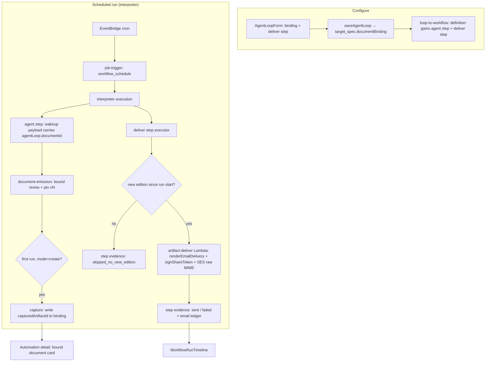
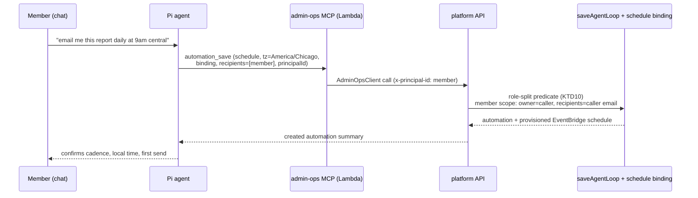

# Document Bindings for Automations + Email Delivery of Scheduled Reports - Plan

## Goal Capsule

- **Objective:** An automation can be bound to the living document it maintains (captured automatically on first run), and can deliver that document by email as a first-class workflow step — inline HTML summary + share link, with a print-clean share page — so "Sales Pipeline report, every Monday 8am, to a mixed internal/external list" works end to end. The agent itself is a creation surface: "email me this report each day at 9:00am central" spoken in chat ends with a created, scheduled, self-recipient automation.
- **Product authority:** This document (THINK-227 dialogue with Eric, 2026-07-08; conversational-scheduling delta added 2026-07-09 from TEI customer feedback). Server-side bound-document enforcement and the inert dispatch seam are already shipped (THINK-155 emission slice); this round activates and surfaces them.
- **Product Contract preservation (delta):** R11–R15, A6, F5, AE6–AE7 (agent-facing scheduling via Admin Ops MCP) were added 2026-07-09 from TEI customer feedback and planned the same day — KTD9–KTD11 and U10–U12 cover them, plus a new agent-path recipient-confirmation Key Decision from the same day's security review. Product Contract otherwise unchanged.
- **2026-07-09 review round:** five-persona doc review surfaced two P0s, both applied — the role-split's identity input hardened to server-threaded principal (KTD10), and U13 added because save-time convergence did not exist (THINK-216 shipped a migration script only; without U13 nothing this plan creates could execute a deliver step). One design fork deferred to Outstanding Questions (binding home vs entity retirement).
- **Open blockers:** SES production access for external recipients is a launch dependency (tracked outside this plan; sandbox-only stacks can ship the code behind it). Everything else is unblocked — THINK-213/216/217 landed the canonical workflow model this builds on.
- **Product Contract preservation:** changed R7, R8, AE2, and the payload Key Decision — the PDF attachment was dropped by user decision during planning (2026-07-08); the email carries inline HTML + share link, and the house render gains a print stylesheet so recipients print-to-PDF themselves. A compositor-native PDF render target is recorded as the intended future shape if an attachment is ever needed.

---

## Product Contract

### Summary

Give scheduled automations a document binding with first-run capture, dispatch the bound documentId into every run (activating the shipped enforcement seam), and add an email delivery workflow step that sends the maintained report — inline HTML body plus a tokenized share link — to an operator-configured recipient list. The house render prints cleanly so any recipient can produce a PDF from the share page. Refresh and delivery failures surface as run evidence on the canonical run timeline. The agent is a first-class creation surface: the Admin Ops MCP gains automation write tools so a user can create, list, update, and cancel scheduled reports conversationally — admins with general automation CRUD, regular members constrained to self-recipient reports they own.

### Problem Frame

The THINK-155 emission slice shipped everything below the configuration surface: a run whose payload carries a bound documentId revises exactly that document, keep-last-good protects readers from failed refreshes, and staleness is visible on the document. But no production dispatch path sets the binding — the shared wakeup builder threads `trigger.documentId ?? null` and every trigger constructor passes null — so the "one living report per automation" behavior is only reachable through test-only database injection. Meanwhile the refresh-failure signal writes an inbox item that nothing renders (the operator inbox was deprecated), so failures are invisible.

Separately, a maintained report that only lives in the app under-serves its real audience. The Monday-morning pipeline report is read by a mix of ThinkWork users and external stakeholders (execs, clients) who will never log in; today there is no way to push a document to them. An artifact→email rendering path (`renderEmailDelivery`) exists but is not wired to any automation.

Finally, the request arrives in chat, not in the Automations editor. A TEI user asked the agent "Create a scheduled job to email me this report each day at 9:00am central time" (2026-07-09) and the agent had nothing to call — it apologized and referred him to his administrator. The Admin Ops MCP already exposes read-only `automations_list`/`automation_get`; create/update/trigger tools were explicitly deferred in THINK-137. Customer expectation has made that deferral due.

### Key Decisions

- **Delivery is a typed workflow step, not automation config.** The email send is a step in the canonical workflow definition (THINK-214 taxonomy), executed after the agent step — it appears on the run timeline with its own evidence (recipients, sent/failed/skipped) and is reusable by any workflow. Consequence: report automations execute on the converged workflow path (THINK-216 machinery); the legacy agent-loop-only runner cannot carry a delivery step.
- **The email payload is inline HTML + a living share link — no PDF attachment.** Recipients read the report in the inbox and click through to the always-current document; the share page (the house render) carries a print stylesheet so anyone can print-to-PDF. Decided during planning after weighing a headless-chromium render Lambda (heavy, fragile) against a compositor-native PDF target (right shape, deferred): the attachment wasn't worth v1 infra. "What did Monday say" is served by the document's pinned version history.
- **First run creates and captures the binding.** The operator configures genre/title/space on the automation; run 1 emits the document and the binding locks onto the created artifact. The editor also allows binding to an existing document instead. No confirmation ceremony.
- **The share link points at the living document.** The emailed link is "the Sales Pipeline report" — always current. No versioned share links are built.
- **The operator-configured recipient list is the send grant.** Saving the workflow as an operator authorizes the standing sends; no per-recipient first-send approval detour. Sends are recorded in the existing outbound email ledger.
- **Failures are run evidence, not inbox items.** Scheduled-refresh failures and delivery failures land on the run timeline (run/step evidence). The readerless `document_refresh_failed` inbox writer is retired. Refresh failure is detected at turn end (turn finished without a successful finalize), not per-attempt — models routinely fail the plate contract on attempt 1 and self-correct.
- **The Automations editor remains the operator surface.** Binding and delivery configure where operators already build automations; the canonical workflow definition underneath carries them.
- **The agent creates automations through the Admin Ops MCP, not a native runtime tool.** Automation write tools join the existing read-only tools on `thinkwork-admin-ops` (un-deferring THINK-137's write surface), reusing its tenant pinning, principal threading, and per-agent assignment. Agent-created automations are canonical automations — the same `saveAgentLoop` path the editor uses, visible and editable there.
- **Authorization is role-split.** Admin/owner principals get general automation CRUD through the agent. Regular members get a constrained self-serve subset: create/list/update/cancel scheduled-report automations they own, with the delivery recipient list fixed to their own address. This preserves "the operator-configured recipient list is the send grant" for all third-party sends while making "email me this report daily" work for any member.
- **Member self-serve creates member-owned automations.** The agent never splices a member into an existing operator automation's recipient list (that would mutate the operator's send grant). Each member's subscription is their own automation maintaining its own document; duplicate-report proliferation is accepted for v1 and shared rosters stay deferred.
- **Agent-path recipient widening requires explicit confirmation.** When an admin's conversational request would add a recipient other than the requesting admin themselves (new or edited automation), the agent confirms the exact recipient list in chat before saving — so prompt-injected content the agent read mid-turn cannot silently widen a standing send grant. Version auditing remains the after-the-fact record; the confirmation is the before-the-fact gate.

### Actors

- A1. **Operator** — creates the automation, configures the maintained document (genre/title/space or existing document), the schedule, and the delivery step's recipient list. Owns the send grant.
- A2. **Run-as user** — the automation's acting identity; the emitted document's acting user (tenant-membership checked, shipped in THINK-155).
- A3. **Internal recipient** — a ThinkWork user on the recipient list; can follow the share link or open the document in-app.
- A4. **External recipient** — no ThinkWork login; consumes the inline email body and the public share link, and can print the share page to PDF.
- A5. **Platform (workflow interpreter + delivery step executor)** — runs the agent step, then the delivery step: renders the email body, mints/reuses the share link, and sends via the outbound email path.
- A6. **Member (self-serve requester)** — a regular (non-admin) tenant user who asks the agent in chat for a scheduled report; owns the automations they create this way, with themselves as the only recipient.

### Key Flows

- F1. **Bootstrap: first scheduled run**
  - **Trigger:** Operator saves an automation with a document binding config (genre/title/space) + delivery step, schedule fires the first run.
  - **Steps:** Agent step emits and finalizes the document (v1) → binding captures the created artifact → delivery step renders inline HTML + mints share link → emails the recipient list → run timeline shows agent step and delivery step evidence.
  - **Outcome:** Document exists in the space, binding points at it, recipients received edition 1.
  - **Covers:** R1, R2, R3, R6, R7.
- F2. **Steady state: weekly refresh + delivery**
  - **Trigger:** Monday 8am schedule.
  - **Steps:** Dispatch payload carries the bound documentId → agent step revises the same document (vN, keep-last-good) → delivery step emails inline summary + living link.
  - **Outcome:** One living document advances a version; inboxes get the new edition; the document's change log grows one entry.
  - **Covers:** R2, R4, R6, R7.
- F3. **Failed refresh**
  - **Trigger:** Scheduled run's turn ends without a successful finalize (or the run fails terminally).
  - **Steps:** Turn-end detection records a refresh failure as run evidence → document stamps `refresh_failed_at` (amber stale state, shipped) → delivery step does NOT send (no new edition) → run timeline shows the failure.
  - **Outcome:** Readers keep the last good edition; the operator sees the failure on the run, not in a dead inbox.
  - **Covers:** R5, R9.
- F4. **Delivery failure**
  - **Trigger:** Agent step succeeds; the email send fails (SES error, render failure, empty recipient list resolution).
  - **Steps:** Delivery step records failed evidence with the error; document refresh state is untouched (the refresh succeeded).
  - **Outcome:** Operator sees a succeeded refresh + failed delivery as two distinct step outcomes.
  - **Covers:** R9, R10.
- F5. **Conversational schedule creation (member self-serve)**
  - **Trigger:** A member, in a chat thread showing a report the agent produced, says "email me this report each day at 9:00am central time."
  - **Steps:** Agent calls the Admin Ops MCP automation-create tool with the member's principal → server authorizes the member path (member-owned, self-recipient) → automation is created with schedule (explicit timezone), document binding (the thread's document, or create-on-first-run for a fresh report), and a delivery step to the member's address → agent confirms schedule, timezone, and first-send expectation back in chat.
  - **Outcome:** A canonical automation exists, owned by the member, visible in the Automations editor; the member can later ask the agent to list, reschedule, or cancel it.
  - **Covers:** R11, R12, R13, R14.

### Requirements

**Document binding** (implements THINK-155's deferred binding requirement)

- R1. An automation can be configured with a document binding: either "create on first run" (genre, title, target space) or an existing document artifact.
- R2. Every dispatch path for a bound automation carries the bound documentId in the run payload (start and resume), activating the shipped server-side enforcement — the run revises exactly that document.
- R3. First-run capture: when the binding is "create on first run," the artifact created by run 1's finalize is recorded as the binding target without operator action.
- R4. The automation's detail surface shows the bound document (title, link, current version, last refresh state).
- R5. Scheduled-refresh failure is detected at turn end and recorded as run evidence; the per-attempt `document_refresh_failed` inbox writer is retired. The document-side amber stale indicator continues to work unchanged.

**Delivery (email)**

- R6. An email delivery step can be added to the workflow after the agent step, configured with: recipient list (free-form addresses) and subject template.
- R7. The delivered email contains an email-safe inline HTML rendering of the document and a tokenized public share link to the living document.
- R8. The document house render includes a print stylesheet so the share page prints to PDF cleanly (sensible pagination, margins, no app chrome).
- R9. Delivery step outcomes (sent, failed, skipped-because-no-new-edition) are recorded as step evidence on the run timeline, including recipient count and error summaries.
- R10. Outbound sends ride the existing email ledger (send attempted/succeeded/failed events) and send from the tenant's established from-address model.

**Conversational scheduling (agent-facing)**

- R11. The Admin Ops MCP exposes automation write tools — create, update (schedule, delivery, enabled state), and delete — alongside the existing read tools, so the agent can manage automations mid-turn. Automations created this way are canonical automations: same storage and dispatch as editor-created ones, visible and editable in the Automations editor.
- R12. Authorization is role-split on the requesting principal: admin/owner principals may perform general automation CRUD; regular members may create/list/update/cancel only automations they own whose delivery recipients are exactly their own address. Member requests outside that subset (other recipients, others' automations) are refused with a message that names the operator path.
- R13. The end-to-end conversational ask works in one thread: "email me this report each day at 9:00am central time" yields an automation with the correct schedule and an explicit IANA timezone, a document binding (the report already in the thread, or create-on-first-run for a new one), and a delivery step to the requester — and the agent confirms what it created (cadence, local time, first expected send).
- R14. Schedule times are honored in the user's stated timezone — never silently coerced to UTC — and the tool surface requires the timezone to be explicit.
- R15. Launch includes rollout, not just code: the admin-ops MCP server is provisioned and assigned to the customer tenant's agent and the automations-tools enablement gate is on for the pilot tenant (TEI first), verified by re-running the customer's original utterance.

### Acceptance Examples

- AE1. **Covers R1, R2, R3.** Given a new automation "Weekly Pipeline Report" bound as create-on-first-run (genre report, General space) with a Monday cron, when the first run completes, then exactly one document exists, the binding shows it, and a second manual trigger revises it to v2 rather than creating a sibling.
- AE2. **Covers R6, R7, R8.** Given the delivery step lists one internal and one external address, when a run finalizes v3, then both receive an email whose body renders the report content and whose link opens the public share page showing the current head — and printing that page produces a clean paginated document.
- AE3. **Covers R5, R9.** Given a run whose turn ends with every finalize attempt rejected, when the run completes, then the run timeline shows a refresh-failure with the last rejection reason, no email is sent, no inbox item is created, and the document shows the amber stale state.
- AE4. **Covers R9, R10.** Given SES rejects the send, when the delivery step fails, then the run shows agent step succeeded + delivery step failed with the SES error, and the email ledger records the failed attempt.
- AE5. **Covers R4.** Given a bound automation whose document is at v3 with a stale refresh state, when the operator opens the automation's detail page, then it shows the document's title (linked), current version, and refresh state, plus the existing share-link management (revoke) for the document.
- AE6. **Covers R11, R13, R14, R15.** Given a regular member at a rolled-out tenant chats "Create a scheduled job to email me this report each day at 9:00am central time" on a thread containing a report, when the turn completes, then an automation exists owned by that member — daily schedule at 09:00 America/Chicago, bound to the thread's document, delivery step to the member's address — the agent's reply states cadence, local time, and first expected send, and the automation appears in the Automations editor. A follow-up "actually make it weekdays only" and later "stop sending me that report" both succeed conversationally.
- AE7. **Covers R12.** Given a regular member asks the agent to add a colleague's address to their scheduled report (or to edit an operator-created automation), when the tool call is made, then the server refuses, and the agent relays that additional recipients need an operator in the Automations editor — while the same request from an admin principal succeeds.

### Scope Boundaries

- **Deferred for later:** PDF attachment — if ever needed, build it as a compositor-native PDF render target (digest markdown → house-styled PDF via a pure-JS library), never a headless-chromium screenshot; versioned/pinned share links ("view this edition" pages); document-level subscriptions ("email me when this document changes" independent of an automation); non-email delivery channels (Slack, webhook) — the step shape is channel-extensible by design; recipient rosters synced from space membership; disable-automation-after-N-consecutive-failures policy; shared subscription rosters for member self-serve (multiple members subscribing to one automation — v1 accepts one automation + document per member).
- **Out of scope:** per-recipient personalization; reply-to-thread round-trips from report emails; first-send approval flows for report recipients (the operator list is the grant); mirroring n8n or external delivery systems; the agent splicing recipients into operator-owned automations; the agent self-provisioning or self-assigning the admin-ops MCP (rollout is an operator/deploy action per R15).

### Dependencies / Assumptions

- The interpreter path (THINK-219) can execute a report automation as agent step + delivery step once the automation is converged — but convergence is NOT automatic today: THINK-216 shipped it as a one-time migration script, and `saveAgentLoop` creates no workflow row. U13 closes this by converging report-shaped automations at save time. The Automations editor remains the operator surface while the workflow definition underneath carries binding + delivery.
- SES production access is required before external recipients receive mail on production stacks; code ships independently of that grant. SES sandbox stacks can verify end to end with verified recipient addresses.
- Existing pieces this plan builds on and does not re-decide: bound-document emission enforcement, keep-last-good finalize, refresh-state stamps and the reader's staleness/change-log UI (THINK-155 + follow-ups), share links (THINK-208), the outbound email ledger and space from-address model, `renderEmailDelivery`/`renderForEmail`, and the deployed `artifact-deliver` Lambda.
- Conversational scheduling builds on the Admin Ops MCP's existing infrastructure (tenant-pinned keys, `principalId` threading of the real human, per-agent workspace assignment, the `AUTOMATIONS_AGENT_TOOLS_ENABLED` gate) and the read-only `automations_list`/`automation_get` tools already registered there. The member self-serve path is a deliberate, narrowly-scoped loosening of today's admin-only automation write gate (`requireAgentLoopAdmin` on `saveAgentLoop`) — a new server-side predicate for member-owned, self-recipient automations, not a general relaxation. Grounding: `/tmp/compound-engineering/ce-brainstorm/think227-agent-scheduling/grounding.md` (2026-07-09).

### Outstanding Questions

- **Deferred to implementation:** exact wording/layout of the email shell (button styling, footer); whether the deliver step's "skipped — no new edition" compares `last_refresh_at` or `head_version` against run start (both are available; pick during implementation).
- **Product decision, default recorded:** share-link expiry/rotation for emailed links — default is NO expiry (the link is "the living report"); the mitigation for leaked links is the existing revoke, surfaced on the automation detail card (U6). Revisit if a customer requires expiring links.
- **Data-sensitivity note:** report bodies and share pages may carry confidential company data delivered to unauthenticated external mailboxes; the operator-configured recipient list is the deliberate authorization for that exposure, and recipient-list edits are version-audited.
- **Resolve before planning:** none.
- **Deferred from 2026-07-09 review (decide during implementation):** the binding's dispatch-authoritative home sits on `agent_loop_versions.target_spec` (KTD1) while THINK-216's migration archives converged loops and THINK-218 moves authoring toward canonical workflows — for migrated/archived loops, dispatch resolution and U3's capture write-back traverse `workflows.source_agent_loop_id` back to the loop row. U13 specifies that link for new report automations; if the archived-loop write-back proves awkward in practice, the fallback is moving the binding's authoritative home onto the workflow entity (a KTD1 revision, not a product change).

---

## Planning Contract

### Key Technical Decisions

- **KTD1 — Binding lives in the automation target spec; `target_spec` is the single source of truth.** `agent_loop_versions.target_spec` (the sole dispatch authority since THINK-159) gains a `documentBinding` object: `{ mode: "create" | "existing", genre?, title?, spaceId?, artifactId?, capturedArtifactId? }`. The converged workflow definition carries the deliver *step* (structure), but the binding *value* is resolved from `target_spec` at dispatch time and passed into the run — so first-run capture writes back to exactly one place and persisted definition snapshots never go stale. No new table; no migration — target_spec is JSONB.
- **KTD2 — Payload parity across every dispatch site; the emission reader does not change.** The bound artifact id (`capturedArtifactId ?? artifactId`) is resolved by one shared helper and set at the **three trigger constructors** (`triggerAgentLoopRun.mutation.ts`, `job-trigger.ts` scheduled + deferred — each currently passes a literal `documentId: null` into the shared wakeup builder, which already threads `trigger.documentId ?? null` on start and resume) AND at the **interpreter path**: the workflow-schedule dispatch resolves the binding into the run input, and `buildWorkflowStepWakeupPayload` (`packages/agent-loops-core/src/interpreter-wakeup.ts`, consumed by `packages/lambda/workflow-step-dispatch.ts`) emits the same `agentLoop.documentId` snapshot block the emission reader already consumes — a compat block rather than teaching `document-emission.ts` a second path. Payload-parity is the known silent-degradation trap (docs/solutions/architecture-patterns/wakeup-processor-payload-parity-with-chat-agent-invoke-2026-06-12.md); the shared helper + a cross-site parity test (spanning agent-loops-core, api, and lambda constructors) enforce it.
- **KTD3 — Deliver is a new workflow step kind executed by the interpreter, which invokes the extended `artifact-deliver` handler.** New `deliver` kind: validator branch in `workflow-definition.ts`, `ExecutableWorkflowStep` + `planNextStep` case in `interpreter.ts`, executor arm in `workflow-step-dispatch.ts` `executeStep`/`StepExecutors`. The executor invokes the existing deployed `artifact-deliver` Lambda (RequestResponse, awaited — never fire-and-forget) with `{ artifactId, recipients, subjectTemplate, idempotencyKey: runId }`. `artifact-deliver` lives in `packages/api`, so it imports `signShareToken` directly — no package move.
- **KTD4 — New-edition gate in the deliver executor.** Before invoking delivery, the executor loads the bound artifact and compares its refresh state against the run's start time; no new edition → record `skipped_no_new_edition` step evidence and succeed the step without sending. This is also the converged-path turn-end refresh-failure signal surface.
- **KTD5 — Failure surfacing by runner.** Converged runs: deliver-step evidence (`workflow_step_failed` / skip evidence) via `recordWorkflowStepEvent`/`recordWorkflowStepOutput` — the existing `WorkflowRunTimeline` fold already renders `workflow_step_started/finished/failed` for any step kind. Legacy runs: `finalize-projection.ts` already distinguishes terminal failure and holds the documentId hook — the inbox raise there is replaced by run-level error projection (already persisted on `agent_loop_runs`) plus the document stamp. `recordDocumentRefreshFailure`'s inbox insert is removed; the `refresh_failed_at` stamping in `document-emission.ts` is untouched.
- **KTD6 — Print stylesheet ships in the compositor shell.** `@media print` + `@page` rules land in the house-render CSS (document compositor shell), so every render — share page included — prints cleanly. No share-page-specific work beyond verifying the share route serves the render unmodified.
- **KTD7 — Ship-inert ordering.** U1 (spec + storage) and U4 (step kind) land structurally before U2 activates payloads and U5 delivers mail, mirroring the THINK-155 inert-seam pattern (docs/solutions/architecture-patterns/inert-to-live-seam-swap-pattern-2026-04-25.md). All changes are additive JSONB/spec — no destructive migrations, no drift-gate interaction.
- **KTD8 — Idempotency and honest sends.** Delivery uses the run id as idempotency key against the email ledger (one send per run per recipient list) so a retried/resumed run never double-emails (docs/solutions/integration-issues/tei-resend-invite-idempotency-and-ses-sandbox-2026-06-15.md). SES sandbox rejections and missing env config must surface as failed step evidence — never silent success (docs/solutions/workflow-issues/env-gated-feature-dead-without-terraform-wiring.md).
- **KTD9 — Automation write tools follow the established admin-ops shape; the write seam is the `saveAgentLoop` GraphQL mutation.** New typed functions in `packages/admin-ops/src/automations.ts` call `saveAgentLoop`/`deleteAgentLoop` through the shared `AdminOpsClient`'s GraphQL path (no new REST route; note the shipped automations *reads* are deliberately direct-DB in `packages/lambda/automations-tools.ts` — the transport asymmetry is by design, don't unify). Tools register in `packages/lambda/admin-ops-mcp.ts`; the MCP Lambda threads `x-agent-id` itself from its runtime context (not a model argument) so the per-agent operation allowlist can evaluate. Tool set: `automation_save` (create/update — name, schedule + **required IANA timezone**, document binding, delivery recipients, enabled state) and `automation_delete`; reads reuse `automations_list`/`automation_get`, which become **principal-aware** (member → rows where `owner_user_id` = caller; admin → tenant-wide), enforced in the direct-DB read layer where those tools actually read. Schedule shape constraint: time-of-day schedules must be **cron** expressions — `automation_save` rejects `rate()` paired with a non-UTC timezone with an error naming cron, because EventBridge timezones only apply to cron and `rate()` fires at creation-time + interval (the known silent-coercion trap R14 forbids). Schedule provisioning happens inside the save via `syncAgentLoopScheduleBinding` (EventBridge failure surfaces synchronously).
- **KTD10 — Role-split authorization is a server-side predicate at the save/delete seam, and its identity input is server-threaded, never model-supplied.** A new predicate (modeled on `requireActingTenantMember`, `authz.ts:175`) replaces the bare `requireAgentLoopAdmin` call in `saveAgentLoop`/`deleteAgentLoop`: admin/owner principals keep today's general access; a plain-member principal passes only when the automation is member-scoped — `owner_user_id` = caller, `run_as_user_id` = caller, every delivery recipient parsed from the spec equals the caller's verified email (resolved from `users`, never trusted from input), and for existing-mode bindings the caller can read the bound artifact (same access check the document reader/share surfaces use). **Identity hardening (the P0 seam):** for these two mutations the admin-ops path must NOT honor model-supplied `args.principalId` and must NOT fall back to `auth.createdByUserId` (the key-mint user is typically an admin — the fallback silently escalates); the acting principal is injected server-side from the turn user's identity at the MCP call path (mirroring the canvas provider's actingUserId pattern), calls without a server-threaded principal fail closed, and bare-`service` classification is excluded from these mutations. Tool descriptions guide the model; the resolver is the wall — and its input is no longer attacker-influenceable.
- **KTD11 — Rollout is config + verification, and the write tools ship behind their own inert gate.** The existing `AUTOMATIONS_AGENT_TOOLS_ENABLED` is already `"true"` stage-wide (THINK-137), so it cannot gate the new writes — the write tools sit behind a NEW `AUTOMATIONS_AGENT_WRITE_TOOLS_ENABLED` flag (default unset → `notYetEnabled` inert responses), flipped per-stage as part of U12 rollout, preserving KTD7's ship-inert doctrine. The effective per-tenant gate is provisioning + assignment: `mcp-admin-provision` + `setSpaceTools`, PLUS assigning the `thinkwork-admin` skill with `save_agent_loop`/`delete_agent_loop` in `permissions.operations` for the tenant agent (the allowlist gate refuses otherwise). U12 includes a pre-deploy check enumerating tenants with admin-ops assigned, confirming only intended tenants (dogfood + TEI) before the flag flips. TEI acceptance is replaying the customer's original utterance as a regular member.

### High-Level Technical Design

Legacy (non-converged) scheduled automations follow the same left half — binding → payload → bound revise → capture — via `handleAgentLoopSchedule`; they have no deliver step, and refresh failures project onto the run row as today (minus the inbox item).

Conversational creation (F5) enters the same Configure column from chat instead of the form:

An admin principal takes the same path with the predicate's general-CRUD branch. Refusals (AE7) come from the predicate as structured errors the agent relays.

---

## Implementation Units

### U1. Binding spec, storage, and convergence mapping

- **Goal:** `documentBinding` exists on the automation target spec, round-trips through GraphQL, and maps into converged workflow definitions — structurally inert (nothing reads it yet).
- **Requirements:** R1.
- **Dependencies:** none.
- **Files:** `packages/agent-loops-core/src/target-spec.ts` (or the module declaring the target-spec types), `packages/agent-loops-core/src/loop-to-workflow.ts`, `packages/database-pg/graphql/types/agent-loops.graphql`, `packages/api/src/graphql/resolvers/agent-loops/saveAgentLoop.mutation.ts`, tests beside each.
- **Approach:** Add the `documentBinding` shape to the target-spec type + validation (create-mode requires genre/title/spaceId; existing-mode requires artifactId; reject both/neither). `saveAgentLoop` normalizes and persists it inside `target_spec`. `workflowDefinitionFromAgentLoopVersion` copies the binding onto the definition (workflow-level config or the agent step's config — pick whichever the interpreter can reach from `readWorkflowDefinition` without loading the loop row). Codegen in web/mobile/cli after the GraphQL change.
- **Patterns to follow:** existing target-spec normalization in `saveAgentLoop.mutation.ts` (`targetSpecFromLegacy`, `assertAgentThreadTargetHasSpace`).
- **Test scenarios:** valid create-mode binding persists and round-trips; valid existing-mode binding persists; binding with both modes or missing fields is rejected with a clear error; a loop version with a binding converges to a definition carrying it; a loop without a binding converges unchanged.
- **Verification:** `pnpm --filter @thinkwork/api test` + typecheck; codegen clean in all consumers.

### U2. Dispatch activation — every payload builder carries the bound documentId

- **Goal:** A bound automation's runs actually revise the bound document, on both runners.
- **Requirements:** R2. **Covers AE1** (second-trigger revise half).
- **Dependencies:** U1.
- **Files:** `packages/agent-loops-core/src/target-spec.ts` (shared resolver), `packages/api/src/graphql/resolvers/agent-loops/triggerAgentLoopRun.mutation.ts`, `packages/lambda/job-trigger.ts` (scheduled + deferred trigger constructors AND the workflow-schedule dispatch that builds the run input), `packages/agent-loops-core/src/interpreter-wakeup.ts`, tests beside each. `run-ledger.ts` needs no change — it already threads `trigger.documentId ?? null` identically on start and resume.
- **Approach:** One shared resolver (`boundDocumentIdFromTargetSpec(targetSpec): string | null` returning `capturedArtifactId ?? artifactId`). The three trigger constructors replace their literal `documentId: null` with the resolved value; the interpreter path resolves the binding at workflow-schedule dispatch into the run input, and `buildWorkflowStepWakeupPayload` emits the compat `agentLoop: { documentId }` block (KTD2). The emission-side reader is untouched.
- **Execution note:** write the cross-site parity test first — it is the regression this unit exists to prevent.
- **Patterns to follow:** the inert comments already at each site ("THINK-155 U5 (KTD4) … null until THINK-213's binding config exists"); payload-parity learning (docs/solutions/architecture-patterns/wakeup-processor-payload-parity-with-chat-agent-invoke-2026-06-12.md).
- **Test scenarios:** each dispatch site emits the bound id when the spec has a binding with capturedArtifactId; emits the explicit artifactId for existing-mode; emits null when unbound; parity test asserts every site (three trigger constructors + interpreter path) produces the same `agentLoop.documentId` for the same spec; resume payload matches start payload (already covered by the shared builder — assert it stays true).
- **Verification:** emission live path already enforces the rest (shipped); unit suites green.

### U3. First-run capture

- **Goal:** A create-mode binding locks onto the artifact its first successful run created — automatically and idempotently.
- **Requirements:** R3. **Covers AE1** (capture half).
- **Dependencies:** U1, U2.
- **Files:** `packages/api/src/lib/artifacts/document-emission.ts` (record created artifact onto the run context), `packages/api/src/lib/agent-loops/finalize-projection.ts`, `packages/api/src/lib/workflows/workflow-step-finalize.ts`, tests beside each.
- **Approach:** A run-derived finalize already knows the created/revised artifactId; expose it to the run projection (legacy: finalize-projection; converged: the agent-step finalize hook). When the automation's binding is create-mode with no `capturedArtifactId`, write the artifactId back into `target_spec.documentBinding.capturedArtifactId` only (KTD1 — target_spec is the single source of truth; the interpreter path resolves the binding from it at dispatch, so no definition-snapshot write) via a conditional update — first writer wins, later runs no-op.
- **Test scenarios:** first successful run captures; second run does not overwrite; failed first run captures nothing (next successful run captures); existing-mode binding never writes; capture is keyed to the automation whose run finalized (no cross-automation writes).
- **Verification:** unit suites; manual check on dev that the binding shows the created document after run 1.

### U4. `deliver` workflow step kind

- **Goal:** The interpreter can plan, execute, and evidence a delivery step; structurally complete with a stub executor (inert until U5 wires real delivery).
- **Requirements:** R6, R9 (evidence shape).
- **Dependencies:** U1 (definition mapping includes the step when a delivery config exists).
- **Files:** `packages/agent-loops-core/src/workflow-definition.ts`, `packages/agent-loops-core/src/interpreter.ts`, `packages/lambda/workflow-step-dispatch.ts`, `packages/agent-loops-core/src/loop-to-workflow.ts` (append deliver step after the agent step when the automation has delivery config), tests beside each.
- **Approach:** Add `deliver` to `WORKFLOW_STEP_KINDS` with a validator (recipients: non-empty array of plausible emails; subjectTemplate optional; documentBinding required on the workflow); include it in `ExecutableWorkflowStep` and `planNextStep`; add a `StepExecutors.deliver` arm in `executeStep`. Executor v1 behavior (this unit): evaluate the new-edition gate (KTD4) and record skip evidence; actual send lands in U5 behind the same executor seam. Step events use the existing `workflow_step_started/finished/failed` types so `WorkflowRunTimeline` renders without changes.
- **Patterns to follow:** the `http`/`emit_event` validator + executor arms; `recordWorkflowStepEvent`/`recordWorkflowStepOutput` usage in `workflow-step-dispatch.ts`.
- **Test scenarios:** definition with a deliver step validates; bad recipients/missing binding rejected with ThinkWork-level errors; interpreter plans deliver after agent step; executor records started/finished; new-edition gate: artifact refreshed after run start → proceeds, not refreshed → `skipped_no_new_edition` evidence and step succeeds; unknown-kind error unchanged for other kinds.
- **Verification:** interpreter + definition suites green; a converged definition snapshot shows the deliver step.

### U5. Delivery execution — extend `artifact-deliver` for recipient sends

- **Goal:** The deliver step sends real email: inline document rendering + share link, idempotent, honestly evidenced.
- **Requirements:** R7, R9, R10. **Covers AE2 (email half), AE4.**
- **Dependencies:** U4.
- **Files:** `packages/api/src/handlers/artifact-deliver.ts`, `packages/api/src/lib/artifact-delivery.ts`, `packages/api/src/lib/artifacts/share-tokens.ts` (import only), `packages/lambda/workflow-step-dispatch.ts` (executor invokes the Lambda), `terraform/modules/app/lambda-api/handlers.tf` (IAM invoke grant for workflow-step-dispatch → artifact-deliver, if not already granted), tests beside each.
- **Approach:** Extend the deliver request shape with `{ recipients: string[], subjectTemplate?, idempotencyKey }` — the share link is always included (R7; no toggle). Handler: mint/reuse the share link (`signShareToken` + the get-or-create share row logic factored from `mintArtifactShareLink`), render via `renderEmailDelivery` with a prominent "View the live report" button, send per-recipient (or single send with multiple To) through the existing SES raw-MIME path, record email-ledger events, and return per-recipient outcomes. Sanitize every header-bound input — strip/reject CR/LF in `subjectTemplate` and each recipient address before MIME assembly, not only in the body. Idempotency: skip if a ledger send for `idempotencyKey` already succeeded. The step executor awaits the invoke (RequestResponse) and converts the response into step evidence. Recipient-list changes are inherently audited: editing the list writes a new `agent_loop_versions` row, so the standing grant has a version history.
- **Execution note:** verify the deployed env carries SES config on dev before claiming the unit done — a missing env var degrades to silent no-op per prior learnings; the step must record failure, not success, in that case.
- **Patterns to follow:** existing raw-MIME construction in `artifact-deliver.ts`/`thread-reply.ts` (CRLF stripping, multipart/alternative); email-channel ledger event types; no-fire-and-forget invoke rule.
- **Test scenarios:** happy path returns sent outcomes and writes ledger events; share link in the body resolves to `${baseUrl}/share/<token>`; SES error → failed outcome with error summary, ledger `send_failed`; duplicate idempotencyKey → no second send, `skipped` outcome; empty recipient list rejected at validation (U4) so handler never sees it; subject or recipient containing CR/LF is rejected/stripped and never reaches MIME headers (header-injection guard); renderEmailDelivery output contains document content (smoke on a real digest).
- **Verification:** `pnpm --filter @thinkwork/api test`; live dev send to a verified sandbox recipient.

### U6. Failure surfacing + run/automation UI

- **Goal:** Refresh and delivery outcomes are visible where operators look; the dead inbox writer is gone.
- **Requirements:** R4, R5, R9. **Covers AE3, AE5.**
- **Dependencies:** U2 (bound runs exist), U4 (step evidence exists).
- **Files:** `packages/database-pg/src/ledger-db.ts` (retire the `document_refresh_failed` inbox insert; keep any stamp helpers), `packages/api/src/lib/agent-loops/finalize-projection.ts` (turn-end evidence instead of inbox raise), `apps/web/src/components/agent-loops/AgentLoopDetail.tsx` + `AgentLoopRunDetail.tsx` (bound-document card: title, link, version, refresh state; run rows show refresh-failure), `apps/web/src/components/workflows/WorkflowRunTimeline.tsx` (only if deliver evidence needs a friendlier label than the generic step render), GraphQL additions for the binding on the AgentLoop type, tests beside each.
- **Approach:** Deletion first: surgically remove the inbox insert from `recordDocumentRefreshFailure` (the stamp write and the insert share that function — keep the `refresh_failed_at` stamping intact) and its tests. Legacy turn-end: finalize-projection's existing terminal-failure branch keeps writing run error fields — extend the error payload with the document context it already holds. Web: automation detail renders the bound document card from the binding + artifact lookup — title link, current version, refresh state, and the document's existing share-link management (revoke, from THINK-208) so a leaked emailed link can be cut off from the same surface; run detail surfaces refresh failure state.
- **Test scenarios:** terminal documentId-carrying failure writes run error evidence and NO inbox row; recovered run (failed attempt then successful finalize in one turn) records no failure; automation detail shows bound document with current version and stale state; unbound automation shows no card.
- **Verification:** api + web suites; dev check that AE3's forced failure shows on the run detail.

### U7. Automation editor UI — binding + delivery configuration

- **Goal:** Operators configure the maintained document and the recipient list where they already build automations.
- **Requirements:** R1, R4 (edit-side), R6.
- **Dependencies:** U1 (spec shape).
- **Files:** `apps/web/src/components/agent-loops/AgentLoopForm.tsx`, `apps/web/src/components/agent-loops/agent-loop-types.ts`, component tests beside each.
- **Approach:** A "Maintains a document" section on the form: mode toggle (create on first run → genre/title/space fields, genre options from the plate registry; bind existing → document picker scoped to document-kind artifacts); a "Email delivery" section (recipient chips input with email validation, optional subject template) rendered when a binding exists. Draft state writes into the target-spec draft the form already patches.
- **Patterns to follow:** existing target-kind sections in `AgentLoopForm` (`agent_thread`/`routine`/`workflow` bodies); draft-first create UX per composer conventions.
- **Test scenarios:** create-mode fields persist to the spec draft; existing-mode picker persists artifactId; recipients validate (reject malformed emails, allow multiple); removing the binding clears delivery config; saved automation re-opens with the binding populated.
- **Verification:** `pnpm --filter @thinkwork/web test` + typecheck; visual check on local dev.

### U8. Print stylesheet in the house render

- **Goal:** Any house-rendered document — the share page included — prints to a clean paginated PDF via the browser.
- **Requirements:** R8. **Covers AE2 (print half).**
- **Dependencies:** none (parallel).
- **Files:** the compositor shell CSS in `packages/api/src/lib/artifacts/document-compositor.ts` (or its shell/style module), `packages/api/src/lib/artifacts/document-compositor.test.ts`.
- **Approach:** Add `@media print` + `@page` rules to the compiled shell: page margins, avoid breaking inside tables/stat blocks (`break-inside: avoid`), suppress any interactive-only affordances, ensure backgrounds legible in print (borders over background fills where needed). Verify the share route serves the render without wrapping chrome.
- **Test scenarios:** compiled render contains the print rules; snapshot/regression on the shell CSS; no change to screen rendering (existing compositor snapshots stay green).
- **Verification:** compositor suite; manual print-preview of a dev share page.

### U9. Live acceptance smoke on dev (AE1–AE4)

- **Goal:** The Monday-report story proven end to end on the deployed stack, with evidence.
- **Requirements:** all. **Covers AE1, AE2, AE3, AE4.**
- **Dependencies:** U1–U8 and U13 merged and deployed (U13 is what makes a saved bound automation actually run converged).
- **Files:** scratch harness only (pattern: the THINK-155 smoke harness — saveAgentLoop + trigger + poll); no repo files beyond a docs/solutions writeup if gotchas surface.
- **Approach:** Create a converged (workflow_schedule) automation with create-mode binding + delivery to a verified sandbox recipient; run 1 → AE1 (document created + captured, email received); manual trigger → AE2 (revise to v2, new email, share link opens, print preview clean); force a failing finalize (hidden-genre or contract-violating instructions per the THINK-155 smoke playbook) → AE3; break the recipient (SES sandbox unverified address) → AE4. Clean up dev artifacts afterward.
- **Test scenarios:** the four AEs are the scenarios; capture screenshots/IDs as evidence on THINK-227.
- **Verification:** all four AEs demonstrated with linked evidence; Linear updated.

### U10. Admin Ops MCP automation write tools

- **Goal:** The agent can create, update, and delete automations mid-turn — `automation_save` and `automation_delete` live on `thinkwork-admin-ops`, speaking the binding + delivery shapes from U1/U4 — and the read tools become principal-aware.
- **Requirements:** R11, R12 (read-scoping half), R13, R14 (tool-surface half).
- **Dependencies:** U1 (binding spec), U4 (deliver step config shape), U11 (merges before or with this unit — the write tools never deploy without the role-split predicate behind them).
- **Files:** `packages/admin-ops/src/automations.ts` (new typed fns via the client's GraphQL path) + `packages/admin-ops/src/automations.test.ts`, `packages/lambda/admin-ops-mcp.ts` (tool registration; server-side principal + agent-id threading) + `packages/lambda/__tests__/admin-ops-mcp.test.ts`, `packages/lambda/automations-tools.ts` (principal-aware read scoping) + its tests, the Pi-side MCP call path that injects the turn user's identity (locate the mcp_configs/header assembly seam; mirror the canvas provider's actingUserId pattern), `terraform/modules/app/lambda-api/handlers.tf` (new `AUTOMATIONS_AGENT_WRITE_TOOLS_ENABLED` config key, default unset).
- **Approach:** Mirror the `tenants_update`/`routine_repo_commit` registration shape, with the KTD10 identity hardening: these two tools take NO `principalId` argument — the acting principal arrives server-threaded (runtime-injected header), and the handler fails closed when it is absent; the MCP Lambda threads `x-agent-id` from its own context so the operation allowlist can evaluate (KTD9). `automation_save` input: id (update) or name (create), **cron** schedule expression (reject `rate()` + non-UTC timezone with an error naming cron), **required IANA `timezone`** (the tool schema and description force the model to resolve "9am central" to `America/Chicago` and confirm back), document binding (create-on-first-run fields or existing artifactId — U1's shape), delivery recipients + optional subject, enabled. Tool descriptions state the member constraints (self-recipient only, own automations only) and the admin confirmation rule (recipients beyond the requester must be confirmed in chat before calling save — the Key Decision's before-the-fact gate). Read scoping: `listAutomations`/`getAutomation` in `automations-tools.ts` gain a principal parameter — member role filters to `owner_user_id` = caller, admin keeps tenant-wide. Both write tools sit behind the NEW `automationsAgentWriteToolsEnabled()` gate with `notYetEnabled` inert responses (KTD11).
- **Patterns to follow:** `admin-ops-mcp.ts` write-tool registration; `packages/admin-ops/src/routines.ts` typed-fn shape; the inert-when-disabled guard on `automations_list`; the canvas provider's actingUserId threading for the identity injection.
- **Test scenarios:** Covers AE6 (tool-call half). `tools/list` includes both new tools; `automation_save` create issues the downstream GraphQL call with the server-threaded principal and full payload; call without a server-threaded principal is refused (never falls back to `createdByUserId`); model-supplied principalId argument is ignored/rejected; update round-trips an id; missing timezone rejected at the tool schema; `rate(1 day)` + `America/Chicago` rejected with cron-naming error; tenant pinning holds; both write tools inert when `AUTOMATIONS_AGENT_WRITE_TOOLS_ENABLED` unset (read tools unaffected); member-role list returns only owned rows, admin list returns tenant-wide; downstream error text (including EventBridge provisioning failure) passes through to the tool result.
- **Verification:** `packages/admin-ops` + `packages/lambda` suites green; typecheck.

### U11. Role-split authorization predicate

- **Goal:** Member self-serve is enforced at the resolver seam: admins keep general automation CRUD; a plain member can only save/delete member-scoped automations (own, self-recipient), regardless of what the tool sends.
- **Requirements:** R12, R14 (enforcement half).
- **Dependencies:** U1 (binding/delivery live in the spec the predicate parses).
- **Files:** `packages/api/src/graphql/resolvers/core/authz.ts` (new predicate), `packages/api/src/graphql/resolvers/agent-loops/saveAgentLoop.mutation.ts`, `packages/api/src/graphql/resolvers/agent-loops/deleteAgentLoop.mutation.ts` (swap `requireAgentLoopAdmin` for the new predicate in both), tests beside each.
- **Approach:** New `requireAgentLoopWriteAccess(ctx, tenantId, input)`: admin/owner branches behave as `requireAdminOrServiceCaller` today, EXCEPT bare-`service` classification (no `x-principal-id`, no `x-agent-id`) is excluded for these two mutations (KTD10 — a headerless call must not pass unconditionally); the member branch (modeled on `requireActingTenantMember`) additionally requires `owner_user_id` = caller principal, `run_as_user_id` = caller, every delivery recipient in the submitted spec equal (case-insensitive) to the caller's verified email — resolved from `users`, never trusted from tool input — and, for existing-mode bindings, that the caller can read the bound artifact (reuse the document reader/share access check). On update/delete, the member must also own the *existing* row (load-and-check before write, so a member cannot capture an operator automation by submitting their own id as owner). Refusals are structured `forbidden` errors whose messages name the operator path (AE7's relay text).
- **Execution note:** write the crafted-bypass tests first — a member submitting third-party recipients, someone else's automation id, a mismatched run-as user, an asserted foreign principalId, or an unreadable bound artifact is the threat model this unit exists for.
- **Patterns to follow:** `requireActingTenantMember` (authz.ts:175) for the member-branch shape; the live-DB-role rule (no role caching, R16 comment in authz.ts).
- **Test scenarios:** Covers AE7. Admin cognito/apikey callers unaffected on all existing paths (regression); member creates self-scoped automation → allowed; member with a second recipient → forbidden with operator-path message; member updating an operator-owned automation → forbidden; member deleting own automation → allowed; member spoofing `ownerUserId` of another member → forbidden; recipient compared against DB email, not input-claimed email; member binding an artifact they cannot read (existing mode) → forbidden; bare-service call (no principal, no agent id) → forbidden on these two mutations while other service paths stay unchanged.
- **Verification:** `pnpm --filter @thinkwork/api test` (full suite — authz touches everything); typecheck.

### U12. TEI rollout + conversational acceptance smoke (AE6–AE7)

- **Goal:** The customer's original utterance works end to end on a rolled-out tenant, with evidence.
- **Requirements:** R15, R13, R14. **Covers AE6, AE7.**
- **Dependencies:** U9 (core pipeline proven), U10, U11, U13 — deployed.
- **Files:** none beyond a docs/solutions writeup if gotchas surface; rollout is config (provision + assignment + flag).
- **Approach:** **Pre-deploy check first:** enumerate tenants with the admin-ops server assigned and confirm only intended tenants (dogfood + TEI) have it before flipping `AUTOMATIONS_AGENT_WRITE_TOOLS_ENABLED` on a stage (KTD11 — the flag is stage-wide; assignment is the tenant boundary). Rollout per tenant: `mcp-admin-provision`, `setSpaceTools` assignment, AND the `thinkwork-admin` skill assignment with `save_agent_loop`/`delete_agent_loop` in `permissions.operations` for the tenant agent — without the last step every write refuses at the allowlist gate. On dev first: as a non-admin member replay "Create a scheduled job to email me this report each day at 9:00am central time" on a thread holding a report → verify the automation exists AND the provisioned schedule is `cron(0 9 * * ? *)` with `ScheduleExpressionTimezone=America/Chicago` (not a rate() expression — R14's assertion), bound document, self recipient; the agent's confirmation states cadence/local time/first send; follow-ups "make it weekdays only" and "stop sending me that report" work (AE6); then ask to add a colleague → refusal + operator-path relay (AE7). Repeat the rollout steps on TEI's stack (their flag state and provisioning must be confirmed there — flag values verified in this repo's terraform apply per-stage).
- **Test scenarios:** AE6 and AE7 are the scenarios, plus the cron/timezone assertion on the provisioned EventBridge schedule; capture thread links + automation ids on THINK-227.
- **Verification:** both AEs demonstrated on dev; TEI rollout completed and the original utterance replayed successfully there (or the TEI step explicitly handed to the customer-deploy lane with its runbook).

### U13. Save-time convergence for report automations

- **Goal:** An automation with a binding + delivery config is born converged: saving it creates/updates its linked canonical workflow, publishes the definition, and syncs a `workflow_schedule` trigger — so its runs execute on the interpreter path that can carry the deliver step.
- **Requirements:** enables R6, R7, R13 end to end (AE1/AE2/AE6 are unreachable without it — the deliver step exists only on the interpreter path, and today nothing converges save-time: `workflowDefinitionFromAgentLoopVersion` has no production caller and `saveAgentLoop` only syncs schedule/webhook bindings).
- **Dependencies:** U1 (binding in the definition mapping); U4 consumes its output.
- **Files:** `packages/api/src/graphql/resolvers/agent-loops/saveAgentLoop.mutation.ts` (convergence hook), `packages/api/src/lib/workflows/` (workflow upsert + publish + `syncWorkflowScheduleBinding` — reuse the pieces the THINK-216 migration script exercises), `packages/agent-loops-core/src/loop-to-workflow.ts` (already maps definitions — consumed, not rewritten), tests beside each.
- **Approach:** When a saved automation carries a document binding or delivery config (the report shape this plan introduces), `saveAgentLoop` upserts the linked workflow keyed on `source_agent_loop_id`, publishes a definition from `workflowDefinitionFromAgentLoopVersion`, and syncs the schedule as a `workflow_schedule` trigger instead of (or superseding) the legacy `agent_loop_schedule` binding — one automation, one schedule, one runner. Automations without the report shape keep today's legacy path untouched (no big-bang convergence; the migration script remains the bulk path for existing loops). Dispatch-time binding resolution (U2's interpreter path) reads `target_spec` via the workflow's `source_agent_loop_id` link; U3's converged capture writes back through the same link.
- **Patterns to follow:** the THINK-216 migration script's workflow upsert/publish/trigger sequence (`packages/api/scripts/migrate-agent-loops-to-workflows.mts`); `syncAgentLoopScheduleBinding` for the sync-on-save shape.
- **Test scenarios:** saving a bound automation creates a workflow row keyed on `source_agent_loop_id` with a published definition containing agent + deliver steps; re-saving updates the definition (no duplicate workflows); the schedule provisions as a `workflow_schedule` trigger exactly once (no double-fire with a leftover `agent_loop_schedule` row); an automation without binding/delivery saves exactly as today (regression); EventBridge provisioning failure still surfaces synchronously.
- **Verification:** `pnpm --filter @thinkwork/api test` + agent-loops-core suite; a dev-saved bound automation shows a linked workflow and its scheduled run executes on the interpreter.

---

## Verification Contract

| Gate | Command / check | Applies to |
|---|---|---|
| API suite | `pnpm --filter @thinkwork/api test` | U1–U6, U8, U11, U13 |
| Web suite | `pnpm --filter @thinkwork/web test` | U6, U7 |
| Agent-loops-core suite | `npx vitest run` in `packages/agent-loops-core` | U1, U2, U4 |
| Admin-ops + lambda suites | `npx vitest run` in `packages/admin-ops` and `packages/lambda` | U10 |
| Typecheck (all touched packages) | `pnpm -r --if-present typecheck` | all |
| Codegen freshness | regenerate web/mobile/cli after GraphQL edits | U1, U6 |
| Payload parity | the U2 cross-builder parity test passes | U2 |
| Authz regression | full api suite green with the predicate swapped in; crafted-bypass tests pass | U11 |
| Live smoke | U9's AE1–AE4 on dev with evidence | release gate |
| Conversational smoke | U12's AE6–AE7 on dev + TEI rollout verified | release gate |

---

## Definition of Done

- A converged automation with a create-mode binding produces exactly one living document across repeated runs (AE1), delivers inline-HTML + share-link email on each new edition (AE2), records refresh failures as run evidence with no inbox rows (AE3), and records delivery failures as failed step evidence with ledger entries (AE4) — all demonstrated live on dev.
- All four legacy dispatch builders and the interpreter payload builder pass the shared parity test; no builder ships a literal `documentId: null` for a bound automation.
- The `document_refresh_failed` inbox writer is removed; `refresh_failed_at` stamping and the reader's amber state are unchanged.
- Print preview of a dev share page paginates cleanly.
- A regular member's chat utterance "Create a scheduled job to email me this report each day at 9:00am central time" ends with a created, correctly-timezoned, self-recipient automation and a confirming agent reply (AE6); asking for a third-party recipient is refused server-side with the operator-path relay (AE7) — demonstrated live on dev, with the crafted-bypass authz tests green.
- TEI rollout completed (admin-ops provisioned + assigned to their agent, automations tools enabled) and the customer's original utterance replayed there — or the TEI step explicitly handed off with a runbook.
- Full suites + typecheck green; PRs merged to main; deploy watched green; THINK-227 updated with evidence and closed (or tails filed).
