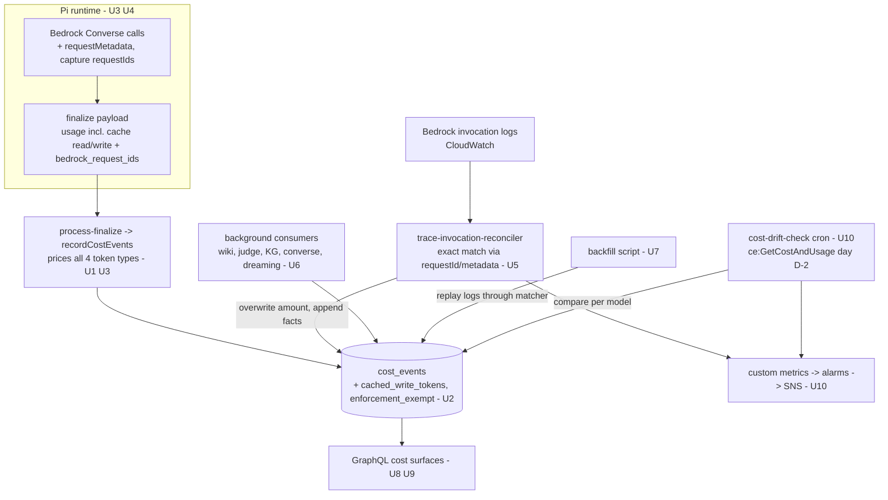

# Cost Reporting Bedrock Parity - Plan

## Goal Capsule

- **Objective:** Recorded LLM costs match actual AWS Bedrock billing within ≤1% per model per day, on every environment, with drift alerted instead of discovered by customers. Cached-token costs are counted, priced, and surfaced in the UI.
- **Product authority:** THINK-245 (issue body + reconciler-status comment) and this document's Product Contract.
- **Authority hierarchy:** Product Contract > Planning Contract > per-unit Approach. The trace-ledger conventions in `docs/solutions/observability/trusted-trace-cost-accounting-substrate.md` (append-only facts, no silent upgrade, single cost-confidence vocabulary) bind all units.
- **Stop conditions:** Surface instead of guessing if (a) Bedrock `requestMetadata` proves unusable from the pi-ai provider (fall back to response-requestId capture alone and say so), (b) a customer-environment backfill would change amounts before the customer has been notified, or (c) verified marketplace rates contradict the rates in U1.
- **Open blockers:** None. All origin questions resolved in the Planning Contract.

---

## Product Contract

**Product Contract preservation:** unchanged from the requirements-only artifact, except one Dependencies bullet updated with the now-verified kimi-k2.5 rate ($0.60/$3.00, no prompt caching on Bedrock) and the Outstanding Questions resolved into the Planning Contract.

### Summary

Make recorded costs true in two layers: the Pi runtime reports complete per-call usage (cache read/write included, with request identity) at write time, and the existing invocation-log reconciler — fixed so it can actually match — corrects recorded amounts to provider-billed figures. All environments are backfilled to true historical numbers, cache costs become first-class in every UI cost surface, and an automated reconciliation check alerts on drift.

### Problem Frame

App-recorded LLM costs run 2–9x below actual Bedrock billing (TEI ~5x: $0.42 recorded vs $2.29 billed; McPherson ~9x: $1.57 vs $14.45; dev ~2x even after a manual correction). A customer (Brett, TEI) noticed the numbers "seem low" before we did — the platform has no mechanism that would have caught it.

Three failure classes compound: cache read/write tokens are reported by Bedrock separately from input tokens and are never priced in any of the three cost paths (cache-write alone was TEI's largest Sonnet billing line, recorded as $0); agent-loop turns undercount kimi input tokens ~15x because the automated reconciler that should correct them has matched zero invocations on every environment since it shipped on June 25 (the Pi runtime attaches no request identity, so matching degrades to ambiguous model+time); and several background Bedrock consumers write no cost events at all. The reconciler's silent failure is itself part of the problem frame: the correction machinery existed and nobody knew it wasn't working.

### Key Decisions

- **Fix the existing reconciler's matching; do not rebuild it.** The trace-ledger reconciler (`trace-invocation-reconciler` Lambda) already reads Bedrock invocation logs and overwrites recorded amounts with provider-billed figures. Its only defect is that it cannot identify which invocation belongs to which turn. The runtime supplying request identity turns its degraded model+time matching into exact matching.
- **Two-layer truth: runtime-first recording, reconciler as corrector/verifier.** The runtime reports complete usage so recorded costs are approximately right immediately; the reconciler corrects them to provider-billed truth; the reconciliation check verifies the corrected totals against Cost Explorer. No single layer is trusted alone.
- **≤1% daily per-model tolerance, not to-the-cent.** Every token is counted and priced at the correct rate — that part is exact. The automated check against Cost Explorer tolerates ≤1% daily per-model drift because Cost Explorer rounds and lags ~24h; literal cent-equality would be a false-alarm generator.
- **Backfill everything, with budget grace.** Historical cost events on all environments are corrected to true amounts as far back as retained invocation logs allow. Corrected/backfilled amounts are flagged and excluded from budget-window enforcement so no user trips a limit retroactively; dashboards show true numbers.
- **Background consumers metered per-tenant with a system category**, not attributed back to originating threads. True tenant totals without plumbing origin identity through every background job; per-entity attribution is deferred.
- **Cache costs are presented as part of the cost story, not a user-actionable line item.** Cache read/write appear alongside input/output wherever token/cost breakdowns show, framed as platform behavior (caching reduces total cost), since end users cannot control it.

### Requirements

**Complete usage capture**

- R1. Cache-read and cache-write tokens are captured end-to-end from the runtime through finalize into cost events, for every model call.
- R2. Cache tokens are priced in all three cost paths (turn finalize, span enrichment, invocation reconciler) at correct per-model rates (Anthropic: cache-write 1.25× input, cache-read 0.1× input; marketplace rates for other models).
- R3. Model pricing lives in one shared source consumed by all cost paths, with an explicit, correct entry for kimi-k2.5 (and every model the platform invokes) replacing the three duplicated substring-fallback maps.
- R4. Every Bedrock caller writes cost events: wiki-compile, document conformance judge, KG extraction, thread-idle-memory-learning, brain dreaming, and model-proxy/model-converse. Background consumers record per-tenant with a source category identifying the consumer (e.g. `wiki_compile`), so dashboards can split conversation vs system spend.

**Reconciliation to provider truth**

- R5. The Pi runtime attaches request identity to every Bedrock Converse/ConverseStream call — `requestMetadata` carrying turn/trace identifiers, and/or per-call response requestIds recorded into trace evidence — so the reconciler matches invocations exactly instead of by model+time.
- R6. The reconciler prices cache tokens when computing provider amounts (invocation logs already carry the cache token counts).
- R7. Historical cost events on dev, TEI, and McPherson are corrected to provider-billed amounts as far back as retained invocation logs allow.
- R8. Reconciler health is observable and alerted: a steady state of zero matches, or a growing unreconciled backlog, pages/notifies operators. Silent failure of the correction layer is treated as an incident, not a log line.

**Verification and drift detection**

- R9. An automated reconciliation check compares recorded daily per-model cost totals against AWS Cost Explorer (respecting its ~24h lag) and alerts when drift exceeds 1%.
- R10. Acceptance is verified against real billing data: after the fix and backfill, TEI and McPherson daily totals reconcile with Cost Explorer within the tolerance.

**Budget enforcement safety**

- R11. Backfilled/repriced historical amounts are flagged and excluded from budget-window and cost-cap enforcement; only spend recorded after the fix counts toward limits. No user or tenant crosses a budget threshold as a side effect of the correction.

**UI surfacing**

- R12. Every surface that shows token or cost breakdowns — turn detail, thread rollups, activity/cost dashboards — shows cache-read and cache-write token counts and their dollar contribution alongside input/output, in one consistent cost shape.
- R13. Tenant/operator cost dashboards can distinguish conversation spend from background/system spend (per R4 categories).

### Acceptance Examples

- AE1. **Covers R1, R2, R12.** Given a turn whose Bedrock calls report 10k input, 2k output, 50k cache-write, and 200k cache-read tokens, when the turn finalizes, then the cost event records all four token counts and the amount equals input×rate + output×rate + cacheWrite×1.25×inputRate + cacheRead×0.1×inputRate, and the turn's cost view shows all four lines.
- AE2. **Covers R5.** Given an agent-loop turn making 8 same-model Bedrock calls in one minute, when the reconciler runs, then all 8 invocations match that turn exactly (no `ambiguous-provider-logs` or `no-provider-log` outcomes for turns executed after the fix).
- AE3. **Covers R7, R11.** Given a TEI user whose recorded spend rises from $0.42 to ~$2.29 after backfill, when budget enforcement evaluates their current window, then the backfilled delta is excluded and the user is not paused or blocked; the tenant dashboard shows the corrected total.
- AE4. **Covers R8.** Given the reconciler matches zero invocations for a sustained period on any environment, when the health check evaluates, then an operator alert fires (this exact condition existed silently from Jun 25 to Jul 9 and must never be silent again).
- AE5. **Covers R9.** Given a day where recorded per-model totals diverge >1% from Cost Explorer, when the drift check runs after CE data lands, then an alert names the environment, model, and gap.
- AE6. **Covers R4, R13.** Given a wiki-compile run for a tenant, when it invokes Bedrock, then a cost event lands for that tenant with a system source category, and the tenant dashboard's background-spend split includes it.

### Scope Boundaries

- **Deferred for later:** attributing background-consumer costs to the originating thread/document/space (per-tenant system category only in v1); customer-facing billing/invoicing built on these numbers; cost forecasting or anomaly detection beyond the 1% drift alert.
- **Deferred to Follow-Up Work:** deleting the superseded `span-enrichment` cron (it is built but has no scheduler; this plan updates its pricing import for consistency and stops there); Slack/PagerDuty alert transports beyond the SNS email topic; wiring `alarm_actions` on the pre-existing compliance alarms.
- **Not part of this bug:** empty `tool_costs` arrays on analyst/CRM tool turns — verified correct (those tools invoke no child models).

### Dependencies / Assumptions

- Bedrock model-invocation logging is enabled and retained on all three environments (verified 2026-07-09: logs flowing on dev, TEI, McPherson) — backfill depth is bounded by log retention.
- Cost Explorer is the reconciliation reference and lags ~24h; the drift check compares day D-2, never same-day.
- TEI and McPherson receive the fix via customer-controller deploys; the backfill for those environments runs after their deploy, and the customers should be told why their historical numbers change before it runs.
- Verified rates (2026-07-09, AWS docs): kimi-k2.5 (`moonshotai.kimi-k2.5`) is $0.60/$3.00 per M input/output in us-east-1/us-west-2 with **no prompt caching on Bedrock**; Anthropic cache multipliers are 1.25× input for 5-min cache-write (2× for 1h) and 0.1× for cache-read; Converse `inputTokens` excludes cache tokens. Re-verify against the AWS Pricing API before shipping hardcoded rates (U1).

### Sources / Research

- THINK-245 — issue body (root causes traced to code with file:line) and 2026-07-09 comment (per-environment reconciler status, why matching fails, scope implications).
- Reconciliation baselines (2026-07-09, Cost Explorer): TEI $2.29 billed vs $0.42 recorded; McPherson $14.45 vs $1.57; dev $291.49 (Jun 1–Jul 9) vs ~$150 recorded post-manual-correction. Worst day TEI Jul 5: $0.97 vs $0.12.
- Code anchors (independently verified 2026-07-09): pricing gap in `packages/api/src/lib/cost-recording.ts:245-248`; duplicated pricing maps in `packages/api/src/handlers/crons/span-enrichment.ts:27-42` and `packages/api/src/lib/trace-ledger/bedrock-invocation-reconciler.ts:147-153`; reconciler match scoring at `bedrock-invocation-reconciler.ts:722-765`; missing `cached_write_tokens` column in `packages/database-pg/src/schema/cost-events.ts`; runtime capture without transport in `packages/agentcore-pi/agent-container/src/server.ts:740-756` (API-side finalize types already declare optional `cachedWriteTokens` — `packages/api/src/lib/chat-finalize/types.ts:27` — the runtime never sends it); budget summation in `packages/api/src/lib/user-budget-enforcement.ts:196-212`.
- Trace-ledger institutional conventions: `docs/solutions/observability/trusted-trace-cost-accounting-substrate.md` and origin plan `docs/plans/2026-06-25-003-feat-trace-cost-substrate-plan.md` (THNK-74).
- AWS references: prompt-caching usage semantics and supported models (docs.aws.amazon.com/bedrock/latest/userguide/prompt-caching.html), Bedrock CUR usage-type grammar including `*-cache-read-input-token-count` / `*-cache-write-input-token-count` lines (cost-mgmt-understanding-cur-data.html), kimi-k2.5 model card and Bedrock pricing page.

---

## Planning Contract

### Key Technical Decisions

- **KTD1 — One pricing module in `packages/api/src/lib/model-catalog/pricing.ts`.** Exports per-model `{ inputPerMillion, outputPerMillion, cacheReadPerMillion, cacheWritePerMillion }` and a `lookupModelPricing(modelId)` (exact-id first, then substring fallback). `cost-recording.ts` keeps its DB-first lookup (`getTenantModelPricing` → `modelCatalog` table) and falls back to this module; `span-enrichment.ts` and the reconciler import it directly. Kimi entries carry zero cache rates (no caching on Bedrock).
- **KTD2 — Request identity via a pnpm patch to `@earendil-works/pi-ai`.** The runtime's Bedrock calls live in the external package's `dist/providers/amazon-bedrock.js`, already pnpm-patched for region routing. Extend that patch: attach `requestMetadata` (thread_turn_id, trace_run_id when available) to Converse/ConverseStream requests via an env/context hook the container sets per turn, and surface each response's `$metadata.requestId` so the container accumulates `bedrock_request_ids` into the finalize payload (API-side plumbing already exists: `process-finalize.ts` passes `bedrockRequestIds` into trace evidence). The in-repo `createBedrockChildModelCaller` (`server.ts:716-756`) gets the same treatment natively. Maintenance cost: re-cut the patch on every pi-ai bump (same convention as the existing patch).
- **KTD3 — Drift check calls the Cost Explorer API directly** (`ce:GetCostAndUsage`, net-new IAM), not the CUR-files-in-S3 pipeline. CUR/Data Exports are gated on `billing_export_bucket_name` and not configured on customer accounts; CE works on every account with one IAM grant. It queries day D-2 per model grouped by USAGE_TYPE and must sum **all four** token-type lines (`*-input-tokens`, `*-output-tokens`, `*-cache-read-input-token-count`, `*-cache-write-input-token-count`) — AWS names missing cache lines as the most common reconciliation gap. The existing CUR-based `cost-bill-reconciler` stays as-is for `bill-reconciled` facts where exports exist.
- **KTD4 — Budget grace is a first-class `enforcement_exempt` boolean column on `cost_events`** (default false), not a metadata flag: three separate raw-SQL summation paths need the exclusion predicate (`user-budget-enforcement.ts:196-212`, `checkBudgetAndPause` SUMs in `cost-recording.ts:366-419`, and the cost-summary resolvers' enforced buckets), and a column keeps those predicates trivial and indexable. The backfill sets it on every historical row whose amount it raises. Reconciliation-state semantics are untouched — no new state, per the no-parallel-vocabulary convention.
- **KTD5 — Alerting is a net-new SNS topic with subscription endpoints from a Terraform variable, following the existing CloudWatch metric-alarm pattern.** The reconciler and drift-check Lambdas emit custom metrics (namespace `Thinkwork/Costs`, `Stage` dimension, EMF or PutMetricData); alarms on sustained `matched == 0` with nonzero unreconciled, and on drift > 1%, publish to the topic. No existing alarm anywhere has actions wired — this plan wires only its own two alarms.
- **KTD6 — Historical correction is a one-shot backfill script that replays retained invocation logs through the reconciler's own matching** (`reconcileBedrockInvocationsForTurn` / the ranked-candidate matcher) over historical windows, writing corrected amounts + append-only facts + `enforcement_exempt`. It reuses the production matcher so backfilled rows carry real provider evidence (`invocation-reconciled`), consistent with the no-silent-upgrade rule. Run per environment via `npx tsx` with stage credentials (dev first, TEI/McPherson after their deploys and customer notice). Pre-fix turns have no request identity, so the historical matcher accepts model+time matches when a window has exactly one candidate and sums unambiguous multi-candidate windows turn-agnostically per day where per-turn attribution is impossible — daily tenant totals become true even where per-turn splits stay approximate; rows corrected this way keep an `approximate_attribution` marker in metadata.
- **KTD7 — Metering background consumers reuses the exported `recordCostEvents`** (`cost-recording.ts:215`, already takes a `source` tag and `recordCompute:false`) rather than a new emitter. Each consumer threads its tenantId to the Bedrock call site (wiki's `invokeClaude` gains a required context arg) and picks a stable `request_id` for idempotency under the `(request_id, event_type)` unique key.

### High-Level Technical Design

Two-layer truth with verification, and where each unit sits:

Reconciliation-state lifecycle is unchanged (from THNK-74): `unreconciled/error` → `runtime-reported` → (`mismatch` |) `invocation-reconciled` → `bill-reconciled`; facts are append-only and state derives from the highest-ranked fact. This plan adds no states — grace rides the orthogonal `enforcement_exempt` column.

### Assumptions

- Bedrock's Converse `requestMetadata` is accepted for the models in use and echoed into invocation logs (the reconciler already reads `requestMetadata` from log records at score 90). If a model rejects it, response-requestId capture alone still yields score-100 matches.
- `modelCatalog` DB pricing, where present, remains authoritative over the fallback module (existing behavior).
- CE figures for a closed day are stable by D-2; 1% tolerance absorbs CE rounding.

### Sequencing

Foundations (U1, U2) → truth capture (U3, U4, U5) → coverage (U6) → correction (U7) → surfacing (U8, U9) → drift/alerting (U10). U4 can proceed in parallel with U1–U3. U7 must not run on a customer environment before that environment has the deployed fix and the customer has been told.

---

## Implementation Units

Unit index:

| U-ID | Title                                                | Key files                                                                      | Depends on |
| ---- | ---------------------------------------------------- | ------------------------------------------------------------------------------ | ---------- |
| U1   | Shared pricing module                                | `packages/api/src/lib/model-catalog/pricing.ts`                                | —          |
| U2   | cost_events columns                                  | `packages/database-pg/src/schema/cost-events.ts`, new migration                | —          |
| U3   | Cache tokens end-to-end + pricing in all cost paths  | finalize-client, process-finalize, cost-recording, span-enrichment, reconciler | U1, U2     |
| U4   | Runtime request identity                             | pi-ai patch, `agent-container/src/server.ts`                                   | —          |
| U5   | Reconciler exact-match verification + health metrics | `bedrock-invocation-reconciler.ts`, `handlers/trace-invocation-reconciler.ts`  | U3, U4     |
| U6   | Meter background Bedrock consumers                   | wiki/bedrock, conformance-judge, KG extractor, model-converse, dreaming/idle   | U1         |
| U7   | Graced historical backfill + budget exemption        | new backfill script, `user-budget-enforcement.ts`, `cost-recording.ts`         | U2, U5     |
| U8   | GraphQL cache/source fields + resolvers + codegen    | `costs.graphql`, cost resolvers, codegen ×4                                    | U2, U3     |
| U9   | Web + mobile cache-cost UI                           | web usage/analytics/thread components; mobile timelines                        | U8         |
| U10  | Drift-check cron + SNS alerting                      | new handler, `handlers.tf`, IAM, SNS                                           | U5         |

### U1. Shared pricing module

- **Goal:** One source of per-model rates including cache rates; the three duplicated fallback maps import it.
- **Requirements:** R2, R3.
- **Dependencies:** none.
- **Files:** `packages/api/src/lib/model-catalog/pricing.ts` (new), `packages/api/src/lib/model-catalog/pricing.test.ts` (new), `packages/api/src/lib/cost-recording.ts`, `packages/api/src/handlers/crons/span-enrichment.ts`, `packages/api/src/lib/trace-ledger/bedrock-invocation-reconciler.ts`.
- **Approach:** Entries for every model the platform invokes — union of the three current maps plus `moonshotai.kimi-k2.5` at $0.60/$3.00 (cache rates zero) and haiku/gpt-oss entries missing from some maps. Anthropic entries carry cacheRead = 0.1× input, cacheWrite = 1.25× input. Exact-model-id lookup first, substring fallback second, explicit default. `cost-recording.ts`'s DB-first tier order is preserved; only its fallback map is replaced. Before merging, re-verify each hardcoded rate via the existing `resolveBedrockPricing` helper in `packages/api/src/lib/model-catalog/aws-price-list.ts` (Pricing API service code `AmazonBedrockFoundationModels`) and record the verification date in a comment.
- **Patterns to follow:** existing 3-tier lookup shape in `cost-recording.ts:102-158`; shared-lib style of `packages/api/src/lib/cost-confidence.ts`.
- **Test scenarios:** exact-id lookup beats substring (input `moonshotai.kimi-k2.5` → 0.60/3.00, not a `kimi-k2` substring hit); Anthropic entry returns cache rates at the documented multipliers; unknown model falls to default and flags it; kimi cache rates are zero; each of the three consumer call sites resolves the same rate for the same model id (regression test pinning cross-path consistency).
- **Verification:** `pnpm --filter @thinkwork/api test` green; grep shows no remaining local pricing map in span-enrichment or the reconciler.

### U2. cost_events columns

- **Goal:** Schema carries cache-write counts and the budget-grace flag.
- **Requirements:** R1, R11.
- **Dependencies:** none.
- **Files:** `packages/database-pg/src/schema/cost-events.ts`, new `packages/database-pg/drizzle/NNNN_*.sql` via `db:generate`.
- **Approach:** Add `cached_write_tokens` (integer, nullable, mirroring `cached_read_tokens`) and `enforcement_exempt` (boolean, not null, default false). Journal migration via `pnpm --filter @thinkwork/database-pg db:generate`; additive columns, no CHECK-constraint change (reconciliation states untouched). Ship the column before any code that writes it (same PR is fine — deploy runs `db:push` first).
- **Patterns to follow:** `cached_read_tokens` at `cost-events.ts:46`; migration conventions in `packages/database-pg/drizzle/0189_trace_cost_substrate.sql`.
- **Test scenarios:** Test expectation: none — schema-only; behavior is covered by U3/U7 tests that write and read the new columns.
- **Verification:** `db:generate` produces an additive migration; `pnpm --filter @thinkwork/database-pg build` and typecheck green.

### U3. Cache tokens end-to-end + pricing in all cost paths

- **Goal:** All four token counts flow from the runtime into cost events and into every amount calculation.
- **Requirements:** R1, R2, R6. **Covers AE1.**
- **Dependencies:** U1, U2.
- **Files:** `packages/pi-runtime-core/src/finalize-client.ts`, `packages/agentcore-pi/agent-container/src/server.ts`, `packages/api/src/lib/chat-finalize/types.ts`, `packages/api/src/lib/chat-finalize/process-finalize.ts`, `packages/api/src/lib/cost-recording.ts`, `packages/api/src/lib/cost-recording.test.ts`, `packages/api/src/lib/trace-ledger/record-trace-evidence.ts`, `packages/api/src/handlers/crons/span-enrichment.ts`, `packages/api/src/lib/trace-ledger/bedrock-invocation-reconciler.ts` (+ its test).
- **Approach:** Thread `cached_write_tokens` through each shape the research enumerated: finalize-client usage builder (alias `cacheWriteInputTokens|cacheWrite`), `FinalizePayload.usage`, `AgentCoreUsage`/`extractUsage`, `RecordCostParams`, `RuntimeUsageEvidence`, and the reconciler's runtime-observation shape. `recordCostEvents` computes amount as input + output + cacheRead×rate + cacheWrite×rate from U1 and stores both cache columns. Reconciler includes the already-parsed `cacheWriteInputTokenCount`/cache-read counts in `costUsd` and writes provider cache counts into the cost-event columns on reconciliation. Span-enrichment prices cache tokens from U1 for consistency even though unscheduled.
- **Execution note:** extend the real `extractUsage` path under test, not a mock of it — the prior zero-token bug (`docs/solutions/runtime-errors/wakeup-turns-zero-token-usage-extractusage-2026-06-11.md`) came from testing around it.
- **Test scenarios:** AE1 exactly (10k/2k/50k/200k → expected dollar amount to 6 decimals); usage payload without cache fields prices as today (back-compat with older runtime containers mid-deploy); alias forms (`cacheWriteInputTokens`, `cacheWrite`) both extract; reconciler recomputes provider amount including cache and stamps provider cache counts; kimi event with (impossible) cache counts prices cache at $0 rather than crashing.
- **Verification:** `pnpm --filter @thinkwork/api test` and `pnpm --filter @thinkwork/pi-runtime-core test` green; a dev turn after deploy shows nonzero `cached_write_tokens` and an amount reflecting it.

### U4. Runtime request identity

- **Goal:** Every Bedrock call the runtime makes is exactly matchable: `requestMetadata` on the request, response requestIds accumulated into finalize.
- **Requirements:** R5. **Covers AE2** (with U5).
- **Dependencies:** none (parallel with U1–U3).
- **Files:** `patches/@earendil-works__pi-ai@0.76.0.patch` (re-cut), root `package.json` (`pnpm.patchedDependencies` — patch registration if hash changes), `packages/agentcore-pi/agent-container/src/server.ts`, `packages/pi-runtime-core/src/finalize-client.ts`.
- **Approach:** Extend the existing pi-ai patch's Bedrock provider: read a per-process context (env or module-level setter the container sets at turn start) carrying `thread_turn_id`/`trace_run_id`, attach it as Converse/ConverseStream `requestMetadata`, and invoke a callback with each response's `$metadata.requestId`. The container collects requestIds across the turn and sends them as `bedrock_request_ids` in the finalize payload (`process-finalize.ts:632` already forwards them into trace evidence; `bedrock-invocation-reconciler.ts:534` already reads them). `createBedrockChildModelCaller` (`server.ts:716-756`) does the same natively for child-model calls. Keep `requestMetadata` values short strings; if a model family rejects the field, degrade to requestId capture only (Stop condition a).
- **Patterns to follow:** the existing region-override hook in the same patch; pnpm-patch re-cut convention from the pi-coding-agent patch (PR #3512).
- **Test scenarios:** finalize payload includes all requestIds from a multi-call agent loop (unit test on the accumulator); requestMetadata setter is turn-scoped — two interleaved turns don't cross-contaminate (concurrency test if the container processes turns concurrently, else document single-turn invariant); child-model caller records its requestId alongside parent's; payload shape matches what `loadRuntimeModelObservations` parses (round-trip fixture).
- **Verification:** on dev after deploy, a fresh turn's trace event `payload_summary.bedrock_request_ids` is non-empty and the invocation log records for that minute carry matching `requestId`s.

### U5. Reconciler exact-match verification + health metrics

- **Goal:** Confirm matching goes exact with U4's identity, and make reconciler health observable.
- **Requirements:** R5, R6, R8. **Covers AE2, AE4** (alarm wiring lands in U10).
- **Dependencies:** U3, U4.
- **Files:** `packages/api/src/lib/trace-ledger/bedrock-invocation-reconciler.ts` (+ test), `packages/api/src/handlers/trace-invocation-reconciler.ts`.
- **Approach:** No matcher rewrite — add fixtures proving score-100 (requestId) and score-90 (requestMetadata) paths fire with U4-shaped evidence, and that multi-call agent-loop windows resolve without `ambiguous-provider-logs`. Handler emits per-run metrics (`ReconcilerMatched`, `ReconcilerUnreconciled`, `ReconcilerAmbiguous`, namespace `Thinkwork/Costs`, `Stage` dimension) via EMF or PutMetricData. Writes stay idempotent/append-only.
- **Test scenarios:** Covers AE2 — 8 same-model calls in one minute with distinct requestIds all match score-100; requestMetadata-only records match score-90; legacy evidence (no identity) still degrades to model+time exactly as today (no regression for pre-fix turns); re-running reconciliation on an already-reconciled turn appends no duplicate facts and doesn't double-count; metric payload emitted once per run with correct counts.
- **Verification:** dev reconciler runs log `matched:N>0, unreconciled:0` for fresh turns; metrics visible in CloudWatch.

### U6. Meter background Bedrock consumers

- **Goal:** Every Bedrock caller writes per-tenant cost events with a source category.
- **Requirements:** R4. **Covers AE6.**
- **Dependencies:** U1.
- **Files:** `packages/api/src/lib/wiki/bedrock.ts` (+ its four callers: `aggregation-planner.ts`, `draft-compile.ts`, `planner.ts`, `section-writer.ts`), `packages/api/src/lib/artifacts/conformance-judge.ts`, `packages/api/src/handlers/document-conformance-judge.ts`, `packages/api/src/lib/knowledge-graph/bedrock-graph-extractor.ts`, `packages/api/src/handlers/model-converse.ts`, `packages/api/src/lib/thread-idle-learning/activity.ts`, `packages/api/src/lib/requester-memory/dreaming.ts`, `packages/api/src/lib/brain/dream/runner.ts`, plus tests per touched lib.
- **Approach:** Call the exported `recordCostEvents` (`recordCompute:false`) at each call site with a distinct `source` (`wiki_compile`, `conformance_judge`, `kg_extraction`, `model_converse`, `idle_learning`, `dreaming`). Wiki's `invokeClaude` gains a required context argument ({tenantId, requestId}) threaded from the per-tenant orchestration layer. Stable `request_id` per consumer for idempotency under the `(request_id, event_type)` unique key (e.g. `wiki:<jobId>:<step>`, `judge:<documentId>:<revision>`). Hindsight-mediated paths (idle-learning, dreaming) record via the `recordHindsightCost` analog with their run id. Failures to record must not fail the underlying job — log and continue.
- **Test scenarios:** Covers AE6 — wiki compile writes a cost event with `source=wiki_compile` and the tenant's id; retry of the same job step writes no duplicate (idempotency key); model-converse resolves tenant by email and records; recording failure (DB down) does not abort the wiki compile; each source tag value is distinct and stable (snapshot test).
- **Verification:** `pnpm --filter @thinkwork/api test` green; after a dev wiki compile, a `wiki_compile` cost event exists for the tenant.

### U7. Graced historical backfill + budget exemption

- **Goal:** Historical amounts corrected everywhere from retained invocation logs; corrected deltas never trip budgets.
- **Requirements:** R7, R11. **Covers AE3.**
- **Dependencies:** U2, U5.
- **Files:** `packages/api/src/lib/trace-ledger/backfill-invocation-costs.ts` (new script + test), `packages/api/src/lib/user-budget-enforcement.ts`, `packages/api/src/lib/cost-recording.ts` (`checkBudgetAndPause` SUMs), `packages/api/src/graphql/resolvers/costs/costSummary.query.ts` + `accountUsage.query.ts` (enforced buckets only).
- **Approach:** Per KTD6: the script walks the invocation log group over a date range, groups records by model+window, and drives the reconciler's ranked matcher per turn; unambiguous matches correct per-turn; irreducibly ambiguous windows correct at daily-tenant granularity with `metadata.approximate_attribution`. Every row whose amount it raises gets `enforcement_exempt=true` plus append-only facts. Budget paths add `AND NOT enforcement_exempt` to their summations (dashboards/display totals unchanged — they show true spend). Run via `npx tsx` with stage DB credentials; idempotent (re-run appends nothing new). Order of operations per environment: deploy fix → notify customer → run backfill (Stop condition b).
- **Execution note:** rehearse on dev first and reconcile the result against the known $291.49 Jun 1–Jul 9 CE figure before touching TEI/McPherson.
- **Test scenarios:** Covers AE3 — user over their monthly budget only when exempt rows are counted is NOT paused, and `getUserBudgetStatus` enforced total excludes exempt rows while the display total includes them; single-candidate model+time window corrects per-turn; multi-candidate window lands daily-aggregate with the approximate marker; re-run is a no-op; rows already `invocation-reconciled` are skipped; `checkBudgetAndPause` respects the exemption.
- **Verification:** dev backfill brings dev's ledger within tolerance of CE for the backfilled window; no BUDGET_EXCEEDED events fire attributable to backfilled rows.

### U8. GraphQL cache/source fields + resolvers + codegen

- **Goal:** The API exposes cache token counts, cache dollar contribution, and conversation-vs-system splits.
- **Requirements:** R12, R13 (API layer).
- **Dependencies:** U2, U3.
- **Files:** `packages/database-pg/graphql/types/costs.graphql`, `packages/api/src/graphql/resolvers/costs/costSummary.query.ts`, `accountUsage.query.ts`, resolver tests; codegen in `packages/api`, `apps/web`, `apps/mobile`, `apps/cli` (where cost types are consumed).
- **Approach:** `CostEvent` gains `cachedWriteTokens`; `CostSummary`/`AccountUsageSummary`/`AccountUsageDay`/`AccountUsageModel` gain `totalCachedReadTokens`, `totalCachedWriteTokens`, and `cacheUsd` (dollar contribution computed from U1 rates at aggregation); summaries gain a by-source-category split (conversation vs system, using the source tags from U6). Run `pnpm schema:build` and per-consumer codegen; prettier only on generated `graphql.ts` per repo convention. Schema field and resolver land in the same PR (schema/resolver drift is a known cold-start outage).
- **Test scenarios:** summary aggregates cache tokens across events; cacheUsd matches U1 math for a fixture set; system-vs-conversation split buckets by source tag with turn events defaulting to conversation; events with null cache columns (historical) aggregate as zero.
- **Verification:** `pnpm --filter @thinkwork/api test`, `pnpm -r typecheck` green after codegen in all consumers.

### U9. Web + mobile cache-cost UI

- **Goal:** Cache read/write counts and dollar contribution appear in every cost surface, plus the background-spend split.
- **Requirements:** R12, R13. **Covers AE1 (display), AE6 (display).**
- **Dependencies:** U8.
- **Files:** web — `apps/web/src/components/profile/AccountUsageSection.tsx`, `apps/web/src/components/settings/SettingsAnalytics.tsx`, `apps/web/src/components/workbench/UsageButton.tsx`, `apps/web/src/components/settings/SettingsActivityThreadDetail.tsx`, `TaskThreadView.tsx` (extend the existing "(N cached)" render to read/write + $), query defs in `apps/web/src/lib/graphql-queries.ts` / `settings-queries.ts`; mobile — `apps/mobile/components/threads/TurnExecutionTimeline.tsx`, `ActivityTimeline.tsx`.
- **Approach:** One consistent shape everywhere: input / output / cache-read / cache-write token counts with the cache dollar contribution alongside, framed as platform behavior (per Key Decision — not a user-actionable knob). Dashboards add the conversation-vs-system split from U8. Match existing component idioms; no new design system.
- **Execution note:** UI claims need pixels — verify on a running dev web session (port 5180, main checkout for visual review) before calling the unit done.
- **Test scenarios:** component renders all four token lines when cache fields present; renders legacy events (null cache) without NaN/zero-noise; system-split section shows U6 categories; mobile timeline shows cache counts on a turn with cache usage.
- **Verification:** `pnpm --filter @thinkwork/web test` + typecheck, `pnpm --filter @thinkwork/mobile typecheck`; visual check on dev against a real turn.

### U10. Drift-check cron + SNS alerting

- **Goal:** Automated daily comparison against Cost Explorer, and alarms that actually notify.
- **Requirements:** R8, R9. **Covers AE4, AE5.**
- **Dependencies:** U5.
- **Files:** `packages/api/src/handlers/cost-drift-check.ts` (new + test), `scripts/build-lambdas.sh` (entry), `terraform/modules/app/lambda-api/handlers.tf` (handler registration, `aws_scheduler_schedule`, `aws_cloudwatch_metric_alarm` ×2, SNS topic + subscriptions, IAM `ce:GetCostAndUsage`).
- **Approach:** Daily cron (after CE refresh, e.g. `cron(0 14 * * ? *)` UTC) queries CE for day D-2 grouped by USAGE_TYPE, maps usage types to models summing all four token-type lines per KTD3, compares against `cost_events` daily per-model totals, emits `CostDriftPercent` per model plus the comparison log line naming environment/model/gap (AE5). Alarms: drift > 1% sustained, and `ReconcilerMatched == 0` while `ReconcilerUnreconciled > 0` for several consecutive runs (AE4) — both publish to the new SNS topic (subscription emails from a Terraform variable). Remember both registration points: handlers.tf and build-lambdas.sh.
- **Test scenarios:** Covers AE5 — fixture CE response vs ledger totals >1% apart yields the alert metric and a log naming model+gap; usage-type mapping sums cache lines (fixture with all four line types); D-2 window selection is correct across month boundaries; CE API error emits a distinct failure metric rather than silently reporting zero drift; per-model mapping handles cross-region/mantle usage-type variants by substring model match.
- **Verification:** terraform plan shows schedule, alarms, topic, IAM; dev run produces a drift metric; forcing a synthetic drift (test event) triggers the alarm→SNS email.

---

## Verification Contract

| Gate                          | Command / check                                                                                              | Applies to    |
| ----------------------------- | ------------------------------------------------------------------------------------------------------------ | ------------- |
| API package suite             | `pnpm --filter @thinkwork/api test` (full suite, not just touched files)                                     | U1, U3, U5–U8 |
| Runtime core                  | `pnpm --filter @thinkwork/pi-runtime-core test`                                                              | U3, U4        |
| Monorepo type/lint            | `pnpm -r --if-present typecheck && pnpm -r --if-present lint`                                                | all           |
| Codegen freshness             | `pnpm schema:build` + codegen in api/web/mobile/cli; commit generated files                                  | U8            |
| DB migration                  | `db:generate` output reviewed as additive; deploy pipeline `db:push` applies it                              | U2            |
| Deploy watch                  | watch the post-merge Deploy run to green; dev smoke = fresh turn shows cache tokens + reconciler `matched>0` | U3–U5         |
| Real-billing acceptance (R10) | after backfill + ≥2 days of fixed recording: TEI and McPherson daily per-model totals within 1% of CE        | U7, U10       |

Note: vitest green is not tsc green — run typecheck explicitly. Lambda-affecting changes ship via PR to `main` (merge pipeline deploys); TEI/McPherson need customer-controller deploys before their backfills.

## Definition of Done

- All of R1–R13 satisfied; AE1–AE6 each demonstrably pass (unit fixtures for AE1/AE2/AE3/AE5/AE6; AE4 by forced-alarm test).
- Dev, TEI, and McPherson backfilled; R10 real-billing acceptance recorded (numbers in the PR or Linear comment).
- Reconciler steady-state on all three environments: fresh turns reconcile exactly (`matched>0`, no ambiguous outcomes for post-fix turns).
- Drift and reconciler-health alarms live and wired to the SNS topic with at least one subscribed operator endpoint.
- No duplicated pricing map remains; span-enrichment imports the shared module.
- Abandoned-attempt code removed; pi-ai patch documented (what it adds, re-cut instructions) next to the patch registration.
- THINK-245 updated with per-environment before/after reconciliation numbers.

---

## Deferred / Open Questions

### From 2026-07-09 review (resolve during implementation; the P0/P1 items are not optional)

- **P0 (U8):** the existing `costSummary` resolver takes `args.tenantId` with no authz check; add the same `requireAdminOrServiceCaller` gate `accountUsage.query.ts` uses before landing the new cache/source fields.
- **P1 (U7/AE3):** invocation-log retention is 30 days — restate the dev rehearsal and AE3/R10 acceptance against the log-covered window per environment (earliest retained timestamp → CE figure for exactly that window); record per-env coverage bounds in THINK-245; schedule U7 early since coverage decays daily.
- **P1 (U7/KTD6):** the reconciler only UPDATEs existing cost events; add a second backfill pass inserting per-tenant events for log records that match no candidate (source category inferred, else `background_unattributed`; `enforcement_exempt` + `approximate_attribution`).
- **P1 (KTD1/U1/U3):** the modelCatalog DB tier has no cache-rate columns — treat Anthropic cache rates as multipliers (1.25× write, 0.1× read) applied to the RESOLVED input rate from whichever tier won; add a U3 test where DB pricing is present and cache still prices nonzero.
- **P2 (U10):** CE query must filter `RECORD_TYPE=Usage` and handle Anthropic spend under marketplace service names (not "Amazon Bedrock"); capture one real GetCostAndUsage response per environment before coding fixtures.
- **P2 (U10):** reconciler-health alarm sets `treat_missing_data = "breaching"` so a stopped reconciler pages too.
- **P2 (KTD7/U6):** `recordHindsightCost` is the existing helper at `packages/api/src/lib/hindsight-cost.ts` — KTD7's stated exception for Hindsight-mediated paths.
- **P3 (KTD5):** use EMF (not PutMetricData) for both metric-emitting handlers — avoids a missing `cloudwatch:PutMetricData` IAM grant.
- **P1 (U9, design decision):** conversation-vs-system split renders as a labeled two-line breakdown under each surface's existing total, applied uniformly across all dashboard surfaces.
- **P2 (U9, design decision):** compact surfaces (TaskThreadView detail line, mobile TurnExecutionTimeline row) keep input/output/total-cost always visible; cache read/write counts + cache $ live in a tooltip (web) / tap-to-expand (mobile).
- **P2 (KTD6/U7, undecided):** which rows receive daily-aggregate correction amounts (pro-rata across the day's rows vs one synthetic adjustment event) and what `reconciliation_state` they carry — decide before writing the backfill's ambiguous-window path, honoring the no-silent-upgrade convention; surface the choice in the PR description.
- **FYI:** backfill script resolves DB credentials via `thinkwork-<stage>-db-credentials` Secrets Manager (never an exported `DATABASE_URL`); mark the SNS subscription-email Terraform variable `sensitive = true`; on multi-stage accounts bound the daily-aggregate sum by the stage's own cost-event evidence; pin whole-row `enforcement_exempt` semantics (enforced totals count only non-exempt rows) in U7 tests.
