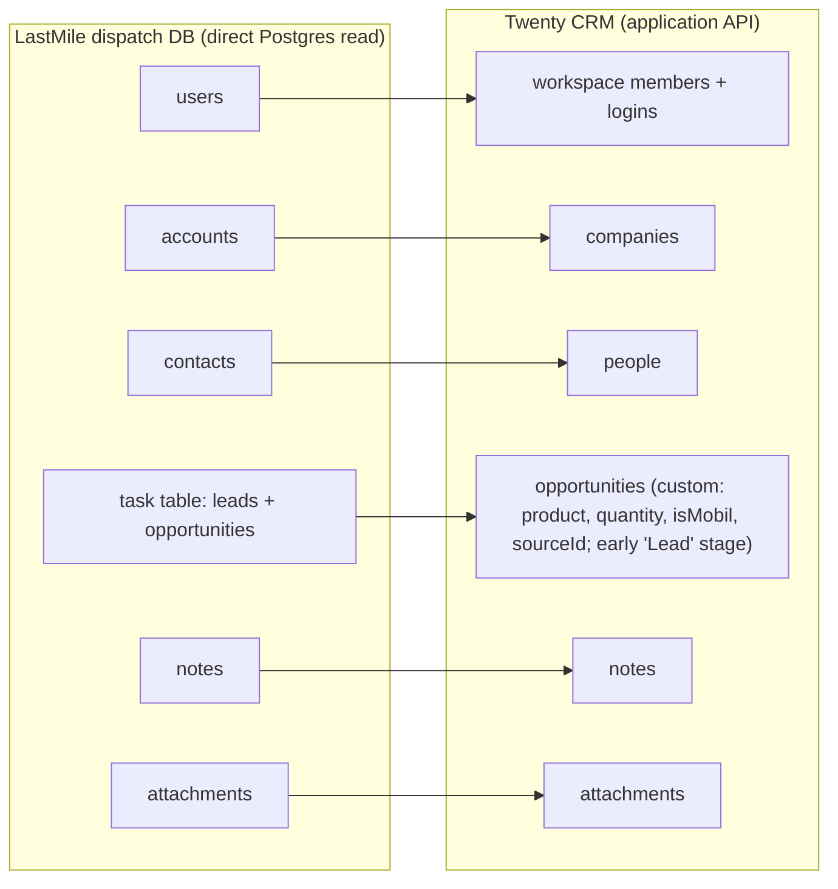
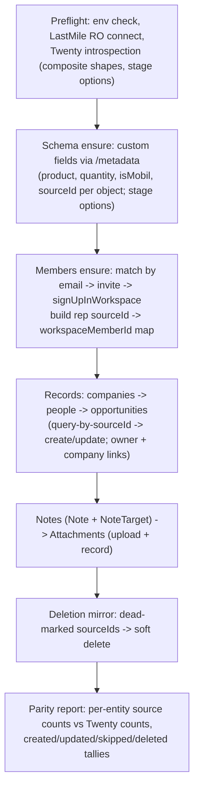

# TEI LastMile to Twenty CRM Migration - Plan

## Goal Capsule

- **Objective:** Move TEI's full LastMile CRM history — accounts, contacts, users, leads, opportunities, notes, attachments — into TEI's Twenty CRM managed app via an idempotent, re-runnable migration script, and provision every sales rep as a login-capable Twenty workspace member.
- **Product authority:** Eric (operator of both LastMile and TEI's ThinkWork deployment); verification sign-off is record-count parity plus spot checks.
- **Execution profile:** One new standalone script plus a small spike; no ThinkWork platform code changes, no Terraform, no schema migrations in this repo. All writes target a live customer CRM — dry-run is the default everywhere, `--apply` is explicit.
- **Stop conditions:** Stop and surface if the U1 spike shows the invite-token signup path is blocked on TEI's instance (fallback decision needed), if the LastMile schema diverges materially from the assumed entity set, or if any step would require direct writes to Twenty's Postgres.
- **Open blockers:** None. The one unknown — the Twenty workspace-member provisioning path — is U1, a spike that runs first.

---

## Product Contract

Product Contract preservation: changed R5 — the shared test password's literal value is kept out of this committed doc and supplied at runtime instead (security hygiene; behavior unchanged). R13 was clarified pre-planning with the confirmed soft-delete semantics. All other R/F/AE text preserved verbatim.

### Summary

Build a one-off, idempotent TypeScript migration script that reads LastMile's dispatch Postgres directly and writes into TEI's Twenty CRM through Twenty's application API: first extending the opportunity object with product, quantity, and is-Mobil fields, then provisioning sales reps as workspace members, then loading all CRM records with their LastMile source IDs stored for re-runnability. The script runs once to seed Twenty, and re-runs at the cutover date to sync everything that changed while LastMile stayed live.

### Problem Frame

TEI works out of LastMile, a homegrown CRM/dispatch system reachable from ThinkWork only through remote MCP servers at `lastmile-tei.com`. TEI is standardizing on Twenty CRM, already deployed as a customer-owned ThinkWork managed app with its own dedicated Postgres and a per-tenant MCP server. Nothing migrates the data: the dispatch database's schema lives outside this repo, Twenty has no records for TEI's book of business, and no sales rep exists in Twenty as a user. Until the data and the reps are in Twenty, the cutover cannot start.

### Key Decisions

- **Migrate through Twenty's application API, not its database.** Twenty's schema is metadata-driven per workspace; writing to Postgres directly risks records that break search, views, and sync invariants. At hundreds of active records, API throughput is a non-issue. Twenty's dedicated Postgres is VPC-internal anyway; the app's ALB is public, so the API path needs no network work.
- **Leads become early-stage opportunities.** Twenty has no native lead object. LastMile already keeps leads and opportunities in one task-style table, so both land in one opportunity pipeline with leads at an early stage (e.g. "Lead"/"New") that advances on qualification. No custom Lead object, no convert step.
- **Idempotency via stored source IDs.** Every migrated Twenty record carries its LastMile source ID in a custom field. Re-running the script upserts by source ID — updates changed records, inserts new ones, never duplicates. This is what makes the phased cutover's delta re-sync a re-run instead of a second tool.
- **Full history, one direction.** Everything migrates — open, won, lost, plus notes and attachments — so Twenty becomes the complete record and LastMile can retire. Sync is one-way (LastMile → Twenty) and ends at cutover; no ongoing bidirectional sync.

### Requirements

**Twenty schema preparation**

- R1. Twenty's opportunity object is extended with custom fields: product, quantity, and an is-Mobil-product flag. (Amount is native to Twenty opportunities.)
- R2. Every migrated object type carries a custom field holding its LastMile source ID, used as the upsert key on re-runs.
- R3. The opportunity pipeline includes an early stage representing leads, plus stages mapping LastMile's opportunity statuses (including won/lost for historical records).

**Sales rep provisioning**

- R4. Every LastMile user (sales rep) exists in Twenty as a workspace member capable of logging in.
- R5. For the validation window, all rep accounts are set to a shared test password supplied at runtime (env var; the agreed value lives outside the repo). Rotating/resetting every rep's password is required before reps work in Twenty for real — on cutover day, and equally on any abort or extended validation window (the shared credential never outlives the phase that needed it).
- R6. Migrated records carry the correct owner: each opportunity's Twenty `ownerId` resolves to the workspace member matching its LastMile rep.

**Data load**

- R7. LastMile accounts load as Twenty companies; contacts load as Twenty people linked to their companies.
- R8. LastMile leads and opportunities (both from the task table) load as Twenty opportunities with stage, product, quantity, amount, is-Mobil flag, company link, and owner populated.
- R9. LastMile notes load attached to their corresponding Twenty records.
- R10. LastMile attachments load into Twenty attached to their corresponding records.
- R11. The full history migrates — closed/won/lost records included, not just active ones.

**Delta re-sync and cutover**

- R12. Re-running the script is safe and idempotent: records changed in LastMile since the seed are updated in Twenty, new records are inserted, and no duplicates are created.
- R13. Records dead-marked in LastMile during the validation window are mirrored by the re-sync rather than left stale in Twenty. LastMile soft-deletes (rows stay with a dead/deleted flag), so the re-sync reads the flag — no full-set diff needed.
- R14. LastMile remains the working system of record until the cutover re-sync completes; Twenty is a follower until then.

**Verification**

- R15. The script emits a parity report: per-entity record counts in the LastMile source vs. what exists in Twenty, suitable for the sign-off decision.
- R16. Spot-checkable fidelity: a sampled account, contact, and opportunity in Twenty match their LastMile source values field-for-field, including owner and relations.

### Key Flows

- F1. Seed migration
  - **Trigger:** Operator runs the migration script against LastMile Postgres and TEI's Twenty instance.
  - **Steps:** Script ensures custom fields and pipeline stages exist; provisions workspace members; loads companies, people, opportunities (leads included), notes, attachments with source IDs and owners; emits the parity report.
  - **Outcome:** Twenty holds the full LastMile history; TEI spot-checks against the parity report while reps keep working in LastMile.
  - **Covers R1–R11, R15.**
- F2. Cutover re-sync
  - **Trigger:** TEI sets the switch date after validating the seed.
  - **Steps:** Script re-runs; upserts by source ID pick up everything created/changed in LastMile since the seed; deletions/dead-marks are mirrored; parity report re-emitted; rep passwords rotated.
  - **Outcome:** Twenty is current; reps log in and work in Twenty; LastMile CRM freezes.
  - **Covers R5, R12–R15.**

### Acceptance Examples

- AE1. **Covers R12.** Given the seed ran on day 0 and a rep edited an opportunity's amount in LastMile on day 3, when the cutover re-sync runs, then the Twenty opportunity with that source ID shows the new amount and the opportunity count is unchanged (no duplicate).
- AE2. **Covers R13.** Given a lead was dead-marked in LastMile during the validation window, when the re-sync runs, then that record no longer appears as an open opportunity in Twenty.
- AE3. **Covers R3, R8.** Given a LastMile task-table row that is a lead (not yet a qualified opportunity), when it migrates, then it appears in Twenty's opportunity pipeline at the early lead stage — not as a bare person/company record.
- AE4. **Covers R6.** Given a LastMile opportunity owned by rep Jane, when it migrates, then the Twenty opportunity's owner is the workspace member created for Jane, and Jane can log in and see it.

### Scope Boundaries

- LastMile's routing/dispatch operational data (routes, deliveries, dispatch jobs) does not migrate — Twenty is a CRM with no home for it. What replaces LastMile's dispatch side is a separate decision.
- No ongoing or bidirectional sync — one seed plus one (or more) re-runs of the same script, ending at cutover.
- LastMile decommissioning (freezing the app, archiving the DB, retiring the ThinkWork LastMile plugin) is follow-on work, not part of the migration.
- No generic/reusable CRM-import product feature — this is a one-off script for TEI.
- No SSO for rep logins — password accounts with a cutover rotation.
- The re-sync never touches Twenty records lacking a source ID — anything created natively in Twenty during the validation window is invisible to the script, including its deletion mirroring.
- The validation window is read-only for migrated records: LastMile wins, and any Twenty-side edit to a record carrying a `sourceId` is overwritten at cutover. The delta run reports overwritten records whose Twenty `updatedAt` postdates the seed, so clobbered edits are visible rather than silent.

### Dependencies / Assumptions

- Direct read access to LastMile's dispatch Postgres is available: a connection string supplied out-of-band (env var), ideally a read-only role per `docs/solutions/security/analyst-external-postgres-role-provisioning-runbook-2026-07.md`.
- Eric can mint a Twenty API key in TEI's Twenty (Settings → API & Webhooks) and has the admin user's password login — the invitation mutation requires a real user access token, not just an API key.
- TEI's Twenty is publicly reachable at its `public_url` (ALB open per `plugins/twenty/terraform/twenty/variables.tf`), so the script runs from the operator's machine with no VPC access.
- Volume is small — hundreds of active records — so batch limits (~60/batch) and the documented ~100 req/min rate limit are handled with simple chunking and backoff, not a design constraint.
- Invite emails need not deliver (TEI SES is sandboxed); the provisioning flow reads invitation tokens back via the API instead of relying on email.

### Outstanding Questions

**Deferred to implementation (non-blocking)**

- Whether `IS_SIGN_UP_DISABLED`/single-workspace mode blocks `signUpInWorkspace` when a valid personal invite token is presented — U1 verifies empirically; fallback is a temporary settings flip or controlled member insert, decided only if the spike fails. **[OPEN — requires the admin user's password login; probe deferred to U4's live run.]**
- Whether `updateOneField` on the opportunity `stage` SELECT replaces or merges the `options` array — U1 verifies; assume full-replace (fetch, append, write back). **[RESOLVED 2026-07-09: full-replace confirmed on live TEI Twenty — writing an options array without a previously present option removes it. Schema-ensure must always fetch current options, merge, and write the complete array. Existing options NEW/SCREENING/MEETING/PROPOSAL/CUSTOMER must be preserved verbatim — the ThinkWork workflow trigger fires on CUSTOMER.]**
- Exact LastMile column → Twenty field mapping per entity, and how lead-vs-opportunity is encoded in the task table (read from the live LastMile schema during U2/U5). **[RESOLVED 2026-07-09 from live LastMile prod (`dispatch` DB): leads and opportunities are separate tables (`lead`, 2714 rows; `opportunity`, 2971 rows), not one task table. CRM graph: `account` (3403; name, owner=rep) → companies; `contact` (29962; account_id, names, email_address, phone/phone_cellular, title, owner) → people; `opportunity` (stage, amount numeric dollars, quantity text, product_type, brand, closed/won, account_id, sales_rep_id, opp_name, expected_close_date) and `lead` (status, company name, person fields, address, source, sales_rep_id/owner) → opportunities. Users/reps: `users` (166; is_active, archived, email) + `sales_rep` (176; email_address, archived, user_id); owner refs on CRM rows are `rep_*` ids. Notes: `task_comment` (612 non-deleted) on `task` rows with entity_type lead/opportunity linking via `task.entity_id`; the separate `note` table (3779) targets dispatch `customer` rows, which do not migrate — only exact-unique-name customer→account matches can attach, rest reported as gaps. Attachments: `task_attachment` is 99.7% dispatch (`bol_`/`load_` prefixes); only a handful attach to CRM tasks; binaries in S3 (`bucket_name` + `file_path`). Dead-marks: NO archived/deleted columns exist on account/contact/lead/opportunity — deletion mirroring uses an id-set diff (Twenty sourceIds vs live source ids) plus `task_comment.is_deleted`; volume (~40k records total) makes the diff trivial. Volume diverges from the "hundreds of active records" assumption but chunking/backoff absorbs it.]**
- Exact composite-input key casing (`FullName`, `Currency`, `Emails`, `Phones`, `Address`) — verified by live GraphQL introspection in U1 before any record writes. **[RESOLVED 2026-07-09 via live introspection: `FullNameCreateInput{firstName,lastName}`, `CurrencyCreateInput{amountMicros,currencyCode}`, `EmailsCreateInput{primaryEmail,additionalEmails}`, `PhonesCreateInput{primaryPhoneNumber,primaryPhoneCountryCode,primaryPhoneCallingCode,additionalPhones}`, `AddressCreateInput{addressStreet1,addressStreet2,addressCity,addressPostcode,addressState,addressCountry,addressLat,addressLng}`, `LinksCreateInput{primaryLinkLabel,primaryLinkUrl,secondaryLinks}`. Note body is `bodyV2: RichTextCreateInput`; Attachment uses `file: FileItemInput` + direct `target*Id` FKs; NoteTarget carries `noteId` + one `target*Id`.]**

---

## Planning Contract

### Key Technical Decisions

- **KTD1 — Standalone tsx script under `plugins/twenty/scripts/`, run locally.** Follows the sibling precedent (`plugins/twenty/scripts/wire-thinkwork-workflow.mjs`): dry-run by default, explicit `--apply`, JSON report to stdout, refuses to guess on ambiguous matches. No Lambda, Step Functions, or customer control-plane involvement — the credentials are Twenty-app-level (API key + admin login), not AWS access, so the control-plane guardrail (`docs/solutions/architecture-patterns/github-free-customer-deployments-aws-control-plane-pattern-2026-06-06.md`) is not bypassed.
- **KTD2 — Two Twenty credential types, deliberately.** A workspace API key (Bearer) covers metadata mutations and all record CRUD; `sendInvitations` additionally requires a logged-in admin **user** access token (obtained by password `signIn`). Per-user MCP OAuth tokens are explicitly the wrong credential for tenant-wide writes (`docs/solutions/architecture-patterns/managed-app-mcp-oauth-lifecycle-2026-06-06.md`). Env contract: `TWENTY_PUBLIC_URL`, `TWENTY_API_KEY`, `TWENTY_ADMIN_EMAIL`, `TWENTY_ADMIN_PASSWORD`, `TWENTY_REP_PASSWORD` (the R5 shared test password), `LASTMILE_DATABASE_URL`. The `workspaceId` needed by `signUpInWorkspace` is resolved at runtime from the admin session/invitation read-back, with a `TWENTY_WORKSPACE_ID` env override matching the `wire-thinkwork-workflow.mjs` precedent. The script fails fast with a named-var error when any is missing — never partial-runs.
- **KTD3 — Idempotency is query-then-branch on a unique `sourceId`, deletion-aware and retry-safe.** Twenty exposes no public upsert (GitHub #4656 landed only inside CSV import). Each object type gets a `sourceId` custom field, `TEXT` + `isUnique: true`; every load pass filters by `sourceId` **including soft-deleted records** (Twenty's unique index and default queries exclude them — a lookup that misses a soft-deleted twin would create a live duplicate). Branches: missing → create; found active → content-hash diff, update or skip; found soft-deleted with active source row → restore + update, never create. The content hash carries a version salt so a mapper fix rewrites previously "unchanged" records. Retry discipline: mutation retries after ambiguous failures (5xx/timeout) re-query by `sourceId` before re-attempting a create — never blind-retry; a duplicate-key error means re-query and reconcile; two live records sharing a `sourceId` abort the run loudly. One invocation at a time (operator-ensured); batching ≤60 records per call with backoff on 429.
- **KTD4 — Member provisioning via the invite-token flow.** As admin user: `sendInvitations(emails, roleId?)` → read tokens back with `findWorkspaceInvitations` → per rep, call `signUpInWorkspace(email, password, workspaceId, workspacePersonalInviteToken)` with the shared test password (R5). Email delivery is irrelevant, which neutralizes TEI's SES sandbox. Members are matched idempotently by email; existing members are never re-invited.
- **KTD5 — Composite and currency field discipline.** Twenty stores currency as integer `amountMicros` (dollars × 1,000,000); `FullName`, `Emails`, `Phones`, `Links`, `Address` are composite inputs whose exact key casing is confirmed by live introspection (U1) before any record write. Deprecated flat fields (`probability`, `phone`, `addressOld`, attachment `name`/`fullPath`/`type`) are never written.
- **KTD6 — Notes and attachments use their distinct linking shapes.** Notes: create `Note`, then a `NoteTarget` join row with `noteId` + exactly one target FK. Attachments: two-step — GraphQL multipart `uploadFilesFieldFile` upload, then create the `Attachment` record with the file reference and the direct `target*Id` FK (attachments do not use a join table).
- **KTD7 — Deletion mirroring is soft-delete, scoped to migrated records.** LastMile dead-mark flags map to Twenty `deleteOne`/`deleteMany` (soft delete, restorable). The script only ever deletes records whose `sourceId` it owns; records without a `sourceId` are out of bounds.
- **KTD8 — LastMile read side is a plain `pg` client.** `@thinkwork/database-pg`'s `getDb()` is hard-wired to ThinkWork Aurora; the script uses a direct `pg` connection from `LASTMILE_DATABASE_URL` with `default_transaction_read_only=on` and a `statement_timeout`, per the external-Postgres runbook. Read queries never mutate LastMile.

### High-Level Technical Design

The script is a phased pipeline; every phase is independently idempotent and the whole pipeline re-runs for the delta:

Load order is dependency-driven: members before opportunities (owner resolution), companies before people (company links), records before notes/attachments (targets must exist).

### Assumptions

- The LastMile schema exposes the assumed entities (users, accounts, contacts, task table with lead/opportunity rows, notes, attachments) with stable primary keys usable as `sourceId` values.
- Attachment binaries are retrievable from wherever LastMile stores them using the same DB credentials or an out-of-band path; if some files are missing, the record still migrates and the gap is listed in the report (R10 satisfied best-effort per file, every gap visible).

### Risks & Rollback

- **Bad-seed rollback is a defined lever, not improvisation.** If spot checks judge the seed wrong (e.g., a mapping bug consistent across all records — which an idempotent re-run cannot fix, since the content hash sees no source change), rollback is tiered: **records** — `deleteMany` scoped strictly to `sourceId`-bearing rows per entity (reversible via `restoreMany`), then a corrected re-seed with a bumped hash-version salt so fixed mappers actually rewrite; **custom-field metadata** — never rolled back (fields are inert; deleting them destroys data); **workspace members** — never un-created; the posture is rotate passwords or deactivate. The script exposes the record-rollback as an explicit mode so it is rehearsed, not invented against a live CRM.
- **Shared test password is bounded by phase, not by the happy path.** Rotation/deactivation fires on cutover, on abort, and on an over-long validation window alike (R5). The literal value never appears in the repo.
- **Crash-mid-run convergence is designed, not assumed.** Two-write shapes (Note + NoteTarget; upload + Attachment record) are ordered and re-checked so a re-run heals half-written state (see U6); ambiguous mutation failures re-query before re-creating (KTD3).
- **Twenty-side edits during validation are overwritten by design** — source wins; the delta report surfaces every overwrite whose Twenty `updatedAt` postdates the seed (Scope Boundaries).

---

## Implementation Units

### U1. Spike: verify provisioning and schema mechanics against TEI's Twenty

- **Goal:** Prove the three uncertain mechanics on the live instance before any migration code depends on them: invite-token `signUpInWorkspace` with signups disabled, `updateOneField` merge-vs-replace semantics for `stage` options, and composite input key casing via introspection.
- **Requirements:** R3, R4 (feasibility).
- **Dependencies:** none — runs first.
- **Files:** `plugins/twenty/scripts/migrate-lastmile-spike.mjs` (throwaway probe, deleted or folded into the main script when done); findings recorded in this plan's Outstanding Questions resolutions.
- **Approach:** Sign in as admin (`signIn` → user token), send one invitation to a disposable email, read the token back, attempt `signUpInWorkspace` with a test password; introspect `CurrencyMetadata`/`FullNameMetadata`/etc. and fetch the opportunity `stage` field metadata; append a test option via `updateOneField` and read back.
- **Execution note:** Smoke-first against the live TEI instance; everything this unit creates (test member, test stage option) is removed before it completes.
- **Test scenarios:** Test expectation: none — throwaway spike; its output is verified facts, not shipped code.
- **Verification:** Each of the three questions has a definitive answer written into the plan; test artifacts cleaned up from TEI's Twenty.

### U2. Script scaffold: clients, config, dry-run frame, report skeleton

- **Goal:** The migration script skeleton with both endpoints wired: `pg` reader for LastMile, `TwentyGraphqlClient` for `/graphql` + `/metadata`, env-var contract, `--apply`/`--dry-run` gating, chunking/backoff, and the JSON report structure.
- **Requirements:** R15 (report frame); KTD1, KTD2, KTD8.
- **Dependencies:** none (parallel with U1).
- **Files:** `plugins/twenty/scripts/migrate-lastmile.ts`; `plugins/twenty/scripts/lib/lastmile-reader.ts`; `plugins/twenty/scripts/lib/twenty-client.ts`; tests `plugins/twenty/scripts/lib/__tests__/twenty-client.test.ts`.
- **Approach:** Copy the `TwentyGraphqlClient` shape from `plugins/twenty/scripts/wire-thinkwork-workflow.mjs` (Bearer key, throws on `body.errors`); add a batched-call helper (≤60/chunk, retry with backoff on 429/5xx). LastMile reader wraps `pg` with read-only session settings and named query functions per entity. Missing env vars fail fast with the variable name; secrets never logged.
- **Patterns to follow:** `wire-thinkwork-workflow.mjs` (client, dry-run default, refuse-to-guess), `scripts/backfill-artifact-payloads-to-s3.ts` (`--write`-style flag parsing, JSON counters report).
- **Dependency note:** `pg` and `@types/pg` are added to `plugins/twenty` devDependencies (an acceptable package.json-only change; `pg` currently lives only in `packages/database-pg`). The package tsconfig's `./**/*.ts` include sweeps these scripts into its `tsc --build`, so they must typecheck under the package's compiler settings — unlike the `.mjs` precedent scripts, which sit outside tsc.
- **Test scenarios:**
  - Happy path: client resolves endpoint from `TWENTY_PUBLIC_URL` + path; batch helper splits 130 records into 3 chunks.
  - Error paths: GraphQL response with `errors[]` throws with the message; missing `LASTMILE_DATABASE_URL` exits non-zero naming the var; 429 response retries with backoff then succeeds.
  - Edge: dry-run mode performs reads but returns planned-mutation list without calling mutation endpoints.
- **Verification:** `npx vitest run` green on the new tests; `pnpm --filter` typecheck/lint clean; dry-run against TEI connects to both sides and prints an empty-plan report.

### U3. Schema ensure: custom fields and pipeline stages

- **Goal:** Idempotently create the custom fields (opportunity: product, quantity, isMobil; every migrated object: `sourceId` TEXT unique) and ensure the opportunity `stage` SELECT contains the Lead stage plus mapped LastMile statuses.
- **Requirements:** R1, R2, R3.
- **Dependencies:** U1 (options-update semantics, introspection), U2 (client).
- **Files:** `plugins/twenty/scripts/lib/schema-ensure.ts`; tests `plugins/twenty/scripts/lib/__tests__/schema-ensure.test.ts`.
- **Approach:** Fetch existing field metadata per object; create only missing fields via `createOneField` (`/metadata`); for `stage`, fetch current options and write back the merged array via `updateOneField` per U1's confirmed semantics. Field name/type table is data, not code, so review shows the whole schema delta in one place.
- **Test scenarios:**
  - Happy path: empty object gains all fields; run against already-provisioned metadata creates nothing (idempotent).
  - Edge: stage option already present → no update call; partial presence (product exists, quantity missing) creates only the gap.
  - Error path: metadata mutation error aborts the run before any record loading.
- **Verification:** Two consecutive `--apply` runs against TEI: first creates, second reports zero schema changes; fields visible in Twenty settings UI.

### U4. Member provisioning and owner map

- **Goal:** Every active LastMile user exists as a Twenty workspace member with the shared test password; the script holds a `sourceId → workspaceMemberId` map for owner resolution.
- **Requirements:** R4, R5, R6 (map side).
- **Dependencies:** U1 (proven flow), U2.
- **Files:** `plugins/twenty/scripts/lib/members-ensure.ts`; tests `plugins/twenty/scripts/lib/__tests__/members-ensure.test.ts`.
- **Approach:** Read LastMile users; list existing workspace members; for missing ones run KTD4's invite-token flow (admin token → `sendInvitations` → `findWorkspaceInvitations` → `signUpInWorkspace`). Match by email, case-insensitive. Emit the owner map keyed by LastMile user ID.
- **Test scenarios:**
  - Happy path: three users, one already a member → two invited+signed-up, map has all three.
  - Covers AE4 (map half): opportunity owner resolution uses this map.
  - Edge: LastMile user with no email → listed in report as unprovisionable, run continues; duplicate emails across LastMile users → refuse-to-guess, abort with named conflict.
  - Error path: `signUpInWorkspace` rejection (e.g. token invalid) reported per-user, run continues to next user, exit code reflects partial failure.
- **Verification:** After `--apply`, all reps appear in Twenty's Members settings; a sampled rep can log in with the test password; re-run invites nobody.

### U5. Record load: companies, people, opportunities

- **Goal:** Full upsert-by-`sourceId` load of accounts → companies, contacts → people, task-table rows → opportunities with stage mapping, custom fields, currency micros, company links, and owners.
- **Requirements:** R6, R7, R8, R11, R12.
- **Dependencies:** U3, U4.
- **Files:** `plugins/twenty/scripts/lib/load-records.ts`; mapping functions in `plugins/twenty/scripts/lib/mappers.ts`; tests `plugins/twenty/scripts/lib/__tests__/mappers.test.ts`.
- **Approach:** Per entity: read LastMile rows (including dead-marked, for R13's later pass), map to Twenty input shapes (pure functions — testable without I/O), query Twenty by `sourceId` filter, diff, create/update in batches. Opportunities resolve `companyId` and `ownerId` through the sourceId maps built by earlier phases; lead rows map to the Lead stage per the task-table discriminator found in U2's schema read.
- **Execution note:** Write the mapper unit tests first — they encode the field-mapping decisions and are the cheapest place to catch composite-shape mistakes.
- **Test scenarios:**
  - Happy path: account maps to company with name/domain/address composite; contact maps with FullName split and company link.
  - Covers AE3: task row flagged as lead maps to stage "Lead".
  - Covers AE1: changed source row produces an update, unchanged row is skipped (content-hash), no duplicates on re-run.
  - Edge: `$1,234.56` amount → `1234560000` amountMicros; contact without account → person with null company, counted in report; opportunity owned by unprovisionable rep → null owner, flagged in report.
  - Error path: unresolvable company `sourceId` on an opportunity → record skipped and reported, run continues.
- **Verification:** Parity counts match per entity after seed; AE1/AE3 demonstrated on TEI data; second run reports all-skipped.

### U6. Notes and attachments

- **Goal:** LastMile notes and attachments land on their corresponding Twenty records.
- **Requirements:** R9, R10.
- **Dependencies:** U5 (targets must exist).
- **Files:** extend `plugins/twenty/scripts/lib/load-records.ts` (or a sibling `load-annexes.ts`); tests in `plugins/twenty/scripts/lib/__tests__/mappers.test.ts`.
- **Approach:** Notes: upsert `Note` by `sourceId`, then ensure the `NoteTarget` row **unconditionally** — including for content-hash-skipped notes — so a crash between the two writes heals on re-run. Attachments: query the `Attachment` record by `sourceId` **before** uploading (no re-upload of orphaned binaries into EFS on re-runs); on miss, fetch the binary from LastMile storage, `uploadFilesFieldFile` multipart upload, then create the record with the file reference and direct `target*Id` (KTD6). Missing binaries: migrate nothing for that file, list it in the report.
- **Test scenarios:**
  - Happy path: note on an account lands as Note + NoteTarget(companyId); attachment on an opportunity lands with `targetOpportunityId`.
  - Edge: note whose parent record was skipped → note skipped and reported; missing attachment binary → reported gap, run continues.
  - Crash-healing: existing Note with no NoteTarget → re-run creates the target; existing Attachment record → re-run performs no upload.
  - Error path: upload failure retries once, then reports and continues.
- **Verification:** Sampled note and attachment visible on the right records in Twenty's UI; report lists any gaps explicitly.

### U7. Deletion mirror and parity report

- **Goal:** Dead-marked LastMile records soft-delete their Twenty counterparts, and the run ends with the R15 parity report.
- **Requirements:** R13, R14, R15, R16 (report support).
- **Dependencies:** U5, U6.
- **Files:** extend `plugins/twenty/scripts/lib/load-records.ts`; report assembly in `plugins/twenty/scripts/migrate-lastmile.ts`.
- **Approach:** For each entity, collect dead-marked source IDs; soft-delete (`deleteMany`) only Twenty records matching those `sourceId`s that aren't already deleted. Parity report: per-entity `{ sourceTotal, sourceActive, sourceDead, twentyActive, twentyDeleted, created, updated, restored, skipped, deleted, overwrittenValidatorEdits[], gaps[] }` — denominator-stable counts, active and deleted reported separately (a combined total would hide create-vs-restore duplicates), per `docs/solutions/best-practices/backfill-audits-account-for-corpus-growth-2026-04-21.md`. The report also runs consistency invariants via the API: zero duplicate `sourceId`s per entity (soft-deleted rows included in the check); every migrated Note has exactly one NoteTarget and every Attachment exactly one `target*Id`; unexplained-null reconciliation (opportunities with a LastMile owner but null Twenty owner == flagged unprovisionable-rep records; same for company links); `deleted == sourceDead`. Include a spot-check helper that prints a sampled record's source row next to its Twenty record for R16.
- **Test scenarios:**
  - Covers AE2: dead-marked lead → its Twenty opportunity is soft-deleted on re-run.
  - Edge: Twenty record with no `sourceId` is never a deletion candidate (Scope Boundaries); already-deleted record → skipped, not re-deleted.
  - Revival: source row dead-marked then un-dead-marked between runs → the soft-deleted Twenty record is restored and updated, not duplicated (KTD3).
  - Happy path: report counts reconcile — created + updated + restored + skipped == sourceActive, deleted == sourceDead per entity; all invariants zero-violation.
- **Verification:** Full seed then delta run on TEI reproduces F1/F2; parity report is the sign-off artifact; AE2 demonstrated.

---

## Superseding Decisions (2026-07-10, during implementation)

Live data and the live instance contradicted five parts of the Product/Planning
Contract above. Each was surfaced to Eric and decided by him; the original text
is preserved for provenance, and this section is the authority where they
conflict.

- **S1 supersedes R8, KTD-lead/opportunity mapping.** LastMile's `task` table —
  not `opportunity`/`lead` — is the CRM. For the 950 opportunities carrying a
  task, `opportunity.stage` matches the real status only **61 times**. The
  import now drives off task rows (950 opportunity + 1,072 lead), taking status
  from `status_id`, owner from `assignee_id → users.sales_rep_id`, organization
  from `organization_id`, and name/description/account/products from
  `entity_data`. Task rows begin 2025-07; the 2,021 opportunities and 1,642
  leads older than that **do not migrate** (Eric's call, "task-backed only").
- **S2 supersedes R1.** An opportunity carries _multiple_ products (816 have
  lines; 82 have 2–5). `product`/`quantity` moved off the opportunity onto a new
  **Opportunity Product** object (many-to-one), with `amount` per line, the deal
  amount summed from lines, and `isMobil` rolled up. A single flat trio silently
  dropped every line after the first.
- **S3 supersedes R3.** Pipeline stages are LastMile's own status names verbatim
  (`00-New`, `10-Prospect`, `20-Account Needs`, `30-Formulate Offer`,
  `40-Negotiation`, `50-Implementation`, `60-Won`, `90-Lost`, plus the lead
  band), not invented ones. TEI's pre-existing options are preserved.
- **S4 supersedes R13/KTD7.** LastMile's CRM tables have **no dead-mark
  columns**. Deletion mirroring is an id-set diff (Twenty `sourceId`s vs live
  source ids), plus `task_comment.is_deleted` for notes.
- **S5 supersedes KTD4 and the "no writes to Twenty's Postgres" stop
  condition.** TEI's Twenty does not serve the auth GraphQL schema over its ALB:
  `sendInvitations`, `signUpInWorkspace`, and `getLoginTokenFromCredentials` all
  return "Cannot query field" on `/graphql` and `/metadata` under every header
  and origin combination, and `/rest` exposes object CRUD only. There is no API
  path to create a user. Eric authorized direct Postgres provisioning after the
  stop condition was surfaced; `scripts/provision-twenty-members.ts` does it
  INSERT-only, idempotent by email, one transaction per rep, mirroring the row
  shapes Twenty writes itself. **89 reps provisioned, 0 failures.**
- **S6 (new).** Two additions with no counterpart in the original contract: a
  migrated **Organization** object (38 LastMile branches, named by `abbv` e.g.
  "GWO 300"), and `scripts/purge-lastmile-import.ts`, which hard-deletes the
  import plus the 3,796 domain-named companies that Twenty's stock _"Create
  company when adding a new person"_ workflow invented on each person insert —
  it repointed people at them, mislinking 21,989 of 24,028. **That workflow must
  be deactivated for the duration of the import**; the workspace API key is
  forbidden from doing so, so it is an operator step.
- **S7 (new dependency).** Reps missing an email in LastMile receive
  `<first-initial><lastname>@texasenterprises.com`; house/intercompany/
  placeholder rows receive no login.

## Verification Contract

| Gate               | Command / Check                                                                                                                                                                                                                                  | Applies to |
| ------------------ | ------------------------------------------------------------------------------------------------------------------------------------------------------------------------------------------------------------------------------------------------ | ---------- |
| Unit tests         | `npx vitest run` from `plugins/twenty` (mappers, clients, ensure logic)                                                                                                                                                                          | U2–U7      |
| Repo gates         | `pnpm lint && pnpm typecheck && pnpm format:check`                                                                                                                                                                                               | all units  |
| Spike facts        | U1's three questions answered and recorded in the plan                                                                                                                                                                                           | U1         |
| Live dry-run       | `migrate-lastmile.ts` (no `--apply`) against TEI prints a full planned-mutation report with zero writes                                                                                                                                          | U2–U7      |
| Idempotency proof  | Two consecutive `--apply` runs: second reports zero creates/updates/deletes                                                                                                                                                                      | U3–U7      |
| Parity sign-off    | R15 report counts reconcile per entity; consistency invariants (no duplicate `sourceId`s incl. deleted, Note/NoteTarget pairing, owner/company-link reconciliation, `deleted == sourceDead`) report zero violations; R16 spot checks pass (Eric) | F1, F2     |
| Rollback rehearsal | Record-rollback mode soft-deletes exactly the `sourceId`-bearing set in dry-run listing (verified before any `--apply` seed)                                                                                                                     | U7         |
| Login proof        | Sampled rep logs into TEI's Twenty with the test password and sees their opportunities (AE4)                                                                                                                                                     | U4, U5     |

No behavioral-skill evaluation applies — no agent/skill surface changes.

### Gate status (2026-07-10)

| Gate               | Status                                                                                                                                                                                           |
| ------------------ | ------------------------------------------------------------------------------------------------------------------------------------------------------------------------------------------------ |
| Unit tests         | **PASS** — 100 vitest, incl. a test reconstructing `task_xdh6577weuhsc2ttlct1acyl` (_Reign Rentals GW Lubes_) field-for-field                                                                    |
| Repo gates         | **PASS** — `tsc --noEmit`, prettier, plugin-source boundary                                                                                                                                      |
| Spike facts        | **PASS with amendment** — stage-option full-replace and composite casing recorded above; the invite-token question resolved differently (no auth schema; see S5)                                 |
| Live dry-run       | **PASS** — 38 orgs, 3,403 companies, 29,966 people, 2,022 opportunities, 928 product lines, 749 notes, 0 failures, 0 writes                                                                      |
| Rollback rehearsal | **PASS** — dry-run listing exercised; hard-delete purge also executed live (33,865 records + 3,796 workflow companies, 0 failures)                                                               |
| Idempotency proof  | **BLOCKED** — needs a seed `--apply`, which needs the workflow deactivated (S6)                                                                                                                  |
| Parity sign-off    | **BLOCKED** — follows the seed                                                                                                                                                                   |
| Login proof        | **BLOCKED** — 89 logins exist and one (`scoulson@`) is verified at the row/hash level and visible via Twenty's API; the in-UI login and "sees their opportunities" half awaits the seed and Eric |

## Definition of Done

- All seven units land; the seed run has completed against TEI's Twenty with a reconciled parity report and passed spot checks.
- Idempotency is demonstrated (second run is a no-op) — the cutover re-sync (F2) is thereby proven runnable, even though its execution waits for TEI's switch date.
- The rep password-rotation step (R5 — cutover, abort, and over-long-window cases alike), the record-rollback procedure, and the delta re-run invocation are written up as a short operator note in the script's header comment (env vars, flags, order), so cutover day needs no code archaeology.
- Spike artifacts (test member, test stage option, throwaway `zzSpikeLine` object, throwaway scripts) are removed; no abandoned experimental code remains in the diff.
- ~~No writes to Twenty's Postgres~~ — **superseded by S5**: member provisioning writes to Twenty's Postgres, INSERT-only, with Eric's explicit authorization after the stop condition was surfaced. No LastMile mutations, no committed secrets. The shared rep password lives only in the operator's environment.

---

## Sources / Research

- Write-path template and conventions: `plugins/twenty/scripts/wire-thinkwork-workflow.mjs` (TwentyGraphqlClient, dry-run default, `/graphql` + `/metadata` endpoints, `TWENTY_DEPLOY_API_KEY` env pattern); `docs/runbooks/twenty-thinkwork-native-app-install.md` (API-key creation).
- Deployment facts: `plugins/twenty/terraform/twenty/main.tf` (single-workspace `IS_MULTIWORKSPACE_ENABLED=false`, EFS local storage), `variables.tf`/`outputs.tf` (public ALB, `twenty_url`), `plugins/twenty/src/deployment/managed-app.ts` (dedicated VPC-internal Postgres).
- Twenty API (verified against twentyhq/twenty main-branch source, July 2026): metadata mutations gated by `WorkspaceAuthGuard` only (API key sufficient); `sendInvitations` additionally requires `UserAuthGuard`; `signUpInWorkspace(email, password, workspaceId, workspacePersonalInviteToken)`; REST batch route `POST /rest/batch/*path`; no public upsert (issue #4656); currency as `amountMicros`; Note→NoteTarget join vs Attachment direct `target*Id` FKs; soft-delete via `deleteOne` + `restoreOne`.
- Institutional learnings: `docs/solutions/architecture-patterns/managed-app-mcp-oauth-lifecycle-2026-06-06.md` (credential-path separation), `docs/solutions/security/analyst-external-postgres-role-provisioning-runbook-2026-07.md` (read-only external PG posture), `docs/solutions/integration-issues/tei-resend-invite-idempotency-and-ses-sandbox-2026-06-15.md` (SES sandbox; idempotency-key trap), `docs/solutions/best-practices/backfill-audits-account-for-corpus-growth-2026-04-21.md` (denominator-stable parity metrics).
- TEI deployment context: `docs/solutions/integration-issues/lastmile-plugin-install-blocked-by-missing-context-md-2026-06-17.md` (`tei.thinkwork.ai`, tenant `tei`).
