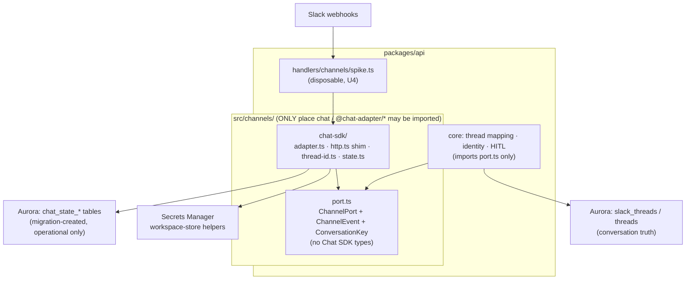

# Chat SDK ChannelPort Foundation - Plan

## Goal Capsule

- **Objective:** Land the foundation both chat channels build on — Chat SDK dependency intake with an enforced import boundary, the ChannelPort seam with Chat SDK as sole implementation, operational-state wiring against Aurora, and measured burn-down of the three THINK-84 risk areas. Covers master-plan R1–R4 (Linear THINK-252).
- **Product authority:** the master plan (docs/plans/2026-07-10-001-feat-chatsdk-slack-teams-channels-plan.md) Product Contract; this doc plans only its Foundation group.
- **Open blockers:** none. (R9 security sign-off belongs to THINK-254, not this unit.)
- **Product Contract preservation:** R1, R2, R4 unchanged. **R3 mechanism corrected by research:** Chat SDK's `StateAdapter` is an operational KV contract (locks, dedup, cache, subscriptions) — not a conversation store; Slack/Teams history is pulled live from platform APIs. R3's intent (no second conversation source of truth) is met by (a) the official Postgres state adapter running over ThinkWork-managed, migration-created tables for operational state only, and (b) thread/message truth staying in ThinkWork's thread mapping, correlated via tenant-scoped conversation keys at the seam. No custom conversation-state package is needed for v1.

---

## Product Contract

### Summary

Build the permanent boundary both channels sit behind: Chat SDK packages enter the repo pinned and confined to one directory subtree, a ThinkWork-owned ChannelPort interface is the only thing core code sees, operational state lands in migration-managed tables, and a disposable spike measures the three risks (Lambda ack timing, per-tenant credential injection, state fit) on the dev stage before the Slack channel build hardens.

### Requirements

Carried from the master plan (origin) — this plan implements the Foundation group:

- R1. All Slack and Teams webhook parsing, card/message rendering, and message post/edit operations go through Chat SDK adapters; each hand-rolled Slack equivalent is removed when its Chat SDK replacement lands. _(This unit establishes the adapter layer; removals happen in THINK-253/255 as replacements land.)_
- R2. Chat SDK imports are confined to the channel adapter boundary and enforced by lint; core thread, identity, and HITL code has no Chat SDK dependency.
- R3. Chat SDK conversation state reads and writes ThinkWork's own thread mapping; no second conversation store exists. _(Mechanism per preservation note: operational state in ThinkWork-managed tables; conversation truth via tenant-scoped ID correlation at the seam.)_
- R4. The three named risk areas — Lambda ack timing, per-tenant credential injection, and thread-state fit — are measured and documented in the foundation spike before the Slack channel build hardens.

### Scope Boundaries

**In scope:** dependency intake, boundary enforcement, ChannelPort seam + Chat SDK Slack adapter wiring, state wiring, spike measurements and findings doc.

**Deferred to sibling sub-issues:** queue/ledger ingress (THINK-253), identity resolver (THINK-254), Slack channel v1 and stub removal (THINK-255), JSX cards (THINK-256), HITL (THINK-257), all Teams work (THINK-258/259), bindings (THINK-260).

---

## Planning Contract

### Key Technical Decisions

- KTD1. **Boundary enforcement is a custom root script**, `scripts/verify-chatsdk-boundary.mjs`, modeled exactly on `scripts/verify-plugin-source-boundary.mjs` (the repo has no ESLint; that script + root `lint:`/`test:` wiring is the established pattern). Rule: `chat` and `@chat-adapter/*` may be imported only under `packages/api/src/channels/`.
- KTD2. **Exact-pin Chat SDK at 4.33.0** (`chat`, `@chat-adapter/slack`, `@chat-adapter/state-pg`). Packages release in weekly lockstep with no majors; the npm name `chat` is a reused package name (unrelated pre-2026 releases exist), so pin exact versions and verify provenance in the lockfile. 4.33.0 is also the floor that fixes the Slack redelivery-drop bug (webhook mode unaffected, but don't sit below it).
- KTD3. **Operational state via official `@chat-adapter/state-pg` over the existing Aurora pool** (`{ client: pool }`, `keyPrefix` scoping), with its five tables **pre-created by a hand-rolled migration** (with `-- creates:` markers) instead of the adapter's runtime auto-DDL — runtime DDL violates the migration-ledger discipline. A fully custom `StateAdapter` implementation is explicitly deferred unless the spike shows state-pg misbehaving against pre-created tables.
- KTD4. **Conversation correlation is tenant-scoped**: the seam's `ConversationKey` is the 4-part `{tenantId, provider, externalTeamId+channelId, externalRootId}` matching the real `SlackThreadKey` (which includes `tenant_id` — the master plan's 3-part citation was incomplete). `encodeThreadId`/`decodeThreadId` round-trip this key; ThinkWork thread rows remain the source of truth.
- KTD5. **Slack credentials ride Chat SDK's `installationProvider` + token-as-function hooks**, backed by the existing `packages/api/src/lib/slack/workspace-store.ts` helpers (module-scope caches, tenant-scoped Secrets Manager paths). No new secret plumbing.
- KTD6. **HTTP coupling is one Web-standard shim.** Chat SDK webhook handlers are `(Request) => Promise<Response>`; a single API-Gateway-event ↔ `Request`/`Response` converter is the only Lambda-specific glue. Slack's standalone `verifySlackSignature` (subpath export, Web Crypto, no SDK weight) is what the future ack Lambda uses; full parse runs elsewhere. The Teams equivalent does not exist (JWT validation is inside `@microsoft/teams.apps`) — recorded as a risk for THINK-258, not solved here.
- KTD7. **Chat SDK bundles under default esbuild flags.** Slack handlers use the default `ESBUILD_FLAGS` (externalize `@aws-sdk/*`, bundle the rest), so `chat`/`@chat-adapter/*` inline automatically; no `BUNDLED_AGENTCORE_ESBUILD_FLAGS` change unless the spike surfaces an AWS SDK client conflict. Card JSX later needs `jsxImportSource: "chat"` — noted for THINK-256, not configured here.

### High-Level Technical Design

Boundary check walks the repo and fails `pnpm lint` on any `chat`/`@chat-adapter/*` import outside `packages/api/src/channels/`.

### Assumptions

- Chat SDK's Lambda behavior is undocumented upstream; the spike converts that from assumption to measurement (queue boundary in THINK-253 absorbs bad findings either way).
- `state-pg` tolerates pre-created tables (its DDL is `CREATE TABLE IF NOT EXISTS`-shaped); the spike verifies no runtime DDL fires when tables exist. If it does not tolerate them, fall back to a thin custom `StateAdapter` (interface is ~15 methods) — scope-change note required.
- Node >= 22 runtime (repo floor) satisfies Chat SDK's `engines.node >= 20`.

### Sequencing

U1 → U2 → U3 → U4. U4 is the exit gate for the sub-issue: findings doc with verdicts.

---

## Implementation Units

### U1. Dependency intake + import-boundary enforcement

- **Goal:** Chat SDK packages enter the workspace pinned; the boundary rule exists and is enforced before any adapter code lands.
- **Requirements:** R2, KTD1, KTD2.
- **Dependencies:** none.
- **Files:** `packages/api/package.json` (add `chat@4.33.0`, `@chat-adapter/slack@4.33.0`, `@chat-adapter/state-pg@4.33.0`, exact); `scripts/verify-chatsdk-boundary.mjs`; `scripts/__tests__/verify-chatsdk-boundary.test.mjs`; root `package.json` (`lint:chatsdk-boundary`, wired into `lint` and `test` like `lint:plugin-source`).
- **Approach:** Copy the scan-roots/allowlist/violation-report shape of `verify-plugin-source-boundary.mjs`. Allowlist: `packages/api/src/channels/`. Match `import`/`require`/`export from` of `chat`, `chat/*`, `@chat-adapter/*`.
- **Patterns to follow:** `scripts/verify-plugin-source-boundary.mjs` and its test.
- **Test scenarios:** fixture file inside the allowlist importing `@chat-adapter/slack` → no violation; fixture outside (e.g., under `packages/api/src/lib/`) → violation with path + specifier reported; deep subpath import (`chat/jsx-runtime`, `@chat-adapter/slack/webhook`) outside the boundary → violation; unrelated `chatty-lib` import → no false positive.
- **Verification:** `pnpm lint` fails on a planted violation and passes clean; lockfile shows only 4.33.0 artifacts for the three packages.

### U2. ChannelPort seam + Chat SDK Slack adapter behind it

- **Goal:** Core code gets a ThinkWork-owned interface; Chat SDK becomes its sole implementation for Slack.
- **Requirements:** R1, R2, R3 (correlation half), KTD4, KTD5, KTD6.
- **Dependencies:** U1.
- **Files:** `packages/api/src/channels/port.ts` (ChannelPort: `normalizeEvent`, `resolveConversationKey`, `renderParts`, `postStream`, `updateMessage`; `ChannelEvent` envelope generalizing `SlackThreadTurnInput`; `ConversationKey`); `packages/api/src/channels/chat-sdk/adapter.ts`; `packages/api/src/channels/chat-sdk/http.ts` (APIGW event ↔ `Request`/`Response` shim); `packages/api/src/channels/chat-sdk/thread-id.ts`; tests alongside each (`*.test.ts`).
- **Approach:** `createChatSdkChannelPort()` builds a `Chat` instance with `createSlackAdapter()` configured multi-workspace: no static `botToken`; `installationProvider.getInstallation` resolves per-tenant tokens through `workspace-store.ts` (`slackBotTokenSecretPath`, `getSlackBotToken`). `thread-id.ts` maps Chat SDK thread ids ↔ the 4-part tenant-scoped key; `normalizeEvent` produces the provider-agnostic `ChannelEvent` (source, actor, conversation key, message, event id). `renderParts`/`postStream` may be thin/partial at this stage (full rendering is THINK-256; streaming consumer is THINK-253/255) — the interface lands complete, implementations land as far as the spike needs.
- **Execution note:** define `port.ts` types first and get core-side compilation against the port before fleshing out the Chat SDK side — the seam shape is the deliverable.
- **Patterns to follow:** `packages/api/src/lib/slack/envelope.ts` (provider-decoupled input shape, and its `.test.ts` fixture style); `workspace-store.ts` cache/signature conventions.
- **Test scenarios:** recorded Slack `app_mention` webhook payload → `normalizeEvent` yields expected `ChannelEvent` (tenant, team, channel, root ts, event id); DM payload (`message_im`, null root) normalizes without a root id; `thread-id` encode→decode round-trips all four key parts and rejects malformed ids; `installationProvider` resolves a token via a stubbed secrets client and caches on second call; APIGW v2 event with base64 body converts to a `Request` preserving raw body bytes and headers (signature verification depends on exact bytes).
- **Verification:** `pnpm --filter @thinkwork/api typecheck && pnpm --filter @thinkwork/api test` green; boundary check still passes (port.ts has no Chat SDK imports — enforced by keeping `port.ts` outside... it lives inside `src/channels/`, so add an explicit unit test asserting `port.ts` source contains no `chat`/`@chat-adapter` import specifiers).

### U3. Operational state tables + state-pg wiring

- **Goal:** Chat SDK's operational state (locks, dedup, cache, subscriptions) runs on Aurora under migration-ledger discipline; no runtime DDL.
- **Requirements:** R3 (operational half), KTD3.
- **Dependencies:** U1.
- **Files:** `packages/database-pg/drizzle/NNNN_chat_state_tables.sql` (hand-rolled, `-- creates: public.chat_state_*` markers for all five tables, DDL mirrored from `@chat-adapter/state-pg`'s schema at 4.33.0); `packages/api/src/channels/chat-sdk/state.ts` (`createPostgresState({ client: <existing pool>, keyPrefix: "thinkwork" })` wiring).
- **Approach:** Extract the adapter's table DDL from the pinned package source; write the migration to create identical shapes so the adapter's `IF NOT EXISTS` DDL is a no-op. Register the `-- creates:` markers so `pnpm db:migrate-manual` reports them.
- **Test expectation:** none beyond wiring — the adapter's behavior against real Postgres is exercised in U4 (spike), not unit tests; `state.ts` gets a construction smoke test with a stubbed pool.
- **Verification:** migration applies cleanly to dev via `psql`; `pnpm db:migrate-manual` lists all five `chat_state_*` objects as present; spike (U4) confirms no unexpected DDL statements in Postgres logs during adapter use.

### U4. Risk burn-down spike + findings doc

- **Goal:** Convert the three THINK-84 unknowns into measurements with verdicts, on the dev stage, and record them durably.
- **Requirements:** R4, KTD6, KTD7.
- **Dependencies:** U2, U3.
- **Files:** `packages/api/src/handlers/channels/spike.ts` (disposable Lambda — marked for removal in THINK-253); `scripts/build-lambdas.sh` (one `build_handler "channel-spike"` entry, default flags); `terraform/modules/app/lambda-api/handlers.tf` (function + `POST /channels/spike` route, mirroring the slack-events wiring); `packages/api/src/channels/metrics.ts` (channel-namespace EMF factory mirroring `lib/slack/metrics.ts`); `docs/solutions/spikes/2026-07-NN-chatsdk-lambda-foundation-spike.md`.
- **Approach:** The spike handler exposes three measured paths, each emitting EMF metrics: (1) **ack path** — standalone `verifySlackSignature` from `@chat-adapter/slack/webhook` on a recorded payload: record cold-start-inclusive and warm latencies against the 3-second Slack budget; (2) **credential path** — `installationProvider` resolution cold (Secrets Manager fetch) vs warm (module cache); (3) **state path** — `state-pg` lock acquire/release, `setIfNotExists` dedup, and cache round-trips against Aurora, plus confirmation that no runtime DDL fired (tables pre-created by U3). Findings doc follows the `docs/solutions/spikes/` frontmatter convention (`problem_type: spike`, `linear: THINK-252`) with a **Result** verdict per risk and an explicit carry-forward section for the Teams verify asymmetry (KTD6) feeding THINK-258.
- **Execution note:** deploy and measure on the dev stage through a PR merge (repo convention: GraphQL/API Lambda changes ship via merge pipeline, not `update-function-code`); collect at least 20 cold and 100 warm samples per path before writing verdicts.
- **Targets (verdict thresholds, not hard gates):** verify-only ack ≤ 500ms warm p95 and ≤ 1.5s cold p95 (comfortable inside 3s); warm credential resolution ≤ 5ms (cache hit), cold ≤ 400ms; state round-trips ≤ 50ms warm p95. A miss demands a written implication (e.g., provisioned concurrency, tighter ack Lambda), not silent acceptance.
- **Test scenarios:** `Covers R4.` Given the deployed spike route and a signed recorded payload, when each path is invoked repeatedly, then EMF metrics appear under the channel namespace with cold/warm dimensions and the findings doc's numbers trace to those metrics; given a tampered signature, the verify path rejects (proves the verify call is real, not a stub).
- **Verification:** findings doc exists with three verdicts + Teams-asymmetry carry-forward; spike route responds on dev; removal note filed in THINK-253's issue (spike handler is torn down when real ingress lands).

---

## Verification Contract

| Gate            | Command / check                                                                 | Applies to |
| --------------- | ------------------------------------------------------------------------------- | ---------- |
| Boundary        | `pnpm lint` (includes `lint:chatsdk-boundary`)                                  | U1–U4      |
| Types           | `pnpm --filter @thinkwork/api typecheck`                                        | U1–U4      |
| Tests           | `pnpm --filter @thinkwork/api test` and root `pnpm test` (boundary script test) | U1–U4      |
| Migration drift | `pnpm db:migrate-manual` reports `chat_state_*` present on dev                  | U3         |
| Spike evidence  | findings doc in `docs/solutions/spikes/` with three verdicts vs targets         | U4         |

## Definition of Done

- All four units landed; `pnpm lint && pnpm typecheck && pnpm test && pnpm format:check` green.
- Boundary check proves no `chat`/`@chat-adapter/*` import outside `packages/api/src/channels/` (planted-violation test demonstrates enforcement).
- `chat_state_*` tables exist on dev via the ledgered migration; no runtime DDL observed.
- Spike findings doc committed with measured verdicts on Lambda ack timing, per-tenant credential injection, and state fit — plus the Teams verify-asymmetry carry-forward for THINK-258.
- Master plan R4 satisfied; THINK-252 can close with links to the findings doc.
