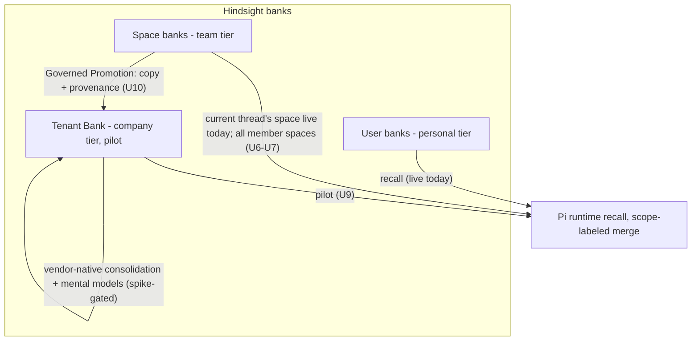
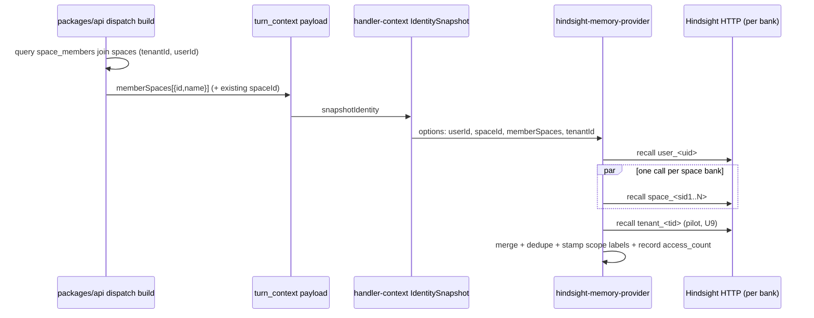
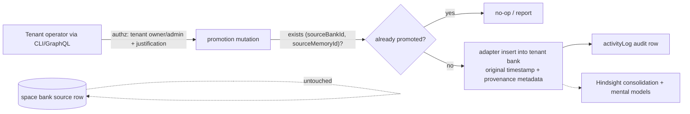

# Hindsight Company Brain Foundation - Plan

## Goal Capsule

- **Objective:** Build team- and company-scoped memory on the deployed Hindsight substrate with minimum change: land phase zero (retention hygiene, stub filter, instrumentation verification, the gating spike), ship team memory (member-space recall fan-out + space dual-write retain), then execute the Tenant Bank pilot only if the spike passes.
- **Product authority:** Eric Odom (brainstorm + external-candidate verdict + plan synthesis, 2026-07-11).
- **Execution profile:** Phase 0 and Phase 1 units are independently landable PRs to `main`. Phase 2 units are **gated on U5's written pass verdict** — do not start them on a fail or pending verdict.
- **Stop conditions:** Stop and surface rather than guess if (a) the U5 spike verdict is fail or ambiguous, (b) dual-write retain (U8) degrades the memory-eval fixture materially, or (c) fan-out (U7) visibly degrades turn latency on dev.
- **Product Contract preservation:** changed R1 (build → live verification — the wiring already shipped in PR #3451), R6 (sharpened: all member spaces, agent-visible scope labels), R8 (moved → **copied** with provenance, idempotent); added R12 (space dual-write retain). All four confirmed by the user at plan synthesis.

---

## Product Contract

### Summary

Make Hindsight the single memory substrate at every scope. Phase zero is retention hygiene, the OKF stub filter, dream-state/access_count verification, and the extended mental-models spike that gates the pilot. Phase one delivers team memory: recall fans out to all of the user's space banks with agent-visible scope labels, and conversation retain dual-writes to the thread's space bank. Phase two — gated on the spike — pilots one Tenant Bank per tenant with manual, copy-with-provenance Governed Promotion from space banks. External company-brain products are rejected or parked, with explicit reopen triggers.

### Problem Frame

Memory is not producing felt benefits. The 2026-06-27 foundation audit found 18,060 memory units with `access_count = 0` — nothing demonstrably read — plus junk signal: context-free fragments, deploy-time smoke tests planting synthetic facts in real user banks, reflect answers looping back in as new memories, and wiki pages published as literal fallback stubs. Knowledge is also trapped by scope: recall reaches the user's bank plus at most the current thread's space bank, bulk retain writes only to the user bank (so space banks stay sparse), and no tenant-wide bank exists at all.

An external comparison (Graphiti/Zep, Onyx/Danswer, openwiki-style page canons, AWS Bedrock Knowledge Bases) concluded none should be the foundation: each either adds new stateful services and databases per customer account against repo policy, solves a different problem (curated search, repo docs), or re-enters a category already rejected on evidence (Cognee scope-bleed, THINK-83; Neptune substrate prepared and retired).

### Key Decisions

- **Foundation is Hindsight, held at Trial grade.** Extend the incumbent rather than adopt an external product. The commitment is earned through the spike and pilot: the load-bearing features (mental models, consolidation at tenant scale) are the least-proven parts of Hindsight, with open upstream bugs (vectorize-io/hindsight #2501 unbounded mental-model growth, #2453 consolidation crash).
- **Spaces are teams.** Space banks (`space_` scope) are the team tier; no teams table, no new team bank class. The only new bank class in the entire effort is the Tenant Bank.
- **The tenant tier is a real bank, superseding "scope filters, not stores" at that tier.** [2026-07-03-001-feat-thinkwork-brain-memory-architecture-plan.md](2026-07-03-001-feat-thinkwork-brain-memory-architecture-plan.md) decided team/tenant views should be scope filters over one Brain. This plan overturns that for the tenant tier only: a Tenant Bank makes curation, provenance, mental-model distillation, and "what does the company know" a one-query debuggable surface. The team tier keeps the existing space banks unchanged.
- **Governed Promotion copies evidence; it never re-summarizes and never hollows out the source.** A promoted memory is a copy in the Tenant Bank carrying source bank id, source memory id, and original timestamp in metadata; the source row stays in its space bank. Promotion is idempotent per (source bank, source memory). Distillation on top of promoted evidence is vendor-native (Hindsight consolidation + mental models), gated on the spike — ThinkWork does not build its own summarizer.
- **Agents must be able to tell scopes apart.** Fan-out recall labels each memory with its scope (personal / team-with-space-name / company) at the merge point, and reflect output preserves the distinction. Without this, multi-bank recall collapses into an unattributable text list.
- **Consumption is the success bar.** The pilot is judged on recall instrumentation showing tenant/space memories used in real turns — not on what is stored.
- **Graph engines stay closed behind a written reopen trigger.** Cognee was rejected empirically (scope-bleed, THINK-83); Graphiti now requires operating raw `graphiti-core` plus a graph database since Zep discontinued its self-hostable server (2025-04). Reopen only if (a) the spike shows mental-model content is junk and upstream bugs sit unfixed for a quarter, or (b) the pilot fails specifically on retrieval quality rather than consumption. If reopened, the serious candidates are systems with first-class org scopes (Mem0/Zep-class), not Cognee again.
- **Bedrock Knowledge Bases is parked as a future complement, not a foundation.** Terraform module and schema tables already exist in-repo, unwired. Revisit after the Tenant Bank proves out; unified `recall(hindsight + wiki + KB)` stays deferred as previously decided.

### Requirements

R-IDs are stable and continuous across capability groups (grouping is by concern, not ID order); R12 joined the Team memory group at plan synthesis.

**Phase zero — hygiene, instrumentation, gate**

- R1. Documents-as-memory is verified live on dev: an emitted document artifact produces a memory unit in the expected bank with colophon provenance. The wiring shipped in PR #3451 (`packages/api/src/lib/artifacts/document-emission.ts` → `ingestDocumentArtifactMemory`); THINK-261 #1's "zero callers" claim is stale and gets corrected.
- R2. Non-knowledge traffic is suppressed at the retain door: (a) deploy smoke-test threads no longer retain synthetic facts into real user banks; (b) reflect-synthesis answers no longer loop back into banks as new memories. User utterances in ordinary turns keep retaining.
- R3. Fallback-stub pages are excluded from the published OKF bundle via a testable predicate, with the versioned bundle + manifest evidence pattern intact.
- R4. The mental-models spike gates the pilot with a written pass/fail verdict covering five checks: content quality vs current stub pages; tenant-bank mechanics rehearsal (scratch bank, ~12 real space memories copied with provenance); **provenance-metadata survival through a consolidation pass**; **copy fidelity** — promoted text reads back byte-identical with a 1:1 source-to-unit mapping, or the transformation is documented and U10's idempotency design adjusts; and probes of upstream bugs #2501/#2453 on the pinned image 0.8.4, run against both the scratch bank and the largest real dev bank.
- R5. Dream state is exercised on dev and `access_count` demonstrably increments from real turns — the pilot's scoreboard works before the pilot starts.

**Team memory**

- R6. Pi runtime recall fans out from the user's bank to the space banks of **all spaces the user is a member of**, with each returned memory carrying an agent-visible scope label (personal / team: space / company) that reflect output preserves.
- R12. Conversation retain dual-writes to the thread's space bank when the thread belongs to a space **and the thread's visibility is space-wide** — restricted-visibility threads (mention-invite, work-item-owned) stay user-bank-only, so team banks are populated by ordinary work without bypassing the per-thread access gate.

**Tenant Bank pilot (gated on R4 pass and R5 verified)**

- R7. Each tenant has one Tenant Bank (`tenant_<tenantId>`), materialized implicitly on first write through the existing adapter surface.
- R8. Governed Promotion exists as a single path: a tenant operator copies explicitly selected space-bank memories into the Tenant Bank with provenance metadata (source bank id, source memory id, original timestamp, actor, justification), idempotent per (source bank, source memory); the source row is untouched.
- R9. Pi runtime recall includes the Tenant Bank for all tenant members; an empty bank degrades silently.
- R10. Provenance of promoted memories is queryable in one step — what is in the Tenant Bank and where each item came from — and a documented manual retraction path exists (delete promoted copy by id, reconcile).
- R11. The pilot is measured on consumption: access_count deltas paired with sampled-transcript evidence that recalled memories shaped real responses — raw surfacing counts alone cannot pass, since fan-out increases surfacing by construction.

### Success Criteria

- The spike verdict (R4) is recorded pass or fail with content-quality and provenance-durability evidence.
- `access_count` moves on dev under real traffic (R5).
- An agent in a thread recalls a memory originating from a space bank and one from the Tenant Bank, **and its response distinguishes the two scopes** — verified as a live scenario, not only instrumentation.
- Agents stop receiving fallback stub text in the OKF bundle (R3); deploy smoke runs stop planting synthetic facts (R2).

### Scope Boundaries

**Deferred for later**

- The full promotion control plane: automated eligibility, corroboration thresholds, permission classification, exception review surfaces, retraction machinery beyond delete-by-id plus reconcile.
- Source banks (CRM, Slack, email, document-repository connector banks) and user→space or user→tenant promotion paths.
- An agent-facing "propose promotion for human approval" tool — the natural bridge from manual promotion to action parity; recorded so the promotion surface isn't reinvented.
- Wiki recompilation from the Tenant Bank — its own gated phase after the Tenant Bank demonstrably holds good content.
- Bedrock Knowledge Bases as a curated-document complement; unified recall across hindsight + wiki + KB.
- A cap or ranking policy for fan-out when users belong to many spaces — observe pilot latency/noise first.

**Outside this effort's identity**

- Adopting an external memory or knowledge product (Graphiti/Zep, Onyx/Danswer, openwiki-style) — rejected per the reopen trigger in Key Decisions.
- New databases, new Python services, or a teams table.
- Agent-initiated promotion or retraction of company-scope memories (Never for the pilot: both move/erase company knowledge unattended).

### Dependencies / Assumptions

- Hindsight runs on its dedicated database (THINK-220 cutover complete; the legacy `hindsight` schema is already dropped from the thinkwork DB), so native consolidation/cron discovery is live — `access_count` measurements reflect reality.
- Hindsight 0.8.4 fails retain loudly (HTTP 500) rather than silently succeeding with zero units — new retain paths must surface, not swallow, these errors.
- `retain_custom_instructions` is a known failed lever (tried twice, worsened dangling referents) — not to be used for quality tuning in any unit.
- ThinkWork's API layer is the authorization boundary for banks (Hindsight OSS has no org/team access control — vectorize-io/hindsight #2235); banks stay reachable only through ThinkWork surfaces.
- Retraction leans on ThinkWork: `HindsightAdapter.forget()` deletes by row id directly; the vendor API has no per-memory delete.

### Sources

- [docs/audits/hindsight-memory-foundation-audit-2026-06-27.md](../audits/hindsight-memory-foundation-audit-2026-06-27.md) — binding commitment to Hindsight as canonical substrate; access_count and quality findings.
- Linear THINK-261 (phase-zero source items; #1 stale per R1), THINK-250 (company-brain ideation, parked), THINK-193, THINK-83 (Cognee rejection), THINK-220 (dedicated DB, complete), THINK-199 (access_count patch), THINK-152/PR #3451 (documents-as-memory, shipped).
- [docs/plans/2026-07-03-001-feat-thinkwork-brain-memory-architecture-plan.md](2026-07-03-001-feat-thinkwork-brain-memory-architecture-plan.md) — the superseded "scope filters, not stores" decision.
- [docs/solutions/tooling-decisions/hindsight-084-upgrade-validation-2026-07-06.md](../solutions/tooling-decisions/hindsight-084-upgrade-validation-2026-07-06.md) and [docs/solutions/tooling-decisions/memory-retain-model-eval-2026-07-06.md](../solutions/tooling-decisions/memory-retain-model-eval-2026-07-06.md) — retain-quality baseline; failed custom-instructions lever; loud-failure behavior change.
- [docs/solutions/architecture-patterns/generated-knowledge-projections-need-read-only-agent-traversal-gates-2026-06-24.md](../solutions/architecture-patterns/generated-knowledge-projections-need-read-only-agent-traversal-gates-2026-06-24.md) — OKF bundle projection pattern the stub filter must preserve.
- Hindsight mental-models API: https://hindsight.vectorize.io/developer/api/mental-models; org-scope gap: https://github.com/vectorize-io/hindsight/issues/2235.
- Live recall wiring is `packages/agentcore-pi/agent-container/src/runtime/providers/hindsight-memory-provider.ts` (not the legacy `src/tools/hindsight.ts`, whose "remains the live wiring" docstring is stale).

---

## Planning Contract

### Key Technical Decisions

- KTD-1. **Smoke suppression happens at the retain-door by thread-id prefix, not payload eval-tagging.** Smoke threads are synthetic (`smoke-<timestamp>-<random>` from `freshThreadId()`), so `eventThreadId.startsWith("smoke-")` is a clean key in `packages/api/src/handlers/memory-retain.ts`. Eval-tagging the smoke payload instead would trip `isEvalTrafficPayload`'s client-side short-circuit and break `pi-marco-smoke.ts`'s own `expectRetain: true` assertion; door-side suppression leaves the smoke untouched.
- KTD-2. **Reflect-exhaust suppression keys on "reflect tool invoked this turn," tracked in the memory extension and threaded into the retain payload.** ThinkWork's dream pipeline never retains (verified — `applier.ts` has no retain call); the actual loop is reflect-synthesis answers re-entering banks via per-turn auto-retain. The signal is per-turn state exposed by `packages/pi-extensions/src/memory.ts` (where reflect runs), threaded through `server.ts`'s `retainConversation` call site into the retain payload metadata as `reflectExhaust`; the door skips conversation retention for flagged turns. Trade-off accepted and pinned by test: a reflect-then-real-work turn is also suppressed — the whole-turn rule stays simple, and such turns are rare and low-signal.
- KTD-3. **The stub filter lives at OKF bundle assembly, not page materialization.** Predicate: exclude pages with `type = 'entity'` AND `summary IS NULL` — the direct marker of `graph-materializer.ts`'s fallback path — validated against real dev pages before landing. Filtering in `packages/api/src/lib/okf/materializer.ts`'s source query keeps wiki UI behavior unchanged and preserves the versioned-bundle/manifest evidence pattern; the manifest records the excluded count so filtering is auditable.
- KTD-4. **Member-space fan-out is a new plural dispatch-payload field, mirrored hop-by-hop from the existing single-space precedent.** `memberSpaces: Array<{id, name}>` flows `agent-dispatch-payload.ts` (ids joined with names from the `spaces` table in the same dispatch-build query against `space_members`) → `turn_context` → `handler-context.ts` `IdentitySnapshot` → `server.ts` → `hindsight-memory-provider.ts` targets. Names ride along because `[team: <space>]` labels cannot be built from ids alone — the provider has no ThinkWork-DB lookup surface, and an ids-only field would force a second payload-contract migration. Recall/reflect stay N parallel single-bank HTTP calls with client-side merge — Hindsight has no multi-bank endpoint — and the existing `Promise.all` + `mergeMemoryItems` machinery already proves the shape for two targets.
- KTD-5. **Scope labels are stamped at the provider merge point.** Bank id is in hand as each target's results return; the formatter attaches `[personal]` / `[team: <space>]` / `[company]` instead of flattening to bare text, and reflect's existing per-target prefixes ("User memory:" / "Space memory:") extend to named spaces and company. No adapter or schema change.
- KTD-6. **Promotion inserts verbatim copies via direct `memory_units` insert; the HTTP retain path and `hindsight-bank-merge.ts` are both wrong tools.** The HTTP retain path runs vendor LLM extraction that can rewrite or split posted items — the repo already works around this for exact-text writes (`persistHighConfidenceFactMemoryUnit` in `packages/api/src/handlers/memory-retain.ts` inserts directly into `memory_units`); promotion mirrors that precedent inside the new promotion lib, preserving the original timestamp, with provenance in the `metadata` jsonb: `{ sourceBankId, sourceMemoryId, sourceTimestamp, promotedBy, promotedAt, justification }`. Bank-merge stays reference-only (destructive whole-bank re-keying, no selection, no provenance). Idempotency: check for an existing tenant-bank unit with the same (sourceBankId, sourceMemoryId) before insert — a 1:1 mapping the R4 copy-fidelity check confirms.
- KTD-7. **`"tenant"` joins the `ownerType` union with no GraphQL regeneration.** `MemoryOwnerRef.ownerType` is a plain TS union (`packages/api/src/lib/memory/adapter.ts`) and the GraphQL schema exposes `ownerType: String` — so the pilot's type change touches `resolveBankId`, `inferOwnerType`/`inferOwnerIdFromBank` (which would otherwise misclassify `tenant_` banks as user), and a sibling `ensureBankConfigured` variant rather than breaking that method's user-hardcoded single-arg signature.
- KTD-8. **Promotion authorization gates both ends: tenant operator at the destination, source-space read access at the origin, audited.** The tenant-operator pattern (`isOperator`-style check on `tenant_members` role) on top of `requireMemoryTenantScope` gates the destination, and `hasSpaceMemberAccess(ctx, tenantId, sourceSpaceId)` gates the source — operators promote only from spaces they can read, matching how space memory reads are gated everywhere else. Every promotion writes an `activityLog` row carrying actor + justification, mirroring `packages/api/src/lib/brain/promotion.ts`.
- KTD-9. **Dream-state verification runs manual-first.** `brain-dream-state.ts` honors `event.manual === true` regardless of the terraform flag, and `BrainDreamStateInput` supports `dryRun`/`bankId` scoping — so verification starts with a dry-run, then a single-bank live run, before the schedule is enabled. The `brain_dream_state_enabled` variable is not passed through `terraform/examples/greenfield/main.tf` today; that passthrough is part of U4, not a blocker for verification.
- KTD-10. **Retain-volume changes are gated on the memory-eval harness.** U8 (dual-write) runs the frozen 18-thread fixture at `packages/api/scripts/memory-eval/` before/after; material degradation is a stop condition.
- KTD-11. **The spike uses vendor APIs directly and tears down via the wipe runbook.** The adapter exposes no mental-model CRUD (read-only evidence parsing), so the spike calls Hindsight's HTTP API for mental models; banks materialize implicitly on first write; teardown follows `packages/api/scripts/wipe-external-memory-stores.ts` / `docs/runbooks/hindsight-wipe-and-reload.md` (dry-run first, delete by `bank_id`).
- KTD-12. **Dual-write beats single-write routing for space threads because personal recall must survive leaving the space.** Routing space-thread retain only to the space bank would halve retain volume and avoid duplicate surfacing, but a user's recall of their own conversations would then depend on continued space membership. Dual-write keeps the personal copy durable; the doubled retain volume is watched per System-Wide Impact, and the duplicate surfacing it creates is resolved at U7's merge dedupe.

### High-Level Technical Design

Member-space fan-out — the payload chain and the per-turn call shape:

Governed Promotion — copy with provenance, idempotent:

### Assumptions

- Space membership counts are small at current scale (~tens), so uncapped parallel fan-out is acceptable for the pilot; a cap/ranking policy is a recorded deferral, not a prerequisite.
- The `summary IS NULL AND type = 'entity'` stub predicate matches the audit's observed stubs; U3 validates against real pages before relying on it.

### System-Wide Impact

- **Dispatch payload contract (U6).** `turn_context` is consumed by every payload builder (chat-agent-invoke, wakeup-processor, turn-loop re-invoke); the parity test fails until all carry `memberSpaces`. Treat that test as the contract's enforcement, and land U6 as one PR so no builder ships half-migrated.
- **GraphQL surface fan-out (U10).** The promotion mutation regenerates codegen in four consumers (`apps/cli`, `apps/web`, `apps/mobile`, `packages/api`) plus `terraform/schema.graphql` via `pnpm schema:build` — the only unit with a schema blast radius; keep it isolated from other units' PRs.
- **Turn latency posture (U7, U9).** Recall goes from ≤2 to 2+N parallel Hindsight calls per turn. Wall-clock cost is the slowest single call, not the sum, but a degraded Hindsight amplifies: per-bank failures must degrade (drop that bank's results) rather than fail the turn — covered by U7's failure-path test and the Goal Capsule stop condition.
- **Retain volume and storage posture (U8).** Dual-write roughly doubles retain volume for space threads (Hindsight-side LLM extraction cost and storage). The memory-eval gate covers quality; watch dev Hindsight service load after U8 lands before considering broader rollout.
- **Failure propagation (U2, U8, U10).** Retain paths surface 0.8.4's loud 500s: dual-write handles per-bank failure independently; promotion reports per-item failures without losing completed items; document-emission ingest stays best-effort by design (verified in U1).
- **Agent context surface (U7).** Recall/reflect output format changes for every agent once scope labels ship — prompts consuming memory see labeled entries. This is additive text, but eval-sensitive: if memory-consuming evals exist, re-baseline after U7.

---

## Implementation Units

| U-ID | Title                                                                  | Key files                                                                                                                         | Depends on                         |
| ---- | ---------------------------------------------------------------------- | --------------------------------------------------------------------------------------------------------------------------------- | ---------------------------------- |
| U1   | Verify documents-as-memory live; correct THINK-261                     | (verification only)                                                                                                               | —                                  |
| U2   | Suppress smoke + reflect-exhaust retention                             | `packages/api/src/handlers/memory-retain.ts`, `packages/agentcore-pi/.../hindsight-memory-provider.ts`, `memory-retain-client.ts` | —                                  |
| U3   | OKF bundle stub filter                                                 | `packages/api/src/lib/okf/materializer.ts`                                                                                        | —                                  |
| U4   | Dream state on dev + access_count verification                         | `terraform/examples/greenfield/main.tf` (+ runbook)                                                                               | —                                  |
| U5   | Extended mental-models spike (GATE)                                    | (spike; no product code)                                                                                                          | none (U4 strengthens its evidence) |
| U6   | `memberSpaces` dispatch payload field                                  | `packages/api/src/lib/agent-dispatch-payload.ts` + payload builders                                                               | —                                  |
| U7   | Provider fan-out + scope labels                                        | `packages/agentcore-pi/.../handler-context.ts`, `server.ts`, `hindsight-memory-provider.ts`                                       | U6                                 |
| U8   | Space dual-write retain                                                | `packages/api/src/handlers/memory-retain.ts`                                                                                      | U2                                 |
| U9   | Tenant owner type + tenant-bank recall                                 | `packages/api/src/lib/memory/adapter.ts`, `adapters/hindsight-adapter.ts`, provider                                               | U5 pass, U7                        |
| U10  | Governed Promotion mutation + CLI                                      | `packages/database-pg/graphql/types/memory.graphql`, `packages/api/src/graphql/resolvers/memory/`, `apps/cli`                     | U5 pass, U9                        |
| U11  | Pilot observability: provenance query, retraction runbook, measurement | resolvers + `docs/runbooks/`                                                                                                      | U10                                |

### Phase 0 — hygiene, instrumentation, gate

### U1. Verify documents-as-memory live; correct THINK-261

- **Goal:** Confirm R1 works on dev end-to-end and close the stale "zero callers" claim.
- **Requirements:** R1.
- **Dependencies:** none.
- **Files:** none expected — verification unit. Reference: `packages/api/src/lib/artifacts/document-emission.ts` (ingest call, ~line 1389), `packages/api/src/lib/artifacts/document-memory.ts`.
- **Approach:** On dev, emit a document artifact in (a) a space-assigned thread and (b) a personal thread; confirm a memory unit lands in `space_<id>` / `user_<id>` respectively with colophon fields (genre, title, timestamp) in metadata, via memory records query or direct adapter read. Comment on THINK-261 #1 with the evidence and PR #3451 reference. If verification fails, the gap becomes a scoped fix unit — surface before coding.
- **Test scenarios:** Test expectation: none — verification-only; existing coverage lives in `packages/api/src/lib/artifacts/document-memory.test.ts` and `document-emission.test.ts` (including the ingest-failure-never-fails-emission case).
- **Verification:** Dev evidence (bank + unit id) recorded in the THINK-261 comment.

### U2. Suppress smoke and reflect-exhaust retention

- **Goal:** Non-knowledge traffic stops entering banks at the retain door (R2) without breaking the smoke suite's own assertions.
- **Requirements:** R2.
- **Dependencies:** none.
- **Files:** `packages/api/src/handlers/memory-retain.ts`, `packages/api/src/handlers/memory-retain.test.ts`; `packages/pi-extensions/src/memory.ts` (per-turn reflect-invoked state), `packages/agentcore-pi/agent-container/src/server.ts` (retain call site), `packages/agentcore-pi/agent-container/src/runtime/tools/memory-retain-client.ts` + co-located tests.
- **Approach:** Per KTD-1, skip conversation retention in the handler when `eventThreadId` starts with `smoke-` (synthetic thread ids never correspond to DB rows). Per KTD-2, track "reflect tool invoked this turn" as per-turn state in the memory extension, thread it through `server.ts`'s retain call into the payload metadata as `reflectExhaust`, and skip conversation retention at the door when set. Do not eval-tag the smoke payload (breaks `pi-marco-smoke.ts` `expectRetain: true`).
- **Patterns to follow:** existing `isEvalTrafficMetadata` guard shape (`packages/api/src/lib/memory/eval-traffic.ts`); `vi.hoisted` mock pattern in `memory-retain.test.ts`.
- **Test scenarios:**
  - `eventThreadId = "smoke-1720700000-abc"` → no retain call reaches the adapter; a normal UUID thread id retains as before.
  - Payload metadata `reflectExhaust: true` → conversation retention skipped; same turn without the flag retains.
  - Eval-tagged payloads keep their existing behavior (regression).
  - `reflectExhaust` set only on turns that invoked the reflect tool; ordinary tool-using turns unaffected; a reflect-then-real-work turn is suppressed (pinned as the accepted trade-off).
- **Verification:** Unit tests green; one dev deploy's smoke run followed by a bank query showing no new `smoke-` sourced units in the target user bank.

### U3. OKF bundle stub filter

- **Goal:** Agents stop receiving fallback stub pages in the OKF bundle (R3).
- **Requirements:** R3.
- **Dependencies:** none.
- **Files:** `packages/api/src/lib/okf/materializer.ts` + its test.
- **Approach:** Per KTD-3, before filtering, validate the predicate (`type = 'entity'` AND `summary IS NULL`) against real dev pages from the audit — confirm it catches the fallback pages and does not catch legitimately summary-less non-entity pages. Then add the predicate to `loadTenantOkfMaterializationSource`'s selection and record the excluded count in the bundle manifest evidence. Wiki UI/GraphQL surfaces are untouched.
- **Patterns to follow:** the projection pattern in [generated-knowledge-projections-need-read-only-agent-traversal-gates-2026-06-24.md](../solutions/architecture-patterns/generated-knowledge-projections-need-read-only-agent-traversal-gates-2026-06-24.md) — versioned bundle, checksum, manifest evidence before the current-pointer moves.
- **Test scenarios:**
  - Entity page with null summary → excluded; entity page with real summary → included.
  - Non-entity page with null summary → included (predicate scoped to entity type).
  - Manifest reports the excluded count; bundle checksum/object counts reflect the post-filter set.
- **Verification:** Rebuilt dev bundle contains no page whose body is the literal fallback sentence; manifest evidence shows the exclusion count.

### U4. Dream state on dev + access_count verification

- **Goal:** The pilot's scoreboard provably works: consolidation runs and `access_count` increments from real turns (R5).
- **Requirements:** R5.
- **Dependencies:** none (Hindsight dedicated-DB cutover already complete).
- **Files:** `terraform/examples/greenfield/main.tf` (add `brain_dream_state_enabled` passthrough — currently missing), plus a short runbook note in `docs/runbooks/`.
- **Approach:** Per KTD-9: invoke `brain-dream-state` manually with `dryRun` first, review the planned actions, then a single-bank live run (`bankId` scoping bounds the first-run blast radius against the 18k-unit backlog). Run real turns on dev, then confirm `access_count` incremented via the adapter's `accessCount` field or direct SQL on `memory_units`. Land the terraform passthrough and enable the schedule on dev afterward.
- **Execution note:** Config + observation; prefer runtime evidence over unit coverage.
- **Test scenarios:** Test expectation: none — config/verification unit; the access-count write path (`recordMemoryAccess`) already has provider tests.
- **Verification:** Recorded before/after `access_count` values for units recalled in a real dev turn; dream-state dry-run and live-run outputs attached to THINK-261 #5.

### U5. Extended mental-models spike (GATE)

- **Goal:** Produce the written pass/fail verdict that gates the pilot (R4).
- **Requirements:** R4.
- **Dependencies:** none to start; U4's working scoreboard strengthens its evidence.
- **Files:** no product code. Output: a verdict doc in `docs/solutions/tooling-decisions/` + gate decision on THINK-261.
- **Approach:** Per KTD-11, on dev: (1) create a scratch bank `tenant_<uuid>` (fresh UUID, recorded in the verdict doc) implicitly by writing to it; (2) copy ~12 real space-bank memories into it via direct `memory_units` insert using U10's exact row/metadata shape (KTD-6) and original timestamps — a mechanics-shape rehearsal; adapter/lib-path coverage lands in U9/U10 tests, and the verdict must not claim more; (3) create three mental models via the vendor HTTP API (one entity, one topic, one with `refresh_after_consolidation`); (4) trigger consolidation (`consolidateBankById`); (5) judge mental-model content quality against the same entities' current stub pages; (6) **read back the promoted units: provenance metadata survived consolidation, text is byte-identical to source, and the source-to-unit mapping is 1:1** — or document the transformation and flag U10's idempotency design; (7) probe #2501 (delta-refresh growth across repeated refreshes) and #2453 (merge behavior on malformed output) against both the scratch bank and the largest real dev bank via U4's `bankId`-scoped dream-state run; (8) tear down via the wipe pattern, dry-run first.
- **Execution note:** Spike — evidence gathering, zero product code; validate against the pinned image 0.8.4, not latest vendor docs.
- **Test scenarios:** Test expectation: none — spike; its deliverable is the verdict document.
- **Verification:** Verdict doc exists with pass/fail, evidence for each of the four R4 checks, and the gate decision recorded on THINK-261.

### Phase 1 — team memory

### U6. `memberSpaces` dispatch payload field

- **Goal:** The runtime learns which space banks a user may recall from, with the names the scope labels need (input half of R6).
- **Requirements:** R6.
- **Dependencies:** none.
- **Files:** `packages/api/src/lib/agent-dispatch-payload.ts`, every dispatch-payload builder it documents (chat-agent-invoke, wakeup-processor, wakeup turn-loop re-invoke), the dispatch parity test (`wakeup-processor.dispatch-parity.test.ts`), + unit tests.
- **Approach:** Per KTD-4: at dispatch build, query `space_members` joined to `spaces` for the user's space ids and names in the tenant and add `memberSpaces: Array<{id, name}>` to `DispatchTurnContext`/`turn_context`, keeping the existing singular `spaceId`/`spaceSlug` untouched. Add the field everywhere payloads are built or the parity test fails — that test is the safety net, not an obstacle.
- **Patterns to follow:** the existing `spaceId`/`spaceSlug` threading in `agent-dispatch-payload.ts` (assembled ~line 171); `REQUIRED_DISPATCH_FIELDS`.
- **Test scenarios:**
  - User in two spaces → payload carries both `{id, name}` pairs; user in zero spaces → empty array (not undefined).
  - Parity test passes across all payload builders.
  - Membership is resolved fresh per dispatch (a removed member's next turn no longer carries that space).
- **Verification:** `npx vitest run` on the touched api tests; a dev thread's dispatch payload (logged or inspected) shows the field.

### U7. Provider fan-out + scope labels

- **Goal:** Recall/reflect span user + all member-space banks with agent-visible scope attribution (output half of R6).
- **Requirements:** R6.
- **Dependencies:** U6.
- **Files:** `packages/agentcore-pi/agent-container/src/handler-context.ts`, `packages/agentcore-pi/agent-container/src/server.ts`, `packages/agentcore-pi/agent-container/src/runtime/providers/hindsight-memory-provider.ts` + `hindsight-memory-provider.test.ts`; `packages/pi-runtime-core/src/memory-provider.ts` (the `MemoryItem.sourceScope` union is closed to `"user" | "space"` — extend it or add a scope-label field) and `packages/pi-extensions/src/memory.ts` (`formatMemories` renders the scope tags agents actually see) — both separate workspace packages consumed by agentcore-pi.
- **Approach:** Per KTD-4/KTD-5: thread `memberSpaces` through `IdentitySnapshot` and provider options; targets become user bank + dedupe(current `spaceId` ∪ `memberSpaces` ids); keep `Promise.all` parallel recall/reflect and `mergeMemoryItems` dedupe; stamp scope labels at the merge (`[personal]` / `[team: <space name>]`) in the formatted output; extend reflect's per-target prefixes to name the space. Cross-bank content dedupe: dual-written content (U8) lands in both user and space banks under different unit ids — collapse near-identical units at the merge via content comparison that ignores scope, with the team label winning for space-origin content. `recordMemoryAccess` keeps firing per surfaced unit (it is bank-agnostic — verify).
- **Patterns to follow:** `hindsight-memory-provider.test.ts` "recalls user and Space banks when the invocation has a Space id" — extend the exact call-count/per-bank-URL assertion shape to N spaces.
- **Test scenarios:**
  - Two member spaces + current space overlap → deduped targets, one call per distinct bank, labels name each space.
  - Zero member spaces → user-bank-only behavior identical to today (regression).
  - One bank's HTTP call fails → other banks' results still return (degraded, not erred).
  - Reflect across 3 targets → combined answer preserves per-scope prefixes; merged evidence carries per-unit ids for access-count recording.
  - Content dual-written to user + space banks surfaces once, labeled with the team scope (cross-bank dedupe).
- **Verification:** Provider tests green; live dev thread shows labeled team memories from a non-current space.

### U8. Space dual-write retain

- **Goal:** Ordinary conversation in space threads populates the team bank (R12).
- **Requirements:** R12.
- **Dependencies:** U2 (suppression first, so dual-write doesn't double the junk).
- **Files:** `packages/api/src/handlers/memory-retain.ts` (+ `packages/api/src/lib/memory/hindsight-retain-params.ts` if tags need a space variant), `memory-retain.test.ts`.
- **Approach:** When the retained thread has a `spaceId` **and its visibility equals full space membership** (per the `callerVisibleThreadPredicate` model — threads gated via `thread_participants` or work-item ownership are excluded), retain the conversation to `space_<spaceId>` in addition to `user_<userId>`, mirroring the existing high-confidence-fact scope split. Handle per-bank retain failures independently and loudly (0.8.4 returns 500s). Do not touch `retain_custom_instructions` (known failed lever).
- **Execution note:** Before/after run of the memory-eval fixture (`packages/api/scripts/memory-eval/`) is part of this unit's proof; material degradation is a stop condition.
- **Test scenarios:**
  - Space-wide-visibility space thread → adapter called for both banks with the same transcript, space-scoped tags on the space write.
  - Restricted-visibility space thread (participants-gated or work-item-owned) → single user-bank retain; a non-participant space member's recall never surfaces its content.
  - Personal thread → single user-bank retain (regression).
  - Space-bank retain 500s → error surfaced/classified; user-bank retain still completes (and vice versa).
  - Suppressed traffic (smoke, reflect-exhaust, eval) dual-writes nothing.
- **Verification:** Tests green; memory-eval fixture comparison recorded; dev space-thread turn produces units in both banks. After U7 + U8 are live on dev, record Phase 1's own consumption evidence — access_count deltas for space-bank units plus one sampled transcript where a space memory shaped a response (reuses U4's scoreboard) — so team memory gets judged even if the spike fails and Phase 2 never runs.

### Phase 2 — Tenant Bank pilot (gated on U5 pass)

### U9. Tenant owner type + tenant-bank recall

- **Goal:** The Tenant Bank exists as a first-class owner scope and agents recall from it (R7, R9).
- **Requirements:** R7, R9.
- **Dependencies:** U5 pass, U7.
- **Files:** `packages/api/src/lib/memory/adapter.ts` (ownerType union), `packages/api/src/lib/memory/adapters/hindsight-adapter.ts` (`resolveBankId`, `inferOwnerType`, `inferOwnerIdFromBank`, sibling ensure-configured variant) + `hindsight-adapter.test.ts`; `hindsight-memory-provider.ts` (tenant target from identity tenantId) + test; `packages/pi-runtime-core/src/memory-provider.ts` (`sourceScope` union gains the tenant scope).
- **Approach:** Per KTD-7: add `"tenant"` to the union; `resolveBankId` returns `tenant_<id>`; fix the two bank-id inference helpers so `tenant_` banks aren't misclassified as user; add a sibling method (e.g., `ensureBankConfiguredFor(owner)`) instead of changing `ensureBankConfigured`'s user-hardcoded signature — audit its callers first. Provider adds the tenant target unconditionally (identity already carries tenantId); an empty bank returns zero hits through the existing merge, so no flag machinery. Company-scope label `[company]` per KTD-5.
- **Test scenarios:**
  - `resolveBankId({ownerType:"tenant"})` → `tenant_<uuid>`; non-UUID rejected (existing guard).
  - `inferOwnerType("tenant_<uuid>")` → tenant (not user).
  - Provider includes the tenant target; empty tenant bank → results identical to pre-pilot behavior (regression).
- **Verification:** Adapter + provider tests green; dev thread recall issues the tenant-bank call (observable in provider test / logs) without behavior change while the bank is empty.

### U10. Governed Promotion mutation + CLI

- **Goal:** A tenant operator can copy selected space memories into the Tenant Bank with provenance, idempotently, audited (R8).
- **Requirements:** R8.
- **Dependencies:** U5 pass, U9.
- **Files:** `packages/database-pg/graphql/types/memory.graphql` (mutation), `packages/api/src/graphql/resolvers/memory/` (new resolver), new `packages/api/src/lib/memory/promotion.ts`, `apps/cli` (operator command), tests alongside each. GraphQL edit triggers `pnpm schema:build` + codegen in `apps/cli`, `apps/web`, `apps/mobile`, `packages/api`.
- **Approach:** Per KTD-6/KTD-8: mutation takes space id + memory ids + justification; authz = `requireMemoryTenantScope` + tenant owner/admin role check (mirror the `isOperator` pattern) + `hasSpaceMemberAccess` on the source space (KTD-8); for each id, skip if a tenant-bank unit already carries that (sourceBankId, sourceMemoryId) in metadata, else insert a verbatim copy via the direct `memory_units` path (KTD-6) with original timestamp + full provenance metadata; write one `activityLog` row per promotion action with actor and justification. Source rows untouched. CLI-first surface (`thinkwork memory promote ...`); no web UI in the pilot. `hindsight-bank-merge.ts` is reference-only for SQL techniques — do not call it.
- **Test scenarios:**
  - Happy path: two selected memories → two tenant-bank copies with provenance metadata, original timestamps, one audit row.
  - Idempotency: re-promoting the same memory → no duplicate, reported as already-promoted.
  - Authz: tenant `member` role → denied; space admin who isn't tenant operator → denied (pilot rule); operator in wrong tenant → denied by tenant scope; tenant operator who is not a member of the source space → denied (KTD-8 source gate).
  - Missing justification → rejected.
  - Adapter insert 500s mid-batch → completed items reported, failed items surfaced, no audit row for failures.
- **Verification:** Resolver/lib/CLI tests green; codegen clean across the four consumers; dev promotion of real space memories visible in the tenant bank with provenance.

### U11. Pilot observability: provenance query, retraction runbook, measurement

- **Goal:** Provenance is queryable in one step, retraction is documented and rehearsed, and the pilot has its consumption measurement (R10, R11).
- **Requirements:** R10, R11.
- **Dependencies:** U10.
- **Files:** `packages/api/src/graphql/resolvers/memory/` (tenant-bank listing query with provenance + `accessCount` — reuse the adapter read path that already selects `access_count`), or CLI-only if a resolver already suffices; `docs/runbooks/tenant-bank-pilot.md` (retraction: `forget(id)` on the promoted copy + `consolidateBankById` reconcile; measurement queries; pilot evaluation checklist).
- **Approach:** One query answers "what is in the Tenant Bank and where did each item come from" — provenance metadata fields + accessCount per unit. Retraction is verify-then-delete: fetch the target unit and confirm it carries this tenant's Tenant-Bank provenance (sourceBankId/sourceMemoryId under the caller's tenant) before `forget(id)`, mirroring `deleteMobileMemoryCapture.mutation.ts`'s inspect-then-verify pattern; the runbook rehearses one real retraction on dev. Measurement per R11: access_count deltas for tenant-bank units paired with sampled transcripts over the pilot window (raw deltas alone cannot pass — fan-out inflates surfacing by construction), plus the live agent scenario from Success Criteria (response distinguishes scopes).
- **Test scenarios:**
  - Query returns promoted units with sourceBankId/sourceMemoryId/promotedBy/promotedAt and accessCount.
  - Retracted unit disappears from the query and from subsequent recall.
  - Retraction of an id that is not one of this tenant's promoted units (wrong tenant, or an original space-bank row) → refused before any delete.
- **Verification:** Rehearsed retraction recorded in the runbook; pilot measurement numbers + the scope-distinguishing thread transcript captured as the pilot's evidence.

---

## Verification Contract

| Gate                        | Command / evidence                                                                           | Applies to               |
| --------------------------- | -------------------------------------------------------------------------------------------- | ------------------------ |
| Types + lint + tests (repo) | `pnpm -r --if-present typecheck && pnpm -r --if-present lint && pnpm -r --if-present test`   | every code unit          |
| Targeted tests              | `npx vitest run <file>` in `packages/api` / `packages/agentcore-pi` per unit's test files    | U2, U3, U6–U11           |
| Memory-quality gate         | before/after run of `packages/api/scripts/memory-eval/` frozen 18-thread fixture             | U8                       |
| GraphQL surface             | `pnpm schema:build` + `pnpm --filter @thinkwork/<cli\|web\|mobile\|api> codegen` clean       | U10                      |
| Deploy smoke                | post-deploy `pi-marco-smoke` passes unchanged; no new `smoke-` units in banks                | U2                       |
| Dev runtime evidence        | manual verifications recorded (bank queries, access_count deltas, labeled recall transcript) | U1, U4, U5, U7, U10, U11 |

Behavioral bar: the Success Criteria scenario — an agent recalls space- and tenant-bank memories in a live thread and distinguishes their scopes — is part of the contract, not optional polish.

## Definition of Done

- Phase 0 and Phase 1 units landed via PRs to `main`, each gate above green, with dev runtime evidence recorded on THINK-261.
- U5's verdict document exists with pass/fail and evidence for all four R4 checks; the gate decision is recorded.
- **If the spike passes:** Phase 2 units landed; pilot evidence captured (provenance query output, rehearsed retraction, consumption measurements, scope-distinguishing transcript).
- **If the spike fails:** Phase 2 units are explicitly marked not-executed on THINK-261, and the reopen-trigger review from Key Decisions is scheduled — the plan is then done at Phase 1.
- Cleanup: the spike's scratch bank is torn down; no abandoned experimental code remains in the diff; THINK-261 reflects the final state of all six items.
