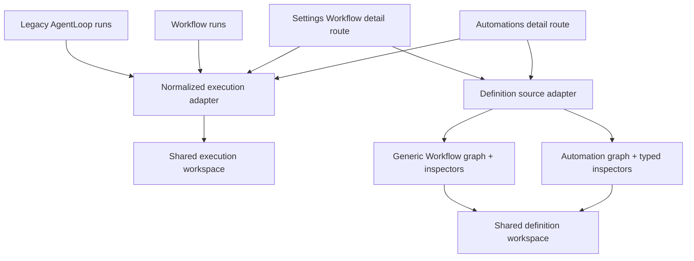
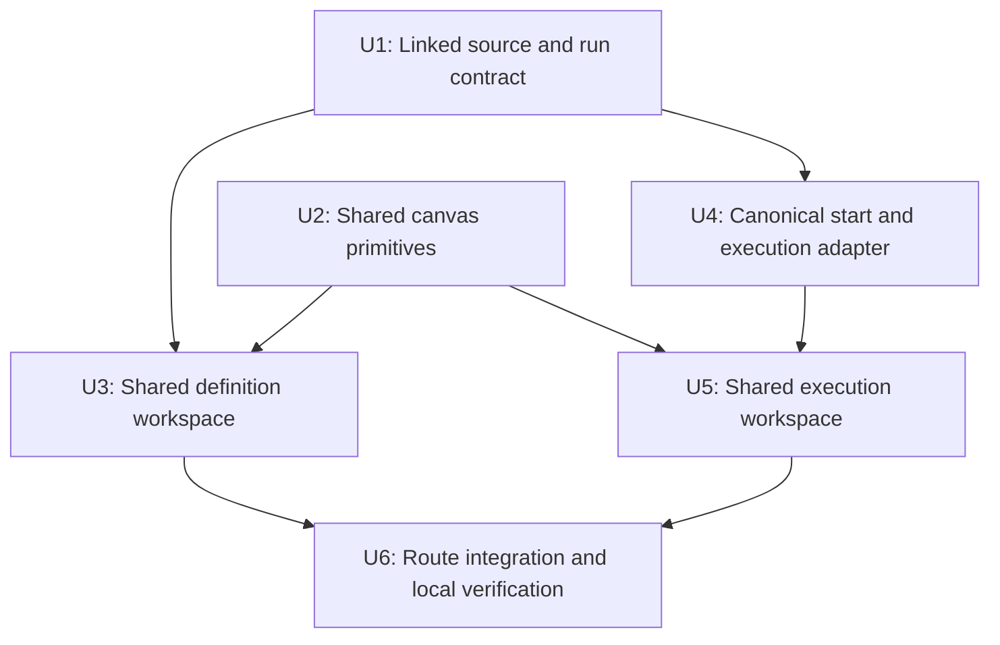
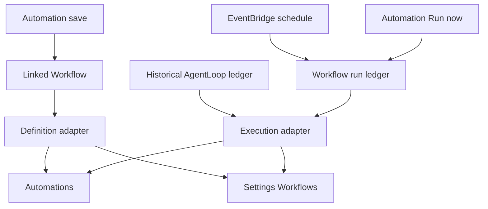

# refactor: Unify Automation and Workflow definition and execution UI

## Overview

Automations and Settings → Workflows currently describe the same converged report automation through separate React components and separate run ledgers. The result is visible drift: different nodes, different inspectors, different execution layouts, raw CRON text in one rail, oversized initial canvas zoom, and a scheduled run that appears only under Settings because the schedule writes `workflow_runs` while manual “Run now” writes `agent_loop_runs`.

This plan makes the Automations canvas the shared definition experience for automation-backed workflows, makes the Workflow execution ledger the forward-looking source of truth, and introduces one shared execution workspace used by both routes. Existing legacy AgentLoop runs remain visible through a transitional normalized execution adapter rather than being silently discarded.

## Implementation Outcome

- Automation-backed Settings Workflows now use the same typed Automation canvas, node forms, and General information rail as the main Automations route.
- The rolling-deploy compatibility path resolves legacy `automation-<id-prefix>` Workflow slugs against the tenant Automation inventory only when the deployed GraphQL schema does not yet expose `sourceAutomation`.
- The shared definition workspace never stacks its inspector below the canvas: it uses a persistent right rail at normal widths and an overlay right-side panel below the content breakpoint.
- Both routes share the normalized execution workspace, including canonical Workflow runs, labeled legacy AgentLoop history, and run/node contextual inspection.
- Local authenticated verification completed on `http://localhost:5180` against the configured TEI API, including typed Work step inputs and scheduled Workflow execution visibility.

---

## Problem Frame

The Automations simplification requirements define the product-facing model and vocabulary: one Automation with a Trigger, Target, attached user, optional Space, and a single observable run history (see origin: `docs/brainstorms/2026-07-04-think-137-automations-simplification-requirements.md`). The Workflow control-plane requirements separately establish `WorkflowRun` as the canonical execution ledger and require a single monitoring surface that answers what ran, why, against which version, and with what evidence (`docs/brainstorms/2026-06-20-first-class-workflow-control-plane-requirements.md`).

The current implementation only partially converges these models. `syncReportAutomationConvergence` creates a linked `workflows` row and moves report schedules to `workflow_schedule`, so scheduled executions correctly land in `workflow_runs`. The Automations route still queries `AgentLoop.runs`, and its Run now mutation still creates `agent_loop_runs`. Settings → Workflows queries the linked Workflow and therefore sees the scheduled run but not the legacy manual history. The UI divergence is a consequence of that split rather than a stale cache or a failed schedule.

---

## Requirements Trace

The R-IDs below are plan-local. They preserve and specialize Automations origin R1/R9/R10/R11 and Workflow origin R1/R2/R6/R7/R8/R10/R11/R13/R21/R22 for this parity slice.

- R1. Both Automations and Settings → Workflows must render automation-backed definitions with the same node graph, node sizing, selection behavior, and right-side inspector.
- R2. The default canvas fit must not enlarge nodes beyond their authored 230×86 presentation; users may still zoom manually.
- R3. The no-selection definition rail must have a visible “General information” title, while selected nodes retain their node-specific titles.
- R4. Schedule values shown outside raw-edit controls must be human-readable (for example, “Daily at 6:00 AM · America/Chicago”), with raw CRON reserved for custom/edit affordances and fallback diagnostics.
- R5. The Automations tab label must change from Activity to Executions, and both routes must use the same execution list/canvas/inspector component.
- R6. A scheduled execution visible in Settings → Workflows must also be visible from its source Automation; future manual starts for converged automations must write the canonical Workflow run ledger.
- R7. Historical AgentLoop manual executions must remain discoverable during the ledger transition, with explicit source-aware links and no duplicate rows.
- R8. The shared execution workspace must show general run status/details when no node is selected and node-specific execution details when a graph node is selected.
- R9. Generic workflows without a source Automation must keep their typed-steps graph and backend-aware execution behavior while using the same workspace shell.
- R10. The implementation must be locally verifiable in the signed-in web app on a Cognito-allowlisted development port.

**Origin actors:** A1 (Automation operator), A2 (Automation result recipient), Workflow A1 (tenant operator), Workflow A2 (workflow author)

**Origin flows:** Automations F3 (Run now), Automations F4 (headless failure visibility), Workflow F2 (workflow run observation)

**Origin acceptance examples:** Workflow AE1 (manual and scheduled executions share one workflow surface), Workflow AE4 (backend capabilities remain explicit), Workflow AE5 (reuse existing monitoring/editor value)

---

## Scope Boundaries

- Do not redesign the Automation creation dialog, target semantics, workflow interpreter, Step Functions adapter, or webhook delivery log.
- Do not remove `agent_loop_runs` or its GraphQL types in this change; non-converged automations and historical deep links still depend on them.
- Do not fabricate per-node success when a legacy run lacks canonical Workflow events. The inspector must label unavailable data rather than infer it.
- Do not force generic n8n, CRM, Routine, or imported workflows into the Automation graph shape; they share the shell but retain source-appropriate graph adapters.
- Do not expose raw payloads, secrets, or unredacted evidence in the new execution inspector.

### Deferred to Follow-Up Work

- Full database backfill and retirement of legacy AgentLoop run rows: follow after all trigger families start through the Workflow contract and production parity has been proven.
- Uniform retry/replay/cancel controls across workflow engines: retain existing capability-based behavior; this UI unification must not imply unsupported operations.

---

## Context & Research

### Relevant Code and Patterns

- `apps/web/src/components/agent-loops/AutomationFlowSection.tsx` is the preferred editable Automation definition canvas and node inspector.
- `apps/web/src/components/agent-loops/automationFlowGraph.ts` defines the desired Trigger → Agent work → Maintains document → Email delivery graph at 230×86 nodes.
- `apps/web/src/components/workflows/WorkflowDefinitionTab.tsx` and `WorkflowExecutionsTab.tsx` independently implement the Settings definition and execution layouts today.
- `apps/web/src/components/routines/RoutineFlowCanvas.tsx` is already the common React Flow renderer; its `fitView` can enlarge a short graph to the global 1.4 zoom ceiling.
- `packages/api/src/lib/agent-loops/report-convergence.ts` links report automations through `workflows.source_agent_loop_id` and moves their schedule to `workflow_schedule`.
- `packages/lambda/job-trigger.ts` writes those scheduled fires to `workflow_runs`, while `packages/api/src/graphql/resolvers/agent-loops/triggerAgentLoopRun.mutation.ts` writes manual fires to `agent_loop_runs`.
- `packages/api/src/graphql/resolvers/workflows/triggerWorkflowRun.mutation.ts` already starts ready interpreter workflows manually and returns the canonical Workflow run.
- `apps/web/src/components/agent-loops/agent-loop-utils.ts` already parses known schedule presets into labels; the missing behavior is reuse in read-only rails and workflow surfaces.

### Institutional Learnings

- `docs/solutions/architecture-patterns/agent-loop-foundation-2026-06-22.md` requires manual and scheduled dispatch to preserve the same run/iteration observability shape; this work closes the newer convergence split without hiding legacy history.
- `docs/solutions/design-patterns/screen-owned-list-display-adapters-2026-06-14.md` favors a reusable presentation contract plus screen-owned adapters. The shared workspace should consume normalized graph/execution models rather than import both route-specific query shapes.
- `docs/solutions/best-practices/live-smoke-payload-seams-and-forced-failure-paths-2026-07-07.md` warns that scheduled run verification must inspect real ledger state and budget constraints, not merely assume delivery implies complete observability.

### External References

- None. The repository already has direct patterns for React Flow, GraphQL run ledgers, interpreter starts, and local authenticated verification; external research would not improve the implementation decision.

---

## Key Technical Decisions

| Decision                              | Choice                                                                    | Rationale                                                                                                                              |
| ------------------------------------- | ------------------------------------------------------------------------- | -------------------------------------------------------------------------------------------------------------------------------------- |
| Shared UI boundary                    | A presentation-level definition/execution workspace with source adapters  | Automation-backed and generic workflows can share layout and behavior without pretending their graph schemas are identical.            |
| Automation-backed Settings definition | Render the linked source Automation through the shared Automation adapter | This produces the same Trigger, document, and delivery nodes instead of reconstructing an incomplete graph from the Workflow snapshot. |
| Forward run ledger                    | `workflow_runs` for linked/converged automations                          | The schedule already uses it, and the Workflow requirements designate it as the observable control-plane ledger.                       |
| Historical compatibility              | Normalize and merge legacy AgentLoop summaries at the UI adapter boundary | Preserves yesterday’s manual history without a risky data backfill; source-aware IDs prevent incorrect run-detail routing.             |
| Default node size                     | Cap fit-view zoom, not authored dimensions or manual zoom                 | The node definitions are already correctly sized; automatic fit is what makes short graphs look oversized.                             |
| Schedule display                      | Shared parser/formatter with explicit fallback                            | Known AWS CRON/rate presets become readable; unsupported custom expressions remain visible rather than being mistranslated.            |

---

## Open Questions

### Resolved During Planning

- Why is the 6:00 AM run missing only in Automations? The report schedule was converged to `workflow_schedule`, which records `workflow_runs`; Automations still reads `agent_loop_runs`.
- Which visual definition wins for a linked automation? The Automations graph and inspector are the preferred product UI; Settings uses them through a shared adapter.
- Should historical AgentLoop runs be deleted or backfilled now? Neither. Keep them visible through a transitional adapter and defer destructive retirement until every start path is canonical.

### Deferred to Implementation

- The exact correlation key for deduplicating an edge-case execution represented in both ledgers should be chosen from the persisted data encountered during implementation; prefer explicit backend/correlation/idempotency references and never timestamp-only matching.
- Whether an individual legacy iteration can map confidently to a workflow node depends on its stored summaries. When it cannot, the node inspector should show “No step-level telemetry recorded for this legacy execution.”

---

## High-Level Technical Design

> _This illustrates the intended approach and is directional guidance for review, not implementation specification. The implementing agent should treat it as context, not code to reproduce._

---

## Implementation Units

- U1. **Expose the linked Automation/Workflow relationship and execution summaries**

**Goal:** Give either detail route enough typed data to identify an automation-backed workflow, load the preferred source definition, and obtain canonical plus legacy run summaries without route-specific database knowledge.

**Requirements:** R1, R6, R7, R9

**Dependencies:** None

**Files:**

- Modify: `packages/database-pg/graphql/types/workflows.graphql`
- Modify: `packages/api/src/graphql/resolvers/workflows/types.ts`
- Modify: `packages/api/src/graphql/resolvers/workflows/workflows.query.test.ts`
- Modify: `packages/api/src/graphql/resolvers/agent-loops/agentLoops.resolver.test.ts`
- Modify: `apps/web/src/lib/graphql-queries.ts`
- Modify generated clients: `apps/cli/src/gql/graphql.ts`, `apps/web/src/gql/graphql.ts`, `apps/mobile/lib/gql/graphql.ts`
- Test: `apps/web/src/lib/graphql-queries.schema.test.ts`

**Approach:**

- Expose the existing `workflows.source_agent_loop_id` relationship through GraphQL with tenant-scoped resolution in both directions, rather than deriving linkage from names or slugs.
- Extend the detail queries so an Automation can load its linked Workflow version/runs and a Workflow can load its source Automation’s persisted definition metadata and legacy run summaries.
- Keep current authorization rules: the relationship resolver must apply the already-established tenant checks for both models.
- Return only summary fields needed for lists and graph adapters; detailed events/evidence remain in the existing run-detail query.

**Patterns to follow:**

- Tenant-safe relationship resolvers in `packages/api/src/graphql/resolvers/workflows/types.ts`.
- Existing `currentVersion`, `runs`, and `source_agent_loop_id` convergence patterns.

**Test scenarios:**

- Happy path: querying a linked report Workflow returns its source Automation and both canonical and legacy run summaries.
- Happy path: querying an Automation returns the exact linked Workflow identified by `source_agent_loop_id`, including the scheduled Workflow run.
- Edge case: a generic Workflow with no source Automation returns null and remains renderable through the generic adapter.
- Error path: a cross-tenant linked row is not exposed to a caller who cannot read both records.
- Integration: GraphQL schema/client code generation accepts the relationship and every consumer remains type-correct.

**Verification:**

- Both routes can identify the same linked pair by immutable IDs and no UI code matches on display text.

---

- U2. **Create shared canvas sizing and schedule-display primitives**

**Goal:** Fix oversized default nodes and raw schedule labels once, at reusable seams consumed by both definition and execution views.

**Requirements:** R2, R3, R4

**Dependencies:** None

**Files:**

- Modify: `apps/web/src/components/routines/RoutineFlowCanvas.tsx`
- Create: `apps/web/src/components/routines/RoutineFlowCanvas.test.tsx`
- Create: `apps/web/src/components/workflows/workflow-schedule-display.ts`
- Create: `apps/web/src/components/workflows/workflow-schedule-display.test.ts`
- Modify: `apps/web/src/components/agent-loops/agent-loop-utils.ts`
- Modify: `apps/web/src/components/agent-loops/agent-loop-utils.test.ts`
- Modify: `apps/web/src/components/agent-loops/AutomationStatusRail.tsx`

**Approach:**

- Add a fit-view maximum zoom (default 1.0) to the shared canvas so React Flow does not automatically inflate a short graph, while retaining the existing manual zoom ceiling.
- Extract schedule parsing/formatting from the Automation-only utility into a shared pure helper that accepts expression and timezone and returns a readable label for daily, weekday, weekly, hourly, and supported rate schedules.
- Include “General information” as the default rail heading and keep raw custom expressions available as fallback text/tooltips rather than silently calling them “Custom.”

**Patterns to follow:**

- Existing `parseScheduleFromDraft`, `scheduleValueLabel`, and `formatTimeOfDay` behavior in `agent-loop-utils.ts`.
- Existing fixed graph dimensions in `automationFlowGraph.ts` and `workflowDefinitionGraph.ts`.

**Test scenarios:**

- Happy path: initial fit for a one- or four-node graph is capped at 1.0 while manual zoom can still reach the configured canvas maximum.
- Happy path: `cron(0 6 * * ? *)` with `America/Chicago` displays “Daily at 6:00 AM · America/Chicago.”
- Happy path: weekday and weekly AWS CRON expressions display cadence, day, and local time.
- Edge case: UTC is displayed consistently according to the chosen product copy and a missing timezone falls back safely.
- Edge case: an unsupported custom CRON/rate expression remains visible verbatim and is never mistranslated.
- UI: the no-selection Automation rail contains “General information.”

**Verification:**

- Nodes open at the screenshot-2 scale on both surfaces, and every read-only schedule label is descriptive.

---

- U3. **Extract and reuse the shared definition workspace**

**Goal:** Make Automation detail and automation-backed Settings Workflow detail render the same graph, selected-node inspectors, and no-selection general information rail.

**Requirements:** R1, R3, R9

**Dependencies:** U1, U2

**Files:**

- Create: `apps/web/src/components/workflows/WorkflowCanvasWorkspace.tsx`
- Create: `apps/web/src/components/workflows/WorkflowCanvasWorkspace.test.tsx`
- Create: `apps/web/src/components/agent-loops/useAutomationEditorData.ts`
- Create: `apps/web/src/components/agent-loops/useAutomationEditorData.test.tsx`
- Modify: `apps/web/src/components/agent-loops/AgentLoopDetail.tsx`
- Modify: `apps/web/src/components/agent-loops/AutomationFlowSection.tsx`
- Modify: `apps/web/src/components/agent-loops/AutomationFlowSection.test.tsx`
- Modify: `apps/web/src/components/workflows/WorkflowDefinitionTab.tsx`
- Create: `apps/web/src/components/workflows/WorkflowDefinitionTab.test.tsx`
- Modify: `apps/web/src/components/workflows/WorkflowDetail.tsx`

**Approach:**

- Extract the canvas/right-rail layout, selection lifecycle, empty state, and responsive widths into a source-neutral workspace component.
- Extract the option queries, draft prerequisites, and save/refetch coordination needed by the Automation editor into a shared hook/controller so both hosts use the same data-loading contract instead of copying six supporting queries into `WorkflowDetail`.
- Keep the Automation adapter responsible for draft/edit/save behavior and typed Trigger, Work, Document, and Delivery inspectors.
- When a Workflow has `sourceAutomation`, feed that same Automation adapter into the shared workspace so Settings renders the identical four-node graph and inspector content. Generic workflows continue through `buildWorkflowDefinitionGraph` and their read-only typed-step inspector.
- Ensure selected node IDs are stable per source adapter and selection resets if a node disappears after an edit.

**Patterns to follow:**

- Draft seeding and live graph updates in `AutomationFlowSection.tsx`.
- Source-specific adapters around shared presentation from `docs/solutions/design-patterns/screen-owned-list-display-adapters-2026-06-14.md`.

**Test scenarios:**

- Covers Workflow AE5. An automation-backed Workflow renders Schedule, Agent work, Maintains document, and Email delivery with the same stable IDs and subtitles as Automations.
- Happy path: clicking each node swaps the right rail to its typed inspector; closing or clicking the pane restores General information.
- Happy path: edits made from either host update the draft graph and save through the Automation mutation, then refresh both linked records.
- Edge case: switching target kind removes document/delivery nodes and clears an invalid selection.
- Edge case: a generic Workflow without `sourceAutomation` keeps Start/typed steps/Done and its generic inspector.
- Responsive: the rail stacks or constrains correctly at the existing container breakpoint without making the canvas unusable.

**Verification:**

- The same linked automation is visually and behaviorally identical from Automations and Settings → Workflows, while non-Automation workflows remain intact.

---

- U4. **Converge future manual starts and normalize transitional execution history**

**Goal:** Ensure scheduled and future manual executions for a linked Automation appear in the canonical Workflow ledger while preserving historical AgentLoop run visibility.

**Requirements:** R5, R6, R7

**Dependencies:** U1

**Files:**

- Modify: `apps/web/src/components/agent-loops/AgentLoopDetail.tsx`
- Modify: `apps/web/src/lib/graphql-queries.ts`
- Create: `apps/web/src/components/workflows/workflow-execution-model.ts`
- Create: `apps/web/src/components/workflows/workflow-execution-model.test.ts`
- Modify: `apps/web/src/components/agent-loops/AgentLoopDetail.test.tsx`
- Modify: `packages/api/src/graphql/resolvers/workflows/triggerWorkflowRun.mutation.test.ts`

**Approach:**

- For a linked, ready Workflow, make the Automations Run now action invoke the existing Workflow run contract and interpreter path; retain `triggerAgentLoopRun` only as the fallback for non-converged automations.
- Normalize canonical Workflow summaries and historical AgentLoop summaries into a UI execution model with source kind, source ID, normalized status, trigger, timestamps, duration, cost, thread/deep-link metadata, and capability flags.
- Merge newest-first with explicit correlation/idempotency-based deduplication when the same execution is represented twice. Never deduplicate on timestamp alone.
- Mark legacy rows in the model so the shared inspector can explain missing step telemetry and route deep links to the legacy detail when necessary.

**Execution note:** Add characterization coverage for the existing linked vs. non-linked Run now behavior before changing the mutation selection.

**Patterns to follow:**

- Manual interpreter start and half-built-run repair in `triggerWorkflowRun.mutation.ts`.
- Existing status/title/date adapters in `workflow-ui.ts` and `agent-loop-utils.ts`.

**Test scenarios:**

- Covers Automations F3 / Workflow AE1. Run now on a linked Automation creates/returns a manual Workflow run, and the existing scheduled Workflow run remains in the same normalized list.
- Happy path: a non-converged Automation still calls `triggerAgentLoopRun` and remains operable.
- Happy path: a historical completed AgentLoop run appears beside a newer succeeded Workflow run with normalized copy and the correct source-aware detail link.
- Edge case: correlated duplicate records collapse to one canonical Workflow execution.
- Edge case: unrelated runs with identical timestamps remain distinct.
- Error path: Workflow invocation failure is surfaced in the Automation action error and does not silently fall back to a second legacy dispatch.

**Verification:**

- A newly triggered manual run and a scheduled run appear together from both routes; yesterday’s legacy manual rows remain accessible.

---

- U5. **Build the shared execution workspace with contextual right rail**

**Goal:** Replace the Automations table and Settings-only execution canvas with one three-pane execution experience: execution list, graph, and contextual inspector.

**Requirements:** R5, R7, R8, R9

**Dependencies:** U2, U4

**Files:**

- Modify: `apps/web/src/components/workflows/WorkflowExecutionsTab.tsx`
- Create: `apps/web/src/components/workflows/WorkflowExecutionsTab.test.tsx`
- Modify: `apps/web/src/components/workflows/WorkflowDefinitionCanvas.tsx`
- Modify: `apps/web/src/components/workflows/WorkflowRunTimeline.tsx`
- Modify: `apps/web/src/components/workflows/WorkflowRunTimeline.test.tsx`
- Modify: `apps/web/src/components/workflows/WorkflowRunDetail.tsx`
- Modify: `apps/web/src/components/workflows/WorkflowRunDetail.test.tsx`
- Modify: `apps/web/src/components/agent-loops/AgentLoopRunDetail.tsx`
- Modify: `apps/web/src/components/agent-loops/AgentLoopRunDetail.test.tsx`

**Approach:**

- Make `WorkflowExecutionsTab` consume the normalized execution model and a graph adapter, then use it unchanged from both hosts.
- Add a persistent right rail. With no node selected it shows run status, trigger, start/duration, version/source, correlation, and available deep links/actions. With a node selected it filters the selected run’s canonical events/evidence to that node and shows node status, timing, messages, errors, and sanitized summaries.
- Fetch full run detail on execution selection (or reuse cached detail) rather than bloating the parent query with all events for 25 runs.
- For legacy executions, render known run/iteration information in the same rail and explicitly state when step-level telemetry is unavailable.
- Map canonical node telemetry from `WorkflowRunEvent.payloadSummary.stepId`, which the interpreter already records on step-started, step-finished, step-failed, and policy-decision events; no new event schema is required for the requested inspector.
- Keep “Open run detail” for the full timeline/evidence view, but align its summary and status presentation with the workspace so the two experiences do not drift again.

**Patterns to follow:**

- Existing left execution list and canonical detail query in `WorkflowExecutionsTab.tsx` and `WorkflowRunDetail.tsx`.
- Existing node selection plumbing in `WorkflowDefinitionCanvas.tsx`.
- Existing redacted Workflow event/evidence contract from Workflow control-plane R11.

**Test scenarios:**

- Happy path: selecting a run updates the header, graph, and general execution rail.
- Happy path: selecting a node replaces general information with node-specific status and matching events; clearing selection restores run information.
- Happy path: running, succeeded, failed, canceled, and waiting statuses use consistent badges and status bars.
- Edge case: a run with no events shows an honest empty telemetry state while preserving general metadata and deep links.
- Edge case: a legacy run shows iteration/thread data without fabricating Workflow event history.
- Error path: a failed detail fetch leaves the execution list usable and shows a retryable rail error.
- Integration: a scheduled canonical run selected from Automations resolves the same run ID and detail content as Settings → Workflows.

**Verification:**

- Both routes present the exact same execution component, and the right rail switches between run and node context as requested.

---

- U6. **Integrate route vocabulary and verify locally**

**Goal:** Complete the user-facing rename, remove superseded route-specific rendering, and prove the result in the authenticated local app.

**Requirements:** R5, R6, R10

**Dependencies:** U3, U5

**Files:**

- Modify: `apps/web/src/routes/_authed/_shell/automations.$automationId.tsx`
- Modify: `apps/web/src/routes/_authed/_shell/-automations.$automationId.test.tsx`
- Modify: `apps/web/src/components/agent-loops/AgentLoopDetail.tsx`
- Modify: `apps/web/src/components/agent-loops/AutomationRunsList.tsx`
- Modify: `apps/web/src/components/workflows/WorkflowDetail.tsx`
- Modify: `apps/web/src/routes/_authed/-settings.workflow-routing.test.tsx`

**Approach:**

- Rename the Automations tab/search state from Activity to Executions, while accepting the old `tab=activity` URL as a compatibility redirect or alias for bookmarked links.
- Remove the old Automation recent-runs table from the active detail path after the shared execution workspace owns the experience; retain only code still used by legacy routes.
- Refresh both linked queries after save/run actions so a new run is visible without a hard reload.
- For local verification, copy the ignored web environment file from the main checkout, run the worktree Vite server on Cognito-allowlisted port 5180, sign in through the normal Google OAuth path, and inspect the same automation through both routes.

**Patterns to follow:**

- Search-param compatibility in the current Automations detail route.
- Worktree web-server guidance in `AGENTS.md`.

**Test scenarios:**

- Happy path: Automations header says Definition / Executions and the old Activity label is absent.
- Compatibility: an old `?tab=activity` link resolves to the Executions view without a blank state.
- Integration: both detail URLs render identical linked definition nodes and the same execution IDs/order.
- Integration: Run now produces a manual canonical execution visible in both routes after refresh.
- Integration: when the local environment targets TEI, the known 6:00 AM scheduled execution is visible from both routes with “Schedule” trigger copy and readable cadence; otherwise use a scheduled execution from the configured stage and record that stage explicitly.
- Visual: default node scale matches screenshot 2, General information is titled, and execution node selection changes the right rail.

**Verification:**

- The signed-in local server demonstrates all requested UI changes and execution parity without modifying deployed infrastructure.

---

## System-Wide Impact

- **Interaction graph:** Automation save convergence, GraphQL relationship resolution, manual Workflow invocation, scheduled Workflow execution, both detail routes, run-detail queries, and React Flow selection all participate.
- **Error propagation:** A canonical manual start failure must surface to the Automation action; a run-detail fetch failure must remain local to the inspector; schedule/interpreter failures remain recorded on Workflow runs.
- **State lifecycle risks:** The transition temporarily has two ledgers. Deduplication must prefer explicit correlation and preserve source-aware deep links. Refetches must not reset an active node/run selection unless that item disappeared.
- **API surface parity:** GraphQL source linkage affects web, mobile, CLI, and API code generation even though only web adopts the UI in this slice.
- **Integration coverage:** Unit tests cannot prove that a live EventBridge fire, interpreter execution, GraphQL query, and both routes agree; the local authenticated check must use the real deployed API-backed data.
- **Unchanged invariants:** Generic Workflows retain typed-step definitions and backend capability differences; non-converged Automations retain legacy dispatch; existing run-detail routes remain valid.

---

## Risks & Dependencies

| Risk                                                                    | Mitigation                                                                                                                                                                                                       |
| ----------------------------------------------------------------------- | ---------------------------------------------------------------------------------------------------------------------------------------------------------------------------------------------------------------- |
| A UI merge hides historical manual runs                                 | Normalize legacy summaries and keep source-aware detail links until a separately verified backfill/retirement.                                                                                                   |
| Merging two separately limited histories produces misleading pagination | Treat the first slice as a bounded recent-history window, fetch equal source limits, sort after normalization, and do not advertise cursor pagination until a server-owned merged contract replaces the adapter. |
| Run now accidentally dispatches twice                                   | Never catch a canonical invocation error by firing the legacy mutation; use one selected path and explicit idempotency.                                                                                          |
| “Same component” becomes a brittle component with both schemas embedded | Keep a shared workspace contract and source-specific adapters; generic workflows do not import Automation draft logic.                                                                                           |
| Node-event mapping is incomplete                                        | Use stable step IDs where present and show an unavailable state for legacy or uncorrelated telemetry.                                                                                                            |
| GraphQL relationship weakens tenant isolation                           | Resolve by immutable foreign key and enforce existing read checks for both parent and child.                                                                                                                     |
| Local UI loads but API pages remain placeholders                        | Copy the ignored main-checkout `.env` before starting Vite and use the OAuth-allowlisted worktree port.                                                                                                          |
| TEI data differs from dev/local expectations                            | Treat the live scheduled run as verification evidence, not as a fixture required by automated tests.                                                                                                             |

---

## Documentation / Operational Notes

- No public documentation change is required for the label rename, but any help text or screenshots that still say Activity should be updated if found during implementation.
- Local verification must not deploy Terraform or mutate TEI infrastructure. The web app should point at the intended deployed stage through its existing ignored environment configuration.
- Record the canonical and legacy run IDs used in verification so any apparent duplicate or missing row can be traced to its ledger rather than diagnosed from visual order alone.

---

## Sources & References

- **Primary origin:** `docs/brainstorms/2026-07-04-think-137-automations-simplification-requirements.md`
- **Secondary origin:** `docs/brainstorms/2026-06-20-first-class-workflow-control-plane-requirements.md`
- Related code: `apps/web/src/components/agent-loops/AutomationFlowSection.tsx`
- Related code: `apps/web/src/components/workflows/WorkflowExecutionsTab.tsx`
- Related code: `packages/api/src/lib/agent-loops/report-convergence.ts`
- Related code: `packages/api/src/graphql/resolvers/workflows/triggerWorkflowRun.mutation.ts`
- Related code: `packages/lambda/job-trigger.ts`
- Related learning: `docs/solutions/architecture-patterns/agent-loop-foundation-2026-06-22.md`
- Related learning: `docs/solutions/design-patterns/screen-owned-list-display-adapters-2026-06-14.md`
- Related learning: `docs/solutions/best-practices/live-smoke-payload-seams-and-forced-failure-paths-2026-07-07.md`
