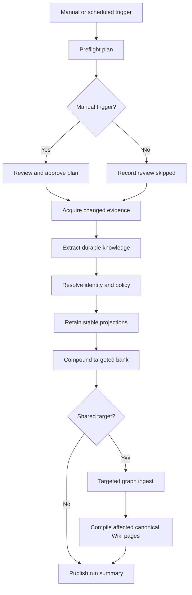
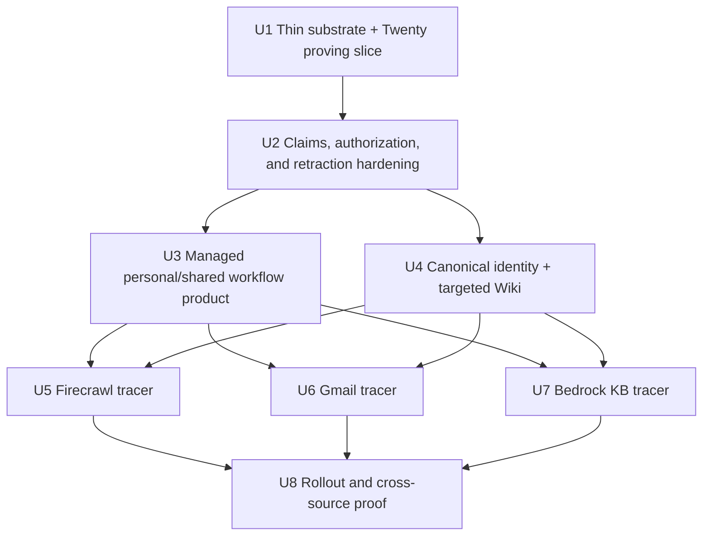

# External Memory Compounding

## Goal Capsule

- **Objective:** Turn explicitly authorized CRM, web, mailbox, and document evidence into inspectable, scope-correct Hindsight memory and one canonical, ontology-governed shared Wiki.
- **Primary actors:** user, operator, Personal Memory Automation, shared Memory Workflow, and external source system.
- **Execution shape:** give reality a vote immediately: land a thin durable source seam and run Twenty into a real shared Hindsight bank in U1, then harden claims/lifecycle and build the reusable automation, identity, and Wiki surfaces around observed evidence.
- **Product authority:** `docs/brainstorms/2026-07-11-external-memory-compounding-requirements.md`.
- **Related work:** build on `docs/plans/2026-07-11-001-feat-hindsight-company-brain-foundation-plan.md`; do not duplicate its bank, promotion, or mental-model work. The repository links THINK-193, THINK-250, and THINK-261 to the surrounding Wiki/company-brain history, but the available Linear workspace did not resolve those identifiers during planning, so this plan makes no new issue-state claims.
- **Stop conditions:** stop and surface rather than guess if the target bank is outside the saved scope, the source boundary would expand, a shared entity match is ambiguous, a required source version cannot be established, or retraction cannot be proven against pinned Hindsight 0.8.4.
- **V1 sequencing decision:** personal automation remains V1 because user ownership, manual preflight, and private-bank processing are explicit outcomes in R4-R10 and AE2-AE4. The build order nevertheless proves shared Twenty ingestion first so personal UX is not built on an untested evidence shape.

## Implementation Outcome

- ThinkWork has one platform-managed Personal Memory Processing blueprint, while each user owns a separately scoped Automation/Workflow identity and small configuration containing source opt-ins, boundaries, schedule, budget, and User Bank target.
- Operators create separate Space or company Memory Workflows under Settings → Workflows; those workflows read only explicitly shared sources and write only their configured bank.
- Manual personal runs preflight and pause for plan review. Scheduled runs use the same workflow version but skip review and remain inside the saved envelope.
- Source records become durable evidence envelopes with checkpoints, hashes/versions, lifecycle, extraction recipe, target scope, derivations, and redacted run summaries.
- The Knowledge Model contains Definitions, Identity, and Resolution Queue. Canonical entities use stable ThinkWork IDs; source IDs and strong natural keys map to them; ambiguous matches wait for an operator.
- Shared customer knowledge materializes to one Wiki Entity page keyed by canonical entity ID, independent of spelling, source, user, or ingest run.
- Full documents remain in Bedrock Knowledge Bases. Hindsight receives a stable, ontology-aligned projection whose claims can be superseded or retracted when the document changes.
- A workflow run is not successful until the selected evidence has settled, the targeted bank has compounded, and any eligible shared graph/Wiki projection has completed or reported item-level deferrals.

## Requirements Trace

The identifiers below preserve the origin without reinterpretation.

- **R1-R3 — source/evidence contract:** Twenty, Firecrawl, approved email, and Bedrock Knowledge Bases use one source contract; the source remains authoritative; provenance survives through Hindsight and Wiki.
- **R4-R8 — automation/control plane:** one managed personal blueprint, per-user configuration, explained preflight, manual HITL, bounded scheduled execution, separate shared workflows, and inspectable/replayable runs.
- **R9-R11 — authority:** personal writes stop at the User Bank; source access is opt-in; shared processors cannot browse User Banks.
- **R12-R16 — Knowledge Model/identity:** Definitions, Identity, and Resolution Queue are separate; canonical IDs and deterministic mappings precede shared memory and Wiki; customers compile as Entities.
- **R17-R19 — documents/compounding:** dual document representation, provenance-aware retraction, targeted bank compounding, and affected-only shared Wiki compilation.

**Origin flows:** F1 scheduled personal processing, F2 manual interactive processing, F3 operator shared compounding, F4 entity resolution, F5 document-derived memory.

**Origin acceptance:** AE1 cross-source Acme unification, AE2 editable manual plan, AE3 excluded mailbox folder, AE4 private ambiguous email, AE5 operator resolution and merge preview, AE6 replaced policy edition, AE7 no implicit User Bank harvesting.

## Scope Boundaries

- Do not add Slack or Teams Memory Sources.
- Do not implement User Bank → Space Bank → Tenant Bank harvesting or the future Memory Operator workflow.
- Do not let tenant policy silently override a user's source opt-in.
- Do not make an LLM authoritative for source access, scope promotion, source deletion, or ambiguous identity.
- Do not copy whole CRM tables, mailboxes, sites, or arbitrary document chunks into Hindsight.
- Do not replace Bedrock Knowledge Bases with Hindsight for full-document retrieval.
- Do not make ordinary users maintain canonical identities or see an operator stewardship queue.
- Do not revive the superseded July 4 custom research-run control plane.
- Do not make Firecrawl Monitor or any other provider-owned scheduler the source of orchestration truth; ThinkWork Workflow schedules and checkpoints own cadence.

### Deferred

- Personal-to-shared harvesting and the Memory Operator role.
- Fully automatic fuzzy matching.
- Canonical-entity Split UI and claim-rebinding workflow. V1 supports Link, Create, Defer, Reject, and a guarded Merge repair for duplicates; Split requires a separate product contract after real resolution traffic exists.
- Microsoft Graph mailbox ingestion. The provider-neutral adapter and existing delta cursor remain the intended seam, but Gmail is the V1 Email implementation.
- Warehouse, analytics, GitHub, Drive, Slack, and Teams source families.
- Corporate-account source mandates and regulated-data policy overrides.
- Deleting the legacy planner Wiki path. This plan makes graph mode reliable and canonical but keeps rollback available during rollout.

## Current-State Findings

### Reusable foundations

- `packages/database-pg/src/schema/workflows.ts`, `workflow-runs.ts`, and `workflow-task-tokens.ts` already provide versioned definitions, manual/schedule triggers, canonical runs, evidence, `waiting_for_human`, and callback tokens.
- `packages/lambda/workflow-step-dispatch.ts` already executes agent, wait, approval, routine, HTTP, event, and delivery steps. Approval is a real parked Step Functions state, not a UI fiction.
- `packages/api/src/handlers/oauth-callback.ts` already initializes `gmail_history_id`, `graph_mail_delta_link`, and their sync timestamps on per-user Google/Microsoft connections.
- `packages/api/src/lib/memory/adapters/hindsight-adapter.ts` already resolves `user_`, `space_`, and `tenant_` banks, supports stable `document_id` + `update_mode=replace`, and can target one bank for consolidation.
- `packages/api/src/handlers/brain-dream-state.ts` already has a resumable audit ledger and an explicit `bankId` input.
- `packages/api/src/handlers/twenty-client-engagement.ts` contains a working tenant-safe Twenty REST client and managed-application/token resolution path.
- `docs/plans/2026-06-04-002-feat-firecrawl-web-extraction-plan.md` defines the tenant credential and single-URL scrape capability. This plan consumes that capability as a source adapter; it does not create a second Firecrawl credential model.

### Gaps this plan must close

- `workflow_evidence` is an execution-view record, not a durable source-of-truth ledger. It cannot alone model a source checkpoint, source lifecycle, multiple derivations, or post-retention retraction.
- The interpreter has no long-running native memory stage. A synchronous HTTP/routine step would strand large imports behind Lambda timeouts.
- `knowledge_graph_entities` are unique only inside one ingest run; `wiki.pages` is unique by tenant/type/slug. Neither is a canonical cross-source identity.
- `packages/api/src/lib/knowledge-graph/observations-source.ts` enumerates only `user_*` banks, so a targeted shared bank cannot yet drive the graph safely.
- `packages/api/src/lib/wiki/graph-materializer.ts` upserts Entity pages by label-derived slug and can fold unrelated same-label entities or duplicate renamed entities.
- `maybeEnqueueGraphWikiCompile` exists and has unit tests, but the successful observations-ingest path does not invoke it. Graph-mode Wiki materialization can therefore remain stale without an error.
- The current Knowledge Base tables record KB-level status but no durable ThinkWork document manifest/version lineage.
- Hindsight replace semantics are proven locally; a supported delete-by-document contract is not. Retraction must be gated by a pinned 0.8.4 contract test and isolated fallback.

### Adjacent-plan ownership

- The shared Automation/Workflow UI plan is not in flight: it merged in PR #3604 and its responsive follow-up merged in #3606. This plan consumes `WorkflowCanvasWorkspace` and the canonical execution workspace; it does not rebuild them.
- `/Users/ericodom/Projects/thinkwork/docs/plans/2026-07-10-001-feat-self-healing-wiki-process-plan.md` exists only as an untracked `requirements-only` artifact in the main checkout. It is product input, not an implementation dependency, and this plan does not modify that user-owned file.
- **External Memory Compounding owns:** external source authorization/acquisition/checkpoints, evidence and claim lifecycle, Hindsight projections, canonical entity identity, targeted bank compounding, the missing observations-ingest → graph-Wiki handoff, and canonical-ID Entity page upsert.
- **Self-Healing Wiki owns if/when promoted to implementation-ready:** full-context page prose, maintenance/healing, notices/changelog, operator questions, quality circuit breaker, read/ROI instrumentation, and OKF distribution policy.
- KB documents cross the boundary once: this plan owns edition tracking and durable memory projection; self-healing Wiki may consume the original full-context document to write/heal prose. Neither plan creates a second KB ingestion path.

## External Constraints

- Gmail partial sync uses `history.list`; history IDs can expire and return 404, which requires a bounded full resync. [Google Gmail sync](https://developers.google.com/workspace/gmail/api/guides/sync)
- Microsoft Graph message delta is folder-scoped and requires preserving the full `@odata.nextLink`/`@odata.deltaLink`; moves and deletes may arrive as `@removed` records. [Microsoft Graph message delta](https://learn.microsoft.com/en-us/graph/api/message-delta?view=graph-rest-1.0)
- Twenty schemas are workspace-generated, its REST/GraphQL APIs are rate limited, and signed webhooks cover create/update/delete across standard and custom objects. [Twenty APIs](https://docs.twenty.com/developers/extend/api), [Twenty webhooks](https://docs.twenty.com/developers/extend/webhooks)
- Bedrock KB sync is incremental for added, modified, and deleted documents; direct ingestion can replace a document by identifier or delete it, but S3 direct changes and ingestion jobs must not race. [Bedrock managed sync](https://docs.aws.amazon.com/bedrock/latest/userguide/kb-managed-sync.html), [Bedrock direct ingestion](https://docs.aws.amazon.com/bedrock/latest/userguide/kb-direct-ingestion.html)
- Bedrock KB keeps full-document/multimodal retrieval value and supports metadata sidecars; that remains a different job from durable memory projection. [Bedrock data model](https://docs.aws.amazon.com/en_us/bedrock/latest/userguide/kb-how-data.html), [Bedrock metadata](https://docs.aws.amazon.com/bedrock/latest/userguide/kb-metadata.html)
- Hindsight's product API is retain/recall/reflect; the pinned repository integration, not an assumed future vendor API, is authoritative for lifecycle behavior. [Hindsight repository](https://github.com/vectorize-io/hindsight)

## Key Technical Decisions

| Decision | Choice | Rationale |
| --- | --- | --- |
| Durable truth | Keep `workflow_runs` as execution truth and add a separate Memory Source ledger for durable source/version/derivation state | Run evidence expires; retraction and replay outlive an execution. |
| Managed definition | Add a platform-owned `personal-memory-v1` workflow blueprint and thin per-user/per-scope processor configurations | Product upgrades publish one blueprint version without hand-editing hundreds of user definitions. |
| Long work | Add a native asynchronous `memory_stage` workflow step that parks on a task token and delegates bounded jobs | Avoid opaque agent prompts and synchronous Lambda timeout coupling while preserving node-level execution. |
| Manual review | Add a restricted trigger predicate to approval steps; `manual` waits, `schedule` records a skipped approval | One definition serves both modes and the skip is visible. |
| Source cadence | Pull from saved checkpoints during a workflow; treat Twenty webhooks only as dirty signals | Schedules, retries, and replay remain understandable in one system. |
| Raw evidence | Store secrets nowhere; keep durable metadata/hash/refs in Postgres and encrypted raw/normalized snapshots in S3 for 30 days by default (tenant configurable 7-90) | Enough for immediate replay/debug without indefinite mailbox/document duplication. Source refs and derivation lineage remain while claims exist. |
| Stable Hindsight identity | One replaceable Hindsight document per durable projection, with `document_id=external:<sourceConfigId>:<projectionKey>` | Updates are idempotent and re-extraction does not append duplicate facts. |
| Retraction | Add `deleteDocument` to the memory adapter only after a pinned 0.8.4 contract test; otherwise use one schema-guarded Hindsight repository seam, never scattered SQL | Makes vendor coupling explicit and testable. |
| Canonical registry | Add a separate identity domain for entity instances; keep ontology definitions as the rules/type system | “Customer” is a definition; “Acme” is an instance. The UI may colocate them without conflating persistence. |
| Private identity | Personal evidence may use an existing exact mapping but cannot create tenant mappings or shared resolution cases from private content | Prevents a personal email from becoming a tenant-visible identity side channel. |
| Shared identity | Shared evidence must resolve deterministically before retain; ambiguous items defer individually to the operator queue | Enforces R15 at the shared-bank boundary. |
| Wiki identity | Add `canonical_entity_id` to graph entities and Wiki Entity pages, with tenant-scoped uniqueness and redirects for merges | Slug becomes presentation/routing, not identity. |
| Firecrawl | Reuse `web_extract` for scheduled, allowlisted URL snapshots and hash-based change detection; do not depend on opaque monitor automation | Matches the requested inspectability and the existing single-page product contract. |
| Email V1 | Ship Gmail behind a provider-neutral mailbox adapter; keep Microsoft Graph as a named parity follow-up after the Gmail privacy/lifecycle tracer passes | Proves the Email family and personal/shared boundary once before doubling provider-specific delta behavior. |
| Documents | Keep the original in S3/Bedrock KB; parse text directly and use Bedrock Data Automation for PDF/multimodal projection input | Preserves page/multimodal fidelity while giving the extractor a stable, cited representation. |
| Compile completion | Memory workflow stages wait on the dream ledger, targeted graph ingest, and affected canonical Wiki compile | “Workflow succeeded” means downstream state settled, not merely enqueued. |

## Data Model

The tables below are the target model, not one foundation migration. U1 creates only processor/source config, checkpoint, evidence, run-item, and derivation rows proven by Twenty; U2 adds authorization and claim/support lifecycle; U4 adds canonical identity.

### Memory Source control and evidence

Create a new `memory_sources.ts` schema module with:

- `memory_processor_configs`: one user-owned or operator-owned processor bound to its Workflow, target scope/ID and bank, mode (`personal|shared`), enabled state, budget, and configuration version. Enforce one active personal processor per user and one active shared processor per Space/Tenant target.
- `memory_source_configs`: processor ID, source family, credential/application/KB binding, enabled state, saved boundary JSON, and policy version. Target scope is inherited from the processor and repeated only where needed for a database constraint/audit snapshot.
- `memory_source_authorizations`: explicit grant from a connection/source owner to one user, Space, or tenant processor, including allowed folders/objects/domains/KBs, granted-by actor, grant version, expiry/revocation, and sensitivity policy. A shared workflow cannot infer a grant from connection ownership or tenant membership.
- `memory_source_checkpoints`: one opaque cursor per source partition (for example Gmail label, Graph folder, Twenty object stream, URL, KB data source) with compare-and-swap versioning.
- `memory_evidence_items`: source item ID, source version/timestamp, content hash, acquisition run, target scope, lifecycle (`active|superseded|deleted|deferred|failed`), sensitivity, snapshot reference, extraction recipe/model/ontology version, and last error.
- `memory_run_items`: links durable items to `workflow_runs` and records stage/result/count/cost so reruns can distinguish seen, changed, retracted, and deferred items.
- `memory_claims`: an ontology-shaped, scope-bound durable claim with stable fingerprint, canonical subject when shared, predicate/value, `value_hash`, effective interval, conflict/status, and extraction version. Full normalized values remain data, never B-tree key material.
- `memory_claim_evidence`: many-to-many support from claims to evidence items. Retraction removes one support edge and deactivates a claim only when no active support remains; source precedence/conflict policy determines which supported value is current.
- `memory_derivations`: evidence-to-projection lineage, target bank, stable Hindsight document ID, current version, lifecycle, and retraction timestamp.
- `memory_evidence_entity_links`: zero-to-many canonical entity/hint links per item, with match method and visibility.

Use database uniqueness, not application hope:

- processor identity: one active row for `(tenant_id, mode, target_scope, target_id)`;
- source config identity: `(processor_config_id, source_family, source_binding_key)`;
- item identity: `(source_config_id, source_item_id, source_version)`;
- active projection: `(source_config_id, projection_key)` partial unique where active;
- claim dedupe: `(target_scope, target_id, canonical_subject_id, ontology_predicate, value_hash, effective_from)` with null-safe handling and collision verification against the stored normalized value;
- run idempotency: `(workflow_run_id, source_config_id, source_item_id, stage)`.

### Canonical identity

Create `entity-identity.ts` with:

- `canonical_entities`: stable UUID, tenant, ontology entity-type slug, display name, status, merged-into ID, and version.
- `entity_source_mappings`: canonical ID plus `(source_system, namespace, external_id)`, unique per tenant/source identity.
- `entity_identity_claims`: normalized natural-key value, rule/version, source evidence, confidence, precedence, visibility, and state.
- `entity_resolution_cases`: candidates, conflicting claims, explanation, impact summary, status, and operator decision.
- `entity_resolution_events`: append-only create/link/merge/reject/defer audit. Split events are not part of V1.

Extend ontology definitions with versioned identity rules—key fields, normalization, uniqueness scope, and source precedence—without putting actual entity rows in ontology tables.

### Projection changes

- Add nullable `canonical_entity_id` and resolution state to `knowledge_graph_entities`; index by tenant/canonical ID.
- Add nullable `canonical_entity_id` to `wiki.pages`; add a partial unique index for tenant-scoped Entity pages where canonical ID is present.
- Keep slug uniqueness during transition, but generate canonical entity redirects/aliases on rename or merge.
- Add source/claim identifiers to Wiki section provenance so one source can retract without deleting corroborated text.

All hand-rolled migrations must include correct drift markers and be applied/verified in dev before merge per `docs/solutions/workflow-issues/manually-applied-drizzle-migrations-drift-from-dev-2026-04-21.md`.

## Workflow Blueprint

- `memory_stage` is a platform-restricted workflow step with stage values `preflight`, `acquire`, `extract`, `resolve`, `retain`, `compound`, `graph`, and `wiki`.
- Each stage creates a bounded job, stores a `memory_step` task token, and resumes Step Functions only after the worker records terminal evidence. Retries use the workflow run + step + batch cursor idempotency key.
- Preflight is advisory only inside saved boundaries. It may rank customer/topic focus using prior run activity, CRM changes, mailbox counts, URL staleness, and KB manifests; it may not discover new credentials/folders/scopes.
- The approval step supports only a validated predicate such as `whenTriggerFamily: ["manual"]`; there is no arbitrary expression evaluator.
- Approval output is a versioned plan override containing allowed source-config IDs, focus keys, and time range. It can narrow or select among already authorized boundaries, never expand them.
- Scheduled runs use the saved configuration snapshot captured on the run. Mid-run configuration changes affect the next run.

The blueprint is a versioned code-owned definition in `memory-sources/blueprint.ts`, not a second workflow-definition database. Its key/version are copied into `workflow_versions.source_metadata`. At the next run or configuration read, a managed Workflow resolves the latest blueprint and lazily ensures its immutable local `workflow_version`; there is no atomic fan-out update across 400+ rows. A run then snapshots that resolved version normally, so in-flight runs stay pinned while subsequent runs adopt the new blueprint.

## UX Contract

- **Personal entry:** Automations shows one “Personal Memory Processing” card for the signed-in user. Definition opens source/schedule/budget configuration; Executions opens the shared Workflow run workspace. Run now opens the preflight execution and lands on the approval step rather than a separate wizard.
- **Personal configuration:** source cards show connection, enabled state, immutable provider boundary IDs with friendly labels, last checkpoint, next run, and readiness. Loading uses skeleton rows; no connection/source uses a setup empty state; disconnected/expired credentials show `blocked_not_ready`; partial provider failure preserves the last saved configuration and identifies the failed source.
- **Manual review:** the plan is grouped by focus area, then source, with why/time range/volume/cost and include controls. The user can narrow dates, remove focus areas, and select already-authorized sources. Approve and Cancel are keyboard reachable; validation explains any stale/revoked authorization before approval.
- **Shared entry:** Settings → Workflows owns Space/company processors. Memory source nodes use operator-only editors and always display target bank plus authorization grant; no user-owned connection can appear eligible without an explicit shared grant.
- **Knowledge Model:** Definitions, Identity, and Resolution Queue are sibling tabs. Queue defaults to unresolved/high-impact cases; rows show source-safe identity evidence and affected-item counts. Detail supports Link, Create, guarded Merge, Reject, and Defer with preview/confirmation; stale optimistic versions force refresh. Empty, loading, partial-impact, failed-preview, and already-resolved states are explicit.
- **Accessibility/responsiveness:** retain the shared canvas/list breakpoint behavior; on narrow screens inspectors become right-side overlays or full-width detail, not stacked below long canvases. All queue/actions support keyboard navigation, focus return, accessible names, status announcements, and non-color-only confidence/conflict indicators.
- **V1 surface:** web only for configuration and identity stewardship. Existing mobile memory/Wiki reading continues, but no new mobile configuration or Resolution Queue is implied.

## Implementation Units

### U1. Thin source substrate and Twenty proving slice

**Goal:** Process real Twenty customer data into a shared Hindsight bank through the smallest durable, inspectable path, and use the observed dossier/extraction shape to constrain the later claim schema.

**Requirements:** R1-R3, R7-R8, R11, R19; partial AE1 and AE7.

**Dependencies:** Hindsight 0.8.4, the merged company-brain foundation, and an installed/running Twenty managed application.

**Files:**

- Create: `packages/database-pg/src/schema/memory-sources.ts`
- Modify: `packages/database-pg/src/schema/index.ts`
- Create: `packages/database-pg/drizzle/<next>_memory_source_thin_ledger.sql`
- Create: `packages/api/src/lib/memory-sources/types.ts`
- Create: `packages/api/src/lib/memory-sources/repository.ts`
- Create: `packages/api/src/lib/memory-sources/evidence.ts`
- Extract/Create: `packages/api/src/lib/twenty/rest-client.ts`
- Modify: `packages/api/src/handlers/twenty-client-engagement.ts`
- Create: `packages/api/src/lib/memory-sources/adapters/twenty.ts`
- Create: `packages/api/src/handlers/memory-stage-worker.ts`
- Modify: `packages/agent-loops-core/src/workflow-definition.ts`
- Modify: `packages/agent-loops-core/src/interpreter.ts`
- Modify: `packages/lambda/workflow-step-dispatch.ts`
- Modify: `packages/database-pg/src/schema/workflow-task-tokens.ts`
- Create: `packages/database-pg/drizzle/<next>_workflow_memory_stage_tokens.sql`
- Modify: `packages/api/src/lib/memory/adapter.ts`
- Modify: `packages/api/src/lib/memory/types.ts`
- Modify: `packages/api/src/lib/memory/adapters/hindsight-adapter.ts`
- Create: `packages/api/src/lib/memory/adapters/hindsight-document-lifecycle.test.ts`
- Modify: `scripts/build-lambdas.sh`
- Modify Terraform under `terraform/modules/app/workflow-interpreter-stepfunctions/` and `terraform/modules/app/lambda-api/`

**Approach:**

- Create only the thin tables needed for the proof: processor/source config, checkpoint, evidence item, run item, and projection derivation. Do not create `memory_claims`, identity cases, or generalized merge/split tables yet.
- Add the minimum reusable asynchronous `memory_stage` dispatch and task-token purpose needed to run `acquire → project → retain → compound` inside a canonical Workflow execution. Later units extend the stage set; U1 is not a throwaway CLI/control plane.
- Reuse managed Twenty endpoint/token resolution and extract its REST client. Pull Companies plus the smallest approved related record set needed for a useful customer dossier; discover workspace metadata rather than hard-code custom fields.
- Advance a checkpoint only in the same transaction that records the acquired evidence page. Replay dedupes by source item/version.
- Build one stable dossier per Twenty company with `document_id=external:<sourceConfigId>:company:<twentyId>` and `update_mode=replace`, retain it to an operator-selected Space/Tenant bank, then wait for that bank's `brain_dream_runs` result.
- Persist the normalized dossier JSON/markdown and extraction observations as a sanitized planning fixture. U2 must demonstrate how its proposed claim fingerprint/effective-date model fits this real output before its migration is accepted.
- Probe Hindsight replace/delete/orphan behavior in a disposable bank, but keep destructive retraction disabled until U2 builds the saga.
- Stop the slice at compounded shared memory. Canonical identity and Wiki publication intentionally arrive in U4; the U1 proof is source → evidence → stable Hindsight projection → targeted consolidation → inspectable execution.

**Test scenarios:**

- Bootstrap: a bounded Twenty pull creates evidence and one stable company dossier in the configured shared bank.
- Replay: the same page/version creates no duplicate evidence or Hindsight document.
- Change: a company update replaces the dossier and produces new derived observations after consolidation.
- Nil/empty: missing managed app blocks readiness; zero changed records succeeds as a visible no-op.
- Error: rate limit/provider failure leaves the checkpoint unchanged and the Workflow resumable.
- Scope: the thin processor rejects `user_*` targets and any tenant/Space mismatch.
- Contract: the disposable Hindsight fixture records replace/delete/orphan behavior without enabling production retraction.

**Verification:** deployed dev Workflow evidence shows a real Twenty company dossier retained, replaced idempotently, compounded in exactly one shared bank, and recallable. Attach the sanitized dossier/extraction shape to U2's schema review.

### U2. Claim, authorization, and retraction hardening

**Goal:** Generalize the U1-proven evidence into the minimum durable claim/support and authorization model required for corroboration-safe refresh and erasure.

**Requirements:** R2-R3, R8-R11, R18; AE3, AE4, AE6, AE7.

**Dependencies:** U1's live Twenty dossier/extraction fixture and Hindsight lifecycle verdict.

**Files:**

- Expand: `packages/database-pg/src/schema/memory-sources.ts`
- Create: `packages/database-pg/drizzle/<next>_memory_claim_lifecycle.sql`
- Create: `packages/api/src/lib/memory-sources/policy.ts`
- Create: `packages/api/src/lib/memory-sources/claims.ts`
- Create: `packages/api/src/lib/memory-sources/retraction.ts`
- Modify: `packages/api/src/lib/memory-sources/evidence.ts`
- Modify: `packages/api/src/lib/memory/adapters/hindsight-adapter.ts`
- Modify: `packages/database-pg/graphql/types/memory.graphql`
- Create: `packages/api/src/graphql/resolvers/memory-sources/`

**Approach:**

- Add explicit source authorization grants as the maximum readable envelope; processor source config is always a subset. Revocation blocks acquisition immediately.
- Add ontology-shaped claims and many-to-many support edges using a fixed-length `value_hash`/claim fingerprint in unique indexes; store and collision-check the full normalized value outside B-tree keys.
- Demonstrate the Twenty dossier's real fields against the proposed subject/predicate/value/effective interval representation. If a field does not fit without provider-specific exceptions, revise the claim contract before applying the migration.
- Generate stable Hindsight projection documents from active claims and embed claim IDs in content/metadata for downstream provenance.
- Implement retraction as an idempotent cross-database saga: `retraction_pending` → ThinkWork support update → Hindsight delete/verification → targeted reconsolidation → `retracted`/dirty projections. Never claim a transaction spans ThinkWork and Hindsight.
- Source erase disables the config, retracts all its derivations, purges checkpoint/snapshots, and retains only policy-required audit tombstones. Tenant teardown cascades ledger/S3/bank cleanup.
- Keep raw evidence snapshots encrypted in S3 for 30 days by default (tenant configurable 7-90); keep the structured claim/support envelope while it backs active memory.

**Test scenarios:**

- The U1 Twenty fixture round-trips through claims without provider-specific schema branches.
- Two sources supporting one claim survive either single-source retraction; the last support removal deactivates it.
- Long claim values dedupe by hash without exceeding Postgres index limits; a forced collision verifies the stored value before reuse.
- Authorization revocation blocks the next page read; source erase purges only that source's evidence/derivations.
- Hindsight delete failure leaves `retraction_pending` and retries without hiding the old active state.
- No secret or unredacted email/document body enters Postgres workflow evidence.

**Verification:** migration drift passes; Twenty reprocesses through the hardened model; a disposable bank proves replace and retraction; corroborated claims and unrelated Wiki-ready support remain intact.

### U3. Managed personal and shared Memory Workflow product

**Goal:** Turn the U1/U2 processor into the user-owned Personal Memory Automation and operator-owned shared Workflow, with one inspectable definition and manual/scheduled behavior.

**Requirements:** R4-R10; AE2-AE4, AE7.

**Dependencies:** U2 and merged Workflow/Automation UI PRs #3604/#3606.

**Files:**

- Expand: `packages/agent-loops-core/src/workflow-definition.ts`
- Expand: `packages/lambda/workflow-step-dispatch.ts`
- Create: `packages/api/src/handlers/memory-stage-sweeper.ts`
- Create: `packages/api/src/lib/memory-sources/stages/`
- Create: `packages/api/src/lib/memory-sources/blueprint.ts`
- Create: `packages/api/src/lib/memory-sources/preflight.ts`
- Modify: `packages/api/src/lib/workflows/start-interpreter-run.ts`
- Modify: `packages/api/src/graphql/resolvers/workflows/triggerWorkflowRun.mutation.ts`
- Modify: `packages/database-pg/graphql/types/workflows.graphql`
- Modify: `apps/web/src/components/workflows/WorkflowDefinitionCanvas.tsx`
- Modify: `apps/web/src/components/workflows/WorkflowRunDetail.tsx`
- Modify: `apps/web/src/components/workflows/WorkflowEvidencePanel.tsx`
- Create: `apps/web/src/components/memory/PersonalMemoryAutomation.tsx`
- Modify: `apps/web/src/routes/_authed/_shell/automations.index.tsx`

**Approach:**

- Provision one user-owned `agent_private` Workflow/Automation per personal processor and one operator-owned `tenant_shared` Workflow per Space/Tenant processor.
- Keep a versioned code-owned blueprint. Resolve/ensure the latest immutable local Workflow version lazily at the next run/configuration read rather than atomically updating 400+ rows. In-flight runs remain pinned to their captured version.
- Extend the native stages to `preflight`, `acquire`, `extract`, `resolve`, `retain`, `compound`, `graph`, and `wiki`; bound batches, record stage evidence, and recover stalled task tokens through the sweeper/DLQ.
- Add the restricted manual-only approval predicate. Scheduled runs record a visible skipped approval; manual users can narrow focus/time/source choices only inside saved authorization/config boundaries.
- Implement the UX Contract above using the merged shared canvas/execution components. Personal UI is owner-only; shared configuration remains operator-only.

**Test scenarios:**

- Manual personal run pauses after preflight, accepts narrowed edits, and resumes the same version.
- Scheduled personal run skips approval and excludes anything outside saved source boundaries.
- Shared run rejects `user_*` banks and a source lacking a current shared grant.
- Blueprint v2 appears on the next run without mass updates; a v1 in-flight run completes on v1.
- Duplicate callback/stalled worker produces one terminal stage event and a resumable run.
- User A cannot view/trigger user B's personal Automation; non-operator cannot edit shared Workflow sources.

**Verification:** local signed-in UI plus deployed dev demonstrate manual personal, scheduled personal, and operator shared runs using canonical Workflow executions and inspectable stage evidence.

### U4. Canonical identity, targeted graph ingest, and Wiki materialization

**Goal:** Resolve shared evidence to stable entities and publish one canonical Entity page, while keeping V1 resolution smaller than a general MDM product.

**Requirements:** R12-R16, R19; AE1, AE4, AE5, AE7.

**Dependencies:** U2; U3 is required for user-facing run orchestration but backend identity work may proceed in parallel.

**Files:**

- Create: `packages/database-pg/src/schema/entity-identity.ts`
- Modify: `packages/database-pg/src/schema/ontology.ts`
- Modify: `packages/database-pg/src/schema/knowledge-graph.ts`
- Modify: `packages/database-pg/src/schema/wiki.ts`
- Create: `packages/database-pg/drizzle/<next>_canonical_entity_identity.sql`
- Create: `packages/api/src/lib/entity-identity/normalizers.ts`
- Create: `packages/api/src/lib/entity-identity/matcher.ts`
- Create: `packages/api/src/lib/entity-identity/resolution.ts`
- Create: `packages/api/src/lib/entity-identity/merge.ts`
- Create: `packages/database-pg/graphql/types/entity-identity.graphql`
- Create: `packages/api/src/graphql/resolvers/entity-identity/`
- Modify: `packages/database-pg/graphql/types/ontology.graphql`
- Create: `apps/web/src/components/settings/knowledge-model/`
- Modify: `apps/web/src/components/settings/SettingsMemoryHome.tsx`
- Modify: `packages/api/src/handlers/knowledge-graph-observations-ingest.ts`
- Modify: `packages/api/src/lib/knowledge-graph/observations-source.ts`
- Modify: `packages/api/src/lib/knowledge-graph/normalizer.ts`
- Modify: `packages/api/src/lib/knowledge-graph/repository.ts`
- Modify: `packages/api/src/lib/wiki/enqueue.ts`
- Modify: `packages/api/src/lib/wiki/graph-materializer.ts`
- Modify: `packages/api/src/handlers/wiki-compile.ts`
- Modify: `packages/api/src/__tests__/wiki-enqueue.test.ts`
- Modify: `packages/api/src/handlers/knowledge-graph-observations-ingest.test.ts`
- Modify: `terraform/modules/app/lambda-api/handlers.tf`

**Approach:**

- Rename the operator area to Knowledge Model with Definitions, Identity, and Resolution Queue, but limit V1 actions to Link, Create, Defer, Reject, and guarded Merge repair. Split is deferred.
- Exact source mapping wins. Strong natural keys auto-link only when the approved rule says they are unique and non-conflicting; fuzzy/multi-match results become suggestions.
- Coalesce ambiguity by normalized identity signature and enforce queue volume/age budgets. Private evidence may reuse an existing exact mapping internally but cannot create tenant mappings or expose private content in a case.
- Merge preserves the losing canonical ID as a redirect and requires an impact preview; it repairs duplicate canonical entities/pages rather than offering a broad MDM workbench.
- Backfill only exact/strong non-conflicting identities. No fuzzy migration and no automatic merge of the 137 blank-summary pages.
- Generalize observations loading from “enumerate every user bank” to an authorized explicit bank list supporting `space_` and `tenant_`; scheduled estate sweeps remain a separate backstop.
- Run canonical identity matching between graph normalization and snapshot merge. Do not merge an unresolved shared entity into the graph/Wiki; record an item-level deferral and case ID.
- Persist `canonical_entity_id` on graph entities and propagate it through relationships/evidence.
- Carry stable claim IDs/support edges in graph packets and Wiki section sources. Hindsight observations may enrich/summarize those claims, but the durable claim ledger—not generated prose—is authoritative for source support, effective dates, conflict, and retraction.
- Invoke `maybeEnqueueGraphWikiCompile` from the successful ingest commit/outbox path, fixing the current dead handoff. Do not depend on an unawaited best-effort call.
- Make graph materialization upsert by canonical entity ID, then maintain current slug/title/aliases as presentation. Compile only dirty canonical IDs from the run and reconcile source claims/sections transactionally.
- Update page body and `wiki_page_sections` in one transaction on every write path, preserving the mobile rendering invariant. This plan owns canonical-ID materialization and the dead handoff; the adjacent self-healing plan owns prose healing, notices, questions, gates, and distribution.
- Personal runs stop after compounding and cannot invoke graph/wiki stages.

**Test scenarios:**

- Happy: one tenant bank compounds, graph ingest resolves Acme, and one canonical Wiki page updates before the run succeeds.
- Regression: a successful graph ingest always produces an enqueued/deduped compile result; the dead-trigger condition fails a test.
- Scope: personal evidence cannot publish a shared mapping/page; a shared run cannot submit `user_`.
- Rename: canonical Acme changes display name and slug/alias without a second page.
- Corroboration: retracting one of three sources updates provenance but keeps supported text.
- Threshold: below-threshold entity remains absent/archived without deleting its canonical registry row.
- Failure: compile fails after graph succeeds; the workflow remains failed/resumable, not falsely successful.
- Merge: duplicate canonical IDs/pages converge on one survivor/redirect; no Split UI exists.
- Continuation: affected-page batches use the authoritative dedupe key/bucket and expose collisions.

**Verification:** dev graph mode produces a new/updated page from a targeted shared bank, and no blank-summary duplicate page is created.

### U5. Firecrawl web-enrichment tracer bullet

**Goal:** Add a second, unstructured source to the U1/U2-shaped contract and enrich the same canonical customer without provider-owned scheduling magic.

**Requirements:** R1-R3, R5-R8, R10-R11, R14-R16, R19; AE1, AE3.

**Dependencies:** U3-U4 and the existing `web-extract` Firecrawl capability.

**Files:**

- Create: `packages/api/src/lib/memory-sources/adapters/firecrawl.ts`
- Reuse/Modify: `packages/api/src/lib/builtin-tools/web-extract.ts` (or landed equivalent)
- Create: `packages/api/src/lib/memory-sources/web-change.ts`
- Modify personal/shared Memory Source configuration UI

**Approach:**

- Store exact URLs and/or bounded domain rules. Preflight selects only inside that envelope.
- Scrape one URL, normalize redirects/title/markdown, strip active content, treat all text as untrusted data, and hash the normalized result.
- Unchanged/cosmetic changes are visible no-ops; meaningful changes enter claim extraction and canonical identity resolution.
- Ambiguous shared pages defer; personal pages remain recallable without publishing tenant mappings.

**Test scenarios:** allowed/excluded URL, redirect, unchanged/cosmetic/material changes, extraction failure, oversized page, prompt injection, ambiguous domain, and source removal.

**Verification:** a changed Acme page enriches the canonical Acme Entity; unchanged rerun adds no projection.

### U6. Gmail Email tracer bullet

**Goal:** Prove user-approved mailbox ingestion and private/shared boundaries once through Gmail behind a provider-neutral adapter.

**Requirements:** R1-R3, R4-R11, R14-R15, R19; AE2-AE4, AE7.

**Dependencies:** U3-U4 and an active Google connection.

**Files:**

- Create: `packages/api/src/lib/memory-sources/adapters/email.ts`
- Create: `packages/api/src/lib/memory-sources/adapters/gmail.ts`
- Modify: `packages/api/src/lib/oauth-token.ts`
- Modify: `packages/api/src/handlers/oauth-callback.ts`
- Modify connected-app/source-boundary selector UI

**Approach:**

- Bind immutable connection and Gmail label IDs. The authorization grant is the maximum envelope; processor config is a subset.
- Use `history.list`; on expired history, run a bounded label/time/budget-constrained full resync and store the new history ID.
- Normalize threads, quoted history, and attachment metadata; attachments remain excluded unless already approved KB documents.
- Treat all mail content as untrusted evidence. Stable thread projections rebuild as messages enter/leave scope.
- Shared Gmail use requires an explicit Space/Tenant grant for the mailbox/labels. Connection ownership alone never authorizes company memory.
- Keep the provider-neutral interface compatible with Graph delta, but do not implement Microsoft in V1.

**Test scenarios:** approved/unapproved label, history 404 fallback, pagination, moved/deleted mail, duplicate quotes, refresh/disconnect, prompt injection, private ambiguity, and attempted shared use without a grant.

**Verification:** manual personal run retains an approved customer thread; scheduled run ignores an unapproved label; an explicitly shared Gmail fixture can contribute without exposing personal mail.

### U7. Bedrock Knowledge Base document-projection tracer bullet

**Goal:** Track document editions and project durable policy/SOP meaning into Hindsight while preserving original-document fidelity in Bedrock KB.

**Requirements:** R1-R3, R7-R8, R11, R17-R19; AE6.

**Dependencies:** U3-U4 and current Knowledge Base manager.

**Files:**

- Modify: `packages/database-pg/src/schema/knowledge-bases.ts`
- Create: `packages/database-pg/drizzle/<next>_knowledge_base_document_manifest.sql`
- Modify: `packages/api/knowledge-base-manager.ts`
- Create: `packages/api/src/lib/memory-sources/adapters/bedrock-kb.ts`
- Create: `packages/api/src/lib/memory-sources/document-parser.ts`
- Create: `packages/api/src/lib/memory-sources/document-projector.ts`
- Modify: `packages/api/src/lib/context-engine/providers/bedrock-knowledge-base.ts`
- Modify Terraform IAM for Bedrock Data Automation, S3 reads, and ingestion status

**Approach:**

- Add a ThinkWork document manifest keyed by KB/data-source/document identifier with S3 version/ETag, edition/effective dates, ingest status, and projection status.
- Reconcile manifests only after successful Bedrock ingestion; do not race direct ingestion and sync.
- Probe parser page/region fidelity first. Parse text directly and use Bedrock Data Automation for PDF/multimodal only if the deployed probe preserves citations and deterministic source versions.
- Extract ontology-aligned claims rather than chunks. Stable document projection replaces by manifest ID; new editions supersede old support.
- Do not settle deletion until Bedrock reports absent/not-indexed and filtered retrieval returns no result; handle S3 `RETAIN` with explicit sync/direct delete.
- Preserve the ownership boundary: this plan owns edition/projection lifecycle; self-healing Wiki may consume the original document for prose.

**Test scenarios:** text/PDF, unchanged sync, replacement edition, delete/RETAIN, failed/partial parsing, two-document corroboration, and effective-date changes.

**Verification:** replacing a policy PDF preserves new exact retrieval, retracts only superseded support, and updates affected memory/Wiki citations.

### U8. Rollout, estate migration, and cross-source acceptance proof

**Goal:** Enable the proven paths progressively and demonstrate the complete PromptQL-like hydration experience without letting legacy Wiki residue masquerade as success.

**Requirements:** all; AE1-AE7.

**Dependencies:** U1-U7.

**Files:**

- Create: `packages/api/scripts/external-memory-readiness.ts`
- Create: `packages/api/scripts/backfill-canonical-entities.ts`
- Create: `packages/api/src/lib/evals/external-memory-golden-set.ts`
- Modify compounding-memory concept and operations docs
- Modify Terraform feature flags, alarms, dashboards, and DLQs

**Approach:**

- Gate independently: source ledger shadow mode → personal manual → personal schedule → one Space workflow → tenant workflow → canonical Wiki writes.
- Shadow mode acquires/normalizes and reports would-write/would-defer counts but does not retain or mutate identity.
- Backfill existing graph/Wiki identity using exact/strong-only rules; report unresolved and duplicate candidates. Do not automatically merge the 137 observed blank-summary pages.
- Add alarms/metrics for checkpoint age, source failures, evidence lag, deferred identity count/age, retain failures, dream failures, graph-to-Wiki lag, duplicate canonical-page attempts, retraction failures, and S3 evidence expiration.
- Measure preflight usefulness separately: proposed versus approved focus areas, removal/addition rate, estimated-versus-processed volume/cost, no-op yield, and scheduled deferrals. These are product-quality signals, not permission to learn broader access automatically.
- Create a cross-source Acme golden set with variant names across Twenty, Firecrawl, explicitly shared Gmail, and a policy document; assert one canonical entity/page and complete provenance.
- Validate scale with at least 400 personal configs, bounded scheduled concurrency, per-source quotas, and no tenant-wide scans in individual runs.
- Keep kill switches per source and for shared retain/graph/wiki. Rollback disables new writes but preserves ledgers for diagnosis and retraction.

**Test scenarios:** all origin AEs plus source outage, replay after crash, operator merge race, personal/shared authorization denial, 400-user schedule spread, and full retraction of one source while others remain.

**Verification:** deployed dev evidence includes one manual personal run, one scheduled personal run, one operator shared run, all four V1 source families, one canonical Acme page, a resolved queue case, and a policy-edition retraction.

## Acceptance Matrix

| Origin example | Primary proof |
| --- | --- |
| AE1 | U4 identity integration plus U1/U5/U6/U7 fixtures and U8 golden set produce one canonical Entity/page with cross-source citations. |
| AE2 | U3 browser/integration test shows editable preflight, approval pause, approved-plan version, and downstream evidence. |
| AE3 | U6 provider tests and deployed schedule prove an unapproved Gmail label is excluded and reported. |
| AE4 | U3/U6 privacy tests prove private ambiguous email remains in User Bank, creates no shared mapping/page, and exposes no content to the operator queue. |
| AE5 | U4 Link/Merge repair browser test shows affected evidence, memory, graph, and Wiki preview and resumes deferred items after decision. |
| AE6 | U2/U4/U7 lifecycle integration proves current KB passage, superseded Hindsight claim removal, corroboration survival, and refreshed Wiki citation. |
| AE7 | U2/U3/U4 authorization integration proves shared workflows reject `user_*` inputs and enumerate every write from explicit shared sources. |

## Verification Strategy

- **Unit:** normalization, policy, hash/signature, matching rules, trigger predicates, lifecycle transitions, source adapters, and UI state models.
- **Database integration:** checkpoint CAS, partial unique indexes, guarded merge transactions, derivation retraction, canonical Wiki upsert, and tenant/user authorization.
- **Provider contract:** recorded sanitized fixtures for Twenty, Gmail, Firecrawl, Bedrock ingestion, and Hindsight 0.8.4; live smoke only in deployed dev.
- **Workflow integration:** Step Functions task-token park/resume, duplicate callbacks, stage replay, manual approval, scheduled skip, and failure propagation.
- **Security/adversarial:** cross-user reads, personal-to-shared escalation, secret/redaction scans, source-boundary expansion, malicious web/email instructions, forged webhook, and private identity leakage.
- **Quality:** external-memory golden set scores entity precision, duplicate-page rate, claim faithfulness, provenance completeness, and retraction correctness—not merely item throughput.
- **UI:** signed-in browser verification for personal Automation and operator Workflow/Knowledge Model surfaces, including keyboard/accessibility behavior and redacted evidence rendering.
- **Deployment:** build affected Lambdas, run package tests/typecheck/format, apply/verify migrations in dev, then prove the AWS-native end-to-end path. No local-only substitute is accepted.

## Rollout and Recovery

1. Land U1's thin schema and enable only the bounded Twenty proving slice on dev.
2. Use its real output to approve U2's claim migration, then run the Hindsight deletion/retraction contract; do not enable retraction on failure.
3. Enable U3 personal manual, then personal schedule; keep graph/Wiki stages disabled until U4 passes.
4. Backfill canonical identity in dry-run mode, then enable one Space/Tenant processor and the canonical graph/Wiki path behind kill switches.
5. Enable Firecrawl, Gmail, and KB shadow acquisition independently before their write paths.
6. Enable canonical Wiki writes only after the dead handoff and duplicate-page alarms pass.
7. Expand source configurations independently; a failure in one adapter must not require disabling the others.

Recovery is forward-only: pause a source/workflow, inspect the durable ledger, correct the adapter/rule, replay the affected run items, and recompile dirty canonical IDs. Do not delete ledgers or reset Hindsight wholesale to recover one source.

## Risks and Mitigations

| Risk | Mitigation |
| --- | --- |
| Sensitive personal mail leaks into shared memory | Scope check at config, run, adapter, retain, and graph boundaries; personal credentials rejected by shared workflows; no User Bank enumeration. |
| A connection owner is mistaken for shared authorization | Persist versioned source grants separately from credential ownership; shared runs require a current grant and revocation stops acquisition immediately. |
| “Magic” preflight changes scope | Preflight ranks only saved source-config IDs/boundaries; approval overrides can narrow, never expand. |
| Duplicate customer pages | Canonical-ID uniqueness, exact mapping precedence, operator queue, merge redirects, and dirty-ID materialization. |
| Provider cursor expiry/gaps | Source-specific bounded full reconciliation with explicit execution evidence and checkpoint CAS. |
| Hindsight delete semantics drift | Pinned contract test and one schema-guarded fallback seam; retraction flag stays off until proven. |
| Long imports time out | Task-token asynchronous stage jobs, bounded pages, resumable cursors, and schedule concurrency controls. |
| Document update leaves stale claims | Manifest editions, stable projection IDs, derivation graph, source-aware retraction, and affected-only compile. |
| Retraction partially succeeds across databases | Idempotent pending→verified→retracted saga, durable retry state, per-step evidence, and no claim/page deactivation until support state is committed. |
| Wiki reports success before materialization | Workflow waits on dream/graph/wiki terminal ledgers; dead graph enqueue gets an integration regression test. |
| Evidence store becomes a shadow mailbox/CRM | 30-day encrypted snapshot lifecycle, durable metadata only, source remains authoritative, no whole-corpus ingestion. |
| Source adapter compromises workflow worker | Native adapter allowlist, outbound host allowlists, tenant credential resolution, bounded payloads, and no arbitrary HTTP from config. |
| External content prompt-injects the processor | Treat source text as untrusted data, use schema-constrained extraction, separate policy from content, and prohibit tool/scope decisions from extraction output. |

## Documentation Deliverables

- Update the compounding-memory concept with source → evidence → projection → bank → identity → Wiki lifecycle.
- Add an operator guide for shared source authorization, Resolution Queue, Link/Merge repair, replay, pause, and retraction.
- Add a user guide for personal source opt-in, manual plan review, schedule boundaries, and what never enters shared memory.
- Document source-specific checkpoints and recovery: Twenty reconciliation, Gmail history 404, Firecrawl hash no-op, and KB edition/delete behavior.
- Record the Hindsight 0.8.4 deletion/retraction verdict under `docs/solutions/tooling-decisions/` before enabling source deletion.

## Open Questions

### Resolved during planning

- Workflow run evidence versus durable evidence: use both with separate responsibilities.
- Scheduled versus manual definition: one workflow version with a restricted manual-only approval predicate.
- Firecrawl cadence: ThinkWork schedules and snapshots, not provider monitor magic.
- Email V1: ship Gmail behind a provider-neutral adapter; defer Microsoft Graph parity until Gmail proves the privacy/lifecycle contract.
- Ontology versus identity: one Knowledge Model UI, separate definition and instance persistence.
- Wiki uniqueness: canonical entity ID is authoritative; slug is presentation.
- Raw evidence retention: encrypted S3 snapshots default to 30 days, tenant configurable 7-90; durable hashes/refs/lineage remain while claims exist.

### Implementation-time gates, not product questions

- Confirm the exact Hindsight 0.8.4 delete-by-document behavior and derived-observation cleanup before U2 enables retraction.
- Confirm the landed `web-extract` module/file names before U5; consume its contract rather than duplicating it.
- Select the smallest Bedrock Data Automation project/profile configuration that preserves PDF page/region references in U7.
- Validate whether current Twenty OAuth scopes can read metadata/custom objects for both personal and shared bindings; otherwise surface `blocked_not_ready` with the missing scope.

## Handoff

This plan is ready to execute as eight evidence-gated units. U1 is the thin Twenty proving slice; U2-U4 harden the reusable lifecycle, workflow, identity, and Wiki product around its observed shape; U5-U7 add Firecrawl, Gmail, and KB independently; U8 is the cross-source rollout gate.
