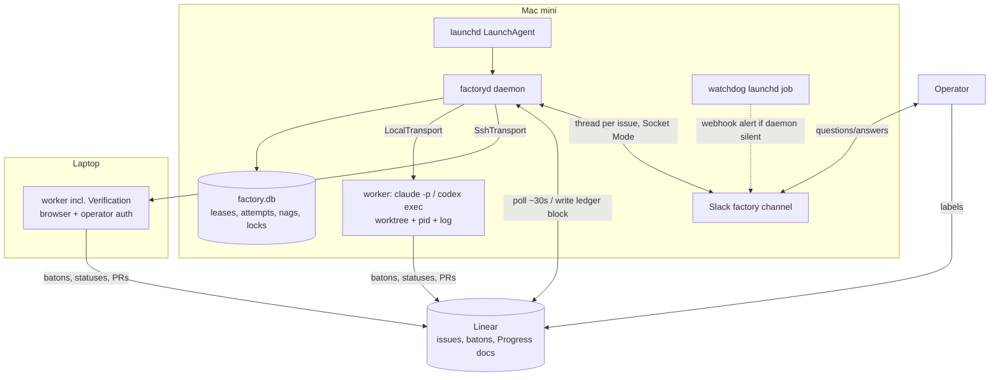
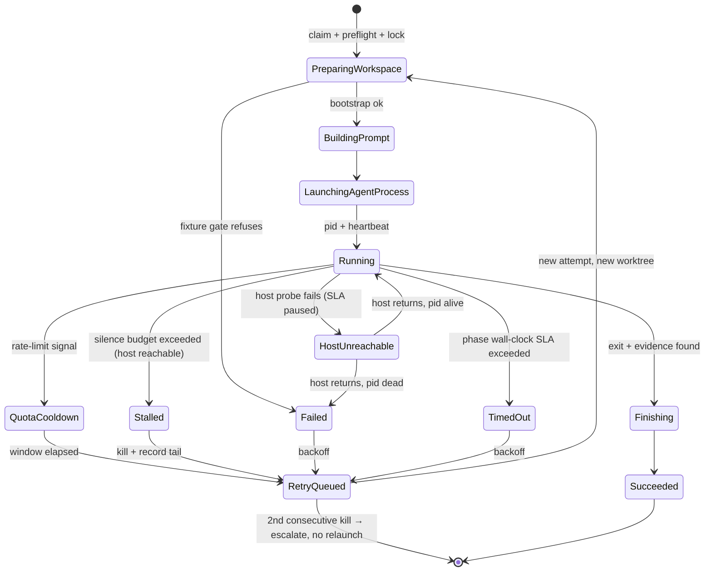

# Factory Daemon - Plan

## Goal Capsule

- **Objective:** Replace the never-run two-lane dispatcher with a single factory daemon on the Mac mini that takes a labeled Linear issue through the compound-engineering phases via disposable Claude/Codex workers on the mini and the laptop, unattended, with Slack-thread communication and escalation.
- **Product authority:** The Product Contract below (from the 2026-07-12 ideation cycle and confirming dialogue; ideation record: `docs/ideation/2026-07-12-linear-agent-orchestration-ideation.html`). The routing contract at `.agents/skills/thinkwork-linear-dispatcher/references/routing-contract.md` is carried-forward policy; where this plan narrows it (child issues), the narrowing is explicit.
- **Stop conditions:** Surface a blocker instead of guessing when work would change the Product Contract, when a phase requires credentials that don't exist, or when the duplicate-worker invariant would be violated. Deferred implementation notes in units are the executor's to resolve; product scope is not.
- **Open blockers:** None. The broken `codex` CLI is prerequisite work inside the plan (U1), not a blocker to starting it.

---

## Product Contract

### Summary

Build a small TypeScript daemon — the factory's single dispatch authority — based on Symphony's SPEC.md orchestration contract. It polls Linear for lane-labeled issues, runs each compound-engineering phase as a disposable headless worker (`claude -p` or `codex exec`) in an isolated worktree on the Mac mini or the laptop, keeps all business state in Linear, converses with the operator in a per-issue Slack thread, and enforces a no-orphan invariant: every enrolled issue is always in exactly one owned, deadlined state. Milestone 1 is a walking skeleton that takes one Paper Cut issue end-to-end before anything else is built.

### Problem Frame

A complete two-lane dispatcher already exists in this repo — routing contract, launch prompts, runbook, status scripts — and was never switched on: `~/.thinkwork-factory/` was never created, no heartbeat ever ran, and the Codex lane's cloud scheduling was never verifiably configured. The operator named three adoption blockers: the Codex side didn't work, only one machine could work issues, and it was hard to see where to start things, check status, or respond to questions. The existing design also carries structural costs a revival would inherit: an LLM session as the dispatcher (token cost per heartbeat, prose re-interpretation of state, a 7-day loop expiry tied to an open terminal), free-text comments as the state machine, and a second, invisible dispatcher in the Codex cloud. Independent ideation runs converged on the same end state — one deterministic authority, Linear canonical, providers as interchangeable local workers — differing only on sequencing.

### Key Decisions

- **Build the daemon now instead of hardening the LLM dispatcher loop.** The scripts-first path was considered and declined; its liveness, ledger, and status work would be partially discarded when the daemon arrived. Risk of repeating the built-but-never-ran failure is mitigated by the walking-skeleton milestone: one issue end-to-end is the first deliverable, before breadth.
- **Symphony's SPEC.md is the orchestration contract; the implementation is ours.** Adopt its issue and run-attempt state machines, poll-and-reconcile loop, retry/backoff, stall timeouts, workspace-safety invariants, and Appendix A SSH-worker shape. Replace its Codex-only agent lifecycle with a provider-runner interface and its prompt layer with the existing CE launch prompts. Cyrus and Archon were rejected as substrates (each would host the CE policy behind foreign extension seams) and are retained as reference source only.
- **One dispatch authority; lanes become launch commands.** The `Codex` label selects `codex exec` instead of `claude -p` under the same worktree/log/host harness. The invisible cloud Codex scheduled dispatcher is retired, not fixed.
- **Linear stays the only durable business ledger.** Issue state moves to a structured, machine-parseable ledger block; the daemon's operational store (claims, leases, attempts) is local, single-writer, and reconstructable from Linear after loss.
- **Slack is the conversation surface; Linear is the record.** Each enrolled issue gets one Slack thread where the daemon and workers post phase transitions, questions, and evidence links; the operator answers there. Question resolutions are mirrored to the Linear issue so the durable ledger stays complete without reading Slack.
- **No-orphan invariant.** Every enrolled issue is in exactly one owned state with a deadline at every sweep — worker states via leases and heartbeats, human-wait states via scheduled nag escalation. Nothing waits indefinitely without a timer.
- **Polling intake, not webhooks.** No tunnel to keep alive; ~30s pickup latency accepted (well within Linear's 5,000 req/hr API-key budget). Linear AgentSessions delegation remains a compatible later upgrade.
- **Wall-clock SLAs and stall detection govern workers, not dollar caps.** On subscriptions the scarce resources are time and quota; budget caps remain only as a runaway backstop.
- **Workers write Linear; the daemon schedules and reconciles.** Symphony's split, preserved so any worker's output is durable evidence independent of the daemon's memory.

### Actors

- A1. Operator (Eric) — creates and labels issues, answers questions in the issue's Slack thread, owns pause/halt.
- A2. Factory daemon — the single dispatch authority on the Mac mini: polls, routes, launches, monitors, recovers, escalates.
- A3. Workers — disposable per-phase headless sessions (`claude -p` or `codex exec`) in isolated worktrees; execute one CE phase and record evidence in Linear/GitHub.
- A4. Worker hosts — Mac mini (always-on; also runs the daemon) and laptop (intermittently available; owns browser + operator-auth capability).
- A5. Linear — the queue, the durable business ledger, and the record of decisions.
- A6. Slack factory channel — the conversation surface: one thread per issue for updates, questions, answers, and status checks; the escalation path for operator-action events.

### Requirements

**Intake and steering**

- R1. Creating a ThinkWork Linear issue with exactly one lane label (`Claude` or `Codex`) plus `LFG` is sufficient to enroll it; no other operator action is required to start work.
- R2. The daemon polls Linear on a fixed cadence (~30s) and routes by the existing routing-contract semantics: lane labels, `LFG` and review gates, blocker labels, and Verification handling.
- R3. An issue carrying both lane labels is never dispatched; it receives `Needs User` and one explanatory comment.
- R4. An enrollment preflight rejects issues automation cannot finish — `.github/workflows` changes (no local credential can push them), missing credentials — by applying the matching blocker label with a one-line reason, before any model spend.

**Worker execution**

- R5. Each CE phase runs as a fresh disposable worker in an isolated git worktree, launched through one host-aware harness that records log path, pid, and host for every worker regardless of provider.
- R6. A deterministic worktree bootstrap runs before every launch — env-file copy, stale build-state purge, port availability — and refuses to launch on failure (fixture gate).
- R7. Phase progression follows the existing CE lifecycle (brainstorm → plan → implement → verify → repair → compound) using the existing launch prompts; Handoff Batons and the Progress document remain the durable inter-phase state.
- R8. Workers write all business state to Linear (ledger updates, batons, status moves, PR links); the daemon never writes business conclusions it did not observe as evidence.

**Multi-machine**

- R9. The daemon runs on the Mac mini; workers run on both the mini and the laptop through the same launch interface (local exec or SSH).
- R10. At most one active implementation/repair worker per issue across all hosts, with per-host concurrency caps.
- R11. Laptop unavailability (asleep, off network) is a distinct worker-host state, not a stall: the affected worker's SLA clock pauses, no relaunch occurs until the host is reachable and the old process confirmed dead, and new laptop-bound work waits visibly.
- R12. The Verification phase runs only on a host with a real browser and operator auth — the laptop initially.

**State, liveness, and recovery**

- R13. Each issue carries a structured, machine-parseable ledger block (phase, lane, worker id/host, attempt, blocker, compounded) that the daemon parses rather than interprets; prose remains for humans beneath it. Legacy prose `automation-ledger:` comments on in-flight issues are tolerated by synthesizing a fresh block.
- R14. Run attempts follow an explicit state machine in which `Stalled` and `TimedOut` are first-class terminal states, detected by per-phase wall-clock SLAs and log-activity silence budgets. Provider rate-limit/quota signals are classified separately and trigger cooldown-and-retry, not the kill path.
- R15. Dead or stalled workers are recovered by launching a fresh worker from the Progress document and newest Handoff Baton — never by resuming the dead session. Each relaunch is a new attempt with its own worktree/branch; the prior attempt's worktree is preserved for forensics until the issue completes.
- R16. The daemon is launchd-managed on the mini: starts at (auto-)login, restarts on crash — unattended reboot survival requires the mini configured for automatic login (FileVault disabled or auto-unlocked), since a LaunchAgent only starts inside a logged-in GUI session; `factoryd install` verifies this precondition — and requires no open terminal, caffeinate ritual, or periodic manual restart. After a reboot — and periodically during normal operation — it reconciles Linear state and its operational store against observed reality (worktrees, processes, PR/CI state) and repairs partial launches.
- R22. No enrolled issue is ever orphaned: at every sweep, each issue is in exactly one observable state with an owner and a deadline — a leased worker (heartbeat-monitored), a waiting state with a nag timer (R23), or a blocked state with an escalation already sent. A sweep that finds an issue in no recognized state raises an operator alert rather than skipping it.

**Operator surface**

- R17. Each enrolled issue gets one thread in a dedicated Slack channel; the daemon posts enrollment, phase transitions, worker launches/exits, and evidence links there. Operator-action events — `Needs User`, duplicate-worker incident, second consecutive SLA kill, quota cooldown exceeding its window, daemon or worker silent — post to the thread with an @mention. Progress chatter never @mentions.
- R18. Status is answerable in under ten seconds: a status command/surface shows issues by phase, workers by host and state (including `Stalled` and `HostUnreachable`), and the daemon's own last-heartbeat age; asking in an issue's Slack thread returns that issue's current state.
- R19. Answering a question in the issue's Slack thread resumes the run: the daemon relays the answer to the blocked worker's baton, clears the blocker, and mirrors the resolution to the Linear issue. Answering in Linear works identically (either surface unblocks). Only replies from a configured operator allowlist are relayed — a reply from any other Slack user is acknowledged but never injected into a worker baton.
- R20. Pause and halt are explicit commands that stop dispatch and wind down workers at safe points (phase boundaries; never mid CI-merge-wait) — not "close the terminal."
- R23. Human-wait states (questions, review gates without `LFG`) carry nag escalation: unanswered items re-ping the Slack thread with an @mention on a configured schedule (default 4h, then daily), so "waiting for feedback" is a supervised state with a timer, not a silent stall.

**Decommissioning**

- R21. Once acceptance (see Success Criteria) is met, the cloud Codex scheduled dispatcher and both skill-based dispatcher loops are retired; the routing contract, launch prompts, and label vocabulary carry forward as the daemon's policy, and superseded runbook/skill docs are marked as such.

### Key Flows

- F1. Unattended issue lifecycle
  - **Trigger:** Operator creates an issue, adds `Claude` (or `Codex`) + `LFG`.
  - **Steps:** Daemon polls and enrolls → Slack thread opened → preflight passes → phase worker launched in a bootstrapped worktree on an eligible host → worker executes the phase, posts baton and ledger updates to Linear, milestone notes to the thread → daemon observes exit evidence and launches the next phase → Verification runs on the laptop → PR merges → compound phase → issue Done, thread closed with a summary.
  - **Outcome:** Label-to-merged-PR with zero mid-run operator actions.
  - **Covers:** R1, R2, R5–R9, R12, R17.
- F2. Question round-trip
  - **Trigger:** A worker hits a material ambiguity and posts a question with `Needs User`.
  - **Steps:** Daemon posts the question to the issue's Slack thread with an @mention → operator replies in-thread → daemon relays the answer into the relaunch baton, clears the blocker, mirrors the resolution to Linear → run resumes. Unanswered questions re-ping per the nag schedule.
  - **Outcome:** Blocked time is bounded by operator response time, and the operator is re-prompted rather than the issue silently aging.
  - **Covers:** R17, R19, R23.
- F3. Stall and death recovery
  - **Trigger:** A worker's process dies, or stays alive with no log activity past its phase silence budget.
  - **Steps:** Attempt marked `Stalled`/`Failed` → worker killed if alive → log tail recorded to the ledger → fresh attempt relaunched from Progress + baton in a new worktree → second consecutive kill on the same phase escalates in the Slack thread instead of a third launch. Rate-limit signals divert to cooldown-and-retry before any kill.
  - **Outcome:** No zombie worker silently blocks an issue; quota weekends don't page as worker deaths.
  - **Covers:** R14, R15, R17, R22.
- F4. Reboot survival
  - **Trigger:** The Mac mini reboots (update, power).
  - **Steps:** launchd starts the daemon → daemon reconciles Linear state and its operational store against observed reality (worktrees, PRs, processes) → orphaned attempts are expired and relaunched; in-flight PRs and batons are picked up where evidence left them.
  - **Outcome:** Reboot is a non-event.
  - **Covers:** R13, R15, R16, R22.

### Acceptance Examples

- AE1. **Covers R1, R2, R5–R9.** Given a small real issue labeled `Claude` + `LFG`, when no operator action follows, then the issue reaches a verified merged PR unattended; the same holds for a second issue labeled `Codex`.
- AE2. **Covers R3.** Given an issue labeled both `Claude` and `Codex`, when the daemon polls it, then no worker launches and the issue gains `Needs User` with one explanatory comment.
- AE3. **Covers R4.** Given an issue whose work must modify `.github/workflows/`, when it is enrolled, then it is blocked with `Needs Credentials`/`Needs User` before any worker launches.
- AE4. **Covers R11, R12.** Given the laptop is asleep when an issue reaches Verification, when the daemon routes the phase, then the issue waits in a visible `HostUnreachable`-gated state and dispatches when the laptop returns — it does not fail, relaunch, or run Verification on the mini.
- AE5. **Covers R14, R15, R17.** Given an implement worker whose log stops growing past the phase silence budget while its process stays alive, when the daemon evaluates it, then the attempt becomes `Stalled`, the worker is killed and relaunched from the baton, and a second consecutive stall on that phase @mentions the operator in the Slack thread instead of launching a third attempt.
- AE6. **Covers R13, R15, R16, R22.** Given the mini reboots while two issues are mid-phase, when it comes back up, then the daemon resumes both from Linear-held state without operator action and no duplicate workers result.
- AE7. **Covers R19, R23.** Given a worker question posted to a Slack thread that goes unanswered for the nag interval, when the timer fires, then the thread re-pings with an @mention; when the operator then replies in-thread, the daemon relays the answer, clears `Needs User`, mirrors the resolution to Linear, and the run resumes without further operator action.
- AE8. **Covers R14.** Given a worker whose output shows a provider rate-limit signal, when the daemon classifies the exit, then the attempt enters cooldown-and-retry with the issue in a visible quota-wait state, and no kill/relaunch escalation fires unless the cooldown window is exceeded.

### Success Criteria

- One issue steered to each lane completes label → verified merged PR with zero mid-run operator intervention (the acceptance bar).
- The daemon survives a Mac mini reboot during the acceptance period and resumes unattended.
- At least one phase of one issue executes on the laptop through the host-aware harness.
- Operator UX: starting work is exactly "create issue, add labels"; current status is answerable from one surface in under ten seconds; every question reached the operator as a Slack @mention, and unanswered ones re-pinged.
- Walking-skeleton milestone: the first end-to-end issue (Claude lane, mini only) completes before multi-host, Codex, and Slack breadth are built.

### Scope Boundaries

**Deferred for later**

- Parent/child issue machinery (aggregate status, stranded-child recovery, child-aware dispatch) — v1 handles single issues; an enrolled issue that spawns children is blocked with `Needs User` (KTD-12). Comes after acceptance.
- The other two home computers; full worker-pool scheduling (capability registry, resource locks beyond the single dev-deployment mutex).
- Cloud agents as workers (Devin, Cursor background agents, Codex cloud) via child-issue delegation.
- Linear AgentSessions/webhook intake and a registered agent identity; late-bound `auto` lane routing.
- A polished web operator board beyond the R18 status surface and Slack threads.

**Outside this effort's identity**

- Adopting Cyrus, Archon, or Paperclip as the control plane (decided 2026-07-12; see ideation Decision Log). All three remain reference source.
- Hardening the legacy skill-based dispatcher loops (superseded by R21).

### Dependencies / Assumptions

- The broken `codex` CLI is repairable (known npm arm64 optional-dependency issue; direct-binary or Homebrew fallback documented) and `codex exec` runs headless on the ChatGPT subscription; `claude -p` runs headless on the Claude subscription (cmux shim verified passthrough). Proving both is U1.
- The Mac mini is always-on, has a repo clone and both authenticated CLIs, and can reach the laptop over SSH on the home network.
- A Slack workspace and a bot token with channel/thread read+write are available (the product's existing Slack connector infra is unrelated; the daemon uses its own small bot).
- Verification's browser auth (Google/Cognito operator session) lives on the laptop; an expired session may occasionally require an operator touch mid-verification — accepted.
- Unattended consumer-subscription automation is a terms gray zone; both providers are modeled as bounded workers with quota/cooldown awareness, and headless usage shares the interactive subscription cap. A terms review is owed before scaling beyond personal local automation.
- Existing routing-contract semantics (labels, statuses, batons, Progress documents) are sound and carry forward; the daemon changes the executor, not the contract.

---

## Planning Contract

**Product Contract preservation:** changed R17–R19 (Slack threads replace ntfy as the operator surface — operator-directed at plan review), R11/R13/R14/R15 tightened (host-unreachable state, `compounded` ledger field + legacy tolerance, quota-vs-stall split, per-attempt worktrees) per flow analysis, and added R22 (no-orphan invariant), R23 (nag escalation), AE7, AE8, A6. All changes were confirmed by the operator at the scoping synthesis.

### Key Technical Decisions

- **KTD-1 — New private workspace package `packages/factory`.** `pnpm-workspace.yaml` already globs `packages/*`; the deploy workflow's `dorny/paths-filter` excludes it automatically while root `pnpm -r --if-present` includes it in CI lint/typecheck/test. Mirror `apps/cli` for structure (commander entry, `tsx` dev, vitest in `__tests__/`) and `packages/workspace-defaults` for the minimal `package.json`/`tsconfig.json` shape (`private: true`, `type: module`, extends `tsconfig.base.json`). No root file edits needed.
- **KTD-2 — Linear access via `@linear/sdk` with a personal API key.** First direct Linear dependency in the repo (the old dispatcher used MCP inside a Claude session). Auth header is the bare key (no `Bearer`). 30s polling of one team ≈ 120 req/hr against a 5,000 req/hr, 3M-complexity-points budget — no rate concern; Linear's polling-discouraged guidance is accepted as the no-tunnel trade-off. Key lives in the daemon config, never in the repo.
- **KTD-3 — `better-sqlite3` for the operational store at `~/.thinkwork-factory/factory.db`.** `node:sqlite` is still experimental on the Node 22 line; better-sqlite3 is mature, synchronous (fits a single-writer store), with arm64 prebuilds. The store holds claims, leases, attempts, heartbeats, nag timers, and the dev-deployment mutex — all reconstructable from Linear + observed reality; it is never a second business ledger.
- **KTD-4 — Symphony SPEC state machines adopted.** Issue orchestration: `Unclaimed → Claimed → Running/RetryQueued → Released`. Run attempts: `PreparingWorkspace → BuildingPrompt → LaunchingAgentProcess → Running → Finishing` with terminals `Succeeded / Failed / TimedOut / Stalled / QuotaCooldown / CanceledByReconciliation` (QuotaCooldown is our addition per R14). Exponential backoff with cap; serialized dispatch authority; reconciliation pass every N polls, not only at boot.
- **KTD-5 — Provider-runner and host-transport interfaces.** One runner interface (launch, liveness, log-tail, kill, result) with `ClaudeRunner` (`claude -p --output-format stream-json --dangerously-skip-permissions --model <phase-model>`) and `CodexRunner` (`codex exec --json -s workspace-write`, exact flags confirmed at U9 against `codex exec --help`). One transport interface with `LocalTransport` and `SshTransport`. All platform-touching code behind these interfaces so vitest runs on CI (Linux) with fakes. Worker processes are launched with a scrubbed, minimal environment (PATH, HOME, worktree-scoped vars, and explicit per-phase additions only) — they never inherit the daemon's environment or its Linear/Slack/SSH credentials, which live in `~/.thinkwork-factory/` and are read by the daemon alone.
- **KTD-6 — launchd LaunchAgent, not LaunchDaemon.** The daemon needs user keychain/session context (CLI subscription auth). Plist under `~/Library/LaunchAgents/` with `KeepAlive: {SuccessfulExit: false}`, `RunAtLoad: true`, `ThrottleInterval` ~15s, absolute log paths, `WorkingDirectory`, and an absolute `node` path in the plist environment (launchd never sources shell rc; PATH is the #1 pitfall). Managed via `launchctl bootstrap gui/<uid>` / `kickstart -k`. A LaunchAgent runs only inside a logged-in GUI session, so R16's unattended-reboot guarantee additionally requires automatic login enabled and FileVault disabled (or auto-unlocked) on the mini; `factoryd install` checks this and warns loudly when the precondition fails.
- **KTD-7 — Slack surface via a dedicated bot.** One channel; `chat.postMessage` with `thread_ts` per issue; Socket Mode for inbound replies (no public endpoint, consistent with no-tunnel). Thread↔issue mapping in the operational store. The independent watchdog (separate launchd job) posts via a plain incoming webhook so daemon death is announceable without the daemon.
- **KTD-8 — No-orphan enforcement is a sweep, not a hope.** Every sweep classifies each enrolled issue into exactly one state: leased (heartbeat fresh), quota-cooldown (window running), host-unreachable (probe failing, SLA paused), human-wait (nag timer armed), or blocked-escalated. Unclassifiable issues alert. Leases expire on missed heartbeats; expiry triggers the R15 recovery path only after host reachability and old-pid death are confirmed (the duplicate-worker guard).
- **KTD-9 — Quota-vs-stall classification.** Runner adapters parse structured output events (`stream-json` / `--json`) for provider rate-limit/overload signals; matches divert to `QuotaCooldown` with visible state and a bounded window before escalation. Silence without such signals follows the stall path.
- **KTD-10 — Mid-run label changes apply at the next dispatch decision.** An in-flight worker finishes under the label state it launched with; the daemon re-reads labels only when choosing the next action. Removing `LFG` therefore stops future phases, never kills a running worker.
- **KTD-11 — Single dev-deployment mutex.** Phases that touch the shared dev stack (Verification, anything running `db:push`) acquire a named lock in the operational store; other phases run concurrently. Full resource-lock taxonomy is deferred.
- **KTD-12 — Child issues are out of v1.** If a planning-phase worker creates child issues, the daemon blocks the parent with `Needs User` and a thread explanation. The routing contract's child machinery is deferred for later (Scope Boundaries).

### Risks & Mitigations

- **Unattended workers run with permissions bypassed** (`--dangerously-skip-permissions` / `--yolo`-class flags), which vendor guidance scopes to isolated environments — while these run on personal Macs. Mitigations: workers operate only inside factory-created worktrees with the workspace-safety path invariant (KTD-4) enforced by the harness; per-phase wall-clock SLAs and budget backstops bound any runaway; the enrollment preflight (R4) keeps credential-touching work out of unattended runs. Residual risk is accepted for personal automation and revisited before any scale-up (see terms assumption).
- **The daemon holds live credentials** (Linear API key, Slack bot token, SSH key to the laptop). Mitigations: all live in `~/.thinkwork-factory/` outside the repo; the Slack bot is scoped to the single factory channel; the SSH key is a dedicated factory key restricted to the worker account; nothing is ever written into worktrees or Linear.
- **launchd crash-loop lockout**: a fast-crashing daemon can be permanently stopped by launchd's thrash protection. Mitigations: `ThrottleInterval` set deliberately, startup errors are named-and-fatal before the poll loop (U2), and the independent watchdog announces silence either way (U7).
- **Provider CLI churn** (flags, event formats, the codex install itself). Mitigations: exact flags recorded at U1 and re-confirmed at U9; runner adapters isolate parsing so a format change breaks one file; chaos-drill fixtures pin the expected event shapes.

### Sequencing

Milestones ship in order; each is independently verifiable. M0: U1. M1 (walking skeleton): U2 → U3 → U4 → U5. M2 (reliability): U6, U7. M3 (Slack): U8. M4 (Codex lane): U9. M5 (laptop): U10. M6 (cutover): U11. The acceptance bar (Success Criteria) is measured after M5; U11 fires only after it passes.

---

## High-Level Technical Design

Directional guidance, not implementation specification.

Run-attempt lifecycle (KTD-4, KTD-8, KTD-9):

---

## Implementation Units

| U-ID | Unit | Key files | Depends on |
|---|---|---|---|
| U1 | Repair and prove both CLIs headless | (no repo files; runbook notes) | — |
| U2 | Package scaffold, config, operational store | `packages/factory/*` | — |
| U3 | Linear client, poller, ledger block, preflight | `packages/factory/src/linear/*` | U2 |
| U4 | Worker harness: bootstrap, runner, attempt machine | `packages/factory/src/workers/*`, `scripts/worker-bootstrap.sh` | U2 |
| U5 | CE phase engine and batons (walking skeleton) | `packages/factory/src/phases/*` | U3, U4 |
| U6 | No-orphan sweep: leases, stall/quota, recovery, nags, mutex | `packages/factory/src/sweep/*` | U5 |
| U7 | launchd packaging, reboot/periodic reconciliation, watchdog | `packages/factory/src/reconcile/*`, `packages/factory/launchd/*` | U6 |
| U8 | Slack surface: threads, question relay, status | `packages/factory/src/slack/*` | U6 |
| U9 | Codex runner and lane steering | `packages/factory/src/workers/codex-runner.ts` | U5, U1 |
| U10 | SSH host transport and laptop enrollment | `packages/factory/src/hosts/*` | U6 |
| U11 | Cutover and decommission legacy dispatchers | `.claude/skills/linear-dispatch/*`, `docs/runbooks/*`, `FACTORY.md` | U7–U10 + acceptance |

### U1. Repair and prove both CLIs headless

- **Goal:** Both provider CLIs demonstrably run headless on subscription auth on the mini (and later the laptop).
- **Requirements:** Dependencies/Assumptions bullet 1; unblocks R5, R9.
- **Dependencies:** None.
- **Files:** None in-repo; record outcomes in the issue/PR description for U2.
- **Approach:** Fix the codex arm64 ENOENT (known npm optional-dependency issue: reinstall pinning platform package, direct GitHub-release binary on PATH, or Homebrew). Verify `codex login status` shows subscription auth and `codex exec --json` completes a trivial prompt; verify `claude -p --output-format json` likewise; record exact versions and flags observed (including the real model-selection flag for `codex exec`).
- **Test scenarios:** Test expectation: none — environment prerequisite; evidence is the two recorded hello-world transcripts and versions.
- **Verification:** Both commands exit 0 non-interactively from a non-login shell (simulating launchd's environment) on the mini.

### U2. Package scaffold, config, operational store

- **Goal:** `packages/factory` exists with a runnable `factoryd` CLI, config loading, structured logging, and the SQLite operational store.
- **Requirements:** R13 (store side), R16 (groundwork), KTD-1, KTD-3.
- **Dependencies:** None.
- **Files:** `packages/factory/package.json`, `packages/factory/tsconfig.json`, `packages/factory/src/cli.ts`, `packages/factory/src/config.ts`, `packages/factory/src/store/db.ts`, `packages/factory/src/store/schema.sql`, `packages/factory/__tests__/store.test.ts`, `packages/factory/__tests__/config.test.ts`.
- **Approach:** Commander CLI with subcommands (`run`, `status`, `pause`, `resume`, `halt`). Config at `~/.thinkwork-factory/config.json` (honoring `THINKWORK_FACTORY_DIR`): Linear key + team, Slack tokens/channel, host registry, per-phase model/SLA tables seeded from the old Model Policy. Store tables: issues, attempts, leases, nag_timers, locks, hosts — every row carries the issue id so the store can be rebuilt by a Linear scan.
- **Patterns to follow:** `apps/cli/src/cli.ts` (commander shape), `apps/cli/src/cli-config.ts` (config path handling), `packages/workspace-defaults/package.json` (minimal private package).
- **Test scenarios:** config loads with defaults and env override (`THINKWORK_FACTORY_DIR` set → paths follow); missing required keys produce a named startup error, not a crash mid-poll; store schema creates idempotently; attempt insert/transition round-trips; unique index rejects a second active attempt for the same issue+phase.
- **Verification:** `pnpm --filter @thinkwork/factory test` and `typecheck` green locally and on CI (Linux — better-sqlite3 prebuild path exercised).

### U3. Linear client, poller, ledger block, enrollment preflight

- **Goal:** The daemon can see the queue: enumerate candidate issues, parse/write the structured ledger block, and gate enrollment.
- **Requirements:** R1–R4, R13.
- **Dependencies:** U2.
- **Files:** `packages/factory/src/linear/client.ts`, `packages/factory/src/linear/poller.ts`, `packages/factory/src/linear/ledger.ts`, `packages/factory/src/linear/preflight.ts`, `packages/factory/__tests__/ledger.test.ts`, `packages/factory/__tests__/poller.test.ts`, `packages/factory/__tests__/preflight.test.ts`.
- **Approach:** `@linear/sdk` behind a thin interface (fakeable). Poll: team issues filtered by lane labels + active states + all Verification-status issues, per routing contract. Ledger block: fenced YAML in the `automation-ledger:<ISSUE_ID>` comment with enum fields (phase, lane, worker, attempt, blocker, compounded); parser tolerates absent/legacy-prose ledgers by synthesizing a block (R13). Preflight: issue-text/path heuristics for `.github/workflows` and credential-needing work → blocker label + one comment.
- **Execution note:** Start with failing tests for the ledger parse/synthesize round-trip — it is the highest-consequence format in the system.
- **Test scenarios:** filter matches lane-labeled + LFG issues and Verification issues regardless of lane; both-lane-labels issue → no dispatch, `Needs User` + single comment even across repeated polls (idempotent, covers AE2); ledger round-trip (write → parse → identical); legacy prose comment → synthesized block, original prose preserved below fence; workflows-touching issue text → blocked before any launch (covers AE3); Linear API failure mid-poll → poll aborts cleanly and next tick retries (no partial state written).
- **Verification:** Against a scratch Linear team: label an issue and watch the poller enroll it, write a ledger block, and preflight-block a workflows-marked issue.

### U4. Worker harness: bootstrap, Claude runner, attempt state machine

- **Goal:** The daemon can run one phase as a disposable local Claude worker in a bootstrapped worktree, with the run-attempt state machine tracking it.
- **Requirements:** R5, R6, R15 (attempt/worktree mechanics), KTD-4, KTD-5.
- **Dependencies:** U2.
- **Files:** `scripts/worker-bootstrap.sh`, `packages/factory/src/workers/runner.ts` (interface), `packages/factory/src/workers/claude-runner.ts`, `packages/factory/src/workers/transport.ts` (interface + LocalTransport), `packages/factory/src/workers/attempts.ts`, `packages/factory/__tests__/attempts.test.ts`, `packages/factory/__tests__/bootstrap.test.ts`.
- **Approach:** Bootstrap script (dispatcher-owned, fixture gate): fetch origin/main, `git worktree add` with attempt-suffixed branch (`auto/<slug>-<phase>-a<N>`), purge `tsconfig.tsbuildinfo`, copy `apps/web/.env` (+ mobile), assert Cognito-safe port free, refuse (non-zero) on any failure. ClaudeRunner launches via transport with per-phase model + budget backstop, streams `stream-json` events to the log, writes pid sidecar (existing `~/.thinkwork-factory/logs/` layout preserved). Attempt machine implements the KTD-4 states with transitions persisted to the store.
- **Patterns to follow:** launch mechanics and sidecar layout from `.claude/skills/linear-dispatch/SKILL.md` (worker creation rules); trap fixes from `docs/solutions/build-errors/worktree-stale-tsbuildinfo-drizzle-implicit-any-2026-04-24.md` and CLAUDE.md's env/port rules.
- **Test scenarios:** bootstrap refuses on missing `.env` source, occupied port, and dirty target path (each named exit code); attempt transitions follow the state diagram and reject illegal jumps (e.g., `Finishing → Running`); relaunch creates attempt N+1 with new branch/worktree and leaves attempt N's worktree in place; fake-runner integration: launch → pid recorded → exit → `Finishing → Succeeded` when evidence callback fires, `Failed` otherwise; kill path terminates the process group, not just the shell.
- **Verification:** A scripted local run launches a trivial `claude -p` worker in a real worktree and the store shows the full attempt lifecycle.

### U5. CE phase engine and batons — walking skeleton

- **Goal:** One Paper Cut issue goes label → brainstorm → plan → implement → verify → PR → compound on the Claude lane, mini only. This is the milestone-1 gate.
- **Requirements:** R7, R8, R2 (gate semantics); F1.
- **Dependencies:** U3, U4.
- **Files:** `packages/factory/src/phases/engine.ts`, `packages/factory/src/phases/prompts.ts`, `packages/factory/src/phases/evidence.ts`, `packages/factory/__tests__/engine.test.ts`.
- **Approach:** Phase table encodes the routing contract's status→phase map, review gates (waiting states with zero SLA — R23 nags arrive in U6/U8), and Verification's host requirement. Prompts assemble from `.agents/skills/thinkwork-linear-dispatcher/references/launch-prompts.md` templates + newest baton (synthesized from the Progress document when absent, per contract). Evidence detection reads Linear/GitHub state (baton posted, status moved, PR opened/merged) — workers write it (R8); the engine only observes.
- **Execution note:** Ship the thinnest path first and run the real tracer issue as soon as brainstorm→plan works; let its failures order the rest of the unit.
- **Test scenarios:** phase table maps every routing-contract status to exactly one action (exhaustive table test); missing baton → synthesized from Progress doc and posted before launch; review-gate status without `LFG` → waiting state, no launch (covers the gate semantics of R2); exit without evidence → attempt `Failed`, not silently advanced; `compounded` flag set after compound phase and checked before relaunching compound on Done issues; Covers AE1 (Claude half) as the end-to-end skeleton test against a scratch issue.
- **Verification:** The walking-skeleton tracer: one real Paper Cut issue completes all phases unattended on the mini; every transition visible in the ledger block.

### U6. No-orphan sweep: leases, stall/quota classification, recovery, nags, mutex

- **Goal:** Nothing gets orphaned: every enrolled issue classifies into exactly one owned, deadlined state each sweep, and every failure mode routes to recovery or escalation.
- **Requirements:** R10, R11, R14, R15, R22, R23 (timer side), KTD-8, KTD-9, KTD-11.
- **Dependencies:** U5.
- **Files:** `packages/factory/src/sweep/classifier.ts`, `packages/factory/src/sweep/leases.ts`, `packages/factory/src/sweep/quota.ts`, `packages/factory/src/sweep/nags.ts`, `packages/factory/src/sweep/locks.ts`, `packages/factory/__tests__/sweep.test.ts`, `packages/factory/__tests__/quota.test.ts`.
- **Approach:** Sweep runs every poll tick: renew leases from host-aware liveness (pid + log mtime via transport), classify each issue (leased / quota-cooldown / host-unreachable / human-wait / blocked-escalated), and alert on anything unclassifiable. SLA clocks accumulate only observed-reachable time (R11). Quota classifier matches provider rate-limit events from runner output. Nag timers arm on entry to human-wait states; firing is delegated to the Slack surface (U8) with a store-side queue until then. Dev-deployment mutex: acquire/release around Verification and `db:push`-running phases.
- **Test scenarios:** missed heartbeats expire a lease only after host probe confirms reachability and pid death (covers AE4's no-duplicate guarantee); host unreachable → SLA clock frozen (simulated clock test); silence past budget with reachable host → `Stalled`, kill, relaunch (covers AE5 first half); second consecutive kill on same phase → escalation event, no third attempt (AE5 second half); rate-limit event → `QuotaCooldown`, no kill, escalation only past window (covers AE8); two issues needing the mutex → second waits visibly, acquires on release; sweep over a hand-corrupted store row (issue in no state) → operator alert raised (R22); nag timer fires at interval, re-arms daily, disarms on answer.
- **Verification:** Chaos drill on scratch issues: kill a worker, freeze a fake host, inject a rate-limit event — each lands in the specified state with the specified follow-up and zero duplicate workers.

### U7. launchd packaging, reconciliation, watchdog

- **Goal:** The daemon survives reboots and crashes, repairs partial state routinely, and its own death is announced by an independent watchdog.
- **Requirements:** R16, R22 (daemon side), KTD-6; F4.
- **Dependencies:** U6.
- **Files:** `packages/factory/launchd/com.thinkwork.factory.plist` (template), `packages/factory/launchd/com.thinkwork.factory-watchdog.plist`, `packages/factory/src/cli-install.ts` (`factoryd install`), `packages/factory/src/reconcile/reconciler.ts`, `packages/factory/src/watchdog.ts`, `packages/factory/__tests__/reconcile.test.ts`.
- **Approach:** `factoryd install` renders plists with absolute node/entry paths (launchd PATH pitfall), bootstraps via `launchctl bootstrap gui/<uid>`, writes stdout/err to `~/.thinkwork-factory/logs/daemon.log`. Reconciler runs at boot and every N sweeps: compare store expectations against observed worktrees, processes, Linear ledger blocks, and PR/CI state; expire orphaned attempts; adopt externally-merged PRs as phase evidence; repair the Symphony `launch-recording-failed` case (process started, Linear write failed). Watchdog: separate launchd interval job reading daemon heartbeat file age; posts to Slack via incoming webhook when overdue.
- **Test scenarios:** reconciler with store claiming a live worker but no pid/worktree → attempt expired and relaunch queued (covers AE6 shape); externally merged PR mid-phase → phase advanced from evidence, no relaunch of implement; store deleted entirely → rebuilt from Linear scan without duplicate dispatch; heartbeat file stale → watchdog posts (integration-faked webhook); plist template renders absolute paths only (no `~`, no bare `node`).
- **Verification:** Real reboot drill on the mini during a scratch run: daemon returns, reconciles, resumes; pulling the daemon's plug makes the watchdog post within its interval.

### U8. Slack surface: threads, question relay, status

- **Goal:** The factory converses: thread per issue, @mention escalation, in-thread answers resume runs, status on demand.
- **Requirements:** R17, R18, R19, R23 (delivery side), KTD-7; F2.
- **Dependencies:** U6.
- **Files:** `packages/factory/src/slack/client.ts`, `packages/factory/src/slack/threads.ts`, `packages/factory/src/slack/relay.ts`, `packages/factory/src/slack/status.ts`, `packages/factory/__tests__/relay.test.ts`, `packages/factory/__tests__/threads.test.ts`.
- **Approach:** Bolt-style Socket Mode client behind an interface (fakeable). Thread lifecycle: open on enrollment, milestone posts (no @mention), escalation posts (@mention), closing summary. Relay: a thread reply while the issue is in a question state is first checked against the configured operator allowlist (Slack user ids in config) — allowlisted → append to the relaunch baton, clear blocker, mirror resolution to Linear (R19); non-allowlisted → acknowledged in-thread, never injected; replies in Linear detected by the poller work identically. Status: a `status` command and a thread keyword return the R18 view from the store. Nag delivery consumes U6's timer queue.
- **Test scenarios:** enrollment opens exactly one thread and maps it in the store (idempotent across restarts); question event → thread post with @mention and Linear mirror; in-thread answer → baton updated, blocker cleared, resolution mirrored, run resumed (covers AE7 with the nag test); nag fires at 4h then daily and stops on answer; thread reply on a non-question issue → polite no-op; question-state reply from a user not on the operator allowlist → acknowledged, baton unchanged, blocker retained; Slack outage → escalations queue and flush, and the run itself is unaffected (Slack is never load-bearing for phase progress); status output includes daemon heartbeat age and every worker's host+state.
- **Verification:** Live drill in the real channel: enrolled scratch issue produces a thread; an injected question @mentions; answering in-thread resumes the run; asking for status answers in under ten seconds.

### U9. Codex runner and lane steering

- **Goal:** The `Codex` label runs phases through `codex exec` under the identical harness — the second half of the acceptance bar.
- **Requirements:** R5 (Codex half), R2 lane steering; AE1 Codex half.
- **Dependencies:** U5, U1.
- **Files:** `packages/factory/src/workers/codex-runner.ts`, `packages/factory/__tests__/codex-runner.test.ts`.
- **Approach:** CodexRunner implements the runner interface: `codex exec --json -s workspace-write`, prompt from the same phase templates with Codex lane notes from `launch-prompts.md`, event stream parsed for completion/rate-limit signals (KTD-9 mapping differs per provider). Confirm exact model-selection flag against `codex exec --help` (U1 recorded it). Verification phase remains Claude-side regardless of lane (routing contract).
- **Test scenarios:** lane label selects runner (table test over both lanes × phases, Verification always Claude); Codex event stream fixture → completion detected, tokens/rate-limit events classified; Codex worker death → same recovery path as Claude (runner-agnostic sweep test); Covers AE1 (Codex half) end-to-end against a scratch issue.
- **Verification:** One scratch issue labeled `Codex` completes implement-phase work through `codex exec` with the sweep supervising it.

### U10. SSH host transport and laptop enrollment

- **Goal:** The laptop is a real worker host: registered, probed, launched-to over SSH, with Verification pinned to it.
- **Requirements:** R9, R11, R12; AE4.
- **Dependencies:** U6.
- **Files:** `packages/factory/src/hosts/registry.ts`, `packages/factory/src/workers/ssh-transport.ts`, `packages/factory/__tests__/ssh-transport.test.ts`, `packages/factory/__tests__/registry.test.ts`, plus laptop setup notes in `packages/factory/README.md`.
- **Approach:** Host registry in config: name, ssh target, repo path, capabilities (`browser-auth`, `codex`, `claude`), max concurrent. SshTransport implements the transport interface (`ssh <host> 'nohup …'`, remote pid probe, remote log tail via `ssh tail`); reachability probe with short timeout feeds the U6 host-unreachable state. Phase→capability matching pins Verification to `browser-auth` hosts. Laptop needs its own clone, CLIs, and `.env`s (documented, verified by a `factoryd doctor --host laptop` check).
- **Test scenarios:** capability matching routes Verification only to browser-auth hosts and waits when none reachable (covers AE4); transport interface parity test runs the same attempt-lifecycle suite over LocalTransport and a fake SshTransport; ssh probe timeout → host marked unreachable, no launch attempted; per-host concurrency cap respected when both hosts eligible; remote pid confirmed dead before relaunch (duplicate guard over SSH).
- **Verification:** One real phase of a scratch issue executes on the laptop; closing the laptop lid mid-phase produces `HostUnreachable` with a paused clock and clean resume on wake.

### U11. Cutover and decommission legacy dispatchers

- **Goal:** One factory, not three: legacy loops retired once the acceptance bar passes.
- **Requirements:** R21.
- **Dependencies:** U7–U10 and Success Criteria met.
- **Files:** `.claude/skills/linear-dispatch/SKILL.md`, `.agents/skills/thinkwork-linear-dispatcher/SKILL.md`, `docs/runbooks/linear-autonomous-development-loop.md`, `FACTORY.md`, `scripts/factory-up.sh`, `scripts/factory-status.sh`.
- **Approach:** Pause/delete the Codex-app scheduled task (operator action, checklisted); mark both dispatcher SKILL.md files and the runbook superseded with a pointer to `packages/factory`; rewrite `FACTORY.md` as the daemon's operator guide; keep `factory-status.sh` working during transition or fold it into `factoryd status`; capture the build's learnings per `docs/solutions/` practice.
- **Test scenarios:** Test expectation: none — documentation and decommission unit; evidence is the checklist in the PR and the acceptance-run links.
- **Verification:** No dispatcher besides the daemon can claim work (Codex task confirmed inactive, no `/loop` docs instruct starting one); fresh-eyes read of FACTORY.md suffices to operate the factory.

---

## Verification Contract

| Gate | Command / check | Applies to |
|---|---|---|
| Unit + integration tests | `pnpm --filter @thinkwork/factory test` (vitest) | U2–U10, every PR |
| Types / lint / format | `pnpm -r --if-present typecheck && pnpm lint && pnpm format:check` | every PR |
| CI portability | factory tests pass on CI (Linux) with transports/providers faked | U4, U5, U9, U10 |
| Walking skeleton | one real Paper Cut issue, Claude lane, mini only, label → merged PR unattended | M1 gate (U5) |
| Chaos drill | scripted kill / host-freeze / rate-limit injections land in specified states, zero duplicate workers | M2 gate (U6, U7) |
| Reboot drill | mini reboot mid-run → unattended resume; daemon kill → watchdog Slack post | M2 gate (U7) |
| Comms drill | question → @mention → in-thread answer → resumed run; nag fires on silence; status < 10s | M3 gate (U8) |
| Acceptance run | AE1–AE8 executed against real issues (one per lane, one laptop phase) | pre-U11 gate |

Behavioral evaluation: the acceptance run is judged on Linear/GitHub evidence (merged PR, ledger history, thread transcript), not worker self-reports — Dogfood Verification's judge-not-mechanic rule applies to the factory itself.

## Definition of Done

- All Success Criteria observed and linked (issue URLs, PR URLs, thread permalinks) — one unattended issue per lane, reboot survival, one laptop phase, question round-trip with nag.
- AE1–AE8 each demonstrated at least once (acceptance run or chaos/comms drills).
- Every implementation unit's verification passed; factory tests green on CI.
- Legacy dispatchers decommissioned per U11; FACTORY.md rewritten; no doc instructs starting a `/loop` dispatcher.
- No abandoned experimental code in the final diff; scratch issues and worktrees cleaned up.
- Learnings captured to `docs/solutions/` (at minimum: the codex CLI repair, launchd pitfalls encountered, and the first real stall/recovery incident).

---

## Sources / Research

- `docs/ideation/2026-07-12-linear-agent-orchestration-ideation.html` — ideation record: ranked ideas, cross-review, Decision Log (Cyrus/Archon/Paperclip rejections), multi-machine and cloud-agent analyses.
- Symphony SPEC.md (`github.com/openai/symphony/blob/main/SPEC.md`) — adopted orchestration contract; state machines, reconciliation, Appendix A SSH workers. Cyrus (`github.com/cyrusagents/cyrus`, Apache-2.0) and Archon (`github.com/coleam00/Archon`, MIT) — reference source for AgentSession handling, worktree scripts, Slack adapter patterns, deterministic-vs-AI node split.
- `.agents/skills/thinkwork-linear-dispatcher/references/routing-contract.md`, `references/launch-prompts.md` — carried-forward policy: labels, gates, batons, per-phase prompts, verification rebound, duplicate-worker handling.
- `.claude/skills/linear-dispatch/SKILL.md`, `scripts/factory-status.sh`, `scripts/factory-up.sh` — superseded execution layer; source of pid-sidecar layout, model/budget table, and liveness patterns.
- External research (2026-07-12): Linear API-key auth + `@linear/sdk` (rate limits 5,000 req/hr; polling-discouraged caveat; label groups exist); `codex exec` headless (`--json`, `-s workspace-write`, `--full-auto` deprecated; arm64 ENOENT issue openai/codex#21199); `claude -p` headless (`--output-format stream-json`, budget/turn caps, bypass-permissions caveat); launchd LaunchAgent patterns (KeepAlive dict form, PATH pitfall, `bootstrap`/`kickstart`); better-sqlite3 vs experimental `node:sqlite` on Node 22.
- Repo research (2026-07-12): `packages/*` auto-inclusion via `pnpm-workspace.yaml`; deploy exclusion via `dorny/paths-filter`; `apps/cli` and `packages/workspace-defaults` as structural templates; no existing Linear/SQLite/SSH/launchd code (all greenfield); `~/.thinkwork-factory/` + `THINKWORK_FACTORY_DIR` as established state-home contract.
- Flow analysis (2026-07-12): child-issue gap, host-unreachable vs dead-worker race, sleep-aware SLA clocks, quota-vs-stall, `compounded` flag, mid-run label changes, external PR merges, legacy ledger tolerance — all resolved into R11/R13/R14/R15/R22/R23 and KTD-8–KTD-12.
- `docs/solutions/architecture-patterns/external-workflow-agent-step-bridges-need-resumable-ledgers-2026-06-21.md`, `docs/solutions/build-errors/worktree-stale-tsbuildinfo-drizzle-implicit-any-2026-04-24.md` — institutional learnings behind R6 and R13.
