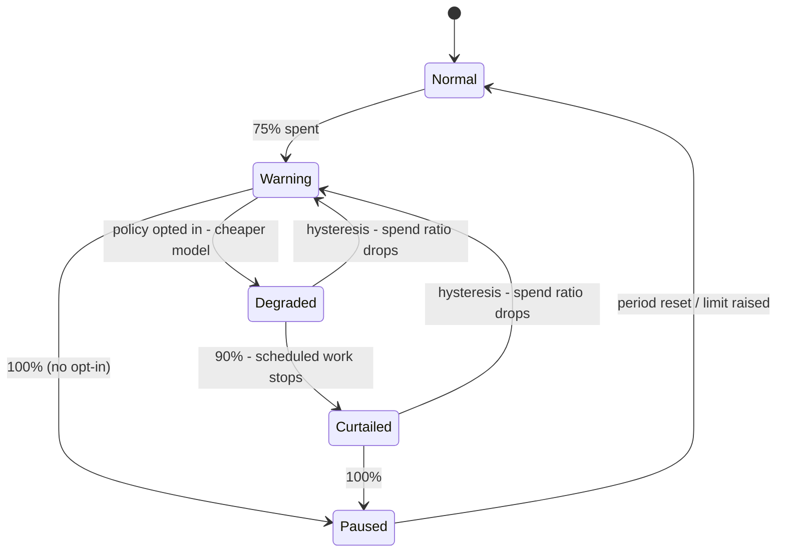
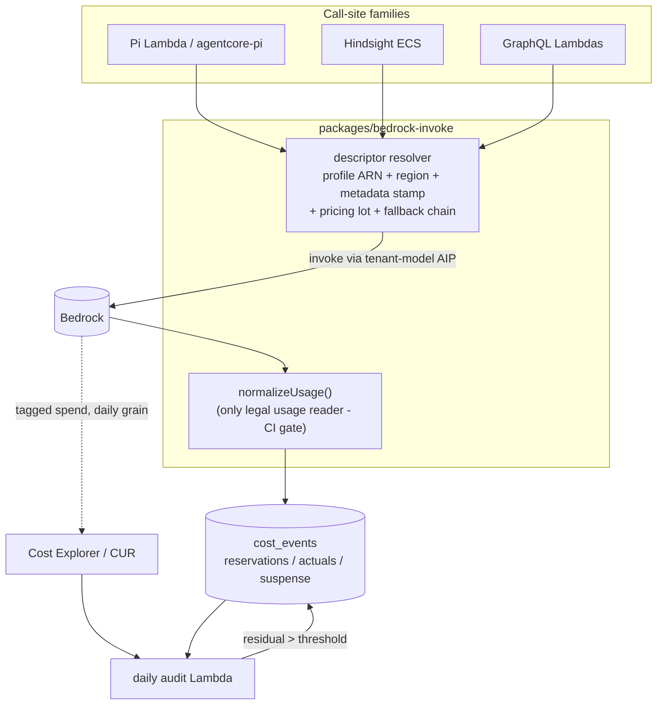
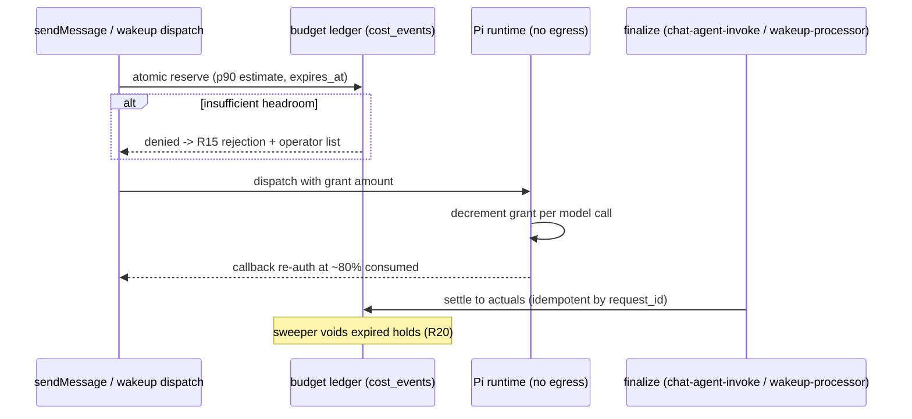

# LLM Cost & Budget Controls - Plan

## Goal Capsule

- **Objective:** Make Bedrock spend trustworthy end-to-end — every dollar attributed to tenant/agent/user, priced correctly (including cache tokens), and controlled by budgets that hold pre-flight and degrade gracefully instead of pausing silently.
- **Product authority:** Linear THINK-264 (refocused 2026-07-12) plus the confirmed brainstorm dialogue captured in the Product Contract below. The "no LiteLLM proxy" verdict is settled upstream (`docs/ideation/2026-07-12-think-264-litellm-integration-ideation.html`).
- **Execution profile:** Three waves, each separately shippable, all riding the Wave 0 seam. Wave 0 (U1–U3) → Wave 1 (U4–U8) → Wave 2 (U9–U11) → Wave 3 (U12–U14). U1 (audit) has zero dependencies and ships first.
- **Stop conditions:** Surface rather than guess when (a) a change would alter Product Contract scope (R-IDs), (b) the empirical AIP-on-Kimi check fails in a way that blocks U5's design, (c) shadow-run diffs won't converge to zero for a service family, or (d) a migration would touch enforcement semantics for existing tenants beyond R21's preserved no-policy behavior.
- **Product Contract preservation:** changed — R3 and R15 clarified, R20–R23 added (flow-analysis guardrails: hold lifecycle, no-policy default, operator-only permissions, eval flagging); no scope removals.

---

## Product Contract

### Summary

A three-wave program: Wave 1 makes spend attribution and pricing accurate (bill-vs-ledger audit, one shared Bedrock call path, per-request attribution tagging, tenant×model inference profiles, LiteLLM cache-pricing import). Wave 2 makes budgets hard guarantees (reserve-before-run, per-API-key budgets and rate limits). Wave 3 makes budget pressure graceful and visible (opt-in degradation ladder, cross-model failover, operator UI + in-thread notices).

### Problem Frame

Matching internal cost records to the AWS bill fails for more than 90% of invocations today, so bill-grade attribution depends on manual backfill scripts — TEI, McPherson, and dev each needed hand corrections. Cache-token rates are hardcoded and were wrong once (THINK-245: cache-write was TEI's largest unrecorded billing line, recorded at $0). Hindsight's Bedrock spend is only partially tracked: retain/reflect usage drains into cost_events via `recordHindsightCost` (`packages/api/src/lib/hindsight-cost.ts`, PRD-41B) when it rides the chat/wakeup response payloads, but Hindsight-internal calls outside those drain paths are invisible. Budget enforcement is read-then-act: concurrent requests race past caps (documented), agent/tenant scopes pause only after spend posts, and pauses are silent — scheduled work just stops with nobody told. Each of these has already cost real money or operator time; at 4 enterprises × 100+ agents they recur faster than a one-person ops team can fire-drill.

### Key Decisions

- **Concepts and data from LiteLLM, never its proxy.** Settled by the prior ideation: the runtime topology (no direct egress from the Pi container), the evidence-tiered ledger, and LiteLLM's own scale limits rule out a proxy. Every capability below is built natively or on AWS primitives.
- **Phased success, accuracy first.** Wave 1 (attribution + pricing accuracy) → Wave 2 (enforcement guarantees) → Wave 3 (graceful degradation + visibility). The bill-vs-ledger audit ships first inside Wave 1 — it has zero dependencies and measures the problem the rest of the program burns down. Visibility work rides with each enforcing feature, not as its own wave.
- **Degradation is opt-in per budget policy.** Default behavior stays warn-at-75% / pause-at-100%; operators enable the degrade action per policy. No tenant's output quality changes without an explicit choice.
- **Honest denial at the cap.** When a reservation cannot be placed, interactive chat is rejected with a clear message (reset date + operator path). No silent degrade for non-opted policies, no overage turn.
- **Everything feeds the existing evidence-tiered ledger.** Suspense entries, reservations, repriced backfills, and imported prices are all rows/states in the existing cost machinery — never a parallel source of truth.
- **Attribution split by grain.** Inference profiles (one per tenant×model, unified by a shared tenant tag) make the AWS bill tenant-sliceable at daily grain; per-request attribution rides request metadata. A single per-tenant profile is structurally impossible — profiles are created per model ARN.
- **Pricing feed is pinned and reviewed, never live-synced.** Imports reference a specific upstream commit; changed prices require operator approval before applying. AWS's Pricing API stays authoritative for base Bedrock rates; the LiteLLM feed's unique contribution is cache economics.
- **Untagged invocation becomes structurally impossible, not just detected.** Verified against AWS docs: the `bedrock:InferenceProfileArn` condition key (supported on InvokeModel/Converse and streaming variants) allows the foundation-model grant to be conditioned on the request having come through a named application inference profile — the two-statement pattern in AWS's inference-profile prerequisites, hardenable org-wide with the documented SCP layer. Rolled out detection-first (the R4 audit), then log-only IAM evaluation, then enforcement — the prior AccessDenied incident makes a staged rollout non-negotiable.

### Requirements

**Shared call path (prerequisite for R5–R8, R13–R19)**

- R1. All Bedrock model invocations across the three service families (Pi runtime, Hindsight, GraphQL Lambdas) flow through one shared invocation path that owns model resolution, region selection, attribution stamping, and usage extraction.
- R2. Exactly one usage normalizer exists, and a mechanical guard (CI) prevents any code outside it from reading raw Bedrock usage fields.
- R3. Cutover of each service family onto the shared path is gated on measured equivalence — a shadow run whose output matches the incumbent extractor for a sustained zero-diff window. The shadow path is read-only: it writes comparison records, never `cost_events`, so the shadow window cannot double-bill or trigger false pauses.

**Track 1 — Attribution (Wave 1)**

- R4. A daily audit compares the AWS bill's Bedrock total against the internal ledger and posts the residual as visible, aging "unattributed spend" entries with an alert threshold. This ships before every other requirement.
- R5. Every model call carries a pre-generated attribution key plus tenant/agent/user/thread/turn/key identity in request metadata, so bill reconciliation is an exact-key join rather than probabilistic matching.
- R6. The request-metadata identity schema is designed once, versioned, and fits the platform's 16-slot limit.
- R7. Spend arrives tenant-sliceable in AWS billing via tenant×model inference profiles sharing a tenant tag; the ~24h non-retroactive tag-activation lag is surfaced as an explicit "attribution warming up" state, not silent under-reporting.
- R8. No service family is excluded: Hindsight's currently-invisible Bedrock spend is metered like every other call site.
- R8a. After all service families route through inference profiles, IAM policies conditionally grant foundation-model access only to profile-routed requests (`bedrock:InferenceProfileArn` condition), making untagged Bedrock invocation structurally impossible. Rollout is staged: detection (R4) → log-only policy evaluation → enforcement; enforcement never precedes the last service family's cutover.

**Track 2 — Pricing (Wave 1)**

- R9. Cache read/write rates become catalog data imported from the LiteLLM community pricing feed, replacing hardcoded multipliers; base Bedrock rates remain sourced from the AWS Pricing API.
- R10. Imported price changes never auto-apply: they land in a pending-review state and require operator approval in the existing model-catalog UI.
- R11. Every cost record is stamped with the pricing version (lot) that priced it, so an upstream price correction can automatically identify and reprice affected records as exempt backfills.
- R12. The import runs on a nightly schedule and records upstream provenance (source commit, fetch time) per import.

**Track 3 — Enforcement (Wave 2)**

- R13. Before dispatch, an estimated cost hold is written atomically against the budget; it settles to actual cost at finalize and is voided on failure or expiry. Concurrent requests against the same budget cannot jointly exceed it by more than one outstanding grant.
- R14. The no-egress agent runtime meters spend locally against a coarse grant issued at dispatch and re-authorizes through its existing callback channel when the grant is ~80% consumed.
- R15. When a reservation cannot be placed for an interactive message, the user sees a clear rejection naming the reset date and the operator path; the operator UI lists blocked principals. Tenant-scope denials shown to non-operator senders omit raw dollar figures (today's message leaks tenant-wide spend); own-budget (user/agent-scope) denials keep amounts.
- R16. API keys become the fourth budget scope: each key can carry its own budget, request-rate limit, and model allowlist, enforced with 429 + Retry-After at the platform edge (allowlist violations return a distinct permission-shaped error, not 429).

**Track 3 — Degradation, failover, and visibility (Wave 3)**

- R17. Budget policies can opt into a degradation ladder: at 75% new turns route to a cheaper model from the agent profile's fallback list; at 90% scheduled/wakeup work is curtailed while interactive chat continues; at 100% work pauses. Transitions use hysteresis so the ladder cannot flap, and degraded turns are stamped as such.
- R18. Every budget state change (warning, degraded, curtailed, paused, reservation denied) is visible in the operator UI and produces an in-thread system notice on affected turns — including scheduled/wakeup turns. Email/Slack alerting is out of scope for v1.
- R19. Model failover is cross-model only, triggered by classified retryable errors (throttling walks the profile's fallback chain, gated by tenant-catalog enablement; validation errors never retry). First-party models adopt AWS cross-region profiles for region failover; the static region map survives solely as a carve-out for marketplace models.

**Guardrails (all waves)**

- R20. Every reservation hold carries a mandatory expiry; a background sweeper reclaims expired holds so a crashed turn can never permanently shrink a budget.
- R21. A tenant, agent, or user with no budget policy stays unenforced (today's semantics), and the operator UI shows that state loudly as "no budget configured" — never silently as "normal".
- R22. Pricing approval, budget-policy edits, and the blocked-principals list are operator-only surfaces.
- R23. Degraded turns are flagged to the evaluation/conformance pipeline so budget-driven model swaps are excluded from (or marked in) quality baselines rather than misattributed as model regressions.

### Acceptance Examples

- AE1. **Covers R13.** Given a tenant budget with $10 remaining and two concurrent messages each estimated at $8, when both dispatch at the same instant, then exactly one reservation succeeds and the other is denied — the tenant cannot end the period more than one grant over its cap.
- AE2. **Covers R15, R17.** Given a budget policy that has not opted into degradation, when spend reaches 100%, then the next interactive message is rejected with the reset date and operator path — it does not silently run on a cheaper model.
- AE3. **Covers R17, R18.** Given a policy opted into degradation at 76% spend, when a turn runs, then it uses a fallback model, the turn is stamped as degraded, and the thread shows a system notice naming the budget state.
- AE4. **Covers R11.** Given the upstream pricing feed corrects a cache-write rate, when the nightly import lands and an operator approves it, then all cost records priced under the old lot are identified and repriced as exempt backfills without manual scripting.
- AE5. **Covers R4.** Given a new service starts calling Bedrock without cost integration, when the daily audit runs, then the unattributed residual grows past its threshold and alerts — the dark spend is detected without anyone knowing to look.
- AE6. **Covers R18.** Given a scheduled job's tenant hits 100% on a pause-only policy, when the job's next run is skipped, then the pause is visible in the operator UI and the job's thread — not silent.
- AE7. **Covers R20.** Given a turn whose Lambda dies after reserving a $5 hold, when the hold's expiry passes, then the sweeper voids it and the budget's available headroom returns to its true value.

### Success Criteria

- **Wave 1:** monthly AWS Bedrock bill reconciles against the internal ledger within ~2% — provider-level until U5's tenant tags are live in Cost Explorer, per-tenant after (U1 gains a U5-gated per-tenant residual report); unattributed-spend entries older than 7 days ≈ $0; zero manual backfill scripts run after cutover.
- **Wave 2:** under a concurrency test, no budget is exceeded by more than one grant; 100% of Bedrock calls carry the attribution identity; Open Engine callers operate under per-key limits.
- **Wave 3:** zero silent budget events — every degrade/curtail/pause/denial has both an operator-visible state and an in-thread notice.

### Scope Boundaries

**Deferred for later**

- Email/Slack budget alerting (v1 visibility is operator UI + in-thread notices).
- IBNR-style spend estimation (enforcing on reported × learned correction factor) — premature until reconciliation history exists.
- Credits denomination for the enforcement ledger — carried as a design option inside R13, not a v1 requirement.
- Per-tenant timezone budget periods — periods stay UTC-monthly in v1; period assignment at boundaries is defined (KTD-8) but timezone support is not.

**Outside this effort's identity**

- Running LiteLLM (or any LLM proxy) in the inference path — settled against in the prior ideation.
- Per-tool model routing — the Agent Profile boundary decision stands; degradation and failover resolve at that boundary.

### Dependencies / Assumptions

- Inference-profile mechanics as researched (2026): created per model ARN, up to 50 tags, cost visible in Cost Explorer/CUR at daily grain, ~24h non-retroactive tag activation. Profile counts at ThinkWork scale (~4 tenants × dozens of models) are well inside quota norms.
- Request metadata is capped at 16 key-value pairs and flows verbatim into model invocation logs — the schema allocation (R6) is effectively one-shot.
- The LiteLLM community pricing feed remains available and schema-stable enough to import; pinning to a commit (R12) bounds the damage if it degrades.
- In-thread notices on scheduled/wakeup turns ride the wakeup finalize path (hooks live in the wakeup processor, not chat finalize).
- Hold estimates (initially p90 of the agent's recent turn costs) will over- or under-reserve; per-call settlement is the bounding mechanism if turn-level holds prove too coarse (see Open Questions).
- `ce:GetCostAndUsage` IAM access already exists (THINK-245 U10, `terraform/modules/app/lambda-api/iam-grouped.tf:270-291`) — the audit Lambda extends an existing grant, not a new IAM surface.

### Outstanding Questions

**Deferred to implementation**

- Whether an application inference profile can be created on Kimi's foundation-model ARN, and with a cross-region profile as copy source for first-party models (Kimi's lack of a cross-region profile is confirmed; AIP support on native-catalog third-party models is likely but unstated). Settle empirically with one-off `create-inference-profile` calls against dev during U5; if Kimi is unsupported, its spend attributes via request metadata only.
- Whether @earendil-works/pi-ai exposes (or needs a pnpm patch to expose) per-request requestMetadata, profile-ARN model IDs, raw usage fields, and the unswallowed retryable-error taxonomy for the main turn loop — the verified server.ts hook covers child-model calls only. Spike at the start of U2/U4, recorded next to the existing pi-coding-agent patch convention.
- Whether the Hindsight call path should eventually sit behind budget reservation (Wave 2's hard cap covers chat/wakeup/Pi paths; Hindsight is metered fail-open with the audit as backstop — a capped tenant can still spend via memory operations until this is decided).
- Retention/access policy for model invocation logs now that every call carries structured tenant/agent/user identity in requestMetadata (per-account logging config, KMS, retention; customer accounts included).
- Whether turn-level p90 holds prove accurate enough, or per-call settlement (U10's grant decrement writing intermediate settles) must become the default.
- Shadow-run diff tolerance (exact-zero vs epsilon for float rounding) — set during U3 from the first week of real diffs.

### Sources / Research

- `docs/ideation/2026-07-12-think-264-native-cost-control-ideation.html` — the seven verified build ideas this contract is drawn from (49 raw candidates, adversarially verified; all direct code citations confirmed against source at this commit).
- `docs/ideation/2026-07-12-think-264-litellm-integration-ideation.html` — the settled no-proxy verdict and its grounding.
- Linear THINK-264 — product authority; mirrors the goal framing and the seven ideas.
- Key verified code anchors: the request-metadata hook and usage-field hedging in `packages/agentcore-pi/agent-container/src/server.ts` (~L717–757, carries the THINK-245 U4 TODO naming this work); hardcoded cache multipliers in `packages/api/src/lib/model-catalog/pricing.ts:33`; the unconsumed fallback-model field in `packages/agentcore-pi/agent-container/src/agent-profile-adapter.ts` (~L593, L641); the budget warning state in `packages/api/src/lib/user-budget-enforcement.ts:109`; the existing key table in `packages/database-pg/src/schema/agents.ts` (~L455–472); the existing catalog importer in `packages/api/src/lib/model-catalog/tenant-catalog.ts` (~L241–331); the local metering accumulator in `packages/agentcore-pi/agent-container/src/analyst-cost-budget.ts` (~L97–104); the existing pre-persist budget gate in `packages/api/src/graphql/resolvers/messages/sendMessage.mutation.ts` (~L288–339); the two pause call sites `packages/api/src/handlers/chat-agent-invoke.ts:1052` and `packages/api/src/handlers/wakeup-processor.ts:830`; the reset cron `packages/api/src/handlers/crons/budget-reset.ts`.
- External grounding: AWS application inference profiles + requestMetadata cost-tracking reference architectures; AWS cross-region inference profiles (native region failover); LiteLLM `model_prices_and_context_window.json` schema and `budget_fallbacks`; Orb/Metronome pending-vs-settled credit-ledger pattern.
- Pre-planning verification (2026-07-12, against AWS docs): `bedrock:InferenceProfileArn` condition key confirmed on InvokeModel/Converse (+streaming) — AWS inference-profile prerequisites page documents the two-statement pattern; AWS re:Post documents the SCP hardening layer (deny when the condition is null or matches system profiles). Kimi K2.5/K2 model cards confirm "Geo/Global inference ID: Not supported" — no cross-region profile exists for Kimi.

---

## Planning Contract

### Key Technical Decisions

- KTD-1. **Reservation primitive: lock the policy row, then reserve — a subquery CAS is rejected as unsound.** A single `INSERT ... WHERE (settled + open_holds + estimate) <= limit` with `open_holds` computed by subquery does NOT serialize under Postgres READ COMMITTED (two concurrent snapshots both see the same open-hold sum and both insert — AE1 would pass under lucky timing and race in production). The pinned shape: a transaction takes a row lock on the `budget_policies` row (`SELECT ... FOR UPDATE`), computes the sums post-lock, inserts the hold, commits. A denormalized open-holds counter on the policy row (true single-row CAS) is the contention escape hatch, deferred until measured. When a request reserves against multiple scopes (tenant+agent+user+key), locks are taken in a deterministic order (by policy id) to prevent deadlocks. Holds are `cost_events` rows (`event_type='reservation'`) carrying `expires_at`, a `status` state machine (`open → settled | voided`; both terminal; transitions via guarded `UPDATE ... WHERE status='open'`), and a period key (KTD-7). Settle inserts the actual-cost rows and transitions the hold in one transaction; settle arriving after a sweeper void records the actuals anyway (spend is real), logs an anomaly, and never re-opens the hold; reserve retries read back the existing hold rather than relying on conflict-swallowing (`onConflictDoNothing` alone cannot distinguish "denied" from "already held"). Settle/void runs where actuals actually post: the chat-finalize path (`packages/api/src/lib/chat-finalize/process-finalize.ts`, adjacent to its `recordCostEvents` calls) for chat turns, and `wakeup-processor.ts` for wakeup turns (inline per the wakeup-finalize convention). `chat-agent-invoke.ts:1052` is a **reserve** site (the pre-dispatch gate for routes bypassing sendMessage), not a settle site. Contention escape hatch: a denormalized period-settled accumulator plus open-holds counter on the policy row (the post-lock settled-spend SUM scans the whole period's rows for a busy tenant — reservation latency peaks exactly at month-end; measure before adopting). A sweeper cron in the `budget-reset.ts` family voids expired holds (R20).
- KTD-2. **The seam is a shared package extending the existing `ModelProvider.resolve()` contract, not a new abstraction.** New `packages/bedrock-invoke` (`@thinkwork/bedrock-invoke`) exports an invocation-descriptor resolver (profile ARN, region, requestMetadata stamp, pricing-lot snapshot, fallback chain) plus the single `normalizeUsage()`. `pi-runtime-core`'s `ModelProvider.resolve()` (model-provider.ts:64-70, no-silent-fallback contract) is the integration shape for the Pi family. The Pi container's Dockerfile requires an explicit `COPY` for each workspace package (`packages/agentcore-pi/agent-container/Dockerfile:31-65`) — the new package must be added there. A CI `ast-grep` rule fails any PR reading raw Bedrock usage fields (`inputTokens`, `cacheRead*`, `response.usage`) outside the package.
- KTD-3. **Attribution rides a versioned 8-of-16 requestMetadata slot allocation, stamped at the descriptor.** Slots v1: `v`, `attribution_id`, `tenant_id`, `agent_id`, `user_id`, `thread_id`, `turn_id`, `api_key_id` (8 reserved for future use). The `attribution_id` is minted before the Converse call and recorded on the cost event, collapsing reconciliation to an exact-key join. AIPs are provisioned per tenant×model by a control-plane Lambda (tenants are data, not Terraform), tagged with the shared tenant tag; IAM enforcement follows the verified two-statement pattern, staged detect → log-only → enforce (R8a).
- KTD-4. **Pricing import is a second `import_source` on the existing importer, plus a `pricing_lots` table.** `resolveLiteLLMPricing()` mirrors `resolveBedrockPricingFromPriceList()`'s return shape and reuses `upsertTenantModelCatalogEntry` (tenant-catalog.ts:241-331) — the schema comments already reserve `'litellm'` values. Each import writes a `pricing_lots` row (source commit SHA, fetch time, per-field hash); `cost_events` gains `pricing_lot_id`. Changed prices land `pricing_status='ambiguous'` until approved in `SettingsModelCatalog.tsx`; approval triggers the recall/reprice sweep (exempt backfills per the Graced Backfill convention).
- KTD-5. **Degradation and failover resolve inside the descriptor, at the Agent Profile boundary.** `budget_policies` gains `action_on_warning` (null = today's behavior; `'degrade'` = opt-in ladder). The descriptor consumes the profile's `fallbackModels` (compiled but currently unread, agent-profile-adapter.ts:593,641) for both budget degradation and error-classified cross-model failover; hysteresis re-arms only when spend ratio drops below 65% or the period resets. Per-key RPM uses a Postgres fixed-window counter (no Redis in the stack; Open Engine RPS is low) — revisit only if p95 write contention appears.
- KTD-6. **The audit Lambda extends the existing Cost Explorer grant — and must not eat its own output.** `ce:GetCostAndUsage` is already granted (iam-grouped.tf:270-291, THINK-245 U10). Daily EventBridge-scheduled handler computes CUR-vs-`SUM(cost_events)` residual per day and posts suspense entries (`event_type='suspense'`, `enforcement_exempt=true`, aging timestamp). Circularity guard: the residual computation — and the existing `cost-drift-check.ts` — exclude `suspense` and `reservation` rows, or the audit self-satisfies and dark spend goes invisible again after the first posting. Suspense identity is deterministic (`request_id = 'suspense:<provider>:<date>'` riding the existing unique index) so duplicate/concurrent audit runs upsert one row per day. Restatements within the ~72h CUR finalization window update the row while preserving prior values in metadata; restatements after finalization or period close append correction rows instead. Requires dropping `cost_events.tenant_id` NOT NULL (hand-rolled migration) — suspense has no tenant; the shared predicate in KTD-9 keeps nullability away from display paths.
- KTD-7. **Period assignment is a data rule, not a timing rule.** Reservation rows carry an explicit `billing_period_start` stamped at hold-open; settle/void rows inherit it; all enforcement SUMs, the sweeper, the reset cron, and the degradation ladder evaluate on the period key — never on `created_at`. A hold opened in period P settles into P even when finalize lands in P+1, without mutating P+1's window (the `created_at`-windowed alternative either double-counts the spend in P+1 or hides it from every scan). Mid-period policy edits enforce forward-only (next reservation attempt), never retroactive pause, and do not count as hysteresis flaps.
- KTD-8. **In-thread notices reuse the existing notify/AppSync bridge, not a new message primitive.** Budget notices attach at the two finalize sites and at the `sendMessage` rejection path, publishing through `packages/api/src/graphql/notify.ts` conventions. Wakeup notices ride wakeup-processor's existing `checkUserBudgetAndPauseWork` call site (wakeup-processor.ts:830).
- KTD-9. **One shared settled-spend predicate; consumers deploy before writers.** ~15 existing aggregations SUM `amount_usd` with no `event_type` filter, and the filtered ones use a negative bucket (`event_type NOT IN ('llm','agentcore_compute','eval')` → "tools") that would silently absorb `reservation` and `suspense` rows — holds would double-count against actuals in every dashboard and suspense would render as tenant "tools" spend (`costSummary.query.ts:36-39`, `budgetStatus.query.ts:34`, `accountUsage.query.ts:204`, `cost-drift-check.ts:133`, and siblings). All display/reporting aggregations read through a single exported settled-spend predicate (or SQL view); enforcement reads its own predicate that includes open holds; per-query ad-hoc filters are rejected. A classification-exhaustiveness unit test fails whenever a new `event_type` value is not explicitly assigned to exactly one bucket (settled / hold / suspense). Deploy ordering: the consumer-filtering change ships and is live before any writer emits the new event types — the event-type analog of the repo's migration-deploy-ordering rule.

### High-Level Technical Design

Directional guidance, not implementation specification.

Reservation lifecycle (Wave 2):

### Assumptions

- The shadow-run harness can observe both extraction paths per request without touching `cost_events` (comparison records live in a scratch table or CloudWatch metrics — implementer's choice).
- Hindsight's client can be pointed at the seam via its existing env-driven provider config (`HINDSIGHT_API_LLM_PROVIDER`, Terraform-set); if its upstream image can't consume a workspace package, a thin wrapper at its Bedrock boundary is acceptable.
- Mobile's model proxy joins the seam at the `converse-mapping.ts` layer; its allowlist unification with the tenant catalog is a follow-up, not in scope here.

---

## Implementation Units

| U-ID | Title                                            | Key files                                                               | Depends on     |
| ---- | ------------------------------------------------ | ----------------------------------------------------------------------- | -------------- |
| U1   | Bill-vs-ledger suspense audit                    | `packages/api/src/handlers/crons/`, `terraform/modules/app/lambda-api/` | —              |
| U2   | `@thinkwork/bedrock-invoke` seam package (inert) | `packages/bedrock-invoke/`                                              | —              |
| U3   | Shadow-run harness + per-family cutover          | `packages/bedrock-invoke/`, call sites                                  | U2             |
| U4   | Attribution stamping + exact-key reconciliation  | `server.ts`, `cost-events.ts`, reconciler                               | U2, U3         |
| U5   | Inference-profile provisioning + IAM (log-only)  | control-plane Lambda, `terraform/`                                      | U3, U4         |
| U6   | Hindsight metering                               | `terraform/modules/app/hindsight-memory/`, seam                         | U3             |
| U7   | Pricing lots + LiteLLM importer + approval       | `tenant-catalog.ts`, `pricing_lots`, settings UI                        | —              |
| U8   | IAM enforcement stage                            | `terraform/`                                                            | U5, U6         |
| U9   | Reservation ledger + denial UX + sweeper         | `cost-events.ts`, `sendMessage.mutation.ts`, finalize sites             | U2, U4, U6, U7 |
| U10  | Grant metering in Pi runtime                     | `analyst-cost-budget.ts` generalization, callback                       | U9             |
| U11  | Per-key budgets and rate limits                  | `agents.ts`, edge middleware                                            | U4, U9         |
| U12  | Degradation ladder                               | `budget_policies`, descriptor, profile adapter                          | U3, U9         |
| U13  | Cross-model failover + region-map demotion       | descriptor, `PI_BEDROCK_MODEL_REGIONS`                                  | U3, U5, U12    |
| U14  | Visibility surfaces                              | `apps/web` settings, notify bridge, wakeup finalize                     | U9, U12        |

### U1. Bill-vs-ledger suspense audit (Wave 0, ships first)

- **Goal:** Daily job posts the CUR-vs-ledger residual as aging suspense entries and alerts past a threshold; unattributed spend becomes visible within a week of merging.
- **Requirements:** R4; AE5.
- **Dependencies:** none.
- **Files:** `packages/api/src/handlers/crons/spend-audit.ts` (new, mirroring `budget-reset.ts`); `scripts/build-lambdas.sh` entry; `terraform/modules/app/lambda-api/handlers.tf` (schedule) + `iam-grouped.tf` (extend the existing `ce:GetCostAndUsage` statement if needed); hand-rolled migration in `packages/database-pg/drizzle/` adding the `suspense` event type (with `-- creates:` markers); `packages/api/src/handlers/crons/spend-audit.test.ts`.
- **Approach:** Query Cost Explorer for the prior day's Bedrock total; subtract the day's settled ledger spend; upsert one suspense row per day with deterministic identity (`request_id = 'suspense:<provider>:<date>'`, per KTD-6) so concurrent/retried runs are idempotent. The residual computation and `cost-drift-check.ts` exclude `suspense`/`reservation` rows (circularity guard). This unit also lands the KTD-9 shared settled-spend predicate and migrates the enumerated aggregation consumers onto it — consumers before writers. Requires the nullable-`tenant_id` hand-rolled migration. Restatements per KTD-6 (in-window updates preserve prior values; post-finalization appends corrections). Alert via the platform's existing operational-alert convention when the residual exceeds a configured threshold (SSM runtime-config, not env — 4KB ceiling).
- **Test scenarios:** residual computed correctly with mixed attributed/unattributed spend; a posted suspense row does not change the next recomputation of the same day's residual (circularity); duplicate/concurrent audit runs for the same day produce exactly one row; restated CE day inside the finalization window updates the row preserving prior values, post-close restatement appends a correction row; zero-residual day writes nothing; Covers AE5: a synthetic dark call site raises the residual past threshold and the alert fires; tenant-scoped summaries are byte-identical before/after a suspense row exists (predicate + nullable tenant); the classification-exhaustiveness test fails on an unassigned event type.
- **Verification:** deployed to dev, one real daily run posts a suspense row matching a hand-computed CE-vs-ledger diff; the current Hindsight residual gets its first dollar figure.

### U2. `@thinkwork/bedrock-invoke` seam package, shipped inert (Wave 0)

- **Goal:** One package owns the invocation descriptor and the only legal usage extraction — landed with tests, wired to nothing.
- **Requirements:** R1, R2.
- **Dependencies:** none.
- **Files:** `packages/bedrock-invoke/` (package.json `@thinkwork/bedrock-invoke`, `src/descriptor.ts`, `src/normalize-usage.ts`, `src/errors.ts`, tests, golden fixtures); CI rule (ast-grep or eslint) banning raw usage-field reads outside the package; `packages/agentcore-pi/agent-container/Dockerfile` COPY lines.
- **Approach:** Descriptor resolver takes `{modelId, tenantId, agentId, identity, profileArn?, regionOverride?}` and returns client config + stamped requestMetadata + fallback chain. `normalizeUsage()` handles the known wire-shape variants (`cacheReadInputTokens` vs `cacheReadTokens` hedge from server.ts:751-757) against golden Converse + streaming fixtures. Preserve the Bedrock throttling error taxonomy — the package classifies, never rewraps, retryable errors.
- **Patterns to follow:** `packages/runtime-config` package shape (exports point at `src/index.ts`, `workspace:*` consumers); `ModelProvider.resolve()` no-silent-fallback contract.
- **Execution note:** ship inert — no live consumer in this unit; the CI guard lands allowlisting existing violations, tightening as U3 cuts each family over.
- **Test scenarios:** golden-fixture extraction for standard Converse, streaming, cache-token variants, and the zero-usage ValidationException shape (pi-ai swallow case); descriptor refuses unknown model IDs (no silent fallback); CI rule fails a fixture PR that reads `usage.inputTokens` outside the package.
- **Verification:** package builds, tests pass, CI guard demonstrably fails a violation; zero runtime behavior change anywhere.

### U3. Shadow-run harness and per-family cutover (Wave 0)

- **Goal:** Each call-site family adopts the seam only after a sustained zero-diff shadow window; Hindsight's shadow feed is its first-ever usage telemetry.
- **Requirements:** R1, R3; advances R8.
- **Dependencies:** U2.
- **Files:** shadow comparison recorder in `packages/bedrock-invoke/src/shadow.ts`; nightly diff job (extend U1's cron or sibling); call-site touches per family — `packages/api/src/lib/` GraphQL handlers first, then `packages/agentcore-pi/agent-container/src/server.ts`, then `packages/api/src/lib/model-proxy/converse-mapping.ts`, Hindsight last via its Terraform env seam.
- **Approach:** Shadow mode runs `normalizeUsage()` alongside the incumbent extractor and records both outputs keyed by request identity — read-only, never writing `cost_events` (R3). Shadow recording starts for all families simultaneously; windows accrue in parallel and only cutover flag flips follow blast-radius order: GraphQL Lambdas → Pi → mobile → Hindsight. Cutover per family flips a runtime-config flag after 7 consecutive zero-diff days. Hindsight's gate differs: its incumbent is the existing `recordHindsightCost` payload drain — diff shadow totals against drain output for drained paths, and gate the undrained remainder on U1's residual shrinking by approximately the shadow-observed amount.
- **Test scenarios:** shadow records diverge when a fixture deliberately mis-parses (harness detects a seeded diff); shadow path writes zero `cost_events` rows under load; cutover flag flips extraction source atomically; Hindsight shadow totals reconcile against the existing drain for drained paths and against residual movement for undrained ones.
- **Verification:** dev dashboard (or logged metric) shows per-family diff counts trending to zero; each family's cutover is a config change, not a deploy.

### U4. Attribution stamping and exact-key reconciliation (Wave 1)

- **Goal:** Every model call carries the v1 metadata schema; reconciliation joins on `attribution_id` instead of timestamp proximity.
- **Requirements:** R5, R6.
- **Dependencies:** U2, U3 (Pi family cutover).
- **Files:** `packages/bedrock-invoke/src/metadata.ts` (slot schema v1); `packages/agentcore-pi/agent-container/src/server.ts` (populate the existing L717-745 hook); hand-rolled migration adding `attribution_id` to `cost_events`; reconciler update in `packages/api/src/lib/` (replace model-time matching tier with exact join); tests alongside each.
- **Approach:** Mint `attribution_id` at the descriptor; stamp the 8 v1 slots; record the same ID on the cost event pre-insert (idempotency preserved via existing dedup). The reconciler prefers exact-key; the old confidence ladder remains as fallback for pre-cutover history.
- **Test scenarios:** stamped call's invocation-log record joins to its cost event by key; 16-slot cap respected with 8 reserved; legacy events without attribution_id still reconcile via the old ladder; Covers R5: reconciliation rate on stamped traffic reaches ~100% in dev.
- **Verification:** dev reconciler run reports exact-key matches for all post-cutover traffic ("matched:0" class of log line disappears for stamped events).

### U5. Inference-profile provisioning and staged IAM (Wave 1)

- **Goal:** Tenant×model AIPs exist, calls route through them, tag-lag is surfaced, and IAM evaluation runs log-only.
- **Requirements:** R7, R8a (detect + log-only stages).
- **Dependencies:** U3, U4.
- **Files:** control-plane provisioning in `packages/lambda/` (agentcore-admin family) or `packages/api/src/handlers/`; descriptor profile-ARN resolution in `packages/bedrock-invoke/`; `terraform/modules/app/agentcore-pi/main.tf` + `lambda-api/iam-grouped.tf` (two-statement pattern, log-only first); "attribution warming up" state on newly minted profiles.
- **Approach:** Provision AIPs per enabled tenant×model pair from the tenant catalog (create on enable, tag with shared tenant tag). For first-party models, create each AIP with the **cross-region system profile ARN as its copy source** so calls always enter via the tenant AIP and AWS handles region routing underneath — this is what lets U8's enforcement (which denies system-profile and bare-model invocation) coexist with region failover, and it removes any AIP re-provisioning under live enforcement later. Descriptor swaps model ID for profile ARN when one exists. Tag activation is a first-class step: the provisioning path (or a documented per-account bootstrap) calls `UpdateCostAllocationTagsStatus` for the tenant tag in each payer account — including customer accounts — and the "attribution warming up" state alarms if CE data hasn't appeared within 72h of profile creation. First implementation step: the one-off empirical `create-inference-profile` checks in dev — against Kimi's ARN (if unsupported, Kimi routes untagged with requestMetadata-only attribution and a documented audit carve-out) and against a cross-region profile ARN as copy source.
- **Execution note:** IAM changes land log-only (CloudTrail evaluation) in this unit; enforcement is U8, gated on U6.
- **Test scenarios:** profile created/tagged on catalog enable; invoke via a tenant AIP sourced from a cross-region profile succeeds for a first-party model; newly tagged profile shows warming state until CE data arrives and alarms past 72h; log-only policy records would-deny for a deliberate direct invocation without denying it.
- **Verification:** dev CE console shows tenant-tagged Bedrock spend within ~24-48h of cutover; no AccessDenied incidents.

### U6. Hindsight metering unification (Wave 1)

- **Goal:** All Hindsight Bedrock spend enters `cost_events` exactly once — the existing payload drain and the new seam are unified, never additive.
- **Requirements:** R8.
- **Dependencies:** U3.
- **Files:** `packages/api/src/lib/hindsight-cost.ts` (existing `recordHindsightCost` drain — PRD-41B); `terraform/modules/app/hindsight-memory/main.tf` (env/provider seam); wrapper or seam adoption at Hindsight's Bedrock boundary.
- **Approach:** Hindsight already drains retain/reflect usage through `recordHindsightCost` via the chat/wakeup response payloads — U6 is a unification, not greenfield metering. First enumerate which Hindsight call paths the drain misses (internal/background calls not riding a turn payload); then either meter only those through the seam, or replace the drain wholesale with the seam in one cutover and delete the drain path. Double-counting is the primary failure mode. Spend lands as System Spend (existing convention) attributed per tenant.
- **Test scenarios:** no retain/reflect call produces two cost events (drain + seam) under either unification option; a previously-undrained Hindsight call path produces exactly one cost event; U1's residual drops by the corresponding amount; failure to emit a cost event does not break memory operations (metering is fail-open, the audit is the backstop).
- **Verification:** dev suspense residual visibly shrinks after deploy; Hindsight rows appear once (not twice) in cost summaries for drained paths.

### U7. Pricing lots, LiteLLM importer, and approval flow (Wave 1, independent)

- **Goal:** Cache economics become reviewed catalog data with lot provenance and automated recall/reprice.
- **Requirements:** R9, R10, R11, R12, R22.
- **Dependencies:** none (parallel to U2–U6).
- **Files:** `packages/api/src/lib/model-catalog/litellm-pricing.ts` (new resolver); `pricing_lots` table (generated migration) + `cost_events.pricing_lot_id` (hand-rolled); nightly handler + `handlers.tf` schedule; `apps/web/src/components/settings/SettingsModelCatalog.tsx` approval states; recall/reprice sweep reusing the Graced Backfill convention; codegen for `apps/web` after GraphQL changes.
- **Approach:** Fetch the pinned-commit JSON (verify the fetched content's hash against the pinned commit before diffing — the pin is only a guarantee if checked), map cache fields, diff against current catalog, land changes as `pricing_status='ambiguous'`; approval applies the price and stamps a new lot. Pricing-approval GraphQL changes land in `packages/database-pg/graphql/types/costs.graphql` (pricing lots + approval mutation), so U7 joins the codegen gate. The reprice sweep appends delta adjustment rows (`enforcement_exempt=true`, new lot id, metadata pointing at the corrected row) — it never mutates original amounts (flipping a whole row exempt would erase already-enforced spend from budget windows and grant phantom headroom) and never touches rows at `reconciliation_state` `bill-reconciled` or `mismatch` (bill truth doesn't track catalog changes). The sweep runs in bounded batches with a resumable cursor keyed by lot id. AWS Pricing API remains the base-rate source; conflicts >N% between sources alert instead of auto-resolving.
- **Test scenarios:** import diff lands ambiguous, not applied; approval applies and stamps lot; Covers AE4: correction appends delta rows for exactly the old-lot records; budget-window enforcement totals unchanged (± only the delta rows' exemption) before vs after a sweep; bill-reconciled rows untouched by the sweep; sweep resumes cleanly from a mid-batch failure; feed fetch failure or schema drift leaves catalog untouched and alerts; concurrent approvals are idempotent per row; non-operator cannot reach approval mutation (R22).
- **Verification:** dev import run visible in the settings UI with badge states; a staged fake correction round-trips recall/reprice; `ANTHROPIC_CACHE` constants deleted with cost-recording tests still green.

### U8. IAM enforcement stage (Wave 1 tail)

- **Goal:** Untagged Bedrock invocation becomes structurally impossible.
- **Requirements:** R8a (enforce stage).
- **Dependencies:** U5, U6 (all families profile-routed).
- **Files:** `terraform/modules/app/lambda-api/iam-grouped.tf`, `terraform/modules/app/agentcore-pi/main.tf`, `terraform/modules/app/hindsight-memory/main.tf`.
- **Approach:** Flip the log-only condition statements to enforcing after ≥7 clean log-only days across all families. Marketplace models without AIP support (pending U5's Kimi check) get an explicit documented exception statement rather than a silent wildcard.
- **Test scenarios:** deliberate direct un-profiled invocation from a dev role is denied; every production call path continues to succeed (smoke across the three families); rollback is a single Terraform revert.
- **Test expectation note:** primarily infra — verification is the staged CloudTrail evidence plus smoke, not unit coverage.
- **Verification:** zero would-deny entries for legitimate traffic in the final log-only week; enforcement deploy produces no AccessDenied alarms.

### U9. Reservation ledger, denial UX, and sweeper (Wave 2)

- **Goal:** Budgets become authorize-and-settle; the concurrency race closes; denials are honest and operator-visible.
- **Requirements:** R13, R15, R20, R21, R22 (blocked-principals query is operator-only); AE1, AE2, AE7.
- **Dependencies:** U2 (normalizer for settle amounts), U4, U6, U7 (per the accuracy-first decision: enforcement never ships against numbers the plan calls untrustworthy — attribution, Hindsight unification, and corrected cache pricing precede hard guarantees).
- **Files:** hand-rolled migration (`reservation` event type, `expires_at`, `status`, `billing_period_start`, partial index on open holds — index in its own `CREATE INDEX CONCURRENTLY` file); reservation module in `packages/api/src/lib/user-budget-enforcement.ts` (or sibling `budget-reservation.ts`); `sendMessage.mutation.ts:288-339` (extend the existing fail-fast block into a hold); `chat-agent-invoke.ts:1052` and `wakeup-processor.ts:830` (settle/void at both finalize sites — payload parity applies to both wakeup builders in `agent-dispatch-payload.ts`); sweeper in `budget-reset.ts` family; GraphQL additions to `packages/database-pg/graphql/types/costs.graphql` (blocked principals query) + codegen consumers.
- **Approach:** Policy-row lock per KTD-1 (subquery CAS rejected; deterministic lock order across scopes); hold state machine `open → settled | voided` with guarded transitions. Reserve sites are exactly three: the `sendMessage` pre-persist gate, `chat-agent-invoke.ts:1052` (dispatch routes bypassing the mutation), and `wakeup-processor.ts:830` (converted from read-then-pause to hold-before-dispatch); settle/void runs in the chat-finalize path and the wakeup processor per KTD-1. Estimate = p90 of the agent's trailing turn costs with a floor default; holds count in enforcement sums and are excluded from display/observability sums (KTD-9 predicates); period key stamps the existing `billing_period_start` column at hold-open (column already exists with CUR semantics — document the dual use; only the reservation event type, `expires_at`, `status`, and the partial index are new DDL); denial message per R15 (genericized tenant-scope figures); `no_policy` remains unenforced but is surfaced (R21); the blocked-principals query carries a resolver-level operator check (R22), not just client-side guarding.
- **Execution note:** start with a failing concurrency test reproducing the documented race (two simultaneous reservations against $10 headroom) — it must fail against a naive subquery implementation and pass against the policy-row lock.
- **Test scenarios:** Covers AE1: concurrent reservations — exactly one succeeds (test exercises true parallelism, not sequential mocks); multi-scope reservation takes locks in deterministic order (no deadlock under crossed concurrent requests); Covers AE2: 100% pause-only policy rejects with reset date, no dollar figures for tenant-scope non-operator; Covers AE7: expired hold voided by sweeper restores headroom; settle-after-sweeper-void records actuals without resurrecting the hold and logs an anomaly; finalize crash between actual-insert and hold-void repairs idempotently on retry; reserve retry reads back the existing hold (no false deny, no double dispatch); void on dispatch failure; mid-period limit-lowering enforces forward-only; no-policy tenant reserves without bound and shows "no budget configured"; hold opened in P settled in P+1 lands in P's totals and adds nothing to P+1 (period key); open holds absent from costSummary/dashboard totals while present in enforcement headroom; non-operator denied on the blocked-principals query (R22); month-end-scale latency scenario for the reservation path (KTD-1 escape-hatch trigger evidence).
- **Verification:** concurrency test green; dev manual test of the denial UX; dashboards show holds distinct from settled spend.

### U10. Grant metering in the Pi runtime (Wave 2)

- **Goal:** The no-egress runtime meters locally against its grant and re-authorizes mid-turn instead of overshooting by a whole turn.
- **Requirements:** R14.
- **Dependencies:** U9.
- **Files:** generalize `packages/agentcore-pi/agent-container/src/analyst-cost-budget.ts`'s accumulator into the turn loop; re-auth call over the existing Lambda-callback fetch; grant fields in both wakeup dispatch payload builders (`packages/api/src/lib/agent-dispatch-payload.ts` — parity rule).
- **Approach:** Grant = the hold amount from U9; decrement per model call using normalized usage; at ~80% consumed request a top-up (RequestResponse, error-surfacing); on re-auth failure or denial, finish the in-flight model call, stop before the next one, and surface a budget stop in-turn rather than failing silently.
- **Test scenarios:** turn stops between tool calls when top-up denied; re-auth transport failure stops gracefully (no silent fail-open); grant accounting matches settle amounts within estimate tolerance; wakeup and chat dispatch both carry grant fields (parity test).
- **Verification:** dev turn crossing 80% observably re-authorizes (log evidence); a capped turn ends with the in-thread budget stop message.

### U11. Per-key budgets and rate limits (Wave 2)

- **Goal:** API keys become the fourth budget scope with 429 backpressure, protecting Open Engine.
- **Requirements:** R16, R22.
- **Dependencies:** U4 (api_key_id metadata slot ships there), U9.
- **Files:** generated migration extending `agent_api_keys` (budget, RPM, allowlist columns) + `budget_policies` scope enum value `key` + `cost_events.api_key_id` (hand-rolled where constraints demand); enforcement middleware at the Open Engine/GraphQL edge; `costs.graphql` additions + codegen.
- **Approach:** Key resolution stamps `api_key_id` into the descriptor metadata (slot already allocated in KTD-3); budget checks reuse the U9 reservation path with scope `key`; RPM via Postgres fixed-window counter per KTD-5; allowlist violations return a permission error distinct from 429.
- **Test scenarios:** over-budget key denied with Retry-After derived from period reset; RPM breach returns 429; allowlist violation returns permission-shaped error; revoked key rejected before any budget work; key spend visible in cost summaries by key.
- **Verification:** an Open Engine dev client experiences and recovers from 429; key rows show accumulated spend.

### U12. Degradation ladder (Wave 3)

- **Goal:** Opted-in policies degrade at 75%, curtail at 90%, pause at 100% — with hysteresis and eval-safe stamping.
- **Requirements:** R17, R23; AE3.
- **Dependencies:** U3 (descriptor live in Pi family), U9 (budget states from the reservation ledger).
- **Files:** `budget_policies.action_on_warning` (generated migration); descriptor ladder logic in `packages/bedrock-invoke/`; consume `fallbackModels` in the profile adapter path; turn stamping (`budget_degraded`) on cost events/turn records; eval/conformance exclusion flag where verdicts are computed; curtail check in `wakeup-processor.ts`.
- **Approach:** Ladder evaluates at reservation time (dispatch-stamped utilization travels with the grant — no extra DB read in-container); fallback candidate must be tenant-catalog `enabled + resolved`; hysteresis per KTD-5; policy edits never flap the ladder (KTD-7).
- **Test scenarios:** Covers AE3: 76% opted-in turn runs fallback model, stamped, noticed; non-opted policy at 76% unchanged; 90% curtails wakeup work but interactive continues; re-arm only below 65%; degraded turn excluded/marked in conformance sweep (R23); fallback chain empty → ladder degrades to pause with notice rather than erroring.
- **Verification:** dev policy walked through 75/90/100 with observable model swaps, stamps, and no flapping under oscillating spend.

### U13. Cross-model failover and region-map demotion (Wave 3)

- **Goal:** Throttling walks the fallback chain automatically; first-party region failover moves to native cross-region profiles; the static map shrinks to a marketplace carve-out.
- **Requirements:** R19.
- **Dependencies:** U3, U12 (shared fallback-chain consumption).
- **Files:** error-classified retry walk in `packages/bedrock-invoke/src/errors.ts`; first-party model IDs move to cross-region profile IDs (catalog data + descriptor); `PI_BEDROCK_MODEL_REGIONS` demoted in `terraform/modules/app/agentcore-pi/variables.tf` docs to marketplace-only.
- **Approach:** Only classified-retryable errors (ThrottlingException family, per the existing taxonomy) trigger the walk; ValidationException never retries; each candidate gated by tenant catalog. Region failover needs no U13 work for first-party models — U5 already sources each tenant AIP from a cross-region profile, so this unit is only the cross-model failover walk plus demoting `PI_BEDROCK_MODEL_REGIONS` to the marketplace carve-out (Kimi keeps its static map entry). Never route via bare system-profile ARNs — U8's enforcement denies them.
- **Test scenarios:** synthetic throttle walks to the next enabled fallback and records which model served; validation error surfaces without retry; disabled/unpriced fallback skipped; taxonomy consumers (bounded-retry eval replay) still match error shapes after the seam classifies them.
- **Verification:** fault-injection in dev shows automatic cross-model recovery with correct cost attribution to the serving model.

### U14. Visibility surfaces (Wave 3)

- **Goal:** Budget states are loud: an operator Budget & Spend surface plus in-thread notices on every state change, including wakeups.
- **Requirements:** R18, R21, R22; AE6.
- **Dependencies:** U9, U12.
- **Files:** new route `apps/web/src/routes/_authed/settings.budgets.tsx` + `apps/web/src/components/settings/SettingsBudgets.tsx` (OperatorGuard, mirroring `SettingsModelCatalog.tsx`); queries/mutations in `settings-queries` + `costs.graphql` + codegen (`apps/web`, `apps/cli`, `apps/mobile` where surfaced); notice emission via `packages/api/src/graphql/notify.ts` at the finalize/rejection sites; wakeup notices at `wakeup-processor.ts:830`.
- **Approach:** Operator surface shows per-scope budget states (including "no budget configured" loudly per R21), open holds vs settled spend, blocked principals, suspense aging (U1 data), and degradation events. In-thread notices are system-shaped messages riding the existing notify bridge (KTD-8); mobile renders them as plain system text (no new plate).
- **Test scenarios:** Covers AE6: curtailed scheduled job produces operator-visible state + thread notice; each ladder transition emits exactly one notice (no spam under hysteresis); non-operator cannot load the surface (R22); holds render distinct from spend; no-policy tenants listed prominently.
- **Verification:** dev walkthrough: trigger warning/degrade/pause and observe every state in both surfaces; zero silent transitions (Wave 3 success criterion).

---

## Verification Contract

| Gate                                | Command / check                                                                                                                                                                                                                                                                                                                                                                                                                                | Applies to                    |
| ----------------------------------- | ---------------------------------------------------------------------------------------------------------------------------------------------------------------------------------------------------------------------------------------------------------------------------------------------------------------------------------------------------------------------------------------------------------------------------------------------- | ----------------------------- |
| Types + lint + unit                 | `pnpm -r --if-present typecheck && pnpm -r --if-present lint && pnpm -r --if-present test`                                                                                                                                                                                                                                                                                                                                                     | all units                     |
| Package suites (full, not filtered) | `pnpm --filter @thinkwork/api test`, `pnpm --filter @thinkwork/bedrock-invoke test`, `pnpm --filter @thinkwork/agentcore-pi test`                                                                                                                                                                                                                                                                                                              | units touching those packages |
| Concurrency proof                   | the U9 race test (two simultaneous reservations, one winner) runs in `packages/api` suite                                                                                                                                                                                                                                                                                                                                                      | U9–U11                        |
| Migrations                          | `pnpm --filter @thinkwork/database-pg db:generate` for ORM changes; hand-rolled files carry `-- creates:`/`-- creates-column:` markers, applied to dev via `psql`, `pnpm db:migrate-manual` clean. On `cost_events` (hot table): index creation uses `CREATE INDEX CONCURRENTLY` in its own file (never combined with transactional DDL, never `psql -1`); CHECKs land `NOT VALID` then `VALIDATE`; new columns nullable, no volatile defaults | U1, U4, U7, U9, U11, U12      |
| Codegen                             | `pnpm --filter @thinkwork/<consumer> codegen` after any `costs.graphql` change (`apps/web`, `apps/cli`, `apps/mobile`)                                                                                                                                                                                                                                                                                                                         | U7, U9, U11, U14              |
| Format                              | `pnpm format:check`                                                                                                                                                                                                                                                                                                                                                                                                                            | all                           |
| Deploy path                         | GraphQL Lambda changes ship via PR to main (merge pipeline deploys); watch the post-merge Deploy run                                                                                                                                                                                                                                                                                                                                           | all                           |
| Shadow gate                         | 7 consecutive zero-diff days per family before cutover flag flips                                                                                                                                                                                                                                                                                                                                                                              | U3                            |
| IAM gate                            | ≥7 clean log-only days across all families before enforcement                                                                                                                                                                                                                                                                                                                                                                                  | U8                            |
| Wave success criteria               | the Product Contract Success Criteria measured in dev (reconciliation %, race test, zero silent events)                                                                                                                                                                                                                                                                                                                                        | wave boundaries               |

---

## Definition of Done

- All units merged with their test scenarios implemented and green; pre-commit gates (`lint`, `typecheck`, `test`, `format:check`) pass without bypass.
- Wave 1 done when: dev reconciles stamped traffic at ~100% exact-key; suspense residual attributable and shrinking; pricing import round-trips a correction; hardcoded cache multipliers deleted.
- Wave 2 done when: the AE1 concurrency test is green in CI; denial UX verified in dev; Open Engine callers run under key limits.
- Wave 3 done when: a dev walkthrough shows zero silent budget events across warning/degrade/curtail/pause/deny.
- The empirical Kimi AIP check is executed and its outcome recorded in this plan's Open Questions (resolved in place).
- No abandoned experimental code from shadow harnesses, log-only IAM statements superseded by enforcement, or dead extractors remains in the diff — old extraction paths are deleted at each family's cutover, not left dark.
- Linear THINK-264 updated with the shipped-state summary per wave.
