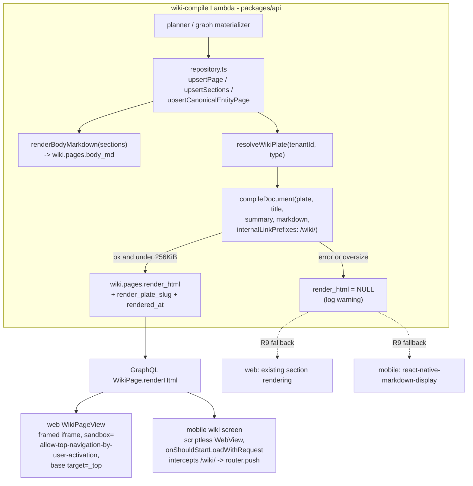

# Wiki HTML Plate Style - Plan

## Goal Capsule

- **Objective:** Wiki pages (Compounding Memory) render in the platform's house-style HTML plate format instead of raw markdown, on both web and mobile.
- **Product authority:** Linear THINK-270 (Eric Odom). The Product Contract below is the requirements contract; the Planning Contract and Implementation Units define how it is built.
- **Stop conditions:** Surface a blocker instead of guessing if implementation contradicts a Key Technical Decision (e.g., the compositor cannot support an internal-link policy without weakening sanitization) or if the render pipeline would require a new Lambda or new reading surface.
- **Execution profile:** Four implementation units, one PR each, dependency order U1 → U2 → {U3, U4}. Each unit is verified end to end against deployed dev in a real browser before its child issue closes.

---

## Product Contract

### Summary

Give every compiled wiki page a derived, self-contained HTML plate render — produced by the existing Document Compositor from the page's compiled sections — and make the web and mobile wiki readers display that render through the existing plate reader surfaces. Wiki page types (entity, topic, decision) get their own platform plates in the plate registry; markdown sections remain the canonical compiled form.

### Problem Frame

The Compounding Memory wiki stores compiled pages as markdown (`wiki.pages.body_md` plus `wiki.page_sections` rows), and each client renders that markdown its own way: the web full-page reader (`apps/web/src/components/memory/WikiPageView.tsx`) hand-renders structured sections after deliberately avoiding the prose renderer for readability reasons, and mobile (`apps/mobile/app/wiki/[type]/[slug].tsx`) pushes each section through `react-native-markdown-display`. The result is visually flat, inconsistent across clients, and far below the polish of the platform's document artifacts.

Meanwhile the platform already owns a mature report presentation: code-defined plates (THINK-153) resolved through the plate registry, compiled by the deterministic Document Compositor v2 (THINK-154) into sanitized, scriptless, theme-aware single-file HTML, with a framed web reader and a JS-disabled mobile WebView reader (`apps/mobile/lib/document-frame.ts`). Wiki pages are the most-read knowledge surface in the product and the only major reading surface not using it.

### Key Decisions

- **Plate render is derived, compile-time output; markdown stays canonical.** The wiki is a rebuildable derived store materialized from Hindsight memory by the `wiki-compile` pipeline. The plate render is one more derived representation produced at compile time from the compiled sections — never hand-authored, never the source of truth. Rebuilding or recompiling a page regenerates its render.
- **One platform plate per wiki page type, not one generic plate.** Entity, topic, and decision pages have different section semantics (`wiki.pages.type` "describes page shape"), and the plate contract (THINK-183 section specs) exists precisely to encode per-genre section structure. Three wiki plates beat one generic plate that flattens the distinction. Specialized plates per entity subtype or ontology class are deferred (see Scope Boundaries).
- **Wiki pages do not become document artifacts.** No `document-emission` path, no artifact rows, no S3 artifact cards. Documents-as-memory (THINK-152/193) deliberately never ingests compositor output; wiki pages derive _from_ memory, so routing them through the artifact pipeline would create a store-and-ingest loop and conflate two lifecycles. The wiki keeps its own tables; only the compositor and plate registry are reused.
- **Reuse the existing reader surfaces, not new ones.** Web displays the render with the same framed presentation the HTML-report reader uses; mobile displays it in the existing scriptless document-frame WebView envelope. No new rendering stack on either client.
- **Both clients ship in v1** (resolved product fork): the mobile scriptless WebView envelope already exists and the markdown path remains as the R9 fallback, so the mobile increment is small.

### Requirements

**Rendering and storage**

- R1. Every compiled wiki page carries a house-style plate render: self-contained, sanitized, scriptless HTML derived from its compiled sections via the Document Compositor.
- R2. The plate render honors the compositor's existing guarantees — deterministic output, no scripts or SVG, inert external URLs, light/dark theme tokens.
- R3. Markdown sections (`wiki.page_sections`) remain the canonical compiled form; the render is regenerated whenever a page's sections change through the compile pipeline.

**Plate definitions**

- R4. Three platform plates — one each for entity, topic, and decision pages — are registered in the plate registry, with section specs mapped from the wiki section vocabulary for each page type.
- R5. Tenant palette customization applies to wiki plates through the existing plate-registry delta mechanism; section-spec editing for wiki plates is not exposed in v1.

**Reading surfaces**

- R6. The web full-page wiki reader displays the plate render using the framed presentation pattern of the HTML-report reader; the search palette and entity dossier continue to open pages into it unchanged.
- R7. The mobile wiki reader displays the plate render in the scriptless document-frame WebView, replacing the native markdown rendering path.
- R8. In-wiki links (`/wiki/<type>/<slug>`) inside a rendered page navigate in-app on both clients, despite the render itself being scriptless; external links stay inert per compositor policy.
- R9. A page with no render available falls back to the current markdown/section rendering path on both clients.

**Regeneration**

- R10. `thinkwork wiki rebuild` (and the normal compile path) regenerates plate renders for all existing pages; no manual per-page backfill is required to migrate the existing wiki.

### Acceptance Examples

- AE1. **Covers R3, R10.** Given an existing wiki entity page compiled before this feature, when the operator runs `thinkwork wiki rebuild` (or the page's sections are next updated by a compile job), then the page gains a plate render and both readers display it.
- AE2. **Covers R8.** Given a topic page whose render contains a link to `/wiki/entity/acme-corp`, when the user taps or clicks it in either reader, then the app navigates to that wiki page in-app; a link to an external URL does not navigate.
- AE3. **Covers R9.** Given a page whose render is missing (compile failure or not yet regenerated), when a user opens it, then the reader shows the current markdown/section rendering rather than an error or blank frame.
- AE4. **Covers R5.** Given a tenant with a custom document palette, when a user views a wiki page, then the wiki plate reflects the tenant palette the same way document plates do.

### Scope Boundaries

Deferred for later:

- Specialized wiki plates per entity subtype or ontology/knowledge-model class (the issue's "specialized wiki plates for certain topics"). The per-type plates plus the registry's tenant-delta mechanism are the extension point; adding subtype plates later is registry configuration, not rearchitecture.
- Tenant-editable section contracts for wiki plates (content-contract editor integration).
- Restyling the search palette results, entity dossier card, or graph views — only the full-page readers change.
- Structured relationship badges inside the plate render. The web reader's current regex-parsed `NodeBadge` treatment of the `relationships` section renders as plain prose in the plate; a wiki-specific directive for relationship rows is a follow-up.

Outside this feature's identity:

- Wiki pages as document artifacts (emission, artifact rows, thread cards).
- Ingesting wiki plate renders back into memory.
- Changes to the compile pipelines' content decisions (planner/graph) — this feature changes presentation, not what gets written.

### Sources / Research

- Wiki derived store and section model: `packages/database-pg/src/schema/wiki.ts`; compile entry `packages/api/src/handlers/wiki-compile.ts`; pipeline libs `packages/api/src/lib/wiki/`.
- Plate system: `packages/api/src/lib/artifacts/plate-definitions.ts` (registry, THINK-153), `document-compositor.ts` and `document-templates.ts` (THINK-154), `plate-registry.ts` (resolution), tenant deltas in `packages/database-pg/src/schema/document-plates.ts`.
- Current readers: `apps/web/src/components/memory/WikiPageView.tsx` (THINK-263 U5), `apps/mobile/app/wiki/[type]/[slug].tsx`, mobile envelope `apps/mobile/lib/document-frame.ts`.
- Prior art: `docs/plans/2026-07-05-004-feat-plate-registry-tenant-genres-plan.md`, `docs/plans/2026-07-06-001-feat-documents-as-memory-plan.md` (why wiki pages must not become artifacts).
- Institutional learnings: `docs/solutions/database-issues/brain-enrichment-approval-must-sync-wiki-sections-2026-05-02.md` (render must derive from `page_sections`, the canonical form), `docs/solutions/workflow-issues/manually-applied-drizzle-migrations-drift-from-dev-2026-04-21.md` (hand-rolled migration discipline), `docs/solutions/best-practices/mobile-sub-screen-headers-use-detail-layout-2026-04-23.md` (mobile reader keeps `DetailLayout`).

---

## Planning Contract

Product Contract preservation: unchanged, except the two Outstanding Questions were resolved per their recommended answers (both clients in v1; per-type plates) and folded into Key Decisions, and one deferred item (relationship-badge styling) was added to Scope Boundaries.

### Key Technical Decisions

- KTD1. **Render is stored as nullable columns on `wiki.pages`, not a sibling table or S3.** New columns `render_html text`, `render_plate_slug text`, `rendered_at timestamptz`. The render is regenerated inside the same repository write paths that already rewrite `body_md`, so a column keeps it transactionally consistent with the sections it derives from, keeps the read path a plain GraphQL field (no S3 round-trip like `Artifact.renderHtml`), and stays trivially rebuildable. Renders are bounded (KTD6) and Postgres TOASTs large text; the wiki is a derived store, so storage-bloat risk is capped by the page count.
- KTD2. **Regeneration hooks the existing `body_md` rewrite seam in `packages/api/src/lib/wiki/repository.ts`.** `upsertPage`, `upsertCanonicalEntityPage`, and `upsertSections` all already assemble full-page markdown via `renderBodyMarkdown(sections)` — `upsertSections` even re-reads all sections after an incremental patch to rewrite `body_md`. The plate render is produced at those same points from the same assembled markdown. This answers the deferred "incremental regeneration trigger" question: every write path funnels through this seam, so no new trigger, queue, or hook is needed. Render compilation is pure and LLM-free (compositor is deterministic), so the added latency per page write is milliseconds.
- KTD3. **Render generation is best-effort; failure degrades to fallback, never fails the compile.** If plate resolution throws, `compileDocument` returns `ok: false` (its primary failure channel — it returns diagnostics rather than throwing for compile rejections), or the output exceeds the size cap (KTD6), the page persists with `render_html = NULL` and the diagnostics logged. R9's fallback path makes NULL safe on both clients. Compile jobs must never fail because presentation failed.
- KTD4. **Wiki plates live in a separate code-defined list (`WIKI_PLATES`), not in `PLATFORM_PLATES`.** Slugs `wiki-entity`, `wiki-topic`, `wiki-decision` in `plate-definitions.ts`, with section specs mapped from `packages/api/src/lib/wiki/templates.ts` vocabulary (entity: overview/notes/visits/related; topic: summary/highlights/related_entities/recent; decision: context/decision/rationale/consequences) at `suggested` tier — the graph-materializer source emits a different vocabulary (overview/relationships), so specs must be advisory, not required. Keeping wiki plates out of `PLATFORM_PLATES` excludes them from `emit_document` dispatch, `listPlates` composer surfaces, and plate-preview UX without new hidden-flag machinery. A dedicated `resolveWikiPlate(tenantId, pageType)` in `plate-registry.ts` reuses the existing layering (`resolveFromLayers`) so tenant document palettes and `document_plates` `platform_override` rows still apply — satisfying R5 with the existing delta mechanism.
- KTD5. **The compositor gains an opt-in internal-link policy with route-shape validation.** Today `isInertHref` degrades every non-`#`/`mailto:` link to inline code text. `CompileDocumentInput` gets an optional internal-link policy: a candidate href is resolved against a fixed synthetic base (dot-segment normalization, mirroring mobile's `extractWikiPath` `new URL(...).pathname` pattern) and survives as a real anchor only when the normalized path matches `^/wiki/(entity|topic|decision)/[^/]+$` — enum-bound type, single slug segment. A bare `startsWith("/wiki/")` check is insufficient: `/wiki/../admin` would otherwise pass and, under KTD7's relaxed sandbox, resolve on click into an arbitrary same-origin route. Everything else keeps the existing inert treatment. This gate is the sole control on web navigation targets (the frame CSP does not constrain top-level navigation), so its tests are load-bearing. Default is unchanged (no policy), so document-artifact output stays byte-identical — golden-parity tests prove it.
- KTD6. **Renders reuse the document render size discipline.** If compositor output exceeds `DOCUMENT_RENDER_MAX_BYTES` (256 KiB), skip persisting the render (KTD3 fallback). This also resolves the deferred "embed full page vs per-section assembly" question: full-page render, with the cap plus fallback covering pathological pages.
- KTD7. **Web link navigation: relaxed frame sandbox + `<base target="_top">`; mobile: WebView request interception.** The web wiki frame renders through the `DocumentFrame` presentation with `sandbox="allow-top-navigation-by-user-activation"` (instead of `sandbox=""`) and a `<base target="_top">` injected into the envelope, so a user click on a `/wiki/...` anchor navigates the top window into the SPA route. Named compromise: this is a full SPA reload on web wiki-link clicks in v1 — acceptable because it is scriptless (no postMessage surface, no `allow-scripts`) and the route rehydrates state. Mobile intercepts in `onShouldStartLoadWithRequest`: `/wiki/<type>/<slug>` requests cancel the WebView load and dispatch `router.push` (reusing the existing `extractWikiPath` mapping), so mobile navigation stays native with no reload. External links never navigate on either client (compositor makes them inert before the frame is even involved).
- KTD8. **Tenant palettes bake into the stored render at compile time.** A tenant palette change applies to a wiki page on its next compile/rebuild/backfill — the same semantics document artifacts already have (their backfill script exists for the same reason). Not a regression; documented behavior.
- KTD9. **Schema change ships as a hand-rolled migration on the `wiki` schema.** Wiki tables live in the `wiki.*` Postgres schema (extracted in migration 0089) and all post-journal wiki changes are hand-rolled SQL with `-- creates-column:` markers, applied via psql. The "only touch public schema" rule does not apply to wiki-owned tables. The migration must be applied to dev before the PR merges or the `db:migrate-manual` drift gate fails the deploy.

### High-Level Technical Design

### Assumptions

Recorded autonomously (headless planning run):

- A full-page reload on web in-wiki link clicks is an acceptable v1 compromise (KTD7); if it proves annoying, a follow-up can move the web reader to an interception scheme without touching the stored renders.
- Wiki plate section specs are advisory (`suggested` tier) so both the planner section vocabulary and the graph-materializer vocabulary compile without conformance friction (KTD4).
- The render column lives on `wiki.pages` only; per-section renders are not stored (KTD1, KTD6).
- Wiki section markdown contains no `tw:` directive fences; wiki plates set `allowedDirectives: []`, so a stray fence produces a `DIRECTIVE_GENRE_RESTRICTED` compile error and that page's render nulls to the R9 fallback (acceptable: the canonical markdown remains readable).
- Detail-only exposure of `renderHtml` (the `wikiPage` query) is sufficient; list surfaces (`wikiSearch`, graph, dossier) never need the render.

### Sequencing

U1 (compositor + plates, no consumers) → U2 (persistence + GraphQL + backfill) → U3 (web reader) and U4 (mobile reader) in parallel. U3/U4 verification needs U2 deployed to dev and dev wiki data backfilled or rebuilt.

---

## Implementation Units

### U1. Wiki plates and compositor internal-link policy

- **Goal:** The plate system can produce a wiki-page render: three wiki plate definitions exist, resolvable with tenant deltas, and the compositor can preserve in-wiki links while keeping everything else inert.
- **Requirements:** R2, R4, R5, R8 (policy half), KTD4, KTD5.
- **Dependencies:** none.
- **Files:**
  - `packages/api/src/lib/artifacts/plate-definitions.ts` — add `WIKI_PLATES` (`wiki-entity`, `wiki-topic`, `wiki-decision`) with eyebrows, per-type accent palettes (light/dark), `allowedDirectives: []`, and `suggested`-tier section specs mapped from `packages/api/src/lib/wiki/templates.ts`.
  - `packages/api/src/lib/artifacts/plate-registry.ts` — `resolveWikiPlate(tenantId, pageType, store?)` layering platform wiki def → tenant document palette → `document_plates` overrides; wiki slugs excluded from `listPlates`/dispatch/emission visibility.
  - `packages/api/src/lib/artifacts/document-compositor.ts` — optional internal-link policy on `CompileDocumentInput`; link handling honors it in the marked renderer's inert-href gate with the KTD5 normalization + route-shape check.
  - `packages/api/src/lib/artifacts/document-compositor.test.ts`, `packages/api/src/lib/artifacts/plate-registry.test.ts` — extend.
- **Approach:** Follow the existing `BUSINESS_PLATES` shape for definitions. `resolveWikiPlate` maps page type → wiki plate slug and delegates to the existing `resolveFromLayers`, so R5 comes free. The link policy is parse-time (where `isInertHref` currently fires), not a sanitizer change: `sanitize-html` config already permits `href`; only root-relative hrefs starting with an allowed prefix pass through, and they render with no scheme, no host, no target attribute (the envelope owns targeting).
- **Patterns to follow:** `qbr`/`proposal` plate definitions (palette + sections shape); `resolvePlatformPlate`/`resolvePlate` structure; golden-parity fixtures in `packages/api/src/lib/artifacts/__fixtures__/`.
- **Test scenarios:**
  - Compile with the wiki link policy: `[Acme](/wiki/entity/acme-corp)` survives as an anchor with exactly that href; `[x](https://evil.example)` still degrades to inline code; `[y](/other/path)` still degrades; `javascript:` and protocol-relative (`//host/wiki/...`) hrefs still degrade.
  - Traversal and shape rejection: `/wiki/../admin`, `/wiki/./../x`, `/wiki/bogus-type/x`, and `/wiki/entity/a/b` all degrade to inert text exactly like external URLs (normalized-path + route-shape check, KTD5).
  - Compile without the option: output byte-identical to before the change (golden-parity fixtures unchanged).
  - Determinism: two compiles of the same wiki input produce identical bytes.
  - `resolveWikiPlate` applies a tenant document palette to `tokensLight`/`tokensDark`; a `platform_override` row for `wiki-entity` merges; an unknown page type returns an error/null.
  - `listPlates(tenantId)` and emission visibility exclude wiki slugs.
- **Verification:** `pnpm --filter @thinkwork/api test` green including untouched golden fixtures. User-flow proof is deferred to U3/U4 (this unit has no user-visible surface); completeness here = unit tests plus a locally compiled sample wiki page render inspected in a browser file load for plate styling, dark/light tokens, and live wiki anchors.

### U2. Render persistence, GraphQL exposure, and backfill

- **Goal:** Every wiki page write path persists a plate render alongside `body_md`; clients can fetch it; existing pages can be backfilled without an LLM recompile.
- **Requirements:** R1, R2, R3, R10, AE1; KTD1, KTD2, KTD3, KTD6, KTD8, KTD9.
- **Dependencies:** U1.
- **Files:**
  - `packages/database-pg/drizzle/NNNN_wiki_page_render.sql` (next free number) — hand-rolled, `-- creates-column: wiki.pages.render_html` etc., psql-apply header, BEGIN/COMMIT.
  - `packages/database-pg/src/schema/wiki.ts` — add `render_html`, `render_plate_slug`, `rendered_at` to `wikiPages`.
  - `packages/api/src/lib/wiki/repository.ts` — render generation in `upsertPage`, `upsertCanonicalEntityPage`, and `upsertSections` (at the existing post-patch `body_md` rewrite); shared helper (e.g., `composeWikiPageRender`) that resolves the plate, compiles, enforces the byte cap, and returns HTML or null.
  - `packages/database-pg/graphql/types/wiki.graphql` — `renderHtml: String` on `WikiPage`.
  - `packages/api/src/graphql/resolvers/wiki/wikiPage.query.ts` + `mappers.ts` — expose `renderHtml` on the detail query only.
  - `packages/api/scripts/backfill-wiki-renders.ts` — operator script iterating pages with sections, recompiling renders from stored sections (compositor-only; no Bedrock), mirroring `packages/api/scripts/backfill-document-renders.ts`. This does not contradict R10 — `thinkwork wiki rebuild` and the normal compile path do regenerate renders on their own; the script is a batch operational shortcut that migrates existing pages without paying for a full LLM recompile, and is not per-page manual work.
  - Codegen outputs in `apps/web`, `apps/mobile`, `apps/cli`, `packages/api` (run each package's `codegen`; `pnpm schema:build` for the AppSync schema).
  - Tests: extend `packages/api/src/__tests__/wiki-*.test.ts` (or sibling new file) for the repository seam.
- **Approach:** The helper takes `(tenantId, pageType, title, summary, sections)` and produces `{html, plateSlug} | null`. Call it wherever `renderBodyMarkdown` output is persisted, inside the same transaction. Wrap in try/catch: any throw or oversize result → persist NULL render + `console.warn` with page id (KTD3). `upsertSections` already re-reads all sections after a patch — feed that same list to the helper. The `wiki-compile` Lambda already inlines `packages/api` code and bundles `marked`/`sanitize-html` (pure JS), so no `build-lambdas.sh` changes expected.
- **Execution note:** Apply the migration to dev via psql before merging the PR — the `db:migrate-manual` drift gate blocks deploys on missing declared objects.
- **Test scenarios:**
  - Covers AE1/R3: `upsertSections` patching one section regenerates `render_html` reflecting the new content and updates `rendered_at`.
  - `upsertPage` with sections produces non-null `render_html` containing the plate shell (`tw-plate` meta with the right wiki slug) and all section headings.
  - Compositor failure: plate resolution throws → page row persists, `render_html` NULL, no exception escapes; `compileDocument` returning `ok: false` (e.g., a stray `tw:` fence under `allowedDirectives: []`) → same NULL-render outcome with diagnostics logged.
  - Oversize render (mock cap) → NULL render, page persists.
  - Page with zero sections → NULL render (nothing to compose), no error.
  - GraphQL `wikiPage` returns `renderHtml`; `wikiSearch` results do not carry it.
  - Backfill script over a fixture set: pages with sections gain renders; already-rendered pages are idempotent (deterministic compositor → same bytes).
- **Verification:** `pnpm --filter @thinkwork/api test`, `pnpm --filter @thinkwork/database-pg build`, monorepo `pnpm typecheck`; migration applied to dev and `pnpm db:migrate-manual` reports the new columns present. End-to-end proof on deployed dev: run `thinkwork wiki compile` (or wait for a scheduled compile) for one agent, then query `wikiPage.renderHtml` via the dev GraphQL endpoint and confirm a sanitized HTML document comes back; run the backfill script against dev and confirm previously compiled pages gain renders (AE1, R10).

### U3. Web wiki reader renders the plate

- **Goal:** The web full-page wiki reader displays the plate render in a framed presentation with working in-wiki navigation and markdown fallback.
- **Requirements:** R6, R8, R9, AE2, AE3, AE4; KTD7.
- **Dependencies:** U2 (deployed to dev for verification).
- **Files:**
  - `apps/web/src/lib/graphql-queries.ts` — add `renderHtml` to `ComputerWikiPageQuery`.
  - `apps/web/src/components/memory/WikiPageView.tsx` — when `renderHtml` present, render the framed plate (reusing `withDocumentFrameEnvelope` from `apps/web/src/components/workbench/DocumentFrame.tsx`, with the wiki sandbox variant and injected `<base target="_top">`); otherwise keep the existing section rendering unchanged.
  - `apps/web/src/components/workbench/DocumentFrame.tsx` — accept optional sandbox/base-target props (or add a thin `WikiPlateFrame` wrapper; implementer's choice, keep document-artifact call sites byte-identical in behavior).
  - Tests: `apps/web/src/components/memory/WikiPageView.test.tsx` (new or extended), `DocumentFrame.test.tsx` extension for the new props.
- **Approach:** The frame keeps `srcDoc` + CSP envelope + theme stamping; only the sandbox token set changes for the wiki call site (`allow-top-navigation-by-user-activation`). Header, breadcrumbs, `RelatedMemories`, and the search-palette/dossier navigation (`ChatSidebar.openSearchWiki`, `EntityDossierCard`) are untouched — they navigate to the same route (R6).
- **Test scenarios:**
  - Covers AE3/R9: `renderHtml` null + sections present → existing section rendering (assert a known section heading renders); `renderHtml` present → iframe with `data-testid="document-frame"` (or wiki variant) and no section markup.
  - Frame sandbox attribute is exactly `allow-top-navigation-by-user-activation` for wiki, and `DocumentFrame`'s artifact call sites still render `sandbox=""`.
  - Envelope output contains `<base target="_top">` for wiki and not for artifacts.
  - Theme: envelope stamps `data-theme` matching app theme.
- **Verification (real browser against deployed dev):** Sign in to dev web; open the search palette, search an entity, open its wiki page — plate render displays with house styling in both light and dark themes (AE4 if a tenant palette is set); click an in-wiki link inside the render — the app lands on the target wiki page (AE2); confirm an external URL in a page renders as inert text and does not navigate; open a page known to lack a render — markdown/section fallback displays (AE3); open a wiki page from the entity dossier — same reader, unchanged entry points (R6).

### U4. Mobile wiki reader renders the plate

- **Goal:** The mobile wiki screen displays the plate render in the scriptless document-frame WebView with native in-wiki navigation and markdown fallback.
- **Requirements:** R7, R8, R9, AE2, AE3; KTD7.
- **Dependencies:** U2 (deployed to dev for verification).
- **Files:**
  - `apps/mobile/lib/graphql-queries.ts` (and SDK query if `useWikiPage` lives in `packages/react-native-sdk`) — fetch `renderHtml`.
  - `apps/mobile/app/wiki/[type]/[slug].tsx` — when `renderHtml` present, render `WebView` with `withDocumentFrameEnvelope(renderHtml, theme)`, `javaScriptEnabled={false}`, and a `source` carrying an explicit synthetic `baseUrl` (e.g., `https://wiki.thinkwork.internal/`) — without one, root-relative hrefs resolve against `about:blank` and a tap may never produce a request for `onShouldStartLoadWithRequest` to intercept. The request policy allows the initial-load URL (`about:*` plus the synthetic base), intercepts requests whose pathname matches `/wiki/<type>/<slug>` (reuse `extractWikiPath`, which parses absolute URLs via `pathname`) into `router.push` with the current `userId` param, and blocks everything else; otherwise keep the `react-native-markdown-display` path.
  - `apps/mobile/lib/document-frame.ts` — only if envelope tweaks are needed (expect none).
  - Tests: unit-test the request-policy predicate (extracted as a pure function) and `extractWikiPath` reuse; screen-level snapshot if the suite supports it.
- **Approach:** Mirror `apps/mobile/app/artifacts/[id].tsx` (originWhitelist, hidden-until-`onLoadEnd`, `setSupportMultipleWindows={false}`), keep `DetailLayout` header per the mobile sub-screen convention, and keep the summary/backlinks/connected-pages/sources chrome outside the WebView. The WebView shows only the plate body; surrounding native cards stay native.
- **Test scenarios:**
  - Request policy: `about:blank` and the synthetic base URL → allow; a resolved `https://wiki.thinkwork.internal/wiki/entity/acme` request → cancel + `router.push('/wiki/ENTITY/acme?userId=...')` with uppercase type segments (matching `extractWikiPath` normalization and the `isWikiPageType` guard — the mobile router rejects lowercase); `https://external.example` → blocked, no navigation; malformed `/wiki/bogus-type/x` → blocked.
  - Covers AE3/R9: `renderHtml` null → markdown path renders sections; present → WebView present and markdown absent.
  - Theme token passed to the envelope matches the app color scheme.
- **Verification (real device/simulator against deployed dev):** Open a wiki entity page from mobile search — plate render displays inside the scriptless WebView with correct theme; tap an in-wiki link — confirm the tap actually produces an intercepted request (the baseUrl-resolution behavior no unit test can prove) and native navigation pushes the target wiki screen, no browser or reload (AE2); external link tap does nothing; open an un-rendered page — markdown fallback (AE3); confirm backlinks/connected-pages cards still navigate; verify no regression on the artifacts reader screen.

---

## Verification Contract

| Gate | Command / flow | Applies to |
|---|---|---|
| API tests | `pnpm --filter @thinkwork/api test` | U1, U2 |
| Web tests + typecheck | `pnpm --filter @thinkwork/web test`, `pnpm -r --if-present typecheck` | U3 (typecheck all units) |
| Mobile tests | `pnpm --filter @thinkwork/mobile test` (or the package's suite) | U4 |
| Codegen freshness | `pnpm --filter @thinkwork/<pkg> codegen` in api/web/mobile/cli after the GraphQL change; `pnpm schema:build` | U2 |
| Migration drift gate | psql-apply `NNNN_wiki_page_render.sql` to dev, then `pnpm db:migrate-manual` shows columns present | U2 |
| Pre-commit | `pnpm lint && pnpm typecheck && pnpm test && pnpm format:check` | all |
| Browser flows | The per-unit Verification flows above, driven against deployed dev (web: real browser; mobile: simulator/device or Expo web) | U2–U4 |

Golden-parity fixtures for document artifacts must remain byte-identical through U1 — any fixture churn is a regression, not an update.

## Definition of Done

- All four units merged to main via one PR each, post-merge Deploy runs green, and the U2 migration is applied to dev with the drift gate passing.
- AE1–AE4 each observed on deployed dev (AE1 via compile or backfill; AE2 on both clients; AE3 on both clients; AE4 with a tenant palette set).
- Document-artifact rendering (compositor goldens, artifact readers web + mobile) verified unregressed.
- No dead experimental code left behind; fallback markdown paths remain intact on both clients (they are the R9 contract, not legacy to delete).
